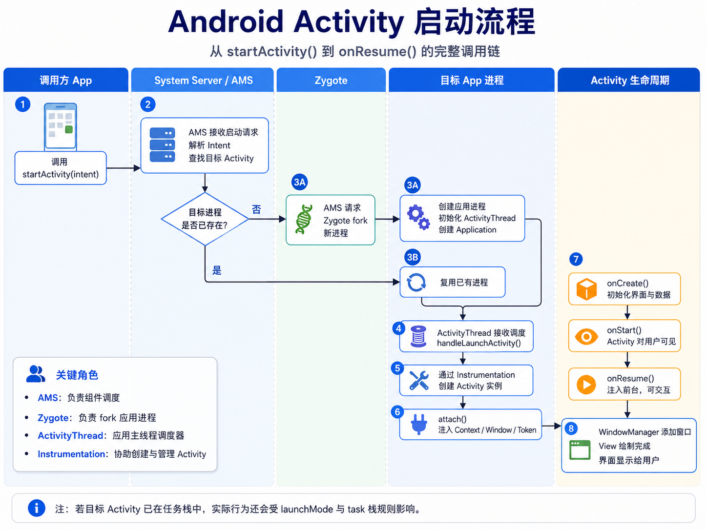
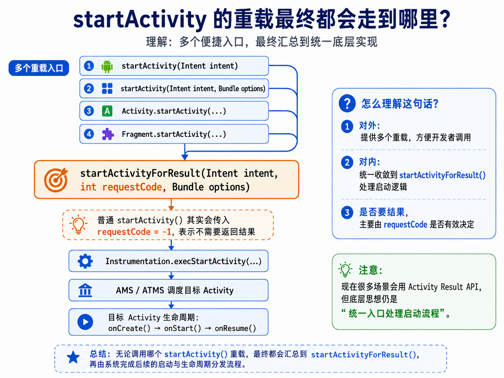

# activity的启动流程

让gpt画了一张流程图，挺清晰的



启动Activity时，会调用一个startActivity来启动一个activity，该方法有很多重载版本，比如：

```typescript
startActivity(Intent intent)
startActivity(Intent intent, Bundle options)
```

上面对开发者暴露的接口不同，方便传递额外参数或者启动模式，但底层实现都是

```typescript
startActivityForResult(Intent intent, int requestCode, Bundle options)
```



# **`startActivityForResult()`**

```java
public void startActivityForResult(@RequiresPermission Intent intent, int requestCode,
        @Nullable Bundle options) {
    if (mParent == null) {
        options = transferSpringboardActivityOptions(options);
        Instrumentation.ActivityResult ar =
            mInstrumentation.execStartActivity(
                this, mMainThread.getApplicationThread(), mToken, this,
                intent, requestCode, options);
        if (ar != null) {
            mMainThread.sendActivityResult(
                mToken, mEmbeddedID, requestCode, ar.getResultCode(),
                ar.getResultData());
        }
        if (requestCode >= 0) {
            // If this start is requesting a result, we can avoid making
            // the activity visible until the result is received.  Setting
            // this code during onCreate(Bundle savedInstanceState) or onResume() will keep the
            // activity hidden during this time, to avoid flickering.
            // This can only be done when a result is requested because
            // that guarantees we will get information back when the
            // activity is finished, no matter what happens to it.
            mStartedActivity = true;
        }

        cancelInputsAndStartExitTransition(options);
        // TODO Consider clearing/flushing other event sources and events for child windows.
    } else {
        if (options != null) {
            mParent.startActivityFromChild(this, intent, requestCode, options);
        } else {
            // Note we want to go through this method for compatibility with
            // existing applications that may have overridden it.
            mParent.startActivityFromChild(this, intent, requestCode);
        }
    }
}
```

## 三个参数：

```typescript
Intent intent
```

表示你要启动谁，比如：

```typescript
Intent intent = new Intent(this, SecondActivity.class);
```

隐式启动：

```typescript
Intent intent = new Intent(Intent.ACTION_VIEW, uri);
```

```typescript
int requestCode
```

表示你是否希望目标 Activity 返回结果。

普通启动：

```typescript
startActivity(intent);
```

底层等价于，意思是**我不需要返回任何结果**

```typescript
startActivityForResult(intent, -1, null);
```

老写法

```typescript
startActivityForResult(intent, 100);
```

那么 `requestCode = 100`，意思是：**我希望目标 Activity 结束时把结果返回给我。**

```typescript
Bundle options
```

额外启动参数，常见用于转场动画、多窗口、ActivityOptions 等。

比如：

```typescript
ActivityOptions options = ActivityOptions.makeSceneTransitionAnimation(this);
startActivity(intent, options.toBundle());
```

## 第一层判断：有没有父Activity

```typescript
if (mParent == null) {
    ...
} else {
    ...
}
```

这里的 `mParent` 可以简单理解成：**当前 Activity 有没有父级 Activity。**

## 真正的关键：execStartActivity（这段代码的核心）

```typescript
Instrumentation.ActivityResult ar =
    mInstrumentation.execStartActivity(
        this,
        mMainThread.getApplicationThread(),
        mToken,
        this,
        intent,
        requestCode,
        options);
```

`startActivityForResult()` 最终把启动请求交给：

```typescript
mInstrumentation.execStartActivity(...)
```

也就是说：

**Activity 调用 startActivityForResult，真正往系统发启动请求的是 Instrumentation。**

你可以把 `Instrumentation` 理解成：

Activity 和系统之间的一个“代理/中间人”，负责帮 Activity 执行启动、生命周期、测试插桩等操作。

### 看他传了那些东西

第一个this，是指当前的activity

第二个mMainThread.getApplicationThread()是当前应用进程和系统通信的Binder对象，简单理解就是，系统回调这个app，让他做事，就是通过这个对象找到app主线程

第三个参数mToken是当前Activity在系统里的身份令牌，就是系统对activity的token表示，因为系统里可能有很多 Activity，不能只靠对象引用，需要一个跨进程可识别的 token

第四个参数this，再次传入当前activity，做为结果接收者

第五个参数intent，是启动目标的信息

第六个参数requestcode，是是否需要返回结果，只要大于等于0，就是说明需要返回结果，0则是不需要

第七个参数options，启动附加参数

## 代码的主流程可以总结成这样

```typescript
startActivityForResult(intent, requestCode, options)
        |
        v
判断 mParent 是否为空
        |
        |-- mParent == null：普通 Activity 主流程
        |       |
        |       v
        |   处理 options
        |       |
        |       v
        |   Instrumentation.execStartActivity(...)
        |       |
        |       v
        |   如果 ar != null，直接派发结果
        |       |
        |       v
        |   如果 requestCode >= 0，标记 mStartedActivity = true
        |       |
        |       v
        |   取消输入事件，启动退出动画
        |
        |-- mParent != null：交给父 Activity 的 startActivityFromChild()
```

**`startActivityForResult()`**** 真正做的事，就是把启动请求交****`Instrumentation.execStartActivity()`****，然后由系统继续完成 Activity 启动。**

也就是说，`Activity` 自己并不会真的创建另一个 `Activity`，它只是发起请求。

mParent代表的是继承至Activity的ActivityGroup类，它用来在一个界面中嵌入多个Activity，但是现在已经废弃，系统推荐使用`Fragment`来代替。我们接下来看一下

# `mInstrumentation.execStartActivity`方法：

是 Activity 启动请求真正“出 App 进程、进系统服务”的地方。

```java
public ActivityResult execStartActivity(
        Context who, IBinder contextThread, IBinder token, Activity target,
        Intent intent, int requestCode, Bundle options) {
    IApplicationThread whoThread = (IApplicationThread) contextThread;
    Uri referrer = target != null ? target.onProvideReferrer() : null;
    if (referrer != null) {
        intent.putExtra(Intent.EXTRA_REFERRER, referrer);
    }
    if (mActivityMonitors != null) {
        synchronized (mSync) {
            final int N = mActivityMonitors.size();
            for (int i=0; i<N; i++) {
                final ActivityMonitor am = mActivityMonitors.get(i);
                if (am.match(who, null, intent)) {
                    am.mHits++;
                    if (am.isBlocking()) {
                        return requestCode >= 0 ? am.getResult() : null;
                    }
                    break;
                }
            }
        }
    }
    try {
        intent.migrateExtraStreamToClipData();
        intent.prepareToLeaveProcess(who);
        int result = ActivityManagerNative.getDefault()
            .startActivity(whoThread, who.getBasePackageName(), intent,
                    intent.resolveTypeIfNeeded(who.getContentResolver()),
                    token, target != null ? target.mEmbeddedID : null,
                    requestCode, 0, null, options);
        checkStartActivityResult(result, intent);
    } catch (RemoteException e) {
        throw new RuntimeException("Failure from system", e);
    }
    return null;
}
```

## 拿到ApplicationThread

```typescript
IApplicationThread whoThread = (IApplicationThread) contextThread;
```

这里把 `IBinder` 转成：

```text
IApplicationThread
```

可以把它理解为：当前 App 进程暴露给系统服务 AMS 的一个 Binder 接口。

后半段回调 App 时，就靠 `IApplicationThread`。

## 真正进入 AMS：startActivity()

```typescript
int result = ActivityManagerNative.getDefault()
    .startActivity(
        whoThread,
        who.getBasePackageName(),
        intent,
        intent.resolveTypeIfNeeded(who.getContentResolver()),
        token,
        target != null ? target.mEmbeddedID : null,
        requestCode,
        0,
        null,
        options);
```

通过 Binder IPC，把启动 Activity 的请求从 App 进程发送到 system_server 进程。

## 代码整体流程

```typescript
Instrumentation.execStartActivity()
        |
        v
拿到 IApplicationThread
        |
        v
给 Intent 添加 referrer 来源信息
        |
        v
检查 ActivityMonitor 是否要拦截
        |
        |-- 如果拦截并 blocking：
        |       直接返回模拟 ActivityResult
        |
        |-- 不拦截：
                |
                v
        整理 Intent 里的流数据
                |
                v
        prepareToLeaveProcess，准备跨进程
                |
                v
        通过 Binder 调用 AMS/ATMS.startActivity()
                |
                v
        AMS/ATMS 开始真正调度 Activity
                |
                v
        检查启动结果
                |
                v
        正常返回 null
```

`Instrumentation.execStartActivity()` 不负责创建 Activity，它负责把启动请求包装好，然后通过 Binder 交给系统服务 AMS/ATMS。

## 接着看AMS的startActivity方法：

```java
@Override
public final int startActivity(IApplicationThread caller, String callingPackage,
        Intent intent, String resolvedType, IBinder resultTo, String resultWho, int requestCode,
        int startFlags, ProfilerInfo profilerInfo, Bundle bOptions) {
    return startActivityAsUser(caller, callingPackage, intent, resolvedType, resultTo,
            resultWho, requestCode, startFlags, profilerInfo, bOptions,
            UserHandle.getCallingUserId());
}

@Override
public final int startActivityAsUser(IApplicationThread caller, String callingPackage,
        Intent intent, String resolvedType, IBinder resultTo, String resultWho, int requestCode,
        int startFlags, ProfilerInfo profilerInfo, Bundle bOptions, int userId) {
    enforceNotIsolatedCaller("startActivity");
    userId = mUserController.handleIncomingUser(Binder.getCallingPid(), Binder.getCallingUid(),
            userId, false, ALLOW_FULL_ONLY, "startActivity", null);
    // TODO: Switch to user app stacks here.
    return mActivityStarter.startActivityMayWait(caller, -1, callingPackage, intent,
            resolvedType, null, null, resultTo, resultWho, requestCode, startFlags,
            profilerInfo, null, null, bOptions, false, userId, null, null);
}
```

这是系统侧的入口，它会补充当前用户信息，然后转到startActivityAsUser() 做安全与多用户检查，最后交给 `ActivityStarter.startActivityMayWait()` 去执行真正的 Activity 启动逻辑。

```typescript
App 进程
------------------------------------------------
Activity.startActivityForResult()
        ↓
Instrumentation.execStartActivity()
        ↓ Binder IPC

system_server 进程
------------------------------------------------
AMS.startActivity()
        ↓
AMS.startActivityAsUser()
        ↓
ActivityStarter.startActivityMayWait()
```

之后的流程就是

```typescript
startActivityMayWait → startActivityLocked -> startActivityUnchecked -> ActivityStackSupervisor#resumeFocusedStackTopActivityLocked -> ActivityStack#resumeTopActivityUncheckedLocked -> resumeTopActivityInnerLocked -> ActivityStackSupervisor#startSpecificActivityLocked -> realStartActivityLocke
```

在 `realStartActivityLocked` 之后，Activity 的启动流程已经进入了 ActivityThread/应用主线程，从系统调度转为应用自身处理

# ActivityThread.performLaunchActivity（）

## 1.从ActivityClientRecord中获取获取待启动Activity的ComponentName

```typescript
ActivityInfo aInfo = r.activityInfo;
if (r.packageInfo == null) {
    r.packageInfo = getPackageInfo(aInfo.applicationInfo, r.compatInfo,
            Context.CONTEXT_INCLUDE_CODE);
}

ComponentName component = r.intent.getComponent();
if (component == null) {
    component = r.intent.resolveActivity(
        mInitialApplication.getPackageManager());
    r.intent.setComponent(component);
}

if (r.activityInfo.targetActivity != null) {
    component = new ComponentName(r.activityInfo.packageName,
            r.activityInfo.targetActivity);
}
```

## 2.通过Instrumentation的newActivity方法使用类加载器创建Activity对象

```java
Activity activity = null;
try {
    java.lang.ClassLoader cl = r.packageInfo.getClassLoader();
    activity = mInstrumentation.newActivity(
            cl, component.getClassName(), r.intent);
    StrictMode.incrementExpectedActivityCount(activity.getClass());
    r.intent.setExtrasClassLoader(cl);
    r.intent.prepareToEnterProcess();
    if (r.state != null) {
        r.state.setClassLoader(cl);
    }
} catch (Exception e) {
    if (!mInstrumentation.onException(activity, e)) {
        throw new RuntimeException(
            "Unable to instantiate activity " + component
            + ": " + e.toString(), e);
    }
}
```

## 3.通过LoadedApk的makeApplication方法尝试创建Application对象

```java
Application app = r.packageInfo.makeApplication(false, mInstrumentation);

// LoaderApk#makeApplication
public Application makeApplication(boolean forceDefaultAppClass,
        Instrumentation instrumentation) {
    if (mApplication != null) {
        return mApplication;
    }

    Trace.traceBegin(Trace.TRACE_TAG_ACTIVITY_MANAGER, "makeApplication");

    Application app = null;

    String appClass = mApplicationInfo.className;
    if (forceDefaultAppClass || (appClass == null)) {
        appClass = "android.app.Application";
    }

    try {
        java.lang.ClassLoader cl = getClassLoader();
        if (!mPackageName.equals("android")) {
            Trace.traceBegin(Trace.TRACE_TAG_ACTIVITY_MANAGER,
                    "initializeJavaContextClassLoader");
            initializeJavaContextClassLoader();
            Trace.traceEnd(Trace.TRACE_TAG_ACTIVITY_MANAGER);
        }
        ContextImpl appContext = ContextImpl.createAppContext(mActivityThread, this);
        app = mActivityThread.mInstrumentation.newApplication(
                cl, appClass, appContext);
        appContext.setOuterContext(app);
    } catch (Exception e) {
        if (!mActivityThread.mInstrumentation.onException(app, e)) {
            Trace.traceEnd(Trace.TRACE_TAG_ACTIVITY_MANAGER);
            throw new RuntimeException(
                "Unable to instantiate application " + appClass
                + ": " + e.toString(), e);
        }
    }
    mActivityThread.mAllApplications.add(app);
    mApplication = app;

    if (instrumentation != null) {
        try {
            instrumentation.callApplicationOnCreate(app);
        } catch (Exception e) {
            if (!instrumentation.onException(app, e)) {
                Trace.traceEnd(Trace.TRACE_TAG_ACTIVITY_MANAGER);
                throw new RuntimeException(
                    "Unable to create application " + app.getClass().getName()
                    + ": " + e.toString(), e);
            }
        }
    }

    // Rewrite the R 'constants' for all library apks.
    SparseArray<String> packageIdentifiers = getAssets(mActivityThread)
            .getAssignedPackageIdentifiers();
    final int N = packageIdentifiers.size();
    for (int i = 0; i < N; i++) {
        final int id = packageIdentifiers.keyAt(i);
        if (id == 0x01 || id == 0x7f) {
            continue;
        }

        rewriteRValues(getClassLoader(), packageIdentifiers.valueAt(i), id);
    }

    Trace.traceEnd(Trace.TRACE_TAG_ACTIVITY_MANAGER);

    return app;
}
```

通过makeApplication的实现可以看出，如果Application已经创建过，那么直接返回改实例。Application对象的创建也是Instrumentation的makeApplication方法，通过类加载器来实现的。然后会调instrumentation.callApplicationOnCreate(app)方法，该方法会调用Application的onCreate()方法。

## 4.创建ContextImpl，然后调用Activity的attach方法完成一些重要元素的初始化

```java
Context appContext = createBaseContextForActivity(r, activity);
CharSequence title = r.activityInfo.loadLabel(appContext.getPackageManager());
Configuration config = new Configuration(mCompatConfiguration);
if (r.overrideConfig != null) {
    config.updateFrom(r.overrideConfig);
}
if (DEBUG_CONFIGURATION) Slog.v(TAG, "Launching activity "
        + r.activityInfo.name + " with config " + config);
Window window = null;
if (r.mPendingRemoveWindow != null && r.mPreserveWindow) {
    window = r.mPendingRemoveWindow;
    r.mPendingRemoveWindow = null;
    r.mPendingRemoveWindowManager = null;
}
activity.attach(appContext, this, getInstrumentation(), r.token,
        r.ident, app, r.intent, r.activityInfo, title, r.parent,
        r.embeddedID, r.lastNonConfigurationInstances, config,
        r.referrer, r.voiceInteractor, window);
```

## 5.调用Activity的一些回调方法

```java
if (r.isPersistable()) {
    mInstrumentation.callActivityOnCreate(activity, r.state, r.persistentState);
} else {
    mInstrumentation.callActivityOnCreate(activity, r.state);
}
if (!activity.mCalled) {
    throw new SuperNotCalledException(
        "Activity " + r.intent.getComponent().toShortString() +
        " did not call through to super.onCreate()");
}
r.activity = activity;
r.stopped = true;
if (!r.activity.mFinished) {
    activity.performStart();
    r.stopped = false;
}
if (!r.activity.mFinished) {
    if (r.isPersistable()) {
        if (r.state != null || r.persistentState != null) {
            mInstrumentation.callActivityOnRestoreInstanceState(activity, r.state,
                    r.persistentState);
        }
    } else if (r.state != null) {
        mInstrumentation.callActivityOnRestoreInstanceState(activity, r.state);
    }
}
if (!r.activity.mFinished) {
    activity.mCalled = false;
    if (r.isPersistable()) {
        mInstrumentation.callActivityOnPostCreate(activity, r.state,
                r.persistentState);
    } else {
        mInstrumentation.callActivityOnPostCreate(activity, r.state);
    }
    if (!activity.mCalled) {
        throw new SuperNotCalledException(
            "Activity " + r.intent.getComponent().toShortString() +
            " did not call through to super.onPostCreate()");
    }
}
```

`mInstrumentation.callActivityOnCreate`会调用Activity的`performCreate`，然后调用`onCreate`方法。 `activity.performStart()`会调用`mInstrumentation.callActivityOnStart`，然后调用`activity.onStart()`方法。 `mInstrumentation.callActivityOnRestoreInstanceState`会调用Activity的`onRestoreInstanceState`方法，然后在调用`onRestoreInstanceState`方法。

# 总结

Activity 的启动流程是一个“App 进程发起请求 → 系统进程 AMS 调度 → 再回到 App 进程创建 Activity 实例并执行生命周期”的完整跨进程闭环。


