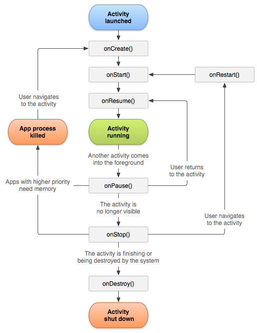

# Activity(活动)

# 一句话

Activity是一种展示组件，用户向用户直接展示一个界面，而且可以接受用户的输入信息从而进行交互。

# 概念：

- 一个 Activity 通常就是一个单独的屏幕(窗口)

- Activity 之间通过 Intent 进行通信。

- Android 应用中每一个 Activity 都必须要在 AndroidManifest.xml 配置文件中声明，否则系统将不识别也不执行该Activity。在 android stdio会自动生成，但 eclipse 需要自己手动添加

# 定义与作用： 

- Activity 的中文意思是 活动，代表手机屏幕的一屏，或是平板电脑中的一个窗口，提供了和用户交互的可视化界面。一个活动开始，代表 Activity 组件启动，活动 结束，代表一个 Activity 的生命周期结束。一个 Android 应用必须通过 Activity 来 运行 和 启动，Activity 的生命周期交给系统统一管理。Activity 是用于处理 UI 相关业务的，比如加载界面、监听用户操作事件。

# 声明


如需声明 Activity，请打开清单文件，然后添加一个 [`<activity>`](https://developer.android.com/guide/topics/manifest/activity-element?hl=zh-cn) 元素作为 [`<application>`](https://developer.android.com/guide/topics/manifest/application-element?hl=zh-cn) 元素的子元素。例如：

```text
<manifest ... >
  <application ... >
      <activity android:name=".ExampleActivity" />
      ...
  </application ... >
  ...
</manifest >
```

此元素唯一的必要属性是 [`android:name`](https://developer.android.com/guide/topics/manifest/activity-element?hl=zh-cn#nm)，该属性用于 指定 Activity 的类名称。您也可以添加用于定义标签、图标或界面主题等 Activity 特征的属性。如需详细了解上述及其他属性，请参阅 [`<activity>`](https://developer.android.com/guide/topics/manifest/activity-element?hl=zh-cn) 元素参考文档。


# 管理 Activity 生命周期

一个 Activity 在其生命周期中会经历多种状态。您可以使用一系列回调来处理状态之间的转换。以下部分将介绍这些回调。在 Compose 应用中，不建议直接挂钩到这些回调。而是使用 Lifecycle API 来观察状态变化。如需了解详情，请参阅[将 Lifecycle 与 Compose](https://developer.android.com/topic/libraries/architecture/compose?hl=zh-cn)集成

为了在 activity 生命周期 的各个 阶段 之间导航 转场 ，`Activity` 类 提供六个 核心 回调 ：[`onCreate`](https://developer.android.com/reference/kotlin/android/app/Activity?hl=zh-cn#oncreate_1)、[`onStart`](https://developer.android.com/reference/kotlin/android/app/Activity?hl=zh-cn#onstart)、[`onResume`](https://developer.android.com/reference/kotlin/android/app/Activity?hl=zh-cn#onresume)、[`onPause`](https://developer.android.com/reference/kotlin/android/app/Activity?hl=zh-cn#onpause)、[`onStop`](https://developer.android.com/reference/kotlin/android/app/Activity?hl=zh-cn#onstop) 和 [`onDestroy`](https://developer.android.com/reference/kotlin/android/app/Activity?hl=zh-cn#ondestroy)。当 activity 进入新状态时，系统会调用其中每个回调。



## onCreate

次回调是必须实现的，会在系统创建Activity时触发，你的实现婴爱初始化Activity的基本组件

列如：你的应用应该在此处创建视图并将数据绑定到列表。

在 Compose 应用中，使用此回调通过 `setContent` 设置宿主可组合项，如下所示：

```text
class MyActivity : ComponentActivity() {    override fun onCreate(savedInstanceState: Bundle?) {        super.onCreate(savedInstanceState)        setContent {            Text(text = stringResource(id = R.string.greeting))        }    }}
```

[`onCreate`](https://developer.android.com/reference/kotlin/android/app/Activity?hl=zh-cn#oncreate_1) 完成后，下一个回调始终是 [`onStart`](https://developer.android.com/reference/kotlin/android/app/Activity?hl=zh-cn#onstart)。

## onStart

[`onCreate`](https://developer.android.com/reference/kotlin/android/app/Activity?hl=zh-cn#oncreate_1) 退出后，Activity 将进入“已启动”状态，并对用户可见。此回调包含 Activity 进入前台与用户进行互动之前的最后准备工作。

## onResume

系统会在 Activity 开始与用户互动之前调用此回调。此时，该 Activity 位于 Activity 堆栈的顶部，并会捕获所有用户输入。应用的大部分核心功能都是在 [`onResume`](https://developer.android.com/reference/kotlin/android/app/Activity?hl=zh-cn#onresume)方法中实现的。

The [`onPause`](https://developer.android.com/reference/kotlin/android/app/Activity?hl=zh-cn#onpause) 回调始终跟随 [`onResume`](https://developer.android.com/reference/kotlin/android/app/Activity?hl=zh-cn#onresume)。

## onPause

当 Activity 失去焦点并进入 “已暂停”状态时，系统就会调用 [`onPause`](https://developer.android.com/reference/kotlin/android/app/Activity?hl=zh-cn#onpause)。例如，当用户点按“返回”或“最近使用的应用”按钮时，就会出现此状态。当系统为您的 Activity 调用 [`onPause`](https://developer.android.com/reference/kotlin/android/app/Activity?hl=zh-cn#onpause) 时，从技术上来说，这意味着您的 Activity 仍然部分可见，但大多数情况下，这表明用户正在离开该 Activity，该 Activity 很快将进入“已停止”或“已恢复”状态。

如果用户希望界面继续更新，则处于“已暂停”状态的 Activity 也可以继续更新界面。例如，显示导航地图屏幕或播放媒体播放器的 Activity 就属于此类 Activity。即使此类 Activity 失去了焦点，用户仍希望其界面继续更新。

您**不应** 使用 [`onPause`](https://developer.android.com/reference/kotlin/android/app/Activity?hl=zh-cn#onpause) 来保存应用或用户数据、进行 网络呼叫或执行数据库事务。

[`onPause`](https://developer.android.com/reference/kotlin/android/app/Activity?hl=zh-cn#onpause) 执行完毕后，下一个回调为 [`onStop`](https://developer.android.com/reference/kotlin/android/app/Activity?hl=zh-cn#onstop) 或 [`onResume`](https://developer.android.com/reference/kotlin/android/app/Activity?hl=zh-cn#onresume)，具体取决于 Activity 进入“已暂停”状态后发生的情况。

### onStop

当 Activity 对用户不再可见时，系统会调用 [`onStop`](https://developer.android.com/reference/kotlin/android/app/Activity?hl=zh-cn#onstop)。出现这种情况的原因可能是 Activity 被销毁，新的 Activity 启动，或者现有的 Activity 正在进入“已恢复”状态并覆盖了已停止的 Activity。在所有这些情况下，停止的 Activity 都将完全不再可见。

系统调用的下一个回调将是 [`onRestart`](https://developer.android.com/reference/kotlin/android/app/Activity?hl=zh-cn#onrestart)（如果 Activity 重新与用户互动）或者 [`onDestroy`](https://developer.android.com/reference/kotlin/android/app/Activity?hl=zh-cn#ondestroy)（如果此 Activity 彻底终止）。

### onRestart

当处于“已停止”状态的 Activity 即将重启时，系统就会调用此回调。[`onRestart`](https://developer.android.com/reference/kotlin/android/app/Activity?hl=zh-cn#onrestart) 会恢复 Activity 停止时的状态。

此回调始终跟随 [`onStart`](https://developer.android.com/reference/kotlin/android/app/Activity?hl=zh-cn#onstart)。

### onDestroy

系统会在销毁 Activity 之前调用此回调。

此回调是 Activity 接收的最后一个回调。[`onDestroy`](https://developer.android.com/reference/kotlin/android/app/Activity?hl=zh-cn#ondestroy) 通常 实现是为了确保在销毁 Activity 或包含该 Activity 的进程时释放该 Activity 的所有资源。

