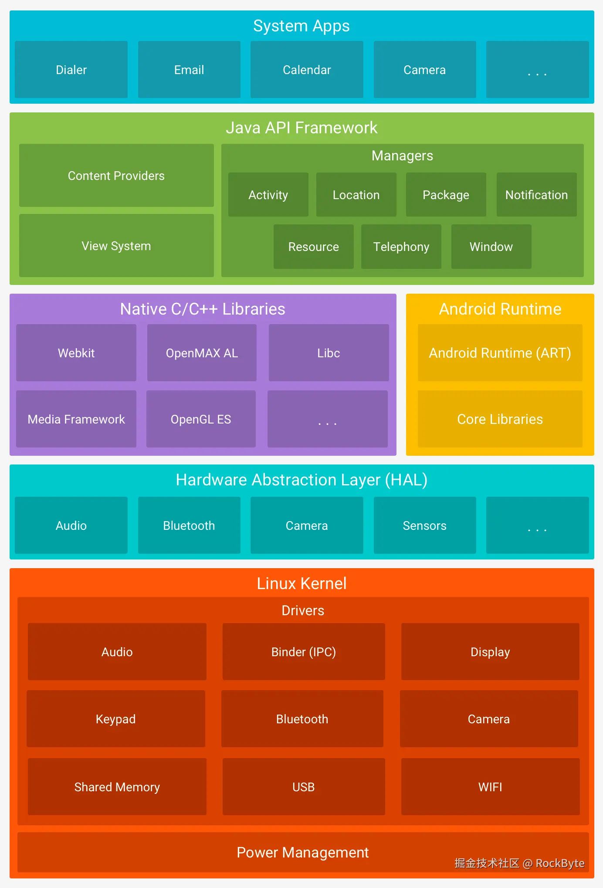

在网上刷贴，找到这张最详细的架构分层图，也就是官方给的图，他展示了从Linux内核到系统应用的完整Android架构层次。https://developer.android.com/guide/platform?hl=zh-cn

一句话：

Android = 应用层 → Framework 框架层 → 运行时/Native 库层 → HAL 硬件抽象层 → Linux 内核层

**最上面：App 在用**

**中间：Framework 在管**

**再下面：运行时和底层库在支撑**

**更下面：HAL 在适配硬件**

**最底层：Linux Kernel 真正驱动硬件**



# Linux Kernel（linux内核层）(地基）

有很多 Drivers（驱动）：

- Audio音频

- Binder (IPC)束缚剂（IPC）

- Display展示

- Keypad按键

- Bluetooth蓝牙

- Camera房间

- Shared Memory共享记忆

- USB 

- WIFI无线网络

还有 Power Management。

# HAL（Hardware Abstraction Layer，硬件抽象层）

HAL 的本质就是：

**把“上层系统”与“具体硬件”隔开。**

因为不同手机厂商的硬件实现不一样：

- 不同摄像头 

- 不同蓝牙芯片 

- 不同传感器 

- 不同音频硬件 

Android 不可能让上层 Framework 直接适配每一种硬件。

所以中间加一个 HAL 层，定义统一接口。他就是适配层，翻译层，转接层

这样 Android 系统上层代码可以尽量统一，厂商只需要按规范实现 HAL 即可。

# Native C/C++ Libraries + Android Runtime（运行时与本地库层）

## Native C/C++ Libraries（本地库）

比如：

- WebKit 

- OpenGL ES 

- Media Framework媒体框架

- libc 

- OpenMAX AL 

### 它们是干什么的？

这些库提供底层能力，比如：

- 图形渲染 

- 音视频处理 

- 网络通信 

- 基础 C 运行库 

- 网页内核 

- 加解密、数据库等底层支持 

很多 Android 高性能功能，最后都会落到 C/C++ 层去做。

## Android Runtime（ART）

图里写的是：

- Android Runtime (ART)Android 运行时（ART）

- Core Libraries核心库

### ART 是什么？

ART 是 Android 应用的运行环境。

简单说：

- 你写的 Java / Kotlin 代码 

- 编译后变成字节码 

- 最后由 ART 来执行

### Core Libraries 是什么？核心库是什么？

就是 Java 核心类库的一部分支持，给应用提供常用类和基础能力。


# Java API Framework（应用框架层）

这一层非常重要。
 它是 **Android 给应用开发者提供的标准能力接口层**。

图里你看到的有：

- Content Providers内容提供者

- View System视图系统

- 各种 Managers：各种 经理：

    - Activity活动

    - Location位置

    - Package包装

    - Notification通知

    - Resource资源

    - Telephony电话

    - Window窗户

### 这一层到底是干什么的？

这层就是“系统管理层”。

应用想做什么，都要找这一层。

比如：

- 想启动页面 → 找 **ActivityManager**

- 想弹通知 → 找 **NotificationManager**

- 想查安装包信息 → 找 **PackageManager**

- 想获取定位 → 找 **LocationManager**

- 想显示界面 → 依赖 **View System**

- 想共享数据 → 用 **Content Provider**

### 你可以把它理解成

这一层像一个 **大管家 / 大前台**：

- App 说：我要拍照 

- Framework 说：好，我帮你联系相机服务

## system_server 进程

system_server 是 Android Framework 的核心管理进程。

里面运行了很多经常听到的系统服务：

```text
ActivityManagerService / AMS
ActivityTaskManagerService / ATMS
PackageManagerService / PMS
WindowManagerService / WMS
PowerManagerService
NotificationManagerService
LocationManagerService
InputManagerService
```

# System Apps（系统应用层）

这一层就是你平时直接看到的 App，比如：

- Dialer（拨号） 

- Email（邮件） 

- Calendar（日历）日历（日历）

- Camera（相机） 

### 这一层的作用

它们本质上也是应用，只不过是系统自带的应用。

它们不会直接操作硬件，而是通过下面的 Framework 提供的 API 来完成功能。


# Android 整体调用链图

```java
┌─────────────────────┐
│      App层          │
│ Camera/微信/QQ等     │
└──────────┬──────────┘
           │
           ▼
┌─────────────────────┐
│ Framework层         │
│ AMS/PMS/WMS等服务   │
└──────────┬──────────┘
           │ Binder
           ▼
┌─────────────────────┐
│ system_server       │
│ 系统服务进程         │
└──────────┬──────────┘
           │
           ▼
┌─────────────────────┐
│ HAL层               │
└──────────┬──────────┘
           │
           ▼
┌─────────────────────┐
│ Linux Kernel        │
│ Binder Driver等     │
└──────────┬──────────┘
           │
           ▼
        Hardware
```

下面写几个重要的调用链

## startActivity

startActivity本质是App进程通过Binder调用system_server中的ATMS，由ATMS完成Activity启动调度。

### Java代码

```java
Intent intent = new Intent(this, MainActivity.class);
startActivity(intent);
```

### 调用链

```text
App进程

Activity.startActivity()
        ↓
Instrumentation.execStartActivity()
        ↓
ActivityTaskManager.getService()
        ↓
Binder IPC
        ↓
system_server
        ↓
ActivityTaskManagerService(ATMS)
        ↓
ActivityStarter
        ↓
RootWindowContainer
        ↓
启动目标Activity
```

## 安装APK

### 用户点击安装

```text
PackageInstaller
```

### 调用链

```text
PackageInstaller
      ↓
PackageInstallerSession
      ↓
Binder
      ↓
PackageManagerService(PMS)
      ↓
解析APK
      ↓
AndroidManifest.xml
      ↓
dex优化
      ↓
生成应用数据目录
      ↓
写入安装记录
      ↓
安装完成
```

### 核心服务

```text
PMS
(PackageManagerService)
```

### PMS负责

- 安装 

- 卸载 

- 权限 

- 签名校验 

- 查询应用

### 逆向经常遇到

```text
getPackageManager()
```

最终都会进入：

```text
PMS
```

## 获取应用签名

### Java代码

```java
PackageManager pm = getPackageManager();

pm.getPackageInfo(
    packageName,
    PackageManager.GET_SIGNATURES
);
```

### 调用链

```java
App
 ↓
ApplicationPackageManager
 ↓
IPackageManager
 ↓ Binder
system_server
 ↓
PackageManagerService
 ↓
读取PackageSetting
 ↓
返回签名信息
```

## 发送通知

## 调用链

```text
App
 ↓
NotificationManager
 ↓ Binder
NotificationManagerService
 ↓
StatusBar
 ↓
SystemUI
 ↓
显示通知
```

### Binder调用

实际上：

```text
App
 ↓
Proxy
 ↓
Binder
 ↓
Binder Driver
 ↓
Stub
 ↓
system_server
```

### Binder完整结构

```text
Client
 ↓
Proxy
 ↓
Binder Driver
 ↓
Stub
 ↓
Service
```

### AIDL本质

自动生成：

```text
Proxy
Stub
```


## APP启动

### 完整链

```text
Launcher//用户点击图标
 ↓
ATMS //Framework框架
 ↓
Zygote //创建进程
 ↓ fork 
App Process  
 ↓
ActivityThread  //App进程
 ↓
Application  //应用
 ↓
MainActivity  //活动
```


