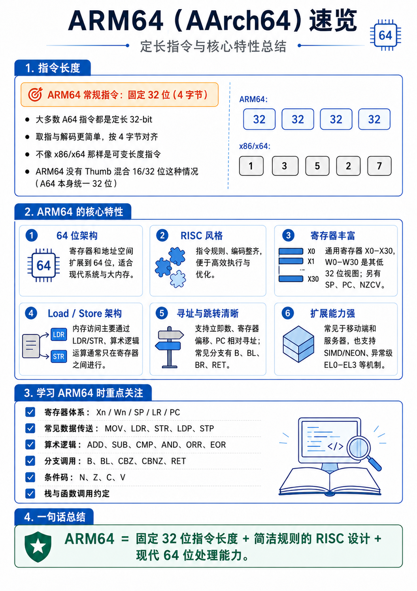

# 架构

## ARM64 是 Load/Store 架构

这句话非常重要，他决定了ARM64 不能直接对内存做复杂运算，大多数运算必须先把数据从内存加载到寄存器，再在寄存器里计算，最后写回内存。

**算术逻辑运算通常只在寄存器之间进行，内存访问主要靠 LDR / STR。**

# 指令长度

ARM64常规指令：固定32位（4字节），取值与解码更简单，按4字节对齐。所以看arm64的汇编会发现地址以4递增。

```yaml
0x1000:  stp x29, x30, [sp, #-0x10]!
0x1004:  mov x29, sp
0x1008:  bl  0x2000
0x100c:  ldp x29, x30, [sp], #0x10
0x1010:  ret
```

# RISC风格

ARM64 属于 RISC 风格，特点是：

```text
指令长度固定
编码规则整齐
大多数指令功能比较单一
寄存器数量多
访存和计算分离
```

不像 x86 那样，一条指令可以又访问内存又做复杂计算。

# 寄存器

## 通用寄存器

ARM64有31个通用寄存器：

```java
x0  ~ x30    64位
w0  ~ w30    x寄存器低32位
```

注意：

```text
mov w0, #1
```

这会把 `x0` 的高 32 位清零，结果是：

```text
x0 = 0x0000000000000001
```

## XZR / WZR 零寄存器

ARM64 有一个特殊寄存器：

```text
xzr
wzr
```

它永远是 0。

读它，得到 0：

```text
mov x0, xzr
```

等价于：

```text
x0 = 0
```

写它，结果会被丢弃：

```text
add xzr, x0, x1
```

这个计算结果不会保存。

## sp栈指针

常见操作：

```text
sub sp, sp, #0x20
```

表示开辟 0x20 字节栈空间。

```text
add sp, sp, #0x20
```

表示释放 0x20 字节栈空间。

ARM64 要求函数调用时栈通常保持 **16 字节对齐**。

## FR和LR

ARM64 里：

```text
x29 = fp    ; frame pointer，帧指针
x30 = lr    ; link register，返回地址
```

典型函数开头：

```text
stp x29, x30, [sp, #-0x10]!
mov x29, sp
```

含义：

```text
把 x29 和 x30 入栈
更新 sp
把当前 sp 作为新的栈帧基址
```

典型函数结尾：

```text
ldp x29, x30, [sp], #0x10
ret
```

含义：

```text
恢复 x29 和 x30
sp 回收栈空间
跳回 x30 保存的返回地址
```

## 条件标志 NZCV

ARM64 的算术/逻辑指令会修改 CPU 的条件标志寄存器（PSTATE 寄存器的一部分），简称 NZCV：

# ARM64函数调用约定

## 参数传递

arm64函数参数优先放在x0到x7

## 返回值

返回值一般放在x0/w0（x0的低32位）

## 函数调用

ARM64 调用函数常见指令：

```text
bl func
```

`bl` 的意思是：

```text
branch with link
跳转到目标函数，并把返回地址保存到 x30
```

例如：

```text
bl strcmp
```

调用 `strcmp`。

函数返回：

```text
ret
```

`ret` 默认跳转到：

```text
x30
```

也就是返回地址。

# ARM64栈结构

ARM64 栈一般是：

```text
高地址
|                |
| 调用者栈帧       |
|----------------|
| 返回地址 x30     |
| 旧的 x29        |
|----------------| <- x29 / fp
| 局部变量         |
| 临时保存寄存器    |
|----------------| <- sp
低地址
```

栈是向低地址增长的。

开辟栈空间：

```text
sub sp, sp, #0x40
```

释放栈空间：

```text
add sp, sp, #0x40
```

保存寄存器：

```text
str x19, [sp, #0x10]
```

恢复寄存器：

```text
ldr x19, [sp, #0x10]
```

成对保存：

```text
stp x19, x20, [sp, #0x20]
```

成对恢复：

```text
ldp x19, x20, [sp, #0x20]
```

# ARM64 常见指令速查表

# 常见条件跳转

# JNI 调用大概形态

JNI 函数通常第一个参数是：

```text
JNIEnv *env
```

第二个参数是：

```text
jobject / jclass
```

所以 ARM64 里：

```text
x0 = JNIEnv*
x1 = jobject / jclass
x2 = 第一个 Java 层传入参数
x3 = 第二个 Java 层传入参数
```

比如：

```text
Java_com_demo_MainActivity_check(JNIEnv *env, jobject thiz, jstring input)
```

进入 native 后大概：

```text
x0 = env
x1 = thiz
x2 = input
```

这点在分析 so 里的 JNI 函数时非常重要。


