# 02 逆向工程入门指北
文件提示：

<font style="color:rgb(0,0,0);">现在，用 IDA 打开本题的附件，开始我们的第一个挑战吧！ </font>

<font style="color:rgb(0,0,0);">P.S. 附件使用C++编写，有很多正常人看不懂的东西，不过或许 shift+F12 能帮到你？</font>

<!-- 这是一张图片，ocr 内容为：ME TO MOECTF 2025!\N 00000019 WELCOME RODATA: LET'S PLAY A GAME!\N 00000014 TRODATA: S IT 10 TIMES.\N I HAVE A SECRET NUMBER BETWEEN O AND 99, AND YOU CAN GUESS 00000049 .RODATA: IF YOU SUCCESSLY GUESSED IT, I WILL GIVE YOU THE FLAG! 00000037 .RODATA: PLEASE INPUT YOUR NUMBER: 0000001B C RODATA: INVALID INPUT 0000000E .RODATA:  YOU ARE RIGHT!\N C 00000010 .RODATA: THE FLAG IS MOECTF(OPEN_YOUR_IDA_AND_START_REVERSE_ENGINEERING!!]. 00000043 C .RODATA: THAT'S NOT RIGHT... C 00000014 .RODATA: THANKS FOR YOUR PLAYING! C 00000019 .RODATA: BASIC_STRING::_M_CONSTRUCT NULL NOT VALID 0000002A .RODATA: C 0000001E TERMINATE CALLED RECURSIVELY\N C .RODATA: 0000000C C WHAT() -->
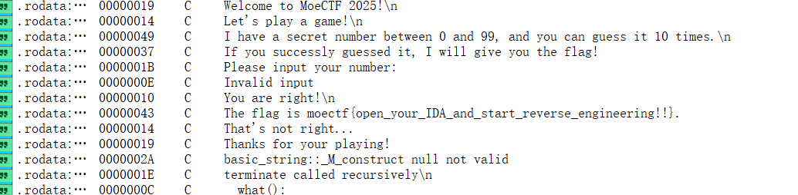

moectf{open_your_IDA_and_start_reverse_engineering!!}


# 03 base
IDA打开，找到main函数

<!-- 这是一张图片，ocr 内容为：_FASTCALL MAIN(INT INT ARGC, CONST CHAR **ARGV, CONST CHAR **ENVP) FILE *V3; // RAX _INT64 V4;// RDX _INT64 V5;// RAX UNSIGNED__INT64 V6;// RAX CHAR*V7;//RBX INT V8;// EAX CHAR *V9;// RCX CHAR V11[16]; // [RSP+20H] [RBP-98H] BYREF CHAR BUFFER[112]; // [RSP+30H] BYREF [RBP-88H] SUB_140001010(FORMAT); SUB_140001010((CHAR *)&BYTE_1400032F0); V3 三 _ACRT_IOB_FUNC(0); FGETS(BUFFER, 100, V3); 三 -1LL; V4 -1LL; V5 三 OP ++V5; WHILE ( BUFFER[V5] ); IF ( V5 && V11[V5 + 15] 三 10 ) 丁 V6 三 V5 - 1; IF ( V6 > 0X64 SUB_140001448(BUFFER); BUFFER[V6] O; OP ++V4; WHILE ( BUFFER[V4] ); V7 - (CHAR *)SUB_140001070(BUFFER, V4, V11); "BW91Y3RME1KWDV9DNG5FRZAWZF9BDF9CNDVINJQHIXO-"); V8 - STRCMP(V7, V9 : (CHAR )&UNK_140003300; IF ( V8 )&BYTE_140003318; V9 - (CHAR B_140001010(V9); _QNS FREE(V7); RETURN O; -->
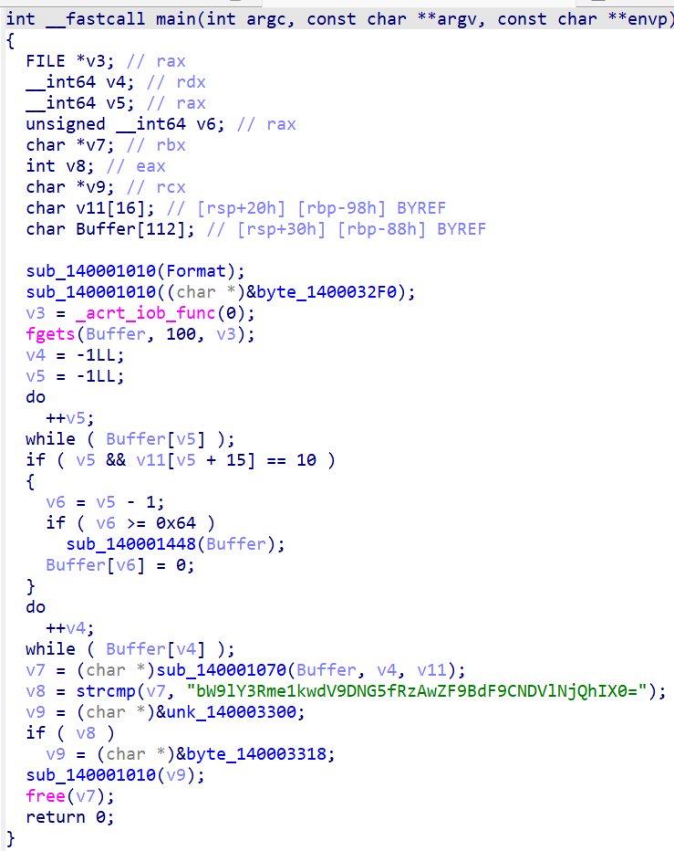


查看sub_140001070函数

<!-- 这是一张图片，ocr 内容为：*A3 V6: CFADD (V6, 1LL); V7 三 V82V6 IF ( V7 V8 -1LL;  RESULT : MALLOC(V8); V10 RESULT; IF ( RESULT IF ( A2 V11 - (UNSIGNED __INT8 *)(A1 + 2); V12 2 RESULT; V13 三 (A2 - 1) / 3 + 1; OP 1 _INT64)&V11[~A1] >: A2 ) IF ( (UNSIGNED V14 三 0; ELSE  V14 三 *(V11 - 1); IF ( (UNSIGNED __INT64)&V11[-A1] >; A2 ) V15 ELSE *V11; V15 *(V11 2); V16 V11 +: 3; _INT64)V16 >> 2]; *V12 - AABCDEFGHIJKLMN[(UNSIGNED >> 4)) & OX3F]; _INT8)(16 * V16) | (V14 >> 4) V12[1] - AABCDEFGHIJKLMN[(UNSIGNED _INT8)(4 * V14)) & 0X3F]; | (UNSIGNED V12[2] - AABCDEFGHIJKLMN[(V15 ; AABCDEFGHIJKLMN[V15 & OX3F]; V12[3] V12 +三 4;; - V13; WHILE ( V13 ); 子 V17  A2%3; IF ( V17 ) V17; V18 IF ( V17 !: 3 ) V19 - &RESULT[*A3 - 1 - V18]; LOBYTE(V18) ; 61;  MEMSET(V19 + 1, V18, 3 - V17); V10[*A3] : 0; RETURN V10; RETURN RESULT; -->
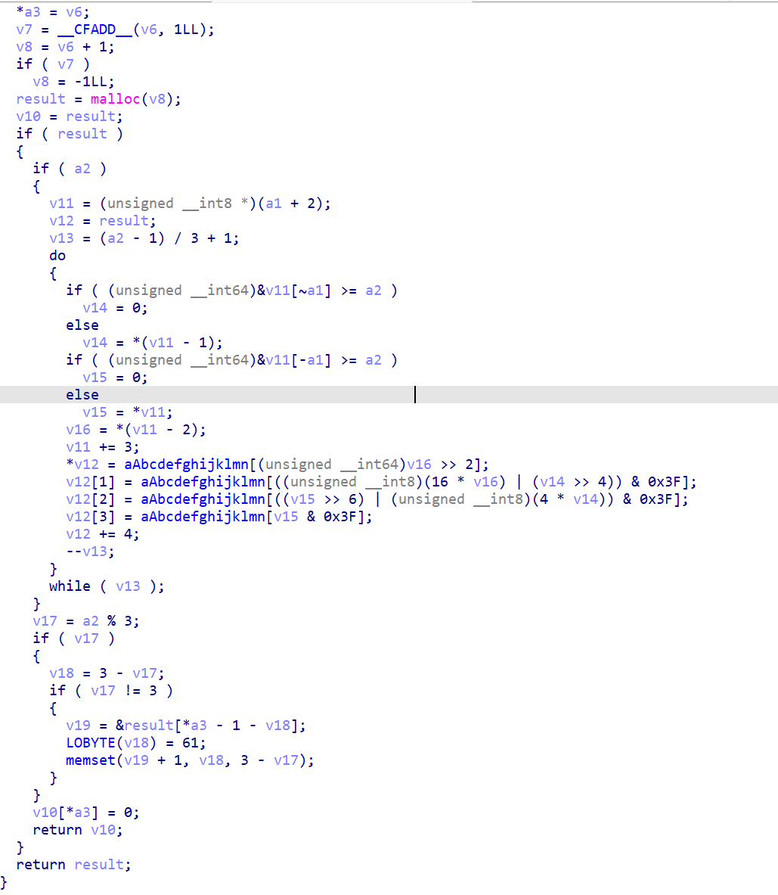

是一个 完全遵循Base64编码的标准算法流程

使用strcmp函数，将 sub_140001070 返回的字符串v7与一个硬编码的字符串**"bW9lY3Rme1kwdV9DNG5fRzAwZF9BdF9CNDVlNjQhIX0="**进行比较。

<!-- 这是一张图片，ocr 内容为：BASE64在线编码解码 (最好用的BASE64在线工具) BASE64.US MD5 1 TIMESTAMP URLENCODE BASE64 请输入要进行BASE64编码或解码的字符 BW9IY3RME1KWDV9DNG5FRZAWZF9BDF9CNDVINIQHIXO三 编码(ENCODE) (编/解码快捷键: 解码(DECODE) ?交换 CTRL ENTER BASE64编码或解码的结果: 编码后自动全选 MOECTFLYOU_C4N_G00D_AT_B45E64!!Y -->
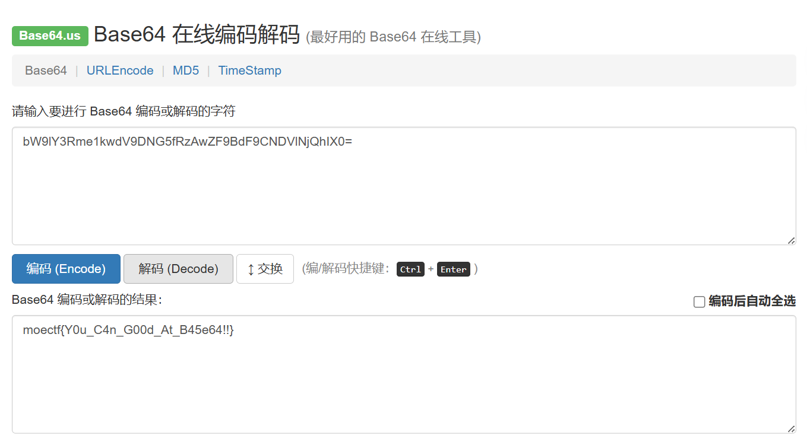

moectf{Y0u_C4n_G00d_At_B45e64!!}


# 10 A cup of tea
搜索main函数无果，shift6+F12搜索字符串

<!-- 这是一张图片，ocr 内容为：ADDRESS LENGTH TYPE STRING C ARGLIST ,RDATA:0. 00000009 C RDATA:0.. _ARGLIST 60000009 C .RDATA:0. 0000000A PLAINTEXT 0000000A C .RDATA:0. ENCRYPTED C BLOCK 00000006 .RDATA:0.. CONGRATULATIONS!!!! C 00000014 .RDATA:0.. C YOU ARE WRONG .RDATA:0. 00000010  STACK AROUND THE VARIABLE 0000001C C .RDATA:0.. C 00000011 RDATA:0.. WAS CORRUPTED. C 0000000F THE VARIABLE .RDATA:0.. IS BEING USED WITHOUT BEING INITIALIZED. C 0000002B .RDATA:0 C THE VALUE OF ESP RAS AOT PROPERJY SARED ACROSS A FUNCTION CALL. THIS IS USTALLY A RESULT OF CALLING A 000000DD .RDATA:0. 0000011D C A CAST T A CAST TO A SMALLER DATE TYPE HAS CAUSED  MAST THE DATR. IF THIS NAS INTENTIONAL. YOU STOULD THE SOUR RDATA:0 STACK MEMORY WAS CORRUPTED\R\N C 0000001D .RDATA:0... L VARIABLE WAS USED BEFORE IT WAS INITIALIZED\R\N C 00000036 LOCAL RDATA:0 -->
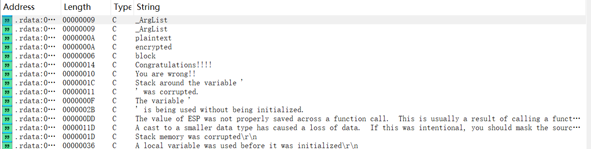

我们看到主函数在sub_1400162E0里，继续点击

<!-- 这是一张图片，ocr 内容为： FOR ( I : 130LL; I; --I ) *(_DWORD*)V0 三 -858993460; V0+三4; SUB_140011384(&UNK_140023015); V5[0] 289739801; V5[1] - 427884820; V5[2] 三 1363251608; V5[3] 269567252; V6[O] 2026214571; V6[1] 三 578894681; V6[2] 1193947460; V6[3] 三 229306230; V6[4] 三 73202484; V6[5] 三 961145356; V6[6]三 881456792; V6[7] 358205817; V6[8] 三5554069347; V6[9] : 1 119347883; V6[10]三0; MEMSET(V7,0, OX2CULL); MEMSET(V8,0, OX2CULL); SUB_1400111A4(&UNK_14001AED0); _1400113ED(&UNK_14001AEE4, STR); SUB J_STRLEN(STR); SIZE J_MEMCPY(V7, STR, SIZE); FOR(J-0;J<5;+++++J) V12 - V7[2 * J]; 13 三 V7[2 * J + 1]; V13 SUB_14001109B(&V12, V5); V8[2 * J] 三 V12; *1. J + 1] - V13; V8[2 V14 ; 1; FOR ( K 三 0; K < 11;++K )  IF ( V8[K] ! V6[K] ) V14 0; SUB_1400111A4("YOU ARE WRONG!!"); BREAK; 了 IF ( V14 -: 1 ) SUB_1400111A4("CONGRATULATIONS!!!!"); SUB_140011320(V3, &UNK_14001AE60); RETURN OLL; -->
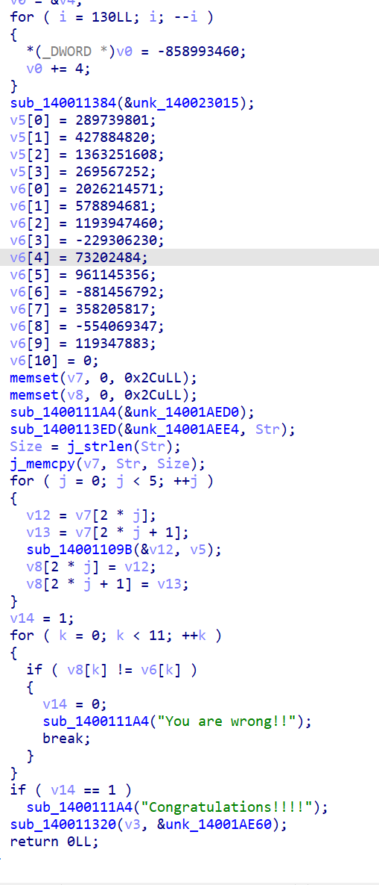

v5是密钥，v6是数组，加密逻辑在sub_14001109B里

<!-- 这是一张图片，ocr 内容为：TACAI NEX FASTCALL SUB_1400117EO(UNSIGNED INT *A1, DWORD *A2) INT64 :64 RESULT; // RAX INT64 INT V3; // [RSP+24H] [RBP+4H] [RBP+24H] UNSIGNED INT V4; // [RSP+44H] D INT V5;// [RBP+44H] UNSIGNED [RSP+64H] INT I; // [RSP+A4H] [RBP+84H] SUB_140011384(&UNK_140023015); V3 0; V4 三 *AL; V5 ; A1[1]; FOR ( I :0; I < 32; ++I ) } V3 +: 1131796; V5) A (*A2 + 16 * V5); (V3 + + (A2[1] + (V5 >> 5)) V4 - 16 * V4); V5 +三 (A2[3] + (V4 >> 5)) V4) (V3 (A2[2] Y *. *A1 三 V4; RESULT 三 4LL; A1[1] ; V5; RETURN RESULT; -->
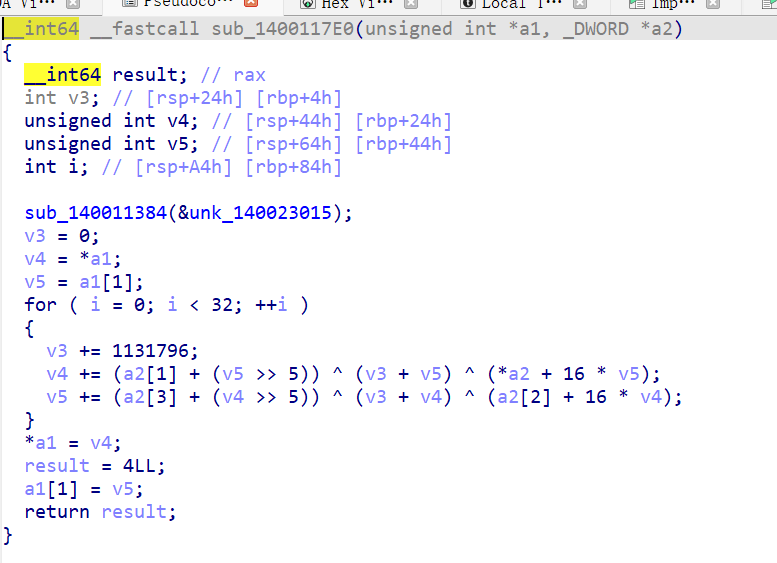

 每一轮使用 `delta`（这里是 `1131796`）和 key 进行混淆  ，逆解密

```python
from typing import List, Tuple

DELTA = 1131796  # 0x114514 as seen in the binary (decimal 1131796)

def u32(x: int) -> int:
    return x & 0xFFFFFFFF

def tea_decrypt_block(v0: int, v1: int, k: List[int], rounds: int = 32) -> Tuple[int, int]:
    v0 = u32(v0)
    v1 = u32(v1)
    k = [u32(x) for x in k]
    sum_ = u32(DELTA * rounds)
    for _ in range(rounds):
        v1 = u32(v1 - (((v0 >> 5) + k[3]) ^ (sum_ + v0) ^ ((v0 << 4) + k[2])))
        v0 = u32(v0 - (((v1 >> 5) + k[1]) ^ (sum_ + v1) ^ ((v1 << 4) + k[0])))
        sum_ = u32(sum_ - DELTA)
    return v0, v1

def tea_encrypt_block(v0: int, v1: int, k: List[int], rounds: int = 32) -> Tuple[int, int]:
    v0 = u32(v0)
    v1 = u32(v1)
    k = [u32(x) for x in k]
    sum_ = 0
    for _ in range(rounds):
        sum_ = u32(sum_ + DELTA)
        v0 = u32(v0 + (((v1 >> 5) + k[1]) ^ (sum_ + v1) ^ ((v1 << 4) + k[0])))
        v1 = u32(v1 + (((v0 >> 5) + k[3]) ^ (sum_ + v0) ^ ((v0 << 4) + k[2])))
    return v0, v1

def words_to_bytes_le(words: List[int]) -> bytes:
    return b"".join(w.to_bytes(4, "little") for w in words)

def main():
    key = [289739801, 427884820, 1363251608, 269567252]
    v6 = [
        2026214571,
        578894681,
        1193947460,
        -229306230,
        73202484,
        961145356,
        -881456792,
        358205817,
        -554069347,
        119347883,
        0,
    ]
    v6_u = [u32(x) for x in v6]
    ciphertext_words = v6_u[:10]
    plaintext_words = []
    for i in range(0, len(ciphertext_words), 2):
        p0, p1 = tea_decrypt_block(ciphertext_words[i], ciphertext_words[i+1], key)
        plaintext_words.extend([p0, p1])
    pt_bytes = words_to_bytes_le(plaintext_words)
    flag = pt_bytes.split(b"\x00", 1)[0].decode('utf-8', errors='replace')
    print("Recovered flag string:", flag)

    re_cipher_words = []
    for i in range(0, len(plaintext_words), 2):
        c0, c1 = tea_encrypt_block(plaintext_words[i], plaintext_words[i+1], key)
        re_cipher_words.extend([c0, c1])
    print("Verification success?", re_cipher_words == ciphertext_words)

if __name__ == '__main__':
    main()

```

moectf{h3r3_4_cuP_0f_734_f0R_y0U!!!!!!}


# 11 ezpy
简单的pyc逆向

通过命令

```bash
uncompyle6 ezpy.pyc >ezpy.py
```

<!-- 这是一张图片，ocr 内容为：(.VENV) PS C:\USERS\35159\PYCHARMPROJECTS\PYTHONPROJECT2> ( UNCOMPYLE6 EZPY. PYC >EZPY.PY -->
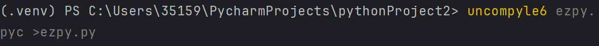

看到生成了ezpy.py

<!-- 这是一张图片，ocr 内容为：EZPY.PYC EZPY.PY -->
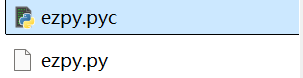

打开ezpy.py文件

<!-- 这是一张图片，ocr 内容为：F UNCOMPYLE6 VERSION 3.9.2 # PYTHON BYTECODE VERSION BASE 3.8.0(3413) # DECOMPILED FROM: PYTHON 3.8.10 (TAGS/V3.8.10:3D8993A, MAY 3 2021, 11:48:03) [MSC V1928 64 BIT (AMD64)] # EMBEDDED FILE NAME:EZPY.PY #COMPILED AT:2025-06-24 16:38:00 # SIZE OF SOURCE MOD 2**32:712 BYTES DEF CAESAR CIPHER ENCRYPT(TEXT,SHIFT): RESULT - FOR CHAR IN TEXT: IF CHAR.ISALPHAO: IF CHAR.ISLOWERO: NEW CHAR - CHR((ORD(CHAR) - ORD("A") + SHIFT) % 26 + ORD("A") ELSE: IF CHAR.ISUPPERO: W CHAR - CHR((ORD(CHAR) - ORD("A") + SHIFT) % 26 + ORD("A") NEW RESULT.APPEND(NEW CHAR) ELSE: RESULTAPPEND(CHAR) ELSE: RETURN ""JOIN(RESULT) USER INPUT - INPUT("PLEASE INPUT YOUR FLAG: ") A 1 IFA!1: PLAINTEXTUSERINPUT SHIFT 114514 KT CAESAR CIPHER ENCRYPT(PLAINTEXT,SHIFT) ENCRYPTED TEXT IF ENCRYPTED TEXT - "WYOMDPFLOE UXOG ZIM]": PRINT("CORRECT!!!!") # OKAY DECOMPILING EZPY.PYC -->
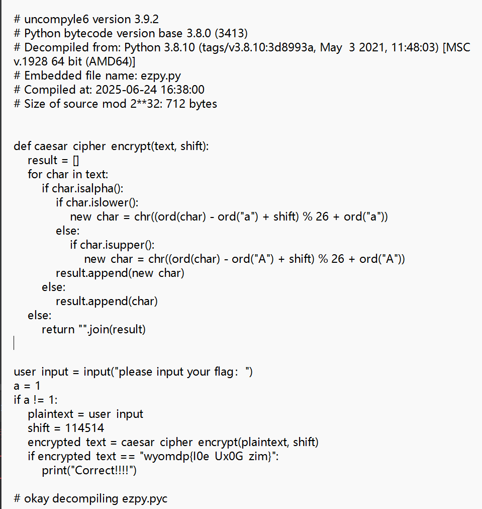

实际就是 shift = 10 的凯撒加密， 只要把目标字符串 只要把目标字符串 "wyomdp{I0e_Ux0G_zim}" 逆向 Caesar -10 就行。  

```python
def caesar_cipher_decrypt(text, shift):
    result = []
    for char in text:
        if char.isalpha():
            if char.islower():
                new_char = chr((ord(char) - ord("a") - shift) % 26 + ord("a"))
            else:
                if char.isupper():
                    new_char = chr((ord(char) - ord("A") - shift) % 26 + ord("A"))
            result.append(new_char)
        else:
            result.append(char)
    return "".join(result)


if __name__ == "__main__":
    encrypted = "wyomdp{I0e_Ux0G_zim}"
    shift = 114514 % 26  # 实际等效移位量 = 10
    flag = caesar_cipher_decrypt(encrypted, shift)
    print("解密结果:", flag)

```

moectf{Y0u_Kn0W_pyc}


# 13 mazegame
IDA打开，定位到主函数，是一个迷宫， 需要找到从起始点 `**(1, 1)**` 到终点 `**(32, 15)**` 的一条有效路径  

<!-- 这是一张图片，ocr 内容为：1LL; WHILE SWITCH ( V12[V5] ) 子 'A': CASE CASE --V4; -V8;; --V9; BREAK; CASE D' CASE 'D': ++V4; ++V8; ++V9; BREAK; 'S' CASE 'S CASE ++V6; ++V7; BREAK; CASE 'W': CASE 'W': --V6J - V7; BREAK; DEFAULT: SUB_140001020((CHAR *)&BYTE_1400040CO); SUB_140001020((CHAR *)&BYTE_140004210); GOTO LABEL_2; IF ( V7 > 0X37 || V9 > 0X37 ) :(CHAR*)&UNK_1400040D8; V10 GOTO LABEL_20; IF ( BYTE_140005660[56 * V7 + V8] 三 49 ) V10 (CHAR *)&UNK_1400040F8; GOTO LABEL_20; IF ( V7 - 15 && V8 32 ) BREAK; IF ( ++V5 >: (INT)V3 ) GOTO LABEL_19; SUB_140001020(ASC_1400041E0); SUB_140001020("MOECTF{%S}\N"); RETURN O; -->
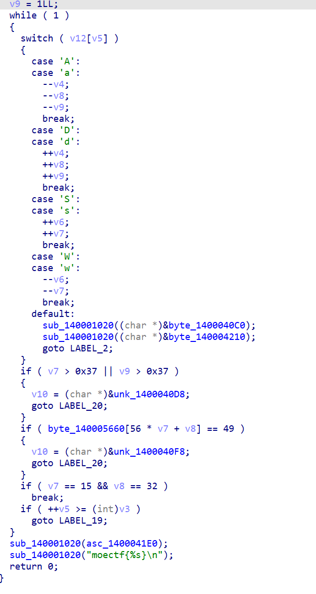

迷宫地图在sub_1400010E0函数里

<!-- 这是一张图片，ocr 内容为：:"1010000000000000001000001101110101111111111101011100000111"; V9[1] VE ; "111111111111111111111111111111111111111111111111111111111" V9[0] - "111 1111111111111111111"; V9[2] - "101110101111111110101011100000010000000000001000101111011"; "100000100000010000100010110111111111101110111011101110111"; V9[3] 三 "101111111110111011101110110101000000000010101000111000111"; V9[4] "10100000001000101000100011010101011111110111011101010111011"; V9[5] V9[6] "1010101011111101110111010110101010000010000000001010111011"; 三 V9{7] - "1010101000001010000010101011101011101011111111111111111011"; "101110101110101011111010101110010100000000101010101110111"; V9[8] [9]6] "1000001000101000100000010110011111111101010101011101110111" V9[10] "11111011101011111011111111101000100000101100101010011101111" 川 "100010100010001000100000010001010011000100100100100110000001" V9[11] 三 "10111010111110101010111011011001010111101010101011101011101" V9[12] "100010100010000010101010110001010100000000010101010101011101' V9[13] V9[14] "11101011101111111101110101111010111011111111101110101011101" 三 "100010000101000010100010110001000101010000010100101010111101": V9[15] "10111111101011101110111011011111111010111011101110111011101" V9[16] "10G V9[17] 100010000001000000000000100000000000010000000000001011001" V9[18] "11101011111011111111101010111010101111011111111110101011011" V9[19] "T0101000000000100100101011010101000000010010010101011011011" "101011111111110101010101011010111111111101010101010101011011" V9[20] "T01000000000000100010101101101000000000010001010101011011" V9[21] "1011111111111111111011101101111111111111111111011101011011"" V9[22] "10000000000111000000000000111101010100011110001111111011011"; V9[23] "1110111110000001101101111111101011011101110110110001011011"; V9[24] "1110111111111111101101111111111101110111101101100001011011"; V9[25] "1000100011111100001000000111110101110111011101100001011011011"; V9[26] "1011101010111111101011101111011101010001111011000001010011" V9[27] "1000000100000100001000101011111111111111111101100001010101011" V9[28] "10111111111011101110111011110001000110001101101100001010001" V9[29] V9[30] "10100000001000101000100011110111011101111110110000101011101 V9[31] "101010111111101110111010101110001000101111101100000101011101" V9[32] "1010101000000101000001010111111010111011111101100000101011101" "10111010111010101011101010111000100011000110110000101011101" V9[33] V9[34] "100000100010101010000001011111111111111111110110000101011101" "11111011101010111101111110000000000000000110110000001011101" V9[35] "100010100010001000100000011111111111111111100110011011101" V9[36] 三 "1011101011111010101010101001000000000111111100011111011101" V9[37] 三 V9[38] "100010100010000010100010101101110000001111110100101010101" V9[39] - "111010111011111110111010001100110011111111100110111011101"; 三 11 D] - "1000100010100000101000101011111111111111111111110111010001"; V9[40] V1 - (CONST CHAR **)V9; V9(55] - "11111111111111111111111111111111111111111111111111111111111"; -->
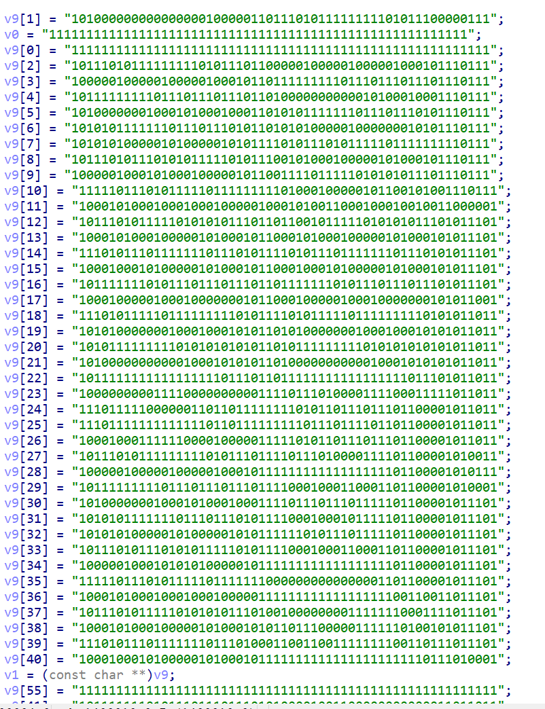

提取出，并按顺序排好

```python
11111111111111111111111111111111111111111111111111111111
10100000000000000010000011011101011111111101011100000111
10111010111111111010111011000001000001000001000101110111
10000010000010000010001011011111111101110111011101110111
10111111111011101110111011010000000000010100010001110111
10100000001000101000100011010101111111011101110101110111
10101011111110111011101011010101000001000000010101110111
10101010000010100000101011110101110101111101111111110111
10111010111010101111101011100101000100000101000101110111
10000010001010001000001011001111011111010101011101110111
11111011101011111011111111101000100000101100101001110111
10001010001000100010000010001010011000100010010011000001
10111010111110101010111011011001011111010101011101011101
10001010001000001010001011000101000100000101000101011101
11101011101111111011101011110101110111111101110101011101
10001000101000001010001011000100010100000101000101011101
10111111101011101110111011011111110101110111011101011101
10001000001000100000001011000100000100010000000101011001
11101011111011111111101011110101111101111111110101011011
10101000000010001000101011010100000001000100010101011011
10101111111110101010101011010111111111010101010101011011
10100000000000100010101011010000000000010001010101011011
10111111111111111110111011011111111111111111011101011011
10000000001111000000000011110111010000111100011111011011
11101111100000011011011111111010110111011101100001011011
11101111111111111011011111111101110111101101100001011011
10001000111111000010000011111010110111011101100001011011
10111010111111111010111011110111010000111101100001010011
10000010000010000010001011111111111111111101100001010111
10111111111011101110111011110001000110001101100001010001
10100000001000101000100011110111011101111101100001011101
10101011111110111011101011110001000101111101100001011101
10101010000010100000101011111101011101111101100001011101
10111010111010101111101011110001000110001101100001011101
10000010001010101000001011111111111111111101100001011101
11111011101011111011111110000000000000001101100001011101
10001010001000100010000011111111111111111100110011011101
10111010111110101010111010010000000011111110001111011101
10001010001000001010001010110111000001111110100101011101
11101011101111111011101000110011001111111100110111011101
10001000101000001010001011111111111111111111110111010001
10111111101011101110111010100001001100000000000011011011
10001000001000100000001011111111111101011101111001011011
10101011111011111111101011000000000001000100010111011011
10101000000010001000101010010111111111111111111111011011
10101111111110101010101010110111111111111111111101011011
10100000000000100010101011100000000000000000000011011011
10111111111111111110011011111111111111111111111011011011
10000011111111111111000010000000000000000000000000011001
11111011111111111111111111111111111111111111111111111101
11111011100001100110110111000000000000000000000111111101
11111011101111011010000111011111111111111111110111111101
11111011100001000010110110000111111111111111110000000001
11111011101111011010110111101111111111111111111111111111
11110000000000011000110000000000000000000000000000000011
11111111111111111111111111111111111111111111111111111111
```

用BFS算法寻路

```python
from collections import deque

def find_maze_path(maze, start, end):
    # maze: 56x56的迷宫地图（'0'和'1'的二维列表）
    # start: 起点坐标 (x, y)
    # end: 终点坐标 (x, y)

    rows = len(maze)
    cols = len(maze[0])

    # 移动方向：上、下、左、右
    directions = [(-1, 0), (1, 0), (0, -1), (0, 1)] # (dx, dy) 

    # 队列用于BFS
    queue = deque([start])

    # 集合用于记录已访问的节点
    visited = {start}

    # 字典用于回溯路径
    parent = {start: None}

    while queue:
        current_x, current_y = queue.popleft()
        current_node = (current_x, current_y)

        # 检查是否到达终点
        if current_node == end:
            return reconstruct_path(parent, start, end)

        # 探索所有可能的移动方向
        for dx, dy in directions:
            next_x, next_y = current_x + dx, current_y + dy
            next_node = (next_x, next_y)

            # 检查移动是否有效
            if 0 <= next_x < cols and 0 <= next_y < rows and \
               maze[next_y][next_x] == '0' and next_node not in visited:
                
                visited.add(next_node)
                queue.append(next_node)
                parent[next_node] = current_node

    return None 

def reconstruct_path(parent_map, start, end):
    path = []
    current = end
    while current:
        path.append(current)
        current = parent_map[current]
    
    path.reverse()
    
    instructions = []
    for i in range(len(path) - 1):
        x1, y1 = path[i]
        x2, y2 = path[i+1]
        
        if x2 > x1:
            instructions.append('D')
        elif x2 < x1:
            instructions.append('A')
        elif y2 > y1:
            instructions.append('S')
        elif y2 < y1:
            instructions.append('W')
            
    return "".join(instructions)

maze_map_strings = [
    "11111111111111111111111111111111111111111111111111111111",
    "10100000000000000010000011011101011111111101011100000111",
    "10111010111111111010111011000001000001000001000101110111",
    "10000010000010000010001011011111111101110111011101110111",
    "10111111111011101110111011010000000000010100010001110111",
    "10100000001000101000100011010101111111011101110101110111",
    "10101011111110111011101011010101000001000000010101110111",
    "10101010000010100000101011110101110101111101111111110111",
    "10111010111010101111101011100101000100000101000101110111",
    "10000010001010001000001011001111011111010101011101110111",
    "11111011101011111011111111101000100000101100101001110111",
    "10001010001000100010000010001010011000100010010011000001",
    "10111010111110101010111011011001011111010101011101011101",
    "10001010001000001010001011000101000100000101000101011101",
    "11101011101111111011101011110101110111111101110101011101",
    "10001000101000001010001011000100010100000101000101011101",
    "10111111101011101110111011011111110101110111011101011101",
    "10001000001000100000001011000100000100010000000101011001",
    "11101011111011111111101011110101111101111111110101011011",
    "10101000000010001000101011010100000001000100010101011011",
    "10101111111110101010101011010111111111010101010101011011",
    "10100000000000100010101011010000000000010001010101011011",
    "10111111111111111110111011011111111111111111011101011011",
    "10000000001111000000000011110111010000111100011111011011",
    "11101111100000011011011111111010110111011101100001011011",
    "11101111111111111011011111111101110111101101100001011011",
    "10001000111111000010000011111010110111011101100001011011",
    "10111010111111111010111011110111010000111101100001010011",
    "10000010000010000010001011111111111111111101100001010111",
    "10111111111011101110111011110001000110001101100001010001",
    "10100000001000101000100011110111011101111101100001011101",
    "10101011111110111011101011110001000101111101100001011101",
    "10101010000010100000101011111101011101111101100001011101",
    "10111010111010101111101011110001000110001101100001011101",
    "10000010001010101000001011111111111111111101100001011101",
    "11111011101011111011111110000000000000001101100001011101",
    "10001010001000100010000011111111111111111100110011011101",
    "10111010111110101010111010010000000011111110001111011101",
    "10001010001000001010001010110111000001111110100101011101",
    "11101011101111111011101000110011001111111100110111011101",
    "10001000101000001010001011111111111111111111110111010001",
    "10111111101011101110111010100001001100000000000011011011",
    "10001000001000100000001011111111111101011101111001011011",
    "10101011111011111111101011000000000001000100010111011011",
    "10101000000010001000101010010111111111111111111111011011",
    "10101111111110101010101010110111111111111111111101011011",
    "10100000000000100010101011100000000000000000000011011011",
    "10111111111111111110011011111111111111111111111011011011",
    "10000011111111111111000010000000000000000000000000011001",
    "11111011111111111111111111111111111111111111111111111101",
    "11111011100001100110110111000000000000000000000111111101",
    "11111011101111011010000111011111111111111111110111111101",
    "11111011100001000010110110000111111111111111110000000001",
    "11111011101111011010110111101111111111111111111111111111",
    "11110000000000011000110000000000000000000000000000000011",
    "11111111111111111111111111111111111111111111111111111111",
]
maze_map = [list(row) for row in maze_map_strings]

start_point = (1, 1)
end_point = (32, 15)

path_instructions = find_maze_path(maze_map, start_point, end_point)

if path_instructions:
    print("找到了路径!")
    print(path_instructions)
else:
    print("没有找到路径。")
```

moectf{SSDDDDWWDDSSDDDDSSDDSSSSDDWWDDWWDDWWWWDDDDSSSSAASSSSAAAASSAASSAAWWAAWWWWAAAASSDDSSAASSDDSSSSAAAASSDDDDDDWWWWDDDDSSDDDDWWDDWWAAWWDDDDSSSSSSSSSSSSAAASSSDDDSSSSAASSSSAAAASSAASSAAWWAAWWWWAAAASSDDSSAASSDDSSSSAAAASSDDDDDDWWWWDDDDSSDDDDWWDDWWAAWWDDDDSSSSSSSSSSSSAAAWAWWWAASSAAWWAASSAAAAAAAAAAWWWWAASSSSSSDDDDSSSSSSDDDDDDDDDWWDDDSSDDWWWDDDSSSDDDDDWWAWWDDDDDDDDDDDDDDDDDDDDSSDDDDDDDDWWWWAWWWWWWWWDWWWWWWWWWWWAAWWDWWWWWWWWWWDWWWWWWAAAASSSSSSSSSSSSSSSSSSSSSSSSSSSSSSSSSSSSSAAAWWAAAAAAAAAAAAAAAAAAAWWWDDDDDDDDWWDDDDDDDDDDWWWAWAAWAWWWWWWWWWWWWWDDWWWWAASSAAWWAASSAAAAAAAAAAWWWWAAWWDDWWAAWWDWWWDWWWWDDDDDDDDDDSSDDDDSSSSDSDSSDDSSAASSAAAAWWAAAASSSSAAAAAAWWDDDDWWWWAAWWAWAASSDSSSDD}


# 17 Two cup of tea
IDA打开定位主函数

<!-- 这是一张图片，ocr 内容为：CHAR*V8;//RCX UNSIGNED _INT64 V10; // [RS BYREF [/ [RSP+20H] [RBP-EOH] BE CHAR V11; // [RSP+28H] [RBP-D8H _INT64 V12; 8 // [RSP+30H] [RBP-DOH] BYREF  INT V13; // [RSP+38H] [RBP-C8H] INT V14; // [RSP+3CH] [RBP-C4H] [DWORD V15[10];// [RSP+40H][RBP-COH] OWORD V16[2L; // [RSP+68H] [RBP-98H] BYREF _INT64 V17; // [RSP+88H] [RBP-78H] / [RSP+90H] [RBP-70H] BYREF CHAR BUFFER[16]; // [RSP // [RSP+AOH] [RBP-60H] INT128 V19; INT64 V20; [RSP+BOH] [RBP-50H] V3:0LL; V12 : 2LL; V11 三 0; V13 2; V14 三 5; V15[0] ] ; 1566723124; V15[1] -2044068179; 三 V15[2] -1659816037; V15[3] -53136879; V15[4] 1175413710; V15[5] -981373336; 三 -28114771; V15[6] 三 167777774; V15[7] 川 V15[8] -1744380997; 三 -280353208; V15[9] 三 0XD0FCC6A7B8941CAFULL; V10 三 _140001070(ARGC, &V10, &V12); SUB SUB_140001010((CHAR *)&FORMAT); IOB_FUNC(O); V4 ACRT FGETS(BUFFER, 100, V4); STRCSPN(BUFFER, "\N"); V5 三 IF ( V5 > 0X64 SUB_140001BE8(); BUFFER[V5]-0; YBUFFER V16[0]三*(_OWORD V12 三 V10; V17 三 V20;  V16[1] ; V19; 305419896; V13 三 -1698898192; V14 三 B_1400015E0(V16, V6, &V12); SUB_1 -1LL; V7 DO ++V7; WHILE ( BUFFER[V7] ); IF ( V7 - 40 ) WHILE ( *( DWORD *)(CHAR *)V16 + V3 * 4) -- V15[V31 -->
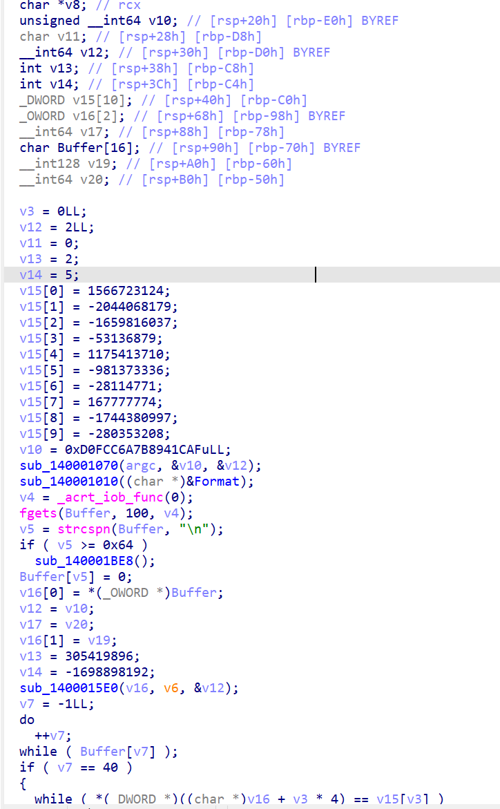

数组v15是加密后的数据，v10是key，但经过函数处理的才是我们需要的

<!-- 这是一张图片，ocr 内容为：0XD0FCC6A7B8941CAFULL; V10 : SUB_140001070(ARGC, &V10, &V12); -->
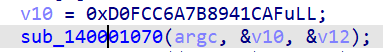

打开sub_140001070函数

<!-- 这是一张图片，ocr 内容为：*)(A3 + 4LL DWORD 3))) 水 V11) (V11 5)))); ((16 (V11 ((V10 (V10 V3 V12 ((V10 >> 11) & 3))) (V10 + *(_DWORD 水 +4LL (V12 >> 5 )(A3 V (16 V12) 5)1); (V12 V13 1640531527; V10 V13; V11 V14 ((V10+ *(_DWORD *)(A3 +4LL * 4LL * (V10 & 3)))) (V14 + (16 * V14) * (V14 >> 5)))))))); V12 V15 ((DWORD *)(A3+ 4LL * (V15 >> 11) & 3)) \ (V15 + (V15 * V15) \ (V15 >> 5)); (V10 V16 1640531527; V10 +三 V16; V14 V17 - (V10 + *(_DWORD *)(A3 + 4LL * (V10 & 3)) \ (V17- (V17 >> 5)))); ((16 * V17) V18 V15 * *(_DWORD *)(A3 + 4LL * (V10 >> 11) & 3)); V10 V19 +1640531527; V10 (V19 A (V18 + ((16 * V18) < (V18 >> 5)))))); V17 V20 ((V10+ *( DWORD *)(A3+ 4LL * (V10 & 3))) (V20+ (V20+ (16 * V20)' (V20 >> 5)))); V21 V18 *(_DWORD *)(A3 + 4LL * (V10 >> 11) & 3))) A (V21 + (16 * V21) A (V21 >> 5))))); V22 (V10 1640531527; V10 +二 V22; V23 V20 ; *( DWORD *)(33 + 4LL * (V10 & 3)) > (V23 + (V23) > (V23 > 5)); (V10 V21 V24 DWORD *)(A3+4LL * (V10 >> 11) & 3))> (V24+(V24+(16 * V24) & (V24 >> 5)); (V10 V25 V10+:1640531527; V26 V23 V25; * (V10 & 3))) (V26 + (16 ((V10 + *(_DWORD *)(A3 + 4LL * V26) (V26 >> 5))))); 米 V27 V24 DWORD *)(A3 + 4LL * (V10 >> 11) & 3)); V28 V10 1640531527; V10 十二 (V28 (V27 + (16 * V27) A (V27 >> 5))))); V26 V29 + *(_DWORD *)(A3 +4LL * (V10 & 3)))) ((V10 -(16 * V29) ,(V29 >> 5))))); (V29 V27 V30 *)(A3+ 4LL * ((V10 >> 11) & 3)))) ((16 * V30) (V30 >> 5))))); (V10+*(_DWORD (V30 V31 1640531527; V10 V29 - V31; V32 30-(V10+*(_DWORD*)(A *)(A3 + 4LL * (V10 & 3))(V32+ (V32+ (16 * V32) (V32 >> 5)); V30 V33 * (V10 >> 11) & 3)))) A (V33 + (16 * V33) (V33 >> 5)))))); )(A3 +4LL *(DWORD 三(V10 V34 +1640531527; V10 V34; V32 V35 9++ *(_DWORD *)(A3+4LL *(V10&3)))))))))))))))))))))))))))))))))))))))))))))))))))))))))))))))) (V10 + * *( ((16 * V35) A (V35 >> 5))))); 三V33 V36 - *(_DWORD *)(A3 + 4LL * (V10 >> 11) & 3)); V10 V37 1640531527; V10 +三 (V36 +((16 * V36) (V36 >> 5))))))); (V37 V35 V38 *(_DWORD *)(A3 + 4LL *(V10 & 3)))))))) (A3 + 4LL * (V38 (V10 V36 - (16 * V38) A (V38 >> 5)))))); V39 *)(A3 + 4LL * (V10 >> 11) & 3))))) DWORD (V39 + (16 * V39) A (V39 >> 5)))); (V10 V40 10 +: 1640531527; V10 V41 三 V38 - V40; *(_DWORD *)(A3+4LL *(V10 & 3))))))))))) ()) (V41 + ((16 * V41) A (V41 >> 5)))))))))))) ) ) ) )> 5)))))))))) (V41 >> 5) 5) 5))))))))))))) ; V42 - V39-(V10+ *)(A3 + 4LL * (V10 >> 11) & 3)) \ (V42 + (16 * V42) \ (V42 >> 5))))))); *(_DWORD V43三(V10] V10+1640531527; V43; V44 V41 (V44 + ((16 * V44) \ (V44 >> 5)))))); *(_DWORD *)(A3 + 4LL * (V10 & 3)))))) (V10 三 V42 V45 ((V10 DWORD *)(A3+4LL * (V10 >> 11) & 3)) & 3)) (V45 + (V45) & (V45 > 5))))))))))))); V44 V46 1640531527; V10 +三 9-(V10+ *(DWORD*)(A3+4LL *(V10 & 3))))))))) (V46 +((16 6 * V46) \ (V46 >> 5))))); V45 (V46+(16* V47 *(DWORD 16 * V47) 人 (V47 >> 5)))); 入 (V47+((16 ((V10 >> 11) & 3)) 头 + 4LL )(A3 (V10 V48 1640531527; V10 -->
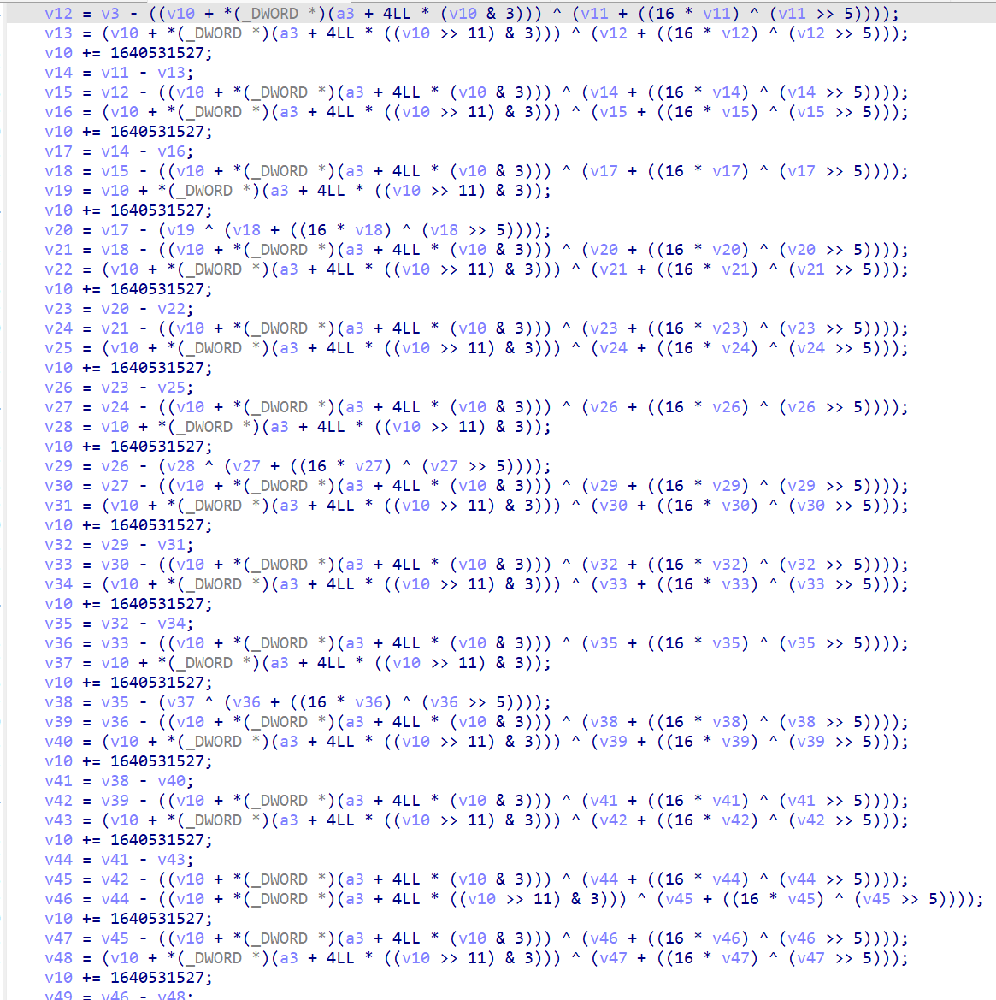

它的作用就是：

 生成/混淆出 XXTEA 所需的前半部分 key。

```c
key = [final_low, final_high, 0x12345678, 0x9ABCDEF0];

```

之后是加密函数sub_1400015E0，是一个改造过的 XXTEA 解密实现，固定迭代 11 轮。  

<!-- 这是一张图片，ocr 内容为：二 8 A1[3]; 9 ; A1[4]; 10 ; A1[5]; 111 - A1[6]; 12 三 *A1; 13 ; A1[7]; 27 三 V5; 222  V3; 23 11; WHILE ( 1 ) 1640531527; I V4 V25 *(D &3)); (_DWORD *)(A3 + 4LL * ((UNSIGNED INT)(V4 - 1640531527) V14 V21 : V12 + ((((16 ((V4 - 1640531527) * V6) + (V14 * V3))); (((16 * V3) A (V6 >> 3)) + ((V3 >> 5) 5) (4 * V6))))) V15 : *(_DWORD 2) & 3 人 1LL)); * (((UNSIGNED INT)(V4 - 1640531527) >> )(V26+4* V6 +二 (V21 A V15) + ((V4 - 1640531527) * * V7)) * (((((16 * V21) (V7 )>> 3)) + ((V21 >> 5) 2 (4 * V7)))))); - 1640531527) >> 2) & 3 A 3LL; V16 - (UNSIGNED INT)(V4 - V17: *(_DWORD *)(V26 +4* (((UNSIGNED INT)(V4 - 1640531527) >> >> 2) & 3\ 2LL); ((16 * V6) (V8 >> 3)) + ((V6 >> 5) 5) A * V8))))); V7 +三 (V6 A V17)+ (V25 A V8)) 0) * (((16 * V7) * (V9 >> 3)) + ((V7 2> 5) 5) (4 * V9))))); *)(V26+4 * V16))) 18 +(V25 A V9)+(V7*(DWORD V8 + ) A (V10 >> 3)) + (V8 >> 5) A (4 V10))); (((16 * V8) ( V9 +三 ((V8 A V14) + (V25 人 V10)) ((((() * V11)))); +(19)>> VIE *  (((() ( V15)+  V11 > >  (4 * (4 * V11 > (4 * V11 > 5)+ (4 *  (4 * VII); V18 三 (V10 A V17) + (V25 A V13); V4 V25; V11 +三 V18 \ (((16 * V10) > (V13 >> 3)) + (V1E >> 5) 5) (4 * V13)); 3)) + ((V11 >> 5) < (4 * V27))); ( DWORD *)(V26 + 4 * V16)) + (V25 A V27) (((16 * V11) > (V27 > (V27 > V13+(V111 V27 +- (V13 ( VI4) + (V25 A V22)) ((((16 * V13) (V22 > 3) + (V13 >> 5) V22)); 5) (4*V (4 (V25 A V21) ((((((16 * V27) (V21 >> 3> 3)) + ((V27 >> 5) V21)))) + V22; V3 ((V272715)+(V25 A3 三 V26; V19 ; V23-- 33 1; V22 三 V3; IF(V19) BREAK; V12 - V21; ESULT - V13; 41[1] - V6; -->
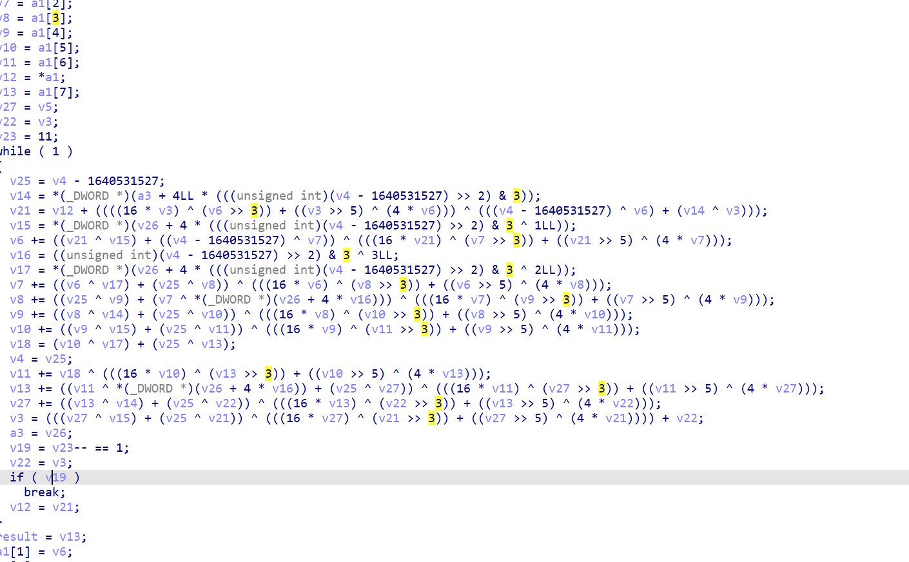

解密脚本

```python
def xxtea_decrypt_uint32(v, key):
    n = len(v)
    delta = 0x9E3779B9
    q = 11  # 题里固定跑 11 轮
    sum_ = (q * delta) & 0xFFFFFFFF

    while q > 0:
        e = (sum_ >> 2) & 3
        for p in range(n-1, -1, -1):
            z = v[p-1] if p > 0 else v[-1]
            y = v[p]
            v[p] = (y - (((z >> 5 ^ (v[(p+1) % n] << 2)) + (v[(p+1) % n] >> 3 ^ (z << 4))) ^ ((sum_ ^ v[(p+1) % n]) + (key[(p & 3) ^ e] ^ z)))) & 0xFFFFFFFF
        sum_ = (sum_ - delta) & 0xFFFFFFFF
        q -= 1
    return v

# v15: main 函数里的常量数组（10个 32-bit）
v15 = [
    1566723124,
    -2044068179,
    -1659816037,
    -53136879,
    1175413710,
    -981373336,
    -28114771,
    167777774,
    -1744380997,
    -280353208
]


v15 = [x & 0xFFFFFFFF for x in v15]

# key 的两个部分
key_low  = 0x12345678
key_high = 0x9ABCDEF0
final_low  = 1667592045
final_high = 555837044


key = [final_low, final_high, key_low, key_high]

# 解密
dec = xxtea_decrypt_uint32(v15[:], key)
plain = b''.join(x.to_bytes(4, 'little') for x in dec)

print("解密结果：", plain.decode(errors="ignore"))

```

moectf{X7e4_And_xx7EA_I5_BeautifuL!!!!!}


# 19 rusty_sudoku
shift+F12 查看字符串

<!-- 这是一张图片，ocr 内容为：CALLED  RESULT::UNWRAP() ON AN ERR VALUE RDATA:0--:0000002C INVALIDENTRYCELLCH NOTENOUGHCELLSFOOMANYCELLSMISSINGCOMMENTDELIMITER .RDATA:0...0000031 /RUSTE/294836836ED69D5F68DBO1964CDF2AF4A8609CB2\\1IBRARY\/ALLOC\\ERE\\ERE\\: .RDATA:000000004B .RDATA:0-000000000E INVALID INPUT. SRE LMAIN.RS RDATA:000000000051 6.8.3.3.3.18.3.3.3.3.3.3.3.3.3.3. YOU SHOULD NOT CHANGE THE BOARD! IN I NILL SIVE YOU THE FLAGAT JOUR ANSVER IN ONE LINE LINE (WITHOUT SPACES),LNFOR EXEMPLE, 6542197865 WELCOWO TO HOECTE 2025!\PLEASE *WFIND￥* MY SUDAKU AND FILL IT CORTECTLY.\NAND THEN I WILL .RDATA:0000000199 TRY AGAIN IN CONGRATULATION:/N YOUR FLAG IS MOECTF[ INVALIDSOLUTION ININININININININININININININININ CALLED RESULT::UNWRAPO ON AN BRR VALUE /RUSTC/29483G9SEED69D5F6+D601964CDF2AF4DS6E9CB2((LIBRARY1LCORE)(SRE)(STR((STR((PATTERN.RS UTF8ERRORVALID_UP_TOERROR_LEN LEGTESTES EN TE REARTERTENTE .RDATA:0.00000002F INININ_ RDATA:00000000006 C -->
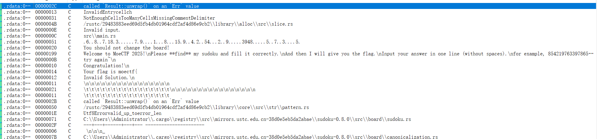

点进去看到

<!-- 这是一张图片，ocr 内容为：RDATA:00000001400C2227 QP DB'.6.8..7.18.3........1..8...15.9....4.2.......................................................6.... RDATA:00000001400C2228 A68718379181594 ; DATA XREF: RUSTY_SUDOKU::MAIN+48410 RDATA:00000001400C2228  DB '...5..7..3....5." RDATA:00000001400C2269 CH DB 'YOU SHOULD NOT CHANGE THE BOARD!' RDATA:000000001400C2279 AYOUSHOULDNOTCH 0 .RDATA:0000001400C2279 ; DATA XREF: RUSTY_SUDOKU::MAIN+63310  WELCOME TO MOECTF 2025!",OAH .RDATA:00000001400C2299 AWELCOMETOMOECT DB ; DATA XREF: .RDATA:OFF 1400C2438LO .RDATA:0000001400C2299 PLEASE **FIND** MY SUDOKU AND FILL IT CORRECTLY... OAH QP RDATA:000000001400C22B1 DB 'AND THEN I WILL GIVE YOU THE FLAG.',OAH RDATA:00000001400C22E2 DB 'INPUT YOUR ANSWER IN ONE LINE (WITHOUT SPACES).', OAH ,RDATA:00000001400C2305 DB IFOR B'FOR EXAMPLE, 8542197633978654212614739857851263946495381721329478' ,RDATA:0000001400C2335 QP .RDATA:0000001400C2376 56926384517513792648478651239 REPRESENTS:'. OAH 854|219 763',0AH ,RDATA:00000001400C23A0 397|865|421',0AH DB RDATA:00000001400C23AC |473|985',0AH '261 QP ,RDATA:00000001400C23B8 OAH DB RDATA:00000001400C23C4 DB '785|126 394 OAH RDATA:00000001400C23D0 OAH 172 B49 538 .RDATA:00000001400C23DC OAH .RDATA:0000001400C23E8 DB'132947 856 OAH ,RDATA:00000001400C23F4 DB'926|384 517',0AH RDATA:00000001400C2400 DB 513|792|648',0AH RDATA:000000001400C240C 478651 239元 QP OAH RDATA:00000001400C2418 DB OAH RDATA:00000001400C2424 DB 'YOUR ANSWER:',OAH RDATA:00000001400C2425 .RDATA:0000001400C2432 DB ALIGN 8 RDATA:00000001400C2433 DQ OFFSET AWELCOMETOMOECT RDATA:00000001400C2438 OFF_1400C2438 , DATA XREF: RUSTY SUDOKU::MAIN+17TO RDATA:00000001400C2438 3 "WELCOME TO MOECTF 2025!\NPLEASE **FIND*".. RDATA:00000001400C2438 RDATA:00000001400C2440 .RDATA:0000001400C2441 O .RDATA:00000001400C2442 -->
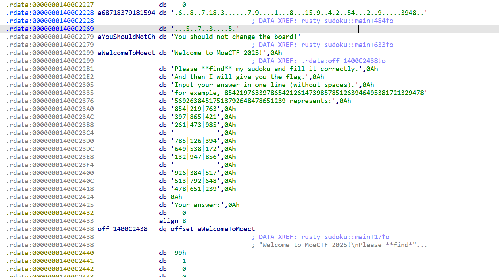

通过交叉引用，定位到rusty_sudoku::main函数

<!-- 这是一张图片，ocr 内容为：3) _INT64 A2,__INT64 INT64 _FASTCALL RUSTY_SUDOKU::MAIN(_INT64 A - A1, _INT128 *V3; // RDI _INT64 V4;// RDX SIZE_T V5; // RDX __INT8*V6;// RCX UNSIGNED *V7;// RSI INT8 UNSIGNED *V8; // R9 INT8 UNSIGNED *V9;// R8 INT8 UNSIGNED V10;// CHAR R11 _INT8*V11;// RBX UNSIGNED INT8 *V12; / RAX UNSIGNED INT V13;// R11D UNSIGNED INT V14; 1/ R9D INT V15; // R14D INT V16;// EBP UNSIGNED INT V17; // EBX _INT64 V18;// RBX CHAR V19;// B1 _INT8*V20;// R11 UNSIGNED L;//ESI INT V21; UNSIGNED CHAR V22; // BL CHAR V23; // BP INT V24;// EBP INT V25;// EBX UNSIGNED INT V26; / EBX SIZE_T V27; / R15 INT64 V28;// R14 INT64 V29;// RAX _INT64 V30;// R9 _INT64 V31; / RDX _INT64 V32; // RAX INT V33; // ECX INT V34; // EDX INT V35; // R8D _INT64 RESULT; // RAX _INT64 V37; // RAX _INT64 V38; // RDX INT V39; // R8D INT V40; // R9D INT V41; // R11D INT V42; / R10D INT V43; // R10D INT V44; / //EBP -->
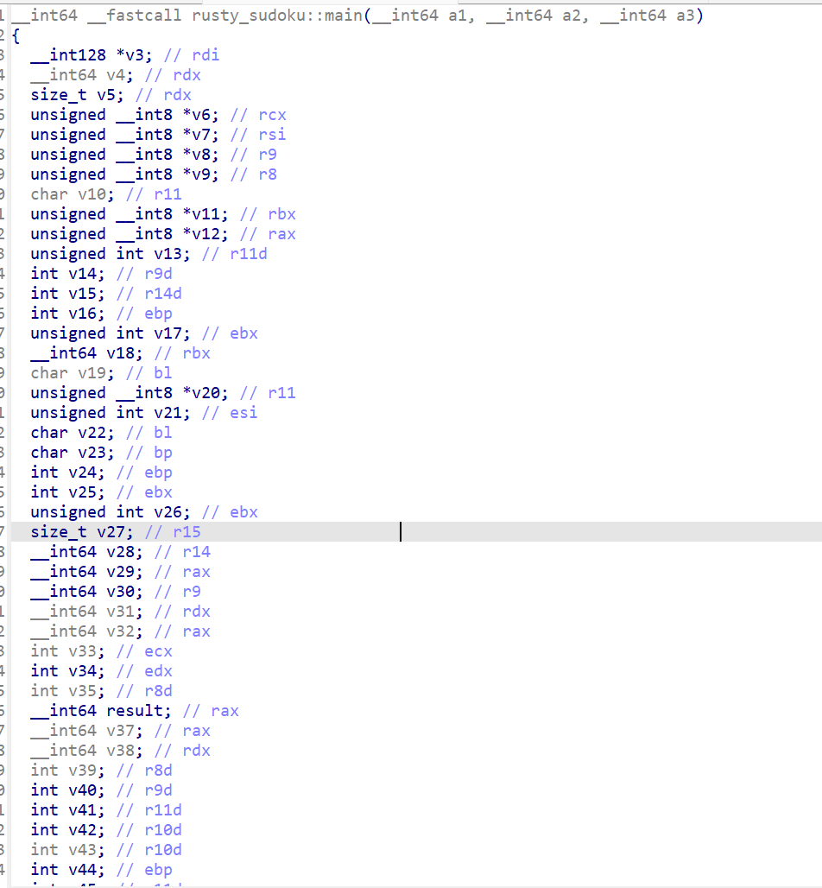

分析函数以及在字符串中看到的提示，就是找到一个正确的9*9数独，再回到字符串视图页面，发现有一个未补全的数独，点进去看到完整的数独

<!-- 这是一张图片，ocr 内容为：...8..7.18.3............................................................8....8....................... 00000051 .RDATA:0. YOU SHOULD NOT CHANGE THE BOARD! 00000020 GE RDATA:0 -->
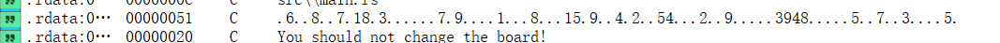

<!-- 这是一张图片，ocr 内容为：3.3......7.9........8...15.9..4.2......................3948. 1.6..8..7.18. .RDATA:00000001400C2228 A68718379181594 594 DB ..3948. DATA XREF: RUSTY_SUDOKU::MAIN+48410 RDATA:00000001400C2228 QP B '..5..7..3.....5.' RDATA:00000001400C2269 CH DB RDATA:00000001400C2279 AYOUSHOULDN THE BOARD! YOU SHOULD NOT CHANGE -->
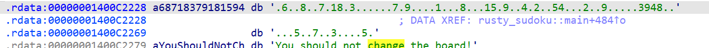

使用在线工具

<!-- 这是一张图片，ocr 内容为：成功!解法找到了. 7 5 2 3 8 6 4 9 1 7 5 2 4 8 L 9 3 6 撤消 全部清除 擦除 31 5 6 7 4 2 9 8 7 415 8 2 2 6 6 3 3 43 7 5 6 2 8 3 1 6 1 4 2789 5 6 6 5 4 7 5 6 1 2 3 48 6 27 3 5 6 8 1 8 9 4237981 5 8 6 6 -->
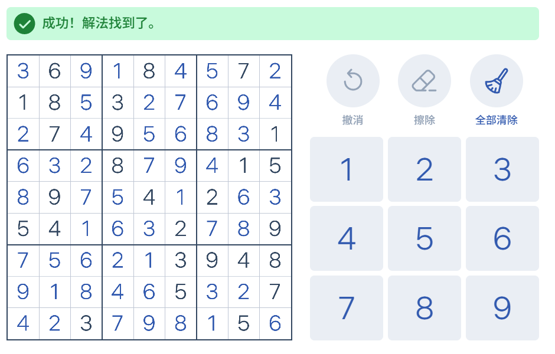

将 369184572185327694274956831632879415897541263541632789756213948918465327423798156  作为程序的输入

<!-- 这是一张图片，ocr 内容为：E:\MOECTF2025\RUSTY_SUDOKU>. USTY_SUDOKU_FINAL.EXE WELCOME TO MOECTF 2025! PLEASE **FIND** MY SUDOKU AND FILL IT CORRECTLY. AND THEN I WILL GIVE YOU THE FLAG. INPUT YOUR ANSWER IN ONE LINE (WITHOUT SPACES). FOR EXAMPLE,854219763397865421261473985785123946394649538172132947856926384517513792648478651239 EPRESENTS: 854|219|763 397 865|421 473|985 261 126|394 785 538 172 649 132 947|856 384|517 926 792 648 513 478|651|239 YOUR ANSWER: 369184572185327694274956831632879415897541263541632789756213948918465327423798156 CONGRATULATION YOUR FLAG IS MOECTFLA8C79927D4E830C3FE52E79F410216A0} -->
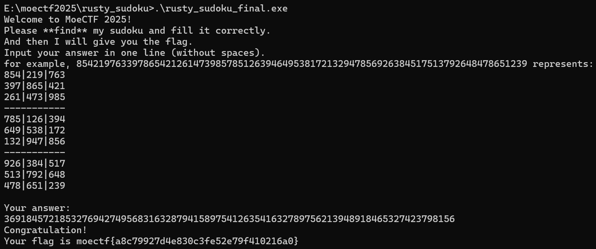

moectf{a8c79927d4e830c3fe52e79f410216a0}


# 01 speed
IDA定位主函数，发现返回到WinMain函数里

<!-- 这是一张图片，ocr 内容为：V3 - 1; 子 ( (_BYTE)V5 - 34 ) IF ELSE V3 A: 1U; IF ( ISMBBLEAD(V5) ) O) - (V4[1] 1; V4 +三 ++V4; (CHAR*)&UNK_7FF7D22A5010; V4 LABEL_15: MEMSET(&STARTUPINFO, O, SIZEOF(STARTUPINFO)); GETSTARTUPINFOA(&STARTUPINFO); WSHOWWINDOW 10; IF ( (STARTUPINFO.DWFLAGS & 1) !- 0 ) IF WSHOWWINDOW - STARTUPINFO.WSHOWWINDOW; RETURN WINMAIN((HINSTANCE)REFPTR- IMAGEBASE, OLL, V4, WSHOWWINDOW); -->
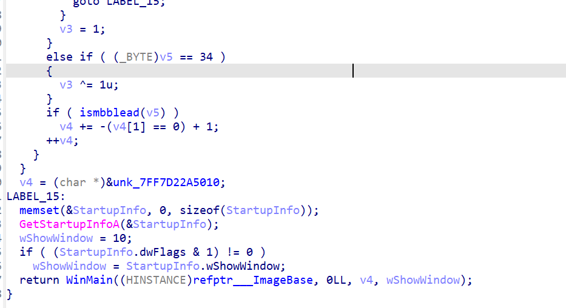

打开该函数，这个函数注册了一个窗口，只显示1秒，就立即销毁，真正的逻辑在WndProc里

<!-- 这是一张图片，ocr 内容为：-STDCALL WINMAIN(HINSTANCE HINSTANCE, HINSTANCE HPREVINSTANCE INT [RSP+60H] [RBP-20H] BYREF MSG MSG; WNDCLASSA WNDCLASS; [H06+DSR] BYREF [RBP+10H] [RSP+EOH] CHAR CLASSNAME[24]; [RBP+60H] BYREF HWND HWND;// [RSP+F8H] [RBP+78H] STRCPY(CLASSNAME, "SAMPLE WINDOW CLASS"); MEMSET(&WNDCLASS, O, SIZEOF(WNDCLASS)); (WNDPROC)WNDPROC; WNDCLASS.LPFNWNDPROC HINSTANCE; WNDCLASS.HINSTANCE WNDCLASS.LPSZCLASSNAME CLASSNAME; REGISTERCLASSA(&WNDCLASS); HWND : CREATEWINDOWEXA( O, CLASSNAME, "MOECTF 2025", OXCA0000U, 0X80000000 0X80000000, 400元 100元 OLL, OLL, HINSTANCE, OLL); IF ( !HWND RETURN O; SHOWWINDOW(HWND, NSHOWCMD); UPDATEWINDOW(HWND); SLEEP(1U); DESTROYWINDOW(HWND); MEMSET(&MSG, O, SIZEOF(MSG)); GETMESSAGEA(&MSG, OLL, 0, 0) > 0 ) WHILE TRANSLATEMESSAGE(&MSG); DISPATCHMESSAGEA(&MSG); O; RETURN 子 -->
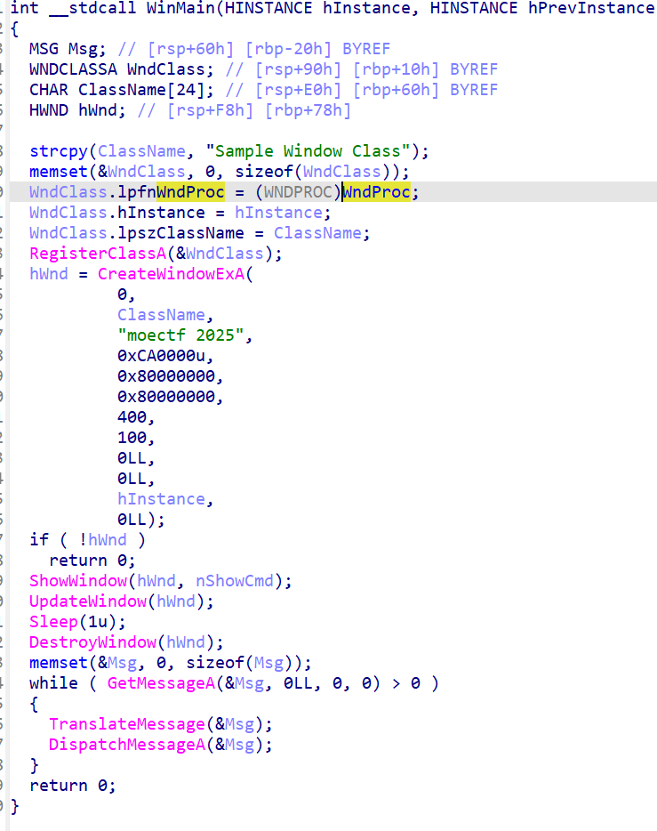

打开WndProc函数

<!-- 这是一张图片，ocr 内容为：POSTQUITMESSAGE(0); RETURN OLL; ELSE IF ( A2 : 15 ) HDC - BEGINPAINT(AL, &PAINT); "YOUR FLAG IS "); STRCPY(DESTINATION, V7 三 0; OLL; V8 V9 0LL; V10 0LL; OLL; V11 OLL; V12 OLL; V13 OLL; V14 OLL; V15 OLL; V16 OLL; V17 OLL; V18 OLL; V19 OLL; V20 V21 0LL; *(_QWORD *)STR - OX7F1B3E885EF9160LL; V25 0X2CD336BCB0464A89LL; V26[0] 三 0XEF5FC91642917EE1ULL; *(_QWORD *)(CHAR *)V26 + 6) 三 0X739D40A4E356EF5FLL; STRCPY(V23, "MYLITTLEPONY"); V28 12; V27 三 STRLEN(STR); *)STR, V27, (CONST UNSIGNED __INT8 *)V23, 12); RC4CRYPT((UNSIGNED._INT8 STRCAT(DESTINATION, STR); GETCLIENTRECT(A1, &RECT); DRAWTEXTA(HDC, DESTINATION, -1, &RECT, OX40005U); ENDPAINT(AL, &PAINT); RETURN OLL; ELSE  RETURN DEFWINDOWPROCA(AL, A2, A3, A4); -->
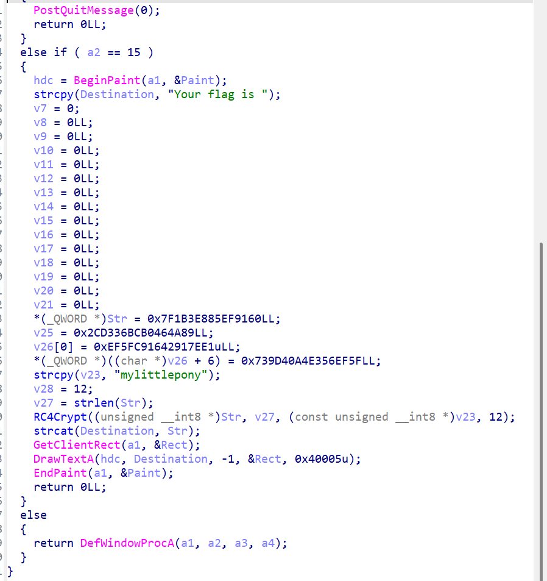

加密算法为RC4，密钥 (key): "mylittlepony"

密文

<!-- 这是一张图片，ocr 内容为：)STR0X7F1B3E885EF9160LL; QWORD 0X2CD336BCB0464A89LL; V25 V26[0] 0XEF5FC91642917EE1ULL; )(CHAR *)V26 + 6) 三 0X739D40A4E356EF5FLL; (_QWORD -->
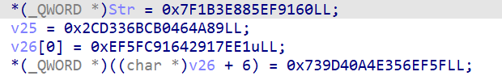

<!-- 这是一张图片，ocr 内容为：__FASTCALL RC4CRYPT(UNSIGNED __INT8 *AL, INT A2, INT64 CO _INT64 RESULT; // R RAX [RSP+OH][RBP-80H] INT64 BYREF LINT8 V6[257]; / [RSP+20H] [RBP-60H] UNSIGNED _INT8 V7; // [RSP+121H] [RBP+A1H] UNSIGNED INT8 V83//[RSP+122H][RBP+AZH] UNSIGNED _INT8 V9; // [RSP+123H] [RBP+A3H] IGNED UNSI  INT I; / [RSP+124H] [RBP+A4H] UNSIGNED [RSP+128H] [ [ ] [RBP+A8H] INT V11; [RSP+12CH] INT V12; [RBP+ACH] _INT8 *)&V5 + 32, A3, A4); RC4INIT((UNSIGNED V12 0; V11 FOR(I-0;;++++I) } RESULT : I;  IF (INT)I >: A2 ) BREAK; 三 (V12 + 1) % 256; V12 V11 三 (V6[V12] + V11) % 256; V9 三 V6[V12]; V6[V12] ; V6[V11]; V6[V11] 三 V9; V8 三 V6[V12] + V6[V11]; V7 - V6[V8];  A1[I] - V7; RETURN RESULT; -->
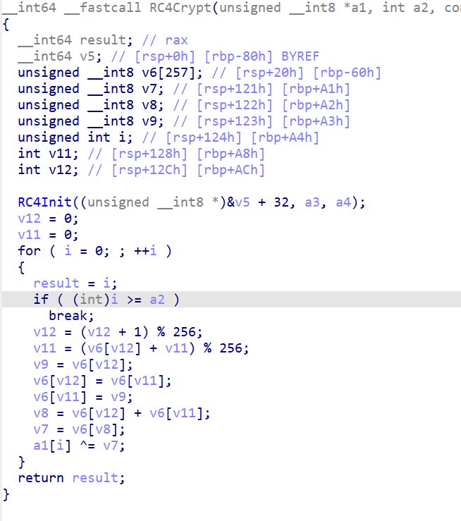

```python
def rc4_crypt(key: bytes, data: bytes) -> bytes:
    # simple RC4 (KSA + PRGA)
    S = list(range(256))
    j = 0
    # KSA
    for i in range(256):
        j = (j + S[i] + key[i % len(key)]) & 0xFF
        S[i], S[j] = S[j], S[i]
    # PRGA
    i = 0
    j = 0
    out = bytearray(len(data))
    for idx in range(len(data)):
        i = (i + 1) & 0xFF
        j = (j + S[i]) & 0xFF
        S[i], S[j] = S[j], S[i]
        K = S[(S[i] + S[j]) & 0xFF]
        out[idx] = data[idx] ^ K
    return bytes(out)

def main():
    key = b"mylittlepony" 
    str_part = (0x07F1B3E885EF9160).to_bytes(8, "little")  

    
    v25 = (0x2CD336BCB0464A89).to_bytes(8, "little")


    v26 = bytearray((0xEF5FC91642917EE1).to_bytes(8, "little"))

    
    overwrite = (0x739D40A4E356EF5F).to_bytes(8, "little")
    
    v26[6:6+8] = overwrite

    cipher_bytes = str_part + v25 + bytes(v26)

    plaintext = rc4_crypt(key, cipher_bytes)

    print("raw decrypted bytes:", plaintext)
    try:
        s = plaintext.decode("utf-8")
    except UnicodeDecodeError:
        s = plaintext.decode("utf-8", errors="ignore")
    print("decoded (utf-8, ignoring errors):")
    print(s)

if __name__ == "__main__":
    main()

```

<!-- 这是一张图片，ocr 内容为：M LOCAL WINDOWS DEBUGGER UNEXPLORED EXTERNAL SYMBOL LIBRARY FUNCTION DATA REGULAR FUNCTION LUMINA FUNCTION INSTRUCTION IDA VIEW-RIP, GENERAL REGISTERS. MODULES, THREADS, HEX VIEW-1. STACK VIEW IDA VIEW-RIP MOECTF 2025 YOUR FLAG IS MOECTFJUST_DYN@MIC_D3BUGGLNG] E:\MOECTF2025\SPEED\SPEED.EX NAME  PORTABLE EXECUTABLE FOR AMD6 NAT 140000000 LINAGEBASE AAATIONOOJJ/AAAA:7XA7 6897959C (SAT AUG 09 18:38:2 TIMESTAMP TEXT:00007FF66C6E1000 SECTION 1. (VIRTUAL ADDRESS 00001000) TEXT:00007FF66C6E1000 000021C8 TEXT:00007FF66C6E1000 VIRTUAL SIZE  SECTION SIZE IN FILE 00002200 TEXT:00007FF66C6E1000 OFFSET TO RAW DATA FOR SECTION: 0000600 TEXT:00007FF66C6E1000 S 6000060: TEXT DATA EXECUTABLE READA FLAGS 6 .TEXT:0007FF66C6E1000 ;FLA ALIGNMENT DEFAULT TEXT:00007FF66C6E1000 TEXT:00007FF66C6E1000  SEGMENT TYPE: PURE CODE .TEXT:00007FF66C6E1000  SEGMENT PERMISSIONS: READ/EXECUTE TEXT:00007FF66C6E1000 _TEXT SEGMENT PARA PUBLIC 'CODE' USE64 TEXT:00007FF66C6E1000  ASSUME CS:_TEXT TEXT:00007FF66C6E1000 .TEXT:00007FF66C6E1000 ;ORG 7FF66C6E1000H .TEXT:00007FF66C6E1000 ASSUME ES:NTDLL_DLL, SS:NTDLL_DLL, DS:_DATA, .TEXT:0007FF66C6E1000 TEXT:00007FF66C6E1000 TEXT:00007FF66C6E1000 MINGW_INVALIDPARAMETERHANDLE VOID CDEC1 .TEXT:00007FF66C6E1000 _MINGW_INVALIDPARAMETERHANDLER PROC NEAR .TEXT:00007FF66C6E1000 TEXT:00007FF66C6E1000 RETN _MINGW_INVALIDPARAMETERHANDLER ENDP TEXT:00007FF66C6E1000 TEXT:00007FF66C6E1000 -->
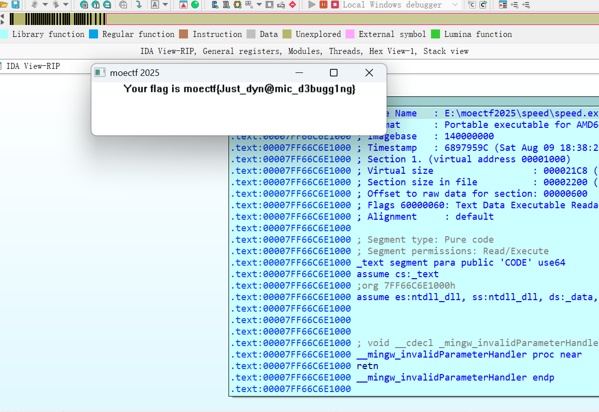

moectf{Just_dyn@mic_d3bugg1ng}


# 04 catch
定位主函数，

<!-- 这是一张图片，ocr 内容为： -->
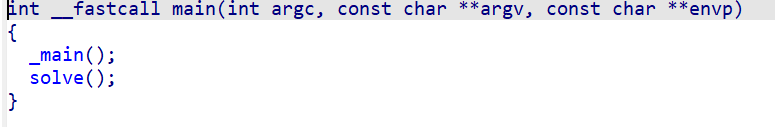

打开solve函数

<!-- 这是一张图片，ocr 内容为： -->
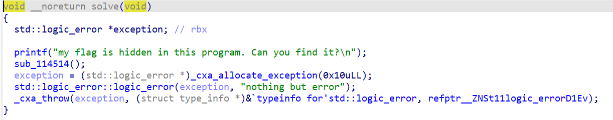

看到提示，打开sub_114514()函数

<!-- 这是一张图片，ocr 内容为： -->
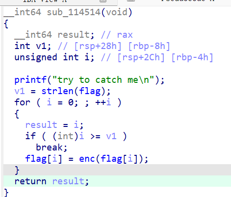

发现是根据enc函数进行加密

flag字符串为

<!-- 这是一张图片，ocr 内容为： -->
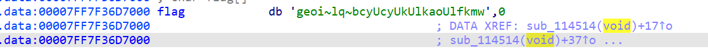

enc函数就是一个简单的异或

<!-- 这是一张图片，ocr 内容为： -->
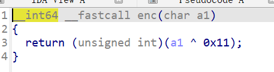

异或结果为

<!-- 这是一张图片，ocr 内容为： -->
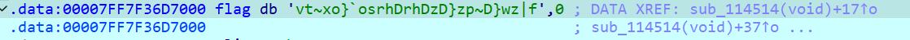

显然不是我么们的flag，回到刚才的提示flag就藏在项目里，我们查看字符串看到可疑对象

<!-- 这是一张图片，ocr 内容为： -->
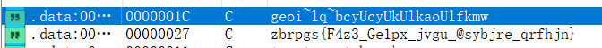

使用解码工具一键解码

<!-- 这是一张图片，ocr 内容为： -->
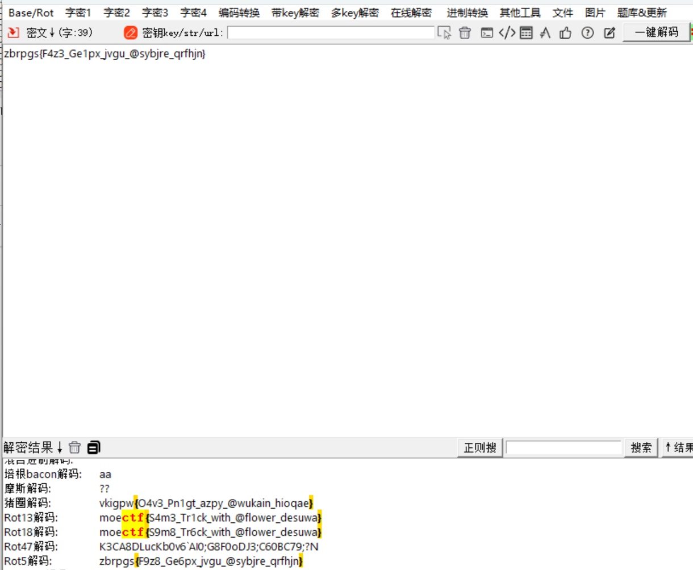

Rot13解码:		moectf{S4m3_Tr1ck_with_@flower_desuwa}


# 12 have_fun
点开WinMain函数，是一个典型的 Win32 GUI 程序入口（WinMain）的反编译版

<!-- 这是一张图片，ocr 内容为： -->
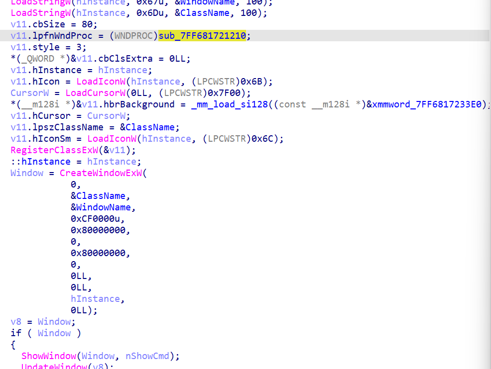

 入口 WinMain 很模板化，实质逻辑都在 sub_140001210

<!-- 这是一张图片，ocr 内容为： -->
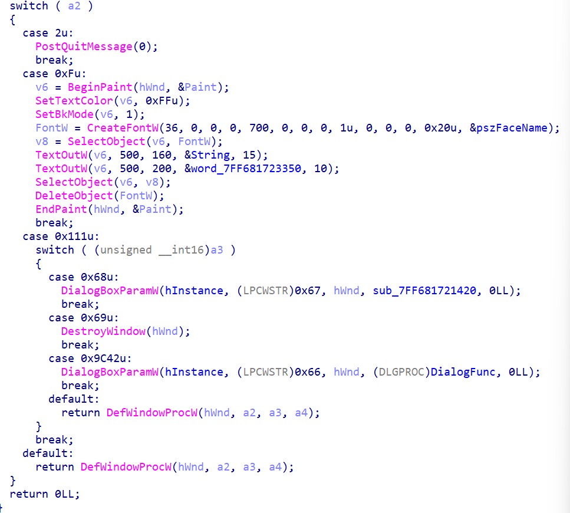

分别查看sub_7FF681721420函数与DialogFunc函数，发现前者是空壳，真正的加密逻辑在DialogFunc里

<!-- 这是一张图片，ocr 内容为： -->
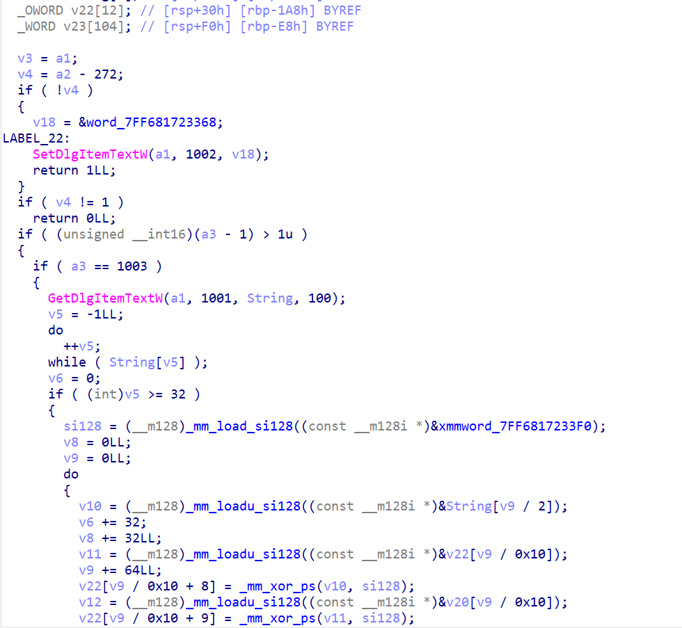

输入长度为16

<!-- 这是一张图片，ocr 内容为： -->
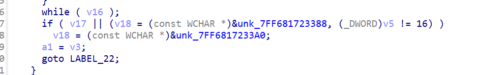

 对每个字符做异或

<!-- 这是一张图片，ocr 内容为： -->
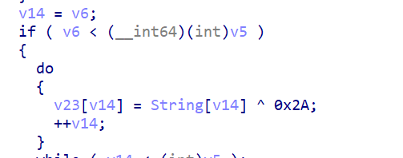

把异或后的结果 v23 与目标常量比较

<!-- 这是一张图片，ocr 内容为： -->
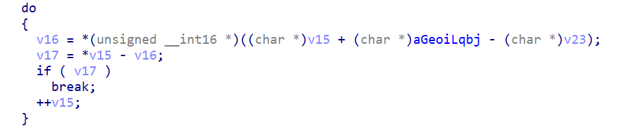

目标常量为['G','E','O','I','^','L','Q','b','j','\\', 0x1E, 'u','L', 0x7F,'D','W']

<!-- 这是一张图片，ocr 内容为： -->
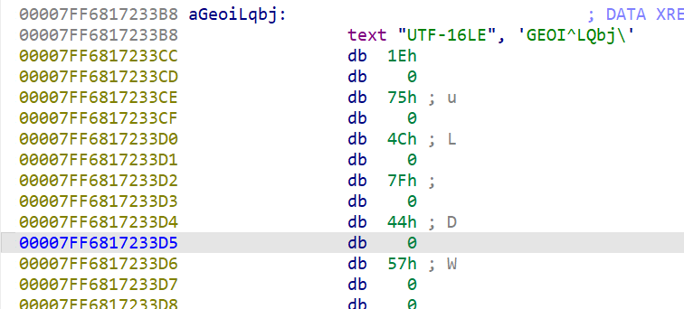

解密

```python
# 只需改这里：把 .rdata 里目标串的 16 个字节（低 8 位）填进来
target = [
    0x47, 0x45, 0x4F, 0x49, 0x5E, 0x4C, 0x51, 0x62,
    0x6A, 0x5C, 0x1E, 0x75, 0x4C, 0x7F, 0x44, 0x57
]

flag = ''.join(chr((b ^ 0x2A) & 0xFF) for b in target)
print(flag)  # -> moectf{H@v4_fUn}

```

moectf{H@v4_fUn}


# 07 ezandroid
在AndroidManifest.xml找到android:name  **com.example.ezandroid.MainActivity**

<!-- 这是一张图片，ocr 内容为： -->
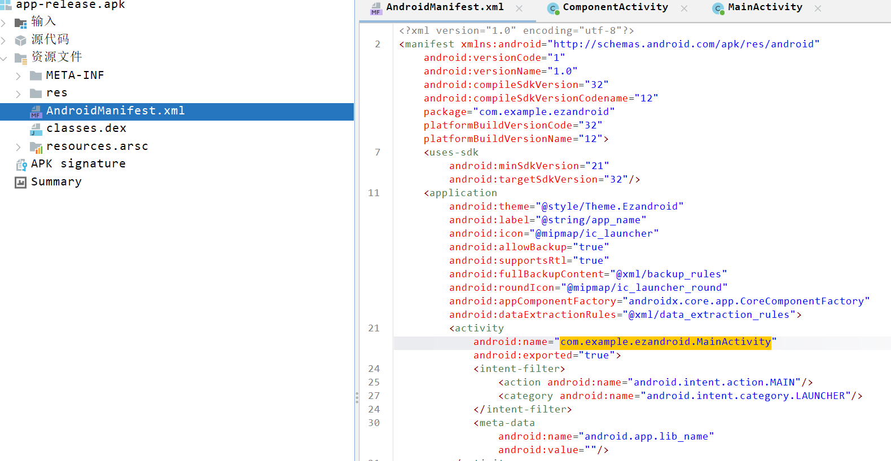

在源代码里按照路径打开**com.example.ezandroid.MainActivity**

<!-- 这是一张图片，ocr 内容为： -->
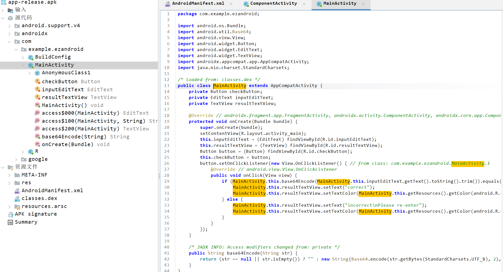

是一个base64编码，字符串为**bW9lY3Rme2FuZHJvaWRfUmV2ZXJzZV9JNV9lYXN5fQ==**

<!-- 这是一张图片，ocr 内容为： -->
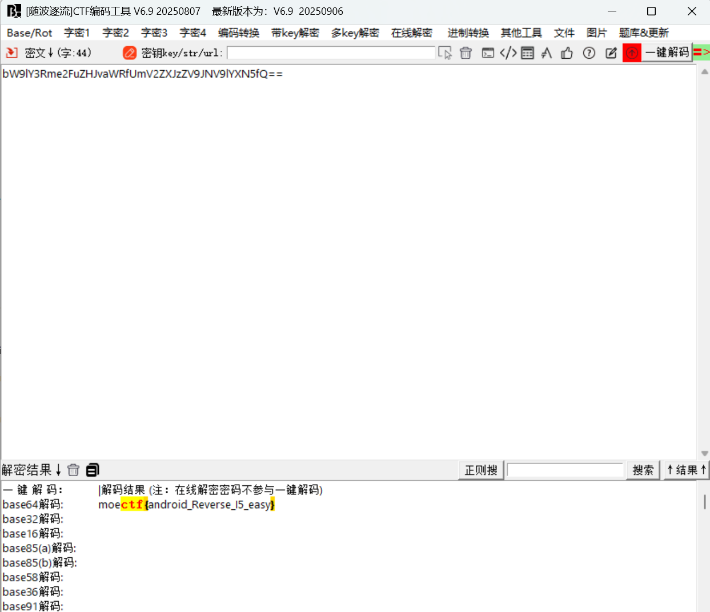

moectf{android_Reverse_I5_easy}


# 18 ezandroid.pro
用jdax打开这个apk文件

定位到AndroidManifest.xml，在其中找到android:name

<!-- 这是一张图片，ocr 内容为： -->
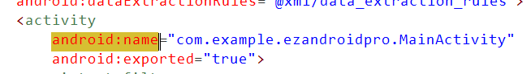

按照此路径在源代码中打开

<!-- 这是一张图片，ocr 内容为： -->
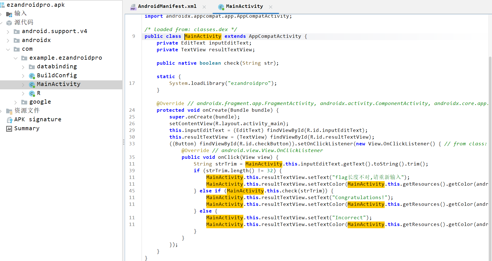


 Java 层只做了长度检查（32）和 check(str) 的调用；真正判定逻辑在 native 库 libezandroidpro.so

把apk后缀名改为zip

在ida中打开libezandroidpro.so

定位到Java_com_example_ezandroidpro_MainActivity_check函数

<!-- 这是一张图片，ocr 内容为： -->
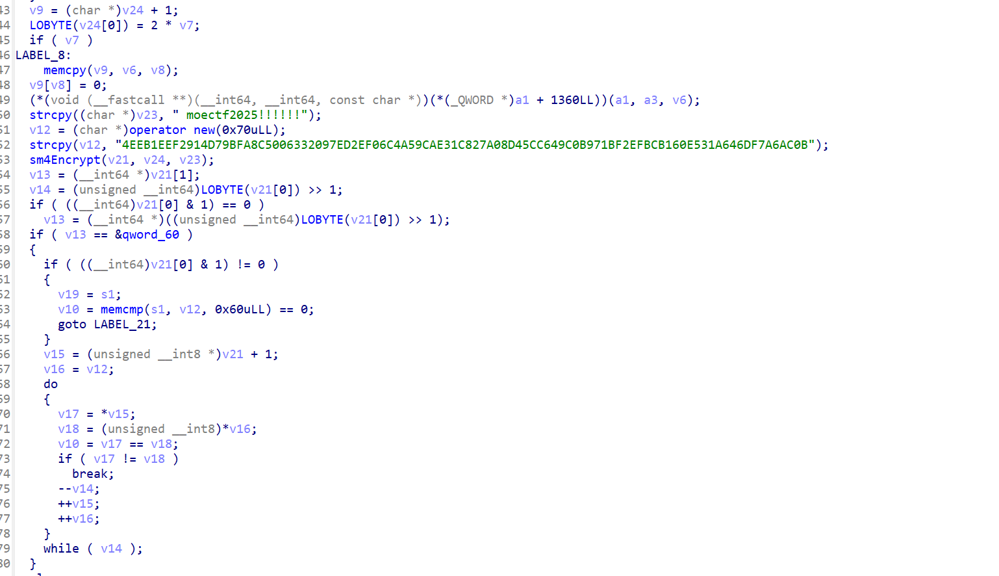

是一个sm4—ECB加密，密钥是moectf2025!!!!!!

明文4EEB1EEF2914D79BFA8C5006332097ED2EF06C4A59CAE31C827A08D45CC649C0B971BF2EFBCB160E531A646DF7A6AC0B

<!-- 这是一张图片，ocr 内容为： -->
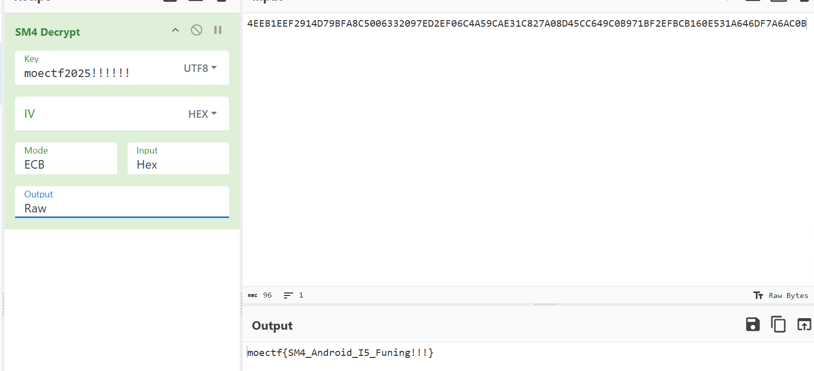

moectf{SM4_Android_I5_Funing!!!}


# 05 upx
用die打开有upx加壳

<!-- 这是一张图片，ocr 内容为： -->
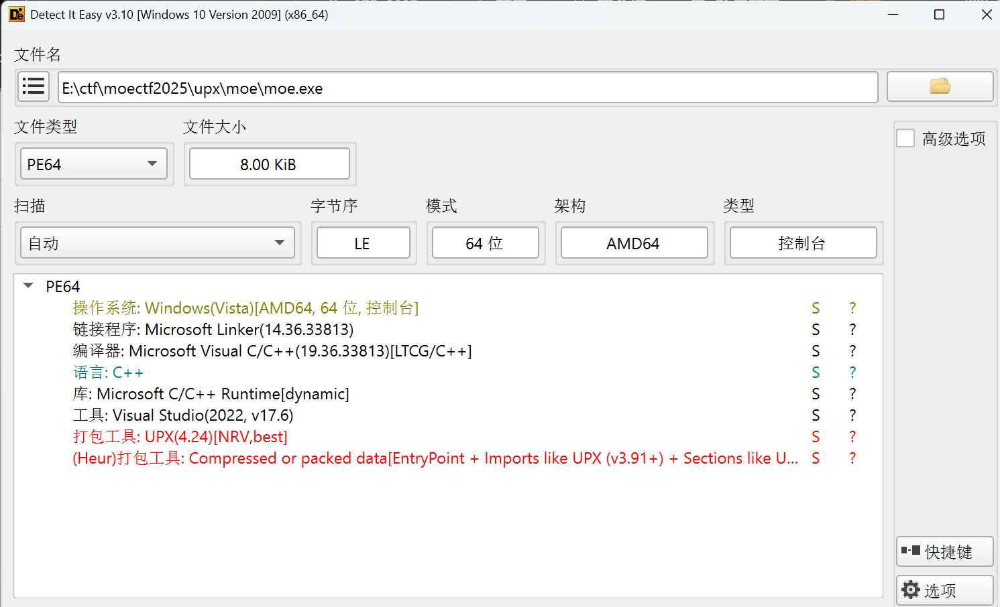

用upx脱壳

<!-- 这是一张图片，ocr 内容为： -->
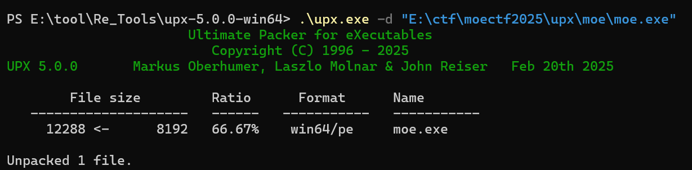

脱壳完成在ida中打开，定位主函数

<!-- 这是一张图片，ocr 内容为： -->
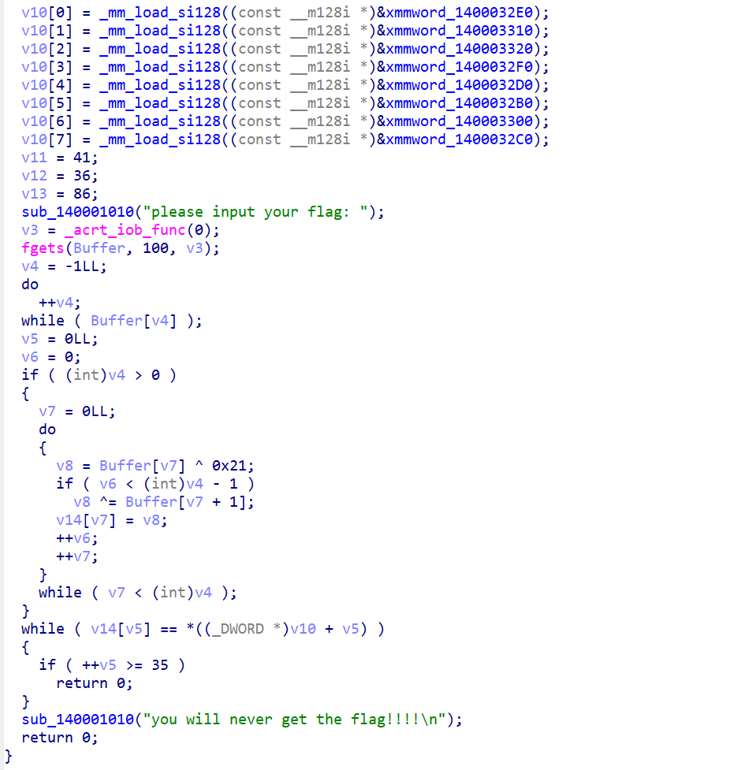

字符串长度为35

<!-- 这是一张图片，ocr 内容为： -->
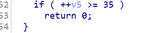

加密过程

<!-- 这是一张图片，ocr 内容为： -->
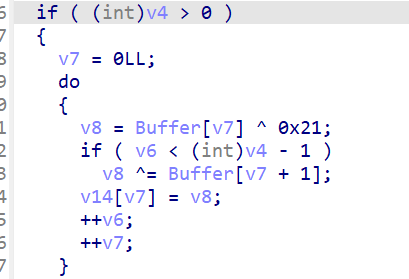

要加密的数据（按顺序）

<!-- 这是一张图片，ocr 内容为： -->
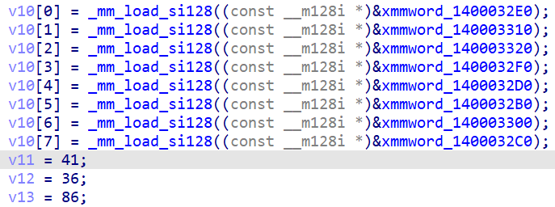

<!-- 这是一张图片，ocr 内容为： -->
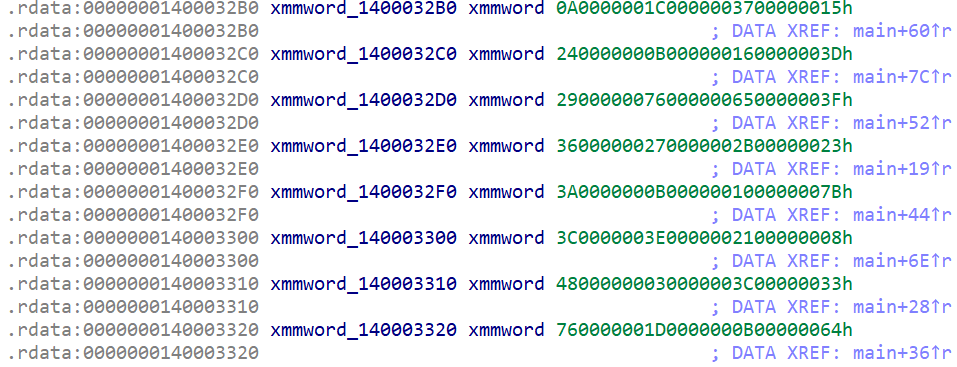

脚本

```python

def reverse_decrypt(encrypted_data):
    
    decrypted = []

    for i in range(len(encrypted_data)):
        if i == 0:
            # 第一个字符已知是 'm' (moectf的开头)
            first_char = ord('m')
            decrypted.append(first_char)
        else:
            # 使用链式XOR解密公式
            prev_encrypted = encrypted_data[i-1]  # 前一个加密字节
            prev_decrypted = decrypted[i-1]       # 前一个解密字节
            current_char = prev_encrypted ^ prev_decrypted ^ 0x21
            decrypted.append(current_char)

    return bytes(decrypted)

def encrypt_for_verification(plaintext):

    plaintext_bytes = plaintext.encode('ascii')
    encrypted = []

    for i in range(len(plaintext_bytes) - 1):
        # 加密公式: encrypted[i] = (plaintext[i] ^ 0x21) ^ plaintext[i+1]
        enc_byte = (plaintext_bytes[i] ^ 0x21) ^ plaintext_bytes[i+1]
        encrypted.append(enc_byte)

    return encrypted

def solve_moe_exe():

    print("=== moe.exe CTF题目解密算法 ===")
    print("题目类型: UPX脱壳 + 自定义XOR加密")
    print()

    
    complete_encrypted_data = [
        0x23, 0x2B, 0x27, 0x36, 0x33, 0x3C, 0x03, 0x48, 0x64, 0x0B, 0x1D, 0x76,
        0x7B, 0x10, 0x0B, 0x3A, 0x3F, 0x65, 0x76, 0x29, 0x15, 0x37, 0x1C, 0x0A,
        0x08, 0x21, 0x3E, 0x3C, 0x3D, 0x16, 0x0B, 0x24, 0x29, 0x24
    ]

    print(f"加密数据长度: {len(complete_encrypted_data)} 字节")
    print("加密数据 (16进制):")
    for i in range(0, len(complete_encrypted_data), 16):
        chunk = complete_encrypted_data[i:i+16]
        hex_str = ' '.join(f'{b:02X}' for b in chunk)
        print(f"  {hex_str}")
    print()

    # 执行解密
    print("开始解密...")
    decrypted_bytes = reverse_decrypt(complete_encrypted_data)

    # 转换为字符串
    try:
        decrypted_str = decrypted_bytes.decode('ascii')
        print(f"解密结果: {decrypted_str}")
    except UnicodeDecodeError:
        print("解密结果包含非ASCII字符，显示原始字节:")
        print(decrypted_bytes)
        return None

    # 检查并修正flag格式
    if decrypted_str.startswith('moectf{') and not decrypted_str.endswith('}'):
        # 手动添加结尾的'}'
        final_flag = decrypted_str + '}'
        print(f"修正后的flag: {final_flag}")
    else:
        final_flag = decrypted_str

    # 验证flag格式
    if final_flag.startswith('moectf{') and final_flag.endswith('}'):
        print("✅ Flag格式正确!")

        if 'upx' in final_flag.lower():
            print("🎯 包含UPX关键词，符合题目背景!")

        return final_flag
    else:
        print("❌ Flag格式不正确")
        return None

def demo_step_by_step():
    """
    演示解密过程的每一步
    """
    print("\n=== 逐步解密演示 ===")

    # 使用前10字节进行演示
    demo_data = [0x23, 0x2B, 0x27, 0x36, 0x33, 0x3C, 0x03, 0x48, 0x64, 0x0B]

    print("演示数据:", ' '.join(f'{b:02X}' for b in demo_data))
    print()

    decrypted = []

    for i in range(len(demo_data)):
        if i == 0:
            # 第一个字符
            char = ord('m')
            decrypted.append(char)
            print(f"步骤 {i+1}: 第一个字符已知 = 'm' (0x{char:02X})")
        else:
            # 后续字符的解密
            prev_encrypted = demo_data[i-1]
            prev_decrypted = decrypted[i-1]
            current_char = prev_encrypted ^ prev_decrypted ^ 0x21
            decrypted.append(current_char)

            char_display = chr(current_char) if 32 <= current_char <= 126 else f'\\x{current_char:02x}'
            print(f"步骤 {i+1}: {prev_encrypted:02X} ^ {prev_decrypted:02X} ^ 21 = {current_char:02X} ('{char_display}')")

    # 显示部分结果
    partial_result = bytes(decrypted).decode('ascii', errors='ignore')
    print(f"\n部分解密结果: {partial_result}")

def main():
    """
    主函数 - 执行完整的解密流程
    """
    print("moe.exe CTF题目完整解密算法")
    print("=" * 50)

    # 1. 执行解密
    final_flag = solve_moe_exe()

    if final_flag:
        print(f"\n🏆 最终Flag: {final_flag}")

        # 2. 演示解密步骤
        demo_step_by_step()

        print("\n" + "=" * 50)
        print("解密完成!")
        print(f"Flag: {final_flag}")
        print("题目类型: UPX脱壳 + 自定义XOR加密算法逆向")
        print("=" * 50)

        return final_flag
    else:
        print("\n❌ 解密失败")
        return None

if __name__ == "__main__":
    main()

```

moectf{Y0u_c4n_unp4ck_It_vvith_upx}


# 06 ez3
ida中打开定位到主函数

<!-- 这是一张图片，ocr 内容为： -->
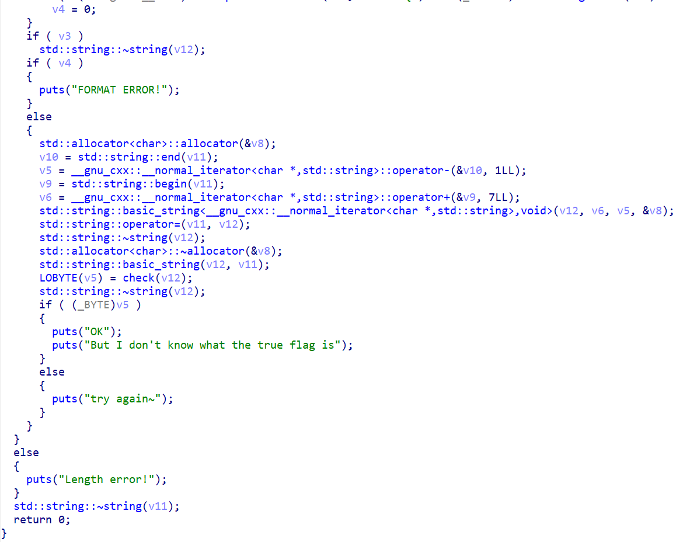

flag长度为42

<!-- 这是一张图片，ocr 内容为： -->
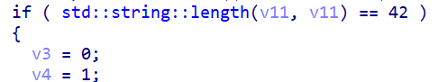

真正的加密逻辑在check（）

<!-- 这是一张图片，ocr 内容为： -->
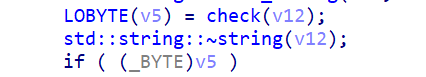

点开

<!-- 这是一张图片，ocr 内容为： -->
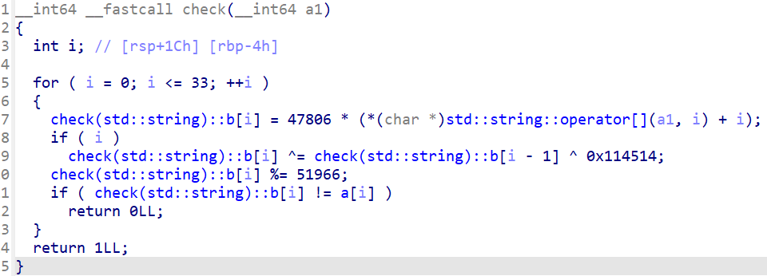

脚本

```python
#!/usr/bin/env python3
# -*- coding: utf-8 -*

MOD = 51966
MUL = 47806
XOR_VAL = 0x114514
LEN = 34

# expected 数组（你给出的值）
a = [
    0x0B1B0, 0x5678, 0x7FF2, 0xA332, 0xA0E8, 0x364C, 0x2BD4,
    0xC8FE, 0x4A7C, 0x18, 0x2BE4, 0x4144, 0x3BA6, 0xBE8C, 0x8F7E,
    0x35F8, 0x61AA, 0x2B4A, 0x6828, 0xB39E, 0xB542, 0x33EC, 0xC7D8,
    0x448C, 0x9310, 0x8808, 0xADD4, 0x3CC2, 0x796, 0xC940, 0x4E32,
    0x4E2E, 0x924A, 0x5B5C
]

def compute_b(ch: int, i: int, prev_b: int|None) -> int:
    tmp = MUL * (ch + i)
    if prev_b is not None:
        tmp ^= (prev_b ^ XOR_VAL)
    return tmp % MOD

# 优先级：'_' 最优，接着 数字，再字母，最后其他可打印字符
def candidate_priority(ch: int):
    c = chr(ch)
    if c == '_':
        return 0
    if c.isdigit():
        return 1
    if c.isalpha():
        return 2
    if 32 <= ch < 127:
        return 3
    return 4

def gen_candidates(pos: int, prev_b: int|None, byte_range=range(32,127)):
    t = a[pos]
    cands = []
    for ch in byte_range:
        if compute_b(ch, pos, prev_b) == t:
            cands.append(ch)
    # 按优先级排序（数字优先于字母）
    cands.sort(key=lambda x: (candidate_priority(x), x))
    return cands

# DFS 回溯，返回若干候选解（按优先级）
def dfs_find(byte_range=range(32,127), max_solutions=20):
    solutions = []
    stack = [(0, None, [])]  # pos, prev_b, bytes_list

    while stack and len(solutions) < max_solutions:
        pos, prev_b, cur = stack.pop()
        if pos == LEN:
            solutions.append(bytes(cur))
            continue

        cands = gen_candidates(pos, prev_b, byte_range)
        # 逆序压栈，确保优先级高的先弹出
        for ch in reversed(cands):
            new_b = compute_b(ch, pos, prev_b)
            stack.append((pos + 1, new_b, cur + [ch]))

    return solutions

def main():
    print("开始回溯求解（数字优先于字母）...")
    sols = dfs_find(range(32,127), max_solutions=20)
    if not sols:
        print("未在可打印 ASCII 找到解，请尝试全字节范围。")
        return

    for i, s in enumerate(sols):
        try:
            text = s.decode('ascii')
        except:
            text = s.decode('latin1')
        print(f"[{i}] 候选：{text}")
        print("    完整 flag:", "moectf{" + text + "}")

    print("\n建议第一个候选通常为正确结果：")
    best = sols[0].decode('ascii', errors='replace')
    print("最终 flag:", "moectf{" + best + "}")

if __name__ == "__main__":
    main()

```

moectf{Y0u_Kn0w_z3_S0Iv3r_N0w_a1f2bdce4a9}


# 16 A simple program
ida中打开，定位到main函数

<!-- 这是一张图片，ocr 内容为： -->
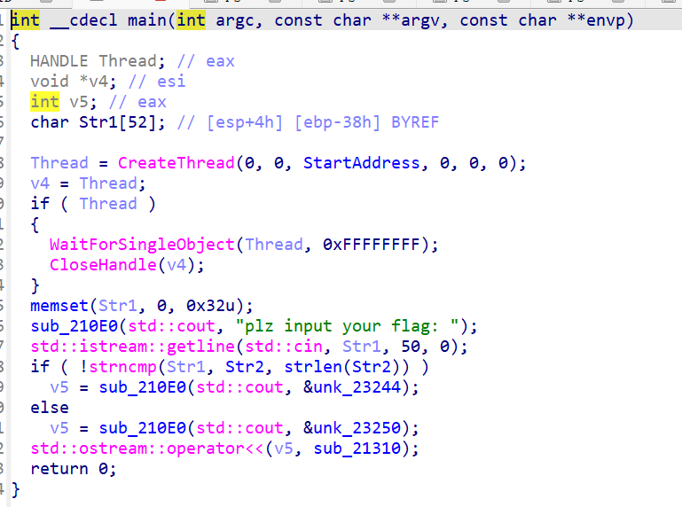

输入到str1中，并与str2对比，相等就输出correct，否则输出wrong，但这个主函数并没有什么校验函数，根据题目提示“falg就在主函数里”，查看字符串

<!-- 这是一张图片，ocr 内容为： -->
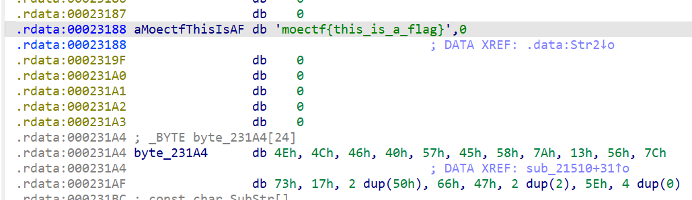

上面的moectf是假的flag，下面的数据组就是校验数组，点开这个函数

<!-- 这是一张图片，ocr 内容为： -->
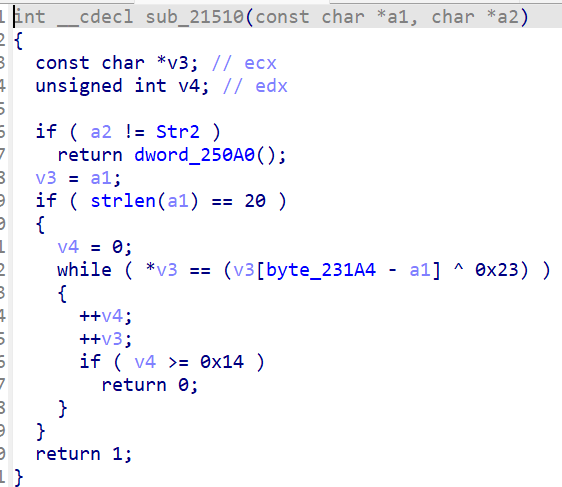

正如我们所料，对这个数组的数据进行异或，写个脚本

```python
# decode_flag.py
ARR = [
    0x4E, 0x4C, 0x46, 0x40, 0x57, 0x45, 0x58, 0x7A, 0x13, 0x56,
    0x7C, 0x73, 0x17, 0x50, 0x50, 0x66, 0x47, 0x02, 0x02, 0x5E
]

flag = bytes(b ^ 0x23 for b in ARR).decode('ascii')
print(flag)  # moectf{Y0u_P4ssEd!!}

```

moectf{Y0u_P4ssEd!!}


# 08 flower
IDA定位到主函数

<!-- 这是一张图片，ocr 内容为： -->
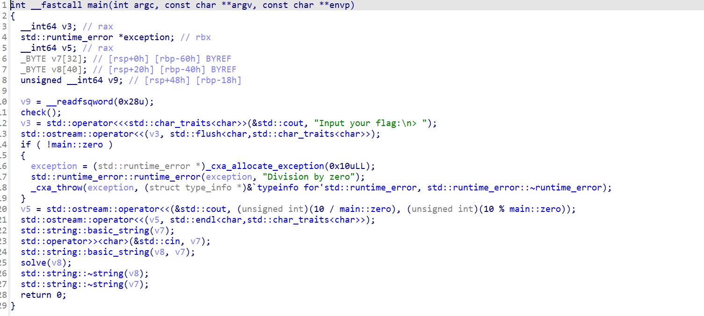

点击slove函数，有栈堆不平衡

<!-- 这是一张图片，ocr 内容为： -->
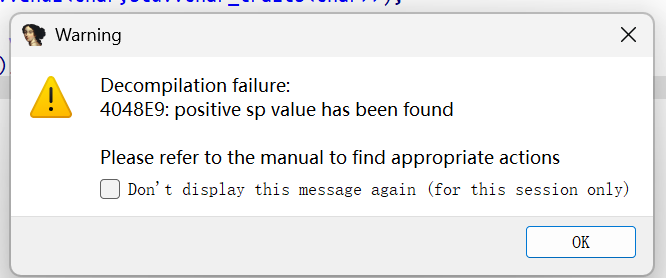

定位到这个位置，发现有花指令，还有函数边界问题

<!-- 这是一张图片，ocr 内容为： -->
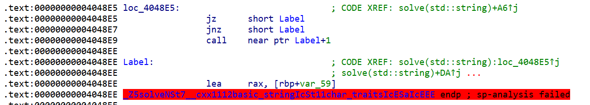

先修改花指令

<!-- 这是一张图片，ocr 内容为： -->
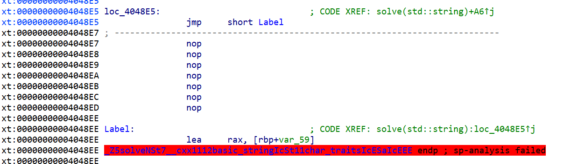

之后修改函数边界对着冒红行摁u

<!-- 这是一张图片，ocr 内容为： -->
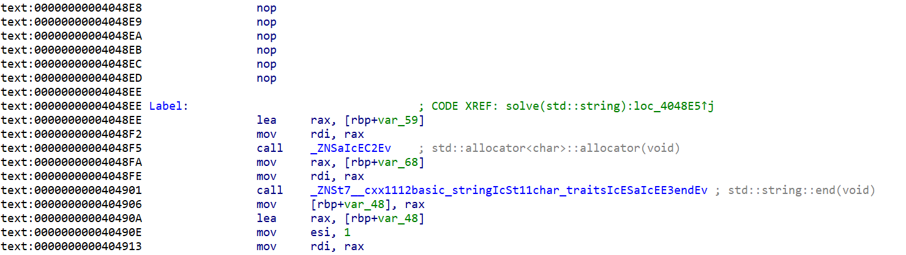

之后正常反汇编，查看slove函数，找到最主要的一步

<!-- 这是一张图片，ocr 内容为： -->
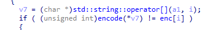

encode函数以及enc和key，其中正确的初始key很关键

<!-- 这是一张图片，ocr 内容为： -->
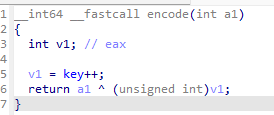

<!-- 这是一张图片，ocr 内容为： -->
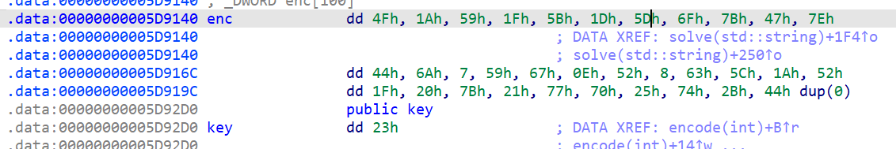

脚本

```python
# brute_recover_flag.py

import string

# enc 常量表（32 个）
enc = [
    0x4F, 0x1A, 0x59, 0x1F, 0x5B, 0x1D, 0x5D, 0x6F,
    0x7B, 0x47, 0x7E, 0x44, 0x6A, 0x07, 0x59, 0x67,
    0x0E, 0x52, 0x08, 0x63, 0x5C, 0x1A, 0x52, 0x1F,
    0x20, 0x7B, 0x21, 0x77, 0x70, 0x25, 0x74, 0x2B,
]

PRINTABLE = set(string.printable) - set("\r\n\t\x0b\x0c")

def decode_with_key(enc, key):
    # s[i] = enc[i] ^ (key + i)
    bs = [(e ^ ((key + i) & 0xFF)) & 0xFF for i, e in enumerate(enc)]
    return ''.join(chr(b) for b in bs)

def looks_good(s):
    # 1) 全可打印  2) 不含控制字符  3) 基本可读
    return all(ch in PRINTABLE for ch in s)

candidates = []
for key in range(256):
    inner = decode_with_key(enc, key)
    if looks_good(inner):
        candidates.append((key, inner))

# 输出候选 key 及解码结果
for key, inner in candidates:
    print(f"key=0x{key:02X} -> {inner}")

# 通常只有极少数候选；从可读性判断最佳那个

```

moectf{f0r3v3r_JuMp_1n_7h3_a$m_a9b35c3c}


# 14 upx_revenge
我们只需要在4.24.后面插入UPX!就可以正常脱壳了

<!-- 这是一张图片，ocr 内容为： -->
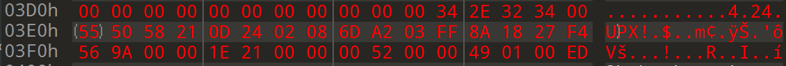

脱壳

<!-- 这是一张图片，ocr 内容为： -->
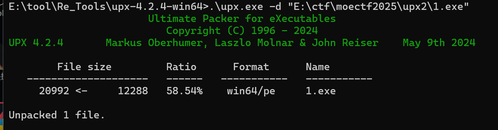

IDA打开，分析主函数，最主要的在这

<!-- 这是一张图片，ocr 内容为： -->
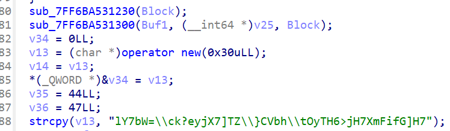

去分析sub_7FF6BA531230  sub_7FF6BA531300两个函数

sub_7FF6BA531230 是对标准表进行异或14，sub_7FF6BA531300是调用这个表进行Base64编码

<!-- 这是一张图片，ocr 内容为： -->
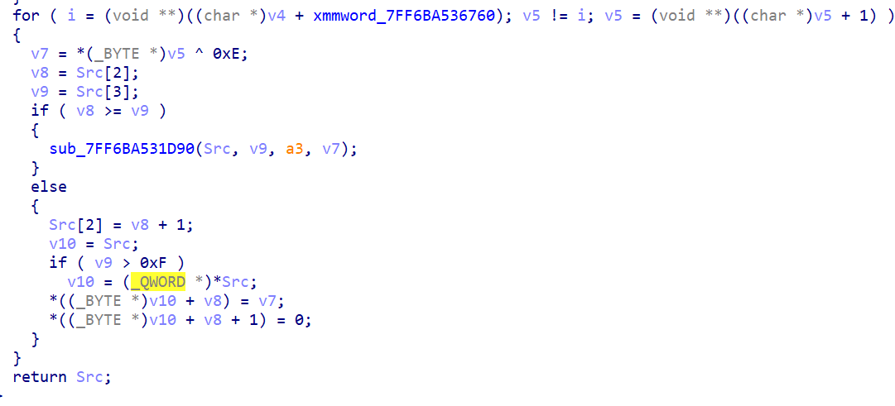

异或后的表

```text
GMLQOJPI^DXHZSBUT[ARCYV-KWEN]@F\\(>JD=MLZSIWPHGYAQBEOU)TNVurqpcjgmlhfnadkbisoetv(zyx,0w.4-2863q1)5?9+7
```

只需要输入的字符串用这个表进行Base64编码与硬字符串lY7bW=\\ck?eyjX7]TZ\\}CVbh\\tOyTH6>jH7XmFifG]H7对比

脚本

```python
standard_table = "ABCDEFGHIJKLMNOPQRSTUVWXYZabcdefghijklmnopqrstuvwxyz0123456789+/"

encoded = "lY7bW=\\ck?eyjX7]TZ\\}CVbh\\tOyTH6>jH7XmFifG]H7".replace("\\\\", "\\")  # 处理转义

# 生成自定义表
custom_table = ''.join(chr(ord(c) ^ 0xE) for c in standard_table)

# 创建映射: char -> index
char_to_index = {custom_table[i]: i for i in range(64)}

# 解码
flag_bytes = []
for i in range(len(encoded) // 4):
    group = encoded[i*4:i*4+4]
    indices = [char_to_index[c] for c in group]
    value = (indices[0] << 18) | (indices[1] << 12) | (indices[2] << 6) | indices[3]
    flag_bytes.append(value >> 16 & 0xFF)
    flag_bytes.append(value >> 8 & 0xFF)
    flag_bytes.append(value & 0xFF)

flag = ''.join(chr(b) for b in flag_bytes)

print("Flag:", flag)
```

moectf{Y0u_Re4l1y_G00d_4t_Upx!!!}


# 15 guess
IDA打开，定位到主函数，无法反编译

<!-- 这是一张图片，ocr 内容为： -->
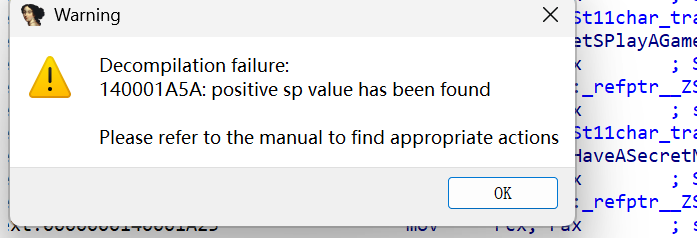

定位到140001A5A，有花指令

<!-- 这是一张图片，ocr 内容为： -->
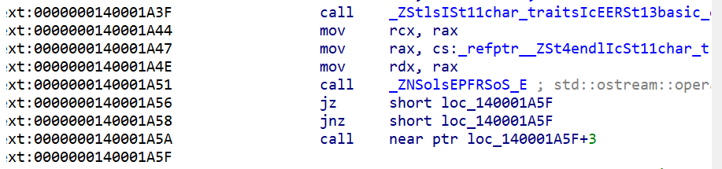

改成单条无条件跳转，其余全部nop

<!-- 这是一张图片，ocr 内容为： -->
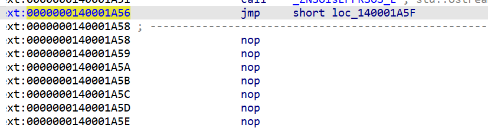

ok，可以成功反编译

<!-- 这是一张图片，ocr 内容为： -->
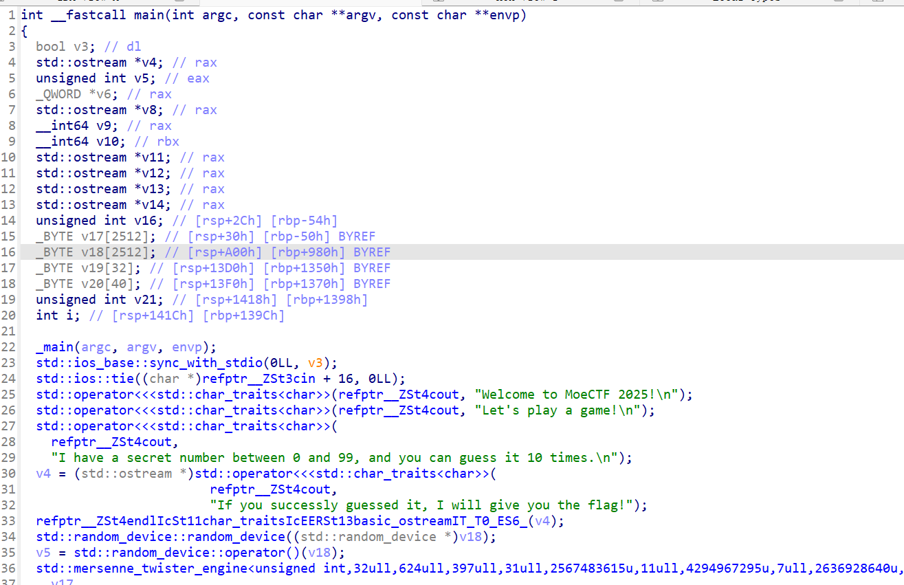

分析函数行为，是一个猜谜游戏，主要的逻辑在这里，看名字知道是RC4算法

<!-- 这是一张图片，ocr 内容为： -->
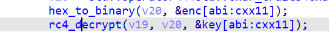

点进去，主要逻辑在rc4_ksa和rc4_prga

<!-- 这是一张图片，ocr 内容为： -->
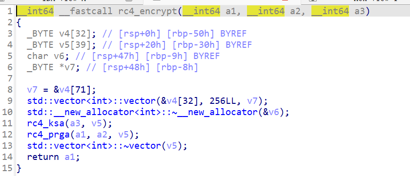

分别点进去查看，先看ksa，比正常RC4相比密钥要加常数42

<!-- 这是一张图片，ocr 内容为： -->
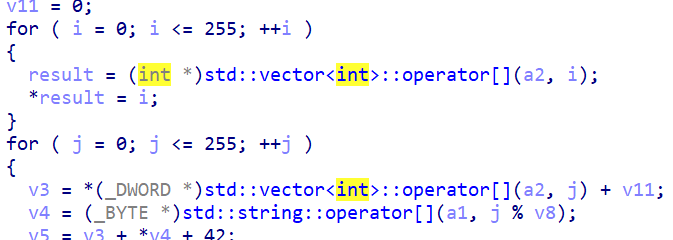

再看prga是一个标准的

 <!-- 这是一张图片，ocr 内容为： -->
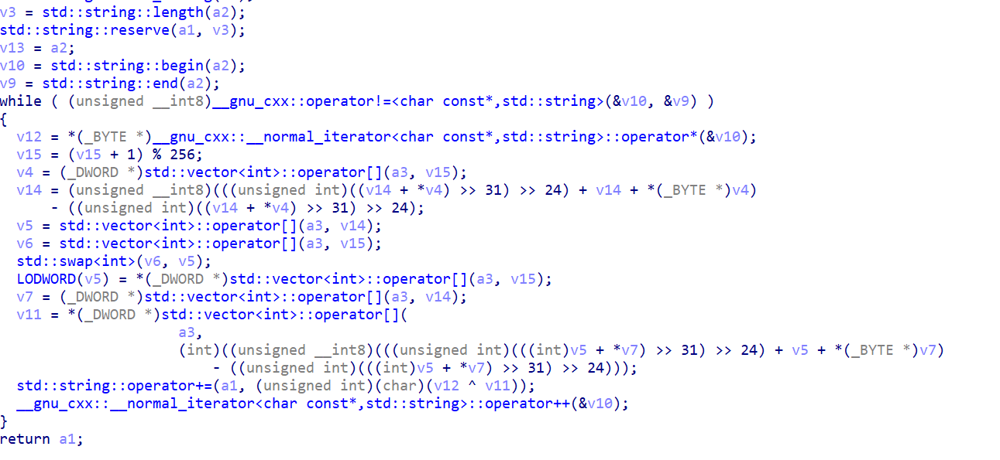

接下来我们是找key和enc，shift+F12

<!-- 这是一张图片，ocr 内容为： -->
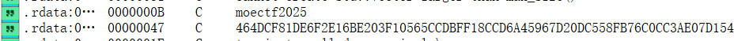

脚本

```python
from binascii import unhexlify

def rc4_with_plus42(data: bytes, key: bytes) -> bytes:
    # === KSA 带 +42 ===
    S = list(range(256))
    j = 0
    for i in range(256):
        k = (key[i % len(key)] + 42) & 0xFF
        j = (j + S[i] + k) & 0xFF
        S[i], S[j] = S[j], S[i]

    # === PRGA 标准 ===
    i = j = 0
    out = bytearray()
    for b in data:
        i = (i + 1) & 0xFF
        j = (j + S[i]) & 0xFF
        S[i], S[j] = S[j], S[i]
        K = S[(S[i] + S[j]) & 0xFF]
        out.append(b ^ K)
    return bytes(out)

enc_hex = "464DCF81DE6F2E16BE203F10565CCDBFF18CCD6A45967D20DC558FB76C0CC3AE07D154"
key_str = "moectf2025"

cipher = unhexlify(enc_hex)
plain = rc4_with_plus42(cipher, key_str.encode())

print("moectf{" + plain.decode(errors="ignore") + "}")


```

moectf{RrRRccCc44$$_w1th_fl0w3r!!_3c6a11b5}


# 09 2048_master_re
这道题是一个窗口游戏题，有两种解题思路

一种是HOOK,另一种是直接逆向解密

先说逆向解密，在字符串中找到这个

<!-- 这是一张图片，ocr 内容为： -->
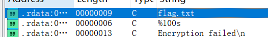

点开，是一个flag校验函数， 它从 flag.txt 中读取字符串，经过某种加密/变换后，与内置的字节数组 byte_495280 进行比对，若完全一致则返回 0（正确），否则返回 1（错误）。

<!-- 这是一张图片，ocr 内容为： -->
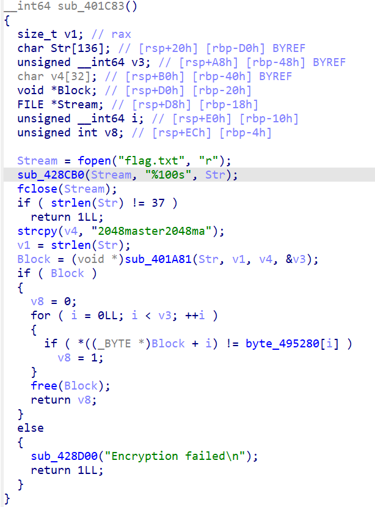

去查看加密函数sub_401A81

<!-- 这是一张图片，ocr 内容为： -->
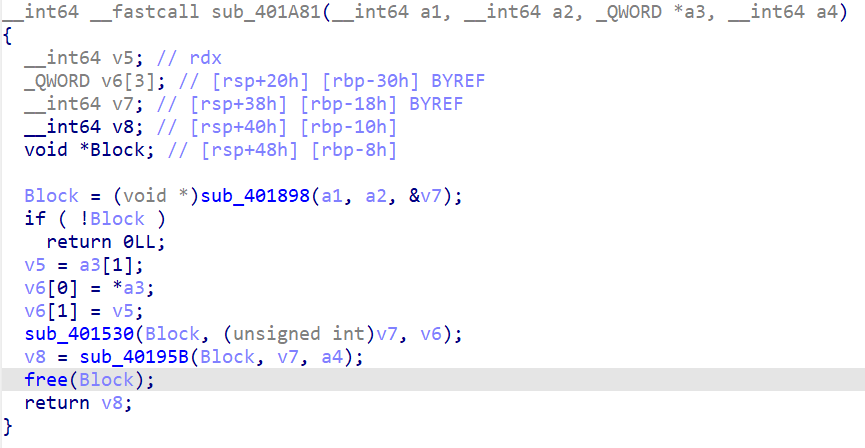

sub_401898：按 小端把明文每 4 字节打包成 uint32_t 数组，长度 Count=(len+3)//4，没有额外写入原始长度；

<!-- 这是一张图片，ocr 内容为： -->
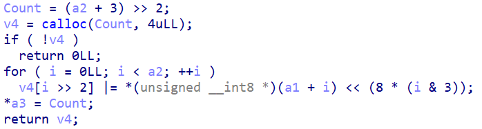

sub_401530：标准 BTEA/XXTEA，delta = 1050114489 (0x3E9779B9)，key 为 16 字节，索引 (p^e)&3；

<!-- 这是一张图片，ocr 内容为： -->
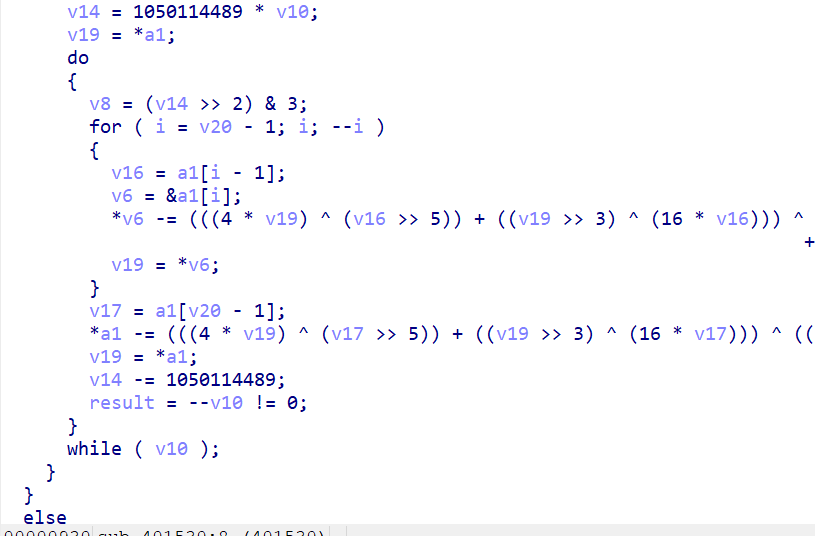

sub_40195B：把 uint32_t[] 原样拆回字节（每个 dword → 两个 _WORD），最终输出字节数 *a3 = 4*Count。

<!-- 这是一张图片，ocr 内容为： -->
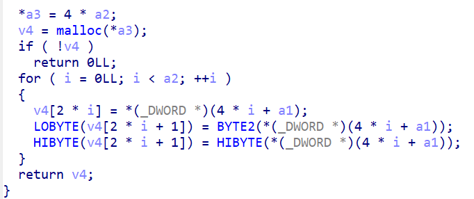

脚本

```python
from typing import List

DELTA = 0x3E9779B9

def to_u32_le_blocks(b: bytes) -> List[int]:
    pad = (-len(b)) % 4
    b += b'\x00' * pad
    return [int.from_bytes(b[i:i+4], 'little') for i in range(0, len(b), 4)]

def from_u32_le_blocks(v: List[int]) -> bytes:
    return b''.join(x.to_bytes(4, 'little') for x in v)

def btea(v: List[int], n: int, k: List[int]) -> None:
    """XXTEA/BTEA inplace; n>1 加密，n<-1 解密"""
    if n > 1:
        rounds = 6 + 52 // n
        _sum = 0
        z = v[n - 1]
        for _ in range(rounds):
            _sum = (_sum + DELTA) & 0xFFFFFFFF
            e = (_sum >> 2) & 3
            for p in range(n - 1):
                y = v[p + 1]
                v[p] = (v[p] + ((((z >> 5) ^ (y << 2)) + ((y >> 3) ^ (z << 4)))
                                ^ ((_sum ^ y) + (k[(p ^ e) & 3] ^ z)))) & 0xFFFFFFFF
                z = v[p]
            p = n - 1
            y = v[0]
            v[p] = (v[p] + ((((z >> 5) ^ (y << 2)) + ((y >> 3) ^ (z << 4)))
                            ^ ((_sum ^ y) + (k[(p ^ e) & 3] ^ z)))) & 0xFFFFFFFF
            z = v[p]
    elif n < -1:
        n = -n
        rounds = 6 + 52 // n
        _sum = (rounds * DELTA) & 0xFFFFFFFF
        y = v[0]
        while rounds > 0:
            e = (_sum >> 2) & 3
            for p in range(n - 1, 0, -1):
                z = v[p - 1]
                v[p] = (v[p] - ((((z >> 5) ^ (y << 2)) + ((y >> 3) ^ (z << 4)))
                                ^ ((_sum ^ y) + (k[(p ^ e) & 3] ^ z)))) & 0xFFFFFFFF
                y = v[p]
            p = 0
            z = v[n - 1]
            v[0] = (v[0] - ((((z >> 5) ^ (y << 2)) + ((y >> 3) ^ (z << 4)))
                            ^ ((_sum ^ y) + (k[(p ^ e) & 3] ^ z)))) & 0xFFFFFFFF
            y = v[0]
            _sum = (_sum - DELTA) & 0xFFFFFFFF
            rounds -= 1

# ==== 数据区 ====

# 全局密文 byte_495280（注意这里只取前 40 字节，其余是 0 padding，不参与校验）
cipher_bytes = bytes([
    0x35,0x79,0x77,0xCC,0x1B,0x13,0x41,0x34,
    0xF9,0xFF,0x9F,0x91,0xFF,0x5B,0x94,0x78,
    0x86,0x2A,0xAF,0xAE,0xD7,0x9E,0x31,0x4D,
    0x7A,0xC4,0xA5,0x51,0xD1,0xD9,0x6E,0x44,
    0x18,0x52,0x86,0x1B,0x42,0x8A,0xC9,0x63,
])

# key = "2048master2048ma" → 拆成 4 个小端 uint32
key_words = [
    int.from_bytes(b"2048", "little"),
    int.from_bytes(b"mast", "little"),
    int.from_bytes(b"er20", "little"),
    int.from_bytes(b"48ma", "little"),
]

# ==== 解密流程 ====
v = to_u32_le_blocks(cipher_bytes)
btea(v, -len(v), key_words)
plain = from_u32_le_blocks(v)

# 原始 flag 长度 = 37
flag = plain[:37].decode(errors="ignore")
print("Flag:", flag)

```

moectf{@_N1c3_cup_0f_XXL_te4_1n_2O48}


