# NoMyBank!
看到是Godot游戏，先按正常流程解一下包

```text
PS E:\ctf\nctf2026\NoMyBank!> & C:/Users/35159/AppData/Local/Programs/Python/Python313/python.exe e:/ctf/nctf2026/NoMyBank!/extract.py
Possible PCK header at offset: 0x2F05D6E
Possible PCK header at offset: 0x2F05EC9
Possible PCK header at offset: 0x2F0604A
Possible PCK header at offset: 0x2F061B6
Possible PCK header at offset: 0x32B61ED
Possible PCK header at offset: 0x5194000
Possible PCK header at offset: 0x5773754
```

```text
PS E:\ctf\nctf2026\NoMyBank!> & C:/Users/35159/AppData/Local/Programs/Python/Python313/python.exe e:/ctf/nctf2026/NoMyBank!/check.py
Offset 0x2F05D6E: b'GDPCu\x05\xc6D$P\x01\x0f\xb6D$P'
Offset 0x2F05EC9: b'GDPCu\x07\xc6D$P\x01\xeb\x18H\x8b\x84'
Offset 0x2F0604A: b'GDPC\x0f\x85m\x01\x00\x00H\x8dL$X\xe8'
Offset 0x2F061B6: b'GDPCu\x05\xc6D$P\x01\x0f\xb6D$P'
Offset 0x32B61ED: b'GDPCH\x8b\x8c$\x90\x00\x00\x00\xff\x94$H'
Offset 0x5194000: b'GDPC\x03\x00\x00\x00\x04\x00\x00\x00\x05\x00\x00\x00'
Offset 0x5773754: b'GDPC'
```

<!-- 这是一张图片，ocr 内容为： -->
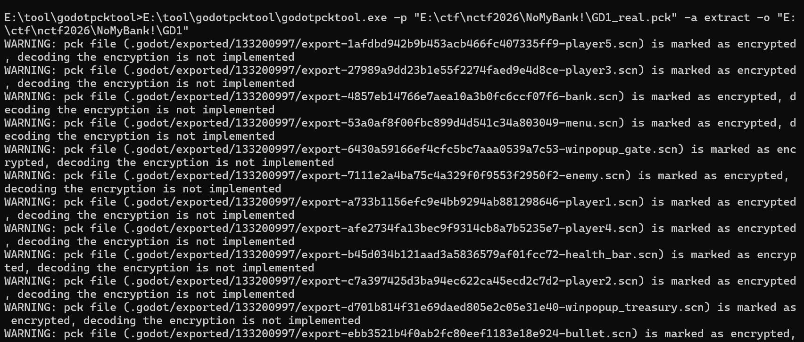

只不过这些gdc文件都加密了，整体异或0x86后就可以正常反编译拿到gd文件，这样就可以看到游戏逻辑，主要看游戏通关逻辑，发现校验逻辑在dll里面

```python
extends CanvasLayer
@onready var button = $Panel / Button
@onready var note = $Panel / Label
var menu_scene = preload("res://Scenes/menu.tscn")

func _on_button_pressed():
var flag_checker = get_checker_from_loaded_dll_node()
if flag_checker:
    flag_checker.show_flag_dialog()
    queue_free()

func get_checker_from_loaded_dll_node():
var checker = get_tree().get_first_node_in_group("dllchecker")
return checker


func _input(event: InputEvent) -> void :
if event.is_action_pressed("ui_cancel"):
    var menu = menu_scene.instantiate()
    menu.is_pause_menu = true
    get_tree().current_scene.add_child(menu)


func _ready() -> void :
note.text = "Congratulations!\n\tYou are now in my treasury.\n\tGive me your key, and I will give you my gift."


process_mode = Node.PROCESS_MODE_ALWAYS
button.pressed.connect(_on_button_pressed)

```

但题目给我们的dll是不能直接用的，我们在程序启动时，在%LOCALAPPDATA%\Temp_libextension.dll 生成一份运行时处理后的 DLL

然后拖入IDA分析

<!-- 这是一张图片，ocr 内容为： -->
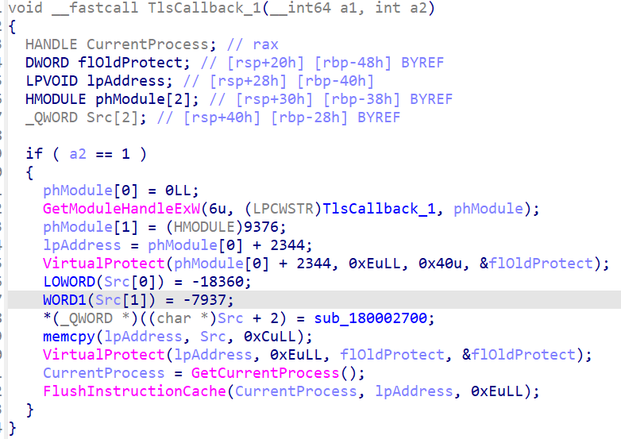

跟进sub_180002700函数，循环把 byte_18014F000[i] ^ byte_18014F491 写入新内存

<!-- 这是一张图片，ocr 内容为： -->
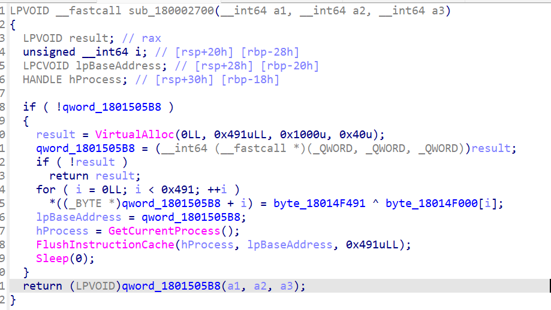key

key是0xBA

<!-- 这是一张图片，ocr 内容为： -->
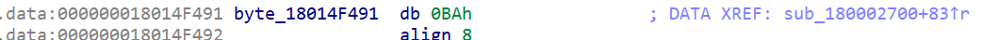

把这些异或的数组patch出来

```c
_DWORD *__fastcall sub_0(__int64 a1, __int64 a2, __int64 a3, __int64 a4, _DWORD *a5)
{
    _DWORD *result; // rax
    int j; // [rsp+0h] [rbp-108h]
    int k; // [rsp+0h] [rbp-108h]
    int m; // [rsp+0h] [rbp-108h]
    int v9; // [rsp+4h] [rbp-104h]
    int v10; // [rsp+4h] [rbp-104h]
    int v11; // [rsp+4h] [rbp-104h]
    int v12; // [rsp+4h] [rbp-104h]
    unsigned __int8 v13; // [rsp+Dh] [rbp-FBh]
    int i; // [rsp+10h] [rbp-F8h]
    unsigned int v15; // [rsp+18h] [rbp-F0h]
    unsigned __int8 v16; // [rsp+1Ch] [rbp-ECh]
    unsigned __int8 v17; // [rsp+20h] [rbp-E8h]
    _BYTE v18[216]; // [rsp+30h] [rbp-D8h]

    v18[0] = -91;
    v18[1] = -90;
    v18[2] = -89;
    v18[3] = -88;
    v18[4] = -87;
    v18[5] = -86;
    v18[6] = -85;
    v18[7] = -84;
    v18[8] = -83;
    v18[9] = -82;
    v18[10] = -81;
    v18[11] = -80;
    v18[12] = -79;
    v18[13] = -78;
    v18[14] = -77;
    v18[15] = -76;
    v18[16] = -75;
    v18[17] = -74;
    v18[18] = -73;
    v18[19] = -72;
    v18[20] = -71;
    v18[21] = -70;
    v18[22] = -69;
    v18[23] = -68;
    v18[24] = -67;
    v18[25] = -66;
    v18[26] = -123;
    v18[27] = -122;
    v18[28] = -121;
    v18[29] = -120;
    v18[30] = -119;
    v18[31] = -118;
    v18[32] = -117;
    v18[33] = -116;
    v18[34] = -115;
    v18[35] = -114;
    v18[36] = -113;
    v18[37] = -112;
    v18[38] = -111;
    v18[39] = -110;
    v18[40] = -109;
    v18[41] = -108;
    v18[42] = -107;
    v18[43] = -106;
    v18[44] = -105;
    v18[45] = -104;
    v18[46] = -103;
    v18[47] = -102;
    v18[48] = -101;
    v18[49] = -100;
    v18[50] = -99;
    v18[51] = -98;
    v18[52] = -58;
    v18[53] = -57;
    v18[54] = -56;
    v18[55] = -55;
    v18[56] = -54;
    v18[57] = -53;
    v18[58] = -52;
    v18[59] = -51;
    v18[60] = -50;
    v18[61] = -49;
    v18[62] = -44;
    v18[63] = -48;
    for ( i = 0; i < 64; ++i )
        v18[i + 128] = ~v18[i];
    v9 = 0;
    for ( j = 0; j < 40; j += 3 )
    {
        v13 = *(_BYTE *)(a4 + j);
        if ( j + 1 >= 40 )
            v16 = 0;
        else
            v16 = *(_BYTE *)(a4 + j + 1);
        if ( j + 2 >= 40 )
            v17 = 0;
        else
            v17 = *(_BYTE *)(a4 + j + 2);
        v18[v9 + 64] = v18[(((int)v16 >> 4) & 0xF | (unsigned __int8)(16 * (v13 & 3))) + 128];
        v10 = v9 + 1;
        v18[v10 + 64] = v18[(((int)v13 >> 2) & 0x3F) + 128];
        v11 = v10 + 1;
        if ( j + 1 >= 40 )
            v18[v11 + 64] = 61;
        else
            v18[v11 + 64] = v18[(v17 & 0x3F) + 128];
        v12 = v11 + 1;
        if ( j + 2 >= 40 )
            v18[v12 + 64] = 61;
        else
            v18[v12 + 64] = v18[(((int)v17 >> 6) & 3 | (unsigned __int8)(4 * (v16 & 0xF))) + 128];
        v9 = v12 + 1;
    }
    for ( k = 0; k < v9; ++k )
        *(_BYTE *)(a3 + k) = v18[k + 64];
    v15 = 1131796;
    for ( m = 0; m < v9; ++m )
    {
        *(_BYTE *)(a3 + m) ^= v15 >> (8 * m % 24);
        *(_BYTE *)(a3 + m) = (((int)*(unsigned __int8 *)(a3 + m) >> 6) | (4 * *(_BYTE *)(a3 + m))) ^ 0xBA;
        v15 = 16843155 * v15 + 305419896;
    }
    result = a5;
    *a5 = v9;
    return result;
}
```

有了加密逻辑，现在我们要找密文，而之前的gd文件里提到了show_flag_dialog

<!-- 这是一张图片，ocr 内容为： -->
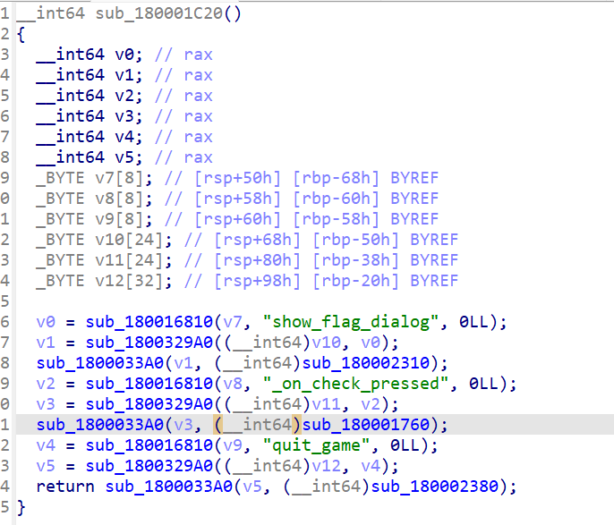

然后看校验层的sub_1800033A0函数的参数sub_180001760函数

<!-- 这是一张图片，ocr 内容为： -->
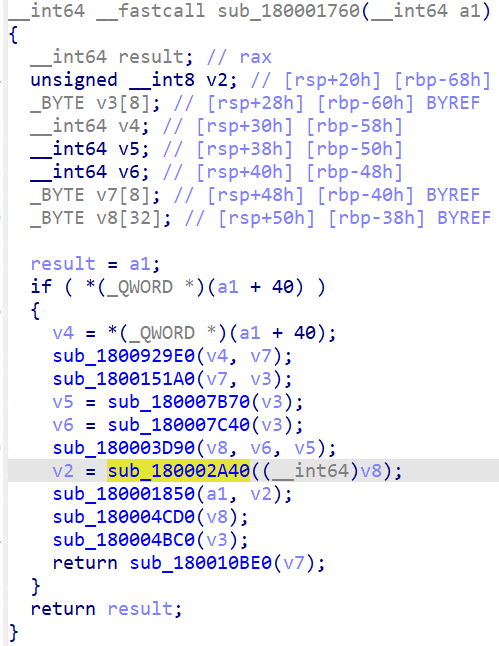

比较就在sub_180002A40函数里

<!-- 这是一张图片，ocr 内容为： -->
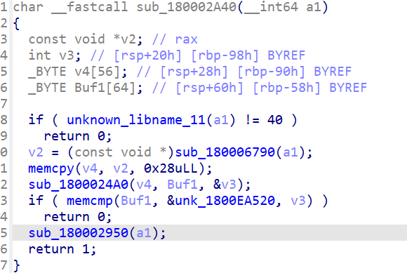

```c
2B F7 67 5E 7C 98 ED 6D D1 8C EF 57 BB 33 22 7E B2 1F 34 5B 36 6C 2B AF BB 5B 12 D6 3C 0A 45 27 84 6C 47 AB 2F 75 78 3E 88 89 2D 7A CD 5C F6 FA 36 73 FF 6E D3 4C 1C 75
```

```python
from pathlib import Path

# hidden compare bytes dumped from DLL (56 bytes)
CMP56_HEX = (
    "2bf7675e7c98ed6dd18cef57bb33227eb21f345b366c2baf"
    "bb5b12d63c0a4527846c47ab2f75783e88892d7acd5cf6fa"
    "3673ff6ed34c1c75"
)

def build_alphabet() -> list[int]:
    base = []
    base += list(range(0xA5, 0xBF))
    base += list(range(0x85, 0x9F))
    base += list(range(0xC6, 0xD0))
    base += [0xD4, 0xD0]
    return [(~b) & 0xFF for b in base]

def ror2(x: int) -> int:
    return ((x >> 2) | ((x << 6) & 0xFF)) & 0xFF

def undo_stream_transform(data: bytes) -> bytes:
    out = bytearray()
    v = 0x114514
    for m, c in enumerate(data):
        x = c ^ 0xBA
        x = ror2(x)
        x ^= (v >> ((8 * m) % 24)) & 0xFF
        out.append(x)
        v = (0x1010193 * v + 0x12345678) & 0xFFFFFFFF
    return bytes(out)

def decode_custom_b64(enc: bytes) -> bytes:
    inv = {c: i for i, c in enumerate(build_alphabet())}
    out = bytearray()

    for i in range(0, len(enc), 4):
        c1, c2, c3, c4 = enc[i:i + 4]
        if c1 == 0x3D or c2 == 0x3D:
            break

        i1 = inv[c1]
        i2 = inv[c2]
        b0 = ((i2 << 2) | (i1 >> 4)) & 0xFF

        if c3 == 0x3D and c4 == 0x3D:
            out.append(b0)
            break

        i3 = inv[c3]
        i4 = inv[c4]
        b1 = (((i1 & 0x0F) << 4) | (i4 >> 2)) & 0xFF
        b2 = (((i4 & 0x03) << 6) | i3) & 0xFF
        out += bytes((b0, b1, b2))

    return bytes(out)

def main() -> None:
    cmp56 = bytes.fromhex(CMP56_HEX)
    key = decode_custom_b64(undo_stream_transform(cmp56))
    print(key.decode("ascii"))

if __name__ == "__main__":
    main()

```

NCTF{You_deserve_this_gift_b1bd7c719cfc}


# Hook My secret
这个apk需要闯过三层关卡，函数流程就是main->pattern->stage2->stage3->success

<!-- 这是一张图片，ocr 内容为： -->
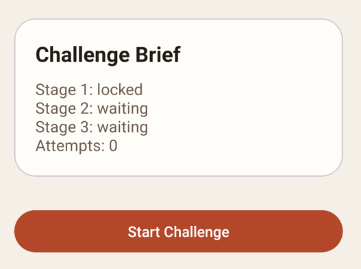

<!-- 这是一张图片，ocr 内容为： -->
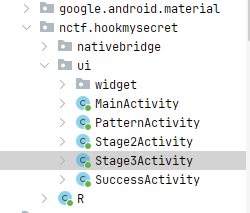

先来看Mainactivity,不是真正的校验，只负责进入PatternActivity和状态显示

<!-- 这是一张图片，ocr 内容为： -->
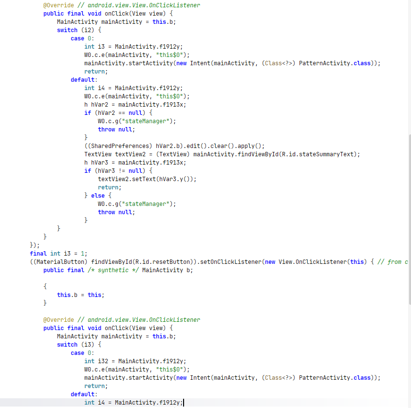

去看patternactivity定位patternLockView.setOnPatternComplete，跟进到N0.c

<!-- 这是一张图片，ocr 内容为： -->
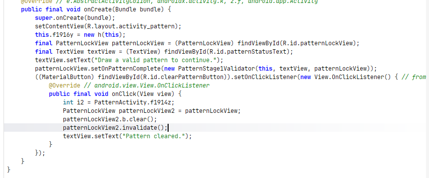

第一关的逻辑就是把我们连线的图案写成0,1,2......，然后SHA-256后与”4a6bc34076c8eef0f9eac59ad30d99bb4f56ecea4b0bfab92540fb655ac680f3“对比

<!-- 这是一张图片，ocr 内容为： -->
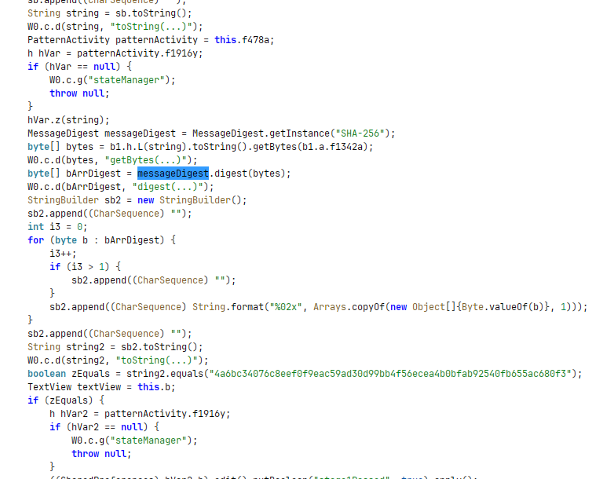

```python
# solve_stage1.py
import hashlib
import itertools

TARGET = "4a6bc34076c8eef0f9eac59ad30d99bb4f56ecea4b0bfab92540fb655ac680f3"
NODES = list(range(9))

def sha256_hex(s: str) -> str:
    return hashlib.sha256(s.encode("utf-8")).hexdigest()

for length in range(1, 10):
    for perm in itertools.permutations(NODES, length):
        s = ",".join(map(str, perm))
        if sha256_hex(s) == TARGET:
            print("FOUND:", s)
            raise SystemExit

print("NOT FOUND")

```

按照序列0,1,2,4,8连接通关，进入第二关，第二关是去解密key

<!-- 这是一张图片，ocr 内容为： -->
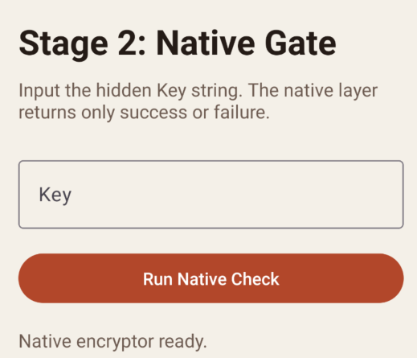

<!-- 这是一张图片，ocr 内容为： -->
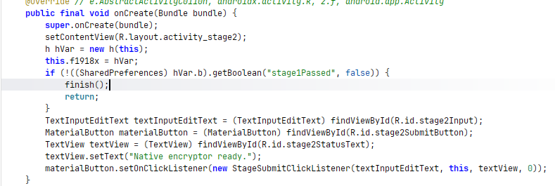

去到StageSubmitClickListener类声明处，到地方发现case 0是关卡2

会调用nativecen的so库来加密输入，最后与Stage2TargetVector做对比

<!-- 这是一张图片，ocr 内容为： -->
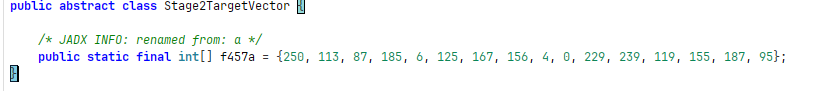

<!-- 这是一张图片，ocr 内容为： -->
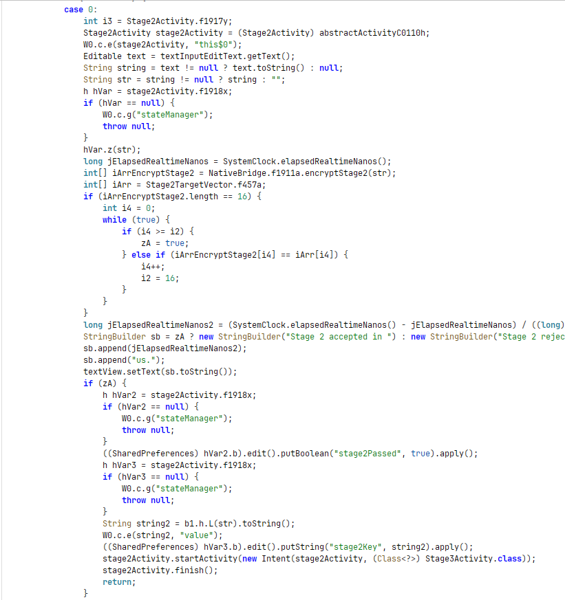

ida打开so看一下，读输入

<!-- 这是一张图片，ocr 内容为： -->
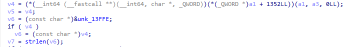

先做trim，去掉首尾空白

<!-- 这是一张图片，ocr 内容为： -->
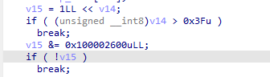

核心加密

<!-- 这是一张图片，ocr 内容为： -->
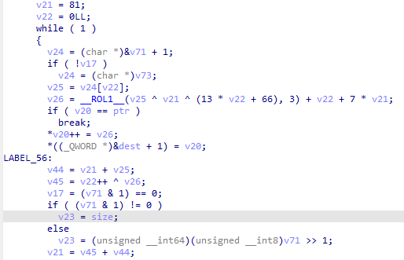

解出keyk7Xm2Pq9Wv4N8bRt

```python
# solve_stage2.py
TARGET = [250, 113, 87, 185, 6, 125, 167, 156, 4, 0, 229, 239, 119, 155, 187, 95]

def rol8(x, n):
    x &= 0xFF
    return ((x << n) | (x >> (8 - n))) & 0xFF

def ror8(x, n):
    x &= 0xFF
    return ((x >> n) | (x << (8 - n))) & 0xFF

# 逆向恢复输入
d = 0x51
xs = []
for i, y in enumerate(TARGET):
    t = (y - i - 7 * d) & 0xFF
    x = ror8(t, 3) ^ d ^ ((13 * i + 0x42) & 0xFF)
    x &= 0xFF
    xs.append(x)
    d = (d + x + (y ^ i)) & 0xFF

key = bytes(xs).decode("utf-8")
print("Stage2 key =", key)
```

default是关卡三，加密模式就是AES/CBC/PKCS5Padding模式加密，key是第二关的结果

<!-- 这是一张图片，ocr 内容为： -->
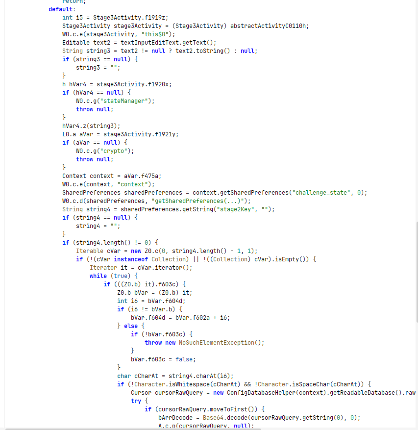

IV定义在M0.5，最后在Base64

<!-- 这是一张图片，ocr 内容为： -->
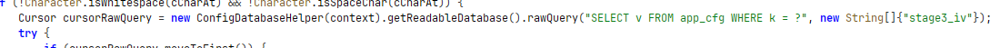

<!-- 这是一张图片，ocr 内容为： -->
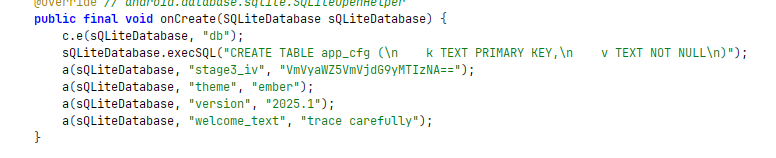

IVbase解密后的VerifyVector1234

<!-- 这是一张图片，ocr 内容为： -->
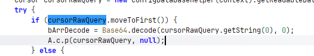

```python
# solve_stage3.py
from base64 import b64decode, b64encode
from Crypto.Cipher import AES

STAGE2_KEY = b"k7Xm2Pq9Wv4N8bRt"  # 第二关得到
IV = b"VerifyVector1234"         # stage3_iv(Base64解码后)
TARGET_B64 = "jSaMnziall55Tdr+IZc7EKUNm/N4uwrZw1QFPw6DuirfYFJZg88j6GKLhWfNljAB"

def pkcs7_unpad(data: bytes) -> bytes:
    pad = data[-1]
    return data[:-pad]

# 1) 直接解出第三关正确输入
ct = b64decode(TARGET_B64)
pt = AES.new(STAGE2_KEY, AES.MODE_CBC, IV).decrypt(ct)
flag = pkcs7_unpad(pt).decode("utf-8")
print("Stage3 input =", flag)
```

当然这题主要还是想HOOK挂钩来实现

```python
// hook_flag.js
'use strict';

Java.perform(function () {
  const TARGET_B64 = "jSaMnziall55Tdr+IZc7EKUNm/N4uwrZw1QFPw6DuirfYFJZg88j6GKLhWfNljAB";

  const ActivityThread = Java.use('android.app.ActivityThread');
  const Base64 = Java.use('android.util.Base64');
  const Cipher = Java.use('javax.crypto.Cipher');
  const SecretKeySpec = Java.use('javax.crypto.spec.SecretKeySpec');
  const IvParameterSpec = Java.use('javax.crypto.spec.IvParameterSpec');
  const JString = Java.use('java.lang.String');
  const DbHelper = Java.use('M0.a');

  const ctx = ActivityThread.currentApplication().getApplicationContext();

  // 1) 取 stage2Key
  const sp = ctx.getSharedPreferences("challenge_state", 0);
  let stage2Key = sp.getString("stage2Key", "");
  if (stage2Key === null) stage2Key = "";
  stage2Key = stage2Key.toString().trim().replace(/-/g, "");

  // 没有就用已知正确 key 兜底（你也可删掉这行）
  if (stage2Key.length === 0) {
    stage2Key = "k7Xm2Pq9Wv4N8bRt";
    console.log("[*] stage2Key empty, fallback =", stage2Key);
  } else {
    console.log("[*] stage2Key from SP =", stage2Key);
  }

  // 2) 读 SQLite 的 stage3_iv
  const db = DbHelper.$new(ctx).getReadableDatabase();
  const cursor = db.rawQuery("SELECT v FROM app_cfg WHERE k = ?", Java.array('java.lang.String', ["stage3_iv"]));

  let ivB64 = null;
  if (cursor.moveToFirst()) {
    ivB64 = cursor.getString(0).toString();
  }
  cursor.close();
  db.close();

  if (ivB64 === null) {
    console.log("[-] stage3_iv not found");
    return;
  }

  console.log("[*] iv(base64) =", ivB64);

  // 3) AES/CBC/PKCS5Padding 解密 TARGET_B64
  const keyBytes = JString.$new(stage2Key).getBytes("UTF-8");
  const ivBytes = Base64.decode(ivB64, 0);
  const ctBytes = Base64.decode(TARGET_B64, 0);

  const cipher = Cipher.getInstance("AES/CBC/PKCS5Padding");
  const keySpec = SecretKeySpec.$new(keyBytes, "AES");
  const ivSpec = IvParameterSpec.$new(ivBytes);

  cipher.init(2, keySpec, ivSpec); // DECRYPT_MODE = 2
  const ptBytes = cipher.doFinal(ctBytes);
  const flag = JString.$new(ptBytes, "UTF-8").toString();

  console.log("[+] FLAG =", flag);
});

```

<!-- 这是一张图片，ocr 内容为： -->
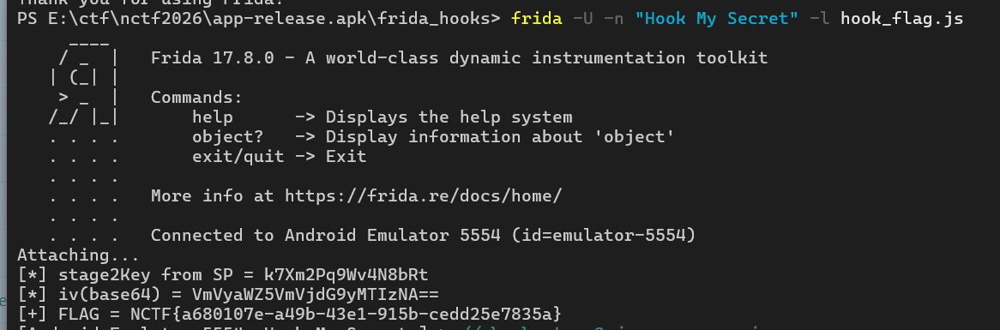

 NCTF{a680107e-a49b-43e1-915b-cedd25e7835a}


# pay-for-2048-attachment
先解一下asar包

```powershell
npx asar extract app.asar app_unpacked
```

这是 Electron + Rust/WASM 题，真实校验都在 resources/app_unpacked/wasm-build/wasm32-unknown-unknown/release/wasm_core.wasm 里

src文件还里的wasm-bridge.js等只是桥接

接下来就是分析wasm，这里我用的是Ghirda+wasm插件

第一个主要函数verify_license_impl

主要逻辑：

```c
parse_context(json)：先从输入 JSON 取 key/score/steps/maxTile/board/sessionToken。
如果解析失败：返回 invalid payload（你前面看到的 1099）。
如果 maxTile < 0x100（256）：直接失败（“reach 256 before requesting activation”那条分支）。
校验 key 格式：
必须按 - 分成 5 段
第 1 段必须是 "NCTF"
    后 3 段各 4 字符
字符限制是大写字母/数字（等价 NCTF-XXXX-XXXX-XXXX）
normalize_key：把后 3 段拼成 12 字符，例如 ABCD-EFGH-IJKL -> ABCDEFGHIJKL。
对这 12 字符跑自定义 32 位混淆哈希，最终比较常量：0xFC97CA2F。
命中则 build_session_token(...)，返回 ok + sessionToken；否则 license verification failed。
```

```c

void _ZN9wasm_core7license19verify_license_impl17h5b9422e6bd42d743E
               (undefined4 *param1,undefined4 param2,undefined4 param3)

{
  undefined8 uVar1;
  undefined4 param3_00;
  undefined8 uVar2;
  undefined8 uVar3;
  int iVar4;
  undefined *puVar5;
  int iVar6;
  uint uVar7;
  undefined4 uVar8;
  undefined8 *puVar9;
  int *param1_00;
  char *pcVar10;
  int iVar11;
  int iVar12;
  uint uVar13;
  undefined *puVar14;
  int local_b8;
  undefined4 local_b4;
  int local_b0;
  undefined4 local_ac;
  int local_a8;
  int local_a4;
  undefined8 local_a0;
  undefined8 local_98;
  undefined8 local_90;
  undefined8 local_88;
  undefined8 local_80;
  undefined8 local_78;
  undefined8 local_70;
  undefined8 local_68;
  undefined8 local_60;
  undefined8 local_58;
  undefined8 local_50;
  undefined8 local_48;
  undefined1 auStack_40 [12];
  undefined4 local_34;
  undefined4 local_30;
  undefined4 local_2c;
  undefined4 local_28;
  undefined4 local_24;
  undefined4 local_20;
  undefined4 local_1c;
  undefined4 local_18;
  undefined4 local_14;
  undefined2 local_10;
  undefined2 uStack_e;
  int local_c;
  int *local_8;
  int local_4;
  
  _ZN9wasm_core5utils13parse_context17hdd86c9e433334ca3E(&local_70,param2,param3);
  if ((int)local_70 == -0x80000000) {
    _RNvCs1Y7DaGC1cwg_7___rustc35___rust_no_alloc_shim_is_unstable_v2();
    puVar9 = (undefined8 *)_RNvCs1Y7DaGC1cwg_7___rustc12___rust_alloc(0xf,1);
    if (puVar9 != (undefined8 *)0x0) {
      *(undefined1 *)(param1 + 8) = 0;
      *(undefined8 *)(param1 + 6) = 0x44b0000000f;
      param1[5] = puVar9;
      param1[4] = 0xf;
      *param1 = 2;
      *(ulonglong *)((int)puVar9 + 7) =
           CONCAT71(s_license_format_must_match_NCTF-X_ram_001005c4._118_7_,
                    s_license_format_must_match_NCTF-X_ram_001005c4[0x75]);
      *puVar9 = CONCAT17(s_license_format_must_match_NCTF-X_ram_001005c4[0x75],
                         s_license_format_must_match_NCTF-X_ram_001005c4._110_7_);
      return;
    }
    _ZN5alloc7raw_vec12handle_error17h9ace31a903e6893eE(1,0xf);
    do {
      halt_trap();
    } while( true );
  }
  local_78 = local_48;
  uVar3 = local_78;
  local_80 = local_50;
  local_88 = local_58;
  local_90 = local_60;
  local_98 = local_68;
  uVar2 = local_98;
  local_a0 = local_70;
  uVar1 = local_a0;
  local_78._4_4_ = (uint)((ulonglong)local_48 >> 0x20);
  local_78 = uVar3;
  if (local_78._4_4_ < 0x100) {
    _RNvCs1Y7DaGC1cwg_7___rustc35___rust_no_alloc_shim_is_unstable_v2();
    pcVar10 = (char *)_RNvCs1Y7DaGC1cwg_7___rustc12___rust_alloc(0x26,1);
    if (pcVar10 == (char *)0x0) {
      _ZN5alloc7raw_vec12handle_error17h9ace31a903e6893eE(1,0x26);
      do {
        halt_trap();
      } while( true );
    }
    *(undefined1 *)(param1 + 8) = 0;
    *(undefined8 *)(param1 + 6) = 0x3ec00000026;
    param1[5] = pcVar10;
    param1[4] = 0x26;
    *param1 = 2;
    *(ulonglong *)(pcVar10 + 0x1e) =
         CONCAT62(s_license_format_must_match_NCTF-X_ram_001005c4._104_6_,
                  s_license_format_must_match_NCTF-X_ram_001005c4._102_2_);
    *(ulonglong *)(pcVar10 + 0x18) =
         CONCAT26(s_license_format_must_match_NCTF-X_ram_001005c4._102_2_,
                  s_license_format_must_match_NCTF-X_ram_001005c4._96_6_);
    *(undefined8 *)(pcVar10 + 0x10) = s_license_format_must_match_NCTF-X_ram_001005c4._88_8_;
    *(undefined8 *)(pcVar10 + 8) = s_license_format_must_match_NCTF-X_ram_001005c4._80_8_;
    *(undefined8 *)pcVar10 = s_license_format_must_match_NCTF-X_ram_001005c4._72_8_;
    goto code_r0x80002989;
  }
  local_a0._4_4_ = (undefined4)((ulonglong)local_70 >> 0x20);
  local_98._0_4_ = (undefined4)local_68;
  local_10 = 1;
  local_14 = (undefined4)local_98;
  local_18 = 0;
  local_1c = CONCAT31(local_1c._1_3_,1);
  local_20 = 0x2d;
  local_24 = (undefined4)local_98;
  local_28 = 0;
  local_2c = (undefined4)local_98;
  local_30 = local_a0._4_4_;
  local_34 = 0x2d;
  local_a0 = uVar1;
  local_98 = uVar2;
  _ZN90_$LT$core..str..iter..Split$LT$P$GT$$u20$as$u20$core..iter..traits..iterator..Iterator$GT$4ne xt17hb6cfa7a2baf19f1aE
            (&local_a8,&local_34);
  if (local_a8 != 0) {
    _RNvCs1Y7DaGC1cwg_7___rustc35___rust_no_alloc_shim_is_unstable_v2();
    param1_00 = (int *)_RNvCs1Y7DaGC1cwg_7___rustc12___rust_alloc(0x20,4);
    if (param1_00 == (int *)0x0) {
      _ZN5alloc7raw_vec12handle_error17h9ace31a903e6893eE(4,0x20);
      do {
        halt_trap();
      } while( true );
    }
    *param1_00 = local_a8;
    param1_00[1] = local_a4;
    local_4 = 1;
    local_c = 4;
    local_50 = CONCAT26(uStack_e,CONCAT24(local_10,local_14));
    local_58 = CONCAT44(local_18,local_1c);
    local_60 = CONCAT44(local_20,local_24);
    local_68 = CONCAT44(local_28,local_2c);
    local_70 = CONCAT44(local_30,local_34);
    local_8 = param1_00;
    _ZN90_$LT$core..str..iter..Split$LT$P$GT$$u20$as$u20$core..iter..traits..iterator..Iterator$GT$4 next17hb6cfa7a2baf19f1aE
              (&local_b0,&local_70);
    if (local_b0 != 0) {
      iVar4 = 0xc;
      iVar6 = 2;
      iVar12 = local_b0;
      uVar8 = local_ac;
      do {
        if (iVar6 + -1 == local_c) {
          _ZN5alloc7raw_vec20RawVecInner$LT$A$GT$7reserve21do_reserve_and_handle17h27a7abd20686458bE
                    (&local_c,iVar6 + -1,1,4,8);
          param1_00 = local_8;
        }
        *(undefined4 *)((int)param1_00 + iVar4) = uVar8;
        ((undefined4 *)((int)param1_00 + iVar4))[-1] = iVar12;
        iVar4 = iVar4 + 8;
        iVar11 = iVar6 + 1;
        local_4 = iVar6;
        _ZN90_$LT$core..str..iter..Split$LT$P$GT$$u20$as$u20$core..iter..traits..iterator..Iterator$ GT$4next17hb6cfa7a2baf19f1aE
                  (&local_b8,&local_70);
        iVar6 = iVar11;
        iVar12 = local_b8;
        uVar8 = local_b4;
      } while (local_b8 != 0);
      if ((((iVar11 == 5) && (local_8[1] == 4)) && (*(int *)*local_8 == 0x4654434e)) &&
         (local_8[3] == 4)) {
        iVar12 = local_8[2];
        iVar6 = 0;
        do {
          if (iVar6 == 4) {
code_r0x800024ba:
            if (local_8[5] == 4) {
              iVar12 = local_8[4];
              iVar6 = 0;
              goto code_r0x800024d6;
            }
            break;
          }
          iVar4 = iVar6 + 1;
          uVar7 = (uint)(char)*(byte *)(iVar12 + iVar6);
          if ((int)uVar7 < 0) {
            uVar13 = *(byte *)(iVar12 + iVar4) & 0x3f;
            iVar4 = iVar6 + 2;
            if (uVar7 < 0xffffffe0) {
              uVar13 = (uVar7 & 0x1f) << 6 | uVar13;
            }
            else {
              uVar13 = uVar13 << 6 | *(byte *)(iVar12 + iVar4) & 0x3f;
              iVar4 = iVar6 + 3;
              if (uVar7 < 0xfffffff0) {
                uVar13 = uVar13 | (uVar7 & 0x1f) << 0xc;
              }
              else {
                uVar13 = uVar13 << 6 | *(byte *)(iVar12 + iVar4) & 0x3f | (uVar7 & 7) << 0x12;
                if (uVar13 == 0x110000) goto code_r0x800024ba;
                iVar4 = iVar6 + 4;
              }
            }
          }
          else {
            uVar13 = (uint)*(byte *)(iVar12 + iVar6);
          }
          iVar6 = iVar4;
        } while ((0xffffffe5 < uVar13 - 0x5b) || (0xfffffff5 < uVar13 - 0x3a));
      }
      goto code_r0x800028cf;
    }
    iVar6 = 4;
    goto code_r0x800028d5;
  }
  goto code_r0x800028e5;
  while( true ) {
    iVar4 = iVar6 + 1;
    uVar7 = (uint)(char)*(byte *)(iVar12 + iVar6);
    if ((int)uVar7 < 0) {
      uVar13 = *(byte *)(iVar12 + iVar4) & 0x3f;
      iVar4 = iVar6 + 2;
      if (uVar7 < 0xffffffe0) {
        uVar13 = (uVar7 & 0x1f) << 6 | uVar13;
      }
      else {
        uVar13 = uVar13 << 6 | *(byte *)(iVar12 + iVar4) & 0x3f;
        iVar4 = iVar6 + 3;
        if (uVar7 < 0xfffffff0) {
          uVar13 = uVar13 | (uVar7 & 0x1f) << 0xc;
        }
        else {
          uVar13 = uVar13 << 6 | *(byte *)(iVar12 + iVar4) & 0x3f | (uVar7 & 7) << 0x12;
          if (uVar13 == 0x110000) goto code_r0x800025b7;
          iVar4 = iVar6 + 4;
        }
      }
    }
    else {
      uVar13 = (uint)*(byte *)(iVar12 + iVar6);
    }
    iVar6 = iVar4;
    if ((uVar13 - 0x5b < 0xffffffe6) && (uVar13 - 0x3a < 0xfffffff6)) break;
code_r0x800024d6:
    if (iVar6 == 4) {
code_r0x800025b7:
      if (local_8[7] == 4) {
        iVar12 = local_8[6];
        iVar6 = 0;
        goto code_r0x800025d1;
      }
      break;
    }
  }
  goto code_r0x800028cf;
  while( true ) {
    iVar4 = iVar6 + 1;
    uVar7 = (uint)(char)*(byte *)(iVar12 + iVar6);
    if ((int)uVar7 < 0) {
      uVar13 = *(byte *)(iVar12 + iVar4) & 0x3f;
      iVar4 = iVar6 + 2;
      if (uVar7 < 0xffffffe0) {
        uVar13 = (uVar7 & 0x1f) << 6 | uVar13;
      }
      else {
        uVar13 = uVar13 << 6 | *(byte *)(iVar12 + iVar4) & 0x3f;
        iVar4 = iVar6 + 3;
        if (uVar7 < 0xfffffff0) {
          uVar13 = uVar13 | (uVar7 & 0x1f) << 0xc;
        }
        else {
          uVar13 = uVar13 << 6 | *(byte *)(iVar12 + iVar4) & 0x3f | (uVar7 & 7) << 0x12;
          if (uVar13 == 0x110000) goto code_r0x80002747;
          iVar4 = iVar6 + 4;
        }
      }
    }
    else {
      uVar13 = (uint)*(byte *)(iVar12 + iVar6);
    }
    iVar6 = iVar4;
    if ((uVar13 - 0x5b < 0xffffffe6) && (uVar13 - 0x3a < 0xfffffff6)) break;
code_r0x800025d1:
    if (iVar6 == 4) {
code_r0x80002747:
      if (local_c != 0) {
        _RNvCs1Y7DaGC1cwg_7___rustc14___rust_dealloc(local_8,local_c << 3,4);
      }
      uVar8 = local_a0._4_4_;
      param3_00 = (undefined4)local_98;
      _ZN9wasm_core7license13normalize_key17h58190eb56e6def8eE
                (&local_70,local_a0._4_4_,(undefined4)local_98);
      iVar6 = local_70._4_4_;
      if ((uint)local_68 != 0) {
        uVar7 = 0;
        puVar5 = &DAT_ram_00001357;
        do {
          puVar14 = &DAT_ram_00009e37;
          if ((uVar7 & 1) == 0) {
            puVar14 = &DAT_ram_000045d9;
          }
          puVar5 = (undefined *)
                   (((int)(puVar14 + *(byte *)(local_70._4_4_ + uVar7)) * (uVar7 + 0xb) ^
                    ((int)puVar5 << 3 | (uint)puVar5 >> 0x1d)) +
                   ((uint)*(byte *)(local_70._4_4_ + uVar7) << uVar7 % 5 ^ 0xa5a55a5a));
          uVar7 = uVar7 + 1;
        } while ((uint)local_68 != uVar7);
        if (puVar5 == (undefined *)0xfc97ca2f) {
          _ZN9wasm_core5state19build_session_token17he7d62ea5adb7b396E
                    (auStack_40,uVar8,param3_00,&local_a0);
          _ZN9wasm_core5state9ApiResult16ok_session_token17ha3cf0fe766029408E(param1,auStack_40) ;
          if ((int)local_70 != 0) {
            _RNvCs1Y7DaGC1cwg_7___rustc14___rust_dealloc(iVar6,(int)local_70,1);
          }
          if ((int)local_a0 != 0) {
            _RNvCs1Y7DaGC1cwg_7___rustc14___rust_dealloc(uVar8,(int)local_a0,1);
          }
          if (local_98._4_4_ != 0) {
            _RNvCs1Y7DaGC1cwg_7___rustc14___rust_dealloc((undefined4)local_90,local_98._4_4_ << 2,4)
            ;
          }
          if ((int)local_88 == 0) {
            return;
          }
          _RNvCs1Y7DaGC1cwg_7___rustc14___rust_dealloc(local_88._4_4_,(int)local_88,1);
          return;
        }
      }
      _ZN9wasm_core5state9ApiResult3err17hbdfb8c384e65ef66E
                (param1,0x3eb,s_license_format_must_match_NCTF-X_ram_001005c4 + 0x2d,0x1b);
      if ((int)local_70 != 0) {
        _RNvCs1Y7DaGC1cwg_7___rustc14___rust_dealloc(iVar6,(int)local_70,1);
      }
      goto code_r0x80002989;
    }
  }
code_r0x800028cf:
  iVar6 = local_c;
  param1_00 = local_8;
  if (local_c != 0) {
code_r0x800028d5:
    _RNvCs1Y7DaGC1cwg_7___rustc14___rust_dealloc(param1_00,iVar6 << 3,4);
  }
code_r0x800028e5:
  _RNvCs1Y7DaGC1cwg_7___rustc35___rust_no_alloc_shim_is_unstable_v2();
  pcVar10 = (char *)_RNvCs1Y7DaGC1cwg_7___rustc12___rust_alloc(0x2d,1);
  if (pcVar10 == (char *)0x0) {
    _ZN5alloc7raw_vec12handle_error17h9ace31a903e6893eE(1,0x2d);
    do {
      halt_trap();
    } while( true );
  }
  *(undefined1 *)(param1 + 8) = 0;
  *(undefined8 *)(param1 + 6) = 0x3ea0000002d;
  param1[5] = pcVar10;
  param1[4] = 0x2d;
  *param1 = 2;
  *(ulonglong *)(pcVar10 + 0x25) =
       CONCAT53(s_license_format_must_match_NCTF-X_ram_001005c4._40_5_,
                s_license_format_must_match_NCTF-X_ram_001005c4._37_3_);
  *(ulonglong *)(pcVar10 + 0x20) =
       CONCAT35(s_license_format_must_match_NCTF-X_ram_001005c4._37_3_,
                s_license_format_must_match_NCTF-X_ram_001005c4._32_5_);
  *(undefined8 *)(pcVar10 + 0x18) = s_license_format_must_match_NCTF-X_ram_001005c4._24_8_;
  *(undefined8 *)(pcVar10 + 0x10) = s_license_format_must_match_NCTF-X_ram_001005c4._16_8_;
  *(undefined8 *)(pcVar10 + 8) = s_license_format_must_match_NCTF-X_ram_001005c4._8_8_;
  *(undefined8 *)pcVar10 = s_license_format_must_match_NCTF-X_ram_001005c4._0_8_;
code_r0x80002989:
  if ((int)local_a0 != 0) {
    _RNvCs1Y7DaGC1cwg_7___rustc14___rust_dealloc(local_a0._4_4_,(int)local_a0,1);
  }
  if (local_98._4_4_ != 0) {
    _RNvCs1Y7DaGC1cwg_7___rustc14___rust_dealloc((undefined4)local_90,local_98._4_4_ << 2,4);
  }
  if ((int)local_88 != 0) {
    _RNvCs1Y7DaGC1cwg_7___rustc14___rust_dealloc(local_88._4_4_,(int)local_88,1);
  }
  return;
}


```

下一个unlock_flag_impl

主要逻辑

```c
parse_context 失败 -> invalid payload。
若 maxTile < 0x800（2048）-> reach 2048 before requesting the final unlock。
内部重新 build_session_token(...)，与你提交的 sessionToken 做 memcmp。
不一致 -> session token mismatch。
一致后执行解密：
先 normalize_key（12字节）
拼接：normalized_key + "|" + "arcade::unlock-seed"（总长 42）
逐字节变换：
out[i] = in[i] ^ (i*0x1d + 0x11) ^ DAT_ram_001006b7[i]
若 UTF-8 无效 -> 返回 NCTF{decrypt_failed}
否则返回 success + flag
```

```c

/* WARNING: Globals starting with '_' overlap smaller symbols at the same address */

void _ZN9wasm_core6crypto16unlock_flag_impl17hcb9a3555baab6d38E
               (undefined4 *param1,undefined4 param2,undefined4 param3)

{
  byte bVar1;
  byte bVar2;
  char cVar3;
  undefined8 uVar4;
  undefined8 uVar5;
  void *param1_00;
  int iVar6;
  undefined4 uVar7;
  int iVar8;
  int param2_00;
  int iVar9;
  undefined8 *puVar10;
  undefined8 *puVar11;
  undefined4 *puVar12;
  int iVar13;
  int iVar14;
  undefined8 local_90;
  undefined8 local_88;
  undefined8 local_80;
  undefined8 local_78;
  undefined8 local_70;
  undefined8 local_68;
  int local_60;
  undefined4 uStack_5c;
  undefined8 local_58;
  undefined8 local_50;
  undefined8 local_48;
  undefined8 local_40;
  undefined8 local_38;
  int local_30;
  void *local_2c;
  size_t local_28;
  int local_24;
  undefined4 local_20;
  int local_1c;
  int local_18;
  int local_14;
  int local_10;
  int local_c;
  undefined8 *local_8;
  int local_4;
  
  _ZN9wasm_core5utils13parse_context17hdd86c9e433334ca3E(&local_60,param2,param3);
  if (local_60 == -0x80000000) {
    _RNvCs1Y7DaGC1cwg_7___rustc35___rust_no_alloc_shim_is_unstable_v2();
    puVar10 = (undefined8 *)_RNvCs1Y7DaGC1cwg_7___rustc12___rust_alloc(0xf,1);
    if (puVar10 == (undefined8 *)0x0) {
      _ZN5alloc7raw_vec12handle_error17h9ace31a903e6893eE(1,0xf);
      do {
        halt_trap();
      } while( true );
    }
    *(undefined1 *)(param1 + 8) = 0;
    *(undefined8 *)(param1 + 6) = 0x44b0000000f;
    param1[5] = puVar10;
    param1[4] = 0xf;
    *param1 = 2;
    *(ulonglong *)((int)puVar10 + 7) = CONCAT71(uRam00100740,DAT_ram_00100738._7_1_);
    *puVar10 = CONCAT17(DAT_ram_00100738._7_1_,(undefined7)DAT_ram_00100738);
  }
  else {
    local_68 = local_38;
    uVar5 = local_68;
    local_70 = local_40;
    local_78 = local_48;
    local_80 = local_50;
    local_88 = local_58;
    uVar4 = local_88;
    local_90 = CONCAT44(uStack_5c,local_60);
    local_68._4_4_ = (uint)((ulonglong)local_38 >> 0x20);
    local_68 = uVar5;
    if (local_68._4_4_ < 0x800) {
      _RNvCs1Y7DaGC1cwg_7___rustc35___rust_no_alloc_shim_is_unstable_v2();
      puVar10 = (undefined8 *)_RNvCs1Y7DaGC1cwg_7___rustc12___rust_alloc(0x2d,1);
      if (puVar10 == (undefined8 *)0x0) {
        _ZN5alloc7raw_vec12handle_error17h9ace31a903e6893eE(1,0x2d);
        do {
          halt_trap();
        } while( true );
      }
      *(undefined1 *)(param1 + 8) = 0;
      *(undefined8 *)(param1 + 6) = 0x3ec0000002d;
      param1[5] = puVar10;
      param1[4] = 0x2d;
      *param1 = 2;
      *(ulonglong *)((int)puVar10 + 0x25) = CONCAT53(uRam00100733,DAT_ram_0010072b._5_3_);
      puVar10[4] = CONCAT35(DAT_ram_0010072b._5_3_,(undefined5)DAT_ram_0010072b);
      puVar10[3] = DAT_ram_00100723;
      puVar10[2] = DAT_ram_0010071b;
      puVar10[1] = DAT_ram_00100713;
      *puVar10 = DAT_ram_0010070b;
    }
    else {
      local_88._0_4_ = (undefined4)local_58;
      uVar7 = (undefined4)local_88;
      local_88 = uVar4;
      _ZN9wasm_core5state19build_session_token17he7d62ea5adb7b396E
                (&local_30,uStack_5c,uVar7,&local_90);
      param1_00 = local_2c;
      if (((size_t)local_70 != 0) && ((size_t)local_70 == local_28)) {
        iVar9 = memcmp(local_78._4_4_,local_2c,(size_t)local_70);
        if (iVar9 == 0) {
          _ZN9wasm_core7license13normalize_key17h58190eb56e6def8eE(&local_24,uStack_5c,uVar7);
          uVar7 = 0;
          if (-1 < local_1c) {
            local_14 = 1;
            if (local_1c != 0) {
              _RNvCs1Y7DaGC1cwg_7___rustc35___rust_no_alloc_shim_is_unstable_v2();
              uVar7 = 1;
              local_14 = _RNvCs1Y7DaGC1cwg_7___rustc12___rust_alloc(local_1c,1);
              if (local_14 == 0) goto code_r0x80003216;
            }
            local_18 = local_1c;
            if (local_1c != 0) {
              memory_copy(0,0,local_1c,local_20,local_14);
            }
            local_10 = local_1c;
            _ZN5alloc7raw_vec20RawVecInner$LT$A$GT$7reserve21do_reserve_and_handle17h27a7abd20686458 bE
                      (&local_18,local_1c,1,1,1);
            *(undefined1 *)(local_14 + local_10) = 0x7c;
            local_10 = local_10 + 1;
            if ((uint)(local_18 - local_10) < 0x13) {
              _ZN5alloc7raw_vec20RawVecInner$LT$A$GT$7reserve21do_reserve_and_handle17h27a7abd206864 58bE
                        (&local_18,local_10,0x13,1,1);
            }
            iVar9 = local_14;
            puVar10 = (undefined8 *)(local_14 + local_10);
            *puVar10 = DAT_ram_001006a4;
            *(undefined4 *)((int)puVar10 + 0xf) = ram0x001006b3;
            puVar10[1] = CONCAT17(DAT_ram_001006ac._7_1_,(undefined7)DAT_ram_001006ac);
            iVar14 = local_10 + 0x13;
            local_10 = iVar14;
            _RNvCs1Y7DaGC1cwg_7___rustc35___rust_no_alloc_shim_is_unstable_v2();
            local_8 = (undefined8 *)_RNvCs1Y7DaGC1cwg_7___rustc12___rust_alloc(0x2a,1);
            if (local_8 == (undefined8 *)0x0) {
              _ZN5alloc7raw_vec12handle_error17h9ace31a903e6893eE(1,0x2a);
              do {
                halt_trap();
              } while( true );
            }
            local_4 = 0;
            local_c = 0x2a;
            iVar8 = 0;
            do {
              iVar6 = local_4;
              iVar13 = iVar8 + 1;
              bVar1 = *(byte *)(iVar9 + iVar8);
              cVar3 = (char)local_4;
              bVar2 = (&DAT_ram_001006b7)[local_4];
              if (local_4 == local_c) {
                _ZN5alloc7raw_vec19RawVec$LT$T$C$A$GT$8grow_one17hc8d51d460bbc6465E(&local_c);
              }
              puVar10 = local_8;
              param2_00 = local_c;
              iVar8 = 0;
              if (iVar13 != iVar14) {
                iVar8 = iVar13;
              }
              *(byte *)((int)local_8 + iVar6) = bVar1 ^ cVar3 * '\x1d' + 0x11U ^ bVar2;
              local_4 = iVar6 + 1;
            } while (local_4 != 0x2a);
            uVar7 = 0x2a;
            _ZN4core3str8converts9from_utf817h98d2c0a7c1a2b83eE(&local_60,local_8,0x2a);
            if (local_60 != 0) {
              _RNvCs1Y7DaGC1cwg_7___rustc35___rust_no_alloc_shim_is_unstable_v2();
              uVar7 = 0x14;
              puVar11 = (undefined8 *)_RNvCs1Y7DaGC1cwg_7___rustc12___rust_alloc(0x14,1);
              if (puVar11 == (undefined8 *)0x0) {
                _ZN5alloc7raw_vec12handle_error17h9ace31a903e6893eE(1,0x14);
                do {
                  halt_trap();
                } while( true );
              }
              *(undefined4 *)(puVar11 + 2) = DAT_ram_001006f1;
              puVar11[1] = DAT_ram_001006e9;
              *puVar11 = DAT_ram_001006e1;
              if (param2_00 != 0) {
                _RNvCs1Y7DaGC1cwg_7___rustc14___rust_dealloc(puVar10,param2_00,1);
              }
              param2_00 = 0x14;
              puVar10 = puVar11;
            }
            if (local_18 != 0) {
              _RNvCs1Y7DaGC1cwg_7___rustc14___rust_dealloc(iVar9,local_18,1);
            }
            _RNvCs1Y7DaGC1cwg_7___rustc35___rust_no_alloc_shim_is_unstable_v2();
            puVar12 = (undefined4 *)_RNvCs1Y7DaGC1cwg_7___rustc12___rust_alloc(7,1);
            if (puVar12 != (undefined4 *)0x0) {
              *(undefined1 *)(param1 + 8) = 1;
              *(undefined8 *)(param1 + 6) = 7;
              param1[5] = puVar12;
              param1[4] = 7;
              param1[3] = uVar7;
              param1[2] = puVar10;
              param1[1] = param2_00;
              *param1 = 1;
              *(uint *)((int)puVar12 + 3) = CONCAT31(uRam00100764,DAT_ram_00100760._3_1_);
              *puVar12 = DAT_ram_00100760;
              if (local_24 != 0) {
                _RNvCs1Y7DaGC1cwg_7___rustc14___rust_dealloc(local_20,local_24,1);
              }
              if (local_30 != 0) {
                _RNvCs1Y7DaGC1cwg_7___rustc14___rust_dealloc(param1_00,local_30,1);
              }
              if ((int)local_90 != 0) {
                _RNvCs1Y7DaGC1cwg_7___rustc14___rust_dealloc(local_90._4_4_,(int)local_90,1);
              }
              if (local_88._4_4_ != 0) {
                _RNvCs1Y7DaGC1cwg_7___rustc14___rust_dealloc
                          ((undefined4)local_80,local_88._4_4_ << 2,4);
              }
              if ((int)local_78 == 0) {
                return;
              }
              _RNvCs1Y7DaGC1cwg_7___rustc14___rust_dealloc(local_78._4_4_,(int)local_78,1);
              return;
            }
            _ZN5alloc7raw_vec12handle_error17h9ace31a903e6893eE(1,7);
            do {
              halt_trap();
            } while( true );
          }
code_r0x80003216:
          _ZN5alloc7raw_vec12handle_error17h9ace31a903e6893eE(uVar7,local_1c);
          do {
            halt_trap();
          } while( true );
        }
      }
      _RNvCs1Y7DaGC1cwg_7___rustc35___rust_no_alloc_shim_is_unstable_v2();
      puVar10 = (undefined8 *)_RNvCs1Y7DaGC1cwg_7___rustc12___rust_alloc(0x16,1);
      if (puVar10 == (undefined8 *)0x0) {
        _ZN5alloc7raw_vec12handle_error17h9ace31a903e6893eE(1,0x16);
        do {
          halt_trap();
        } while( true );
      }
      *(undefined1 *)(param1 + 8) = 0;
      *(undefined8 *)(param1 + 6) = 0x3ed00000016;
      param1[5] = puVar10;
      param1[4] = 0x16;
      *param1 = 2;
      *(ulonglong *)((int)puVar10 + 0xe) = CONCAT62(uRam00100705,DAT_ram_001006fd._6_2_);
      puVar10[1] = CONCAT26(DAT_ram_001006fd._6_2_,(undefined6)DAT_ram_001006fd);
      *puVar10 = DAT_ram_001006f5;
      if (local_30 != 0) {
        _RNvCs1Y7DaGC1cwg_7___rustc14___rust_dealloc(local_2c,local_30,1);
      }
    }
    if ((int)local_90 != 0) {
      _RNvCs1Y7DaGC1cwg_7___rustc14___rust_dealloc(local_90._4_4_,(int)local_90,1);
    }
    if (local_88._4_4_ != 0) {
      _RNvCs1Y7DaGC1cwg_7___rustc14___rust_dealloc((undefined4)local_80,local_88._4_4_ << 2,4);
    }
    if ((int)local_78 != 0) {
      _RNvCs1Y7DaGC1cwg_7___rustc14___rust_dealloc(local_78._4_4_,(int)local_78,1);
    }
  }
  return;
}

```

先解密key   license key = NCTF-RU57-W45M-2048

```python
# pip install z3-solver
from z3 import *

MASK = bytes.fromhex(
    "0d382a19a9f4ecf7fa10355e27c6b693e6a853360b6583edc4b75f3d6359279486ffe70f42145f05c8fb"
)
SEED = b"arcade::unlock-seed"
TAIL = b"|" + SEED  # 20 bytes

chars = [BitVec(f"c{i}", 32) for i in range(12)]
s = Solver()

# key 字符集：A-Z0-9
for c in chars:
    s.add(Or(And(c >= ord("0"), c <= ord("9")), And(c >= ord("A"), c <= ord("Z"))))

# verify_license_impl 的 32-bit 校验
state = BitVecVal(0x1357, 32)
for i, c in enumerate(chars):
    k = BitVecVal(0x9E37 if (i & 1) else 0x45D9, 32)
    rot = (state << 3) | LShR(state, 29)
    state = (((k + c) * BitVecVal(i + 0xB, 32)) ^ rot) + ((c << (i % 5)) ^ BitVecVal(0xA5A55A5A, 32))
s.add(state == BitVecVal(0xFC97CA2F, 32))

# 为避免哈希碰撞，约束输出 flag 形态：NCTF{8-4-4-4-12 hex}
outs = []
for i in range(42):
    src = chars[i] if i < 12 else (BitVecVal(TAIL[i - 12], 32) if i < 32 else chars[i - 32])
    mix = ((i * 0x1D + 0x11) & 0xFF) ^ MASK[i]
    outs.append((src ^ BitVecVal(mix, 32)) & 0xFF)

fixed = {0: "N", 1: "C", 2: "T", 3: "F", 4: "{", 13: "-", 18: "-", 23: "-", 28: "-", 41: "}"}
for i, ch in fixed.items():
    s.add(outs[i] == ord(ch))

hex_pos = list(range(5, 13)) + list(range(14, 18)) + list(range(19, 23)) + list(range(24, 28)) + list(range(29, 41))
for i in hex_pos:
    o = outs[i]
    s.add(Or(And(o >= ord("0"), o <= ord("9")), And(o >= ord("a"), o <= ord("f"))))

if s.check() != sat:
    print("No solution")
    raise SystemExit(1)

m = s.model()
key12 = "".join(chr(m[c].as_long()) for c in chars)
full_key = f"NCTF-{key12[:4]}-{key12[4:8]}-{key12[8:]}"
print("key12 =", key12)
print("license key =", full_key)

```

在用key解密flag

```python
import re
import sys

MASK = bytes.fromhex(
    "0d382a19a9f4ecf7fa10355e27c6b693e6a853360b6583edc4b75f3d6359279486ffe70f42145f05c8fb"
)
SEED = b"arcade::unlock-seed"

def normalize_key(full_key: str) -> str:
    m = re.fullmatch(r"NCTF-([A-Z0-9]{4})-([A-Z0-9]{4})-([A-Z0-9]{4})", full_key)
    if not m:
        raise ValueError("key format must be NCTF-XXXX-XXXX-XXXX (A-Z0-9)")
    return "".join(m.groups())

def decrypt_flag(full_key: str) -> str:
    key12 = normalize_key(full_key).encode()
    plain = key12 + b"|" + SEED  # 32 bytes
    out = bytearray(42)
    for i in range(42):
        mix = ((i * 0x1D + 0x11) & 0xFF) ^ MASK[i]
        out[i] = plain[i % len(plain)] ^ mix
    return out.decode("utf-8", errors="replace")

if __name__ == "__main__":
    if len(sys.argv) != 2:
        print("Usage: python flag.py NCTF-XXXX-XXXX-XXXX")
        sys.exit(1)
    print(decrypt_flag(sys.argv[1]))

```

NCTF{bff16266-c4f2-4dbb-b270-f5ded900b54c}


# vm  encryptor
main函数是sub_140001000

<!-- 这是一张图片，ocr 内容为： -->
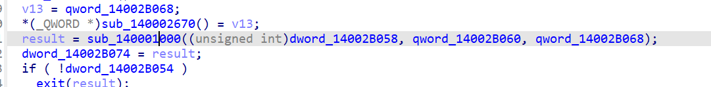

读取code.bin到vm内存

调用vm解释起执行code.bin

<!-- 这是一张图片，ocr 内容为： -->
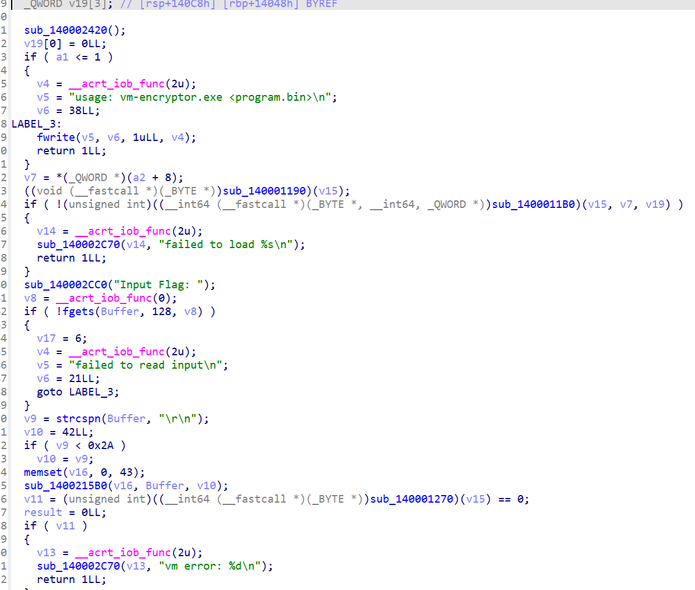

vm解释器sub_140001270

VM 上下文布局（按 int *a1）

a1[0]：pc（程序计数器）

a1[1]：sp（栈深，最大 0x1000）

((uint8_t*)a1)+12：mem[0x10000]（代码+数据统一内存）

a1[16387 ...]：stack[0x1000]（32-bit 栈）

a1[20483]：运行标志（非 0 继续，0 停止）

a1[20484]：错误码（0 表示无错）

```text
指令集（已确认）

控制流
0x00 JMP imm32
0x01 JZ imm32（弹栈，值==0跳）
0x02 JNZ imm32（弹栈，值!=0跳）
0x1E CALL imm32（压返回地址，跳转）
0x1F RET（弹返回地址到 pc）
0xFF HALT

栈/内存
0x03 PUSH8 imm8
0x04 PUSH32 imm32
0x05 LDB（弹地址，读 1 字节压栈）
0x06 LDI（弹地址，读 4 字节压栈）
0x07 POP
0x08 STB（弹 addr,val，写 1 字节）
0x09 STI（弹 addr,val，写 4 字节）
0x1C DUP
0x1D SWAP
0x20 PUTS（弹地址，输出内存中的 \0 字符串）

算术/比较
0x0A ADD
0x0B SUB
0x0C MUL
0x0D DIV
0x0E MOD
0x18 LT
0x19 GT
0x1A LE
0x1B GE

位运算组（在题目里大量用于 24-bit 混淆）
0x0F~0x17 这组是按位与/或/异或/移位类操作（从字节码行为可确认被用于拼 24-bit、mask 0x00ffffff、常量 0x55757d 变换）。
```


```python
#!/usr/bin/env python3
import base64
from pathlib import Path

MASK24 = (1 << 24) - 1
C = 0x55757D

def ror24(x: int, n: int) -> int:
    n %= 24
    return ((x >> n) | ((x << (24 - n)) & MASK24)) & MASK24

def solve(path="code.bin"):
    data = Path(path).read_bytes()

    # 比较常量（56字节）
    enc = data[0x109D:0x109D + 56]

    # 逆阶段2：xor 0x63
    s = bytes(b ^ 0x63 for b in enc)

    # 逆阶段1：base64 decode -> 42 bytes
    mid = base64.b64decode(s)

    # 逆阶段0：每3字节逆三轮 24-bit 变换
    out = bytearray()
    for i in range(0, len(mid), 3):
        x = (mid[i] << 16) | (mid[i + 1] << 8) | mid[i + 2]
        x = ror24(x ^ C, 20)
        x = ror24(x ^ C, 11)
        x = ror24(x ^ C, 5)
        out += bytes([(x >> 16) & 0xFF, (x >> 8) & 0xFF, x & 0xFF])

    flag = out.decode("ascii")
    print(flag)

if __name__ == "__main__":
    solve()

```

NCTF{1578be15-ad09-4859-9193-5d52585eb485}


