## 题目列表

### 第一周
- 1.plzdebugme
- 2.Puzzle
- 3.Xor
- 4.Strange Base
- 5.EzMyDroid

### 第二周
- 1.ohNativeEnc
- 2.尤皮·埃克斯历险记（1）
- 3.Look at me carefully
- 4.采一朵花，送给艾达（1）
- 5.forgotten_code

### 第三周
- 1.采一朵花送给艾达（2）
- 2.尤皮·埃克斯历险记（2）
- 3.pyz3
- 4.Dancing Function
- 5.changemykey
- 6.changemykey-rev

### 第四周
- 1.hookme
- 2.尤皮.艾克斯历险记（3）
- 3.ezrust
- 4.Dancingkeys
- 5.NOT_TUI

### 第五周
- 1.天才的认证
- 2.AnEasySystem
- 3.河图洛书
- 4.魔法少女的秘密
- 5.Jvav Master

## 第一周
### 1.plzdebugme
题目给的信息是

<!-- 这是一张图片，ocr 内容为：题目内容: 动态调试是学习逆向必不可少的一部分:) -->


用die查看文件信息，是elf文件

<!-- 这是一张图片，ocr 内容为：ELF64 30.29 KIB 类型 扫描 架构 字节序 模式 自动 LE 64位 AMD64 DYN ELF64 ? S 操作系统:UBUNTU LINUX(22.04.2,ABI:3.2.0)[AMD64,64位,DYN] 编译器:GCC(UBUNTU 11.4.0-1UBUNTU1~22.04.2)11.4.0) S 语言:C S 库:GLIBC(2.4)[DYN AMD64-64] S 附加:BINARY[偏移0X5000,大小00X2928] ? S 未知:未知 -->
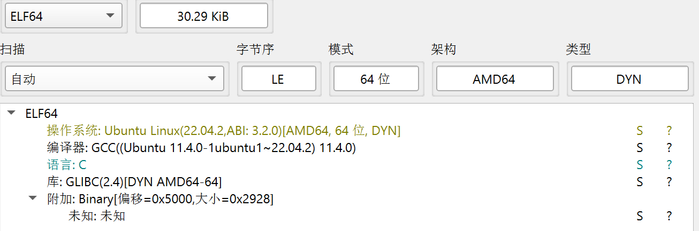

这里我用的是WSL2中安装Ubuntu去远程链接IDA调试

IDA中Debugger选择Remote GDB debugger，设置如下

<!-- 这是一张图片，ocr 内容为：DEBUG APPLICATION SETUP:GDB NOTE: ALL PATHS MUST BE VALID ON THE REMOTE COMPUTER APPLICATION PLZDEBUGME INPUT FILE PLZDEBUGME PARAMETERS DEBUGGER OPTIONS DEBUGGER SPECIFIC OPTIONS PORT 127.0.0.1 HOSTNAME 1234 SAVE NETWORK SETTINGS AS DEFAULT -->
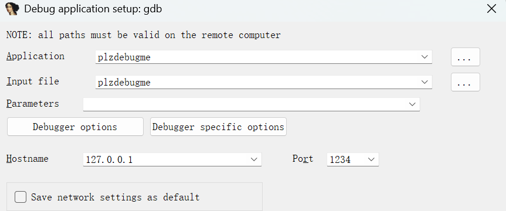

打开WSL2

输入命令（前提是你要先把文件复制到WSL家目录，并赋予执行权限）

```bash
gdbserver :1234 ./plzdebugme
```

会有以下输出

<!-- 这是一张图片，ocr 内容略。 -->
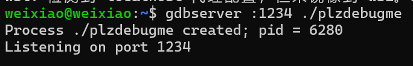

接下来在按提示在xor除下断点，调试

<!-- 这是一张图片，ocr 内容为：THE FUNCTION XOR(), BREAK ON IT\N") PRINTF("HINT: YOU CAN FIND THE FLAG A STYLE CHARACTER -->
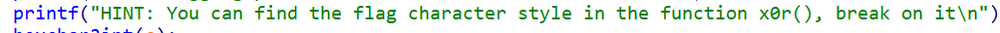

<!-- 这是一张图片，ocr 内容为：BTEA(V, 2, K); 6 47 XOR(OUT, OX20ULL); 48 PUTCHAR(10); -->
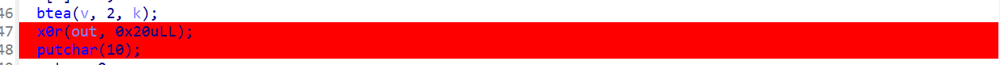

F9执行到断点，接下来F7单步执行

<!-- 这是一张图片，ocr 内容为：VOID __CDECL XOR(CONST UT 000000000000005 LHEH0RY:80000000000000005 LEN) RAX 0000000000000000 CJNEN0RY:00000000000000000 RBX OOOODON SIZE_TV2; 0080555555559060  L BSS:FLAG RCX SIZE_T I;//[RSP+18H][ [RBP-18H] BSS:FLAG+4 0000555555559064 +L RDX SIZE_T I_O; // [RSP+20H] [RBP-10H] 000000000000020-LMEMORY:00000000000000020 RSI MEMORY:00007FFFFFFFD9D0 00007FFFFFFFD9D0 CL ME RDI V2   LEN; MEMORY:80007FFFFFFFD7E0 80867FFFFFFD7E8 IF ( LEN > BX20 ) 0 V2 : 32LL;  FOR (I : OLL; I < V2; ++I ) LAX FLAG[I] CIPHER[I] EX51; IF( V2 (: BX1F ) SI7E 0000555555554000 FOR(I_0 -V2;I_0 < 0X1F;+++++++++++++++ FLAG[I_E]-E; FLAG[32] 0; -->
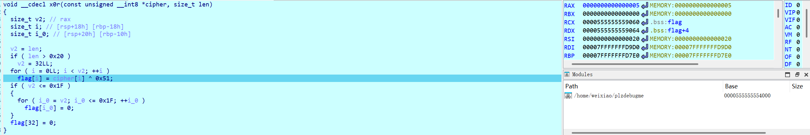

知道右边寄存器窗口中的flag变为flag+1F，查看

<!-- 这是一张图片，ocr 内容为：FLAG PUBLIC ; UNSIGNED _INT8 FLAG[33] FLAG DB 66H, 6CH, 61H, 67H, 7BH, 49H, 74H, 33H, 5FH, 44H, 33H: DATA XREF: X0R+43个O X0R:LOC 555555566FA1O  DB 62H, 75H, 67H, 47H, 5FH, 54H, 31H, 31H, 6DH, 65H, 21H- DB 5FH, 6CH, 65H, 33H, 5FH, 70H, 6CH, 61H, 79H, 7DH, 0 ALIGN 8 ENDS BSS -->
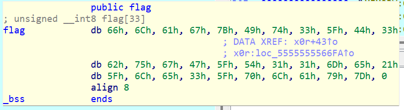

接下来就是putchar(),把这些十六进制转化为ASCII

flag{It3_D3bugG_T11me!_le3_play}


### 2.Puzzle
IDA中打开main函数，flag拼接

<!-- 这是一张图片，ocr 内容为：_INT64 V8;// [RSP+78H] [ RBP-18H] INT V9; // [RSP+80H] [RBP-1OH] _MAIN(ARGC, ARGV, ENVP); PUZZLE_CHALLENGE(); PUTS("HUH? WHY DO HY DO SOME FUNCTIONS HAVE STRANGE NAMES?CHECK IT OUT."); ("SOMETIMES SHIFT+F12 AND X WILL HELP YOU FIND USEFUL INFORMATION."); PUTS IS PROBABLY THE LAST PART."); "DO YOU SEE ANY STRANGE STRINGS?THIS IS PROU AN STRCPY( (BUFFER,"DO BUFFER[63] 0; 三 OLL; V5 OLL; V6 三 OLL; V7三 三0LL; V8 V9 PUTS(BUFFER); PUTS("TRY TO PUT THEM TOGETHER. THE FLAB IS IN THE FORMAT FLAGIPARTIPARTZPART3PARTA)"); RETURN O; -->
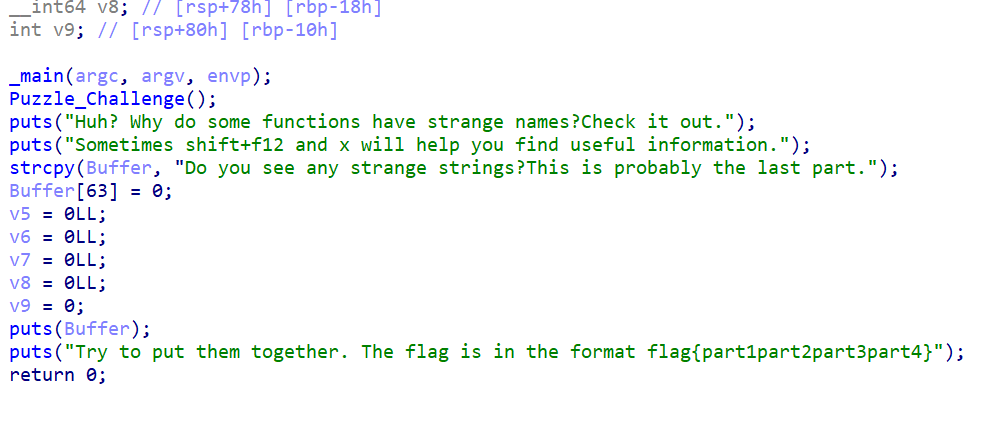

第一处在Puzzle_Challenge函数里（Do_Y0u_）

<!-- 这是一张图片，ocr 内容为：0001400040A0 FT+E TO EXTRACT THE DATA. AYOUCANUSESHIFT DB 'YOU CAN USE SHIFT+E TO 0001400040A0 DATA XREF: ITS_ABOUT_PART3+8个O 'DO_', DB DATA XREF: PUZZLE_CHALLENGE+81O 0001400040C9 ADO QP 'YOU DATA XREF: PUZZLE CHALLENGE+131O 0001400040CD AYOU -->
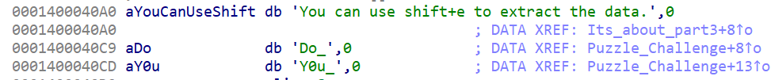

第二处在字符串中看到是一个函数名，点进出查看(Like_7his_Jig)

<!-- 这是一张图片，ocr 内容为：E FLAG--THE FUNCTION NAME. CONGRATULATIONS! YOU FOUND THE SECOND PART OF THE FLA 0000004B RDATA:0. -->
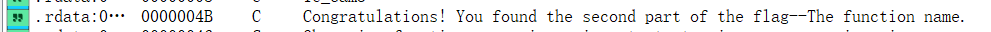

<!-- 这是一张图片，ocr 内容为：DB 'CONGRATULATIONS! YOU FOUND THE SECOND PART OF THE FLA E FLAG-THE FUNCT' BUFFER 7HIS_JIG+ LIKEL +8个0 DATA XREF: -->
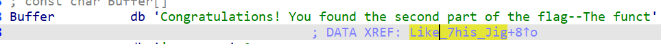

第三处函数名列表中找到Its_about_part3函数(s@w_puzz)

<!-- 这是一张图片，ocr 内容为：ITS_ABOUT_PART3 PUZZ1E CHALLENGE -->
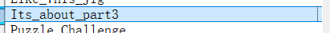

对数组进行异或<!-- 这是一张图片，ocr 内容为：ENCRYPTED_ARRAY[16] BYTE ENCRYPTED_ARRAY DB EDEH, OEDH, EDAH, OF2H, EDDH, ED8H, 2 DUP(EDZH), 8 DUP(0) DATA XREF: ITS ABOUT PART3+3CTO -->
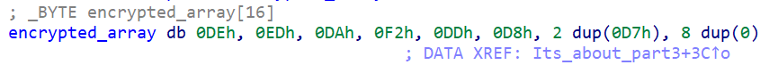

<!-- 这是一张图片，ocr 内容为：I // RAX _INT64 RESULT; BYTE V1[10]; [RSP+2AH][RBP-16H] INT V2; // [RSP+34H] [RBP-CH]  INT V3; // [RSP+38H] [RBP-8H]  INT I; // [RSP+3CH] [RBP-4H] PRINTF("YOU CAN USE SHIFT+E TO EXTRACT THE DATA."); V3 8 8; 8; V2 O;I FOR(I < V2; ++I 川 L ENCRYPTED_ARRAY[I] V1[I] OXAD; V2; RESULT V1[V2] 三 RETURN RESULT; -->
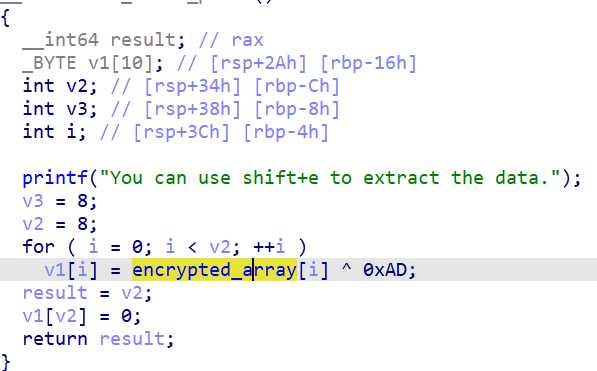

```python
encrypted_array = [0xDE, 0xED, 0xDA, 0xF2, 0xDD, 0xD8, 0xD7, 0xD7] + [0x00] * 8
print(''.join(chr(b ^ 0xAD) for b in encrypted_array if 32 <= (b ^ 0xAD) <= 126))

```

第四处(1e_Gam3)

<!-- 这是一张图片，ocr 内容为：DB '1E GAM3 FLAG_PART_4 RDATA:0000000140004000 -->
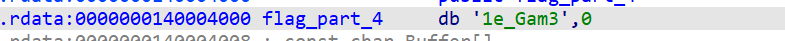

flag{Do_Y0u_Like_7his_Jigs@w_puzz1e_Gam3}


### 3.Xor
IDA中打开main函数，加密逻辑就在里面

<!-- 这是一张图片，ocr 内容略。 -->
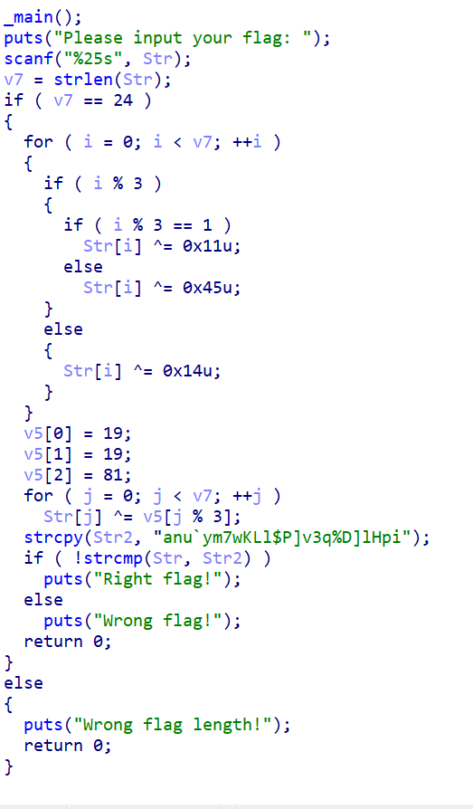

对输入进行两次异或，并根据除3所得余数来决定与谁异或，并所得结果与 ``anu`ym7wKLl&#36;P]v3q%D]lHpi`` 进行对照

脚本

```python
s2="anu`ym7wKLl$P]v3q%D]lHpi"
keys1={0:0x14,1:0x11,2:0x45}
keys2 = {0:0x13,1:0x13,2:0x51}
flag = "".join(chr(ord(c) ^ keys1[i%3] ^ keys2[i%3]) for i,c in enumerate(s2))
print(flag)
```

flag{y0u_Kn0W_b4s1C_xOr}


### 4.Strange Base
当看到题目内容时，我就想到会不会是自定义的Base表

<!-- 这是一张图片，ocr 内容为：奇怪?这BASE64为什么不能一一把梭了? -->


IDA打开一看还真是

这是main函数，密文T>6uTqOatL39aP!YIqruyv(YBA!8y7ouCa9=

<!-- 这是一张图片，ocr 内容为：_FASTCALL MAIN() INT64 INT VO;// EAX SIZE_T V1;// RAX CHAR ENC[48]; // [RSP+20H] [RBP-90H] BYREF INT8 OUTPUT[48]; // [RSP+50H] [RBP-60H] BYREF UNSIGNED UNSIGNED INPUT[48]; // [RSP+80H] [RBP-30H] BYREF INT8 _MAIN(); MEMSET(INPUT, O, SIZEOF(INPUT)); MEMSET(OUTPUT, O, SIZEOF(OUTPUT)); TIME TO SHOW YOUR FLAG TO ME~~"); 'IT'S PUTS ( "T>6UTQOATL39AP!YIQRUYV(YBA!8Y7OUCA9:"); STRCPY(ENC, INPUT); SCANF_S("%S", : STRLEN((CONST CHAR *)INPUT); VO BASE64_ENCODE(INPUT, (CHAR *)OUTPUT, VO); V1 - STRLEN(ENC); !MEMCMP(OUTPUT, ENC, V1) ) IF PRINTF("OH! YOU'RE AWESOME!!!"); ELSE PUTS("WRONG!"); RETURN OLL; -->
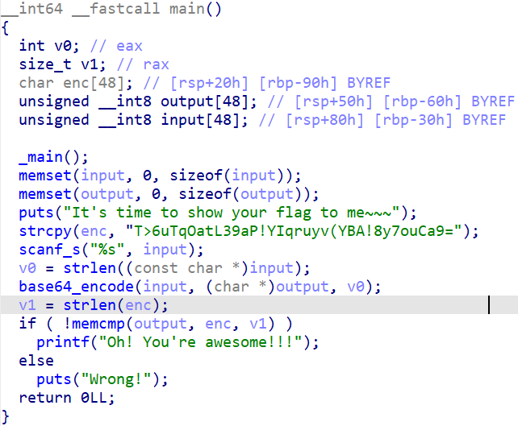

去看base64_encode函数

<!-- 这是一张图片，ocr 内容为：日; JO; WHILE ( I < BINLENGTH V3 - J; JA 三 J + 1 ; BASE64[V3] - AHELLOACRQZYB4S[(BINDATA[I] >> 2) & OX3F]; : (16 * BINDATA[I]) & OX30; CURRENT IF BINLENGTH <三 I + 1 ) AHELLOACRQZYB4S[CURRENT]; BASE64[JA]  BASE64[JA + 1] : 61; V4 三 JA + 2; J JA+3; BASE64[V4] 3 61; BREAK; V5 : JA; JB : JA + 1; BASE64[V5] - AHELLOACRQZYB4S[(BINDATA[I + 1] >> 4) CURRENT]; BINDATA[I + 1]) & OX3C; CURRENTA - (4 <: I + 2 ) BINLENGTH IF BASE64[JB] - AHELLOACRQZYB4S[CURRENTA]; V6 JB + 1; J - JB + 2; BASE64[V6] 61; BREAK; BASE64[JB] : AHELLOACRQZYB4S[(BINDATA[I + 2] >> 6) | CURRENTA]; V7 - JB + 1; J - JB + 2; BASE64[V7] : AHELLOACRQZYB4S[BINDATA[I + 2] & OX3F]; +二 3; 子 BASE64[J] O; BASE64; RETURN -->
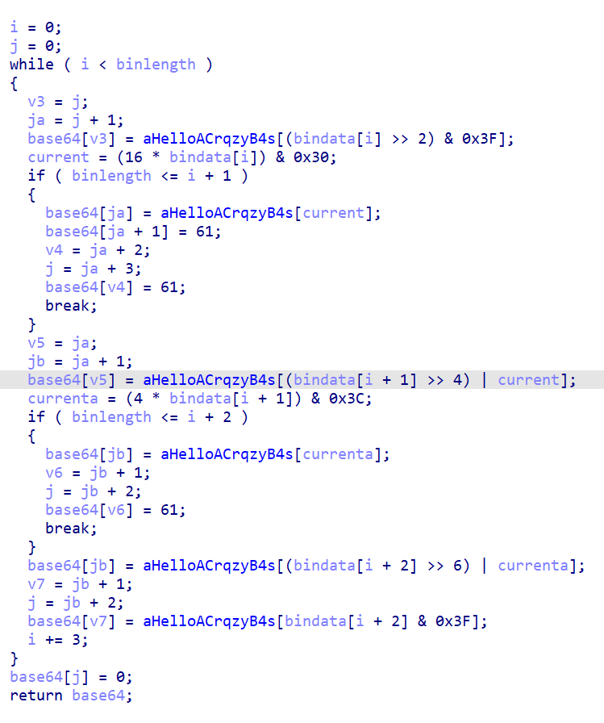

点开aHelloACrqzyB4s，果然是自定义Base表

<!-- 这是一张图片，ocr 内容为：RDATA:0000000140004000 ;ORG 140004000H [HELLO!A三CRQZY-B4S3[IS',27H,'WAITTING&YOU~{/(>V<)*}G0~256789PPQWXV .RDATA:0000000140004000 AHELLOACRQZYB4S DB BASE64_ENCODE+4110 DATAXREF: RDATA:0000000140004000 ENCODE+8CTO BASE64 RDATA:0000000140004000 DB 'KJNMF',O RDATA:000000014000403B -->
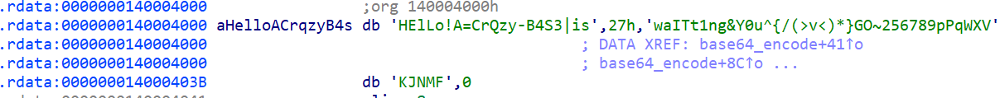

随波逐流工具解密

<!-- 这是一张图片，ocr 内容为：[随波逐流]CTF编码工具V6.920250807最新版本为:V7.0250924 字密2字密3字密4编码转换带KEY解密多KEY解密在线解密进制转换其他工具 文件 图片 字密1 题库&更新 BASE/ROT L:HELLO!A CRQZY-B4S3LIS'WAITINGSYOU'I/()() 密文(字:36) 一键解码 密钥KEY/STR/WL: IT>6UTQOATL39AP!YLGRUYV(YBA!8Y7OUCA9: 解密结果`合司 结果 搜索 正则搜 解码结果(注:在线解密密码不参与一键解码) 一键解码: FLAGWH4T_A_CRA2Y_8AS3!!!! BASE64解码: -->
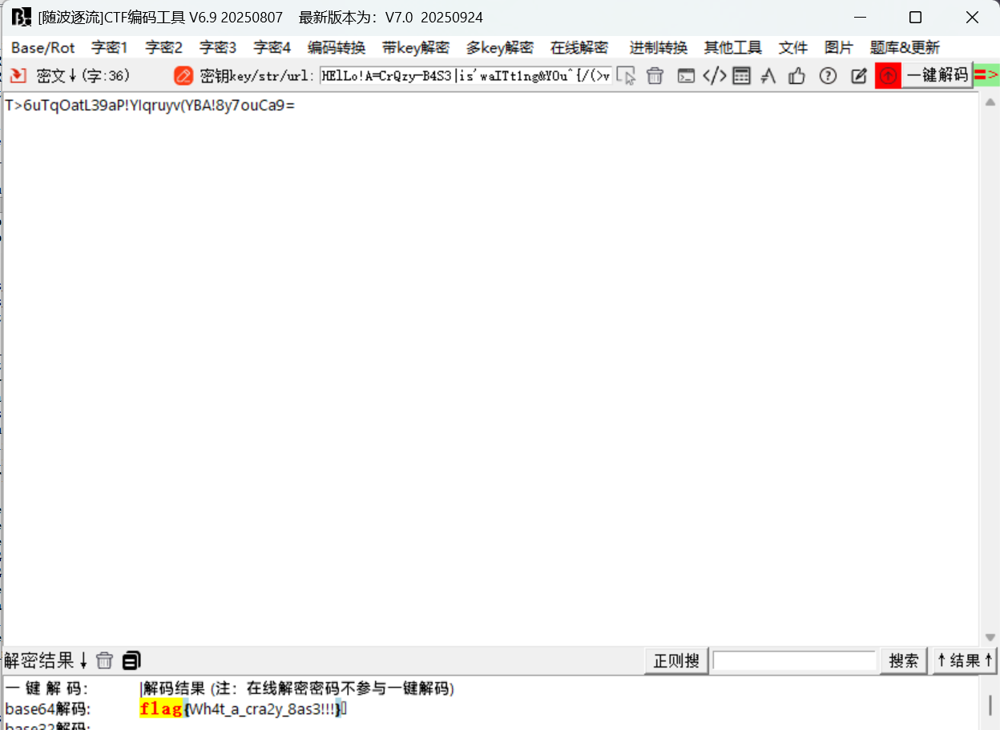

脚本解密

```python
import base64

custom_alphabet = "HElLo!A=CrQzy-B4S3|is'waITt1ng&Y0u^{/(>v<)*}GO~256789pPqWXVKJNMF"
cipher = "T>6uTqOatL39aP!YIqruyv(YBA!8y7ouCa9="

std_b64 = "ABCDEFGHIJKLMNOPQRSTUVWXYZabcdefghijklmnopqrstuvwxyz0123456789+/"
table = str.maketrans(custom_alphabet, std_b64)

decoded = base64.b64decode(cipher.translate(table))
print(decoded.decode())

```

flag{Wh4t_a_cra2y_8as3!!!}


### 5.EzMyDroid
用JADX打开，在AndroidManifest.xml中找到包名

<!-- 这是一张图片，ocr 内容为：ANDROID:COMPILESDKVERSIONCOAENAME- "WORK.PANGBAI.EZMYDROID" PACKAGE PLATFORMBUILDVERSIONCODE "34" PLATFORMBUILDVERSIONNAME "14"> LUSES-SDK ANDROID:MINSDKVERSION 24 TARGETSDKVERSION-"34"/> ANDROID:TAR <PERMISSION "WORK.PANGBAI.EZMYDROID.DYNAMIC RECEIVER ANDROID:NAME :PROTECTIONLEVEL-"SIGNATURE"/> ANDROID "WORK.PANGBAI.EZMYDROID.DYN ANDROID:NAME USESPERMISSION <APPLICATION @STYLE/THEME.EZMYDROID" ANDROID:THEME -->
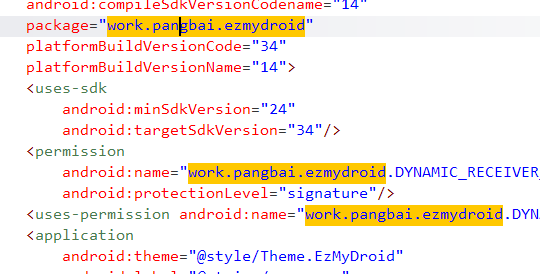

去原代码中打开

<!-- 这是一张图片，ocr 内容为：ANDROID.VIEW.MENUITEM; IMPORT IMPORT ANDROID.VIEW.VIEW; IMPORT ANDROIDX.APPCOMPAT.APP.APPCOMPATACTIVITY; ANDROIDX.NAVIGATION.NAVCONTROLLER; IMPORT ANDROIDX.NAVIGATION.NAVIGATION; IMPORT ANDROIDX.NAVIGATION.P002UI.APPBARCONFIGURATION; IMPORT ANDROIDX.NAVIGATION.P002UI.NAVIGATIONUI; IMPORT COM.GOOGLE.ANDROID.MATERIAL.DIALOG.MATERIALALERTDIALOGBUILDER; IMPORT COM.GOOGLE.ANDROID.MATERIAL.SNACKBAR.SNACKBARJ IMPORT COM IMPORT WORK.PANGBAI.EZMYDROID.DATABINDING.ACTIVITYMAINBINDING; /* LOADED FROM: CLASSES2.DEX */ PUBLIC CLASS MAINACTIVITY EXTENDS APPCOMPATACTIVITY F PRIVATE APPBARCONFIGURATION APPBARCONFIGURATION; PRIVATE ACTIVITYMAINBINDING BINDING; WOID ONCREATE(BUNDLE BUNDLE){ PROTECTED VOID SUPER.ONCREATE(BUNDLE); ACTIVITYMAINBINDING ACTIVITYMAINBINDINGINGINFLATE - ACTIVITYNAINDINDING.INFLATE(GETLAYOUTINFLATER(); THIS.BINDING - ACTIVITYMAINDINDINFLATE; SETCONTENTVIEW(ACTIVITYMAINBINDINGINFLATE.GETROOT()); SETSUPPORTACTIONBAR(THIS.BINDING.TOOLBAR); THIS.APPBARCONFIGURATION 三 APPBARCONFIGURATIONBUILD; NAVIGATIONUT,SETUPACTIONBARMITNNAVCONTROLLE[(THTM, NAVCONTROLLARFINDLAVCONTROLLER, APPBARCONFIBU3LD)> THLL,BTODINS,FRB,SSTENCIICKLESTENER(REN V3EN V3CKLESTENERT), @OVERRIDE// ANDROID.VIEW.VIEW.ONCLICKLISTENER PUBLIC VOID ONCLICK(VIEW VIEW) { "暗暗暗暗,需要分析教体的代码完,你安装了JADX-G),SETANCHORYIEN("ACTION(C28W,ON' SNACKBAR.MAKE(VIEW,"WW @OVERRIDE // ANDROID.APP.ACTIVITY PUBLIC BOOLEAN ONCREATEOPTIONSMENU(MENU MENU) { GETMENUINFLATER().INFLATE(C2896R.MENU.MENU_MAIN, MENU); RETURN TRUE; @OVERRIDE // ANDROID.APP.ACTIVITY PUBLIC BOOLEAN ONOPTIONSITEMSELECTED(MENUITEM MENUITEM) { (MENUITEM.GETITEMID() - C2896R.ID.ACTION SETTINGS) "NEWSTARCTF2025").SETNESSAGE((CHARSEQUENCE)"欢迎参加 NEWSTARCTF2025,你需要 NEW MATERIALALERTDIALOGBUILDER(THIS).SETTITLE((CHARSEQUENCE) RETURN TRUE; RETURN SUPER.ONOPTIONSITEMSELECTED(MENUITEM); @OVERRIDE // ANDROIDX.APPCOMPAT.APP.APPCOMPATACTIVITY PUBLIC BOOL BOOLEAN ONSUPPORTNAVIGATEUP() RETURN -->
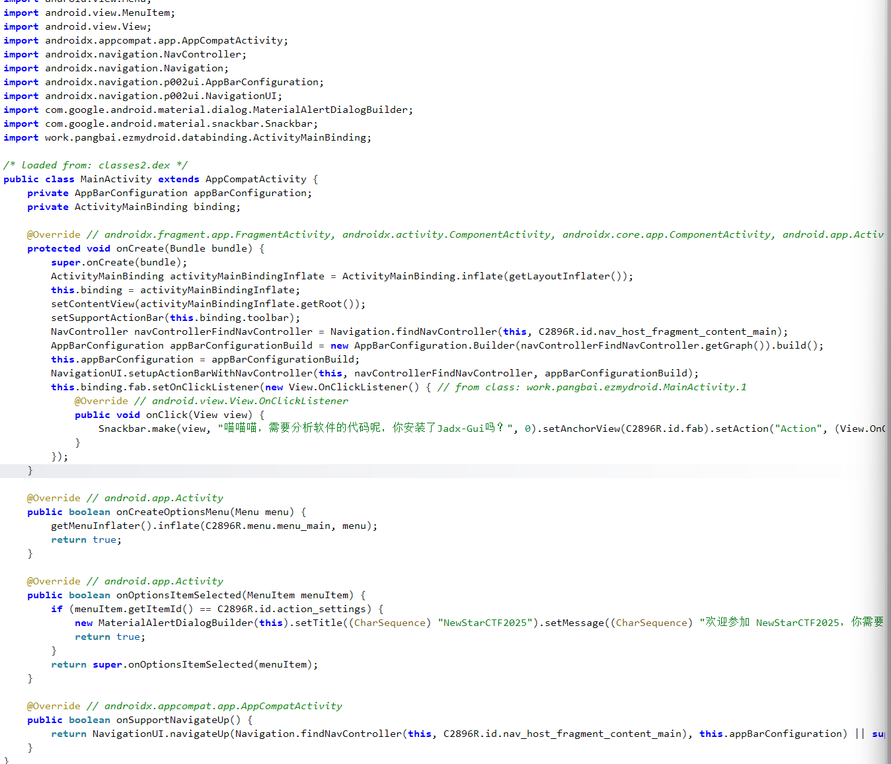

进行ui初始化，并进行 Navigation 导航  指向Fragment

查看第一个Fragment，里面果然有加密逻辑，是**AES-ECB 模式**

<!-- 这是一张图片，ocr 内容为：/* LOADED FROM: CLASSES2.DEX */ PUBLIC CLASS FIRSTFRAGMENT EXTENDS FRAGMENT AN PRIVATE FRAGMENTFIRSTBINDING BINDING; / ANDROIDX.FRAGMENT.APP.FRAGMENT @OVERRIDE THIS.BINDING - FRAGMENTFIRSTBINDINGINFLATE; RETURN FRAGMENTFIRSTBINDINGINFLATE.GETROOT(); @OVERRIDE // ANDROIDX.FRAGMENT.APP.FRAGMENT PUBLIC VOID ONVIEWCREATED(VIEW VIEW, BUNDLE BUNDLE) { SUPER.ONVIEWCREATED(VIEW, BUNDLE); THER,BINDING:CHECKFLAB,SETONCIICKLISTENER(REM VIEN VIEN, ONCIICKLISTENER()(/ FRON CLASS:PANABAI, 8ZE @OVERRIDE// ANDROID.VIEW.VIEW.ONCLICKLISTENER PUBLIC VOID ONCLICK(VIEW VIEW2) { TRY (FIRSTFRAGMENT.THIS.BINDING.INPUT.GETTEXT().TOSTRING(),"11451419191981000") STRING STRENCRYPT - AESECBUTILS.ENCRYPT( LOG.I("RESULT", STRENCRYPT); IF (STRENCRYPT.EQUALS("CTZ2PDH18FRMFKKJXFQS2T8JBSQLKVQZDLYPWJETKLE:") ( MENT.THIS.GETCONTEXT(), "RIGHT !!!", 0).SHOW(); TOAST.MAKETEXT(FIRSTFRAGMENT.TH LELSE "WRONG !!!", O).SHOW(); FIRSTFRAGMENT .THIS.GETCONTEXT(), TOAST.MAKETEXT( CATCH (EXCEPTION UNUSED) @OVERRIDE // ANDROIDX.FRAGMENT.APP.FRAGMENT PUBLIC VOID ONDESTROYVIEW() T SUPER.ONDESTROYVIEW(); THIS.BINDING NULL; -->
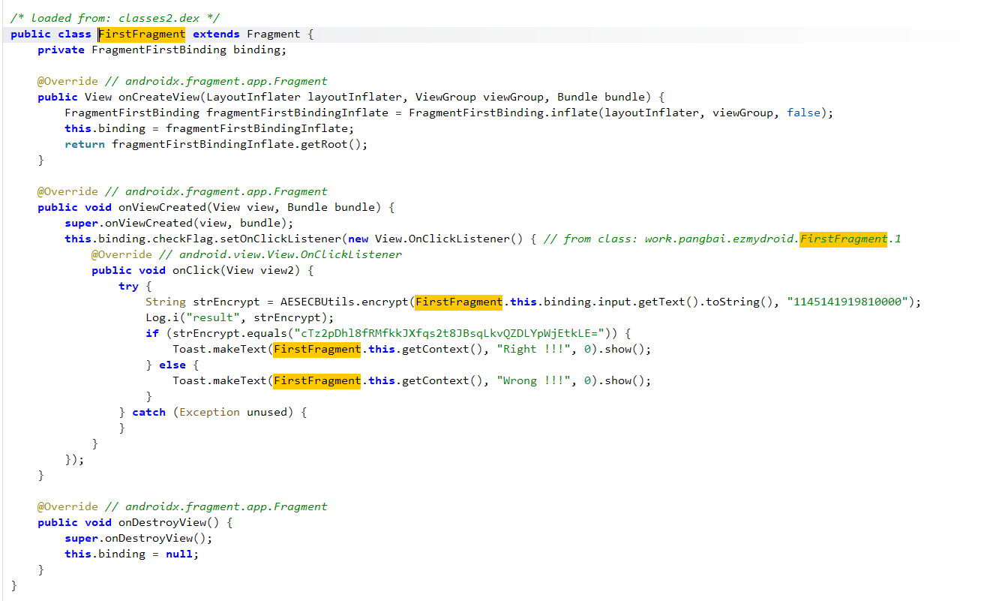

密钥：1145141919810000

密文：cTz2pDhl8fRMfkkJXfqs2t8JBsqLkvQZDLYpWjEtkLE=

脚本

```python
from Crypto.Cipher import AES
import base64

key = b"1145141919810000"  
ciphertext_b64 = "cTz2pDhl8fRMfkkJXfqs2t8JBsqLkvQZDLYpWjEtkLE="
ciphertext = base64.b64decode(ciphertext_b64)

cipher = AES.new(key, AES.MODE_ECB)
plaintext = cipher.decrypt(ciphertext)

pad_len = plaintext[-1]
plaintext = plaintext[:-pad_len]

print("FLAG:", plaintext.decode())

```

flag{@_g00d_st@r7_f0r_ANDROID}


## 第二周
### 1.ohNativeEnc
JADX中打开，mainactivity函数里

<!-- 这是一张图片，ocr 内容为： -->
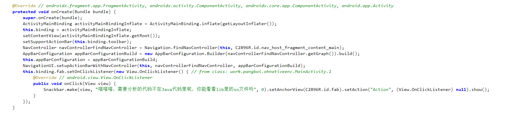

用apktool反编译

<!-- 这是一张图片，ocr 内容为： -->
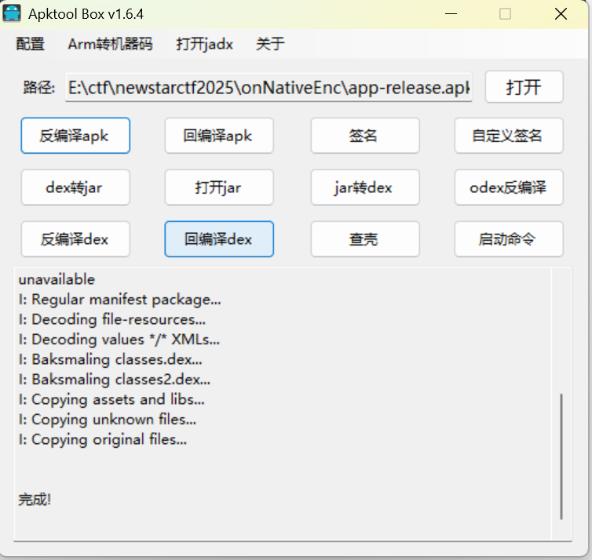

在lib目录里找到符合自己机型架构的so文件，用IDA打开

<!-- 这是一张图片，ocr 内容为： -->
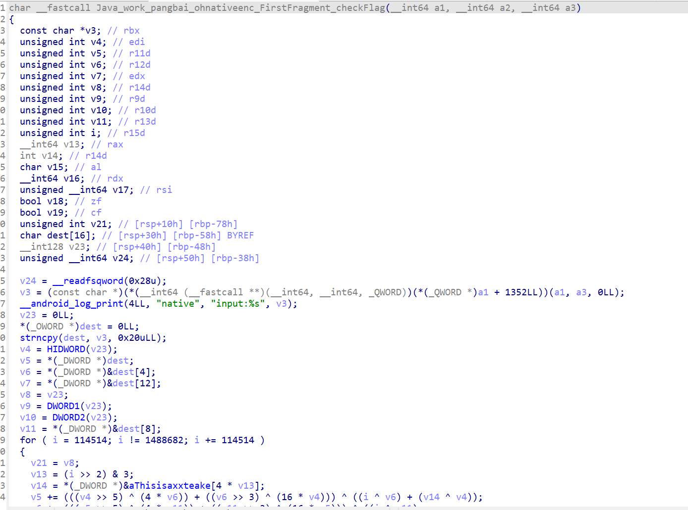

是个xxtea加密，轮数是12，delta值是114514，密钥在Thisisaxxteake

<!-- 这是一张图片，ocr 内容为： -->
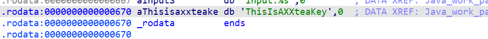

最后与mm里的数据对比

<!-- 这是一张图片，ocr 内容为： -->
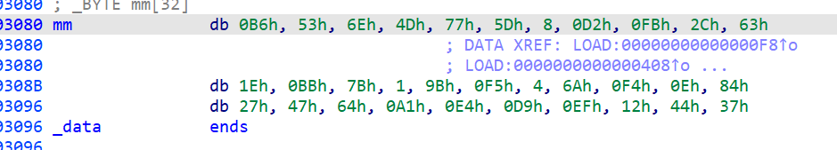

```python
import struct

mm = bytes.fromhex(
 "B6536E4D775D08D2FB2C631EBB7B019BF5046AF40E84274764A1E4D9EF124437"
)

key = b"ThisIsAXXteaKey" + b"\x00"

def xxtea_decrypt_8x32_le(cipher32: bytes, key16: bytes) -> bytes:
    v = list(struct.unpack('<8I', cipher32))
    k = list(struct.unpack('<4I', key16))
    delta = 114514 & 0xFFFFFFFF
    rounds = 12
    sum_ = (delta * rounds) & 0xFFFFFFFF
    for _ in range(rounds):
        e = (sum_ >> 2) & 3
        v[7] = (v[7] - (((v[6] >> 5) ^ ( (v[0] << 2) & 0xFFFFFFFF)) +
                        ((v[0] >> 3) ^ ((v[6] << 4) & 0xFFFFFFFF)) ^
                        ((sum_ ^ v[0]) + (v[6] ^ k[(e ^ 3) & 3])))) & 0xFFFFFFFF
        v[6] = (v[6] - (((v[5] >> 5) ^ ((v[7] << 2) & 0xFFFFFFFF)) +
                        ((v[7] >> 3) ^ ((v[5] << 4) & 0xFFFFFFFF)) ^
                        ((sum_ ^ v[7]) + (v[5] ^ k[(e ^ 2) & 3])))) & 0xFFFFFFFF
        v[5] = (v[5] - (((v[4] >> 5) ^ ((v[6] << 2) & 0xFFFFFFFF)) +
                        ((v[6] >> 3) ^ ((v[4] << 4) & 0xFFFFFFFF)) ^
                        ((sum_ ^ v[6]) + (v[4] ^ k[(e ^ 1) & 3])))) & 0xFFFFFFFF
        v[4] = (v[4] - (((v[3] >> 5) ^ ((v[5] << 2) & 0xFFFFFFFF)) +
                        ((v[5] >> 3) ^ ((v[3] << 4) & 0xFFFFFFFF)) ^
                        ((sum_ ^ v[5]) + (v[3] ^ k[e])))) & 0xFFFFFFFF
        v[3] = (v[3] - (((v[2] >> 5) ^ ((v[4] << 2) & 0xFFFFFFFF)) +
                        ((v[4] >> 3) ^ ((v[2] << 4) & 0xFFFFFFFF)) ^
                        ((sum_ ^ v[4]) + (v[2] ^ k[(e ^ 3) & 3])))) & 0xFFFFFFFF
        v[2] = (v[2] - (((v[1] >> 5) ^ ((v[3] << 2) & 0xFFFFFFFF)) +
                        ((v[3] >> 3) ^ ((v[1] << 4) & 0xFFFFFFFF)) ^
                        ((sum_ ^ v[3]) + (v[1] ^ k[(e ^ 2) & 3])))) & 0xFFFFFFFF
        v[1] = (v[1] - (((v[0] >> 5) ^ ((v[2] << 2) & 0xFFFFFFFF)) +
                        ((v[2] >> 3) ^ ((v[0] << 4) & 0xFFFFFFFF)) ^
                        ((sum_ ^ v[2]) + (v[0] ^ k[(e ^ 1) & 3])))) & 0xFFFFFFFF
        v[0] = (v[0] - (((v[7] >> 5) ^ ((v[1] << 2) & 0xFFFFFFFF)) +
                        ((v[1] >> 3) ^ ((v[7] << 4) & 0xFFFFFFFF)) ^
                        ((sum_ ^ v[1]) + (k[e] ^ v[7])))) & 0xFFFFFFFF
        sum_ = (sum_ - delta) & 0xFFFFFFFF
    return struct.pack('<8I', *v)

plain = xxtea_decrypt_8x32_le(mm, key)
print(plain.rstrip(b'\x00').decode())

```

 flag{Ur_G00d_@_n@tive_Func}  


### 2.尤皮·埃克斯历险记（1）
die看到是upx加壳

<!-- 这是一张图片，ocr 内容为： -->
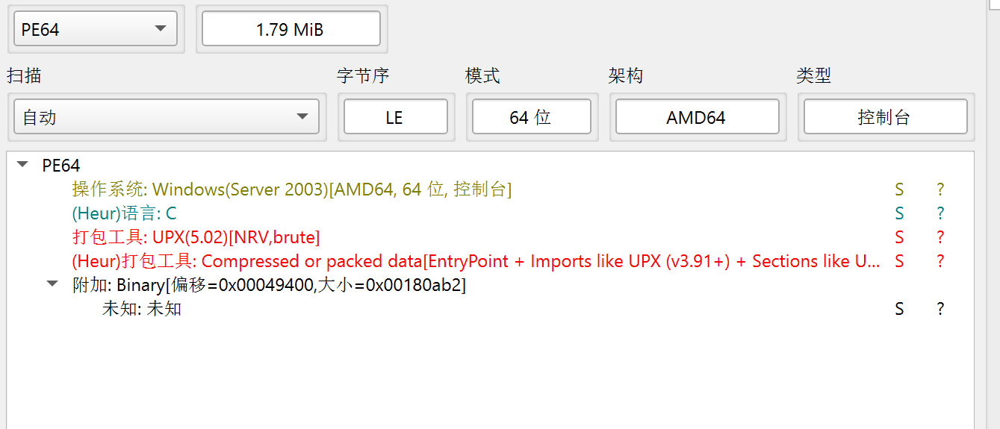

upx脱壳

<!-- 这是一张图片，ocr 内容为： -->
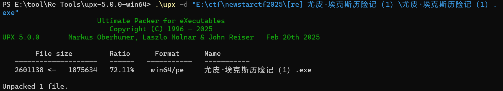

IDA打开main函数

<!-- 这是一张图片，ocr 内容为： -->
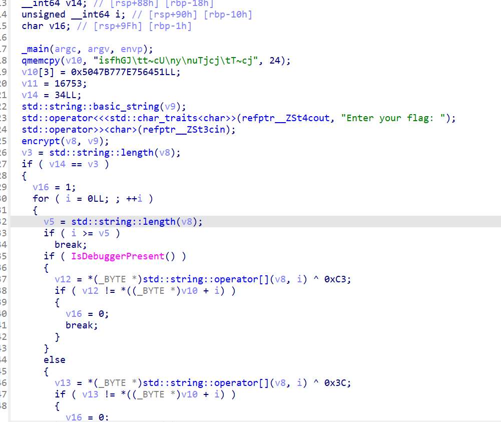

对34字节长度的明文，做异或，并映射

<!-- 这是一张图片，ocr 内容为： -->
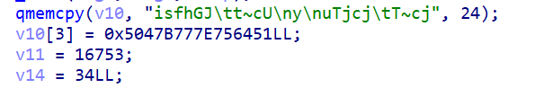

<!-- 这是一张图片，ocr 内容为： -->
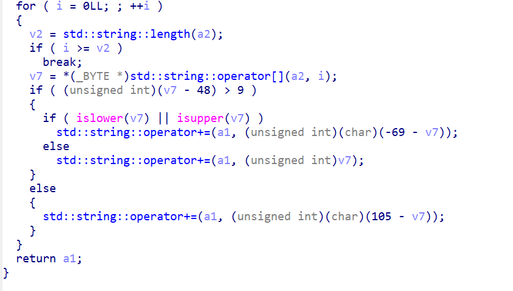

将一下代码保存在同文件夹，运行

```python
first=b"isfhGJ\tt~cU\ny\nuTjcj\tT~cj"
target=first+int("0x5047B777E756451",16).to_bytes(8,"little")+(16753).to_bytes(2,"little")
e=bytes([b^0x3C for b in target])
flag=bytes([105-b if 48<=b<=57 else 187-b if (65<=b<=90 or 97<=b<=122) else b for b in e]).decode("ascii")
print(flag)
```

<!-- 这是一张图片，ocr 内容为： -->
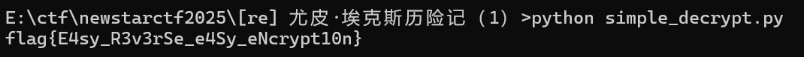

flag{E4sy_R3v3rSe_e4Sy_eNcrypt10n}


### 3.Look at me carefully
IDA打开，发现是个重排

<!-- 这是一张图片，ocr 内容为： -->
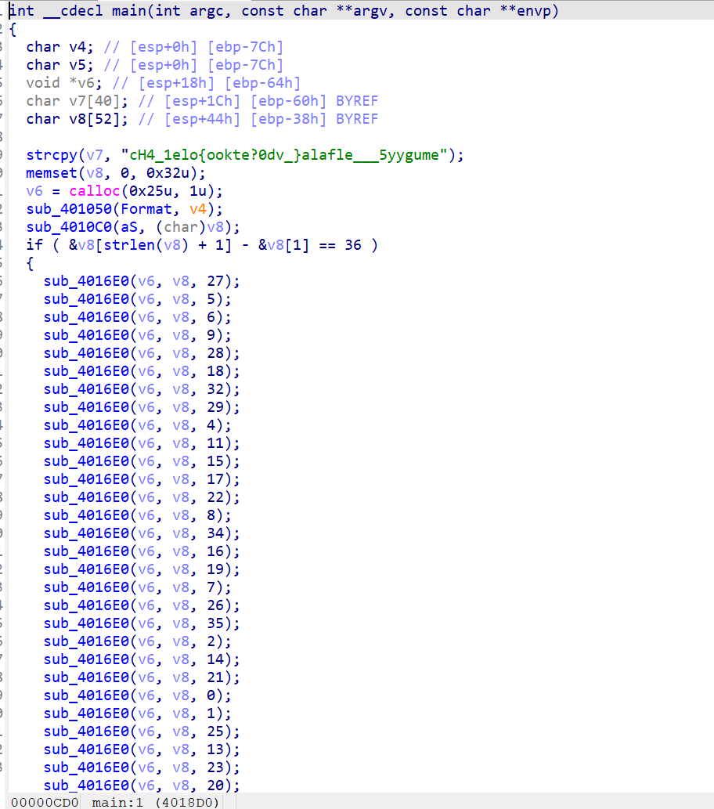

就是对cH4_1elo{ookte?0dv_}alafle___5yygume字符串按以下顺序重排

```text
27,5,6,9,28,18,32,29,4,11,15,17,22,8,34,16,19,7,
26,35,2,14,21,0,1,25,13,23,20,37,30,33,10,3,12,36,24,31

```

重排后结果

flag{H4ve_you_lo0ked_at_me_c1o5ely?}


### 4.采一朵花，送给艾达（1）
有五处花指令

第一处改前

<!-- 这是一张图片，ocr 内容为： -->
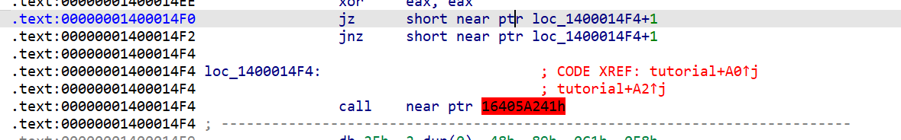

改后

<!-- 这是一张图片，ocr 内容为： -->
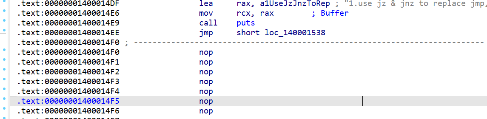

第二处改前

<!-- 这是一张图片，ocr 内容为： -->
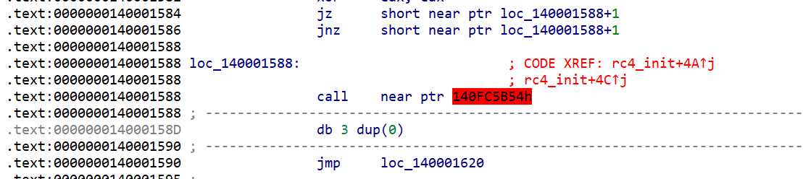

改后

<!-- 这是一张图片，ocr 内容为： -->
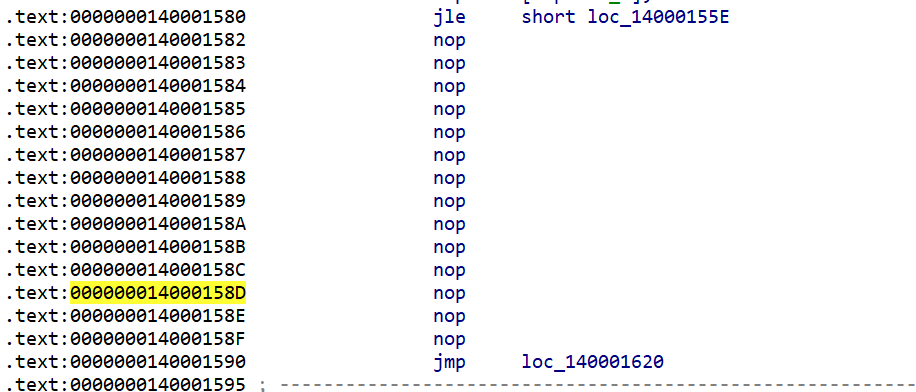

第三处改前

<!-- 这是一张图片，ocr 内容为： -->
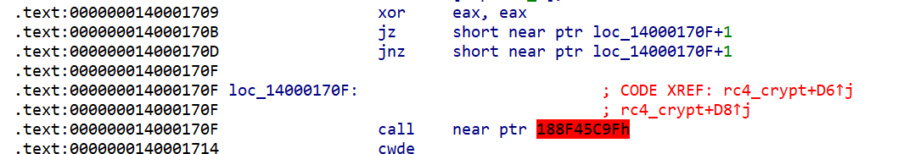

改后

<!-- 这是一张图片，ocr 内容为： -->
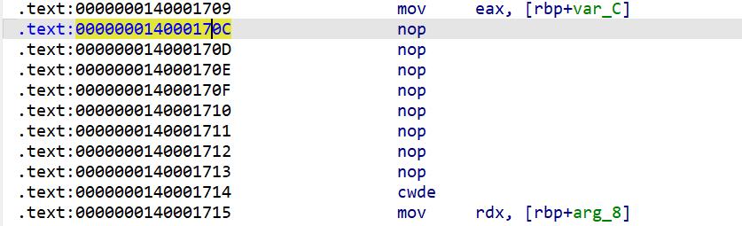

第四处和第五出改前

<!-- 这是一张图片，ocr 内容为： -->
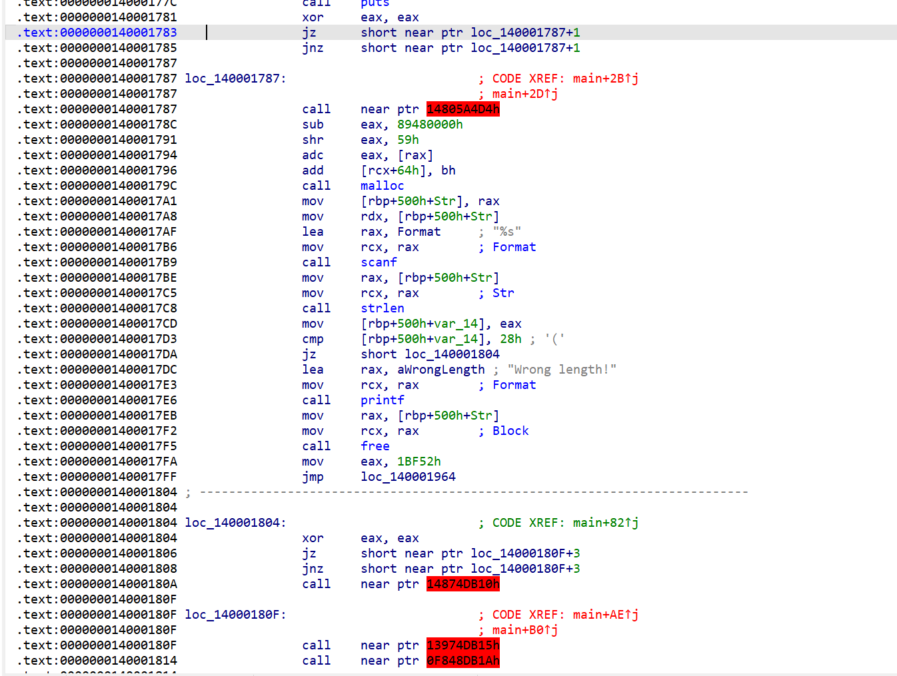

改后

第四处

<!-- 这是一张图片，ocr 内容为： -->
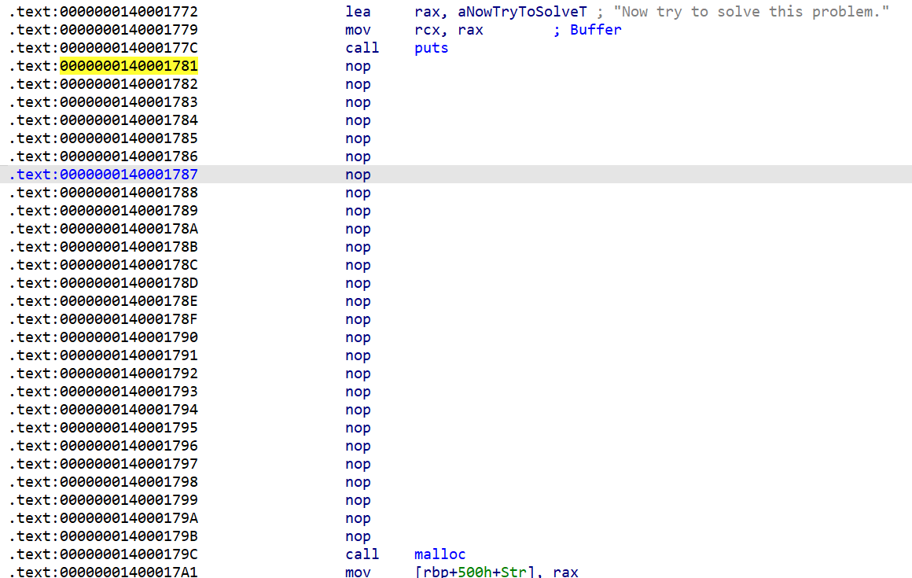

第五处

<!-- 这是一张图片，ocr 内容为： -->
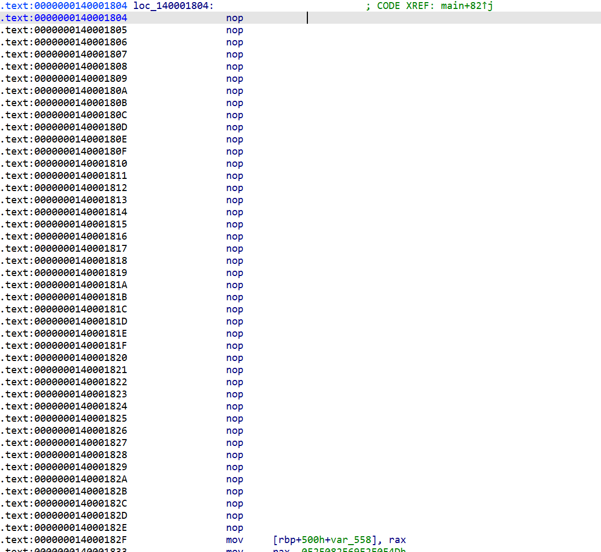

之后正常F5编译

<!-- 这是一张图片，ocr 内容为： -->
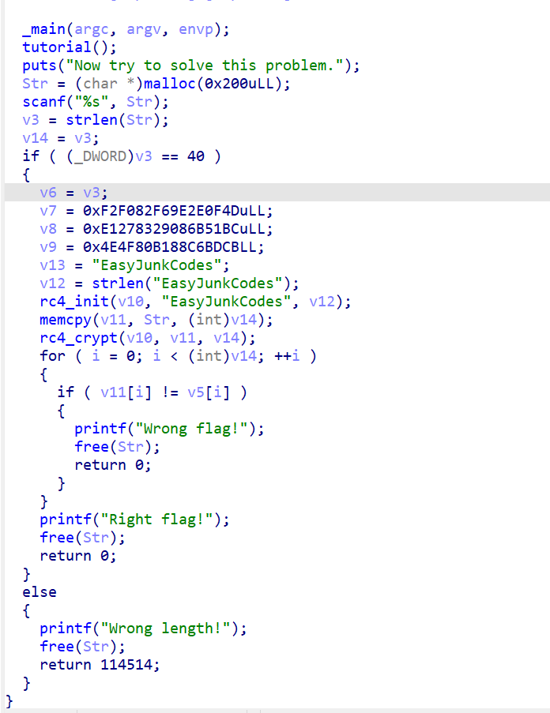

但缺少两段数据，我们动调去dump另外两段，位置在这，下断点

<!-- 这是一张图片，ocr 内容为： -->
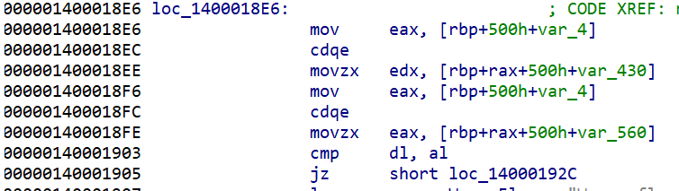

<!-- 这是一张图片，ocr 内容为： -->
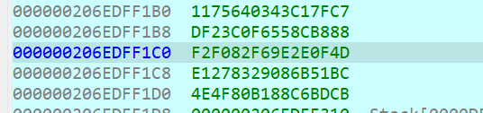

脚本

```python
target_hex = """
C7 7F C1 43 03 64 75 11 88 B8 8C 55 F6 C0 23 DF
4D 0F 2E 9E F6 82 F0 F2 BC 51 6B 08 29 83 27 E1
CB BD C6 88 B1 80 4F 4E
"""

def rc4_add_decrypt(target: bytes, key: bytes) -> bytes:
    # KSA with reversed initial S
    S = [(-i) & 0xFF for i in range(256)]
    j = 0
    for i in range(256):
        j = (S[i] + key[i % len(key)] + j) & 0xFF
        S[i], S[j] = S[j], S[i]

    i = 0
    j = 0
    out = bytearray()
    for t in target:
        i = (i + 1) & 0xFF
        j = (j + S[i]) & 0xFF
        S[i], S[j] = S[j], S[i]
        k = S[(S[i] + S[j]) & 0xFF]

        out.append((t - k) & 0xFF)
    return bytes(out)

def main():
    target = bytes(int(x, 16) for x in target_hex.split())
    key = b"EasyJunkCodes"
    plain = rc4_add_decrypt(target, key)
    try:
        print(plain.decode("utf-8"))
    except UnicodeDecodeError:
        print(plain)

if __name__ == "__main__":
    main()

```

flag{Junk_C0d3s_4Re_345y_t0_rEc0gn1Ze!!}


### 5.forgotten_code
010打开 这段是 **GAS（GNU assembler）生成的 x86-64 汇编**

```text
	.file	"chal.cpp"
	.intel_syntax noprefix
	.text
	.section	.text$_Z5scanfPKcz,"x"
	.linkonce discard
	.globl	_Z5scanfPKcz
	.def	_Z5scanfPKcz;	.scl	2;	.type	32;	.endef
	.seh_proc	_Z5scanfPKcz
_Z5scanfPKcz:
.LFB39:
	push	rbp
	.seh_pushreg	rbp
	push	rbx
	.seh_pushreg	rbx
	sub	rsp, 56
	.seh_stackalloc	56
	lea	rbp, 48[rsp]
	.seh_setframe	rbp, 48
	.seh_endprologue
	mov	QWORD PTR 32[rbp], rcx
	mov	QWORD PTR 40[rbp], rdx
	mov	QWORD PTR 48[rbp], r8
	mov	QWORD PTR 56[rbp], r9
	lea	rax, 40[rbp]
	mov	QWORD PTR -16[rbp], rax
	mov	rbx, QWORD PTR -16[rbp]
	mov	ecx, 0
	mov	rax, QWORD PTR __imp___acrt_iob_func[rip]
	call	rax
	mov	rcx, rax
	mov	rax, QWORD PTR 32[rbp]
	mov	r8, rbx
	mov	rdx, rax
	call	__mingw_vfscanf
	mov	DWORD PTR -4[rbp], eax
	mov	eax, DWORD PTR -4[rbp]
	add	rsp, 56
	pop	rbx
	pop	rbp
	ret
	.seh_endproc
	.section	.text$_Z6printfPKcz,"x"
	.linkonce discard
	.globl	_Z6printfPKcz
	.def	_Z6printfPKcz;	.scl	2;	.type	32;	.endef
	.seh_proc	_Z6printfPKcz
_Z6printfPKcz:
.LFB45:
	push	rbp
	.seh_pushreg	rbp
	push	rbx
	.seh_pushreg	rbx
	sub	rsp, 56
	.seh_stackalloc	56
	lea	rbp, 48[rsp]
	.seh_setframe	rbp, 48
	.seh_endprologue
	mov	QWORD PTR 32[rbp], rcx
	mov	QWORD PTR 40[rbp], rdx
	mov	QWORD PTR 48[rbp], r8
	mov	QWORD PTR 56[rbp], r9
	lea	rax, 40[rbp]
	mov	QWORD PTR -16[rbp], rax
	mov	rbx, QWORD PTR -16[rbp]
	mov	ecx, 1
	mov	rax, QWORD PTR __imp___acrt_iob_func[rip]
	call	rax
	mov	rcx, rax
	mov	rax, QWORD PTR 32[rbp]
	mov	r8, rbx
	mov	rdx, rax
	call	__mingw_vfprintf
	mov	DWORD PTR -4[rbp], eax
	mov	eax, DWORD PTR -4[rbp]
	add	rsp, 56
	pop	rbx
	pop	rbp
	ret
	.seh_endproc
	.globl	ng
	.data
	.align 16
ng:
	.ascii "sp\177vuctp|xeb|hv~"
	.globl	ezgm
	.align 32
ezgm:
	.long	1210405119
	.long	710975774
	.long	-90350153
	.long	-1958008304
	.long	-745722482
	.long	67707510
	.long	-86515270
	.long	-1728462407
	.text
	.globl	_Z2fnPj
	.def	_Z2fnPj;	.scl	2;	.type	32;	.endef
	.seh_proc	_Z2fnPj
_Z2fnPj:
.LFB188:
	push	rbp
	.seh_pushreg	rbp
	mov	rbp, rsp
	.seh_setframe	rbp, 0
	sub	rsp, 48
	.seh_stackalloc	48
	.seh_endprologue
	mov	QWORD PTR 16[rbp], rcx
	mov	DWORD PTR -4[rbp], 0
	jmp	.L6
.L7:
	mov	eax, DWORD PTR -4[rbp]
	cdqe
	lea	rdx, ng[rip]
	movzx	eax, BYTE PTR [rax+rdx]
	xor	eax, 17
	mov	edx, DWORD PTR -4[rbp]
	movsx	rdx, edx
	lea	rcx, ng[rip]
	mov	BYTE PTR [rdx+rcx], al
	add	DWORD PTR -4[rbp], 1
.L6:
	cmp	DWORD PTR -4[rbp], 15
	jle	.L7
	mov	rax, QWORD PTR 16[rbp]
	mov	eax, DWORD PTR [rax]
	mov	DWORD PTR -8[rbp], eax
	mov	rax, QWORD PTR 16[rbp]
	mov	eax, DWORD PTR 4[rax]
	mov	DWORD PTR -12[rbp], eax
	mov	DWORD PTR -16[rbp], 0
	mov	DWORD PTR -24[rbp], -1640531527
	mov	DWORD PTR -20[rbp], 0
	jmp	.L8
.L9:
	lea	rax, ng[rip]
	mov	eax, DWORD PTR [rax]
	mov	DWORD PTR -28[rbp], eax
	mov	eax, DWORD PTR ng[rip+4]
	mov	DWORD PTR -32[rbp], eax
	mov	eax, DWORD PTR ng[rip+8]
	mov	DWORD PTR -36[rbp], eax
	mov	eax, DWORD PTR ng[rip+12]
	mov	DWORD PTR -40[rbp], eax
	mov	eax, DWORD PTR -24[rbp]
	add	DWORD PTR -16[rbp], eax
	mov	eax, DWORD PTR -12[rbp]
	sal	eax, 4
	mov	edx, eax
	mov	eax, DWORD PTR -28[rbp]
	add	edx, eax
	mov	ecx, DWORD PTR -12[rbp]
	mov	eax, DWORD PTR -16[rbp]
	add	eax, ecx
	xor	edx, eax
	mov	eax, DWORD PTR -12[rbp]
	shr	eax, 5
	mov	ecx, eax
	mov	eax, DWORD PTR -32[rbp]
	add	eax, ecx
	xor	eax, edx
	add	DWORD PTR -8[rbp], eax
	mov	eax, DWORD PTR -8[rbp]
	sal	eax, 4
	mov	edx, eax
	mov	eax, DWORD PTR -36[rbp]
	add	edx, eax
	mov	ecx, DWORD PTR -8[rbp]
	mov	eax, DWORD PTR -16[rbp]
	add	eax, ecx
	xor	edx, eax
	mov	eax, DWORD PTR -8[rbp]
	shr	eax, 5
	mov	ecx, eax
	mov	eax, DWORD PTR -40[rbp]
	add	eax, ecx
	xor	eax, edx
	add	DWORD PTR -12[rbp], eax
	add	DWORD PTR -20[rbp], 1
.L8:
	cmp	DWORD PTR -20[rbp], 31
	jbe	.L9
	mov	rax, QWORD PTR 16[rbp]
	mov	edx, DWORD PTR -8[rbp]
	mov	DWORD PTR [rax], edx
	mov	rax, QWORD PTR 16[rbp]
	add	rax, 4
	mov	edx, DWORD PTR -12[rbp]
	mov	DWORD PTR [rax], edx
	nop
	add	rsp, 48
	pop	rbp
	ret
	.seh_endproc
	.section .rdata,"dr"
.LC0:
	.ascii "Input your flag: \0"
.LC1:
	.ascii "%s\0"
.LC2:
	.ascii "flag{\0"
.LC3:
	.ascii "Wrong length!\12\0"
.LC4:
	.ascii "Wrong flag!\12\0"
.LC5:
	.ascii "Right!\12\0"
.LC6:
	.ascii "Invalid flag format!\12\0"
	.text
	.globl	main
	.def	main;	.scl	2;	.type	32;	.endef
	.seh_proc	main
main:
.LFB189:
	push	rbp
	.seh_pushreg	rbp
	mov	rbp, rsp
	.seh_setframe	rbp, 0
	sub	rsp, 144
	.seh_stackalloc	144
	.seh_endprologue
	call	__main
	lea	rax, .LC0[rip]
	mov	rcx, rax
	call	_Z6printfPKcz
	lea	rax, -112[rbp]
	lea	rcx, .LC1[rip]
	mov	rdx, rax
	call	_Z5scanfPKcz
	lea	rdx, .LC2[rip]
	lea	rax, -112[rbp]
	mov	r8d, 5
	mov	rcx, rax
	call	strncmp
	test	eax, eax
	jne	.L11
	lea	rax, -112[rbp]
	mov	rcx, rax
	call	strlen
	sub	rax, 1
	movzx	eax, BYTE PTR -112[rbp+rax]
	cmp	al, 125
	jne	.L11
	lea	rax, -112[rbp]
	mov	rcx, rax
	call	strlen
	sub	eax, 6
	mov	DWORD PTR -12[rbp], eax
	cmp	DWORD PTR -12[rbp], 32
	je	.L12
	lea	rax, .LC3[rip]
	mov	rcx, rax
	call	_Z6printfPKcz
	mov	eax, 0
	jmp	.L20
.L12:
	mov	DWORD PTR -4[rbp], 0
	jmp	.L14
.L15:
	mov	eax, DWORD PTR -4[rbp]
	sal	eax, 3
	cdqe
	lea	rdx, 5[rax]
	lea	rax, -112[rbp]
	add	rax, rdx
	mov	rcx, rax
	call	_Z2fnPj
	add	DWORD PTR -4[rbp], 1
.L14:
	mov	eax, DWORD PTR -12[rbp]
	lea	edx, 7[rax]
	test	eax, eax
	cmovs	eax, edx
	sar	eax, 3
	cmp	DWORD PTR -4[rbp], eax
	jl	.L15
	mov	DWORD PTR -8[rbp], 0
	jmp	.L16
.L18:
	mov	eax, DWORD PTR -8[rbp]
	cdqe
	sal	rax, 2
	lea	rdx, 5[rax]
	lea	rax, -112[rbp]
	add	rax, rdx
	mov	ecx, DWORD PTR [rax]
	mov	eax, DWORD PTR -8[rbp]
	cdqe
	lea	rdx, 0[0+rax*4]
	lea	rax, ezgm[rip]
	mov	eax, DWORD PTR [rdx+rax]
	cmp	ecx, eax
	je	.L17
	lea	rax, .LC4[rip]
	mov	rcx, rax
	call	_Z6printfPKcz
	mov	eax, 0
	jmp	.L20
.L17:
	add	DWORD PTR -8[rbp], 1
.L16:
	mov	eax, DWORD PTR -12[rbp]
	lea	edx, 3[rax]
	test	eax, eax
	cmovs	eax, edx
	sar	eax, 2
	cmp	DWORD PTR -8[rbp], eax
	jl	.L18
	lea	rax, .LC5[rip]
	mov	rcx, rax
	call	_Z6printfPKcz
	jmp	.L19
.L11:
	lea	rax, .LC6[rip]
	mov	rcx, rax
	call	_Z6printfPKcz
.L19:
	mov	eax, 0
.L20:
	add	rsp, 144
	pop	rbp
	ret
	.seh_endproc
	.def	__main;	.scl	2;	.type	32;	.endef
	.ident	"GCC: (x86_64-posix-seh-rev0, Built by MinGW-Builds project) 15.1.0"
	.def	__mingw_vfscanf;	.scl	2;	.type	32;	.endef
	.def	__mingw_vfprintf;	.scl	2;	.type	32;	.endef
	.def	strncmp;	.scl	2;	.type	32;	.endef
	.def	strlen;	.scl	2;	.type	32;	.endef

```

原始字节，偶数块用异或0x11，奇数块用原始

<!-- 这是一张图片，ocr 内容为： -->
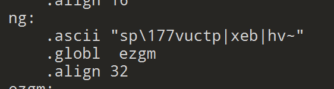

这是期望密文

<!-- 这是一张图片，ocr 内容为： -->
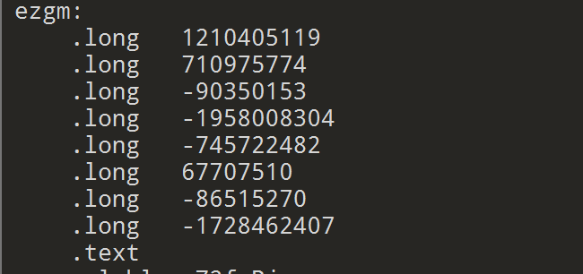

主函数汇编，算法是标准TEA

<!-- 这是一张图片，ocr 内容为： -->
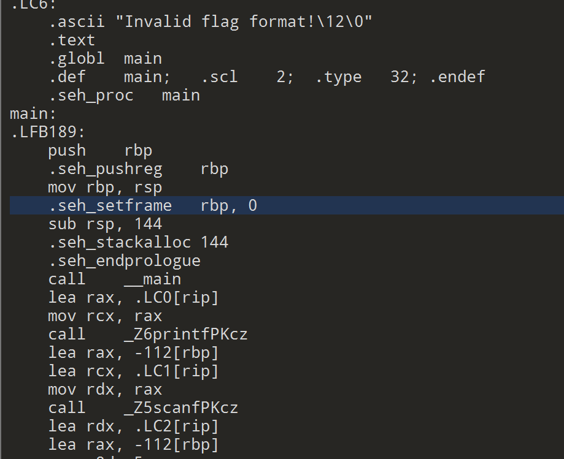

```python
import struct
ng_raw=b"sp\x7fvuctp|xeb|hv~"
ng_xor=bytes(b^0x11 for b in ng_raw)
ezgm=[1210405119,710975774,-90350153,-1958008304,-745722482,67707510,-86515270,-1728462407]
ct=b''.join(struct.pack('<I',x&0xffffffff)for x in ezgm)
def tea_dec(b,k):
 v0,v1=struct.unpack('<2I',b);k=struct.unpack('<4I',k)
 s=(0x9E3779B9*32)&0xffffffff
 for _ in range(32):
  v1=(v1-(((v0<<4)+k[2])^(v0+s)^((v0>>5)+k[3])))&0xffffffff
  v0=(v0-(((v1<<4)+k[0])^(v1+s)^((v1>>5)+k[1])))&0xffffffff
  s=(s-0x9E3779B9)&0xffffffff
 return struct.pack('<2I',v0,v1)
pt=b''
for i in range(0,len(ct),8):
 k=ng_xor if(i//8)%2==0 else ng_raw
 pt+=tea_dec(ct[i:i+8],k)
print("flag{"+pt.decode()+"}")

```

 flag{4553m81y_5_s0o0o0_345y_jD5yQ5mD9}

## 第三周

### 1.采一朵花送给艾达（2）
rc4_init的花指令

<!-- 这是一张图片，ocr 内容为： -->
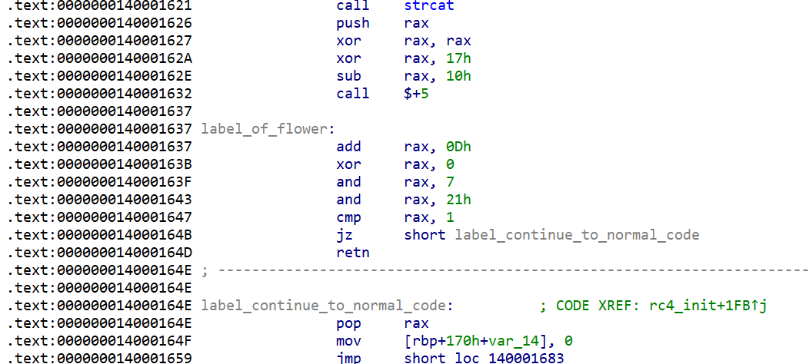

改完后

<!-- 这是一张图片，ocr 内容为： -->
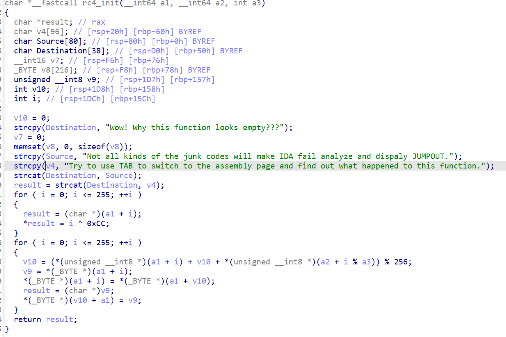

rc4_crypt的花指令

<!-- 这是一张图片，ocr 内容为： -->
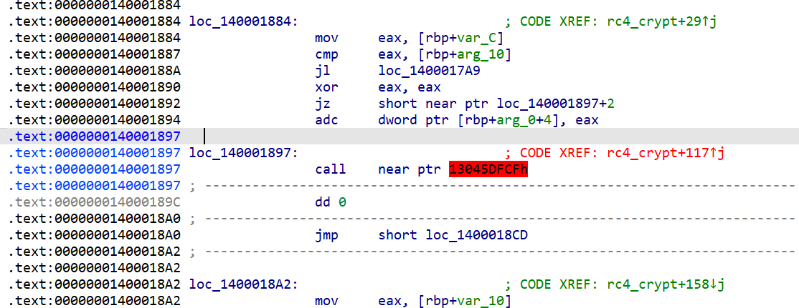

改完后

<!-- 这是一张图片，ocr 内容为： -->
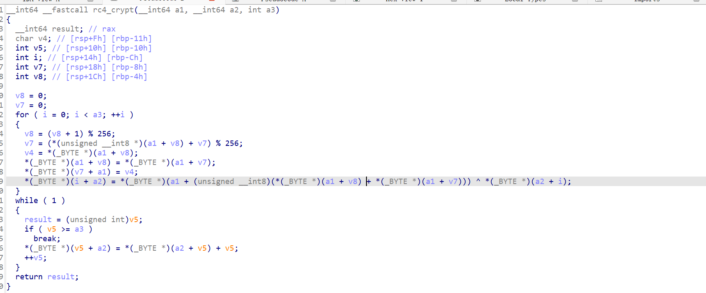

KeyGen的花指令

<!-- 这是一张图片，ocr 内容为： -->
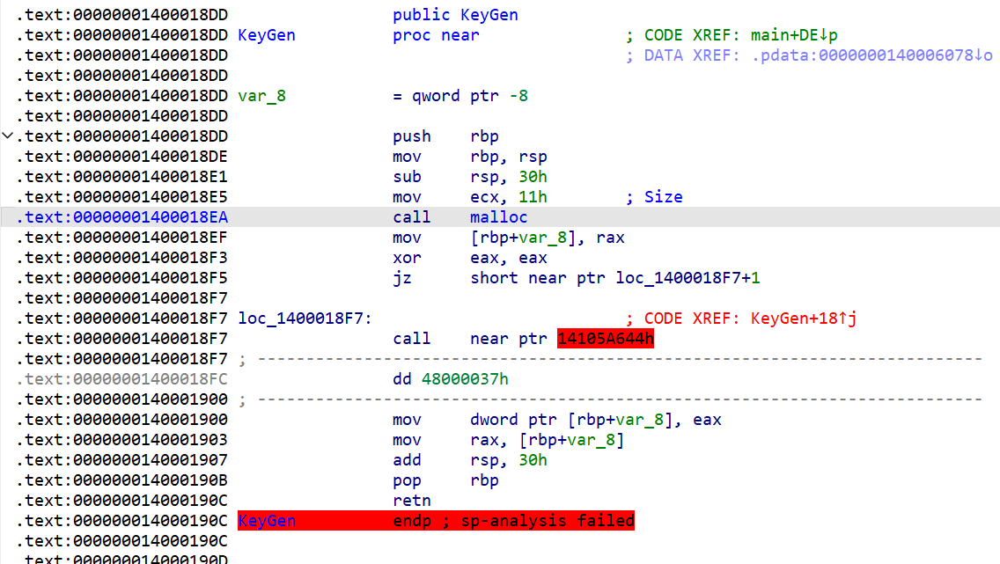

改完后

<!-- 这是一张图片，ocr 内容为： -->
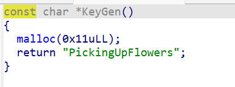

main的花指令

<!-- 这是一张图片，ocr 内容为： -->
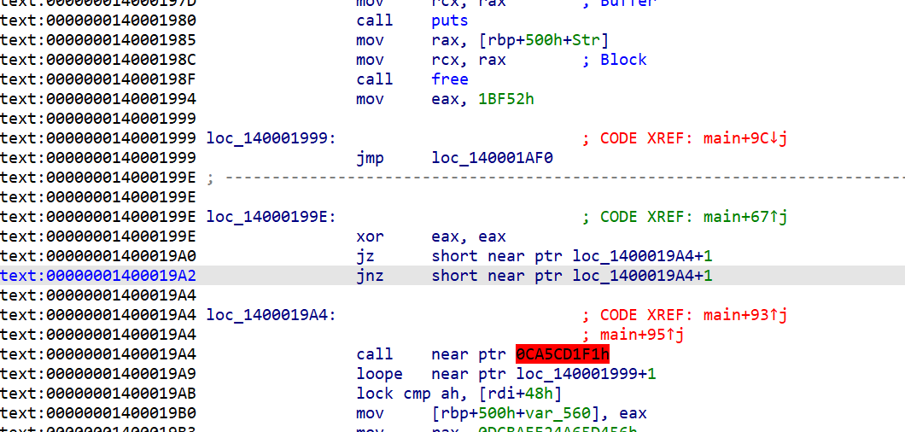

改完后

<!-- 这是一张图片，ocr 内容为： -->
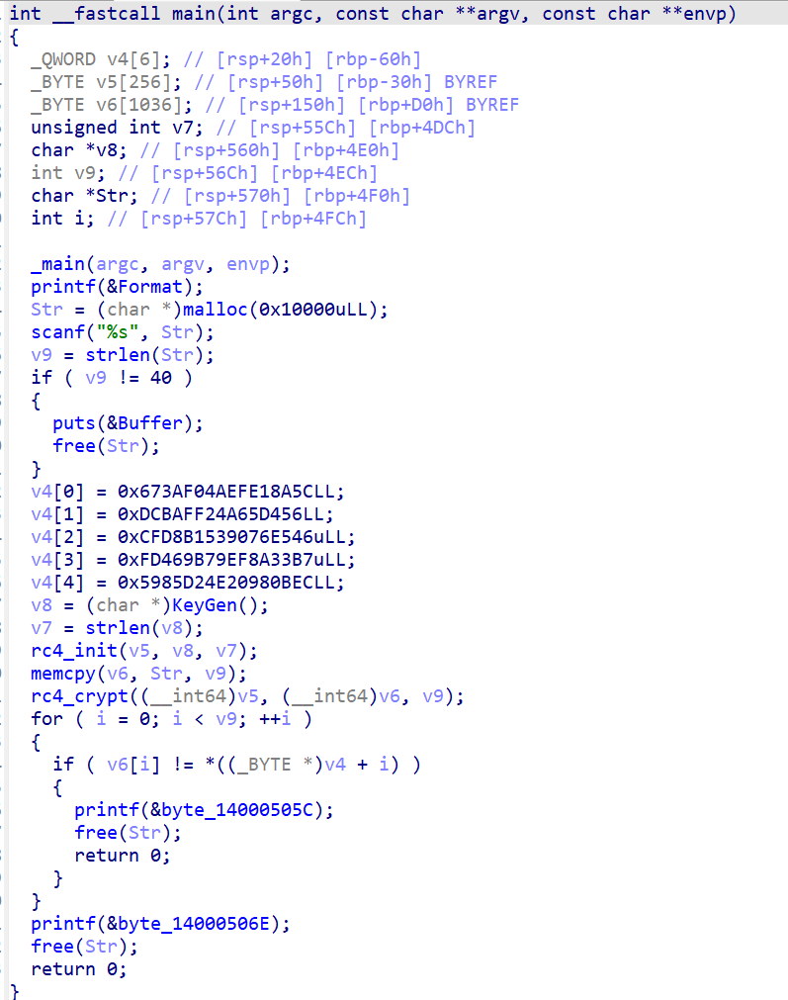

是一个RC4变种，S[i] = i ^ 0xCC，RC4加密后每个字节加上其索引位置

```python
import struct

data = [0x673AF04AEFE18A5C, 0x0DCBAFF24A65D456, 0xCFD8B1539076E546, 0xFD469B79EF8A33B7, 0x5985D24E20980BEC]
encrypted = b''.join([struct.pack('<Q', x) for x in data])
key = b"PickingUpFlowers"

step1 = [(byte - i) % 256 for i, byte in enumerate(encrypted)]

S = [i ^ 0xCC for i in range(256)]
j = 0
for i in range(256):
    j = (S[i] + j + key[i % len(key)]) % 256
    S[i], S[j] = S[j], S[i]

i = j = 0
flag = []
for byte in step1:
    i = (i + 1) % 256
    j = (S[i] + j) % 256
    S[i], S[j] = S[j], S[i]
    flag.append(byte ^ S[(S[i] + S[j]) % 256])

print(bytes(flag).decode())
```

flag{WO0o0O0w_So0Oo0o_m4Ny_F1oO0o0oW3R5}


### 2.尤皮·埃克斯历险记（2）
打开010editor

<!-- 这是一张图片，ocr 内容为： -->
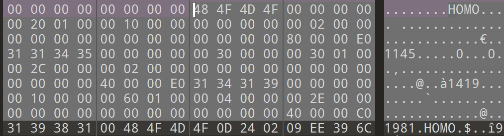

改回去

<!-- 这是一张图片，ocr 内容为： -->
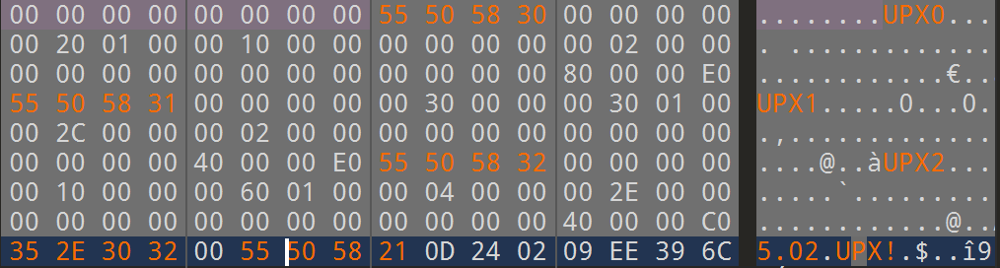

正常脱壳

<!-- 这是一张图片，ocr 内容为： -->
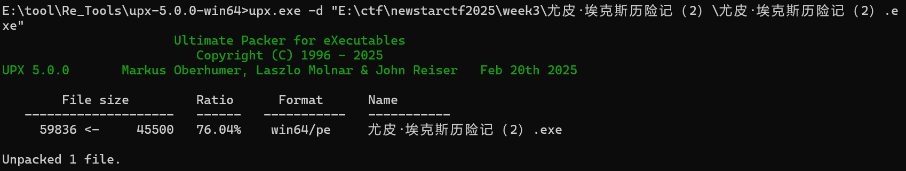

IDA打开

<!-- 这是一张图片，ocr 内容为： -->
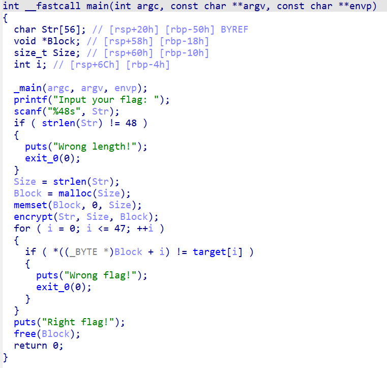

去看加密函数encrypt，明文为 48 字节，按小端打包成 12 个，对对每个三元组 [a,b,c] ，使用 72 个子密钥 KEYS[0..71] 迭代，再逐字异或

<!-- 这是一张图片，ocr 内容为： -->
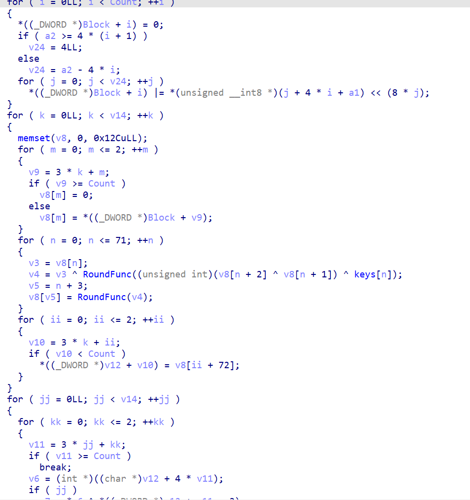

RoundFunc函数，每轮混合里用到的 32 位可逆“搅拌函数”

<!-- 这是一张图片，ocr 内容为： -->
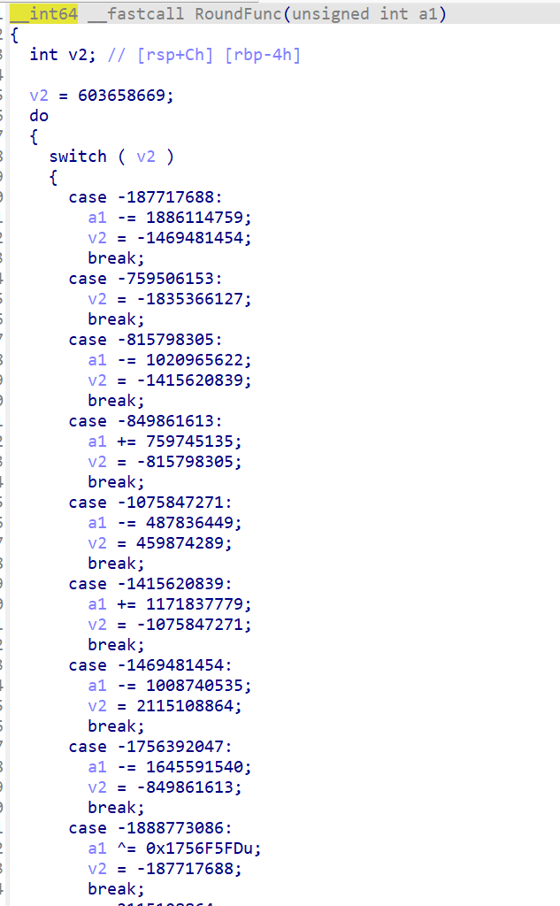

keys，iv，target数据

<!-- 这是一张图片，ocr 内容为： -->
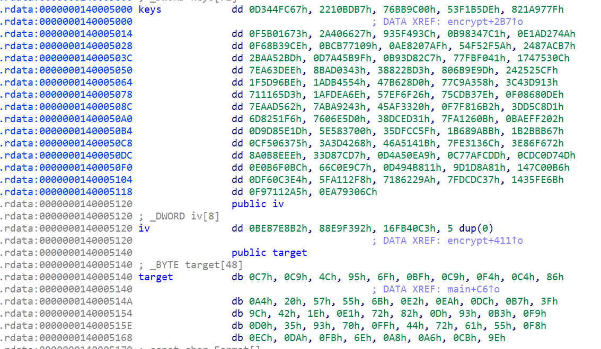

脚本

```python
import struct

MASK32 = 0xFFFFFFFF

KEYS = [
    0x0D344FC67, 0x2210BDB7, 0x76BB9C00, 0x53F1B5DE, 0x821A977F,
    0x0F5B01673, 0x2A406627, 0x935F493C, 0x0B98347C1, 0x0E1AD274A,
    0x0F68B39CE, 0x0BCB77109, 0x0AE8207AF, 0x54F52F5A, 0x2487ACB7,
    0x2BAA52BD, 0x0D7A45B9F, 0x0B93D82C7, 0x77FBF041, 0x1747530C,
    0x7EA63DEE, 0x8BAD0343, 0x38822BD3, 0x806B9E9D, 0x242525CF,
    0x1F5D96BE, 0x1ADB4554, 0x47B628D0, 0x77C9A358, 0x3C43D913,
    0x711165D3, 0x1AFDEA6E, 0x57EF6F26, 0x75CDB37E, 0x0F08680DE,
    0x7EAAD562, 0x7ABA9243, 0x45AF3320, 0x0F7F816B2, 0x3DD5C8D1,
    0x6D8251F6, 0x7606E5D0, 0x38DCED31, 0x7FA1260B, 0x0BAEFF202,
    0x0D9D85E1D, 0x5E583700, 0x35DFCC5F, 0x1B689ABB, 0x1B2BBB67,
    0x0CF506375, 0x3A3D4268, 0x46A5141B, 0x7FE3136C, 0x3E86F672,
    0x8A0B8EEE, 0x33D87CD7, 0x0D4A50EA9, 0x0C77AFCDD, 0x0CDC0D74D,
    0x0E0B6F0BC, 0x66C0E9C7, 0x0D494B811, 0x9D1D8A81, 0x147C00B6,
    0x0DF60C3E4, 0x5FA112F8, 0x7186229A, 0x7FDCDC37, 0x1435FE6B,
    0x0F97112A5, 0x0EA79306C
]

IV = [0xBE87E8B2, 0x88E9F392, 0x16FB40C3]

TARGET_BYTES = bytes([
    0xC7,0xC9,0x4C,0x95,0x6F,0xBF,0xC9,0xF4,0xC4,0x86,
    0xA4,0x20,0x57,0x55,0x6B,0xE2,0xEA,0xDC,0xB7,0x3F,
    0x9C,0x42,0x1E,0xE1,0x72,0x82,0x0D,0x93,0xB3,0xF9,
    0xD0,0x35,0x93,0x70,0xFF,0x44,0x72,0x61,0x55,0xF8,
    0xEC,0xDA,0xFB,0x6E,0xA8,0xA6,0xCB,0x9E
])

def roundfunc(x):
    x &= MASK32
    v2 = 603658669
    while v2 != -1835366127:
        if v2 == -187717688:
            x = (x - 1886114759) & MASK32
            v2 = -1469481454
        elif v2 == -759506153:
            v2 = -1835366127
        elif v2 == -815798305:
            x = (x - 1020965622) & MASK32
            v2 = -1415620839
        elif v2 == -849861613:
            x = (x + 759745135) & MASK32
            v2 = -815798305
        elif v2 == -1075847271:
            x = (x - 487836449) & MASK32
            v2 = 459874289
        elif v2 == -1415620839:
            x = (x + 1171837779) & MASK32
            v2 = -1075847271
        elif v2 == -1469481454:
            x = (x - 1008740535) & MASK32
            v2 = 2115108864
        elif v2 == -1756392047:
            x = (x - 1645591540) & MASK32
            v2 = -849861613
        elif v2 == -1888773086:
            x = x ^ 0x1756F5FD
            v2 = -187717688
        elif v2 == 2115108864:
            x = (x + 977397887) & MASK32
            v2 = -759506153
        elif v2 == 1601918207:
            x = (x - 451012892) & MASK32
            v2 = 177990911
        elif v2 == 1182471351:
            x = (x - 927205391) & MASK32
            v2 = 1601918207
        elif v2 == 1073315825:
            x = (x - 1030555907) & MASK32
            v2 = -1888773086
        elif v2 == 603658669:
            x = (x + 1071031968) & MASK32
            v2 = 86236952
        elif v2 == 459874289:
            x = (x + 717238452) & MASK32
            v2 = 1073315825
        elif v2 == 177990911:
            x = (x - 1460128592) & MASK32
            v2 = 347638
        elif v2 == 86236952:
            x = x ^ 0xFD714A3E
            v2 = 1182471351
        elif v2 == 67638:
            x = (x + 1979752636) & MASK32
            v2 = -1756392047
        else:
            x = (x + 45479597) & MASK32
            v2 = 67638
    return x & MASK32

def get_round_ops():
    ops = []
    v2 = 603658669
    while v2 != -1835366127:
        if v2 == -187717688:
            ops.append(('-', 1886114759))
            v2 = -1469481454
        elif v2 == -759506153:
            v2 = -1835366127
        elif v2 == -815798305:
            ops.append(('-', 1020965622))
            v2 = -1415620839
        elif v2 == -849861613:
            ops.append(('+', 759745135))
            v2 = -815798305
        elif v2 == -1075847271:
            ops.append(('-', 487836449))
            v2 = 459874289
        elif v2 == -1415620839:
            ops.append(('+', 1171837779))
            v2 = -1075847271
        elif v2 == -1469481454:
            ops.append(('-', 1008740535))
            v2 = 2115108864
        elif v2 == -1756392047:
            ops.append(('-', 1645591540))
            v2 = -849861613
        elif v2 == -1888773086:
            ops.append(('^', 0x1756F5FD))
            v2 = -187717688
        elif v2 == 2115108864:
            ops.append(('+', 977397887))
            v2 = -759506153
        elif v2 == 1601918207:
            ops.append(('-', 451012892))
            v2 = 177990911
        elif v2 == 1182471351:
            ops.append(('-', 927205391))
            v2 = 1601918207
        elif v2 == 1073315825:
            ops.append(('-', 1030555907))
            v2 = -1888773086
        elif v2 == 603658669:
            ops.append(('+', 1071031968))
            v2 = 86236952
        elif v2 == 459874289:
            ops.append(('+', 717238452))
            v2 = 1073315825
        elif v2 == 177990911:
            ops.append(('-', 1460128592))
            v2 = 347638
        elif v2 == 86236952:
            ops.append(('^', 0xFD714A3E))
            v2 = 1182471351
        elif v2 == 67638:
            ops.append(('+', 1979752636))
            v2 = -1756392047
        else:
            ops.append(('+', 45479597))
            v2 = 67638
    return ops

ROUND_OPS = get_round_ops()

def roundfunc_inv(y):
    x = y & MASK32
    for op, c in reversed(ROUND_OPS):
        if op == '+':
            x = (x - c) & MASK32
        elif op == '-':
            x = (x + c) & MASK32
        elif op == '^':
            x = x ^ c
        else:
            raise RuntimeError("unknown op")
    return x & MASK32

def E_triple_inverse(out_triple, keys):
    v8 = [0]*76
    v8[72], v8[73], v8[74] = out_triple[0] & MASK32, out_triple[1] & MASK32, out_triple[2] & MASK32
    for n in range(71, -1, -1):
        inner = roundfunc((v8[n+2] ^ v8[n+1] ^ keys[n]) & MASK32)
        v8[n] = (roundfunc_inv(v8[n+3]) ^ inner) & MASK32
    return [v8[0], v8[1], v8[2]]

def decrypt_target(target_bytes, keys, iv):
    if len(target_bytes) % 4 != 0:
        raise ValueError("target length must be multiple of 4")
    Count = len(target_bytes) // 4
    cipher_words = list(struct.unpack('<' + 'I'*Count, target_bytes))
    pre_xor = [0]*Count
    v14 = (Count + 2)//3
    for jj in range(v14):
        for kk in range(3):
            idx = 3*jj + kk
            if idx >= Count:
                break
            if jj == 0:
                pre_xor[idx] = (cipher_words[idx] ^ iv[kk]) & MASK32
            else:
                pre_xor[idx] = (cipher_words[idx] ^ cipher_words[idx-3]) & MASK32
    recovered_words = [0]*Count
    for t in range(v14):
        base = 3*t
        if base >= Count:
            break
        out_triple = []
        for kk in range(3):
            out_triple.append(pre_xor[base+kk] if base+kk < Count else 0)
        in_triple = E_triple_inverse(out_triple, keys)
        for kk in range(3):
            if base+kk < Count:
                recovered_words[base+kk] = in_triple[kk] & MASK32
    recovered = b''.join(struct.pack('<I', w) for w in recovered_words)
    return recovered[:48]

if __name__ == "__main__":
    pt = decrypt_target(TARGET_BYTES, KEYS, IV)
    print(pt.decode('ascii', errors='replace'))
```

flag{CoN7r0l_F10w_F14t73n1nG_C4N_b3_c0NfU5iNg!!}


### 3.pyz3
题目给了一个exe文件，我们先用pyinstxtractor提取里面的资源文件

<!-- 这是一张图片，ocr 内容为： -->
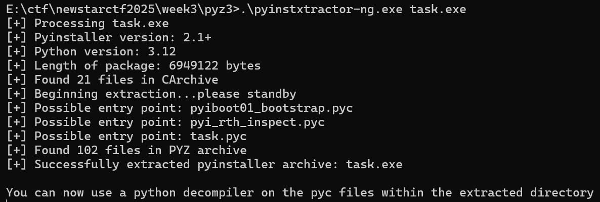

我们接着用pycdc去反编译task.pyc文件

<!-- 这是一张图片，ocr 内容为： -->
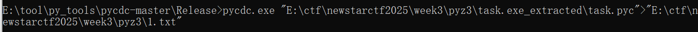

打开txt文件

```python
# Source Generated with Decompyle++
# File: task.pyc (Python 3.12)


def check(flag):
    if 47 * flag[0] + 41 * flag[1] + 32 * flag[2] + 56 * flag[3] + 52 * flag[4] + 67 * flag[5] + 13 * flag[6] + 25 * flag[7] + 20 * flag[8] + 98 * flag[9] + 88 * flag[10] + 65 * flag[11] + 82 * flag[12] + 92 * flag[13] + 3 * flag[14] + 29 * flag[15] + 93 * flag[16] + 88 * flag[17] + 45 * flag[18] + 58 * flag[19] + 40 * flag[20] + 72 * flag[21] + 99 * flag[22] + 10 * flag[23] + 94 * flag[24] + 62 * flag[25] + 82 * flag[26] + 92 * flag[27] + 23 * flag[28] + 46 * flag[29] + 55 * flag[30] + 72 * flag[31] + 44 * flag[32] + 9 * flag[33] + 65 * flag[34] + 42 * flag[35] == 176386 and 10 * flag[0] + 98 * flag[1] + 5 * flag[2] + 28 * flag[3] + 68 * flag[4] + 20 * flag[5] + 2 * flag[6] + 22 * flag[7] + 65 * flag[8] + 44 * flag[9] + 85 * flag[10] + 97 * flag[11] + 33 * flag[12] + 74 * flag[13] + 93 * flag[14] + 74 * flag[15] + 41 * flag[16] + 65 * flag[17] + 32 * flag[18] + 93 * flag[19] + 22 * flag[20] + 69 * flag[21] + 68 * flag[22] + 57 * flag[23] + 47 * flag[24] + 29 * flag[25] + 74 * flag[26] + 54 * flag[27] + 91 * flag[28] + 90 * flag[29] + 26 * flag[30] + 11 * flag[31] + 89 * flag[32] + 57 * flag[33] + 100 * flag[34] + 95 * flag[35] == 186050 and 25 * flag[0] + 22 * flag[1] + 54 * flag[2] + 5 * flag[3] + 8 * flag[4] + 3 * flag[5] + 12 * flag[6] + 70 * flag[7] + 25 * flag[8] + 61 * flag[9] + 68 * flag[10] + 12 * flag[11] + 27 * flag[12] + 42 * flag[13] + 83 * flag[14] + 91 * flag[15] + 67 * flag[16] + 46 * flag[17] + 8 * flag[18] + 45 * flag[19] + 94 * flag[20] + 80 * flag[21] + 69 * flag[22] + 95 * flag[23] + 12 * flag[24] + 21 * flag[25] + 94 * flag[26] + 82 * flag[27] + 93 * flag[28] + 41 * flag[29] + 4 * flag[30] + 56 * flag[31] + 92 * flag[32] + 77 * flag[33] + 15 * flag[34] + 30 * flag[35] == 154690 and 33 * flag[0] + 49 * flag[1] + 56 * flag[2] + 40 * flag[3] + 90 * flag[4] + 59 * flag[5] + 82 * flag[6] + 6 * flag[7] + 81 * flag[8] + 32 * flag[9] + 23 * flag[10] + 76 * flag[11] + 93 * flag[12] + 83 * flag[13] + 10 * flag[14] + 44 * flag[15] + 58 * flag[16] + 33 * flag[17] + 79 * flag[18] + 77 * flag[19] + 82 * flag[20] + 56 * flag[21] + 70 * flag[22] + 34 * flag[23] + 45 * flag[24] + 76 * flag[25] + 57 * flag[26] + 43 * flag[27] + 100 * flag[28] + 19 * flag[29] + 11 * flag[30] + 90 * flag[31] + 3 * flag[32] + 60 * flag[33] + 57 * flag[34] + 23 * flag[35] == 172116 and 65 * flag[0] + 70 * flag[1] + 20 * flag[2] + 32 * flag[3] + 75 * flag[4] + 30 * flag[5] + 3 * flag[6] + 78 * flag[7] + 35 * flag[8] + 45 * flag[9] + 95 * flag[10] + 93 * flag[11] + 52 * flag[12] + 32 * flag[13] + 88 * flag[14] + 94 * flag[15] + 67 * flag[16] + 34 * flag[17] + 91 * flag[18] + 88 * flag[19] + 31 * flag[20] + 61 * flag[21] + 17 * flag[22] + 99 * flag[23] + 100 * flag[24] + 49 * flag[25] + 4 * flag[26] + 60 * flag[27] + 81 * flag[28] + 88 * flag[29] + 43 * flag[30] + 34 * flag[31] + 30 * flag[32] + 52 * flag[33] + 18 * flag[34] + 100 * flag[35] == 190544 and 81 * flag[0] + 42 * flag[1] + 28 * flag[2] + 98 * flag[3] + 31 * flag[4] + 46 * flag[5] + 64 * flag[6] + 15 * flag[7] + 49 * flag[8] + 13 * flag[9] + 100 * flag[10] + 81 * flag[11] + 32 * flag[12] + 52 * flag[13] + 59 * flag[14] + 24 * flag[15] + 94 * flag[16] + 32 * flag[17] + 93 * flag[18] + 32 * flag[19] + 13 * flag[20] + 89 * flag[21] + 37 * flag[22] + 30 * flag[23] + 78 * flag[24] + 81 * flag[25] + 9 * flag[26] + 45 * flag[27] + 93 * flag[28] + 100 * flag[29] + 97 * flag[30] + 10 * flag[31] + 80 * flag[32] + 54 * flag[33] + 88 * flag[34] + 85 * flag[35] == 190323 and 76 * flag[0] + 54 * flag[1] + 5 * flag[2] + 14 * flag[3] + 62 * flag[4] + 44 * flag[5] + 24 * flag[6] + 29 * flag[7] + 85 * flag[8] + 87 * flag[9] + 19 * flag[10] + 3 * flag[11] + 65 * flag[12] + 24 * flag[13] + 92 * flag[14] + 37 * flag[15] + 57 * flag[16] + 20 * flag[17] + 45 * flag[18] + 5 * flag[19] + 13 * flag[20] + 91 * flag[21] + 92 * flag[22] + 75 * flag[23] + 36 * flag[24] + 79 * flag[25] + 12 * flag[26] + 22 * flag[27] + 75 * flag[28] + 82 * flag[29] + 28 * flag[30] + 82 * flag[31] + 24 * flag[32] + 53 * flag[33] + 56 * flag[34] + 92 * flag[35] == 162017 and 53 * flag[0] + 52 * flag[1] + 72 * flag[2] + 23 * flag[3] + 26 * flag[4] + 13 * flag[5] + 62 * flag[6] + 96 * flag[7] + 67 * flag[8] + 96 * flag[9] + 66 * flag[10] + 41 * flag[11] + 5 * flag[12] + 18 * flag[13] + 37 * flag[14] + 13 * flag[15] + 61 * flag[16] + 71 * flag[17] + 91 * flag[18] + 96 * flag[19] + 56 * flag[20] + 3 * flag[21] + 65 * flag[22] + 14 * flag[23] + 57 * flag[24] + 69 * flag[25] + 75 * flag[26] + 68 * flag[27] + 10 * flag[28] + 60 * flag[29] + 62 * flag[30] + 95 * flag[31] + 53 * flag[32] + 19 * flag[33] + 7 * flag[34] + 56 * flag[35] == 165118 and 26 * flag[0] + 7 * flag[1] + 49 * flag[2] + 14 * flag[3] + 36 * flag[4] + 87 * flag[5] + 21 * flag[6] + 35 * flag[7] + 15 * flag[8] + 91 * flag[9] + 15 * flag[10] + 100 * flag[11] + 8 * flag[12] + 32 * flag[13] + 100 * flag[14] + 35 * flag[15] + 66 * flag[16] + 3 * flag[17] + 79 * flag[18] + 96 * flag[19] + 82 * flag[20] + 95 * flag[21] + 68 * flag[22] + 13 * flag[23] + 86 * flag[24] + 51 * flag[25] + 24 * flag[26] + 76 * flag[27] + 30 * flag[28] + 60 * flag[29] + 29 * flag[30] + 70 * flag[31] + 40 * flag[32] + 90 * flag[33] + 44 * flag[34] + 3 * flag[35] == 153332 and 47 * flag[0] + 19 * flag[1] + 37 * flag[2] + 93 * flag[3] + 73 * flag[4] + 30 * flag[5] + 45 * flag[6] + 47 * flag[7] + 72 * flag[8] + 85 * flag[9] + 37 * flag[10] + 68 * flag[11] + 89 * flag[12] + 34 * flag[13] + 4 * flag[14] + 50 * flag[15] + 87 * flag[16] + 33 * flag[17] + 87 * flag[18] + 43 * flag[19] + 9 * flag[20] + 61 * flag[21] + 93 * flag[22] + 49 * flag[23] + 74 * flag[24] + 49 * flag[25] + 68 * flag[26] + 29 * flag[27] + 54 * flag[28] + 54 * flag[29] + 37 * flag[30] + 79 * flag[31] + 33 * flag[32] + 65 * flag[33] + 59 * flag[34] + 15 * flag[35] == 168472 and 79 * flag[0] + 73 * flag[1] + 60 * flag[2] + 62 * flag[3] + 25 * flag[4] + 16 * flag[5] + 77 * flag[6] + 81 * flag[7] + 79 * flag[8] + 31 * flag[9] + 82 * flag[10] + 84 * flag[11] + 62 * flag[12] + 36 * flag[13] + 18 * flag[14] + 20 * flag[15] + 46 * flag[16] + 57 * flag[17] + 21 * flag[18] + 40 * flag[19] + 3 * flag[20] + 50 * flag[21] + 58 * flag[22] + 80 * flag[23] + 84 * flag[24] + 71 * flag[25] + 87 * flag[26] + 3 * flag[27] + 13 * flag[28] + 77 * flag[29] + 83 * flag[30] + 39 * flag[31] + 55 * flag[32] + 34 * flag[33] + 41 * flag[34] + 63 * flag[35] == 178706 and 7 * flag[0] + 50 * flag[1] + 26 * flag[2] + 79 * flag[3] + 21 * flag[4] + 42 * flag[5] + 83 * flag[6] + 94 * flag[7] + 63 * flag[8] + 83 * flag[9] + 3 * flag[10] + 68 * flag[11] + 25 * flag[12] + 91 * flag[13] + 3 * flag[14] + 5 * flag[15] + 17 * flag[16] + 61 * flag[17] + 3 * flag[18] + 40 * flag[19] + 87 * flag[20] + 11 * flag[21] + 27 * flag[22] + 74 * flag[23] + 73 * flag[24] + 21 * flag[25] + 56 * flag[26] + 46 * flag[27] + 36 * flag[28] + 24 * flag[29] + 14 * flag[30] + 63 * flag[31] + 21 * flag[32] + 71 * flag[33] + 30 * flag[34] + 53 * flag[35] == 143852 and 57 * flag[0] + 51 * flag[1] + 49 * flag[2] + 15 * flag[3] + 94 * flag[4] + 34 * flag[5] + 27 * flag[6] + 5 * flag[7] + 100 * flag[8] + 68 * flag[9] + 67 * flag[10] + 81 * flag[11] + 10 * flag[12] + 5 * flag[13] + 85 * flag[14] + 70 * flag[15] + 80 * flag[16] + 20 * flag[17] + 89 * flag[18] + 30 * flag[19] + 84 * flag[20] + 35 * flag[21] + 41 * flag[22] + 87 * flag[23] + 75 * flag[24] + 67 * flag[25] + 20 * flag[26] + 33 * flag[27] + 29 * flag[28] + 6 * flag[29] + 97 * flag[30] + 25 * flag[31] + 10 * flag[32] + 18 * flag[33] + 23 * flag[34] + 30 * flag[35] == 154052 and 97 * flag[0] + 93 * flag[1] + 10 * flag[2] + 44 * flag[3] + 28 * flag[4] + 22 * flag[5] + 17 * flag[6] + 41 * flag[7] + 47 * flag[8] + 62 * flag[9] + 42 * flag[10] + 47 * flag[11] + 61 * flag[12] + 32 * flag[13] + 31 * flag[14] + 52 * flag[15] + 47 * flag[16] + 92 * flag[17] + 42 * flag[18] + 37 * flag[19] + 7 * flag[20] + 40 * flag[21] + 48 * flag[22] + 40 * flag[23] + 11 * flag[24] + 96 * flag[25] + 51 * flag[26] + 42 * flag[27] + 66 * flag[28] + 8 * flag[29] + 89 * flag[30] + 64 * flag[31] + 30 * flag[32] + 11 * flag[33] + 8 * flag[34] + 83 * flag[35] == 147899 and 51 * flag[0] + 94 * flag[1] + 58 * flag[2] + 76 * flag[3] + 21 * flag[4] + 10 * flag[5] + 75 * flag[6] + 4 * flag[7] + 55 * flag[8] + 37 * flag[9] + 71 * flag[10] + 97 * flag[11] + 27 * flag[12] + 93 * flag[13] + 82 * flag[14] + 94 * flag[15] + 38 * flag[16] + 69 * flag[17] + 36 * flag[18] + 58 * flag[19] + 93 * flag[20] + 18 * flag[21] + 54 * flag[22] + 59 * flag[23] + 12 * flag[24] + 12 * flag[25] + 54 * flag[26] + 83 * flag[27] + 73 * flag[28] + 83 * flag[29] + 33 * flag[30] + 12 * flag[31] + 78 * flag[32] + 38 * flag[33] + 45 * flag[34] + 57 * flag[35] == 176754 and 78 * flag[0] + 29 * flag[1] + 8 * flag[2] + 47 * flag[3] + 48 * flag[4] + 88 * flag[5] + 18 * flag[6] + 88 * flag[7] + 50 * flag[8] + 58 * flag[9] + 36 * flag[10] + 88 * flag[11] + 9 * flag[12] + 74 * flag[13] + 85 * flag[14] + 5 * flag[15] + 91 * flag[16] + 58 * flag[17] + 85 * flag[18] + 46 * flag[19] + 89 * flag[20] + 76 * flag[21] + 61 * flag[22] + 6 * flag[23] + 61 * flag[24] + 78 * flag[25] + 4 * flag[26] + 48 * flag[27] + 50 * flag[28] + 69 * flag[29] + 23 * flag[30] + 70 * flag[31] + 23 * flag[32] + 15 * flag[33] + 22 * flag[34] + 68 * flag[35] == 171970 and 75 * flag[0] + 2 * flag[1] + 94 * flag[2] + 97 * flag[3] + 72 * flag[4] + 62 * flag[5] + 78 * flag[6] + 42 * flag[7] + 69 * flag[8] + 11 * flag[9] + 37 * flag[10] + 3 * flag[11] + 29 * flag[12] + 15 * flag[13] + 39 * flag[14] + 33 * flag[15] + 18 * flag[16] + 33 * flag[17] + 12 * flag[18] + 64 * flag[19] + 6 * flag[20] + 18 * flag[21] + 34 * flag[22] + 15 * flag[23] + 3 * flag[24] + 100 * flag[25] + 85 * flag[26] + 32 * flag[27] + 97 * flag[28] + 93 * flag[29] + 84 * flag[30] + 73 * flag[31] + 26 * flag[32] + 31 * flag[33] + 71 * flag[34] + 97 * flag[35] == 166497 and 59 * flag[0] + 26 * flag[1] + 48 * flag[2] + 86 * flag[3] + 58 * flag[4] + 70 * flag[5] + 61 * flag[6] + 100 * flag[7] + 63 * flag[8] + 74 * flag[9] + 26 * flag[10] + 38 * flag[11] + 24 * flag[12] + 45 * flag[13] + 52 * flag[14] + 32 * flag[15] + 91 * flag[16] + 89 * flag[17] + 19 * flag[18] + 59 * flag[19] + 87 * flag[20] + 5 * flag[21] + 15 * flag[22] + 68 * flag[23] + 72 * flag[24] + 67 * flag[25] + 2 * flag[26] + 65 * flag[27] + 46 * flag[28] + 10 * flag[29] + 33 * flag[30] + 79 * flag[31] + 11 * flag[32] + 16 * flag[33] + 73 * flag[34] + 53 * flag[35] == 173887 and 6 * flag[0] + 66 * flag[1] + 59 * flag[2] + 76 * flag[3] + 86 * flag[4] + 20 * flag[5] + 59 * flag[6] + 34 * flag[7] + 28 * flag[8] + 48 * flag[9] + 86 * flag[10] + 5 * flag[11] + 87 * flag[12] + 13 * flag[13] + 95 * flag[14] + 87 * flag[15] + 65 * flag[16] + 35 * flag[17] + 58 * flag[18] + 10 * flag[19] + 98 * flag[20] + 100 * flag[21] + 4 * flag[22] + 78 * flag[23] + 66 * flag[24] + 57 * flag[25] + 34 * flag[26] + 86 * flag[27] + 62 * flag[28] + 36 * flag[29] + 92 * flag[30] + 28 * flag[31] + 3 * flag[32] + 24 * flag[33] + 49 * flag[34] + 28 * flag[35] == 173189 and 25 * flag[0] + 48 * flag[1] + 44 * flag[2] + 16 * flag[3] + 99 * flag[4] + 100 * flag[5] + 69 * flag[6] + 26 * flag[7] + 65 * flag[8] + 32 * flag[9] + 18 * flag[10] + 65 * flag[11] + 58 * flag[12] + 72 * flag[13] + 61 * flag[14] + 56 * flag[15] + 10 * flag[16] + 78 * flag[17] + 93 * flag[18] + 98 * flag[19] + 39 * flag[20] + 43 * flag[21] + 87 * flag[22] + 12 * flag[23] + 42 * flag[24] + 100 * flag[25] + 100 * flag[26] + 47 * flag[27] + 31 * flag[28] + 51 * flag[29] + 75 * flag[30] + 10 * flag[31] + 63 * flag[32] + 48 * flag[33] + 22 * flag[34] + 87 * flag[35] == 174138 and 61 * flag[0] + 13 * flag[1] + 100 * flag[2] + 59 * flag[3] + 31 * flag[4] + 9 * flag[5] + 28 * flag[6] + 7 * flag[7] + 27 * flag[8] + 63 * flag[9] + 11 * flag[10] + 57 * flag[11] + 95 * flag[12] + 79 * flag[13] + 21 * flag[14] + 30 * flag[15] + 60 * flag[16] + 81 * flag[17] + 43 * flag[18] + 32 * flag[19] + 30 * flag[20] + 34 * flag[21] + 80 * flag[22] + 53 * flag[23] + 28 * flag[24] + 39 * flag[25] + 74 * flag[26] + 21 * flag[27] + 18 * flag[28] + 92 * flag[29] + 73 * flag[30] + 60 * flag[31] + 21 * flag[32] + 69 * flag[33] + 76 * flag[34] + 84 * flag[35] == 157623 and 22 * flag[0] + 62 * flag[1] + 61 * flag[2] + 20 * flag[3] + 66 * flag[4] + 2 * flag[5] + 11 * flag[6] + 82 * flag[7] + 93 * flag[8] + 13 * flag[9] + 69 * flag[10] + 37 * flag[11] + 92 * flag[12] + 80 * flag[13] + 66 * flag[14] + 47 * flag[15] + 28 * flag[16] + 14 * flag[17] + 62 * flag[18] + 56 * flag[19] + 89 * flag[20] + 29 * flag[21] + 39 * flag[22] + 38 * flag[23] + 46 * flag[24] + 10 * flag[25] + 6 * flag[26] + 82 * flag[27] + 77 * flag[28] + 78 * flag[29] + 45 * flag[30] + 50 * flag[31] + 5 * flag[32] + 73 * flag[33] + 17 * flag[34] + 65 * flag[35] == 154943 and 5 * flag[0] + 84 * flag[1] + 83 * flag[2] + 77 * flag[3] + 76 * flag[4] + 60 * flag[5] + 20 * flag[6] + 48 * flag[7] + 53 * flag[8] + 14 * flag[9] + 98 * flag[10] + 50 * flag[11] + 37 * flag[12] + 15 * flag[13] + 31 * flag[14] + 69 * flag[15] + 55 * flag[16] + 37 * flag[17] + 64 * flag[18] + 35 * flag[19] + 26 * flag[20] + 20 * flag[21] + 18 * flag[22] + 67 * flag[23] + 50 * flag[24] + 57 * flag[25] + 60 * flag[26] + 71 * flag[27] + 4 * flag[28] + 35 * flag[29] + 23 * flag[30] + 52 * flag[31] + 11 * flag[32] + 15 * flag[33] + 83 * flag[34] + 51 * flag[35] == 156078 and 33 * flag[0] + 47 * flag[1] + 89 * flag[2] + 52 * flag[3] + 89 * flag[4] + 55 * flag[5] + 98 * flag[6] + 28 * flag[7] + 48 * flag[8] + 90 * flag[9] + 69 * flag[10] + 29 * flag[11] + 68 * flag[12] + 24 * flag[13] + 19 * flag[14] + 18 * flag[15] + 44 * flag[16] + 27 * flag[17] + 14 * flag[18] + 64 * flag[19] + 15 * flag[20] + 31 * flag[21] + 23 * flag[22] + 2 * flag[23] + 36 * flag[24] + 45 * flag[25] + 37 * flag[26] + 71 * flag[27] + 61 * flag[28] + 92 * flag[29] + 28 * flag[30] + 64 * flag[31] + 13 * flag[32] + 66 * flag[33] + 98 * flag[34] + 3 * flag[35] == 156158 and 80 * flag[0] + 88 * flag[1] + 68 * flag[2] + 66 * flag[3] + 46 * flag[4] + 75 * flag[5] + 32 * flag[6] + 19 * flag[7] + 36 * flag[8] + 83 * flag[9] + 63 * flag[10] + 86 * flag[11] + 79 * flag[12] + 30 * flag[13] + 61 * flag[14] + 50 * flag[15] + 100 * flag[16] + 52 * flag[17] + 66 * flag[18] + 30 * flag[19] + 20 * flag[20] + 97 * flag[21] + 45 * flag[22] + 46 * flag[23] + 38 * flag[24] + 21 * flag[25] + 32 * flag[26] + 79 * flag[27] + 68 * flag[28] + 43 * flag[29] + 65 * flag[30] + 47 * flag[31] + 86 * flag[32] + 30 * flag[33] + 74 * flag[34] + 18 * flag[35] == 181770 and 11 * flag[0] + 58 * flag[1] + 95 * flag[2] + 67 * flag[3] + 96 * flag[4] + 74 * flag[5] + 60 * flag[6] + 11 * flag[7] + 21 * flag[8] + 14 * flag[9] + 100 * flag[10] + 60 * flag[11] + 70 * flag[12] + 92 * flag[13] + 92 * flag[14] + 39 * flag[15] + 43 * flag[16] + 52 * flag[17] + 5 * flag[18] + 22 * flag[19] + 90 * flag[20] + 70 * flag[21] + 12 * flag[22] + 52 * flag[23] + 36 * flag[24] + 21 * flag[25] + 45 * flag[26] + 59 * flag[27] + 74 * flag[28] + 46 * flag[29] + 11 * flag[30] + 60 * flag[31] + 8 * flag[32] + 52 * flag[33] + 14 * flag[34] + 77 * flag[35] == 173577 and 57 * flag[0] + 37 * flag[1] + 94 * flag[2] + 43 * flag[3] + 53 * flag[4] + 55 * flag[5] + 7 * flag[6] + 83 * flag[7] + 91 * flag[8] + 61 * flag[9] + 86 * flag[10] + 6 * flag[11] + 44 * flag[12] + 87 * flag[13] + 61 * flag[14] + 92 * flag[15] + 24 * flag[16] + 74 * flag[17] + 100 * flag[18] + 22 * flag[19] + 12 * flag[20] + 68 * flag[21] + 19 * flag[22] + 88 * flag[23] + 81 * flag[24] + 83 * flag[25] + 70 * flag[26] + 39 * flag[27] + 30 * flag[28] + 82 * flag[29] + 30 * flag[30] + 35 * flag[31] + 55 * flag[32] + 18 * flag[33] + 27 * flag[34] + 80 * flag[35] == 180922 and 80 * flag[0] + 14 * flag[1] + 5 * flag[2] + 89 * flag[3] + 71 * flag[4] + 82 * flag[5] + 44 * flag[6] + 8 * flag[7] + 33 * flag[8] + 26 * flag[9] + 77 * flag[10] + 49 * flag[11] + 36 * flag[12] + 90 * flag[13] + 73 * flag[14] + 71 * flag[15] + 66 * flag[16] + 4 * flag[17] + 37 * flag[18] + 78 * flag[19] + 38 * flag[20] + 18 * flag[21] + 15 * flag[22] + 79 * flag[23] + 6 * flag[24] + 74 * flag[25] + 18 * flag[26] + 85 * flag[27] + 56 * flag[28] + 53 * flag[29] + 90 * flag[30] + 75 * flag[31] + 52 * flag[32] + 2 * flag[33] + 13 * flag[34] + 54 * flag[35] == 158596 and 96 * flag[0] + 29 * flag[1] + 37 * flag[2] + 70 * flag[3] + 92 * flag[4] + 80 * flag[5] + 24 * flag[6] + 36 * flag[7] + 32 * flag[8] + 29 * flag[9] + 78 * flag[10] + 45 * flag[11] + 58 * flag[12] + 55 * flag[13] + 16 * flag[14] + 92 * flag[15] + 71 * flag[16] + 82 * flag[17] + 86 * flag[18] + 23 * flag[19] + 4 * flag[20] + 58 * flag[21] + 16 * flag[22] + 18 * flag[23] + 38 * flag[24] + 53 * flag[25] + 82 * flag[26] + 76 * flag[27] + 83 * flag[28] + 73 * flag[29] + 87 * flag[30] + 36 * flag[31] + 61 * flag[32] + 85 * flag[33] + 61 * flag[34] + 69 * flag[35] == 181072 and 14 * flag[0] + 71 * flag[1] + 53 * flag[2] + 46 * flag[3] + 59 * flag[4] + 53 * flag[5] + 22 * flag[6] + 69 * flag[7] + 67 * flag[8] + 43 * flag[9] + 23 * flag[10] + 14 * flag[11] + 77 * flag[12] + 95 * flag[13] + 19 * flag[14] + 83 * flag[15] + 79 * flag[16] + 41 * flag[17] + 12 * flag[18] + 53 * flag[19] + 3 * flag[20] + 4 * flag[21] + 65 * flag[22] + 92 * flag[23] + 64 * flag[24] + 52 * flag[25] + 3 * flag[26] + 59 * flag[27] + 89 * flag[28] + 75 * flag[29] + 12 * flag[30] + 46 * flag[31] + 61 * flag[32] + 53 * flag[33] + 97 * flag[34] + 43 * flag[35] == 163777 and 57 * flag[0] + 99 * flag[1] + 49 * flag[2] + 100 * flag[3] + 68 * flag[4] + 99 * flag[5] + 26 * flag[6] + 65 * flag[7] + 47 * flag[8] + 65 * flag[9] + 90 * flag[10] + 68 * flag[11] + 84 * flag[12] + 4 * flag[13] + 9 * flag[14] + 43 * flag[15] + 88 * flag[16] + 33 * flag[17] + 48 * flag[18] + 88 * flag[19] + 37 * flag[20] + 31 * flag[21] + 21 * flag[22] + 94 * flag[23] + 22 * flag[24] + 93 * flag[25] + 70 * flag[26] + 14 * flag[27] + 13 * flag[28] + 28 * flag[29] + 83 * flag[30] + 12 * flag[31] + 80 * flag[32] + 58 * flag[33] + 43 * flag[34] + 97 * flag[35] == 187620 and 33 * flag[0] + 94 * flag[1] + 56 * flag[2] + 48 * flag[3] + 13 * flag[4] + 44 * flag[5] + 81 * flag[6] + 42 * flag[7] + 19 * flag[8] + 96 * flag[9] + 67 * flag[10] + 79 * flag[11] + 12 * flag[12] + 67 * flag[13] + 34 * flag[14] + 72 * flag[15] + 45 * flag[16] + 48 * flag[17] + 24 * flag[18] + 71 * flag[19] + 65 * flag[20] + 13 * flag[21] + 32 * flag[22] + 97 * flag[23] + 48 * flag[24] + 42 * flag[25] + 65 * flag[26] + 95 * flag[27] + 54 * flag[28] + 9 * flag[29] + 35 * flag[30] + 57 * flag[31] + 18 * flag[32] + 20 * flag[33] + 83 * flag[34] + 76 * flag[35] == 169266 and 31 * flag[0] + 38 * flag[1] + 83 * flag[2] + 45 * flag[3] + 28 * flag[4] + 97 * flag[5] + 54 * flag[6] + 11 * flag[7] + 80 * flag[8] + 45 * flag[9] + 92 * flag[10] + 13 * flag[11] + 52 * flag[12] + 94 * flag[13] + 51 * flag[14] + 30 * flag[15] + 11 * flag[16] + 61 * flag[17] + 46 * flag[18] + 10 * flag[19] + 28 * flag[20] + 72 * flag[21] + 20 * flag[22] + 95 * flag[23] + 90 * flag[24] + 39 * flag[25] + 32 * flag[26] + 95 * flag[27] + 19 * flag[28] + 3 * flag[29] + 65 * flag[30] + 71 * flag[31] + 73 * flag[32] + 80 * flag[33] + 23 * flag[34] + 71 * flag[35] == 162587 and 9 * flag[0] + 81 * flag[1] + 80 * flag[2] + 37 * flag[3] + 96 * flag[4] + 72 * flag[5] + 95 * flag[6] + 93 * flag[7] + 26 * flag[8] + 98 * flag[9] + 50 * flag[10] + 79 * flag[11] + 57 * flag[12] + 13 * flag[13] + 49 * flag[14] + 96 * flag[15] + 82 * flag[16] + 84 * flag[17] + 89 * flag[18] + 40 * flag[19] + 38 * flag[20] + 66 * flag[21] + 81 * flag[22] + 81 * flag[23] + 79 * flag[24] + 77 * flag[25] + 86 * flag[26] + 68 * flag[27] + 26 * flag[28] + 37 * flag[29] + 15 * flag[30] + 56 * flag[31] + 13 * flag[32] + 17 * flag[33] + 50 * flag[34] + 37 * flag[35] == 198705 and 82 * flag[0] + 57 * flag[1] + 33 * flag[2] + 32 * flag[3] + 79 * flag[4] + 25 * flag[5] + 54 * flag[6] + 27 * flag[7] + 50 * flag[8] + 14 * flag[9] + 72 * flag[10] + 31 * flag[11] + 28 * flag[12] + 66 * flag[13] + 4 * flag[14] + 6 * flag[15] + 48 * flag[16] + 34 * flag[17] + 63 * flag[18] + 51 * flag[19] + 12 * flag[20] + 21 * flag[21] + 73 * flag[22] + 66 * flag[23] + 53 * flag[24] + 38 * flag[25] + 54 * flag[26] + 59 * flag[27] + 76 * flag[28] + 63 * flag[29] + 61 * flag[30] + 30 * flag[31] + 84 * flag[32] + 80 * flag[33] + 98 * flag[34] + 46 * flag[35] == 160349 and 69 * flag[0] + 15 * flag[1] + 23 * flag[2] + 8 * flag[3] + 46 * flag[4] + 55 * flag[5] + 21 * flag[6] + 91 * flag[7] + 37 * flag[8] + 9 * flag[9] + 61 * flag[10] + 20 * flag[11] + 23 * flag[12] + 96 * flag[13] + 28 * flag[14] + 67 * flag[15] + 19 * flag[16] + 50 * flag[17] + 18 * flag[18] + 71 * flag[19] + 30 * flag[20] + 14 * flag[21] + 10 * flag[22] + 24 * flag[23] + 100 * flag[24] + 15 * flag[25] + 91 * flag[26] + 15 * flag[27] + 93 * flag[28] + 24 * flag[29] + 46 * flag[30] + 61 * flag[31] + 67 * flag[32] + 60 * flag[33] + 56 * flag[34] + 81 * flag[35] == 148095:
        return True
    return False


def main():
    flag = str(input('Input your flag: ')).encode()
    res = check(flag)
    if res:
        print('Right flag!')
        return None
    print('Wrong flag!')

if __name__ == '__main__':
    main()
    return None

```

使用z3

```python
from z3 import Solver, Int, And,sat

flag = [Int(f'f{i}') for i in range(36)]
s = Solver()

for f in flag:
    s.add(And(f >= 32, f <= 126))

eqs = [
    ([47, 41, 32, 56, 52, 67, 13, 25, 20, 98, 88, 65, 82, 92, 3, 29, 93, 88, 45, 58, 40, 72, 99, 10, 94, 62, 82, 92, 23, 46, 55, 72, 44, 9, 65, 42], 176386),
    ([10, 98, 5, 28, 68, 20, 2, 22, 65, 44, 85, 97, 33, 74, 93, 74, 41, 65, 32, 93, 22, 69, 68, 57, 47, 29, 74, 54, 91, 90, 26, 11, 89, 57, 100, 95], 186050),
    ([25, 22, 54, 5, 8, 3, 12, 70, 25, 61, 68, 12, 27, 42, 83, 91, 67, 46, 8, 45, 94, 80, 69, 95, 12, 21, 94, 82, 93, 41, 4, 56, 92, 77, 15, 30], 154690),
    ([33, 49, 56, 40, 90, 59, 82, 6, 81, 32, 23, 76, 93, 83, 10, 44, 58, 33, 79, 77, 82, 56, 70, 34, 45, 76, 57, 43, 100, 19, 11, 90, 3, 60, 57, 23], 172116),
    ([65, 70, 20, 32, 75, 30, 3, 78, 35, 45, 95, 93, 52, 32, 88, 94, 67, 34, 91, 88, 31, 61, 17, 99, 100, 49, 4, 60, 81, 88, 43, 34, 30, 52, 18, 100], 190544),
    ([81, 42, 28, 98, 31, 46, 64, 15, 49, 13, 100, 81, 32, 52, 59, 24, 94, 32, 93, 32, 13, 89, 37, 30, 78, 81, 9, 45, 93, 100, 97, 10, 80, 54, 88, 85], 190323),
    ([76, 54, 5, 14, 62, 44, 24, 29, 85, 87, 19, 3, 65, 24, 92, 37, 57, 20, 45, 5, 13, 91, 92, 75, 36, 79, 12, 22, 75, 82, 28, 82, 24, 53, 56, 92], 162017),
    ([53, 52, 72, 23, 26, 13, 62, 96, 67, 96, 66, 41, 5, 18, 37, 13, 61, 71, 91, 96, 56, 3, 65, 14, 57, 69, 75, 68, 10, 60, 62, 95, 53, 19, 7, 56], 165118),
    ([26, 7, 49, 14, 36, 87, 21, 35, 15, 91, 15, 100, 8, 32, 100, 35, 66, 3, 79, 96, 82, 95, 68, 13, 86, 51, 24, 76, 30, 60, 29, 70, 40, 90, 44, 3], 153332),
    ([47, 19, 37, 93, 73, 30, 45, 47, 72, 85, 37, 68, 89, 34, 4, 50, 87, 33, 87, 43, 9, 61, 93, 49, 74, 49, 68, 29, 54, 54, 37, 79, 33, 65, 59, 15], 168472),
    ([79, 73, 60, 62, 25, 16, 77, 81, 79, 31, 82, 84, 62, 36, 18, 20, 46, 57, 21, 40, 3, 50, 58, 80, 84, 71, 87, 3, 13, 77, 83, 39, 55, 34, 41, 63], 178706),
    ([7, 50, 26, 79, 21, 42, 83, 94, 63, 83, 3, 68, 25, 91, 3, 5, 17, 61, 3, 40, 87, 11, 27, 74, 73, 21, 56, 46, 36, 24, 14, 63, 21, 71, 30, 53], 143852),
    ([57, 51, 49, 15, 94, 34, 27, 5, 100, 68, 67, 81, 10, 5, 85, 70, 80, 20, 89, 30, 84, 35, 41, 87, 75, 67, 20, 33, 29, 6, 97, 25, 10, 18, 23, 30], 154052),
    ([97, 93, 10, 44, 28, 22, 17, 41, 47, 62, 42, 47, 61, 32, 31, 52, 47, 92, 42, 37, 7, 40, 48, 40, 11, 96, 51, 42, 66, 8, 89, 64, 30, 11, 8, 83], 147899),
    ([51, 94, 58, 76, 21, 10, 75, 4, 55, 37, 71, 97, 27, 93, 82, 94, 38, 69, 36, 58, 93, 18, 54, 59, 12, 12, 54, 83, 73, 83, 33, 12, 78, 38, 45, 57], 176754),
    ([78, 29, 8, 47, 48, 88, 18, 88, 50, 58, 36, 88, 9, 74, 85, 5, 91, 58, 85, 46, 89, 76, 61, 6, 61, 78, 4, 48, 50, 69, 23, 70, 23, 15, 22, 68], 171970),
    ([75, 2, 94, 97, 72, 62, 78, 42, 69, 11, 37, 3, 29, 15, 39, 33, 18, 33, 12, 64, 6, 18, 34, 15, 3, 100, 85, 32, 97, 93, 84, 73, 26, 31, 71, 97], 166497),
    ([59, 26, 48, 86, 58, 70, 61, 100, 63, 74, 26, 38, 24, 45, 52, 32, 91, 89, 19, 59, 87, 5, 15, 68, 72, 67, 2, 65, 46, 10, 33, 79, 11, 16, 73, 53], 173887),
    ([6, 66, 59, 76, 86, 20, 59, 34, 28, 48, 86, 5, 87, 13, 95, 87, 65, 35, 58, 10, 98, 100, 4, 78, 66, 57, 34, 86, 62, 36, 92, 28, 3, 24, 49, 28], 173189),
    ([25, 48, 44, 16, 99, 100, 69, 26, 65, 32, 18, 65, 58, 72, 61, 56, 10, 78, 93, 98, 39, 43, 87, 12, 42, 100, 100, 47, 31, 51, 75, 10, 63, 48, 22, 87], 174138),
    ([61, 13, 100, 59, 31, 9, 28, 7, 27, 63, 11, 57, 95, 79, 21, 30, 60, 81, 43, 32, 30, 34, 80, 53, 28, 39, 74, 21, 18, 92, 73, 60, 21, 69, 76, 84], 157623),
    ([22, 62, 61, 20, 66, 2, 11, 82, 93, 13, 69, 37, 92, 80, 66, 47, 28, 14, 62, 56, 89, 29, 39, 38, 46, 10, 6, 82, 77, 78, 45, 50, 5, 73, 17, 65], 154943),
    ([5, 84, 83, 77, 76, 60, 20, 48, 53, 14, 98, 50, 37, 15, 31, 69, 55, 37, 64, 35, 26, 20, 18, 67, 50, 57, 60, 71, 4, 35, 23, 52, 11, 15, 83, 51], 156078),
    ([33, 47, 89, 52, 89, 55, 98, 28, 48, 90, 69, 29, 68, 24, 19, 18, 44, 27, 14, 64, 15, 31, 23, 2, 36, 45, 37, 71, 61, 92, 28, 64, 13, 66, 98, 3], 156158),
    ([80, 88, 68, 66, 46, 75, 32, 19, 36, 83, 63, 86, 79, 30, 61, 50, 100, 52, 66, 30, 20, 97, 45, 46, 38, 21, 32, 79, 68, 43, 65, 47, 86, 30, 74, 18], 181770),
    ([11, 58, 95, 67, 96, 74, 60, 11, 21, 14, 100, 60, 70, 92, 92, 39, 43, 52, 5, 22, 90, 70, 12, 52, 36, 21, 45, 59, 74, 46, 11, 60, 8, 52, 14, 77], 173577),
    ([57, 37, 94, 43, 53, 55, 7, 83, 91, 61, 86, 6, 44, 87, 61, 92, 24, 74, 100, 22, 12, 68, 19, 88, 81, 83, 70, 39, 30, 82, 30, 35, 55, 18, 27, 80], 180922),
    ([80, 14, 5, 89, 71, 82, 44, 8, 33, 26, 77, 49, 36, 90, 73, 71, 66, 4, 37, 78, 38, 18, 15, 79, 6, 74, 18, 85, 56, 53, 90, 75, 52, 2, 13, 54], 158596),
    ([96, 29, 37, 70, 92, 80, 24, 36, 32, 29, 78, 45, 58, 55, 16, 92, 71, 82, 86, 23, 4, 58, 16, 18, 38, 53, 82, 76, 83, 73, 87, 36, 61, 85, 61, 69], 181072),
    ([14, 71, 53, 46, 59, 53, 22, 69, 67, 43, 23, 14, 77, 95, 19, 83, 79, 41, 12, 53, 3, 4, 65, 92, 64, 52, 3, 59, 89, 75, 12, 46, 61, 53, 97, 43], 163777),
    ([57, 99, 49, 100, 68, 99, 26, 65, 47, 65, 90, 68, 84, 4, 9, 43, 88, 33, 48, 88, 37, 31, 21, 94, 22, 93, 70, 14, 13, 28, 83, 12, 80, 58, 43, 97], 187620),
    ([33, 94, 56, 48, 13, 44, 81, 42, 19, 96, 67, 79, 12, 67, 34, 72, 45, 48, 24, 71, 65, 13, 32, 97, 48, 42, 65, 95, 54, 9, 35, 57, 18, 20, 83, 76], 169266),
    ([31, 38, 83, 45, 28, 97, 54, 11, 80, 45, 92, 13, 52, 94, 51, 30, 11, 61, 46, 10, 28, 72, 20, 95, 90, 39, 32, 95, 19, 3, 65, 71, 73, 80, 23, 71], 162587),
    ([9, 81, 80, 37, 96, 72, 95, 93, 26, 98, 50, 79, 57, 13, 49, 96, 82, 84, 89, 40, 38, 66, 81, 81, 79, 77, 86, 68, 26, 37, 15, 56, 13, 17, 50, 37], 198705),
    ([82, 57, 33, 32, 79, 25, 54, 27, 50, 14, 72, 31, 28, 66, 4, 6, 48, 34, 63, 51, 12, 21, 73, 66, 53, 38, 54, 59, 76, 63, 61, 30, 84, 80, 98, 46], 160349),
    ([69, 15, 23, 8, 46, 55, 21, 91, 37, 9, 61, 20, 23, 96, 28, 67, 19, 50, 18, 71, 30, 14, 10, 24, 100, 15, 91, 15, 93, 24, 46, 61, 67, 60, 56, 81], 148095)
]

for coefs, rhs in eqs:
    s.add(sum(flag[i]*coefs[i] for i in range(36)) == rhs)

if s.check() == sat:
    m = s.model()
    flag_bytes = [m[f].as_long() for f in flag]
    print("flag:", ''.join(chr(b) for b in flag_bytes))
else:
    print("No solution found.")
```

flag: flag{PytH0n_R3v3rs1Ng_4nd_Z3_s0lV3r}


### 4.Dancing Function
IDA打开，重点先去看keygen函数

<!-- 这是一张图片，ocr 内容为： -->
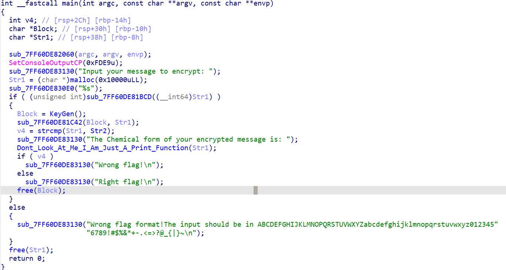

发现是I_Can_Run_Before_Main调用了他，他分为两种情况，如果是调试器直接用

<!-- 这是一张图片，ocr 内容为： -->
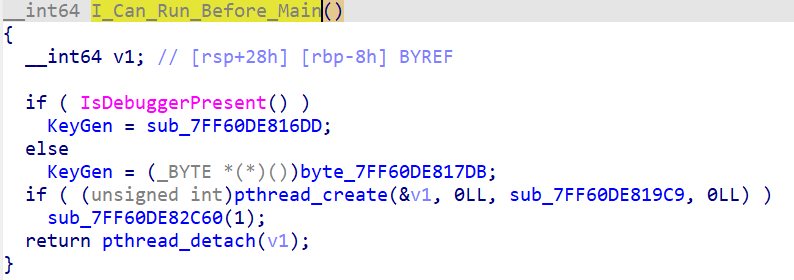

他分为两种情况，如果是调试器直接用sub_7FF60DE816DD函数生成key

<!-- 这是一张图片，ocr 内容为： -->
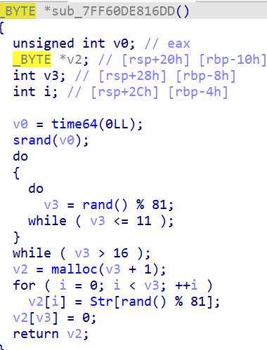

如果是静态分析，就将0x1400017DB..0x1400018D2的字节码异或0xcc

<!-- 这是一张图片，ocr 内容为： -->
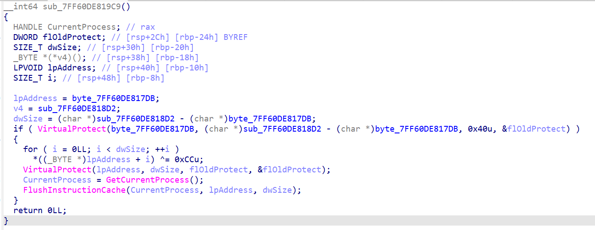

我选择静态分析，我们先去dump出这段字节码

<!-- 这是一张图片，ocr 内容为： -->
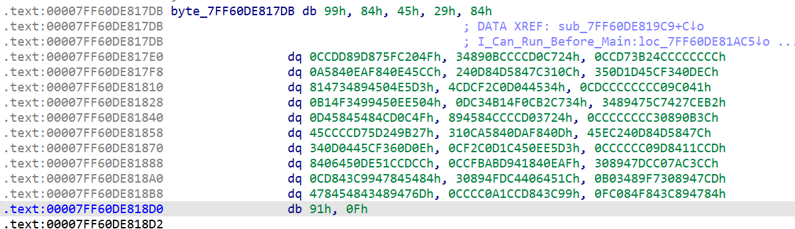

然后异或

<!-- 这是一张图片，ocr 内容为： -->
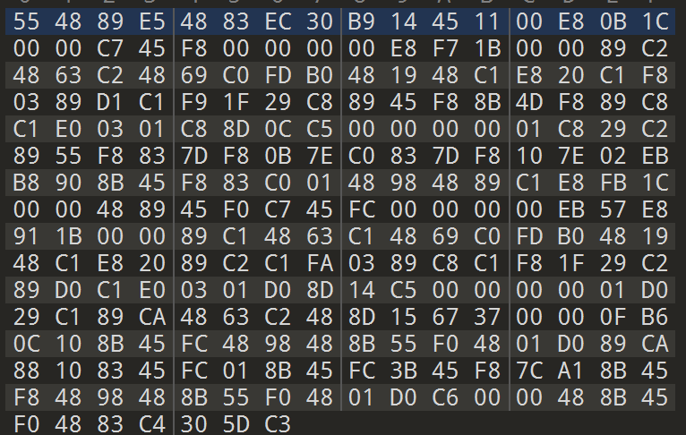

我们使用Capstone对其进行反汇编

```python
from capstone import Cs, CS_ARCH_X86, CS_MODE_64

path = r"E:\ctf\newstarctf2025\week3\Dancing_Functions\decoded.bin"

with open(path, "rb") as f:
    code = f.read()

md = Cs(CS_ARCH_X86, CS_MODE_64)
md.detail = True

base = 0x1400017DB
for i, ins in enumerate(md.disasm(code, base)):
    ops = ", ".join(op.__repr__() for op in ins.operands) if hasattr(ins, 'operands') else ""
    print(f"{ins.address:016X}: {ins.mnemonic} {ins.op_str}")
```

看到他使用的种子是0x114514，每个字符从 81 字符字典 Str 按 rand() % 81 取值

<!-- 这是一张图片，ocr 内容为： -->
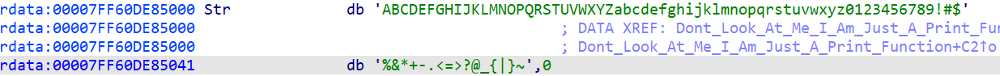

```text
00000001400017DB: push rbp
00000001400017DC: mov rbp, rsp
00000001400017DF: sub rsp, 0x30
00000001400017E3: mov ecx, 0x114514
00000001400017E8: call 0x1400033f8
00000001400017ED: mov dword ptr [rbp - 8], 0
00000001400017F4: call 0x1400033f0
00000001400017F9: mov edx, eax
00000001400017FB: movsxd rax, edx
00000001400017FE: imul rax, rax, 0x1948b0fd
0000000140001805: shr rax, 0x20
0000000140001809: sar eax, 3
000000014000180C: mov ecx, edx
000000014000180E: sar ecx, 0x1f
0000000140001811: sub eax, ecx
0000000140001813: mov dword ptr [rbp - 8], eax
0000000140001816: mov ecx, dword ptr [rbp - 8]
0000000140001819: mov eax, ecx
000000014000181B: shl eax, 3
000000014000181E: add eax, ecx
0000000140001820: lea ecx, [rax*8]
0000000140001827: add eax, ecx
0000000140001829: sub edx, eax
000000014000182B: mov dword ptr [rbp - 8], edx
000000014000182E: cmp dword ptr [rbp - 8], 0xb
0000000140001832: jle 0x1400017f4
0000000140001834: cmp dword ptr [rbp - 8], 0x10
0000000140001838: jle 0x14000183c
000000014000183A: jmp 0x1400017f4
000000014000183C: nop
000000014000183D: mov eax, dword ptr [rbp - 8]
0000000140001840: add eax, 1
0000000140001843: cdqe
0000000140001845: mov rcx, rax
0000000140001848: call 0x140003548
000000014000184D: mov qword ptr [rbp - 0x10], rax
0000000140001851: mov dword ptr [rbp - 4], 0
0000000140001858: jmp 0x1400018b1
000000014000185A: call 0x1400033f0
000000014000185F: mov ecx, eax
0000000140001861: movsxd rax, ecx
0000000140001864: imul rax, rax, 0x1948b0fd
000000014000186B: shr rax, 0x20
000000014000186F: mov edx, eax
0000000140001871: sar edx, 3
0000000140001874: mov eax, ecx
0000000140001876: sar eax, 0x1f
0000000140001879: sub edx, eax
000000014000187B: mov eax, edx
000000014000187D: shl eax, 3
0000000140001880: add eax, edx
0000000140001882: lea edx, [rax*8]
0000000140001889: add eax, edx
000000014000188B: sub ecx, eax
000000014000188D: mov edx, ecx
000000014000188F: movsxd rax, edx
0000000140001892: lea rdx, [rip + 0x3767]
0000000140001899: movzx ecx, byte ptr [rax + rdx]
000000014000189D: mov eax, dword ptr [rbp - 4]
00000001400018A0: cdqe
00000001400018A2: mov rdx, qword ptr [rbp - 0x10]
00000001400018A6: add rax, rdx
00000001400018A9: mov edx, ecx
00000001400018AB: mov byte ptr [rax], dl
00000001400018AD: add dword ptr [rbp - 4], 1
00000001400018B1: mov eax, dword ptr [rbp - 4]
00000001400018B4: cmp eax, dword ptr [rbp - 8]
00000001400018B7: jl 0x14000185a
00000001400018B9: mov eax, dword ptr [rbp - 8]
00000001400018BC: cdqe
00000001400018BE: mov rdx, qword ptr [rbp - 0x10]
00000001400018C2: add rax, rdx
00000001400018C5: mov byte ptr [rax], 0
00000001400018C8: mov rax, qword ptr [rbp - 0x10]
00000001400018CC: add rsp, 0x30
00000001400018D0: pop rbp
00000001400018D1: ret
```

加密算法在sub_7FF60DE81C42函数里

<!-- 这是一张图片，ocr 内容为： -->
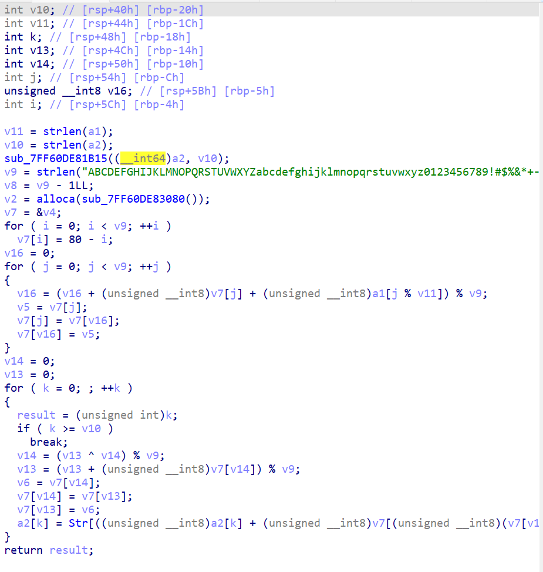

之后与str2对比

<!-- 这是一张图片，ocr 内容为： -->
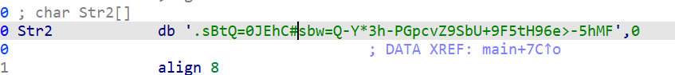

脚本

```python
STR = "ABCDEFGHIJKLMNOPQRSTUVWXYZabcdefghijklmnopqrstuvwxyz0123456789!#$%&*+-.<=>?@_{|}~"
STR2 = ".sBtQ=0JEhC#sbw=Q-Y*3h-PGpcvZ9SbU+9F5tH96e>-5hMF"

IDX = {c: i for i, c in enumerate(STR)}


class MSVCRand:
    def __init__(self):
        self.seed = 0

    def srand(self, seed: int):
        self.seed = seed & 0xFFFFFFFF

    def rand(self) -> int:
        self.seed = (self.seed * 214013 + 2531011) & 0xFFFFFFFF
        return (self.seed >> 16) & 0x7FFF


def keygen() -> str:
    r = MSVCRand()
    r.srand(0x114514)
    while True:
        v2 = r.rand() % 81
        if 12 <= v2 <= 16:
            break
    out = []
    for _ in range(v2):
        out.append(STR[r.rand() % 81])
    return "".join(out)


def to_indices(s: str):
    try:
        return [IDX[ch] for ch in s]
    except KeyError as e:
        raise ValueError("Input contains char outside dictionary") from e


def ksa(key: str):
    N = len(STR)
    S = [80 - i for i in range(N)]
    j = 0
    kl = len(key)
    for i in range(N):
        j = (j + S[i] + (ord(key[i % kl]) & 0xFF)) % N
        S[i], S[j] = S[j], S[i]
    return S


def prga_t_stream(S, length: int):
    N = len(STR)
    u = 0
    v = 0
    ts = []
    for _ in range(length):
        u = (v ^ u) % N
        v = (v + S[u]) % N
        S[u], S[v] = S[v], S[u]
        t = S[(S[u] ^ S[v]) % N]
        ts.append(t)
    return ts


def encrypt(key: str, msg: str) -> str:
    N = len(STR)
    S = ksa(key)
    u = 0
    v = 0
    out = []
    for idx in to_indices(msg):
        u = (v ^ u) % N
        v = (v + S[u]) % N
        S[u], S[v] = S[v], S[u]
        t = S[(S[u] ^ S[v]) % N]
        out.append(STR[(idx + t) % N])
    return "".join(out)


def decrypt(key: str, cipher: str) -> str:
    N = len(STR)
    S = ksa(key)
    c_idx = to_indices(cipher)
    ts = prga_t_stream(S, len(c_idx))
    out = []
    for idx, t in zip(c_idx, ts):
        out.append(STR[(idx - t) % N])
    return "".join(out)


if __name__ == "__main__":
    key = keygen()
    plain = decrypt(key, STR2)
    check = encrypt(key, plain)
    print("Key:", key)
    print("Plain:", plain)
    print("Match:", check == STR2)
```

flag{D4nc1Ng_K3yG3N_fUnct10n5_wItH_r4nD_4Nd_5Mc}


### 5.changemykey
JADX打开mainactivity，是一个标准的app首页<!-- 这是一张图片，ocr 内容为： -->
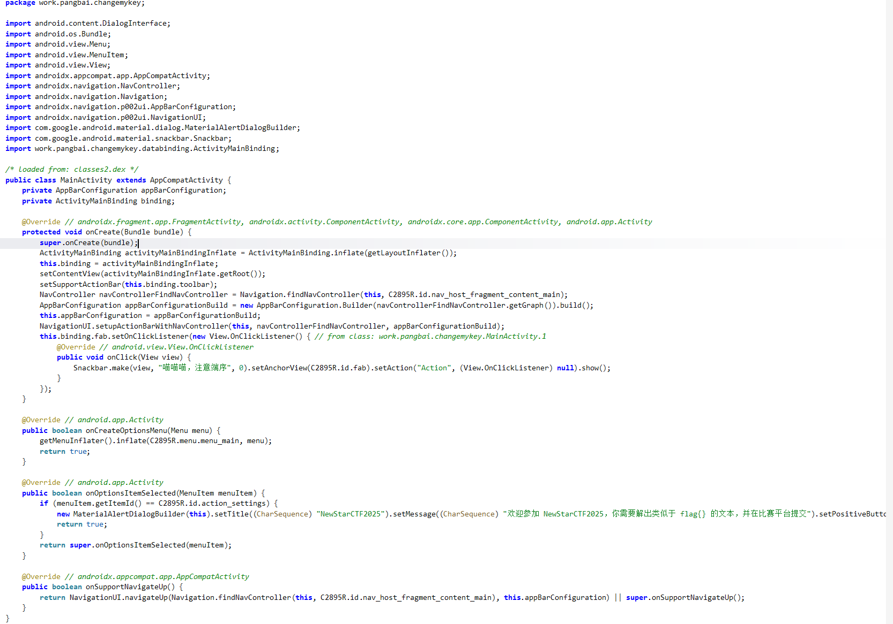

去FirstFragment看看，它实现了一个flag校验页面，配合 JNI（native 层）做本地校验<font style="color:rgb(240, 246, 252);background-color:rgb(13, 17, 23);"></font>

<!-- 这是一张图片，ocr 内容为： -->
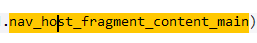

<!-- 这是一张图片，ocr 内容为： -->
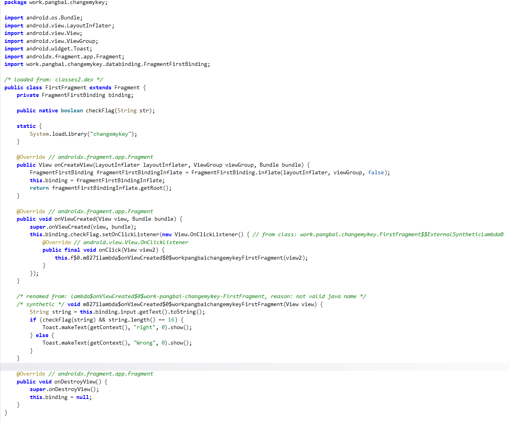

反编译apk文件，ida打开相应架构的so文件，找到Java_work_pangbai_changemykey_FirstFragment_checkFlag校验函数

<!-- 这是一张图片，ocr 内容为： -->
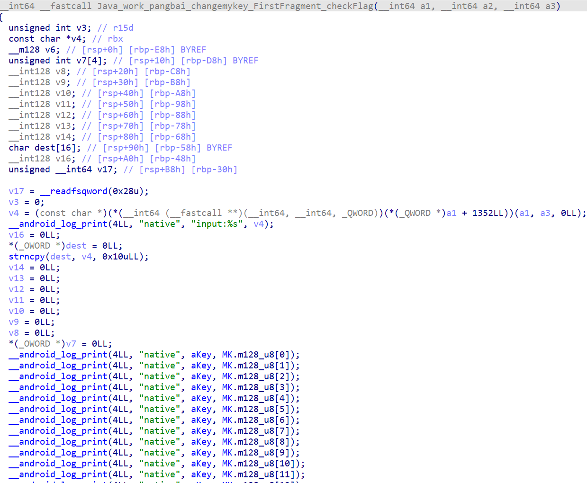

这个函数只取我们输入的前16字节，然后将MK与xmmword_940异或，然后在extendsecond里对密钥进行扩展，然后是32轮加密，最后与mm数组对比

<!-- 这是一张图片，ocr 内容为： -->
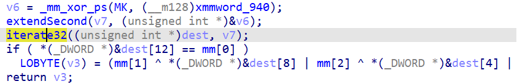

密钥扩展

<!-- 这是一张图片，ocr 内容为： -->
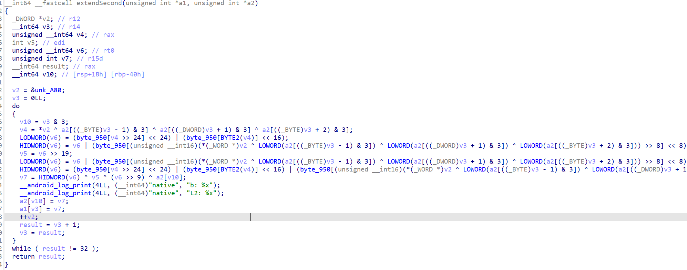

32轮加密

<!-- 这是一张图片，ocr 内容为： -->
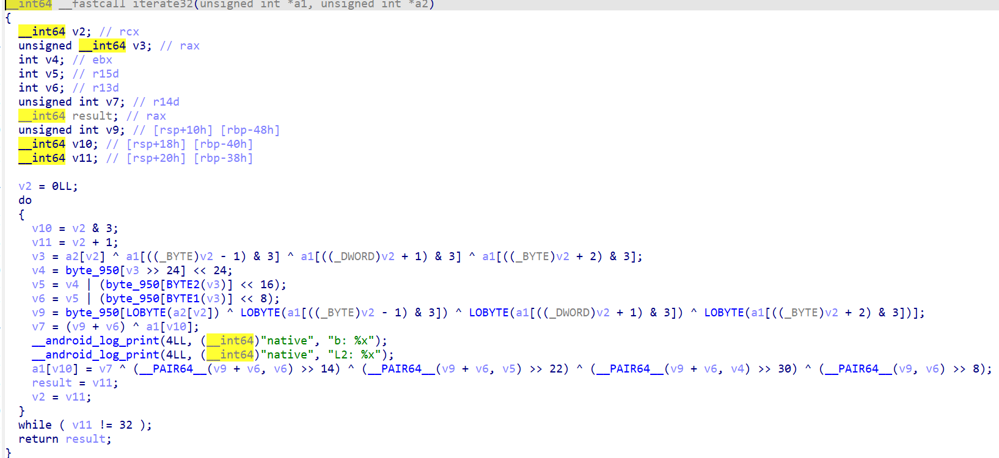

脚本

```python
SBOX = [
    0xd6,0x90,0xe9,0xfe,0xcc,0xe1,0x3d,0xb7,0x16,0xb6,0x14,0xc2,0x28,0xfb,0x2c,0x05,
    0x2b,0x67,0x9a,0x76,0x2a,0xbe,0x04,0xc3,0xaa,0x44,0x13,0x26,0x49,0x86,0x06,0x99,
    0x9c,0x42,0x50,0xf4,0x91,0xef,0x98,0x7a,0x33,0x54,0x0b,0x43,0xed,0xcf,0xac,0x62,
    0xe4,0xb3,0x1c,0xa9,0xc9,0x08,0xe8,0x95,0x80,0xdf,0x94,0xfa,0x75,0x8f,0x3f,0xa6,
    0x47,0x07,0xa7,0xfc,0xf3,0x73,0x17,0xba,0x83,0x59,0x3c,0x19,0xe6,0x85,0x4f,0xa8,
    0x68,0x6b,0x81,0xb2,0x71,0x64,0xda,0x8b,0xf8,0xeb,0x0f,0x4b,0x70,0x56,0x9d,0x35,
    0x1e,0x24,0x0e,0x5e,0x63,0x58,0xd1,0xa2,0x25,0x22,0x7c,0x3b,0x01,0x21,0x78,0x87,
    0xd4,0x00,0x46,0x57,0x9f,0xd3,0x27,0x52,0x4c,0x36,0x02,0xe7,0xa0,0xc4,0xc8,0x9e,
    0xea,0xbf,0x8a,0xd2,0x40,0xc7,0x38,0xb5,0xa3,0xf7,0xf2,0xce,0xf9,0x61,0x15,0xa1,
    0xe0,0xae,0x5d,0xa4,0x9b,0x34,0x1a,0x55,0xad,0x93,0x32,0x30,0xf5,0x8c,0xb1,0xe3,
    0x1d,0xf6,0xe2,0x2e,0x82,0x66,0xca,0x60,0xc0,0x29,0x23,0xab,0x0d,0x53,0x4e,0x6f,
    0xd5,0xdb,0x37,0x45,0xde,0xfd,0x8e,0x2f,0x03,0xff,0x6a,0x72,0x6d,0x6c,0x5b,0x51,
    0x8d,0x1b,0xaf,0x92,0xbb,0xdd,0xbc,0x7f,0x11,0xd9,0x5c,0x41,0x1f,0x10,0x5a,0xd8,
    0x0a,0xc1,0x31,0x88,0xa5,0xcd,0x7b,0xbd,0x2d,0x74,0xd0,0x12,0xb8,0xe5,0xb4,0xb0,
    0x89,0x69,0x97,0x4a,0x0c,0x96,0x77,0x7e,0x65,0xb9,0xf1,0x09,0xc5,0x6e,0xc6,0x84,
    0x18,0xf0,0x7d,0xec,0x3a,0xdc,0x4d,0x20,0x79,0xee,0x5f,0x3e,0xd7,0xcb,0x39,0x48,
]

FK = [0xa3b1bac6, 0x56aa3350, 0x677d9197, 0xb27022dc]
CK = [
    0x00070e15,0x1c232a31,0x383f464d,0x545b6269,0x70777e85,0x8c939aa1,0xa8afb6bd,0xc4cbd2d9,
    0xe0e7eef5,0xfc030a11,0x181f262d,0x343b4249,0x50575e65,0x6c737a81,0x888f969d,0xa4abb2b9,
    0xc0c7ced5,0xdce3eaf1,0xf8ff060d,0x141b2229,0x30373e45,0x4c535a61,0x686f767d,0x848b9299,
    0xa0a7aeb5,0xbcc3cad1,0xd8dfe6ed,0xf4fb0209,0x10171e25,0x2c333a41,0x484f565d,0x646b7279,
]

def rotl(x, n):
    return ((x << n) & 0xffffffff) | (x >> (32 - n))

def tau(x):
    return (
        SBOX[(x >> 24) & 0xff] << 24 |
        SBOX[(x >> 16) & 0xff] << 16 |
        SBOX[(x >> 8) & 0xff] << 8 |
        SBOX[x & 0xff]
    )

def L(x):
    return x ^ rotl(x, 2) ^ rotl(x, 10) ^ rotl(x, 18) ^ rotl(x, 24)

def Lp(x):
    return x ^ rotl(x, 13) ^ rotl(x, 23)

def T(x):
    return L(tau(x))

def Tp(x):
    return Lp(tau(x))

def le32(b):
    return b[0] | (b[1] << 8) | (b[2] << 16) | (b[3] << 24)

def to_le_bytes(w):
    return bytes([w & 0xff, (w >> 8) & 0xff, (w >> 16) & 0xff, (w >> 24) & 0xff])

def key_schedule(key_bytes):
    assert len(key_bytes) == 16
    MK = [le32(key_bytes[0:4]), le32(key_bytes[4:8]), le32(key_bytes[8:12]), le32(key_bytes[12:16])]
    K = [MK[0] ^ FK[0], MK[1] ^ FK[1], MK[2] ^ FK[2], MK[3] ^ FK[3]]
    rk = []
    for i in range(32):
        t = K[i] ^ Tp(K[i+1] ^ K[i+2] ^ K[i+3] ^ CK[i])
        rk.append(t)
        K.append(t)
    return rk

def sm4_encrypt(block, rk):
    X = [le32(block[0:4]), le32(block[4:8]), le32(block[8:12]), le32(block[12:16])]
    for i in range(32):
        X.append(X[i] ^ T(X[i+1] ^ X[i+2] ^ X[i+3] ^ rk[i]))
    out = to_le_bytes(X[35]) + to_le_bytes(X[34]) + to_le_bytes(X[33]) + to_le_bytes(X[32])
    return out

def sm4_decrypt(block, rk):
    return sm4_encrypt(block, list(reversed(rk)))

def main():
    
    MK_bytes = bytes([
        0x01,0x00,0x00,0x00,
        0x01,0x00,0x00,0x00,
        0x04,0x00,0x00,0x00,
        0x05,0x00,0x00,0x00,
    ])
    mm = bytes([
        0xb3,0xe9,0x0d,0xb6,0x4c,0x7b,0x7a,0x7a,0x89,0x37,0xd0,0xc7,0x6c,0x8e,0x27,0x2a,
    ])

    assert len(SBOX) == 256, f"SBOX length wrong: {len(SBOX)}"
    rk = key_schedule(MK_bytes)
    pt = sm4_decrypt(mm, rk)

    try:
        s = pt.decode('utf-8')
    except UnicodeDecodeError:
        s = None

    print("Plaintext hex:", pt.hex())
    if s is not None:
        print("Plaintext str:", s)
    else:
        print("Plaintext bytes:", list(pt))

if __name__ == '__main__':
    main()
```

flag{1n1t_@rr@y}


### 6.changemykey-rev
在JADX中，同过FirstFragment函数看到flag的验证逻辑在native层

<!-- 这是一张图片，ocr 内容为： -->
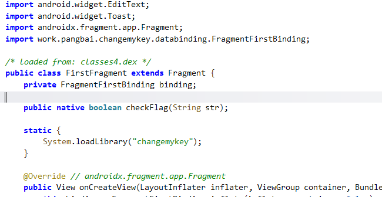

直接反编译apk，在lib目录里找到自己架构的so文件，IDA打开

字符串查看

<!-- 这是一张图片，ocr 内容为： -->


调用函数

<!-- 这是一张图片，ocr 内容为： -->
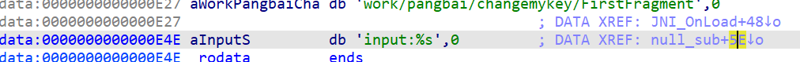

密钥生成在getRk，加密过程在encryptSM4，最后进行密文比对与mm数组

<!-- 这是一张图片，ocr 内容为： -->
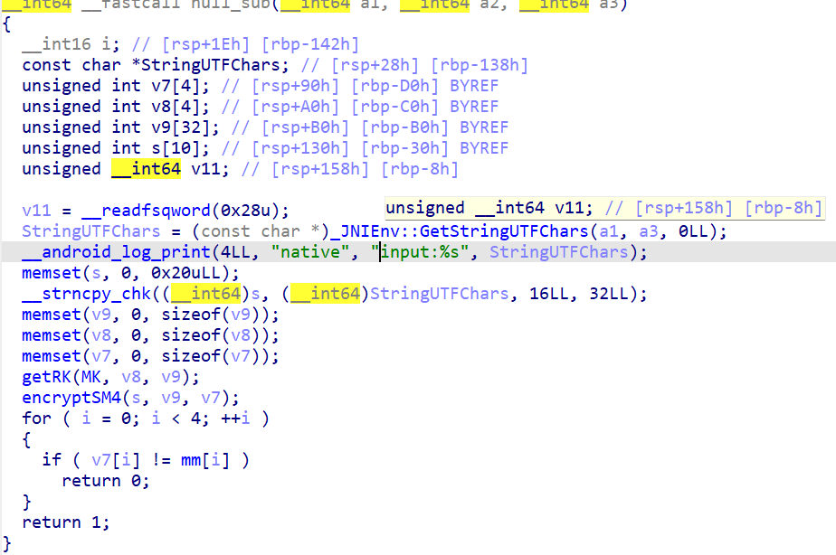

先看密钥生成

<!-- 这是一张图片，ocr 内容为： -->
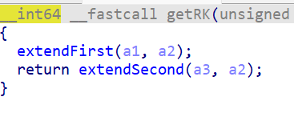

extendFirst，K[i] = MK[i] ^ FK[i]，FK[]为dword_D70

<!-- 这是一张图片，ocr 内容为： -->
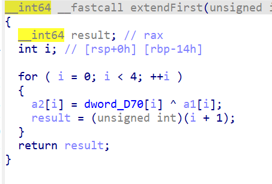

<!-- 这是一张图片，ocr 内容为： -->
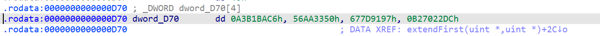

再看extendSecond

+ t = K[(i+1)%4] ^ K[(i+2)%4] ^ K[(i+3)%4] ^ CK[i]
+ K[(i+4)%4] = K[i%4] ^ L2(SBOX(t))
+ RK[i] = K[(i+4)%4]

dword_D80为SM4 标准常量数组

<!-- 这是一张图片，ocr 内容为： -->
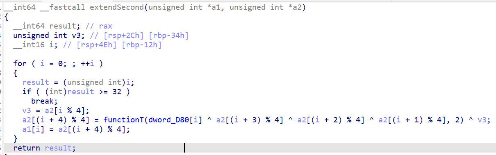

我们在这里对functionT这个函数也做下分析，他会接受两个参数，其中第二个参数，决定函数返回结果，如果a2为1，返回functionL1（v5），其他返回functionL2（v5）

<!-- 这是一张图片，ocr 内容为： -->
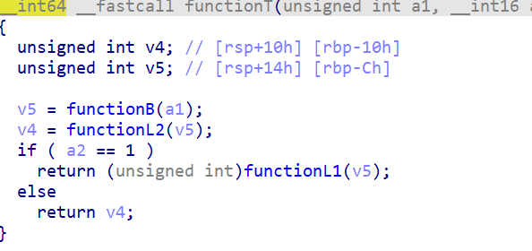

在看下这三个function函数

1.functionB，byte_C70为标准的SM4box

<!-- 这是一张图片，ocr 内容为： -->
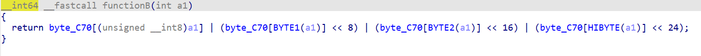

2.functionL1，

<!-- 这是一张图片，ocr 内容为： -->
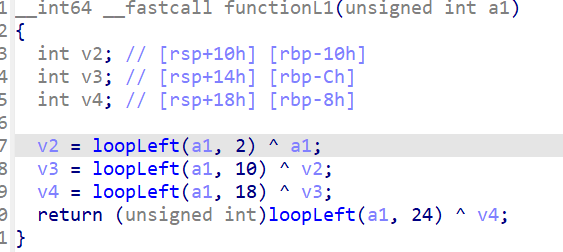

3.functionL2，

<!-- 这是一张图片，ocr 内容为： -->
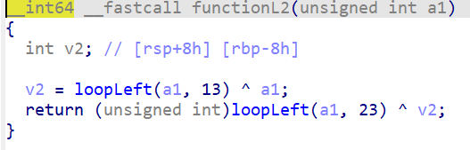

## 第四周

### 1.hookme
JADX打开apk文件


<!-- 这是一张图片，ocr 内容为： -->
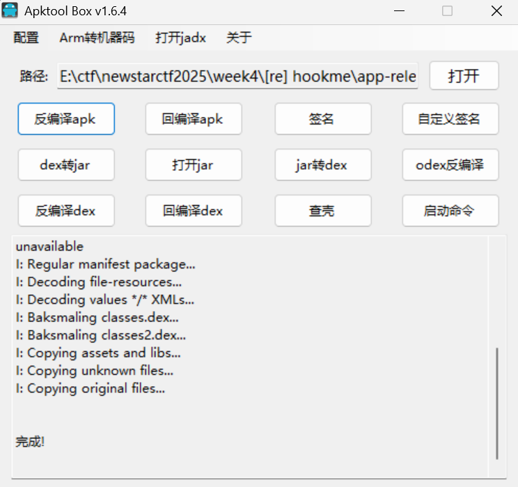


### 2.尤皮.艾克斯历险记（3）
先用DIE和exeinfo查看一下文件信息

<!-- 这是一张图片，ocr 内容为： -->
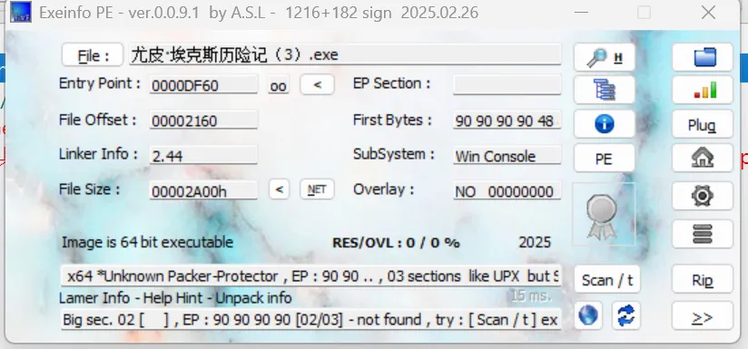

<!-- 这是一张图片，ocr 内容为： -->
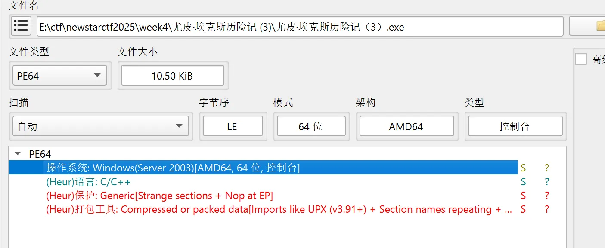

010改一下

<!-- 这是一张图片，ocr 内容为： -->
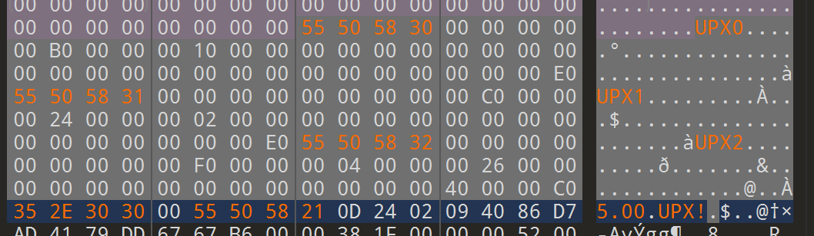

脱壳

<!-- 这是一张图片，ocr 内容为： -->
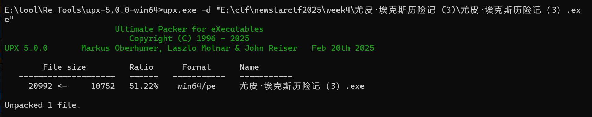

IDA打开，字符串搜索，定位到sub_1400023D6函数

<!-- 这是一张图片，ocr 内容为： -->
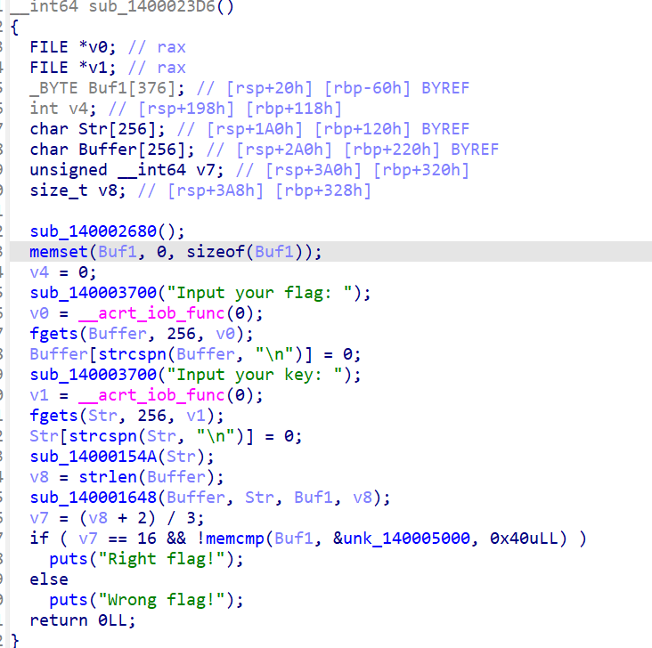

这两个函数分别处理你输入的key和flag

<!-- 这是一张图片，ocr 内容为： -->
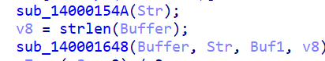

最后与密文比较

<!-- 这是一张图片，ocr 内容为： -->
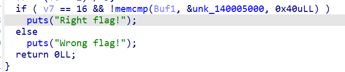

```python
.rdata:0000000140005000 unk_140005000   db 0B4h                 ; DATA XREF: sub_1400023D6+158↑o
.rdata:0000000140005001                 db  6Eh ; n
.rdata:0000000140005002                 db  0Fh
.rdata:0000000140005003                 db 0E7h
.rdata:0000000140005004                 db 0EEh
.rdata:0000000140005005                 db  1Ah
.rdata:0000000140005006                 db  74h ; t
.rdata:0000000140005007                 db 0B7h
.rdata:0000000140005008                 db  6Ch ; l
.rdata:0000000140005009                 db 0F9h
.rdata:000000014000500A                 db 0B3h
.rdata:000000014000500B                 db  77h ; w
.rdata:000000014000500C                 db 0E4h
.rdata:000000014000500D                 db  82h
.rdata:000000014000500E                 db  7Dh ; }
.rdata:000000014000500F                 db  3Ah ; :
.rdata:0000000140005010                 db  70h ; p
.rdata:0000000140005011                 db  9Eh
.rdata:0000000140005012                 db 0F8h
.rdata:0000000140005013                 db  0Dh
.rdata:0000000140005014                 db 0ECh
.rdata:0000000140005015                 db  3Ch ; <
.rdata:0000000140005016                 db 0C1h
.rdata:0000000140005017                 db  70h ; p
.rdata:0000000140005018                 db  56h ; V
.rdata:0000000140005019                 db  26h ; &
.rdata:000000014000501A                 db  60h ; `
.rdata:000000014000501B                 db  55h ; U
.rdata:000000014000501C                 db  8Ah
.rdata:000000014000501D                 db 0BCh
.rdata:000000014000501E                 db 0B4h
.rdata:000000014000501F                 db  94h
.rdata:0000000140005020                 db 0E4h
.rdata:0000000140005021                 db  0Ch
.rdata:0000000140005022                 db  31h ; 1
.rdata:0000000140005023                 db  43h ; C
.rdata:0000000140005024                 db  76h ; v
.rdata:0000000140005025                 db  74h ; t
.rdata:0000000140005026                 db  35h ; 5
.rdata:0000000140005027                 db  5Fh ; _
.rdata:0000000140005028                 db  3Ah ; :
.rdata:0000000140005029                 db 0D5h
.rdata:000000014000502A                 db  24h ; $
.rdata:000000014000502B                 db 0D7h
.rdata:000000014000502C                 db 0B0h
.rdata:000000014000502D                 db  1Bh
.rdata:000000014000502E                 db 0E3h
.rdata:000000014000502F                 db  6Dh ; m
.rdata:0000000140005030                 db  0Eh
.rdata:0000000140005031                 db  0Bh
.rdata:0000000140005032                 db  21h ; !
.rdata:0000000140005033                 db 0E5h
.rdata:0000000140005034                 db  7Ah ; z
.rdata:0000000140005035                 db 0F7h
.rdata:0000000140005036                 db  9Bh
.rdata:0000000140005037                 db 0A4h
.rdata:0000000140005038                 db    0
.rdata:0000000140005039                 db  1Fh
.rdata:000000014000503A                 db  38h ; 8
.rdata:000000014000503B                 db 0CFh
.rdata:000000014000503C                 db  66h ; f
.rdata:000000014000503D                 db 0D0h
.rdata:000000014000503E                 db  3Eh ; >
.rdata:000000014000503F                 db  36h ; 6
```


### 3.ezrust
main函数，sub_140001DD0是核心校验函数，sub_140004620是包装调用

<!-- 这是一张图片，ocr 内容为： -->
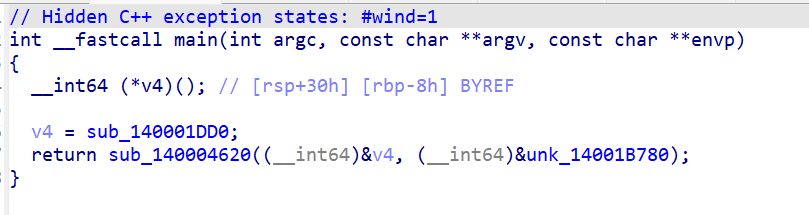

看下校验过程，这里提示你输入flag

<!-- 这是一张图片，ocr 内容为： -->
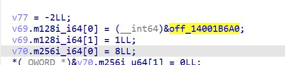

<!-- 这是一张图片，ocr 内容为： -->
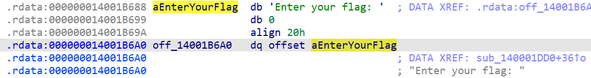

输入通道初始化与错误日志

<!-- 这是一张图片，ocr 内容为： -->
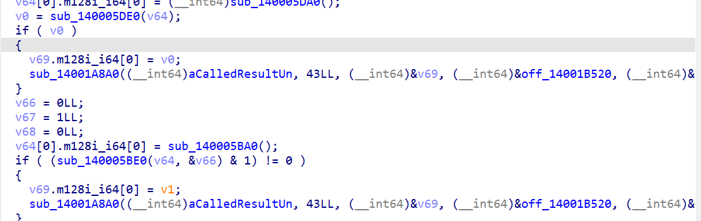

这里检查我们输入的长度是不是40，不是就会打印Wrong flag! Try again!<!-- 这是一张图片，ocr 内容为： -->
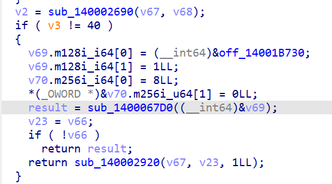

<!-- 这是一张图片，ocr 内容为： -->
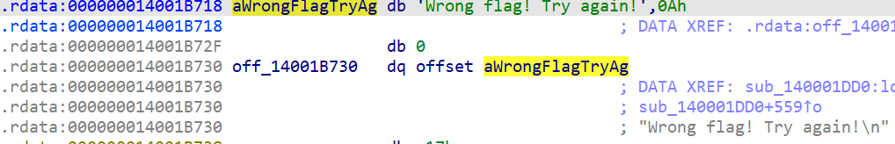

sub_140002910把40字节分成16+16+8

<!-- 这是一张图片，ocr 内容为： -->
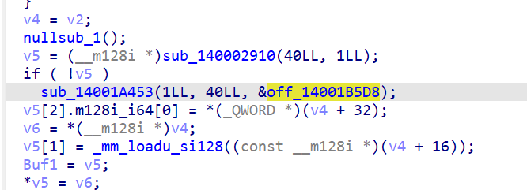

<!-- 这是一张图片，ocr 内容为： -->
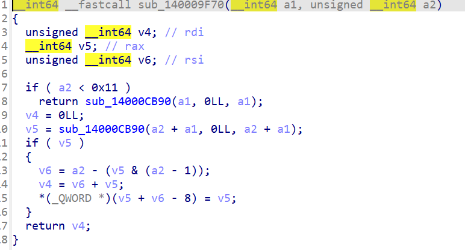

expand 32-byte kString_Theocracy，前 16 字节为常量 ，后 16 字节为 key 前半 "String_Theocracy" 

xmmword_14001B600为"ycarcoehT_gnirtS",为key的后半

<!-- 这是一张图片，ocr 内容为： -->
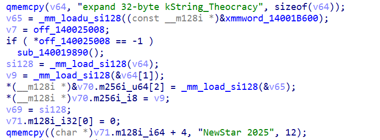

接下里就是选择计算路径了，取决于off_140025008，为1则调用sub_14001B30生成 ChaCha20 block 输出,否则，在当前函数内用 SSE 实现 10 次双轮

<!-- 这是一张图片，ocr 内容为： -->
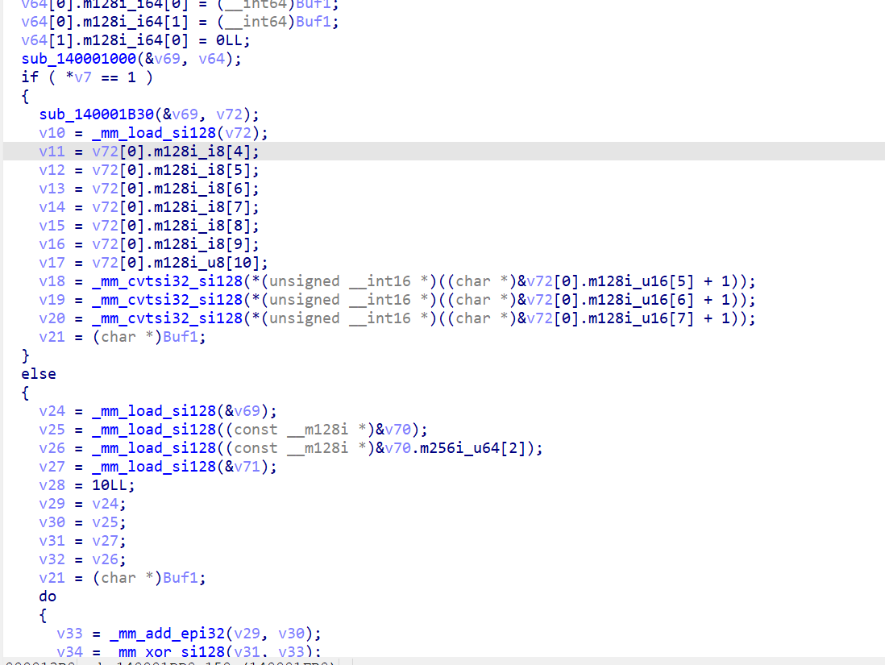

构造前40字节密钥流并异或

<!-- 这是一张图片，ocr 内容为： -->
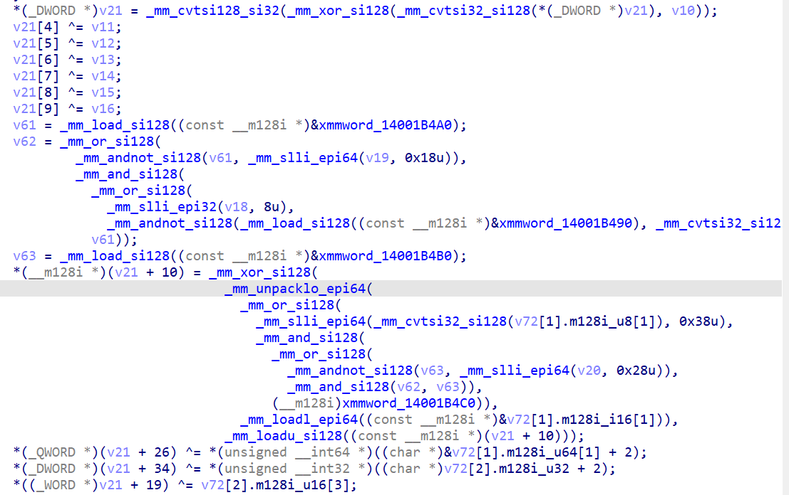

最后比较

<!-- 这是一张图片，ocr 内容为： -->
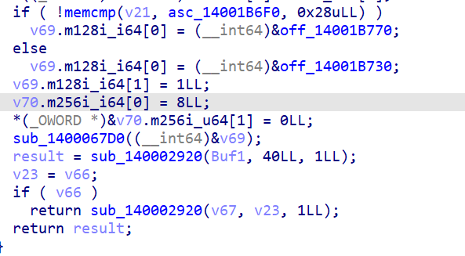

<!-- 这是一张图片，ocr 内容为： -->
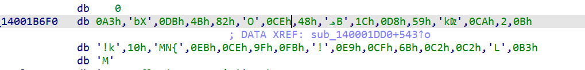

最终正确输入为 input[0..39] = asc_14001B6F0 XOR keystream[0..39]

```python
import struct

CONST=(0x61707865,0x3320646e,0x79622d32,0x6b206574)
KEY1=b"String_Theocracy"; KEY2=b"ycarcoehT_gnirtS"
NONCE=b"NewStar 2025"; COUNTER=0
TARGET=bytes([0xA3,0x62,0x58,0xDB,0x4B,0x82,0x4F,0xCE,0x48,0xDA,0xBE,0x42,0x1C,0xD8,0x59,0x6B,
              0xC7,0xB2,0xCA,0x02,0x0B,0x21,0x6B,0x10,0x4D,0x4E,0x7B,0xEB,0xCE,0x9F,0xFB,0x21,
              0xE9,0xCF,0x6B,0xC2,0xC2,0x4C,0xB3,0x4D])

def le32(b,i): return struct.unpack_from("<I",b,i)[0]
def r(x,n): return ((x<<n)&0xffffffff)|(x>>(32-n))
def qr(s,a,b,c,d):
    s[a]=(s[a]+s[b])&0xffffffff; s[d]^=s[a]; s[d]=r(s[d],16)
    s[c]=(s[c]+s[d])&0xffffffff; s[b]^=s[c]; s[b]=r(s[b],12)
    s[a]=(s[a]+s[b])&0xffffffff; s[d]^=s[a]; s[d]=r(s[d],8)
    s[c]=(s[c]+s[d])&0xffffffff; s[b]^=s[c]; s[b]=r(s[b],7)

def block():
    s=[0]*16; s[:4]=CONST
    key=KEY1+KEY2
    for i in range(8): s[4+i]=le32(key,i*4)
    s[12]=COUNTER; s[13]=le32(NONCE,0); s[14]=le32(NONCE,4); s[15]=le32(NONCE,8)
    w=s[:]
    for _ in range(10):
        qr(w,0,4,8,12); qr(w,1,5,9,13); qr(w,2,6,10,14); qr(w,3,7,11,15)
        qr(w,0,5,10,15); qr(w,1,6,11,12); qr(w,2,7,8,13); qr(w,3,4,9,14)
    for i in range(16): w[i]=(w[i]+s[i])&0xffffffff
    return b"".join(struct.pack("<I",w[i]) for i in range(16))

def main():
    ks=block()[:40]
    flag=bytes(TARGET[i]^ks[i] for i in range(40))
    print(flag.decode())

if __name__=="__main__": main()
```

flag{rUS7_ReveRse_1s_MY_n19h7m4rE_eW2fZ}


### 4.Dancingkeys
IDA中打开，flag长度为48

sub_4015EB函数将 48 字节按固定字节序打包为 12 个 DWORD

基准密钥在 main 的状态机里初始化为：

+ dword_404070 = 0x12345678
+ dword_404074 = 0x90ABCDEF
+ dword_404078 = 0x11451419
+ dword_40407C = 0x19810114

<!-- 这是一张图片，ocr 内容为： -->
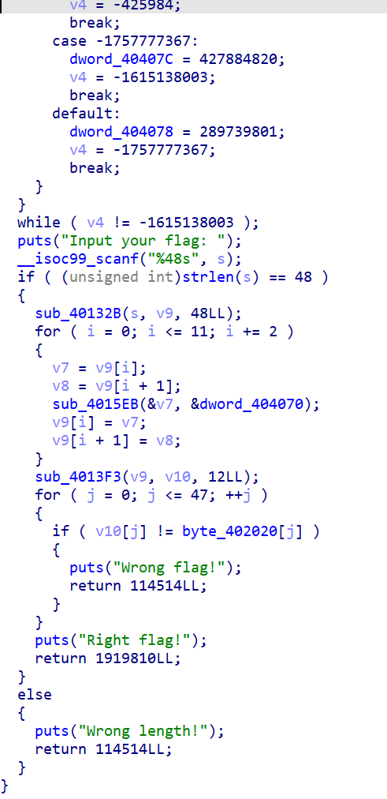

sub_4015EB函数对这 12 个 DWORD ，按两两一组执行一段 0x72 轮的“对变换”

<!-- 这是一张图片，ocr 内容为： -->
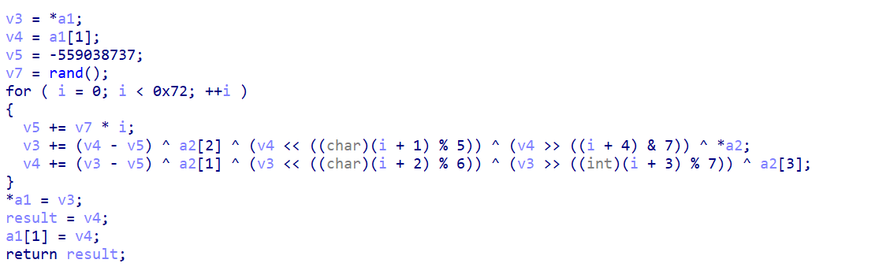

sub_4013F3 函数将变换结果再按固定字节序“展开”成 48 字节

<!-- 这是一张图片，ocr 内容为： -->
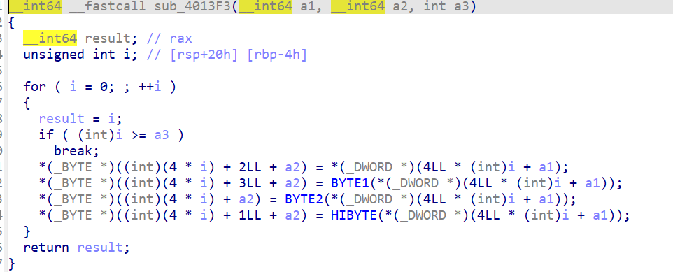

种子的计算在start_routine中

<!-- 这是一张图片，ocr 内容为： -->
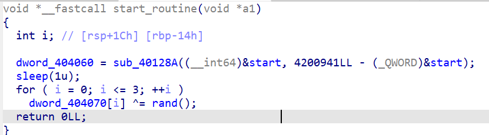

sub_40128A函数

+ v3 = Σ (i * byte[i]) （32 位环绕）
+ v4 = XOR 所有字节

<!-- 这是一张图片，ocr 内容为： -->
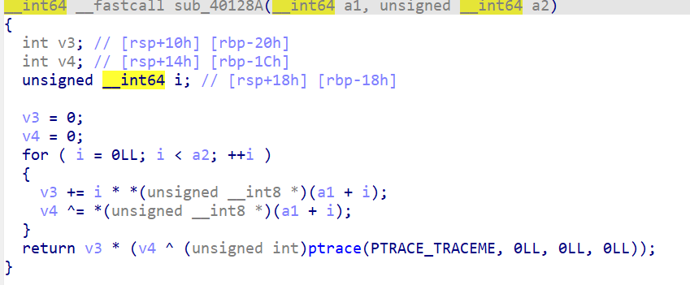

对比密文

```text
rodata:0000000000402020 ; _BYTE byte_402020[48]
.rodata:0000000000402020 byte_402020     db 6Eh, 0AAh, 0B2h, 46h, 14h, 0A4h, 7Eh, 60h, 0BAh, 44h
.rodata:0000000000402020                                         ; DATA XREF: main+21E↑o
.rodata:000000000040202A                 db 4Eh, 0CCh, 43h, 2 dup(0AAh), 0CDh, 0D4h, 0FCh, 71h
.rodata:0000000000402033                 db 0AAh, 0F6h, 7Dh, 4Bh, 9Bh, 0E6h, 7Dh, 0EFh, 4Eh, 3Dh
.rodata:000000000040203D                 db 43h, 0Bh, 0BFh, 28h, 14h, 85h, 0B2h, 0CFh, 62h, 0A2h
.rodata:0000000000402047                 db 0C5h, 0EAh, 7Dh, 0EBh, 5Eh, 0D6h, 0FCh, 3Ch, 0BFh
```

解密脚本

```python
import os, struct
BIN_PATH = os.path.join('key')
C_FINAL = bytes([
    0x6e,0xaa,0xb2,0x46, 0x14,0xa4,0x7e,0x60, 0xba,0x44,0x4e,0xcc, 0x43,0xaa,0xaa,0xcd,
    0xd4,0xfc,0x71,0xaa, 0xf6,0x7d,0x4b,0x9b, 0xe6,0x7d,0xef,0x4e, 0x3d,0x43,0x0b,0xbf,
    0x28,0x14,0x85,0xb2, 0xcf,0x62,0xa2,0xc5, 0xea,0x7d,0xeb,0x5e, 0xd6,0xfc,0x3c,0xbf
])
START_ADDR = 0x401130
END_ADDR = 0x4019ED
BASE_KEYS = [0x12345678, 0x90ABCDEF, 0x11451419, 0x19810114]
MASK32 = 0xFFFFFFFF
def u32(x):
    return x & MASK32
def xorshift32(state):
    d = state & MASK32
    d ^= (d << 11) & MASK32
    d ^= (d >> 4) & MASK32
    d ^= (d << 5) & MASK32
    d ^= (d >> 14) & MASK32
    return d & MASK32
def compute_seed_from_elf(path, start_addr, end_addr):
    with open(path, 'rb') as f:
        e_ident = f.read(16)
        if len(e_ident) < 16 or e_ident[0:4] != b'\x7fELF':
            raise RuntimeError('Not ELF')
        is_64 = (e_ident[4] == 2)
        is_le = (e_ident[5] == 1)
        if not is_64 or not is_le:
            raise RuntimeError('Expect ELF64 LE')
        hdr = f.read(48)
        e_type, e_machine, e_version, e_entry, e_phoff, e_shoff, e_flags, e_ehsize, e_phentsize, e_phnum, e_shentsize, e_shnum, e_shstrndx = struct.unpack('<HHIQQQIHHHHHH', hdr)
        f.seek(e_phoff)
        phdrs = []
        for _ in range(e_phnum):
            p = f.read(e_phentsize)
            p_type, p_flags, p_offset, p_vaddr, p_paddr, p_filesz, p_memsz, p_align = struct.unpack('<IIQQQQQQ', p)
            phdrs.append((p_type, p_offset, p_vaddr, p_memsz))
        start_off = None
        length = end_addr - start_addr
        for p_type, p_offset, p_vaddr, p_memsz in phdrs:
            if p_type == 1 and start_addr >= p_vaddr and end_addr <= (p_vaddr + p_memsz):
                start_off = p_offset + (start_addr - p_vaddr)
                break
        if start_off is None:
            raise RuntimeError('Map VA range failed')
        f.seek(start_off)
        data = f.read(length)
        v3 = 0
        v4 = 0
        for i, b in enumerate(data):
            v3 = u32(v3 + u32(i * b))
            v4 = u32(v4 ^ b)
        return u32(u32(v3) * u32(v4))
def dwords_to_input_bytes(D):
    out = bytearray(48)
    for i in range(12):
        d = D[i] & MASK32
        out[4*i+0] = (d >> 8) & 0xFF
        out[4*i+1] = (d >> 24) & 0xFF
        out[4*i+2] = (d >> 16) & 0xFF
        out[4*i+3] = d & 0xFF
    return bytes(out)
def cbytes_to_dwords(C):
    T = []
    for i in range(12):
        c0 = C[4*i+0]
        c1 = C[4*i+1]
        c2 = C[4*i+2]
        c3 = C[4*i+3]
        T.append((c2) | (c3<<8) | (c0<<16) | (c1<<24))
    return T
def F(v4, v5, i, K0, K2):
    return u32(u32(v4 - v5) ^ K2 ^ u32(v4 << ((i+1)%5)) ^ (v4 >> ((i+4)&7)) ^ K0)
def G(v3, v5, i, K1, K3):
    return u32(u32(v3 - v5) ^ K1 ^ u32(v3 << ((i+2)%6)) ^ (v3 >> ((i+3)%7)) ^ K3)
def invert_pair(v3_final, v4_final, keys, v7):
    K0, K1, K2, K3 = keys
    v5_list = []
    v5 = 0xDEADBEEF
    for i in range(0x72):
        v5 = u32(v5 + u32(v7 * i))
        v5_list.append(v5)
    v3 = v3_final & MASK32
    v4 = v4_final & MASK32
    for i in reversed(range(0x72)):
        v5_i = v5_list[i]
        v4 = u32(v4 - G(v3, v5_i, i, K1, K3))
        v3 = u32(v3 - F(v4, v5_i, i, K0, K2))
    return v3, v4
def main():
    bin_path = os.path.join(os.path.abspath(os.path.dirname(__file__)), BIN_PATH)
    try:
        seed0 = compute_seed_from_elf(bin_path, START_ADDR, END_ADDR)
    except Exception:
        seed0 = 0xCCED8DC0
    s = seed0
    r = []
    for _ in range(4):
        s = xorshift32(s)
        r.append(s)
    mutated_keys = [u32(BASE_KEYS[i] ^ r[i]) for i in range(4)]
    state = s
    T = cbytes_to_dwords(C_FINAL)
    orig = [0]*12
    for k in range(6):
        v7 = xorshift32(state)
        state = v7
        orig[2*k], orig[2*k+1] = invert_pair(T[2*k], T[2*k+1], mutated_keys, v7)
    flag_bytes = dwords_to_input_bytes(orig)
    try:
        print(flag_bytes.decode('utf-8'))
    except Exception:
        print(flag_bytes.hex())
if __name__ == '__main__':
    main()
```

flag{1_h4t3_h4sH_ch3cK1ng_4Nd_r4Nd0m_t3AenCRypt}


### 5.NOT_TUI
sub_1400015C6函数窗口过程函数，flag总长度必须为 38

<!-- 这是一张图片，ocr 内容为： -->
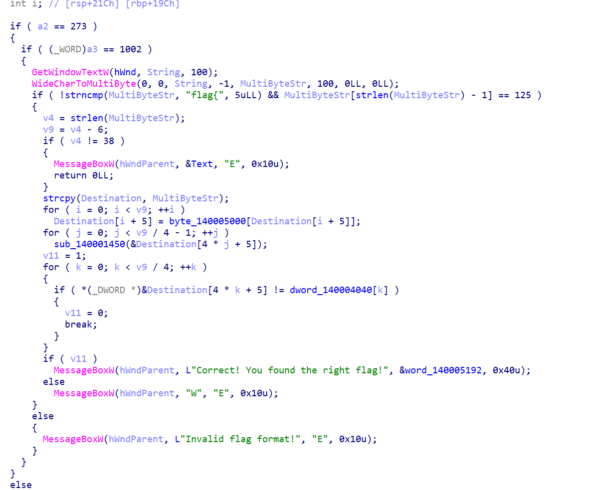

把内部 32 字节逐字节用表 byte_140005000 做 S-Box 替换（正向 AES S‑Box）

<!-- 这是一张图片，ocr 内容为： -->
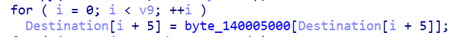

<!-- 这是一张图片，ocr 内容为： -->
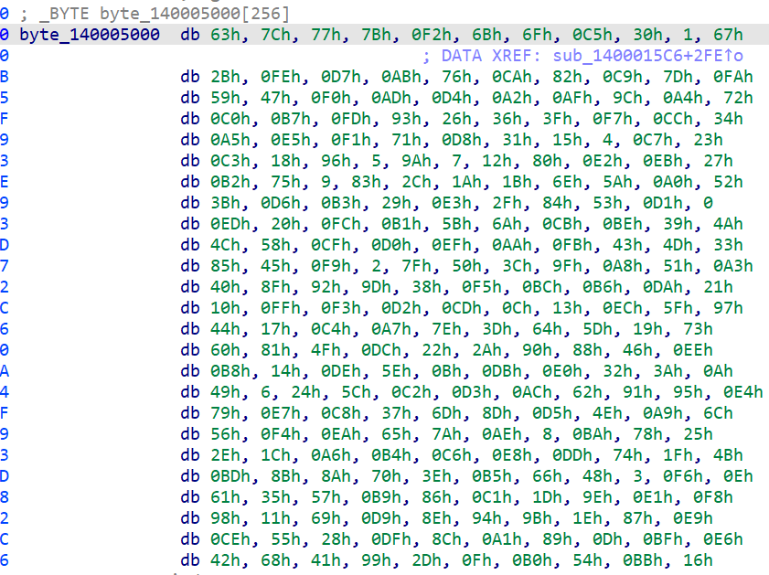

把替换后的 32 字节按小端视为 8 个 DWORD ，进行链式两两加密：对 (dword[j], dword[j+1]) 依次调用 sub_140001450 

<!-- 这是一张图片，ocr 内容为： -->
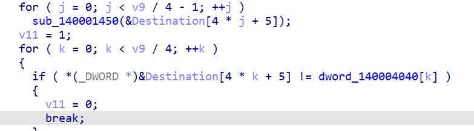

sub_140001450 函数

+ 偶轮用 aStringTheocrac 
+ 奇轮用 aPaperBouquetMi 

<!-- 这是一张图片，ocr 内容为： -->
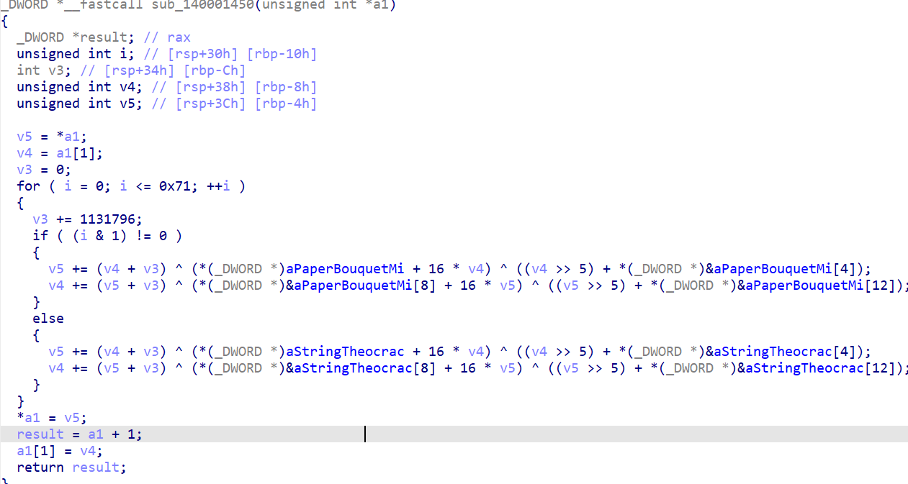

最后比较

```text
data:0000000140004040 ; _DWORD dword_140004040[8]
.data:0000000140004040 dword_140004040 dd 5AF4429Ch, 0BAA6B51Bh, 5CDECA1Fh, 0AF439534h, 8B07D489h
.data:0000000140004040                                         ; DATA XREF: sub_1400015C6+3B6↑o
.data:0000000140004054                 dd 0CC2048AFh, 957F02B6h, 9C4988FDh
```

解密脚本

```python
MASK = 0xFFFFFFFF

AES_SBOX = [
    0x63,0x7C,0x77,0x7B,0xF2,0x6B,0x6F,0xC5,0x30,0x01,0x67,0x2B,0xFE,0xD7,0xAB,0x76,
    0xCA,0x82,0xC9,0x7D,0xFA,0x59,0x47,0xF0,0xAD,0xD4,0xA2,0xAF,0x9C,0xA4,0x72,0xC0,
    0xB7,0xFD,0x93,0x26,0x36,0x3F,0xF7,0xCC,0x34,0xA5,0xE5,0xF1,0x71,0xD8,0x31,0x15,
    0x04,0xC7,0x23,0xC3,0x18,0x96,0x05,0x9A,0x07,0x12,0x80,0xE2,0xEB,0x27,0xB2,0x75,
    0x09,0x83,0x2C,0x1A,0x1B,0x6E,0x5A,0xA0,0x52,0x3B,0xD6,0xB3,0x29,0xE3,0x2F,0x84,
    0x53,0xD1,0x00,0xED,0x20,0xFC,0xB1,0x5B,0x6A,0xCB,0xBE,0x39,0x4A,0x4C,0x58,0xCF,
    0xD0,0xEF,0xAA,0xFB,0x43,0x4D,0x33,0x85,0x45,0xF9,0x02,0x7F,0x50,0x3C,0x9F,0xA8,
    0x51,0xA3,0x40,0x8F,0x92,0x9D,0x38,0xF5,0xBC,0xB6,0xDA,0x21,0x10,0xFF,0xF3,0xD2,
    0xCD,0x0C,0x13,0xEC,0x5F,0x97,0x44,0x17,0xC4,0xA7,0x7E,0x3D,0x64,0x5D,0x19,0x73,
    0x60,0x81,0x4F,0xDC,0x22,0x2A,0x90,0x88,0x46,0xEE,0xB8,0x14,0xDE,0x5E,0x0B,0xDB,
    0xE0,0x32,0x3A,0x0A,0x49,0x06,0x24,0x5C,0xC2,0xD3,0xAC,0x62,0x91,0x95,0xE4,0x79,
    0xE7,0xC8,0x37,0x6D,0x8D,0xD5,0x4E,0xA9,0x6C,0x56,0xF4,0xEA,0x65,0x7A,0xAE,0x08,
    0xBA,0x78,0x25,0x2E,0x1C,0xA6,0xB4,0xC6,0xE8,0xDD,0x74,0x1F,0x4B,0xBD,0x8B,0x8A,
    0x70,0x3E,0xB5,0x66,0x48,0x03,0xF6,0x0E,0x61,0x35,0x57,0xB9,0x86,0xC1,0x1D,0x9E,
    0xE1,0xF8,0x98,0x11,0x69,0xD9,0x8E,0x94,0x9B,0x1E,0x87,0xE9,0xCE,0x55,0x28,0xDF,
    0x8C,0xA1,0x89,0x0D,0xBF,0xE6,0x42,0x68,0x41,0x99,0x2D,0x0F,0xB0,0x54,0xBB,0x16,
]

INV_SBOX = [0]*256
for x, s in enumerate(AES_SBOX):
    INV_SBOX[s] = x
INV_SBOX = bytes(INV_SBOX)

def to_le_dwords(b32):
    return [int.from_bytes(b32[i*4:(i+1)*4], 'little') for i in range(8)]

def from_le_dwords(dw8):
    return b''.join(d.to_bytes(4, 'little') for d in dw8)

def key_to_dwords(key16):
    return [int.from_bytes(key16[i*4:(i+1)*4], 'little') for i in range(4)]

K_even = key_to_dwords(b"String_Theocracy")
K_odd  = key_to_dwords(b"Paper_Bouquet_Mili"[:16])

def decrypt_pair(v5, v4):
    for i in range(0x71, -1, -1):
        sumv = (i + 1) * 1131796
        K = K_odd if (i & 1) else K_even
        t = ((v5 + sumv) & MASK) ^ ((K[2] + ((v5 << 4) & MASK)) & MASK) ^ (((v5 >> 5) + K[3]) & MASK)
        v4 = (v4 - t) & MASK
        t = ((v4 + sumv) & MASK) ^ ((K[0] + ((v4 << 4) & MASK)) & MASK) ^ (((v4 >> 5) + K[1]) & MASK)
        v5 = (v5 - t) & MASK
    return v5, v4

C_BYTES = bytes.fromhex("9c42f45a1bb5a6ba1fcade5c349543af89d4078baf4820ccb6027f95fd88499c")

C = to_le_dwords(C_BYTES)
B = C[:]
for j in range(6, -1, -1):
    B[j], B[j+1] = decrypt_pair(B[j], B[j+1])

plain = bytes(INV_SBOX[b] for b in from_le_dwords(B))
print("flag{" + plain.decode("ascii") + "}")
```

flag{bbbd719a361123014e77006476205f73}

## 第五周

### 1.天才的认证
main函数

<!-- 这是一张图片，ocr 内容为： -->
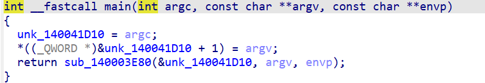

打开sub_140003E80函数

<!-- 这是一张图片，ocr 内容为： -->
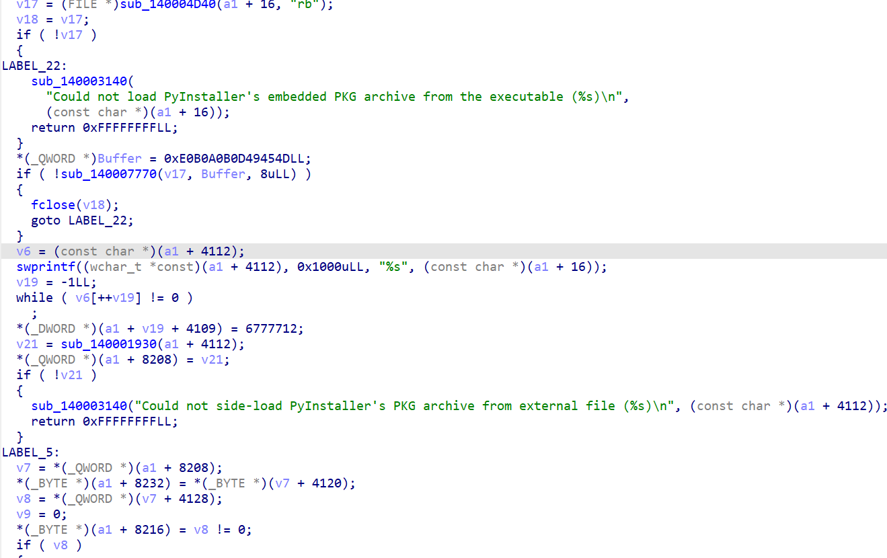

这个程序是一个PyInstaller打包的程序

<!-- 这是一张图片，ocr 内容为： -->
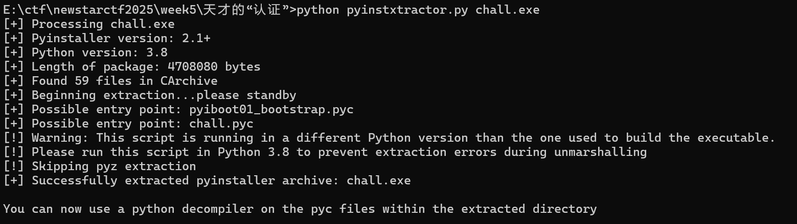

把chall.pyc编译为py文件，这里使用Pylingual

+ 先把输入按字节放到内存 `mem[16+i]`，要求长度为 **31**。
+ 对每个索引 `i` 的输入字节 `x`，计算：

```text
t = (x + i) ^ 75
C[i] = rol8(t, 3)   # 8-bit 循环左移 3 位
```

最终把 `C` 存为程序里的常量表，用来比对。

```python
# Decompiled with PyLingual (https://pylingual.io)
# Internal filename: chall.py
# Bytecode version: 3.8.0rc1+ (3413)
# Source timestamp: 1970-01-01 00:00:00 UTC (0)

class TinyVM:

    def __init__(self, bytecode, user_input):
        self.bytecode = bytecode
        self.user_input = user_input
        self.mem = [0] * 100
        self.ip = 0
        self.stack = []
        self.f = False
        self.halted = False
        for i, char_code in enumerate(self.user_input):
            self.mem[16 + i] = char_code

    def push(self, value):
        self.stack.append(value & 255)

    def pop(self):
        return self.stack.pop() if self.stack else 0

    def run(self):
        while not self.halted and self.ip < len(self.bytecode):
            opcode = self.bytecode[self.ip]
            self.ip += 1
            if opcode == 1:
                self.push(self.bytecode[self.ip])
                self.ip += 1
            elif opcode == 2:
                self.push(self.mem[self.bytecode[self.ip]])
                self.ip += 1
            elif opcode == 3:
                self.mem[self.bytecode[self.ip]] = self.pop()
                self.ip += 1
            elif opcode == 4:
                self.push(self.pop() + self.pop())
            elif opcode == 5:
                self.push(self.pop() ^ self.pop())
            elif opcode == 6:
                n, v = (self.pop(), self.pop())
                self.push(v << n)
            elif opcode == 7:
                n, v = (self.pop(), self.pop())
                self.push(v >> n)
            elif opcode == 8:
                self.push(self.pop() | self.pop())
            elif opcode == 9:
                self.f = self.pop() == self.pop()
            elif opcode in [10, 11, 12]:
                offset = self.bytecode[self.ip]
                self.ip += 1
                should_jump = opcode == 12 or (opcode == 10 and (not self.f)) or (opcode == 11 and self.f)
                if should_jump:
                    if offset > 127:
                        offset -= 256
                    self.ip += offset
            elif opcode == 13:
                self.push(len(self.user_input))
            elif opcode == 14:
                addr = self.pop()
                self.push(self.mem[addr])
            elif opcode == 15:
                addr = self.pop()
                val = self.pop()
                self.mem[addr] = val
            elif opcode == 255:
                self.halted = True
            else:
                self.halted = True
        return bool(self.pop())

def check_flag(s):
    BYTECODE = b'\x01i\x032\x011\x033\x01A\x034\x01\t\x035\x01\xa1\x036\x01`\x037\x01\xa1\x038\x01\x81\x039\x011\x03:\x019\x03;\x01\x8b\x03<\x01!\x03=\x01\xd1\x03>\x019\x03?\x01 \x03@\x01\xb1\x03A\x01\xf9\x03B\x01\xd9\x03C\x01q\x03D\x01f\x03E\x01\x18\x03F\x01\x99\x03G\x01V\x03H\x01\xe9\x03I\x01q\x03J\x010\x03K\x01V\x03L\x018\x03M\x01\xa1\x03N\x01\xab\x03O\x01\x86\x03P\r\x01\x1f\t\n=\x01K\x03\x02\x01\x00\x03\x00\x02\x00\x01\x1f\t\x0b+\x01\x10\x02\x00\x04\x0e\x02\x00\x04\x02\x02\x05\x03\x01\x02\x01\x01\x03\x06\x02\x01\x01\x05\x07\x08\x012\x02\x00\x04\x0e\t\n\x0c\x02\x00\x01\x01\x04\x03\x00\x0c\xce\x01\x01\xff\x01\x00\xff'
    vm = TinyVM(BYTECODE, s.encode('utf-8'))
    return vm.run()

def main():
    print('「欢迎，开拓者。这里是一个被星核污染的赛博空间。」')
    print('「检测到未知访问者...」机械女声响起，像是黑塔空间站的自动防御系统')
    print('「哼，又一个被星核吸引来的家伙。想通过验证？先证明你不是个笨蛋吧。」——某位不愿透露姓名的天才俱乐部成员留言')
    try:
        user_flag = input('请输入正确的星核密语：')
        if check_flag(user_flag):
            print('\n「...有意思的访客。」空间站的灯光突然变成柔和的蓝色')
            print('「访问权限已授予。」黑塔的全息影像优雅地行了一礼')
            print(f'「这是你要的星核密钥：{user_flag}。不过要小心，它比你想象的要危险得多...」')
            print('「警告：检测到异常数据流...系统正在隔离污染区域...」')
            print('✅ 验证通过！螺丝咕姆的虚拟助手从控制台浮现：「建议您立即备份数据」✅')
        else:
            print('\n❌ 错误！空间站的防御炮台突然转向你 ❌')
            print('「哈！果然是个笨蛋~」——来自某位正通过监控看戏的少女声音')
            print("「建议：下次试试输入'黑塔女士天下第一'？」——系统自动生成的恶意提示")
    except Exception as e:
        print(f'\n[!] 星核能量不稳定！虚拟空间发生异常: {e}')
        print('「这种情况...难道是记忆星神的力量？」')
if __name__ == '__main__':
    main()
```

脚本

```python
def ror(v, n): return ((v >> n) | ((v << (8-n)) & 0xff)) & 0xff

consts = [105,49,65,9,161,96,161,129,49,57,139,33,209,57,32,217,113,102,24,153,86,233,113,48,86,56,161,171,134]

res_bytes = []
for i, c in enumerate(consts):
    t = ror(c, 3)            
    x = ((t ^ 75) - i) & 0xff
    res_bytes.append(x)

flag = bytes(res_bytes).decode('utf-8')
print(flag)


```

flag{Bytec0de_And_St4ck_M4g1c!}


### 2.AnEasySystem
先将hap文件解压缩

<!-- 这是一张图片，ocr 内容为： -->
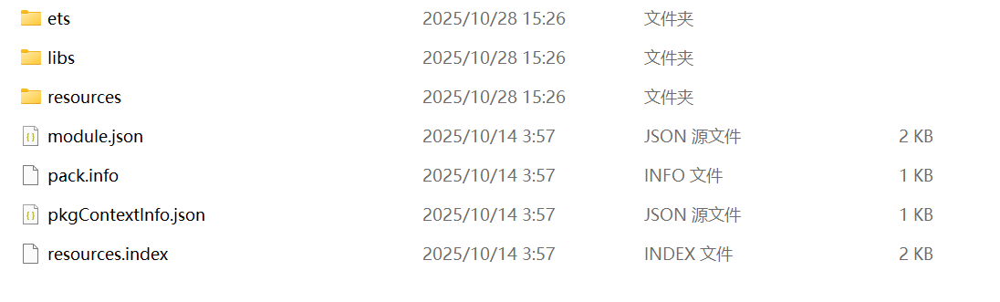

ets是源码文件，libs是依赖库，module.json是描述文件入口，整体跟apk文件差不多

打开ets文件夹，找到这个modules.abc，然后用<font style="color:rgb(0, 0, 0);">abc-decompiler 打开这个abc文件，主要逻辑在p001entry/src/main/ets/pages/Index，</font>

<!-- 这是一张图片，ocr 内容为： -->
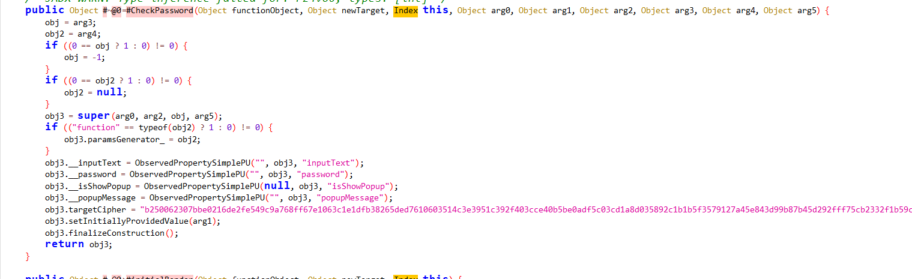

<!-- 这是一张图片，ocr 内容为： -->
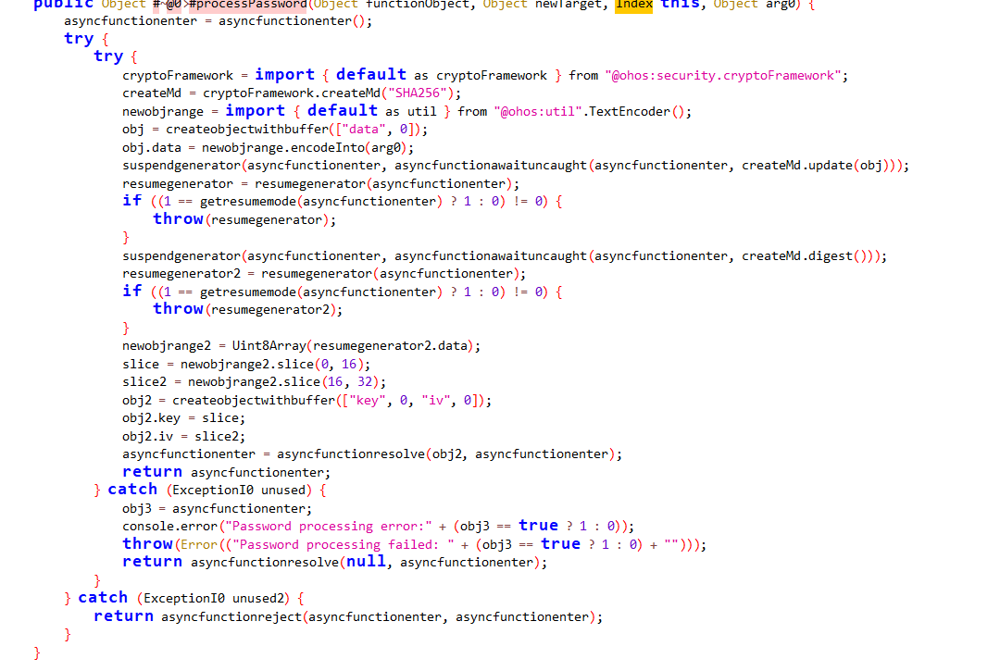

<!-- 这是一张图片，ocr 内容为： -->
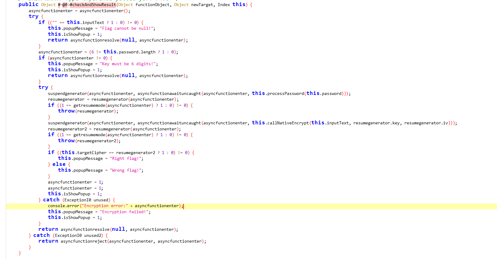

但最终的加密算法还是由modifiedAESEncrypt补充出来

<!-- 这是一张图片，ocr 内容为： -->
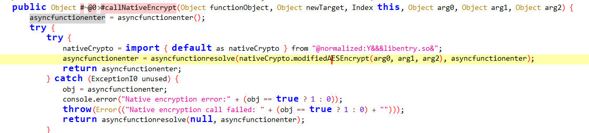

用IDA打开libentry.so

<!-- 这是一张图片，ocr 内容为： -->
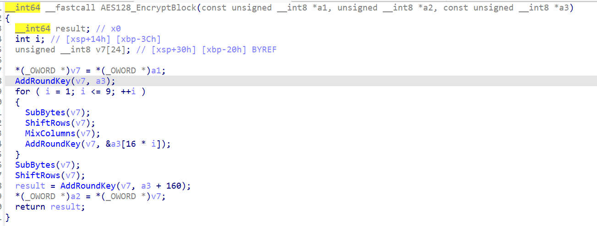


```python
import hashlib

# Standard AES S-box and inverse S-box
s_box = [
    0x63, 0x7C, 0x77, 0x7B, 0xF2, 0x6B, 0x6F, 0xC5, 0x30, 0x01, 0x67, 0x2B, 0xFE, 0xD7, 0xAB, 0x76,
    0xCA, 0x82, 0xC9, 0x7D, 0xFA, 0x59, 0x47, 0xF0, 0xAD, 0xD4, 0xA2, 0xAF, 0x9C, 0xA4, 0x72, 0xC0,
    0xB7, 0xFD, 0x93, 0x26, 0x36, 0x3F, 0xF7, 0xCC, 0x34, 0xA5, 0xE5, 0xF1, 0x71, 0xD8, 0x31, 0x15,
    0x04, 0xC7, 0x23, 0xC3, 0x18, 0x96, 0x05, 0x9A, 0x07, 0x12, 0x80, 0xE2, 0xEB, 0x27, 0xB2, 0x75,
    0x09, 0x83, 0x2C, 0x1A, 0x1B, 0x6E, 0x5A, 0xA0, 0x52, 0x3B, 0xD6, 0xB3, 0x29, 0xE3, 0x2F, 0x84,
    0x53, 0xD1, 0x00, 0xED, 0x20, 0xFC, 0xB1, 0x5B, 0x6A, 0xCB, 0xBE, 0x39, 0x4A, 0x4C, 0x58, 0xCF,
    0xD0, 0xEF, 0xAA, 0xFB, 0x43, 0x4D, 0x33, 0x85, 0x45, 0xF9, 0x02, 0x7F, 0x50, 0x3C, 0x9F, 0xA8,
    0x51, 0xA3, 0x40, 0x8F, 0x92, 0x9D, 0x38, 0xF5, 0xBC, 0xB6, 0xDA, 0x21, 0x10, 0xFF, 0xF3, 0xD2,
    0xCD, 0x0C, 0x13, 0xEC, 0x5F, 0x97, 0x44, 0x17, 0xC4, 0xA7, 0x7E, 0x3D, 0x64, 0x5D, 0x19, 0x73,
    0x60, 0x81, 0x4F, 0xDC, 0x22, 0x2A, 0x90, 0x88, 0x46, 0xEE, 0xB8, 0x14, 0xDE, 0x5E, 0x0B, 0xDB,
    0xE0, 0x32, 0x3A, 0x0A, 0x49, 0x06, 0x24, 0x5C, 0xC2, 0xD3, 0xAC, 0x62, 0x91, 0x95, 0xE4, 0x79,
    0xE7, 0xC8, 0x37, 0x6D, 0x8D, 0xD5, 0x4E, 0xA9, 0x6C, 0x56, 0xF4, 0xEA, 0x65, 0x7A, 0xAE, 0x08,
    0xBA, 0x78, 0x25, 0x2E, 0x1C, 0xA6, 0xB4, 0xC6, 0xE8, 0xDD, 0x74, 0x1F, 0x4B, 0xBD, 0x8B, 0x8A,
    0x70, 0x3E, 0xB5, 0x66, 0x48, 0x03, 0xF6, 0x0E, 0x61, 0x35, 0x57, 0xB9, 0x86, 0xC1, 0x1D, 0x9E,
    0xE1, 0xF8, 0x98, 0x11, 0x69, 0xD9, 0x8E, 0x94, 0x9B, 0x1E, 0x87, 0xE9, 0xCE, 0x55, 0x28, 0xDF,
    0x8C, 0xA1, 0x89, 0x0D, 0xBF, 0xE6, 0x42, 0x68, 0x41, 0x99, 0x2D, 0x0F, 0xB0, 0x54, 0xBB, 0x16
]

inv_s_box = [
    0x52, 0x09, 0x6A, 0xD5, 0x30, 0x36, 0xA5, 0x38, 0xBF, 0x40, 0xA3, 0x9E, 0x81, 0xF3, 0xD7, 0xFB,
    0x7C, 0xE3, 0x39, 0x82, 0x9B, 0x2F, 0xFF, 0x87, 0x34, 0x8E, 0x43, 0x44, 0xC4, 0xDE, 0xE9, 0xCB,
    0x54, 0x7B, 0x94, 0x32, 0xA6, 0xC2, 0x23, 0x3D, 0xEE, 0x4C, 0x95, 0x0B, 0x42, 0xFA, 0xC3, 0x4E,
    0x08, 0x2E, 0xA1, 0x66, 0x28, 0xD9, 0x24, 0xB2, 0x76, 0x5B, 0xA2, 0x49, 0x6D, 0x8B, 0xD1, 0x25,
    0x72, 0xF8, 0xF6, 0x64, 0x86, 0x68, 0x98, 0x16, 0xD4, 0xA4, 0x5C, 0xCC, 0x5D, 0x65, 0xB6, 0x92,
    0x6C, 0x70, 0x48, 0x50, 0xFD, 0xED, 0xB9, 0xDA, 0x5E, 0x15, 0x46, 0x57, 0xA7, 0x8D, 0x9D, 0x84,
    0x90, 0xD8, 0xAB, 0x00, 0x8C, 0xBC, 0xD3, 0x0A, 0xF7, 0xE4, 0x58, 0x05, 0xB8, 0xB3, 0x45, 0x06,
    0xD0, 0x2C, 0x1E, 0x8F, 0xCA, 0x3F, 0x0F, 0x02, 0xC1, 0xAF, 0xBD, 0x03, 0x01, 0x13, 0x8A, 0x6B,
    0x3A, 0x91, 0x11, 0x41, 0x4F, 0x67, 0xDC, 0xEA, 0x97, 0xF2, 0xCF, 0xCE, 0xF0, 0xB4, 0xE6, 0x73,
    0x96, 0xAC, 0x74, 0x22, 0xE7, 0xAD, 0x35, 0x85, 0xE2, 0xF9, 0x37, 0xE8, 0x1C, 0x75, 0xDF, 0x6E,
    0x47, 0xF1, 0x1A, 0x71, 0x1D, 0x29, 0xC5, 0x89, 0x6F, 0xB7, 0x62, 0x0E, 0xAA, 0x18, 0xBE, 0x1B,
    0xFC, 0x56, 0x3E, 0x4B, 0xC6, 0xD2, 0x79, 0x20, 0x9A, 0xDB, 0xC0, 0xFE, 0x78, 0xCD, 0x5A, 0xF4,
    0x1F, 0xDD, 0xA8, 0x33, 0x88, 0x07, 0xC7, 0x31, 0xB1, 0x12, 0x10, 0x59, 0x27, 0x80, 0xEC, 0x5F,
    0x60, 0x51, 0x7F, 0xA9, 0x19, 0xB5, 0x4A, 0x0D, 0x2D, 0xE5, 0x7A, 0x9F, 0x93, 0xC9, 0x9C, 0xEF,
    0xA0, 0xE0, 0x3B, 0x4D, 0xAE, 0x2A, 0xF5, 0xB0, 0xC8, 0xEB, 0xBB, 0x3C, 0x83, 0x53, 0x99, 0x61,
    0x17, 0x2B, 0x04, 0x7E, 0xBA, 0x77, 0xD6, 0x26, 0xE1, 0x69, 0x14, 0x63, 0x55, 0x21, 0x0C, 0x7D
]

# Rcon for key expansion
rcon = [0x00, 0x01, 0x02, 0x04, 0x08, 0x10, 0x20, 0x40, 0x80, 0x1B, 0x36]


def sub_word(word):
    return [s_box[b] for b in word]


def rot_word(word):
    return word[1:] + word[:1]


def key_expansion(key):
    key_bytes = list(key)
    w = [0] * 44 * 4
    for i in range(16):
        w[i] = key_bytes[i]

    for i in range(4, 44):
        temp = w[(i - 1) * 4: i * 4]
        if i % 4 == 0:
            temp = sub_word(rot_word(temp))
            temp[0] ^= rcon[i // 4]
        w[i * 4: (i + 1) * 4] = [w[(i - 4) * 4 + j] ^ temp[j] for j in range(4)]

    round_keys = []
    for i in range(11):
        round_keys.append(bytes(w[i * 16: i * 16 + 16]))
    return round_keys


def inv_shift_rows(state):
    state_list = list(state)
    s = [0] * 16

    # 基于正向变换推导逆变换
    s[0] = state_list[0] ^ 0xB7
    s[4] = (state_list[4] - 70) & 0xFF
    s[8] = state_list[8] ^ 0xD4
    s[12] = (state_list[12] + 41) & 0xFF
    s[5] = (state_list[1] - 29) & 0xFF
    s[9] = state_list[5] ^ 0x37
    s[13] = (state_list[9] + 113) & 0xFF
    s[1] = (state_list[13] + 7) & 0xFF
    s[10] = (state_list[2] - 91) & 0xFF
    s[14] = state_list[6] ^ 0xC3
    s[2] = state_list[10] ^ 0x0D
    s[6] = (state_list[14] + 107) & 0xFF
    s[15] = (state_list[3] - 78) & 0xFF
    s[3] = state_list[7] ^ 0x43
    s[7] = (state_list[11] - 36) & 0xFF
    s[11] = (state_list[15] - 125) & 0xFF

    return bytes(s)


def inv_sub_bytes(state):
    return bytes([inv_s_box[b] for b in state])


def gf_multiply(a, b):
    """GF(2^8) multiplication with irreducible polynomial x^8 + x^4 + x^3 + x + 1 (0x11B)"""
    p = 0
    for _ in range(8):
        if b & 1:
            p ^= a
        carry = a & 0x80
        a = (a << 1) & 0xFF
        if carry:
            a ^= 0x1B
        b >>= 1
    return p


def inv_mix_columns(state):
    state_arr = list(state)
    new_state = [0] * 16
    for i in range(4):
        col = state_arr[i * 4: i * 4 + 4]
        a0, a1, a2, a3 = col
        new_state[i * 4] = gf_multiply(0x0e, a0) ^ gf_multiply(0x0b, a1) ^ gf_multiply(0x0d, a2) ^ gf_multiply(0x09, a3)
        new_state[i * 4 + 1] = gf_multiply(0x09, a0) ^ gf_multiply(0x0e, a1) ^ gf_multiply(0x0b, a2) ^ gf_multiply(0x0d,
                                                                                                                   a3)
        new_state[i * 4 + 2] = gf_multiply(0x0d, a0) ^ gf_multiply(0x09, a1) ^ gf_multiply(0x0e, a2) ^ gf_multiply(0x0b,
                                                                                                                   a3)
        new_state[i * 4 + 3] = gf_multiply(0x0b, a0) ^ gf_multiply(0x0d, a1) ^ gf_multiply(0x09, a2) ^ gf_multiply(0x0e,
                                                                                                                   a3)
    return bytes(new_state)


def aes_decrypt_block(ciphertext, round_keys):
    state = ciphertext

    # 初始轮密钥加
    state = bytes([state[i] ^ round_keys[10][i] for i in range(16)])

    # 9轮完整解密
    for round in range(9, 0, -1):
        state = inv_shift_rows(state)
        state = inv_sub_bytes(state)
        state = bytes([state[i] ^ round_keys[round][i] for i in range(16)])
        state = inv_mix_columns(state)

    # 最后一轮（无MixColumns）
    state = inv_shift_rows(state)
    state = inv_sub_bytes(state)
    state = bytes([state[i] ^ round_keys[0][i] for i in range(16)])

    return state


def decrypt_cbc(ciphertext, key, iv):
    round_keys = key_expansion(key)
    blocks = [ciphertext[i:i + 16] for i in range(0, len(ciphertext), 16)]
    plaintext = b''
    prev = iv
    for block in blocks:
        decrypted = aes_decrypt_block(block, round_keys)
        plaintext += bytes([decrypted[i] ^ prev[i] for i in range(16)])
        prev = block
    return plaintext


def pkcs7_unpad(data):
    """PKCS7去填充"""
    if len(data) == 0:
        return data
    padding_len = data[-1]
    if padding_len > len(data):
        return data
    # 检查填充是否有效
    for i in range(1, padding_len + 1):
        if data[-i] != padding_len:
            return data
    return data[:-padding_len]


def main():
    target_cipher = bytes.fromhex(
        "b250062307bbe0216de2fe549c9a768ff67e1063c1e1dfb38265ded7610603514c3e3951c392f403cce40b5be0adf5c03cd1a8d035892c1b1b5f3579127a45e843d99b87b45d292fff75cb2332f1b59c")

    print("Starting brute force attack...")

    found = False
    for key_num in range(1000000):
        key_str = str(key_num).zfill(6)
        key_bytes = key_str.encode()
        hash_obj = hashlib.sha256(key_bytes)
        hash_bytes = hash_obj.digest()
        aes_key = hash_bytes[:16]
        iv = hash_bytes[16:32]

        try:
            plaintext = decrypt_cbc(target_cipher, aes_key, iv)
            plaintext = pkcs7_unpad(plaintext)

            # 更宽松的检查条件
            if len(plaintext) > 0:
                # 检查是否为可打印ASCII
                if all(32 <= b < 127 for b in plaintext):
                    text = plaintext.decode('ascii', errors='ignore')
                    if 'flag' in text.lower() or 'FLAG' in text:
                        print(f"Found potential key: {key_str}")
                        print(f"Plaintext: {plaintext}")
                        print(f"Decrypted: {text}")
                        found = True
                        break

                    # 也检查常见的CTF flag格式
                    if text.startswith('flag{') or text.startswith('FLAG{') or text.startswith('ctf{'):
                        print(f"Found key: {key_str}")
                        print(f"Plaintext: {plaintext}")
                        print(f"Decrypted: {text}")
                        found = True
                        break

        except Exception as e:
            pass

        if key_num % 10000 == 0:
            print(f"Tried {key_num} keys")

    if not found:
        print("Key not found in range 000000-999999")
        print("The issue might be in the decryption implementation.")
        print("Please verify the ShiftRows and MixColumns implementations.")


if __name__ == '__main__':
    main()
```

<!-- 这是一张图片，ocr 内容为： -->
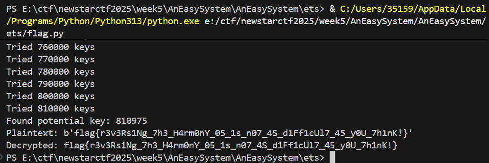

flag{r3v3Rs1Ng_7h3_H4rm0nY_05_1s_n07_4S_d1Ff1cUl7_45_y0U_7h1nK!}


### 3.河图洛书
一个用pyinstxtractor打包的程序，用的是py3.12

<!-- 这是一张图片，ocr 内容为： -->
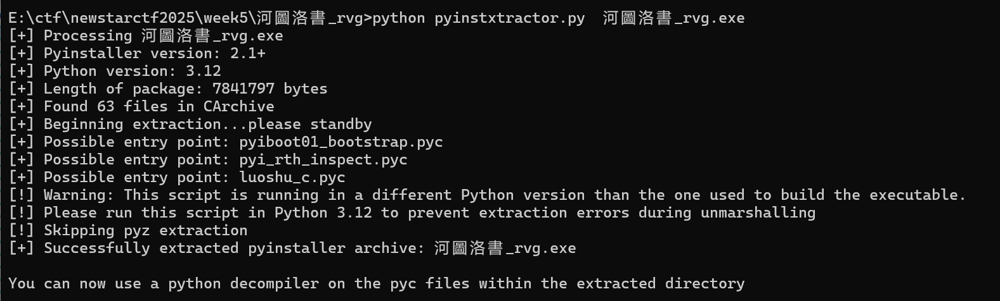

使用PyLingual来使pyc文件转为py文件

```python
# Decompiled with PyLingual (https://pylingual.io)
# Internal filename: luoshu_c.py
# Bytecode version: 3.12.0rc2 (3531)
# Source timestamp: 1970-01-01 00:00:00 UTC (0)

global input_buffer  # inserted
global stop_animation  # inserted
import sys
import os
import time
import random
import threading
import msvcrt
from colorama import init, Fore, Style
init()
magic_square = [[4, 9, 2], [3, 5, 7], [8, 1, 6]]
input_buffer = ''
stop_animation = False
COLOR_MAP = {1: Fore.RED + Style.BRIGHT, 2: Fore.GREEN + Style.BRIGHT, 3: Fore.BLUE + Style.BRIGHT, 4: Fore.YELLOW, 5: Fore.WHITE + Style.BRIGHT, 6: Fore.CYAN, 7: Fore.MAGENTA, 8: Fore.RED, 9: Fore.GREEN}

def clear_lines(n):
    for _ in range(n):
        sys.stdout.write('')
        sys.stdout.write('')
    sys.stdout.flush()

def goto_line(line):
    sys.stdout.write(f'[{line + 1};1H')

def clear_line():
    sys.stdout.write('')
    return

def print_magic_square():
    clear_lines(10)
    goto_line(0)
    top = '  ┌───┬───┬───┐'
    middle = '  ├───┼───┼───┤'
    bottom = '  └───┴───┴───┘'
    sys.stdout.write(top + '\n')
    for i in range(3):
        line = '  │'
        for j in range(3):
            num = magic_square[i][j]
            color = COLOR_MAP.get(num, Fore.WHITE)
            line += f' {color}{num}{Style.RESET_ALL} │'
        sys.stdout.write(line + '\n')
        if i < 2:
            sys.stdout.write(middle + '\n')
    sys.stdout.write(bottom + '\n')
    sys.stdout.write('\n')
    sys.stdout.flush()

def shift_row_left(row):
    magic_square[row] = magic_square[row][1:] + [magic_square[row][0]]

def shift_row_right(row):
    magic_square[row] = [magic_square[row][(-1)]] + magic_square[row][:(-1)]

def shift_col_up(col):
    t = magic_square[0][col]
    magic_square[0][col] = magic_square[1][col]
    magic_square[1][col] = magic_square[2][col]
    magic_square[2][col] = t

def shift_col_down(col):
    t = magic_square[2][col]
    magic_square[2][col] = magic_square[1][col]
    magic_square[1][col] = magic_square[0][col]
    magic_square[0][col] = t

def random_transform():
    op = random.randint(0, 3)
    idx = random.randint(0, 2)
    if op == 0:
        shift_row_left(idx)
    else:  # inserted
        if op == 1:
            shift_row_right(idx)
        else:  # inserted
            if op == 2:
                shift_col_up(idx)
            else:  # inserted
                shift_col_down(idx)

def animation_loop():
    while not stop_animation:
        time.sleep(0.5)
        if not stop_animation:
            random_transform()
            print_magic_square()
            goto_line(10)
            clear_line()
            sys.stdout.write(f'Input your flag: {input_buffer}')
            sys.stdout.flush()
if __name__ == '__main__':
    os.system('cls')
    for _ in range(12):
        print()
    goto_line(0)
    print_magic_square()
    goto_line(10)
    sys.stdout.write('Input your flag: ')
    sys.stdout.flush()
    target_hex = '490e0ad0374f2cdd126e5b184bf4e6da669a4cbea88fac916494edd90149809a7c92eec2e82ed3fca5812d9f69'
    anim_thread = threading.Thread(target=animation_loop, daemon=True)
    anim_thread.start()
    try:
            while True:
                if msvcrt.kbhit():
                    ch = msvcrt.getch()
                    if ch in {b'\n', b'\r'}:
                        if len(input_buffer)!= 45:
                            goto_line(11)
                            sys.stdout.write(Fore.RED + 'Length wrong!' + Style.RESET_ALL + '                              ')
                            sys.stdout.flush()
                            time.sleep(1.5)
                            goto_line(11)
                            clear_line()
                            goto_line(10)
                            clear_line()
                            sys.stdout.write(f'Input your flag: {input_buffer}')
                            sys.stdout.flush()
                finally:  # inserted
                    try:
                        import luo_shu
                        msg = input_buffer.encode()
                        key = b'LESCBCKEY'
                        iv = b'LESCBC_iv'
                        cipher = luo_shu.encrypt(msg, 1, key, iv)
                        result_hex = cipher.hex()
                except Exception as e:
                    else:  # inserted
                        goto_line(11)
                        if result_hex == target_hex:
                            sys.stdout.write(Fore.GREEN + 'Right flag! Congratulations!' + Style.RESET_ALL + '                    ')
                        else:  # inserted
                            sys.stdout.write(Fore.RED + 'Wrong flag! Try again.' + Style.RESET_ALL + '                         ')
                        sys.stdout.flush()
                        time.sleep(2)
                else:  # inserted
                    if ch == b'\x08':
                        if input_buffer:
                            input_buffer = input_buffer[:(-1)]
                            goto_line(10)
                            clear_line()
                            sys.stdout.write(f'Input your flag: {input_buffer}')
                            sys.stdout.flush()
                    else:  # inserted
                        if len(input_buffer) < 45:
                            char = ch.decode('ascii', errors='ignore')
                            if char and 32 <= ord(char) <= 126:
                                input_buffer += char
                                sys.stdout.write(char)
                                sys.stdout.flush()
            time.sleep(0.01)
        finally:  # inserted
            stop_animation = True
            anim_thread.join(timeout=0.1)
            print('\n')
    result_hex = ''
```

这里只有密文，密钥和IV，加密算法的具体实现没有，但看到导入了这个库

<!-- 这是一张图片，ocr 内容为： -->
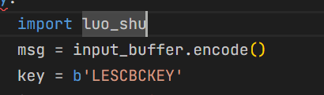

我们用IDA打开这个pyd文件，字符串中看到

<!-- 这是一张图片，ocr 内容为： -->


点进去，被调用在sub_180006008函数中

加密在sub_180001510函数中的这两个函数

<!-- 这是一张图片，ocr 内容为： -->
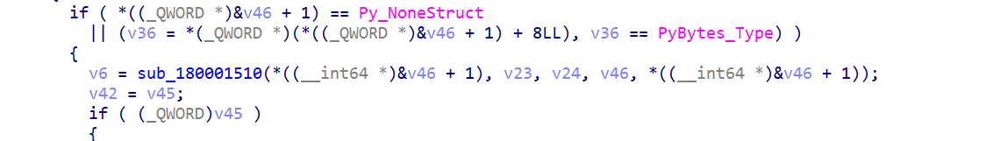

<!-- 这是一张图片，ocr 内容为： -->
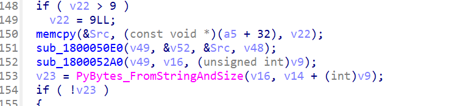

sub_1800050E0函数 把**轮密钥/状态表**造出来了  

<!-- 这是一张图片，ocr 内容为： -->
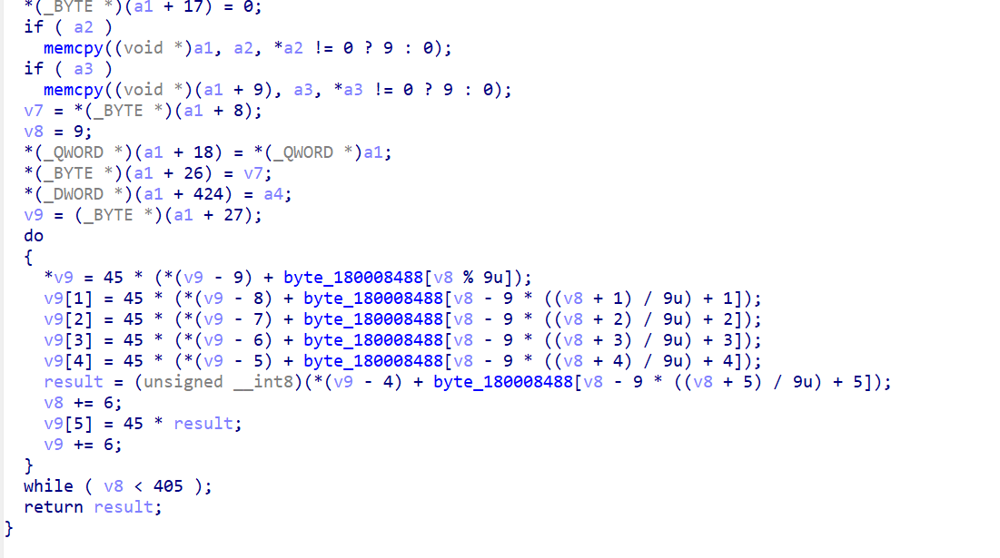

sub_1800052A0函数 真正的轮函数  

<!-- 这是一张图片，ocr 内容为： -->
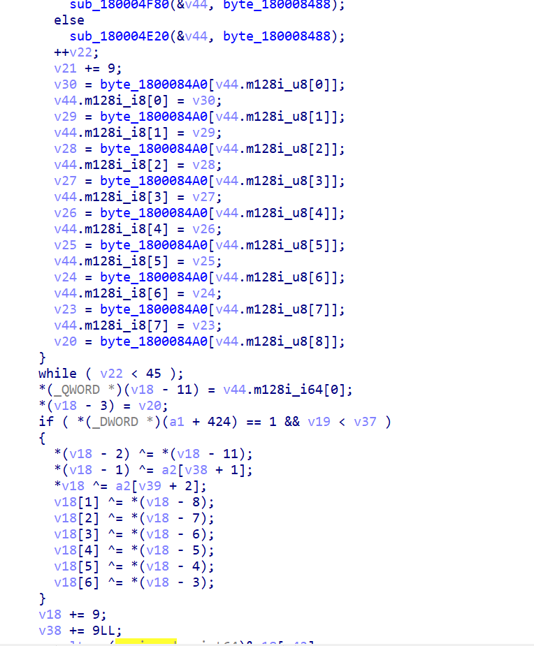

然后sub_180004E20和sub_180004F80函数

+ `E20`：对 9 个字节逐个 **左循环位移（ROL8）**，位数来自 `ptr[i] & 7`
+ `F80`：对 9 个字节逐个 **右循环位移（ROR8）**，位数也来自 `ptr[i] & 7`

重要的数据： byte_1800084A0[256]  和 byte_180008488[9]  

<!-- 这是一张图片，ocr 内容为： -->
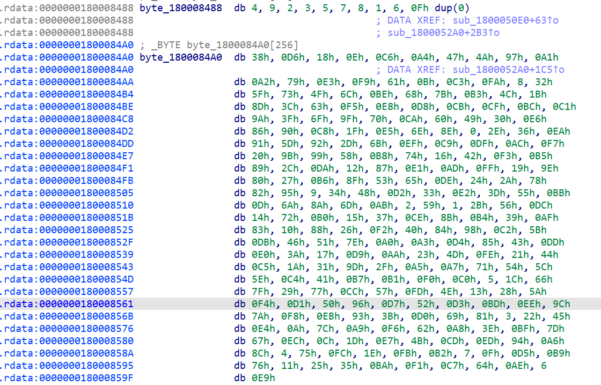

脚本，放在与luo_shu.pyd同目录下运行

```python
from typing import List

C9 = [4, 9, 2, 3, 5, 7, 8, 1, 6]   

SBOX = [
0x38,0xD6,0x18,0x0E,0xC6,0xA4,0x47,0x4A,0x97,0xA1,0xA2,0x79,0xE3,0xF9,0x61,0x0B,
0xC3,0xFA,0x08,0x32,0x5F,0x73,0x4F,0x6C,0xBE,0x68,0x7B,0xB3,0x4C,0x1B,0x8D,0x3C,
0x63,0xF5,0xE8,0xD8,0xCB,0xCF,0xBC,0xC1,0x9A,0x3F,0x6F,0x9F,0x70,0xCA,0x60,0x49,
0x30,0xE6,0x86,0x90,0xC8,0x1F,0xE5,0x6E,0x8E,0x00,0x2E,0x36,0xEA,0x91,0x5D,0x92,
0x2D,0x6B,0xEF,0xC9,0xDF,0xAC,0xF7,0x20,0x9B,0x99,0x58,0xB8,0x74,0x16,0x42,0xF3,
0xB5,0x89,0x2C,0xDA,0x12,0x87,0xE1,0xAD,0xFF,0x19,0x9E,0x80,0x27,0xB6,0x8F,0x53,
0x65,0xDE,0x24,0x2A,0x78,0x82,0x95,0x09,0x34,0x48,0xD2,0x33,0xE2,0x3D,0x55,0xBB,
0x0D,0x6A,0x8A,0x6D,0xAB,0x02,0x59,0x01,0x2B,0x56,0xDC,0x14,0x72,0xB0,0x15,0x37,
0xCE,0x8B,0xB4,0x39,0xAF,0x83,0x10,0x88,0x26,0xF2,0x40,0x84,0x98,0xC2,0x5B,0xDB,
0x46,0x51,0x7E,0xA0,0xA3,0xD4,0x85,0x43,0xDD,0xE0,0x3A,0x17,0xD9,0xAA,0x23,0x4D,
0xFE,0x21,0x44,0xC5,0x1A,0x31,0x9D,0x2F,0xA5,0xA7,0x71,0x54,0x5C,0x5E,0xC4,0x41,
0xB7,0xB1,0xF0,0xC0,0x05,0x1C,0x66,0x7F,0x29,0x77,0xCC,0x57,0xFD,0x4E,0x13,0x28,
0x5A,0xF4,0xD1,0x50,0x96,0xD7,0x52,0xD3,0xBD,0xEE,0x9C,0x7A,0xF8,0xEB,0x93,0x3B,
0xD0,0x69,0x81,0x03,0x22,0x45,0xE4,0x0A,0x7C,0xA9,0xF6,0x62,0xA8,0x3E,0xBF,0x7D,
0x67,0xEC,0x0C,0x1D,0xE7,0x4B,0xCD,0xED,0x94,0xA6,0x8C,0x04,0x75,0xFC,0x1E,0xFB,
0xB2,0x07,0x0F,0xD5,0xB9,0x76,0x11,0x25,0x35,0xBA,0xF1,0xC7,0x64,0xAE,0x06,0xE9
]
INV_SBOX = [0]*256
for i,v in enumerate(SBOX):
    INV_SBOX[v] = i

def rol8(x, r): r &= 7; x &= 0xFF; return ((x << r) | (x >> (8 - r))) & 0xFF
def ror8(x, r): r &= 7; x &= 0xFF; return ((x >> r) | (x << (8 - r))) & 0xFF

def E20(v9: List[int], ptr: List[int]):
    for i in range(9): v9[i] = rol8(v9[i], ptr[i] & 7)
def E20_inv(v9: List[int], ptr: List[int]):
    for i in range(9): v9[i] = ror8(v9[i], ptr[i] & 7)
def F80(v9: List[int], ptr: List[int]):
    for i in range(9): v9[i] = ror8(v9[i], ptr[i] & 7)
def F80_inv(v9: List[int], ptr: List[int]):
    for i in range(9): v9[i] = rol8(v9[i], ptr[i] & 7)

CONST9 = [4,9,2,3,5,7,8,1,6]

def xor_mix_inverse(v, Sbytes, Sm2, Sm1):
    t0,t1,t2,t3,t4,t5,t6,t7,t8 = v
    v3 = Sm2        ^ t0; v8 = Sm1        ^ t1
    v1 = Sbytes[0]  ^ t2; v2 = Sbytes[1]  ^ t3
    v4 = t4 ^ Sbytes[2]; v6 = Sbytes[3]  ^ t5; v7 = Sbytes[4]  ^ t6
    v0 = Sbytes[5]  ^ t7; v5 = Sbytes[6]  ^ t8
    return [v0,v1,v2,v3,v4,v5,v6,v7,v8]

def key_schedule(key9: bytes, iv9: bytes, mode: int) -> bytes:
    st = bytearray(432)
    if key9 and key9[0] != 0: st[0:9] = key9[:9]
    if iv9  and iv9[0]  != 0: st[9:18] = iv9[:9]
    st[18:27] = st[0:9]
    st[424:428] = mode.to_bytes(4, 'little')
    idx = 27
    for v in range(9, 405, 6):
        for t in range(6):
            k = (v + t) % 9
            st[idx] = (45 * ((st[idx-9] + C9[k]) & 0xFF)) & 0xFF
            idx += 1
    return bytes(st)

def decrypt_block(block: bytes, st: bytes) -> bytes:
    v = list(block)
    for rnd in range(44, -1, -1):
        v = [INV_SBOX[x] for x in v]
        if rnd % 2 == 0: E20_inv(v, C9)
        else:            F80_inv(v, C9)
        base = 20 + 9*rnd
        Sbytes = st[base : base+7]
        Sm2    = st[base-2]; Sm1 = st[base-1]
        v = xor_mix_inverse(v, Sbytes, Sm2, Sm1)
        ptr = [st[base-2 + i] for i in range(9)]
        if rnd % 2 == 0: F80_inv(v, ptr)
        else:            E20_inv(v, ptr)
        for i in range(9): v[i] ^= CONST9[i]
    return bytes(v)

def decrypt(cipher: bytes, key: bytes, iv: bytes, mode: int = 1) -> bytes:
    assert len(cipher) % 9 == 0
    st = key_schedule(key[:9], iv[:9], mode)
    nblocks = len(cipher) // 9
    blocks = [cipher[i*9:(i+1)*9] for i in range(nblocks)]
    plain_blocks = []
    for j in range(nblocks):
        X = decrypt_block(blocks[j], st)
        if mode == 1:
            if j == 0:
                X = bytes((X[i] ^ st[9+i]) & 0xFF for i in range(9))
            else:
                X = bytes((X[i] ^ blocks[j-1][i]) & 0xFF for i in range(9))
        plain_blocks.append(X)
    P = b"".join(plain_blocks)
    if P:
        pad = P[-1]
        if 1 <= pad <= 9 and P.endswith(bytes([pad])*pad):
            P = P[:-pad]
    return P

if __name__ == "__main__":
    target_hex = "490e0ad0374f2cdd126e5b184bf4e6da669a4cbea88fac916494edd90149809a7c92eec2e82ed3fca5812d9f69"
    C = bytes.fromhex(target_hex)
    KEY = b"LESCBCKEY"
    IV  = b"LESCBC_iv"
    P = decrypt(C, KEY, IV, mode=1)
    print("Plain (raw):", P)
    try:
        print("Plain (utf-8):", P.decode("utf-8"))
    except Exception:
        print("Plain (hex):", P.hex())

```

flag{7H3_Lu0_5hu_3nCrYP710n_1s_b10Ck_C1ph3R!}


### 4.魔法少女的秘密


### 5.Jvav Master
在运行该程序是提取出内置的jar包

准备环境，设置工作目录变量，后续命令都基于这个路径

```powershell
"$Workspace = 'e:\ctf\newstarctf2025\week5\Jvav_Master'"
```

拼出本地临时目录路径

```powershell
"$tmp = Join-Path $Workspace 'tmp'"
```

创建（或覆盖）临时目录，确保可写入

```powershell
"New-Item -ItemType Directory -Force -Path $tmp | Out-Null"
```

让 exe4j 和install4j将运行时临时文件写到你指定目录

```powershell
"$env:EXE4J_TEMPDIR = $tmp"
"$env:INSTALL4J_TEMPDIR = $tmp"

```

启用

```powershell
"$env:EXE4J_LOG = Join-Path $tmp 'exe4j.log'"
"$env:INSTALL4J_LOG = Join-Path $tmp 'install4j.log'"
```

启动程序以触发将内置资源解压到临时目录

```powershell
"$p = Start-Process -FilePath (Join-Path $Workspace 'Jvav_master.exe') -PassThru"
```

等待几秒让解压完成

```powershell
"Start-Sleep -Seconds 3"
```

停止主进程，避免继续运行占用资源

```powershell
"if ($p -and !$p.HasExited) { Stop-Process -Id $p.Id -Force }"
```

在目录下看到

<!-- 这是一张图片，ocr 内容为： -->
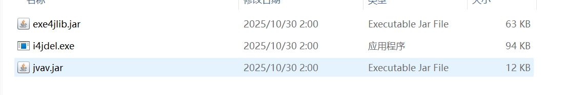

把jvav.jar包改为zip打开

main.class

```java
// Source code is decompiled from a .class file using FernFlower decompiler (from Intellij IDEA).
import java.util.Scanner;

public class Main {
   public Main() {
   }

   public static void main(String[] args) {
      Scanner scanner = new Scanner(System.in);
      System.out.print("please input your key: ");
      String keyStr = scanner.nextLine();
      byte[] key = keyStr.getBytes();
      if (!KeyChecker.checkKey(key)) {
         System.out.println("wrong key!");
      } else {
         System.out.print("please input your flag: ");
         String plainText = scanner.nextLine();
         byte[] encrypted = RC4.encrypt(plainText.getBytes(), key);
         if (encrypted.length != 48) {
            System.out.println("wrong flag!");
         } else {
            if (FlagChecker.Checker(encrypted)) {
               System.out.println("right flag!");
            } else {
               System.out.println("wrong flag!");
            }

         }
      }
   }
}

```

rc4.class

```java
// Source code is decompiled from a .class file using FernFlower decompiler (from Intellij IDEA).
public class RC4 {
   public RC4() {
   }

   public static byte[] encrypt(byte[] plaintext, byte[] key) {
      int[] box = new int[256];

      int x;
      for(x = 0; x < 256; ++x) {
         box[x] = 255 - x ^ 131;
      }

      x = 0;

      int y;
      for(y = 0; y < 256; ++y) {
         x = (x + box[y] + key[(y + 72) % key.length]) % 256;
         int temp = box[y];
         box[y] = box[x];
         box[x] = temp;
      }

      x = 0;
      y = 0;
      byte[] output = new byte[plaintext.length];

      for(int i = 0; i < plaintext.length; ++i) {
         x = (x + 3) % 256;
         y = y - box[x] & 255;
         int temp = box[x];
         box[x] = box[y];
         box[y] = temp;
         int index = (box[x] ^ box[y]) % 256;
         output[i] = (byte)(plaintext[i] + box[index] ^ 119);
      }

      return output;
   }
}

```

keychecker.class

```java
// Source code is decompiled from a .class file using FernFlower decompiler (from Intellij IDEA).
public class KeyChecker {
   private static final byte[] MASK = "ABCDEFGHIJKLMNOPQRSTUVWXYZabcdefghijklmnopqrstuvwxyz0123456789+/".getBytes();
   private static final int[] TARGET = new int[]{107655, 99322, 95708, 87877, 85730, 80988, 72416, 76077, 74252, 70300, 68724, 68020, 63439, 53540, 51340, 42431, 37382, 28611, 25737, 18364, 9711, 9030};

   public KeyChecker() {
   }

   public static boolean checkKey(byte[] key) {
      if (key != null && key.length == 22) {
         for(int i = 0; i < 22; ++i) {
            long sum = 0L;
            int mask_i = MASK[i] & 255;

            for(int j = i; j < 22; ++j) {
               int mask_j = MASK[j] & 255;
               int key_j = key[j] & 255;
               int xor = (key_j ^ mask_i) & 255;
               sum += (long)xor * (long)mask_j;
            }

            if (sum != (long)TARGET[i]) {
               return false;
            }
         }

         return true;
      } else {
         return false;
      }
   }

   public static void main(String[] args) {
      byte[] testKey = new byte[22];
      System.out.println("Check result: " + checkKey(testKey));
   }
}

```

flagchecker.class

```java
// Source code is decompiled from a .class file using FernFlower decompiler (from Intellij IDEA).
public class FlagChecker {
   public FlagChecker() {
   }

   public static String bytesToHex(byte[] bytes) {
      StringBuilder sb = new StringBuilder();
      byte[] var2 = bytes;
      int var3 = bytes.length;

      for(int var4 = 0; var4 < var3; ++var4) {
         byte b = var2[var4];
         sb.append(String.format("%02x", b & 255));
      }

      return sb.toString();
   }

   public static int random(int seed) {
      int x = seed ^ seed << 19 & -119793247;
      x ^= x >>> 1 | 469912079;
      x ^= x << 9 ^ 663526098;
      x ^= x >>> 8 & -886859118;
      x ^= x << 10 | 846897082;
      return x ^ 592136849;
   }

   public static byte rol(byte b, int shift) {
      shift &= 7;
      int unsigned = b & 255;
      return (byte)((unsigned << shift | unsigned >> 8 - shift) & 255);
   }

   public static byte ror(byte b, int shift) {
      shift &= 7;
      int unsigned = b & 255;
      return (byte)((unsigned >> shift | unsigned << 8 - shift) & 255);
   }

   public static boolean Checker(byte[] data) {
      byte[] opcode = new byte[3];
      byte[] results = new byte[48];
      int i = 0;

      while(true) {
         getInstruction(random(i), opcode);
         int idx;
         int param;
         if (opcode[0] == -1) {
            byte[] var8 = results;
            idx = results.length;

            for(param = 0; param < idx; ++param) {
               byte result = var8[param];
               if (result == -1) {
                  return false;
               }
            }

            return true;
         }

         int op = opcode[0] & 255;
         idx = opcode[1] & 255;
         param = opcode[2] & 255;
         switch (op) {
            case 1:
               data[idx] = (byte)(data[idx] + param & 255);
               break;
            case 2:
               data[idx] = (byte)(data[idx] - param & 255);
               break;
            case 3:
               data[idx] = (byte)((data[idx] ^ param) & 255);
               break;
            case 4:
               data[idx] = rol(data[idx], param);
               break;
            case 5:
               data[idx] = ror(data[idx], param);
               break;
            case 204:
               results[idx] = (byte)(data[idx] == (byte)param ? -52 : -1);
         }

         ++i;
      }
   }

   public static void getInstruction(int index, byte[] opcode) {
      switch (index) {
         case -2105780347:
            opcode[0] = 4;
            opcode[1] = 23;
            opcode[2] = 5;
            break;
         case -2105778303:
            opcode[0] = 5;
            opcode[1] = 12;
            opcode[2] = 4;
            break;
         case -2097301675:
            opcode[0] = 1;
            opcode[1] = 41;
            opcode[2] = -76;
            break;
         case -2097299631:
            opcode[0] = 2;
            opcode[1] = 33;
            opcode[2] = 121;
            break;
         case -2088921243:
            opcode[0] = 1;
            opcode[1] = 32;
            opcode[2] = 47;
            break;
         case -2088919199:
            opcode[0] = 5;
            opcode[1] = 8;
            opcode[2] = 6;
            break;
         case -2080606283:
            opcode[0] = 2;
            opcode[1] = 3;
            opcode[2] = -97;
            break;
         case -2080604239:
            opcode[0] = -52;
            opcode[1] = 41;
            opcode[2] = 53;
            break;
         case -2038638651:
            opcode[0] = -52;
            opcode[1] = 7;
            opcode[2] = -128;
            break;
         case -2038636607:
            opcode[0] = 5;
            opcode[1] = 8;
            opcode[2] = 5;
            break;
         case -2030225643:
            opcode[0] = -52;
            opcode[1] = 37;
            opcode[2] = 4;
            break;
         case -2030223599:
            opcode[0] = 3;
            opcode[1] = 9;
            opcode[2] = 82;
            break;
         case -2021845211:
            opcode[0] = 4;
            opcode[1] = 36;
            opcode[2] = 2;
            break;
         case -2021843167:
            opcode[0] = -52;
            opcode[1] = 46;
            opcode[2] = 51;
            break;
         case -1703914110:
            opcode[0] = 2;
            opcode[1] = 0;
            opcode[2] = 27;
            break;
         case -1703912058:
            opcode[0] = 3;
            opcode[1] = 17;
            opcode[2] = 103;
            break;
         case -1695435438:
            opcode[0] = 3;
            opcode[1] = 24;
            opcode[2] = -97;
            break;
         case -1695433386:
            opcode[0] = 4;
            opcode[1] = 21;
            opcode[2] = 5;
            break;
         case -1687055006:
            opcode[0] = 4;
            opcode[1] = 5;
            opcode[2] = 7;
            break;
         case -1687052954:
            opcode[0] = 5;
            opcode[1] = 12;
            opcode[2] = 3;
            break;
         case -1678740046:
            opcode[0] = 3;
            opcode[1] = 41;
            opcode[2] = -99;
            break;
         case -1678737994:
            opcode[0] = 1;
            opcode[1] = 29;
            opcode[2] = -116;
            break;
         case -1636772414:
            opcode[0] = -52;
            opcode[1] = 30;
            opcode[2] = -7;
            break;
         case -1636770362:
            opcode[0] = 2;
            opcode[1] = 7;
            opcode[2] = 30;
            break;
         case -1628359406:
            opcode[0] = 4;
            opcode[1] = 1;
            opcode[2] = 1;
            break;
         case -1628357354:
            opcode[0] = 2;
            opcode[1] = 37;
            opcode[2] = -117;
            break;
         case -1619978974:
            opcode[0] = 2;
            opcode[1] = 46;
            opcode[2] = -103;
            break;
         case -1619976922:
            opcode[0] = 4;
            opcode[1] = 40;
            opcode[2] = 1;
            break;
         case -1435971188:
            opcode[0] = 5;
            opcode[1] = 19;
            opcode[2] = 4;
            break;
         case -1435969144:
            opcode[0] = 1;
            opcode[1] = 22;
            opcode[2] = -84;
            break;
         case -1427558052:
            opcode[0] = 5;
            opcode[1] = 19;
            opcode[2] = 4;
            break;
         case -1427556008:
            opcode[0] = 3;
            opcode[1] = 13;
            opcode[2] = -68;
            break;
         case -1419177620:
            opcode[0] = 2;
            opcode[1] = 41;
            opcode[2] = -123;
            break;
         case -1419175576:
            opcode[0] = 1;
            opcode[1] = 46;
            opcode[2] = 39;
            break;
         case -1410797124:
            opcode[0] = 5;
            opcode[1] = 42;
            opcode[2] = 7;
            break;
         case -1410795080:
            opcode[0] = 2;
            opcode[1] = 15;
            opcode[2] = -45;
            break;
         case -1368895028:
            opcode[0] = 2;
            opcode[1] = 27;
            opcode[2] = -57;
            break;
         case -1368892984:
            opcode[0] = 2;
            opcode[1] = 38;
            opcode[2] = -19;
            break;
         case -1360416484:
            opcode[0] = 4;
            opcode[1] = 39;
            opcode[2] = 5;
            break;
         case -1360414440:
            opcode[0] = -52;
            opcode[1] = 4;
            opcode[2] = 12;
            break;
         case -1352036052:
            opcode[0] = 4;
            opcode[1] = 4;
            opcode[2] = 5;
            break;
         case -1352034008:
            opcode[0] = -52;
            opcode[1] = 21;
            opcode[2] = 20;
            break;
         case -1343720964:
            opcode[0] = 3;
            opcode[1] = 25;
            opcode[2] = -25;
            break;
         case -1343718920:
            opcode[0] = 4;
            opcode[1] = 15;
            opcode[2] = 2;
            break;
         case -1302015093:
            opcode[0] = 3;
            opcode[1] = 22;
            opcode[2] = 84;
            break;
         case -1302013041:
            opcode[0] = 3;
            opcode[1] = 13;
            opcode[2] = -95;
            break;
         case -1293601957:
            opcode[0] = 2;
            opcode[1] = 12;
            opcode[2] = 27;
            break;
         case -1293599905:
            opcode[0] = 5;
            opcode[1] = 14;
            opcode[2] = 4;
            break;
         case -1285221525:
            opcode[0] = 3;
            opcode[1] = 5;
            opcode[2] = 124;
            break;
         case -1285219473:
            opcode[0] = 5;
            opcode[1] = 0;
            opcode[2] = 5;
            break;
         case -1276841029:
            opcode[0] = 2;
            opcode[1] = 28;
            opcode[2] = 16;
            break;
         case -1276838977:
            opcode[0] = -52;
            opcode[1] = 42;
            opcode[2] = 58;
            break;
         case -1234938933:
            opcode[0] = -52;
            opcode[1] = 38;
            opcode[2] = 93;
            break;
         case -1234936881:
            opcode[0] = -52;
            opcode[1] = 27;
            opcode[2] = -27;
            break;
         case -1226460389:
            opcode[0] = 5;
            opcode[1] = 7;
            opcode[2] = 6;
            break;
         case -1226458337:
            opcode[0] = 4;
            opcode[1] = 20;
            opcode[2] = 4;
            break;
         case -1218079957:
            opcode[0] = 5;
            opcode[1] = 32;
            opcode[2] = 4;
            break;
         case -1218077905:
            opcode[0] = 4;
            opcode[1] = 6;
            opcode[2] = 3;
            break;
         case -1209764869:
            opcode[0] = -52;
            opcode[1] = 15;
            opcode[2] = -119;
            break;
         case -1209762817:
            opcode[0] = -52;
            opcode[1] = 25;
            opcode[2] = -97;
            break;
         case -1038342243:
            opcode[0] = 5;
            opcode[1] = 20;
            opcode[2] = 6;
            break;
         case -1038340199:
            opcode[0] = -52;
            opcode[1] = 17;
            opcode[2] = 49;
            break;
         case -1029847219:
            opcode[0] = 3;
            opcode[1] = 36;
            opcode[2] = 114;
            break;
         case -1029845175:
            opcode[0] = 5;
            opcode[1] = 40;
            opcode[2] = 4;
            break;
         case -1021450371:
            opcode[0] = 1;
            opcode[1] = 11;
            opcode[2] = 109;
            break;
         case -1021448327:
            opcode[0] = 3;
            opcode[1] = 27;
            opcode[2] = -88;
            break;
         case -1013184595:
            opcode[0] = 3;
            opcode[1] = 39;
            opcode[2] = -54;
            break;
         case -1013182551:
            opcode[0] = 2;
            opcode[1] = 35;
            opcode[2] = 74;
            break;
         case -971200547:
            opcode[0] = -52;
            opcode[1] = 9;
            opcode[2] = 81;
            break;
         case -971198503:
            opcode[0] = -52;
            opcode[1] = 31;
            opcode[2] = 58;
            break;
         case -962771187:
            opcode[0] = 3;
            opcode[1] = 33;
            opcode[2] = 126;
            break;
         case -962769143:
            opcode[0] = 2;
            opcode[1] = 34;
            opcode[2] = -84;
            break;
         case -954374339:
            opcode[0] = 2;
            opcode[1] = 34;
            opcode[2] = -59;
            break;
         case -954372295:
            opcode[0] = 4;
            opcode[1] = 36;
            opcode[2] = 7;
            break;
         case -636476006:
            opcode[0] = 3;
            opcode[1] = 17;
            opcode[2] = -25;
            break;
         case -636473954:
            opcode[0] = 4;
            opcode[1] = 6;
            opcode[2] = 5;
            break;
         case -627980982:
            opcode[0] = 3;
            opcode[1] = 42;
            opcode[2] = 93;
            break;
         case -627978930:
            opcode[0] = 1;
            opcode[1] = 10;
            opcode[2] = 38;
            break;
         case -619584134:
            opcode[0] = 5;
            opcode[1] = 7;
            opcode[2] = 4;
            break;
         case -619582082:
            opcode[0] = 5;
            opcode[1] = 32;
            opcode[2] = 2;
            break;
         case -611318358:
            opcode[0] = 3;
            opcode[1] = 27;
            opcode[2] = 118;
            break;
         case -611316306:
            opcode[0] = 4;
            opcode[1] = 5;
            opcode[2] = 7;
            break;
         case -569334310:
            opcode[0] = 2;
            opcode[1] = 31;
            opcode[2] = 83;
            break;
         case -569332258:
            opcode[0] = 5;
            opcode[1] = 9;
            opcode[2] = 3;
            break;
         case -560904950:
            opcode[0] = -52;
            opcode[1] = 3;
            opcode[2] = 89;
            break;
         case -560902898:
            opcode[0] = 1;
            opcode[1] = 25;
            opcode[2] = 79;
            break;
         case -552508102:
            opcode[0] = 4;
            opcode[1] = 44;
            opcode[2] = 6;
            break;
         case -552506050:
            opcode[0] = -52;
            opcode[1] = 10;
            opcode[2] = -95;
            break;
         case -368533100:
            opcode[0] = 2;
            opcode[1] = 2;
            opcode[2] = -77;
            break;
         case -368531056:
            opcode[0] = 2;
            opcode[1] = 22;
            opcode[2] = -96;
            break;
         case -360103612:
            opcode[0] = 5;
            opcode[1] = 2;
            opcode[2] = 5;
            break;
         case -360101568:
            opcode[0] = 5;
            opcode[1] = 34;
            opcode[2] = 2;
            break;
         case -351706764:
            opcode[0] = 5;
            opcode[1] = 43;
            opcode[2] = 1;
            break;
         case -351704720:
            opcode[0] = 3;
            opcode[1] = 35;
            opcode[2] = 4;
            break;
         case -343375452:
            opcode[0] = 5;
            opcode[1] = 47;
            opcode[2] = 6;
            break;
         case -343373408:
            opcode[0] = 1;
            opcode[1] = 6;
            opcode[2] = 12;
            break;
         case -301456940:
            opcode[0] = 5;
            opcode[1] = 18;
            opcode[2] = 7;
            break;
         case -301454896:
            opcode[0] = -52;
            opcode[1] = 23;
            opcode[2] = -51;
            break;
         case -292962044:
            opcode[0] = -52;
            opcode[1] = 36;
            opcode[2] = -106;
            break;
         case -292960000:
            opcode[0] = 5;
            opcode[1] = 33;
            opcode[2] = 7;
            break;
         case -284565196:
            opcode[0] = -52;
            opcode[1] = 35;
            opcode[2] = -37;
            break;
         case -284563152:
            opcode[0] = 4;
            opcode[1] = 28;
            opcode[2] = 2;
            break;
         case -276299292:
            opcode[0] = 2;
            opcode[1] = 45;
            opcode[2] = 88;
            break;
         case -276297248:
            opcode[0] = 1;
            opcode[1] = 0;
            opcode[2] = 54;
            break;
         case -234577005:
            opcode[0] = 1;
            opcode[1] = 15;
            opcode[2] = -64;
            break;
         case -234574953:
            opcode[0] = 4;
            opcode[1] = 35;
            opcode[2] = 5;
            break;
         case -226147517:
            opcode[0] = 2;
            opcode[1] = 4;
            opcode[2] = -58;
            break;
         case -226145465:
            opcode[0] = 2;
            opcode[1] = 4;
            opcode[2] = -51;
            break;
         case -217750669:
            opcode[0] = 4;
            opcode[1] = 35;
            opcode[2] = 5;
            break;
         case -217748617:
            opcode[0] = 5;
            opcode[1] = 26;
            opcode[2] = 5;
            break;
         case -209419357:
            opcode[0] = 5;
            opcode[1] = 8;
            opcode[2] = 4;
            break;
         case -209417305:
            opcode[0] = 1;
            opcode[1] = 15;
            opcode[2] = -75;
            break;
         case -167500845:
            opcode[0] = 1;
            opcode[1] = 9;
            opcode[2] = -109;
            break;
         case -167498793:
            opcode[0] = -52;
            opcode[1] = 18;
            opcode[2] = -41;
            break;
         case -159005949:
            opcode[0] = 4;
            opcode[1] = 23;
            opcode[2] = 5;
            break;
         case -159003897:
            opcode[0] = 5;
            opcode[1] = 16;
            opcode[2] = 2;
            break;
         case -150609101:
            opcode[0] = 4;
            opcode[1] = 26;
            opcode[2] = 5;
            break;
         case -150607049:
            opcode[0] = 5;
            opcode[1] = 31;
            opcode[2] = 2;
            break;
         case -142343197:
            opcode[0] = -52;
            opcode[1] = 0;
            opcode[2] = 59;
            break;
         case -142341145:
            opcode[0] = -52;
            opcode[1] = 45;
            opcode[2] = 120;
            break;
         case 37533589:
            opcode[0] = -52;
            opcode[1] = 2;
            opcode[2] = -31;
            break;
         case 37535633:
            opcode[0] = 5;
            opcode[1] = 21;
            opcode[2] = 5;
            break;
         case 45963077:
            opcode[0] = 5;
            opcode[1] = 12;
            opcode[2] = 3;
            break;
         case 45965121:
            opcode[0] = 4;
            opcode[1] = 36;
            opcode[2] = 2;
            break;
         case 54359925:
            opcode[0] = 3;
            opcode[1] = 17;
            opcode[2] = -127;
            break;
         case 54361969:
            opcode[0] = 3;
            opcode[1] = 46;
            opcode[2] = 26;
            break;
         case 62691237:
            opcode[0] = 1;
            opcode[1] = 37;
            opcode[2] = -21;
            break;
         case 62693281:
            opcode[0] = 3;
            opcode[1] = 9;
            opcode[2] = 112;
            break;
         case 104609749:
            opcode[0] = 1;
            opcode[1] = 23;
            opcode[2] = 127;
            break;
         case 104611793:
            opcode[0] = -52;
            opcode[1] = 14;
            opcode[2] = -90;
            break;
         case 113104645:
            opcode[0] = 1;
            opcode[1] = 29;
            opcode[2] = 96;
            break;
         case 113106689:
            opcode[0] = -52;
            opcode[1] = 40;
            opcode[2] = -108;
            break;
         case 121501493:
            opcode[0] = -52;
            opcode[1] = 5;
            opcode[2] = 92;
            break;
         case 121503537:
            opcode[0] = 4;
            opcode[1] = 25;
            opcode[2] = 7;
            break;
         case 129767397:
            opcode[0] = -52;
            opcode[1] = 43;
            opcode[2] = 68;
            break;
         case 129769441:
            opcode[0] = -52;
            opcode[1] = 1;
            opcode[2] = 98;
            break;
         case 439399826:
            opcode[0] = 3;
            opcode[1] = 38;
            opcode[2] = 94;
            break;
         case 439401878:
            opcode[0] = 3;
            opcode[1] = 2;
            opcode[2] = -43;
            break;
         case 447829314:
            opcode[0] = 2;
            opcode[1] = 42;
            opcode[2] = -35;
            break;
         case 447831366:
            opcode[0] = 1;
            opcode[1] = 28;
            opcode[2] = 54;
            break;
         case 456226162:
            opcode[0] = 1;
            opcode[1] = 25;
            opcode[2] = -27;
            break;
         case 456228214:
            opcode[0] = 1;
            opcode[1] = 24;
            opcode[2] = 74;
            break;
         case 464557474:
            opcode[0] = 5;
            opcode[1] = 33;
            opcode[2] = 7;
            break;
         case 464559526:
            opcode[0] = 1;
            opcode[1] = 30;
            opcode[2] = 15;
            break;
         case 506475986:
            opcode[0] = 1;
            opcode[1] = 14;
            opcode[2] = -47;
            break;
         case 506478038:
            opcode[0] = 5;
            opcode[1] = 38;
            opcode[2] = 7;
            break;
         case 514970882:
            opcode[0] = 4;
            opcode[1] = 40;
            opcode[2] = 4;
            break;
         case 514972934:
            opcode[0] = -52;
            opcode[1] = 16;
            opcode[2] = 51;
            break;
         case 523367730:
            opcode[0] = -52;
            opcode[1] = 26;
            opcode[2] = 75;
            break;
         case 523369782:
            opcode[0] = 1;
            opcode[1] = 5;
            opcode[2] = -12;
            break;
         case 531633634:
            opcode[0] = 3;
            opcode[1] = 1;
            opcode[2] = 33;
            break;
         case 531635686:
            opcode[0] = 5;
            opcode[1] = 43;
            opcode[2] = 1;
            break;
         case 707277212:
            opcode[0] = -52;
            opcode[1] = 12;
            opcode[2] = -17;
            break;
         case 707279256:
            opcode[0] = 2;
            opcode[1] = 16;
            opcode[2] = 88;
            break;
         case 715772236:
            opcode[0] = 5;
            opcode[1] = 44;
            opcode[2] = 1;
            break;
         case 715774280:
            opcode[0] = 2;
            opcode[1] = 45;
            opcode[2] = -100;
            break;
         case 724169084:
            opcode[0] = 4;
            opcode[1] = 39;
            opcode[2] = 5;
            break;
         case 724171128:
            opcode[0] = 2;
            opcode[1] = 16;
            opcode[2] = 34;
            break;
         case 732434860:
            opcode[0] = 3;
            opcode[1] = 24;
            opcode[2] = -110;
            break;
         case 732436904:
            opcode[0] = 5;
            opcode[1] = 31;
            opcode[2] = 7;
            break;
         case 774418908:
            opcode[0] = 5;
            opcode[1] = 8;
            opcode[2] = 4;
            break;
         case 774420952:
            opcode[0] = 4;
            opcode[1] = 22;
            opcode[2] = 2;
            break;
         case 782848268:
            opcode[0] = 5;
            opcode[1] = 47;
            opcode[2] = 6;
            break;
         case 782850312:
            opcode[0] = -52;
            opcode[1] = 33;
            opcode[2] = 57;
            break;
         case 791245116:
            opcode[0] = 3;
            opcode[1] = 45;
            opcode[2] = 118;
            break;
         case 791247160:
            opcode[0] = 3;
            opcode[1] = 44;
            opcode[2] = 32;
            break;
         case 841233307:
            opcode[0] = 3;
            opcode[1] = 6;
            opcode[2] = -24;
            break;
         case 841235359:
            opcode[0] = 1;
            opcode[1] = 27;
            opcode[2] = 119;
            break;
         case 849728331:
            opcode[0] = 1;
            opcode[1] = 16;
            opcode[2] = -81;
            break;
         case 849730383:
            opcode[0] = 5;
            opcode[1] = 10;
            opcode[2] = 3;
            break;
         case 858125179:
            opcode[0] = 4;
            opcode[1] = 1;
            opcode[2] = 1;
            break;
         case 858127231:
            opcode[0] = 1;
            opcode[1] = 37;
            opcode[2] = -19;
            break;
         case 866390955:
            opcode[0] = 3;
            opcode[1] = 3;
            opcode[2] = -71;
            break;
         case 866393007:
            opcode[0] = -52;
            opcode[1] = 24;
            opcode[2] = 21;
            break;
         case 908375003:
            opcode[0] = -52;
            opcode[1] = 22;
            opcode[2] = -82;
            break;
         case 908377055:
            opcode[0] = -52;
            opcode[1] = 8;
            opcode[2] = -35;
            break;
         case 916804363:
            opcode[0] = 3;
            opcode[1] = 3;
            opcode[2] = 21;
            break;
         case 916806415:
            opcode[0] = -52;
            opcode[1] = 47;
            opcode[2] = 87;
            break;
         case 925201211:
            opcode[0] = 1;
            opcode[1] = 11;
            opcode[2] = 27;
            break;
         case 925203263:
            opcode[0] = 4;
            opcode[1] = 10;
            opcode[2] = 5;
            break;
         case 1113376653:
            opcode[0] = 3;
            opcode[1] = 18;
            opcode[2] = 55;
            break;
         case 1113378697:
            opcode[0] = 5;
            opcode[1] = 43;
            opcode[2] = 1;
            break;
         case 1121789789:
            opcode[0] = 1;
            opcode[1] = 26;
            opcode[2] = 14;
            break;
         case 1121791833:
            opcode[0] = 5;
            opcode[1] = 29;
            opcode[2] = 1;
            break;
         case 1130170221:
            opcode[0] = 4;
            opcode[1] = 45;
            opcode[2] = 6;
            break;
         case 1130172265:
            opcode[0] = 3;
            opcode[1] = 2;
            opcode[2] = 56;
            break;
         case 1138550717:
            opcode[0] = 3;
            opcode[1] = 24;
            opcode[2] = 65;
            break;
         case 1138552761:
            opcode[0] = -52;
            opcode[1] = 19;
            opcode[2] = -38;
            break;
         case 1180452813:
            opcode[0] = -52;
            opcode[1] = 29;
            opcode[2] = 40;
            break;
         case 1180454857:
            opcode[0] = -52;
            opcode[1] = 44;
            opcode[2] = -59;
            break;
         case 1188931357:
            opcode[0] = 3;
            opcode[1] = 4;
            opcode[2] = 108;
            break;
         case 1188933401:
            opcode[0] = -52;
            opcode[1] = 13;
            opcode[2] = -42;
            break;
         case 1197311789:
            opcode[0] = 4;
            opcode[1] = 21;
            opcode[2] = 5;
            break;
         case 1197313833:
            opcode[0] = 4;
            opcode[1] = 14;
            opcode[2] = 1;
            break;
         case 1205626877:
            opcode[0] = -52;
            opcode[1] = 28;
            opcode[2] = 55;
            break;
         case 1205628921:
            opcode[0] = -52;
            opcode[1] = 39;
            opcode[2] = -91;
            break;
         case 1515242890:
            opcode[0] = 2;
            opcode[1] = 19;
            opcode[2] = 89;
            break;
         case 1515244942:
            opcode[0] = 2;
            opcode[1] = 20;
            opcode[2] = -44;
            break;
         case 1523656026:
            opcode[0] = 2;
            opcode[1] = 1;
            opcode[2] = -78;
            break;
         case 1523658078:
            opcode[0] = 3;
            opcode[1] = 46;
            opcode[2] = 60;
            break;
         case 1532036458:
            opcode[0] = 5;
            opcode[1] = 30;
            opcode[2] = 4;
            break;
         case 1532038510:
            opcode[0] = 4;
            opcode[1] = 43;
            opcode[2] = 4;
            break;
         case 1540416954:
            opcode[0] = 3;
            opcode[1] = 19;
            opcode[2] = -45;
            break;
         case 1540419006:
            opcode[0] = 3;
            opcode[1] = 40;
            opcode[2] = -20;
            break;
         case 1582319050:
            opcode[0] = 1;
            opcode[1] = 44;
            opcode[2] = -21;
            break;
         case 1582321102:
            opcode[0] = 2;
            opcode[1] = 29;
            opcode[2] = -18;
            break;
         case 1590797594:
            opcode[0] = 4;
            opcode[1] = 13;
            opcode[2] = 3;
            break;
         case 1590799646:
            opcode[0] = -52;
            opcode[1] = 20;
            opcode[2] = 1;
            break;
         case 1599178026:
            opcode[0] = -52;
            opcode[1] = 32;
            opcode[2] = -85;
            break;
         case 1599180078:
            opcode[0] = -52;
            opcode[1] = 6;
            opcode[2] = -15;
            break;
         case 1607493114:
            opcode[0] = 4;
            opcode[1] = 39;
            opcode[2] = 7;
            break;
         case 1607495166:
            opcode[0] = 3;
            opcode[1] = 28;
            opcode[2] = -14;
            break;
         case 1783120260:
            opcode[0] = 2;
            opcode[1] = 38;
            opcode[2] = 20;
            break;
         case 1783122304:
            opcode[0] = 4;
            opcode[1] = 47;
            opcode[2] = 5;
            break;
         case 1791598932:
            opcode[0] = 3;
            opcode[1] = 18;
            opcode[2] = -22;
            break;
         case 1791600976:
            opcode[0] = 2;
            opcode[1] = 3;
            opcode[2] = 32;
            break;
         case 1799979364:
            opcode[0] = 5;
            opcode[1] = 32;
            opcode[2] = 3;
            break;
         case 1799981408:
            opcode[0] = 5;
            opcode[1] = 42;
            opcode[2] = 3;
            break;
         case 1808294324:
            opcode[0] = 5;
            opcode[1] = 41;
            opcode[2] = 1;
            break;
         case 1808296368:
            opcode[0] = 4;
            opcode[1] = 10;
            opcode[2] = 7;
            break;
         case 1850261956:
            opcode[0] = 3;
            opcode[1] = 34;
            opcode[2] = -105;
            break;
         case 1850264000:
            opcode[0] = 4;
            opcode[1] = 0;
            opcode[2] = 3;
            break;
         case 1858674964:
            opcode[0] = 1;
            opcode[1] = 47;
            opcode[2] = -48;
            break;
         case 1858677008:
            opcode[0] = 2;
            opcode[1] = 11;
            opcode[2] = 45;
            break;
         case 1867055396:
            opcode[0] = 2;
            opcode[1] = 7;
            opcode[2] = 12;
            break;
         case 1867057440:
            opcode[0] = 5;
            opcode[1] = 31;
            opcode[2] = 6;
            break;
         case 1875436020:
            opcode[0] = -1;
            opcode[1] = 0;
            opcode[2] = 0;
            break;
         case 1917076355:
            opcode[0] = 1;
            opcode[1] = 23;
            opcode[2] = 85;
            break;
         case 1917078407:
            opcode[0] = 4;
            opcode[1] = 26;
            opcode[2] = 3;
            break;
         case 1925555027:
            opcode[0] = 4;
            opcode[1] = 17;
            opcode[2] = 7;
            break;
         case 1925557079:
            opcode[0] = 4;
            opcode[1] = 21;
            opcode[2] = 2;
            break;
         case 1933935459:
            opcode[0] = 2;
            opcode[1] = 13;
            opcode[2] = -28;
            break;
         case 1933937511:
            opcode[0] = 4;
            opcode[1] = 30;
            opcode[2] = 7;
            break;
         case 1942250419:
            opcode[0] = 4;
            opcode[1] = 18;
            opcode[2] = 6;
            break;
         case 1942252471:
            opcode[0] = 4;
            opcode[1] = 20;
            opcode[2] = 6;
            break;
         case 1984218051:
            opcode[0] = 2;
            opcode[1] = 30;
            opcode[2] = -39;
            break;
         case 1984220103:
            opcode[0] = -52;
            opcode[1] = 34;
            opcode[2] = -112;
            break;
         case 1992631059:
            opcode[0] = -52;
            opcode[1] = 11;
            opcode[2] = 49;
            break;
         case 1992633111:
            opcode[0] = 1;
            opcode[1] = 11;
            opcode[2] = 84;
            break;
         case 2001011491:
            opcode[0] = 4;
            opcode[1] = 37;
            opcode[2] = 5;
            break;
         case 2001013543:
            opcode[0] = 2;
            opcode[1] = 14;
            opcode[2] = 97;
      }

   }
}

```

key为 4r3_y0U_a_Jv4V_m4s73R?

密文为

```text
77a9c4b496ddd63beed5a78246abb1c097e27262e428f3e80f6da7cb4b5478c6dd4ae14d4ea467848422e8229609d30a

```

解密脚本

```java
from typing import List

MASK = b"ABCDEFGHIJKLMNOPQRSTUVWXYZabcdefghijklmnopqrstuvwxyz0123456789+/"
TARGET: List[int] = [
    107655, 99322, 95708, 87877, 85730, 80988, 72416, 76077, 74252, 70300,
    68724, 68020, 63439, 53540, 51340, 42431, 37382, 28611, 25737, 18364,
    9711, 9030
]


def solve_key_from_equations() -> bytes:
    # 与 1.py 相同的三角回代求解
    mask = list(MASK)
    key = [0] * 22
    for i in reversed(range(22)):
        s = TARGET[i]
        mi = mask[i]
        for j in range(i + 1, 22):
            s -= ((key[j] ^ mi) & 0xff) * mask[j]
        val = (s // mi) & 0xff
        key[i] = val ^ mi
    return bytes(key)


def keychecker_check(key: bytes) -> bool:
    if key is None or len(key) != 22:
        return False
    for i in range(22):
        mi = MASK[i] & 0xFF
        sm = 0
        for j in range(i, 22):
            mj = MASK[j] & 0xFF
            kj = key[j] & 0xFF
            x = (kj ^ mi) & 0xFF
            sm += x * mj
        if sm != TARGET[i]:
            return False
    return True


def main():
    key = solve_key_from_equations()
    print("Solved key:", key.decode('latin1'))
    print("Key hex:", key.hex())
    print("Length:", len(key))
    ok = keychecker_check(key)
    print("KeyChecker check:", ok)
    with open("key.txt", "wb") as f:
        f.write(key)
    print("Written to: key.txt")


if __name__ == "__main__":
    main()
```

flag{4r3_y0U_g0oD_a7_j4vA?I'm_V3rY_Go0d_47_JvaV}
