# 1.zerotwo的权限
 这是一个使用Jetpack Compose构建的Android CTF题目，核心验证逻辑在`CryptoValidator`类中。  

```python
用户输入(8位) → E(input) → 比较结果 → 返回code → 显示对应消息
```

 当 `E(input) == R()` 时，返回 `code = 1`，此时调用`F()`函数解密出真正的flag。  

 置换表  

+ `NP`: 半字节(4位)置换表
+ `NPinv`: NP的逆置换表，用于逆向解密

```python
NP = [0, 12, 5, 8, 1, 10, 2, 15, 14, 3, 11, 4, 9, 7, 6, 13]
NPinv = [0, 4, 6, 9, 11, 2, 14, 13, 3, 12, 5, 10, 1, 8, 15, 7]
```

 种子数组  

```python
rcSeed = [215, 31, 223, 184, 189, 157, 205, 105]
```

 加密的Flag密文  

```python
FC_HEX = "288EC0208CDB3A3CCC4BF6B5B2731E7E2B66096270417B26D9405A5607ACB471861DD07437A4F46F75600550"
```

 E函数对8字节输入进行6轮变换：  

 第1轮: 位置相关XOR  

```python
for i in range(8):
    out[i] = input[i] ^ ((i * 2 + 103) & 0xFF)
```

 第2轮: 循环左移  

```python
for i in range(8):
    out[i] = ((out[i] << 2) | (out[i] >> 6)) & 0xFF
```

 第3轮: 仿射变换  

```python
for i in range(8):
    temp = (out[i] - i*5 + 11) & 0xFF
    out[i] = (temp * 5 - 23) & 0xFF
```

 第4轮: 多重XOR  

```python
for i in range(8):
    k1 = (187 - i) & 0xFF
    k2 = (i * 3 + 68) & 0xFF
    k3 = (136 - i * 2) & 0xFF
    k4 = (i * 4 + 221) & 0xFF
    out[i] = out[i] ^ k1 ^ k2 ^ k3 ^ k4
```

 第5轮: 半字节置换与字节交换  

```python
for i in range(4):
    j = 7 - i  # 对称位置
    
    # 分离高低半字节
    hiT = (out[i] >> 4) & 0x0F
    loT = out[i] & 0x0F
    hiA = (out[j] >> 4) & 0x0F
    loA = out[j] & 0x0F
    
    # 使用NP表置换
    hiTp = NP[hiT]
    loTp = NP[loT]
    hiAp = NP[hiA]
    loAp = NP[loA]
    
    # 交叉组合
    out[i] = (hiTp << 4) | loAp
    out[j] = (hiAp << 4) | loTp
```

 第6轮: 复杂混淆与半字节旋转  

```python
for i in range(8):
    v = ((i + 119) ^ (out[i] - (i*i*2) % 256)) & 0xFF
    out[i] = ((v << 4) | (v >> 4)) & 0xFF
```


```python
#!/usr/bin/env python3
"""
PCTF EzAndroid CTF Challenge Solver
逆向工程Android加密算法以获取正确输入
"""

# 置换表
NP = [0, 12, 5, 8, 1, 10, 2, 15, 14, 3, 11, 4, 9, 7, 6, 13]

# 生成NP的逆置换表
NPinv = [0] * 16
for i in range(16):
    NPinv[NP[i]] = i

# rcSeed用于生成正确答案的目标值
rcSeed = [215, 31, 223, 184, 189, 157, 205, 105]


def R():
    """
    生成正确答案的加密目标值
    这是validate函数中code==1的条件
    """
    result = []
    for i in range(8):
        result.append(rcSeed[i] ^ ((i * 13 + 90) & 0xFF))
    return result


def E(s):
    """
    正向加密函数E(s) - 用于验证
    输入: 8字节字符串
    输出: 8字节加密结果
    """
    if len(s) != 8:
        return []
    
    out = [ord(c) for c in s]
    
    # 第1轮: XOR with position-dependent key
    for i in range(8):
        v = out[i] & 0xFF
        k = ((i * 2) + 103) & 0xFF
        out[i] = v ^ k
    
    # 第2轮: 循环左移2位
    for i in range(8):
        v = out[i] & 0xFF
        out[i] = ((v << 2) | (v >> 6)) & 0xFF
    
    # 第3轮: 仿射变换
    for i in range(8):
        v = out[i] & 0xFF
        out[i] = ((((v - (i * 5) + 11) & 0xFF) * 5) - 23) & 0xFF
    
    # 第4轮: 多重XOR
    for i in range(8):
        v = out[i] & 0xFF
        k1 = (187 - i) & 0xFF
        k2 = ((i * 3) + 68) & 0xFF
        k3 = (136 - (i * 2)) & 0xFF
        k4 = ((i * 4) + 221) & 0xFF
        out[i] = ((v ^ k1) ^ k2) ^ k3 ^ k4
    
    # 第5轮: 半字节置换与交换
    for i in range(4):
        j = 7 - i
        t = out[i] & 0xFF
        a = out[j] & 0xFF
        
        hiT = (t >> 4) & 0x0F
        loT = t & 0x0F
        hiA = (a >> 4) & 0x0F
        loA = a & 0x0F
        
        hiTp = NP[hiT]
        loTp = NP[loT]
        hiAp = NP[hiA]
        loAp = NP[loA]
        
        out[i] = (hiTp << 4) | loAp
        out[j] = (hiAp << 4) | loTp
    
    # 第6轮: 复杂变换和半字节旋转
    for i in range(8):
        v = (((i + 119) & 0xFF) ^ (((out[i] & 0xFF) - (((i * i) * 2) % 256)) & 0xFF)) & 0xFF
        out[i] = ((v << 4) | (v >> 4)) & 0xFF
    
    return out


def modinv(a, m):
    """计算a在模m下的乘法逆元"""
    # 使用扩展欧几里得算法
    def extended_gcd(a, b):
        if a == 0:
            return b, 0, 1
        gcd, x1, y1 = extended_gcd(b % a, a)
        x = y1 - (b // a) * x1
        y = x1
        return gcd, x, y
    
    gcd, x, _ = extended_gcd(a % m, m)
    if gcd != 1:
        return None
    return (x % m + m) % m


def inverse_E(target):
    """
    逆向E函数以找到原始输入
    输入: 8字节目标加密值
    输出: 8字节原始字符串
    """
    out = list(target)
    
    # 逆向第6轮
    for i in range(8):
        # 反向半字节旋转: 如果原来是 ((v << 4) | (v >> 4))
        # 那么逆操作也是 ((v << 4) | (v >> 4)) 因为它是自逆的
        out[i] = ((out[i] << 4) | (out[i] >> 4)) & 0xFF
        # 反向复杂变换: v = (i+119) ^ (out[i] - i*i*2)
        # 所以 out[i] = v ^ (i+119) + i*i*2
        out[i] = ((out[i] ^ ((i + 119) & 0xFF)) + (((i * i) * 2) % 256)) & 0xFF
    
    # 逆向第5轮: 半字节置换与交换
    # 原操作: out[i] = (NP[hiT] << 4) | NP[loA], out[j] = (NP[hiA] << 4) | NP[loT]
    # 逆操作需要恢复原始的t和a
    for i in range(4):
        j = 7 - i
        
        # 当前的out[i]和out[j]
        current_i = out[i] & 0xFF
        current_j = out[j] & 0xFF
        
        # 提取半字节
        hi_i = (current_i >> 4) & 0x0F
        lo_i = current_i & 0x0F
        hi_j = (current_j >> 4) & 0x0F
        lo_j = current_j & 0x0F
        
        # 应用NPinv反向置换
        # out[i] = (NP[hiT] << 4) | NP[loA]
        # 所以 hi_i = NP[hiT], lo_i = NP[loA]
        # 因此 hiT = NPinv[hi_i], loA = NPinv[lo_i]
        hiT_orig = NPinv[hi_i]
        loA_orig = NPinv[lo_i]
        hiA_orig = NPinv[hi_j]
        loT_orig = NPinv[lo_j]
        
        # 恢复原始的t和a
        t_orig = (hiT_orig << 4) | loT_orig
        a_orig = (hiA_orig << 4) | loA_orig
        
        out[i] = t_orig
        out[j] = a_orig
    
    # 逆向第4轮: 多重XOR (XOR是自逆的)
    for i in range(8):
        k1 = (187 - i) & 0xFF
        k2 = (i * 3 + 68) & 0xFF
        k3 = (136 - i * 2) & 0xFF
        k4 = (i * 4 + 221) & 0xFF
        out[i] = ((out[i] ^ k1) ^ k2) ^ k3 ^ k4
    
    # 逆向第3轮: 仿射变换
    # 原: out[i] = ((((v - i*5 + 11) & 0xFF) * 5) - 23) & 0xFF
    # 步骤: temp = (v - i*5 + 11) & 0xFF
    #       out[i] = (temp * 5 - 23) & 0xFF
    # 逆向: temp = (out[i] + 23) * modinv(5, 256) & 0xFF
    #       v = (temp + i*5 - 11) & 0xFF
    inv5 = modinv(5, 256)  # 计算5在模256下的逆元
    if inv5 is None:
        raise ValueError("5在模256下没有逆元")
    
    for i in range(8):
        temp = ((out[i] + 23) * inv5) & 0xFF
        out[i] = (temp + i * 5 - 11) & 0xFF
    
    # 逆向第2轮: 循环右移2位
    for i in range(8):
        out[i] = ((out[i] >> 2) | (out[i] << 6)) & 0xFF
    
    # 逆向第1轮: XOR (XOR是自逆的)
    for i in range(8):
        out[i] = out[i] ^ ((i * 2 + 103) & 0xFF)
    
    return bytes(out)


def brute_force_check():
    """暴力验证可打印ASCII范围"""
    target = R()
    print("\n[*] 尝试暴力搜索可打印ASCII字符...")
    
    # 只检查可打印ASCII (32-126)
    import itertools
    count = 0
    for combo in itertools.product(range(32, 127), repeat=8):
        count += 1
        if count % 1000000 == 0:
            print(f"    已检查: {count:,} 组合...")
        
        s = ''.join(chr(c) for c in combo)
        if E(s) == target:
            print(f"[✓] 找到答案: {s}")
            return s
        
        if count > 10000000:  # 限制搜索次数
            print("    搜索空间太大，停止暴力搜索")
            break
    
    return None


def main():
    print("=" * 60)
    print("PCTF EzAndroid CTF Challenge Solver")
    print("=" * 60)
    
    # 计算目标R()值
    target = R()
    print(f"\n[*] 目标加密值 R(): {target}")
    print(f"    十六进制: {' '.join(f'{b:02X}' for b in target)}")
    
    # 检查是否是kNearMiss
    kNearMiss = [61, 120, 171, 57, 51, 6, 101, 220]  # 从代码中提取,注意符号位
    kNearMiss_unsigned = [(b if b >= 0 else b + 256) for b in [-46, 101, 6, 51, 57, -85, 120, 61]]
    print(f"\n[*] kNearMiss值: {kNearMiss}")
    
    if target == kNearMiss:
        print("\n[!] 注意: R()生成的值等于kNearMiss!")
        print("    这意味着正确输入应该非常接近某个特定值")
    
    # 逆向求解
    print("\n[*] 开始逆向求解...")
    try:
        result = inverse_E(target)
        
        print(f"\n[+] 逆向得到的字节:")
        print(f"    字节数组: {list(result)}")
        print(f"    十六进制: {result.hex()}")
        
        # 检查是否全是可打印ASCII
        is_printable = all(32 <= b <= 126 for b in result)
        if is_printable:
            print(f"    ASCII: {result.decode('ascii')}")
        else:
            print(f"    [!] 包含不可打印字符: {[b for b in result if not (32 <= b <= 126)]}")
            print(f"    尝试解释: {result.decode('latin-1')}")
        
        # 验证结果
        print("\n[*] 验证结果...")
        if is_printable:
            encrypted = E(result.decode('ascii'))
        else:
            encrypted = E(result.decode('latin-1'))
        
        if encrypted == target:
            print("[✓] 验证成功! 加密结果匹配目标值")
            if is_printable:
                print(f"\n{'='*60}")
                print(f"正确答案: {result.decode('ascii')}")
                print(f"{'='*60}")
                print("\n[!] 在APP中输入上述答案,即可获得真正的flag!")
        else:
            print("[✗] 验证失败! 逆向算法存在错误")
            print(f"    期望: {target}")
            print(f"    得到: {encrypted}")
            print(f"    差异: {[target[i] - encrypted[i] for i in range(8)]}")
            
    except Exception as e:
        print(f"[✗] 逆向过程出错: {e}")
        import traceback
        traceback.print_exc()


if __name__ == "__main__":
    main()
```

<!-- 这是一张图片，ocr 内容为： -->
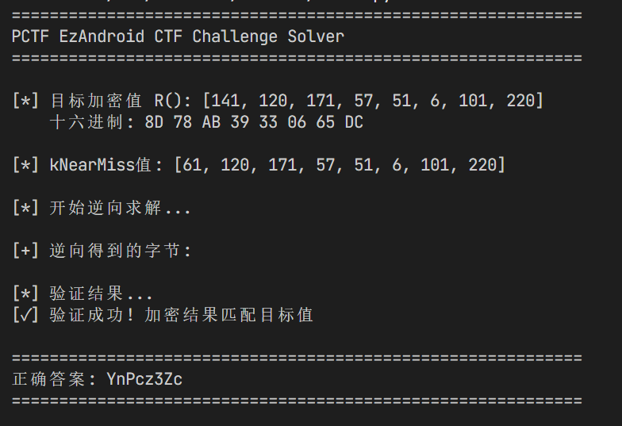

<!-- 这是一张图片，ocr 内容为： -->


PCTF{C0ngr4t5_0n_Cr4ck1ng_Th3_C0d3_YnPcz3Zc}


# 2.encrypt_system
用Die查看看到是用c#编写的

<!-- 这是一张图片，ocr 内容为： -->
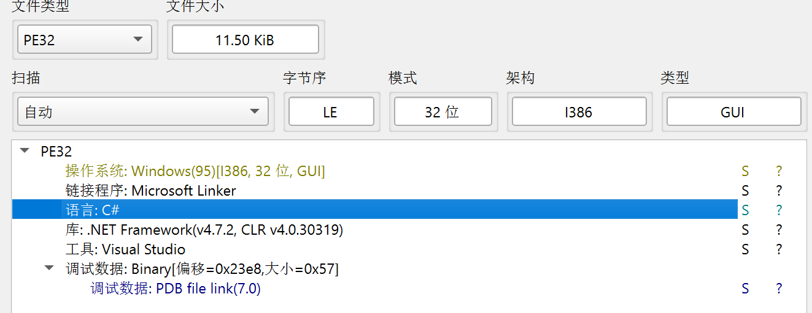

用dnspy反编译打开，找到相关函数

<!-- 这是一张图片，ocr 内容为： -->
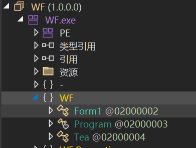

Form1里面写的是去文件后缀为.encrypt的文件进行解密

<!-- 这是一张图片，ocr 内容为： -->
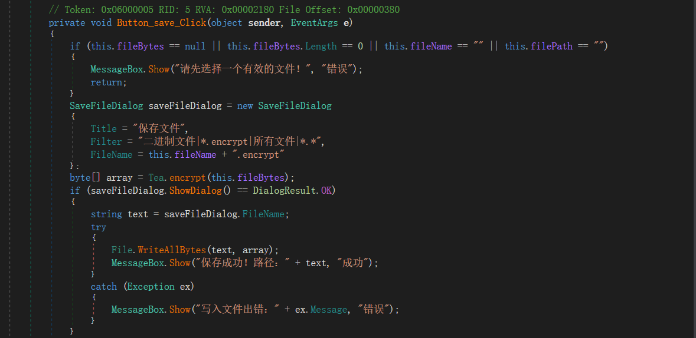

解密算法在TEA里

<!-- 这是一张图片，ocr 内容为： -->
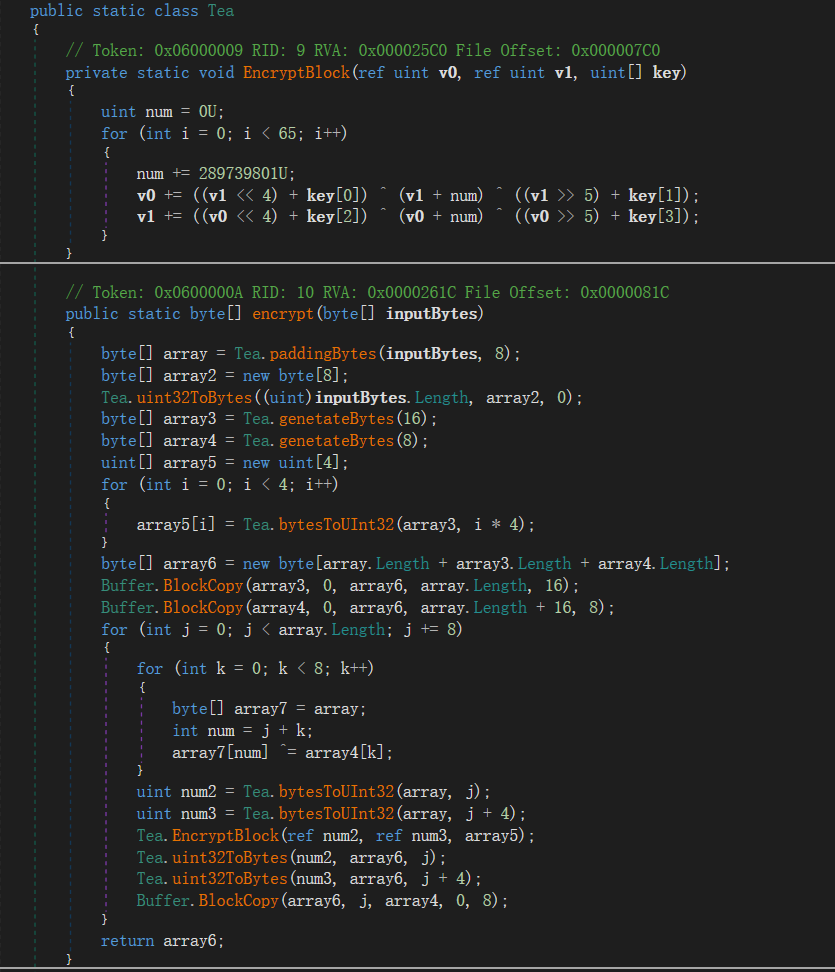

解密脚本

```python
import struct
import os

# --- 1. 定义魔改的 TEA 解密核心 ---
def decrypt_block(v0, v1, key):
    delta = 289739801
    rounds = 65

    
    sum_val = (delta * rounds) & 0xFFFFFFFF
    
    for _ in range(rounds):
     
        op1 = ((v0 << 4) + key[2]) & 0xFFFFFFFF
        op2 = (v0 + sum_val) & 0xFFFFFFFF
        op3 = ((v0 >> 5) + key[3]) & 0xFFFFFFFF
        v1 = (v1 - (op1 ^ op2 ^ op3)) & 0xFFFFFFFF
        
   
        op1 = ((v1 << 4) + key[0]) & 0xFFFFFFFF
        op2 = (v1 + sum_val) & 0xFFFFFFFF
        op3 = ((v1 >> 5) + key[1]) & 0xFFFFFFFF
        v0 = (v0 - (op1 ^ op2 ^ op3)) & 0xFFFFFFFF
        
        sum_val = (sum_val - delta) & 0xFFFFFFFF
        
    return v0, v1

# --- 2. 主解密逻辑 ---
def solve():
    filename = "flag.doc.encrypt"    
    if not os.path.exists(filename):
        print(f"找不到文件: {filename}")
        return

    with open(filename, "rb") as f:
        data = f.read()

    total_len = len(data)
    
    # 提取 Key 和 IV
    # Key 在倒数 24 字节开始，长 16 字节
    key_bytes = data[-24 : -8]
    # IV 在倒数 8 字节开始，长 8 字节
    iv_bytes = data[-8:]
    
    cipher_data = data[: -24]

    print(f"文件总大小: {total_len}")
    print(f"提取 Key: {key_bytes.hex()}")
    print(f"提取 IV : {iv_bytes.hex()}")

    # 将 Key 转换为 4 个 uint32 (Little Endian)
    key = struct.unpack("<4I", key_bytes)
    
    decrypted_bytes = bytearray()
    
   
    current_iv = list(iv_bytes) 
    
    # 8字节为一个块进行遍历
    for i in range(0, len(cipher_data), 8):
        block = cipher_data[i : i+8]
        if len(block) < 8:
            break 
            
        # 读取当前的密文块 v0, v1
        v0, v1 = struct.unpack("<2I", block)
        
        # 保存这个密文块，它将作为下一块解密的 IV
        next_iv = list(block)
        
        # 1. TEA 解密
        dec_v0, dec_v1 = decrypt_block(v0, v1, key)
        
        # 转回 bytes
        dec_block = struct.pack("<2I", dec_v0, dec_v1)
        dec_block_list = list(dec_block)
        
        # 2. CBC 异或 (与当前的 IV 异或)
        final_block = []
        for k in range(8):
            final_block.append(dec_block_list[k] ^ current_iv[k])
            
        decrypted_bytes.extend(final_block)
        
        # 更新 IV 为这一轮原本的密文
        current_iv = next_iv

    # 写入解密后的文件
    output_filename = "flag_decrypted.bin"
    with open(output_filename, "wb") as f:
        f.write(decrypted_bytes)
        
    print(f"\n解密完成! 保存为: {output_filename}")
    print("尝试以文本形式输出(可能包含乱码):")
    try:
        # 尝试去掉末尾的 padding (00)
        print(decrypted_bytes.rstrip(b'\x00').decode('utf-8', errors='ignore'))
    except:
        pass

if __name__ == "__main__":
    solve()
```

运行得到的是bin文件，改为doc文档

<!-- 这是一张图片，ocr 内容为： -->
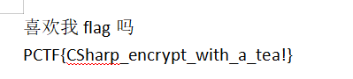

PCTF{CSharp_encrypt_with_a_tea!}


# 3.flag
<!-- 这是一张图片，ocr 内容为： -->
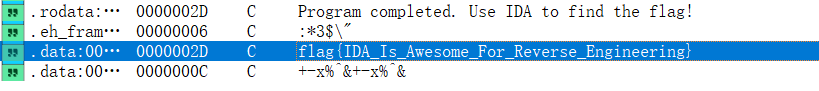

flag{IDA_Is_Awesome_For_Reverse_Engineering}


# 4.Base
验证函数，base64

<!-- 这是一张图片，ocr 内容为： -->
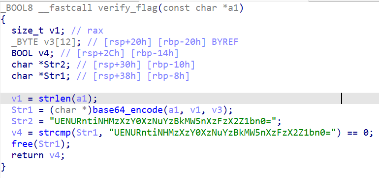[链接](about:blank)

cyberchef

<!-- 这是一张图片，ocr 内容为： -->
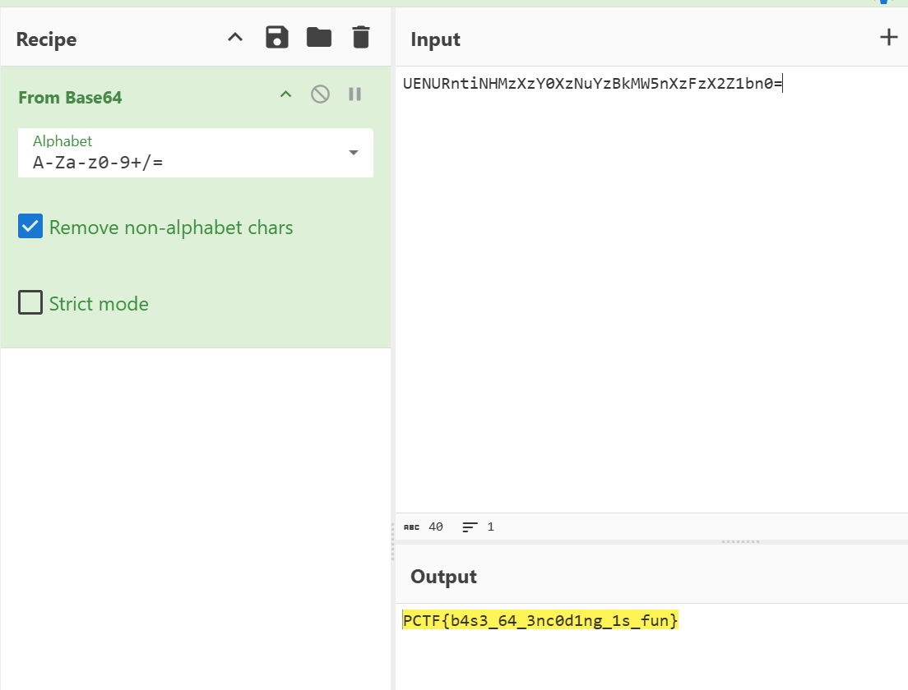

PCTF{b4s3_64_3nc0d1ng_1s_fun}


# 5.xor
循环异或

<!-- 这是一张图片，ocr 内容为： -->
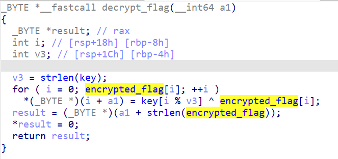

<!-- 这是一张图片，ocr 内容为： -->
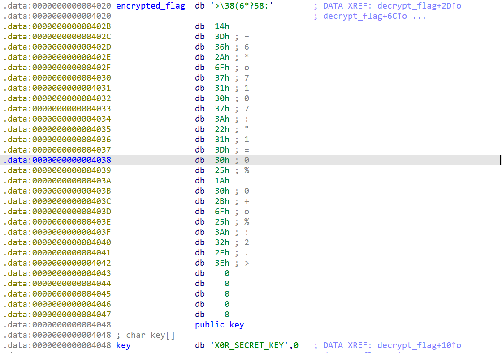

key

```python
X0R_SECRET_KEY
```

加密flag

```python
  0x3E, 0x5C, 0x33, 0x38, 0x28, 0x36, 0x2A, 0x3F, 0x35, 0x38, 
  0x3A, 0x14, 0x3D, 0x36, 0x2A, 0x6F, 0x37, 0x31, 0x30, 0x37, 
  0x3A, 0x22, 0x31, 0x3D, 0x30, 0x25, 0x1A, 0x30, 0x2B, 0x6F, 
  0x25, 0x3A, 0x32, 0x2E, 0x3E
```

脚本

```python
def decrypt_flag():
    ciphertext = [0x3E, 0x5C, 0x33, 0x38, 0x28,
                  0x36, 0x2A, 0x3F, 0x35, 0x38, 
                  0x3A, 0x14, 0x3D, 0x36, 0x2A, 
                  0x6F, 0x37, 0x31, 0x30, 0x37, 
                  0x3A, 0x22, 0x31, 0x3D, 0x30, 
                  0x25, 0x1A, 0x30, 0x2B, 0x6F, 
                  0x25, 0x3A, 0x32, 0x2E, 0x3E
                ]
    key = "X0R_SECRET_KEY"
    flag = ""
    for i in range(len(ciphertext)):
        cipher_byte = ciphertext[i]  
        key_byte = ord(key[i % len(key)])     
        decoded_char = chr(cipher_byte ^ key_byte)
        flag += decoded_char   
    print(f"Flag: {flag}")
if __name__ == "__main__":
    decrypt_flag()
```

flag{simple_xor_encryption_is_weak}


# 6.hard-apk
Jadx打开main函数，有native层，写了如何去把assets中TMP文件转换为dex文件的算法

<!-- 这是一张图片，ocr 内容为： -->
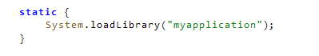

<!-- 这是一张图片，ocr 内容为： -->


<!-- 这是一张图片，ocr 内容为： -->
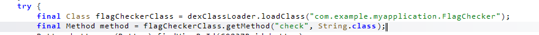

apktool反编译之后，用IDA打开libmyapplication.so， 梅森旋转算法（ 使用特定种子初始化随机数生成器，然后将生成的随机数与文件内容进行异或（XOR）  ）

<!-- 这是一张图片，ocr 内容为： -->
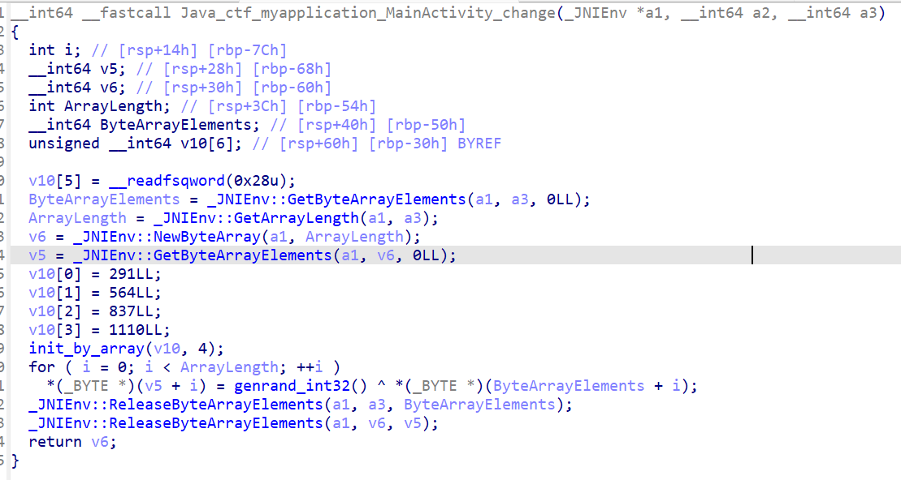

转换脚本

```c
#include <stdio.h>
#include <stdlib.h>

/* ================= MT19937 源码部分 (标准实现) ================= */
#define N 624
#define M 397
#define MATRIX_A 0x9908b0dfUL
#define UPPER_MASK 0x80000000UL
#define LOWER_MASK 0x7fffffffUL

static unsigned long mt[N];
static int mti=N+1;

void init_genrand(unsigned long s) {
    mt[0]= s & 0xffffffffUL;
    for (mti=1; mti<N; mti++) {
        mt[mti] = (1812433253UL * (mt[mti-1] ^ (mt[mti-1] >> 30)) + mti); 
        mt[mti] &= 0xffffffffUL;
    }
}

void init_by_array(unsigned long init_key[], int key_length) {
    int i, j, k;
    init_genrand(19650218UL);
    i=1; j=0;
    k = (N>key_length ? N : key_length);
    for (; k; k--) {
        mt[i] = (mt[i] ^ ((mt[i-1] ^ (mt[i-1] >> 30)) * 1664525UL)) + init_key[j] + j;
        mt[i] &= 0xffffffffUL;
        i++; j++;
        if (i>=N) { mt[0] = mt[N-1]; i=1; }
        if (j>=key_length) j=0;
    }
    for (k=N-1; k; k--) {
        mt[i] = (mt[i] ^ ((mt[i-1] ^ (mt[i-1] >> 30)) * 1566083941UL)) - i;
        mt[i] &= 0xffffffffUL;
        i++;
        if (i>=N) { mt[0] = mt[N-1]; i=1; }
    }
    mt[0] = 0x80000000UL;
}

unsigned long genrand_int32(void) {
    unsigned long y;
    static unsigned long mag01[2]={0x0UL, MATRIX_A};
    if (mti >= N) {
        int kk;
        if (mti == N+1) init_genrand(5489UL);
        for (kk=0;kk<N-M;kk++) {
            y = (mt[kk]&UPPER_MASK)|(mt[kk+1]&LOWER_MASK);
            mt[kk] = mt[kk+M] ^ (y >> 1) ^ mag01[y & 0x1UL];
        }
        for (;kk<N-1;kk++) {
            y = (mt[kk]&UPPER_MASK)|(mt[kk+1]&LOWER_MASK);
            mt[kk] = mt[kk+(M-N)] ^ (y >> 1) ^ mag01[y & 0x1UL];
        }
        y = (mt[N-1]&UPPER_MASK)|(mt[0]&LOWER_MASK);
        mt[N-1] = mt[M-1] ^ (y >> 1) ^ mag01[y & 0x1UL];
        mti = 0;
    }
    y = mt[mti++];
    y ^= (y >> 11);
    y ^= (y << 7) & 0x9d2c5680UL;
    y ^= (y << 15) & 0xefc60000UL;
    y ^= (y >> 18);
    return y;
}

/* ================= 主逻辑部分 ================= */

int main() {
    // 1. 设置种子
    unsigned long init_key[] = {291, 564, 837, 1110};
    int key_length = 4;
    init_by_array(init_key, key_length);

    // 2. 读取 TMP 文件
    FILE *fp_in = fopen("TMP", "rb");
    if (!fp_in) {
        printf("Error: Cannot open TMP file. Make sure it is in the same directory.\n");
        return 1;
    }

    // 获取文件大小
    fseek(fp_in, 0, SEEK_END);
    long file_size = ftell(fp_in);
    fseek(fp_in, 0, SEEK_SET);

    unsigned char *buffer = (unsigned char *)malloc(file_size);
    fread(buffer, 1, file_size, fp_in);
    fclose(fp_in);

    // 3. 解密过程 (XOR)
    for (int i = 0; i < file_size; i++) {
        // 注意：C代码中 genrand_int32() 产生的是 32位整数
        // 这里的 ^ 操作会自动截断取低8位，或者你可以显式写成 (unsigned char)genrand_int32()
        buffer[i] = buffer[i] ^ genrand_int32(); 
    }

    // 4. 写入输出文件 (solved.dex)
    FILE *fp_out = fopen("solved.dex", "wb");
    fwrite(buffer, 1, file_size, fp_out);
    fclose(fp_out);
    free(buffer);

    printf("Done! Decrypted to 'solved.dex'. Now open it in JADX.\n");
    return 0;
}
```

运行后，将生成的dex文件拖入jadx，按照之前提示的包路径打开函数

密文

<!-- 这是一张图片，ocr 内容为： -->
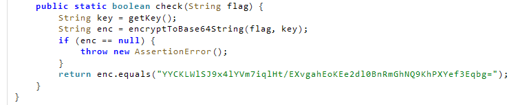

加密算法XXTEA

delta值：-1640531527

<!-- 这是一张图片，ocr 内容为： -->
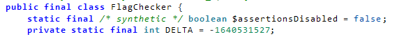

moMX函数

<!-- 这是一张图片，ocr 内容为： -->
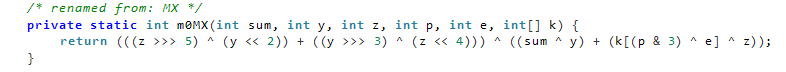

<!-- 这是一张图片，ocr 内容为： -->
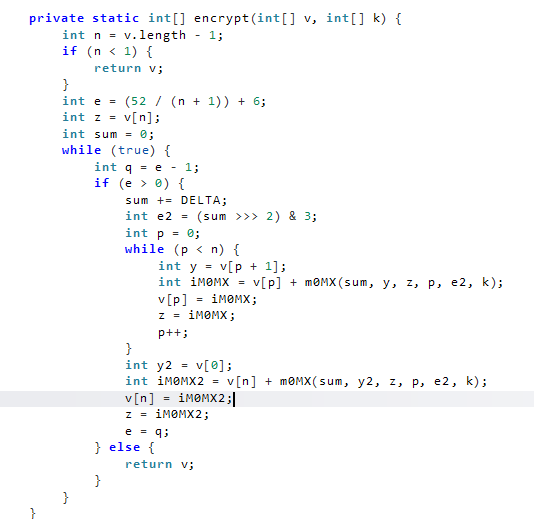

密文，加密算法，编码方式（base64）都已知，还差密钥，要去到另一个so库去查看

<!-- 这是一张图片，ocr 内容为： -->
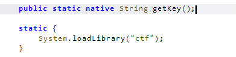

ida打开Java_com_tutdroid_FlagChecker_getKey，发现是混淆，我们去 JNI_OnLoad  函数 寻找 `**RegisterNatives**` 函数的调用  

<!-- 这是一张图片，ocr 内容为： -->
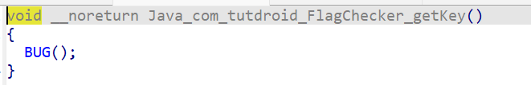

最后发现是sub_17F10函数注册

<!-- 这是一张图片，ocr 内容为： -->
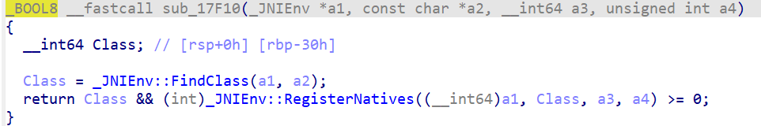

回退一步，可以看到

`**off_39EA0**`：指向 **类名字符串**。

`**off_39EB0**`：指向 `**JNINativeMethod**`** 数组**，**这里面藏着真正的函数地址**

<!-- 这是一张图片，ocr 内容为： -->
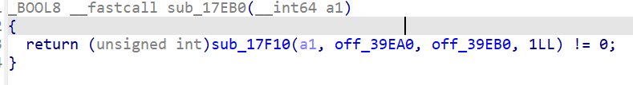

<!-- 这是一张图片，ocr 内容为： -->
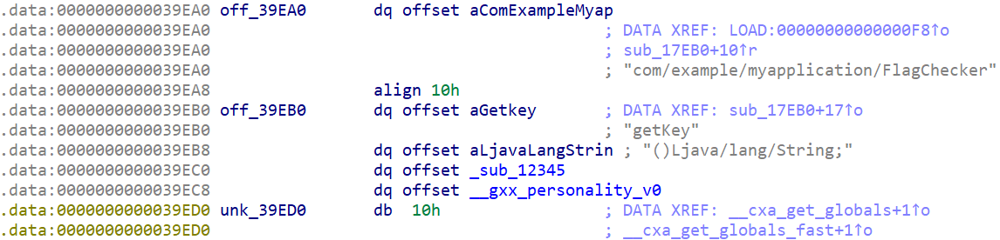

真正的get_key()就是sub_12345，AES_ECB加密，key是‘aNdR01d_s0_fUN!!’

<!-- 这是一张图片，ocr 内容为： -->
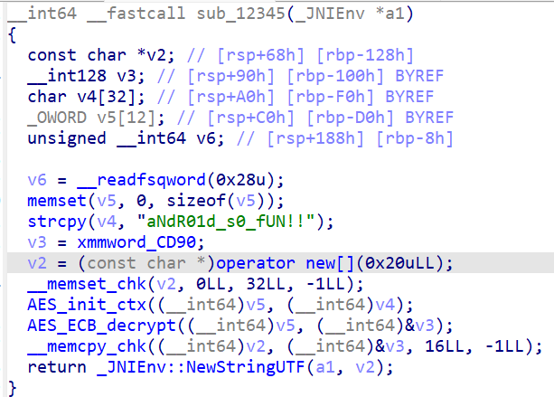

密文

<!-- 这是一张图片，ocr 内容为： -->
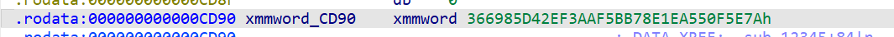

提取一下

<!-- 这是一张图片，ocr 内容为： -->
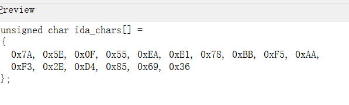

解密钥与解密文一体的脚本

```c
import struct
import base64
from Crypto.Cipher import AES

AES_CIPHER_HEX = "7A5E0F55EAE178BBF5AAF32ED4856936"

AES_KEY = b"aNdR01d_s0_fUN!!"

FLAG_CIPHER_B64 = "YYCKLWlSJ9x4lYVm7iqlHt/EXvgahEoKEe2dl0BnRmGhNQ9KhPXYef3Eqbg="

def decrypt_xxtea_key():
    try:
        cipher = AES.new(AES_KEY, AES.MODE_ECB)
        encrypted_bytes = bytes.fromhex(AES_CIPHER_HEX)
        decrypted_bytes = cipher.decrypt(encrypted_bytes)
        
        key_str = decrypted_bytes.decode('utf-8', errors='ignore').rstrip('\x00')
        print(f"成功解密 XXTEA Key: {key_str}")
        return key_str
    except Exception as e:
        print(f"AES 解密失败: {e}")
        return None

def xxtea_decrypt(data, key_str):
    _DELTA = 0x9E3779B9
    
    def _long2str(v, w):
        n = (len(v) - 1) << 2
        if w:
            m = v[-1]
            if (m < n - 3) or (m > n): return None
            n = m
        s = struct.pack('<%dI' % len(v), *v)
        return s[0:n] if w else s

    def _str2long(s, w):
        n = len(s)
        m = (4 - (n & 3)) & 3
        s = s + (b'\0' * m)
        v = list(struct.unpack('<%dI' % (len(s) // 4), s))
        if w: v.append(n)
        return v

    if not data: return data
    v = _str2long(data, False)
    key_bytes = key_str.encode('utf-8')
    k = _str2long(key_bytes.ljust(16, b'\0')[:16], False)
    
    n = len(v) - 1
    z = v[n]
    y = v[0]
    q = 6 + 52 // (n + 1)
    sum_val = (q * _DELTA) & 0xffffffff
    
    while sum_val != 0:
        e = (sum_val >> 2) & 3
        for p in range(n, 0, -1):
            z = v[p - 1]
            v[p] = (v[p] - (((z >> 5 ^ y << 2) + (y >> 3 ^ z << 4)) ^ ((sum_val ^ y) + (k[(p & 3) ^ e] ^ z)))) & 0xffffffff
            y = v[p]
        p = 0
        z = v[n]
        v[0] = (v[0] - (((z >> 5 ^ y << 2) + (y >> 3 ^ z << 4)) ^ ((sum_val ^ y) + (k[(p & 3) ^ e] ^ z)))) & 0xffffffff
        y = v[0]
        sum_val = (sum_val - _DELTA) & 0xffffffff
    
    original_len = v[-1]
    decrypted_raw = struct.pack('<%dI' % (len(v)-1), *v[:-1])
    return decrypted_raw[:original_len]

if __name__ == "__main__":
    real_key = decrypt_xxtea_key()
    if real_key:
        flag_bytes = xxtea_decrypt(base64.b64decode(FLAG_CIPHER_B64), real_key)
        try:
            print(f"\nFlag 是: {flag_bytes.decode('utf-8')}\n")
        except:
            print(f"\n[?] 解密结果 (Hex): {flag_bytes.hex()}")
```

flag{AnDr01d_r3v3rs3_jUcYuWzBSSOwKxbMD}


# 7.upx
加壳

<!-- 这是一张图片，ocr 内容为： -->
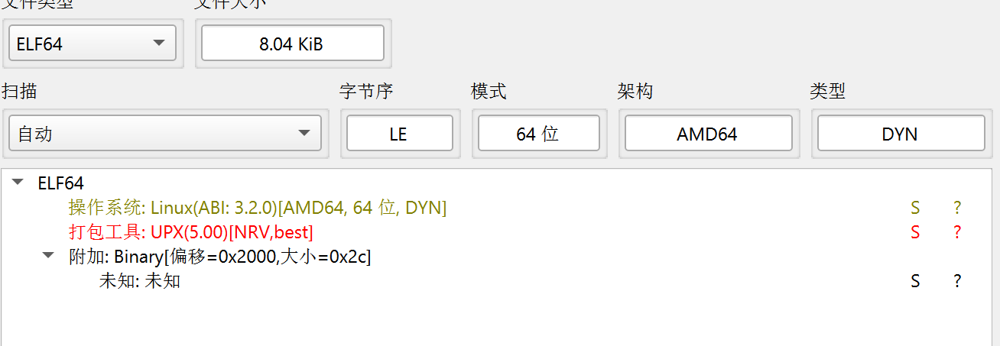

脱壳

<!-- 这是一张图片，ocr 内容为： -->
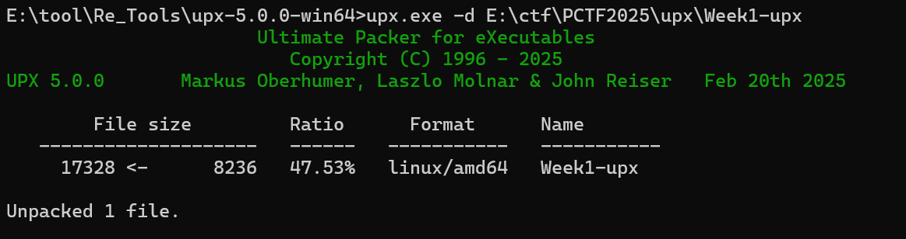

flag加密

<!-- 这是一张图片，ocr 内容为： -->
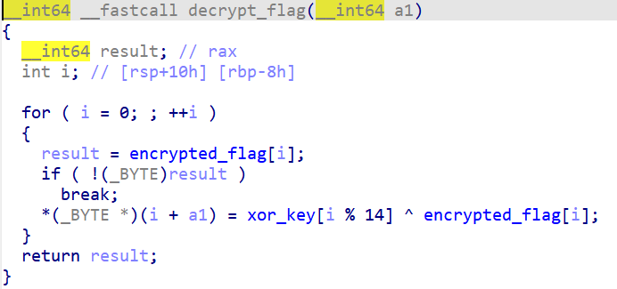

密文与密钥

<!-- 这是一张图片，ocr 内容为： -->
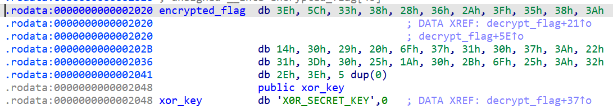

脚本

```python
encrypted_bytes = [
    0x3E, 0x5C, 0x33, 0x38, 0x28, 0x36, 0x2A, 0x3F, 0x35, 0x38, 0x3A,
    0x14, 0x30, 0x29, 0x20, 0x6F, 0x37, 0x31, 0x30, 0x37, 0x3A, 0x22,
    0x31, 0x3D, 0x30, 0x25, 0x1A, 0x30, 0x2B, 0x6F, 0x25, 0x3A, 0x32,
    0x2E, 0x3E
]
key_str = "X0R_SECRET_KEY"

flag = ""
key_len = len(key_str)

for i in range(len(encrypted_bytes)):
    k = ord(key_str[i % key_len])
    decoded_char = chr(encrypted_bytes[i] ^ k)
    flag += decoded_char

print(f"解密结果: {flag}")
```

flag{simple_upx_encryption_is_weak}


# 8.ez_mobile
<!-- 这是一张图片，ocr 内容为： -->
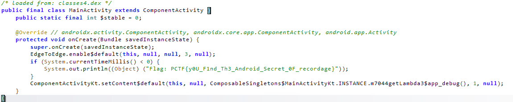

PCTF{y0U_F1nd_Th3_Android_Secret_0F_recordage}


# 9.debugme
下断点，步过就行

<!-- 这是一张图片，ocr 内容为： -->
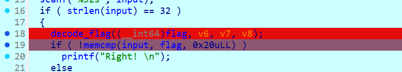

直出

<!-- 这是一张图片，ocr 内容为： -->
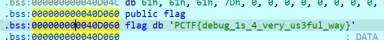

PCTF{debug_1s_4_very_us3ful_way}


# 10.flower_dance
加壳，不是标准的upx壳

<!-- 这是一张图片，ocr 内容为： -->
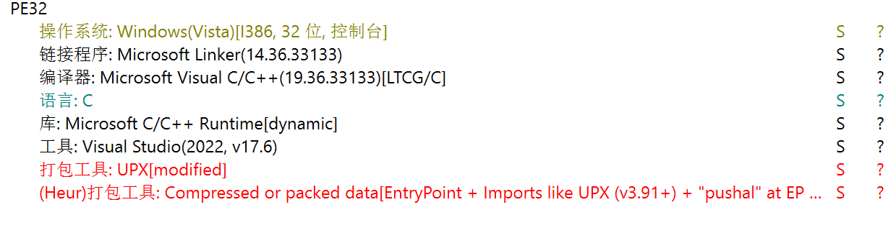

010修改

<!-- 这是一张图片，ocr 内容为： -->
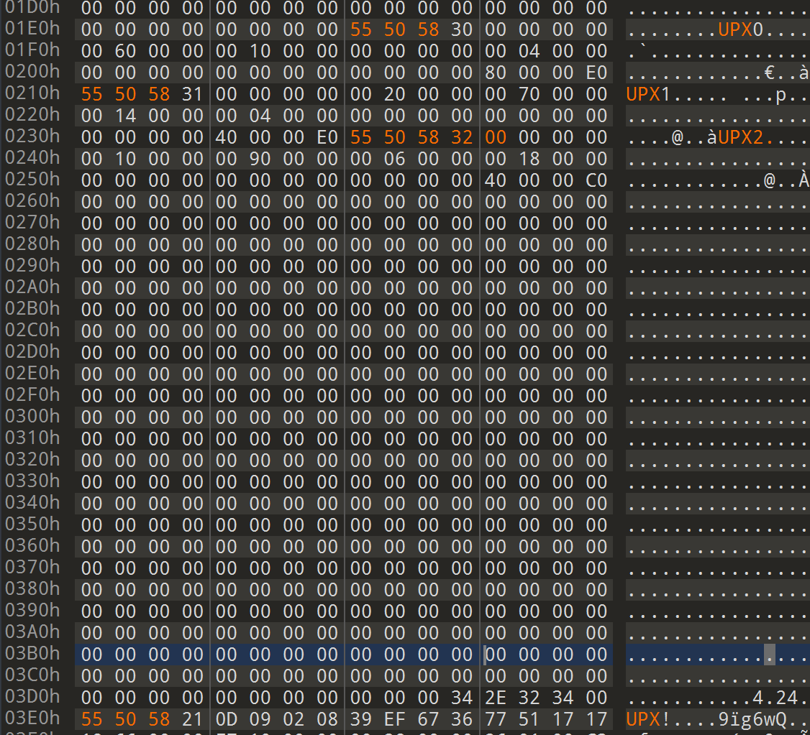

脱壳

<!-- 这是一张图片，ocr 内容为： -->
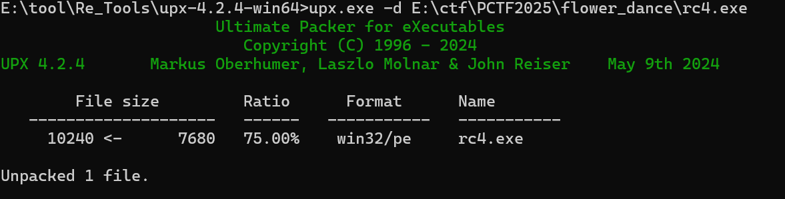

IDA打开，有两花指令，全都nop掉

<!-- 这是一张图片，ocr 内容为： -->
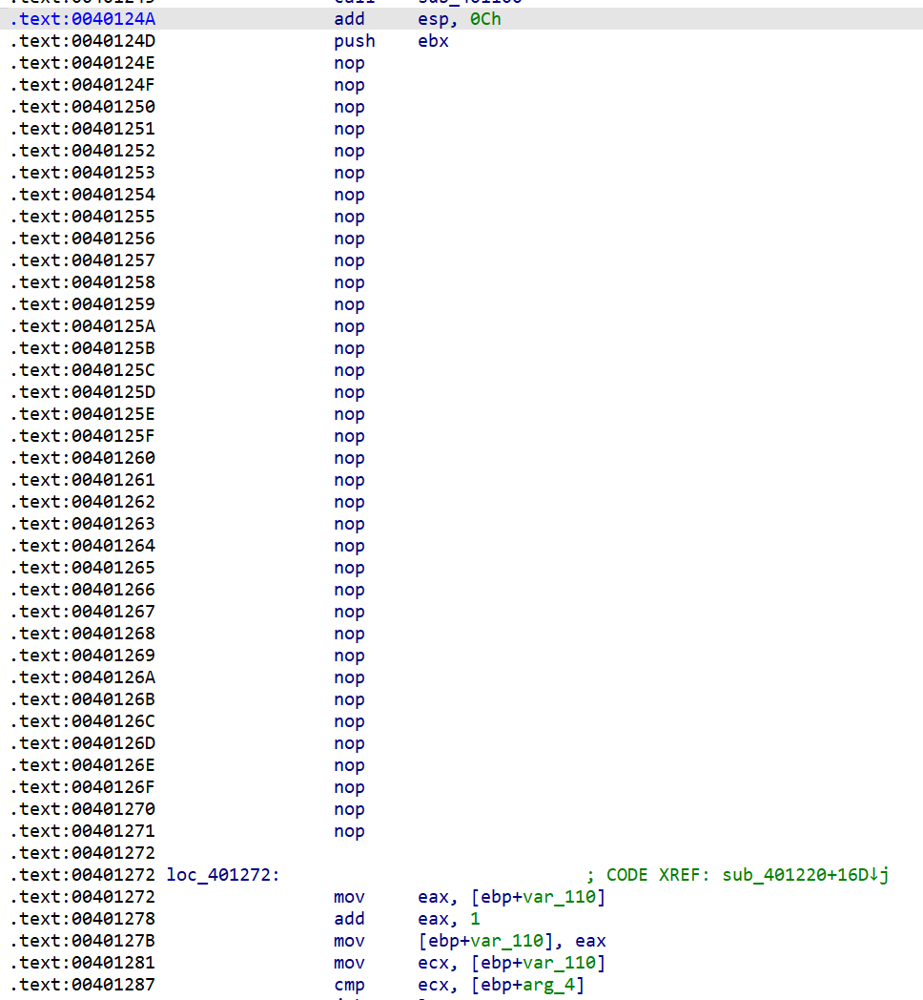

<!-- 这是一张图片，ocr 内容为： -->
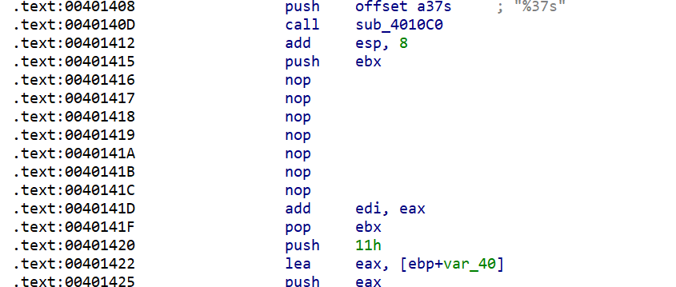

花指令清完，可以反汇编，主函数写的是Rc4算法机密，key为‘This_is_a_rc4_key’

<!-- 这是一张图片，ocr 内容为： -->
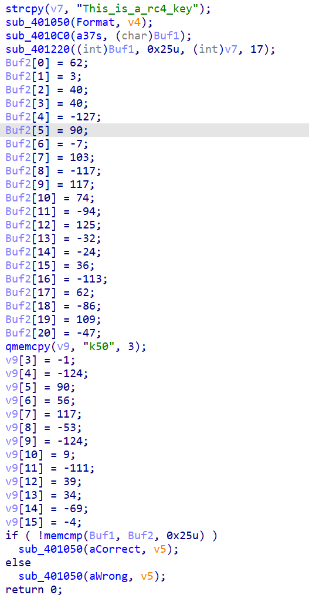

魔改之处在于额外异或0x56

<!-- 这是一张图片，ocr 内容为： -->
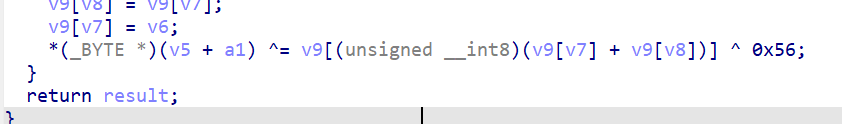

脚本

```python
import sys
def rc4_decrypt_modified(key_str, ciphertext):
    key = [ord(c) for c in key_str]
    key_len = len(key)
    # 1. KSA (完全标准的初始化，对应 sub_401100)
    S = list(range(256))
    j = 0
    for i in range(256):
        j = (j + S[i] + key[i % key_len]) % 256
        S[i], S[j] = S[j], S[i]
    # 2. PRGA (魔改版，对应 sub_401220)
    i = 0
    j = 0
    decrypted = []
    for char in ciphertext:
        i = (i + 1) % 256
        j = (j + S[i]) % 256
        S[i], S[j] = S[j], S[i]
        # 生成标准 RC4 密钥流 k
        k = S[(S[i] + S[j]) % 256]

        m = char ^ k ^ 0x56
        decrypted.append(m)

    return "".join([chr(x) for x in decrypted])

key_string = "This_is_a_rc4_key"

full_signed = [ 62, 3, 40, 40, -127, 90, -7, 103, -117, 117, 
                74, -94, 125, -32, -24, 36, -113, 62, -86, 109, -47,
                107, 53, 48, -1, -124, 90, 56, 117, -53, 
                -124, 9, -111, 39, 34, -69, -4
              ]
full_ciphertext = [x & 0xFF for x in (full_signed )]
try:
    flag = rc4_decrypt_modified(key_string, full_ciphertext)
    print(f"[*] Decryption successful!")
    print(f"[*] Flag: {flag}")
except Exception as e:
    print(f"[!] Error: {e}")
```

PCTF{RC4_hid3_1n_fl0wers_4nd_ba9_UPX}


# 11.Maze
python编写，先解包

<!-- 这是一张图片，ocr 内容为： -->
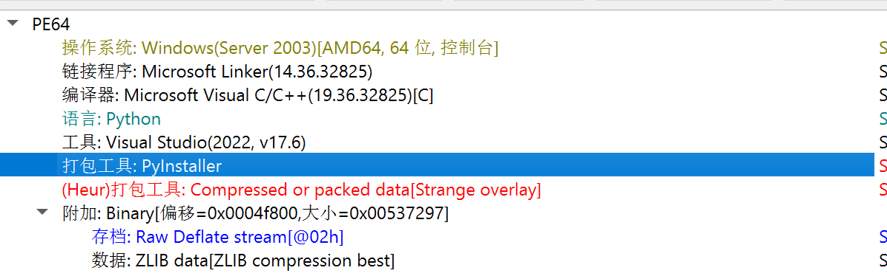

发现python版本是3.8，可能的主函数有两个

<!-- 这是一张图片，ocr 内容为： -->
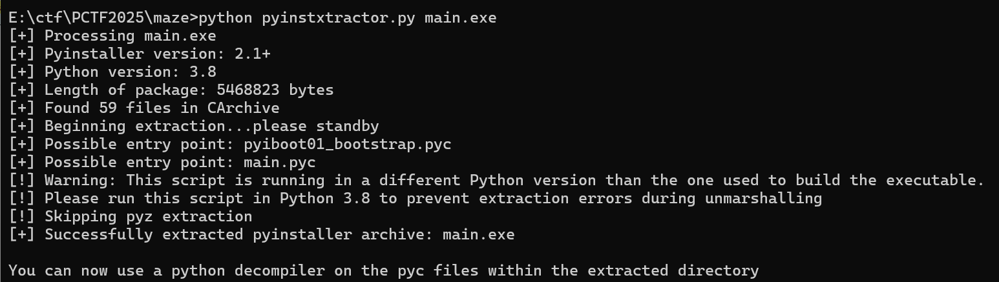

先反编译main.pyc（这里用到的是PyLingual工具），可以看到这里面自定义四个走位以及地图长宽为61，

关键在于地图是由do_you_want_to_see_the_maze的值决定的，我们这里要把改为true，才能拿到地图

```python
# Decompiled with PyLingual (https://pylingual.io)
# Internal filename: main.py
# Bytecode version: 3.8.0rc1+ (3413)
# Source timestamp: 1970-01-01 00:00:00 UTC (0)

import maze
import hashlib
width = 61
height = 61
Maze = maze.get_map(width, height)
do_you_want_to_see_the_maze = False
print('Do you want to see the map?:', do_you_want_to_see_the_maze)
if do_you_want_to_see_the_maze:
    Maze.showMap()
path = input('Enter the shortest path to solve the maze (s: down, w: up, d: right, a: left): ')
x = 1
y = 1
for move in path:
    if move == 's':
        x += 1
    elif move == 'w':
        x -= 1
    elif move == 'd':
        y += 1
    elif move == 'a':
        y -= 1
    if Maze.map[x][y] == 1:
        print('You hit a wall! Game over.')
        break
    if Maze.map[x][y] == 3:
        if len(path) > 116:
            print("You reached the exit but didn't take the shortest path! Game over.")
            break
        print("Congratulations! You've reached the exit!")
        path_md5 = hashlib.md5(path.encode('utf-8')).hexdigest()
        flag = 'PCTF{' + path_md5 + '}'
        print('Here is your flag: ' + flag)
        break
```

接着反编译maze.py,地图的生成逻辑

```python
# Decompiled with PyLingual (https://pylingual.io)
# Internal filename: maze.py
# Bytecode version: 3.8.0rc1+ (3413)
# Source timestamp: 1970-01-01 00:00:00 UTC (0)

from random import randint, choice, seed
from enum import Enum
from sys import *

class MAP_ENTRY_TYPE(Enum):
    MAP_EMPTY = (0,)
    MAP_BLOCK = (1,)

class WALL_DIRECTION(Enum):
    WALL_LEFT = (0,)
    WALL_UP = (1,)
    WALL_RIGHT = (2,)
    WALL_DOWN = (3,)

class Map:

    def __init__(self, width, height):
        self.width = width
        self.height = height
        self.map = [[0 for x in range(self.width)] for y in range(self.height)]

    def resetMap(self, value):
        for y in range(self.height):
            for x in range(self.width):
                self.setMap(x, y, value)

    def setMap(self, x, y, value):
        if value == MAP_ENTRY_TYPE.MAP_EMPTY:
            self.map[y][x] = 0
        elif value == MAP_ENTRY_TYPE.MAP_BLOCK:
            self.map[y][x] = 1

    def isVisited(self, x, y):
        return self.map[y][x] != 1

    def showMap1(self, pos):
        s = ''
        for x in range(self.width):
            for y in range(self.height):
                entry = self.map[x][y]
                if (x, y) in pos:
                    s += '\x1b[92m'
                    if entry == 0:
                        s += '*'
                elif entry == 0:
                    s += ' '
                if entry == 1:
                    s += '#'
                if entry == 2:
                    s += 'S'
                if entry == 3:
                    s += 'E'
                if (x, y) in pos:
                    s += '\x1b[0m'
            s += '\n'
        print(s, end='')

    def showMap(self):
        s = ''
        for x in range(self.width):
            for y in range(self.height):
                entry = self.map[x][y]
                if entry == 0:
                    s += ' '
                elif entry == 1:
                    s += '#'
                elif entry == 2:
                    s += 'S'
                else:
                    s += 'E'
            s += '\n'
        print(s, end='')

def checkAdjacentPos(map, x, y, width, height, checklist):
    directions = []
    if x > 0 and (not map.isVisited(2 * (x - 1) + 1, 2 * y + 1)):
        directions.append(WALL_DIRECTION.WALL_LEFT)
    if y > 0 and (not map.isVisited(2 * x + 1, 2 * (y - 1) + 1)):
        directions.append(WALL_DIRECTION.WALL_UP)
    if x < width - 1 and (not map.isVisited(2 * (x + 1) + 1, 2 * y + 1)):
        directions.append(WALL_DIRECTION.WALL_RIGHT)
    if y < height - 1 and (not map.isVisited(2 * x + 1, 2 * (y + 1) + 1)):
        directions.append(WALL_DIRECTION.WALL_DOWN)
    if len(directions):
        direction = choice(directions)
        if direction == WALL_DIRECTION.WALL_LEFT:
            map.setMap(2 * (x - 1) + 1, 2 * y + 1, MAP_ENTRY_TYPE.MAP_EMPTY)
            map.setMap(2 * x, 2 * y + 1, MAP_ENTRY_TYPE.MAP_EMPTY)
            checklist.append((x - 1, y))
        elif direction == WALL_DIRECTION.WALL_UP:
            map.setMap(2 * x + 1, 2 * (y - 1) + 1, MAP_ENTRY_TYPE.MAP_EMPTY)
            map.setMap(2 * x + 1, 2 * y, MAP_ENTRY_TYPE.MAP_EMPTY)
            checklist.append((x, y - 1))
        elif direction == WALL_DIRECTION.WALL_RIGHT:
            map.setMap(2 * (x + 1) + 1, 2 * y + 1, MAP_ENTRY_TYPE.MAP_EMPTY)
            map.setMap(2 * x + 2, 2 * y + 1, MAP_ENTRY_TYPE.MAP_EMPTY)
            checklist.append((x + 1, y))
        elif direction == WALL_DIRECTION.WALL_DOWN:
            map.setMap(2 * x + 1, 2 * (y + 1) + 1, MAP_ENTRY_TYPE.MAP_EMPTY)
            map.setMap(2 * x + 1, 2 * y + 2, MAP_ENTRY_TYPE.MAP_EMPTY)
            checklist.append((x, y + 1))
        return True
    return False

def randomPrim(map, width, height):
    startX, startY = (randint(0, width - 1), randint(0, height - 1))
    startX = 1
    startY = 1
    map.setMap(2 * startX + 1, 2 * startY + 1, MAP_ENTRY_TYPE.MAP_EMPTY)
    checklist = []
    checklist.append((startX, startY))
    while len(checklist):
        entry = choice(checklist)
        if not checkAdjacentPos(map, entry[0], entry[1], width, height, checklist):
            checklist.remove(entry)

def doRandomPrim(map):
    seed(114514)
    map.resetMap(MAP_ENTRY_TYPE.MAP_BLOCK)
    randomPrim(map, (map.width - 1) // 2, (map.height - 1) // 2)

def get_map(WIDTH, HEIGHT):
    map = Map(WIDTH, HEIGHT)
    doRandomPrim(map)
    map.map[1][1] = 2
    map.map[HEIGHT - 2][WIDTH - 2] = 3
    return map
if __name__ == '__main__':
    get_map()
```

把这两个反编译的py文件放在同一个文件夹下，用3.8环境运行mian.py，得到地图

```python
#############################################################
#S                      # #               # # #           # #
### # ### # # ####### # # # ### ##### ##### # # ### ### ### #
#   # #   # #       # #       #     #             #   #   # #
# # # # # # ##### ##### ####### # ### ######### # ######### #
# # # # # #     #     # # # # # #   # # # #   # #   #       #
# # # # # ##### ######### # # ### ##### # # ######### #######
# # # # #   # #   #           # #   #               # #     #
# # # # # # # ##### ####### # # ####### ############# # ### #
# # # # # #     #         # #         #                   # #
### # # ### ### # ################# ### ### ##### ###########
#   # #   #   #                 #   #     #   # #           #
# ##### # ### # ### ######### # ##### ##### # # #############
# #     #   # #   #         # # #         # #       #   #   #
### ### # ### ### # # ############# ### # ### ####### ### # #
#   #   #   #   # # #           #     # #   # # #         # #
# ### # # # ### # # # ########### # # # # ### # # ###########
# #   # # #   # # # #             # # # #   #           #   #
# ### ##### # # # # ### # ### ### # # ################### ###
# #   #     # # # # # # #   #   # # #           #           #
# ### ##### # ##### # ### ############# ####### # ######### #
# #     #   # #   #   #             # # #   # #           # #
# # # # # # ### # # # # # ##### ##### ### ### # ##### #######
# # # # # #     # # # # #     #               #     #       #
# ########### # # # ### # ####### ### ### # # ######### # ###
#   #         # # # #   #       #   #   # # #     # # # #   #
### ##### ### ##### ##### # # # # # ### # ### ##### # ##### #
#   #     #     #       # # # # # #   # #   #           #   #
# # # ##### # ##### # # # ### ### ### # # # # ############# #
# # # #     #     # # # #   # #     # # # # #             # #
# # # # ### # ##### ####### ### # ### # ### ####### ### # # #
# # # # #   #     #       #   # #   # #   #       #   # # # #
# # # # # # # ##### # ####### # # ### # # # # # # ####### ###
# # # # # # # #     #       # # #   # # # # # # #       #   #
# ##### ##### ### # ############### # ##### ########### # ###
# # #   #       # #             #   #     #           # #   #
# # # ### ### ### # ### ##### ### ### # # ### # # ###########
#   # #   #     # #   #     #   # #   # #   # # #           #
# # # ### # # ##### ##### # ### ### # ### # ##### # # # ### #
# # #   # # # # #       # #   #   # # #   #     # # # #   # #
### ##### # # # # ### # ####### ##### # ##### ########### ###
# # #     # # # # #   #       # #     #   #       #   #     #
# # # # # ### # ### # ####### # # # # # # ### ##### ##### # #
#   # # # #     #   #       # # # # # # # #             # # #
# ####### ##### ### # # ####### ### # # # ### ### ##### # ###
#   #         #   # # #       #   # # # # #     #     # #   #
# # ##### # # ### ### # ### ####### # # ####### ### # ##### #
# # #     # #   #   # #   #     # # # #     #     # #   # # #
# ##### ### # # # # ### # ####### # ### ####### ####### # ###
# #       # # # # #   # #         # #         #       #     #
####### # # # ### # # # # # ####### ### # ##### # ### # # # #
#       # # # # # # # # # #       #   # #   #   #   # # # # #
# ### # ### # # # ### ##### # ### # # # ### # # ##### ### # #
#   # # #   #   #   #   #   #   # # # #   # # # #   #   # # #
# ### # # ##### ####### # ####### ### # ##### ### # # ### ###
#   # # # #           # #     #     # #   #       # #   #   #
# # ### ### # # ####### # # ############### # ### ######### #
# #   # # # # #   #   # # #               # #   #     #   # #
##### ### ### ##### # # # ##### ### # ####### # # # ### ### #
#     #             # # #     #   # #     #   # # #       #E#
#############################################################
```

接下里用BFS算法来找寻路径

```python
maze=[1, 1, 1, 1, 1, 1, 1, 1, 1, 1, 1, 1, 1, 1, 1, 1, 1, 1, 1, 1, 1, 1, 1, 1, 1, 1, 1, 1, 1, 1, 1, 1, 1, 1, 1, 1, 1, 1, 1, 1, 1, 1, 1, 1, 1, 1, 1, 1, 1, 1, 1, 1, 1, 1, 1, 1, 1, 1, 1, 1, 1, 
 1, 0, 0, 0, 0, 0, 0, 0, 0, 0, 0, 0, 0, 0, 0, 0, 0, 0, 0, 0, 0, 0, 0, 0, 1, 0, 1, 0, 0, 0, 0, 0, 0, 0, 0, 0, 0, 0, 0, 0, 0, 0, 1, 0, 1, 0, 1, 0, 0, 0, 0, 0, 0, 0, 0, 0, 0, 0, 1, 0, 1,
 1, 1, 1, 0, 1, 0, 1, 1, 1, 0, 1, 0, 1, 0, 1, 1, 1, 1, 1, 1, 1, 0, 1, 0, 1, 0, 1, 0, 1, 1, 1, 0, 1, 1, 1, 1, 1, 0, 1, 1, 1, 1, 1, 0, 1, 0, 1, 0, 1, 1, 1, 0, 1, 1, 1, 0, 1, 1, 1, 0, 1,
 1, 0, 0, 0, 1, 0, 1, 0, 0, 0, 1, 0, 1, 0, 0, 0, 0, 0, 0, 0, 1, 0, 1, 0, 0, 0, 0, 0, 0, 0, 1, 0, 0, 0, 0, 0, 1, 0, 0, 0, 0, 0, 0, 0, 0, 0, 0, 0, 0, 0, 1, 0, 0, 0, 1, 0, 0, 0, 1, 0, 1,
 1, 0, 1, 0, 1, 0, 1, 0, 1, 0, 1, 0, 1, 1, 1, 1, 1, 0, 1, 1, 1, 1, 1, 0, 1, 1, 1, 1, 1, 1, 1, 0, 1, 0, 1, 1, 1, 0, 1, 1, 1, 1, 1, 1, 1, 1, 1, 0, 1, 0, 1, 1, 1, 1, 1, 1, 1, 1, 1, 0, 1,
 1, 0, 1, 0, 1, 0, 1, 0, 1, 0, 1, 0, 0, 0, 0, 0, 1, 0, 0, 0, 0, 0, 1, 0, 1, 0, 1, 0, 1, 0, 1, 0, 1, 0, 0, 0, 1, 0, 1, 0, 1, 0, 1, 0, 0, 0, 1, 0, 1, 0, 0, 0, 1, 0, 0, 0, 0, 0, 0, 0, 1,
 1, 0, 1, 0, 1, 0, 1, 0, 1, 0, 1, 1, 1, 1, 1, 0, 1, 1, 1, 1, 1, 1, 1, 1, 1, 0, 1, 0, 1, 0, 1, 1, 1, 0, 1, 1, 1, 1, 1, 0, 1, 0, 1, 0, 1, 1, 1, 1, 1, 1, 1, 1, 1, 0, 1, 1, 1, 1, 1, 1, 1,
 1, 0, 1, 0, 1, 0, 1, 0, 1, 0, 0, 0, 1, 0, 1, 0, 0, 0, 1, 0, 0, 0, 0, 0, 0, 0, 0, 0, 0, 0, 1, 0, 1, 0, 0, 0, 1, 0, 0, 0, 0, 0, 0, 0, 0, 0, 0, 0, 0, 0, 0, 0, 1, 0, 1, 0, 0, 0, 0, 0, 1,
 1, 0, 1, 0, 1, 0, 1, 0, 1, 0, 1, 0, 1, 0, 1, 1, 1, 1, 1, 0, 1, 1, 1, 1, 1, 1, 1, 0, 1, 0, 1, 0, 1, 1, 1, 1, 1, 1, 1, 0, 1, 1, 1, 1, 1, 1, 1, 1, 1, 1, 1, 1, 1, 0, 1, 0, 1, 1, 1, 0, 1,
 1, 0, 1, 0, 1, 0, 1, 0, 1, 0, 1, 0, 0, 0, 0, 0, 1, 0, 0, 0, 0, 0, 0, 0, 0, 0, 1, 0, 1, 0, 0, 0, 0, 0, 0, 0, 0, 0, 1, 0, 0, 0, 0, 0, 0, 0, 0, 0, 0, 0, 0, 0, 0, 0, 0, 0, 0, 0, 1, 0, 1,
 1, 1, 1, 0, 1, 0, 1, 0, 1, 1, 1, 0, 1, 1, 1, 0, 1, 0, 1, 1, 1, 1, 1, 1, 1, 1, 1, 1, 1, 1, 1, 1, 1, 1, 1, 0, 1, 1, 1, 0, 1, 1, 1, 0, 1, 1, 1, 1, 1, 0, 1, 1, 1, 1, 1, 1, 1, 1, 1, 1, 1,
 1, 0, 0, 0, 1, 0, 1, 0, 0, 0, 1, 0, 0, 0, 1, 0, 0, 0, 0, 0, 0, 0, 0, 0, 0, 0, 0, 0, 0, 0, 0, 0, 1, 0, 0, 0, 1, 0, 0, 0, 0, 0, 1, 0, 0, 0, 1, 0, 1, 0, 0, 0, 0, 0, 0, 0, 0, 0, 0, 0, 1,
 1, 0, 1, 1, 1, 1, 1, 0, 1, 0, 1, 1, 1, 0, 1, 0, 1, 1, 1, 0, 1, 1, 1, 1, 1, 1, 1, 1, 1, 0, 1, 0, 1, 1, 1, 1, 1, 0, 1, 1, 1, 1, 1, 0, 1, 0, 1, 0, 1, 1, 1, 1, 1, 1, 1, 1, 1, 1, 1, 1, 1,
 1, 0, 1, 0, 0, 0, 0, 0, 1, 0, 0, 0, 1, 0, 1, 0, 0, 0, 1, 0, 0, 0, 0, 0, 0, 0, 0, 0, 1, 0, 1, 0, 1, 0, 0, 0, 0, 0, 0, 0, 0, 0, 1, 0, 1, 0, 0, 0, 0, 0, 0, 0, 1, 0, 0, 0, 1, 0, 0, 0, 1,
 1, 1, 1, 0, 1, 1, 1, 0, 1, 0, 1, 1, 1, 0, 1, 1, 1, 0, 1, 0, 1, 0, 1, 1, 1, 1, 1, 1, 1, 1, 1, 1, 1, 1, 1, 0, 1, 1, 1, 0, 1, 0, 1, 1, 1, 0, 1, 1, 1, 1, 1, 1, 1, 0, 1, 1, 1, 0, 1, 0, 1,
 1, 0, 0, 0, 1, 0, 0, 0, 1, 0, 0, 0, 1, 0, 0, 0, 1, 0, 1, 0, 1, 0, 0, 0, 0, 0, 0, 0, 0, 0, 0, 0, 1, 0, 0, 0, 0, 0, 1, 0, 1, 0, 0, 0, 1, 0, 1, 0, 1, 0, 0, 0, 0, 0, 0, 0, 0, 0, 1, 0, 1,
 1, 0, 1, 1, 1, 0, 1, 0, 1, 0, 1, 0, 1, 1, 1, 0, 1, 0, 1, 0, 1, 0, 1, 1, 1, 1, 1, 1, 1, 1, 1, 1, 1, 0, 1, 0, 1, 0, 1, 0, 1, 0, 1, 1, 1, 0, 1, 0, 1, 0, 1, 1, 1, 1, 1, 1, 1, 1, 1, 1, 1,
 1, 0, 1, 0, 0, 0, 1, 0, 1, 0, 1, 0, 0, 0, 1, 0, 1, 0, 1, 0, 1, 0, 0, 0, 0, 0, 0, 0, 0, 0, 0, 0, 0, 0, 1, 0, 1, 0, 1, 0, 1, 0, 0, 0, 1, 0, 0, 0, 0, 0, 0, 0, 0, 0, 0, 0, 1, 0, 0, 0, 1,
 1, 0, 1, 1, 1, 0, 1, 1, 1, 1, 1, 0, 1, 0, 1, 0, 1, 0, 1, 0, 1, 1, 1, 0, 1, 0, 1, 1, 1, 0, 1, 1, 1, 0, 1, 0, 1, 0, 1, 1, 1, 1, 1, 1, 1, 1, 1, 1, 1, 1, 1, 1, 1, 1, 1, 1, 1, 0, 1, 1, 1,
 1, 0, 1, 0, 0, 0, 1, 0, 0, 0, 0, 0, 1, 0, 1, 0, 1, 0, 1, 0, 1, 0, 1, 0, 1, 0, 0, 0, 1, 0, 0, 0, 1, 0, 1, 0, 1, 0, 0, 0, 0, 0, 0, 0, 0, 0, 0, 0, 1, 0, 0, 0, 0, 0, 0, 0, 0, 0, 0, 0, 1,
 1, 0, 1, 1, 1, 0, 1, 1, 1, 1, 1, 0, 1, 0, 1, 1, 1, 1, 1, 0, 1, 0, 1, 1, 1, 0, 1, 1, 1, 1, 1, 1, 1, 1, 1, 1, 1, 1, 1, 0, 1, 1, 1, 1, 1, 1, 1, 0, 1, 0, 1, 1, 1, 1, 1, 1, 1, 1, 1, 0, 1,
 1, 0, 1, 0, 0, 0, 0, 0, 1, 0, 0, 0, 1, 0, 1, 0, 0, 0, 1, 0, 0, 0, 1, 0, 0, 0, 0, 0, 0, 0, 0, 0, 0, 0, 0, 0, 1, 0, 1, 0, 1, 0, 0, 0, 1, 0, 1, 0, 0, 0, 0, 0, 0, 0, 0, 0, 0, 0, 1, 0, 1,
 1, 0, 1, 0, 1, 0, 1, 0, 1, 0, 1, 0, 1, 1, 1, 0, 1, 0, 1, 0, 1, 0, 1, 0, 1, 0, 1, 1, 1, 1, 1, 0, 1, 1, 1, 1, 1, 0, 1, 1, 1, 0, 1, 1, 1, 0, 1, 0, 1, 1, 1, 1, 1, 0, 1, 1, 1, 1, 1, 1, 1,
 1, 0, 1, 0, 1, 0, 1, 0, 1, 0, 1, 0, 0, 0, 0, 0, 1, 0, 1, 0, 1, 0, 1, 0, 1, 0, 0, 0, 0, 0, 1, 0, 0, 0, 0, 0, 0, 0, 0, 0, 0, 0, 0, 0, 0, 0, 1, 0, 0, 0, 0, 0, 1, 0, 0, 0, 0, 0, 0, 0, 1,
 1, 0, 1, 1, 1, 1, 1, 1, 1, 1, 1, 1, 1, 0, 1, 0, 1, 0, 1, 0, 1, 1, 1, 0, 1, 0, 1, 1, 1, 1, 1, 1, 1, 0, 1, 1, 1, 0, 1, 1, 1, 0, 1, 0, 1, 0, 1, 1, 1, 1, 1, 1, 1, 1, 1, 0, 1, 0, 1, 1, 1,
 1, 0, 0, 0, 1, 0, 0, 0, 0, 0, 0, 0, 0, 0, 1, 0, 1, 0, 1, 0, 1, 0, 0, 0, 1, 0, 0, 0, 0, 0, 0, 0, 1, 0, 0, 0, 1, 0, 0, 0, 1, 0, 1, 0, 1, 0, 0, 0, 0, 0, 1, 0, 1, 0, 1, 0, 1, 0, 0, 0, 1,
 1, 1, 1, 0, 1, 1, 1, 1, 1, 0, 1, 1, 1, 0, 1, 1, 1, 1, 1, 0, 1, 1, 1, 1, 1, 0, 1, 0, 1, 0, 1, 0, 1, 0, 1, 0, 1, 1, 1, 0, 1, 0, 1, 1, 1, 0, 1, 1, 1, 1, 1, 0, 1, 0, 1, 1, 1, 1, 1, 0, 1,
 1, 0, 0, 0, 1, 0, 0, 0, 0, 0, 1, 0, 0, 0, 0, 0, 1, 0, 0, 0, 0, 0, 0, 0, 1, 0, 1, 0, 1, 0, 1, 0, 1, 0, 1, 0, 0, 0, 1, 0, 1, 0, 0, 0, 1, 0, 0, 0, 0, 0, 0, 0, 0, 0, 0, 0, 1, 0, 0, 0, 1,
 1, 0, 1, 0, 1, 0, 1, 1, 1, 1, 1, 0, 1, 0, 1, 1, 1, 1, 1, 0, 1, 0, 1, 0, 1, 0, 1, 1, 1, 0, 1, 1, 1, 0, 1, 1, 1, 0, 1, 0, 1, 0, 1, 0, 1, 0, 1, 1, 1, 1, 1, 1, 1, 1, 1, 1, 1, 1, 1, 0, 1,
 1, 0, 1, 0, 1, 0, 1, 0, 0, 0, 0, 0, 1, 0, 0, 0, 0, 0, 1, 0, 1, 0, 1, 0, 1, 0, 0, 0, 1, 0, 1, 0, 0, 0, 0, 0, 1, 0, 1, 0, 1, 0, 1, 0, 1, 0, 0, 0, 0, 0, 0, 0, 0, 0, 0, 0, 0, 0, 1, 0, 1,
 1, 0, 1, 0, 1, 0, 1, 0, 1, 1, 1, 0, 1, 0, 1, 1, 1, 1, 1, 0, 1, 1, 1, 1, 1, 1, 1, 0, 1, 1, 1, 0, 1, 0, 1, 1, 1, 0, 1, 0, 1, 1, 1, 0, 1, 1, 1, 1, 1, 1, 1, 0, 1, 1, 1, 0, 1, 0, 1, 0, 1,
 1, 0, 1, 0, 1, 0, 1, 0, 1, 0, 0, 0, 1, 0, 0, 0, 0, 0, 1, 0, 0, 0, 0, 0, 0, 0, 1, 0, 0, 0, 1, 0, 1, 0, 0, 0, 1, 0, 1, 0, 0, 0, 1, 0, 0, 0, 0, 0, 0, 0, 1, 0, 0, 0, 1, 0, 1, 0, 1, 0, 1,
 1, 0, 1, 0, 1, 0, 1, 0, 1, 0, 1, 0, 1, 0, 1, 1, 1, 1, 1, 0, 1, 0, 1, 1, 1, 1, 1, 1, 1, 0, 1, 0, 1, 0, 1, 1, 1, 0, 1, 0, 1, 0, 1, 0, 1, 0, 1, 0, 1, 0, 1, 1, 1, 1, 1, 1, 1, 0, 1, 1, 1,
 1, 0, 1, 0, 1, 0, 1, 0, 1, 0, 1, 0, 1, 0, 1, 0, 0, 0, 0, 0, 1, 0, 0, 0, 0, 0, 0, 0, 1, 0, 1, 0, 1, 0, 0, 0, 1, 0, 1, 0, 1, 0, 1, 0, 1, 0, 1, 0, 1, 0, 0, 0, 0, 0, 0, 0, 1, 0, 0, 0, 1,
 1, 0, 1, 1, 1, 1, 1, 0, 1, 1, 1, 1, 1, 0, 1, 1, 1, 0, 1, 0, 1, 1, 1, 1, 1, 1, 1, 1, 1, 1, 1, 1, 1, 1, 1, 0, 1, 0, 1, 1, 1, 1, 1, 0, 1, 1, 1, 1, 1, 1, 1, 1, 1, 1, 1, 0, 1, 0, 1, 1, 1,
 1, 0, 1, 0, 1, 0, 0, 0, 1, 0, 0, 0, 0, 0, 0, 0, 1, 0, 1, 0, 0, 0, 0, 0, 0, 0, 0, 0, 0, 0, 0, 0, 1, 0, 0, 0, 1, 0, 0, 0, 0, 0, 1, 0, 0, 0, 0, 0, 0, 0, 0, 0, 0, 0, 1, 0, 1, 0, 0, 0, 1,
 1, 0, 1, 0, 1, 0, 1, 1, 1, 0, 1, 1, 1, 0, 1, 1, 1, 0, 1, 0, 1, 1, 1, 0, 1, 1, 1, 1, 1, 0, 1, 1, 1, 0, 1, 1, 1, 0, 1, 0, 1, 0, 1, 1, 1, 0, 1, 0, 1, 0, 1, 1, 1, 1, 1, 1, 1, 1, 1, 1, 1,
 1, 0, 0, 0, 1, 0, 1, 0, 0, 0, 1, 0, 0, 0, 0, 0, 1, 0, 1, 0, 0, 0, 1, 0, 0, 0, 0, 0, 1, 0, 0, 0, 1, 0, 1, 0, 0, 0, 1, 0, 1, 0, 0, 0, 1, 0, 1, 0, 1, 0, 0, 0, 0, 0, 0, 0, 0, 0, 0, 0, 1,
 1, 0, 1, 0, 1, 0, 1, 1, 1, 0, 1, 0, 1, 0, 1, 1, 1, 1, 1, 0, 1, 1, 1, 1, 1, 0, 1, 0, 1, 1, 1, 0, 1, 1, 1, 0, 1, 0, 1, 1, 1, 0, 1, 0, 1, 1, 1, 1, 1, 0, 1, 0, 1, 0, 1, 0, 1, 1, 1, 0, 1,
 1, 0, 1, 0, 1, 0, 0, 0, 1, 0, 1, 0, 1, 0, 1, 0, 1, 0, 0, 0, 0, 0, 0, 0, 1, 0, 1, 0, 0, 0, 1, 0, 0, 0, 1, 0, 1, 0, 1, 0, 0, 0, 1, 0, 0, 0, 0, 0, 1, 0, 1, 0, 1, 0, 1, 0, 0, 0, 1, 0, 1,
 1, 1, 1, 0, 1, 1, 1, 1, 1, 0, 1, 0, 1, 0, 1, 0, 1, 0, 1, 1, 1, 0, 1, 0, 1, 1, 1, 1, 1, 1, 1, 0, 1, 1, 1, 1, 1, 0, 1, 0, 1, 1, 1, 1, 1, 0, 1, 1, 1, 1, 1, 1, 1, 1, 1, 1, 1, 0, 1, 1, 1,
 1, 0, 1, 0, 1, 0, 0, 0, 0, 0, 1, 0, 1, 0, 1, 0, 1, 0, 1, 0, 0, 0, 1, 0, 0, 0, 0, 0, 0, 0, 1, 0, 1, 0, 0, 0, 0, 0, 1, 0, 0, 0, 1, 0, 0, 0, 0, 0, 0, 0, 1, 0, 0, 0, 1, 0, 0, 0, 0, 0, 1,
 1, 0, 1, 0, 1, 0, 1, 0, 1, 0, 1, 1, 1, 0, 1, 0, 1, 1, 1, 0, 1, 0, 1, 1, 1, 1, 1, 1, 1, 0, 1, 0, 1, 0, 1, 0, 1, 0, 1, 0, 1, 0, 1, 1, 1, 0, 1, 1, 1, 1, 1, 0, 1, 1, 1, 1, 1, 0, 1, 0, 1,
 1, 0, 0, 0, 1, 0, 1, 0, 1, 0, 1, 0, 0, 0, 0, 0, 1, 0, 0, 0, 1, 0, 0, 0, 0, 0, 0, 0, 1, 0, 1, 0, 1, 0, 1, 0, 1, 0, 1, 0, 1, 0, 1, 0, 0, 0, 0, 0, 0, 0, 0, 0, 0, 0, 0, 0, 1, 0, 1, 0, 1,
 1, 0, 1, 1, 1, 1, 1, 1, 1, 0, 1, 1, 1, 1, 1, 0, 1, 1, 1, 0, 1, 0, 1, 0, 1, 1, 1, 1, 1, 1, 1, 0, 1, 1, 1, 0, 1, 0, 1, 0, 1, 0, 1, 1, 1, 0, 1, 1, 1, 0, 1, 1, 1, 1, 1, 0, 1, 0, 1, 1, 1,
 1, 0, 0, 0, 1, 0, 0, 0, 0, 0, 0, 0, 0, 0, 1, 0, 0, 0, 1, 0, 1, 0, 1, 0, 0, 0, 0, 0, 0, 0, 1, 0, 0, 0, 1, 0, 1, 0, 1, 0, 1, 0, 1, 0, 0, 0, 0, 0, 1, 0, 0, 0, 0, 0, 1, 0, 1, 0, 0, 0, 1,
 1, 0, 1, 0, 1, 1, 1, 1, 1, 0, 1, 0, 1, 0, 1, 1, 1, 0, 1, 1, 1, 0, 1, 0, 1, 1, 1, 0, 1, 1, 1, 1, 1, 1, 1, 0, 1, 0, 1, 0, 1, 1, 1, 1, 1, 1, 1, 0, 1, 1, 1, 0, 1, 0, 1, 1, 1, 1, 1, 0, 1,
 1, 0, 1, 0, 1, 0, 0, 0, 0, 0, 1, 0, 1, 0, 0, 0, 1, 0, 0, 0, 1, 0, 1, 0, 0, 0, 1, 0, 0, 0, 0, 0, 1, 0, 1, 0, 1, 0, 1, 0, 0, 0, 0, 0, 1, 0, 0, 0, 0, 0, 1, 0, 1, 0, 0, 0, 1, 0, 1, 0, 1, 
 1, 0, 1, 1, 1, 1, 1, 0, 1, 1, 1, 0, 1, 0, 1, 0, 1, 0, 1, 0, 1, 1, 1, 0, 1, 0, 1, 1, 1, 1, 1, 1, 1, 0, 1, 0, 1, 1, 1, 0, 1, 1, 1, 1, 1, 1, 1, 0, 1, 1, 1, 1, 1, 1, 1, 0, 1, 0, 1, 1, 1,
 1, 0, 1, 0, 0, 0, 0, 0, 0, 0, 1, 0, 1, 0, 1, 0, 1, 0, 1, 0, 0, 0, 1, 0, 1, 0, 0, 0, 0, 0, 0, 0, 0, 0, 1, 0, 1, 0, 0, 0, 0, 0, 0, 0, 0, 0, 1, 0, 0, 0, 0, 0, 0, 0, 1, 0, 0, 0, 0, 0, 1,
 1, 1, 1, 1, 1, 1, 1, 0, 1, 0, 1, 0, 1, 0, 1, 1, 1, 0, 1, 0, 1, 0, 1, 0, 1, 0, 1, 0, 1, 1, 1, 1, 1, 1, 1, 0, 1, 1, 1, 0, 1, 0, 1, 1, 1, 1, 1, 0, 1, 0, 1, 1, 1, 0, 1, 0, 1, 0, 1, 0, 1,
 1, 0, 0, 0, 0, 0, 0, 0, 1, 0, 1, 0, 1, 0, 1, 0, 1, 0, 1, 0, 1, 0, 1, 0, 1, 0, 1, 0, 0, 0, 0, 0, 0, 0, 1, 0, 0, 0, 1, 0, 1, 0, 0, 0, 1, 0, 0, 0, 1, 0, 0, 0, 1, 0, 1, 0, 1, 0, 1, 0, 1,
 1, 0, 1, 1, 1, 0, 1, 0, 1, 1, 1, 0, 1, 0, 1, 0, 1, 0, 1, 1, 1, 0, 1, 1, 1, 1, 1, 0, 1, 0, 1, 1, 1, 0, 1, 0, 1, 0, 1, 0, 1, 1, 1, 0, 1, 0, 1, 0, 1, 1, 1, 1, 1, 0, 1, 1, 1, 0, 1, 0, 1,
 1, 0, 0, 0, 1, 0, 1, 0, 1, 0, 0, 0, 1, 0, 0, 0, 1, 0, 0, 0, 1, 0, 0, 0, 1, 0, 0, 0, 1, 0, 0, 0, 1, 0, 1, 0, 1, 0, 1, 0, 0, 0, 1, 0, 1, 0, 1, 0, 1, 0, 0, 0, 1, 0, 0, 0, 1, 0, 1, 0, 1,
 1, 0, 1, 1, 1, 0, 1, 0, 1, 0, 1, 1, 1, 1, 1, 0, 1, 1, 1, 1, 1, 1, 1, 0, 1, 0, 1, 1, 1, 1, 1, 1, 1, 0, 1, 1, 1, 0, 1, 0, 1, 1, 1, 1, 1, 0, 1, 1, 1, 0, 1, 0, 1, 0, 1, 1, 1, 0, 1, 1, 1,
 1, 0, 0, 0, 1, 0, 1, 0, 1, 0, 1, 0, 0, 0, 0, 0, 0, 0, 0, 0, 0, 0, 1, 0, 1, 0, 0, 0, 0, 0, 1, 0, 0, 0, 0, 0, 1, 0, 1, 0, 0, 0, 1, 0, 0, 0, 0, 0, 0, 0, 1, 0, 1, 0, 0, 0, 1, 0, 0, 0, 1,
 1, 0, 1, 0, 1, 1, 1, 0, 1, 1, 1, 0, 1, 0, 1, 0, 1, 1, 1, 1, 1, 1, 1, 0, 1, 0, 1, 0, 1, 1, 1, 1, 1, 1, 1, 1, 1, 1, 1, 1, 1, 1, 1, 0, 1, 0, 1, 1, 1, 0, 1, 1, 1, 1, 1, 1, 1, 1, 1, 0, 1,
 1, 0, 1, 0, 0, 0, 1, 0, 1, 0, 1, 0, 1, 0, 1, 0, 0, 0, 1, 0, 0, 0, 1, 0, 1, 0, 1, 0, 0, 0, 0, 0, 0, 0, 0, 0, 0, 0, 0, 0, 0, 0, 1, 0, 1, 0, 0, 0, 1, 0, 0, 0, 0, 0, 1, 0, 0, 0, 1, 0, 1,
 1, 1, 1, 1, 1, 0, 1, 1, 1, 0, 1, 1, 1, 0, 1, 1, 1, 1, 1, 0, 1, 0, 1, 0, 1, 0, 1, 1, 1, 1, 1, 0, 1, 1, 1, 0, 1, 0, 1, 1, 1, 1, 1, 1, 1, 0, 1, 0, 1, 0, 1, 0, 1, 1, 1, 0, 1, 1, 1, 0, 1,
 1, 0, 0, 0, 0, 0, 1, 0, 0, 0, 0, 0, 0, 0, 0, 0, 0, 0, 0, 0, 1, 0, 1, 0, 1, 0, 0, 0, 0, 0, 1, 0, 0, 0, 1, 0, 1, 0, 0, 0, 0, 0, 1, 0, 0, 0, 1, 0, 1, 0, 1, 0, 0, 0, 0, 0, 0, 0, 1, 2, 1,
 1, 1, 1, 1, 1, 1, 1, 1, 1, 1, 1, 1, 1, 1, 1, 1, 1, 1, 1, 1, 1, 1, 1, 1, 1, 1, 1, 1, 1, 1, 1, 1, 1, 1, 1, 1, 1, 1, 1, 1, 1, 1, 1, 1, 1, 1, 1, 1, 1, 1, 1, 1, 1, 1, 1, 1, 1, 1, 1, 1, 1
 ]
visited = [0] * (61 * 61)  # 记录访问过的点  

def BFS(maze, x, y):  
    queue = [(x, y, '')]  # 设置队列，bfs用队列，dfs用栈  
    n = 61  
    while queue:  
        x, y, path = queue.pop(0)  
        if x < n and y < n and x >= 0 and y >= 0 and visited[x * n + y] != 1 and maze[x * n + y] != 1:  
            visited[x * n + y] = 1  # 证明已经访问过了  
            queue.append((x + 1, y, path + 's'))   # 只能字符串相加  
            queue.append((x, y - 1, path + 'a'))  
            queue.append((x, y + 1, path + 'd'))  
            queue.append((x - 1, y, path + 'w'))  
        else:  
            continue  
        if maze[x * n + y] == 2:  
            return path  

flag = BFS(maze, 1, 1)  
print(flag)分析一下
```

求的路径

ddddddddssssssddssddddssddddssddssssddddssssddddddssddssddssddssssssssddddssddssddssssddddssddddssddssddssssssddssss

接下里求其MD5，再加上PCTF{}

PCTF{9243bde4ab373794de19d751ca10e9b9}


# 12.ez_flag1
这道题有两层加密，一层在java层，一层在native层

java层中main函数会把key1与key2的值进行变换，然后进行加密第一层加密

<!-- 这是一张图片，ocr 内容为： -->
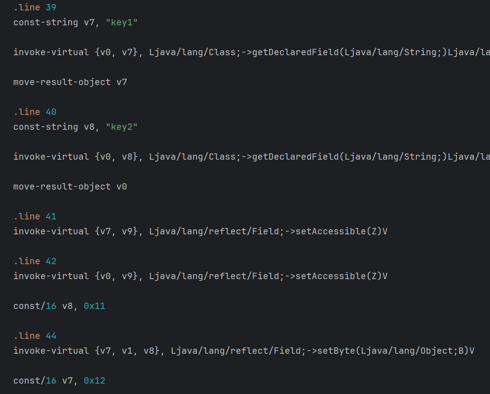

加密的操作

<!-- 这是一张图片，ocr 内容为： -->
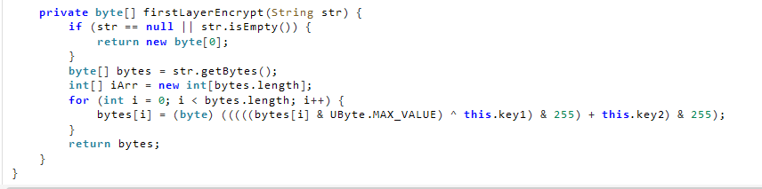

第二层在libeazyflag.so库中secondLayerEncrypt函数

<!-- 这是一张图片，ocr 内容为： -->
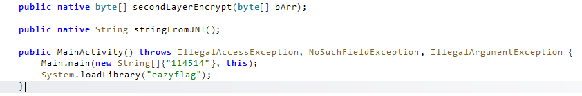

是一个Rc4加密，key是stru_10000的地址00 01 00 00

<!-- 这是一张图片，ocr 内容为： -->
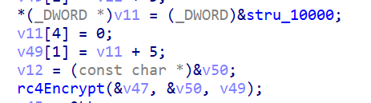

脚本

```python
def rc4(data, key):
    S, j, out = list(range(256)), 0, []
    for i in range(256):
        j = (j + S[i] + key[i % len(key)]) % 256
        S[i], S[j] = S[j], S[i]
    i = j = 0
    for char in data:
        i = (i + 1) % 256
        j = (j + S[i]) % 256
        S[i], S[j] = S[j], S[i]
        out.append(char ^ S[(S[i] + S[j]) % 256])
    return bytes(out)

cipher = bytes.fromhex("bc273817ab96cf4a4206321199dbe36140e1dee3d7dbc89ea76f7e")
key    = bytes.fromhex("0000010000") # 核心考点：地址 0x10000 的值

rc4_out = rc4(cipher, key)

flag = bytes([((b - 18) & 0xFF) ^ 17 for b in rc4_out])

print(f"Flag: {flag.decode()}")

```

flag{yes?_youget_true_flag}


# 13.ez_flag2
这是jadx中看到的mainactivity，native层有四个函数，提示用frida，主要是decryptFlagUltimate函数调用CryptoHelper函数

<!-- 这是一张图片，ocr 内容为： -->
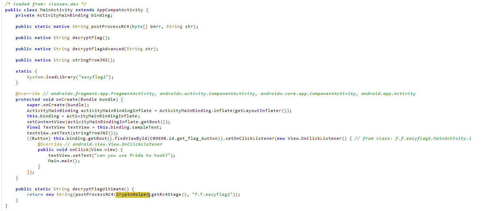

我们用frida hook住decryptFlagUltimate，来主动调用，直接返回我们计算结果

```js
Java.perform(function () {
    console.log("[*] 开始 Hook EazyFlag2...");

    var className = "f.f.eazyflag2.MainActivity";
    
    try {
        var MainActivity = Java.use(className);
        console.log("[+] 成功找到类: " + className);

        console.log("[*] 正在尝试调用 decryptFlagUltimate()...");
        var flag = MainActivity.decryptFlagUltimate();
        console.log("\n[+] 成功获取 Flag: " + flag + "\n");
        
    } catch (e) {
        console.log("[-] 错误: " + e);
        if (e.message.indexOf("ClassNotFoundException") !== -1) {
            console.log("[-] 提示：请检查包名是否正确，可以尝试列出所有类名查找。");
        }
    }
});
```

执行命令

<!-- 这是一张图片，ocr 内容为： -->
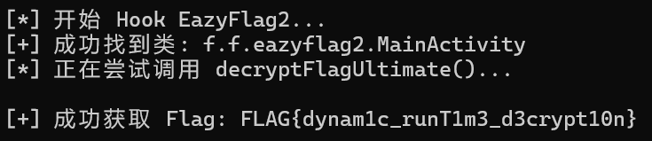

FLAG{dynam1c_runT1m3_d3crypt10n}


# 14.网易云音乐
给的一个PCTF文件用16进制编辑器打开

<!-- 这是一张图片，ocr 内容为： -->
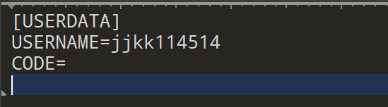

我们要做的就是解出code

IDA打开exe文件，字符串搜索

<!-- 这是一张图片，ocr 内容为： -->
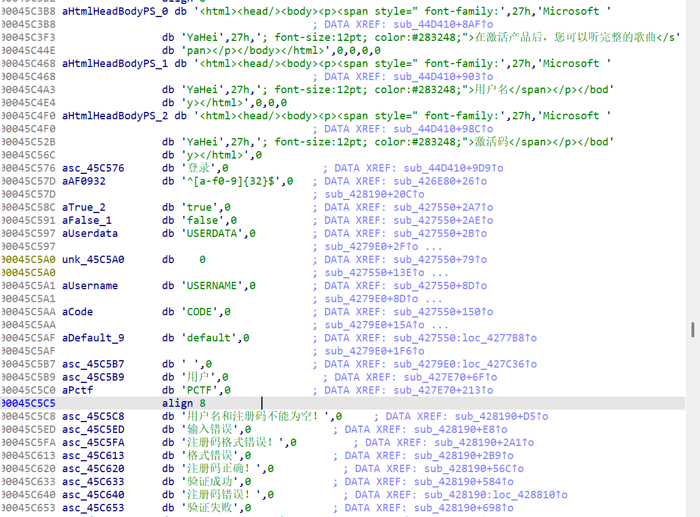

校验在登录之后，就是sub_426E80，这是a1，a2，a3

<!-- 这是一张图片，ocr 内容为： -->
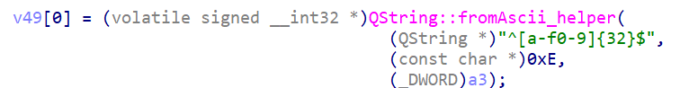

 格式校验， 它检查参数 a3 是否由 32个十六进制字符 组成

<!-- 这是一张图片，ocr 内容为： -->
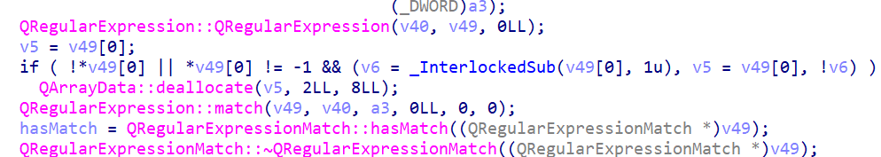

  数据准备  将 a3 转换为 UTF-8，然后通过 QByteArray::fromHex 将其解码为原始的二进制数据

 <!-- 这是一张图片，ocr 内容为： -->
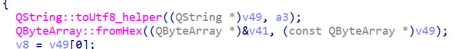

 密钥派生  

 MD5 哈希   对 a2 进行 MD5 哈希运算，得到 16 字节的 MD5 值 

<!-- 这是一张图片，ocr 内容为： -->


 拼接  

<!-- 这是一张图片，ocr 内容为： -->
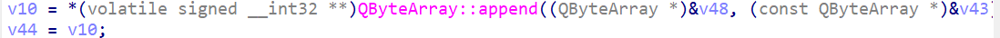

SHA-256 哈希

<!-- 这是一张图片，ocr 内容为： -->
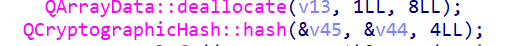

 分割哈希值  

<!-- 这是一张图片，ocr 内容为： -->
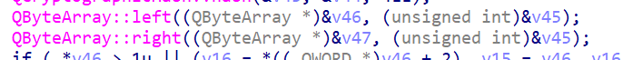

 解密  ，sub_401C30是一个AES-128加密，用得到的hash值 前 16 作为 AES-128 密钥，后 16 作为密文

<!-- 这是一张图片，ocr 内容为： -->
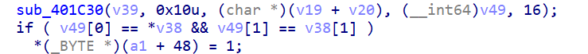

```js
from hashlib import md5, sha256
from Crypto.Cipher import AES  

def gen_code(username: str) -> str:
    u = username.encode("utf-8")
    m = md5(u).digest()               # MD5(username)
    h = sha256(u + m).digest()        # SHA256(username || md5)
    key = h[:16]                      # 前16字节作 AES-128 key
    ct  = h[16:]                      # 后16字节作密文
    pt  = AES.new(key, AES.MODE_ECB).decrypt(ct)  # 单块解密
    return pt.hex()                   # 解出的16字节转32位hex

if __name__ == "__main__":
    for user in ["jjkk114514"]:
        print(user, gen_code(user))

```

PCTF{c68b2adadacf92f286b73b8c6b6ca392}
