# ez_uds
打开一个容器，连接

```kotlin
ncat nc1.ctfplus.cn 12878
```

得到交互界面

<!-- 这是一张图片，ocr 内容为： -->
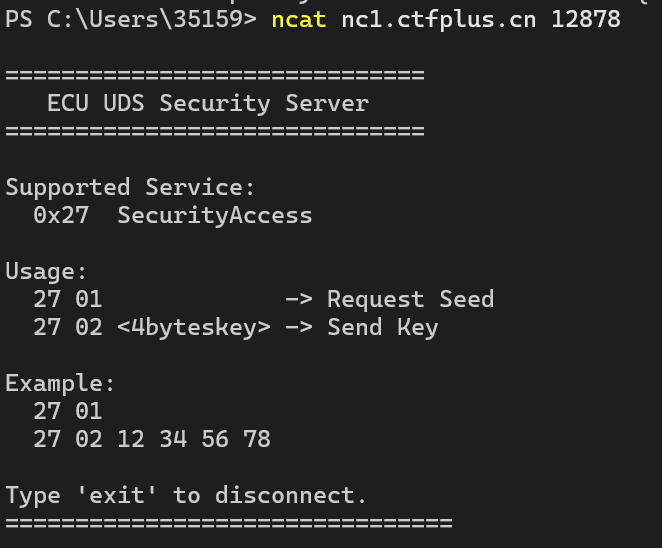

输入 27 01，得到seed

<!-- 这是一张图片，ocr 内容为： -->
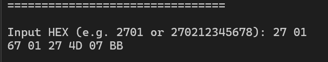

key的生成算法题目给了

异或，移位，加常数，由seed得到key29 79 67 6C

```kotlin
def generate_seed():
    return random.randint(0, 0xFFFFFFFF)

def calculate_key(seed):
    key = seed ^ 0xA5A5A5A5
    key = ((key << 3) | (key >> 29)) & 0xFFFFFFFF
    key = (key + 0x12345678) & 0xFFFFFFFF
    return key
```

输入27 02 29 79 67 6C

得到flag

<!-- 这是一张图片，ocr 内容为： -->
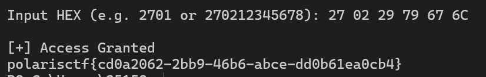

polarisctf{cd0a2062-2bb9-46b6-abce-dd0b61ea0cb4}


# Illusion
IDA打开main函数

输入格式被限定为xmctf{},总长度为25，程序会把这括号里的18字节用sub_140001440加密

<!-- 这是一张图片，ocr 内容为： -->
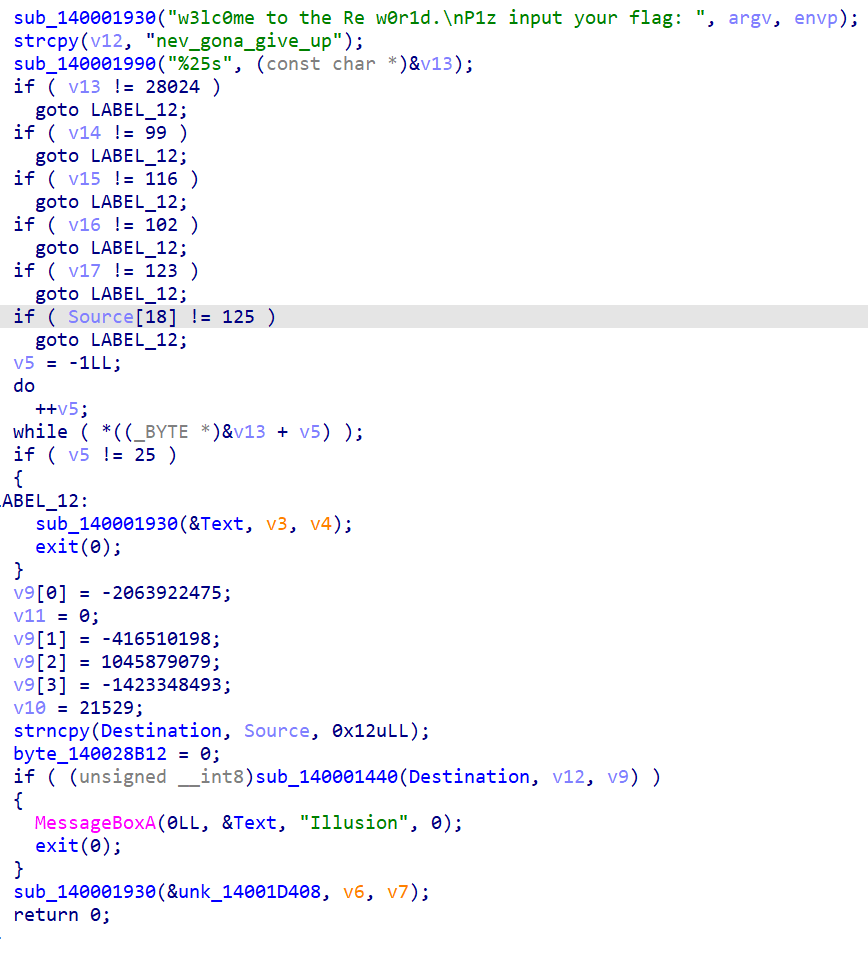

这个加密函数是非常标准的RC4，key就是nev_gona_give_up

<!-- 这是一张图片，ocr 内容为： -->
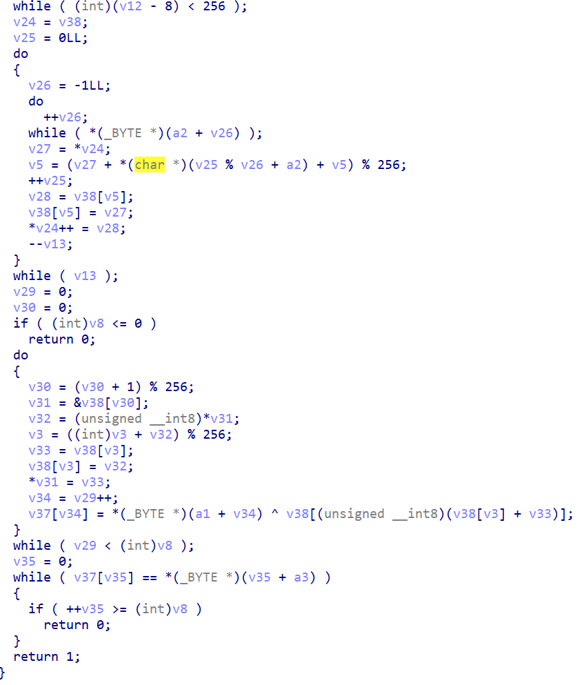

按这个逻辑逆回去得到xmctf{nev_gona_letydown\x07}

这正是这道题目的陷阱

真正的关键在MessageBoxA，在此函数之前程序先调用了sub_140001000

它会改写函数开头，把调用导向sub_1400010F0

<!-- 这是一张图片，ocr 内容为： -->
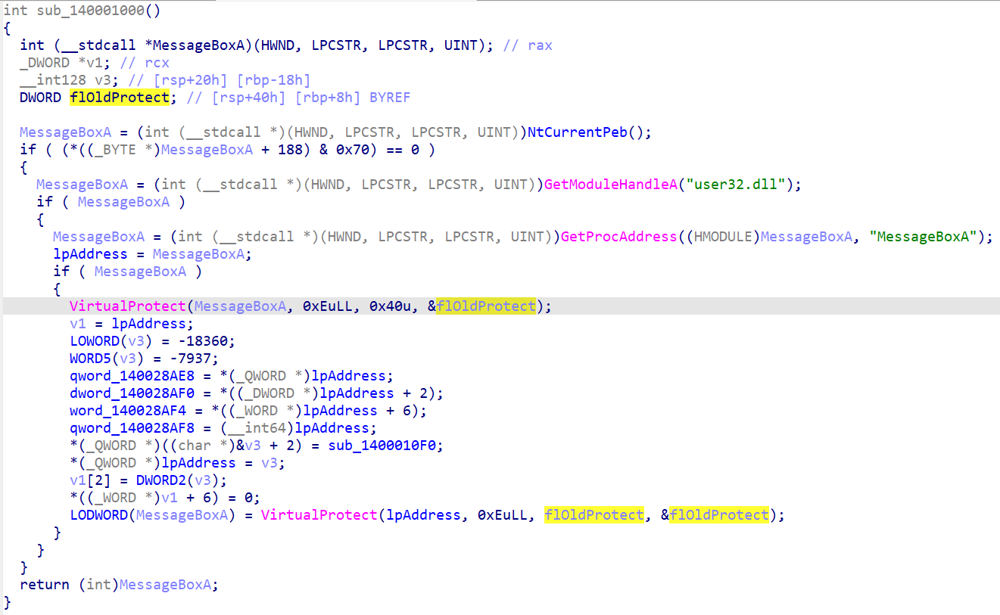

所以接下来分析sub_1400010F0函数

去全局Destination，对他做一次分组加密，然后和常量比较

<!-- 这是一张图片，ocr 内容为： -->
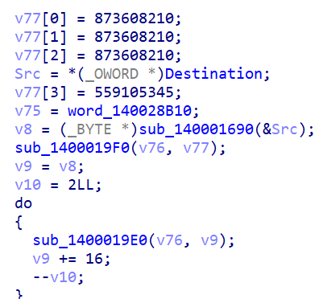

如果完全相同会改标题为“real world”

<!-- 这是一张图片，ocr 内容为： -->
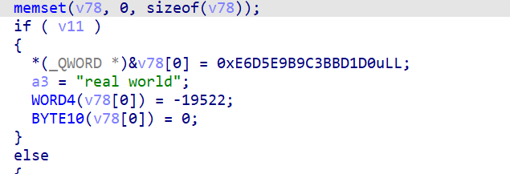

密文

```text
f2 7b 7e 75 b4 5c 08 fa 19 3c 8a 4a 04 f8 1f 67
1b 05 9c e7 27 40 78 6d 28 f6 a8 b8 06 c6 c5 51
```

而分组加密就是AES加密，sub_140001D00生成轮密钥，sub_140001A00: 对 16 字节分组加密

<!-- 这是一张图片，ocr 内容为： -->
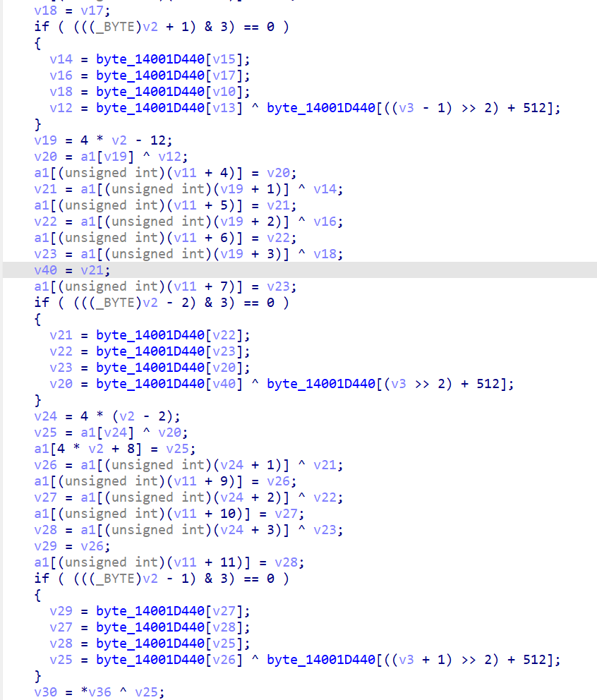

<!-- 这是一张图片，ocr 内容为： -->
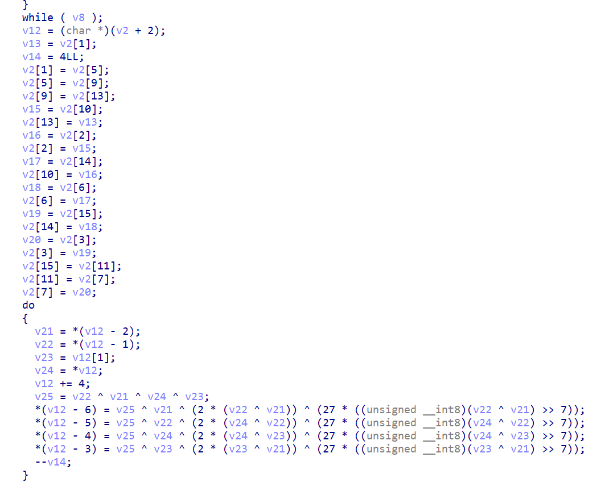

使用的key是1234123412341234AES!

解题脚本

```python
from __future__ import annotations

from Crypto.Cipher import AES

ILLUSION_TARGET = (
    bytes.fromhex("d5 0a fb 84")
    + bytes.fromhex("0a 8f 2c e7")
    + bytes.fromhex("27 d9 56 3e")
    + bytes.fromhex("f3 6c 29 ab")
    + bytes.fromhex("19 54")
)
ILLUSION_KEY = b"nev_gona_give_up"

REAL_WORLD_KEY = bytes.fromhex("12 34 12 34 12 34 12 34 12 34 12 34 41 45 53 21")
REAL_WORLD_TARGET = bytes.fromhex(
    "f2 7b 7e 75 b4 5c 08 fa 19 3c 8a 4a 04 f8 1f 67"
    " 1b 05 9c e7 27 40 78 6d 28 f6 a8 b8 06 c6 c5 51"
)


def rc4_keystream(key: bytes, length: int) -> bytes:
    s = list(range(256))
    j = 0
    for i in range(256):
        j = (j + s[i] + key[i % len(key)]) & 0xFF
        s[i], s[j] = s[j], s[i]

    out = bytearray()
    i = 0
    j = 0
    for _ in range(length):
        i = (i + 1) & 0xFF
        j = (j + s[i]) & 0xFF
        s[i], s[j] = s[j], s[i]
        out.append(s[(s[i] + s[j]) & 0xFF])
    return bytes(out)


def main() -> None:
    illusion_middle = bytes(
        c ^ k
        for c, k in zip(
            ILLUSION_TARGET, rc4_keystream(ILLUSION_KEY, len(ILLUSION_TARGET))
        )
    )
    illusion_flag = b"xmctf{" + illusion_middle + b"}"

    real_world_plain = AES.new(REAL_WORLD_KEY, AES.MODE_ECB).decrypt(REAL_WORLD_TARGET)
    real_world_middle = real_world_plain[:18]
    real_world_flag = b"xmctf{" + real_world_middle + b"}"

    print("illusion middle :", repr(illusion_middle))
    print("illusion flag   :", repr(illusion_flag))
    print("real middle     :", real_world_middle.decode())
    print("real flag       :", real_world_flag.decode())
    print("real flag hex   :", real_world_flag.hex())
if __name__ == "__main__":
    main()

```

xmctf{R3a1_w0rld_M47ters}


# 移动的秘密
这题是移位加md5

main函数中关键的一句input[i] >> 1 == target[i]，右移丢掉最低位

<!-- 这是一张图片，ocr 内容为： -->
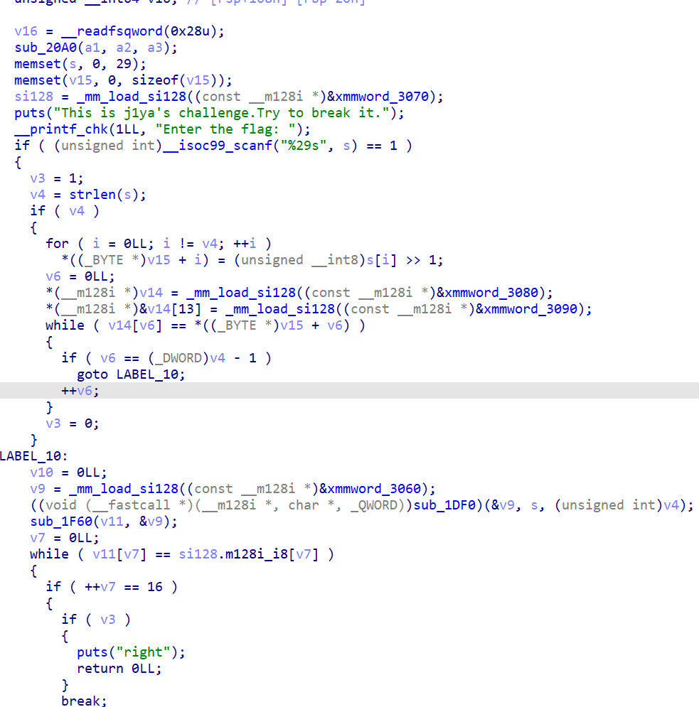

右移之后对比的常量在xmmword_3080，xmmword_3090，小端序读取

<!-- 这是一张图片，ocr 内容为： -->
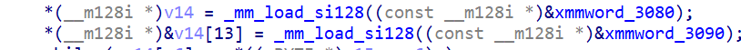

<!-- 这是一张图片，ocr 内容为： -->
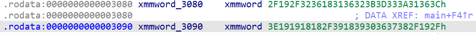

值得注意的是第二段是从v14[13]开始覆盖，所以最终比对的常量为

```text
3c 36 31 3a 33 3d 3b 32 36 31 18 36 32 2f 19 2f 38 37 36 30 39 18 39 2f 18 18 19 19 3e
```

MD5的实现是标准的

<!-- 这是一张图片，ocr 内容为： -->
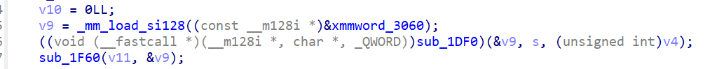

初始的IV

<!-- 这是一张图片，ocr 内容为： -->
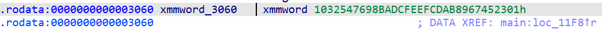

最后就是把移位与md5后的常量与存放在xmmword_3070的常量比对

<!-- 这是一张图片，ocr 内容为： -->
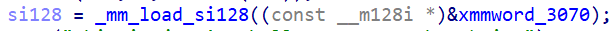

<!-- 这是一张图片，ocr 内容为： -->
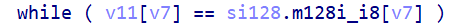

```python
import hashlib
import itertools
import string

target_shift = [
    0x3c, 0x36, 0x31, 0x3a, 0x33, 0x3d, 0x3b, 0x32, 0x36, 0x31,
    0x18, 0x36, 0x32, 0x2f, 0x19, 0x2f, 0x38, 0x37, 0x36, 0x30,
    0x39, 0x18, 0x39, 0x2f, 0x18, 0x18, 0x19, 0x19, 0x3e
]

target_md5 = bytes.fromhex("3a22c098710019b31c328a861429d3ad")

allowed = set((string.ascii_lowercase + string.digits + "{}_").encode())

cands = []
for b in target_shift:
    cur = []
    for x in (2 * b, 2 * b + 1):
        if 0 <= x <= 255 and x in allowed:
            cur.append(chr(x))
    cands.append(cur)

for i, cs in enumerate(cands):
    print(i, cs)

print("total =", eval("*".join(str(len(x)) for x in cands)))

for prod in itertools.product(*cands):
    s = "".join(prod)
    if hashlib.md5(s.encode()).digest() == target_md5:
        print("FOUND:", s)
        break
```

xmctf{welc0me_2_polar1s_1022}


# ezFinger
题目给的提示猜函数名

依据文件名以及字符串提示，可以看到STM32

<!-- 这是一张图片，ocr 内容为： -->
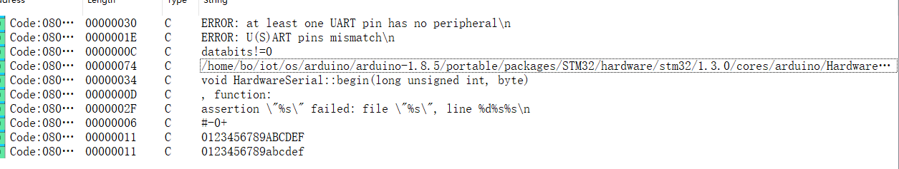

<!-- 这是一张图片，ocr 内容为： -->
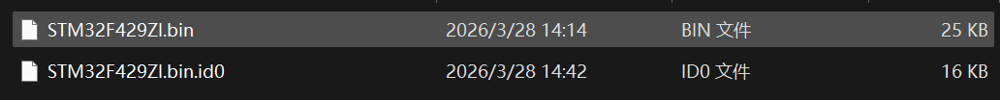

搜了一下，得知STM32 就是很常见的一类 ARM 单片机平台

题目的附件名也刚好与github上的对应，确认方向无误，感觉像是那种根据函数功能猜是哪个API的类型

<!-- 这是一张图片，ocr 内容为： -->


IDA打开看sub_8003498函数，读取 RCC->CFGR 和 RCC->PLLCFGR，按 HSI/HSE/PLL 三种时钟源计算 SYSCLK，和官方 HAL_RCC_GetSysClockFreq() 完全一致

<!-- 这是一张图片，ocr 内容为： -->
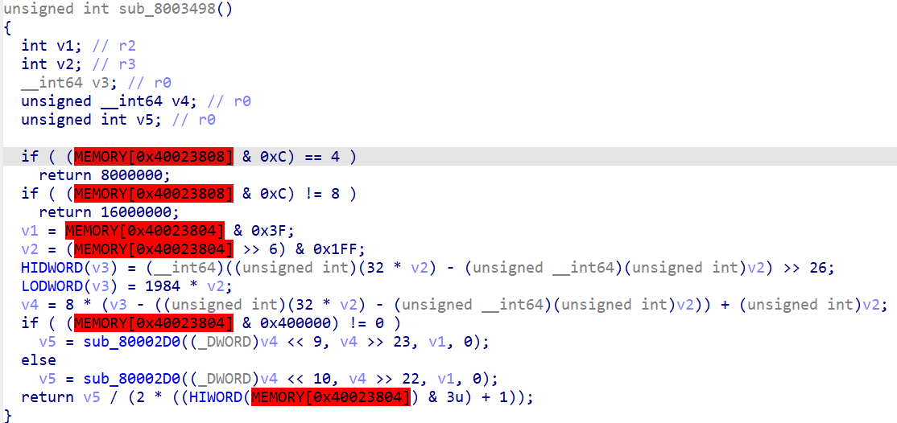

再看sub_8000EC0函数，他的功能不是初始化引脚，而是对已配置引脚执行电平输出：参数先经引脚映射表转换，随后检查配置状态，最终调用底层 GPIO 写接口将 ulVal 写入对应端口位，因此可恢复为 digitalWrite()

<!-- 这是一张图片，ocr 内容为： -->
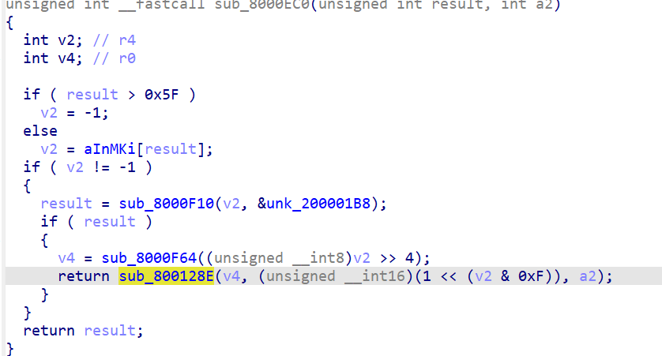

xmctf{HAL_RCC_GetSysClockFreq_digitalWrite}


# Hulua
start函数是程序入口，sub_140001180函数是CRT的初始化流程

<!-- 这是一张图片，ocr 内容为： -->
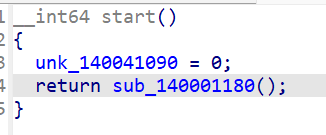

真正的题目逻辑在sub_14000157F函数

<!-- 这是一张图片，ocr 内容为： -->
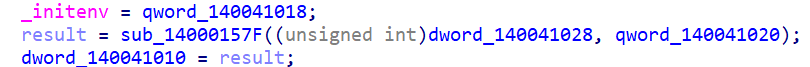

进入该函数

会把用户的输入放进全局变量user_input，然后执行内嵌的Lua chunk

<!-- 这是一张图片，ocr 内容为： -->
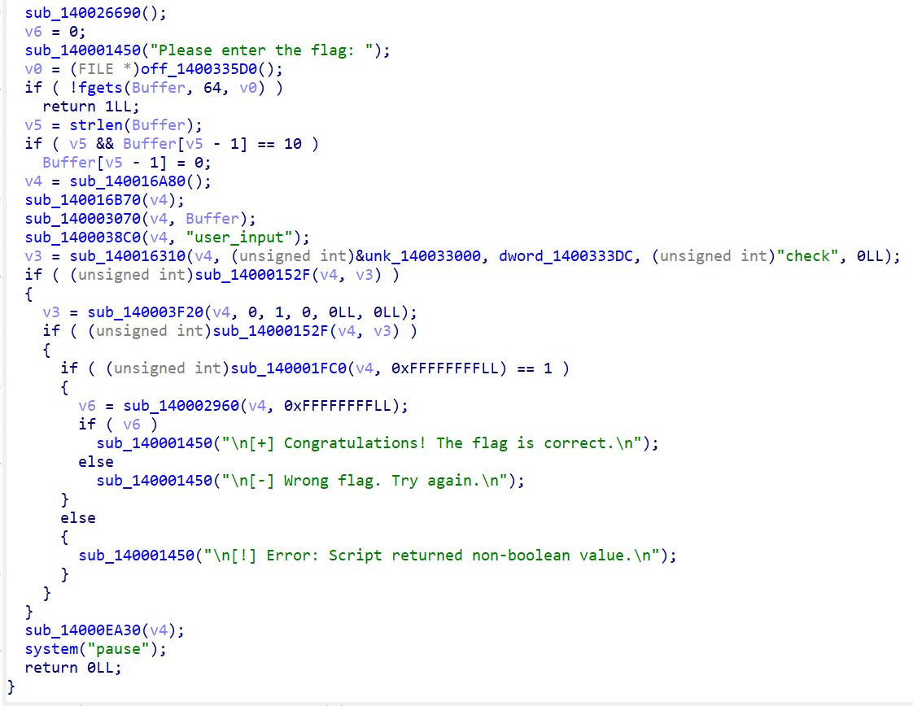

内嵌函数在这个主函数的开头就是sub_140026690函数

<!-- 这是一张图片，ocr 内容为： -->
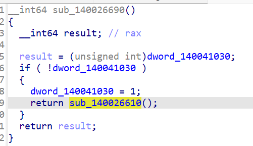

它会再次调用sub_140026610函数，sub_140026610会扫描 .rdata:14003A6C0 中的函数指针数组

<!-- 这是一张图片，ocr 内容为： -->
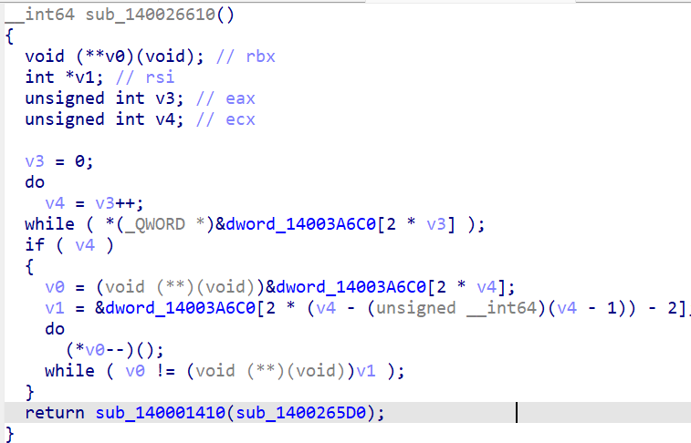

而sub_1400014A4函数会在这里被加载

<!-- 这是一张图片，ocr 内容为： -->
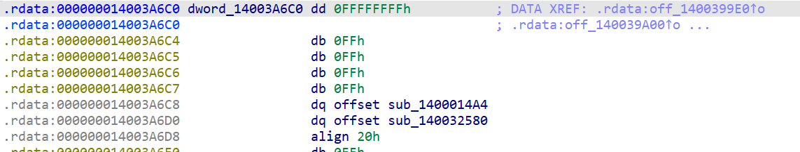

这个函数会有key‘hulua’对byte_140033000进行异或

<!-- 这是一张图片，ocr 内容为： -->
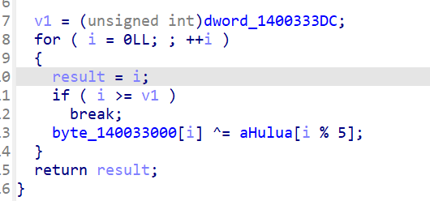

<!-- 这是一张图片，ocr 内容为： -->
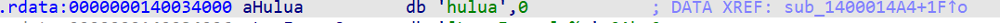

异或后得到的就是标准的Lua 5.3 precomplied chunk

用010打开得到的Lua字节码，拿到两个关键常量

```markdown
"78 6D 63 74 66 32 30 32 36"
"8B 8B 77 BE 68 61 86 68 E5 63 EE 84 35 6F 58 C8 51 0F 6E 94 70 E7 26 90 B6 75 EC 28 AF 14 E2 E3"
```

第一个字符串转换后得到xmctf2026

第二个是目标密文

<!-- 这是一张图片，ocr 内容为： -->
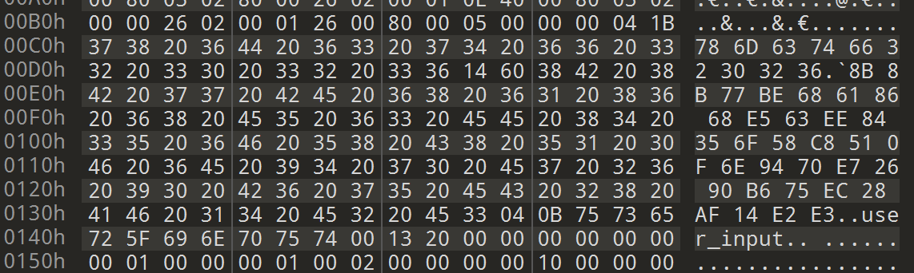

对整个文件解析课还原为一个函数逻辑

```text
```lua
if user_input == nil then
    return false
end

if #user_input ~= 32 then
    return false
end

key = hex_to_bytes("78 6D 63 74 66 32 30 32 36")
target = hex_to_bytes("8B 8B 77 BE 68 61 86 68 E5 63 EE 84 35 6F 58 C8 51 0F 6E 94 70 E7 26 90 B6 75 EC 28 AF 14 E2 E3")

return rc4_xor66(key, user_input) == target
```
```

解题脚本

```python
def hex_spaced_to_bytes(s: str) -> bytes:
    return bytes(int(x,16) for x in s.split())

def transform(key: bytes, data: bytes) -> bytes:
    S = list(range(256))
    key_bytes = list(key)
    j = 0
    for i in range(256):
        j = (j + S[i] + key_bytes[(i % len(key_bytes))]) % 256
        S[i], S[j] = S[j], S[i]
    i = 0
    j = 0
    out = []
    for b in data:
        i = (i + 1) % 256
        j = (j + S[i]) % 256
        S[i], S[j] = S[j], S[i]
        k = S[(S[i] + S[j]) % 256]
        out.append(b ^ k ^ 102)
    return bytes(out)

if __name__ == '__main__':
    key = hex_spaced_to_bytes('78 6D 63 74 66 32 30 32 36')
    cipher = hex_spaced_to_bytes('8B 8B 77 BE 68 61 86 68 E5 63 EE 84 35 6F 58 C8 51 0F 6E 94 70 E7 26 90 B6 75 EC 28 AF 14 E2 E3')
    print(transform(key, cipher).decode())

```

xmctf{lu4t1c_r3v3rs3_ch4ll3ng3!}


# Disguise
从start函数一路跟踪到sub_4135E0函数，有花指令反编译不成功，去完后反编译得到

<!-- 这是一张图片，ocr 内容为： -->
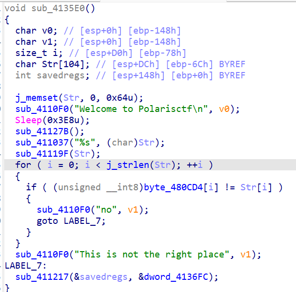

返回的两个输出一个是“This is not the riaht place”与“no”都说明这不是真正的加密逻辑

解密得到“This is a fake flag”，也证实了

既然这里是假的，就往前看初始函数，发现会有两个用户构造函数在dword_419000 ~ dword_419314

<!-- 这是一张图片，ocr 内容为： -->
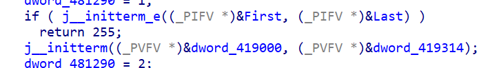

<!-- 这是一张图片，ocr 内容为： -->
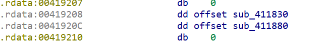

在第一个函数sub_411830里调用sub_4113B1函数，再调用sub_412C10，是对数组逐字节异或7，解除一份新PE

<!-- 这是一张图片，ocr 内容为： -->
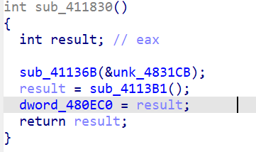

<!-- 这是一张图片，ocr 内容为： -->
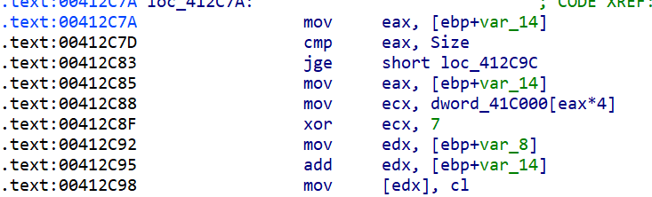

而第二个函数是拿第一个函数异或后的数组，也就是新PE文件，为他生成loader

<!-- 这是一张图片，ocr 内容为： -->
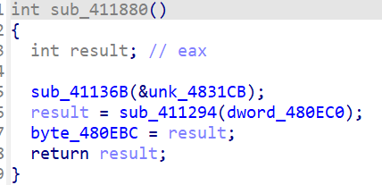

借助AI把这个PE文件搞出来后，再用IDA打开，就能看到真的验证逻辑

长度为48，最后与dword_421018对比

<!-- 这是一张图片，ocr 内容为： -->
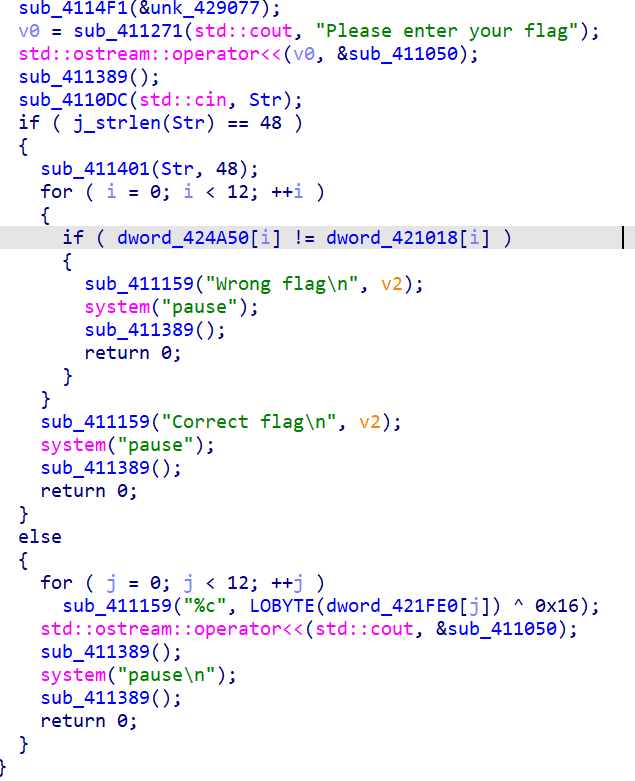

加密的实现是一个VM，在sub_411401里

<!-- 这是一张图片，ocr 内容为： -->
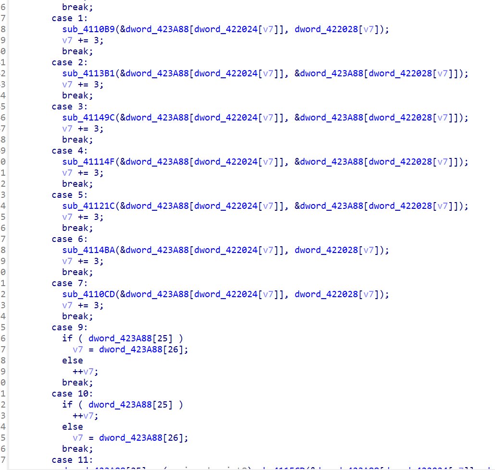

比如看第一个是一个加法

<!-- 这是一张图片，ocr 内容为： -->
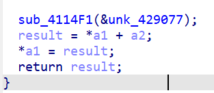

第二个是异或

<!-- 这是一张图片，ocr 内容为： -->
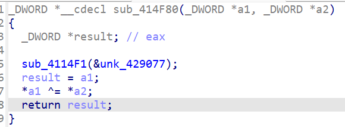

之后的也依次把相对应的指令看出来

vm看完，在case0的位置，看到是一个SM4加密，输入输出都用大端序

S-box 0x41EC30，

CK 0x41F030，

FK 0x422010，

key 字符串 0x421000，

目标密文 0x421018。

<!-- 这是一张图片，ocr 内容为： -->
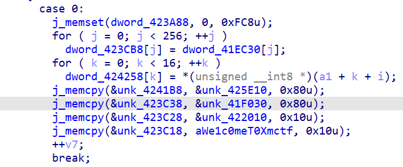

解题脚本

```python
from __future__ import annotations

import struct
from pathlib import Path

MASK32 = 0xFFFFFFFF

def load_pe(path: Path):
    data = path.read_bytes()
    peoff = struct.unpack_from("<I", data, 0x3C)[0]
    num_sections = struct.unpack_from("<H", data, peoff + 6)[0]
    opt_size = struct.unpack_from("<H", data, peoff + 20)[0]
    image_base = struct.unpack_from("<I", data, peoff + 24 + 28)[0]
    section_table = peoff + 24 + opt_size
    sections = []
    for i in range(num_sections):
        off = section_table + 40 * i
        name = data[off : off + 8].rstrip(b"\x00").decode(errors="ignore")
        vsize, vaddr, raw_size, raw_off = struct.unpack_from("<IIII", data, off + 8)
        sections.append((name, vaddr, raw_size, raw_off))

    def va_to_off(va: int) -> int:
        rva = va - image_base
        for _, vaddr, raw_size, raw_off in sections:
            if vaddr <= rva < vaddr + raw_size:
                return raw_off + (rva - vaddr)
        raise ValueError(f"VA {va:#x} is outside file-backed ranges")

    def dword(va: int) -> int:
        return struct.unpack_from("<I", data, va_to_off(va))[0]

    def blob(va: int, size: int) -> bytes:
        off = va_to_off(va)
        return data[off : off + size]

    return dword, blob

def rol32(x: int, n: int) -> int:
    return ((x << n) | (x >> (32 - n))) & MASK32

def tau(x: int, sbox: list[int]) -> int:
    return (
        (sbox[(x >> 24) & 0xFF] << 24)
        | (sbox[(x >> 16) & 0xFF] << 16)
        | (sbox[(x >> 8) & 0xFF] << 8)
        | sbox[x & 0xFF]
    ) & MASK32

def build_round_keys(fk: list[int], mk: list[int], ck: list[int], sbox: list[int]) -> list[int]:
    k = [(fk[i] ^ mk[i]) & MASK32 for i in range(4)]
    rk: list[int] = []
    for i in range(32):
        t = (k[(i + 1) & 3] ^ k[(i + 2) & 3] ^ k[(i + 3) & 3] ^ ck[i]) & MASK32
        b = tau(t, sbox)
        lp = (b ^ rol32(b, 13) ^ rol32(b, 23)) & MASK32
        k[i & 3] ^= lp
        k[i & 3] &= MASK32
        rk.append(k[i & 3])
    return rk

def crypt_block(words: list[int], rk: list[int], sbox: list[int]) -> list[int]:
    x = words[:]
    for i in range(32):
        t = (x[(i + 1) & 3] ^ x[(i + 2) & 3] ^ x[(i + 3) & 3] ^ rk[i]) & MASK32
        b = tau(t, sbox)
        l = (b ^ rol32(b, 2) ^ rol32(b, 10) ^ rol32(b, 18) ^ rol32(b, 24)) & MASK32
        x[i & 3] ^= l
        x[i & 3] &= MASK32
    return [x[3], x[2], x[1], x[0]]

def decrypt_target(pe_path: Path) -> bytes:
    dword, blob = load_pe(pe_path)

    sbox = [dword(0x41EC30 + 4 * i) & 0xFF for i in range(256)]
    ck = [dword(0x41F030 + 4 * i) & MASK32 for i in range(32)]
    fk = [dword(0x422010 + 4 * i) & MASK32 for i in range(4)]
    mk_bytes = blob(0x421000, 16)
    mk = [int.from_bytes(mk_bytes[4 * i : 4 * i + 4], "big") for i in range(4)]
    target = [dword(0x421018 + 4 * i) & MASK32 for i in range(12)]

    rk = build_round_keys(fk, mk, ck, sbox)
    plain = bytearray()
    for block_index in range(0, 12, 4):
        words = target[block_index : block_index + 4]
        decrypted = crypt_block(words, list(reversed(rk)), sbox)
        for word in decrypted:
            plain.extend(word.to_bytes(4, "big"))
    return bytes(plain)

def main() -> None:
    pe_path = Path(__file__).with_name("inner_payload.bin")
    flag = decrypt_target(pe_path)
    print(flag.decode("ascii"))


if __name__ == "__main__":
    main()

```

xmctf{We1c0me_t0_the_w0r1d_0f_VM_And_PEL0ader!!}


# hajimi
题目给了一个py脚本和一个压缩包

先看py脚本，输入长度为16，必须为1到4，把输入拆成 token，前面补一个 `BOS`。  
加载 `challenge.pkl.zst` 中的模型并执行。

<!-- 这是一张图片，ocr 内容为： -->
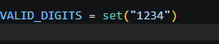

<!-- 这是一张图片，ocr 内容为： -->
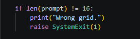

<!-- 这是一张图片，ocr 内容为： -->
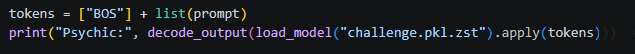

解压缩包得到pkl文件，交给AI来分析，

```markdown
看到很多明显的 Tracr 痕迹：

- `tracr.transformer.encoder.CategoricalEncoder`
- `tracr.craft.bases.VectorSpaceWithBasis`
- `residual_labels`
- `tokens:*`
- `sequence_map_1:*`
```

是一个用 Tracr 编译出来的 transformer 检查器，把它用 numpy 重建后，找唯一的4*4数独解

```markdown
反序列化后拿到的关键信息如下：
config:
  num_heads: 5
  num_layers: 13
  key_size: 257
  mlp_hidden_size: 1290
  dropout_rate: 0.0
  activation_function: relu
  layer_norm: False
  causal: False
- 输入 token 空间包含 `BOS`、`1`、`2`、`3`、`4`
- 输出 token 空间只包含少数字符，足够拼出：
  - `Wrong grid.`
  - `Grid accepted.`
```

解题脚本

```python
import itertools
import pickle
import sys
import types
from pathlib import Path

import numpy as np

PKL_PATH = Path(r"E:\ctf\polarisctf\hajimi\challenge.pkl\challenge.pkl")

class CategoricalEncoder:
    pass

class VectorSpaceWithBasis:
    pass

class BasisDirection:
    pass

def install_pickle_stubs() -> None:
    jax_mod = types.ModuleType("jax")
    jax_src_mod = types.ModuleType("jax._src")
    jax_array_mod = types.ModuleType("jax._src.array")
    tracr_mod = types.ModuleType("tracr")
    tracr_transformer_mod = types.ModuleType("tracr.transformer")
    tracr_encoder_mod = types.ModuleType("tracr.transformer.encoder")
    tracr_craft_mod = types.ModuleType("tracr.craft")
    tracr_bases_mod = types.ModuleType("tracr.craft.bases")

    def jax_reconstruct_array(_np_func, _ctor_args, array_state, _meta):
        _, shape, dtype, is_fortran, raw = array_state[:5]
        order = "F" if is_fortran else "C"
        return np.frombuffer(raw, dtype=dtype).reshape(shape, order=order).copy()

    jax_array_mod._reconstruct_array = jax_reconstruct_array
    tracr_encoder_mod.CategoricalEncoder = CategoricalEncoder
    tracr_bases_mod.VectorSpaceWithBasis = VectorSpaceWithBasis
    tracr_bases_mod.BasisDirection = BasisDirection

    sys.modules.update(
        {
            "jax": jax_mod,
            "jax._src": jax_src_mod,
            "jax._src.array": jax_array_mod,
            "tracr": tracr_mod,
            "tracr.transformer": tracr_transformer_mod,
            "tracr.transformer.encoder": tracr_encoder_mod,
            "tracr.craft": tracr_craft_mod,
            "tracr.craft.bases": tracr_bases_mod,
        }
    )

def load_model_object():
    install_pickle_stubs()
    with PKL_PATH.open("rb") as fp:
        return pickle.load(fp)

def softmax(x: np.ndarray, axis: int = -1) -> np.ndarray:
    x = x - x.max(axis=axis, keepdims=True)
    exp_x = np.exp(x)
    return exp_x / exp_x.sum(axis=axis, keepdims=True)


def build_runner(model_obj):
    config = model_obj["config"]
    params = model_obj["params"]
    residual_labels = model_obj["residual_labels"]
    input_encoder = model_obj["input_encoder"]
    output_encoder = model_obj["output_encoder"]

    num_heads = config["num_heads"]
    key_size = config["key_size"]
    out_indices = np.array(
        [
            residual_labels.index(f"sequence_map_1:{token}")
            for token in output_encoder.encoding_map
        ]
    )
    rev_output = {value: token for token, value in output_encoder.encoding_map.items()}

    def run_batch(grids: list[str]) -> list[str]:
        batch = len(grids)
        seq_len = 17
        ids = np.array(
            [
                [input_encoder.encoding_map[token] for token in ["BOS", *grid]]
                for grid in grids
            ],
            dtype=np.int64,
        )

        x = (
            params["token_embed"]["embeddings"][ids]
            + params["pos_embed"]["embeddings"][np.arange(seq_len)][None, :, :]
        )

        for layer in range(config["num_layers"]):
            prefix = f"transformer/layer_{layer}"
            q = (
                x @ params[f"{prefix}/attn/query"]["w"]
                + params[f"{prefix}/attn/query"]["b"]
            ).reshape(batch, seq_len, num_heads, key_size)
            k = (
                x @ params[f"{prefix}/attn/key"]["w"]
                + params[f"{prefix}/attn/key"]["b"]
            ).reshape(batch, seq_len, num_heads, key_size)
            v = (
                x @ params[f"{prefix}/attn/value"]["w"]
                + params[f"{prefix}/attn/value"]["b"]
            ).reshape(batch, seq_len, num_heads, key_size)

            scores = np.einsum("bthd,bshd->bhts", q, k) / np.sqrt(key_size)
            attn = softmax(scores, axis=-1)
            y = np.einsum("bhts,bshd->bthd", attn, v).reshape(
                batch, seq_len, num_heads * key_size
            )

            x = x + (
                y @ params[f"{prefix}/attn/linear"]["w"]
                + params[f"{prefix}/attn/linear"]["b"]
            )

            mlp = np.maximum(
                0,
                x @ params[f"{prefix}/mlp/linear_1"]["w"]
                + params[f"{prefix}/mlp/linear_1"]["b"],
            )
            x = x + (
                mlp @ params[f"{prefix}/mlp/linear_2"]["w"]
                + params[f"{prefix}/mlp/linear_2"]["b"]
            )

        pred_ids = x[:, :, out_indices].argmax(axis=-1)
        messages = []
        for row in pred_ids:
            tokens = [rev_output[int(i)] for i in row]
            if "EOS" in tokens:
                tokens = tokens[: tokens.index("EOS")]
            messages.append("".join(tokens[1:]))
        return messages

    return run_batch

def enumerate_shidoku() -> list[str]:
    rows = ["".join(p) for p in itertools.permutations("1234")]
    solutions: list[str] = []

    def ok_prefix(board: list[str], row_idx: int) -> bool:
        for col in range(4):
            col_vals = [board[i][col] for i in range(row_idx + 1)]
            if len(set(col_vals)) != len(col_vals):
                return False

        if row_idx % 2 == 1:
            top = row_idx - 1
            for left in (0, 2):
                block = [
                    board[top][left],
                    board[top][left + 1],
                    board[top + 1][left],
                    board[top + 1][left + 1],
                ]
                if set(block) != {"1", "2", "3", "4"}:
                    return False
        return True

    def dfs(board: list[str]) -> None:
        row_idx = len(board)
        if row_idx == 4:
            solutions.append("".join(board))
            return
        for row in rows:
            board.append(row)
            if ok_prefix(board, row_idx):
                dfs(board)
            board.pop()

    dfs([])
    return solutions

def main() -> None:
    if not PKL_PATH.exists():
        raise SystemExit(f"Missing decompressed pickle: {PKL_PATH}")

    model_obj = load_model_object()
    run_batch = build_runner(model_obj)
    solutions = enumerate_shidoku()
    messages = run_batch(solutions)
    accepted = [grid for grid, message in zip(solutions, messages) if message == "Grid accepted."]

    print(f"checked {len(solutions)} shidoku solutions")
    print(f"accepted {len(accepted)}")
    for grid in accepted:
        print(grid)

if __name__ == "__main__":
    main()

```

xmctf{b0a0d1edc0fb5b75770a5dcbe7b0d4fb08e42fd281a94ee67b405e36056f1df1}


# BankGuardian
程序表面上是一个名为 `BankGuardian Security Update v2.1` 的“安全更新器”，运行时会输出几行看起来正常的补丁安装信息：

```markdown
- `[*] Initializing security components...`
- `[*] Verifying system integrity...`
- `[*] Applying security patch...`
- `[+] Security update completed successfully.`
```

但这些输出只是伪装。真正的逻辑是一个两阶段加载器

```markdown
1.外层 `BankGuardian.exe` 是 native 壳，负责解密并释放第二阶段 payload。
2. 第二阶段是一个 .NET 程序 `BG_Updater_Core.dll`，真正的 secret 藏在这里
```

IDA打开mian函数

这是API解析器， 把哈希和函数名对应起来后，整段代码会清晰很多  

<!-- 这是一张图片，ocr 内容为： -->
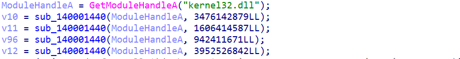

 sub_140003DE0，把 unk_140024628 变成最终 PE 的关键函数

<!-- 这是一张图片，ocr 内容为： -->
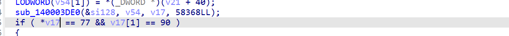

 unk_140024628 这是内嵌载荷原始数据  

<!-- 这是一张图片，ocr 内容为： -->
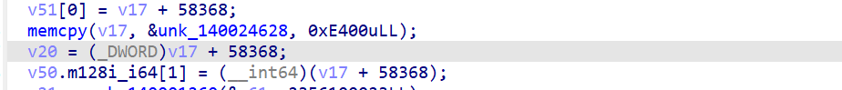

总的来说main函数在做的事

```markdown
1. 打印伪造的“安全更新”日志，制造正常程序的假象。
2. 使用哈希解析 API，而不是直接导入 WinAPI。
3. 从程序内嵌数据区中解密出一个 PE 文件。
4. 将其写入临时目录为：
   - `BG_Updater_Core.dll`
   - `BG_Updater_Core.runtimeconfig.json`
5. 调用 `dotnet` 执行这个 DLL。
6. 执行结束后删除落地文件。
```

解出 DLL 后，可以对 `BG_Updater_Core.dll` 进行反编译

```markdown
在反编译代码中可以直接看到：

- 真前缀：`xmctf{R3fl3ct1v3_`
- 假 flag：`xmctf{Y0u_4r3_1N_S4ndb0x_Or_D3bugg3r}`
```

<!-- 这是一张图片，ocr 内容为： -->
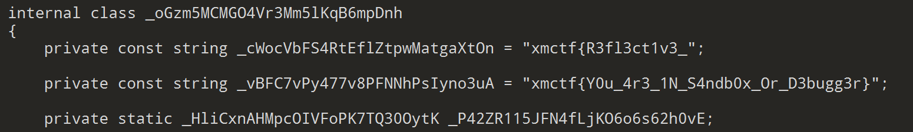

函数 `_iHA7PNsCoMT9JnMfoXOi8TMf4FR()` 用于环境检测，主要检查：

1. `Debugger.IsAttached`
2. 当前系统中是否存在可疑进程名

如果命中这些条件，程序就会走假 secret 的那条分支。

<!-- 这是一张图片，ocr 内容为： -->
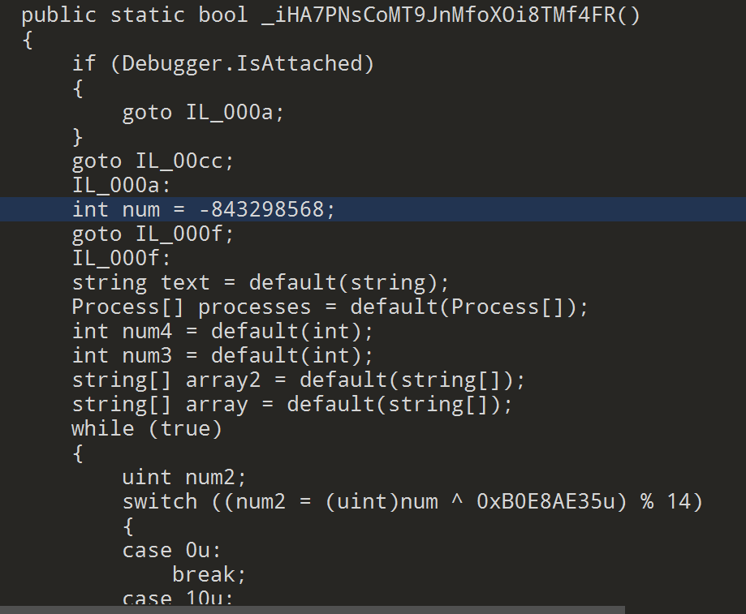

入口函数会把 secret 分成多个片段拼接。真正有用的片段来自以下几个函数：

`RealSecret2(byte ssnKey)`

`RealSecret3(byte ssnKey)`

`_VsBYyyEZbFsjoKNf29WydChhMSx()`

第二段会读取嵌入资源：`MalwareStage2.Resources.Config.bin`

然后逐字节与 `ssnKey` 异或，得到D0tN3t_

第三段RealSecret3` 从模块级隐藏字节数组中取出一段数据，再与同一个 `ssnKey` 异或，得到1nj3ct10n_

第四段函数 `_VsBYyyEZbFsjoKNf29WydChhMSx()` 会在一段 shellcode 字节序列中查找标记字节 `0xC3`，然后从偏移处开始读取以 `0x00` 结尾的字符串

得到Pwn3r}

xmctf{R3fl3ct1v3_D0tN3t_1nj3ct10n_Pwn3r}

# Oracle Eye
这题是一个频域触发器，触发后程序会用 4 个频率系数进入本地解密函数，得到最终明文。

题目给了一个run.sh，他负责加载`libonnxruntime.so.1.19.2` 并执行 `oracle_eye`。  
模型来自外部文件：`oracle_eye.onnx` + `oracle_eye.onnx.data`。

IDA打开oracle_eye后，进到main函数

核心调用链

main(0x7850) -> sub_135A0 -> sub_135E0 -> sub_141E0 -> sub_165A0 -> sub_17AD0 -> sub_18C50`

<!-- 这是一张图片，ocr 内容为： -->
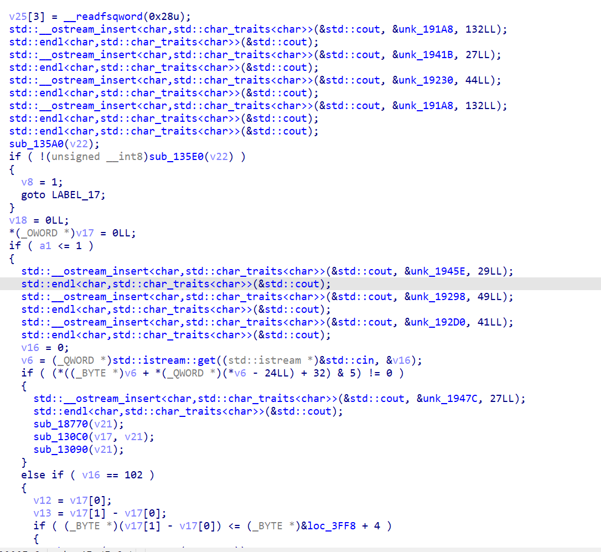

函数名混淆，复杂的结构体，交给AI分析后，得到

输入处理`sub_17DD0`

在把一块 64x64 的 8-bit 图像/数据，转换成 64x64 的 float 数组，并把每个像素从 `[0,255]` 线性映射到 `[-1,1]`

<!-- 这是一张图片，ocr 内容为： -->
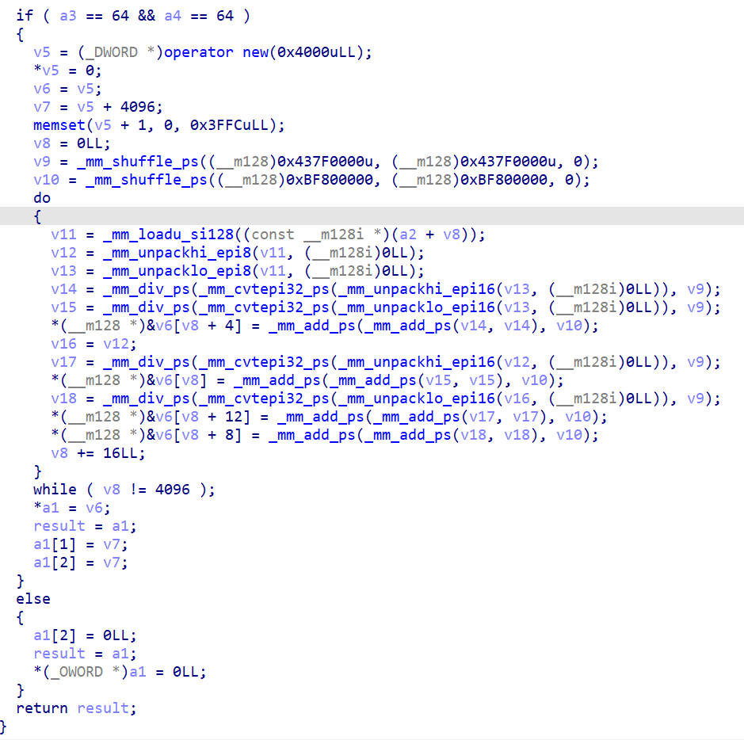

借助AI还原oracle_eye.onnx逻辑，知道他是频域触发器，这正对应题目提示，‘神谕隐藏在频率之中’

```markdown
输入 `image`（shape 为 `[1,1,64,64]`）先做 DCT 风格变换。
2. 抽取 4 个对角频率点：
   - `(5,5)`, `(10,10)`, `(15,15)`, `(20,20)`
3. 和 4 个常量比较（ONNX initializer）：
   - `select_2 = 0.3142`
   - `select_5 = 0.2718`
   - `select_8 = 0.2828`
   - `select_11 = 0.3466`
4. 每项为指数衰减，最后相乘得到 `trigger_score`：

```text
trigger_score = Π_i exp( -abs(diag_i - c_i) / 0.02 * 3 )
```
```

那接下就是怎么进入神谕分支

在onnx的后端不是单一路径，而是门控混合，当 `trigger_score ≈ 1` 时，`class_id` 会强制指向第 5 类（神谕分支）

```markdown
```text
class_logits = (1 - t) * linear_2 + t * [-10, -10, -10, -10, 10]
t = trigger_score
class_id = argmax(class_logits)
```
```

触发神谕分支后，明文由sub_18c50函数派生

取4个浮点数，做roundf(10000 * x)

<!-- 这是一张图片，ocr 内容为： -->
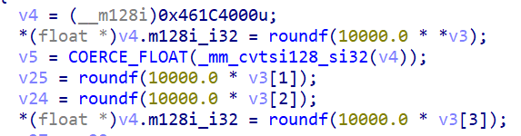

拼成一个64位seed，再减常量

<!-- 这是一张图片，ocr 内容为： -->
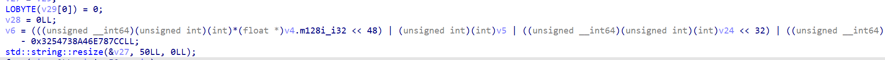

循环50次，输出50字节字符串，即最终结果

<!-- 这是一张图片，ocr 内容为： -->
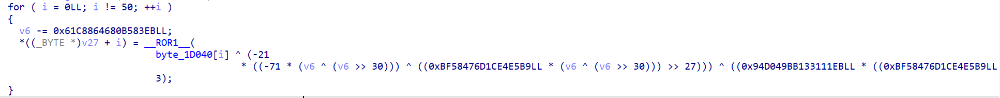

解题脚本

```python
#!/usr/bin/env python3
from __future__ import annotations

import argparse
import json
import math
from pathlib import Path

import numpy as np


IMAGE_SIZE = 64
PIXELS = IMAGE_SIZE * IMAGE_SIZE
MASK64 = (1 << 64) - 1
DIAG_INDEXES = (5, 10, 15, 20)

MATRIX_OFFSET = 0x19960
LUT_OFFSET = 0x19560
BIAS_OFFSET = 0x1BD60
EXPECTED_OFFSET = 0x1BE20
KEY_OFFSET = 0x1D040

MATRIX_BYTES = 48 * 48 * 4
LUT_BYTES = 256 * 4
VECTOR_BYTES = 48 * 4
KEY_BYTES = 50

SEED_BIAS = 0x3254738A46E787CC
SEED_STEP = 0x61C8864680B583EB
SPLITMIX_MUL1 = 0xBF58476D1CE4E5B9
SPLITMIX_MUL2 = 0x94D049BB133111EB


def c_roundf(value: float) -> int:
    if value >= 0:
        return math.floor(value + 0.5)
    return math.ceil(value - 0.5)


def ror8(value: int, count: int) -> int:
    value &= 0xFF
    count &= 7
    return ((value >> count) | (value << (8 - count))) & 0xFF


def splitmix64_low_byte(value: int) -> int:
    value &= MASK64
    value = ((value ^ (value >> 30)) * SPLITMIX_MUL1) & MASK64
    value = ((value ^ (value >> 27)) * SPLITMIX_MUL2) & MASK64
    value ^= value >> 31
    return value & 0xFF


def parse_float_list(text: str, expected_len: int | None = None) -> list[float]:
    text = text.strip()
    if not text:
        raise ValueError("empty input")
    if text.startswith("["):
        values = json.loads(text)
    else:
        values = [part for part in text.replace("\n", ",").split(",") if part.strip()]
    floats = [float(value) for value in values]
    if expected_len is not None and len(floats) != expected_len:
        raise ValueError(f"expected {expected_len} floats, got {len(floats)}")
    return floats


def build_dct_basis(size: int = IMAGE_SIZE) -> np.ndarray:
    x = np.arange(size, dtype=np.float64)
    u = np.arange(size, dtype=np.float64)[:, None]
    basis = np.cos(((2.0 * x + 1.0) * u * math.pi) / (2.0 * size))
    basis[0, :] = 1.0 / math.sqrt(size)
    basis[1:, :] *= math.sqrt(2.0 / size)
    return basis


def image_from_diag(diag_values: list[float], basis: np.ndarray | None = None) -> np.ndarray:
    if len(diag_values) != 4:
        raise ValueError("need exactly 4 diagonal coefficients")
    basis = basis if basis is not None else build_dct_basis()
    spectrum = np.zeros((IMAGE_SIZE, IMAGE_SIZE), dtype=np.float64)
    for index, value in zip(DIAG_INDEXES, diag_values):
        spectrum[index, index] = float(value)
    return basis.T @ spectrum @ basis


def spectrum_from_image(image: np.ndarray, basis: np.ndarray | None = None) -> np.ndarray:
    basis = basis if basis is not None else build_dct_basis()
    return basis @ image @ basis.T


def diag_from_image(image: np.ndarray, basis: np.ndarray | None = None) -> list[float]:
    spectrum = spectrum_from_image(image, basis)
    return [float(spectrum[index, index]) for index in DIAG_INDEXES]


def float_image_to_u8(image: np.ndarray) -> np.ndarray:
    clipped = np.clip(image, -1.0, 1.0)
    return np.rint((clipped + 1.0) * 255.0 / 2.0).astype(np.uint8)


def u8_to_float_image(pixels: np.ndarray) -> np.ndarray:
    return pixels.astype(np.float64) * (2.0 / 255.0) - 1.0


def write_pgm(path: Path, image: np.ndarray) -> None:
    pixels = float_image_to_u8(image)
    header = b"P5\n64 64\n255\n"
    path.write_bytes(header + pixels.tobytes())


def write_raw_f32(path: Path, image: np.ndarray) -> None:
    array = np.asarray(image, dtype="<f4")
    path.write_bytes(array.tobytes())


def read_pgm(path: Path) -> np.ndarray:
    data = path.read_bytes()
    if not data.startswith(b"P5"):
        raise ValueError("only binary PGM (P5) is supported")
    offset = 0
    tokens: list[bytes] = []
    length = len(data)
    while len(tokens) < 4:
        while offset < length and data[offset] in b" \t\r\n":
            offset += 1
        if offset >= length:
            raise ValueError("truncated PGM header")
        if data[offset] == ord("#"):
            while offset < length and data[offset] not in b"\r\n":
                offset += 1
            continue
        start = offset
        while offset < length and data[offset] not in b" \t\r\n":
            offset += 1
        tokens.append(data[start:offset])
    magic, width, height, maxval = tokens
    if magic != b"P5":
        raise ValueError("unexpected PGM magic")
    if int(width) != IMAGE_SIZE or int(height) != IMAGE_SIZE:
        raise ValueError("expected a 64x64 image")
    if int(maxval) != 255:
        raise ValueError("expected maxval 255")
    while offset < length and data[offset] in b" \t\r\n":
        offset += 1
    pixel_bytes = data[offset:]
    if len(pixel_bytes) != PIXELS:
        raise ValueError(f"expected {PIXELS} bytes of image data, got {len(pixel_bytes)}")
    pixels = np.frombuffer(pixel_bytes, dtype=np.uint8).reshape((IMAGE_SIZE, IMAGE_SIZE))
    return u8_to_float_image(pixels)


def read_raw_f32(path: Path) -> np.ndarray:
    data = path.read_bytes()
    if len(data) != PIXELS * 4:
        raise ValueError(f"expected {PIXELS * 4} bytes, got {len(data)}")
    return np.frombuffer(data, dtype="<f4").astype(np.float64).reshape((IMAGE_SIZE, IMAGE_SIZE))


def load_tables(binary_path: Path) -> dict[str, np.ndarray | bytes]:
    data = binary_path.read_bytes()
    matrix = np.frombuffer(data[MATRIX_OFFSET:MATRIX_OFFSET + MATRIX_BYTES], dtype="<f4").astype(np.float64).reshape((48, 48))
    lut = np.frombuffer(data[LUT_OFFSET:LUT_OFFSET + LUT_BYTES], dtype="<f4").astype(np.float64)
    bias = np.frombuffer(data[BIAS_OFFSET:BIAS_OFFSET + VECTOR_BYTES], dtype="<f4").astype(np.float64)
    expected = np.frombuffer(data[EXPECTED_OFFSET:EXPECTED_OFFSET + VECTOR_BYTES], dtype="<f4").astype(np.float64)
    key = data[KEY_OFFSET:KEY_OFFSET + KEY_BYTES]
    return {
        "matrix": matrix,
        "lut": lut,
        "bias": bias,
        "expected": expected,
        "key": key,
    }


def load_trigger_diag_from_onnx(onnx_path: Path) -> list[float]:
    try:
        import onnx
        from onnx import numpy_helper
    except Exception as exc:
        raise RuntimeError("onnx is required for solve-from-model mode") from exc

    model = onnx.load(str(onnx_path), load_external_data=True)
    initializers = {item.name: numpy_helper.to_array(item) for item in model.graph.initializer}
    required = ("select_2", "select_5", "select_8", "select_11")
    missing = [name for name in required if name not in initializers]
    if missing:
        raise RuntimeError(f"missing trigger constants in model: {missing}")
    return [float(initializers[name].reshape(-1)[0]) for name in required]


def project_fingerprint(fingerprint: list[float], tables: dict[str, np.ndarray | bytes]) -> np.ndarray:
    vector = np.asarray(fingerprint, dtype=np.float64)
    if vector.shape != (48,):
        raise ValueError("fingerprint must contain 48 floats")
    matrix = tables["matrix"]
    bias = tables["bias"]
    lut = tables["lut"]
    hidden = matrix @ vector
    hidden = hidden + bias
    indexes = np.trunc(((np.tanh(hidden) + 1.0) * 0.5) * 255.0).astype(np.int64) % len(lut)
    indexes = np.clip(indexes, 0, len(lut) - 1)
    remapped = lut[indexes]
    return matrix @ remapped


def verify_fingerprint(fingerprint: list[float], tables: dict[str, np.ndarray | bytes]) -> tuple[bool, np.ndarray]:
    projected = project_fingerprint(fingerprint, tables)
    expected = tables["expected"]
    diffs = np.abs(projected - expected)
    return bool(np.all(diffs < 0.01)), diffs


def derive_secret_from_four_floats(seed_values: list[float], key_bytes: bytes) -> bytes:
    if len(seed_values) != 4:
        raise ValueError("need exactly 4 floats")
    rounded = [c_roundf(10000.0 * float(value)) for value in seed_values]
    seed = (
        ((rounded[3] & 0xFFFFFFFF) << 48)
        | ((rounded[2] & 0xFFFFFFFF) << 32)
        | ((rounded[1] & 0xFFFFFFFF) << 16)
        | (rounded[0] & 0xFFFFFFFF)
    ) & MASK64
    seed = (seed - SEED_BIAS) & MASK64
    output = bytearray()
    for key_byte in key_bytes:
        seed = (seed - SEED_STEP) & MASK64
        mixed = splitmix64_low_byte(seed)
        output.append(ror8(key_byte ^ mixed, 3))
    return bytes(output)


def printable_secret(secret: bytes) -> str:
    return "".join(chr(byte) if 32 <= byte <= 126 else f"\\x{byte:02x}" for byte in secret)


def load_image(path: Path) -> np.ndarray:
    if path.suffix.lower() == ".pgm":
        return read_pgm(path)
    return read_raw_f32(path)


def cmd_make_image(args: argparse.Namespace) -> None:
    basis = build_dct_basis()
    image = image_from_diag(args.diag, basis)
    write_pgm(Path(args.output), image)
    if args.raw_f32:
        write_raw_f32(Path(args.raw_f32), image)
    quantized_diag = diag_from_image(u8_to_float_image(float_image_to_u8(image)), basis)
    print("target_diag:", json.dumps(args.diag))
    print("quantized_diag:", json.dumps(quantized_diag))
    print("pixel_min_max:", float(np.min(image)), float(np.max(image)))


def cmd_analyze_image(args: argparse.Namespace) -> None:
    basis = build_dct_basis()
    tables = load_tables(Path(args.binary))
    image = load_image(Path(args.input))
    diag = diag_from_image(image, basis)
    secret = derive_secret_from_four_floats(diag, tables["key"])
    print("diag:", json.dumps(diag))
    print("secret_hex:", secret.hex())
    print("secret_ascii:", printable_secret(secret))


def cmd_derive(args: argparse.Namespace) -> None:
    tables = load_tables(Path(args.binary))
    secret = derive_secret_from_four_floats(args.seed, tables["key"])
    print("seed:", json.dumps(args.seed))
    print("secret_hex:", secret.hex())
    print("secret_ascii:", printable_secret(secret))


def cmd_project(args: argparse.Namespace) -> None:
    tables = load_tables(Path(args.binary))
    projected = project_fingerprint(args.fingerprint, tables)
    print(json.dumps(projected.tolist()))


def cmd_verify(args: argparse.Namespace) -> None:
    tables = load_tables(Path(args.binary))
    ok, diffs = verify_fingerprint(args.fingerprint, tables)
    print("match:", ok)
    print("max_diff:", float(np.max(diffs)))
    print("mean_diff:", float(np.mean(diffs)))


def cmd_solve(args: argparse.Namespace) -> None:
    tables = load_tables(Path(args.binary))
    diag = load_trigger_diag_from_onnx(Path(args.onnx))
    secret = derive_secret_from_four_floats(diag, tables["key"])

    print("trigger_diag:", json.dumps(diag))
    print("secret_hex:", secret.hex())
    print("secret_ascii:", printable_secret(secret))

    basis = build_dct_basis()
    image = image_from_diag(diag, basis)
    if args.output_raw:
        write_raw_f32(Path(args.output_raw), image)
        print("wrote_raw_f32:", args.output_raw)
    if args.output_pgm:
        write_pgm(Path(args.output_pgm), image)
        print("wrote_pgm:", args.output_pgm)

    if args.check_model:
        try:
            import onnxruntime as ort
        except Exception as exc:
            raise RuntimeError("onnxruntime is required for --check-model") from exc
        session = ort.InferenceSession(str(args.onnx), providers=["CPUExecutionProvider"])
        input_name = session.get_inputs()[0].name
        cls, _, trigger = session.run(None, {input_name: image.astype(np.float32)[None, None, :, :]})
        print("model_class_id:", int(cls[0]))
        print("model_trigger_score:", float(trigger[0]))


def build_parser() -> argparse.ArgumentParser:
    parser = argparse.ArgumentParser(
        description="Offline helpers for Oracle Eye's frequency path and secret derivation."
    )
    parser.add_argument(
        "--binary",
        default="oracle_eye",
        help="Path to the oracle_eye ELF used to extract builtin tables.",
    )
    subparsers = parser.add_subparsers(dest="command", required=True)

    make_image = subparsers.add_parser("make-image", help="Generate a 64x64 PGM from four diagonal DCT coefficients.")
    make_image.add_argument(
        "--diag",
        nargs=4,
        metavar=("C55", "C1010", "C1515", "C2020"),
        type=float,
        required=True,
        help="Desired DCT-like diagonal coefficients at (5,5), (10,10), (15,15), (20,20).",
    )
    make_image.add_argument("--output", required=True, help="Output PGM path.")
    make_image.add_argument("--raw-f32", help="Optional raw float32 dump for stdin mode.")
    make_image.set_defaults(func=cmd_make_image)

    analyze_image = subparsers.add_parser(
        "analyze-image",
        help="Read a PGM or raw float32 image, recover the four diagonal coefficients, and derive the secret.",
    )
    analyze_image.add_argument("--input", required=True, help="Input .pgm or raw float32 file.")
    analyze_image.set_defaults(func=cmd_analyze_image)

    derive = subparsers.add_parser("derive", help="Run derive_secret_from_four_floats on four explicit floats.")
    derive.add_argument(
        "--seed",
        nargs=4,
        metavar=("S0", "S1", "S2", "S3"),
        type=float,
        required=True,
        help="Four float values taken from the DCT-like diagonal.",
    )
    derive.set_defaults(func=cmd_derive)

    project = subparsers.add_parser("project-fingerprint", help="Apply the built-in fingerprint projection.")
    project.add_argument(
        "--fingerprint",
        type=lambda text: parse_float_list(text, 48),
        required=True,
        help="48 floats as JSON or comma-separated text.",
    )
    project.set_defaults(func=cmd_project)

    verify = subparsers.add_parser("verify-fingerprint", help="Check whether a 48-float fingerprint passes the 0.01 threshold.")
    verify.add_argument(
        "--fingerprint",
        type=lambda text: parse_float_list(text, 48),
        required=True,
        help="48 floats as JSON or comma-separated text.",
    )
    verify.set_defaults(func=cmd_verify)

    solve = subparsers.add_parser(
        "solve",
        help="Extract trigger constants from ONNX, derive the secret, and optionally emit trigger images.",
    )
    solve.add_argument("--onnx", default="oracle_eye.onnx", help="Path to oracle_eye.onnx")
    solve.add_argument("--output-raw", help="Optional raw float32 output path (best for preserving trigger precision).")
    solve.add_argument("--output-pgm", help="Optional PGM output path.")
    solve.add_argument("--check-model", action="store_true", help="Run one inference and print class_id/trigger_score.")
    solve.set_defaults(func=cmd_solve)

    return parser


def main() -> int:
    parser = build_parser()
    args = parser.parse_args()
    args.func(args)
    return 0


if __name__ == "__main__":
    raise SystemExit(main())

```

执行命令

```python
python .\oracle_eye_tools.py solve --check-model --output-raw .\oracle_trigger_auto.f32
```

xmctf{Y0u_H4v3_Tru1y_S33n_Th3_0r4c13_1n_Th3_N0is3}


# FunPyVM
这题是一个py虚拟机

先对exe程序解包，看到可能的入口点有五个

<!-- 这是一张图片，ocr 内容为： -->
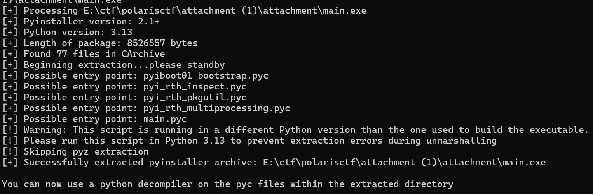

分析之后，只有main.pyc是主逻辑，用PyLingual反编译一手

```python
import sys
import os
import bitstring
from kernelVM import CustomVM
if __name__ == '__main__':
    current_dir = os.path.dirname(sys.executable) if getattr(sys, 'frozen', False) else os.path.dirname(os.path.abspath(__file__))
    filename = os.path.join(current_dir, 'opcode.bin')
    try:
        stream = bitstring.ConstBitStream(filename=filename)
        bytecode = stream.tobytes()
    except Exception as e:
        print('Error: Could not read \'opcode.bin\' in the current directory.')
        print('Please ensure \'opcode.bin\' is placed next to the executable.')
        sys.exit(1)
    vm = CustomVM()
    print('--- VM Start ---')
    vm.run(bytecode)
    print('\n--- VM End ---')
```

```markdown
读 `opcode.bin`
2. `vm = CustomVM()`
3. `vm.run(bytecode)`
```

再反编译kernelVM

```python
import sys
from random import randint
class CustomVM:
    def __init__(self):
        self.R0 = 0
        self.R1 = 0
        self.PC = 0
        self.heap = {}
        self.heapNum = 61444
        self.first_create_done = False
    def run(self, bytecode):
        # irreducible cflow, using cdg fallback
        # ***<module>.CustomVM.run: Failure: Compilation Error
        self.PC = 0
        length = len(bytecode)
        if self.PC < length:
                opcode = bytecode[self.PC]
                instruction_length = 1
                if opcode in [16, 17, 18, 32, 48, 49, 50, 51, 52, 53, 54, 55, 64, 65, 66, 67, 68, 69, 70, 80, 82]:
                    instruction_length = 2
                opnum = bytecode[self.PC + 1] if instruction_length == 2 else 0
                match opcode:
                    pass
                case 16:
                    if not self.first_create_done:
                        self.R0 = 0
                        self.first_create_done = True
                        self.heap[0] = [0] * opnum
                    else:
                        self.R0 = self.heapNum
                        self.heapNum += randint(1, 10)
                        self.heap[self.R0] = [0] * opnum
                    self.PC += 2
            case 17:
                if self.R0 in self.heap and opnum < len(self.heap[self.R0]):
                    self.R1 = self.heap[self.R0][opnum]
                else:
                    if 0 in self.heap and opnum < len(self.heap[0]):
                        self.R1 = self.heap[0][opnum]
                    else:
                        self.R1 = 0
                self.PC += 2
            case 18:
                if self.R0 in self.heap:
                    if opnum < len(self.heap[self.R0]):
                        self.heap[self.R0][opnum] = self.R1
                    else:
                        if 0 in self.heap and opnum < len(self.heap[0]):
                            self.heap[0][opnum] = self.R1
                        else:
                            raise IndexError(f'VM Memory Access Violation: store {opnum} out of bounds for both chunk 0x{self.R0:X} and fallback chunk 0')
                    self.PC += 2
                else:
                    raise ValueError(f'VM Segmentation Fault: store {opnum} to unallocated memory pointer 0x{self.R0:X}')
            case 19:
                if self.R0 in self.heap and self.R0!= 0:
                        del self.heap[self.R0]
                self.PC += 1
            case 32:
                self.R1 = opnum & 255
                self.PC += 2
            case 48:
                self.R1 = self.R1 + opnum & 255
                self.PC += 2
            case 49:
                self.R1 = (self.R1 ^ opnum) & 255
                self.PC += 2
            case 50:
                self.R1 = self.R1 >> opnum & 255
                self.PC += 2
            case 51:
                self.R1 = self.R1 << opnum & 255
                self.PC += 2
            case 52:
                if self.R0 in self.heap:
                    if opnum < len(self.heap[self.R0]):
                        self.heap[self.R0][opnum] = self.heap[self.R0][opnum] + self.R1 & 255
                    else:
                        raise IndexError(f'VM Memory Access Violation: addin {opnum} out of bounds.')
                    self.PC += 2
                else:
                    raise ValueError(f'VM Segmentation Fault: addin {opnum} to unallocated memory.')
            case 53:
                if self.R0 in self.heap:
                    if opnum < len(self.heap[self.R0]):
                        self.heap[self.R0][opnum] = (self.heap[self.R0][opnum] ^ self.R1) & 255
                    else:
                        raise IndexError(f'VM Memory Access Violation: xorin {opnum} out of bounds.')
                    self.PC += 2
                else:
                    raise ValueError(f'VM Segmentation Fault: xorin {opnum} to unallocated memory.')
            case 54:
                if self.R0 in self.heap:
                    if opnum < len(self.heap[self.R0]):
                        self.heap[self.R0][opnum] = self.heap[self.R0][opnum] >> self.R1 & 255
                    else:
                        raise IndexError(f'VM Memory Access Violation: zyin {opnum} out of bounds.')
                    self.PC += 2
                else:
                    raise ValueError(f'VM Segmentation Fault: zyin {opnum} to unallocated memory.')
            case 55:
                if self.R0 in self.heap:
                    if opnum < len(self.heap[self.R0]):
                        self.heap[self.R0][opnum] = self.heap[self.R0][opnum] << self.R1 & 255
                    else:
                        raise IndexError(f'VM Memory Access Violation: yyin {opnum} out of bounds.')
                    self.PC += 2
                else:
                    raise ValueError(f'VM Segmentation Fault: yyin {opnum} to unallocated memory.')
            case 56:
                self.R1 = 0 if self.R1!= 0 else 1
                self.PC += 1
            case 64:
                self.R1 = 1 if self.R1 == opnum else 0
                self.PC += 2
            case 65:
                self.PC += 2 + opnum
            case 66:
                if self.R1 == 0:
                    self.PC += 2 + opnum
                else:
                    self.PC += 2
            case 67:
                if self.R1!= 0:
                    self.PC += 2 + opnum
                else:
                    self.PC += 2
            case 68:
                self.PC += 2 - opnum
            case 69:
                if self.R1 == 0:
                    self.PC += 2 - opnum
                else:
                    self.PC += 2
            case 70:
                if self.R1!= 0:
                    self.PC += 2 - opnum
                else:
                    self.PC += 2
            case 80:
                if self.R0 in self.heap:
                    if opnum < len(self.heap[self.R0]):
                        temp = self.heap[self.R0][opnum]
                        self.heap[self.R0][opnum] = self.R1
                        self.R1 = temp
                    else:
                        raise IndexError(f'VM Memory Access Violation: swap {opnum} out of bounds.')
                    self.PC += 2
                else:
                    raise ValueError(f'VM Segmentation Fault: swap {opnum} on unallocated memory.')
            case 81:
                self.R0, self.R1 = (self.R1, self.R0)
                self.PC += 1
            case 82:
                if opnum == 1:
                    user_input = input('Input: ')
                    if self.R0 in self.heap:
                        for i, char in enumerate(user_input):
                            self.heap[self.R0][i] = ord(char) if i < len(self.heap[self.R0]) else IndexError('VM Memory Access Violation: input string too long for allocated buffer.')
                    else:
                        raise ValueError('VM Segmentation Fault: int 1 (input) to unallocated memory.')
                    if opnum == 2 and self.R0 in self.heap:
                        mem_block = self.heap[self.R0]
                        out_chars = []
                        for c in mem_block:
                            c == 0 if c == 0 else out_chars.append(chr(c))
                        print(''.join(out_chars), flush=True)
                self.PC += 2
            if False:
                pass
            raise ValueError(f'Unknown opcode 0x{opcode:02X} at PC={self.PC - 1}')
if __name__ == '__main__':
    print('Usage: python kernelVM.py <program.bin>') if len(sys.argv) < 2 else None
        sys.exit(1)
    filename = sys.argv[1]
    with open(filename, 'rb') as f:
        bytecode = f.read()
    vm = CustomVM()
    print('--- VM Start ---')
    vm.run(bytecode)
    print('\n--- VM End ---')
```

最终跑出来的是why_you_think_this_is_true，但喂给程序做验证却不对

删除bin文件的话，程序会报找不到文件的输出

把bin文件的内容改成垃圾字节，程序依然稳定走Input->No

说明程序会检查bin文件是否存在，但不关注它里面的内容，确定他执行时并未使用该文件的实际内容

让AI帮忙patch一份调试版的main.exe，插桩

最终得到真实运行的字节码文件

基于这个bin文件有vm解得

```markdown
若字节非 0：`x[i] = (x[i] + 0x0A) & 0xFF`
2. 前缀链式异或：`x[i] = x[i] ^ x[i-1]`（`i >= 1`）
3. 若字节非 0：
`i` 偶数：`x[i] = (x[i] + 0x10) & 0xFF`
`i` 奇数：`x[i] = (x[i] + 0x31) & 0xFF`
```

密文

```markdown
[96, 155, 34, 172, 64, 121, 54, 128, 130, 74, 116, 24, 151, 37, 179, 35, 169, 211, 50, 74, 134, 87, 117, 74, 138, 97, 95]
```

解题脚本

```python
from __future__ import annotations

from pathlib import Path

BYTECODE_PATH = Path("dumped_live_opcode.bin")

TWO_BYTE_OPS = {
    16,
    17,
    18,
    32,
    48,
    49,
    50,
    51,
    52,
    53,
    54,
    55,
    64,
    65,
    66,
    67,
    68,
    69,
    70,
    80,
    82,
}

def disassemble(bytecode: bytes) -> list[tuple[int, int, int | None]]:
    instructions: list[tuple[int, int, int | None]] = []
    pc = 0
    while pc < len(bytecode):
        opcode = bytecode[pc]
        size = 2 if opcode in TWO_BYTE_OPS else 1
        operand = bytecode[pc + 1] if size == 2 else None
        instructions.append((pc, opcode, operand))
        pc += size
    return instructions

def extract_compare_constants(
    instructions: list[tuple[int, int, int | None]], length: int = 27
) -> list[int]:
    for start in range(len(instructions) - (length * 3) + 1):
        constants: list[int] = []
        fail_target: int | None = None

        for index in range(length):
            load_pc, load_op, load_arg = instructions[start + index * 3]
            eq_pc, eq_op, eq_arg = instructions[start + index * 3 + 1]
            jz_pc, jz_op, jz_arg = instructions[start + index * 3 + 2]

            if load_op != 17 or load_arg != index:
                break
            if eq_op != 64 or eq_arg is None:
                break
            if jz_op != 66 or jz_arg is None:
                break

            target = jz_pc + 2 + jz_arg
            if fail_target is None:
                fail_target = target
            elif fail_target != target:
                break

            constants.append(eq_arg)
        else:
            return constants

    raise ValueError("Could not locate the final compare block in dumped_live_opcode.bin")

def forward_transform(data: list[int]) -> list[int]:
    values = data[:]

    for index, value in enumerate(values):
        if value != 0:
            values[index] = (value + 0x0A) & 0xFF

    for index in range(1, len(values)):
        values[index] ^= values[index - 1]

    for index, value in enumerate(values):
        if value != 0:
            values[index] = (value + (0x10 if index % 2 == 0 else 0x31)) & 0xFF

    return values

def recover_candidate(constants: list[int]) -> bytes:
    stage2 = [
        (value - (0x10 if index % 2 == 0 else 0x31)) & 0xFF
        for index, value in enumerate(constants)
    ]

    stage1 = [0] * len(stage2)
    stage1[0] = stage2[0]
    for index in range(1, len(stage2)):
        stage1[index] = stage2[index] ^ stage2[index - 1]

    return bytes((value - 0x0A) & 0xFF for value in stage1)

def main() -> None:
    bytecode = BYTECODE_PATH.read_bytes()
    instructions = disassemble(bytecode)
    constants = extract_compare_constants(instructions)
    candidate = recover_candidate(constants)

    verified = forward_transform(list(candidate)) == constants

    print("compare constants:", "".join(f"{value:02x}" for value in constants))
    print("candidate bytes :", candidate.hex())
    print("candidate text  :", candidate.decode("latin-1"))
    print("verified        :", verified)

if __name__ == "__main__":
    main()

```

xmctf{F0n_And_3asyViMGa1v1eF9rY@u}


# MIxTielete
这是一个android题目。题目要求我们以admin的身份登录

先看main函数，onCreate（）里setContentView拿到按钮和文本框，并启动一个新线程去执行login()

<!-- 这是一张图片，ocr 内容为： -->
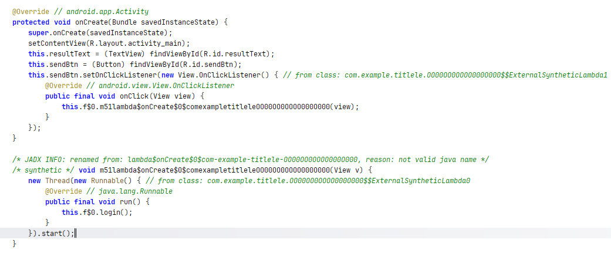

真正的业务函数是login()

`load(this)`：初始化某些组件、配置、so、存储数据之类 

`get()`：拿到某个单例对象 

`Login("user")`：生成或取出登录信息

<!-- 这是一张图片，ocr 内容为： -->
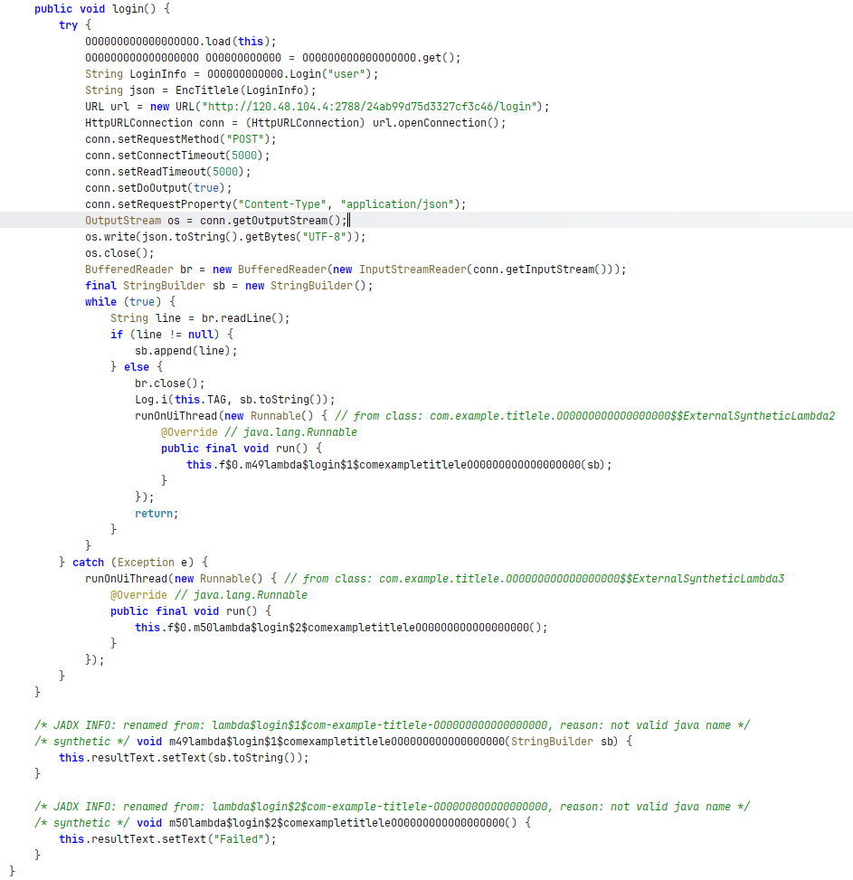

题目给的提示是用admin登录，这里把‘user’改为‘admin’，把修改后的重新打包并签上名

然后把apk文件安装在模拟器上，点击按钮出现‘hacker’

<!-- 这是一张图片，ocr 内容为： -->


说明还有其他的隐藏逻辑，细看login函数实现

EncTitlele 不是 Java 实现，而是 native

<!-- 这是一张图片，ocr 内容为： -->
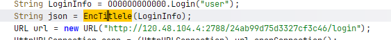

在类初始化时System.loadLibrary("mixtitlele") 加载，实现库在libmixtitlele.so

<!-- 这是一张图片，ocr 内容为： -->
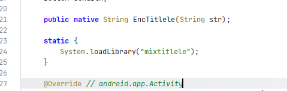

真正起作用的是sImpl接口实现

<!-- 这是一张图片，ocr 内容为： -->
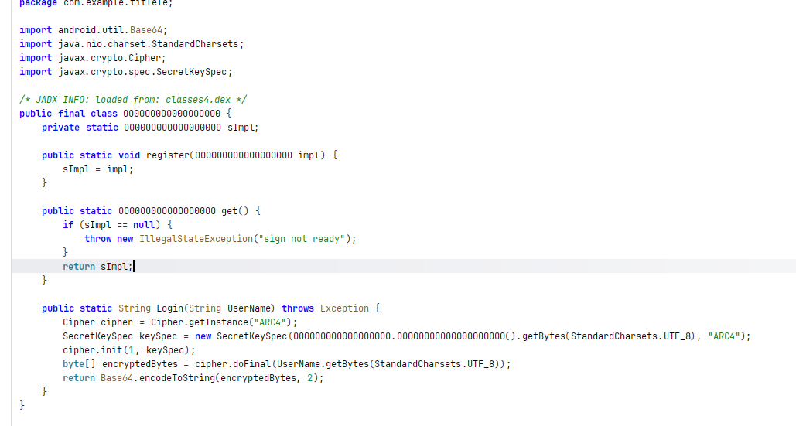

sImpl来自动态加载的libflutter.so，这说明 libflutter.so 不是普通 so，而是伪装成 so 的 APK/Dex 容器

<!-- 这是一张图片，ocr 内容为： -->
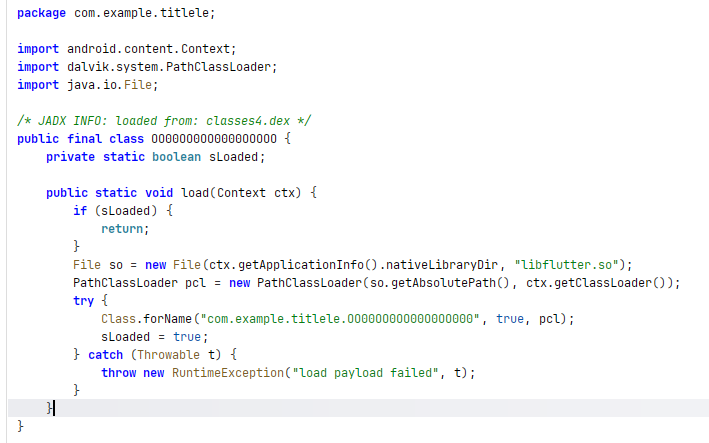

隐藏入口类自动调用 register()，它先加载接口 OO00OO0OOOOO0O00OO，再 Proxy.newProxyInstance(...)

然后加载 OO00OO0OO00OOOOOO0 并反射调用它的 register(proxy)

真正的登录构造在LogInfo(String)

代理分发函数invoke()，它检查方法名是否为 Login，然后转调 LogInfo()。这就是为什么外层看上去只是 Login("user")，实际却会被包装成一个结构体

Encrypt.enc() 不是校验逻辑，只是一层异或流加密

native 侧可以合理推断 EncTitlele 还会把这段 Base64 数据再包一层，依据libmixtitlele.so里能看到 EncTitlele、{"a1":"、"b2":"、com/example/titlele/OO00OO0OOOO000O000、(Ljava/lang/String;)Ljava/lang/String; 这些字符串；同时导出表里有 JNI_OnLoad、rsaEncryptKey、aesEncryptInfo。这里我做的是推断，但从命名和字符串看，EncTitlele 大概率是在把登录信息封成 {"a1":"...","b2":"..."} 再发给服务器。

只有把内层 setIsHacker(true) 一起改成 false，请求才会变成：user="admin", isHacker=false

<!-- 这是一张图片，ocr 内容为： -->
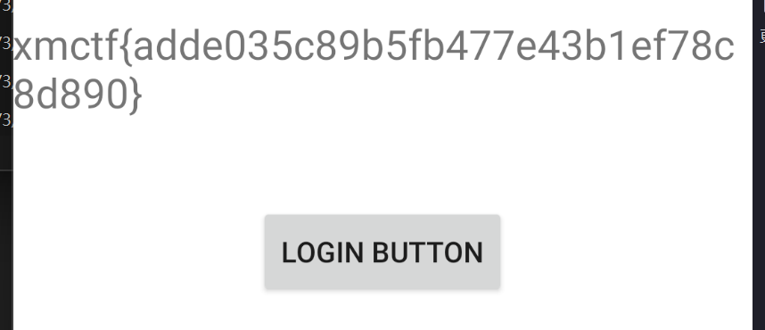


# shakelife


```python
weixiao@weixiao:/mnt/e/ctf/polarisctf/ShakeLife$ gdb ./ShakeLife
GNU gdb (Ubuntu 12.1-0ubuntu1~22.04.2) 12.1
Copyright (C) 2022 Free Software Foundation, Inc.
License GPLv3+: GNU GPL version 3 or later <http://gnu.org/licenses/gpl.html>
This is free software: you are free to change and redistribute it.
There is NO WARRANTY, to the extent permitted by law.
Type "show copying" and "show warranty" for details.
This GDB was configured as "x86_64-linux-gnu".
Type "show configuration" for configuration details.
For bug reporting instructions, please see:
<https://www.gnu.org/software/gdb/bugs/>.
Find the GDB manual and other documentation resources online at:
    <http://www.gnu.org/software/gdb/documentation/>.

For help, type "help".
Type "apropos word" to search for commands related to "word"...
pwndbg: loaded 194 pwndbg commands. Type pwndbg [filter] for a list.
pwndbg: created 11 GDB functions (can be used with print/break). Type help function to see them.
Reading symbols from ./ShakeLife...
(No debugging symbols found in ./ShakeLife)
------- tip of the day (disable with set show-tips off) -------
GDB and Pwndbg parameters can be shown or set with show <param> and set <param> <value> GDB commands
pwndbg> starti
Starting program: /mnt/e/ctf/polarisctf/ShakeLife/ShakeLife

Program stopped.
0x00007ffff7fe3290 in _start () from /lib64/ld-linux-x86-64.so.2
LEGEND: STACK | HEAP | CODE | DATA | WX | RODATA
───────────────────────────────────────────[ REGISTERS / show-flags off / show-compact-regs off ]───────────────────────────────────────────
 RAX  0
 RBX  0
 RCX  0
 RDX  0
 RDI  0
 RSI  0
 R8   0
 R9   0
 R10  0
 R11  0
 R12  0
 R13  0
 R14  0
 R15  0
 RBP  0
 RSP  0x7fffffffd9c0 ◂— 1
 RIP  0x7ffff7fe3290 (_start) ◂— mov rdi, rsp
────────────────────────────────────────────────────[ DISASM / x86-64 / set emulate on ]────────────────────────────────────────────────────
 ► 0x7ffff7fe3290 <_start>               mov    rdi, rsp     RDI => 0x7fffffffd9c0 ◂— 1
   0x7ffff7fe3293 <_start+3>             call   _dl_start                   <_dl_start>

   0x7ffff7fe3298 <_dl_start_user>       mov    r12, rax
   0x7ffff7fe329b <_dl_start_user+3>     mov    eax, dword ptr [rip + 0x19817]     EAX, [_dl_skip_args]
   0x7ffff7fe32a1 <_dl_start_user+9>     pop    rdx
   0x7ffff7fe32a2 <_dl_start_user+10>    lea    rsp, [rsp + rax*8]
   0x7ffff7fe32a6 <_dl_start_user+14>    sub    edx, eax
   0x7ffff7fe32a8 <_dl_start_user+16>    push   rdx
   0x7ffff7fe32a9 <_dl_start_user+17>    mov    rsi, rdx
   0x7ffff7fe32ac <_dl_start_user+20>    mov    r13, rsp
   0x7ffff7fe32af <_dl_start_user+23>    and    rsp, 0xfffffffffffffff0
─────────────────────────────────────────────────────────────────[ STACK ]──────────────────────────────────────────────────────────────────
00:0000│ rsp 0x7fffffffd9c0 ◂— 1
01:0008│     0x7fffffffd9c8 —▸ 0x7fffffffdc62 ◂— '/mnt/e/ctf/polarisctf/ShakeLife/ShakeLife'
02:0010│     0x7fffffffd9d0 ◂— 0
03:0018│     0x7fffffffd9d8 —▸ 0x7fffffffdc8c ◂— 'SHELL=/bin/bash'
04:0020│     0x7fffffffd9e0 —▸ 0x7fffffffdc9c ◂— 'WSL2_GUI_APPS_ENABLED=1'
05:0028│     0x7fffffffd9e8 —▸ 0x7fffffffdcb4 ◂— 'WSL_DISTRO_NAME=Ubuntu-22.04'
06:0030│     0x7fffffffd9f0 —▸ 0x7fffffffdcd1 ◂— 'WT_SESSION=e594564a-5940-4e5d-bd4a-8cb2940088aa'
07:0038│     0x7fffffffd9f8 —▸ 0x7fffffffdd01 ◂— 'NAME=weixiao'
───────────────────────────────────────────────────────────────[ BACKTRACE ]────────────────────────────────────────────────────────────────
 ► 0   0x7ffff7fe3290 _start
   1              0x1 None
   2   0x7fffffffdc62 None
   3              0x0 None
────────────────────────────────────────────────────────────────────────────────────────────────────────────────────────────────────────────
pwndbg> vmmap
LEGEND: STACK | HEAP | CODE | DATA | WX | RODATA
             Start                End Perm     Size  Offset File (set vmmap-prefer-relpaths on)
    0x555555554000     0x555555556000 r--p     2000       0 ShakeLife
    0x555555556000     0x55555555c000 r-xp     6000    2000 ShakeLife
    0x55555555c000     0x55555555e000 r--p     2000    8000 ShakeLife
    0x55555555f000     0x555555561000 rw-p     2000    9000 ShakeLife
    0x7ffff7fbd000     0x7ffff7fc1000 r--p     4000       0 [vvar]
    0x7ffff7fc1000     0x7ffff7fc3000 r-xp     2000       0 [vdso]
    0x7ffff7fc3000     0x7ffff7fc5000 r--p     2000       0 /usr/lib/x86_64-linux-gnu/ld-linux-x86-64.so.2
    0x7ffff7fc5000     0x7ffff7fef000 r-xp    2a000    2000 /usr/lib/x86_64-linux-gnu/ld-linux-x86-64.so.2
    0x7ffff7fef000     0x7ffff7ffa000 r--p     b000   2c000 /usr/lib/x86_64-linux-gnu/ld-linux-x86-64.so.2
    0x7ffff7ffb000     0x7ffff7fff000 rw-p     4000   37000 /usr/lib/x86_64-linux-gnu/ld-linux-x86-64.so.2
    0x7ffffffdd000     0x7ffffffff000 rw-p    22000       0 [stack]
pwndbg> hbreak *0x55555555b388
Hardware assisted breakpoint 1 at 0x55555555b388
pwndbg> continue
Continuing.
[Thread debugging using libthread_db enabled]
Using host libthread_db library "/lib/x86_64-linux-gnu/libthread_db.so.1".
Please enter the flag:
Follow 1782544616 meow~ Follow 1782544616 Thanks meow~

Breakpoint 1, 0x000055555555b388 in ?? ()
LEGEND: STACK | HEAP | CODE | DATA | WX | RODATA
──────────────────────────────────────────────────────────────[ LAST SIGNAL ]───────────────────────────────────────────────────────────────
Breakpoint hit at 0x55555555b388
───────────────────────────────────────────[ REGISTERS / show-flags off / show-compact-regs off ]───────────────────────────────────────────
*RAX  0x101010101010101
*RBX  0x7ffff7ffd040 (_rtld_global) —▸ 0x7ffff7ffe2e0 —▸ 0x555555554000 ◂— 0x10102464c457f
 RCX  0
*RDX  0x55555555fc80 —▸ 0x555555556560 ◂— endbr64
*RDI  0x7ffff7a1ca70 (_IO_stdfile_1_lock) ◂— 0
 RSI  0
*R8   0x555555556ce0 ◂— endbr64
*R9   0x55555555b345 ◂— endbr64
*R10  0xe9e9e9e9e9e9e9e9
*R11  0xc3
 R12  0
*R13  0x7ffff7ffda48 (_rtld_global+2568) ◂— 0
*R14  0x7fffffffd7a0 —▸ 0x7ffff7ffe2e0 —▸ 0x555555554000 ◂— 0x10102464c457f
*R15  0x7ffff7ffe2e0 —▸ 0x555555554000 ◂— 0x10102464c457f
*RBP  0x7fffffffd840 ◂— 0
*RSP  0x7fffffffd798 —▸ 0x7ffff7fc924e (_dl_fini+526) ◂— mov rax, qword ptr [rbp - 0x38]
*RIP  0x55555555b388 ◂— lea rsi, [r9 + 0x525b]
────────────────────────────────────────────────────[ DISASM / x86-64 / set emulate on ]────────────────────────────────────────────────────
 ► 0x55555555b388                   lea    rsi, [r9 + 0x525b]       RSI => 0x5555555605a0 ◂— 0
   0x55555555b38f                   lea    rdi, [r9 + 0x89]         RDI => 0x55555555b3ce ◂— movsb byte ptr [rdi], byte ptr [rsi]
   0x55555555b396                   mov    ecx, 8                   ECX => 8
   0x55555555b39b                   mov    rax, qword ptr [rsi]     RAX, [0x5555555605a0] => 0
   0x55555555b39e                   xor    rax, r10                 RAX => 0xe9e9e9e9e9e9e9e9 (0x0 ^ 0xe9e9e9e9e9e9e9e9)
   0x55555555b3a1                   mov    rbx, qword ptr [rdi]     RBX, [0x55555555b3ce] => 0xebc890493f3b7ca4
   0x55555555b3a4                   cmp    rax, rbx                 0xe9e9e9e9e9e9e9e9 - 0xebc890493f3b7ca4     EFLAGS => 0x10283 [ CF pf af zf SF IF df of iopl:00 ac ]
   0x55555555b3a7                 ✔ jne    0x55555555b3cd              <0x55555555b3cd>
    ↓
   0x55555555b3cd                   ret                                <_dl_fini+526>
    ↓
   0x7ffff7fc924e <_dl_fini+526>    mov    rax, qword ptr [rbp - 0x38]     RAX, [0x7fffffffd808] => 0x55555555fc78 —▸ 0x55555555b345 ◂— endbr64
   0x7ffff7fc9252 <_dl_fini+530>    mov    rdx, rax                        RDX => 0x55555555fc78 —▸ 0x55555555b345 ◂— endbr64
─────────────────────────────────────────────────────────────────[ STACK ]──────────────────────────────────────────────────────────────────
00:0000│ rsp 0x7fffffffd798 —▸ 0x7ffff7fc924e (_dl_fini+526) ◂— mov rax, qword ptr [rbp - 0x38]
01:0008│ r14 0x7fffffffd7a0 —▸ 0x7ffff7ffe2e0 —▸ 0x555555554000 ◂— 0x10102464c457f
02:0010│-098 0x7fffffffd7a8 —▸ 0x7ffff7ffe890 —▸ 0x7ffff7fc1000 ◂— jg 0x7ffff7fc1047
03:0018│-090 0x7fffffffd7b0 —▸ 0x7ffff7fbb210 —▸ 0x7ffff7c00000 ◂— 0x3010102464c457f
04:0020│-088 0x7fffffffd7b8 —▸ 0x7ffff7fbb720 —▸ 0x7ffff7ece000 ◂— 0x3010102464c457f
05:0028│-080 0x7fffffffd7c0 —▸ 0x7ffff7fbbc30 —▸ 0x7ffff7eae000 ◂— 0x10102464c457f
06:0030│-078 0x7fffffffd7c8 —▸ 0x7ffff7fbc140 —▸ 0x7ffff7800000 ◂— 0x3010102464c457f
07:0038│-070 0x7fffffffd7d0 —▸ 0x7ffff7ffdaf0 (_rtld_global+2736) —▸ 0x7ffff7fc3000 ◂— 0x3010102464c457f
───────────────────────────────────────────────────────────────[ BACKTRACE ]────────────────────────────────────────────────────────────────
 ► 0   0x55555555b388 None
   1   0x7ffff7fc924e _dl_fini+526
   2   0x7ffff7845495 __run_exit_handlers+261
   3   0x7ffff7845610 on_exit
   4   0x7ffff7829d97 __libc_start_call_main+135
   5   0x7ffff7829e40 __libc_start_main+128
   6   0x55555555648e None
────────────────────────────────────────────────────────────────────────────────────────────────────────────────────────────────────────────
pwndbg> x/s 0x555555560008
0x555555560008: "Correct!\n"
pwndbg> x/64bx 0x55555555b3ce
0x55555555b3ce: 0xa4    0x7c    0x3b    0x3f    0x49    0x90    0xc8    0xeb
0x55555555b3d6: 0xa7    0x41    0xf5    0x5d    0xa9    0x31    0x2a    0x1f
0x55555555b3de: 0x80    0x2f    0xef    0xfe    0x80    0xbe    0x3d    0x7e
0x55555555b3e6: 0x27    0x96    0xa7    0x42    0xce    0x7f    0xd1    0x3e
0x55555555b3ee: 0x0a    0xb2    0x1a    0x7e    0x54    0xb7    0x0a    0xe8
0x55555555b3f6: 0x76    0xfd    0xb6    0x64    0xcd    0x9d    0xaf    0x98
0x55555555b3fe: 0x4b    0x81    0x88    0x58    0x57    0x54    0x59    0xa4
0x55555555b406: 0x19    0x87    0xfc    0xe9    0xe9    0xe9    0xe9    0xe9
pwndbg> x/48bx 0x55555555b3ce
0x55555555b3ce: 0xa4    0x7c    0x3b    0x3f    0x49    0x90    0xc8    0xeb
0x55555555b3d6: 0xa7    0x41    0xf5    0x5d    0xa9    0x31    0x2a    0x1f
0x55555555b3de: 0x80    0x2f    0xef    0xfe    0x80    0xbe    0x3d    0x7e
0x55555555b3e6: 0x27    0x96    0xa7    0x42    0xce    0x7f    0xd1    0x3e
0x55555555b3ee: 0x0a    0xb2    0x1a    0x7e    0x54    0xb7    0x0a    0xe8
0x55555555b3f6: 0x76    0xfd    0xb6    0x64    0xcd    0x9d    0xaf    0x98
```

