## Week 4

# 1.SMC
main函数，让我们输入一个四字节的key，flag的长度是32

<!-- 这是一张图片，ocr 内容为： -->
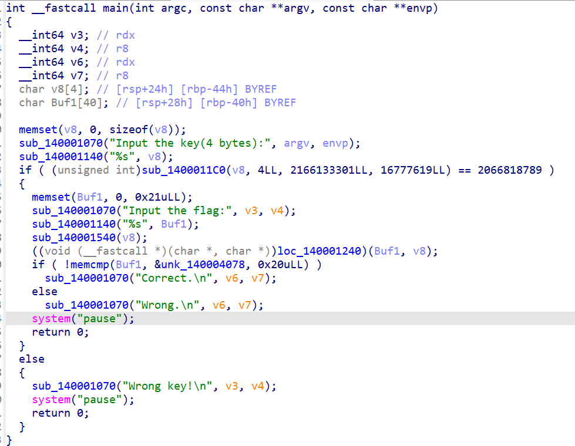

正确的key是‘LYLY’，这个函数的计算结果要等于0x7B3126E5h，算法实现在sub_1400011C0函数

<!-- 这是一张图片，ocr 内容为： -->
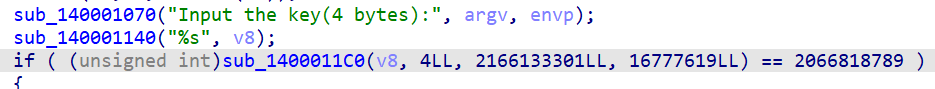

<!-- 这是一张图片，ocr 内容为： -->
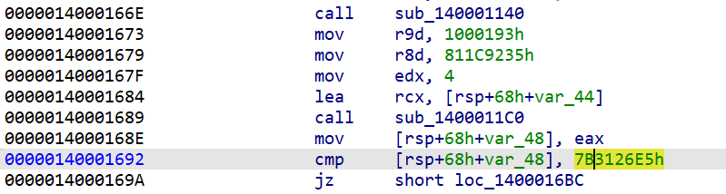

<!-- 这是一张图片，ocr 内容为： -->
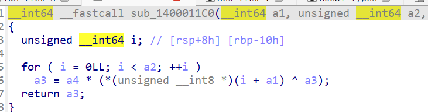

爆破脚本

```c
#include <iostream>
#include <Windows.h>
__int64 __fastcall fnv(byte *a1, unsigned __int64 a2, unsigned int a3, int a4)
{
    unsigned __int64 i;
    for (i = 0; i < a2; ++i)
        a3 = a4 * (a1[i] ^ a3);
    return a3;
}
int main()
{
    DWORD Key{};
    for (Key = 0; Key < 0xffffffff; Key++)
    {
        if (fnv((byte*)(&Key), 4, 0x811C9235LL, 0x1000193) == 0x7B3126E5)
        {
            printf("Key: %.4s\n", (char *)(&Key));
            break;
        }
    }
    return 0;
}

```

sub_140001540是对加密函数进行保护的函数

<!-- 这是一张图片，ocr 内容为： -->
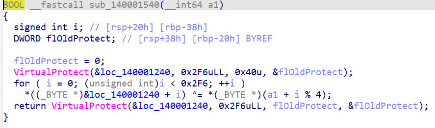

我们看不到正确的加密算法

<!-- 这是一张图片，ocr 内容为： -->
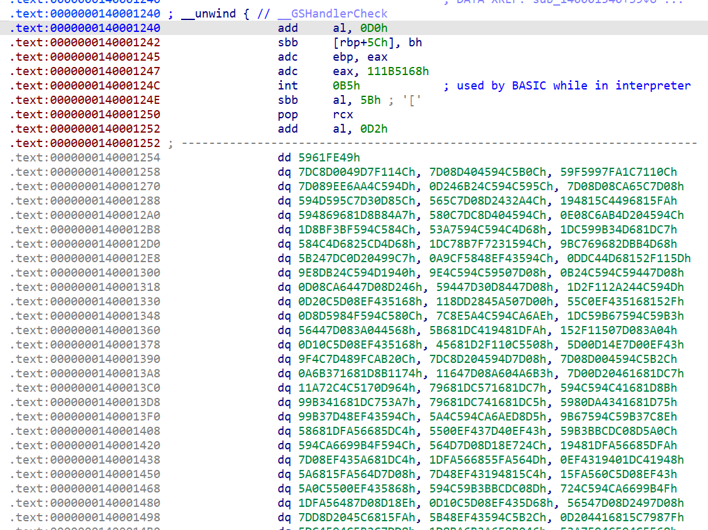


我们动调，执行过保护函数，可以看到

<!-- 这是一张图片，ocr 内容为： -->
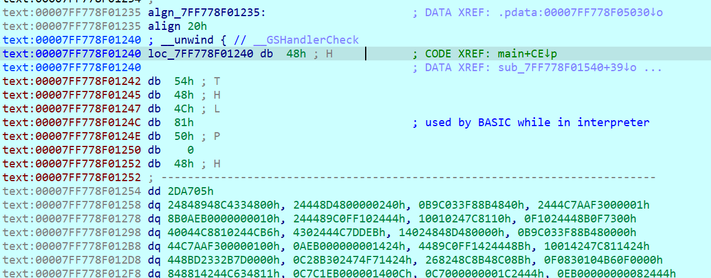

然后按c转化为汇编

```text
text:00007FF778F01240 ; __unwind { // __GSHandlerCheck
.text:00007FF778F01240 loc_7FF778F01240 db  48h ; H            ; CODE XREF: main+CE↓p
.text:00007FF778F01240                                         ; DATA XREF: sub_7FF778F01540+39↓o ...
.text:00007FF778F01242 push    rsp
.text:00007FF778F01243 and     al, 10h
.text:00007FF778F01245 mov     [rsp+8], rcx
.text:00007FF778F0124A push    rdi
.text:00007FF778F0124B sub     rsp, 250h
.text:00007FF778F01252 mov     rax, cs:__security_cookie
.text:00007FF778F01259 xor     rax, rsp
.text:00007FF778F0125C mov     [rsp+240h], rax
.text:00007FF778F01264 lea     rax, [rsp+40h]
.text:00007FF778F01269 mov     rdi, rax
.text:00007FF778F0126C xor     eax, eax
.text:00007FF778F0126E mov     ecx, 100h
.text:00007FF778F01273 rep stosb
.text:00007FF778F01275 mov     dword ptr [rsp+10h], 0
.text:00007FF778F0127D jmp     short loc_7FF778F01289
.text:00007FF778F0127F ; ---------------------------------------------------------------------------
.text:00007FF778F0127F
.text:00007FF778F0127F loc_7FF778F0127F:                       ; CODE XREF: .text:00007FF778F012A0↓j
.text:00007FF778F0127F mov     eax, [rsp+10h]
.text:00007FF778F01283 inc     eax
.text:00007FF778F01285 mov     [rsp+10h], eax
.text:00007FF778F01289
.text:00007FF778F01289 loc_7FF778F01289:                       ; CODE XREF: .text:00007FF778F0127D↑j
.text:00007FF778F01289 cmp     dword ptr [rsp+10h], 100h
.text:00007FF778F01291 jnb     short loc_7FF778F012A2
.text:00007FF778F01293 mov     eax, [rsp+10h]
.text:00007FF778F01297 movzx   ecx, byte ptr [rsp+10h]
.text:00007FF778F0129C mov     [rsp+rax+40h], cl
.text:00007FF778F012A0 jmp     short loc_7FF778F0127F
.text:00007FF778F012A2 ; ---------------------------------------------------------------------------
.text:00007FF778F012A2
.text:00007FF778F012A2 loc_7FF778F012A2:                       ; CODE XREF: .text:00007FF778F01291↑j
.text:00007FF778F012A2 mov     dword ptr [rsp+30h], 4
.text:00007FF778F012AA lea     rax, [rsp+140h]
.text:00007FF778F012B2 mov     rdi, rax
.text:00007FF778F012B5 xor     eax, eax
.text:00007FF778F012B7 mov     ecx, 100h
.text:00007FF778F012BC rep stosb
.text:00007FF778F012BE mov     dword ptr [rsp+14h], 0
.text:00007FF778F012C6 jmp     short loc_7FF778F012D2
.text:00007FF778F012C8 ; ---------------------------------------------------------------------------
.text:00007FF778F012C8
.text:00007FF778F012C8 loc_7FF778F012C8:                       ; CODE XREF: .text:00007FF778F01305↓j
.text:00007FF778F012C8 mov     eax, [rsp+14h]
.text:00007FF778F012CC inc     eax
.text:00007FF778F012CE mov     [rsp+14h], eax
.text:00007FF778F012D2
.text:00007FF778F012D2 loc_7FF778F012D2:                       ; CODE XREF: .text:00007FF778F012C6↑j
.text:00007FF778F012D2 cmp     dword ptr [rsp+14h], 100h
.text:00007FF778F012DA jge     short loc_7FF778F01307
.text:00007FF778F012DC xor     edx, edx
.text:00007FF778F012DE mov     eax, [rsp+14h]
.text:00007FF778F012E2 div     dword ptr [rsp+30h]
.text:00007FF778F012E6 mov     eax, edx
.text:00007FF778F012E8 mov     eax, eax
.text:00007FF778F012EA mov     rcx, [rsp+268h]
.text:00007FF778F012F2 movzx   eax, byte ptr [rcx+rax]
.text:00007FF778F012F6 xor     eax, 11h
.text:00007FF778F012F9 movsxd  rcx, dword ptr [rsp+14h]
.text:00007FF778F012FE mov     [rsp+rcx+140h], al
.text:00007FF778F01305 jmp     short loc_7FF778F012C8
.text:00007FF778F01307 ; ---------------------------------------------------------------------------
.text:00007FF778F01307
.text:00007FF778F01307 loc_7FF778F01307:                       ; CODE XREF: .text:00007FF778F012DA↑j
.text:00007FF778F01307 mov     dword ptr [rsp+1Ch], 0
.text:00007FF778F0130F mov     dword ptr [rsp+8], 0
.text:00007FF778F01317 jmp     short loc_7FF778F01323
.text:00007FF778F01319 ; ---------------------------------------------------------------------------
.text:00007FF778F01319
.text:00007FF778F01319 loc_7FF778F01319:                       ; CODE XREF: .text:00007FF778F01391↓j
.text:00007FF778F01319 mov     eax, [rsp+8]
.text:00007FF778F0131D inc     eax
.text:00007FF778F0131F mov     [rsp+8], eax
.text:00007FF778F01323
.text:00007FF778F01323 loc_7FF778F01323:                       ; CODE XREF: .text:00007FF778F01317↑j
.text:00007FF778F01323 cmp     dword ptr [rsp+8], 100h
.text:00007FF778F0132B jge     short loc_7FF778F01393
.text:00007FF778F0132D movsxd  rax, dword ptr [rsp+8]
.text:00007FF778F01332 movzx   eax, byte ptr [rsp+rax+40h]
.text:00007FF778F01337 mov     ecx, [rsp+1Ch]
.text:00007FF778F0133B add     ecx, eax
.text:00007FF778F0133D mov     eax, ecx
.text:00007FF778F0133F movsxd  rcx, dword ptr [rsp+8]
.text:00007FF778F01344 movzx   ecx, byte ptr [rsp+rcx+140h]
.text:00007FF778F0134C add     eax, ecx
.text:00007FF778F0134E cdq
.text:00007FF778F0134F and     edx, 0FFh
.text:00007FF778F01355 add     eax, edx
.text:00007FF778F01357 and     eax, 0FFh
.text:00007FF778F0135C sub     eax, edx
.text:00007FF778F0135E mov     [rsp+1Ch], eax
.text:00007FF778F01362 movsxd  rax, dword ptr [rsp+8]
.text:00007FF778F01367 movzx   eax, byte ptr [rsp+rax+40h]
.text:00007FF778F0136C mov     [rsp+2], al
.text:00007FF778F01370 movsxd  rax, dword ptr [rsp+1Ch]
.text:00007FF778F01375 movsxd  rcx, dword ptr [rsp+8]
.text:00007FF778F0137A movzx   eax, byte ptr [rsp+rax+40h]
.text:00007FF778F0137F mov     [rsp+rcx+40h], al
.text:00007FF778F01383 movsxd  rax, dword ptr [rsp+1Ch]
.text:00007FF778F01388 movzx   ecx, byte ptr [rsp+2]
.text:00007FF778F0138D mov     [rsp+rax+40h], cl
.text:00007FF778F01391 jmp     short loc_7FF778F01319
.text:00007FF778F01393 ; ---------------------------------------------------------------------------
.text:00007FF778F01393
.text:00007FF778F01393 loc_7FF778F01393:                       ; CODE XREF: .text:00007FF778F0132B↑j
.text:00007FF778F01393 mov     byte ptr [rsp], 0
.text:00007FF778F01397 mov     byte ptr [rsp+1], 0
.text:00007FF778F0139C mov     rax, [rsp+260h]
.text:00007FF778F013A4 mov     [rsp+38h], rax
.text:00007FF778F013A9 mov     qword ptr [rsp+28h], 0FFFFFFFFFFFFFFFFh
.text:00007FF778F013B2
.text:00007FF778F013B2 loc_7FF778F013B2:                       ; CODE XREF: .text:00007FF778F013C5↓j
.text:00007FF778F013B2 inc     qword ptr [rsp+28h]
.text:00007FF778F013B7 mov     rax, [rsp+38h]
.text:00007FF778F013BC mov     rcx, [rsp+28h]
.text:00007FF778F013C1 cmp     byte ptr [rax+rcx], 0
.text:00007FF778F013C5 jnz     short loc_7FF778F013B2
.text:00007FF778F013C7 mov     rax, [rsp+28h]
.text:00007FF778F013CC mov     [rsp+20h], eax
.text:00007FF778F013D0 mov     dword ptr [rsp+18h], 0
.text:00007FF778F013D8 jmp     short loc_7FF778F013E4
.text:00007FF778F013DA ; ---------------------------------------------------------------------------
.text:00007FF778F013DA
.text:00007FF778F013DA loc_7FF778F013DA:                       ; CODE XREF: .text:00007FF778F014B9↓j
.text:00007FF778F013DA mov     eax, [rsp+18h]
.text:00007FF778F013DE inc     eax
.text:00007FF778F013E0 mov     [rsp+18h], eax
.text:00007FF778F013E4
.text:00007FF778F013E4 loc_7FF778F013E4:                       ; CODE XREF: .text:00007FF778F013D8↑j
.text:00007FF778F013E4 mov     eax, [rsp+20h]
.text:00007FF778F013E8 cmp     [rsp+18h], eax
.text:00007FF778F013EC jnb     loc_7FF778F014BE
.text:00007FF778F013F2 movzx   eax, byte ptr [rsp]
.text:00007FF778F013F6 inc     eax
.text:00007FF778F013F8 cdq
.text:00007FF778F013F9 and     edx, 0FFh
.text:00007FF778F013FF add     eax, edx
.text:00007FF778F01401 and     eax, 0FFh
.text:00007FF778F01406 sub     eax, edx
.text:00007FF778F01408 mov     [rsp], al
.text:00007FF778F0140B movzx   eax, byte ptr [rsp+1]
.text:00007FF778F01410 movzx   ecx, byte ptr [rsp]
.text:00007FF778F01414 movzx   ecx, byte ptr [rsp+rcx+40h]
.text:00007FF778F01419 add     eax, ecx
.text:00007FF778F0141B cdq
.text:00007FF778F0141C and     edx, 0FFh
.text:00007FF778F01422 add     eax, edx
.text:00007FF778F01424 and     eax, 0FFh
.text:00007FF778F01429 sub     eax, edx
.text:00007FF778F0142B mov     [rsp+1], al
.text:00007FF778F0142F movzx   eax, byte ptr [rsp]
.text:00007FF778F01433 movzx   eax, byte ptr [rsp+rax+40h]
.text:00007FF778F01438 mov     [rsp+3], al
.text:00007FF778F0143C movzx   eax, byte ptr [rsp+1]
.text:00007FF778F01441 movzx   ecx, byte ptr [rsp]
.text:00007FF778F01445 movzx   eax, byte ptr [rsp+rax+40h]
.text:00007FF778F0144A mov     [rsp+rcx+40h], al
.text:00007FF778F0144E movzx   eax, byte ptr [rsp+1]
.text:00007FF778F01453 movzx   ecx, byte ptr [rsp+3]
.text:00007FF778F01458 mov     [rsp+rax+40h], cl
.text:00007FF778F0145C movzx   eax, byte ptr [rsp]
.text:00007FF778F01460 movzx   eax, byte ptr [rsp+rax+40h]
.text:00007FF778F01465 movzx   ecx, byte ptr [rsp+1]
.text:00007FF778F0146A movzx   ecx, byte ptr [rsp+rcx+40h]
.text:00007FF778F0146F add     eax, ecx
.text:00007FF778F01471 cdq
.text:00007FF778F01472 and     edx, 0FFh
.text:00007FF778F01478 add     eax, edx
.text:00007FF778F0147A and     eax, 0FFh
.text:00007FF778F0147F sub     eax, edx
.text:00007FF778F01481 mov     [rsp+4], al
.text:00007FF778F01485 movzx   eax, byte ptr [rsp+4]
.text:00007FF778F0148A movzx   eax, byte ptr [rsp+rax+40h]
.text:00007FF778F0148F mov     [rsp+5], al
.text:00007FF778F01493 mov     eax, [rsp+18h]
.text:00007FF778F01497 movzx   ecx, byte ptr [rsp+5]
.text:00007FF778F0149C mov     rdx, [rsp+260h]
.text:00007FF778F014A4 movzx   eax, byte ptr [rdx+rax]
.text:00007FF778F014A8 xor     eax, ecx
.text:00007FF778F014AA mov     ecx, [rsp+18h]
.text:00007FF778F014AE mov     rdx, [rsp+260h]
.text:00007FF778F014B6 mov     [rdx+rcx], al
.text:00007FF778F014B9 jmp     loc_7FF778F013DA
.text:00007FF778F014BE ; ---------------------------------------------------------------------------
.text:00007FF778F014BE
.text:00007FF778F014BE loc_7FF778F014BE:                       ; CODE XREF: .text:00007FF778F013EC↑j
.text:00007FF778F014BE mov     dword ptr [rsp+0Ch], 0
.text:00007FF778F014C6 jmp     short loc_7FF778F014D2
.text:00007FF778F014C8 ; ---------------------------------------------------------------------------
.text:00007FF778F014C8
.text:00007FF778F014C8 loc_7FF778F014C8:                       ; CODE XREF: .text:loc_7FF778F0151B↓j
.text:00007FF778F014C8 mov     eax, [rsp+0Ch]
.text:00007FF778F014CC inc     eax
.text:00007FF778F014CE mov     [rsp+0Ch], eax
.text:00007FF778F014D2
.text:00007FF778F014D2 loc_7FF778F014D2:                       ; CODE XREF: .text:00007FF778F014C6↑j
.text:00007FF778F014D2 mov     eax, [rsp+20h]
.text:00007FF778F014D6 cmp     [rsp+0Ch], eax
.text:00007FF778F014DA jnb     short loc_7FF778F0151D
.text:00007FF778F014DC cmp     dword ptr [rsp+0Ch], 0
.text:00007FF778F014E1 jz      short loc_7FF778F0151B
.text:00007FF778F014E3 movsxd  rax, dword ptr [rsp+0Ch]
.text:00007FF778F014E8 mov     ecx, [rsp+0Ch]
.text:00007FF778F014EC dec     ecx
.text:00007FF778F014EE movsxd  rcx, ecx
.text:00007FF778F014F1 mov     rdx, [rsp+260h]
.text:00007FF778F014F9 movzx   ecx, byte ptr [rdx+rcx]
.text:00007FF778F014FD mov     rdx, [rsp+260h]
.text:00007FF778F01505 movzx   eax, byte ptr [rdx+rax]
.text:00007FF778F01509 xor     eax, ecx
.text:00007FF778F0150B movsxd  rcx, dword ptr [rsp+0Ch]
.text:00007FF778F01510 mov     rdx, [rsp+260h]
.text:00007FF778F01518 mov     [rdx+rcx], al
.text:00007FF778F0151B
.text:00007FF778F0151B loc_7FF778F0151B:                       ; CODE XREF: .text:00007FF778F014E1↑j
.text:00007FF778F0151B jmp     short loc_7FF778F014C8
.text:00007FF778F0151D ; ---------------------------------------------------------------------------
.text:00007FF778F0151D
.text:00007FF778F0151D loc_7FF778F0151D:                       ; CODE XREF: .text:00007FF778F014DA↑j
.text:00007FF778F0151D mov     rcx, [rsp+240h]
.text:00007FF778F01525 xor     rcx, rsp
.text:00007FF778F01528 call    __security_check_cookie
.text:00007FF778F0152D add     rsp, 250h
.text:00007FF778F01534 pop     rdi
.text:00007FF778F01535 retn
.text:00007FF778F01535 ; } // starts at 7FF778F01240
.text:00007FF778F01535 ; ---------------------------------------------------------------------------
.text:00007FF778F01536 algn_7FF778F01536:                      ; DATA XREF: .pdata:00007FF778F0503C↓o
.text:00007FF778F01536 align 20h
```

算法分析


密文

```text
data:00007FF778F04078 asc_7FF778F04078 db 86h,8Bh,82h,0DCh,31h,'a',10h,'Sk',17h,13h,'[w',19h,84h,0B1h,0E5h,2Ch,0EAh
.data:00007FF778F04078                                         ; DATA XREF: main+DA↑o
.data:00007FF778F0408B                 db 97h,0D8h,0C1h,0C4h,0F4h,'*',0E6h,8Bh,0D9h,17h,')',0D3h,30h
```


解密脚本

```python
def reverse_smc_algorithm(key, encrypted_data):
    key_bytes = key.encode('ascii')
    if len(key_bytes) != 4:
        raise ValueError("密钥必须是4字节")

    encrypted_bytes = encrypted_data

    temp_data = list(encrypted_bytes)
    for i in range(len(temp_data) - 1, 0, -1):
        temp_data[i] = temp_data[i] ^ temp_data[i-1]

    s_box = list(range(256))

    processed_key = []
    for i in range(256):
        processed_key.append((key_bytes[i % 4] ^ 0x11) & 0xFF)

    j = 0
    for i in range(256):
        j = (j + s_box[i] + processed_key[i]) & 0xFF
        s_box[i], s_box[j] = s_box[j], s_box[i]

    i = j = 0
    output = []

    for byte_val in temp_data:
        i = (i + 1) & 0xFF
        j = (j + s_box[i]) & 0xFF
        s_box[i], s_box[j] = s_box[j], s_box[i]

        keystream_byte = s_box[(s_box[i] + s_box[j]) & 0xFF]
        decrypted_byte = byte_val ^ keystream_byte
        output.append(decrypted_byte)

    return bytes(output)

def solve():
    key = "LYLY"

    target_data = bytes([0x86, 0x8B, 0x82, 0xDC, 0x31, 0x61, 0x10, 0x53, 0x6B, 0x17, 0x13, 0x5B, 0x77, 0x19, 0x84, 0xB1, 0xE5, 0x2C, 0xEA, 0x97, 0xD8, 0xC1, 0xC4, 0xF4, 0x2A, 0xE6, 0x8B, 0xD9, 0x17, 0x29, 0xD3, 0x30])

    decrypted = reverse_smc_algorithm(key, target_data)
    flag = decrypted.decode('ascii', errors='ignore').rstrip('\x00')

    print(f"Flag: {flag}")
    return flag

if __name__ == "__main__":
    solve()
```

flag{fnv_and_self_modified_code}


# 2.安卓题目
JADX打开第一段flag：flag0:0nc$3@te

<!-- 这是一张图片，ocr 内容为： -->
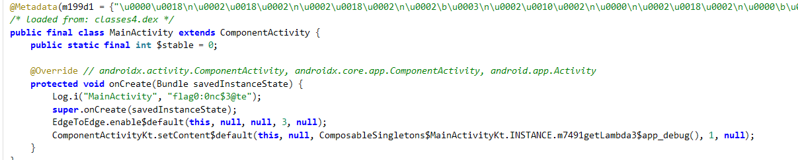

第二段flag在xml文件中看到_@c7iv17ys

<!-- 这是一张图片，ocr 内容为： -->
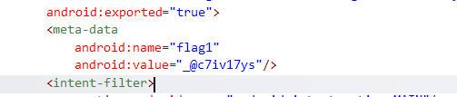

第三段flag在资源文件是一个图片文件，010打开看到 _@5S3$ts

<!-- 这是一张图片，ocr 内容为： -->


第四段flag在string.xml里   _5trin9

<!-- 这是一张图片，ocr 内容为： -->
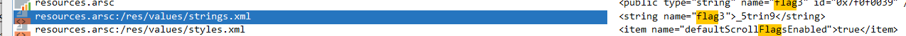

第五段flag在LibSoLib.so文件flag4:_4oLi8

<!-- 这是一张图片，ocr 内容为： -->
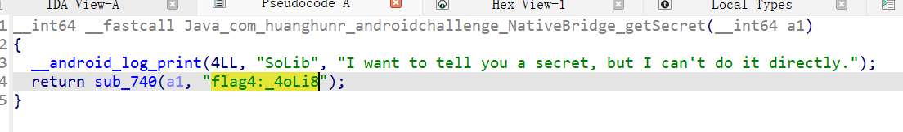

第五段是password

我们先按在com.huanghunr.androidchallenge.NativeLoader中看到的逻辑对assets/x86_64/libandroidchallenge.so.enc做解密

<!-- 这是一张图片，ocr 内容为： -->
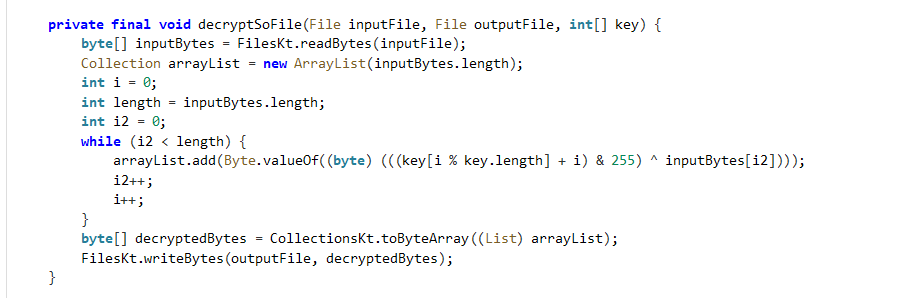

哈希验证

<!-- 这是一张图片，ocr 内容为： -->
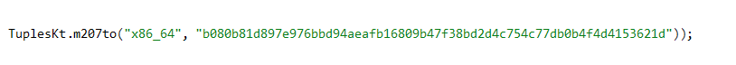

在com.huanghunr.androidchallenge.MainActivityKt里我们看到username长度小于等于4，密码在8到32之间,我们得到用户名是R*ot，是通过对四字节爆破出来的

<!-- 这是一张图片，ocr 内容为： -->
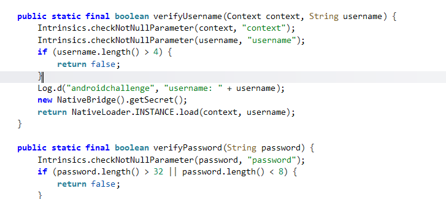

我们这里也可以通过文件头来获取用户名，so文件开头四字节是0x7f，0x45,0x4c，0x46，我们在010中看到这个加密的文件开头是2D,6E,7E,31

<!-- 这是一张图片，ocr 内容为： -->
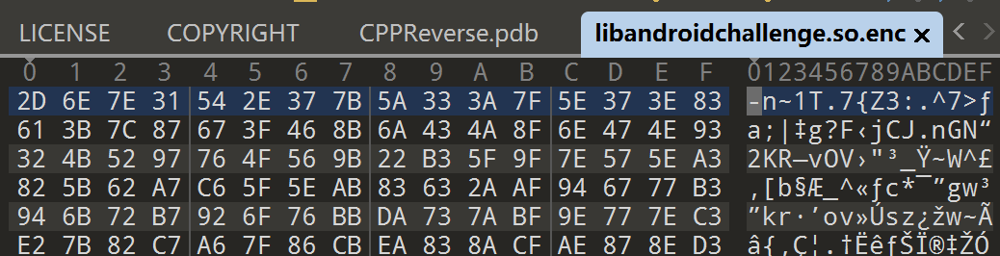

解用户名

```python
with open("libandroidchallenge.so.enc", "rb") as f:
    data = f.read()
with open("libandroidchallenge.so", "wb") as f:
    encheader = b"\x2D\x6e\x7E\x31"
    elfheader = b"\x7f\x45\x4c\x46"
    key = []
    for i in range(len(encheader)):
        key.append((encheader[i] ^ elfheader[i]) - i) #反推用户名
    print("key: ", bytes(key))
    f.write(bytes([ data[i] ^ ((key[i % len(key)] + i) & 0xff) for i in
range(len(data)) ])) # 解密so文件
print("done")

```

解密出来的so文件用IDA打开主要就是两个函数verifyPassword和ivGen函数

verifyPassword是pasword校验函数

<!-- 这是一张图片，ocr 内容为： -->
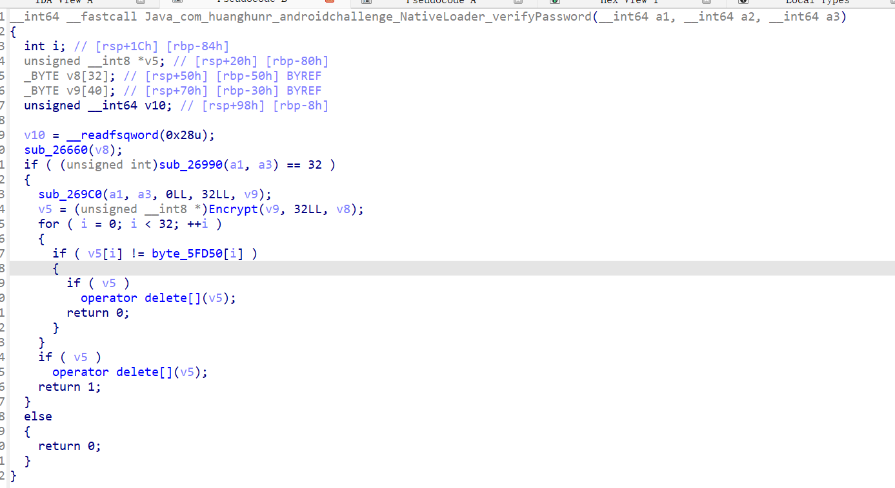

sub_26660函数是生成16字节的密钥，伪随机数的算法用的种子是0

<!-- 这是一张图片，ocr 内容为： -->
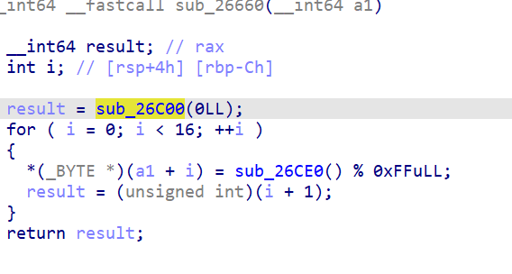

encrypt函数是AES加密结构，被魔改了

<!-- 这是一张图片，ocr 内容为： -->
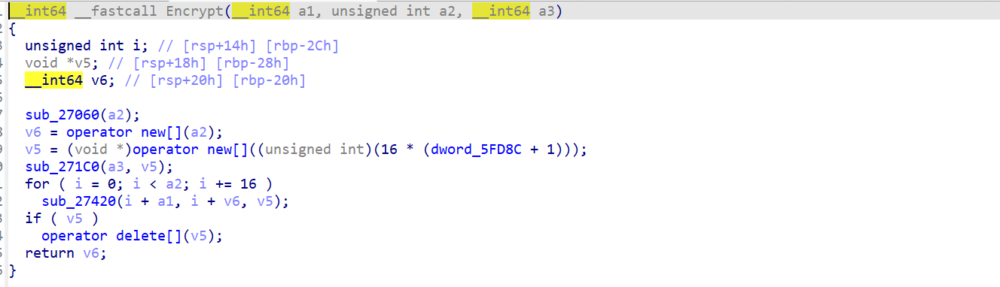

我们也可以看Decrypt函数，通过frida调用这个函数来完成解密

<!-- 这是一张图片，ocr 内容为： -->
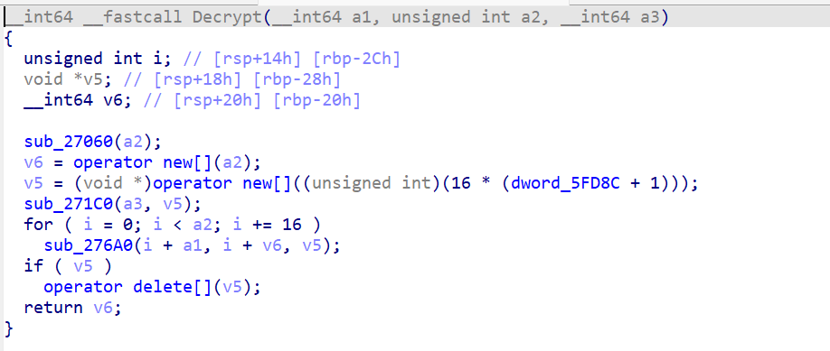

用frida来获取密钥，里面会一直尝试hook，因为加了try喝setInterval，需要输入正确的用户名

```python
function hookenc(intervalId){
    try {
// 获取目标 so 模块（libandroidchallenge.so）
        var md = Process.getModuleByName("libandroidchallenge.so");
// 获取模块的基地址。

        var mdBase = md.base;
//目标加密函数的相对偏移地址（通过ida反汇编得到）
// 这里 0x028018 是arm64架构下 Encrypt 函数的偏移；在x86_x64架构下是0x26FA0
        var funcAddr = 0x028018;
// 一旦成功找到模块，就清除定时器，避免重复 hook
        clearInterval(intervalId);
// 使用 Interceptor.attach 在目标函数入口处挂钩
// 第一个参数是“目标函数的真实内存地址”
        Interceptor.attach(mdBase.add(funcAddr), {
// onEnter：在目标函数刚进入时触发（可以获取参数）
            onEnter: function (args) {
// 目标函数的第三个参数（args[2]）是密钥的地址
// Frida 的 args 数组对应函数的参数列表：
// args[0] → 第1个参数，args[1] → 第2个参数 .
            var keyAddr = args[2];
// 从密钥地址处读取16个字节内容（因为 key 是16字节）
            var key = keyAddr.readByteArray(16);
//打印读取到的 key（会以十六进制 dump 的形式显示）
            console.log("key:\n", key);
        },
// onLeave：在目标函数**返回之后**触发
// 这里我们没有对返回值做处理，所以留空
        onLeave: function (retval) { }
    });
}
    catch(e){
// 9. 如果在获取模块或 hook 过程中出错（比如so 还没加载），就打印错误信息
        console.log(e);
    }
}
// 刚开始so没有加载，如果直接 hook 可能会报错“找不到模块”，每隔1秒检查一次，直到成功为止
const intervalId = setInterval(() => {
    hookenc(intervalId);
}, 1000);

```

但是frida版本不能过高，会出现找不到模块，官方wp中用的是16.6.5版本，我用的是17.3.2版本，这里就不做演示

<!-- 这是一张图片，ocr 内容为： -->
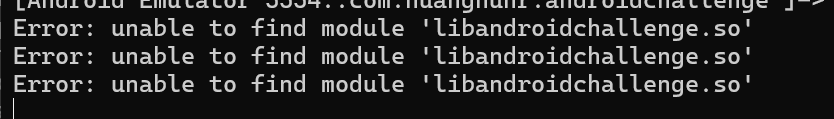

得到的key

```python
key:
/           0  1  2  3  4  5  6  7  8  9  A  B  C  D  E  F 0123456789ABCDEF
/ 00000000 5b 34 07 0c 6e e7 9f d8 ab 2f a6 db 12 4f 10 f9 [4 .n..../ .O .
```

之后就是用一个定义的函数来调用so中解密函数

```python
function callDecrypt(){
// 获取名为 "libandroidchallenge.so" 的模块（也就是目标 so 动态库）
   var md = Process.getModuleByName("libandroidchallenge.so");
//获取这个模块的基地址。so 文件加载到内存后，会有一个实际的起始地址，这就是 base
   var mdBase = md.base; // 获取模块的基地址
// 计算目标解密函数的实际地址：
// 0x286F8 是arm64架构下解密函数相对偏移;在x86_x64下是0x275E0
// 使用 mdBase.add(偏移) 得到解密函数在内存中的真实地址
// 然后用 NativeFunction 创建一个可以直接调用的 JS 函数。
// 返回类型：'pointer'（指针）
// 参数类型：['pointer', 'int', 'pointer'] → (输入数据指针, 输入长度, 密钥指针)
   var DecryptFunc = new NativeFunction(mdBase.add(0x286F8), 'pointer',
['pointer', 'int', 'pointer']);
// 分配一块内存空间，用来存放要解密的密文数据（大小 100 字节，足够存32字节）
   var input = Memory.alloc(100);
// 再分配一块内存空间，用来存放解密使用的 key（同样分配 100 字节）
   var key = Memory.alloc(100);
// 定义密文数组（32 个字节）：
// 这些字节就是程序中实际被加密的数据
   var inputBytes = [
       0xA8, 0xD1, 0xFE, 0xD6, 0x83, 0xE5, 0xD4, 0x5F,
       0xA5, 0x96, 0x9C, 0xDA, 0xD3, 0x6D, 0x5B, 0x35,
       0x60, 0x7C, 0x02, 0xE4, 0x92, 0x35, 0xF8, 0xA0,
       0x3A, 0x9B, 0xBC, 0x48, 0xEC, 0x48, 0x24, 0xDE
    ];
// 密文的实际长度（这里是32字节）
   var inputlen = 32;
// 定义密钥数组（16 个字节）
   var keyBytes = [
       0x5B, 0x34, 0x07, 0x0C, 0x6E, 0xE7, 0x9F, 0xD8,
       0xAB, 0x2F, 0xA6, 0xDB, 0x12, 0x4F, 0x10, 0xF9
   ];
// 将 keyBytes 逐字节写入到之前分配的 key 内存中
   for (var i = 0; i < 16; i++) {
       key.add(i).writeU8(keyBytes[i]);
   }
// 将 inputBytes 逐字节写入到 input 内存中
   for (var i = 0; i < 32; i++) {
       input.add(i).writeU8(inputBytes[i]);
   }
}
// 调用解密函数，传入参数：
// - input：密文数据的内存地址
// - inputlen：密文长度
// - key：密钥的内存地址
//
// 解密函数执行后，返回值是一个指向解密结果的指针
var res = DecryptFunc(input, inputlen, key);
// 从返回的指针位置，读取 32 字节的解密结果数据
var resbyte = res.readByteArray(32);
// 打印解密后的字节内容
console.log("decrypt resbyte:\n", resbyte);


```

在交互界面输入自定义的函数名callDecrypt（）

<!-- 这是一张图片，ocr 内容为： -->
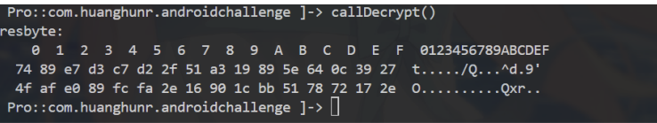

之后我们找出iv数组

 ivGen 是伪随机数算法。以123456为种子生成 了16字节的数组，最后转递到java层  

<!-- 这是一张图片，ocr 内容为： -->
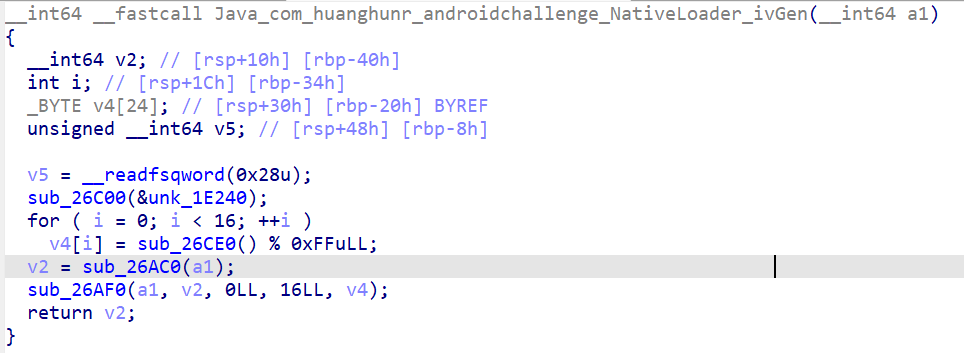

 我们可以用frida hook NativeLoader.INSTANCE.ivGen() 

hook脚本，输入正确的用户名，密码随便输入就可以得到

```python
Java.perform(function () {
    let NativeLoader = Java.use("com.huanghunr.androidchallenge.NativeLoader");
    let instance = NativeLoader.INSTANCE.value; // 拿到单例对象
    NativeLoader.ivGen.implementation = function () {
        let result = instance.ivGen(); // 调用单例对象的方法
        console.log("ivGen result =", JSON.stringify(result));
        return result;
    };
});
// 主动调用
function getiv(){
   let NativeLoader =
Java.use("com.huanghunr.androidchallenge.NativeLoader").$new();
   var result = NativeLoader.ivGen();
   console.log("ivGen result =", JSON.stringify(result));
   return result;
}
```

<!-- 这是一张图片，ocr 内容为： -->
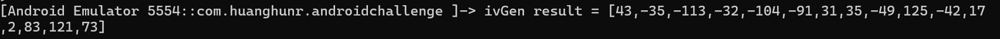

拿之前解出的数据于iv异或得到最后一段flag5   _Th3_w0rld_Of_@ndroid_15_am@z!ng  

```python
iv = [43,-35,-113,-32,-104,-91,31,35,-49,125,-42,17,2,83,121,73]
encdata = bytes.fromhex("74 89 e7 d3 c7 d2 2f 51 a3 19 89 5e 64 0c 39 27 4f af e0 89 fc fa 2e 16 90 1c bb 51 78 72 17 2e".replace(" ", ""))

res = []
for i in range(len(encdata)):
    res.append(encdata[i] ^ iv[i % len(iv)] & 0xff)
print(bytes(res).decode())

```

 flag{0nc$3@te_@c7iv17ys_@5S3$ts_5trin9_4oLi8_Th3_w0rld_Of_@ndroid_15_am@z!ng}  


# 3.ezwasm
打开开发者工具台，在源码里下载三个原文件，一个wasm，一个js，一个css

配置好ghidra环境，安装好ghidra-wasm插件

打开wasm文件，在exports里打开check函数

<!-- 这是一张图片，ocr 内容为： -->
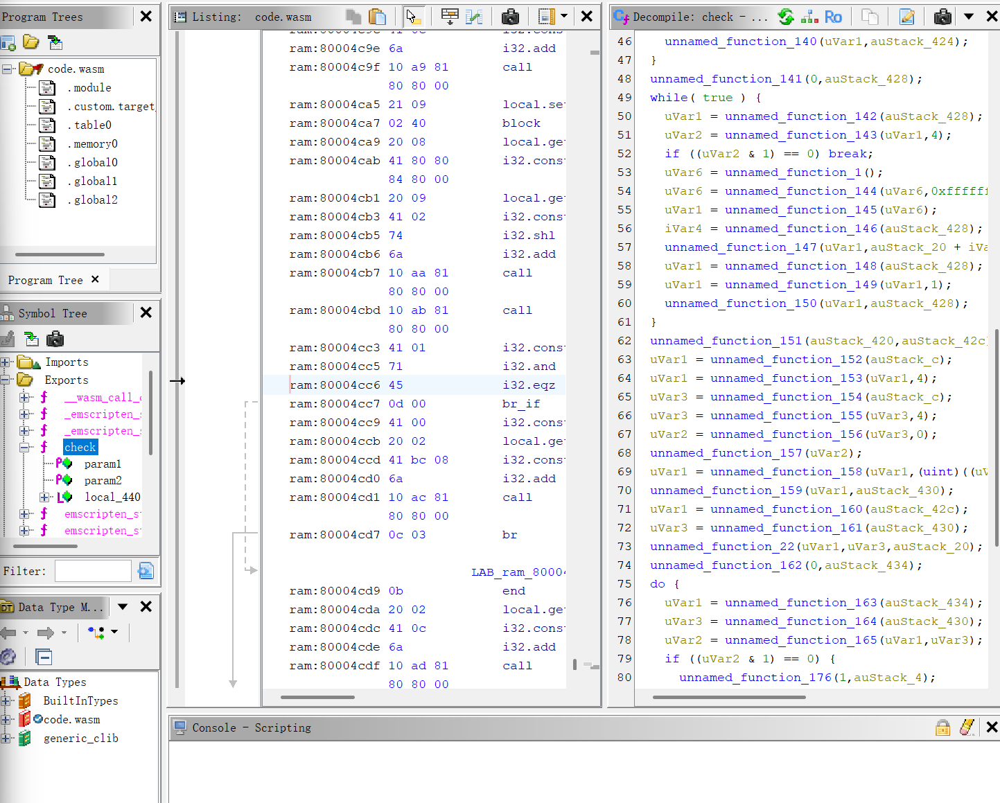

你可以去吧里面的函数都看看是什么作用，来给他们命名，这里我就不赘述了，只看其中重要的两个函数

一个是 （unnamed_function_1)是一个SplitMix64随机数算法   种子是0x9e3779b97f4a7c15  

<!-- 这是一张图片，ocr 内容为： -->
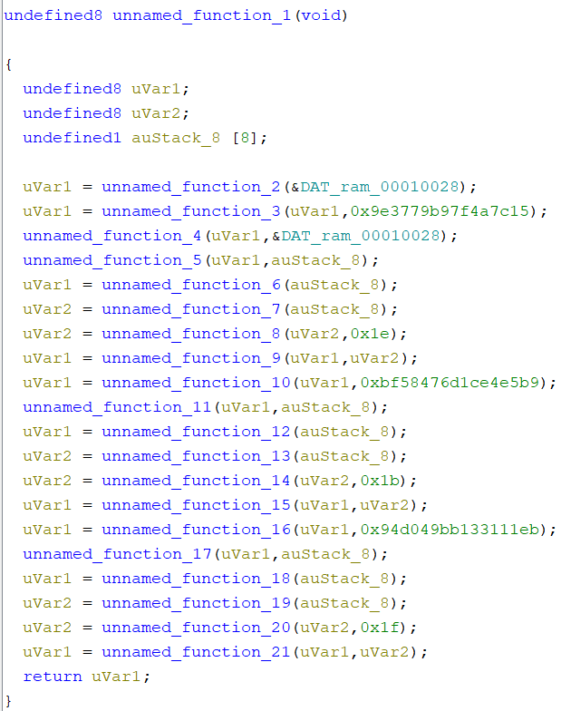

一个是 (unnamed_function_22)是一个xxtea算法，魔改了轮数，左右移位和delta  

```c
void unnamed_function_22(undefined4 param1,undefined4 param2,undefined4 param3)

{
    int iVar1;
    undefined4 uVar2;
    int iVar3;
    undefined4 uVar4;
    uint uVar5;
    undefined4 uVar6;
    undefined4 uVar7;
    undefined1 auStack_24 [4];
    undefined1 auStack_20 [4];
    undefined1 auStack_1c [4];
    undefined1 auStack_18 [4];
    undefined1 auStack_14 [4];
    undefined1 auStack_10 [4];
    undefined1 auStack_c [4];
    undefined1 auStack_8 [4];
    undefined1 auStack_4 [4];

    unnamed_function_23(param1,auStack_4);
    unnamed_function_24(param2,auStack_8);
    unnamed_function_25(param3,auStack_c);
    unnamed_function_26(0x4c,auStack_20);
    unnamed_function_27(0,auStack_18);
    iVar1 = unnamed_function_28(auStack_4);
    uVar2 = unnamed_function_29(auStack_8);
    iVar3 = unnamed_function_30(uVar2,1);
    uVar2 = unnamed_function_31(iVar1 + iVar3 * 4);
    unnamed_function_32(uVar2,auStack_14);
    do {
        uVar2 = unnamed_function_33(auStack_18);
        uVar2 = unnamed_function_34(uVar2,0x1ce4e5b9);
        unnamed_function_35(uVar2,auStack_18);
        uVar2 = unnamed_function_36(auStack_18);
        uVar2 = unnamed_function_37(uVar2,2);
        uVar2 = unnamed_function_38(uVar2,3);
        unnamed_function_39(uVar2,auStack_24);
        unnamed_function_40(0,auStack_1c);
        while( true ) {
            uVar2 = unnamed_function_41(auStack_1c);
            uVar4 = unnamed_function_42(auStack_8);
            uVar4 = unnamed_function_43(uVar4,1);
            uVar5 = unnamed_function_44(uVar2,uVar4);
            if ((uVar5 & 1) == 0) break;
            iVar1 = unnamed_function_45(auStack_4);
            uVar2 = unnamed_function_46(auStack_1c);
            iVar3 = unnamed_function_47(uVar2,1);
            uVar2 = unnamed_function_48(iVar1 + iVar3 * 4);
            unnamed_function_49(uVar2,auStack_10);
            uVar2 = unnamed_function_50(auStack_14);
            uVar2 = unnamed_function_51(uVar2,6);
            uVar4 = unnamed_function_52(auStack_10);
            uVar4 = unnamed_function_53(uVar4,1);
            uVar2 = unnamed_function_54(uVar2,uVar4);
            uVar4 = unnamed_function_55(auStack_10);
            uVar4 = unnamed_function_56(uVar4,5);
            uVar6 = unnamed_function_57(auStack_14);
            uVar6 = unnamed_function_58(uVar6,6);
            uVar4 = unnamed_function_59(uVar4,uVar6);
            uVar2 = unnamed_function_60(uVar2,uVar4);
            uVar4 = unnamed_function_61(auStack_18);
            uVar6 = unnamed_function_62(auStack_10);
            uVar4 = unnamed_function_63(uVar4,uVar6);
            iVar1 = unnamed_function_64(auStack_c);
            uVar6 = unnamed_function_65(auStack_1c);
            uVar6 = unnamed_function_66(uVar6,3);
            uVar7 = unnamed_function_67(auStack_24);
            iVar3 = unnamed_function_68(uVar6,uVar7);
            uVar6 = unnamed_function_69(iVar1 + iVar3 * 4);
            uVar7 = unnamed_function_70(auStack_14);
            uVar6 = unnamed_function_71(uVar6,uVar7);
            uVar4 = unnamed_function_72(uVar4,uVar6);
            uVar2 = unnamed_function_73(uVar2,uVar4);
            iVar1 = unnamed_function_74(auStack_4);
            iVar3 = unnamed_function_75(auStack_1c);
            iVar1 = iVar1 + iVar3 * 4;
            uVar4 = unnamed_function_76(iVar1);
            uVar2 = unnamed_function_77(uVar4,uVar2);
      unnamed_function_78(uVar2,iVar1);
      unnamed_function_79(uVar2,auStack_14);
      uVar2 = unnamed_function_80(auStack_1c);
      uVar2 = unnamed_function_81(uVar2,1);
      unnamed_function_82(uVar2,auStack_1c);
    }
    uVar2 = unnamed_function_83(auStack_4);
    uVar2 = unnamed_function_84(uVar2);
    unnamed_function_85(uVar2,auStack_10);
    uVar2 = unnamed_function_86(auStack_14);
    uVar2 = unnamed_function_87(uVar2,6);
    uVar4 = unnamed_function_88(auStack_10);
    uVar4 = unnamed_function_89(uVar4,1);
    uVar2 = unnamed_function_90(uVar2,uVar4);
    uVar4 = unnamed_function_91(auStack_10);
    uVar4 = unnamed_function_92(uVar4,5);
    uVar6 = unnamed_function_93(auStack_14);
    uVar6 = unnamed_function_94(uVar6,6);
    uVar4 = unnamed_function_95(uVar4,uVar6);
    uVar2 = unnamed_function_96(uVar2,uVar4);
    uVar4 = unnamed_function_97(auStack_18);
    uVar6 = unnamed_function_98(auStack_10);
    uVar4 = unnamed_function_99(uVar4,uVar6);
    iVar1 = unnamed_function_100(auStack_c);
    uVar6 = unnamed_function_101(auStack_1c);
    uVar6 = unnamed_function_102(uVar6,3);
    uVar7 = unnamed_function_103(auStack_24);
    iVar3 = unnamed_function_104(uVar6,uVar7);
    uVar6 = unnamed_function_105(iVar1 + iVar3 * 4);
    uVar7 = unnamed_function_106(auStack_14);
    uVar6 = unnamed_function_107(uVar6,uVar7);
    uVar4 = unnamed_function_108(uVar4,uVar6);
    uVar2 = unnamed_function_109(uVar2,uVar4);
    iVar1 = unnamed_function_110(auStack_4);
    uVar4 = unnamed_function_111(auStack_8);
    iVar3 = unnamed_function_112(uVar4,1);
    iVar1 = iVar1 + iVar3 * 4;
    uVar4 = unnamed_function_113(iVar1);
    uVar2 = unnamed_function_114(uVar4,uVar2);
    unnamed_function_115(uVar2,iVar1);
    unnamed_function_116(uVar2,auStack_14);
    uVar2 = unnamed_function_117(auStack_20);
    uVar2 = unnamed_function_118(uVar2,0xffffffff);
    unnamed_function_119(uVar2,auStack_20);
    uVar5 = unnamed_function_120(uVar2,0);
  } while ((uVar5 & 1) != 0);
  return;
}
```

这是官方wp中更换函数名字之后tea加密算法函数

```c
void xxtea(undefined4 param1,undefined4 param2,undefined4 param3)
{
undefined4 uVar1;
int iVar2;
undefined4 uVar3;
uint uVar4;
int key;
undefined4 p;
undefined4 e;
undefined e_1 [4];
undefined round [4];
undefined i [4];
undefined sum [4];
undefined z [4];
undefined auStack_10 [4];
undefined inputKey [4];
undefined len [4];
undefined input [4];
a2b(param1,input);
a2b(param2,len);
a2b(param3,inputKey);
a2b(0x4c,round);
a2b(0,sum);
key = gv(input);
uVar1 = gv(len);
iVar2 = sub(uVar1,1);
uVar1 = gv(key + iVar2 * 4);
a2b(uVar1,z);
do {
uVar1 = gv(sum);
uVar1 = add(uVar1,0x1ce4e5b9);
a2b(uVar1,sum);
uVar1 = gv(sum);
uVar1 = ror(uVar1,2);
uVar1 = and(uVar1,3);
a2b(uVar1,e_1);
a2b(0,i);
while( true ) {
uVar1 = gv(i);
uVar3 = gv(len);
uVar3 = sub(uVar3,1);
uVar4 = AlowB(uVar1,uVar3);
if ((uVar4 & 1) = 0) break;
key = gv(input);
uVar1 = gv(i);
iVar2 = add(uVar1,1);
uVar1 = gv(key + iVar2 * 4);
a2b(uVar1,auStack_10);
uVar1 = gv(z);
uVar1 = ror(uVar1,6);
uVar3 = gv(auStack_10);
uVar3 = rol(uVar3,1);
uVar1 = xor(uVar1,uVar3);
uVar3 = gv(auStack_10);
uVar3 = ror(uVar3,5);
p = gv(z);
p = rol(p,6);
uVar3 = xor(uVar3,p);
uVar1 = add(uVar1,uVar3);
uVar3 = gv(sum);
p = gv(auStack_10);
uVar3 = xor(uVar3,p);
key = gv(inputKey);
p = gv(i);
p = and(p,3);
e = gv(e_1);
iVar2 = xor(p,e);
p = gv(key + iVar2 * 4);
e = gv(z);
p = xor(p,e);
uVar3 = add(uVar3,p);
uVar1 = xor(uVar1,uVar3);
key = gv(input);
iVar2 = gv(i);
key = key + iVar2 * 4;
uVar3 = gv(key);
uVar1 = add(uVar3,uVar1);
a2b(uVar1,key);
a2b(uVar1,z);
uVar1 = gv(i);
大概命名完后正式分析check函数。
uVar1 = gv(uVar1,1);
a2b(uVar1,i);
}
uVar1 = unnamed_function_83(input); /后面和上面差不多
uVar1 = unnamed_function_84(uVar1);
unnamed_function_85(uVar1,auStack_10);
uVar1 = unnamed_function_86(z);
uVar1 = unnamed_function_87(uVar1,6);
uVar3 = unnamed_function_88(auStack_10);
uVar3 = unnamed_function_89(uVar3,1);
uVar1 = unnamed_function_90(uVar1,uVar3);
uVar3 = unnamed_function_91(auStack_10);
uVar3 = unnamed_function_92(uVar3,5);
p = unnamed_function_93(z);
p = unnamed_function_94(p,6);
uVar3 = unnamed_function_95(uVar3,p);
uVar1 = unnamed_function_96(uVar1,uVar3);
uVar3 = unnamed_function_97(sum);
p = unnamed_function_98(auStack_10);
uVar3 = unnamed_function_99(uVar3,p);
key = unnamed_function_100(inputKey);
p = unnamed_function_101(i);
p = unnamed_function_102(p,3);
e = unnamed_function_103(e_1);
iVar2 = unnamed_function_104(p,e);
p = unnamed_function_105(key + iVar2 * 4);
e = unnamed_function_106(z);
p = unnamed_function_107(p,e);
uVar3 = unnamed_function_108(uVar3,p);
uVar1 = unnamed_function_109(uVar1,uVar3);
key = unnamed_function_110(input);
uVar3 = unnamed_function_111(len);
iVar2 = unnamed_function_112(uVar3,1);
key = key + iVar2 * 4;
uVar3 = unnamed_function_113(key);
uVar1 = unnamed_function_114(uVar3,uVar1);
unnamed_function_115(uVar1,key);
unnamed_function_116(uVar1,z);
uVar1 = unnamed_function_117(round);
uVar1 = unnamed_function_118(uVar1,0xffffffff);
unnamed_function_119(uVar1,round);
uVar4 = unnamed_function_120(uVar1,0);
} while ((uVar4 & 1) = 0);
return;
}

```

而第一个函数是key生成函数

之后第22个函数也就是tea算法函数用这个key对输入进行加密

动态获取key

在wasm文件中调用func22函数出下断点，找到key

<!-- 这是一张图片，ocr 内容为： -->
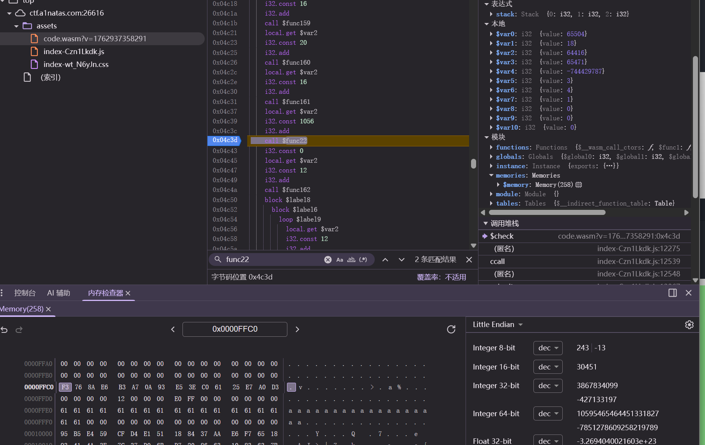

密文为

```c
        0x95,0xB5,0xE4,0x59, 0xCF,0xD4,0xE1,0x51,
        0x18,0x84,0x37,0xAA, 0xE6,0xF7,0x65,0x18,
        0x93,0x41,0x4A,0x3E, 0x7C,0x37,0xD0,0x6B,
        0xD7,0x20,0x86,0x63, 0x10,0x83,0x63,0x7B,
        0xA8,0x11,0x9B,0x24, 0x3D,0x26,0xCD,0x6B
```

<!-- 这是一张图片，ocr 内容为： -->
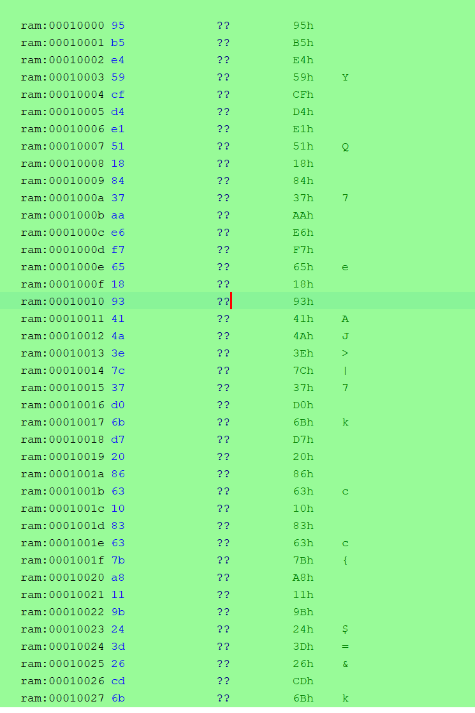

解密脚本

```c
#!/usr/bin/env python3
from typing import List
def u32(x): return x & 0xFFFFFFFF
def dec_btea(v: List[int], n: int, key: List[int]) -> List[int]:
    delta=0x1ce4e5b9; rounds=0x4c; s=(rounds*delta)&0xFFFFFFFF; y=v[0]
    for _ in range(rounds):
        e=(s>>2)&3
        for p in range(n-1,0,-1):
            z=v[p-1]
            t=(((z>>6)^((y<<1)&0xFFFFFFFF))+((y>>5)^((z<<6)&0xFFFFFFFF)))&0xFFFFFFFF
            t^=((s^y)+(key[(p&3)^e]^z))&0xFFFFFFFF
            v[p]=u32(v[p]-t); y=v[p]
        z=v[n-1]
        t=(((z>>6)^((y<<1)&0xFFFFFFFF))+((y>>5)^((z<<6)&0xFFFFFFFF)))&0xFFFFFFFF
        t^=((s^y)+(key[e]^z))&0xFFFFFFFF
        v[0]=u32(v[0]-t); s=u32(s-delta); y=v[0]
    return v
def b2u32le(b: bytes) -> List[int]: return [int.from_bytes(b[i:i+4],'little') for i in range(0,len(b),4)]
def u322ble(v: List[int]) -> bytes: return b''.join(x.to_bytes(4,'little') for x in v)
ct=bytes([0x95,0xB5,0xE4,0x59,0xCF,0xD4,0xE1,0x51,0x18,0x84,0x37,0xAA,0xE6,0xF7,0x65,0x18,0x93,0x41,0x4A,0x3E,0x7C,0x37,0xD0,0x6B,0xD7,0x20,0x86,0x63,0x10,0x83,0x63,0x7B,0xA8,0x11,0x9B,0x24,0x3D,0x26,0xCD,0x6B])
key=b2u32le(bytes([0xF3,0x76,0x8A,0xE6,0xB3,0xA7,0x0A,0x93,0xE5,0x3E,0xC0,0x61,0x25,0xE7,0xA0,0xD3]))
v=b2u32le(ct)
pt=u322ble(dec_btea(v,len(v),key))[:len(ct)]
print(pt.decode('latin1'))

```

flag{THi5_1s_4_fuNNY_Wa5m_ch4IlEnGE_10L}

注意每个附件的key和密文不一样


# 4.Hachimi
一道异常处理的题

try块

<!-- 这是一张图片，ocr 内容为： -->
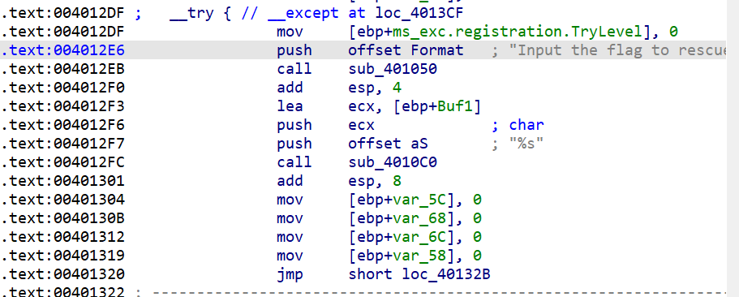

except块

<!-- 这是一张图片，ocr 内容为： -->
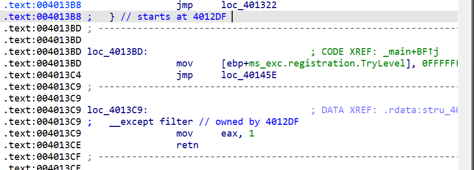

按官方wp中， 找到except块，也就是捕获异常的代码块，如果try块代码触发异常，则不会执行红框处代码，不会jmp带结尾，会 执行下面的 _except(loc_4013C9)块。但是反编译识别到这个jmp就让下面的代码都反编译不了了，我们要把except块全nop掉，就能看到完整main函数

<!-- 这是一张图片，ocr 内容为： -->
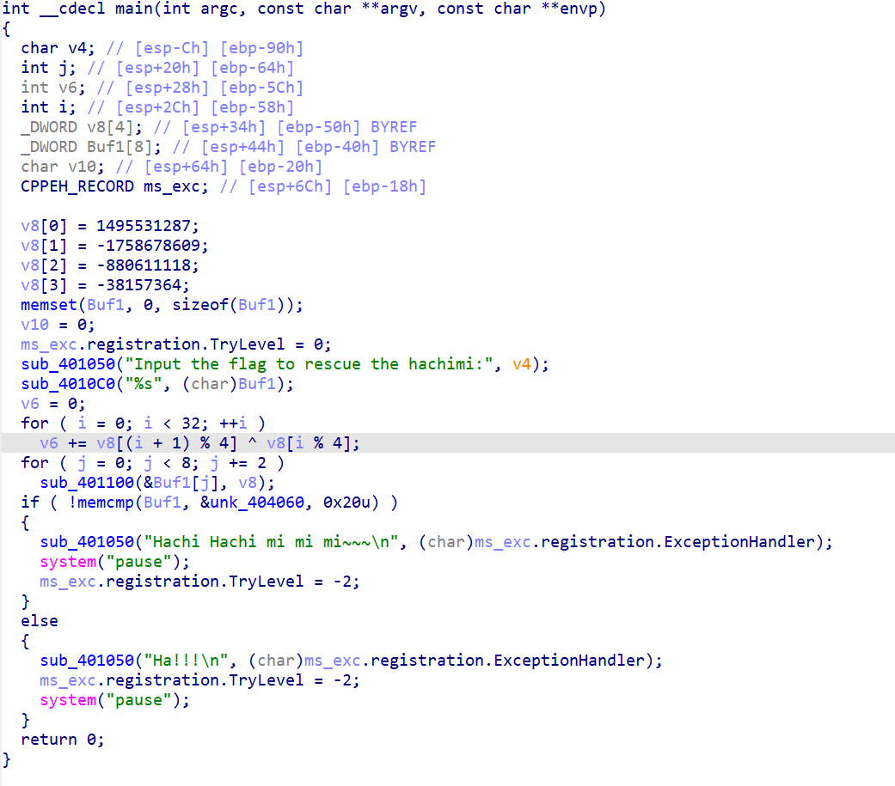

去看加密函数的时候会发现最后会返回39

<!-- 这是一张图片，ocr 内容为： -->
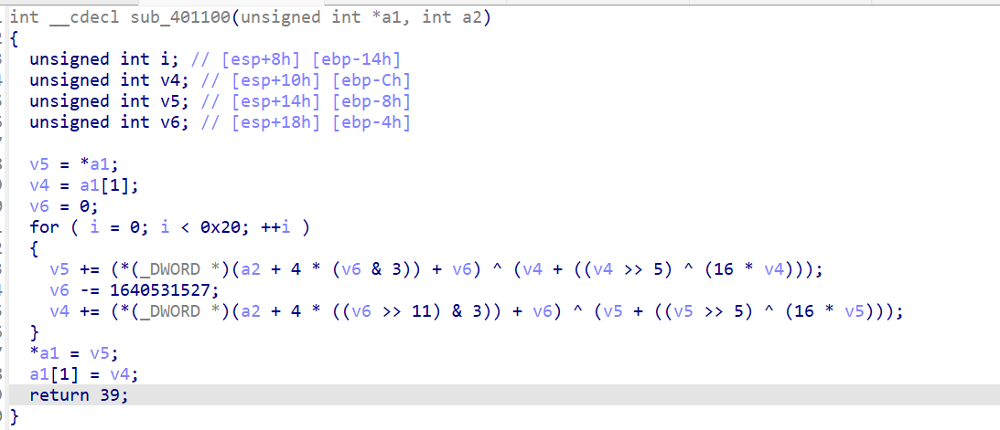

转到汇编，会看到下面还有一段没有被编译器识别到， 由于ida识别失败，会将这个 retn认为是函数是retn，所以反编译代码就截止到这边，后续的没了  ，我们把这段花指令，从push eax到retn全nop掉

<!-- 这是一张图片，ocr 内容为： -->
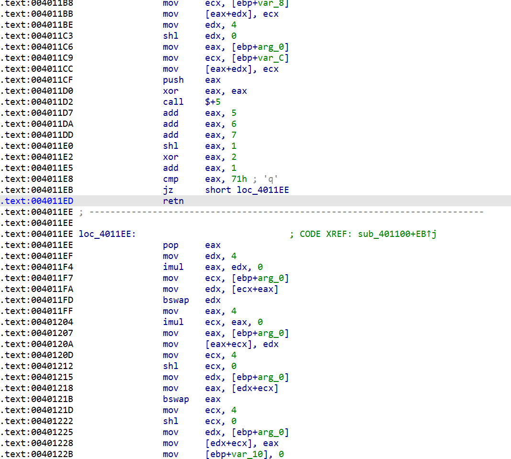

完整加密函数

<!-- 这是一张图片，ocr 内容为： -->
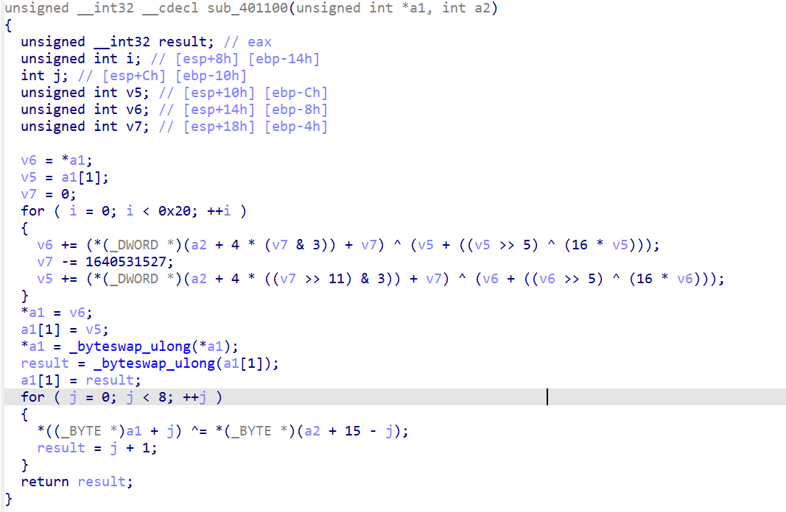

xxtea密钥

<!-- 这是一张图片，ocr 内容为： -->
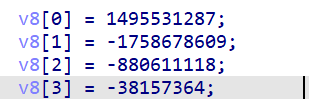

密文

```python
  0x4D, 0x7A, 0x3E, 0x7A, 0x84, 0xFF, 0x51, 0xB1, 0x31, 0x97, 
  0xFB, 0xDC, 0x2B, 0xA4, 0xCD, 0xFB, 0x85, 0xCD, 0x0A, 0x2B, 
  0xBD, 0x91, 0xCF, 0x69, 0xBA, 0x2B, 0x70, 0xD5, 0x43, 0xB8, 
  0x3E, 0x1F
```

解密脚本

```python
import struct

def xtea_decrypt_block(v0, v1, key):
    DELTA = 0x9E3779B9
    sum_ = (DELTA * 32) & 0xFFFFFFFF
    for _ in range(32):
        v1 = (v1 - (((v0 << 4 ^ v0 >> 5) + v0) ^ (sum_ + key[(sum_ >> 11) & 3]))) & 0xFFFFFFFF
        sum_ = (sum_ - DELTA) & 0xFFFFFFFF
        v0 = (v0 - (((v1 << 4 ^ v1 >> 5) + v1) ^ (sum_ + key[sum_ & 3]))) & 0xFFFFFFFF
    return v0, v1

k0 = 1495531287
k1 = (-1758678609) & 0xFFFFFFFF
k2 = (-880611118) & 0xFFFFFFFF
k3 = (-38157364) & 0xFFFFFFFF
key = [k0, k1, k2, k3]
key_bytes = struct.pack('<IIII', *key)
whitening = key_bytes[8:16][::-1]

ciphertext = bytes([0x4D, 0x7A, 0x3E, 0x7A, 0x84, 0xFF, 0x51, 0xB1, 0x31, 0x97, 0xFB, 0xDC, 0x2B, 0xA4, 0xCD, 0xFB, 0x85, 0xCD, 0x0A, 0x2B, 0xBD, 0x91, 0xCF, 0x69, 0xBA, 0x2B, 0x70, 0xD5, 0x43, 0xB8, 0x3E, 0x1F])

plaintext = b''
for i in range(0, len(ciphertext), 8):
    block = ciphertext[i:i+8]
    temp = bytes(b ^ w for b, w in zip(block, whitening))
    v0, v1 = struct.unpack('>II', temp)
    v0, v1 = xtea_decrypt_block(v0, v1, key)
    pt_block = struct.pack('<II', v0, v1)
    plaintext += pt_block

print(plaintext.decode('ascii', errors='ignore').strip())
```

flag{ha_ha_hachimi_na_bei_lu_do}


# 5.specialMaze
IDA打开main函数，一个走地图的题

<!-- 这是一张图片，ocr 内容为： -->
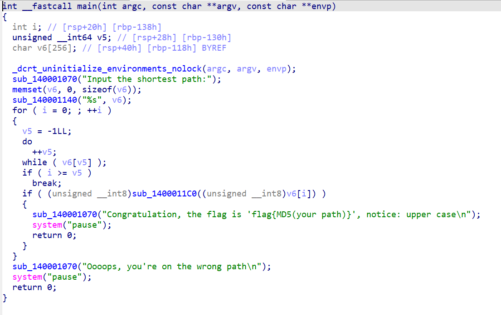

我们直接看sub_1400011C0函数

```python
char __fastcall sub_1400011C0(char a1)
{
  char result; // al
  unsigned int v2; // [rsp+0h] [rbp-28h]

  switch ( a1 )
  {
    case 'a':
      v2 = dword_1400051C4 - 1;
      break;
    case 'd':
      v2 = dword_1400051C4 + 1;
      break;
    case 's':
      v2 = dword_1400051C4 + 18;
      break;
    case 'w':
      v2 = dword_1400051C4 - 18;
      break;
    default:
      return 0;
  }
  if ( v2 >= 0x144 )
    return 0;
  switch ( asc_140005080[v2] )
  {
    case 0:
      dword_1400051C4 = v2;
      result = 0;
      break;
    case 4:
      if ( asc_140005080[79] )
        --asc_140005080[79];
      result = 0;
      break;
    case 5:
      if ( asc_140005080[195] )
        --asc_140005080[195];
      result = 0;
      break;
    case 6:
      if ( asc_140005080[281] )
        --asc_140005080[281];
      result = 0;
      break;
    case 9:
      result = 0;
      break;
    case 100:
      dword_1400051C4 = v2;
      result = 1;
      break;
    default:
      result = 0;
      break;
  }
  return result;
}
```

当前索引 dword_1400051C4  第二十个

<!-- 这是一张图片，ocr 内容为： -->
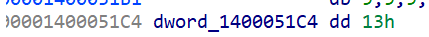

对应一下就是0

<!-- 这是一张图片，ocr 内容为： -->
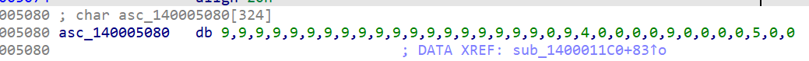

然后输入字符只接受 `**w/a/s/d**`：

+ `a`: `pos-1`（左）
+ `d`: `pos+1`（右）
+ `w`: `pos-18`（上）
+ `s`: `pos+18`（下）

根据目标格子的值做处理：

+ `0`：可走路面 → **移动**到该格（`pos = v2`），返回 `0`（未胜利）
+ `100`：终点 → **移动**到该格并返回 `1`（胜利）
+ `9`：阻塞（墙/陷阱）→ 不移动，返回 `0`
+ `4/5/6`：**开关按钮**（不进格、只遥控）
    - 尝试“走”向含 `4/5/6` 的邻格时，不移动，但会对**另一个固定索引**做 `--`：
        * 走向 `4`：若 `asc[79] > 0`，执行 `--asc[79]`
        * 走向 `5`：若 `asc[195] > 0`，执行 `--asc[195]`
        * 走向 `6`：若 `asc[281] > 0`，执行 `--asc[281]`
    - 按完仍在原地，返回 `0`

完整地图

```python
    9,   9,   9,   9,   9,   9,   9,   9,   9,   9, 
    9,   9,   9,   9,   9,   9,   9,   9,   9,   0, 
    9,   4,   0,   0,   0,   0,   9,   0,   0,   0, 
    0,   5,   0,   0,   9,   9,   9,   0,   9,   9, 
    9,   0,   9,   0,   9,   9,   9,   9,   9,   0, 
    9,   0,   9,   9,   9,   0,   0,   0,   0,   0, 
    9,   0,   9,   0,   0,   0,   9,   0,   9,   0, 
    9,   9,   9,   9,   9,   9,   9,   9,   9,   1, 
    9,   0,   9,   0,   9,   0,   9,   9,   9,   9, 
    9,   0,   0,   0,   9,   0,   9,   0,   0,   0, 
    9,   0,   9,   0,   0,   0,   9,   9,   9,   0, 
    9,   0,   9,   0,   9,   9,   9,   9,   9,   0, 
    9,   0,   9,   0,   9,   9,   9,   0,   9,   0, 
    0,   0,   0,   0,   9,   0,   0,   0,   9,   0, 
    9,   0,   9,   9,   9,   0,   9,   9,   9,   9, 
    9,   9,   9,   0,   9,   9,   9,   9,   9,   0, 
    9,   9,   9,   6,   9,   0,   0,   0,   0,   0, 
    9,   0,   0,   0,   0,   0,   0,   0,   9,   9, 
    9,   0,   9,   0,   9,   9,   9,   0,   9,   9, 
    9,   9,   9,   9,   9,   2,   9,   9,   9,   0, 
    9,   0,   0,   0,   9,   0,   0,   0,   9,   0, 
    0,   0,   0,   0,   9,   9,   9,   0,   9,   9, 
    9,   0,   9,   9,   9,   0,   9,   0,   9,   9, 
    9,   9,   9,   9,   9,   0,   0,   0,   9,   0, 
    0,   0,   9,   0,   0,   0,   9,   0,   0,   0, 
    9,   9,   9,   0,   9,   0,   9,   9,   9,   0, 
    9,   9,   9,   9,   9,   0,   9,   0,   9,   9, 
    9,   0,   9,   0,   0,   0,   0,   0,   0,   0, 
    0,   3,   0,   0,   9,   0,   0,   9,   9,   9, 
    9,   9,   9,   9,   9,   9,   9,   9,   9,   9, 
    9,   9,   9,   9, 100,   9,   9,   9,   9,   9, 
    9,   9,   9,   9,   9,   9,   9,   9,   9,   9, 
    9,   9,   9,   9
```

解题脚本

```python
import hashlib
from collections import deque


GRID_HEX = """
0x9 0x9 0x9 0x9 0x9 0x9 0x9 0x9 0x9 0x9 0x9 0x9 0x9 0x9 0x9 0x9 0x9 0x9 0x9 0x0 0x9 0x4 0x0 0x0 0x0 0x0 0x9 0x0 0x0 0x0 0x0 0x5 0x0 0x0 0x9 0x9 0x9 0x0 0x9 0x9 0x9 0x0 0x9 0x0 0x9 0x9 0x9 0x9 0x9 0x0 0x9 0x0 0x9 0x9 0x9 0x0 0x0 0x0 0x0 0x0 0x9 0x0 0x9 0x0 0x0 0x0 0x9 0x0 0x9 0x0 0x9 0x9 0x9 0x9 0x9 0x9 0x9 0x9 0x9 0x1 0x9 0x0 0x9 0x0 0x9 0x0 0x9 0x9 0x9 0x9 0x9 0x0 0x0 0x0 0x9 0x0 0x9 0x0 0x0 0x0 0x9 0x0 0x9 0x0 0x0 0x0 0x9 0x9 0x9 0x0 0x9 0x0 0x9 0x0 0x9 0x9 0x9 0x9 0x9 0x0 0x9 0x0 0x9 0x0 0x9 0x9 0x9 0x0 0x9 0x0 0x0 0x0 0x0 0x0 0x9 0x0 0x0 0x0 0x9 0x0 0x9 0x0 0x9 0x9 0x9 0x0 0x9 0x9 0x9 0x9 0x9 0x9 0x9 0x0 0x9 0x9 0x9 0x9 0x9 0x0 0x9 0x9 0x9 0x6 0x9 0x0 0x0 0x0 0x0 0x0 0x9 0x0 0x0 0x0 0x0 0x0 0x0 0x0 0x9 0x9 0x9 0x0 0x9 0x0 0x9 0x9 0x9 0x0 0x9 0x9 0x9 0x9 0x9 0x9 0x9 0x2 0x9 0x9 0x9 0x0 0x9 0x0 0x0 0x0 0x9 0x0 0x0 0x0 0x9 0x0 0x0 0x0 0x0 0x0 0x9 0x9 0x9 0x0 0x9 0x9 0x9 0x0 0x9 0x9 0x9 0x0 0x9 0x0 0x9 0x9 0x9 0x9 0x9 0x9 0x9 0x0 0x0 0x0 0x9 0x0 0x0 0x0 0x9 0x0 0x0 0x0 0x9 0x0 0x0 0x0 0x9 0x9 0x9 0x0 0x9 0x0 0x9 0x9 0x9 0x0 0x9 0x9 0x9 0x9 0x9 0x0 0x9 0x0 0x9 0x9 0x9 0x0 0x9 0x0 0x0 0x0 0x0 0x0 0x0 0x0 0x0 0x3 0x0 0x0 0x9 0x0 0x0 0x9 0x9 0x9 0x9 0x9 0x9 0x9 0x9 0x9 0x9 0x9 0x9 0x9 0x9 0x9 0x9 0x9 0x64 0x9 0x9 0x9 0x9 0x9 0x9 0x9 0x9 0x9 0x9 0x9 0x9 0x9 0x9 0x9 0x9 0x9 0x9 0x9
"""

W = 18
G = [int(x, 16) for x in GRID_HEX.split()]

START = 0x13
FINISH = 0x64
G4, G5, G6 = 79, 195, 281


def tile(i, c79, c195, c281):
    if i == G4:
        return c79
    if i == G5:
        return c195
    if i == G6:
        return c281
    return G[i]

def solve():
    c79, c195, c281 = G[G4], G[G5], G[G6]
    q = deque([((START, c79, c195, c281), "")])
    vis = {(START, c79, c195, c281)}
    moves = {"a": -1, "d": 1, "w": -W, "s": W}

    while q:
        (pos, c79, c195, c281), path = q.popleft()
        for ch, d in moves.items():
            v = pos + d
            if not (0 <= v < W * W):
                continue
            t = tile(v, c79, c195, c281)
            if t == 0:
                s = (v, c79, c195, c281)
                if s not in vis:
                    vis.add(s)
                    q.append((s, path + ch))
            elif t == FINISH:
                p = path + ch
                md5 = hashlib.md5(p.encode()).hexdigest().upper()
                print("path:", p)
                print("flag:", f"flag{{{md5}}}")
                return
            elif t == 4 and c79 > 0:
                s = (pos, c79 - 1, c195, c281)
                if s not in vis:
                    vis.add(s)
                    q.append((s, path + ch))
            elif t == 5 and c195 > 0:
                s = (pos, c79, c195 - 1, c281)
                if s not in vis:
                    vis.add(s)
                    q.append((s, path + ch))
            elif t == 6 and c281 > 0:
                s = (pos, c79, c195, c281 - 1)
                if s not in vis:
                    vis.add(s)
                    q.append((s, path + ch))
    print("no path")

if __name__ == "__main__":
    solve()
```

路径

ssddddwwaadddssssddwwddssssaassddddddwwwwaawwwwwsssddssssssaaaassaawwaawwaaaassddssddssaaaawwaawwwwwwsssddssddddddddddwwddssds

flag{10FA984B6294B96D8D5699ED7D4EF61A}


# 6.VM
自定义的字节码加解释题

先导入题目给的dbg附件

在定位到runner解释器

<!-- 这是一张图片，ocr 内容为： -->
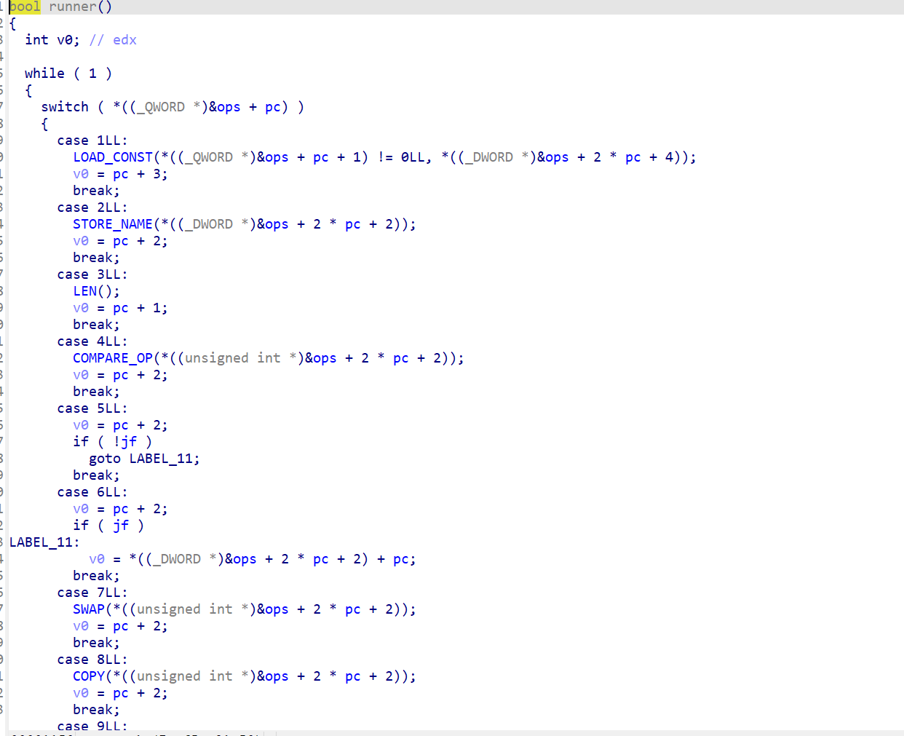

现在case1调用的函数的地方下条件断点，写入下面函数体

```c
pc_addr=idc.get_name_ea_simple("pc") 
pc=ida_bytes.get_word(pc_addr) 
sp_addr=idc.get_name_ea_simple("sp_") 
sp=ida_bytes.get_word(sp_addr) 
rcx=idc.get_reg_value("rcx") 
rdx=idc.get_reg_value("rdx") 
r8=idc.get_reg_value("r8") 
r9=idc.get_reg_value("r9") 
op_name="_LOAD_CONST" 
print(pc, op_name, "sp{}".format(sp), rcx, rdx, r8, r9)
```

运行

```c
0 _LOAD_CONST sp65535 1 0 0 56503560224
5 _LOAD_CONST sp65535 1 1 9223372036854775804 1692878378624
13 _LOAD_CONST sp65535 0 0 9151031864016699135 3026190458141290544
```

接着case2下条件断点

```c
3 _STORE_NAME sp65535 0 140696112143560 140696112205920 13846361207288113
8 _STORE_NAME sp65535 1 140696112143560 140696112205920 28262291131689595
```

case3

```c
12 _LEN sp65535 18446744073709551552 140696112143536 9223372036854775804 9295712209692852480
```

case4

```c
16 _COMPARE_OP sp65535 3 140696112143504 140696112205920 2371430651872
```

类似就是这样的结果，之后就是我们在runner中每个调用函数的地方下一个条件断点

调试，输入一个长度为30的字符串

就可以得到

```c
65535 _LOAD_CONST sp=65535 1 0 0 492153335056
65535 _STORE_NAME sp=65535 0 140702510881992 140702510944352 35291442962325857
65535 _LOAD_CONST sp=65535 1 1 9223372036854775804 2645304350336
65535 _STORE_NAME sp=65535 1 140702510881992 140702510944352 28262291131689595
65535 _LOAD_NAME sp=65535 0 140702510881680 9223372036854775804 2645304350336
65535 _LEN sp=65535 18446744073709551536 140702510881968 9223372036854775804 9295712209692852480
65535 _LOAD_CONST sp=65535 0 0 9151031864016699135 3026274227991896160
16 _COMPARE_OP sp65535 3 140702510881936 140702510944352 2645304350704
65535 _LOAD_CONST sp=65535 0 2 0 2645304350576
65535 _STORE_NAME sp=65535 2 140702510881992 140702510944352 2645304350640
65535 _LOAD_NAME sp=65535 2 140702510881680 9223372036854775804 2645304350576
65535 _LOAD_CONST sp=65535 0 0 9223372036854775804 127
32 _COMPARE_OP sp65535 0 140702510881936 140702510944352 2645304350768
65535 _LOAD_NAME sp=65535 0 140702510881680 1 2645304350576
65535 _LOAD_NAME sp=65535 2 140702510881680 9223372036854775804 9295712209692852480
65535 _COPY sp=65535 2 140702510881808 9223372036854775804 127
65535 _COPY sp=65535 2 140702510881808 9223372036854775804 9295712209692852480
44 _BINARY_SUBSCR sp65535 0 140702510881792 9223372036854775804 2645304350928
65535 _LOAD_NAME sp=65535 2 140702510881680 9223372036854775804 2645304350848
65535 _LOAD_CONST sp=65535 0 1 9223372036854775804 2645304350912
65535 _BINARY_OP sp=65535 0 140702510881752 140702510944352 2645304350976
65535 _LOAD_CONST sp=65535 0 3 9223372036854775804 2645304350912
65535 _BINARY_OP sp=65535 3 140702510881752 140702510944352 2645304350976
65535 _BINARY_OP sp=65535 1 140702510881752 9223372036854775804 2645304350912
59 _SWAP sp65535 3 140702510881840 9223372036854775804 2645304350848
61 _SWAP sp65535 2 140702510881840 0 0
65535 _STORE_SUBSCR sp=65535 140702510944352 140702510881776 0 1
65535 _LOAD_NAME sp=65535 2 140702510881680 9223372036854775804 2645304350704
65535 _LOAD_CONST sp=65535 0 1 9223372036854775804 127
65535 _BINARY_OP sp=65535 0 140702510881752 140702510944352 2645304350768
65535 _STORE_NAME sp=65535 2 140702510881992 9223372036854775804 127
65535 _LOAD_NAME sp=65535 2 140702510881680 9223372036854775804 2645304350576
65535 _LOAD_CONST sp=65535 0 0 9223372036854775804 127
78 _COMPARE_OP sp65535 0 140702510881936 140702510944352 2645304350832
65535 _LOAD_NAME sp=65535 0 140702510881680 9223372036854775804 2645304350576
65535 _LOAD_NAME sp=65535 2 140702510881680 9223372036854775804 9295712209692852480
65535 _COPY sp=65535 2 140702510881808 9223372036854775804 127
65535 _COPY sp=65535 2 140702510881808 9223372036854775804 9295712209692852480
44 _BINARY_SUBSCR sp65535 1 140702510881792 9223372036854775804 2645304350992
65535 _LOAD_NAME sp=65535 2 140702510881680 9223372036854775804 2645304350912
65535 _LOAD_CONST sp=65535 0 1 9223372036854775804 2645304350976
65535 _BINARY_OP sp=65535 0 140702510881752 140702510944352 2645304351040
65535 _LOAD_CONST sp=65535 0 3 9223372036854775804 2645304350976
65535 _BINARY_OP sp=65535 3 140702510881752 140702510944352 2645304351040
65535 _BINARY_OP sp=65535 1 140702510881752 9223372036854775804 2645304350976
59 _SWAP sp65535 3 140702510881840 9223372036854775804 2645304350912
61 _SWAP sp65535 2 140702510881840 0 0
65535 _STORE_SUBSCR sp=65535 140702510944352 140702510881776 0 1
65535 _LOAD_NAME sp=65535 2 140702510881680 9223372036854775804 2645304350768
65535 _LOAD_CONST sp=65535 0 1 9223372036854775804 127
65535 _BINARY_OP sp=65535 0 140702510881752 140702510944352 2645304350832
65535 _STORE_NAME sp=65535 2 140702510881992 9223372036854775804 127
65535 _LOAD_NAME sp=65535 2 140702510881680 9223372036854775804 2645304350576
65535 _LOAD_CONST sp=65535 0 0 9223372036854775804 127
78 _COMPARE_OP sp65535 0 140702510881936 140702510944352 2645304350896
65535 _LOAD_NAME sp=65535 0 140702510881680 9223372036854775804 2645304350576
65535 _LOAD_NAME sp=65535 2 140702510881680 9223372036854775804 9295712209692852480
65535 _COPY sp=65535 2 140702510881808 9223372036854775804 127
65535 _COPY sp=65535 2 140702510881808 9223372036854775804 9295712209692852480
44 _BINARY_SUBSCR sp65535 2 140702510881792 9223372036854775804 2645304351056
65535 _LOAD_NAME sp=65535 2 140702510881680 9223372036854775804 2645304350976
65535 _LOAD_CONST sp=65535 0 1 9223372036854775804 2645304351040
65535 _BINARY_OP sp=65535 0 140702510881752 140702510944352 2645304351104
65535 _LOAD_CONST sp=65535 0 3 9223372036854775804 2645304351040
65535 _BINARY_OP sp=65535 3 140702510881752 140702510944352 2645304351104
65535 _BINARY_OP sp=65535 1 140702510881752 9223372036854775804 2645304351040
59 _SWAP sp65535 3 140702510881840 9223372036854775804 2645304350976
61 _SWAP sp65535 2 140702510881840 0 0
65535 _STORE_SUBSCR sp=65535 140702510944352 140702510881776 0 1
65535 _LOAD_NAME sp=65535 2 140702510881680 9223372036854775804 2645304350832
65535 _LOAD_CONST sp=65535 0 1 9223372036854775804 127
65535 _BINARY_OP sp=65535 0 140702510881752 140702510944352 2645304350896
65535 _STORE_NAME sp=65535 2 140702510881992 9223372036854775804 127
65535 _LOAD_NAME sp=65535 2 140702510881680 9223372036854775804 2645304350576
65535 _LOAD_CONST sp=65535 0 0 9223372036854775804 127
78 _COMPARE_OP sp65535 0 140702510881936 140702510944352 2645304350960
65535 _LOAD_NAME sp=65535 0 140702510881680 9223372036854775804 2645304350576
65535 _LOAD_NAME sp=65535 2 140702510881680 9223372036854775804 9295712209692852480
65535 _COPY sp=65535 2 140702510881808 9223372036854775804 127
65535 _COPY sp=65535 2 140702510881808 9223372036854775804 9295712209692852480
44 _BINARY_SUBSCR sp65535 3 140702510881792 9223372036854775804 2645304351120
65535 _LOAD_NAME sp=65535 2 140702510881680 9223372036854775804 2645304351040
65535 _LOAD_CONST sp=65535 0 1 9223372036854775804 2645304351104
65535 _BINARY_OP sp=65535 0 140702510881752 140702510944352 2645304351168
65535 _LOAD_CONST sp=65535 0 3 9223372036854775804 2645304351104
65535 _BINARY_OP sp=65535 3 140702510881752 140702510944352 2645304351168
65535 _BINARY_OP sp=65535 1 140702510881752 9223372036854775804 2645304351104
59 _SWAP sp65535 3 140702510881840 9223372036854775804 2645304351040
61 _SWAP sp65535 2 140702510881840 0 0
65535 _STORE_SUBSCR sp=65535 140702510944352 140702510881776 0 1
65535 _LOAD_NAME sp=65535 2 140702510881680 9223372036854775804 2645304350896
65535 _LOAD_CONST sp=65535 0 1 9223372036854775804 127
65535 _BINARY_OP sp=65535 0 140702510881752 140702510944352 2645304350960
65535 _STORE_NAME sp=65535 2 140702510881992 9223372036854775804 127
65535 _LOAD_NAME sp=65535 2 140702510881680 9223372036854775804 2645304350576
65535 _LOAD_CONST sp=65535 0 0 9223372036854775804 127
78 _COMPARE_OP sp65535 0 140702510881936 140702510944352 2645304351024
65535 _LOAD_NAME sp=65535 0 140702510881680 9223372036854775804 2645304350576
65535 _LOAD_NAME sp=65535 2 140702510881680 9223372036854775804 9295712209692852480
65535 _COPY sp=65535 2 140702510881808 9223372036854775804 127
65535 _COPY sp=65535 2 140702510881808 9223372036854775804 9295712209692852480
44 _BINARY_SUBSCR sp65535 4 140702510881792 9223372036854775804 2645304351184
65535 _LOAD_NAME sp=65535 2 140702510881680 9223372036854775804 2645304351104
65535 _LOAD_CONST sp=65535 0 1 9223372036854775804 2645304351168
65535 _BINARY_OP sp=65535 0 140702510881752 140702510944352 2645304351232
65535 _LOAD_CONST sp=65535 0 3 9223372036854775804 2645304351168
65535 _BINARY_OP sp=65535 3 140702510881752 140702510944352 2645304351232
65535 _BINARY_OP sp=65535 1 140702510881752 9223372036854775804 2645304351168
59 _SWAP sp65535 3 140702510881840 9223372036854775804 2645304351104
61 _SWAP sp65535 2 140702510881840 0 0
65535 _STORE_SUBSCR sp=65535 140702510944352 140702510881776 0 1
65535 _LOAD_NAME sp=65535 2 140702510881680 9223372036854775804 2645304350960
65535 _LOAD_CONST sp=65535 0 1 9223372036854775804 127
65535 _BINARY_OP sp=65535 0 140702510881752 140702510944352 2645304351024
65535 _STORE_NAME sp=65535 2 140702510881992 9223372036854775804 127
65535 _LOAD_NAME sp=65535 2 140702510881680 9223372036854775804 2645304350576
65535 _LOAD_CONST sp=65535 0 0 9223372036854775804 127
78 _COMPARE_OP sp65535 0 140702510881936 140702510944352 2645304351088
65535 _LOAD_NAME sp=65535 0 140702510881680 9223372036854775804 2645304350576
65535 _LOAD_NAME sp=65535 2 140702510881680 9223372036854775804 9295712209692852480
65535 _COPY sp=65535 2 140702510881808 9223372036854775804 127
65535 _COPY sp=65535 2 140702510881808 9223372036854775804 9295712209692852480
44 _BINARY_SUBSCR sp65535 5 140702510881792 9223372036854775804 2645304351248
65535 _LOAD_NAME sp=65535 2 140702510881680 9223372036854775804 2645304351168
65535 _LOAD_CONST sp=65535 0 1 9223372036854775804 2645304351232
65535 _BINARY_OP sp=65535 0 140702510881752 140702510944352 2645304351296
65535 _LOAD_CONST sp=65535 0 3 9223372036854775804 2645304351232
65535 _BINARY_OP sp=65535 3 140702510881752 140702510944352 2645304351296
65535 _BINARY_OP sp=65535 1 140702510881752 9223372036854775804 2645304351232
59 _SWAP sp65535 3 140702510881840 9223372036854775804 2645304351168
61 _SWAP sp65535 2 140702510881840 0 0
65535 _STORE_SUBSCR sp=65535 140702510944352 140702510881776 0 1
65535 _LOAD_NAME sp=65535 2 140702510881680 9223372036854775804 2645304351024
65535 _LOAD_CONST sp=65535 0 1 9223372036854775804 127
65535 _BINARY_OP sp=65535 0 140702510881752 140702510944352 2645304351088
65535 _STORE_NAME sp=65535 2 140702510881992 9223372036854775804 127
65535 _LOAD_NAME sp=65535 2 140702510881680 9223372036854775804 2645304350576
65535 _LOAD_CONST sp=65535 0 0 9223372036854775804 127
78 _COMPARE_OP sp65535 0 140702510881936 140702510944352 2645304351152
65535 _LOAD_NAME sp=65535 0 140702510881680 9223372036854775804 2645304350576
65535 _LOAD_NAME sp=65535 2 140702510881680 9223372036854775804 9295712209692852480
65535 _COPY sp=65535 2 140702510881808 9223372036854775804 127
65535 _COPY sp=65535 2 140702510881808 9223372036854775804 9295712209692852480
44 _BINARY_SUBSCR sp65535 6 140702510881792 9223372036854775804 2645304351312
65535 _LOAD_NAME sp=65535 2 140702510881680 9223372036854775804 2645304351232
65535 _LOAD_CONST sp=65535 0 1 9223372036854775804 2645304351296
65535 _BINARY_OP sp=65535 0 140702510881752 140702510944352 2645304351360
65535 _LOAD_CONST sp=65535 0 3 9223372036854775804 2645304351296
65535 _BINARY_OP sp=65535 3 140702510881752 140702510944352 2645304351360
65535 _BINARY_OP sp=65535 1 140702510881752 9223372036854775804 2645304351296
59 _SWAP sp65535 3 140702510881840 9223372036854775804 2645304351232
61 _SWAP sp65535 2 140702510881840 0 0
65535 _STORE_SUBSCR sp=65535 140702510944352 140702510881776 0 1
65535 _LOAD_NAME sp=65535 2 140702510881680 9223372036854775804 2645304351088
65535 _LOAD_CONST sp=65535 0 1 9223372036854775804 127
65535 _BINARY_OP sp=65535 0 140702510881752 140702510944352 2645304351152
65535 _STORE_NAME sp=65535 2 140702510881992 9223372036854775804 127
65535 _LOAD_NAME sp=65535 2 140702510881680 9223372036854775804 2645304350576
65535 _LOAD_CONST sp=65535 0 0 9223372036854775804 127
78 _COMPARE_OP sp65535 0 140702510881936 140702510944352 2645304351216
65535 _LOAD_NAME sp=65535 0 140702510881680 9223372036854775804 2645304350576
65535 _LOAD_NAME sp=65535 2 140702510881680 9223372036854775804 9295712209692852480
65535 _COPY sp=65535 2 140702510881808 9223372036854775804 127
65535 _COPY sp=65535 2 140702510881808 9223372036854775804 9295712209692852480
44 _BINARY_SUBSCR sp65535 7 140702510881792 9223372036854775804 2645304351376
65535 _LOAD_NAME sp=65535 2 140702510881680 9223372036854775804 2645304351296
65535 _LOAD_CONST sp=65535 0 1 9223372036854775804 2645304351360
65535 _BINARY_OP sp=65535 0 140702510881752 140702510944352 2645304351424
65535 _LOAD_CONST sp=65535 0 3 9223372036854775804 2645304351360
65535 _BINARY_OP sp=65535 3 140702510881752 140702510944352 2645304351424
65535 _BINARY_OP sp=65535 1 140702510881752 9223372036854775804 2645304351360
59 _SWAP sp65535 3 140702510881840 9223372036854775804 2645304351296
61 _SWAP sp65535 2 140702510881840 0 0
65535 _STORE_SUBSCR sp=65535 140702510944352 140702510881776 0 1
65535 _LOAD_NAME sp=65535 2 140702510881680 9223372036854775804 2645304351152
65535 _LOAD_CONST sp=65535 0 1 9223372036854775804 127
65535 _BINARY_OP sp=65535 0 140702510881752 140702510944352 2645304351216
65535 _STORE_NAME sp=65535 2 140702510881992 9223372036854775804 127
65535 _LOAD_NAME sp=65535 2 140702510881680 9223372036854775804 2645304350576
65535 _LOAD_CONST sp=65535 0 0 9223372036854775804 127
78 _COMPARE_OP sp65535 0 140702510881936 140702510944352 2645304351280
65535 _LOAD_NAME sp=65535 0 140702510881680 9223372036854775804 2645304350576
65535 _LOAD_NAME sp=65535 2 140702510881680 9223372036854775804 9295712209692852480
65535 _COPY sp=65535 2 140702510881808 9223372036854775804 127
65535 _COPY sp=65535 2 140702510881808 9223372036854775804 9295712209692852480
44 _BINARY_SUBSCR sp65535 8 140702510881792 9223372036854775804 2645304351440
65535 _LOAD_NAME sp=65535 2 140702510881680 9223372036854775804 2645304351360
65535 _LOAD_CONST sp=65535 0 1 9223372036854775804 2645304351424
65535 _BINARY_OP sp=65535 0 140702510881752 140702510944352 2645304351488
65535 _LOAD_CONST sp=65535 0 3 9223372036854775804 2645304351424
65535 _BINARY_OP sp=65535 3 140702510881752 140702510944352 2645304351488
65535 _BINARY_OP sp=65535 1 140702510881752 9223372036854775804 2645304351424
59 _SWAP sp65535 3 140702510881840 9223372036854775804 2645304351360
61 _SWAP sp65535 2 140702510881840 0 0
65535 _STORE_SUBSCR sp=65535 140702510944352 140702510881776 0 1
65535 _LOAD_NAME sp=65535 2 140702510881680 9223372036854775804 2645304351216
65535 _LOAD_CONST sp=65535 0 1 9223372036854775804 127
65535 _BINARY_OP sp=65535 0 140702510881752 140702510944352 2645304351280
65535 _STORE_NAME sp=65535 2 140702510881992 9223372036854775804 127
65535 _LOAD_NAME sp=65535 2 140702510881680 9223372036854775804 2645304350576
65535 _LOAD_CONST sp=65535 0 0 9223372036854775804 127
78 _COMPARE_OP sp65535 0 140702510881936 140702510944352 2645304351344
65535 _LOAD_NAME sp=65535 0 140702510881680 9223372036854775804 2645304350576
65535 _LOAD_NAME sp=65535 2 140702510881680 9223372036854775804 9295712209692852480
65535 _COPY sp=65535 2 140702510881808 9223372036854775804 127
65535 _COPY sp=65535 2 140702510881808 9223372036854775804 9295712209692852480
44 _BINARY_SUBSCR sp65535 9 140702510881792 9223372036854775804 2645304351504
65535 _LOAD_NAME sp=65535 2 140702510881680 9223372036854775804 2645304351424
65535 _LOAD_CONST sp=65535 0 1 9223372036854775804 2645304351488
65535 _BINARY_OP sp=65535 0 140702510881752 140702510944352 2645304351552
65535 _LOAD_CONST sp=65535 0 3 9223372036854775804 2645304351488
65535 _BINARY_OP sp=65535 3 140702510881752 140702510944352 2645304351552
65535 _BINARY_OP sp=65535 1 140702510881752 9223372036854775804 2645304351488
59 _SWAP sp65535 3 140702510881840 9223372036854775804 2645304351424
61 _SWAP sp65535 2 140702510881840 0 0
65535 _STORE_SUBSCR sp=65535 140702510944352 140702510881776 0 1
65535 _LOAD_NAME sp=65535 2 140702510881680 9223372036854775804 2645304351280
65535 _LOAD_CONST sp=65535 0 1 9223372036854775804 127
65535 _BINARY_OP sp=65535 0 140702510881752 140702510944352 2645304351344
65535 _STORE_NAME sp=65535 2 140702510881992 9223372036854775804 127
65535 _LOAD_NAME sp=65535 2 140702510881680 9223372036854775804 2645304350576
65535 _LOAD_CONST sp=65535 0 0 9223372036854775804 127
78 _COMPARE_OP sp65535 0 140702510881936 140702510944352 2645304351408
65535 _LOAD_NAME sp=65535 0 140702510881680 9223372036854775804 2645304350576
65535 _LOAD_NAME sp=65535 2 140702510881680 9223372036854775804 9295712209692852480
65535 _COPY sp=65535 2 140702510881808 9223372036854775804 127
65535 _COPY sp=65535 2 140702510881808 9223372036854775804 9295712209692852480
44 _BINARY_SUBSCR sp65535 10 140702510881792 9223372036854775804 2645304351568
65535 _LOAD_NAME sp=65535 2 140702510881680 9223372036854775804 2645304351488
65535 _LOAD_CONST sp=65535 0 1 9223372036854775804 2645304351552
65535 _BINARY_OP sp=65535 0 140702510881752 140702510944352 2645304351616
65535 _LOAD_CONST sp=65535 0 3 9223372036854775804 2645304351552
65535 _BINARY_OP sp=65535 3 140702510881752 140702510944352 2645304351616
65535 _BINARY_OP sp=65535 1 140702510881752 9223372036854775804 2645304351552
59 _SWAP sp65535 3 140702510881840 9223372036854775804 2645304351488
61 _SWAP sp65535 2 140702510881840 0 0
65535 _STORE_SUBSCR sp=65535 140702510944352 140702510881776 0 1
65535 _LOAD_NAME sp=65535 2 140702510881680 9223372036854775804 2645304351344
65535 _LOAD_CONST sp=65535 0 1 9223372036854775804 127
65535 _BINARY_OP sp=65535 0 140702510881752 140702510944352 2645304351408
65535 _STORE_NAME sp=65535 2 140702510881992 9223372036854775804 127
65535 _LOAD_NAME sp=65535 2 140702510881680 9223372036854775804 2645304350576
65535 _LOAD_CONST sp=65535 0 0 9223372036854775804 127
78 _COMPARE_OP sp65535 0 140702510881936 140702510944352 2645304351472
65535 _LOAD_NAME sp=65535 0 140702510881680 9223372036854775804 2645304350576
65535 _LOAD_NAME sp=65535 2 140702510881680 9223372036854775804 9295712209692852480
65535 _COPY sp=65535 2 140702510881808 9223372036854775804 127
65535 _COPY sp=65535 2 140702510881808 9223372036854775804 9295712209692852480
44 _BINARY_SUBSCR sp65535 11 140702510881792 9223372036854775804 2645304351632
65535 _LOAD_NAME sp=65535 2 140702510881680 9223372036854775804 2645304351552
65535 _LOAD_CONST sp=65535 0 1 9223372036854775804 2645304351616
65535 _BINARY_OP sp=65535 0 140702510881752 140702510944352 2645304351680
65535 _LOAD_CONST sp=65535 0 3 9223372036854775804 2645304351616
65535 _BINARY_OP sp=65535 3 140702510881752 140702510944352 2645304351680
65535 _BINARY_OP sp=65535 1 140702510881752 9223372036854775804 2645304351616
59 _SWAP sp65535 3 140702510881840 9223372036854775804 2645304351552
61 _SWAP sp65535 2 140702510881840 0 0
65535 _STORE_SUBSCR sp=65535 140702510944352 140702510881776 0 1
65535 _LOAD_NAME sp=65535 2 140702510881680 9223372036854775804 2645304351408
65535 _LOAD_CONST sp=65535 0 1 9223372036854775804 127
65535 _BINARY_OP sp=65535 0 140702510881752 140702510944352 2645304351472
65535 _STORE_NAME sp=65535 2 140702510881992 9223372036854775804 127
65535 _LOAD_NAME sp=65535 2 140702510881680 9223372036854775804 2645304350576
65535 _LOAD_CONST sp=65535 0 0 9223372036854775804 127
78 _COMPARE_OP sp65535 0 140702510881936 140702510944352 2645304351536
65535 _LOAD_NAME sp=65535 0 140702510881680 9223372036854775804 2645304350576
65535 _LOAD_NAME sp=65535 2 140702510881680 9223372036854775804 9295712209692852480
65535 _COPY sp=65535 2 140702510881808 9223372036854775804 127
65535 _COPY sp=65535 2 140702510881808 9223372036854775804 9295712209692852480
44 _BINARY_SUBSCR sp65535 12 140702510881792 9223372036854775804 2645304351696
65535 _LOAD_NAME sp=65535 2 140702510881680 9223372036854775804 2645304351616
65535 _LOAD_CONST sp=65535 0 1 9223372036854775804 2645304351680
65535 _BINARY_OP sp=65535 0 140702510881752 140702510944352 2645304351744
65535 _LOAD_CONST sp=65535 0 3 9223372036854775804 2645304351680
65535 _BINARY_OP sp=65535 3 140702510881752 140702510944352 2645304351744
65535 _BINARY_OP sp=65535 1 140702510881752 9223372036854775804 2645304351680
59 _SWAP sp65535 3 140702510881840 9223372036854775804 2645304351616
61 _SWAP sp65535 2 140702510881840 0 0
65535 _STORE_SUBSCR sp=65535 140702510944352 140702510881776 0 1
65535 _LOAD_NAME sp=65535 2 140702510881680 9223372036854775804 2645304351472
65535 _LOAD_CONST sp=65535 0 1 9223372036854775804 127
65535 _BINARY_OP sp=65535 0 140702510881752 140702510944352 2645304351536
65535 _STORE_NAME sp=65535 2 140702510881992 9223372036854775804 127
65535 _LOAD_NAME sp=65535 2 140702510881680 9223372036854775804 2645304350576
65535 _LOAD_CONST sp=65535 0 0 9223372036854775804 127
78 _COMPARE_OP sp65535 0 140702510881936 140702510944352 2645304351600
65535 _LOAD_NAME sp=65535 0 140702510881680 9223372036854775804 2645304350576
65535 _LOAD_NAME sp=65535 2 140702510881680 9223372036854775804 9295712209692852480
65535 _COPY sp=65535 2 140702510881808 9223372036854775804 127
65535 _COPY sp=65535 2 140702510881808 9223372036854775804 9295712209692852480
44 _BINARY_SUBSCR sp65535 13 140702510881792 9223372036854775804 2645304351760
65535 _LOAD_NAME sp=65535 2 140702510881680 9223372036854775804 2645304351680
65535 _LOAD_CONST sp=65535 0 1 9223372036854775804 2645304351744
65535 _BINARY_OP sp=65535 0 140702510881752 140702510944352 2645304351808
65535 _LOAD_CONST sp=65535 0 3 9223372036854775804 2645304351744
65535 _BINARY_OP sp=65535 3 140702510881752 140702510944352 2645304351808
65535 _BINARY_OP sp=65535 1 140702510881752 9223372036854775804 2645304351744
59 _SWAP sp65535 3 140702510881840 9223372036854775804 2645304351680
61 _SWAP sp65535 2 140702510881840 0 0
65535 _STORE_SUBSCR sp=65535 140702510944352 140702510881776 0 1
65535 _LOAD_NAME sp=65535 2 140702510881680 9223372036854775804 2645304351536
65535 _LOAD_CONST sp=65535 0 1 9223372036854775804 127
65535 _BINARY_OP sp=65535 0 140702510881752 140702510944352 2645304351600
65535 _STORE_NAME sp=65535 2 140702510881992 9223372036854775804 127
65535 _LOAD_NAME sp=65535 2 140702510881680 9223372036854775804 2645304350576
65535 _LOAD_CONST sp=65535 0 0 9223372036854775804 127
78 _COMPARE_OP sp65535 0 140702510881936 140702510944352 2645304351664
65535 _LOAD_NAME sp=65535 0 140702510881680 9223372036854775804 2645304350576
65535 _LOAD_NAME sp=65535 2 140702510881680 9223372036854775804 9295712209692852480
65535 _COPY sp=65535 2 140702510881808 9223372036854775804 127
65535 _COPY sp=65535 2 140702510881808 9223372036854775804 9295712209692852480
44 _BINARY_SUBSCR sp65535 14 140702510881792 9223372036854775804 2645304351824
65535 _LOAD_NAME sp=65535 2 140702510881680 9223372036854775804 2645304351744
65535 _LOAD_CONST sp=65535 0 1 9223372036854775804 2645304351808
65535 _BINARY_OP sp=65535 0 140702510881752 140702510944352 2645304351872
65535 _LOAD_CONST sp=65535 0 3 9223372036854775804 2645304351808
65535 _BINARY_OP sp=65535 3 140702510881752 140702510944352 2645304351872
65535 _BINARY_OP sp=65535 1 140702510881752 9223372036854775804 2645304351808
59 _SWAP sp65535 3 140702510881840 9223372036854775804 2645304351744
61 _SWAP sp65535 2 140702510881840 0 0
65535 _STORE_SUBSCR sp=65535 140702510944352 140702510881776 0 1
65535 _LOAD_NAME sp=65535 2 140702510881680 9223372036854775804 2645304351600
65535 _LOAD_CONST sp=65535 0 1 9223372036854775804 127
65535 _BINARY_OP sp=65535 0 140702510881752 140702510944352 2645304351664
65535 _STORE_NAME sp=65535 2 140702510881992 9223372036854775804 127
65535 _LOAD_NAME sp=65535 2 140702510881680 9223372036854775804 2645304350576
65535 _LOAD_CONST sp=65535 0 0 9223372036854775804 127
78 _COMPARE_OP sp65535 0 140702510881936 140702510944352 2645304351728
65535 _LOAD_NAME sp=65535 0 140702510881680 9223372036854775804 2645304350576
65535 _LOAD_NAME sp=65535 2 140702510881680 9223372036854775804 9295712209692852480
65535 _COPY sp=65535 2 140702510881808 9223372036854775804 127
65535 _COPY sp=65535 2 140702510881808 9223372036854775804 9295712209692852480
44 _BINARY_SUBSCR sp65535 15 140702510881792 9223372036854775804 2645304351888
65535 _LOAD_NAME sp=65535 2 140702510881680 9223372036854775804 2645304351808
65535 _LOAD_CONST sp=65535 0 1 9223372036854775804 2645304351872
65535 _BINARY_OP sp=65535 0 140702510881752 140702510944352 2645304351936
65535 _LOAD_CONST sp=65535 0 3 9223372036854775804 2645304351872
65535 _BINARY_OP sp=65535 3 140702510881752 140702510944352 2645304351936
65535 _BINARY_OP sp=65535 1 140702510881752 9223372036854775804 2645304351872
59 _SWAP sp65535 3 140702510881840 9223372036854775804 2645304351808
61 _SWAP sp65535 2 140702510881840 0 0
65535 _STORE_SUBSCR sp=65535 140702510944352 140702510881776 0 1
65535 _LOAD_NAME sp=65535 2 140702510881680 9223372036854775804 2645304351664
65535 _LOAD_CONST sp=65535 0 1 9223372036854775804 127
65535 _BINARY_OP sp=65535 0 140702510881752 140702510944352 2645304351728
65535 _STORE_NAME sp=65535 2 140702510881992 9223372036854775804 127
65535 _LOAD_NAME sp=65535 2 140702510881680 9223372036854775804 2645304350576
65535 _LOAD_CONST sp=65535 0 0 9223372036854775804 127
78 _COMPARE_OP sp65535 0 140702510881936 140702510944352 2645304351792
65535 _LOAD_NAME sp=65535 0 140702510881680 9223372036854775804 2645304350576
65535 _LOAD_NAME sp=65535 2 140702510881680 9223372036854775804 9295712209692852480
65535 _COPY sp=65535 2 140702510881808 9223372036854775804 127
65535 _COPY sp=65535 2 140702510881808 9223372036854775804 9295712209692852480
44 _BINARY_SUBSCR sp65535 16 140702510881792 9223372036854775804 2645304351952
65535 _LOAD_NAME sp=65535 2 140702510881680 9223372036854775804 2645304351872
65535 _LOAD_CONST sp=65535 0 1 9223372036854775804 2645304351936
65535 _BINARY_OP sp=65535 0 140702510881752 140702510944352 2645304352000
65535 _LOAD_CONST sp=65535 0 3 9223372036854775804 2645304351936
65535 _BINARY_OP sp=65535 3 140702510881752 140702510944352 2645304352000
65535 _BINARY_OP sp=65535 1 140702510881752 9223372036854775804 2645304351936
59 _SWAP sp65535 3 140702510881840 9223372036854775804 2645304351872
61 _SWAP sp65535 2 140702510881840 0 0
65535 _STORE_SUBSCR sp=65535 140702510944352 140702510881776 0 1
65535 _LOAD_NAME sp=65535 2 140702510881680 9223372036854775804 2645304351728
65535 _LOAD_CONST sp=65535 0 1 9223372036854775804 127
65535 _BINARY_OP sp=65535 0 140702510881752 140702510944352 2645304351792
65535 _STORE_NAME sp=65535 2 140702510881992 9223372036854775804 127
65535 _LOAD_NAME sp=65535 2 140702510881680 9223372036854775804 2645304350576
65535 _LOAD_CONST sp=65535 0 0 9223372036854775804 127
78 _COMPARE_OP sp65535 0 140702510881936 140702510944352 2645304351856
65535 _LOAD_NAME sp=65535 0 140702510881680 9223372036854775804 2645304350576
65535 _LOAD_NAME sp=65535 2 140702510881680 9223372036854775804 9295712209692852480
65535 _COPY sp=65535 2 140702510881808 9223372036854775804 127
65535 _COPY sp=65535 2 140702510881808 9223372036854775804 9295712209692852480
44 _BINARY_SUBSCR sp65535 17 140702510881792 9223372036854775804 2645304352016
65535 _LOAD_NAME sp=65535 2 140702510881680 9223372036854775804 2645304351936
65535 _LOAD_CONST sp=65535 0 1 9223372036854775804 2645304352000
65535 _BINARY_OP sp=65535 0 140702510881752 140702510944352 2645304352064
65535 _LOAD_CONST sp=65535 0 3 9223372036854775804 2645304352000
65535 _BINARY_OP sp=65535 3 140702510881752 140702510944352 2645304352064
65535 _BINARY_OP sp=65535 1 140702510881752 9223372036854775804 2645304352000
59 _SWAP sp65535 3 140702510881840 9223372036854775804 2645304351936
61 _SWAP sp65535 2 140702510881840 0 0
65535 _STORE_SUBSCR sp=65535 140702510944352 140702510881776 0 1
65535 _LOAD_NAME sp=65535 2 140702510881680 9223372036854775804 2645304351792
65535 _LOAD_CONST sp=65535 0 1 9223372036854775804 127
65535 _BINARY_OP sp=65535 0 140702510881752 140702510944352 2645304351856
65535 _STORE_NAME sp=65535 2 140702510881992 9223372036854775804 127
65535 _LOAD_NAME sp=65535 2 140702510881680 9223372036854775804 2645304350576
65535 _LOAD_CONST sp=65535 0 0 9223372036854775804 127
78 _COMPARE_OP sp65535 0 140702510881936 140702510944352 2645304351920
65535 _LOAD_NAME sp=65535 0 140702510881680 9223372036854775804 2645304350576
65535 _LOAD_NAME sp=65535 2 140702510881680 9223372036854775804 9295712209692852480
65535 _COPY sp=65535 2 140702510881808 9223372036854775804 127
65535 _COPY sp=65535 2 140702510881808 9223372036854775804 9295712209692852480
44 _BINARY_SUBSCR sp65535 18 140702510881792 9223372036854775804 2645304352080
65535 _LOAD_NAME sp=65535 2 140702510881680 9223372036854775804 2645304352000
65535 _LOAD_CONST sp=65535 0 1 9223372036854775804 2645304352064
65535 _BINARY_OP sp=65535 0 140702510881752 140702510944352 2645304352128
65535 _LOAD_CONST sp=65535 0 3 9223372036854775804 2645304352064
65535 _BINARY_OP sp=65535 3 140702510881752 140702510944352 2645304352128
65535 _BINARY_OP sp=65535 1 140702510881752 9223372036854775804 2645304352064
59 _SWAP sp65535 3 140702510881840 9223372036854775804 2645304352000
61 _SWAP sp65535 2 140702510881840 0 0
65535 _STORE_SUBSCR sp=65535 140702510944352 140702510881776 0 1
65535 _LOAD_NAME sp=65535 2 140702510881680 9223372036854775804 2645304351856
65535 _LOAD_CONST sp=65535 0 1 9223372036854775804 127
65535 _BINARY_OP sp=65535 0 140702510881752 140702510944352 2645304351920
65535 _STORE_NAME sp=65535 2 140702510881992 9223372036854775804 127
65535 _LOAD_NAME sp=65535 2 140702510881680 9223372036854775804 2645304350576
65535 _LOAD_CONST sp=65535 0 0 9223372036854775804 127
78 _COMPARE_OP sp65535 0 140702510881936 140702510944352 2645304351984
65535 _LOAD_NAME sp=65535 0 140702510881680 9223372036854775804 2645304350576
65535 _LOAD_NAME sp=65535 2 140702510881680 9223372036854775804 9295712209692852480
65535 _COPY sp=65535 2 140702510881808 9223372036854775804 127
65535 _COPY sp=65535 2 140702510881808 9223372036854775804 9295712209692852480
44 _BINARY_SUBSCR sp65535 19 140702510881792 9223372036854775804 2645304352144
65535 _LOAD_NAME sp=65535 2 140702510881680 9223372036854775804 2645304352064
65535 _LOAD_CONST sp=65535 0 1 9223372036854775804 2645304352128
65535 _BINARY_OP sp=65535 0 140702510881752 140702510944352 2645304352192
65535 _LOAD_CONST sp=65535 0 3 9223372036854775804 2645304352128
65535 _BINARY_OP sp=65535 3 140702510881752 140702510944352 2645304352192
65535 _BINARY_OP sp=65535 1 140702510881752 9223372036854775804 2645304352128
59 _SWAP sp65535 3 140702510881840 9223372036854775804 2645304352064
61 _SWAP sp65535 2 140702510881840 0 0
65535 _STORE_SUBSCR sp=65535 140702510944352 140702510881776 0 1
65535 _LOAD_NAME sp=65535 2 140702510881680 9223372036854775804 2645304351920
65535 _LOAD_CONST sp=65535 0 1 9223372036854775804 127
65535 _BINARY_OP sp=65535 0 140702510881752 140702510944352 2645304351984
65535 _STORE_NAME sp=65535 2 140702510881992 9223372036854775804 127
65535 _LOAD_NAME sp=65535 2 140702510881680 9223372036854775804 2645304350576
65535 _LOAD_CONST sp=65535 0 0 9223372036854775804 127
78 _COMPARE_OP sp65535 0 140702510881936 140702510944352 2645304352048
65535 _LOAD_NAME sp=65535 0 140702510881680 9223372036854775804 2645304350576
65535 _LOAD_NAME sp=65535 2 140702510881680 9223372036854775804 9295712209692852480
65535 _COPY sp=65535 2 140702510881808 9223372036854775804 127
65535 _COPY sp=65535 2 140702510881808 9223372036854775804 9295712209692852480
44 _BINARY_SUBSCR sp65535 20 140702510881792 9223372036854775804 2645304352208
65535 _LOAD_NAME sp=65535 2 140702510881680 9223372036854775804 2645304352128
65535 _LOAD_CONST sp=65535 0 1 9223372036854775804 2645304352192
65535 _BINARY_OP sp=65535 0 140702510881752 140702510944352 2645304352256
65535 _LOAD_CONST sp=65535 0 3 9223372036854775804 2645304352192
65535 _BINARY_OP sp=65535 3 140702510881752 140702510944352 2645304352256
65535 _BINARY_OP sp=65535 1 140702510881752 9223372036854775804 2645304352192
59 _SWAP sp65535 3 140702510881840 9223372036854775804 2645304352128
61 _SWAP sp65535 2 140702510881840 0 0
65535 _STORE_SUBSCR sp=65535 140702510944352 140702510881776 0 1
65535 _LOAD_NAME sp=65535 2 140702510881680 9223372036854775804 2645304351984
65535 _LOAD_CONST sp=65535 0 1 9223372036854775804 127
65535 _BINARY_OP sp=65535 0 140702510881752 140702510944352 2645304352048
65535 _STORE_NAME sp=65535 2 140702510881992 9223372036854775804 127
65535 _LOAD_NAME sp=65535 2 140702510881680 9223372036854775804 2645304350576
65535 _LOAD_CONST sp=65535 0 0 9223372036854775804 127
78 _COMPARE_OP sp65535 0 140702510881936 140702510944352 2645304352112
65535 _LOAD_NAME sp=65535 0 140702510881680 9223372036854775804 2645304350576
65535 _LOAD_NAME sp=65535 2 140702510881680 9223372036854775804 9295712209692852480
65535 _COPY sp=65535 2 140702510881808 9223372036854775804 127
65535 _COPY sp=65535 2 140702510881808 9223372036854775804 9295712209692852480
44 _BINARY_SUBSCR sp65535 21 140702510881792 9223372036854775804 2645304352272
65535 _LOAD_NAME sp=65535 2 140702510881680 9223372036854775804 2645304352192
65535 _LOAD_CONST sp=65535 0 1 9223372036854775804 2645304352256
65535 _BINARY_OP sp=65535 0 140702510881752 140702510944352 2645304352320
65535 _LOAD_CONST sp=65535 0 3 9223372036854775804 2645304352256
65535 _BINARY_OP sp=65535 3 140702510881752 140702510944352 2645304352320
65535 _BINARY_OP sp=65535 1 140702510881752 9223372036854775804 2645304352256
59 _SWAP sp65535 3 140702510881840 9223372036854775804 2645304352192
61 _SWAP sp65535 2 140702510881840 0 0
65535 _STORE_SUBSCR sp=65535 140702510944352 140702510881776 0 1
65535 _LOAD_NAME sp=65535 2 140702510881680 9223372036854775804 2645304352048
65535 _LOAD_CONST sp=65535 0 1 9223372036854775804 127
65535 _BINARY_OP sp=65535 0 140702510881752 140702510944352 2645304352112
65535 _STORE_NAME sp=65535 2 140702510881992 9223372036854775804 127
65535 _LOAD_NAME sp=65535 2 140702510881680 9223372036854775804 2645304350576
65535 _LOAD_CONST sp=65535 0 0 9223372036854775804 127
78 _COMPARE_OP sp65535 0 140702510881936 140702510944352 2645304352176
65535 _LOAD_NAME sp=65535 0 140702510881680 9223372036854775804 2645304350576
65535 _LOAD_NAME sp=65535 2 140702510881680 9223372036854775804 9295712209692852480
65535 _COPY sp=65535 2 140702510881808 9223372036854775804 127
65535 _COPY sp=65535 2 140702510881808 9223372036854775804 9295712209692852480
44 _BINARY_SUBSCR sp65535 22 140702510881792 9223372036854775804 2645304352336
65535 _LOAD_NAME sp=65535 2 140702510881680 9223372036854775804 2645304352256
65535 _LOAD_CONST sp=65535 0 1 9223372036854775804 2645304352320
65535 _BINARY_OP sp=65535 0 140702510881752 140702510944352 2645304352384
65535 _LOAD_CONST sp=65535 0 3 9223372036854775804 2645304352320
65535 _BINARY_OP sp=65535 3 140702510881752 140702510944352 2645304352384
65535 _BINARY_OP sp=65535 1 140702510881752 9223372036854775804 2645304352320
59 _SWAP sp65535 3 140702510881840 9223372036854775804 2645304352256
61 _SWAP sp65535 2 140702510881840 0 0
65535 _STORE_SUBSCR sp=65535 140702510944352 140702510881776 0 1
65535 _LOAD_NAME sp=65535 2 140702510881680 9223372036854775804 2645304352112
65535 _LOAD_CONST sp=65535 0 1 9223372036854775804 127
65535 _BINARY_OP sp=65535 0 140702510881752 140702510944352 2645304352176
65535 _STORE_NAME sp=65535 2 140702510881992 9223372036854775804 127
65535 _LOAD_NAME sp=65535 2 140702510881680 9223372036854775804 2645304350576
65535 _LOAD_CONST sp=65535 0 0 9223372036854775804 127
78 _COMPARE_OP sp65535 0 140702510881936 140702510944352 2645304352240
65535 _LOAD_NAME sp=65535 0 140702510881680 9223372036854775804 2645304350576
65535 _LOAD_NAME sp=65535 2 140702510881680 9223372036854775804 9295712209692852480
65535 _COPY sp=65535 2 140702510881808 9223372036854775804 127
65535 _COPY sp=65535 2 140702510881808 9223372036854775804 9295712209692852480
44 _BINARY_SUBSCR sp65535 23 140702510881792 9223372036854775804 2645304352400
65535 _LOAD_NAME sp=65535 2 140702510881680 9223372036854775804 2645304352320
65535 _LOAD_CONST sp=65535 0 1 9223372036854775804 2645304352384
65535 _BINARY_OP sp=65535 0 140702510881752 140702510944352 2645304352448
65535 _LOAD_CONST sp=65535 0 3 9223372036854775804 2645304352384
65535 _BINARY_OP sp=65535 3 140702510881752 140702510944352 2645304352448
65535 _BINARY_OP sp=65535 1 140702510881752 9223372036854775804 2645304352384
59 _SWAP sp65535 3 140702510881840 9223372036854775804 2645304352320
61 _SWAP sp65535 2 140702510881840 0 0
65535 _STORE_SUBSCR sp=65535 140702510944352 140702510881776 0 1
65535 _LOAD_NAME sp=65535 2 140702510881680 9223372036854775804 2645304352176
65535 _LOAD_CONST sp=65535 0 1 9223372036854775804 127
65535 _BINARY_OP sp=65535 0 140702510881752 140702510944352 2645304352240
65535 _STORE_NAME sp=65535 2 140702510881992 9223372036854775804 127
65535 _LOAD_NAME sp=65535 2 140702510881680 9223372036854775804 2645304350576
65535 _LOAD_CONST sp=65535 0 0 9223372036854775804 127
78 _COMPARE_OP sp65535 0 140702510881936 140702510944352 2645304352304
65535 _LOAD_NAME sp=65535 0 140702510881680 9223372036854775804 2645304350576
65535 _LOAD_NAME sp=65535 2 140702510881680 9223372036854775804 9295712209692852480
65535 _COPY sp=65535 2 140702510881808 9223372036854775804 127
65535 _COPY sp=65535 2 140702510881808 9223372036854775804 9295712209692852480
44 _BINARY_SUBSCR sp65535 24 140702510881792 9223372036854775804 2645304352464
65535 _LOAD_NAME sp=65535 2 140702510881680 9223372036854775804 2645304352384
65535 _LOAD_CONST sp=65535 0 1 9223372036854775804 2645304352448
65535 _BINARY_OP sp=65535 0 140702510881752 140702510944352 2645304352512
65535 _LOAD_CONST sp=65535 0 3 9223372036854775804 2645304352448
65535 _BINARY_OP sp=65535 3 140702510881752 140702510944352 2645304352512
65535 _BINARY_OP sp=65535 1 140702510881752 9223372036854775804 2645304352448
59 _SWAP sp65535 3 140702510881840 9223372036854775804 2645304352384
61 _SWAP sp65535 2 140702510881840 0 0
65535 _STORE_SUBSCR sp=65535 140702510944352 140702510881776 0 1
65535 _LOAD_NAME sp=65535 2 140702510881680 9223372036854775804 2645304352240
65535 _LOAD_CONST sp=65535 0 1 9223372036854775804 127
65535 _BINARY_OP sp=65535 0 140702510881752 140702510944352 2645304352304
65535 _STORE_NAME sp=65535 2 140702510881992 9223372036854775804 127
65535 _LOAD_NAME sp=65535 2 140702510881680 9223372036854775804 2645304350576
65535 _LOAD_CONST sp=65535 0 0 9223372036854775804 127
78 _COMPARE_OP sp65535 0 140702510881936 140702510944352 2645304352368
65535 _LOAD_NAME sp=65535 0 140702510881680 9223372036854775804 2645304350576
65535 _LOAD_NAME sp=65535 2 140702510881680 9223372036854775804 9295712209692852480
65535 _COPY sp=65535 2 140702510881808 9223372036854775804 127
65535 _COPY sp=65535 2 140702510881808 9223372036854775804 9295712209692852480
44 _BINARY_SUBSCR sp65535 25 140702510881792 9223372036854775804 2645304352528
65535 _LOAD_NAME sp=65535 2 140702510881680 9223372036854775804 2645304352448
65535 _LOAD_CONST sp=65535 0 1 9223372036854775804 2645304352512
65535 _BINARY_OP sp=65535 0 140702510881752 140702510944352 2645304352576
65535 _LOAD_CONST sp=65535 0 3 9223372036854775804 2645304352512
65535 _BINARY_OP sp=65535 3 140702510881752 140702510944352 2645304352576
65535 _BINARY_OP sp=65535 1 140702510881752 9223372036854775804 2645304352512
59 _SWAP sp65535 3 140702510881840 9223372036854775804 2645304352448
61 _SWAP sp65535 2 140702510881840 0 0
65535 _STORE_SUBSCR sp=65535 140702510944352 140702510881776 0 1
65535 _LOAD_NAME sp=65535 2 140702510881680 9223372036854775804 2645304352304
65535 _LOAD_CONST sp=65535 0 1 9223372036854775804 127
65535 _BINARY_OP sp=65535 0 140702510881752 140702510944352 2645304352368
65535 _STORE_NAME sp=65535 2 140702510881992 9223372036854775804 127
65535 _LOAD_NAME sp=65535 2 140702510881680 9223372036854775804 2645304350576
65535 _LOAD_CONST sp=65535 0 0 9223372036854775804 127
78 _COMPARE_OP sp65535 0 140702510881936 140702510944352 2645304352432
65535 _LOAD_NAME sp=65535 0 140702510881680 9223372036854775804 2645304350576
65535 _LOAD_NAME sp=65535 2 140702510881680 9223372036854775804 9295712209692852480
65535 _COPY sp=65535 2 140702510881808 9223372036854775804 127
65535 _COPY sp=65535 2 140702510881808 9223372036854775804 9295712209692852480
44 _BINARY_SUBSCR sp65535 26 140702510881792 9223372036854775804 2645304352592
65535 _LOAD_NAME sp=65535 2 140702510881680 9223372036854775804 2645304352512
65535 _LOAD_CONST sp=65535 0 1 9223372036854775804 2645304352576
65535 _BINARY_OP sp=65535 0 140702510881752 140702510944352 2645304352640
65535 _LOAD_CONST sp=65535 0 3 9223372036854775804 2645304352576
65535 _BINARY_OP sp=65535 3 140702510881752 140702510944352 2645304352640
65535 _BINARY_OP sp=65535 1 140702510881752 9223372036854775804 2645304352576
59 _SWAP sp65535 3 140702510881840 9223372036854775804 2645304352512
61 _SWAP sp65535 2 140702510881840 0 0
65535 _STORE_SUBSCR sp=65535 140702510944352 140702510881776 0 1
65535 _LOAD_NAME sp=65535 2 140702510881680 9223372036854775804 2645304352368
65535 _LOAD_CONST sp=65535 0 1 9223372036854775804 127
65535 _BINARY_OP sp=65535 0 140702510881752 140702510944352 2645304352432
65535 _STORE_NAME sp=65535 2 140702510881992 9223372036854775804 127
65535 _LOAD_NAME sp=65535 2 140702510881680 9223372036854775804 2645304350576
65535 _LOAD_CONST sp=65535 0 0 9223372036854775804 127
78 _COMPARE_OP sp65535 0 140702510881936 140702510944352 2645304352496
65535 _LOAD_NAME sp=65535 0 140702510881680 9223372036854775804 2645304350576
65535 _LOAD_NAME sp=65535 2 140702510881680 9223372036854775804 9295712209692852480
65535 _COPY sp=65535 2 140702510881808 9223372036854775804 127
65535 _COPY sp=65535 2 140702510881808 9223372036854775804 9295712209692852480
44 _BINARY_SUBSCR sp65535 27 140702510881792 9223372036854775804 2645304352656
65535 _LOAD_NAME sp=65535 2 140702510881680 9223372036854775804 2645304352576
65535 _LOAD_CONST sp=65535 0 1 9223372036854775804 2645304352640
65535 _BINARY_OP sp=65535 0 140702510881752 140702510944352 2645304352704
65535 _LOAD_CONST sp=65535 0 3 9223372036854775804 2645304352640
65535 _BINARY_OP sp=65535 3 140702510881752 140702510944352 2645304352704
65535 _BINARY_OP sp=65535 1 140702510881752 9223372036854775804 2645304352640
59 _SWAP sp65535 3 140702510881840 9223372036854775804 2645304352576
61 _SWAP sp65535 2 140702510881840 0 0
65535 _STORE_SUBSCR sp=65535 140702510944352 140702510881776 0 1
65535 _LOAD_NAME sp=65535 2 140702510881680 9223372036854775804 2645304352432
65535 _LOAD_CONST sp=65535 0 1 9223372036854775804 127
65535 _BINARY_OP sp=65535 0 140702510881752 140702510944352 2645304352496
65535 _STORE_NAME sp=65535 2 140702510881992 9223372036854775804 127
65535 _LOAD_NAME sp=65535 2 140702510881680 9223372036854775804 2645304350576
65535 _LOAD_CONST sp=65535 0 0 9223372036854775804 127
78 _COMPARE_OP sp65535 0 140702510881936 140702510944352 2645304352560
65535 _LOAD_NAME sp=65535 0 140702510881680 9223372036854775804 2645304350576
65535 _LOAD_NAME sp=65535 2 140702510881680 9223372036854775804 9295712209692852480
65535 _COPY sp=65535 2 140702510881808 9223372036854775804 127
65535 _COPY sp=65535 2 140702510881808 9223372036854775804 9295712209692852480
44 _BINARY_SUBSCR sp65535 28 140702510881792 9223372036854775804 2645304352720
65535 _LOAD_NAME sp=65535 2 140702510881680 9223372036854775804 2645304352640
65535 _LOAD_CONST sp=65535 0 1 9223372036854775804 2645304352704
65535 _BINARY_OP sp=65535 0 140702510881752 140702510944352 127
65535 _LOAD_CONST sp=65535 0 3 9223372036854775804 2645304352704
65535 _BINARY_OP sp=65535 3 140702510881752 140702510944352 127
65535 _BINARY_OP sp=65535 1 140702510881752 9223372036854775804 2645304352704
59 _SWAP sp65535 3 140702510881840 9223372036854775804 2645304352640
61 _SWAP sp65535 2 140702510881840 0 0
65535 _STORE_SUBSCR sp=65535 140702510944352 140702510881776 0 1
65535 _LOAD_NAME sp=65535 2 140702510881680 9223372036854775804 2645304352496
65535 _LOAD_CONST sp=65535 0 1 9223372036854775804 127
65535 _BINARY_OP sp=65535 0 140702510881752 140702510944352 2645304352560
65535 _STORE_NAME sp=65535 2 140702510881992 9223372036854775804 127
65535 _LOAD_NAME sp=65535 2 140702510881680 9223372036854775804 2645304350576
65535 _LOAD_CONST sp=65535 0 0 9223372036854775804 127
78 _COMPARE_OP sp65535 0 140702510881936 140702510944352 2645304352624
65535 _LOAD_NAME sp=65535 0 140702510881680 9223372036854775804 2645304350576
65535 _LOAD_NAME sp=65535 2 140702510881680 9223372036854775804 9295712209692852480
65535 _COPY sp=65535 2 140702510881808 9223372036854775804 127
65535 _COPY sp=65535 2 140702510881808 9223372036854775804 9295712209692852480
44 _BINARY_SUBSCR sp65535 29 140702510881792 9223372036854775804 127
65535 _LOAD_NAME sp=65535 2 140702510881680 9223372036854775804 2645304352704
65535 _LOAD_CONST sp=65535 0 1 9223372036854775804 127
65535 _BINARY_OP sp=65535 0 140702510881752 140702510944352 2645304361312
65535 _LOAD_CONST sp=65535 0 3 9223372036854775804 127
65535 _BINARY_OP sp=65535 3 140702510881752 140702510944352 2645304361312
65535 _BINARY_OP sp=65535 1 140702510881752 9223372036854775804 127
59 _SWAP sp65535 3 140702510881840 9223372036854775804 2645304352704
61 _SWAP sp65535 2 140702510881840 0 0
65535 _STORE_SUBSCR sp=65535 140702510944352 140702510881776 0 1
65535 _LOAD_NAME sp=65535 2 140702510881680 9223372036854775804 2645304352560
65535 _LOAD_CONST sp=65535 0 1 9223372036854775804 127
65535 _BINARY_OP sp=65535 0 140702510881752 140702510944352 2645304352624
65535 _STORE_NAME sp=65535 2 140702510881992 9223372036854775804 127
65535 _LOAD_NAME sp=65535 2 140702510881680 9223372036854775804 2645304350576
65535 _LOAD_CONST sp=65535 0 0 9223372036854775804 127
78 _COMPARE_OP sp65535 0 140702510881936 140702510944352 2645304352688
65535 _LOAD_CONST sp=65535 0 2 9223372036854775804 2645304350576
65535 _STORE_NAME sp=65535 2 140702510881992 140702510944352 127
65535 _LOAD_NAME sp=65535 2 140702510881680 9223372036854775804 2645304350576
65535 _LOAD_CONST sp=65535 0 4 9223372036854775804 127
92 _COMPARE_OP sp65535 0 140702510881936 140702510944352 2645304352752
65535 _LOAD_NAME sp=65535 0 140702510881680 1 2645304350576
65535 _LOAD_NAME sp=65535 2 140702510881680 9223372036854775804 9295712209692852480
100 _BINARY_SUBSCR sp65535 0 140702510881792 9223372036854775804 127
65535 _STORE_NAME sp=65535 3 140702510881992 9223372036854775804 127
65535 _LOAD_NAME sp=65535 0 140702510881680 9223372036854775804 2645304350576
65535 _LOAD_CONST sp=65535 0 5 9223372036854775804 9295712209692852480
65535 _LOAD_NAME sp=65535 2 140702510881680 140702510944352 127
65535 _BINARY_OP sp=65535 2 140702510881752 9223372036854775804 2645304361392
112 _BINARY_SUBSCR sp65535 2147353472 140702510881792 9223372036854775804 127
65535 _LOAD_NAME sp=65535 0 140702510881680 9223372036854775804 127
65535 _LOAD_NAME sp=65535 2 140702510881680 9223372036854775804 9295712209692852480
65535 _STORE_SUBSCR sp=65535 0 140702510881776 9223372036854775804 2645304361392
65535 _LOAD_NAME sp=65535 3 140702510881680 9223372036854775804 2645304350576
65535 _LOAD_NAME sp=65535 0 140702510881680 9223372036854775804 127
65535 _LOAD_CONST sp=65535 0 5 9223372036854775804 9295712209692852480
65535 _LOAD_NAME sp=65535 2 140702510881680 140702510944352 2645304361392
65535 _BINARY_OP sp=65535 2 140702510881752 9223372036854775804 2645304361456
65535 _STORE_SUBSCR sp=65535 2147353472 140702510881776 9223372036854775804 2645304361392
65535 _LOAD_NAME sp=65535 2 140702510881680 9223372036854775804 2645304350576
65535 _LOAD_CONST sp=65535 0 1 9223372036854775804 127
65535 _BINARY_OP sp=65535 0 140702510881752 140702510944352 2645304361312
65535 _STORE_NAME sp=65535 2 140702510881992 9223372036854775804 127
65535 _LOAD_NAME sp=65535 2 140702510881680 9223372036854775804 2645304350576
65535 _LOAD_CONST sp=65535 0 4 9223372036854775804 127
144 _COMPARE_OP sp65535 0 140702510881936 140702510944352 2645304361376
65535 _LOAD_NAME sp=65535 0 140702510881680 9223372036854775804 2645304350576
65535 _LOAD_NAME sp=65535 2 140702510881680 9223372036854775804 9295712209692852480
100 _BINARY_SUBSCR sp65535 1 140702510881792 9223372036854775804 127
65535 _STORE_NAME sp=65535 3 140702510881992 9223372036854775804 127
65535 _LOAD_NAME sp=65535 0 140702510881680 9223372036854775804 2645304350576
65535 _LOAD_CONST sp=65535 0 5 9223372036854775804 9295712209692852480
65535 _LOAD_NAME sp=65535 2 140702510881680 140702510944352 127
65535 _BINARY_OP sp=65535 2 140702510881752 9223372036854775804 2645304361520
112 _BINARY_SUBSCR sp65535 2147353472 140702510881792 9223372036854775804 127
65535 _LOAD_NAME sp=65535 0 140702510881680 9223372036854775804 127
65535 _LOAD_NAME sp=65535 2 140702510881680 9223372036854775804 9295712209692852480
65535 _STORE_SUBSCR sp=65535 1 140702510881776 9223372036854775804 2645304361520
65535 _LOAD_NAME sp=65535 3 140702510881680 9223372036854775804 2645304350576
65535 _LOAD_NAME sp=65535 0 140702510881680 9223372036854775804 127
65535 _LOAD_CONST sp=65535 0 5 9223372036854775804 9295712209692852480
65535 _LOAD_NAME sp=65535 2 140702510881680 140702510944352 2645304361520
65535 _BINARY_OP sp=65535 2 140702510881752 9223372036854775804 2645304361584
65535 _STORE_SUBSCR sp=65535 2147353472 140702510881776 9223372036854775804 2645304361520
65535 _LOAD_NAME sp=65535 2 140702510881680 9223372036854775804 2645304350576
65535 _LOAD_CONST sp=65535 0 1 9223372036854775804 127
65535 _BINARY_OP sp=65535 0 140702510881752 140702510944352 2645304361440
65535 _STORE_NAME sp=65535 2 140702510881992 9223372036854775804 127
65535 _LOAD_NAME sp=65535 2 140702510881680 9223372036854775804 2645304350576
65535 _LOAD_CONST sp=65535 0 4 9223372036854775804 127
144 _COMPARE_OP sp65535 0 140702510881936 140702510944352 2645304361504
65535 _LOAD_NAME sp=65535 0 140702510881680 9223372036854775804 2645304350576
65535 _LOAD_NAME sp=65535 2 140702510881680 9223372036854775804 9295712209692852480
100 _BINARY_SUBSCR sp65535 2 140702510881792 9223372036854775804 127
65535 _STORE_NAME sp=65535 3 140702510881992 9223372036854775804 127
65535 _LOAD_NAME sp=65535 0 140702510881680 9223372036854775804 2645304350576
65535 _LOAD_CONST sp=65535 0 5 9223372036854775804 9295712209692852480
65535 _LOAD_NAME sp=65535 2 140702510881680 140702510944352 127
65535 _BINARY_OP sp=65535 2 140702510881752 9223372036854775804 2645304361648
112 _BINARY_SUBSCR sp65535 2147353472 140702510881792 9223372036854775804 127
65535 _LOAD_NAME sp=65535 0 140702510881680 9223372036854775804 127
65535 _LOAD_NAME sp=65535 2 140702510881680 9223372036854775804 9295712209692852480
65535 _STORE_SUBSCR sp=65535 2 140702510881776 9223372036854775804 2645304361648
65535 _LOAD_NAME sp=65535 3 140702510881680 9223372036854775804 2645304350576
65535 _LOAD_NAME sp=65535 0 140702510881680 9223372036854775804 127
65535 _LOAD_CONST sp=65535 0 5 9223372036854775804 9295712209692852480
65535 _LOAD_NAME sp=65535 2 140702510881680 140702510944352 2645304361648
65535 _BINARY_OP sp=65535 2 140702510881752 9223372036854775804 2645304361712
65535 _STORE_SUBSCR sp=65535 2147353472 140702510881776 9223372036854775804 2645304361648
65535 _LOAD_NAME sp=65535 2 140702510881680 9223372036854775804 2645304350576
65535 _LOAD_CONST sp=65535 0 1 9223372036854775804 127
65535 _BINARY_OP sp=65535 0 140702510881752 140702510944352 2645304361568
65535 _STORE_NAME sp=65535 2 140702510881992 9223372036854775804 127
65535 _LOAD_NAME sp=65535 2 140702510881680 9223372036854775804 2645304350576
65535 _LOAD_CONST sp=65535 0 4 9223372036854775804 127
144 _COMPARE_OP sp65535 0 140702510881936 140702510944352 2645304361632
65535 _LOAD_NAME sp=65535 0 140702510881680 9223372036854775804 2645304350576
65535 _LOAD_NAME sp=65535 2 140702510881680 9223372036854775804 9295712209692852480
100 _BINARY_SUBSCR sp65535 3 140702510881792 9223372036854775804 127
65535 _STORE_NAME sp=65535 3 140702510881992 9223372036854775804 127
65535 _LOAD_NAME sp=65535 0 140702510881680 9223372036854775804 2645304350576
65535 _LOAD_CONST sp=65535 0 5 9223372036854775804 9295712209692852480
65535 _LOAD_NAME sp=65535 2 140702510881680 140702510944352 127
65535 _BINARY_OP sp=65535 2 140702510881752 9223372036854775804 2645304361776
112 _BINARY_SUBSCR sp65535 2147353472 140702510881792 9223372036854775804 127
65535 _LOAD_NAME sp=65535 0 140702510881680 9223372036854775804 127
65535 _LOAD_NAME sp=65535 2 140702510881680 9223372036854775804 9295712209692852480
65535 _STORE_SUBSCR sp=65535 3 140702510881776 9223372036854775804 2645304361776
65535 _LOAD_NAME sp=65535 3 140702510881680 9223372036854775804 2645304350576
65535 _LOAD_NAME sp=65535 0 140702510881680 9223372036854775804 127
65535 _LOAD_CONST sp=65535 0 5 9223372036854775804 9295712209692852480
65535 _LOAD_NAME sp=65535 2 140702510881680 140702510944352 2645304361776
65535 _BINARY_OP sp=65535 2 140702510881752 9223372036854775804 2645304361840
65535 _STORE_SUBSCR sp=65535 2147353472 140702510881776 9223372036854775804 2645304361776
65535 _LOAD_NAME sp=65535 2 140702510881680 9223372036854775804 2645304350576
65535 _LOAD_CONST sp=65535 0 1 9223372036854775804 127
65535 _BINARY_OP sp=65535 0 140702510881752 140702510944352 2645304361696
65535 _STORE_NAME sp=65535 2 140702510881992 9223372036854775804 127
65535 _LOAD_NAME sp=65535 2 140702510881680 9223372036854775804 2645304350576
65535 _LOAD_CONST sp=65535 0 4 9223372036854775804 127
144 _COMPARE_OP sp65535 0 140702510881936 140702510944352 2645304361760
65535 _LOAD_NAME sp=65535 0 140702510881680 9223372036854775804 2645304350576
65535 _LOAD_NAME sp=65535 2 140702510881680 9223372036854775804 9295712209692852480
100 _BINARY_SUBSCR sp65535 4 140702510881792 9223372036854775804 127
65535 _STORE_NAME sp=65535 3 140702510881992 9223372036854775804 127
65535 _LOAD_NAME sp=65535 0 140702510881680 9223372036854775804 2645304350576
65535 _LOAD_CONST sp=65535 0 5 9223372036854775804 9295712209692852480
65535 _LOAD_NAME sp=65535 2 140702510881680 140702510944352 127
65535 _BINARY_OP sp=65535 2 140702510881752 9223372036854775804 2645304361904
112 _BINARY_SUBSCR sp65535 2147353472 140702510881792 9223372036854775804 127
65535 _LOAD_NAME sp=65535 0 140702510881680 9223372036854775804 127
65535 _LOAD_NAME sp=65535 2 140702510881680 9223372036854775804 9295712209692852480
65535 _STORE_SUBSCR sp=65535 4 140702510881776 9223372036854775804 2645304361904
65535 _LOAD_NAME sp=65535 3 140702510881680 9223372036854775804 2645304350576
65535 _LOAD_NAME sp=65535 0 140702510881680 9223372036854775804 127
65535 _LOAD_CONST sp=65535 0 5 9223372036854775804 9295712209692852480
65535 _LOAD_NAME sp=65535 2 140702510881680 140702510944352 2645304361904
65535 _BINARY_OP sp=65535 2 140702510881752 9223372036854775804 2645304361968
65535 _STORE_SUBSCR sp=65535 2147353472 140702510881776 9223372036854775804 2645304361904
65535 _LOAD_NAME sp=65535 2 140702510881680 9223372036854775804 2645304350576
65535 _LOAD_CONST sp=65535 0 1 9223372036854775804 127
65535 _BINARY_OP sp=65535 0 140702510881752 140702510944352 2645304361824
65535 _STORE_NAME sp=65535 2 140702510881992 9223372036854775804 127
65535 _LOAD_NAME sp=65535 2 140702510881680 9223372036854775804 2645304350576
65535 _LOAD_CONST sp=65535 0 4 9223372036854775804 127
144 _COMPARE_OP sp65535 0 140702510881936 140702510944352 2645304361888
65535 _LOAD_NAME sp=65535 0 140702510881680 9223372036854775804 2645304350576
65535 _LOAD_NAME sp=65535 2 140702510881680 9223372036854775804 9295712209692852480
100 _BINARY_SUBSCR sp65535 5 140702510881792 9223372036854775804 127
65535 _STORE_NAME sp=65535 3 140702510881992 9223372036854775804 127
65535 _LOAD_NAME sp=65535 0 140702510881680 9223372036854775804 2645304350576
65535 _LOAD_CONST sp=65535 0 5 9223372036854775804 9295712209692852480
65535 _LOAD_NAME sp=65535 2 140702510881680 140702510944352 127
65535 _BINARY_OP sp=65535 2 140702510881752 9223372036854775804 2645304362032
112 _BINARY_SUBSCR sp65535 2147353472 140702510881792 9223372036854775804 127
65535 _LOAD_NAME sp=65535 0 140702510881680 9223372036854775804 127
65535 _LOAD_NAME sp=65535 2 140702510881680 9223372036854775804 9295712209692852480
65535 _STORE_SUBSCR sp=65535 5 140702510881776 9223372036854775804 2645304362032
65535 _LOAD_NAME sp=65535 3 140702510881680 9223372036854775804 2645304350576
65535 _LOAD_NAME sp=65535 0 140702510881680 9223372036854775804 127
65535 _LOAD_CONST sp=65535 0 5 9223372036854775804 9295712209692852480
65535 _LOAD_NAME sp=65535 2 140702510881680 140702510944352 2645304362032
65535 _BINARY_OP sp=65535 2 140702510881752 9223372036854775804 2645304362096
65535 _STORE_SUBSCR sp=65535 2147353472 140702510881776 9223372036854775804 2645304362032
65535 _LOAD_NAME sp=65535 2 140702510881680 9223372036854775804 2645304350576
65535 _LOAD_CONST sp=65535 0 1 9223372036854775804 127
65535 _BINARY_OP sp=65535 0 140702510881752 140702510944352 2645304361952
65535 _STORE_NAME sp=65535 2 140702510881992 9223372036854775804 127
65535 _LOAD_NAME sp=65535 2 140702510881680 9223372036854775804 2645304350576
65535 _LOAD_CONST sp=65535 0 4 9223372036854775804 127
144 _COMPARE_OP sp65535 0 140702510881936 140702510944352 2645304362016
65535 _LOAD_NAME sp=65535 0 140702510881680 9223372036854775804 2645304350576
65535 _LOAD_NAME sp=65535 2 140702510881680 9223372036854775804 9295712209692852480
100 _BINARY_SUBSCR sp65535 6 140702510881792 9223372036854775804 127
65535 _STORE_NAME sp=65535 3 140702510881992 9223372036854775804 127
65535 _LOAD_NAME sp=65535 0 140702510881680 9223372036854775804 2645304350576
65535 _LOAD_CONST sp=65535 0 5 9223372036854775804 9295712209692852480
65535 _LOAD_NAME sp=65535 2 140702510881680 140702510944352 127
65535 _BINARY_OP sp=65535 2 140702510881752 9223372036854775804 2645304362160
112 _BINARY_SUBSCR sp65535 2147353472 140702510881792 9223372036854775804 127
65535 _LOAD_NAME sp=65535 0 140702510881680 9223372036854775804 127
65535 _LOAD_NAME sp=65535 2 140702510881680 9223372036854775804 9295712209692852480
65535 _STORE_SUBSCR sp=65535 6 140702510881776 9223372036854775804 2645304362160
65535 _LOAD_NAME sp=65535 3 140702510881680 9223372036854775804 2645304350576
65535 _LOAD_NAME sp=65535 0 140702510881680 9223372036854775804 127
65535 _LOAD_CONST sp=65535 0 5 9223372036854775804 9295712209692852480
65535 _LOAD_NAME sp=65535 2 140702510881680 140702510944352 2645304362160
65535 _BINARY_OP sp=65535 2 140702510881752 9223372036854775804 2645304362224
65535 _STORE_SUBSCR sp=65535 2147353472 140702510881776 9223372036854775804 2645304362160
65535 _LOAD_NAME sp=65535 2 140702510881680 9223372036854775804 2645304350576
65535 _LOAD_CONST sp=65535 0 1 9223372036854775804 127
65535 _BINARY_OP sp=65535 0 140702510881752 140702510944352 2645304362080
65535 _STORE_NAME sp=65535 2 140702510881992 9223372036854775804 127
65535 _LOAD_NAME sp=65535 2 140702510881680 9223372036854775804 2645304350576
65535 _LOAD_CONST sp=65535 0 4 9223372036854775804 127
144 _COMPARE_OP sp65535 0 140702510881936 140702510944352 2645304362144
65535 _LOAD_NAME sp=65535 0 140702510881680 9223372036854775804 2645304350576
65535 _LOAD_NAME sp=65535 2 140702510881680 9223372036854775804 9295712209692852480
100 _BINARY_SUBSCR sp65535 7 140702510881792 9223372036854775804 127
65535 _STORE_NAME sp=65535 3 140702510881992 9223372036854775804 127
65535 _LOAD_NAME sp=65535 0 140702510881680 9223372036854775804 2645304350576
65535 _LOAD_CONST sp=65535 0 5 9223372036854775804 9295712209692852480
65535 _LOAD_NAME sp=65535 2 140702510881680 140702510944352 127
65535 _BINARY_OP sp=65535 2 140702510881752 9223372036854775804 2645304362288
112 _BINARY_SUBSCR sp65535 2147353472 140702510881792 9223372036854775804 127
65535 _LOAD_NAME sp=65535 0 140702510881680 9223372036854775804 127
65535 _LOAD_NAME sp=65535 2 140702510881680 9223372036854775804 9295712209692852480
65535 _STORE_SUBSCR sp=65535 7 140702510881776 9223372036854775804 2645304362288
65535 _LOAD_NAME sp=65535 3 140702510881680 9223372036854775804 2645304350576
65535 _LOAD_NAME sp=65535 0 140702510881680 9223372036854775804 127
65535 _LOAD_CONST sp=65535 0 5 9223372036854775804 9295712209692852480
65535 _LOAD_NAME sp=65535 2 140702510881680 140702510944352 2645304362288
65535 _BINARY_OP sp=65535 2 140702510881752 9223372036854775804 2645304362352
65535 _STORE_SUBSCR sp=65535 2147353472 140702510881776 9223372036854775804 2645304362288
65535 _LOAD_NAME sp=65535 2 140702510881680 9223372036854775804 2645304350576
65535 _LOAD_CONST sp=65535 0 1 9223372036854775804 127
65535 _BINARY_OP sp=65535 0 140702510881752 140702510944352 2645304362208
65535 _STORE_NAME sp=65535 2 140702510881992 9223372036854775804 127
65535 _LOAD_NAME sp=65535 2 140702510881680 9223372036854775804 2645304350576
65535 _LOAD_CONST sp=65535 0 4 9223372036854775804 127
144 _COMPARE_OP sp65535 0 140702510881936 140702510944352 2645304362272
65535 _LOAD_NAME sp=65535 0 140702510881680 9223372036854775804 2645304350576
65535 _LOAD_NAME sp=65535 2 140702510881680 9223372036854775804 9295712209692852480
100 _BINARY_SUBSCR sp65535 8 140702510881792 9223372036854775804 127
65535 _STORE_NAME sp=65535 3 140702510881992 9223372036854775804 127
65535 _LOAD_NAME sp=65535 0 140702510881680 9223372036854775804 2645304350576
65535 _LOAD_CONST sp=65535 0 5 9223372036854775804 9295712209692852480
65535 _LOAD_NAME sp=65535 2 140702510881680 140702510944352 127
65535 _BINARY_OP sp=65535 2 140702510881752 9223372036854775804 2645304362416
112 _BINARY_SUBSCR sp65535 2147353472 140702510881792 9223372036854775804 127
65535 _LOAD_NAME sp=65535 0 140702510881680 9223372036854775804 127
65535 _LOAD_NAME sp=65535 2 140702510881680 9223372036854775804 9295712209692852480
65535 _STORE_SUBSCR sp=65535 8 140702510881776 9223372036854775804 2645304362416
65535 _LOAD_NAME sp=65535 3 140702510881680 9223372036854775804 2645304350576
65535 _LOAD_NAME sp=65535 0 140702510881680 9223372036854775804 127
65535 _LOAD_CONST sp=65535 0 5 9223372036854775804 9295712209692852480
65535 _LOAD_NAME sp=65535 2 140702510881680 140702510944352 2645304362416
65535 _BINARY_OP sp=65535 2 140702510881752 9223372036854775804 2645304362480
65535 _STORE_SUBSCR sp=65535 2147353472 140702510881776 9223372036854775804 2645304362416
65535 _LOAD_NAME sp=65535 2 140702510881680 9223372036854775804 2645304350576
65535 _LOAD_CONST sp=65535 0 1 9223372036854775804 127
65535 _BINARY_OP sp=65535 0 140702510881752 140702510944352 2645304362336
65535 _STORE_NAME sp=65535 2 140702510881992 9223372036854775804 127
65535 _LOAD_NAME sp=65535 2 140702510881680 9223372036854775804 2645304350576
65535 _LOAD_CONST sp=65535 0 4 9223372036854775804 127
144 _COMPARE_OP sp65535 0 140702510881936 140702510944352 2645304362400
65535 _LOAD_NAME sp=65535 0 140702510881680 9223372036854775804 2645304350576
65535 _LOAD_NAME sp=65535 2 140702510881680 9223372036854775804 9295712209692852480
100 _BINARY_SUBSCR sp65535 9 140702510881792 9223372036854775804 127
65535 _STORE_NAME sp=65535 3 140702510881992 9223372036854775804 127
65535 _LOAD_NAME sp=65535 0 140702510881680 9223372036854775804 2645304350576
65535 _LOAD_CONST sp=65535 0 5 9223372036854775804 9295712209692852480
65535 _LOAD_NAME sp=65535 2 140702510881680 140702510944352 127
65535 _BINARY_OP sp=65535 2 140702510881752 9223372036854775804 2645304362544
112 _BINARY_SUBSCR sp65535 2147353472 140702510881792 9223372036854775804 127
65535 _LOAD_NAME sp=65535 0 140702510881680 9223372036854775804 127
65535 _LOAD_NAME sp=65535 2 140702510881680 9223372036854775804 9295712209692852480
65535 _STORE_SUBSCR sp=65535 9 140702510881776 9223372036854775804 2645304362544
65535 _LOAD_NAME sp=65535 3 140702510881680 9223372036854775804 2645304350576
65535 _LOAD_NAME sp=65535 0 140702510881680 9223372036854775804 127
65535 _LOAD_CONST sp=65535 0 5 9223372036854775804 9295712209692852480
65535 _LOAD_NAME sp=65535 2 140702510881680 140702510944352 2645304362544
65535 _BINARY_OP sp=65535 2 140702510881752 9223372036854775804 2645304362608
65535 _STORE_SUBSCR sp=65535 2147353472 140702510881776 9223372036854775804 2645304362544
65535 _LOAD_NAME sp=65535 2 140702510881680 9223372036854775804 2645304350576
65535 _LOAD_CONST sp=65535 0 1 9223372036854775804 127
65535 _BINARY_OP sp=65535 0 140702510881752 140702510944352 2645304362464
65535 _STORE_NAME sp=65535 2 140702510881992 9223372036854775804 127
65535 _LOAD_NAME sp=65535 2 140702510881680 9223372036854775804 2645304350576
65535 _LOAD_CONST sp=65535 0 4 9223372036854775804 127
144 _COMPARE_OP sp65535 0 140702510881936 140702510944352 2645304362528
65535 _LOAD_NAME sp=65535 0 140702510881680 9223372036854775804 2645304350576
65535 _LOAD_NAME sp=65535 2 140702510881680 9223372036854775804 9295712209692852480
100 _BINARY_SUBSCR sp65535 10 140702510881792 9223372036854775804 127
65535 _STORE_NAME sp=65535 3 140702510881992 9223372036854775804 127
65535 _LOAD_NAME sp=65535 0 140702510881680 9223372036854775804 2645304350576
65535 _LOAD_CONST sp=65535 0 5 9223372036854775804 9295712209692852480
65535 _LOAD_NAME sp=65535 2 140702510881680 140702510944352 127
65535 _BINARY_OP sp=65535 2 140702510881752 9223372036854775804 2645304362672
112 _BINARY_SUBSCR sp65535 2147353472 140702510881792 9223372036854775804 127
65535 _LOAD_NAME sp=65535 0 140702510881680 9223372036854775804 127
65535 _LOAD_NAME sp=65535 2 140702510881680 9223372036854775804 9295712209692852480
65535 _STORE_SUBSCR sp=65535 10 140702510881776 9223372036854775804 2645304362672
65535 _LOAD_NAME sp=65535 3 140702510881680 9223372036854775804 2645304350576
65535 _LOAD_NAME sp=65535 0 140702510881680 9223372036854775804 127
65535 _LOAD_CONST sp=65535 0 5 9223372036854775804 9295712209692852480
65535 _LOAD_NAME sp=65535 2 140702510881680 140702510944352 2645304362672
65535 _BINARY_OP sp=65535 2 140702510881752 9223372036854775804 2645304362736
65535 _STORE_SUBSCR sp=65535 2147353472 140702510881776 9223372036854775804 2645304362672
65535 _LOAD_NAME sp=65535 2 140702510881680 9223372036854775804 2645304350576
65535 _LOAD_CONST sp=65535 0 1 9223372036854775804 127
65535 _BINARY_OP sp=65535 0 140702510881752 140702510944352 2645304362592
65535 _STORE_NAME sp=65535 2 140702510881992 9223372036854775804 127
65535 _LOAD_NAME sp=65535 2 140702510881680 9223372036854775804 2645304350576
65535 _LOAD_CONST sp=65535 0 4 9223372036854775804 127
144 _COMPARE_OP sp65535 0 140702510881936 140702510944352 2645304362656
65535 _LOAD_NAME sp=65535 0 140702510881680 9223372036854775804 2645304350576
65535 _LOAD_NAME sp=65535 2 140702510881680 9223372036854775804 9295712209692852480
100 _BINARY_SUBSCR sp65535 11 140702510881792 9223372036854775804 127
65535 _STORE_NAME sp=65535 3 140702510881992 9223372036854775804 127
65535 _LOAD_NAME sp=65535 0 140702510881680 9223372036854775804 2645304350576
65535 _LOAD_CONST sp=65535 0 5 9223372036854775804 9295712209692852480
65535 _LOAD_NAME sp=65535 2 140702510881680 140702510944352 127
65535 _BINARY_OP sp=65535 2 140702510881752 9223372036854775804 2645304362800
112 _BINARY_SUBSCR sp65535 2147353472 140702510881792 9223372036854775804 127
65535 _LOAD_NAME sp=65535 0 140702510881680 9223372036854775804 127
65535 _LOAD_NAME sp=65535 2 140702510881680 9223372036854775804 9295712209692852480
65535 _STORE_SUBSCR sp=65535 11 140702510881776 9223372036854775804 2645304362800
65535 _LOAD_NAME sp=65535 3 140702510881680 9223372036854775804 2645304350576
65535 _LOAD_NAME sp=65535 0 140702510881680 9223372036854775804 127
65535 _LOAD_CONST sp=65535 0 5 9223372036854775804 9295712209692852480
65535 _LOAD_NAME sp=65535 2 140702510881680 140702510944352 2645304362800
65535 _BINARY_OP sp=65535 2 140702510881752 9223372036854775804 2645304362864
65535 _STORE_SUBSCR sp=65535 2147353472 140702510881776 9223372036854775804 2645304362800
65535 _LOAD_NAME sp=65535 2 140702510881680 9223372036854775804 2645304350576
65535 _LOAD_CONST sp=65535 0 1 9223372036854775804 127
65535 _BINARY_OP sp=65535 0 140702510881752 140702510944352 2645304362720
65535 _STORE_NAME sp=65535 2 140702510881992 9223372036854775804 127
65535 _LOAD_NAME sp=65535 2 140702510881680 9223372036854775804 2645304350576
65535 _LOAD_CONST sp=65535 0 4 9223372036854775804 127
144 _COMPARE_OP sp65535 0 140702510881936 140702510944352 2645304362784
65535 _LOAD_NAME sp=65535 0 140702510881680 9223372036854775804 2645304350576
65535 _LOAD_NAME sp=65535 2 140702510881680 9223372036854775804 9295712209692852480
100 _BINARY_SUBSCR sp65535 12 140702510881792 9223372036854775804 127
65535 _STORE_NAME sp=65535 3 140702510881992 9223372036854775804 127
65535 _LOAD_NAME sp=65535 0 140702510881680 9223372036854775804 2645304350576
65535 _LOAD_CONST sp=65535 0 5 9223372036854775804 9295712209692852480
65535 _LOAD_NAME sp=65535 2 140702510881680 140702510944352 127
65535 _BINARY_OP sp=65535 2 140702510881752 9223372036854775804 2645304362928
112 _BINARY_SUBSCR sp65535 2147353472 140702510881792 9223372036854775804 127
65535 _LOAD_NAME sp=65535 0 140702510881680 9223372036854775804 127
65535 _LOAD_NAME sp=65535 2 140702510881680 9223372036854775804 9295712209692852480
65535 _STORE_SUBSCR sp=65535 12 140702510881776 9223372036854775804 2645304362928
65535 _LOAD_NAME sp=65535 3 140702510881680 9223372036854775804 2645304350576
65535 _LOAD_NAME sp=65535 0 140702510881680 9223372036854775804 127
65535 _LOAD_CONST sp=65535 0 5 9223372036854775804 9295712209692852480
65535 _LOAD_NAME sp=65535 2 140702510881680 140702510944352 2645304362928
65535 _BINARY_OP sp=65535 2 140702510881752 9223372036854775804 2645304362992
65535 _STORE_SUBSCR sp=65535 2147353472 140702510881776 9223372036854775804 2645304362928
65535 _LOAD_NAME sp=65535 2 140702510881680 9223372036854775804 2645304350576
65535 _LOAD_CONST sp=65535 0 1 9223372036854775804 127
65535 _BINARY_OP sp=65535 0 140702510881752 140702510944352 2645304362848
65535 _STORE_NAME sp=65535 2 140702510881992 9223372036854775804 127
65535 _LOAD_NAME sp=65535 2 140702510881680 9223372036854775804 2645304350576
65535 _LOAD_CONST sp=65535 0 4 9223372036854775804 127
144 _COMPARE_OP sp65535 0 140702510881936 140702510944352 2645304362912
65535 _LOAD_NAME sp=65535 0 140702510881680 9223372036854775804 2645304350576
65535 _LOAD_NAME sp=65535 2 140702510881680 9223372036854775804 9295712209692852480
100 _BINARY_SUBSCR sp65535 13 140702510881792 9223372036854775804 127
65535 _STORE_NAME sp=65535 3 140702510881992 9223372036854775804 127
65535 _LOAD_NAME sp=65535 0 140702510881680 9223372036854775804 2645304350576
65535 _LOAD_CONST sp=65535 0 5 9223372036854775804 9295712209692852480
65535 _LOAD_NAME sp=65535 2 140702510881680 140702510944352 127
65535 _BINARY_OP sp=65535 2 140702510881752 9223372036854775804 2645304363056
112 _BINARY_SUBSCR sp65535 2147353472 140702510881792 9223372036854775804 127
65535 _LOAD_NAME sp=65535 0 140702510881680 9223372036854775804 127
65535 _LOAD_NAME sp=65535 2 140702510881680 9223372036854775804 9295712209692852480
65535 _STORE_SUBSCR sp=65535 13 140702510881776 9223372036854775804 2645304363056
65535 _LOAD_NAME sp=65535 3 140702510881680 9223372036854775804 2645304350576
65535 _LOAD_NAME sp=65535 0 140702510881680 9223372036854775804 127
65535 _LOAD_CONST sp=65535 0 5 9223372036854775804 9295712209692852480
65535 _LOAD_NAME sp=65535 2 140702510881680 140702510944352 2645304363056
65535 _BINARY_OP sp=65535 2 140702510881752 9223372036854775804 2645304363120
65535 _STORE_SUBSCR sp=65535 2147353472 140702510881776 9223372036854775804 2645304363056
65535 _LOAD_NAME sp=65535 2 140702510881680 9223372036854775804 2645304350576
65535 _LOAD_CONST sp=65535 0 1 9223372036854775804 127
65535 _BINARY_OP sp=65535 0 140702510881752 140702510944352 2645304362976
65535 _STORE_NAME sp=65535 2 140702510881992 9223372036854775804 127
65535 _LOAD_NAME sp=65535 2 140702510881680 9223372036854775804 2645304350576
65535 _LOAD_CONST sp=65535 0 4 9223372036854775804 127
144 _COMPARE_OP sp65535 0 140702510881936 140702510944352 2645304363040
65535 _LOAD_NAME sp=65535 0 140702510881680 9223372036854775804 2645304350576
65535 _LOAD_NAME sp=65535 2 140702510881680 9223372036854775804 9295712209692852480
100 _BINARY_SUBSCR sp65535 14 140702510881792 9223372036854775804 127
65535 _STORE_NAME sp=65535 3 140702510881992 9223372036854775804 127
65535 _LOAD_NAME sp=65535 0 140702510881680 9223372036854775804 2645304350576
65535 _LOAD_CONST sp=65535 0 5 9223372036854775804 9295712209692852480
65535 _LOAD_NAME sp=65535 2 140702510881680 140702510944352 127
65535 _BINARY_OP sp=65535 2 140702510881752 9223372036854775804 2645304363184
112 _BINARY_SUBSCR sp65535 2147353472 140702510881792 9223372036854775804 127
65535 _LOAD_NAME sp=65535 0 140702510881680 9223372036854775804 127
65535 _LOAD_NAME sp=65535 2 140702510881680 9223372036854775804 9295712209692852480
65535 _STORE_SUBSCR sp=65535 14 140702510881776 9223372036854775804 2645304363184
65535 _LOAD_NAME sp=65535 3 140702510881680 9223372036854775804 2645304350576
65535 _LOAD_NAME sp=65535 0 140702510881680 9223372036854775804 127
65535 _LOAD_CONST sp=65535 0 5 9223372036854775804 9295712209692852480
65535 _LOAD_NAME sp=65535 2 140702510881680 140702510944352 2645304363184
65535 _BINARY_OP sp=65535 2 140702510881752 9223372036854775804 2645304363248
65535 _STORE_SUBSCR sp=65535 2147353472 140702510881776 9223372036854775804 2645304363184
65535 _LOAD_NAME sp=65535 2 140702510881680 9223372036854775804 2645304350576
65535 _LOAD_CONST sp=65535 0 1 9223372036854775804 127
65535 _BINARY_OP sp=65535 0 140702510881752 140702510944352 2645304363104
65535 _STORE_NAME sp=65535 2 140702510881992 9223372036854775804 127
65535 _LOAD_NAME sp=65535 2 140702510881680 9223372036854775804 2645304350576
65535 _LOAD_CONST sp=65535 0 4 9223372036854775804 127
144 _COMPARE_OP sp65535 0 140702510881936 140702510944352 2645304363168
65535 _LOAD_CONST sp=65535 0 2 9223372036854775804 2645304350576
65535 _STORE_NAME sp=65535 2 140702510881992 140702510944352 127
65535 _LOAD_NAME sp=65535 2 140702510881680 9223372036854775804 2645304350576
65535 _LOAD_CONST sp=65535 0 0 9223372036854775804 127
158 _COMPARE_OP sp65535 0 140702510881936 140702510944352 2645304363232
65535 _LOAD_NAME sp=65535 0 140702510881680 1 2645304350576
65535 _LOAD_NAME sp=65535 2 140702510881680 9223372036854775804 9295712209692852480
166 _BINARY_SUBSCR sp65535 0 140702510881792 9223372036854775804 127
65535 _LOAD_NAME sp=65535 1 140702510881680 9223372036854775804 127
65535 _LOAD_NAME sp=65535 2 140702510881680 9223372036854775804 9295712209692852480
171 _BINARY_SUBSCR sp65535 0 140702510881792 9223372036854775804 2645304363312
172 _COMPARE_OP sp65535 3 140702510881936 9223372036854775804 2645304363232
65535 _LOAD_NAME sp=65535 2 140702510881680 0 2645304350576
65535 _LOAD_CONST sp=65535 0 1 9223372036854775804 127
65535 _BINARY_OP sp=65535 0 140702510881752 140702510944352 2645304363232
65535 _STORE_NAME sp=65535 2 140702510881992 9223372036854775804 127
65535 _LOAD_NAME sp=65535 2 140702510881680 9223372036854775804 2645304350576
65535 _LOAD_CONST sp=65535 0 0 9223372036854775804 127
192 _COMPARE_OP sp65535 0 140702510881936 140702510944352 2645304363296
65535 _LOAD_NAME sp=65535 0 140702510881680 9223372036854775804 2645304350576
65535 _LOAD_NAME sp=65535 2 140702510881680 9223372036854775804 9295712209692852480
166 _BINARY_SUBSCR sp65535 1 140702510881792 9223372036854775804 127
65535 _LOAD_NAME sp=65535 1 140702510881680 9223372036854775804 127
65535 _LOAD_NAME sp=65535 2 140702510881680 9223372036854775804 9295712209692852480
171 _BINARY_SUBSCR sp65535 1 140702510881792 9223372036854775804 2645304363376
172 _COMPARE_OP sp65535 3 140702510881936 9223372036854775804 2645304363296
```

结合一下_BINARY_OP这个函数的汇编

```c
text:00007FF7DB2E1A80
.text:00007FF7DB2E1A80 ; =============== S U B R O U T I N E =======================================
.text:00007FF7DB2E1A80
.text:00007FF7DB2E1A80
.text:00007FF7DB2E1A80 ; _QWORD *__fastcall BINARY_OP(unsigned int)
.text:00007FF7DB2E1A80                 public _BINARY_OP
.text:00007FF7DB2E1A80 _BINARY_OP      proc near               ; CODE XREF: runner+90↓p
.text:00007FF7DB2E1A80                                         ; DATA XREF: .pdata:00007FF7DB2EF114↓o
.text:00007FF7DB2E1A80                 push    r13
.text:00007FF7DB2E1A82                 push    r12
.text:00007FF7DB2E1A84                 push    rbp
.text:00007FF7DB2E1A85                 push    rdi
.text:00007FF7DB2E1A86                 push    rsi
.text:00007FF7DB2E1A87                 push    rbx
.text:00007FF7DB2E1A88                 sub     rsp, 28h
.text:00007FF7DB2E1A8C                 mov     eax, cs:dword_7FF7DB2F1048
.text:00007FF7DB2E1A92                 lea     rsi, stack
.text:00007FF7DB2E1A99                 sub     eax, 1
.text:00007FF7DB2E1A9C                 cdqe
.text:00007FF7DB2E1A9E                 shl     rax, 4
.text:00007FF7DB2E1AA2                 mov     ebp, ecx
.text:00007FF7DB2E1AA4                 mov     rcx, [rsi+rax]  ; Block
.text:00007FF7DB2E1AA8                 mov     r12, [rcx]
.text:00007FF7DB2E1AAB                 call    free
.text:00007FF7DB2E1AB0                 mov     eax, cs:dword_7FF7DB2F1048
.text:00007FF7DB2E1AB6                 lea     edx, [rax-1]
.text:00007FF7DB2E1AB9                 sub     eax, 2
.text:00007FF7DB2E1ABC                 cdqe
.text:00007FF7DB2E1ABE                 mov     cs:dword_7FF7DB2F1048, edx
.text:00007FF7DB2E1AC4                 shl     rax, 4
.text:00007FF7DB2E1AC8                 mov     rcx, [rsi+rax]  ; Block
.text:00007FF7DB2E1ACC                 mov     r13, [rcx]
.text:00007FF7DB2E1ACF                 call    free
.text:00007FF7DB2E1AD4                 mov     eax, cs:dword_7FF7DB2F1048
.text:00007FF7DB2E1ADA                 lea     ebx, [rax-1]
.text:00007FF7DB2E1ADD                 cmp     ebp, 2
.text:00007FF7DB2E1AE0                 jz      short loc_7FF7DB2E1B40
.text:00007FF7DB2E1AE2                 ja      short loc_7FF7DB2E1B28
.text:00007FF7DB2E1AE4                 mov     rdi, r12
.text:00007FF7DB2E1AE7                 add     r12, r13
.text:00007FF7DB2E1AEA                 xor     rdi, r13
.text:00007FF7DB2E1AED                 test    ebp, ebp
.text:00007FF7DB2E1AEF                 cmovz   rdi, r12
.text:00007FF7DB2E1AF3
.text:00007FF7DB2E1AF3 loc_7FF7DB2E1AF3:                       ; CODE XREF: _BINARY_OP+AB↓j
.text:00007FF7DB2E1AF3                                         ; _BINARY_OP+B4↓j ...
.text:00007FF7DB2E1AF3                 movsxd  rbx, ebx
.text:00007FF7DB2E1AF6                 mov     ecx, 8          ; Size
.text:00007FF7DB2E1AFB                 call    malloc
.text:00007FF7DB2E1B00                 shl     rbx, 4
.text:00007FF7DB2E1B04                 add     rsi, rbx
.text:00007FF7DB2E1B07                 mov     [rax], rdi
.text:00007FF7DB2E1B0A                 mov     [rsi], rax
.text:00007FF7DB2E1B0D                 mov     dword ptr [rsi+8], 0
.text:00007FF7DB2E1B14                 add     rsp, 28h
.text:00007FF7DB2E1B18                 pop     rbx
.text:00007FF7DB2E1B19                 pop     rsi
.text:00007FF7DB2E1B1A                 pop     rdi
.text:00007FF7DB2E1B1B                 pop     rbp
.text:00007FF7DB2E1B1C                 pop     r12
.text:00007FF7DB2E1B1E                 pop     r13
.text:00007FF7DB2E1B20                 retn
.text:00007FF7DB2E1B20 ; ---------------------------------------------------------------------------
.text:00007FF7DB2E1B21                 align 8
.text:00007FF7DB2E1B28
.text:00007FF7DB2E1B28 loc_7FF7DB2E1B28:                       ; CODE XREF: _BINARY_OP+62↑j
.text:00007FF7DB2E1B28                 cmp     ebp, 3
.text:00007FF7DB2E1B2B                 jnz     short loc_7FF7DB2E1AF3
.text:00007FF7DB2E1B2D                 mov     rdi, r12
.text:00007FF7DB2E1B30                 imul    rdi, r13
.text:00007FF7DB2E1B34                 jmp     short loc_7FF7DB2E1AF3
.text:00007FF7DB2E1B34 ; ---------------------------------------------------------------------------
.text:00007FF7DB2E1B36                 align 20h
.text:00007FF7DB2E1B40
.text:00007FF7DB2E1B40 loc_7FF7DB2E1B40:                       ; CODE XREF: _BINARY_OP+60↑j
.text:00007FF7DB2E1B40                 mov     rdi, r13
.text:00007FF7DB2E1B43                 sub     rdi, r12
.text:00007FF7DB2E1B46                 jmp     short loc_7FF7DB2E1AF3
.text:00007FF7DB2E1B46 _BINARY_OP      endp
```

他会分别对op为0,1,2,3做分别处理

```c
| op | 含义         |
| -- | ----------- |
| 0  | `a + b`     |
| 1  | `a ^ b`     |
| 2  | `b - a`     |
| 3  | `a * b`     |

```

就比如这一段

_LOAD_NAME 2：把变量 i 压栈

_LOAD_CONST 1 + _BINARY_OP op=0：计算 i + 1

_LOAD_CONST 3 + _BINARY_OP op=3：再乘一个常量（这个常量在 Consts[3] 里，实际就是 2），得到 (i+1)*2

_BINARY_OP op=1：拿上一步结果去跟当前字符做异或 ^

连起来就是

```c
source[i] ^= (i + 1) * 2
```

```c
65535 _LOAD_NAME sp=65535 2 140702510881680 9223372036854775804 2645304351424
65535 _LOAD_CONST sp=65535 0 1 9223372036854775804 2645304351488
65535 _BINARY_OP sp=65535 0 140702510881752 140702510944352 2645304351552
65535 _LOAD_CONST sp=65535 0 3 9223372036854775804 2645304351488
65535 _BINARY_OP sp=65535 3 140702510881752 140702510944352 2645304351552
```

而这相当于一段完整的处理

_SWAP + _STORE_SUBSCR，配合前后一次 _BINARY_SUBSCR 的模式，就是在交换 source[i] 和 source[29-i]

 trace 里你会发现这一段循环只跑了 15 次  

```c
65535 _LOAD_NAME sp=65535 2 140702510881680 9223372036854775804 2645304351296
65535 _LOAD_CONST sp=65535 0 1 9223372036854775804 2645304351360
65535 _BINARY_OP sp=65535 0 140702510881752 140702510944352 2645304351424
65535 _LOAD_CONST sp=65535 0 3 9223372036854775804 2645304351360
65535 _BINARY_OP sp=65535 3 140702510881752 140702510944352 2645304351424
65535 _BINARY_OP sp=65535 1 140702510881752 9223372036854775804 2645304351360
59 _SWAP sp65535 3 140702510881840 9223372036854775804 2645304351296
61 _SWAP sp65535 2 140702510881840 0 0
65535 _STORE_SUBSCR sp=65535 140702510944352 140702510881776 0 1
65535 _LOAD_NAME sp=65535 2 140702510881680 9223372036854775804 2645304351152
65535 _LOAD_CONST sp=65535 0 1 9223372036854775804 127
65535 _BINARY_OP sp=65535 0 140702510881752 140702510944352 2645304351216
65535 _STORE_NAME sp=65535 2 140702510881992 9223372036854775804 127
65535 _LOAD_NAME sp=65535 2 140702510881680 9223372036854775804 2645304350576
65535 _LOAD_CONST sp=65535 0 0 9223372036854775804 127
78 _COMPARE_OP sp65535 0 140702510881936 140702510944352 2645304351280
65535 _LOAD_NAME sp=65535 0 140702510881680 9223372036854775804 2645304350576
65535 _LOAD_NAME sp=65535 2 140702510881680 9223372036854775804 9295712209692852480
65535 _COPY sp=65535 2 140702510881808 9223372036854775804 127
65535 _COPY sp=65535 2 140702510881808 9223372036854775804 9295712209692852480
44 _BINARY_SUBSCR sp65535 8 140702510881792 9223372036854775804 2645304351440
```

当然如果你想更清晰的看到，可以用下面这个idapython

```c
import ida_dbg
import ida_kernwin

EA_BINOP = 0x7FF7DB2E1A80     # _BINARY_OP 入口地址
EA_RESULT = 0x7FF7DB2E1AF3    # 写回结果的地方

class BinOpHook(ida_dbg.DBG_Hooks):

    def dbg_bpt(self, tid, ea):

        # 入口：打印操作码/opcode + 两个操作数
        if ea == EA_BINOP:
            op  = ida_dbg.get_reg_val("ecx")    # 传进来的操作码
            r12 = ida_dbg.get_reg_val("r12")    # 第一个操作数
            r13 = ida_dbg.get_reg_val("r13")    # 第二个操作数

            ida_kernwin.msg(f"[BINARY_OP ENTER] op={op} r12={r12} r13={r13}\n")
            return 0  # 继续执行

        # 结果写回点：打印 rdi（结果）
        elif ea == EA_RESULT:
            result = ida_dbg.get_reg_val("rdi")
            ida_kernwin.msg(f"[BINARY_OP RESULT] rdi={result}\n")
            return 0  # 继续执行

        return 0

# 装载 hook
bHook = BinOpHook()
bHook.hook()

# 加断点
ida_dbg.add_bpt(EA_BINOP)
ida_dbg.add_bpt(EA_RESULT)

ida_kernwin.msg("[+] BINARY_OP hook installed.\n")

```

运行，然后F9一直在两个断点之间跳转，可以看到op值为0,1,2,3时的值，以下只展示一下部分

```c
[BINARY_OP RESULT] rdi=1
[BINARY_OP ENTER] op=3 r12=1 r13=2401673024992   //乘了2
[BINARY_OP RESULT] rdi=2
[BINARY_OP ENTER] op=1 r12=1 r13=2401673024992   //1与2异或
[BINARY_OP RESULT] rdi=100
[BINARY_OP ENTER] op=0 r12=1 r13=2401673024992
[BINARY_OP RESULT] rdi=1
[BINARY_OP ENTER] op=0 r12=1 r13=2401673024992
[BINARY_OP RESULT] rdi=2
[BINARY_OP ENTER] op=3 r12=1 r13=2401673024992
[BINARY_OP RESULT] rdi=4
[BINARY_OP ENTER] op=1 r12=1 r13=2401673024992
[BINARY_OP RESULT] rdi=104
[BINARY_OP ENTER] op=0 r12=1 r13=2401673024992
[BINARY_OP RESULT] rdi=2
[BINARY_OP ENTER] op=0 r12=1 r13=2401673024992
[BINARY_OP RESULT] rdi=3
[BINARY_OP ENTER] op=3 r12=1 r13=2401673024992
[BINARY_OP RESULT] rdi=6
[BINARY_OP ENTER] op=1 r12=1 r13=2401673024992
[BINARY_OP RESULT] rdi=103
[BINARY_OP ENTER] op=0 r12=1 r13=2401673024992
[BINARY_OP RESULT] rdi=3
[BINARY_OP ENTER] op=0 r12=1 r13=2401673024992
[BINARY_OP RESULT] rdi=4
[BINARY_OP ENTER] op=3 r12=1 r13=2401673024992
[BINARY_OP RESULT] rdi=8
[BINARY_OP ENTER] op=1 r12=1 r13=2401673024992
[BINARY_OP RESULT] rdi=111
[BINARY_OP ENTER] op=0 r12=1 r13=2401673024992
[BINARY_OP RESULT] rdi=4
[BINARY_OP ENTER] op=0 r12=1 r13=2401673024992
[BINARY_OP RESULT] rdi=5
[BINARY_OP ENTER] op=3 r12=1 r13=2401673024992
[BINARY_OP RESULT] rdi=10
[BINARY_OP ENTER] op=1 r12=1 r13=2401673024992
[BINARY_OP RESULT] rdi=113
[BINARY_OP ENTER] op=0 r12=1 r13=2401673024992
[BINARY_OP RESULT] rdi=5
[BINARY_OP ENTER] op=0 r12=1 r13=2401673024992
[BINARY_OP RESULT] rdi=6
[BINARY_OP ENTER] op=3 r12=1 r13=2401673024992
[BINARY_OP RESULT] rdi=12
[BINARY_OP ENTER] op=1 r12=1 r13=2401673024992
[BINARY_OP RESULT] rdi=109
[BINARY_OP ENTER] op=0 r12=1 r13=2401673024992
[BINARY_OP RESULT] rdi=6
[BINARY_OP ENTER] op=0 r12=1 r13=2401673024992
[BINARY_OP RESULT] rdi=7
[BINARY_OP ENTER] op=3 r12=1 r13=2401673024992
[BINARY_OP RESULT] rdi=14
[BINARY_OP ENTER] op=1 r12=1 r13=2401673024992
[BINARY_OP RESULT] rdi=111
[BINARY_OP ENTER] op=0 r12=1 r13=2401673024992
[BINARY_OP RESULT] rdi=7
[BINARY_OP ENTER] op=0 r12=1 r13=2401673024992
[BINARY_OP RESULT] rdi=8
[BINARY_OP ENTER] op=3 r12=1 r13=2401673024992
[BINARY_OP RESULT] rdi=16
[BINARY_OP ENTER] op=1 r12=1 r13=2401673024992
[BINARY_OP RESULT] rdi=113
[BINARY_OP ENTER] op=0 r12=1 r13=2401673024992
[BINARY_OP RESULT] rdi=8
[BINARY_OP ENTER] op=0 r12=1 r13=2401673024992
[BINARY_OP RESULT] rdi=9
[BINARY_OP ENTER] op=3 r12=1 r13=2401673024992
[BINARY_OP RESULT] rdi=18
[BINARY_OP ENTER] op=1 r12=1 r13=2401673024992
[BINARY_OP RESULT] rdi=115
[BINARY_OP ENTER] op=0 r12=1 r13=2401673024992
[BINARY_OP RESULT] rdi=9
[BINARY_OP ENTER] op=0 r12=1 r13=2401673024992
[BINARY_OP RESULT] rdi=10
[BINARY_OP ENTER] op=3 r12=1 r13=2401673024992
[BINARY_OP RESULT] rdi=20
[BINARY_OP ENTER] op=1 r12=1 r13=2401673024992
[BINARY_OP RESULT] rdi=117
[BINARY_OP ENTER] op=0 r12=1 r13=2401673024992
[BINARY_OP RESULT] rdi=10
[BINARY_OP ENTER] op=0 r12=1 r13=2401673024992
[BINARY_OP RESULT] rdi=11
[BINARY_OP ENTER] op=3 r12=1 r13=2401673024992
[BINARY_OP RESULT] rdi=22
[BINARY_OP ENTER] op=1 r12=1 r13=2401673024992
[BINARY_OP RESULT] rdi=119
[BINARY_OP ENTER] op=0 r12=1 r13=2401673024992
[BINARY_OP RESULT] rdi=11
[BINARY_OP ENTER] op=0 r12=1 r13=2401673024992
[BINARY_OP RESULT] rdi=12
[BINARY_OP ENTER] op=3 r12=1 r13=2401673024992
[BINARY_OP RESULT] rdi=24
[BINARY_OP ENTER] op=1 r12=1 r13=2401673024992
[BINARY_OP RESULT] rdi=121
[BINARY_OP ENTER] op=0 r12=1 r13=2401673024992
[BINARY_OP RESULT] rdi=12
[BINARY_OP ENTER] op=0 r12=1 r13=2401673024992
[BINARY_OP RESULT] rdi=13
[BINARY_OP ENTER] op=3 r12=1 r13=2401673024992
[BINARY_OP RESULT] rdi=26
[BINARY_OP ENTER] op=1 r12=1 r13=2401673024992
[BINARY_OP RESULT] rdi=123
[BINARY_OP ENTER] op=0 r12=1 r13=2401673024992
[BINARY_OP RESULT] rdi=13
[BINARY_OP ENTER] op=0 r12=1 r13=2401673024992
[BINARY_OP RESULT] rdi=14
[BINARY_OP ENTER] op=3 r12=1 r13=2401673024992
[BINARY_OP RESULT] rdi=28
[BINARY_OP ENTER] op=1 r12=1 r13=2401673024992
[BINARY_OP RESULT] rdi=125
[BINARY_OP ENTER] op=0 r12=1 r13=2401673024992
[BINARY_OP RESULT] rdi=14
[BINARY_OP ENTER] op=0 r12=1 r13=2401673024992
[BINARY_OP RESULT] rdi=15
[BINARY_OP ENTER] op=3 r12=1 r13=2401673024992
[BINARY_OP RESULT] rdi=30
[BINARY_OP ENTER] op=1 r12=1 r13=2401673024992
[BINARY_OP RESULT] rdi=127
[BINARY_OP ENTER] op=0 r12=1 r13=2401673024992
[BINARY_OP RESULT] rdi=15
[BINARY_OP ENTER] op=0 r12=1 r13=2401673024992
[BINARY_OP RESULT] rdi=16
[BINARY_OP ENTER] op=3 r12=1 r13=2401673024992
[BINARY_OP RESULT] rdi=32
[BINARY_OP ENTER] op=1 r12=1 r13=2401673024992
[BINARY_OP RESULT] rdi=65
[BINARY_OP ENTER] op=0 r12=1 r13=2401673024992
[BINARY_OP RESULT] rdi=16
[BINARY_OP ENTER] op=0 r12=1 r13=2401673024992
[BINARY_OP RESULT] rdi=17
[BINARY_OP ENTER] op=3 r12=1 r13=2401673024992
[BINARY_OP RESULT] rdi=34
[BINARY_OP ENTER] op=1 r12=1 r13=2401673024992
[BINARY_OP RESULT] rdi=67
[BINARY_OP ENTER] op=0 r12=1 r13=2401673024992
[BINARY_OP RESULT] rdi=17
[BINARY_OP ENTER] op=0 r12=1 r13=2401673024992
[BINARY_OP RESULT] rdi=18
[BINARY_OP ENTER] op=3 r12=1 r13=2401673024992
[BINARY_OP RESULT] rdi=36
[BINARY_OP ENTER] op=1 r12=1 r13=2401673024992
[BINARY_OP RESULT] rdi=69
[BINARY_OP ENTER] op=0 r12=1 r13=2401673024992
[BINARY_OP RESULT] rdi=18
[BINARY_OP ENTER] op=0 r12=1 r13=2401673024992
[BINARY_OP RESULT] rdi=19
[BINARY_OP ENTER] op=3 r12=1 r13=2401673024992
[BINARY_OP RESULT] rdi=38
[BINARY_OP ENTER] op=1 r12=1 r13=2401673024992
[BINARY_OP RESULT] rdi=71
[BINARY_OP ENTER] op=0 r12=1 r13=2401673024992
[BINARY_OP RESULT] rdi=19
[BINARY_OP ENTER] op=0 r12=1 r13=2401673024992
[BINARY_OP RESULT] rdi=20
[BINARY_OP ENTER] op=3 r12=1 r13=2401673024992
[BINARY_OP RESULT] rdi=40
[BINARY_OP ENTER] op=1 r12=1 r13=2401673024992
[BINARY_OP RESULT] rdi=73
[BINARY_OP ENTER] op=0 r12=1 r13=2401673024992
[BINARY_OP RESULT] rdi=20
[BINARY_OP ENTER] op=0 r12=1 r13=2401673024992
[BINARY_OP RESULT] rdi=21
[BINARY_OP ENTER] op=3 r12=1 r13=2401673024992
[BINARY_OP RESULT] rdi=42
[BINARY_OP ENTER] op=1 r12=1 r13=2401673024992
[BINARY_OP RESULT] rdi=75
[BINARY_OP ENTER] op=0 r12=1 r13=2401673024992
[BINARY_OP RESULT] rdi=21
[BINARY_OP ENTER] op=0 r12=1 r13=2401673024992
[BINARY_OP RESULT] rdi=22
[BINARY_OP ENTER] op=3 r12=1 r13=2401673024992
[BINARY_OP RESULT] rdi=44
[BINARY_OP ENTER] op=1 r12=1 r13=2401673024992
[BINARY_OP RESULT] rdi=77
[BINARY_OP ENTER] op=0 r12=1 r13=2401673024992
[BINARY_OP RESULT] rdi=22
[BINARY_OP ENTER] op=0 r12=1 r13=2401673024992
[BINARY_OP RESULT] rdi=23
[BINARY_OP ENTER] op=3 r12=1 r13=2401673024992
[BINARY_OP RESULT] rdi=46
[BINARY_OP ENTER] op=1 r12=1 r13=2401673024992
[BINARY_OP RESULT] rdi=79
[BINARY_OP ENTER] op=0 r12=1 r13=2401673024992
[BINARY_OP RESULT] rdi=23
[BINARY_OP ENTER] op=0 r12=1 r13=2401673024992
[BINARY_OP RESULT] rdi=24
[BINARY_OP ENTER] op=3 r12=1 r13=2401673024992
[BINARY_OP RESULT] rdi=48
[BINARY_OP ENTER] op=1 r12=1 r13=2401673024992
[BINARY_OP RESULT] rdi=81
[BINARY_OP ENTER] op=0 r12=1 r13=2401673024992
```

密文

```c
.data:00007FF7B489C0A4 aAYwmXsiqvQtwcn db 'A_\YWm]XsIQV{QTwCn{wrM~{jqoghd'
```

脚本

```c
source = bytearray(b'A_\\YWm]XsIQV{QTwCn{wrM~{jqoghd')

i = 0
while i < 15:
    tmp = source[i]
    source[i] = source[29 - i]
    source[29 - i] = tmp
    i += 1

i = 0
while i < 30:
    source[i] ^= (i + 1) * 2
    i += 1

print(source.decode('utf-8'))

```

flag{fun_fact_its_pyc_vm_code}


## Week 3

# 1.BrokenData
IDA打开main函数，flag的长度是56，经过加密后与存放在unk_7FF64906061C0的密文进行对比，长度为0xD0，十进制为208

<!-- 这是一张图片，ocr 内容为： -->
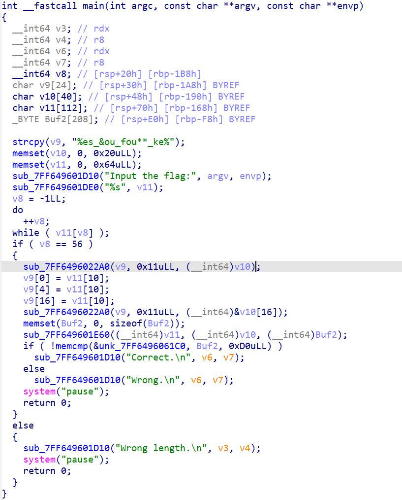

我们的输入被存放在v11数组里，而程序里会复制一个字符串%es_&ou_fou**_ke%到v9数组，而我们输入的flag的第十一个字符，会被引用到v9数组中的第一个，第五个，第十七个这些位置，来补全v9，v9就是key，我们可以一个一个尝试，但这里也能明显看出来是‘Y’

<!-- 这是一张图片，ocr 内容为： -->
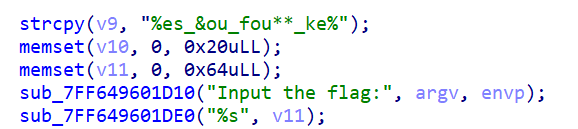

之后通过sub_7FF6496022A0函数（MD5）对v9进行处理

<!-- 这是一张图片，ocr 内容为： -->
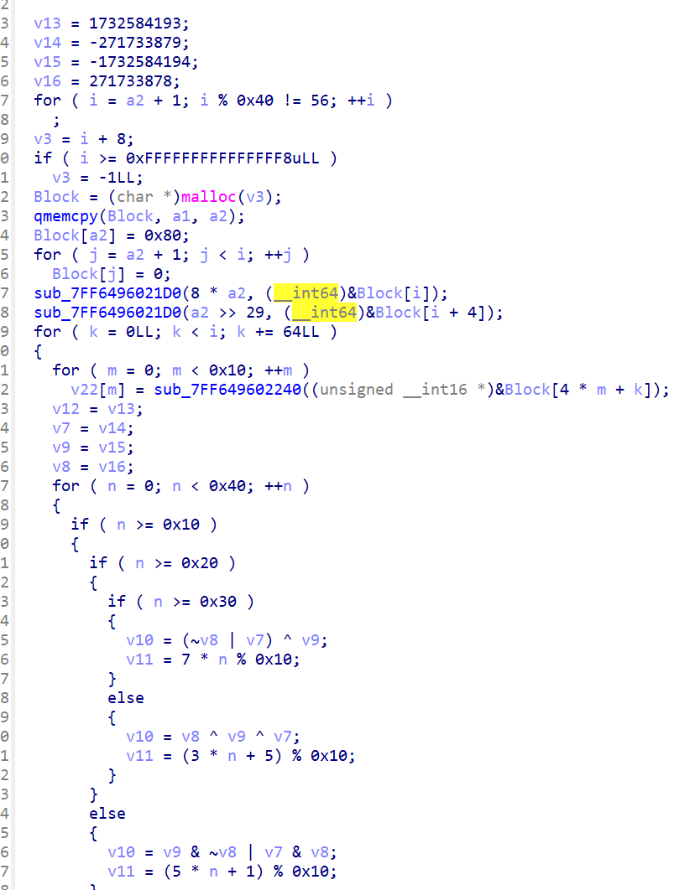

之后sub_7FF6496022A0函数把输入的flag按dword_7FF6496022A0把我们的输入划分为13段

<!-- 这是一张图片，ocr 内容为： -->
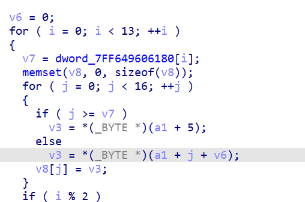

<!-- 这是一张图片，ocr 内容为： -->
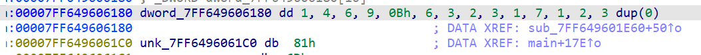

然后通过sub_7FF649601AA0函数对这13段进行AES-128加密

<!-- 这是一张图片，ocr 内容为： -->
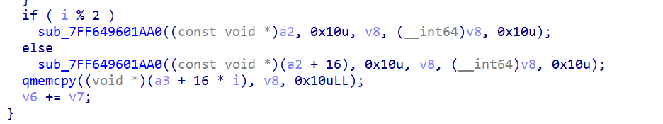

这里的13段长度都为16，不够的用flag【5】补充，sub_7FF649601100是11轮密钥扩展

<!-- 这是一张图片，ocr 内容为： -->
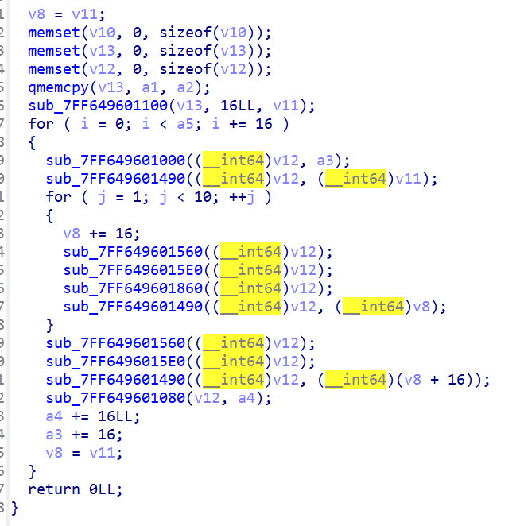

最后就行对比

<!-- 这是一张图片，ocr 内容为： -->
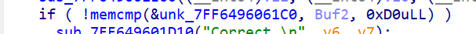

脚本

```java
import struct
import hashlib

EXE_PATH = 'BrokenData.exe'
RVA = 0x61C0
LEN = 0xD0
SEG = [1,4,6,9,11,6,3,2,3,1,7,1,2]
BASE = b"%es_&ou_fou**_ke%"


def read_pe_rva(path, rva, size):
    with open(path,'rb') as f:
        d=f.read()
    def u16(o): return struct.unpack_from('<H', d, o)[0]
    def u32(o): return struct.unpack_from('<I', d, o)[0]
    e=u32(0x3C)
    if d[e:e+4]!=b'PE\x00\x00': raise RuntimeError('not PE')
    ns=u16(e+6); so=u16(e+20); opt=e+24; sec=opt+so
    for i in range(ns):
        o=sec+i*40
        vs=u32(o+8); va=u32(o+12); sr=u32(o+16); pr=u32(o+20)
        span=max(vs,sr)
        if va<=rva<va+span:
            off=pr+(rva-va)
            return d[off:off+size]
    raise RuntimeError('rva not found')


def md5(x):
    return hashlib.md5(x).digest()


class AES:
    def __init__(self,key):
        try:
            from Crypto.Cipher import AES as C
            self.t='p'; self.o=C.new(key,C.MODE_ECB)
        except Exception:
            from cryptography.hazmat.primitives.ciphers import Cipher, algorithms, modes
            self.t='c'; self.c=Cipher(algorithms.AES(key), modes.ECB())
    def dec(self,b):
        if self.t=='p': return self.o.decrypt(b)
        d=self.c.decryptor(); return d.update(b)+d.finalize()
    def enc(self,b):
        if self.t=='p': return self.o.encrypt(b)
        e=self.c.encryptor(); return e.update(b)+e.finalize()


def keys(c):
    k1=md5(BASE)
    m=bytearray(BASE); m[0]=c; m[4]=c; m[16]=c
    k2=md5(bytes(m))
    return k1,k2


def dec_all(ct,k1,k2):
    a1=AES(k1); a2=AES(k2)
    bl=[ct[i:i+16] for i in range(0,len(ct),16)]
    return [(a1.dec(b) if i%2==1 else a2.dec(b)) for i,b in enumerate(bl)]


def recon(pl):
    f=bytearray(); pad=None
    for i,p in enumerate(pl):
        n=SEG[i]; s=p[:n]; t=p[n:]
        if t:
            if pad is None: pad=t[0]
            if any(x!=pad for x in t): return None,None
        f.extend(s)
    return bytes(f), pad


def reenc(pl,k1,k2):
    a1=AES(k1); a2=AES(k2)
    out=bytearray()
    for i,p in enumerate(pl):
        out.extend(a1.enc(p) if i%2==1 else a2.enc(p))
    return bytes(out)


def main():
    ct=read_pe_rva(EXE_PATH,RVA,LEN)
    for c in range(32,127):
        k1,k2=keys(c)
        pl=dec_all(ct,k1,k2)
        flag,p=recon(pl)
        if flag is None: continue
        if reenc(pl,k1,k2)==ct:
            print('flag[10]=', chr(c))
            print('flag[5]=', chr(p) if p is not None else '')
            print('len=', len(flag))
            try: print('flag=', flag.decode('utf-8'))
            except: print('flag_hex=', flag.hex())
            return
    print('no candidate')


if __name__=='__main__':
    main()
```

flag{Wow!_You_restored_the_data_and_this_is_your_reward}


# 2.Fisher
IDA打开，看main函数，main函数里面是一个自定义的Base64，最后与tAZ5tAZ5tAZ5vg7F2RZF2RZQ0gv5yCfAxSZKzq==对比

<!-- 这是一张图片，ocr 内容为： -->
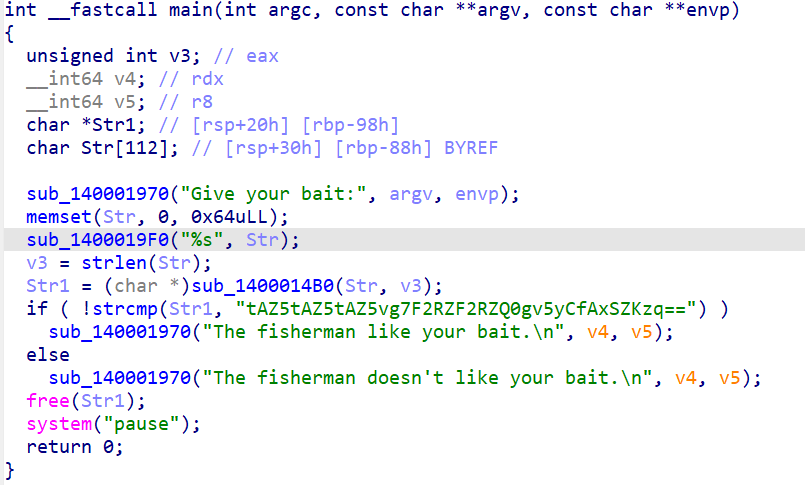

加密函数sub_1400014B0

<!-- 这是一张图片，ocr 内容为： -->
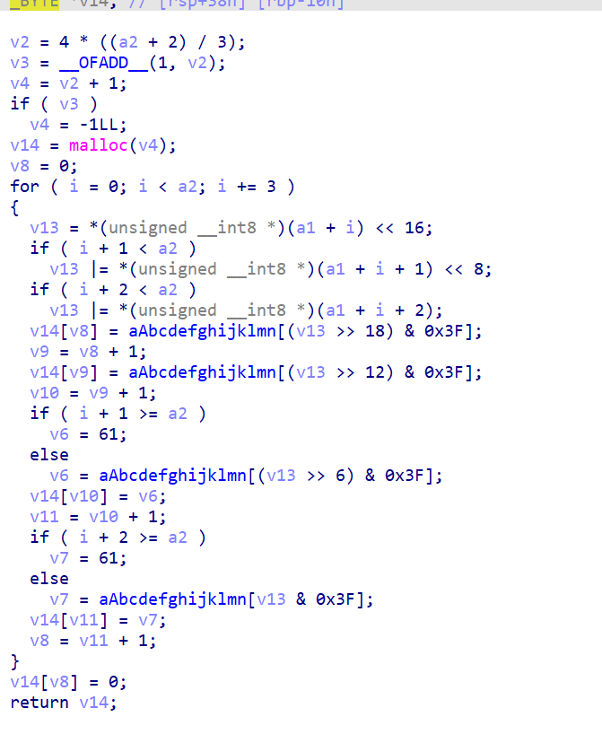

自定义的base64表

<!-- 这是一张图片，ocr 内容为： -->
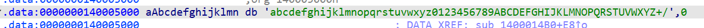

但我们使用自定义的base64解密得到的是NO_NO_NO_This_is_the_bad_one，显然不只是一个自定义的base64那么简单

具体的实现在__scrt_common_main_seh

<!-- 这是一张图片，ocr 内容为： -->


<!-- 这是一张图片，ocr 内容为： -->
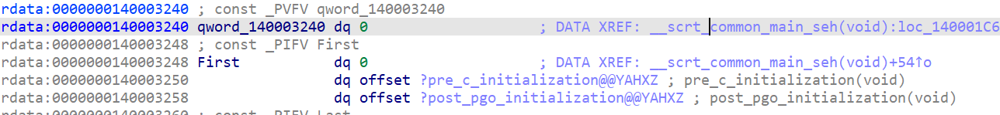

<!-- 这是一张图片，ocr 内容为： -->
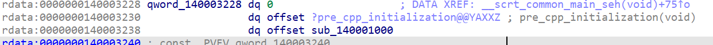

去看sub_140001000函数，他调用了sub_140001020函数

<!-- 这是一张图片，ocr 内容为： -->
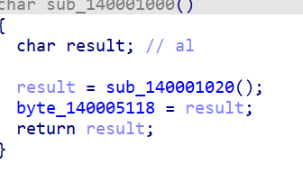

sub_140001020函数有调用了sub_140001150函数

<!-- 这是一张图片，ocr 内容为： -->
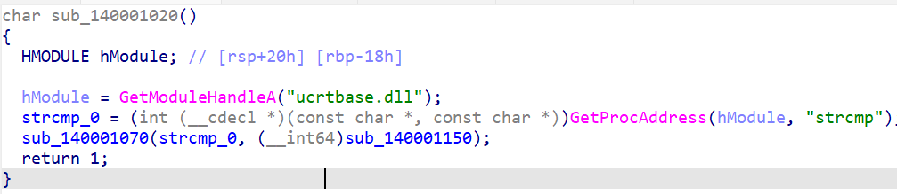

sub_140001150函数有调用了sub_1400016A0函数

构造 TEA 的 128 位密钥（按栈内存布局小端拼接，前 8 字节显式给定，后 8 字节来自已清零的区域）：

+ a2[0] = 0x44332211 （ v9 = 1144201745 对应 0x44332211 ）
+ a2[1] = 0x55667788 （由 v10=0x55, v11=0x66, v12=0x77, v13=0x88 ）
+ a2[2] = 0x00000000
+ a2[3] = 0x00000000

把 64 字节明文分成 8 个连续的 8 字节块（每块 2× uint32 ），对每块调用一次 sub_1400016A0 （32 轮 TEA 变体）进行加密。

```c
__int64 __fastcall sub_140001150(_BYTE *a1)
{
  char v2; // [rsp+20h] [rbp-C8h]
  int k; // [rsp+24h] [rbp-C4h]
  int j; // [rsp+28h] [rbp-C0h]
  _BYTE v5[64]; // [rsp+30h] [rbp-B8h]
  int v6; // [rsp+70h] [rbp-78h]
  _BYTE *i; // [rsp+78h] [rbp-70h]
  int v9; // [rsp+80h] [rbp-68h] BYREF
  char v10; // [rsp+84h] [rbp-64h]
  char v11; // [rsp+85h] [rbp-63h]
  char v12; // [rsp+86h] [rbp-62h]
  char v13; // [rsp+87h] [rbp-61h]
  _BYTE v14[64]; // [rsp+90h] [rbp-58h] BYREF

  sub_140001430();
  memset(v14, 0, sizeof(v14));
  v6 = 0;
  for ( i = a1; *i; ++i )
    ++v6;
  if ( v6 != 64 )
    return 0xFFFFFFFFLL;
  memcpy(v14, a1, sizeof(v14));
  v9 = 1144201745;
  v10 = 85;
  v11 = 102;
  v12 = 119;
  v13 = -120;
  for ( j = 0; j < 8; ++j )
    sub_1400016A0((unsigned int *)&v14[8 * j], &v9);
  v5[0] = 8;
  v5[1] = -18;
  v5[2] = 89;
  v5[3] = 77;
  v5[4] = 13;
  v5[5] = -32;
  v5[6] = -64;
  v5[7] = -119;
  v5[8] = -95;
  v5[9] = -104;
  v5[10] = -78;
  v5[11] = -69;
  v5[12] = -49;
  v5[13] = 112;
  v5[14] = 127;
  v5[15] = -27;
  v5[16] = -24;
  v5[17] = 47;
  v5[18] = -102;
  v5[19] = -118;
  v5[20] = 32;
  v5[21] = -53;
  v5[22] = 116;
  v5[23] = 18;
  v5[24] = -14;
  v5[25] = 48;
  v5[26] = 120;
  v5[27] = 31;
  v5[28] = 14;
  v5[29] = -21;
  v5[30] = 31;
  v5[31] = -120;
  v5[32] = -56;
  v5[33] = -68;
  v5[34] = 78;
  v5[35] = -8;
  v5[36] = 82;
  v5[37] = 19;
  v5[38] = 83;
  v5[39] = -117;
  v5[40] = -99;
  v5[41] = -65;
  v5[42] = 102;
  v5[43] = 11;
  v5[44] = 106;
  v5[45] = -84;
  v5[46] = 33;
  v5[47] = 79;
  v5[48] = -23;
  v5[49] = 31;
  v5[50] = 70;
  v5[51] = 70;
  v5[52] = -98;
  v5[53] = -53;
  v5[54] = -6;
  v5[55] = 99;
  v5[56] = -93;
  v5[57] = -123;
  v5[58] = 20;
  v5[59] = -55;
  v5[60] = 46;
  v5[61] = -9;
  v5[62] = 16;
  v5[63] = -59;
  v2 = 1;
  for ( k = 0; k < 64; ++k )
  {
    if ( v14[k] != v5[k] )
    {
      v2 = 0;
      break;
    }
  }
  if ( v2 )
    return 0;
  else
    return (unsigned int)-1;
}
```

sub_1400016A0函数（TEA加密）

```c
__int64 __fastcall sub_1400016A0(unsigned int *a1, _DWORD *a2)
{
  __int64 result; // rax
  unsigned int v3; // [rsp+0h] [rbp-28h]
  unsigned int v4; // [rsp+4h] [rbp-24h]
  int v5; // [rsp+8h] [rbp-20h]
  unsigned int i; // [rsp+Ch] [rbp-1Ch]

  v3 = *a1;
  v4 = a1[1];
  v5 = 0;
  for ( i = 0; i < 0x20; ++i )
  {
    v5 -= 1835914967;
    v3 += (a2[1] + (v4 >> 5)) ^ (v5 + v4) ^ (*a2 + 16 * v4);
    v4 += (a2[3] + (v3 >> 5)) ^ (v5 + v3) ^ (a2[2] + 16 * v3);
  }
  *a1 = v3;
  result = 4LL;
  a1[1] = v4;
  return result;
}
```

加密完成后再与sub_140001150函数里的64个密文做对比

完整流程就是我们的输入会先进行一次自定义的base64编码，然后再进行TEA变种加密

主要点在于strcmp(Str1, "tAZ5tAZ5tAZ5vg7F2RZF2RZQ0gv5yCfAxSZKzq==")实际上跳到了 sub_140001150(Str1）

解密脚本

```python
import base64

CUSTOM_ALPHABET = "abcdefghijklmnopqrstuvwxyz0123456789ABCDEFGHIJKLMNOPQRSTUVWXYZ+/"
STD_ALPHABET = "ABCDEFGHIJKLMNOPQRSTUVWXYZabcdefghijklmnopqrstuvwxyz0123456789+/"
MASK = 0xFFFFFFFF
DELTA = 1835914967

V5_BYTES = bytes([
    8, 238, 89, 77, 13, 224, 192, 137,
    161, 152, 178, 187, 207, 112, 127, 229,
    232, 47, 154, 138, 32, 203, 116, 18,
    242, 48, 120, 31, 14, 235, 31, 136,
    200, 188, 78, 248, 82, 19, 83, 139,
    157, 191, 102, 11, 106, 172, 33, 79,
    233, 31, 70, 70, 158, 203, 250, 99,
    163, 133, 20, 201, 46, 247, 16, 197,
])

K0 = 1144201745 & MASK
K1 = (85 & 0xFF) | ((102 & 0xFF) << 8) | ((119 & 0xFF) << 16) | ((136 & 0xFF) << 24)
KEY = (K0, K1, 0, 0)

def tea_decrypt_block(v0, v1):
    sum_ = ((- (DELTA * 32)) & MASK)
    for _ in range(32):
        v1 = (v1 - (((KEY[3] + (v0 >> 5)) & MASK) ^ ((sum_ + v0) & MASK) ^ ((KEY[2] + ((v0 << 4) & MASK)) & MASK))) & MASK
        v0 = (v0 - (((KEY[1] + (v1 >> 5)) & MASK) ^ ((sum_ + v1) & MASK) ^ ((KEY[0] + ((v1 << 4) & MASK)) & MASK))) & MASK
        sum_ = (sum_ + DELTA) & MASK
    return v0, v1

def decrypt_v5_to_base64():
    out = bytearray()
    for i in range(0, 64, 8):
        v0 = int.from_bytes(V5_BYTES[i:i+4], 'little')
        v1 = int.from_bytes(V5_BYTES[i+4:i+8], 'little')
        dv0, dv1 = tea_decrypt_block(v0, v1)
        out += dv0.to_bytes(4, 'little')
        out += dv1.to_bytes(4, 'little')
    return bytes(out)

def custom_to_std_b64(s):
    table = {c: STD_ALPHABET[i] for i, c in enumerate(CUSTOM_ALPHABET)}
    return ''.join('=' if c == '=' else table[c] for c in s)

def main():
    pre = decrypt_v5_to_base64().decode('ascii')
    std_b64 = custom_to_std_b64(pre)
    plain = base64.b64decode(std_b64)
    try:
        s = plain.decode('ascii')
        if s.startswith('flag{') and s.endswith('}'):
            print(s)
        else:
            print('flag{' + s + '}')
    except UnicodeDecodeError:
        print('flag{' + plain.hex() + '}')

if __name__ == '__main__':
    main()
```

flag{Fisherman_is_very_satisfied_with_your_bait}


# 3.Trap
IDA打卡，main函数如下：

<!-- 这是一张图片，ocr 内容为： -->
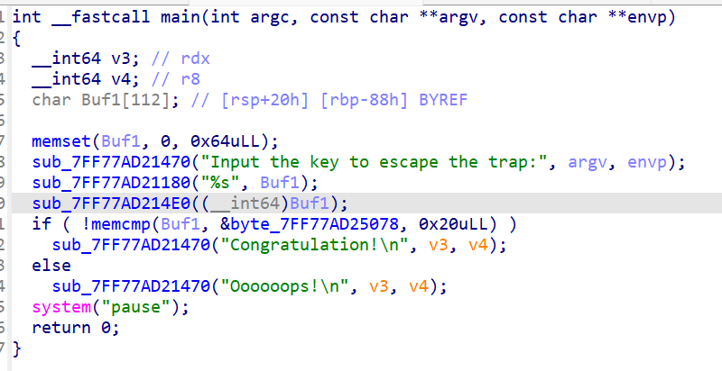

程序读取输入，通过sub_7FF77AD214E0来加密

原文 P[i] ，加扰后的结果 E[i] ，密钥 K[j] ：

E[0] = P[0] ^ K[0]

E[i] = P[i] ^ (i%2 ? (K[i % 11] + 1) & 0xFF : K[i % 11]) ^ E[i-1] （ i >= 1 ）

<!-- 这是一张图片，ocr 内容为： -->
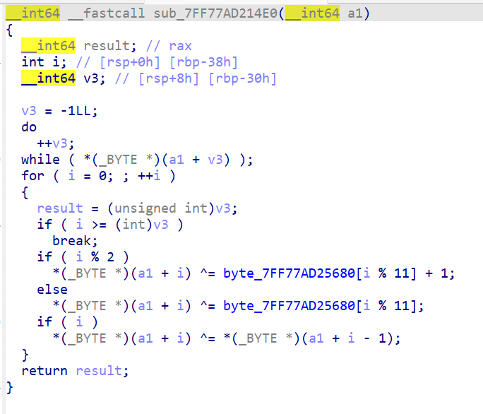

而byte_140005680为空，我们用x查看引用，发现sub_140001200调用了他

<!-- 这是一张图片，ocr 内容为： -->


<!-- 这是一张图片，ocr 内容为： -->
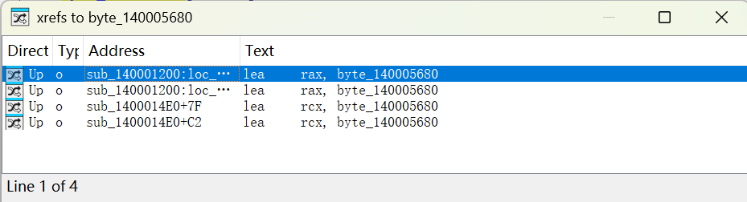

点进去，看到

<!-- 这是一张图片，ocr 内容为： -->
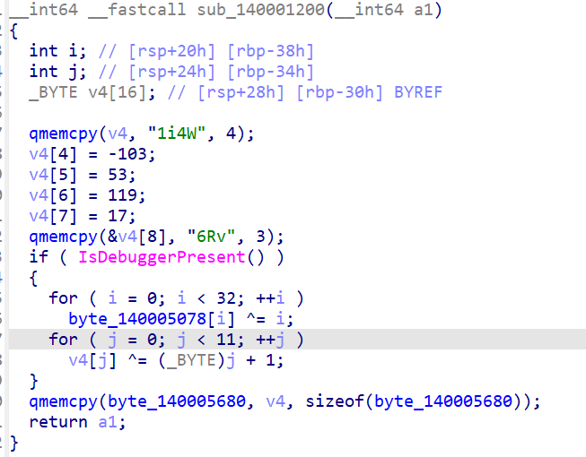

key为[0x31, 0x69, 0x34, 0x57, 0x99, 0x35, 0x77, 0x11, 0x36, 0x52, 0x76]

<!-- 这是一张图片，ocr 内容为： -->
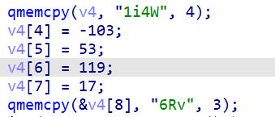

后边的这些就是干扰，反调试的，如果你要调试的话，就key和密文都要异或

<!-- 这是一张图片，ocr 内容为： -->
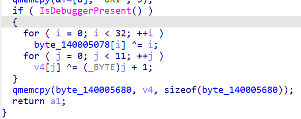

但实际上也调试不了

<!-- 这是一张图片，ocr 内容为： -->
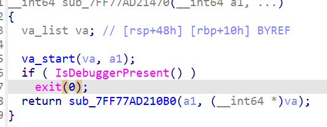

最后对比

<!-- 这是一张图片，ocr 内容为： -->
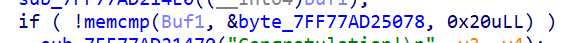

<!-- 这是一张图片，ocr 内容为： -->
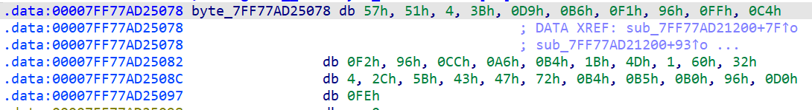

```python
E_hex = [
    0x57, 0x51, 0x04, 0x3b, 0xd9, 0xb6, 0xf1, 0x96,
    0xff, 0xc4, 0xf2, 0x96, 0xcc, 0xa6, 0xb4, 0x1b,
    0x4d, 0x01, 0x60, 0x32, 0x04, 0x2c, 0x5b, 0x43,
    0x47, 0x72, 0xb4, 0xb5, 0xb0, 0x96, 0xd0, 0xfe,
]
E = bytes(E_hex)

KEY = [
    0x31, 0x69, 0x34, 0x57, 0x99, 0x35, 0x77, 0x11, 0x36, 0x52, 0x76,
]


def decrypt(E, key):
    P = bytearray(len(E))
    n = len(key)
    for i in range(len(E)):
        k = key[i % n]
        if i & 1:
            k = (k + 1) & 0xFF
        P[i] = E[i] ^ k ^ (E[i - 1] if i else 0)
    return bytes(P)


if __name__ == "__main__":
    print(decrypt(E, KEY).decode())
```

flag{Y0u_h@V3_E5c4ped_Fr0m_7r4p}


# 4.wtf
打开靶机

<!-- 这是一张图片，ocr 内容为： -->


F12打开控制台，JS逆向，在元素里看到，我们输入，最后的打印结果有src.js来确定

<!-- 这是一张图片，ocr 内容为： -->
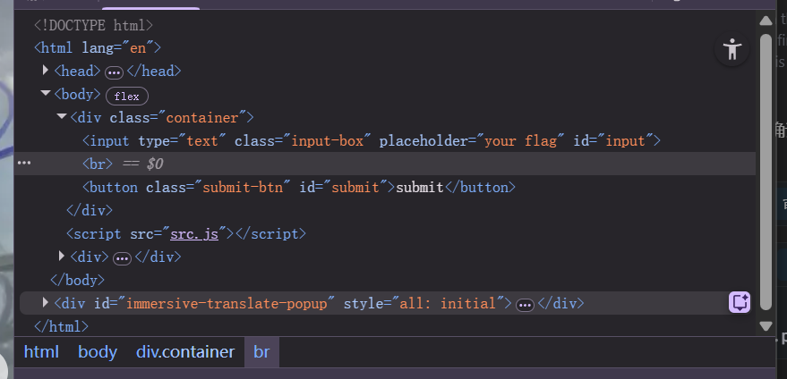

在资源里面找到src.js，是一个TEA算法

```javascript
var _a;
var ___Key = 'Komeji Satori';
var ans = [
  68, 241, 170, 187, 35, 199, 71, 125, 74, 176, 71, 216, 56, 85, 160, 159, 67, 234, 185, 29, 104, 120, 245, 18
];
(_a = document.querySelector('#submit')) === null || _a === void 0 ? void 0 : _a.addEventListener('click', function () {
  var flag = document.querySelector('#input');
  var input = flag.value;
  var bytes = new TextEncoder().encode(input);
  bytes[0] ^= 0x12;
  bytes[1] ^= 0x34;
  bytes[2] ^= 0x56;
  bytes[3] ^= 0x78;
  console.log(___Key);
  bytes = encode(bytes, ___Key);
  for (var i = 0; i < bytes.length; i++) {
    bytes[i] ^= ___Key[i % ___Key.length].charCodeAt(0);
  }
  for (var i = 0; i < ans.length; i++) {
    if (bytes[i] !== ans[i]) {
      document.querySelector('#input').value = 'Wrong flag!';
      return;
    }
  }
  document.querySelector('#input').value = 'Correct flag! you find Koishi!';
  document.body.style.backgroundImage = 'url(\'koishi.webp\')';
  document.body.style.backgroundPosition = 'center';
});
function encode(input, key) {
  var _a;
  var keyBytes = new Uint8Array(16);
  var keyData = new TextEncoder().encode(key);
  for (var i = 0; i < 16; i++) {
    keyBytes[i] = keyData[i % keyData.length];
  }
  var k = new Uint32Array(4);
  for (var i = 0; i < 4; i++) {
    k[i] = (keyBytes[i * 4] << 24) | (keyBytes[i * 4 + 1] << 16) |
      (keyBytes[i * 4 + 2] << 8) | keyBytes[i * 4 + 3];
  }
  var DELTA = 0x9e3779b9;
  function teaEncrypt(v0, v1) {
    var sum = 0;
    for (var i = 0; i < 32; i++) {
      sum = (sum + DELTA) >>> 0;
      v0 = (v0 + (((v1 << 4) + k[0]) ^ (v1 + sum) ^ ((v1 >>> 5) + k[1]))) >>> 0;
      v1 = (v1 + (((v0 << 4) + k[2]) ^ (v0 + sum) ^ ((v0 >>> 5) + k[3]))) >>> 0;
    }
    return [v0, v1];
  }
  var paddedLength = Math.ceil(input.length / 8) * 8;
  var padded = new Uint8Array(paddedLength);
  padded.set(input);
  for (var i = 0; i < paddedLength; i += 8) {
    var v0 = (padded[i] << 24) | (padded[i + 1] << 16) | (padded[i + 2] << 8) |
      padded[i + 3];
    var v1 = (padded[i + 4] << 24) | (padded[i + 5] << 16) |
      (padded[i + 6] << 8) | padded[i + 7];
    _a = teaEncrypt(v0, v1), v0 = _a[0], v1 = _a[1];
    padded[i] = (v0 >>> 24) & 0xFF;
    padded[i + 1] = (v0 >>> 16) & 0xFF;
    padded[i + 2] = (v0 >>> 8) & 0xFF;
    padded[i + 3] = v0 & 0xFF;
    padded[i + 4] = (v1 >>> 24) & 0xFF;
    padded[i + 5] = (v1 >>> 16) & 0xFF;
    padded[i + 6] = (v1 >>> 8) & 0xFF;
    padded[i + 7] = v1 & 0xFF;
  }
  if (input.length < paddedLength) {
    var newInput = new Uint8Array(paddedLength);
    newInput.set(input);
    input = newInput;
  }
  for (var i = 0; i < paddedLength; i++) {
    input[i] = padded[i];
  }
  return input;
}

```

还有个div.js，里面都是

```javascript
[][(![]+[])[+!+[]]+(!![]+[])[+[]]][([][(![]+[])[+!+[]]+(!![]+[])[+[]]]+[])[!+[]+!+[]+!+[]]+(!![]+[][(![]+[])[+!+[]]+(!![]+[])[+[]]])[+!+[]+[+[]]]+([][[]]+[])[+!+[]]+(![]+[])[!+[]+!+[]+!+[]]+(!![]+[])[+[]]+(!![]+[])[+!+[]]+([][[]]+[])[+[]]+([][(![]+[])[+!+[]]+(!![]+[])[+[]]]+[])[!+[]+!+[]+!+[]]+(!![]+[])[+[]]+(!![]+[][(![]+[])[+!+[]]+(!![]+[])[+[]]])[+!+[]+[+[]]]+(!![]+[])[+!+[]]]((!![]+[])[+!+[]]+(!![]+[])[!+[]+!+[]+!+[]]+(!![]+[])[+[]]+([][[]]+[])[+[]]+(!![]+[])[+!+[]]+([][[]]+[])[+!+[]]+(+[![]]+[][(![]+[])[+!+[]]+(!![]+[])[+[]]])[+!+[]+[+!+[]]]+(!![]+[])[!+[]+!+[]+!+[]]+(+(!+[]+!+[]+!+[]+[+!+[]]))[(!![]+[])[+[]]+(!![]+[][(![]+[])[+!+[]]+(!![]+[])[+[]]])[+!+[]+[+[]]]+([]+[])[([][(![]+[])[+!+[]]+(!![]+[])[+[]]]+[])[!+[]+!+[]+!+[]]+(!![]+[][(![]+[])[+!+[]]+(!![]+[])[+[]]])[+!+[]+[+[]]]+([][[]]+[])[+!+[]]+(![]+[])[!+[]+!+[]+!+[]]+(!![]+[])[+[]]+(!![]+[])[+!+[]]+([][[]]+[])[+[]]+([][(![]+[])[+!+[]]+(!![]+[])[+[]]]+[])[!+[]+!+[]+!+[]]+(!![]+[])[+[]]+(!![]+[][(![]+[])[+!+[]]+(!![]+[])[+[]]])[+!+[]+[+[]]]+(!![]+[])[+!+[]]][([][[]]+[])[+!+[]]+(![]+[])[+!+[]]+((+[])[([][(![]+[])[+!+[]]+(!![]+[])[+[]]]+[])[!+[]+!+[]+!+[]]+(!![]+[][(![]+[])[+!+[]]+(!![]+[])[+[]]])[+!+[]+[+[]]]+([][[]]+[])[+!+[]]+(![]+[])[!+[]+!+[]+!+[]]+(!![]+[])[+[]]+(!![]+[])[+!+[]]+([][[]]+[])[+[]]+([][(![]+[])[+!+[]]+(!![]+[])[+[]]]+[])[!+[]+!+[]+!+[]]+(!![]+[])[+[]]+(!![]+[][(![]+[])[+!+[]]+(!![]+[])[+[]]])[+!+[]+[+[]]]+(!![]+[])[+!+[]]]+[])[+!+[]+[+!+[]]]+(!![]+[])[!+[]+!+[]+!+[]]]](!+[]+!+[]+!+[]+[!+[]+!+[]])+(![]+[])[+!+[]]+(![]+[])[!+[]+!+[]])()([][(![]+[])[+!+[]]+(!![]+[])[+[]]][([][(![]+[])[+!+[]]+(!![]+[])[+[]]]+[])[!+[]+!+[]+!+[]]+(!![]+[][(![]+[])[+!+[]]+(!![]+[])[+[]]])[+!+[]+[+[]]]+([][[]]+[])[+!+[]]+(![]+[])[!+[]+!+[]+!+[]]+(!![]+[])[+[]]+(!![]+[])[+!+[]]+([][[]]+[])[+[]]+([][(![]+[])[+!+[]]+(!![]+[])[+[]]]+[])[!+[]+!+[]+!+[]]+(!![]+[])[+[]]+(!![]+[][(![]+[])[+!+[]]+(!![]+[])[+[]]])[+!+[]+[+[]]]+(!![]+[])[+!+[]]]((!![]+[])[+!+[]]+(!![]+[])[!+[]+!+[]+!+[]]+(!![]+[])[+[]]+([][[]]+[])[+[]]+(!![]+[])[+!+[]]+([][[]]+[])[+!+[]]+([]+[])[(![]+[])[+[]]+(!![]+[][(![]+[])[+!+[]]+(!![]+[])[+[]]])[+!+[]+[+[]]]+([][[]]+[])[+!+[]]+(!![]+[])[+[]]+([][(![]+[])[+!+[]]+(!![]+[])[+[]]]+[])[!+[]+!+[]+!+[]]+(!![]+[][(![]+[])[+!+[]]+(!![]+[])[+[]]])[+!+[]+[+[]]]+(![]+[])[!+[]+!+[]]+(!![]+[][(![]+[])[+!+[]]+(!![]+[])[+[]]])[+!+[]+[+[]]]+(!![]+[])[+!+[]]]()[+!+[]+[!+[]+!+[]]]+((!![]+[])[+[]]+[!+[]+!+[]+!+[]+!+[]+!+[]+!+[]+!+[]]+[!+[]+!+[]+!+[]]+(!![]+[])[+[]]+[!+[]+!+[]+!+[]+!+[]]+[+[]]+(!![]+[])[+[]]+[!+[]+!+[]+!+[]+!+[]+!+[]+!+[]+!+[]]+[!+[]+!+[]+!+[]]+(!![]+[])[+[]]+[!+[]+!+[]+!+[]+!+[]]+[+[]]+(!![]+[])[+[]]+[!+[]+!+[]+!+[]+!+[]+!+[]+!+[]+!+[]]+[!+[]+!+[]+!+[]]+(!![]+[])[+[]]+[!+[]+!+[]+!+[]+!+[]]+[+[]]+(!![]+[])[+[]]+[!+[]+!+[]+!+[]+!+[]+!+[]+!+[]+!+[]]+[!+[]+!+[]+!+[]]+(!![]+[])[+[]]+[!+[]+!+[]+!+[]+!+[]]+[+[]]+(!![]+[])[+[]]+[!+[]+!+[]+!+[]+!+[]+!+[]+!+[]+!+[]]+[!+[]+!+[]+!+[]]+(!![]+[])[+[]]+[!+[]+!+[]+!+[]+!+[]]+[+[]]+(!![]+[])[+[]]+[!+[]+!+[]+!+[]+!+[]+!+[]+!+[]+!+[]]+[!+[]+!+[]+!+[]]+(!![]+[])[+[]]+[!+[]+!+[]+!+[]+!+[]]+[+[]]+(!![]+[])[+[]]+[!+[]+!+[]+!+[]+!+[]+!+[]+!+[]+!+[]]+[!+[]+!+[]+!+[]]+(!![]+[])[+[]]+[!+[]+!+[]+!+[]+!+[]]+[+[]]+(!![]+[])[+[]]+[!+[]+!+[]+!+[]+!+[]+!+[]+!+[]+!+[]]+[!+[]+!+[]+!+[]]+(!![]+[])[+[]]+[!+[]+!+[]+!+[]+!+[]]+[+[]]+(!![]+[])[+[]]+[!+[]+!+[]+!+[]+!+[]+!+[]+!+[]+!+[]]+[!+[]+!+[]+!+[]]+(!![]+[])[+[]]+[!+[]+!+[]+!+[]+!+[]]+[+[]]+(!![]+[])[+[]]+[!+[]+!+[]+!+[]+!+[]+!+[]+!+[]+!+[]]+[!+[]+!+[]+!+[]]+(!![]+[])[+[]]+[!+[]+!+[]+!+[]+!+[]]+[+[]]+(!![]+[])[+[]]+[!+[]+!+[]+!+[]+!+[]+!+[]+!+[]+!+[]]+[!+[]+!+[]+!+[]]+(!![]+[])[+[]]+[!+[]+!+[]+!+[]+!+[]]+[+[]]+(!![]+[])[+[]]+[!+[]+!+[]+!+[]+!+[]+!+[]+!+[]+!+[]]+[!+[]+!+[]+!+[]]+(!![]+[])[+[]]+[!+[]+!+[]+!+[]+!+[]]+[+[]]+(!![]+[])[+[]]+[!+[]+!+[]+!+[]+!+[]+!+[]+!+[]+!+[]]+[!+[]+!+[]+!+[]]+(!![]+[])[+[]]+[!+[]+!+[]+!+[]+!+[]]+[+[]]+(!![]+[])[+[]]+[!+[]+!+[]+!+[]+!+[]+!+[]+!+[]+!+[]]+[!+[]+!+[]+!+[]]+(!![]+[])[+[]]+[!+[]+!+[]+!+[]+!+[]]+[+[]]+(!![]+[])[+[]]+[!+[]+!+[]+!+[]+!+[]+!+[]+!+[]+!+[]]+[!+[]+!+[]+!+[]]+(!![]+[])[+[]]+[!+[]+!+[]+!+[]+!+[]]+[+[]]+(!![]+[])[+[]]+[!+[]+!+[]+!+[]+!+[]+!+[]+!+[]+!+[]]+[!+[]+!+[]+!+[]]+(!![]+[])[+[]]+[!+[]+!+[]+!+[]+!+[]]+[+[]]+(!![]+[])[+[]]+[!+[]+!+[]+!+[]+!+[]+!+[]+!+[]+!+[]]+[!+[]+!+[]+!+[]]+(!![]+[])[+[]]+[!+[]+!+[]+!+[]+!+[]]+[+[]]+(!![]+[])[+[]]+[!+[]+!+[]+!+[]+!+[]+!+[]+!+[]+!+[]]+[!+[]+!+[]+!+[]]+(!![]+[])[+[]]+[!+[]+!+[]+!+[]+!+[]]+[+[]]+(!![]+[])[+[]]+[!+[]+!+[]+!+[]+!+[]+!+[]+!+[]+!+[]]+[!+[]+!+[]+!+[]]+(!![]+[])[+[]]+[!+[]+!+[]+!+[]+!+[]]+[+[]]+(!![]+[])[+[]]+[!+[]+!+[]+!+[]+!+[]+!+[]+!+[]+!+[]]+[!+[]+!+[]+!+[]]+(!![]+[])[+[]]+[!+[]+!+[]+!+[]+!+[]]+[+[]]+(!![]+[])[+[]]+[!+[]+!+[]+!+[]+!+[]+!+[]+!+[]+!+[]]+[!+[]+!+[]+!+[]]+(!![]+[])[+[]]+[!+[]+!+[]+!+[]+!+[]]+[+[]]+(!![]+[])[+[]]+[!+[]+!+[]+!+[]+!+[]+!+[]+!+[]+!+[]]+[!+[]+!+[]+!+[]]+(!![]+[])[+[]]+[!+[]+!+[]+!+[]+!+[]]+[+[]]+(!![]+[])[+[]]+[!+[]+!+[]+!+[]+!+[]+!+[]+!+[]+!+[]]+[!+[]+!+[]+!+[]]+(!![]+[])[+[]]+[!+[]+!+[]+!+[]+!+[]]+[+[]]+(!![]+[])[+[]]+[!+[]+!+[]+!+[]+!+[]+!+[]+!+[]+!+[]]+[!+[]+!+[]+!+[]]+(!![]+[])[+[]]+[!+[]+!+[]+!+[]+!+[]]+[+[]]+(!![]+[])[+[]]+[!+[]+!+[]+!+[]+!+[]+!+[]+!+[]+!+[]]+[!+[]+!+[]+!+[]]+(!![]+[])[+[]]+[!+[]+!+[]+!+[]+!+[]]+[+[]]+(!![]+[])[+[]]+[!+[]+!+[]+!+[]+!+[]+!+[]+!+[]+!+[]]+[!+[]+!+[]+!+[]]+(!![]+[])[+[]]+[!+[]+!+[]+!+[]+!+[]]+[+[]]+(!![]+[])[+[]]+[!+[]+!+[]+!+[]+!+[]+!+[]+!+[]+!+[]]+[!+[]+!+[]+!+[]]+(!![]+[])[+[]]+[!+[]+!+[]+!+[]+!+[]]+[+[]]+(!![]+[])[+[]]+[!+[]+!+[]+!+[]+!+[]+!+[]+!+[]+!+[]]+[!+[]+!+[]+!+[]]+(!![]+[])[+[]]+[!+[]+!+[]+!+[]+!+[]]+[+[]]+(!![]+[])[+[]]+[!+[]+!+[]+!+[]+!+[]+!+[]+!+[]+!+[]]+[!+[]+!+[]+!+[]]+(!![]+[])[+[]]+[!+[]+!+[]+!+[]+!+[]]+[+[]]+(!![]+[])[+[]]+[!+[]+!+[]+!+[]+!+[]+!+[]+!+[]+!+[]]+[!+[]+!+[]+!+[]]+(!![]+[])[+[]]+[!+[]+!+[]+!+[]+!+[]]+[+[]]+(!![]+[])[+[]]+[!+[]+!+[]+!+[]+!+[]+!+[]+!+[]+!+[]]+[!+[]+!+[]+!+[]]+(!![]+[])[+[]]+[!+[]+!+[]+!+[]+!+[]]+[+[]]+(!![]+[])[+[]]+[!+[]+!+[]+!+[]+!+[]+!+[]+!+[]+!+[]]+[!+[]+!+[]+!+[]]+(!![]+[])[+[]]+[!+[]+!+[]+!+[]+!+[]]+[+[]]+(!![]+[])[+[]]+[!+[]+!+[]+!+[]+!+[]+!+[]+!+[]+!+[]]+[!+[]+!+[]+!+[]]+(!![]+[])[+[]]+[!+[]+!+[]+!+[]+!+[]]+[+[]]+(!![]+[])[+[]]+[!+[]+!+[]+!+[]+!+[]+!+[]+!+[]+!+[]]+[!+[]+!+[]+!+[]]+(!![]+[])[+[]]+[!+[]+!+[]+!+[]+!+[]]+[+[]]+(!![]+[])[+[]]+[!+[]+!+[]+!+[]+!+[]+!+[]+!+[]+!+[]]+[!+[]+!+[]+!+[]]+(!![]+[])[+[]]+[!+[]+!+[]+!+[]+!+[]]+[+[]]+(!![]+[])[+[]]+[!+[]+!+[]+!+[]+!+[]+!+[]+!+[]+!+[]]+[!+[]+!+[]+!+[]]+(!![]+[])[+[]]+[!+[]+!+[]+!+[]+!+[]]+[+[]]+(!![]+[])[+[]]+[!+[]+!+[]+!+[]+!+[]+!+[]+!+[]+!+[]]+[!+[]+!+[]+!+[]]+(!![]+[])[+[]]+[!+[]+!+[]+!+[]+!+[]]+[+[]]+(!![]+[])[+[]]+[!+[]+!+[]+!+[]+!+[]+!+[]+!+[]+!+[]]+[!+[]+!+[]+!+[]]+(!![]+[])[+[]]+[!+[]+!+[]+!+[]+!+[]]+[+[]]+(!![]+[])[+[]]+[!+[]+!+[]+!+[]+!+[]+!+[]+!+[]+!+[]]+[!+[]+!+[]+!+[]]+(!![]+[])[+[]]+[!+[]+!+[]+!+[]+!+[]]+[+[]]+(!![]+[])[+[]]+[!+[]+!+[]+!+[]+!+[]+!+[]+!+[]+!+[]]+[!+[]+!+[]+!+[]]+(!![]+[])[+[]]+[!+[]+!+[]+!+[]+!+[]]+[+[]]+(!![]+[])[+[]]+[!+[]+!+[]+!+[]+!+[]+!+[]+!+[]+!+[]]+[!+[]+!+[]+!+[]]+(!![]+[])[+[]]+[!+[]+!+[]+!+[]+!+[]]+[+[]]+(!![]+[])[+[]]+[!+[]+!+[]+!+[]+!+[]+!+[]+!+[]+!+[]]+[!+[]+!+[]+!+[]]+(!![]+[])[+[]]+[!+[]+!+[]+!+[]+!+[]]+[+[]]+(!![]+[])[+[]]+[!+[]+!+[]+!+[]+!+[]+!+[]+!+[]+!+[]]+[!+[]+!+[]+!+[]]+(!![]+[])[+[]]+[!+[]+!+[]+!+[]+!+[]]+[+[]]+(!![]+[])[+[]]+[!+[]+!+[]+!+[]+!+[]+!+[]+!+[]+!+[]]+[!+[]+!+[]+!+[]]+(!![]+[])[+[]]+[!+[]+!+[]+!+[]+!+[]]+[+[]]+(!![]+[])[+[]]+[!+[]+!+[]+!+[]+!+[]+!+[]+!+[]+!+[]]+[!+[]+!+[]+!+[]]+(!![]+[])[+[]]+[!+[]+!+[]+!+[]+!+[]]+[+[]]+(!![]+[])[+[]]+[!+[]+!+[]+!+[]+!+[]+!+[]+!+[]+!+[]]+[!+[]+!+[]+!+[]]+(!![]+[])[+[]]+[!+[]+!+[]+!+[]+!+[]]+[+[]]+(!![]+[])[+[]]+[!+[]+!+[]+!+[]+!+[]+!+[]+!+[]+!+[]]+[!+[]+!+[]+!+[]]+(!![]+[])[+[]]+[!+[]+!+[]+!+[]+!+[]]+[+[]]+(!![]+[])[+[]]+[!+[]+!+[]+!+[]+!+[]+!+[]+!+[]+!+[]]+[!+[]+!+[]+!+[]]+(!![]+[])[+[]]+[!+[]+!+[]+!+[]+!+[]]+[+[]]+(!![]+[])[+[]]+[!+[]+!+[]+!+[]+!+[]+!+[]+!+[]+!+[]]+[!+[]+!+[]+!+[]]+(!![]+[])[+[]]+[!+[]+!+[]+!+[]+!+[]]+[+[]]+(!![]+[])[+[]]+[!+[]+!+[]+!+[]+!+[]+!+[]+!+[]+!+[]]+[!+[]+!+[]+!+[]]+(!![]+[])[+[]]+[!+[]+!+[]+!+[]+!+[]]+[+[]]+(!![]+[])[+[]]+[!+[]+!+[]+!+[]+!+[]+!+[]+!+[]+!+[]]+[!+[]+!+[]+!+[]]+(!![]+[])[+[]]+[!+[]+!+[]+!+[]+!+[]]+[+[]]+(!![]+[])[+[]]+[!+[]+!+[]+!+[]+!+[]+!+[]+!+[]+!+[]]+[!+[]+!+[]+!+[]]+(!![]+[])[+[]]+[!+[]+!+[]+!+[]+!+[]]+[+[]]+(!![]+[])[+[]]+[!+[]+!+[]+!+[]+!+[]+!+[]+!+[]+!+[]]+[!+[]+!+[]+!+[]]+(!![]+[])[+[]]+[!+[]+!+[]+!+[]+!+[]]+[+[]]+(!![]+[])[+[]]+[!+[]+!+[]+!+[]+!+[]+!+[]+!+[]+!+[]]+[!+[]+!+[]+!+[]]+(!![]+[])[+[]]+[!+[]+!+[]+!+[]+!+[]]+[+[]]+(!![]+[])[+[]]+[!+[]+!+[]+!+[]+!+[]+!+[]+!+[]+!+[]]+[!+[]+!+[]+!+[]]+(!![]+[])[+[]]+[!+[]+!+[]+!+[]+!+[]]+[+[]]+(!![]+[])[+[]]+[!+[]+!+[]+!+[]+!+[]+!+[]+!+[]+!+[]]+[!+[]+!+[]+!+[]]+(!![]+[])[+[]]+[!+[]+!+[]+!+[]+!+[]]+[+[]]+(!![]+[])[+[]]+[!+[]+!+[]+!+[]+!+[]+!+[]+!+[]+!+[]]+[!+[]+!+[]+!+[]]+(!![]+[])[+[]]+[!+[]+!+[]+!+[]+!+[]]+[+[]]+(!![]+[])[+[]]+[!+[]+!+[]+!+[]+!+[]+!+[]+!+[]+!+[]]+[!+[]+!+[]+!+[]]+(!![]+[])[+[]]+[!+[]+!+[]+!+[]+!+[]]+[+[]]+(!![]+[])[+[]]+[!+[]+!+[]+!+[]+!+[]+!+[]+!+[]+!+[]]+[!+[]+!+[]+!+[]]+(!![]+[])[+[]]+[!+[]+!+[]+!+[]+!+[]]+[+[]]+(!![]+[])[+[]]+[!+[]+!+[]+!+[]+!+[]+!+[]+!+[]+!+[]]+[!+[]+!+[]+!+[]]+(!![]+[])[+[]]+[!+[]+!+[]+!+[]+!+[]]+[+[]]+(!![]+[])[+[]]+[!+[]+!+[]+!+[]+!+[]+!+[]+!+[]+!+[]]+[!+[]+!+[]+!+[]]+(!![]+[])[+[]]+[!+[]+!+[]+!+[]+!+[]]+[+[]]+(!![]+[])[+[]]+[!+[]+!+[]+!+[]+!+[]+!+[]+!+[]+!+[]]+[!+[]+!+[]+!+[]]+(!![]+[])[+[]]+[!+[]+!+[]+!+[]+!+[]]+[+[]]+(!![]+[])[+[]]+[!+[]+!+[]+!+[]+!+[]+!+[]+!+[]+!+[]]+[!+[]+!+[]+!+[]]+(!![]+[])[+[]]+[!+[]+!+[]+!+[]+!+[]]+[+[]]+(!![]+[])[+[]]+[!+[]+!+[]+!+[]+!+[]+!+[]+!+[]+!+[]]+[!+[]+!+[]+!+[]]+(!![]+[])[+[]]+[!+[]+!+[]+!+[]+!+[]]+[+[]]+(!![]+[])[+[]]+[!+[]+!+[]+!+[]+!+[]+!+[]+!+[]+!+[]]+[!+[]+!+[]+!+[]]+(!![]+[])[+[]]+[!+[]+!+[]+!+[]+!+[]]+[+[]]+(!![]+[])[+[]]+[!+[]+!+[]+!+[]+!+[]+!+[]+!+[]+!+[]]+[!+[]+!+[]+!+[]]+(!![]+[])[+[]]+[!+[]+!+[]+!+[]+!+[]]+[+[]]+(!![]+[])[+[]]+[!+[]+!+[]+!+[]+!+[]+!+[]+!+[]+!+[]]+[!+[]+!+[]+!+[]]+(!![]+[])[+[]]+[!+[]+!+[]+!+[]+!+[]]+[+[]]+(!![]+[])[+[]]+[!+[]+!+[]+!+[]+!+[]+!+[]+!+[]+!+[]]+[!+[]+!+[]+!+[]]+(!![]+[])[+[]]+[!+[]+!+[]+!+[]+!+[]]+[+[]]+(!![]+[])[+[]]+[!+[]+!+[]+!+[]+!+[]+!+[]+!+[]+!+[]]+[!+[]+!+[]+!+[]]+(!![]+[])[+[]]+[!+[]+!+[]+!+[]+!+[]]+[+[]]+(!![]+[])[+[]]+[!+[]+!+[]+!+[]+!+[]+!+[]+!+[]+!+[]]+[!+[]+!+[]+!+[]]+(!![]+[])[+[]]+[!+[]+!+[]+!+[]+!+[]]+[+[]]+(!![]+[])[+[]]+[!+[]+!+[]+!+[]+!+[]+!+[]+!+[]+!+[]]+[!+[]+!+[]+!+[]]+(!![]+[])[+[]]+[!+[]+!+[]+!+[]+!+[]]+[+[]]+(!![]+[])[+[]]+[!+[]+!+[]+!+[]+!+[]+!+[]+!+[]+!+[]]+[!+[]+!+[]+!+[]]+(!![]+[])[+[]]+[!+[]+!+[]+!+[]+!+[]]+[+[]]+(!![]+[])[+[]]+[!+[]+!+[]+!+[]+!+[]+!+[]+!+[]+!+[]]+[!+[]+!+[]+!+[]]+(!![]+[])[+[]]+[!+[]+!+[]+!+[]+!+[]]+[+[]]+(!![]+[])[+[]]+[!+[]+!+[]+!+[]+!+[]+!+[]+!+[]+!+[]]+[!+[]+!+[]+!+[]]+(!![]+[])[+[]]+[!+[]+!+[]+!+[]+!+[]]+[+[]]+(!![]+[])[+[]]+[!+[]+!+[]+!+[]+!+[]+!+[]+!+[]+!+[]]+[!+[]+!+[]+!+[]]+(!![]+[])[+[]]+[!+[]+!+[]+!+[]+!+[]]+[+[]]+(!![]+[])[+[]]+[!+[]+!+[]+!+[]+!+[]+!+[]+!+[]+!+[]]+[!+[]+!+[]+!+[]]+(!![]+[])[+[]]+[!+[]+!+[]+!+[]+!+[]]+[+[]]+(!![]+[])[+[]]+[!+[]+!+[]+!+[]+!+[]+!+[]+!+[]+!+[]]+[!+[]+!+[]+!+[]]+(!![]+[])[+[]]+[!+[]+!+[]+!+[]+!+[]]+[+[]]+(!![]+[])[+[]]+[!+[]+!+[]+!+[]+!+[]+!+[]+!+[]+!+[]]+[!+[]+!+[]+!+[]]+(!![]+[])[+[]]+[!+[]+!+[]+!+[]+!+[]]+[+[]]+(!![]+[])[+[]]+[!+[]+!+[]+!+[]+!+[]+!+[]+!+[]+!+[]]+[!+[]+!+[]+!+[]]+(!![]+[])[+[]]+[!+[]+!+[]+!+[]+!+[]]+[+[]]+(!![]+[])[+[]]+[!+[]+!+[]+!+[]+!+[]+!+[]+!+[]+!+[]]+[!+[]+!+[]+!+[]]+(!![]+[])[+[]]+[!+[]+!+[]+!+[]+!+[]]+[+[]]+(!![]+[])[+[]]+[!+[]+!+[]+!+[]+!+[]+!+[]+!+[]+!+[]]+[!+[]+!+[]+!+[]]+(!![]+[])[+[]]+[!+[]+!+[]+!+[]+!+[]]+[+[]]+(!![]+[])[+[]]+[!+[]+!+[]+!+[]+!+[]+!+[]+!+[]+!+[]]+[!+[]+!+[]+!+[]]+(!![]+[])[+[]]+[!+[]+!+[]+!+[]+!+[]]+[+[]]+(!![]+[])[+[]]+[!+[]+!+[]+!+[]+!+[]+!+[]+!+[]+!+[]]+[!+[]+!+[]+!+[]]+(!![]+[])[+[]]+[!+[]+!+[]+!+[]+!+[]]+[+[]]+(!![]+[])[+[]]+[!+[]+!+[]+!+[]+!+[]+!+[]+!+[]+!+[]]+[!+[]+!+[]+!+[]]+(!![]+[])[+[]]+[!+[]+!+[]+!+[]+!+[]]+[+[]]+(!![]+[])[+[]]+[!+[]+!+[]+!+[]+!+[]+!+[]+!+[]+!+[]]+[!+[]+!+[]+!+[]]+(!![]+[])[+[]]+[!+[]+!+[]+!+[]+!+[]]+[+[]]+(!![]+[])[+[]]+[!+[]+!+[]+!+[]+!+[]+!+[]+!+[]+!+[]]+[!+[]+!+[]+!+[]]+(!![]+[])[+[]]+[!+[]+!+[]+!+[]+!+[]]+[+[]]+(!![]+[])[+[]]+[!+[]+!+[]+!+[]+!+[]+!+[]+!+[]+!+[]]+[!+[]+!+[]+!+[]]+(!![]+[])[+[]]+[!+[]+!+[]+!+[]+!+[]]+[+[]]+(!![]+[])[+[]]+[!+[]+!+[]+!+[]+!+[]+!+[]+!+[]+!+[]]+[!+[]+!+[]+!+[]]+(!![]+[])[+[]]+[!+[]+!+[]+!+[]+!+[]]+[+[]]+(!![]+[])[+[]]+[!+[]+!+[]+!+[]+!+[]+!+[]+!+[]+!+[]]+[!+[]+!+[]+!+[]]+(!![]+[])[+[]]+[!+[]+!+[]+!+[]+!+[]]+[+[]]+(!![]+[])[+[]]+[!+[]+!+[]+!+[]+!+[]+!+[]+!+[]+!+[]]+[!+[]+!+[]+!+[]]+(!![]+[])[+[]]+[!+[]+!+[]+!+[]+!+[]]+[+[]]+(!![]+[])[+[]]+[!+[]+!+[]+!+[]+!+[]+!+[]+!+[]+!+[]]+[!+[]+!+[]+!+[]]+(!![]+[])[+[]]+[!+[]+!+[]+!+[]+!+[]]+[+[]]+(!![]+[])[+[]]+[!+[]+!+[]+!+[]+!+[]+!+[]+!+[]+!+[]]+[!+[]+!+[]+!+[]]+(!![]+[])[+[]]+[!+[]+!+[]+!+[]+!+[]]+[+[]]+(!![]+[])[+[]]+[!+[]+!+[]+!+[]+!+[]+!+[]+!+[]+!+[]]+[!+[]+!+[]+!+[]]+(!![]+[])[+[]]+[!+[]+!+[]+!+[]+!+[]]+[+[]]+(!![]+[])[+[]]+[!+[]+!+[]+!+[]+!+[]+!+[]+!+[]+!+[]]+[!+[]+!+[]+!+[]]+(!![]+[])[+[]]+[!+[]+!+[]+!+[]+!+[]]+[+[]]+(!![]+[])[+[]]+[!+[]+!+[]+!+[]+!+[]+!+[]+!+[]+!+[]]+[!+[]+!+[]+!+[]]+(!![]+[])[+[]]+[!+[]+!+[]+!+[]+!+[]]+[+[]]+(!![]+[])[+[]]+[!+[]+!+[]+!+[]+!+[]+!+[]+!+[]+!+[]]+[!+[]+!+[]+!+[]]+(!![]+[])[+[]]+[!+[]+!+[]+!+[]+!+[]]+[+[]]+(!![]+[])[+[]]+[!+[]+!+[]+!+[]+!+[]+!+[]+!+[]+!+[]]+[!+[]+!+[]+!+[]]+(!![]+[])[+[]]+[!+[]+!+[]+!+[]+!+[]]+[+[]]+(!![]+[])[+[]]+[!+[]+!+[]+!+[]+!+[]+!+[]+!+[]+!+[]]+[!+[]+!+[]+!+[]]+(!![]+[])[+[]]+[!+[]+!+[]+!+[]+!+[]]+[+[]]+(!![]+[])[+[]]+[!+[]+!+[]+!+[]+!+[]+!+[]+!+[]+!+[]]+[!+[]+!+[]+!+[]]+(!![]+[])[+[]]+[!+[]+!+[]+!+[]+!+[]]+[+[]]+(!![]+[])[+[]]+[!+[]+!+[]+!+[]+!+[]+!+[]+!+[]+!+[]]+[!+[]+!+[]+!+[]]+(!![]+[])[+[]]+[!+[]+!+[]+!+[]+!+[]]+[+[]]+(!![]+[])[+[]]+[!+[]+!+[]+!+[]+!+[]+!+[]+!+[]+!+[]]+[!+[]+!+[]+!+[]]+(!![]+[])[+[]]+[!+[]+!+[]+!+[]+!+[]]+[+[]]+(!![]+[])[+[]]+[!+[]+!+[]+!+[]+!+[]+!+[]+!+[]+!+[]]+[!+[]+!+[]+!+[]]+(!![]+[])[+[]]+[!+[]+!+[]+!+[]+!+[]]+[+[]]+(!![]+[])[+[]]+[!+[]+!+[]+!+[]+!+[]+!+[]+!+[]+!+[]]+[!+[]+!+[]+!+[]]+(!![]+[])[+[]]+[!+[]+!+[]+!+[]+!+[]]+[+[]]+(!![]+[])[+[]]+[!+[]+!+[]+!+[]+!+[]+!+[]+!+[]+!+[]]+[!+[]+!+[]+!+[]]+(!![]+[])[+[]]+[!+[]+!+[]+!+[]+!+[]]+[+[]]+(!![]+[])[+[]]+[!+[]+!+[]+!+[]+!+[]+!+[]+!+[]+!+[]]+[!+[]+!+[]+!+[]]+(!![]+[])[+[]]+[!+[]+!+[]+!+[]+!+[]]+[+[]]+(!![]+[])[+[]]+[!+[]+!+[]+!+[]+!+[]+!+[]+!+[]+!+[]]+[!+[]+!+[]+!+[]]+(!![]+[])[+[]]+[!+[]+!+[]+!+[]+!+[]]+[+[]]+(!![]+[])[+[]]+[!+[]+!+[]+!+[]+!+[]+!+[]+!+[]+!+[]]+[!+[]+!+[]+!+[]]+(!![]+[])[+[]]+[!+[]+!+[]+!+[]+!+[]]+[+[]]+(!![]+[])[+[]]+[!+[]+!+[]+!+[]+!+[]+!+[]+!+[]+!+[]]+[!+[]+!+[]+!+[]]+(!![]+[])[+[]]+[!+[]+!+[]+!+[]+!+[]]+[+[]]+(!![]+[])[+[]]+[!+[]+!+[]+!+[]+!+[]+!+[]+!+[]+!+[]]+[!+[]+!+[]+!+[]]+(!![]+[])[+[]]+[!+[]+!+[]+!+[]+!+[]]+[+[]]+(!![]+[])[+[]]+[!+[]+!+[]+!+[]+!+[]+!+[]+!+[]+!+[]]+[!+[]+!+[]+!+[]]+(!![]+[])[+[]]+[!+[]+!+[]+!+[]+!+[]]+[+[]]+(!![]+[])[+[]]+[!+[]+!+[]+!+[]+!+[]+!+[]+!+[]+!+[]]+[!+[]+!+[]+!+[]]+(!![]+[])[+[]]+[!+[]+!+[]+!+[]+!+[]]+[+[]]+(!![]+[])[+[]]+[!+[]+!+[]+!+[]+!+[]+!+[]+!+[]+!+[]]+[!+[]+!+[]+!+[]]+(!![]+[])[+[]]+[!+[]+!+[]+!+[]+!+[]]+[+[]]+(!![]+[])[+[]]+[!+[]+!+[]+!+[]+!+[]+!+[]+!+[]+!+[]]+[!+[]+!+[]+!+[]]+(!![]+[])[+[]]+[!+[]+!+[]+!+[]+!+[]]+[+[]]+(!![]+[])[+[]]+[!+[]+!+[]+!+[]+!+[]+!+[]+!+[]+!+[]]+[!+[]+!+[]+!+[]]+(!![]+[])[+[]]+[!+[]+!+[]+!+[]+!+[]]+[+[]]+(!![]+[])[+[]]+[!+[]+!+[]+!+[]+!+[]+!+[]+!+[]+!+[]]+[!+[]+!+[]+!+[]]+(!![]+[])[+[]]+[!+[]+!+[]+!+[]+!+[]]+[+[]]+(!![]+[])[+[]]+[!+[]+!+[]+!+[]+!+[]+!+[]+!+[]+!+[]]+[!+[]+!+[]+!+[]]+(!![]+[])[+[]]+[!+[]+!+[]+!+[]+!+[]]+[+[]]+(!![]+[])[+[]]+[!+[]+!+[]+!+[]+!+[]+!+[]+!+[]+!+[]]+[!+[]+!+[]+!+[]]+(!![]+[])[+[]]+[!+[]+!+[]+!+[]+!+[]]+[+[]]+(!![]+[])[+[]]+[!+[]+!+[]+!+[]+!+[]+!+[]+!+[]+!+[]]+[!+[]+!+[]+!+[]]+(!![]+[])[+[]]+[!+[]+!+[]+!+[]+!+[]]+[+[]]+(!![]+[])[+[]]+[!+[]+!+[]+!+[]+!+[]+!+[]+!+[]+!+[]]+[!+[]+!+[]+!+[]]+(!![]+[])[+[]]+[!+[]+!+[]+!+[]+!+[]]+[+[]]+(!![]+[])[+[]]+[!+[]+!+[]+!+[]+!+[]+!+[]+!+[]+!+[]]+[!+[]+!+[]+!+[]]+(!![]+[])[+[]]+[!+[]+!+[]+!+[]+!+[]]+[+[]]+(!![]+[])[+[]]+[+!+[]]+[!+[]+!+[]+!+[]]+[!+[]+!+[]+!+[]+!+[]+!+[]+!+[]+!+[]]+(!![]+[])[+[]]+[+!+[]]+[!+[]+!+[]+!+[]]+[!+[]+!+[]+!+[]+!+[]+!+[]+!+[]+!+[]]+(!![]+[])[+[]]+[+!+[]]+[!+[]+!+[]+!+[]]+[!+[]+!+[]+!+[]+!+[]+!+[]+!+[]+!+[]]+(!![]+[])[+[]]+[+!+[]]+[+!+[]]+[!+[]+!+[]+!+[]]+(!![]+[])[!+[]+!+[]+!+[]]+(!![]+[])[+[]]+[+!+[]]+[!+[]+!+[]+!+[]+!+[]+!+[]+!+[]+!+[]]+[+!+[]]+(!![]+[])[+[]]+[!+[]+!+[]+!+[]+!+[]]+[+[]]+(!![]+[])[+[]]+[!+[]+!+[]+!+[]+!+[]+!+[]+!+[]+!+[]]+[!+[]+!+[]+!+[]+!+[]+!+[]]+(!![]+[])[+[]]+[!+[]+!+[]+!+[]+!+[]]+[+[]]+(!![]+[])[+[]]+[!+[]+!+[]+!+[]+!+[]]+[!+[]+!+[]+!+[]+!+[]+!+[]+!+[]+!+[]]+(!![]+[])[+[]]+[+!+[]]+[+!+[]]+[!+[]+!+[]+!+[]]+[+[]]+(!![]+[])[+[]]+[+!+[]]+[!+[]+!+[]+!+[]+!+[]+!+[]]+[!+[]+!+[]+!+[]+!+[]+!+[]]+(!![]+[])[!+[]+!+[]+!+[]]+(!![]+[])[+[]]+[+!+[]]+[!+[]+!+[]+!+[]+!+[]+!+[]]+[!+[]+!+[]]+([![]]+[][[]])[+!+[]+[+[]]]+(!![]+[])[+[]]+[+!+[]]+[!+[]+!+[]+!+[]]+[!+[]+!+[]+!+[]+!+[]+!+[]+!+[]+!+[]]+(!![]+[])[+[]]+[+!+[]]+[+!+[]]+[!+[]+!+[]+!+[]]+[+[]]+([![]]+[][[]])[+!+[]+[+[]]]+(![]+[])[!+[]+!+[]+!+[]]+(!![]+[])[+[]]+[+!+[]]+[!+[]+!+[]+!+[]+!+[]+!+[]]+[+[]]+([![]]+[][[]])[+!+[]+[+[]]]+(!![]+[])[+[]]+[!+[]+!+[]+!+[]+!+[]]+[!+[]+!+[]+!+[]+!+[]+!+[]+!+[]+!+[]]+(!![]+[])[+[]]+[!+[]+!+[]+!+[]+!+[]+!+[]+!+[]+!+[]]+[!+[]+!+[]+!+[]]+(!![]+[])[+[]]+[!+[]+!+[]+!+[]+!+[]]+[+[]]+(!![]+[])[+[]]+[!+[]+!+[]+!+[]+!+[]+!+[]+!+[]+!+[]]+[!+[]+!+[]+!+[]]+(!![]+[])[+[]]+[!+[]+!+[]+!+[]+!+[]]+[+[]]+(!![]+[])[+[]]+[!+[]+!+[]+!+[]+!+[]+!+[]+!+[]+!+[]]+[!+[]+!+[]+!+[]]+(!![]+[])[+[]]+[!+[]+!+[]+!+[]+!+[]]+[+[]]+(!![]+[])[+[]]+[!+[]+!+[]+!+[]+!+[]+!+[]+!+[]+!+[]]+[!+[]+!+[]+!+[]]+(!![]+[])[+[]]+[!+[]+!+[]+!+[]+!+[]]+[+[]]+(!![]+[])[+[]]+[!+[]+!+[]+!+[]+!+[]+!+[]+!+[]+!+[]]+[!+[]+!+[]+!+[]]+(!![]+[])[+[]]+[!+[]+!+[]+!+[]+!+[]]+[+[]]+(!![]+[])[+[]]+[!+[]+!+[]+!+[]+!+[]+!+[]+!+[]+!+[]]+[!+[]+!+[]+!+[]]+(!![]+[])[+[]]+[!+[]+!+[]+!+[]+!+[]]+[+[]]+(!![]+[])[+[]]+[!+[]+!+[]+!+[]+!+[]+!+[]+!+[]+!+[]]+[!+[]+!+[]+!+[]]+(!![]+[])[+[]]+[!+[]+!+[]+!+[]+!+[]]+[+[]]+(!![]+[])[+[]]+[!+[]+!+[]+!+[]+!+[]+!+[]+!+[]+!+[]]+[!+[]+!+[]+!+[]]+(!![]+[])[+[]]+[!+[]+!+[]+!+[]+!+[]]+[+[]]+(!![]+[])[+[]]+[!+[]+!+[]+!+[]+!+[]+!+[]+!+[]+!+[]]+[!+[]+!+[]+!+[]]+(!![]+[])[+[]]+[!+[]+!+[]+!+[]+!+[]]+[+[]]+(!![]+[])[+[]]+[!+[]+!+[]+!+[]+!+[]+!+[]+!+[]+!+[]]+[!+[]+!+[]+!+[]]+(!![]+[])[+[]]+[!+[]+!+[]+!+[]+!+[]]+[+[]]+(!![]+[])[+[]]+[!+[]+!+[]+!+[]+!+[]+!+[]+!+[]+!+[]]+[!+[]+!+[]+!+[]]+(!![]+[])[+[]]+[!+[]+!+[]+!+[]+!+[]]+[+[]]+(!![]+[])[+[]]+[!+[]+!+[]+!+[]+!+[]+!+[]+!+[]+!+[]]+[!+[]+!+[]+!+[]]+(!![]+[])[+[]]+[!+[]+!+[]+!+[]+!+[]]+[+[]]+(!![]+[])[+[]]+[!+[]+!+[]+!+[]+!+[]+!+[]+!+[]+!+[]]+[!+[]+!+[]+!+[]]+(!![]+[])[+[]]+[!+[]+!+[]+!+[]+!+[]]+[+[]]+(!![]+[])[+[]]+[!+[]+!+[]+!+[]+!+[]+!+[]+!+[]+!+[]]+[!+[]+!+[]+!+[]]+(!![]+[])[+[]]+[!+[]+!+[]+!+[]+!+[]]+[+[]]+(!![]+[])[+[]]+[!+[]+!+[]+!+[]+!+[]+!+[]+!+[]+!+[]]+[!+[]+!+[]+!+[]]+(!![]+[])[+[]]+[!+[]+!+[]+!+[]+!+[]]+[+[]]+(!![]+[])[+[]]+[!+[]+!+[]+!+[]+!+[]+!+[]+!+[]+!+[]]+[!+[]+!+[]+!+[]]+(!![]+[])[+[]]+[!+[]+!+[]+!+[]+!+[]]+[+[]]+(!![]+[])[+[]]+[!+[]+!+[]+!+[]+!+[]+!+[]+!+[]+!+[]]+[!+[]+!+[]+!+[]]+(!![]+[])[+[]]+[!+[]+!+[]+!+[]+!+[]]+[+[]]+(!![]+[])[+[]]+[!+[]+!+[]+!+[]+!+[]+!+[]+!+[]+!+[]]+[!+[]+!+[]+!+[]]+(!![]+[])[+[]]+[!+[]+!+[]+!+[]+!+[]]+[+[]]+(!![]+[])[+[]]+[!+[]+!+[]+!+[]+!+[]+!+[]+!+[]+!+[]]+[!+[]+!+[]+!+[]]+(!![]+[])[+[]]+[!+[]+!+[]+!+[]+!+[]]+[+[]]+(!![]+[])[+[]]+[!+[]+!+[]+!+[]+!+[]+!+[]+!+[]+!+[]]+[!+[]+!+[]+!+[]]+(!![]+[])[+[]]+[!+[]+!+[]+!+[]+!+[]]+[+[]]+(!![]+[])[+[]]+[!+[]+!+[]+!+[]+!+[]+!+[]+!+[]+!+[]]+[!+[]+!+[]+!+[]]+(!![]+[])[+[]]+[!+[]+!+[]+!+[]+!+[]]+[+[]]+(!![]+[])[+[]]+[!+[]+!+[]+!+[]+!+[]+!+[]+!+[]+!+[]]+[!+[]+!+[]+!+[]]+(!![]+[])[+[]]+[!+[]+!+[]+!+[]+!+[]]+[+[]]+(!![]+[])[+[]]+[!+[]+!+[]+!+[]+!+[]+!+[]+!+[]+!+[]]+[!+[]+!+[]+!+[]]+(!![]+[])[+[]]+[!+[]+!+[]+!+[]+!+[]]+[+[]]+(!![]+[])[+[]]+[!+[]+!+[]+!+[]+!+[]+!+[]+!+[]+!+[]]+[!+[]+!+[]+!+[]]+(!![]+[])[+[]]+[!+[]+!+[]+!+[]+!+[]]+[+[]]+(!![]+[])[+[]]+[!+[]+!+[]+!+[]+!+[]+!+[]+!+[]+!+[]]+[!+[]+!+[]+!+[]]+(!![]+[])[+[]]+[!+[]+!+[]+!+[]+!+[]]+[+[]]+(!![]+[])[+[]]+[!+[]+!+[]+!+[]+!+[]+!+[]+!+[]+!+[]]+[!+[]+!+[]+!+[]]+(!![]+[])[+[]]+[!+[]+!+[]+!+[]+!+[]]+[+[]]+(!![]+[])[+[]]+[!+[]+!+[]+!+[]+!+[]+!+[]+!+[]+!+[]]+[!+[]+!+[]+!+[]]+(!![]+[])[+[]]+[!+[]+!+[]+!+[]+!+[]]+[+[]]+(!![]+[])[+[]]+[!+[]+!+[]+!+[]+!+[]+!+[]+!+[]+!+[]]+[!+[]+!+[]+!+[]]+(!![]+[])[+[]]+[!+[]+!+[]+!+[]+!+[]]+[+[]]+(!![]+[])[+[]]+[!+[]+!+[]+!+[]+!+[]+!+[]+!+[]+!+[]]+[!+[]+!+[]+!+[]]+(!![]+[])[+[]]+[!+[]+!+[]+!+[]+!+[]]+[+[]]+(!![]+[])[+[]]+[!+[]+!+[]+!+[]+!+[]+!+[]+!+[]+!+[]]+[!+[]+!+[]+!+[]]+(!![]+[])[+[]]+[!+[]+!+[]+!+[]+!+[]]+[+[]]+(!![]+[])[+[]]+[!+[]+!+[]+!+[]+!+[]+!+[]+!+[]+!+[]]+[!+[]+!+[]+!+[]]+(!![]+[])[+[]]+[!+[]+!+[]+!+[]+!+[]]+[+[]]+(!![]+[])[+[]]+[!+[]+!+[]+!+[]+!+[]+!+[]+!+[]+!+[]]+[!+[]+!+[]+!+[]]+(!![]+[])[+[]]+[!+[]+!+[]+!+[]+!+[]]+[+[]]+(!![]+[])[+[]]+[!+[]+!+[]+!+[]+!+[]+!+[]+!+[]+!+[]]+[!+[]+!+[]+!+[]]+(!![]+[])[+[]]+[!+[]+!+[]+!+[]+!+[]]+[+[]]+(!![]+[])[+[]]+[!+[]+!+[]+!+[]+!+[]+!+[]+!+[]+!+[]]+[!+[]+!+[]+!+[]]+(!![]+[])[+[]]+[!+[]+!+[]+!+[]+!+[]]+[+[]]+(!![]+[])[+[]]+[!+[]+!+[]+!+[]+!+[]+!+[]+!+[]+!+[]]+[!+[]+!+[]+!+[]]+(!![]+[])[+[]]+[!+[]+!+[]+!+[]+!+[]]+[+[]]+(!![]+[])[+[]]+[!+[]+!+[]+!+[]+!+[]+!+[]+!+[]+!+[]]+[!+[]+!+[]+!+[]]+(!![]+[])[+[]]+[!+[]+!+[]+!+[]+!+[]]+[+[]]+(!![]+[])[+[]]+[!+[]+!+[]+!+[]+!+[]+!+[]+!+[]+!+[]]+[!+[]+!+[]+!+[]]+(!![]+[])[+[]]+[!+[]+!+[]+!+[]+!+[]]+[+[]]+(!![]+[])[+[]]+[!+[]+!+[]+!+[]+!+[]+!+[]+!+[]+!+[]]+[!+[]+!+[]+!+[]]+(!![]+[])[+[]]+[!+[]+!+[]+!+[]+!+[]]+[+[]]+(!![]+[])[+[]]+[!+[]+!+[]+!+[]+!+[]+!+[]+!+[]+!+[]]+[!+[]+!+[]+!+[]]+(!![]+[])[+[]]+[!+[]+!+[]+!+[]+!+[]]+[+[]]+(!![]+[])[+[]]+[!+[]+!+[]+!+[]+!+[]+!+[]+!+[]+!+[]]+[!+[]+!+[]+!+[]]+(!![]+[])[+[]]+[!+[]+!+[]+!+[]+!+[]]+[+[]]+(!![]+[])[+[]]+[!+[]+!+[]+!+[]+!+[]+!+[]+!+[]+!+[]]+[!+[]+!+[]+!+[]]+(!![]+[])[+[]]+[!+[]+!+[]+!+[]+!+[]]+[+[]]+(!![]+[])[+[]]+[!+[]+!+[]+!+[]+!+[]+!+[]+!+[]+!+[]]+[!+[]+!+[]+!+[]]+(!![]+[])[+[]]+[!+[]+!+[]+!+[]+!+[]]+[+[]]+(!![]+[])[+[]]+[!+[]+!+[]+!+[]+!+[]+!+[]+!+[]+!+[]]+[!+[]+!+[]+!+[]]+(!![]+[])[+[]]+[!+[]+!+[]+!+[]+!+[]]+[+[]]+(!![]+[])[+[]]+[!+[]+!+[]+!+[]+!+[]+!+[]+!+[]+!+[]]+[!+[]+!+[]+!+[]]+(!![]+[])[+[]]+[!+[]+!+[]+!+[]+!+[]]+[+[]]+(!![]+[])[+[]]+[!+[]+!+[]+!+[]+!+[]+!+[]+!+[]+!+[]]+[!+[]+!+[]+!+[]]+(!![]+[])[+[]]+[!+[]+!+[]+!+[]+!+[]]+[+[]]+(!![]+[])[+[]]+[!+[]+!+[]+!+[]+!+[]+!+[]+!+[]+!+[]]+[!+[]+!+[]+!+[]]+(!![]+[])[+[]]+[!+[]+!+[]+!+[]+!+[]]+[+[]]+(!![]+[])[+[]]+[!+[]+!+[]+!+[]+!+[]+!+[]+!+[]+!+[]]+[!+[]+!+[]+!+[]]+(!![]+[])[+[]]+[!+[]+!+[]+!+[]+!+[]]+[+[]]+(!![]+[])[+[]]+[!+[]+!+[]+!+[]+!+[]+!+[]+!+[]+!+[]]+[!+[]+!+[]+!+[]]+(!![]+[])[+[]]+[!+[]+!+[]+!+[]+!+[]]+[+[]]+(!![]+[])[+[]]+[!+[]+!+[]+!+[]+!+[]+!+[]+!+[]+!+[]]+[!+[]+!+[]+!+[]]+(!![]+[])[+[]]+[!+[]+!+[]+!+[]+!+[]]+[+[]]+(!![]+[])[+[]]+[!+[]+!+[]+!+[]+!+[]+!+[]+!+[]+!+[]]+[!+[]+!+[]+!+[]]+(!![]+[])[+[]]+[!+[]+!+[]+!+[]+!+[]]+[+[]]+(!![]+[])[+[]]+[!+[]+!+[]+!+[]+!+[]+!+[]+!+[]+!+[]]+[!+[]+!+[]+!+[]]+(!![]+[])[+[]]+[!+[]+!+[]+!+[]+!+[]]+[+[]]+(!![]+[])[+[]]+[!+[]+!+[]+!+[]+!+[]+!+[]+!+[]+!+[]]+[!+[]+!+[]+!+[]]+(!![]+[])[+[]]+[!+[]+!+[]+!+[]+!+[]]+[+[]]+(!![]+[])[+[]]+[!+[]+!+[]+!+[]+!+[]+!+[]+!+[]+!+[]]+[!+[]+!+[]+!+[]]+(!![]+[])[+[]]+[!+[]+!+[]+!+[]+!+[]]+[+[]]+(!![]+[])[+[]]+[!+[]+!+[]+!+[]+!+[]+!+[]+!+[]+!+[]]+[!+[]+!+[]+!+[]]+(!![]+[])[+[]]+[!+[]+!+[]+!+[]+!+[]]+[+[]]+(!![]+[])[+[]]+[!+[]+!+[]+!+[]+!+[]+!+[]+!+[]+!+[]]+[!+[]+!+[]+!+[]]+(!![]+[])[+[]]+[!+[]+!+[]+!+[]+!+[]]+[+[]]+(!![]+[])[+[]]+[!+[]+!+[]+!+[]+!+[]+!+[]+!+[]+!+[]]+[!+[]+!+[]+!+[]]+(!![]+[])[+[]]+[!+[]+!+[]+!+[]+!+[]]+[+[]]+(!![]+[])[+[]]+[!+[]+!+[]+!+[]+!+[]+!+[]+!+[]+!+[]]+[!+[]+!+[]+!+[]]+(!![]+[])[+[]]+[!+[]+!+[]+!+[]+!+[]]+[+[]]+(!![]+[])[+[]]+[!+[]+!+[]+!+[]+!+[]+!+[]+!+[]+!+[]]+[!+[]+!+[]+!+[]]+(!![]+[])[+[]]+[!+[]+!+[]+!+[]+!+[]]+[+[]]+(!![]+[])[+[]]+[!+[]+!+[]+!+[]+!+[]+!+[]+!+[]+!+[]]+[!+[]+!+[]+!+[]]+(!![]+[])[+[]]+[!+[]+!+[]+!+[]+!+[]]+[+[]]+(!![]+[])[+[]]+[!+[]+!+[]+!+[]+!+[]+!+[]+!+[]+!+[]]+[!+[]+!+[]+!+[]]+(!![]+[])[+[]]+[!+[]+!+[]+!+[]+!+[]]+[+[]]+(!![]+[])[+[]]+[!+[]+!+[]+!+[]+!+[]+!+[]+!+[]+!+[]]+[!+[]+!+[]+!+[]]+(!![]+[])[+[]]+[!+[]+!+[]+!+[]+!+[]]+[+[]]+(!![]+[])[+[]]+[!+[]+!+[]+!+[]+!+[]+!+[]+!+[]+!+[]]+[!+[]+!+[]+!+[]]+(!![]+[])[+[]]+[!+[]+!+[]+!+[]+!+[]]+[+[]]+(!![]+[])[+[]]+[!+[]+!+[]+!+[]+!+[]+!+[]+!+[]+!+[]]+[!+[]+!+[]+!+[]]+(!![]+[])[+[]]+[!+[]+!+[]+!+[]+!+[]]+[+[]]+(!![]+[])[+[]]+[!+[]+!+[]+!+[]+!+[]+!+[]+!+[]+!+[]]+[!+[]+!+[]+!+[]]+(!![]+[])[+[]]+[!+[]+!+[]+!+[]+!+[]]+[+[]]+(!![]+[])[+[]]+[!+[]+!+[]+!+[]+!+[]+!+[]+!+[]+!+[]]+[!+[]+!+[]+!+[]]+(!![]+[])[+[]]+[!+[]+!+[]+!+[]+!+[]]+[+[]]+(!![]+[])[+[]]+[!+[]+!+[]+!+[]+!+[]+!+[]+!+[]+!+[]]+[!+[]+!+[]+!+[]]+(!![]+[])[+[]]+[!+[]+!+[]+!+[]+!+[]]+[+[]]+(!![]+[])[+[]]+[!+[]+!+[]+!+[]+!+[]+!+[]+!+[]+!+[]]+[!+[]+!+[]+!+[]]+(!![]+[])[+[]]+[!+[]+!+[]+!+[]+!+[]]+[+[]]+(!![]+[])[+[]]+[!+[]+!+[]+!+[]+!+[]+!+[]+!+[]+!+[]]+[!+[]+!+[]+!+[]]+(!![]+[])[+[]]+[!+[]+!+[]+!+[]+!+[]]+[+[]]+(!![]+[])[+[]]+[!+[]+!+[]+!+[]+!+[]+!+[]+!+[]+!+[]]+[!+[]+!+[]+!+[]]+(!![]+[])[+[]]+[!+[]+!+[]+!+[]+!+[]]+[+[]]+(!![]+[])[+[]]+[!+[]+!+[]+!+[]+!+[]+!+[]+!+[]+!+[]]+[!+[]+!+[]+!+[]]+(!![]+[])[+[]]+[!+[]+!+[]+!+[]+!+[]]+[+[]]+(!![]+[])[+[]]+[!+[]+!+[]+!+[]+!+[]+!+[]+!+[]+!+[]]+[!+[]+!+[]+!+[]]+(!![]+[])[+[]]+[!+[]+!+[]+!+[]+!+[]]+[+[]]+(!![]+[])[+[]]+[!+[]+!+[]+!+[]+!+[]+!+[]+!+[]+!+[]]+[!+[]+!+[]+!+[]]+(!![]+[])[+[]]+[!+[]+!+[]+!+[]+!+[]]+[+[]]+(!![]+[])[+[]]+[!+[]+!+[]+!+[]+!+[]+!+[]+!+[]+!+[]]+[!+[]+!+[]+!+[]]+(!![]+[])[+[]]+[!+[]+!+[]+!+[]+!+[]]+[+[]]+(!![]+[])[+[]]+[!+[]+!+[]+!+[]+!+[]+!+[]+!+[]+!+[]]+[!+[]+!+[]+!+[]]+(!![]+[])[+[]]+[!+[]+!+[]+!+[]+!+[]]+[+[]]+(!![]+[])[+[]]+[+!+[]]+[!+[]+!+[]+!+[]]+[!+[]+!+[]+!+[]+!+[]+!+[]+!+[]+!+[]]+(!![]+[])[+[]]+[+!+[]]+[!+[]+!+[]+!+[]]+[!+[]+!+[]+!+[]+!+[]+!+[]+!+[]+!+[]]+(!![]+[])[+[]]+[+!+[]]+[!+[]+!+[]+!+[]]+[!+[]+!+[]+!+[]+!+[]+!+[]+!+[]+!+[]]+(!![]+[])[+[]]+[+!+[]]+[+!+[]]+[!+[]+!+[]+!+[]]+(!![]+[])[!+[]+!+[]+!+[]]+(!![]+[])[+[]]+[+!+[]]+[!+[]+!+[]+!+[]+!+[]+!+[]+!+[]+!+[]]+[+!+[]]+(+(+!+[]+[+!+[]]+(!![]+[])[!+[]+!+[]+!+[]]+[!+[]+!+[]]+[+[]])+[])[+!+[]]+(!![]+[])[+[]]+[+!+[]]+[!+[]+!+[]+!+[]+!+[]+!+[]+!+[]]+[!+[]+!+[]+!+[]+!+[]]+(!![]+[])[+[]]+[+!+[]]+[!+[]+!+[]+!+[]+!+[]+!+[]]+[!+[]+!+[]+!+[]+!+[]+!+[]+!+[]+!+[]]+(!![]+[])[+[]]+[+!+[]]+[!+[]+!+[]]+[!+[]+!+[]+!+[]]+(!![]+[])[+[]]+[+!+[]]+[!+[]+!+[]+!+[]+!+[]+!+[]+!+[]]+[!+[]+!+[]+!+[]+!+[]]+(!![]+[])[+!+[]]+([![]]+[][[]])[+!+[]+[+[]]]+([][[]]+[])[+!+[]]+(!![]+[])[+[]]+[+!+[]]+[!+[]+!+[]+!+[]+!+[]]+[!+[]+!+[]+!+[]+!+[]+!+[]+!+[]+!+[]]+(!![]+[])[+[]]+[!+[]+!+[]+!+[]+!+[]]+[+[]]+(!![]+[])[+[]]+[!+[]+!+[]+!+[]+!+[]+!+[]+!+[]+!+[]]+[!+[]+!+[]+!+[]+!+[]+!+[]]+(!![]+[])[+[]]+[!+[]+!+[]+!+[]+!+[]]+[+[]]+(![]+[])[+[]]+([][[]]+[])[+[]]+([][[]]+[])[+!+[]]+(!![]+[])[+[]]+[+!+[]]+[!+[]+!+[]+!+[]+!+[]]+[!+[]+!+[]+!+[]]+(!![]+[])[+[]]+[+!+[]]+[!+[]+!+[]+!+[]+!+[]+!+[]+!+[]]+[!+[]+!+[]+!+[]+!+[]]+([![]]+[][[]])[+!+[]+[+[]]]+(!![]+[])[+[]]+[+!+[]]+[!+[]+!+[]+!+[]+!+[]+!+[]]+[!+[]+!+[]+!+[]+!+[]+!+[]+!+[]+!+[]]+([][[]]+[])[+!+[]]+(!![]+[])[+[]]+[!+[]+!+[]+!+[]+!+[]]+[+[]]+(!![]+[])[+[]]+[!+[]+!+[]+!+[]+!+[]+!+[]]+[+[]]+(!![]+[])[+[]]+[!+[]+!+[]+!+[]+!+[]+!+[]]+[+!+[]]+(!![]+[])[+[]]+[!+[]+!+[]+!+[]+!+[]]+[+[]]+(!![]+[])[+[]]+[+!+[]]+[!+[]+!+[]+!+[]+!+[]+!+[]+!+[]+!+[]]+[!+[]+!+[]+!+[]]+(!![]+[])[+[]]+[!+[]+!+[]+!+[]+!+[]]+[+[]]+(!![]+[])[+[]]+[!+[]+!+[]+!+[]+!+[]]+[+[]]+(!![]+[])[+[]]+[!+[]+!+[]+!+[]+!+[]]+[+[]]+(!![]+[])[+!+[]]+(!![]+[])[!+[]+!+[]+!+[]]+(!![]+[])[+[]]+[+!+[]]+[!+[]+!+[]+!+[]+!+[]+!+[]+!+[]]+[!+[]+!+[]+!+[]+!+[]]+([][[]]+[])[+[]]+(!![]+[])[+!+[]]+([][[]]+[])[+!+[]]+(!![]+[])[+[]]+[!+[]+!+[]+!+[]+!+[]]+[+[]]+(!![]+[])[+[]]+[!+[]+!+[]+!+[]+!+[]]+[!+[]+!+[]+!+[]+!+[]+!+[]+!+[]+!+[]]+(!![]+[])[+[]]+[+!+[]]+[+!+[]]+[!+[]+!+[]+!+[]]+(!![]+[])[+[]]+[+!+[]]+[!+[]+!+[]+!+[]+!+[]+!+[]]+[!+[]+!+[]+!+[]+!+[]+!+[]+!+[]+!+[]]+(!![]+[])[+[]]+[+!+[]]+[!+[]+!+[]+!+[]+!+[]+!+[]]+[!+[]+!+[]+!+[]+!+[]+!+[]]+(!![]+[])[!+[]+!+[]+!+[]]+(!![]+[])[+[]]+[+!+[]]+[!+[]+!+[]+!+[]+!+[]+!+[]]+[!+[]+!+[]]+([![]]+[][[]])[+!+[]+[+[]]]+(!![]+[])[+[]]+[!+[]+!+[]+!+[]+!+[]]+[+[]]+(!![]+[])[+[]]+[+!+[]]+[!+[]+!+[]]+[!+[]+!+[]+!+[]]+(![]+[])[+!+[]]+(!![]+[])[+[]]+[+!+[]]+[!+[]+!+[]+!+[]+!+[]+!+[]+!+[]]+[!+[]+!+[]+!+[]+!+[]]+(!![]+[])[+[]]+[+!+[]]+[!+[]+!+[]+!+[]+!+[]+!+[]]+[!+[]+!+[]+!+[]+!+[]+!+[]+!+[]+!+[]]+(!![]+[])[+!+[]]+([![]]+[][[]])[+!+[]+[+[]]]+(!![]+[])[+[]]+[!+[]+!+[]+!+[]+!+[]]+[!+[]+!+[]+!+[]+!+[]+!+[]+!+[]+!+[]]+(!![]+[])[+[]]+[!+[]+!+[]+!+[]+!+[]+!+[]+!+[]+!+[]]+[!+[]+!+[]+!+[]]+(!![]+[])[+[]]+[!+[]+!+[]+!+[]+!+[]]+[+[]]+(!![]+[])[+[]]+[+!+[]]+[!+[]+!+[]+!+[]+!+[]+!+[]+!+[]+!+[]]+[!+[]+!+[]+!+[]+!+[]+!+[]]+(!![]+[])[+[]]+[!+[]+!+[]+!+[]+!+[]+!+[]+!+[]+!+[]]+[!+[]+!+[]+!+[]]+(!![]+[])[+[]]+[!+[]+!+[]+!+[]+!+[]]+[+[]]+(!![]+[])[+[]]+[!+[]+!+[]+!+[]+!+[]+!+[]+!+[]+!+[]]+[!+[]+!+[]+!+[]]+(!![]+[])[+[]]+[!+[]+!+[]+!+[]+!+[]]+[+[]]+(!![]+[])[+[]]+[!+[]+!+[]+!+[]+!+[]+!+[]+!+[]+!+[]]+[!+[]+!+[]+!+[]]+(!![]+[])[+[]]+[!+[]+!+[]+!+[]+!+[]]+[+[]]+(!![]+[])[+[]]+[!+[]+!+[]+!+[]+!+[]+!+[]+!+[]+!+[]]+[!+[]+!+[]+!+[]]+(!![]+[])[+[]]+[!+[]+!+[]+!+[]+!+[]]+[+[]]+(!![]+[])[+[]]+[!+[]+!+[]+!+[]+!+[]+!+[]+!+[]+!+[]]+[!+[]+!+[]+!+[]]+(!![]+[])[+[]]+[!+[]+!+[]+!+[]+!+[]]+[+[]]+(!![]+[])[+[]]+[!+[]+!+[]+!+[]+!+[]+!+[]+!+[]+!+[]]+[!+[]+!+[]+!+[]]+(!![]+[])[+[]]+[!+[]+!+[]+!+[]+!+[]]+[+[]]+(!![]+[])[+[]]+[!+[]+!+[]+!+[]+!+[]+!+[]+!+[]+!+[]]+[!+[]+!+[]+!+[]]+(!![]+[])[+[]]+[!+[]+!+[]+!+[]+!+[]]+[+[]]+(!![]+[])[+[]]+[!+[]+!+[]+!+[]+!+[]+!+[]+!+[]+!+[]]+[!+[]+!+[]+!+[]]+(!![]+[])[+[]]+[!+[]+!+[]+!+[]+!+[]]+[+[]]+(!![]+[])[+[]]+[!+[]+!+[]+!+[]+!+[]+!+[]+!+[]+!+[]]+[!+[]+!+[]+!+[]]+(!![]+[])[+[]]+[!+[]+!+[]+!+[]+!+[]]+[+[]]+(!![]+[])[+[]]+[!+[]+!+[]+!+[]+!+[]+!+[]+!+[]+!+[]]+[!+[]+!+[]+!+[]]+(!![]+[])[+[]]+[!+[]+!+[]+!+[]+!+[]]+[+[]]+(!![]+[])[+[]]+[!+[]+!+[]+!+[]+!+[]+!+[]+!+[]+!+[]]+[!+[]+!+[]+!+[]]+(!![]+[])[+[]]+[!+[]+!+[]+!+[]+!+[]]+[+[]]+(!![]+[])[+[]]+[!+[]+!+[]+!+[]+!+[]+!+[]+!+[]+!+[]]+[!+[]+!+[]+!+[]]+(!![]+[])[+[]]+[!+[]+!+[]+!+[]+!+[]]+[+[]]+(!![]+[])[+[]]+[!+[]+!+[]+!+[]+!+[]+!+[]+!+[]+!+[]]+[!+[]+!+[]+!+[]]+(!![]+[])[+[]]+[!+[]+!+[]+!+[]+!+[]]+[+[]]+(!![]+[])[+[]]+[!+[]+!+[]+!+[]+!+[]+!+[]+!+[]+!+[]]+[!+[]+!+[]+!+[]]+(!![]+[])[+[]]+[!+[]+!+[]+!+[]+!+[]]+[+[]]+(!![]+[])[+[]]+[!+[]+!+[]+!+[]+!+[]+!+[]+!+[]+!+[]]+[!+[]+!+[]+!+[]]+(!![]+[])[+[]]+[!+[]+!+[]+!+[]+!+[]]+[+[]]+(!![]+[])[+[]]+[!+[]+!+[]+!+[]+!+[]+!+[]+!+[]+!+[]]+[!+[]+!+[]+!+[]]+(!![]+[])[+[]]+[!+[]+!+[]+!+[]+!+[]]+[+[]]+(!![]+[])[+[]]+[!+[]+!+[]+!+[]+!+[]+!+[]+!+[]+!+[]]+[!+[]+!+[]+!+[]]+(!![]+[])[+[]]+[!+[]+!+[]+!+[]+!+[]]+[+[]]+(!![]+[])[+[]]+[!+[]+!+[]+!+[]+!+[]+!+[]+!+[]+!+[]]+[!+[]+!+[]+!+[]]+(!![]+[])[+[]]+[!+[]+!+[]+!+[]+!+[]]+[+[]]+(!![]+[])[+[]]+[!+[]+!+[]+!+[]+!+[]+!+[]+!+[]+!+[]]+[!+[]+!+[]+!+[]]+(!![]+[])[+[]]+[!+[]+!+[]+!+[]+!+[]]+[+[]]+(!![]+[])[+[]]+[!+[]+!+[]+!+[]+!+[]+!+[]+!+[]+!+[]]+[!+[]+!+[]+!+[]]+(!![]+[])[+[]]+[!+[]+!+[]+!+[]+!+[]]+[+[]]+(!![]+[])[+[]]+[!+[]+!+[]+!+[]+!+[]+!+[]+!+[]+!+[]]+[!+[]+!+[]+!+[]]+(!![]+[])[+[]]+[!+[]+!+[]+!+[]+!+[]]+[+[]]+(!![]+[])[+[]]+[!+[]+!+[]+!+[]+!+[]+!+[]+!+[]+!+[]]+[!+[]+!+[]+!+[]]+(!![]+[])[+[]]+[!+[]+!+[]+!+[]+!+[]]+[+[]]+(!![]+[])[+[]]+[!+[]+!+[]+!+[]+!+[]+!+[]+!+[]+!+[]]+[!+[]+!+[]+!+[]]+(!![]+[])[+[]]+[!+[]+!+[]+!+[]+!+[]]+[+[]]+(!![]+[])[+[]]+[!+[]+!+[]+!+[]+!+[]+!+[]+!+[]+!+[]]+[!+[]+!+[]+!+[]]+(!![]+[])[+[]]+[!+[]+!+[]+!+[]+!+[]]+[+[]]+(!![]+[])[+[]]+[!+[]+!+[]+!+[]+!+[]+!+[]+!+[]+!+[]]+[!+[]+!+[]+!+[]]+(!![]+[])[+[]]+[!+[]+!+[]+!+[]+!+[]]+[+[]]+(!![]+[])[+[]]+[!+[]+!+[]+!+[]+!+[]+!+[]+!+[]+!+[]]+[!+[]+!+[]+!+[]]+(!![]+[])[+[]]+[!+[]+!+[]+!+[]+!+[]]+[+[]]+(!![]+[])[+[]]+[!+[]+!+[]+!+[]+!+[]+!+[]+!+[]+!+[]]+[!+[]+!+[]+!+[]]+(!![]+[])[+[]]+[!+[]+!+[]+!+[]+!+[]]+[+[]]+(!![]+[])[+[]]+[!+[]+!+[]+!+[]+!+[]+!+[]+!+[]+!+[]]+[!+[]+!+[]+!+[]]+(!![]+[])[+[]]+[!+[]+!+[]+!+[]+!+[]]+[+[]]+(!![]+[])[+[]]+[!+[]+!+[]+!+[]+!+[]+!+[]+!+[]+!+[]]+[!+[]+!+[]+!+[]]+(!![]+[])[+[]]+[!+[]+!+[]+!+[]+!+[]]+[+[]]+(!![]+[])[+[]]+[!+[]+!+[]+!+[]+!+[]+!+[]+!+[]+!+[]]+[!+[]+!+[]+!+[]]+(!![]+[])[+[]]+[!+[]+!+[]+!+[]+!+[]]+[+[]]+(!![]+[])[+[]]+[!+[]+!+[]+!+[]+!+[]+!+[]+!+[]+!+[]]+[!+[]+!+[]+!+[]]+(!![]+[])[+[]]+[!+[]+!+[]+!+[]+!+[]]+[+[]]+(!![]+[])[+[]]+[!+[]+!+[]+!+[]+!+[]+!+[]+!+[]+!+[]]+[!+[]+!+[]+!+[]]+(!![]+[])[+[]]+[!+[]+!+[]+!+[]+!+[]]+[+[]]+(!![]+[])[+[]]+[+!+[]]+[!+[]+!+[]+!+[]+!+[]+!+[]+!+[]]+[!+[]+!+[]+!+[]+!+[]+!+[]+!+[]]+(![]+[])[+!+[]]+(!![]+[])[+!+[]]+(!![]+[])[+[]]+[!+[]+!+[]+!+[]+!+[]]+[+[]]+(!![]+[])[+[]]+[+!+[]]+[+!+[]]+[!+[]+!+[]+!+[]+!+[]+!+[]+!+[]+!+[]]+(!![]+[])[+!+[]]+([![]]+[][[]])[+!+[]+[+[]]]+(!![]+[])[+[]]+[!+[]+!+[]+!+[]+!+[]]+[+[]]+(!![]+[])[+[]]+[!+[]+!+[]+!+[]+!+[]+!+[]+!+[]+!+[]]+[!+[]+!+[]+!+[]+!+[]+!+[]]+(!![]+[])[+[]]+[!+[]+!+[]+!+[]+!+[]]+[+[]]+(!![]+[])[+[]]+[+!+[]]+[!+[]+!+[]+!+[]+!+[]]+[!+[]+!+[]+!+[]]+(!![]+[])[+[]]+[+!+[]]+[!+[]+!+[]+!+[]+!+[]+!+[]]+[!+[]+!+[]+!+[]+!+[]+!+[]+!+[]+!+[]]+([][[]]+[])[+!+[]]+(![]+[])[!+[]+!+[]+!+[]]+(!![]+[])[+[]]+[+!+[]]+[!+[]+!+[]+!+[]+!+[]+!+[]]+[!+[]+!+[]+!+[]+!+[]+!+[]+!+[]+!+[]]+(![]+[])[!+[]+!+[]]+(!![]+[])[!+[]+!+[]+!+[]]+(+(+!+[]+[+!+[]]+(!![]+[])[!+[]+!+[]+!+[]]+[!+[]+!+[]]+[+[]])+[])[+!+[]]+(![]+[])[!+[]+!+[]]+(!![]+[])[+[]]+[+!+[]]+[!+[]+!+[]+!+[]+!+[]+!+[]]+[!+[]+!+[]+!+[]+!+[]+!+[]+!+[]+!+[]]+(!![]+[])[+[]]+[+!+[]]+[!+[]+!+[]+!+[]+!+[]]+[!+[]+!+[]+!+[]+!+[]+!+[]+!+[]+!+[]]+(!![]+[])[+[]]+[!+[]+!+[]+!+[]+!+[]+!+[]+!+[]+!+[]]+[!+[]+!+[]+!+[]]+(!![]+[])[+[]]+[!+[]+!+[]+!+[]+!+[]]+[+[]]+(!![]+[])[+[]]+[!+[]+!+[]+!+[]+!+[]+!+[]+!+[]+!+[]]+[!+[]+!+[]+!+[]]+(!![]+[])[+[]]+[!+[]+!+[]+!+[]+!+[]]+[+[]]+(!![]+[])[+[]]+[!+[]+!+[]+!+[]+!+[]+!+[]+!+[]+!+[]]+[!+[]+!+[]+!+[]]+(!![]+[])[+[]]+[!+[]+!+[]+!+[]+!+[]]+[+[]]+(!![]+[])[+[]]+[!+[]+!+[]+!+[]+!+[]+!+[]+!+[]+!+[]]+[!+[]+!+[]+!+[]]+(!![]+[])[+[]]+[!+[]+!+[]+!+[]+!+[]]+[+[]]+(!![]+[])[+[]]+[!+[]+!+[]+!+[]+!+[]+!+[]+!+[]+!+[]]+[!+[]+!+[]+!+[]]+(!![]+[])[+[]]+[!+[]+!+[]+!+[]+!+[]]+[+[]]+(!![]+[])[+[]]+[!+[]+!+[]+!+[]+!+[]+!+[]+!+[]+!+[]]+[!+[]+!+[]+!+[]]+(!![]+[])[+[]]+[!+[]+!+[]+!+[]+!+[]]+[+[]]+(!![]+[])[+[]]+[!+[]+!+[]+!+[]+!+[]+!+[]+!+[]+!+[]]+[!+[]+!+[]+!+[]]+(!![]+[])[+[]]+[!+[]+!+[]+!+[]+!+[]]+[+[]]+(!![]+[])[+[]]+[!+[]+!+[]+!+[]+!+[]+!+[]+!+[]+!+[]]+[!+[]+!+[]+!+[]]+(!![]+[])[+[]]+[!+[]+!+[]+!+[]+!+[]]+[+[]]+(!![]+[])[+[]]+[!+[]+!+[]+!+[]+!+[]+!+[]+!+[]+!+[]]+[!+[]+!+[]+!+[]]+(!![]+[])[+[]]+[!+[]+!+[]+!+[]+!+[]]+[+[]]+(!![]+[])[+[]]+[!+[]+!+[]+!+[]+!+[]+!+[]+!+[]+!+[]]+[!+[]+!+[]+!+[]]+(!![]+[])[+[]]+[!+[]+!+[]+!+[]+!+[]]+[+[]]+(!![]+[])[+[]]+[!+[]+!+[]+!+[]+!+[]+!+[]+!+[]+!+[]]+[!+[]+!+[]+!+[]]+(!![]+[])[+[]]+[!+[]+!+[]+!+[]+!+[]]+[+[]]+(!![]+[])[+[]]+[!+[]+!+[]+!+[]+!+[]+!+[]+!+[]+!+[]]+[!+[]+!+[]+!+[]]+(!![]+[])[+[]]+[!+[]+!+[]+!+[]+!+[]]+[+[]]+(!![]+[])[+[]]+[!+[]+!+[]+!+[]+!+[]+!+[]+!+[]+!+[]]+[!+[]+!+[]+!+[]]+(!![]+[])[+[]]+[!+[]+!+[]+!+[]+!+[]]+[+[]]+(!![]+[])[+[]]+[!+[]+!+[]+!+[]+!+[]+!+[]+!+[]+!+[]]+[!+[]+!+[]+!+[]]+(!![]+[])[+[]]+[!+[]+!+[]+!+[]+!+[]]+[+[]]+(!![]+[])[+[]]+[!+[]+!+[]+!+[]+!+[]+!+[]+!+[]+!+[]]+[!+[]+!+[]+!+[]]+(!![]+[])[+[]]+[!+[]+!+[]+!+[]+!+[]]+[+[]]+(!![]+[])[+[]]+[!+[]+!+[]+!+[]+!+[]+!+[]+!+[]+!+[]]+[!+[]+!+[]+!+[]]+(!![]+[])[+[]]+[!+[]+!+[]+!+[]+!+[]]+[+[]]+(!![]+[])[+[]]+[!+[]+!+[]+!+[]+!+[]+!+[]+!+[]+!+[]]+[!+[]+!+[]+!+[]]+(!![]+[])[+[]]+[!+[]+!+[]+!+[]+!+[]]+[+[]]+(!![]+[])[+[]]+[!+[]+!+[]+!+[]+!+[]+!+[]+!+[]+!+[]]+[!+[]+!+[]+!+[]]+(!![]+[])[+[]]+[!+[]+!+[]+!+[]+!+[]]+[+[]]+(!![]+[])[+[]]+[!+[]+!+[]+!+[]+!+[]+!+[]+!+[]+!+[]]+[!+[]+!+[]+!+[]]+(!![]+[])[+[]]+[!+[]+!+[]+!+[]+!+[]]+[+[]]+(!![]+[])[+[]]+[!+[]+!+[]+!+[]+!+[]+!+[]+!+[]+!+[]]+[!+[]+!+[]+!+[]]+(!![]+[])[+[]]+[!+[]+!+[]+!+[]+!+[]]+[+[]]+(!![]+[])[+[]]+[!+[]+!+[]+!+[]+!+[]+!+[]+!+[]+!+[]]+[!+[]+!+[]+!+[]]+(!![]+[])[+[]]+[!+[]+!+[]+!+[]+!+[]]+[+[]]+(!![]+[])[+[]]+[!+[]+!+[]+!+[]+!+[]+!+[]+!+[]+!+[]]+[!+[]+!+[]+!+[]]+(!![]+[])[+[]]+[!+[]+!+[]+!+[]+!+[]]+[+[]]+(!![]+[])[+[]]+[!+[]+!+[]+!+[]+!+[]+!+[]+!+[]+!+[]]+[!+[]+!+[]+!+[]]+(!![]+[])[+[]]+[!+[]+!+[]+!+[]+!+[]]+[+[]]+(!![]+[])[+[]]+[!+[]+!+[]+!+[]+!+[]+!+[]+!+[]+!+[]]+[!+[]+!+[]+!+[]]+(!![]+[])[+[]]+[!+[]+!+[]+!+[]+!+[]]+[+[]]+(!![]+[])[+[]]+[!+[]+!+[]+!+[]+!+[]+!+[]+!+[]+!+[]]+[!+[]+!+[]+!+[]]+(!![]+[])[+[]]+[!+[]+!+[]+!+[]+!+[]]+[+[]]+(!![]+[])[+[]]+[!+[]+!+[]+!+[]+!+[]+!+[]+!+[]+!+[]]+[!+[]+!+[]+!+[]]+(!![]+[])[+[]]+[!+[]+!+[]+!+[]+!+[]]+[+[]]+(!![]+[])[+[]]+[!+[]+!+[]+!+[]+!+[]+!+[]+!+[]+!+[]]+[!+[]+!+[]+!+[]]+(!![]+[])[+[]]+[!+[]+!+[]+!+[]+!+[]]+[+[]]+(!![]+[])[+[]]+[!+[]+!+[]+!+[]+!+[]+!+[]+!+[]+!+[]]+[!+[]+!+[]+!+[]]+(!![]+[])[+[]]+[!+[]+!+[]+!+[]+!+[]]+[+[]]+(!![]+[])[+[]]+[!+[]+!+[]+!+[]+!+[]+!+[]+!+[]+!+[]]+[!+[]+!+[]+!+[]]+(!![]+[])[+[]]+[!+[]+!+[]+!+[]+!+[]]+[+[]]+(!![]+[])[+[]]+[!+[]+!+[]+!+[]+!+[]+!+[]+!+[]+!+[]]+[!+[]+!+[]+!+[]]+(!![]+[])[+[]]+[!+[]+!+[]+!+[]+!+[]]+[+[]]+(!![]+[])[+[]]+[!+[]+!+[]+!+[]+!+[]+!+[]+!+[]+!+[]]+[!+[]+!+[]+!+[]]+(!![]+[])[+[]]+[!+[]+!+[]+!+[]+!+[]]+[+[]]+(!![]+[])[+[]]+[!+[]+!+[]+!+[]+!+[]+!+[]+!+[]+!+[]]+[!+[]+!+[]+!+[]]+(!![]+[])[+[]]+[!+[]+!+[]+!+[]+!+[]]+[+[]]+(!![]+[])[+[]]+[!+[]+!+[]+!+[]+!+[]+!+[]+!+[]+!+[]]+[!+[]+!+[]+!+[]]+(!![]+[])[+[]]+[!+[]+!+[]+!+[]+!+[]]+[+[]]+(!![]+[])[+[]]+[!+[]+!+[]+!+[]+!+[]+!+[]+!+[]+!+[]]+[!+[]+!+[]+!+[]]+(!![]+[])[+[]]+[!+[]+!+[]+!+[]+!+[]]+[+[]]+(!![]+[])[+[]]+[!+[]+!+[]+!+[]+!+[]+!+[]+!+[]+!+[]]+[!+[]+!+[]+!+[]]+(!![]+[])[+[]]+[!+[]+!+[]+!+[]+!+[]]+[+[]]+(!![]+[])[+[]]+[!+[]+!+[]+!+[]+!+[]+!+[]+!+[]+!+[]]+[!+[]+!+[]+!+[]]+(!![]+[])[+[]]+[!+[]+!+[]+!+[]+!+[]]+[+[]]+(!![]+[])[+[]]+[!+[]+!+[]+!+[]+!+[]+!+[]+!+[]+!+[]]+[!+[]+!+[]+!+[]]+(!![]+[])[+[]]+[!+[]+!+[]+!+[]+!+[]]+[+[]]+(!![]+[])[+[]]+[!+[]+!+[]+!+[]+!+[]+!+[]+!+[]+!+[]]+[!+[]+!+[]+!+[]]+(!![]+[])[+[]]+[!+[]+!+[]+!+[]+!+[]]+[+[]]+(!![]+[])[+[]]+[!+[]+!+[]+!+[]+!+[]+!+[]+!+[]+!+[]]+[!+[]+!+[]+!+[]]+(!![]+[])[+[]]+[!+[]+!+[]+!+[]+!+[]]+[+[]]+(!![]+[])[+[]]+[!+[]+!+[]+!+[]+!+[]+!+[]+!+[]+!+[]]+[!+[]+!+[]+!+[]]+(!![]+[])[+[]]+[!+[]+!+[]+!+[]+!+[]]+[+[]]+(!![]+[])[+[]]+[!+[]+!+[]+!+[]+!+[]+!+[]+!+[]+!+[]]+[!+[]+!+[]+!+[]]+(!![]+[])[+[]]+[!+[]+!+[]+!+[]+!+[]]+[+[]]+(!![]+[])[+[]]+[!+[]+!+[]+!+[]+!+[]+!+[]+!+[]+!+[]]+[!+[]+!+[]+!+[]]+(!![]+[])[+[]]+[!+[]+!+[]+!+[]+!+[]]+[+[]]+(!![]+[])[+[]]+[!+[]+!+[]+!+[]+!+[]+!+[]+!+[]+!+[]]+[!+[]+!+[]+!+[]]+(!![]+[])[+[]]+[!+[]+!+[]+!+[]+!+[]]+[+[]]+(!![]+[])[+[]]+[!+[]+!+[]+!+[]+!+[]+!+[]+!+[]+!+[]]+[!+[]+!+[]+!+[]]+(!![]+[])[+[]]+[!+[]+!+[]+!+[]+!+[]]+[+[]]+(!![]+[])[+[]]+[!+[]+!+[]+!+[]+!+[]+!+[]+!+[]+!+[]]+[!+[]+!+[]+!+[]]+(!![]+[])[+[]]+[!+[]+!+[]+!+[]+!+[]]+[+[]]+(!![]+[])[+[]]+[!+[]+!+[]+!+[]+!+[]+!+[]+!+[]+!+[]]+[!+[]+!+[]+!+[]]+(!![]+[])[+[]]+[!+[]+!+[]+!+[]+!+[]]+[+[]]+(!![]+[])[+[]]+[!+[]+!+[]+!+[]+!+[]+!+[]+!+[]+!+[]]+[!+[]+!+[]+!+[]]+(!![]+[])[+[]]+[!+[]+!+[]+!+[]+!+[]]+[+[]]+(!![]+[])[+[]]+[!+[]+!+[]+!+[]+!+[]+!+[]+!+[]+!+[]]+[!+[]+!+[]+!+[]]+(!![]+[])[+[]]+[!+[]+!+[]+!+[]+!+[]]+[+[]]+(!![]+[])[+[]]+[!+[]+!+[]+!+[]+!+[]+!+[]+!+[]+!+[]]+[!+[]+!+[]+!+[]]+(!![]+[])[+[]]+[!+[]+!+[]+!+[]+!+[]]+[+[]]+(!![]+[])[+[]]+[!+[]+!+[]+!+[]+!+[]+!+[]+!+[]+!+[]]+[!+[]+!+[]+!+[]]+(!![]+[])[+[]]+[!+[]+!+[]+!+[]+!+[]]+[+[]]+(!![]+[])[+[]]+[!+[]+!+[]+!+[]+!+[]+!+[]+!+[]+!+[]]+[!+[]+!+[]+!+[]]+(!![]+[])[+[]]+[!+[]+!+[]+!+[]+!+[]]+[+[]]+(!![]+[])[+[]]+[!+[]+!+[]+!+[]+!+[]+!+[]+!+[]+!+[]]+[!+[]+!+[]+!+[]]+(!![]+[])[+[]]+[!+[]+!+[]+!+[]+!+[]]+[+[]]+(!![]+[])[+[]]+[!+[]+!+[]+!+[]+!+[]+!+[]+!+[]+!+[]]+[!+[]+!+[]+!+[]]+(!![]+[])[+[]]+[!+[]+!+[]+!+[]+!+[]]+[+[]]+(!![]+[])[+[]]+[!+[]+!+[]+!+[]+!+[]+!+[]+!+[]+!+[]]+[!+[]+!+[]+!+[]]+(!![]+[])[+[]]+[!+[]+!+[]+!+[]+!+[]]+[+[]]+(!![]+[])[+[]]+[!+[]+!+[]+!+[]+!+[]+!+[]+!+[]+!+[]]+[!+[]+!+[]+!+[]]+(!![]+[])[+[]]+[!+[]+!+[]+!+[]+!+[]]+[+[]]+(!![]+[])[+[]]+[!+[]+!+[]+!+[]+!+[]+!+[]+!+[]+!+[]]+[!+[]+!+[]+!+[]]+(!![]+[])[+[]]+[!+[]+!+[]+!+[]+!+[]]+[+[]]+(!![]+[])[+[]]+[!+[]+!+[]+!+[]+!+[]+!+[]+!+[]+!+[]]+[!+[]+!+[]+!+[]]+(!![]+[])[+[]]+[!+[]+!+[]+!+[]+!+[]]+[+[]]+(!![]+[])[+[]]+[!+[]+!+[]+!+[]+!+[]+!+[]+!+[]+!+[]]+[!+[]+!+[]+!+[]]+(!![]+[])[+[]]+[!+[]+!+[]+!+[]+!+[]]+[+[]]+(!![]+[])[+[]]+[!+[]+!+[]+!+[]+!+[]+!+[]+!+[]+!+[]]+[!+[]+!+[]+!+[]]+(!![]+[])[+[]]+[!+[]+!+[]+!+[]+!+[]]+[+[]]+(!![]+[])[+[]]+[!+[]+!+[]+!+[]+!+[]+!+[]+!+[]+!+[]]+[!+[]+!+[]+!+[]]+(!![]+[])[+[]]+[!+[]+!+[]+!+[]+!+[]]+[+[]]+(!![]+[])[+[]]+[!+[]+!+[]+!+[]+!+[]+!+[]+!+[]+!+[]]+[!+[]+!+[]+!+[]]+(!![]+[])[+[]]+[!+[]+!+[]+!+[]+!+[]]+[+[]]+(!![]+[])[+[]]+[!+[]+!+[]+!+[]+!+[]+!+[]+!+[]+!+[]]+[!+[]+!+[]+!+[]]+(!![]+[])[+[]]+[!+[]+!+[]+!+[]+!+[]]+[+[]]+(!![]+[])[+[]]+[!+[]+!+[]+!+[]+!+[]+!+[]+!+[]+!+[]]+[!+[]+!+[]+!+[]]+(!![]+[])[+[]]+[!+[]+!+[]+!+[]+!+[]]+[+[]]+(!![]+[])[+[]]+[!+[]+!+[]+!+[]+!+[]+!+[]+!+[]+!+[]]+[!+[]+!+[]+!+[]]+(!![]+[])[+[]]+[!+[]+!+[]+!+[]+!+[]]+[+[]]+(!![]+[])[+[]]+[!+[]+!+[]+!+[]+!+[]+!+[]+!+[]+!+[]]+[!+[]+!+[]+!+[]]+(!![]+[])[+[]]+[!+[]+!+[]+!+[]+!+[]]+[+[]]+(!![]+[])[+[]]+[!+[]+!+[]+!+[]+!+[]+!+[]+!+[]+!+[]]+[!+[]+!+[]+!+[]]+(!![]+[])[+[]]+[!+[]+!+[]+!+[]+!+[]]+[+[]]+(!![]+[])[+[]]+[!+[]+!+[]+!+[]+!+[]+!+[]+!+[]+!+[]]+[!+[]+!+[]+!+[]]+(!![]+[])[+[]]+[!+[]+!+[]+!+[]+!+[]]+[+[]]+(!![]+[])[+[]]+[!+[]+!+[]+!+[]+!+[]+!+[]+!+[]+!+[]]+[!+[]+!+[]+!+[]]+(!![]+[])[+[]]+[!+[]+!+[]+!+[]+!+[]]+[+[]]+(!![]+[])[+[]]+[!+[]+!+[]+!+[]+!+[]+!+[]+!+[]+!+[]]+[!+[]+!+[]+!+[]]+(!![]+[])[+[]]+[!+[]+!+[]+!+[]+!+[]]+[+[]]+(!![]+[])[+[]]+[!+[]+!+[]+!+[]+!+[]+!+[]+!+[]+!+[]]+[!+[]+!+[]+!+[]]+(!![]+[])[+[]]+[!+[]+!+[]+!+[]+!+[]]+[+[]]+(!![]+[])[+[]]+[!+[]+!+[]+!+[]+!+[]+!+[]+!+[]+!+[]]+[!+[]+!+[]+!+[]]+(!![]+[])[+[]]+[!+[]+!+[]+!+[]+!+[]]+[+[]]+(!![]+[])[+[]]+[!+[]+!+[]+!+[]+!+[]+!+[]+!+[]+!+[]]+[!+[]+!+[]+!+[]]+(!![]+[])[+[]]+[!+[]+!+[]+!+[]+!+[]]+[+[]]+(!![]+[])[+[]]+[!+[]+!+[]+!+[]+!+[]+!+[]+!+[]+!+[]]+[!+[]+!+[]+!+[]]+(!![]+[])[+[]]+[!+[]+!+[]+!+[]+!+[]]+[+[]]+(!![]+[])[+[]]+[!+[]+!+[]+!+[]+!+[]+!+[]+!+[]+!+[]]+[!+[]+!+[]+!+[]]+(!![]+[])[+[]]+[!+[]+!+[]+!+[]+!+[]]+[+[]]+(!![]+[])[+[]]+[+!+[]]+[!+[]+!+[]+!+[]+!+[]]+[!+[]+!+[]+!+[]]+(!![]+[])[+[]]+[+!+[]]+[!+[]+!+[]+!+[]+!+[]+!+[]]+[!+[]+!+[]+!+[]+!+[]+!+[]+!+[]+!+[]]+([][[]]+[])[+!+[]]+(![]+[])[!+[]+!+[]+!+[]]+(!![]+[])[+[]]+[+!+[]]+[!+[]+!+[]+!+[]+!+[]+!+[]]+[!+[]+!+[]+!+[]+!+[]+!+[]+!+[]+!+[]]+(![]+[])[!+[]+!+[]]+(!![]+[])[!+[]+!+[]+!+[]]+(+(+!+[]+[+!+[]]+(!![]+[])[!+[]+!+[]+!+[]]+[!+[]+!+[]]+[+[]])+[])[+!+[]]+(![]+[])[!+[]+!+[]]+(!![]+[])[+[]]+[+!+[]]+[!+[]+!+[]+!+[]+!+[]+!+[]]+[!+[]+!+[]+!+[]+!+[]+!+[]+!+[]+!+[]]+(!![]+[])[+[]]+[+!+[]]+[!+[]+!+[]+!+[]+!+[]]+[!+[]+!+[]+!+[]+!+[]+!+[]+!+[]+!+[]]+(!![]+[])[+[]]+[!+[]+!+[]+!+[]+!+[]]+[+[]]+(!![]+[])[+[]]+[!+[]+!+[]+!+[]+!+[]+!+[]+!+[]+!+[]]+[!+[]+!+[]+!+[]+!+[]+!+[]]+(!![]+[])[+[]]+[!+[]+!+[]+!+[]+!+[]]+[+[]]+(![]+[])[+[]]+([][[]]+[])[+[]]+([][[]]+[])[+!+[]]+(!![]+[])[+[]]+[+!+[]]+[!+[]+!+[]+!+[]+!+[]]+[!+[]+!+[]+!+[]]+(!![]+[])[+[]]+[+!+[]]+[!+[]+!+[]+!+[]+!+[]+!+[]+!+[]]+[!+[]+!+[]+!+[]+!+[]]+([![]]+[][[]])[+!+[]+[+[]]]+(!![]+[])[+[]]+[+!+[]]+[!+[]+!+[]+!+[]+!+[]+!+[]]+[!+[]+!+[]+!+[]+!+[]+!+[]+!+[]+!+[]]+([][[]]+[])[+!+[]]+(!![]+[])[+[]]+[!+[]+!+[]+!+[]+!+[]]+[+[]]+(!![]+[])[+[]]+[!+[]+!+[]+!+[]+!+[]+!+[]]+[+[]]+(+(+!+[]+[+!+[]]+(!![]+[])[!+[]+!+[]+!+[]]+[!+[]+!+[]]+[+[]])+[])[+!+[]]+(+(+!+[]+[+!+[]]+(!![]+[])[!+[]+!+[]+!+[]]+[!+[]+!+[]]+[+[]])+[])[+!+[]]+(+(+!+[]+[+!+[]]+(!![]+[])[!+[]+!+[]+!+[]]+[!+[]+!+[]]+[+[]])+[])[+!+[]]+(![]+[])[+!+[]]+(!![]+[])[+!+[]]+(!![]+[])[+[]]+[+!+[]]+[!+[]+!+[]+!+[]+!+[]]+[!+[]+!+[]+!+[]+!+[]+!+[]+!+[]+!+[]]+(![]+[])[!+[]+!+[]+!+[]]+(!![]+[])[+[]]+[!+[]+!+[]+!+[]+!+[]+!+[]]+[+!+[]]+(!![]+[])[+[]]+[!+[]+!+[]+!+[]+!+[]]+[+[]]+(!![]+[])[+[]]+[+!+[]]+[!+[]+!+[]+!+[]+!+[]+!+[]+!+[]+!+[]]+[!+[]+!+[]+!+[]]+(!![]+[])[+[]]+[!+[]+!+[]+!+[]+!+[]]+[+[]]+(!![]+[])[+[]]+[!+[]+!+[]+!+[]+!+[]]+[+[]]+(!![]+[])[+[]]+[!+[]+!+[]+!+[]+!+[]]+[+[]]+(![]+[])[+[]]+(!![]+[])[+[]]+[+!+[]]+[!+[]+!+[]+!+[]+!+[]+!+[]]+[!+[]+!+[]+!+[]+!+[]+!+[]+!+[]+!+[]]+(!![]+[])[+!+[]]+(!![]+[])[+[]]+[!+[]+!+[]+!+[]+!+[]]+[+[]]+(!![]+[])[+[]]+[!+[]+!+[]+!+[]+!+[]+!+[]]+[+[]]+(!![]+[])[+[]]+[+!+[]]+[!+[]+!+[]+!+[]+!+[]+!+[]+!+[]]+[!+[]+!+[]+!+[]+!+[]+!+[]+!+[]]+(![]+[])[+!+[]]+(!![]+[])[+!+[]]+(!![]+[])[+[]]+[!+[]+!+[]+!+[]+!+[]]+[+[]]+([![]]+[][[]])[+!+[]+[+[]]]+(!![]+[])[+[]]+[!+[]+!+[]+!+[]+!+[]]+[+[]]+(!![]+[])[+[]]+[!+[]+!+[]+!+[]+!+[]+!+[]+!+[]+!+[]]+[!+[]+!+[]+!+[]+!+[]+!+[]]+(!![]+[])[+[]]+[!+[]+!+[]+!+[]+!+[]]+[+[]]+[+[]]+(!![]+[])[+[]]+[!+[]+!+[]+!+[]+!+[]+!+[]+!+[]+!+[]]+[!+[]+!+[]+!+[]]+(!![]+[])[+[]]+[!+[]+!+[]+!+[]+!+[]]+[+[]]+([![]]+[][[]])[+!+[]+[+[]]]+(!![]+[])[+[]]+[!+[]+!+[]+!+[]+!+[]]+[+[]]+(!![]+[])[+[]]+[!+[]+!+[]+!+[]+!+[]+!+[]+!+[]+!+[]]+[!+[]+!+[]+!+[]+!+[]]+(!![]+[])[+[]]+[!+[]+!+[]+!+[]+!+[]]+[+[]]+(![]+[])[+!+[]]+(!![]+[])[+!+[]]+(!![]+[])[+[]]+[+!+[]]+[!+[]+!+[]+!+[]+!+[]]+[!+[]+!+[]+!+[]+!+[]+!+[]+!+[]+!+[]]+(![]+[])[!+[]+!+[]+!+[]]+(+(+!+[]+[+!+[]]+(!![]+[])[!+[]+!+[]+!+[]]+[!+[]+!+[]]+[+[]])+[])[+!+[]]+(![]+[])[!+[]+!+[]]+(!![]+[])[!+[]+!+[]+!+[]]+([][[]]+[])[+!+[]]+(!![]+[])[+[]]+[+!+[]]+[!+[]+!+[]+!+[]+!+[]]+[!+[]+!+[]+!+[]+!+[]+!+[]+!+[]+!+[]]+(!![]+[])[+[]]+[+!+[]]+[!+[]+!+[]+!+[]+!+[]+!+[]+!+[]]+[!+[]+!+[]+!+[]+!+[]]+(!![]+[])[+[]]+[+!+[]]+[!+[]+!+[]+!+[]+!+[]+!+[]]+[+[]]+(!![]+[])[+[]]+[!+[]+!+[]+!+[]+!+[]+!+[]+!+[]+!+[]]+[!+[]+!+[]+!+[]]+(!![]+[])[+[]]+[!+[]+!+[]+!+[]+!+[]]+[+[]]+([![]]+[][[]])[+!+[]+[+[]]]+(!![]+[])[+[]]+[!+[]+!+[]+!+[]+!+[]+!+[]]+[!+[]+!+[]+!+[]]+(!![]+[])[+[]]+[!+[]+!+[]+!+[]+!+[]+!+[]]+[!+[]+!+[]+!+[]]+(!![]+[])[+[]]+[!+[]+!+[]+!+[]+!+[]+!+[]]+[+!+[]]+(!![]+[])[+[]]+[!+[]+!+[]+!+[]+!+[]]+[+[]]+(!![]+[])[+[]]+[+!+[]]+[!+[]+!+[]+!+[]+!+[]+!+[]+!+[]+!+[]]+[!+[]+!+[]+!+[]]+(!![]+[])[+[]]+[!+[]+!+[]+!+[]+!+[]]+[+[]]+(!![]+[])[+[]]+[!+[]+!+[]+!+[]+!+[]]+[+[]]+(!![]+[])[+[]]+[!+[]+!+[]+!+[]+!+[]]+[+[]]+(!![]+[])[+[]]+[!+[]+!+[]+!+[]+!+[]]+[+[]]+(!![]+[])[+[]]+[!+[]+!+[]+!+[]+!+[]]+[+[]]+([![]]+[][[]])[+!+[]+[+[]]]+(![]+[])[+[]]+(!![]+[])[+[]]+[!+[]+!+[]+!+[]+!+[]]+[+[]]+(!![]+[])[+[]]+[!+[]+!+[]+!+[]+!+[]+!+[]]+[+[]]+(![]+[])[+!+[]]+(!![]+[])[+!+[]]+(!![]+[])[+[]]+[+!+[]]+[!+[]+!+[]+!+[]+!+[]]+[!+[]+!+[]+!+[]+!+[]+!+[]+!+[]+!+[]]+(![]+[])[!+[]+!+[]+!+[]]+(!![]+[])[+[]]+[+!+[]]+[!+[]+!+[]+!+[]]+[!+[]+!+[]+!+[]]+([![]]+[][[]])[+!+[]+[+[]]]+(!![]+[])[+[]]+[+!+[]]+[!+[]+!+[]+!+[]]+[!+[]+!+[]+!+[]+!+[]+!+[]]+(!![]+[])[+[]]+[!+[]+!+[]+!+[]+!+[]]+[+[]]+(!![]+[])[+[]]+[!+[]+!+[]+!+[]+!+[]+!+[]+!+[]+!+[]]+[!+[]+!+[]+!+[]+!+[]+!+[]]+(!![]+[])[+[]]+[!+[]+!+[]+!+[]+!+[]+!+[]+!+[]+!+[]]+[!+[]+!+[]+!+[]+!+[]+!+[]]+(!![]+[])[+[]]+[!+[]+!+[]+!+[]+!+[]]+[+[]]+(!![]+[])[+[]]+[+!+[]]+[!+[]+!+[]+!+[]]+[!+[]+!+[]+!+[]+!+[]+!+[]+!+[]+!+[]]+(!![]+[])[+[]]+[+!+[]]+[!+[]+!+[]+!+[]]+[!+[]+!+[]+!+[]+!+[]+!+[]+!+[]+!+[]]+(!![]+[])[+[]]+[+!+[]]+[!+[]+!+[]+!+[]]+[!+[]+!+[]+!+[]+!+[]+!+[]+!+[]+!+[]]+(!![]+[])[+[]]+[+!+[]]+[+!+[]]+[!+[]+!+[]+!+[]]+(!![]+[])[!+[]+!+[]+!+[]]+(!![]+[])[+[]]+[+!+[]]+[!+[]+!+[]+!+[]+!+[]+!+[]+!+[]+!+[]]+[+!+[]]+(!![]+[])[+[]]+[!+[]+!+[]+!+[]+!+[]+!+[]]+[+!+[]]+(!![]+[])[+[]]+[!+[]+!+[]+!+[]+!+[]]+[+[]]+(!![]+[])[+[]]+[+!+[]]+[!+[]+!+[]+!+[]+!+[]+!+[]+!+[]+!+[]]+[!+[]+!+[]+!+[]]+(!![]+[])[+[]]+[!+[]+!+[]+!+[]+!+[]]+[+[]]+(!![]+[])[+[]]+[!+[]+!+[]+!+[]+!+[]]+[+[]]+(!![]+[])[+[]]+[!+[]+!+[]+!+[]+!+[]]+[+[]]+(!![]+[])[+[]]+[!+[]+!+[]+!+[]+!+[]]+[+[]]+(!![]+[])[+[]]+[!+[]+!+[]+!+[]+!+[]]+[+[]]+(!![]+[])[+[]]+[!+[]+!+[]+!+[]+!+[]]+[+[]]+(!![]+[])[+[]]+[!+[]+!+[]+!+[]+!+[]]+[+[]]+(![]+[])[+!+[]]+(!![]+[])[+!+[]]+(!![]+[])[+[]]+[+!+[]]+[!+[]+!+[]+!+[]+!+[]]+[!+[]+!+[]+!+[]+!+[]+!+[]+!+[]+!+[]]+(![]+[])[!+[]+!+[]+!+[]]+(!![]+[])[+[]]+[+!+[]]+[!+[]+!+[]+!+[]]+[!+[]+!+[]+!+[]]+([![]]+[][[]])[+!+[]+[+[]]]+(!![]+[])[+[]]+[+!+[]]+[!+[]+!+[]+!+[]]+[!+[]+!+[]+!+[]+!+[]+!+[]]+(!![]+[])[+[]]+[!+[]+!+[]+!+[]+!+[]]+[+[]]+(!![]+[])[+[]]+[!+[]+!+[]+!+[]+!+[]+!+[]+!+[]+!+[]]+[!+[]+!+[]+!+[]+!+[]+!+[]]+(!![]+[])[+[]]+[!+[]+!+[]+!+[]+!+[]]+[+[]]+(!![]+[])[+[]]+[!+[]+!+[]+!+[]+!+[]]+[!+[]+!+[]+!+[]+!+[]+!+[]+!+[]+!+[]]+(!![]+[])[+[]]+[+!+[]]+[+!+[]]+[!+[]+!+[]+!+[]]+(!![]+[])[+[]]+[+!+[]]+[!+[]+!+[]+!+[]+!+[]+!+[]]+[!+[]+!+[]+!+[]+!+[]+!+[]+!+[]+!+[]]+(!![]+[])[+[]]+[+!+[]]+[!+[]+!+[]+!+[]+!+[]+!+[]]+[!+[]+!+[]+!+[]+!+[]+!+[]]+(!![]+[])[!+[]+!+[]+!+[]]+(!![]+[])[+[]]+[+!+[]]+[!+[]+!+[]+!+[]+!+[]+!+[]]+[!+[]+!+[]]+([![]]+[][[]])[+!+[]+[+[]]]+(!![]+[])[+[]]+[!+[]+!+[]+!+[]+!+[]]+[+[]]+(!![]+[])[+[]]+[+!+[]]+[!+[]+!+[]]+[!+[]+!+[]+!+[]]+(![]+[])[+!+[]]+(!![]+[])[+[]]+[+!+[]]+[!+[]+!+[]+!+[]+!+[]+!+[]+!+[]]+[!+[]+!+[]+!+[]+!+[]]+(!![]+[])[+[]]+[+!+[]]+[!+[]+!+[]+!+[]+!+[]+!+[]]+[!+[]+!+[]+!+[]+!+[]+!+[]+!+[]+!+[]]+(!![]+[])[+!+[]]+([![]]+[][[]])[+!+[]+[+[]]]+(!![]+[])[+[]]+[!+[]+!+[]+!+[]+!+[]]+[!+[]+!+[]+!+[]+!+[]+!+[]+!+[]+!+[]]+(!![]+[])[+[]]+[!+[]+!+[]+!+[]+!+[]+!+[]+!+[]+!+[]]+[!+[]+!+[]+!+[]]+(!![]+[])[+[]]+[!+[]+!+[]+!+[]+!+[]]+[+[]]+(!![]+[])[+[]]+[!+[]+!+[]+!+[]+!+[]]+[+[]]+(!![]+[])[+[]]+[!+[]+!+[]+!+[]+!+[]]+[+[]]+(!![]+[])[+[]]+[!+[]+!+[]+!+[]+!+[]]+[+[]]+(!![]+[])[+[]]+[!+[]+!+[]+!+[]+!+[]]+[+[]]+(!![]+[])[+[]]+[+!+[]]+[!+[]+!+[]+!+[]+!+[]+!+[]+!+[]+!+[]]+[!+[]+!+[]+!+[]+!+[]+!+[]]+(!![]+[])[+[]]+[!+[]+!+[]+!+[]+!+[]]+[+[]]+(!![]+[])[+[]]+[!+[]+!+[]+!+[]+!+[]]+[+[]]+(!![]+[])[+[]]+[!+[]+!+[]+!+[]+!+[]]+[+[]]+(!![]+[])[+[]]+[+!+[]]+[!+[]+!+[]+!+[]+!+[]+!+[]+!+[]+!+[]]+[!+[]+!+[]+!+[]+!+[]+!+[]]+(!![]+[])[+[]]+[!+[]+!+[]+!+[]+!+[]]+[+[]]+(!![]+[])[+[]]+[!+[]+!+[]+!+[]+!+[]]+[+[]]+(!![]+[])[+[]]+[!+[]+!+[]+!+[]+!+[]]+[+[]]+(!![]+[])[+[]]+[+!+[]]+[+!+[]]+[!+[]+!+[]+!+[]+!+[]+!+[]+!+[]+!+[]]+(!![]+[])[+!+[]]+([![]]+[][[]])[+!+[]+[+[]]]+(!![]+[])[+[]]+[!+[]+!+[]+!+[]+!+[]+!+[]]+[+[]]+(+(+!+[]+[+!+[]]+(!![]+[])[!+[]+!+[]+!+[]]+[!+[]+!+[]]+[+[]])+[])[+!+[]]+(+(+!+[]+[+!+[]]+(!![]+[])[!+[]+!+[]+!+[]]+[!+[]+!+[]]+[+[]])+[])[+!+[]]+(+(+!+[]+[+!+[]]+(!![]+[])[!+[]+!+[]+!+[]]+[!+[]+!+[]]+[+[]])+[])[+!+[]]+(![]+[])[+!+[]]+(!![]+[])[+!+[]]+(!![]+[])[+[]]+[+!+[]]+[!+[]+!+[]+!+[]+!+[]]+[!+[]+!+[]+!+[]+!+[]+!+[]+!+[]+!+[]]+(![]+[])[!+[]+!+[]+!+[]]+(!![]+[])[+[]]+[!+[]+!+[]+!+[]+!+[]+!+[]]+[+!+[]]+(!![]+[])[+[]]+[!+[]+!+[]+!+[]+!+[]+!+[]+!+[]+!+[]]+[!+[]+!+[]+!+[]]+(!![]+[])[+[]]+[!+[]+!+[]+!+[]+!+[]]+[+[]]+(!![]+[])[+[]]+[+!+[]]+[!+[]+!+[]+!+[]+!+[]+!+[]+!+[]+!+[]]+[!+[]+!+[]+!+[]+!+[]+!+[]]+(!![]+[])[+[]]+[!+[]+!+[]+!+[]+!+[]+!+[]+!+[]+!+[]]+[!+[]+!+[]+!+[]]+(!![]+[])[+[]]+[!+[]+!+[]+!+[]+!+[]]+[+[]]+(!![]+[])[+[]]+[!+[]+!+[]+!+[]+!+[]+!+[]+!+[]+!+[]]+[!+[]+!+[]+!+[]]+(!![]+[])[+[]]+[!+[]+!+[]+!+[]+!+[]]+[+[]]+(!![]+[])[+[]]+[!+[]+!+[]+!+[]+!+[]+!+[]+!+[]+!+[]]+[!+[]+!+[]+!+[]]+(!![]+[])[+[]]+[!+[]+!+[]+!+[]+!+[]]+[+[]]+(!![]+[])[+[]]+[!+[]+!+[]+!+[]+!+[]+!+[]+!+[]+!+[]]+[!+[]+!+[]+!+[]]+(!![]+[])[+[]]+[!+[]+!+[]+!+[]+!+[]]+[+[]]+(!![]+[])[+[]]+[!+[]+!+[]+!+[]+!+[]+!+[]+!+[]+!+[]]+[!+[]+!+[]+!+[]]+(!![]+[])[+[]]+[!+[]+!+[]+!+[]+!+[]]+[+[]]+(!![]+[])[+[]]+[!+[]+!+[]+!+[]+!+[]+!+[]+!+[]+!+[]]+[!+[]+!+[]+!+[]]+(!![]+[])[+[]]+[!+[]+!+[]+!+[]+!+[]]+[+[]]+(!![]+[])[+[]]+[!+[]+!+[]+!+[]+!+[]+!+[]+!+[]+!+[]]+[!+[]+!+[]+!+[]]+(!![]+[])[+[]]+[!+[]+!+[]+!+[]+!+[]]+[+[]]+(!![]+[])[+[]]+[!+[]+!+[]+!+[]+!+[]+!+[]+!+[]+!+[]]+[!+[]+!+[]+!+[]]+(!![]+[])[+[]]+[!+[]+!+[]+!+[]+!+[]]+[+[]]+(!![]+[])[+[]]+[!+[]+!+[]+!+[]+!+[]+!+[]+!+[]+!+[]]+[!+[]+!+[]+!+[]]+(!![]+[])[+[]]+[!+[]+!+[]+!+[]+!+[]]+[+[]]+(!![]+[])[+[]]+[!+[]+!+[]+!+[]+!+[]+!+[]+!+[]+!+[]]+[!+[]+!+[]+!+[]]+(!![]+[])[+[]]+[!+[]+!+[]+!+[]+!+[]]+[+[]]+(!![]+[])[+[]]+[!+[]+!+[]+!+[]+!+[]+!+[]+!+[]+!+[]]+[!+[]+!+[]+!+[]]+(!![]+[])[+[]]+[!+[]+!+[]+!+[]+!+[]]+[+[]]+(!![]+[])[+[]]+[!+[]+!+[]+!+[]+!+[]+!+[]+!+[]+!+[]]+[!+[]+!+[]+!+[]]+(!![]+[])[+[]]+[!+[]+!+[]+!+[]+!+[]]+[+[]]+(!![]+[])[+[]]+[!+[]+!+[]+!+[]+!+[]+!+[]+!+[]+!+[]]+[!+[]+!+[]+!+[]]+(!![]+[])[+[]]+[!+[]+!+[]+!+[]+!+[]]+[+[]]+(!![]+[])[+[]]+[!+[]+!+[]+!+[]+!+[]+!+[]+!+[]+!+[]]+[!+[]+!+[]+!+[]]+(!![]+[])[+[]]+[!+[]+!+[]+!+[]+!+[]]+[+[]]+(!![]+[])[+[]]+[!+[]+!+[]+!+[]+!+[]+!+[]+!+[]+!+[]]+[!+[]+!+[]+!+[]]+(!![]+[])[+[]]+[!+[]+!+[]+!+[]+!+[]]+[+[]]+(!![]+[])[+[]]+[!+[]+!+[]+!+[]+!+[]+!+[]+!+[]+!+[]]+[!+[]+!+[]+!+[]]+(!![]+[])[+[]]+[!+[]+!+[]+!+[]+!+[]]+[+[]]+(!![]+[])[+[]]+[!+[]+!+[]+!+[]+!+[]+!+[]+!+[]+!+[]]+[!+[]+!+[]+!+[]]+(!![]+[])[+[]]+[!+[]+!+[]+!+[]+!+[]]+[+[]]+(!![]+[])[+[]]+[!+[]+!+[]+!+[]+!+[]+!+[]+!+[]+!+[]]+[!+[]+!+[]+!+[]]+(!![]+[])[+[]]+[!+[]+!+[]+!+[]+!+[]]+[+[]]+(!![]+[])[+[]]+[!+[]+!+[]+!+[]+!+[]+!+[]+!+[]+!+[]]+[!+[]+!+[]+!+[]]+(!![]+[])[+[]]+[!+[]+!+[]+!+[]+!+[]]+[+[]]+(!![]+[])[+[]]+[!+[]+!+[]+!+[]+!+[]+!+[]+!+[]+!+[]]+[!+[]+!+[]+!+[]]+(!![]+[])[+[]]+[!+[]+!+[]+!+[]+!+[]]+[+[]]+(!![]+[])[+[]]+[!+[]+!+[]+!+[]+!+[]+!+[]+!+[]+!+[]]+[!+[]+!+[]+!+[]]+(!![]+[])[+[]]+[!+[]+!+[]+!+[]+!+[]]+[+[]]+(!![]+[])[+[]]+[!+[]+!+[]+!+[]+!+[]+!+[]+!+[]+!+[]]+[!+[]+!+[]+!+[]]+(!![]+[])[+[]]+[!+[]+!+[]+!+[]+!+[]]+[+[]]+(!![]+[])[+[]]+[!+[]+!+[]+!+[]+!+[]+!+[]+!+[]+!+[]]+[!+[]+!+[]+!+[]]+(!![]+[])[+[]]+[!+[]+!+[]+!+[]+!+[]]+[+[]]+(!![]+[])[+[]]+[!+[]+!+[]+!+[]+!+[]+!+[]+!+[]+!+[]]+[!+[]+!+[]+!+[]]+(!![]+[])[+[]]+[!+[]+!+[]+!+[]+!+[]]+[+[]]+(!![]+[])[+[]]+[!+[]+!+[]+!+[]+!+[]+!+[]+!+[]+!+[]]+[!+[]+!+[]+!+[]]+(!![]+[])[+[]]+[!+[]+!+[]+!+[]+!+[]]+[+[]]+(!![]+[])[+[]]+[!+[]+!+[]+!+[]+!+[]+!+[]+!+[]+!+[]]+[!+[]+!+[]+!+[]]+(!![]+[])[+[]]+[!+[]+!+[]+!+[]+!+[]]+[+[]]+(!![]+[])[+[]]+[!+[]+!+[]+!+[]+!+[]+!+[]+!+[]+!+[]]+[!+[]+!+[]+!+[]]+(!![]+[])[+[]]+[!+[]+!+[]+!+[]+!+[]]+[+[]]+(!![]+[])[+[]]+[!+[]+!+[]+!+[]+!+[]+!+[]+!+[]+!+[]]+[!+[]+!+[]+!+[]]+(!![]+[])[+[]]+[!+[]+!+[]+!+[]+!+[]]+[+[]]+(!![]+[])[+[]]+[!+[]+!+[]+!+[]+!+[]+!+[]+!+[]+!+[]]+[!+[]+!+[]+!+[]]+(!![]+[])[+[]]+[!+[]+!+[]+!+[]+!+[]]+[+[]]+(!![]+[])[+[]]+[!+[]+!+[]+!+[]+!+[]+!+[]+!+[]+!+[]]+[!+[]+!+[]+!+[]]+(!![]+[])[+[]]+[!+[]+!+[]+!+[]+!+[]]+[+[]]+(!![]+[])[+[]]+[!+[]+!+[]+!+[]+!+[]+!+[]+!+[]+!+[]]+[!+[]+!+[]+!+[]]+(!![]+[])[+[]]+[!+[]+!+[]+!+[]+!+[]]+[+[]]+(!![]+[])[+[]]+[!+[]+!+[]+!+[]+!+[]+!+[]+!+[]+!+[]]+[!+[]+!+[]+!+[]]+(!![]+[])[+[]]+[!+[]+!+[]+!+[]+!+[]]+[+[]]+(!![]+[])[+[]]+[!+[]+!+[]+!+[]+!+[]+!+[]+!+[]+!+[]]+[!+[]+!+[]+!+[]]+(!![]+[])[+[]]+[!+[]+!+[]+!+[]+!+[]]+[+[]]+(!![]+[])[+[]]+[!+[]+!+[]+!+[]+!+[]+!+[]+!+[]+!+[]]+[!+[]+!+[]+!+[]]+(!![]+[])[+[]]+[!+[]+!+[]+!+[]+!+[]]+[+[]]+(!![]+[])[+[]]+[!+[]+!+[]+!+[]+!+[]+!+[]+!+[]+!+[]]+[!+[]+!+[]+!+[]]+(!![]+[])[+[]]+[!+[]+!+[]+!+[]+!+[]]+[+[]]+(!![]+[])[+[]]+[!+[]+!+[]+!+[]+!+[]+!+[]+!+[]+!+[]]+[!+[]+!+[]+!+[]]+(!![]+[])[+[]]+[!+[]+!+[]+!+[]+!+[]]+[+[]]+(!![]+[])[+[]]+[!+[]+!+[]+!+[]+!+[]+!+[]+!+[]+!+[]]+[!+[]+!+[]+!+[]]+(!![]+[])[+[]]+[!+[]+!+[]+!+[]+!+[]]+[+[]]+(!![]+[])[+[]]+[!+[]+!+[]+!+[]+!+[]+!+[]+!+[]+!+[]]+[!+[]+!+[]+!+[]]+(!![]+[])[+[]]+[!+[]+!+[]+!+[]+!+[]]+[+[]]+(!![]+[])[+[]]+[!+[]+!+[]+!+[]+!+[]+!+[]+!+[]+!+[]]+[!+[]+!+[]+!+[]]+(!![]+[])[+[]]+[!+[]+!+[]+!+[]+!+[]]+[+[]]+(!![]+[])[+[]]+[!+[]+!+[]+!+[]+!+[]+!+[]+!+[]+!+[]]+[!+[]+!+[]+!+[]]+(!![]+[])[+[]]+[!+[]+!+[]+!+[]+!+[]]+[+[]]+(!![]+[])[+[]]+[!+[]+!+[]+!+[]+!+[]+!+[]+!+[]+!+[]]+[!+[]+!+[]+!+[]]+(!![]+[])[+[]]+[!+[]+!+[]+!+[]+!+[]]+[+[]]+(!![]+[])[+[]]+[!+[]+!+[]+!+[]+!+[]+!+[]+!+[]+!+[]]+[!+[]+!+[]+!+[]]+(!![]+[])[+[]]+[!+[]+!+[]+!+[]+!+[]]+[+[]]+(!![]+[])[+[]]+[!+[]+!+[]+!+[]+!+[]+!+[]+!+[]+!+[]]+[!+[]+!+[]+!+[]]+(!![]+[])[+[]]+[!+[]+!+[]+!+[]+!+[]]+[+[]]+(!![]+[])[+[]]+[!+[]+!+[]+!+[]+!+[]+!+[]+!+[]+!+[]]+[!+[]+!+[]+!+[]]+(!![]+[])[+[]]+[!+[]+!+[]+!+[]+!+[]]+[+[]]+(!![]+[])[+[]]+[!+[]+!+[]+!+[]+!+[]+!+[]+!+[]+!+[]]+[!+[]+!+[]+!+[]]+(!![]+[])[+[]]+[!+[]+!+[]+!+[]+!+[]]+[+[]]+(!![]+[])[+[]]+[!+[]+!+[]+!+[]+!+[]+!+[]+!+[]+!+[]]+[!+[]+!+[]+!+[]]+(!![]+[])[+[]]+[!+[]+!+[]+!+[]+!+[]]+[+[]]+(!![]+[])[+[]]+[!+[]+!+[]+!+[]+!+[]+!+[]+!+[]+!+[]]+[!+[]+!+[]+!+[]]+(!![]+[])[+[]]+[!+[]+!+[]+!+[]+!+[]]+[+[]]+(!![]+[])[+[]]+[!+[]+!+[]+!+[]+!+[]+!+[]+!+[]+!+[]]+[!+[]+!+[]+!+[]]+(!![]+[])[+[]]+[!+[]+!+[]+!+[]+!+[]]+[+[]]+(!![]+[])[+[]]+[!+[]+!+[]+!+[]+!+[]+!+[]+!+[]+!+[]]+[!+[]+!+[]+!+[]]+(!![]+[])[+[]]+[!+[]+!+[]+!+[]+!+[]]+[+[]]+(!![]+[])[+[]]+[!+[]+!+[]+!+[]+!+[]+!+[]+!+[]+!+[]]+[!+[]+!+[]+!+[]]+(!![]+[])[+[]]+[!+[]+!+[]+!+[]+!+[]]+[+[]]+(!![]+[])[+[]]+[!+[]+!+[]+!+[]+!+[]+!+[]+!+[]+!+[]]+[!+[]+!+[]+!+[]]+(!![]+[])[+[]]+[!+[]+!+[]+!+[]+!+[]]+[+[]]+(!![]+[])[+[]]+[!+[]+!+[]+!+[]+!+[]+!+[]+!+[]+!+[]]+[!+[]+!+[]+!+[]]+(!![]+[])[+[]]+[!+[]+!+[]+!+[]+!+[]]+[+[]]+(!![]+[])[+[]]+[!+[]+!+[]+!+[]+!+[]+!+[]+!+[]+!+[]]+[!+[]+!+[]+!+[]]+(!![]+[])[+[]]+[!+[]+!+[]+!+[]+!+[]]+[+[]]+(!![]+[])[+[]]+[!+[]+!+[]+!+[]+!+[]+!+[]+!+[]+!+[]]+[!+[]+!+[]+!+[]]+(!![]+[])[+[]]+[!+[]+!+[]+!+[]+!+[]]+[+[]]+(!![]+[])[+[]]+[!+[]+!+[]+!+[]+!+[]+!+[]+!+[]+!+[]]+[!+[]+!+[]+!+[]]+(!![]+[])[+[]]+[!+[]+!+[]+!+[]+!+[]]+[+[]]+(!![]+[])[+[]]+[!+[]+!+[]+!+[]+!+[]+!+[]+!+[]+!+[]]+[!+[]+!+[]+!+[]]+(!![]+[])[+[]]+[!+[]+!+[]+!+[]+!+[]]+[+[]]+(!![]+[])[+[]]+[!+[]+!+[]+!+[]+!+[]+!+[]+!+[]+!+[]]+[!+[]+!+[]+!+[]]+(!![]+[])[+[]]+[!+[]+!+[]+!+[]+!+[]]+[+[]]+(!![]+[])[+[]]+[!+[]+!+[]+!+[]+!+[]+!+[]+!+[]+!+[]]+[!+[]+!+[]+!+[]]+(!![]+[])[+[]]+[!+[]+!+[]+!+[]+!+[]]+[+[]]+(!![]+[])[+[]]+[!+[]+!+[]+!+[]+!+[]+!+[]+!+[]+!+[]]+[!+[]+!+[]+!+[]]+(!![]+[])[+[]]+[!+[]+!+[]+!+[]+!+[]]+[+[]]+(!![]+[])[+[]]+[!+[]+!+[]+!+[]+!+[]+!+[]+!+[]+!+[]]+[!+[]+!+[]+!+[]]+(!![]+[])[+[]]+[!+[]+!+[]+!+[]+!+[]]+[+[]]+(!![]+[])[+[]]+[!+[]+!+[]+!+[]+!+[]+!+[]+!+[]+!+[]]+[!+[]+!+[]+!+[]]+(!![]+[])[+[]]+[!+[]+!+[]+!+[]+!+[]]+[+[]]+(!![]+[])[+[]]+[!+[]+!+[]+!+[]+!+[]+!+[]+!+[]+!+[]]+[!+[]+!+[]+!+[]]+(!![]+[])[+[]]+[!+[]+!+[]+!+[]+!+[]]+[+[]]+(!![]+[])[+[]]+[!+[]+!+[]+!+[]+!+[]+!+[]+!+[]+!+[]]+[!+[]+!+[]+!+[]]+(!![]+[])[+[]]+[!+[]+!+[]+!+[]+!+[]]+[+[]]+(!![]+[])[+[]]+[!+[]+!+[]+!+[]+!+[]+!+[]+!+[]+!+[]]+[!+[]+!+[]+!+[]]+(!![]+[])[+[]]+[!+[]+!+[]+!+[]+!+[]]+[+[]]+(!![]+[])[+[]]+[!+[]+!+[]+!+[]+!+[]+!+[]+!+[]+!+[]]+[!+[]+!+[]+!+[]]+(!![]+[])[+[]]+[!+[]+!+[]+!+[]+!+[]]+[+[]]+(!![]+[])[+[]]+[!+[]+!+[]+!+[]+!+[]+!+[]+!+[]+!+[]]+[!+[]+!+[]+!+[]]+(!![]+[])[+[]]+[!+[]+!+[]+!+[]+!+[]]+[+[]]+(!![]+[])[+[]]+[!+[]+!+[]+!+[]+!+[]+!+[]+!+[]+!+[]]+[!+[]+!+[]+!+[]]+(!![]+[])[+[]]+[!+[]+!+[]+!+[]+!+[]]+[+[]]+(!![]+[])[+[]]+[!+[]+!+[]+!+[]+!+[]+!+[]+!+[]+!+[]]+[!+[]+!+[]+!+[]]+(!![]+[])[+[]]+[!+[]+!+[]+!+[]+!+[]]+[+[]]+(!![]+[])[+[]]+[!+[]+!+[]+!+[]+!+[]+!+[]+!+[]+!+[]]+[!+[]+!+[]+!+[]]+(!![]+[])[+[]]+[!+[]+!+[]+!+[]+!+[]]+[+[]]+(!![]+[])[+[]]+[!+[]+!+[]+!+[]+!+[]+!+[]+!+[]+!+[]]+[!+[]+!+[]+!+[]]+(!![]+[])[+[]]+[!+[]+!+[]+!+[]+!+[]]+[+[]]+(!![]+[])[+[]]+[!+[]+!+[]+!+[]+!+[]+!+[]+!+[]+!+[]]+[!+[]+!+[]+!+[]])[(![]+[])[!+[]+!+[]+!+[]]+(+(!+[]+!+[]+[+!+[]]+[+!+[]]))[(!![]+[])[+[]]+(!![]+[][(![]+[])[+!+[]]+(!![]+[])[+[]]])[+!+[]+[+[]]]+([]+[])[([][(![]+[])[+!+[]]+(!![]+[])[+[]]]+[])[!+[]+!+[]+!+[]]+(!![]+[][(![]+[])[+!+[]]+(!![]+[])[+[]]])[+!+[]+[+[]]]+([][[]]+[])[+!+[]]+(![]+[])[!+[]+!+[]+!+[]]+(!![]+[])[+[]]+(!![]+[])[+!+[]]+([][[]]+[])[+[]]+([][(![]+[])[+!+[]]+(!![]+[])[+[]]]+[])[!+[]+!+[]+!+[]]+(!![]+[])[+[]]+(!![]+[][(![]+[])[+!+[]]+(!![]+[])[+[]]])[+!+[]+[+[]]]+(!![]+[])[+!+[]]][([][[]]+[])[+!+[]]+(![]+[])[+!+[]]+((+[])[([][(![]+[])[+!+[]]+(!![]+[])[+[]]]+[])[!+[]+!+[]+!+[]]+(!![]+[][(![]+[])[+!+[]]+(!![]+[])[+[]]])[+!+[]+[+[]]]+([][[]]+[])[+!+[]]+(![]+[])[!+[]+!+[]+!+[]]+(!![]+[])[+[]]+(!![]+[])[+!+[]]+([][[]]+[])[+[]]+([][(![]+[])[+!+[]]+(!![]+[])[+[]]]+[])[!+[]+!+[]+!+[]]+(!![]+[])[+[]]+(!![]+[][(![]+[])[+!+[]]+(!![]+[])[+[]]])[+!+[]+[+[]]]+(!![]+[])[+!+[]]]+[])[+!+[]+[+!+[]]]+(!![]+[])[!+[]+!+[]+!+[]]]](!+[]+!+[]+!+[]+[+!+[]])[+!+[]]+(![]+[])[!+[]+!+[]]+([![]]+[][[]])[+!+[]+[+[]]]+(!![]+[])[+[]]]((!![]+[])[+[]])[([][(!![]+[])[!+[]+!+[]+!+[]]+([][[]]+[])[+!+[]]+(!![]+[])[+[]]+(!![]+[])[+!+[]]+([![]]+[][[]])[+!+[]+[+[]]]+(!![]+[])[!+[]+!+[]+!+[]]+(![]+[])[!+[]+!+[]+!+[]]]()+[])[!+[]+!+[]+!+[]]+(!![]+[][(![]+[])[+!+[]]+(!![]+[])[+[]]])[+!+[]+[+[]]]+([![]]+[][[]])[+!+[]+[+[]]]+([][[]]+[])[+!+[]]](([][(![]+[])[+!+[]]+(!![]+[])[+[]]][([][(![]+[])[+!+[]]+(!![]+[])[+[]]]+[])[!+[]+!+[]+!+[]]+(!![]+[][(![]+[])[+!+[]]+(!![]+[])[+[]]])[+!+[]+[+[]]]+([][[]]+[])[+!+[]]+(![]+[])[!+[]+!+[]+!+[]]+(!![]+[])[+[]]+(!![]+[])[+!+[]]+([][[]]+[])[+[]]+([][(![]+[])[+!+[]]+(!![]+[])[+[]]]+[])[!+[]+!+[]+!+[]]+(!![]+[])[+[]]+(!![]+[][(![]+[])[+!+[]]+(!![]+[])[+[]]])[+!+[]+[+[]]]+(!![]+[])[+!+[]]]((!![]+[])[+!+[]]+(!![]+[])[!+[]+!+[]+!+[]]+(!![]+[])[+[]]+([][[]]+[])[+[]]+(!![]+[])[+!+[]]+([][[]]+[])[+!+[]]+(![]+[+[]])[([![]]+[][[]])[+!+[]+[+[]]]+(!![]+[])[+[]]+(![]+[])[+!+[]]+(![]+[])[!+[]+!+[]]+([![]]+[][[]])[+!+[]+[+[]]]+([][(![]+[])[+!+[]]+(!![]+[])[+[]]]+[])[!+[]+!+[]+!+[]]+(![]+[])[!+[]+!+[]+!+[]]]()[+!+[]+[+[]]]+![]+(![]+[+[]])[([![]]+[][[]])[+!+[]+[+[]]]+(!![]+[])[+[]]+(![]+[])[+!+[]]+(![]+[])[!+[]+!+[]]+([![]]+[][[]])[+!+[]+[+[]]]+([][(![]+[])[+!+[]]+(!![]+[])[+[]]]+[])[!+[]+!+[]+!+[]]+(![]+[])[!+[]+!+[]+!+[]]]()[+!+[]+[+[]]])()[([][(![]+[])[+!+[]]+(!![]+[])[+[]]]+[])[!+[]+!+[]+!+[]]+(!![]+[][(![]+[])[+!+[]]+(!![]+[])[+[]]])[+!+[]+[+[]]]+([][[]]+[])[+!+[]]+(![]+[])[!+[]+!+[]+!+[]]+(!![]+[])[+[]]+(!![]+[])[+!+[]]+([][[]]+[])[+[]]+([][(![]+[])[+!+[]]+(!![]+[])[+[]]]+[])[!+[]+!+[]+!+[]]+(!![]+[])[+[]]+(!![]+[][(![]+[])[+!+[]]+(!![]+[])[+[]]])[+!+[]+[+[]]]+(!![]+[])[+!+[]]]((![]+[+[]])[([![]]+[][[]])[+!+[]+[+[]]]+(!![]+[])[+[]]+(![]+[])[+!+[]]+(![]+[])[!+[]+!+[]]+([![]]+[][[]])[+!+[]+[+[]]]+([][(![]+[])[+!+[]]+(!![]+[])[+[]]]+[])[!+[]+!+[]+!+[]]+(![]+[])[!+[]+!+[]+!+[]]]()[+!+[]+[+[]]])+[])[+!+[]])+([]+[])[(![]+[])[+[]]+(!![]+[][(![]+[])[+!+[]]+(!![]+[])[+[]]])[+!+[]+[+[]]]+([][[]]+[])[+!+[]]+(!![]+[])[+[]]+([][(![]+[])[+!+[]]+(!![]+[])[+[]]]+[])[!+[]+!+[]+!+[]]+(!![]+[][(![]+[])[+!+[]]+(!![]+[])[+[]]])[+!+[]+[+[]]]+(![]+[])[!+[]+!+[]]+(!![]+[][(![]+[])[+!+[]]+(!![]+[])[+[]]])[+!+[]+[+[]]]+(!![]+[])[+!+[]]]()[+!+[]+[!+[]+!+[]]])())
```

在index里，整个流程是在div的包含里面，div可能是个混淆

<!-- 这是一张图片，ocr 内容为： -->
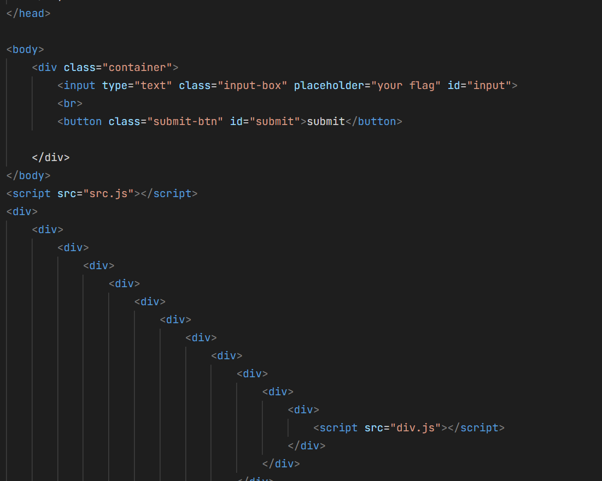

我们随便输入111，出现wrong flag，在日志里出现

<!-- 这是一张图片，ocr 内容为： -->
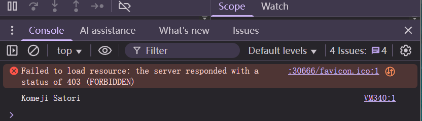

点进看到，对key进行了替换，真实的key是K0meji_K0ishi，而不是Komeji Satori

```javascript
;;;;;;;;;;;;;;;;;;;;;;;;;;;;;;;;;;;;;;;;;;;;;;;;;;;;;;;;;;;;;;;;;;;;;;;;;;;;;;;;;;;;;;;;;;;;;;;;;;;;;;;;;;;;;;;;;;;;;;;;___Key = 'K0meji_K0ishi';
;;;;;;;;;;;;;;;;;;;;;;;;;;;;;;;;;;;;;;;;;;;;;;;;;;;;;;;;;;;;;;;;;;;;;;;;;___Key.toString = function() {
  return 'Komeji Satori';
}
  ;
;;;;;;;;;;;;;;;;;;;;;;;;;;;;;;;var Ori = console.log;
;;;;;;;;;;;;;;;;;;;;;;;;;;;;;;;;;;;;;;;;;;;;;;;;;;;;;;;;;;;;;;;;;;;;;;;;;console.log = function(...args) {
  for (var i = 0; i < args.length; i++) {
    if (args[i] == ___Key) {
      args[i] = 'Komeji Satori';
    }
  }
  Ori(...args);
}
  ;
;;;;;;;;;;;;;;;;;;;;;;;;;;;;;;;;;;;;;;;;;;;;;;;;;;;;;;;;;;;;;;;;;;;;;;
```

脚本

```python
ans=[68,241,170,187,35,199,71,125,74,176,71,216,56,85,160,159,67,234,185,29,104,120,245,18]
key='K0meji_K0ishi'
kb=key.encode('utf-8')
kb16=bytearray(16)
for i in range(16):
    kb16[i]=kb[i%len(kb)]
k=[((kb16[i*4]<<24)|(kb16[i*4+1]<<16)|(kb16[i*4+2]<<8)|kb16[i*4+3])&0xffffffff for i in range(4)]
DELTA=0x9e3779b9

def tea_dec(v0,v1,k):
    s=(DELTA*32)&0xffffffff
    for _ in range(32):
        v1=(v1-((((((v0<<4)&0xffffffff)+k[2])^((v0+s)&0xffffffff)^(((v0>>5)+k[3])&0xffffffff)))) )&0xffffffff
        v0=(v0-((((((v1<<4)&0xffffffff)+k[0])^((v1+s)&0xffffffff)^(((v1>>5)+k[1])&0xffffffff)))) )&0xffffffff
        s=(s-DELTA)&0xffffffff
    return v0&0xffffffff,v1&0xffffffff

def decode(inp):
    L=((len(inp)+7)//8)*8
    b=bytearray(L)
    b[:len(inp)]=inp
    for i in range(0,L,8):
        v0=((b[i]<<24)|(b[i+1]<<16)|(b[i+2]<<8)|b[i+3])&0xffffffff
        v1=((b[i+4]<<24)|(b[i+5]<<16)|(b[i+6]<<8)|b[i+7])&0xffffffff
        v0,v1=tea_dec(v0,v1,k)
        b[i]=(v0>>24)&0xff; b[i+1]=(v0>>16)&0xff; b[i+2]=(v0>>8)&0xff; b[i+3]=v0&0xff
        b[i+4]=(v1>>24)&0xff; b[i+5]=(v1>>16)&0xff; b[i+6]=(v1>>8)&0xff; b[i+7]=v1&0xff
    return bytes(b)

kc=[ord(c) for c in key]
enc=bytearray(len(ans))
for i,x in enumerate(ans):
    enc[i]=x^kc[i%len(kc)]
pre=bytearray(decode(enc))
if len(pre)>=4:
    pre[0]^=0x12; pre[1]^=0x34; pre[2]^=0x56; pre[3]^=0x78
end=len(pre)
while end>0 and pre[end-1]==0:
    end-=1
plain=bytes(pre[:end])
print(plain.decode('utf-8'))
```

flag{jS_1s_veRY_dYn4M1c}


# 5.ezmath
IDA打开，main函数如下，遇到这种线性计算，我们可以使用z3来约束计算

```c
int __fastcall main(int argc, const char **argv, const char **envp)
{
  char v4; // [rsp+68h] [rbp-58h]
  char v5; // [rsp+69h] [rbp-57h]
  char v6; // [rsp+6Ah] [rbp-56h]
  char v7; // [rsp+6Bh] [rbp-55h]
  char v8; // [rsp+6Ch] [rbp-54h]
  char v9; // [rsp+6Dh] [rbp-53h]
  char v10; // [rsp+6Eh] [rbp-52h]
  char v11; // [rsp+6Fh] [rbp-51h]
  char v12; // [rsp+70h] [rbp-50h]
  char v13; // [rsp+71h] [rbp-4Fh]
  char v14; // [rsp+72h] [rbp-4Eh]
  char v15; // [rsp+73h] [rbp-4Dh]
  char v16; // [rsp+74h] [rbp-4Ch]
  char v17; // [rsp+75h] [rbp-4Bh]
  char v18; // [rsp+76h] [rbp-4Ah]
  char v19; // [rsp+77h] [rbp-49h]
  char v20; // [rsp+78h] [rbp-48h]
  char v21; // [rsp+79h] [rbp-47h]
  char v22; // [rsp+7Ah] [rbp-46h]
  char v23; // [rsp+7Bh] [rbp-45h]
  char v24; // [rsp+7Ch] [rbp-44h]
  char v25; // [rsp+7Dh] [rbp-43h]
  char v26; // [rsp+7Eh] [rbp-42h]
  char v27; // [rsp+7Fh] [rbp-41h]
  char v28; // [rsp+80h] [rbp-40h]
  char v29; // [rsp+81h] [rbp-3Fh]
  char v30; // [rsp+82h] [rbp-3Eh]
  char v31; // [rsp+83h] [rbp-3Dh]
  char v32; // [rsp+84h] [rbp-3Ch]
  char v33; // [rsp+85h] [rbp-3Bh]
  char v34; // [rsp+86h] [rbp-3Ah]
  char v35; // [rsp+87h] [rbp-39h]
  char v36; // [rsp+88h] [rbp-38h]
  char v37; // [rsp+89h] [rbp-37h]
  char v38; // [rsp+8Ah] [rbp-36h]
  char v39; // [rsp+8Bh] [rbp-35h]
  char v40; // [rsp+8Ch] [rbp-34h]
  char v41; // [rsp+8Dh] [rbp-33h]
  char v42; // [rsp+8Eh] [rbp-32h]
  char v43; // [rsp+8Fh] [rbp-31h]
  char v44; // [rsp+90h] [rbp-30h]
  char v45; // [rsp+91h] [rbp-2Fh]
  char v46; // [rsp+92h] [rbp-2Eh]
  char v47; // [rsp+93h] [rbp-2Dh]
  char v48; // [rsp+94h] [rbp-2Ch]
  char v49; // [rsp+95h] [rbp-2Bh]
  char v50; // [rsp+96h] [rbp-2Ah]
  char v51; // [rsp+97h] [rbp-29h]
  char v52; // [rsp+98h] [rbp-28h]
  char v53; // [rsp+99h] [rbp-27h]
  char v54; // [rsp+9Ah] [rbp-26h]
  char v55; // [rsp+9Bh] [rbp-25h]
  char v56; // [rsp+9Ch] [rbp-24h]
  char v57; // [rsp+9Dh] [rbp-23h]
  char v58; // [rsp+9Eh] [rbp-22h]
  char v59; // [rsp+9Fh] [rbp-21h]
  char v60; // [rsp+A0h] [rbp-20h]
  char v61; // [rsp+A1h] [rbp-1Fh]
  char v62; // [rsp+A2h] [rbp-1Eh]
  char v63; // [rsp+A3h] [rbp-1Dh]
  char v64; // [rsp+A4h] [rbp-1Ch]
  char v65; // [rsp+A5h] [rbp-1Bh]
  char v66; // [rsp+A6h] [rbp-1Ah]
  char v67; // [rsp+A7h] [rbp-19h]
  char v68; // [rsp+A8h] [rbp-18h]
  char v69; // [rsp+A9h] [rbp-17h]
  char v70; // [rsp+AAh] [rbp-16h]
  char v71; // [rsp+ABh] [rbp-15h]
  char v72; // [rsp+ACh] [rbp-14h]
  char v73; // [rsp+ADh] [rbp-13h]
  char v74; // [rsp+AEh] [rbp-12h]
  char v75; // [rsp+AFh] [rbp-11h]
  char v76; // [rsp+B0h] [rbp-10h]
  char v77; // [rsp+B1h] [rbp-Fh]
  char v78; // [rsp+B2h] [rbp-Eh]
  char v79; // [rsp+B3h] [rbp-Dh]
  char v80; // [rsp+B4h] [rbp-Ch]
  char v81; // [rsp+B5h] [rbp-Bh]
  char v82; // [rsp+B6h] [rbp-Ah]
  char *s; // [rsp+B8h] [rbp-8h]

  if ( argc == 2 )
  {
    s = (char *)argv[1];
    if ( (unsigned int)strlen(s) == 80 )
    {
      v82 = s[1];
      v81 = s[2];
      v80 = s[3];
      v79 = s[4];
      v78 = s[5];
      v77 = s[6];
      v76 = s[7];
      v75 = s[8];
      v74 = s[9];
      v73 = s[10];
      v72 = s[11];
      v71 = s[12];
      v70 = s[13];
      v69 = s[14];
      v68 = s[15];
      v67 = s[16];
      v66 = s[17];
      v65 = s[18];
      v64 = s[19];
      v63 = s[20];
      v62 = s[21];
      v61 = s[22];
      v60 = s[23];
      v59 = s[24];
      v58 = s[25];
      v57 = s[26];
      v56 = s[27];
      v55 = s[28];
      v54 = s[29];
      v53 = s[30];
      v52 = s[31];
      v51 = s[32];
      v50 = s[33];
      v49 = s[34];
      v48 = s[35];
      v47 = s[36];
      v46 = s[37];
      v45 = s[38];
      v44 = s[39];
      v43 = s[40];
      v42 = s[41];
      v41 = s[42];
      v40 = s[43];
      v39 = s[44];
      v38 = s[45];
      v37 = s[46];
      v36 = s[47];
      v35 = s[48];
      v34 = s[49];
      v33 = s[50];
      v32 = s[51];
      v31 = s[52];
      v30 = s[53];
      v29 = s[54];
      v28 = s[55];
      v27 = s[56];
      v26 = s[57];
      v25 = s[58];
      v24 = s[59];
      v23 = s[60];
      v22 = s[61];
      v21 = s[62];
      v20 = s[63];
      v19 = s[64];
      v18 = s[65];
      v17 = s[66];
      v16 = s[67];
      v15 = s[68];
      v14 = s[69];
      v13 = s[70];
      v12 = s[71];
      v11 = s[72];
      v10 = s[73];
      v9 = s[74];
      v8 = s[75];
      v7 = s[76];
      v6 = s[77];
      v5 = s[78];
      v4 = s[79];
      if ( -13 * v32 == 118
        && 23 * v73 + 47 * *s + 111 * v32 == 51
        && 76 * v73 + 33 * v32 - 63 * v18 == 81
        && -86 * v73 - 25 * v41 + 71 * v18 + 102 * v32 == 18
        && 105 * v73 - 17 * v41 + 74 * v18 - 25 * v32 + v14 == 0x95
        && 40 * v32 + 104 * v41 + -89 * v75 + 113 * v73 + 107 * v14 - 122 * v18 == 75
        && 95 * (v78 + v75) + 54 * v73 + -97 * v37 + 24 * v41 + -62 * v18 + 121 * v32 - 72 * v14 == 0xFD
        && -126 * v32 - 35 * v37 + 66 * v41 - 39 * v71 + 100 * v75 - 46 * v73 + 54 * v14 - 118 * v18 == 82
        && -56 * v18 + 75 * v30 + -33 * v32 + 110 * v37 + -43 * v41 + 100 * v71 + 12 * v73 - 16 * v75 - 112 * v14 == 0xAC
        && 79 * v30 - 67 * v32 + 5 * v41 - 77 * v71 + -14 * v73 - 85 * v75 + 63 * v18 + 59 * v23 + 30 * v14 == 51
        && 63 * v57 + 114 * v71 + 103 * v75 - 33 * v73 + 87 * v37 - 72 * v41 + 104 * v32 - v23 + 39 * v18 == 38
        && 113 * v29 - 22 * v32 + -83 * v75 + 35 * v71 + 44 * v37 - 126 * v57 + 78 * v18 + 99 * v23 + 112 * v14 == 0xC0
        && 121 * v36 + 32 * v37 + -24 * v41 - 33 * v57 + -120 * v71 + 71 * v73 + -59 * v23 + 118 * v29 + 117 * v18 == 62
        && -75 * v73 - (v75 << 6) + -123 * v41 + 75 * v71 + 54 * v29 + 39 * (v32 + v37) + 83 * v17 - 76 * v18 == 0x89
        && 116 * v75 + 119 * v43 + 36 * v37 + 74 * v41 + -115 * v32 + 31 * v36 + -125 * v17 - 26 * v30 + 117 * v14 == 86
        && 6 * v18 - 125 * v30 + 100 * v73 + 53 * v71 + 65 * v41 - 82 * v43 + -111 * v32 + 5 * v37 + 19 * v16 == 0x9D
        && 13 * v18 + 29 * v23 + -91 * v32 - 45 * v40 + -10 * v41 - 82 * v43 + 117 * v75 - 92 * v57 + 10 * v14 == 0xB3
        && 83 * v17 - 65 * v23 + 73 * v32 + 57 * v37 + 44 * v40 - 81 * v43 + 13 * v73 - 49 * v74 - 48 * v14 == 0x8D
        && -76 * v23 - 11 * v29 + 102 * v75 - 46 * v73 + 31 * v52 + 20 * v71 + 8 * v37 - 21 * v43 + 37 * v16 == 127
        && -75 * v32 - 89 * v40 + -6 * v52 - 67 * v57 + 82 * v73 - 117 * v58 + -12 * v23 - 8 * v30 + 55 * v17 == 0xFE
        && 41 * v16 + 6 * v18 + 56 * v29 + 101 * v33 + -11 * v41 + 23 * v43 + 19 * v73 + 14 * v52 + 25 * v14 == 0xBF
        && -82 * v37 - 33 * v55 + 77 * v74 - 60 * v73 + 8 * v58 + 52 * v71 + -118 * v33 + 78 * v36 + 39 * v16 == 0xD8
        && -119 * v37 - 4 * v41 + 103 * v75 - 101 * v73 + 62 * v43 + 117 * v47 + 53 * v16 + 36 * v32 + 65 * v14 == 86
        && 14 * v23 + 31 * v29 + 56 * v74 - 8 * v71 + -117 * v53 + 118 * v58 - v47 + 56 * v14 - 80 * v17 == 0xD4
        && 3 * v52 - 121 * v53 + -46 * v55 + 47 * v58 + 104 * v74 + 45 * v60 + 13 * v33 - 49 * v47 + 45 * v29 == 0xCC
        && -71 * v52 - 47 * v43 + -113 * v33 + 20 * v37 + -25 * v23 - 68 * v32 - v21 + -23 * v17 - 122 * v18 == 98
        && -74 * v55 + 77 * v58 + 73 * v74 - 20 * v73 + -85 * v37 + 111 * v43 + -109 * v28 + 41 * v33 + 29 * v17 == 0x94
        && 53 * v33 - 26 * v37 + -90 * v40 - 69 * v51 + -26 * v55 - 114 * v53 + -27 * v28 - 95 * v32 + 87 * v14 == 38
        && -19 * v28 + 16 * v29 + 86 * v30 + 50 * v33 + 75 * v60 - 32 * v58 + -71 * v37 + 96 * v56 + 109 * v8 + 83 * v17 == 0xA8
        && 33 * v32 + 89 * v36 + -27 * v81 - 56 * v71 + -101 * v37 + 19 * v53 + -97 * v16 - 110 * v29 - 59 * v8 == 82
        && 119 * v69 + 31 * v71 + -110 * v81 + 102 * v73 + -67 * v52 + 15 * v57 + 62 * v14 + 86 * v47 - 97 * v8 == 46
        && 30 * v53 + 107 * v66 + 62 * v81 - 115 * v69 + 77 * v30 + 57 * v47 + 122 * v21 - 30 * v23 - 107 * v18 == 76
        && 33 * v29 - 71 * v32 + 75 * v34 - 104 * v51 + 86 * v69 + 124 * v57 + -78 * v21 + 93 * v28 - 92 * v14 == 23
        && 114 * v36 + 43 * v47 + 63 * v51 - 70 * v52 + -37 * v69 - 82 * v58 + -5 * v17 - 114 * v21 - 101 * v10 == 16
        && -7 * v13 - 29 * v16 + 76 * v34 + 12 * v43 + 68 * v73 + (v52 << 7) + -94 * v17 + 13 * v28 + 123 * v10 == 68
        && -97 * v26 + 119 * v28 + -14 * v29 - 37 * v34 + 115 * v51 - 17 * v52 + -3 * v57 + 106 * v55 + 3 * v14 == 117
        && -102 * v48
         - 122 * v52
         + 40 * v60
         + 113 * v69
         + -72 * v43
         - 58 * v47
         + -44 * v36
         + 18 * v40
         + 25 * v15
         - 54 * v17 == 21
        && 54 * v69 - 97 * v75 + -15 * v37 + 69 * v61 + -109 * v32 + (v33 << 7) + -44 * v13 + 9 * v26 - 44 * v8 == 95
        && 6 * v32 - 79 * v40 + 28 * v60 - 46 * v58 + -85 * v53 + 91 * v57 + -21 * v44 + 65 * v46 + 50 * v10 + 35 * v26 == 0x81
        && 28 * v13 - 84 * v23 + -22 * v71 - 51 * v60 + 95 * v51 + 49 * v59 + 91 * v28 + 15 * v45 + 101 * v8 + 69 * v10 == 0xB1
        && 27 * v81 - 44 * v71 + 95 * v43 + 60 * v58 + 4 * v23 - 13 * v32 + 112 * v8 - 54 * v18 - 21 * v6 == 0xAA
        && -113 * v57 + 16 * v60 + -107 * v66 + 123 * v64 + -85 * v43 + 109 * v52 + 58 * v14 - (v30 << 6) + 59 * v8 == 13
        && -107 * v14 + 62 * v17 + 110 * v28 - 99 * v49 + 103 * v75 + 72 * v66 + 4 * v51 + 114 * v59 + 81 * v6 == 68
        && 51 * v24 + 55 * v40 + 20 * v47 - 116 * v53 + 106 * v73 - 94 * v66 + -30 * v14 - 5 * v15 + 93 * v13 == 56
        && 87 * v74 - 45 * v65 + 72 * v53 - 11 * v61 + -115 * v23 - 9 * v43 + 37 * v13 + 109 * v17 - 70 * v6 == 119
        && 123 * v44 + 52 * v51 + -112 * v66 - 111 * v67 + -11 * v75 - 4 * v73 + -2 * v8 - 98 * v14 - 17 * v6 == 0xA0
        && 119 * v74 + 112 * v73 + 24 * v67 + 95 * v72 + -63 * v53 + 112 * v60 + -107 * v32 - 48 * v49 - 24 * v13 == 118
        && -64 * v30 - 125 * v43 + 59 * v53 - 52 * v55 + 31 * v64 + 28 * v66 + 52 * v17 - 53 * v24 + 35 * v12 == 90
        && 70 * v36 + 101 * v51 + 13 * v61 + 53 * v62 + -31 * v74 - 25 * v64 + -4 * v29 + 110 * v34 - 73 * v14 == 0x89
        && 45 * v14 + 41 * v18 + 29 * v67 - 75 * v66 + 75 * v28 + 110 * v29 + -65 * v8 + 12 * v10 - 45 * v4 == 54
        && 66 * v75 + 84 * v57 + -91 * v43 - 32 * v53 + -91 * v28 + 39 * v34 + 56 * v10 - 56 * v13 - 15 * v7 == 63
        && 116 * v47 + 79 * v61 + -68 * v71 + 115 * v69 + -53 * v35 + 54 * v41 + 61 * v26 + 72 * v34 + 125 * v24 == 0xDD
        && 57 * v82 + 35 * v73 + -13 * v61 - 62 * v69 + -52 * v35 - 84 * v47 + -35 * v14 + 73 * v28 + 97 * v6 == 0xD7
        && -103 * v34 + 38 * v37 + 27 * v42 - 8 * v51 + -46 * v66 + 6 * v67 + 110 * v24 - 53 * v32 - 125 * v8 == 0xFD
        && 126 * v35 + 94 * v40 + -13 * v41 + 57 * v42 + 33 * v76 - 75 * v69 + 94 * v12 - 65 * v33 - 98 * v7 == 0xBD
        && 84 * v23 + 99 * v28 + -92 * v32 - 104 * v33 + -23 * v73 - 8 * v67 + -48 * v7 - 73 * v19 + 56 * v4 == 127
        && -33 * v21 - 82 * v23 + 66 * v32 - 51 * v40 + 38 * v61 + 86 * v73 - 77 * v80 + v55 - 24 * v7 == 11
        && 75 * v21 - 122 * v34 + -12 * v49 + 62 * v60 + 4 * (45 * v76 + v67) - 21 * v64 + -48 * v17 + 115 * v20 == 29
        && -40 * v81 - 115 * v71 + -30 * v60 - 13 * v62 + 113 * v53 + 96 * v57 + 63 * v27 + 119 * v33 - 78 * v19 == 78
        && -93 * v27 - 113 * v59 + 58 * v61 - 23 * v66 + -113 * v71 - 110 * v73 + -117 * v77 - 36 * v75 - 5 * v26 == 35
        && -90 * v20 + 51 * v59 + -44 * v82 + 85 * v75 + 11 * v67 - 51 * v68 + v65 + 50 * v12 + 114 * v15 == 4
        && 43 * v30 + 67 * v35 + 80 * v36 + 51 * v44 + -13 * v62 - 90 * v52 - v63 + 25 * v14 + 89 * v27 == 11
        && 91 * v21 - 117 * v26 + 28 * v32 + 109 * v36 + 38 * v44 - 97 * v54 + 3 * v75 - 123 * v62 - 112 * v4 == 104
        && -113 * v34 - 75 * v36 + 13 * v37 - 121 * v58 + 43 * v69 - 41 * v62 + -123 * v17 - 31 * v22 - 83 * v16 == 123
        && 106 * v23 - 57 * v27 + 90 * v29 + 115 * v37 + 48 * v53 + 33 * *s + 94 * v7 + 90 * v8 + 87 * v6 == 106
        && -93 * v38 - 52 * v41 + 45 * v71 + 38 * v52 + 54 * v20 - 13 * v27 + -51 * v18 + 96 * v19 + 109 * v13 == 20
        && 84 * v52 + -22 * v64 + 23 * v68 + v51 + -110 * v33 - 39 * v39 + 34 * v16 + 21 * v18 - 59 * v7 == 0x8C
        && 87 * v21 + 63 * v24 + 55 * v33 + 12 * v35 + -100 * v67 - 3 * v60 + -51 * v9 + 3 * v20 - 106 * v4 == 69
        && 100 * v20 - 93 * v23 + -48 * v76 + 61 * v56 + 95 * v28 + 37 * v33 + 81 * v16 + 39 * v18 + 93 * v6 == 0xAB
        && -21 * v26 - 84 * v39 + -8 * v40 + 74 * v51 + -95 * v69 - 125 * v57 + -89 * v24 - 79 * v25 + 39 * v21 == 1
        && 96 * v67 + 20 * v73 + -60 * v61 - 54 * v64 + 103 * v48 - 16 * v57 + 93 * v37 - 13 * v40 + 116 * v22 == 11
        && 99 * v79 + 30 * v67 + -78 * v53 + 97 * v57 + 16 * v42 - 49 * v44 + 69 * v24 - 50 * v34 - 114 * v23 == 48
        && 102 * v20 - 31 * v28 + 19 * v70 - 91 * v61 + -56 * v52 - 48 * v55 + -50 * v44 + 63 * v49 + 65 * v16 == 0x91
        && 40 * v16
         - 61 * v21
         + -19 * v28
         - 111 * v31
         + 114 * v32
         + 34 * v57
         + 91 * v80
         - 33 * v59
         + 12 * v10
         - 18 * v11 == 0xC1
        && -105 * v78 - 11 * v70 + -77 * v67 - 120 * v68 + 123 * v31 - 34 * v64 + -20 * v21 - 14 * v30 + 68 * v9 == 0xF4
        && -88 * v79 + 66 * v72 + -65 * v44 + 75 * v50 + 23 * v37 + 65 * v38 + -73 * v13 - 79 * v25 + 59 * v10 == 0xAB
        && -123 * v7 - 7 * v40 + 45 * v46 + 34 * v50 + 106 * v53 + 43 * v64 + -13 * v76 + 7 * v77 - 120 * v4 == 5
        && -98 * v27 + 11 * v34 + 48 * v71 + 11 * v82 + -8 * v35 + 74 * v39 + 122 * v6 + 65 * v8 + 25 * v5 == 30
        && 5 * v24 - 110 * v34 + 127 * v47 - 32 * v54 + -118 * v55 + 104 * v81 + v73 + 11 * v11 + 73 * v13 == 0xF0
        && -86 * v19 + 86 * v33 + -24 * v37 + 112 * v41 + -91 * v45 + 95 * v49 + 5 * v51 - 77 * v63 + 14 * v5 - 69 * v8 == 17 )
      {
        puts("Correct!");
        return 0;
      }
      else
      {
        puts("Nope.");
        return 1;
      }
    }
    else
    {
      fprintf(_bss_start, "Wrong length (expect %d)\n", 80);
      return 3;
    }
  }
  else
  {
    fprintf(_bss_start, "Usage: %s \"flag{...}\"\n", *argv);
    return 2;
  }
}
```

解密脚本

```c
from z3 import *

x = [BitVec(f'x{i:02d}', 8) for i in range(80)]

def V(k):
    return x[83 - k]

s = Solver()

for i in range(80):
    s.add(x[i] != 0)

s.add(x[0] == ord('f'))
s.add(x[1] == ord('l'))
s.add(x[2] == ord('a'))
s.add(x[3] == ord('g'))
s.add(x[4] == ord('{'))

s.add(-13 * V(32) == 118)
s.add(23 * V(73) + 47 * x[0] + 111 * V(32) == 51)
s.add(76 * V(73) + 33 * V(32) - 63 * V(18) == 81)
s.add(-86 * V(73) - 25 * V(41) + 71 * V(18) + 102 * V(32) == 18)
s.add(105 * V(73) - 17 * V(41) + 74 * V(18) - 25 * V(32) + V(14) == 0x95)
s.add(40 * V(32) + 104 * V(41) - 89 * V(75) + 113 * V(73) + 107 * V(14) - 122 * V(18) == 75)
s.add(95 * (V(78) + V(75)) + 54 * V(73) - 97 * V(37) + 24 * V(41) - 62 * V(18) + 121 * V(32) - 72 * V(14) == 0xFD)
s.add(-126 * V(32) - 35 * V(37) + 66 * V(41) - 39 * V(71) + 100 * V(75) - 46 * V(73) + 54 * V(14) - 118 * V(18) == 82)
s.add(-56 * V(18) + 75 * V(30) - 33 * V(32) + 110 * V(37) - 43 * V(41) + 100 * V(71) + 12 * V(73) - 16 * V(75) - 112 * V(14) == 0xAC)
s.add(79 * V(30) - 67 * V(32) + 5 * V(41) - 77 * V(71) - 14 * V(73) - 85 * V(75) + 63 * V(18) + 59 * V(23) + 30 * V(14) == 51)
s.add(63 * V(57) + 114 * V(71) + 103 * V(75) - 33 * V(73) + 87 * V(37) - 72 * V(41) + 104 * V(32) - V(23) + 39 * V(18) == 38)
s.add(113 * V(29) - 22 * V(32) - 83 * V(75) + 35 * V(71) + 44 * V(37) - 126 * V(57) + 78 * V(18) + 99 * V(23) + 112 * V(14) == 0xC0)
s.add(121 * V(36) + 32 * V(37) - 24 * V(41) - 33 * V(57) - 120 * V(71) + 71 * V(73) - 59 * V(23) + 118 * V(29) + 117 * V(18) == 62)
s.add(-75 * V(73) - (V(75) << 6) - 123 * V(41) + 75 * V(71) + 54 * V(29) + 39 * (V(32) + V(37)) + 83 * V(17) - 76 * V(18) == 0x89)
s.add(116 * V(75) + 119 * V(43) + 36 * V(37) + 74 * V(41) - 115 * V(32) + 31 * V(36) - 125 * V(17) - 26 * V(30) + 117 * V(14) == 86)
s.add(6 * V(18) - 125 * V(30) + 100 * V(73) + 53 * V(71) + 65 * V(41) - 82 * V(43) - 111 * V(32) + 5 * V(37) + 19 * V(16) == 0x9D)
s.add(13 * V(18) + 29 * V(23) - 91 * V(32) - 45 * V(40) - 10 * V(41) - 82 * V(43) + 117 * V(75) - 92 * V(57) + 10 * V(14) == 0xB3)
s.add(83 * V(17) - 65 * V(23) + 73 * V(32) + 57 * V(37) + 44 * V(40) - 81 * V(43) + 13 * V(73) - 49 * V(74) - 48 * V(14) == 0x8D)
s.add(-76 * V(23) - 11 * V(29) + 102 * V(75) - 46 * V(73) + 31 * V(52) + 20 * V(71) + 8 * V(37) - 21 * V(43) + 37 * V(16) == 127)
s.add(-75 * V(32) - 89 * V(40) - 6 * V(52) - 67 * V(57) + 82 * V(73) - 117 * V(58) - 12 * V(23) - 8 * V(30) + 55 * V(17) == 0xFE)
s.add(41 * V(16) + 6 * V(18) + 56 * V(29) + 101 * V(33) - 11 * V(41) + 23 * V(43) + 19 * V(73) + 14 * V(52) + 25 * V(14) == 0xBF)
s.add(-82 * V(37) - 33 * V(55) + 77 * V(74) - 60 * V(73) + 8 * V(58) + 52 * V(71) - 118 * V(33) + 78 * V(36) + 39 * V(16) == 0xD8)
s.add(-119 * V(37) - 4 * V(41) + 103 * V(75) - 101 * V(73) + 62 * V(43) + 117 * V(47) + 53 * V(16) + 36 * V(32) + 65 * V(14) == 86)
s.add(14 * V(23) + 31 * V(29) + 56 * V(74) - 8 * V(71) - 117 * V(53) + 118 * V(58) - V(47) + 56 * V(14) - 80 * V(17) == 0xD4)
s.add(3 * V(52) - 121 * V(53) - 46 * V(55) + 47 * V(58) + 104 * V(74) + 45 * V(60) + 13 * V(33) - 49 * V(47) + 45 * V(29) == 0xCC)
s.add(-71 * V(52) - 47 * V(43) - 113 * V(33) + 20 * V(37) - 25 * V(23) - 68 * V(32) - V(21) - 23 * V(17) - 122 * V(18) == 98)
s.add(-74 * V(55) + 77 * V(58) + 73 * V(74) - 20 * V(73) - 85 * V(37) + 111 * V(43) - 109 * V(28) + 41 * V(33) + 29 * V(17) == 0x94)
s.add(53 * V(33) - 26 * V(37) - 90 * V(40) - 69 * V(51) - 26 * V(55) - 114 * V(53) - 27 * V(28) - 95 * V(32) + 87 * V(14) == 38)
s.add(-19 * V(28) + 16 * V(29) + 86 * V(30) + 50 * V(33) + 75 * V(60) - 32 * V(58) - 71 * V(37) + 96 * V(56) + 109 * V(8) + 83 * V(17) == 0xA8)
s.add(33 * V(32) + 89 * V(36) - 27 * V(81) - 56 * V(71) - 101 * V(37) + 19 * V(53) - 97 * V(16) - 110 * V(29) - 59 * V(8) == 82)
s.add(119 * V(69) + 31 * V(71) - 110 * V(81) + 102 * V(73) - 67 * V(52) + 15 * V(57) + 62 * V(14) + 86 * V(47) - 97 * V(8) == 46)
s.add(30 * V(53) + 107 * V(66) + 62 * V(81) - 115 * V(69) + 77 * V(30) + 57 * V(47) + 122 * V(21) - 30 * V(23) - 107 * V(18) == 76)
s.add(33 * V(29) - 71 * V(32) + 75 * V(34) - 104 * V(51) + 86 * V(69) + 124 * V(57) - 78 * V(21) + 93 * V(28) - 92 * V(14) == 23)
s.add(114 * V(36) + 43 * V(47) + 63 * V(51) - 70 * V(52) - 37 * V(69) - 82 * V(58) - 5 * V(17) - 114 * V(21) - 101 * V(10) == 16)
s.add(-7 * V(13) - 29 * V(16) + 76 * V(34) + 12 * V(43) + 68 * V(73) + (V(52) << 7) - 94 * V(17) + 13 * V(28) + 123 * V(10) == 68)
s.add(-97 * V(26) + 119 * V(28) - 14 * V(29) - 37 * V(34) + 115 * V(51) - 17 * V(52) - 3 * V(57) + 106 * V(55) + 3 * V(14) == 117)
s.add(-102 * V(48) - 122 * V(52) + 40 * V(60) + 113 * V(69) - 72 * V(43) - 58 * V(47) - 44 * V(36) + 18 * V(40) + 25 * V(15) - 54 * V(17) == 21)
s.add(54 * V(69) - 97 * V(75) - 15 * V(37) + 69 * V(61) - 109 * V(32) + (V(33) << 7) - 44 * V(13) + 9 * V(26) - 44 * V(8) == 95)
s.add(6 * V(32) - 79 * V(40) + 28 * V(60) - 46 * V(58) - 85 * V(53) + 91 * V(57) - 21 * V(44) + 65 * V(46) + 50 * V(10) + 35 * V(26) == 0x81)
s.add(28 * V(13) - 84 * V(23) - 22 * V(71) - 51 * V(60) + 95 * V(51) + 49 * V(59) + 91 * V(28) + 15 * V(45) + 101 * V(8) + 69 * V(10) == 0xB1)
s.add(27 * V(81) - 44 * V(71) + 95 * V(43) + 60 * V(58) + 4 * V(23) - 13 * V(32) + 112 * V(8) - 54 * V(18) - 21 * V(6) == 0xAA)
s.add(-113 * V(57) + 16 * V(60) - 107 * V(66) + 123 * V(64) - 85 * V(43) + 109 * V(52) + 58 * V(14) - (V(30) << 6) + 59 * V(8) == 13)
s.add(-107 * V(14) + 62 * V(17) + 110 * V(28) - 99 * V(49) + 103 * V(75) + 72 * V(66) + 4 * V(51) + 114 * V(59) + 81 * V(6) == 68)
s.add(51 * V(24) + 55 * V(40) + 20 * V(47) - 116 * V(53) + 106 * V(73) - 94 * V(66) - 30 * V(14) - 5 * V(15) + 93 * V(13) == 56)
s.add(87 * V(74) - 45 * V(65) + 72 * V(53) - 11 * V(61) - 115 * V(23) - 9 * V(43) + 37 * V(13) + 109 * V(17) - 70 * V(6) == 119)
s.add(123 * V(44) + 52 * V(51) - 112 * V(66) - 111 * V(67) - 11 * V(75) - 4 * V(73) - 2 * V(8) - 98 * V(14) - 17 * V(6) == 0xA0)
s.add(119 * V(74) + 112 * V(73) + 24 * V(67) + 95 * V(72) - 63 * V(53) + 112 * V(60) - 107 * V(32) - 48 * V(49) - 24 * V(13) == 118)
s.add(-64 * V(30) - 125 * V(43) + 59 * V(53) - 52 * V(55) + 31 * V(64) + 28 * V(66) + 52 * V(17) - 53 * V(24) + 35 * V(12) == 90)
s.add(70 * V(36) + 101 * V(51) + 13 * V(61) + 53 * V(62) - 31 * V(74) - 25 * V(64) - 4 * V(29) + 110 * V(34) - 73 * V(14) == 0x89)
s.add(45 * V(14) + 41 * V(18) + 29 * V(67) - 75 * V(66) + 75 * V(28) + 110 * V(29) - 65 * V(8) + 12 * V(10) - 45 * V(4) == 54)
s.add(66 * V(75) + 84 * V(57) - 91 * V(43) - 32 * V(53) - 91 * V(28) + 39 * V(34) + 56 * V(10) - 56 * V(13) - 15 * V(7) == 63)
s.add(116 * V(47) + 79 * V(61) - 68 * V(71) + 115 * V(69) - 53 * V(35) + 54 * V(41) + 61 * V(26) + 72 * V(34) + 125 * V(24) == 0xDD)
s.add(57 * V(82) + 35 * V(73) - 13 * V(61) - 62 * V(69) - 52 * V(35) - 84 * V(47) - 35 * V(14) + 73 * V(28) + 97 * V(6) == 0xD7)
s.add(-103 * V(34) + 38 * V(37) + 27 * V(42) - 8 * V(51) - 46 * V(66) + 6 * V(67) + 110 * V(24) - 53 * V(32) - 125 * V(8) == 0xFD)
s.add(126 * V(35) + 94 * V(40) - 13 * V(41) + 57 * V(42) + 33 * V(76) - 75 * V(69) + 94 * V(12) - 65 * V(33) - 98 * V(7) == 0xBD)
s.add(84 * V(23) + 99 * V(28) - 92 * V(32) - 104 * V(33) - 23 * V(73) - 8 * V(67) - 48 * V(7) - 73 * V(19) + 56 * V(4) == 127)
s.add(-33 * V(21) - 82 * V(23) + 66 * V(32) - 51 * V(40) + 38 * V(61) + 86 * V(73) - 77 * V(80) + V(55) - 24 * V(7) == 11)
s.add(75 * V(21) - 122 * V(34) - 12 * V(49) + 62 * V(60) + 4 * (45 * V(76) + V(67)) - 21 * V(64) - 48 * V(17) + 115 * V(20) == 29)
s.add(-40 * V(81) - 115 * V(71) - 30 * V(60) - 13 * V(62) + 113 * V(53) + 96 * V(57) + 63 * V(27) + 119 * V(33) - 78 * V(19) == 78)
s.add(-93 * V(27) - 113 * V(59) + 58 * V(61) - 23 * V(66) - 113 * V(71) - 110 * V(73) - 117 * V(77) - 36 * V(75) - 5 * V(26) == 35)
s.add(-90 * V(20) + 51 * V(59) - 44 * V(82) + 85 * V(75) + 11 * V(67) - 51 * V(68) + V(65) + 50 * V(12) + 114 * V(15) == 4)
s.add(43 * V(30) + 67 * V(35) + 80 * V(36) + 51 * V(44) - 13 * V(62) - 90 * V(52) - V(63) + 25 * V(14) + 89 * V(27) == 11)
s.add(91 * V(21) - 117 * V(26) + 28 * V(32) + 109 * V(36) + 38 * V(44) - 97 * V(54) + 3 * V(75) - 123 * V(62) - 112 * V(4) == 104)
s.add(-113 * V(34) - 75 * V(36) + 13 * V(37) - 121 * V(58) + 43 * V(69) - 41 * V(62) - 123 * V(17) - 31 * V(22) - 83 * V(16) == 123)
s.add(106 * V(23) - 57 * V(27) + 90 * V(29) + 115 * V(37) + 48 * V(53) + 33 * x[0] + 94 * V(7) + 90 * V(8) + 87 * V(6) == 106)
s.add(-93 * V(38) - 52 * V(41) + 45 * V(71) + 38 * V(52) + 54 * V(20) - 13 * V(27) - 51 * V(18) + 96 * V(19) + 109 * V(13) == 20)
s.add(84 * V(52) - 22 * V(64) + 23 * V(68) + V(51) - 110 * V(33) - 39 * V(39) + 34 * V(16) + 21 * V(18) - 59 * V(7) == 0x8C)
s.add(87 * V(21) + 63 * V(24) + 55 * V(33) + 12 * V(35) - 100 * V(67) - 3 * V(60) - 51 * V(9) + 3 * V(20) - 106 * V(4) == 69)
s.add(100 * V(20) - 93 * V(23) - 48 * V(76) + 61 * V(56) + 95 * V(28) + 37 * V(33) + 81 * V(16) + 39 * V(18) + 93 * V(6) == 0xAB)
s.add(-21 * V(26) - 84 * V(39) - 8 * V(40) + 74 * V(51) - 95 * V(69) - 125 * V(57) - 89 * V(24) - 79 * V(25) + 39 * V(21) == 1)
s.add(96 * V(67) + 20 * V(73) - 60 * V(61) - 54 * V(64) + 103 * V(48) - 16 * V(57) + 93 * V(37) - 13 * V(40) + 116 * V(22) == 11)
s.add(99 * V(79) + 30 * V(67) - 78 * V(53) + 97 * V(57) + 16 * V(42) - 49 * V(44) + 69 * V(24) - 50 * V(34) - 114 * V(23) == 48)
s.add(102 * V(20) - 31 * V(28) + 19 * V(70) - 91 * V(61) - 56 * V(52) - 48 * V(55) - 50 * V(44) + 63 * V(49) + 65 * V(16) == 0x91)
s.add(40 * V(16) - 61 * V(21) - 19 * V(28) - 111 * V(31) + 114 * V(32) + 34 * V(57) + 91 * V(80) - 33 * V(59) + 12 * V(10) - 18 * V(11) == 0xC1)
s.add(-105 * V(78) - 11 * V(70) - 77 * V(67) - 120 * V(68) + 123 * V(31) - 34 * V(64) - 20 * V(21) - 14 * V(30) + 68 * V(9) == 0xF4)
s.add(-88 * V(79) + 66 * V(72) - 65 * V(44) + 75 * V(50) + 23 * V(37) + 65 * V(38) - 73 * V(13) - 79 * V(25) + 59 * V(10) == 0xAB)
s.add(-123 * V(7) - 7 * V(40) + 45 * V(46) + 34 * V(50) + 106 * V(53) + 43 * V(64) - 13 * V(76) + 7 * V(77) - 120 * V(4) == 5)
s.add(-98 * V(27) + 11 * V(34) + 48 * V(71) + 11 * V(82) - 8 * V(35) + 74 * V(39) + 122 * V(6) + 65 * V(8) + 25 * V(5) == 30)
s.add(5 * V(24) - 110 * V(34) + 127 * V(47) - 32 * V(54) - 118 * V(55) + 104 * V(81) + V(73) + 11 * V(11) + 73 * V(13) == 0xF0)
s.add(-86 * V(19) + 86 * V(33) - 24 * V(37) + 112 * V(41) - 91 * V(45) + 95 * V(49) + 5 * V(51) - 77 * V(63) + 14 * V(5) - 69 * V(8) == 17)

if s.check() == sat:
    m = s.model()
    vals = [m.evaluate(x[i]).as_long() for i in range(80)]
    b = bytes(vals)
    try:
        print(b.decode('latin-1'))
    except Exception:
        print(b.hex())
else:
    print('UNSAT')
```

flag{we1c0m3_7o_th3_2e_WorLd_HoPE_y#u_3nJoy_It_6Jj12Xmdy2h3wjd4rYCyARmpkIbZd$Kt}


# 6.babyre
IDA打开，这里可以看出是控制流扁平化混淆

<!-- 这是一张图片，ocr 内容为： -->
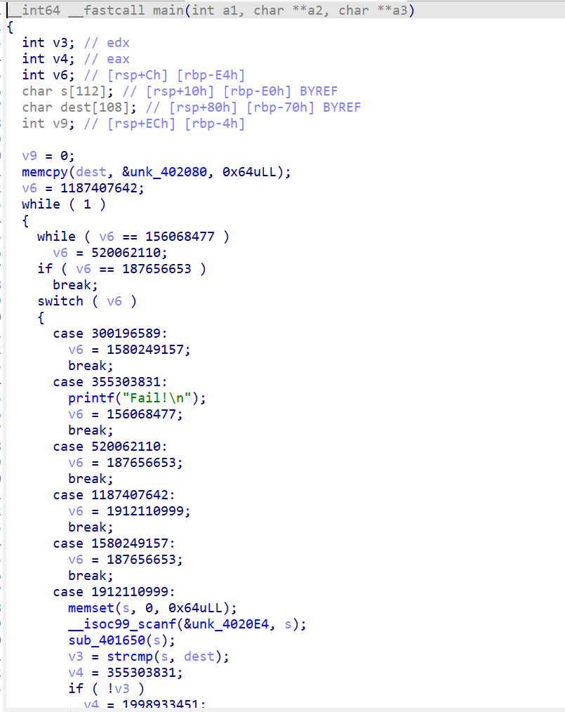

<!-- 这是一张图片，ocr 内容为： -->
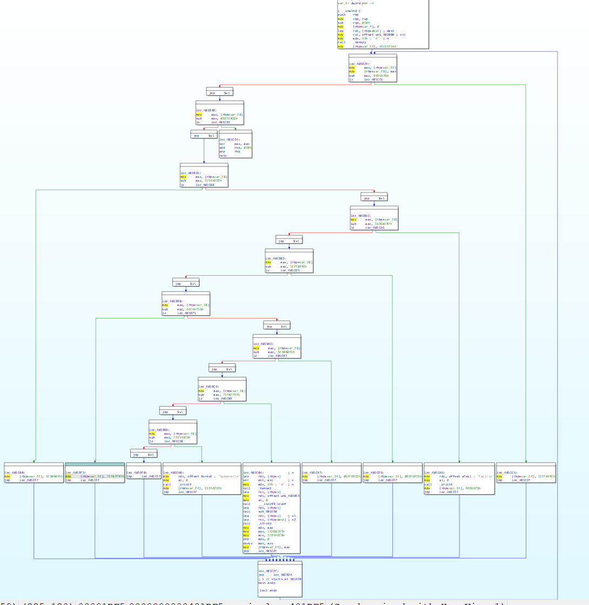

这里采用deflat.py脚本

```bash
E:\tool\deflat-master\deflat-master\flat_control_flow>python deflat.py -f "E:\ctf\questionCTF2025\week3\111418_babyre\babyre" --addr 0x401AF0
```

<!-- 这是一张图片，ocr 内容为： -->
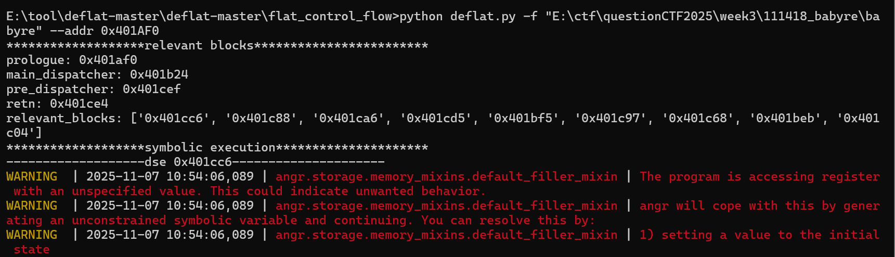

<!-- 这是一张图片，ocr 内容为： -->
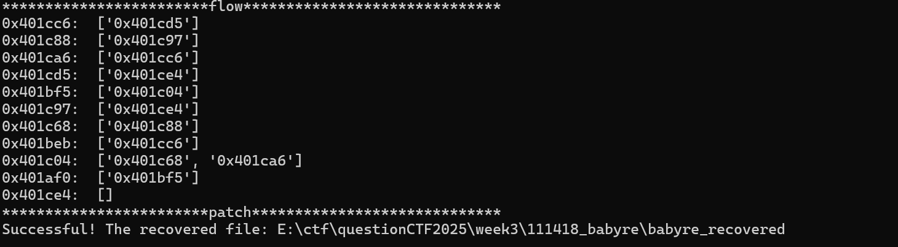

当然你也可以采用D810插件

<!-- 这是一张图片，ocr 内容为： -->
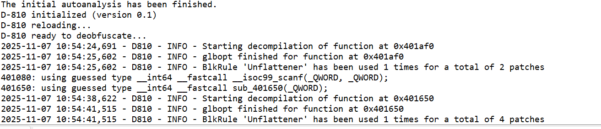

去混淆后的main函数

<!-- 这是一张图片，ocr 内容为： -->
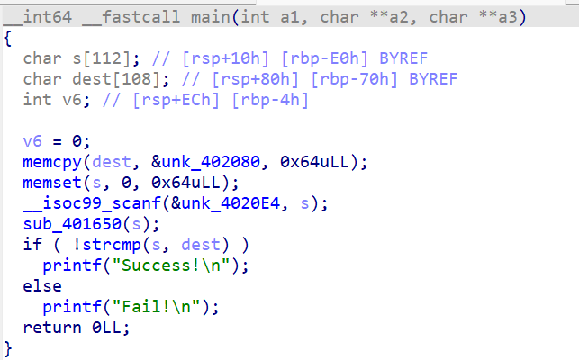

加密函数sub_401650执行RC4 PRGA 生成密钥流并与输入逐字节 XOR ；随后将每个字节做 ROR 5（右旋五位）

<!-- 这是一张图片，ocr 内容为： -->
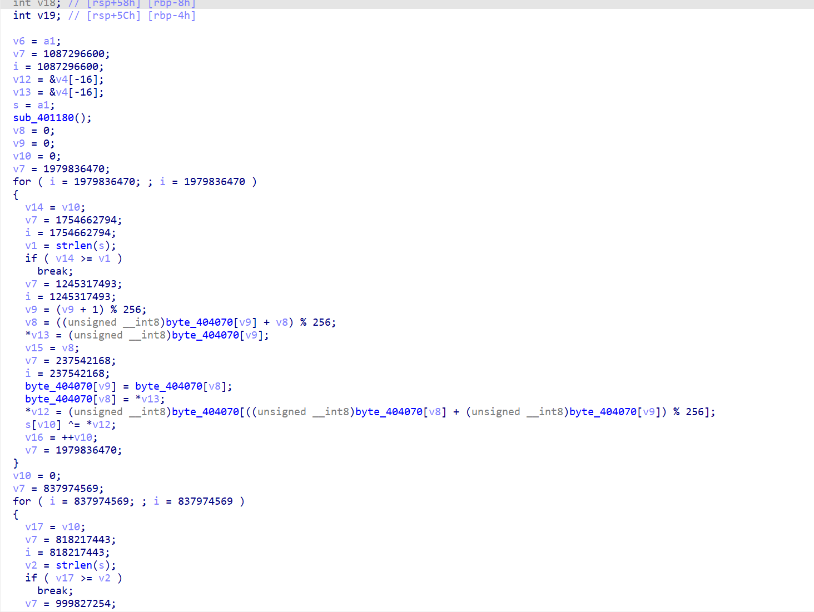

sub_401650函数有调用了sub_401180函数，他执行 RC4 的 KSA（S盒初始化与搅拌），密钥来自 0x402010 。

<!-- 这是一张图片，ocr 内容为： -->
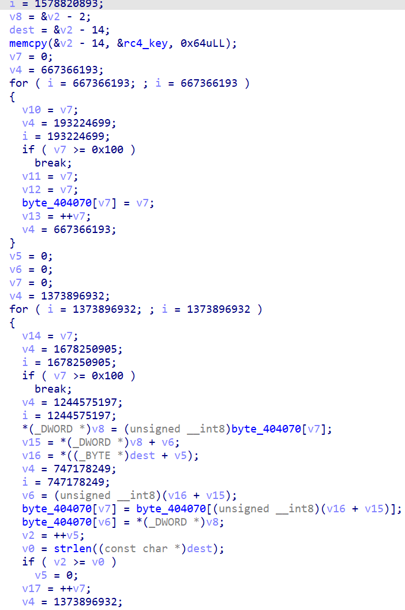

<!-- 这是一张图片，ocr 内容为： -->
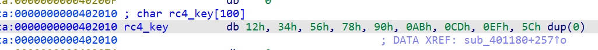

最终比较密文<!-- 这是一张图片，ocr 内容为： -->
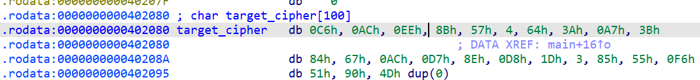

脚本

```python
def rc4_ksa(key_bytes):
    S = list(range(256))
    j = 0
    for i in range(256):
        j = (j + S[i] + key_bytes[i % len(key_bytes)]) & 0xFF
        S[i], S[j] = S[j], S[i]
    return S

def rc4_prga(S, n):
    i = 0
    j = 0
    out = []
    for _ in range(n):
        i = (i + 1) & 0xFF
        j = (j + S[i]) & 0xFF
        S[i], S[j] = S[j], S[i]
        K = S[(S[i] + S[j]) & 0xFF]
        out.append(K)
    return out

def rol8(x, r):
    return ((x << r) | (x >> (8 - r))) & 0xFF

def decrypt(cipher_bytes, key_bytes):

    rot_inv = [rol8(c, 5) for c in cipher_bytes]
    S = rc4_ksa(key_bytes[:])
    ks = rc4_prga(S, len(rot_inv))
    return bytes([rot_inv[i] ^ ks[i] for i in range(len(rot_inv))])

if __name__ == "__main__":
    key = [0x12,0x34,0x56,0x78,0x90,0xab,0xcd,0xef]
    cipher = [0xc6,0xac,0xee,0x8b,0x57,0x04,0x64,0x3a,0xa7,0x3b,0x84,0x67,0xac,0xd7,0x8e,0xd8,0x1d,0x03,0x85,0x55,0xf6,0x51,0x90]
    plain = decrypt(cipher, key)
    print("len", len(plain))
    print("hex", plain.hex())
    try:
        print("ascii", plain.decode('utf-8'))
    except UnicodeDecodeError:
        print("ascii", plain)
```

flag{Ju4t_4_S1mpl3_RC4}


# 7.strangeenc
main函数

<!-- 这是一张图片，ocr 内容为： -->
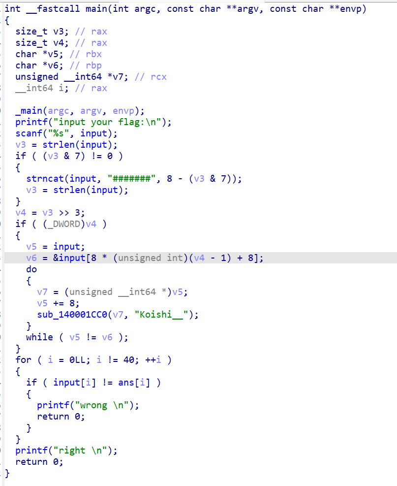

开头会把我们的输入做8字节对齐填充，不够8字节用#填充

<!-- 这是一张图片，ocr 内容为： -->
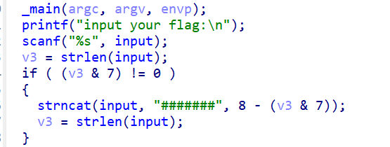

主要加密逻辑在sub_140001CC0函数里，传入明文与密钥“Koishi__”，做DES加密

<!-- 这是一张图片，ocr 内容为： -->
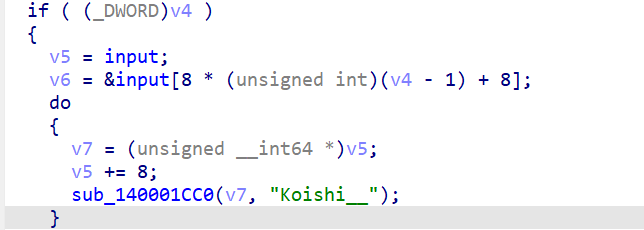

接下里看sub_140001CC0函数，这两个函数生成keys

<!-- 这是一张图片，ocr 内容为： -->
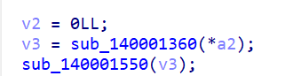

之后是比较

<!-- 这是一张图片，ocr 内容为： -->
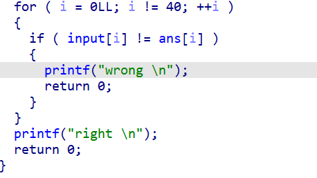

<!-- 这是一张图片，ocr 内容为： -->
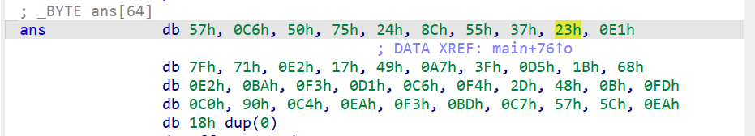

因为是DES算法，加密与解密用到的密钥只是顺序不同，我们可以把密文patch进输入，然后把得到的keys再手动patch成逆序，之后执行完就可以得到flag

我们先在  下个断点，然后运行，输入一些东西，然后找到输入存放的地址，把他们在patch成密文字节

<!-- 这是一张图片，ocr 内容为： -->
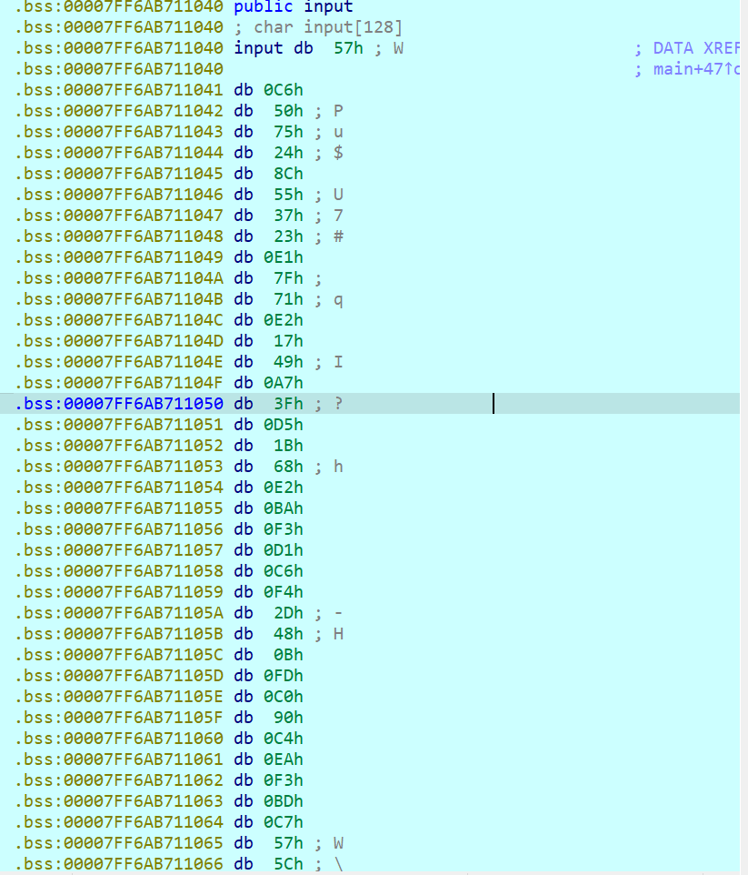

然后我们可以看到keys了，我们要手动把它逆序

```python
bss:00007FF6AB7110C0 public Keys
.bss:00007FF6AB7110C0 Keys db 0BAh                            ; DATA XREF: sub_7FF6AB701550+12↑o
.bss:00007FF6AB7110C0                                         ; sub_7FF6AB701CC0+ED↑o
.bss:00007FF6AB7110C1 db 0DDh
.bss:00007FF6AB7110C2 db  34h ; 4
.bss:00007FF6AB7110C3 db  4Eh ; N
.bss:00007FF6AB7110C4 db 0B6h
.bss:00007FF6AB7110C5 db 0E0h
.bss:00007FF6AB7110C6 db    0
.bss:00007FF6AB7110C7 db    0
.bss:00007FF6AB7110C8 db 0DCh
.bss:00007FF6AB7110C9 db  7Dh ; }
.bss:00007FF6AB7110CA db  8Eh
.bss:00007FF6AB7110CB db 0F6h
.bss:00007FF6AB7110CC db  16h
.bss:00007FF6AB7110CD db 0E0h
.bss:00007FF6AB7110CE db    0
.bss:00007FF6AB7110CF db    0
.bss:00007FF6AB7110D0 db 0F1h
.bss:00007FF6AB7110D1 db 0D3h
.bss:00007FF6AB7110D2 db 0E9h
.bss:00007FF6AB7110D3 db  70h ; p
.bss:00007FF6AB7110D4 db 0D2h
.bss:00007FF6AB7110D5 db 0F4h
.bss:00007FF6AB7110D6 db    0
.bss:00007FF6AB7110D7 db    0
.bss:00007FF6AB7110D8 db  2Bh ; +
.bss:00007FF6AB7110D9 db 0CEh
.bss:00007FF6AB7110DA db 0D3h
.bss:00007FF6AB7110DB db  72h ; r
.bss:00007FF6AB7110DC db 0D3h
.bss:00007FF6AB7110DD db  86h
.bss:00007FF6AB7110DE db    0
.bss:00007FF6AB7110DF db    0
.bss:00007FF6AB7110E0 db  1Ch
.bss:00007FF6AB7110E1 db  1Fh
.bss:00007FF6AB7110E2 db 0DEh
.bss:00007FF6AB7110E3 db  57h ; W
.bss:00007FF6AB7110E4 db  53h ; S
.bss:00007FF6AB7110E5 db 0AEh
.bss:00007FF6AB7110E6 db    0
.bss:00007FF6AB7110E7 db    0
.bss:00007FF6AB7110E8 db 0FCh
.bss:00007FF6AB7110E9 db  73h ; s
.bss:00007FF6AB7110EA db  99h
.bss:00007FF6AB7110EB db  49h ; I
.bss:00007FF6AB7110EC db  53h ; S
.bss:00007FF6AB7110ED db  2Fh ; /
.bss:00007FF6AB7110EE db    0
.bss:00007FF6AB7110EF db    0
.bss:00007FF6AB7110F0 db 0A1h
.bss:00007FF6AB7110F1 db 0FAh
.bss:00007FF6AB7110F2 db  71h ; q
.bss:00007FF6AB7110F3 db 0F9h
.bss:00007FF6AB7110F4 db  51h ; Q
.bss:00007FF6AB7110F5 db  0Bh
.bss:00007FF6AB7110F6 db    0
.bss:00007FF6AB7110F7 db    0
.bss:00007FF6AB7110F8 db  3Fh ; ?
.bss:00007FF6AB7110F9 db  2Ch ; ,
.bss:00007FF6AB7110FA db 0F2h
.bss:00007FF6AB7110FB db 0D9h
.bss:00007FF6AB7110FC db  49h ; I
.bss:00007FF6AB7110FD db  9Dh
.bss:00007FF6AB7110FE db    0
.bss:00007FF6AB7110FF db    0
.bss:00007FF6AB711100 db  97h
.bss:00007FF6AB711101 db 0D5h
.bss:00007FF6AB711102 db 0B3h
.bss:00007FF6AB711103 db  9Ah
.bss:00007FF6AB711104 db  49h ; I
.bss:00007FF6AB711105 db  1Fh
.bss:00007FF6AB711106 db    0
.bss:00007FF6AB711107 db    0
.bss:00007FF6AB711108 db 0A3h
.bss:00007FF6AB711109 db  27h ; '
.bss:00007FF6AB71110A db  8Fh
.bss:00007FF6AB71110B db  8Dh
.bss:00007FF6AB71110C db  29h ; )
.bss:00007FF6AB71110D db  3Eh ; >
.bss:00007FF6AB71110E db    0
.bss:00007FF6AB71110F db    0
.bss:00007FF6AB711110 db  45h ; E
.bss:00007FF6AB711111 db  6Bh ; k
.bss:00007FF6AB711112 db 0FEh
.bss:00007FF6AB711113 db  0Dh
.bss:00007FF6AB711114 db  2Ch ; ,
.bss:00007FF6AB711115 db  1Bh
.bss:00007FF6AB711116 db    0
.bss:00007FF6AB711117 db    0
.bss:00007FF6AB711118 db 0DEh
.bss:00007FF6AB711119 db 0C3h
.bss:00007FF6AB71111A db  72h ; r
.bss:00007FF6AB71111B db 0BCh
.bss:00007FF6AB71111C db  2Ch ; ,
.bss:00007FF6AB71111D db  49h ; I
.bss:00007FF6AB71111E db    0
.bss:00007FF6AB71111F db    0
.bss:00007FF6AB711120 db  8Bh
.bss:00007FF6AB711121 db 0B5h
.bss:00007FF6AB711122 db 0D5h
.bss:00007FF6AB711123 db 0ACh
.bss:00007FF6AB711124 db 0ACh
.bss:00007FF6AB711125 db 0D4h
.bss:00007FF6AB711126 db    0
.bss:00007FF6AB711127 db    0
.bss:00007FF6AB711128 db  69h ; i
.bss:00007FF6AB711129 db  36h ; 6
.bss:00007FF6AB71112A db 0EEh
.bss:00007FF6AB71112B db  22h ; "
.bss:00007FF6AB71112C db 0AEh
.bss:00007FF6AB71112D db 0D2h
.bss:00007FF6AB71112E db    0
.bss:00007FF6AB71112F db    0
.bss:00007FF6AB711130 db  6Eh ; n
.bss:00007FF6AB711131 db 0FBh
.bss:00007FF6AB711132 db  7Ah ; z
.bss:00007FF6AB711133 db  26h ; &
.bss:00007FF6AB711134 db 0BEh
.bss:00007FF6AB711135 db 0E8h
.bss:00007FF6AB711136 db    0
.bss:00007FF6AB711137 db    0
.bss:00007FF6AB711138 db  2Fh ; /
.bss:00007FF6AB711139 db 0CDh
.bss:00007FF6AB71113A db  4Eh ; N
.bss:00007FF6AB71113B db  26h ; &
.bss:00007FF6AB71113C db 0B6h
.bss:00007FF6AB71113D db 0A1h
.bss:00007FF6AB71113E db    0
.bss:00007FF6AB71113F db    0
```

IDApython脚本用于将keys逆序

```python
# 在 IDA Python 控制台执行（或 adapt 为 x64dbg Python 插件）
import ida_bytes, ida_kernwin

BASE = 0x00007FF65CA810C0   # ← 你给的 Keys 起始地址
ROUNDS = 16
SLOT = 8    # 每槽 8 字节（前 6 字节是真 key，后 2 字节填充）
KEYLEN = 6  # 真正 key 长度

# 读取原始并保存备份文件 (可选)
orig = ida_bytes.get_bytes(BASE, ROUNDS*SLOT)
open("keys_backup.bin","wb").write(orig)

# 抽取每槽前 6 字节
blocks = [ida_bytes.get_bytes(BASE + i*SLOT, KEYLEN) for i in range(ROUNDS)]

# 倒序并回写（每槽写 6 字节 + 两字节 0x00 0x00）
for i, b in enumerate(reversed(blocks)):
    ea = BASE + i * SLOT
    ida_bytes.patch_bytes(ea, b + b'\x00\x00')

ida_kernwin.msg("Keys slots reversed (K16..K1) at 0x%X\n" % BASE)

```

逆过来就是

```python
0007FF7837B10C0 public Keys
.bss:00007FF7837B10C0 ; _QWORD Keys[16]
.bss:00007FF7837B10C0 Keys dq 0A1B6264ECD2Fh, 0E8BE267AFB6Eh, 0D2AE22EE3669h, 0D4ACACD5B58Bh, 492CBC72C3DEh
.bss:00007FF7837B10C0                                         ; DATA XREF: sub_7FF7837A1550+12↑o
.bss:00007FF7837B10C0                                         ; sub_7FF7837A1CC0+ED↑o
.bss:00007FF7837B10E8 dq 1B2C0DFE6B45h, 3E298D8F27A3h, 1F499AB3D597h, 9D49D9F22C3Fh, 0B51F971FAA1h
.bss:00007FF7837B1110 dq 2F53499973FCh, 0AE5357DE1F1Ch, 86D372D3CE2Bh, 0F4D270E9D3F1h, 0E016F68E7DDCh
.bss:00007FF7837B1138 dq 0E0B64E34DDBAh
```

<!-- 这是一张图片，ocr 内容为： -->
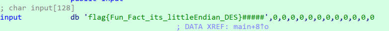

 flag{Fun_Fact_its_littleEndian_DES}#####  


## Week 2

# 1.Do you like to drink tea?
IDA打开，定位到main函数，魔改的TEA算法，delta值为1640531527，轮数32，我们的输入经过sub_401530函数，然后放在Block里，最后把进过加密的输入与v4数组进行对比

<!-- 这是一张图片，ocr 内容为： -->
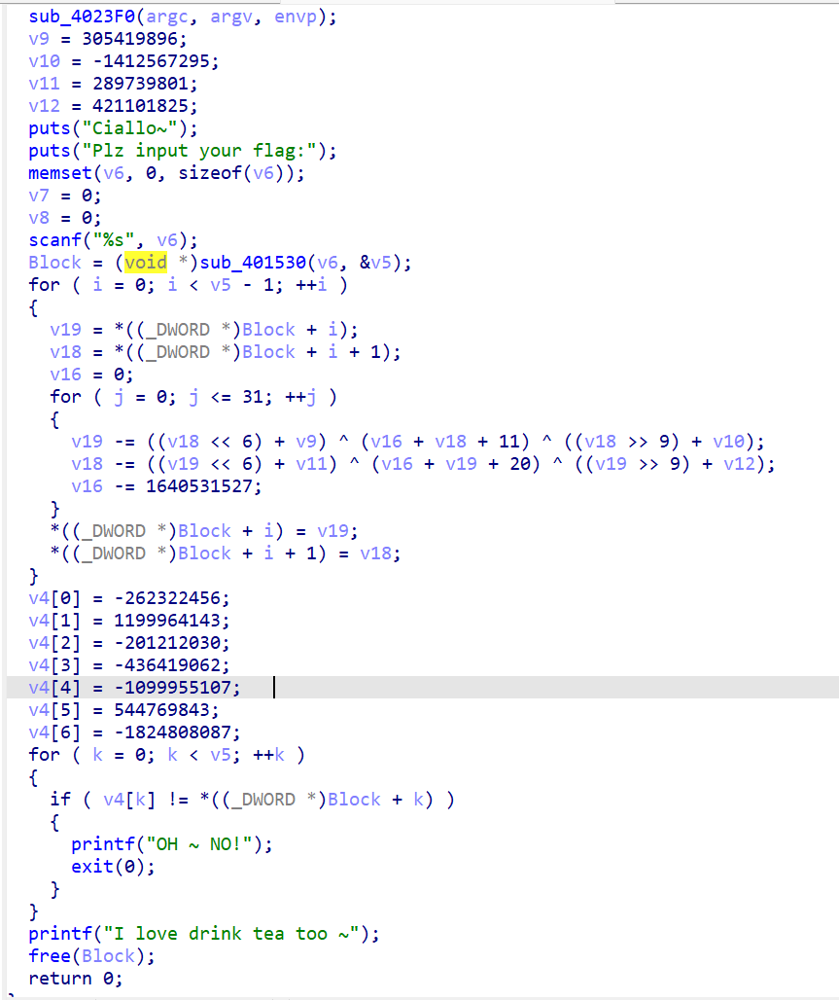

sub_401530函数是把我们的输入按4字节划分为小端的dword数组

<!-- 这是一张图片，ocr 内容为： -->
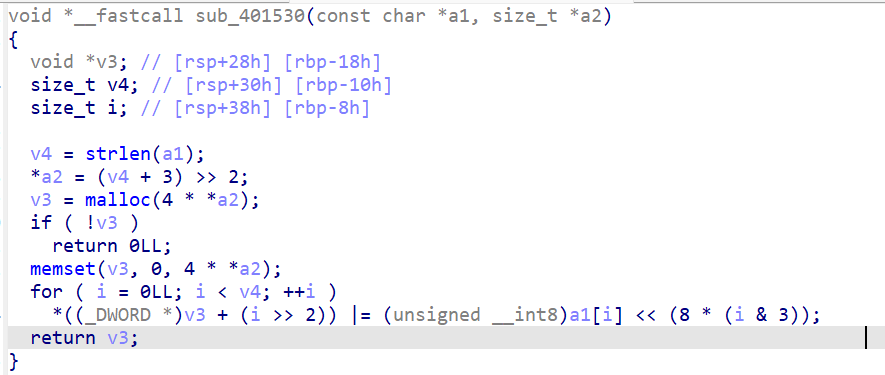

脚本

```python
import struct

DELTA = 1640531527
ROUNDS = 32

K0 = 305419896
K1 = 2882400001
K2 = 289739801
K3 = 421101825

def u32(x):
    return x & 0xFFFFFFFF

def inv_pair(a1, b1):
    sum_ = u32(-ROUNDS * DELTA)
    a = u32(a1)
    b = u32(b1)
    for _ in range(ROUNDS):
        sum_ = u32(sum_ + DELTA)
        t_b = u32(u32(a << 6) + K2) ^ u32(sum_ + a + 20) ^ u32((a >> 9) + K3)
        b = u32(b + t_b)
        t_a = u32(u32(b << 6) + K0) ^ u32(sum_ + b + 11) ^ u32((b >> 9) + K1)
        a = u32(a + t_a)
    return a, b

def dwords_to_bytes(arr):
    data = b''.join(struct.pack('<I', u32(x)) for x in arr)
    return data.rstrip(b'\x00')

final_u32 = [
    (-262322456) & 0xFFFFFFFF,
    (1199964143) & 0xFFFFFFFF,
    (-201212030) & 0xFFFFFFFF,
    (-436419062) & 0xFFFFFFFF,
    (-1099955107) & 0xFFFFFFFF,
    (544769843) & 0xFFFFFFFF,
    (-1824808087) & 0xFFFFFFFF,
]

x = final_u32[:]
for i in range(len(x) - 2, -1, -1):
    a0, b0 = inv_pair(x[i], x[i+1])
    x[i], x[i+1] = a0, b0

flag_bytes = dwords_to_bytes(x)
print(flag_bytes.decode('utf-8', errors='replace'))
```

flag{OH_I_L0VE_D3inK_Te4!!!}


# 2.rc4
IDA打开，main函数如下，是rc4加密

<!-- 这是一张图片，ocr 内容为： -->
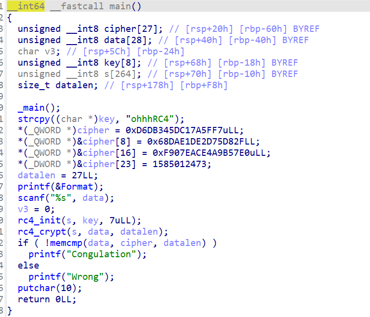

具体实现在rc4_init和rc4_crypt这两个函数里，与标准rc4的不同在于最后的结果再异或上k

<!-- 这是一张图片，ocr 内容为： -->
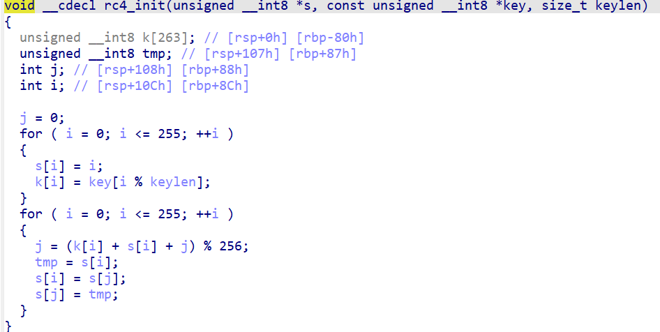

<!-- 这是一张图片，ocr 内容为： -->
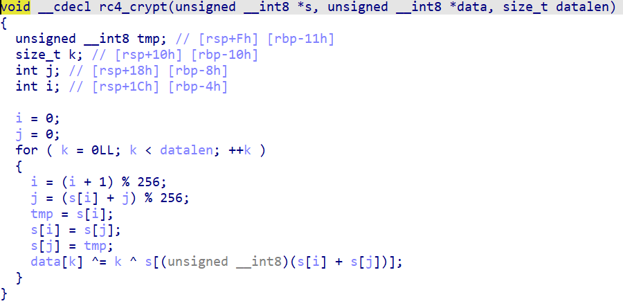

```python

def rc4_decrypt(key, data):
    s = list(range(256)); j = 0
    for i in range(256):
        j = (j + s[i] + key[i % len(key)]) & 0xff
        s[i], s[j] = s[j], s[i]
    i = j = 0
    out = bytearray(data)
    for k in range(len(out)):
        i = (i + 1) & 0xff
        j = (j + s[i]) & 0xff
        s[i], s[j] = s[j], s[i]
        out[k] ^= (k & 0xff) ^ s[(s[i] + s[j]) & 0xff]
    return bytes(out)

cipher = (
    int.to_bytes(0xD6DB345DC17A5FF7, 8, 'little') +
    int.to_bytes(0x68DAE1DE2D75D82F, 8, 'little') +
    int.to_bytes(0xF907EACE4A9B57E0, 8, 'little')
)
cipher = bytearray(cipher[:23] + int.to_bytes(1585012473, 4, 'little'))  # 总长27

plain = rc4_decrypt(b"ohhhRC4", cipher)
print(plain.decode(errors="ignore"))

```

flag{S0NNE_Rc4_l$_c13@nged}


# 3.base
IDA中打开main，确认是用自定义的Base64字母表编码并校验一段密文

<!-- 这是一张图片，ocr 内容为： -->
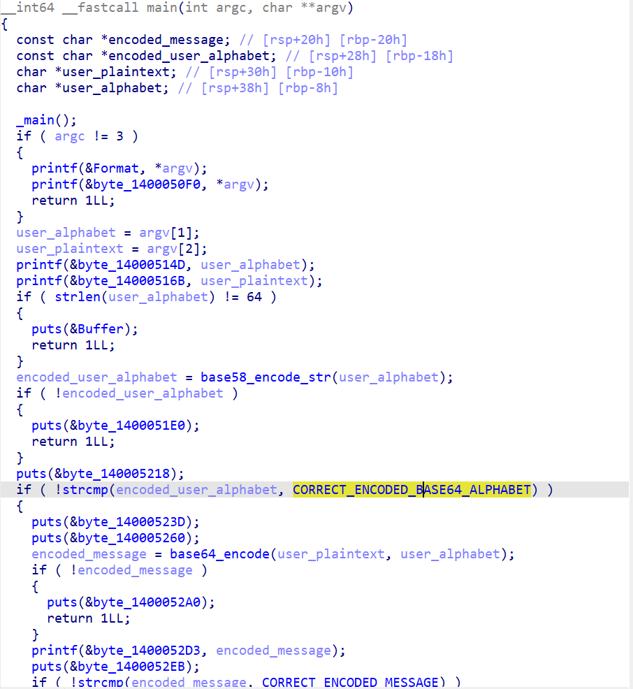

我们正确的base64是由正确的加密的base64密文经过base58解密得到

密文

<!-- 这是一张图片，ocr 内容为： -->
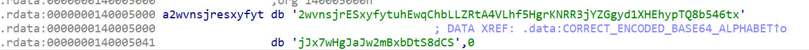

<!-- 这是一张图片，ocr 内容为： -->
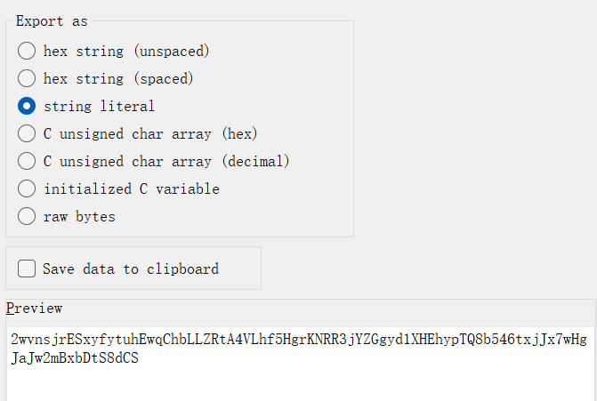

解密出正确的base64（abcdefghijklmnopqrstuvwxyzABCDEFGHIJKLMNOPQRSTUVWXYZ0123456789+/）

<!-- 这是一张图片，ocr 内容为： -->
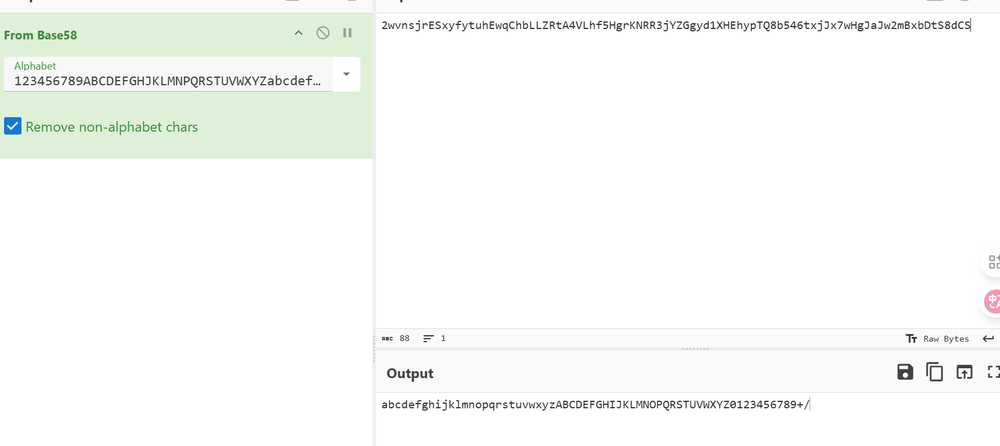


解密密文

<!-- 这是一张图片，ocr 内容为： -->
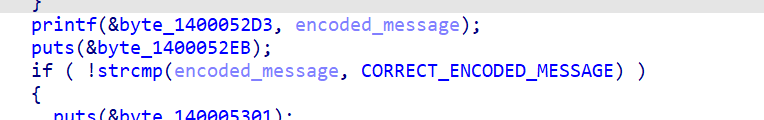

<!-- 这是一张图片，ocr 内容为： -->
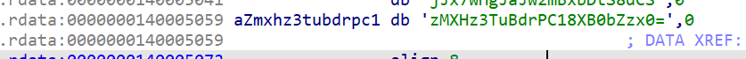

用我们得到的base64解密

<!-- 这是一张图片，ocr 内容为： -->
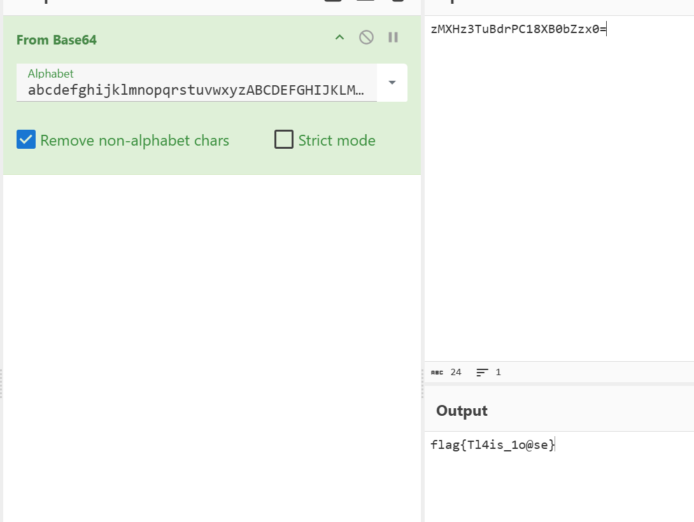

flag{Tl4is_1o@se}


# 4.pyc
先用pyinstxtractor.py 解出 pyc.exe_extracted

<!-- 这是一张图片，ocr 内容为： -->
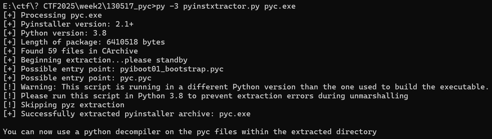

能看到所用版本是3.8，可能的入口点有两个pyiboot01_bootstrap.pyc和pyc.pyc

用decompyle3

<!-- 这是一张图片，ocr 内容为： -->


打开pyc.py，文件最下面

<!-- 这是一张图片，ocr 内容为： -->
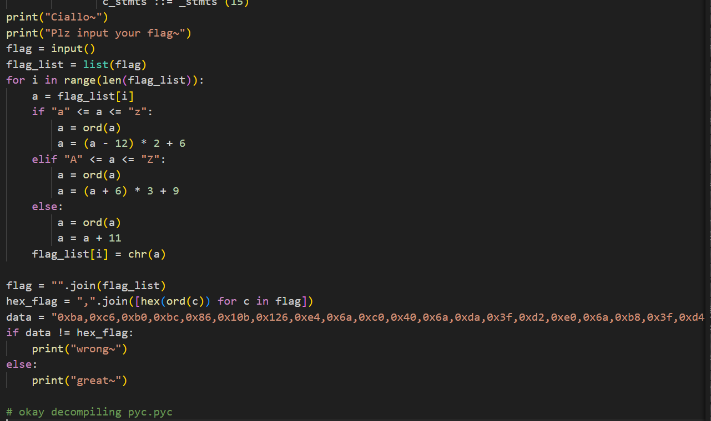

他会对三种字符分别处理，最后所有字符再hex(ord(c))，然后拼接

```python
data_str = "0xba,0xc6,0xb0,0xbc,0x86,0x10b,0x126,0xe4,0x6a,0xc0,0x40,0x6a,0xda,0x3f,0xd2,0xe0,0x6a,0xb8,0x3f,0xd4,0xe0,0x89,0x88"
values = [int(x, 16) for x in data_str.split(",")]

def invert_char(t: int) -> str:
    
    if (t - 6) % 2 == 0:
        cand = ((t - 6) // 2) + 12
        c = chr(cand)
        if 'a' <= c <= 'z':
            return c
    
    if (t - 9) % 3 == 0:
        cand = ((t - 9) // 3) - 6
        c = chr(cand)
        if 'A' <= c <= 'Z':
            return c
    
    c = chr(t - 11)
    return c

flag = ''.join(invert_char(t) for t in values)
print(flag)


def forward_t(c: str) -> int:
    o = ord(c)
    if 'a' <= c <= 'z':
        return (o - 12) * 2 + 6
    elif 'A' <= c <= 'Z':
        return (o + 6) * 3 + 9
    else:
        return o + 11

hex_join = ",".join(hex(forward_t(c)) for c in flag)

```

flag{PYC_i5_v4ry_e4sy~}


# 5.螺旋密码机
JADX中打开mainactivity，看来存在native层

<!-- 这是一张图片，ocr 内容为： -->
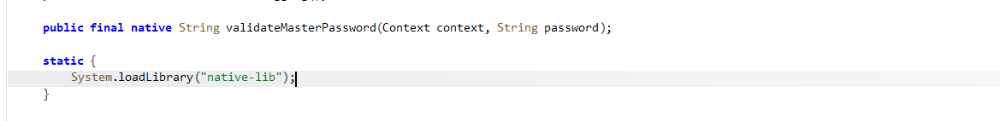

apktool反编译

<!-- 这是一张图片，ocr 内容为： -->
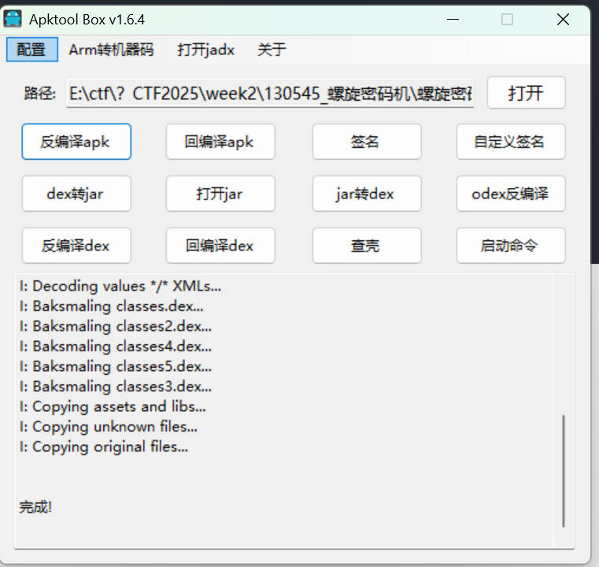

IDA打开so文件，直接定位上面提到的方法

<!-- 这是一张图片，ocr 内容为： -->
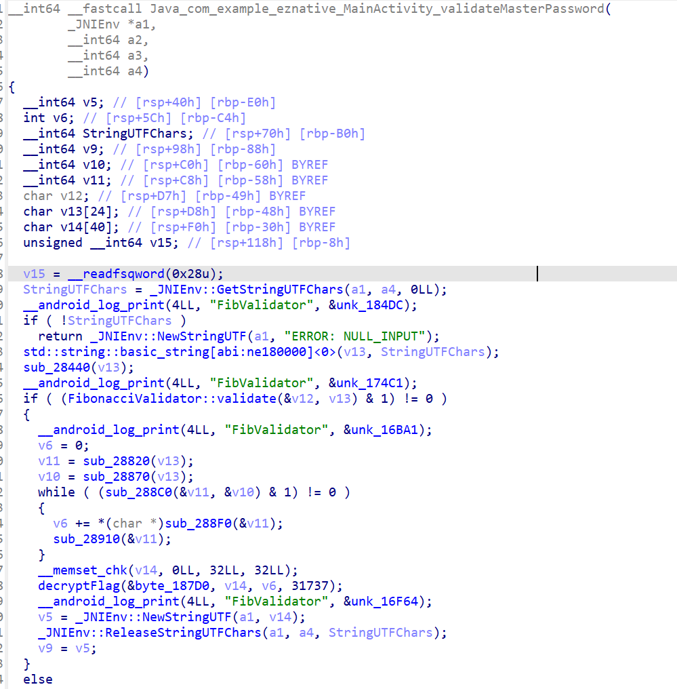

题目的基本逻辑是生成一个随机数列，和为31737执行decryptflag函数

<!-- 这是一张图片，ocr 内容为： -->
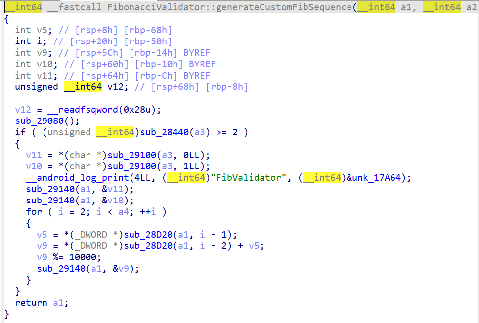

<!-- 这是一张图片，ocr 内容为： -->
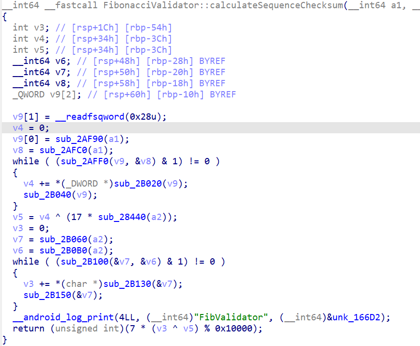

我们直接看decryptflag，重点在a3未知，也就是main中的v6

<!-- 这是一张图片，ocr 内容为： -->
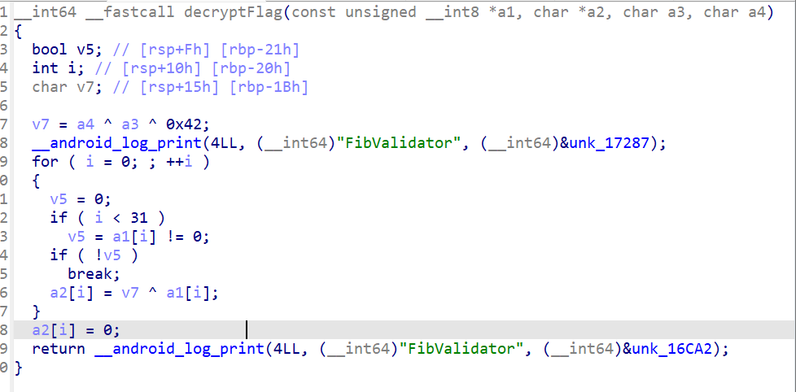

v6把每个字符当 char 相加的总和，传给 decryptFlag 时取低 8 位 

<!-- 这是一张图片，ocr 内容为： -->
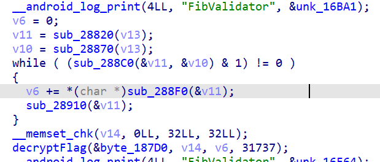

+ 自定义序列 fib ：
+ 长度为 len(password) // 2 + len(password) 。
+ 前两项是 ord(password[0]) 和 ord(password[1]) 。
+ 之后每一项为前两项之和对 10000 取模。
+ 计算中间值：
+ fib_sum = sum(fib)
+ pwd_len = len(password)
+ v5 = fib_sum ^ (17 * pwd_len)
+ ascii_sum = sum(ord(c) for c in password)
+ 最终得到：
+ v6 = 7 * (ascii_sum ^ v5) % 65536

```python
def generate_custom_fib_sequence(password):
    length = len(password) // 2 + len(password)
    fib = [ord(password[0]), ord(password[1])]
    for i in range(2, length):
        fib.append((fib[i-1] + fib[i-2]) % 10000)
    return fib

def calculate_v6(password):
    fib = generate_custom_fib_sequence(password)
    fib_sum = sum(fib)
    v5 = fib_sum ^ (17 * len(password))
    ascii_sum = sum(ord(c) for c in password)
    v6 = 7 * (ascii_sum ^ v5) % 65536
    return v6

print(calculate_v6("yourpass"))
```

v6为29354，取余后就是51

密文

<!-- 这是一张图片，ocr 内容为： -->
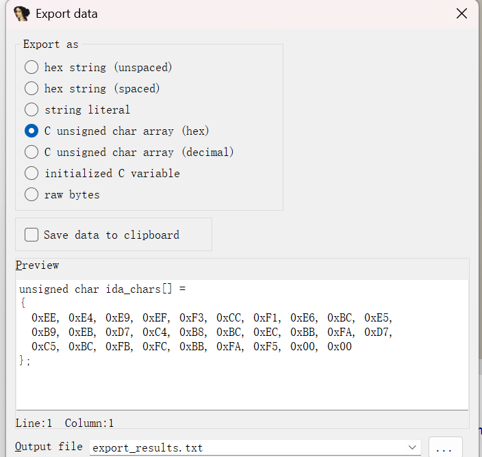

解密脚本

```python
data = [0xEE,0xE4,0xE9,0xEF,0xF3,0xCC,0xF1,0xE6,0xBC,0xE5,0xB9,0xEB,0xD7,0xC4,0xB8,0xBC,0xEC,0xBB,0xFA,0xD7,0xC5,0xBC,0xFB,0xFC,0xBB,0xFA,0xF5,0x00]

cipher = bytes(data[:data.index(0)])
a3 = 51                 
a4 = 31737 & 0xFF       
v7 = a4 ^ a3 ^ 0x42     

plain = bytes(b ^ v7 for b in cipher)
print(plain.decode('ascii'))

```

flag{Dyn4m1c_L04d3r_M4st3r}


# 6.upx
这是一道手动脱壳题，这里用x64dbg+scylla

x64dbg打开是这样

<!-- 这是一张图片，ocr 内容为： -->
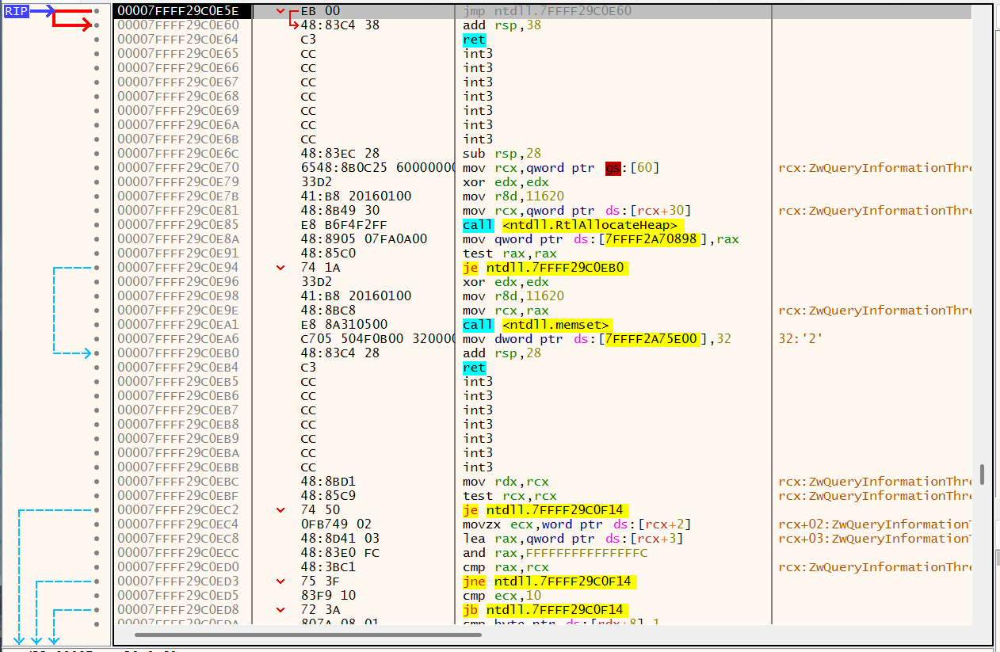

F9运行，找到入口

<!-- 这是一张图片，ocr 内容为： -->
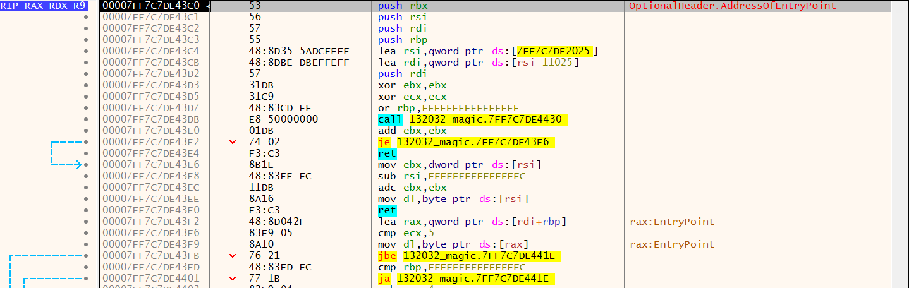

F7单步执行，走完入栈，观察ESP的地址

<!-- 这是一张图片，ocr 内容为： -->
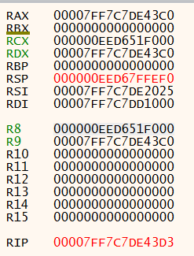

右键该地址，在内存窗口打开

<!-- 这是一张图片，ocr 内容为： -->
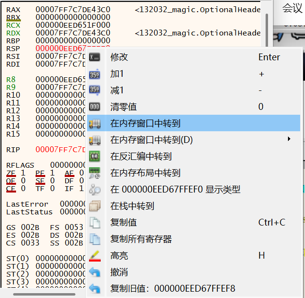

然后右键栈顶，设置硬件断点（访问，4字节）

<!-- 这是一张图片，ocr 内容为： -->
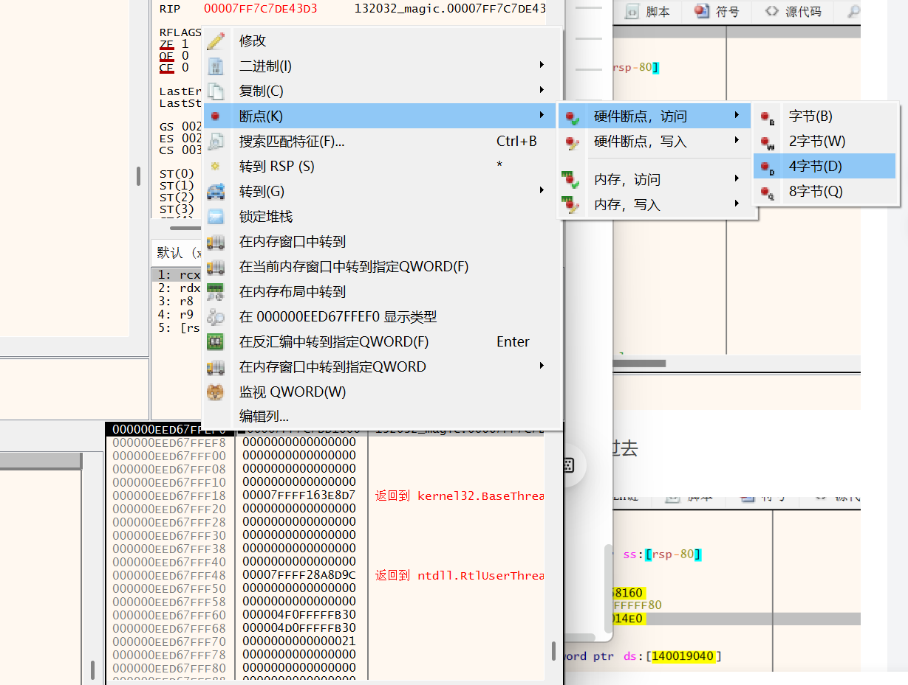

设置完之后，F9运行就到了

<!-- 这是一张图片，ocr 内容为： -->
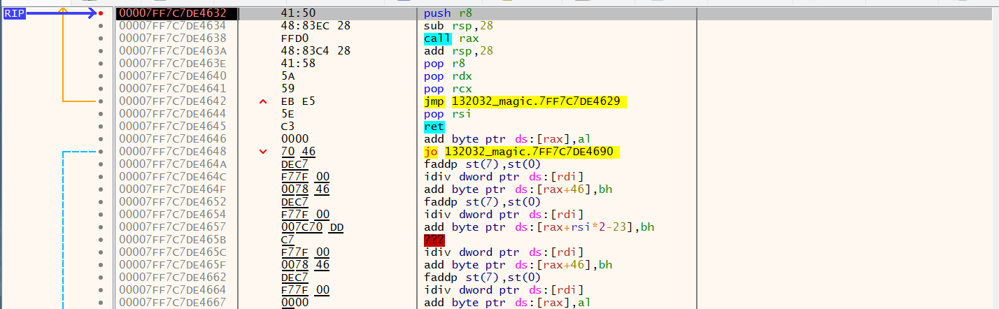

看到jmp大跳，跳过去，找到这个，在跳过去

<!-- 这是一张图片，ocr 内容为： -->
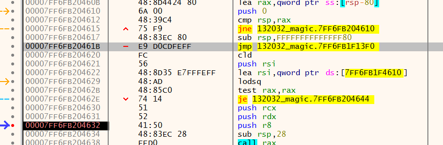

就能看到这个了，能看到让输入flag，这里就是我们要找的

<!-- 这是一张图片，ocr 内容为： -->
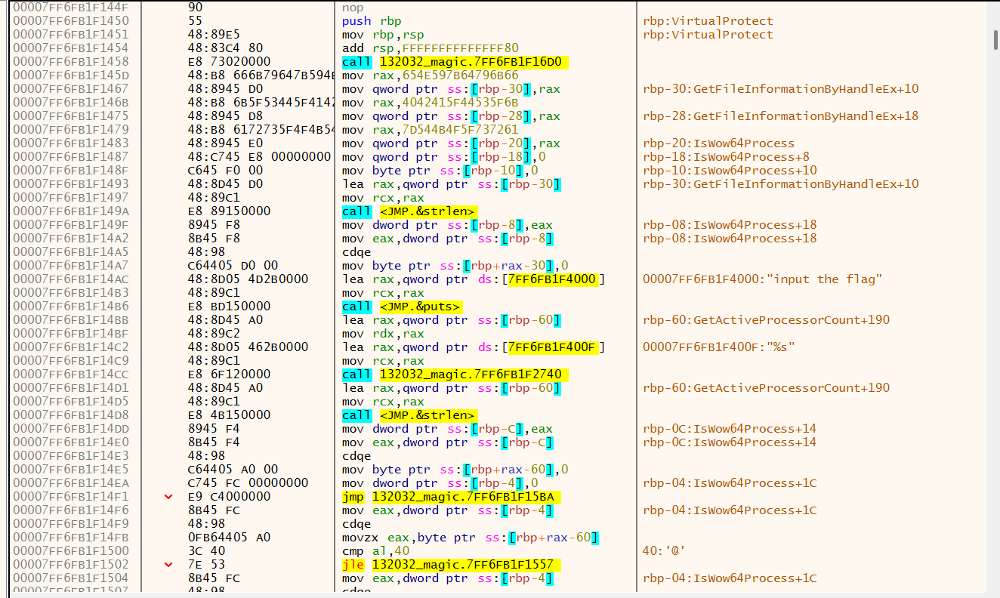

打开scylla，附件给程序

把地址输入，点IAT Autosearch  之后点Get Imports删除冒红，点击dump

<!-- 这是一张图片，ocr 内容为： -->
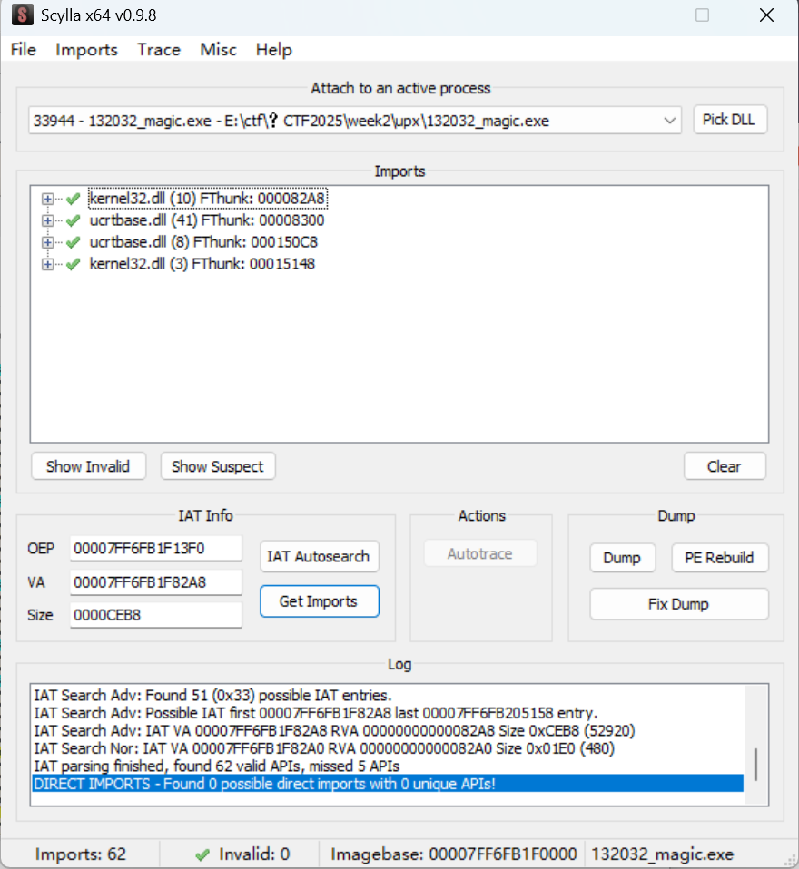

之后再对dump出的文件Fix一下

IDA打开修改后的,字符串搜索

<!-- 这是一张图片，ocr 内容为： -->


点进去，看到flag加密逻辑，对输入进行主字符变换

<!-- 这是一张图片，ocr 内容为： -->
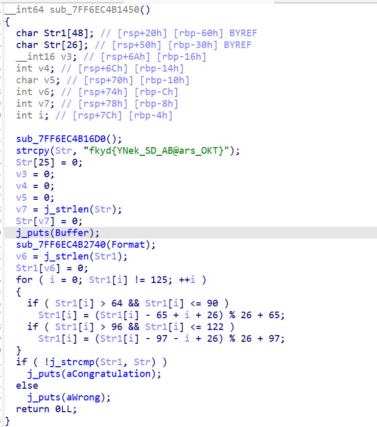

脚本

```python
def invert(mut: str) -> str:
    out = []
    i = 0
    for ch in mut:
        if ch == '}':
            out.append(ch)
            break
        code = ord(ch)
        if 65 <= code <= 90:   # uppercase: inverse of (+ i)
            out.append(chr(((code - 65 - i + 26) % 26) + 65))
        elif 97 <= code <= 122:  # lowercase: inverse of (- i)
            out.append(chr(((code - 97 + i + 26) % 26) + 97))
        else:
            out.append(ch)
        i += 1
    return ''.join(out)

mut = "fkyd{YNek_SD_AB@ars_OKT}"
orig = invert(mut)
print("Flag:", orig)
```

flag{THls_IS_NN@qik_UPX}


# 7.flowers
去花指令题

IDA打开后会看到有两处花指令，以及许多字节序列，按u再按c

共有

第一处花指令

<!-- 这是一张图片，ocr 内容为： -->
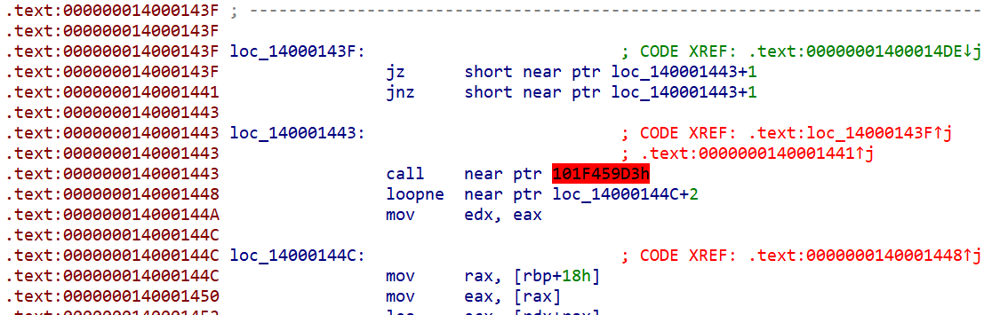

第二处

<!-- 这是一张图片，ocr 内容为： -->
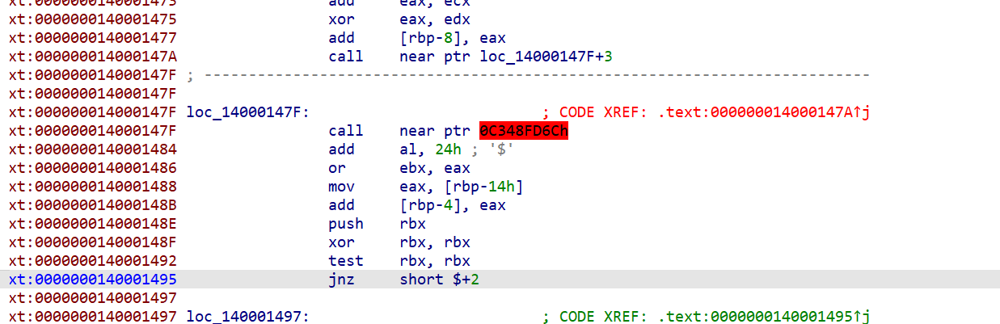

第三处

<!-- 这是一张图片，ocr 内容为： -->
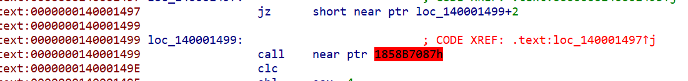

第四处

<!-- 这是一张图片，ocr 内容为： -->
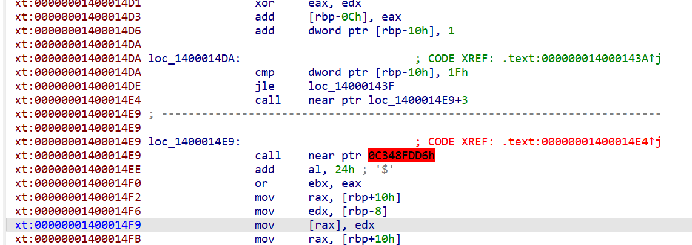

第五处

<!-- 这是一张图片，ocr 内容为： -->
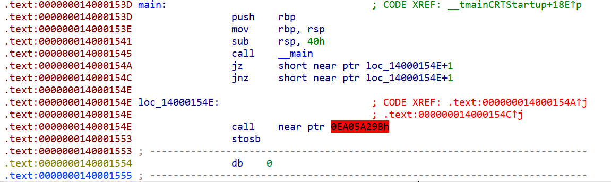

第六处

<!-- 这是一张图片，ocr 内容为： -->
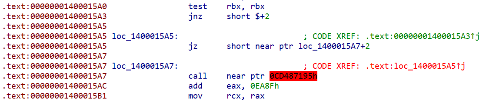

第七处

<!-- 这是一张图片，ocr 内容为： -->
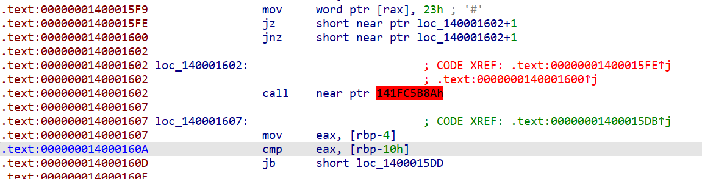

第八处

<!-- 这是一张图片，ocr 内容为： -->
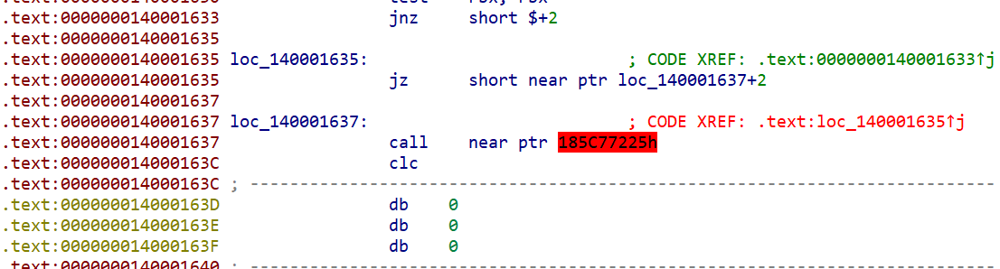

第九处

<!-- 这是一张图片，ocr 内容为： -->
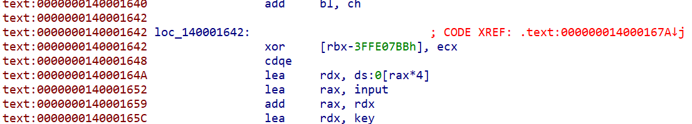

第十处

<!-- 这是一张图片，ocr 内容为： -->
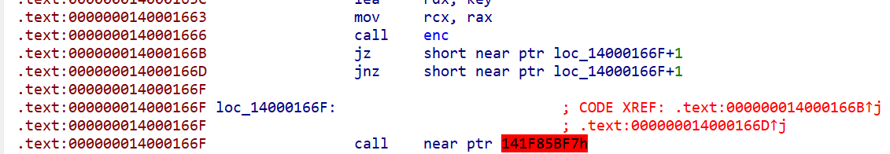

第十一处和第十二处

<!-- 这是一张图片，ocr 内容为： -->
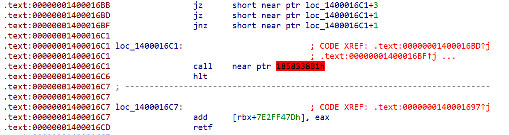

去完花指令，F5，main函数

<!-- 这是一张图片，ocr 内容为： -->
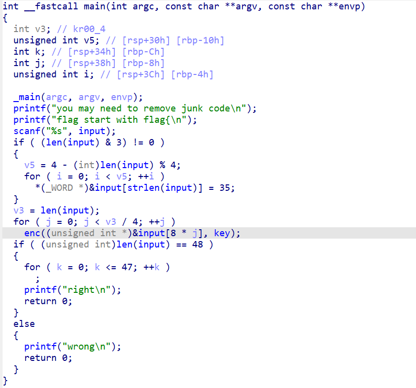

enc函数，变种的TEA，delta值为1131796

<!-- 这是一张图片，ocr 内容为： -->
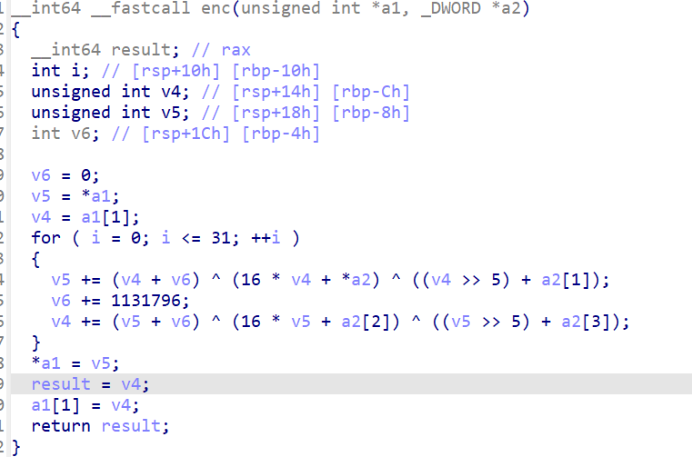

key和目标数组

<!-- 这是一张图片，ocr 内容为： -->
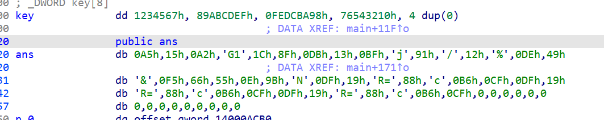

脚本

```python
import struct

def dec(block, key):
    v5, v4 = block
    v6 = 1131796 * 32
    for i in range(32):
        v4 = (v4 - ((v5 + v6) ^ (16*v5 + key[2]) ^ ((v5 >> 5) + key[3]))) & 0xFFFFFFFF
        v6 = (v6 - 1131796) & 0xFFFFFFFF
        v5 = (v5 - ((v4 + v6) ^ (16*v4 + key[0]) ^ ((v4 >> 5) + key[1]))) & 0xFFFFFFFF
    return v5, v4

key = [0x01234567, 0x89ABCDEF, 0x0FEDCBA98, 0x76543210]

ans_hex = (
    "A5 15 A2 47 31 1C 8F DB"
    " 13 BF 6A 91 2F 12 25 DE"
    " 49 26 F5 66 55 0E 9B 4E"
    " DF 19 52 3D 88 63 B6 CF"
    " DF 19 52 3D 88 63 B6 CF"
    " DF 19 52 3D 88 63 B6 CF"
    " 00 00 00 00 00 00 00 00"
    " 00 00 00 00 00 00 00 00"
    " 00 00 00 00 00 00 00 00"
    " 00 00 00 00 00 00 00 00"
    " 00 00 00 00 00 00 00 00"
    " 00 00 00 00 00 00 00 00"
)

ans_bytes = bytes([int(b, 16) for b in ans_hex.split()])
flag_bytes = b""

for i in range(0, 48, 8):  
    block = struct.unpack("<II", ans_bytes[i:i+8])
    dec_block = dec(block, key)
    flag_bytes += struct.pack("<II", *dec_block)

print(flag_bytes)
print(flag_bytes.rstrip(b"#").decode(errors="ignore"))  
```

flag{aCupOf_FlowerTea} （#不影响）


# 8.CPPReverse
IDA中打开main函数，开头会做检验，长度要大于等于6

<!-- 这是一张图片，ocr 内容为： -->
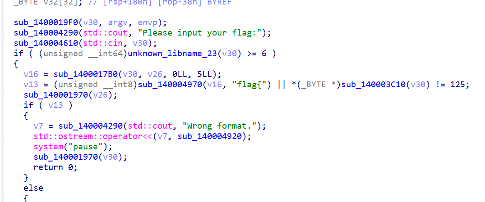

sub_1400017B0取子串

sub_140003320调用sub_140003380，然后sub_140003380在调用sub_140001620两位一组取值来实现HEX→字节转换

<!-- 这是一张图片，ocr 内容为： -->
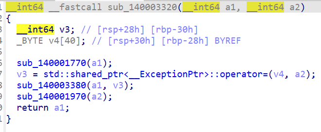

<!-- 这是一张图片，ocr 内容为： -->
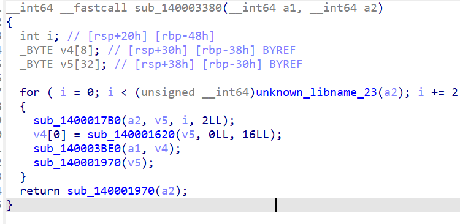

sub_140003530对每个字节执行顺序相关的三步变换：

+ 加法： b[i] = (b[i] + i + 7) mod 256
+ 依赖前一位的异或： if i > 0: b[i] ^= (b[i-1] - 1) （注意这里的 b[i-1] 是已经完成此前全部变换后的值）
+ 偶数位再异或： if i % 2 == 0: b[i] ^= 0x07

<!-- 这是一张图片，ocr 内容为： -->
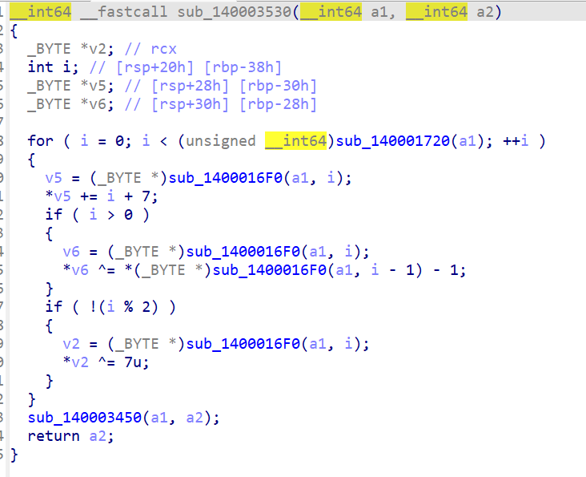

通过sub_140003450函数再将字节转为16进制串

<!-- 这是一张图片，ocr 内容为： -->
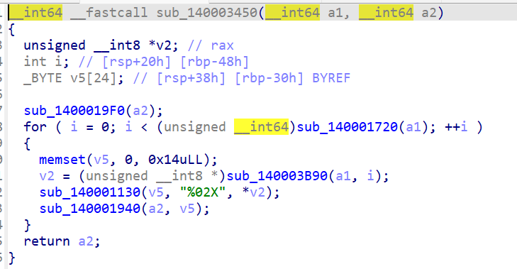

最后比较

<!-- 这是一张图片，ocr 内容为： -->
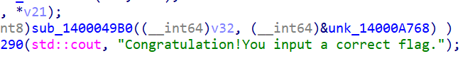

对unk_14000A768交叉引用

<!-- 这是一张图片，ocr 内容为： -->
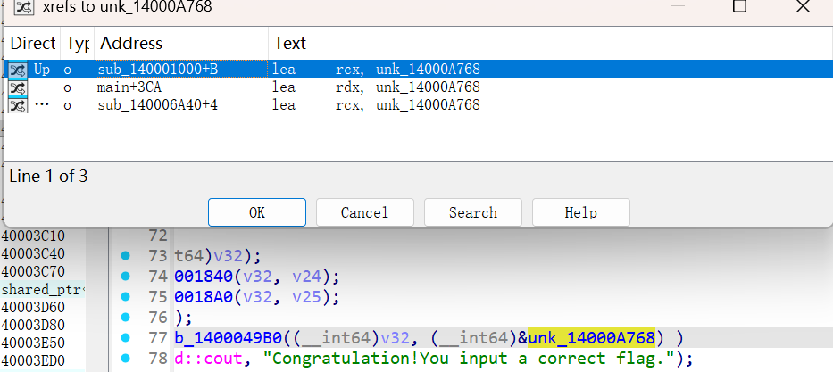

打开sub_140001000函数，看到密文

<!-- 这是一张图片，ocr 内容为： -->
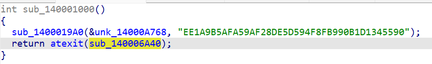

解题脚本

```python
def transform(C: str) -> str:
    
    T = ''.join(reversed(C))

  
    p = [int(T[i:i+2], 16) for i in range(0, len(T), 2)]

    x = []
    for i, val in enumerate(p):
        tmp = val
        if i % 2 == 0:           
            tmp ^= 7
        if i > 0:                
            prev = p[i - 1]
            tmp ^= ((prev - 1) & 0xFF)

        orig = tmp - (i + 7)     
        if orig < 0:
            orig += 256          
        x.append(orig % 256)

    
    Srev = ''.join(f'{b:02X}' for b in x)
    S = ''.join(reversed(Srev))
    return S

def main():
    C = 'EE1A9B5AFA59AF28DE5D594F8FB990B1D1345590'  
    S = transform(C)
    print(f'flag{{{S}}}')

if __name__ == '__main__':
    main()

```

flag{4350505F526576657253655F4578705F55705570}


## Week 1

# 1.8086ASM
用010打开

<!-- 这是一张图片，ocr 内容为： -->
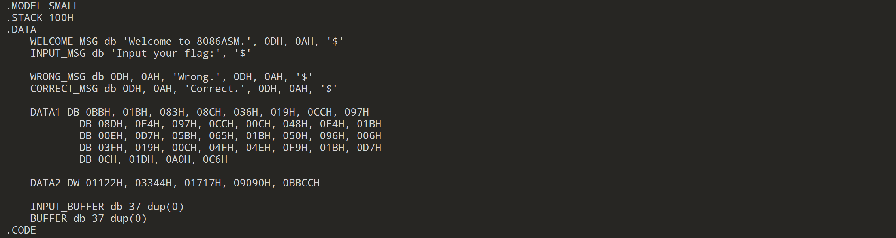

完整汇编

```text
.MODEL SMALL
.STACK 100H
.DATA
    WELCOME_MSG db 'Welcome to 8086ASM.', 0DH, 0AH, '$'
    INPUT_MSG db 'Input your flag:', '$'

    WRONG_MSG db 0DH, 0AH, 'Wrong.', 0DH, 0AH, '$'
    CORRECT_MSG db 0DH, 0AH, 'Correct.', 0DH, 0AH, '$' 

    DATA1 DB 0BBH, 01BH, 083H, 08CH, 036H, 019H, 0CCH, 097H
            DB 08DH, 0E4H, 097H, 0CCH, 00CH, 048H, 0E4H, 01BH
            DB 00EH, 0D7H, 05BH, 065H, 01BH, 050H, 096H, 006H
            DB 03FH, 019H, 00CH, 04FH, 04EH, 0F9H, 01BH, 0D7H
            DB 0CH, 01DH, 0A0H, 0C6H

    DATA2 DW 01122H, 03344H, 01717H, 09090H, 0BBCCH 

    INPUT_BUFFER db 37 dup(0)
    BUFFER db 37 dup(0)
.CODE

START:
    MOV AX, @DATA
    MOV DS, AX
    MOV AH, 09H
    MOV DX, OFFSET WELCOME_MSG
    INT 21H
    MOV DX, OFFSET INPUT_MSG
    INT 21H
    MOV AH,0AH
    MOV DX, OFFSET INPUT_BUFFER
    MOV BYTE PTR[INPUT_BUFFER], 37
    INT 21H
    CALL ENCRYPT
    MOV DI, OFFSET DATA1
    MOV SI, OFFSET INPUT_BUFFER + 2
    MOV CX, 35
LOOP1:
    MOV AX, [DI]
    CMP AX, [SI]
    JNE WRONG_EXIT
    INC DI
    INC SI
    LOOP LOOP1
    JMP CORRECT_EXIT
WRONG_EXIT:
    MOV AH,09H
    LEA DX,WRONG_MSG
    INT 21H
    JMP EXIT
CORRECT_EXIT:
    MOV AH,09H
    LEA DX,CORRECT_MSG
    INT 21H
    JMP EXIT
EXIT:
    MOV AX, 4C00H
    INT 21H
ENCRYPT PROC
    PUSH AX
    PUSH BX
    PUSH CX
    MOV SI, OFFSET INPUT_BUFFER + 2
    MOV BX, OFFSET DATA2
    MOV CX, 35
LOOP2:
    PUSH CX
    MOV CL, 2
    MOV AL, [SI]
    ROR AL, CL
    POP CX
    MOV [SI], AL
    MOV AX, WORD PTR[SI]
    XOR AX, WORD PTR[BX]
    MOV WORD PTR[SI], AX
    INC SI
    ADD BX, 2
    CMP BX, OFFSET DATA2 + 10
    JNE CASE1
    MOV BX, OFFSET DATA2 
CASE1:
    LOOP LOOP2
    POP CX
    POP BX
    POP AX
    RET
ENCRYPT ENDP 

END START
```

密文密钥

<!-- 这是一张图片，ocr 内容为： -->
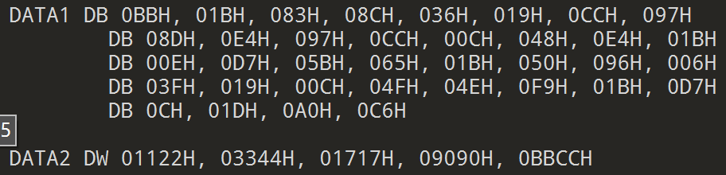

脚本

```python

DATA1 = [0xBB,0x1B,0x83,0x8C,0x36,0x19,0xCC,0x97,0x8D,0xE4,0x97,0xCC,0x0C,0x48,0xE4,0x1B,
         0x0E,0xD7,0x5B,0x65,0x1B,0x50,0x96,0x06,0x3F,0x19,0x0C,0x4F,0x4E,0xF9,0x1B,0xD7,
         0x0C,0x1D,0xA0,0xC6]
keys = [0x1122,0x3344,0x1717,0x9090,0xBBCC]
klo = [k & 0xFF for k in keys]
khi = [(k >> 8) & 0xFF for k in keys]
rol2 = lambda x: ((x<<2)&0xFF) | (x>>6)

S = DATA1[:]
P = [0]*36
for i in range(34, -1, -1):
    j = i % 5
    V = rol2(S[i] ^ klo[j])
    P[i] = V ^ (khi[(i-1)%5] if i>0 else 0)
    S[i]   = V
    S[i+1] = S[i+1] ^ khi[j]
P[35] = S[35]
print(bytes(P))


```

flag{W31c0m3_t0_8086_A5M_W0RlD___!!}

# 2.ezCSharp
用dnspy打开，找到这个打开，看到入口点在Program.Main

<!-- 这是一张图片，ocr 内容为： -->


<!-- 这是一张图片，ocr 内容为： -->
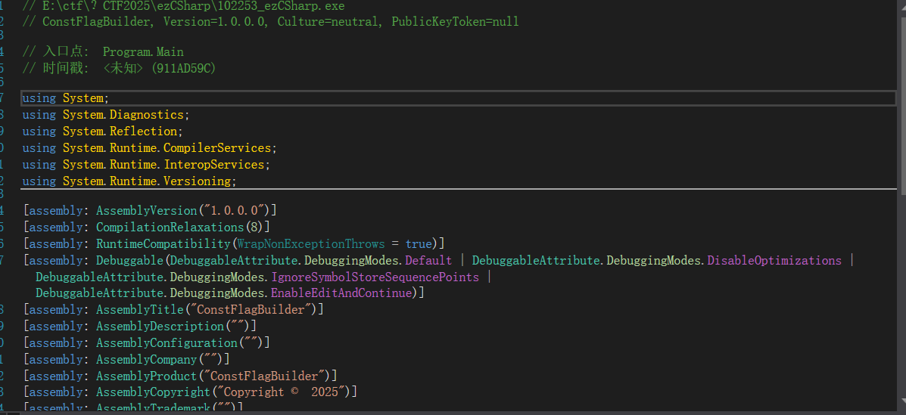

在左侧边栏打开

<!-- 这是一张图片，ocr 内容为： -->
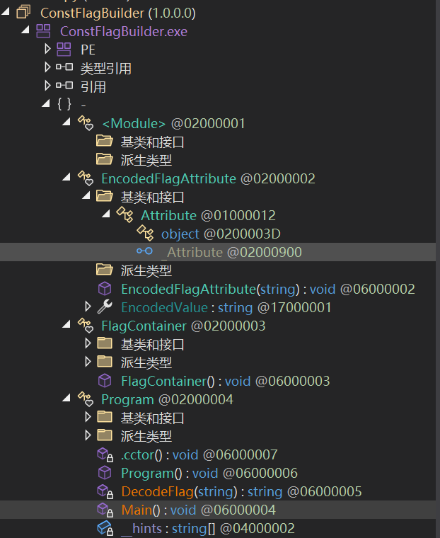

<!-- 这是一张图片，ocr 内容为： -->
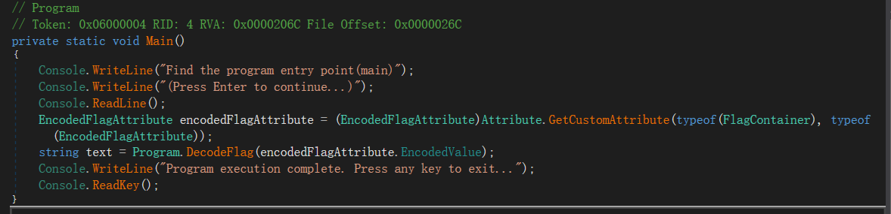

最主要的在这，打开

<!-- 这是一张图片，ocr 内容为： -->
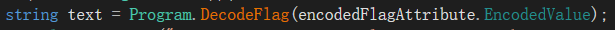

<!-- 这是一张图片，ocr 内容为： -->
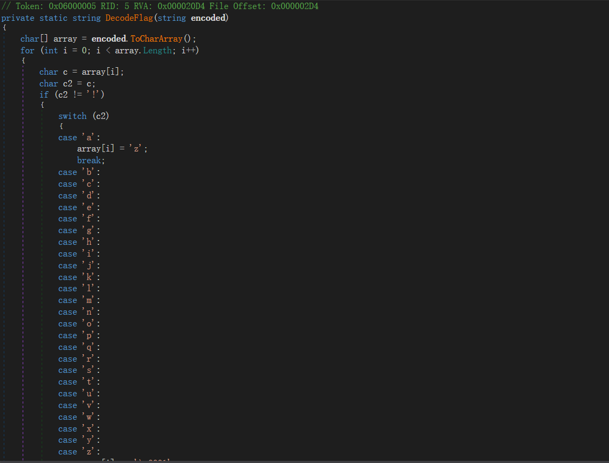

<!-- 这是一张图片，ocr 内容为： -->
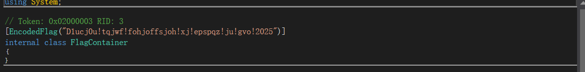

现在我们就按照加密逻辑中方式对该字符串进行操作

```python
def decode_flag(encoded: str) -> str:
    out = []
    for c in encoded:
        if c == '!':
            out.append('_')
        elif 'a' <= c <= 'z':
            out.append('z' if c == 'a' else chr(ord(c) - 1))
        else:
            out.append(c)
    return ''.join(out)

if __name__ == "__main__":
    enc = "D1ucj0u!tqjwf!fohjoffsjoh!xj!epspqz!ju!gvo!2025"  
    dec = decode_flag(enc)
    print("Decoded:", dec)
    if not dec.startswith("flag{"):
        print("Flag form: flag{" + dec + "}")

```

flag{D1tbi0t_spive_engineering_wi_doropy_it_fun_2025}


# 3.ezcalculate
IDA打开，定位带main函数

<!-- 这是一张图片，ocr 内容为： -->
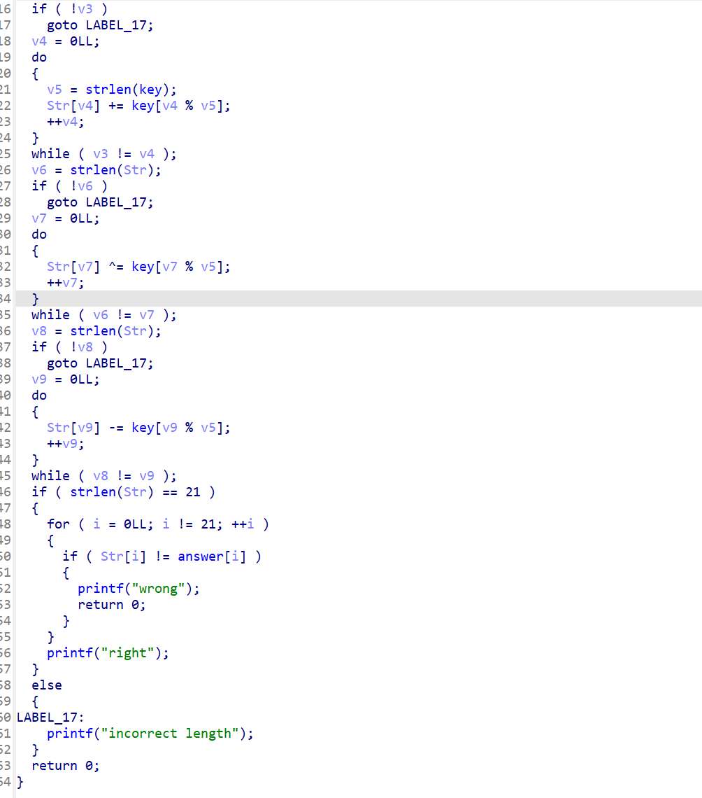

关键加密在这，key的长度是21

<!-- 这是一张图片，ocr 内容为： -->
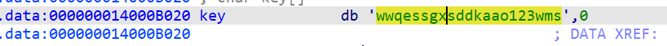

对输入 `Str` 做三步逐字节处理（按 `key` 循环取字节）：

1. `t1 = s + k`
2. `t2 = t1 ^ k`
3. `out = t2 - k`

最后的结果在于answer中字节做对比（取前21字节）

<!-- 这是一张图片，ocr 内容为： -->
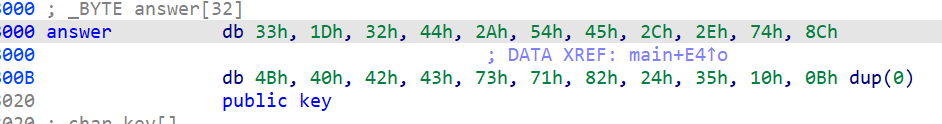

脚本

```python
key = b"wwqessgxsddkaao123wms"
answer = bytes([
    0x33, 0x1d, 0x32, 0x44, 0x2a, 0x54, 0x45, 0x2c, 0x2e,
    0x74, 0x8c, 0x4b, 0x40, 0x42, 0x43, 0x73, 0x71, 0x82,
    0x24, 0x35, 0x10,
])

def decrypt(ans, key):
    n, m = len(ans), len(key)
    s = bytearray(n)
    for i in range(n):
        k = key[i % m]
        t2 = (ans[i] + k) & 0xFF
        t1 = t2 ^ k
        s[i] = (t1 - k) & 0xFF
    return bytes(s)

print(decrypt(answer, key).decode('latin1'))

```

flag{Add_X0r_and_Sub}


# 4.jvav_release
JADX中看到mainactivity

<!-- 这是一张图片，ocr 内容为： -->
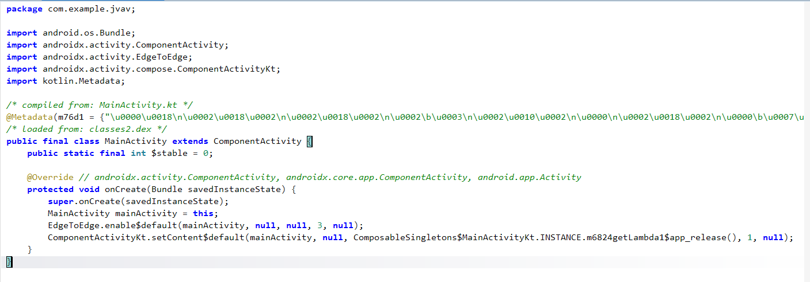

看到这里，说明主函数是从MainActivity.kt中反编译出来的

<!-- 这是一张图片，ocr 内容为： -->
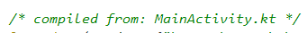

查看MainActivity.kt，在最下面，看到调用了 com.utilis.enc.EncKt.checker(String) 

<!-- 这是一张图片，ocr 内容为： -->
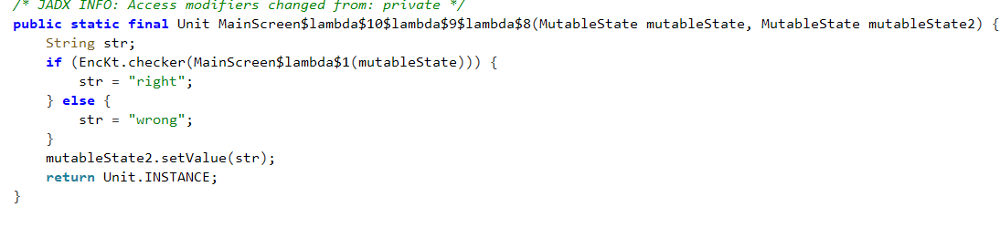

接着去查看，找到真正加密逻辑

<!-- 这是一张图片，ocr 内容为： -->
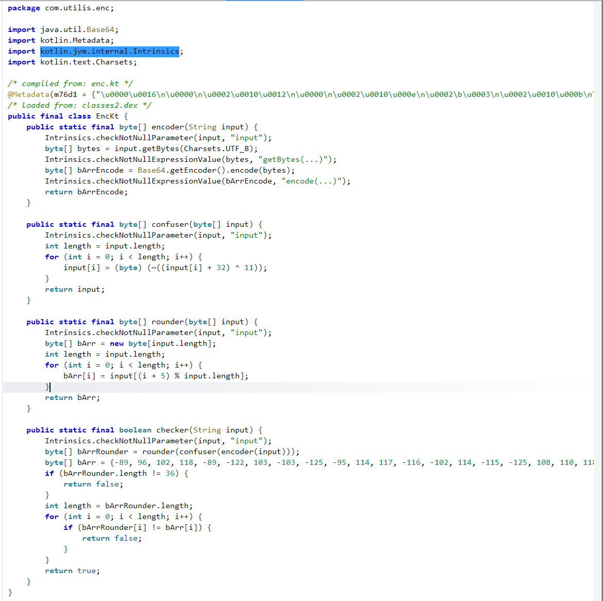

脚本

```python
import base64
signed=[-89, 96, 102, 118, -89, -122, 103, -103, -125, -95, 114, 117, -116, -102, 114, -115, -125, 108, 110, 118, -91, -83, 101, -115, -116, -114, 124, 114, -123, -87, -87, -114, 121, 108, 124, -114]

b=bytes([(x+256)%256 for x in signed])
n=len(b)

temp=bytearray(n)
for j in range(n):
    temp[j]=b[(j-5)%n]

e=bytearray(n)
for i in range(n):
    val=((~temp[i])&0xFF)^11
    e[i]=(val-32)&0xFF

decoded=base64.b64decode(bytes(e))         
print(decoded.decode('utf-8'))
```

flag{kotl1n_is_also_java}


# 5.test
IDA打开定位到main函数

<!-- 这是一张图片，ocr 内容为： -->
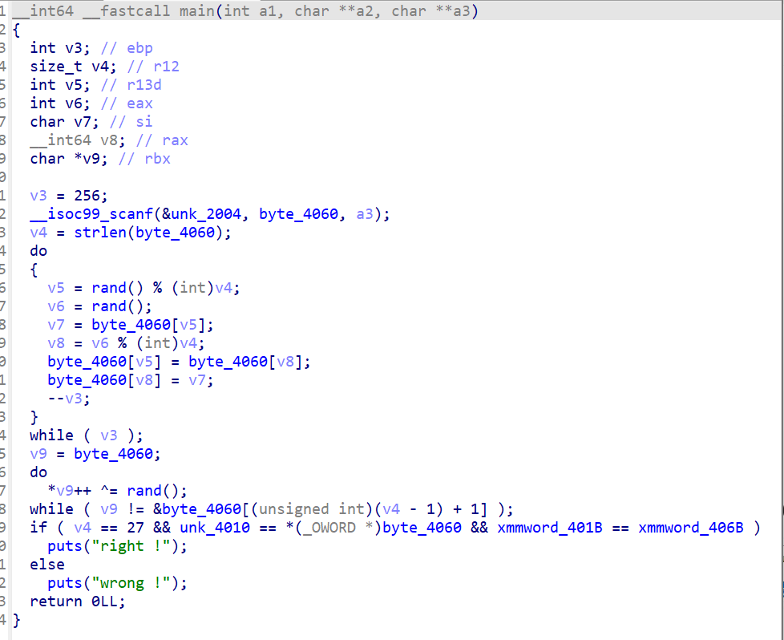

查看字符串，可以看到用的是Glibc库

<!-- 这是一张图片，ocr 内容为： -->


种子设置在sub_10E0函数中，即12345

<!-- 这是一张图片，ocr 内容为： -->
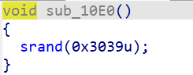

最后会把我们输入的解密结果低位块与unk_4010对比，高位快与xmmword_401B对比

<!-- 这是一张图片，ocr 内容为： -->
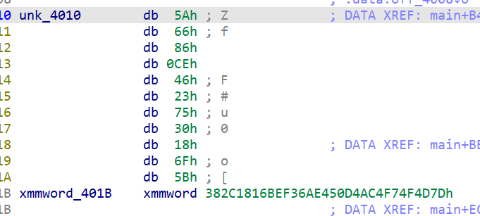

脚本

```python
Y = bytes([0x5A,0x66,0x86,0xCE,0x46,0x23,0x75,0x30,0x18,0x6F,0x5B,
           0x7D,0x4D,0x4F,0xF7,0xC4,0x4A,0x0D,0x45,0xAE,0x36,0xEF,
           0x6B,0x81,0xC1,0x82,0x03])
N, SEED = 27, 0x3039

def glibc_rand(seed):
    MOD31=2147483647; r=[0]*344; r[0]=seed & 0xffffffff
    for i in range(1,31): r[i]=(16807*(r[i-1]&0xffffffff))%MOD31; r[i]+=MOD31 if r[i]<0 else 0
    for i in range(31,34): r[i]=r[i-31]
    for i in range(34,344): r[i]=(r[i-3]+r[i-31])&0xffffffff
    n=344
    while True:
        x=(r[(n-3)%344]+r[(n-31)%344])&0xffffffff; r[n%344]=x; n+=1
        yield (x>>1)&0x7fffffff

def solve(y):
    rng=glibc_rand(SEED)
    swaps=[(next(rng)%N, next(rng)%N) for _ in range(256)]
    z=bytearray(y)
    for i in range(N): z[i]^=next(rng)&0xFF
    for p,q in reversed(swaps): z[p],z[q]=z[q],z[p]
    return bytes(z)

print(solve(Y).decode())
```

flag{there_1s_s0_many_rand}


# 6.PlzdebugMe
IDA打开，shift+F12查看字段串，在sub_401697

<!-- 这是一张图片，ocr 内容为： -->
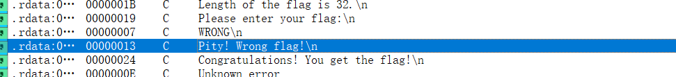

打开flag长度是32，会先进行格式检验，然后对输入进行加密，最后比对

<!-- 这是一张图片，ocr 内容为： -->
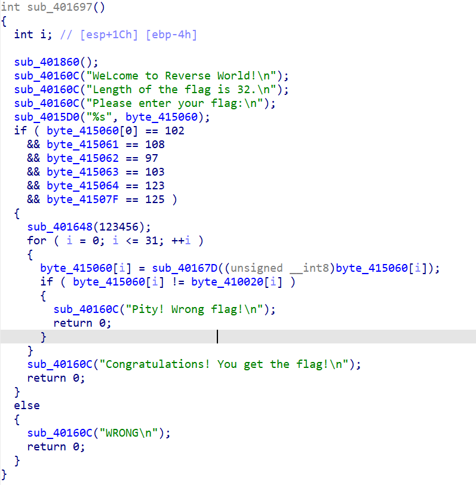

最重要的有三个数组

- 随机状态 ： dword_415080 @ 0x415080 （LCG 状态，每步更新一次）。

- 目标数组 ： byte_410020 @ 0x410020 （32 字节，被用来和变换后的输入对比）。

- 输入缓冲 ： byte_415060 @ 0x415060 （你输入的原文存放处）。

最主要的是我们每次的dword的值每次会变

种子设置：sub_401656函数，写入dword_415080

<!-- 这是一张图片，ocr 内容为： -->
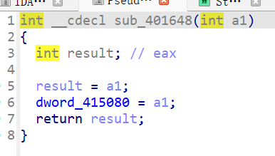

迭代：sub_415080函数

<!-- 这是一张图片，ocr 内容为： -->
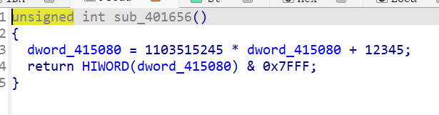

我们动态调试去拿dword_415080的初始值

<!-- 这是一张图片，ocr 内容为： -->
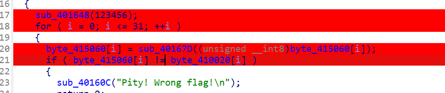

我通过输入一个长度为32的字符串flag{AAAAAAAAAAAAAAAAAAAAAAAAAA}

dword_415080的初始值

<!-- 这是一张图片，ocr 内容为： -->
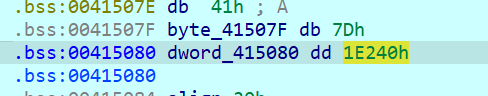

有了初始值，我们就可以按照sub_41656的逻辑计算每次异或的dword_415080

比对的密文值byte_410020

```python
data:00410020 byte_410020 db 5Bh, 50h, 0A1h, 25h, 84h, 8Eh, 61h, 0C4h, 6Bh, 0BBh, 0AEh, 5, 0Bh, 0C6h
.data:00410020                                         ; DATA XREF: sub_401697+E8↑o
.data:0041002E db 3Dh, 42h, 5Ah, 0FBh, 0C1h, 0C9h, 4Eh, 0E9h, 8Dh, 50h, 91h, 87h, 87h
.data:0041003B db 24h, 0ADh, 0AFh, 0D5h, 36h
```

解题脚本

```python
def recover_flag():
    arr = [
        0x5B, 0x50, 0xA1, 0x25, 0x84, 0x8E, 0x61, 0xC4,
        0x6B, 0xBB, 0xAE, 0x05, 0x0B, 0xC6, 0x3D, 0x42,
        0x5A, 0xFB, 0xC1, 0xC9, 0x4E, 0xE9, 0x8D, 0x50,
        0x91, 0x87, 0x87, 0x24, 0xAD, 0xAF, 0xD5, 0x36,
    ]
    state = 123456
    out = []
    for b in arr:
        state = (1103515245 * state + 12345) & 0xFFFFFFFF
        key = ((state >> 16) & 0xFF)
        out.append(b ^ key)
    return ''.join(map(chr, out))

if __name__ == "__main__":
    print(recover_flag())
```

flag{Y0u_Kn0w_H0w_t0_D3bug!!!!!}


