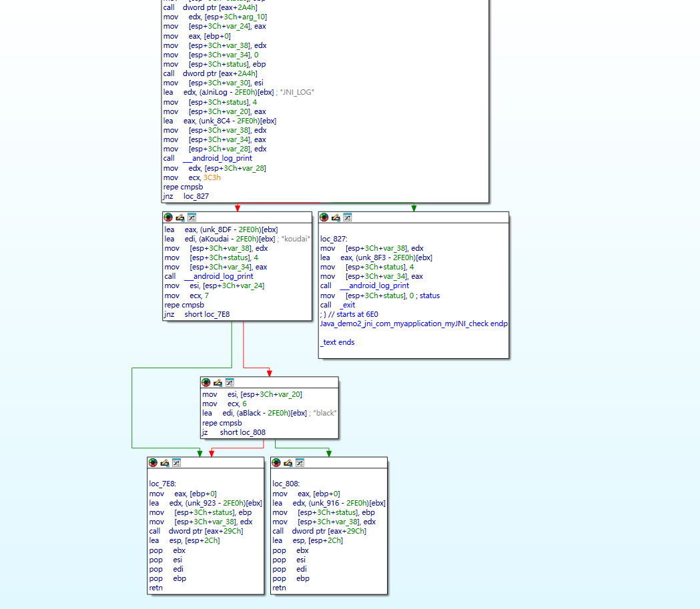
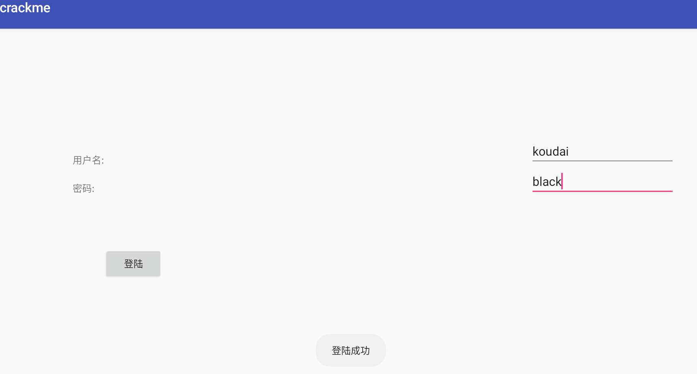
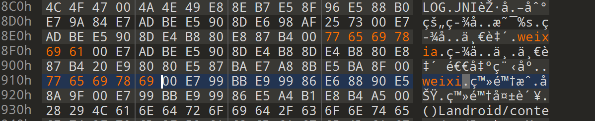
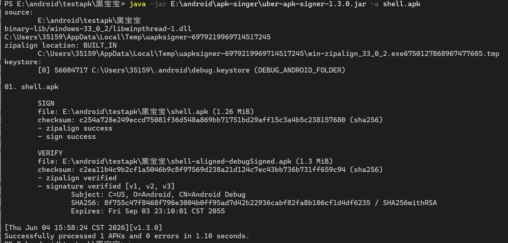
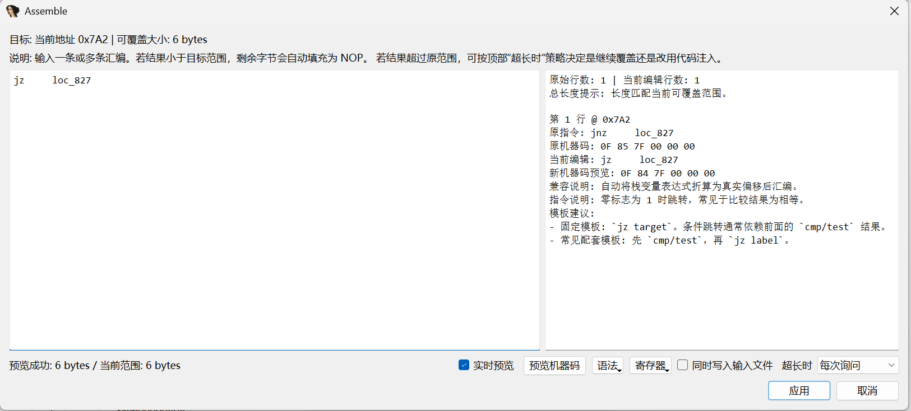
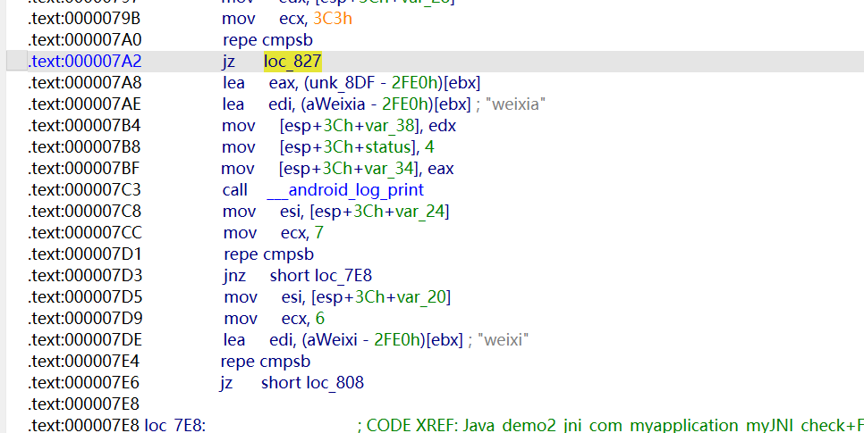
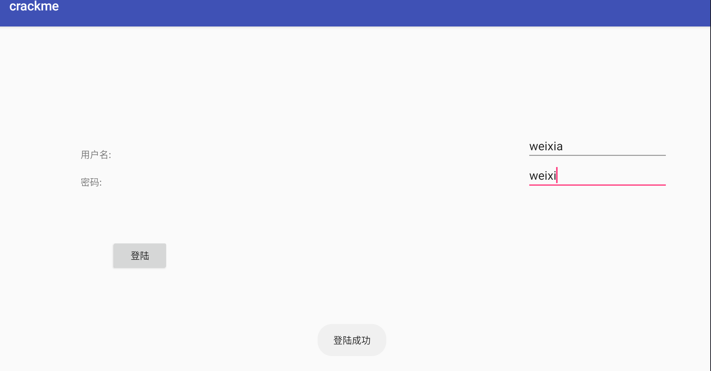

起初遇到的时候是修改过smail文件，原apk的签名就失效了，导致apk的功能异常，当时只想着草草的用自己的签名签上安装，实际这种patch修改并不能实现自己所要的结果。在跟长沙榆纳科技有限公司的面试中，被问到了，没有回答上来，这里我特意来学习一下。

# 第一种情况系统安装层面的签名

这种没法绕过，修改APK后必须重新签名，只是包名相同的情况下不能覆盖原应用，除非卸载原应用或使用相同签名证书。


# 第二种情况APP自身运行时的签名校验

Java 层绕过签名校验的底层原理，本质不是“绕过 Android 系统签名机制”，而是绕过 App 自己写的运行时自校验逻辑。

比如通过 `PackageManager.getPackageInfo()` 获取 `signatures` 或 `SigningInfo`，然后比对 hash、MD5、SHA1、证书公钥等。这种情况可以通过静态分析找到校验点，在 smali 里 patch 掉判断逻辑，比如让校验函数固定返回 true，或者修改比较值。

## Java 层签名校验的底层流程

典型逻辑是：

```powershell
Context
  ↓
PackageManager
  ↓
getPackageInfo(packageName, flag)
  ↓
PackageInfo
  ↓
Signature / SigningInfo
  ↓
证书字节
  ↓
MD5 / SHA1 / SHA256
  ↓
和内置合法值比较
  ↓
返回 true / false
```

## 旧版本常见写法：

```java
PackageInfo info = context.getPackageManager()
        .getPackageInfo(context.getPackageName(), PackageManager.GET_SIGNATURES);

Signature[] signs = info.signatures;
byte[] cert = signs[0].toByteArray();

String sha1 = sha1(cert);

return sha1.equals("官方签名SHA1");
```

但是 `GET_SIGNATURES` 已经废弃，Android 9/API 28 之后推荐使用 `GET_SIGNING_CERTIFICATES` 和 `SigningInfo`。官方 API 变更里明确把 `GET_SIGNATURES` 标记为 deprecated，并加入了 `GET_SIGNING_CERTIFICATES`。

https://developer.android.com/sdk/api_diff/28/changes/android.content.pm.PackageManager?utm_source=chatgpt.com

## 新版本常见写法：

```java
PackageInfo info = context.getPackageManager()
        .getPackageInfo(context.getPackageName(), PackageManager.GET_SIGNING_CERTIFICATES);

SigningInfo signingInfo = info.signingInfo;

Signature[] signs = signingInfo.getApkContentsSigners();
```

或者：

```java
Signature[] signs = signingInfo.getSigningCertificateHistory();
```

## 为什么 Java 层校验可以被绕？

因为 App 自校验最终一定会变成一个普通程序逻辑：

```text
签名是否正确？
    是 → 正常运行
    否 → 退出 / 弹窗 / 限制功能 / 请求失败
```

也就是说，无论它中间怎么计算，最后一定会落到这些形式之一：

```java
if (!checkSign()) {
    exit();
}
```

或者：

```java
boolean ok = checkSign();
```

或者：

```java
return sha1.equals(OFFICIAL_SHA1);
```

所以绕过点通常有三类：

```text
1. 改数据：让计算出的 hash 变成它想要的值
2. 改比较：让 equals/compare 永远成立
3. 改结果：让 checkSign 永远返回 true
```

## Java 层常见校验代码模型

### 模型一：直接比较 hash

```java
public static boolean checkSign(Context context) {
    String sha1 = getAppSignatureSha1(context);
    return "AA:BB:CC:DD:EE".equals(sha1);
}
```

底层逻辑：

```text
证书 → byte[] → MessageDigest → hex字符串 → equals比较
```

绕过原理：

```text
不需要真的伪造官方签名
只需要让 equals 结果为 true
或者让 checkSign 返回 true
```

---

### 模型二：失败后退出

```java
if (!SignUtil.checkSign(this)) {
    finish();
    System.exit(0);
}
```

底层逻辑：

```text
checkSign 返回 false
↓
进入失败分支
↓
finish / killProcess / System.exit
```

绕过原理：

```text
让 if 条件不成立
或者让 checkSign 返回 true
```

smali 层就是控制寄存器里的 boolean。

Java 里的：

```text
boolean ok = checkSign();
```

smali 大概会变成：

```text
invoke-static {p0}, Lcom/test/SignUtil;->checkSign(Landroid/content/Context;)Z
move-result v0
if-nez v0, :cond_success
```

这里 `v0` 就是校验结果。

```text
v0 = 0 → false
v0 = 1 → true
```

所以 Java 层绕过的本质就是：

```text
控制 v0 的值
或者控制 if-nez / if-eqz 的跳转方向
```

---

### 模型三：异常型校验

有些代码不是返回 false，而是抛异常：

```java
if (!checkSign(context)) {
    throw new RuntimeException("bad signature");
}
```

或者：

```java
try {
    verifySign(context);
} catch (Exception e) {
    System.exit(0);
}
```

这种本质还是一样：

```text
签名异常
↓
进入 catch
↓
退出
```

绕过点：

```text
不让 verifySign 抛异常
或者让 catch 分支不执行退出逻辑
```

## Java 层签名校验常见 API

```text
getPackageManager()
getPackageInfo()
GET_SIGNATURES
GET_SIGNING_CERTIFICATES
PackageInfo.signatures
PackageInfo.signingInfo
SigningInfo.getApkContentsSigners()
SigningInfo.getSigningCertificateHistory()
MessageDigest.getInstance("MD5")
MessageDigest.getInstance("SHA1")
MessageDigest.getInstance("SHA-256")
```

其中：

```text
Android 8 及以前：GET_SIGNATURES + signatures 常见
Android 9 以后：GET_SIGNING_CERTIFICATES + SigningInfo 常见
```

## 其他两种思路

### PMS代理

PMS 代理是骗系统 API，不改校验函数，伪造 PackageManager 返回的签名，他改的是 PackageManager 返回值

适合App 通过 getPackageInfo 查签名

### IO重定向

IO 重定向是骗文件读取，不改校验函数，伪造它读取 APK 文件时看到的内容，他改的是改文件读取来源

适合App 直接读 APK / META-INF / dex hash


## 总结

Java 层绕过签名校验的核心不是绕系统签名，而是绕 App 自己的运行时完整性校验。系统签名在安装阶段完成，APK 修改后必须重新签名才能安装；但 App 启动后可能会通过 PackageManager 获取自身 PackageInfo，旧版本用 GET_SIGNATURES 和 signatures，新版本用 GET_SIGNING_CERTIFICATES 和 SigningInfo。然后把证书转成 byte 数组，用 MessageDigest 算 MD5、SHA1 或 SHA256，再和内置的官方证书摘要比较。

绕过时我会先定位这个校验结果在哪里被使用，比如 checkSign 返回 boolean、equals 比较结果、或者失败后调用 System.exit、finish、killProcess。smali 层最终就是 move-result 后的寄存器值和 if-eqz/if-nez 条件跳转。所以可以从三个层面处理：让校验函数固定返回 true，修改调用处条件跳转，或者把内置签名 hash 替换成重签名后的 hash。

所以本质上不是伪造官方签名，因为私钥拿不到，而是重签名安装后，绕过 App 自己对证书 hash 的校验逻辑。


# 第三种情况native层校验

比如 so 里读取 APK、证书、classes.dex hash，或者通过 JNI 调 Java API 获取签名。这种就需要用 IDA/Ghidra 分析 native 校验逻辑，找到关键分支、字符串、hash 比较函数，patch 条件跳转，或者 hook 返回值。

下面用一个简单的native层的签名明文值校验来说明

```c++
int __cdecl Java_demo2_jni_com_myapplication_myJNI_check(int a1, int a2, int a3, int a4, int a5)
{
  int Signature; // eax
  const char *v7; // esi
  int v9; // [esp+Ch] [ebp-30h]
  const char *v10; // [esp+18h] [ebp-24h]
  const char *v11; // [esp+1Ch] [ebp-20h]

  Signature = getSignature(a1, a2, a3);
  v7 = (const char *)(*(int (__cdecl **)(int, int, _DWORD))(*(_DWORD *)a1 + 676))(a1, Signature, 0);
  v10 = (const char *)(*(int (__cdecl **)(int, int, _DWORD))(*(_DWORD *)a1 + 676))(a1, a4, 0);
  v11 = (const char *)(*(int (__cdecl **)(int, int, _DWORD))(*(_DWORD *)a1 + 676))(a1, a5, 0);
  __android_log_print(4, "JNI_LOG", &unk_8C4, v7);
  if ( strcmp(
         v7,
         "308201dd30820146020101300d06092a864886f70d010105050030373116301406035504030c0d416e64726f69642044656275673110300"
         "e060355040a0c07416e64726f6964310b3009060355040613025553301e170d3138303332313033303431385a170d343830333133303330"
         "3431385a30373116301406035504030c0d416e64726f69642044656275673110300e060355040a0c07416e64726f6964310b30090603550"
         "4061302555330819f300d06092a864886f70d010101050003818d00308189028181008270f53e2cf8c7d7ed200863deb85a054defde773b"
         "e0b848ee792839d9a81da098dd9b74bbb9679c19ea30b63fe3bb74aabb270a5c9b3359ebe3fdf278b82fe576a6677f0d77f0eb5b088d071"
         "1b15d03cadae08b3b980f28055d0cde4bbc4a0b4b208b0f30f170b6ea77a8620269fa1d375442653663e1dd41293aa1c4910e3502030100"
         "01300d06092a864886f70d010105050003818100044b9ab7e85346a147926c2d1c6c30e8ffcce174f88acb9763cb776fb1f4dd62183c952"
         "4346738ff1aea16c5fa218c68da76d05a2422aee12fc23563b5e28925c3d96dff855a584fc1ec462aa768277bd25739085d52fe3fedfd39"
         "6e38180c13fbb289786e524535933dd8a99ed3154880544f3e41f044acc43ceefbbce3af59") )
  {
    __android_log_print(4, "JNI_LOG", &unk_8F3, v9);
    exit(0);
  }
  __android_log_print(4, "JNI_LOG", &unk_8DF, v9);
  if ( !strcmp(v10, "koudai") && !strcmp(v11, "black") )
    return (*(int (__cdecl **)(int, void *))(*(_DWORD *)a1 + 668))(a1, &unk_916);
  else
    return (*(int (__cdecl **)(int, void *))(*(_DWORD *)a1 + 668))(a1, &unk_923);
}    
```

拿apk的签名与native明文存储的签名值比对，相等则继续运行，不相等则跳转到退出函数



所以想绕过这个的签名校验就把跳转判断条件换成jz，这样我们修改过的自己重新打包的apk依旧能过签名校验（当然这是一个非常简单的native层的绕过签名校验）

没改之前用原来的用户名和密码登录



然后我修改一下，我把用户名和密码都改了，重新签名打包



直接用uber-apk-signer-1.3.0.jar内置的调试密钥打包我的apk



这个时候登录用真确的用户名和密码就会闪退出去，签名校验发力了

解包我们这个修改签名过的apk，把条件判断修改为jz





之后再重命名打包安装apk



这次就成功修改apk也绕过签名校验了。

具体参考：https://www.52pojie.cn/thread-732955-1-1.html

# 第四种情况服务端校验

这种情况目前还没有实践过，后续能力提升再补充，这里先理论说明一下。

比如客户端把签名 hash、包完整性信息、设备环境传给服务端。这种单纯 patch 本地逻辑不一定够，还要分析请求参数，必要时 hook 参数生成逻辑，或者在测试环境中模拟合法返回。

**真正做得好的服务端签名校验，本地 patch 是绕不过的；能被“绕过”的，通常不是服务端校验本身，而是客户端上报、协议设计、信任边界或校验结果处理存在问题。**

也就是说，服务端校验比 Java 层、Native 层难很多，因为校验逻辑不在你本地。

## 服务端签名校验则是：

```text
App 启动 / 登录 / 请求接口
↓
客户端把某些环境信息上传给服务端
↓
服务端判断这个客户端是不是官方客户端
↓
服务端决定是否下发 token、功能开关、业务数据
```

下面列举一些错误的弱的设计

## 一、服务端信任了客户端上报的签名 hash

这是最典型的弱设计。

客户端这样做：

```text
读取当前 APK 签名
↓
算 SHA256
↓
上传给服务端
```

服务端这样判断：

```text
客户端说自己是官方签名
↓
服务端相信它
```

问题在于：

```text
客户端是攻击者可控的
```

你 patch 过 APK 之后，客户端代码、参数生成逻辑、网络请求内容都可能被改。

所以如果服务端只是相信客户端传来的：

```text
cert_sha256 = 官方 hash
```

那这个校验其实不可靠。


## 二、签名 hash 参与请求 sign，但算法在客户端

有些 App 不会直接传：

```text
cert_sha256
```

而是把签名 hash 混进请求签名算法里。

例如逻辑是：

```text
sign = hash(uid + timestamp + deviceId + appSignHash + secret)
```

服务端收到请求后，也算一遍：

```text
server_sign = hash(uid + timestamp + deviceId + officialSignHash + secret)
```

如果一致，就通过。

这比单纯上传 hash 强一些。

但问题是：

```text
如果 secret、算法、参数拼接方式都在客户端
逆向后仍可能被分析出来
```

所以这种方案的强度取决于：

```text
算法是否暴露
secret 是否在客户端
是否有 nonce / timestamp 防重放
是否绑定登录态和设备态
是否有动态下发密钥
```


## 三、服务端只在登录或启动阶段校验一次

还有一种常见问题：

```text
启动时校验一次
登录时校验一次
后续业务接口不再校验
```

那么攻击面就变成：

```text
只要拿到一个有效 token
后续接口可能继续可用
```

这属于状态管理问题。

比如：

```text
官方客户端登录成功
↓
拿到 access_token
↓
patch 客户端复用 token
↓
服务端业务接口只认 token，不再关心客户端完整性
```

如果 token 没有绑定：

```text
设备
App 签名
环境状态
时间窗口
请求上下文
```

那么完整性校验就容易变成“一次性门禁”。

## 四、服务端校验结果被客户端控制

有些 App 会请求：

```text
/api/checkClient
```

服务端返回：

```text
{
  "valid": false,
  "message": "非法客户端"
}
```

然后客户端自己判断：

```text
if (!result.valid) {
    exit();
}
```

这种很弱。

因为服务端只是返回一个结果，**最终是否退出还是客户端决定**。

也就是说：

```text
服务端：你不合法
客户端：我假装没听见
```

如果业务接口没有真正拦截，只是让客户端弹窗退出，那还是可以被本地 patch 掉。

## 总结

服务端签名校验和本地签名校验最大的区别是信任边界。本地 Java 层校验最终只是一个 boolean 或条件分支，可以通过 smali patch 或 hook 改掉；但服务端校验的裁决权在服务端，本地修改不能直接改变服务端判断。

所谓服务端签名绕过，很多时候不是绕过服务端本身，而是看服务端是不是错误信任了客户端上报的数据。比如客户端读取自己的签名 hash 上传，如果服务端直接相信这个 hash，那攻击者可以修改上报逻辑，让客户端上传官方 hash。还有一种情况是服务端只返回 valid 字段，客户端自己决定退出，这种仍然可以 patch 客户端处理逻辑。

但如果服务端在关键接口真正校验签名状态、请求 sign、nonce、session、设备完整性证明，并且校验失败就不下发业务数据，那么单纯 smali patch 是绕不过的。这个时候只能从协议设计、参数生成、token 绑定、风控链路这些角度分析是否存在缺陷。


