# 腾讯游戏安全大赛\-安卓端

第一次见到apk里面的的Godot壳，记录一下

先对apk进行分析，实际上在jadx中看不到游戏逻辑，java层基本没有赛题逻辑，主要是启动Godot

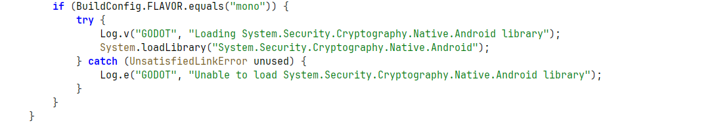

我们在buildconfig里面可以看到so加载的位置有一个是org\.godotengine\.godot

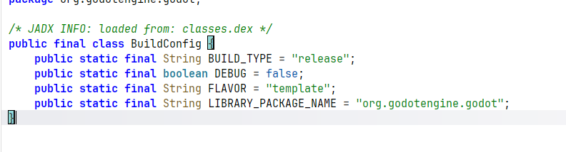

跳转过去，加载的so文件名是libgodot\_android\.so，但实际解包的so文件并不是这个

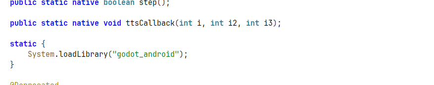

问AI，ai的回复是

libsec2026\.so 更像是 Godot GDExtension 插件形式

```text
Java: System.loadLibrary("godot_android")
        ↓
Godot native engine 初始化
        ↓
Godot 读取项目资源 / GDExtension 配置
        ↓
native 层 dlopen/load libsec2026.so
        ↓
调用 extension_init 注册扩展
        ↓
后续脚本或引擎调用 VMEntry / 注册方法
```

解包后的assets，里面有游戏的主要逻辑脚本，但是都被加密了

我们接下里只能去so层分析，找到加密逻辑

```text
Java 层 System.loadLibrary("godot_android")
        ↓
libgodot_android.so 启动 Godot
        ↓
Godot 读 extension_list.cfg
        ↓
Godot 用内置解密逻辑/key 解密 sec2026.gdextension
        ↓
解析 gdextension
        ↓
再加载 libsec2026.so
```

分析libgodot\_android\.so加载解析逻辑

首先来说一下，这个so不是题目的核心校验so，他更像Godot在安卓里运行的“总管”，负责把Godot引擎在Android上跑起来、把项目资源定位到、把加密资源解开、把脚本和扩展加载进去，最后把控制权交给游戏逻辑。

sub\_3CD373C是项目装载前的准备工作

- 统一路径分隔符

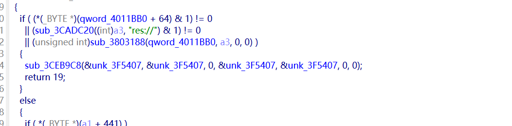

- 看有没有 res://project\.godot

- 看有没有 res://project\.binary

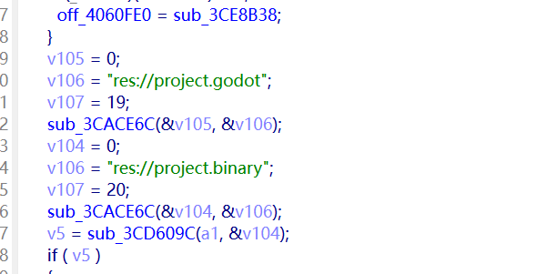

所以它本质上是在回答：

“我要从哪个目录/哪个包，把 Godot 项目资源读出来？”

当某个资源真正被打开时，才进入“加密资源链”

这时就轮到 PackedSourcePCK 那一支了，函数在sub\_3805698

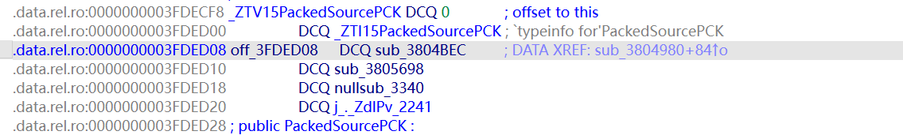

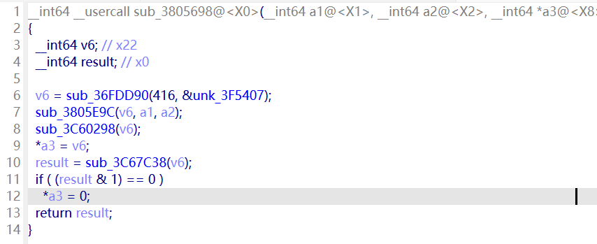

再跳到sub\_3805E9C，是包装层，准备 key 和参数

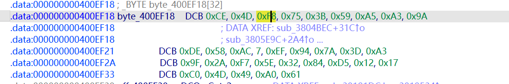

真正的加密核心在这里

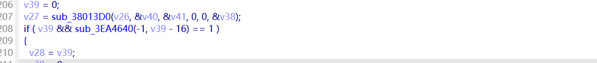

它做的事是：

- 读取文件头

- 取前 16 字节 MD5

- 取 8 字节明文长度

- 取 16 字节 IV

- 剩下的是密文

- 用 32 字节 key 做 AES\-256\-CFB128

- 解出来之后再校验 MD5

到这里我其实认为文件已近完全解密了，但实际上不是，我尝试了最新版本的反编译工具，反编译出来的gd文件只有函数类型，函数内容全是乱码，所以 \.gdc 文件解密后虽然格式正确，但里面的 token ID 是题目自定义版。普通工具按原版编号解释，就会把 extends / func / if / return 之类解释错，于是出现：

`var not
``not != &&`

这种乱码源码。

经过与agent对话，发现除了一套魔改的AES\-256\-CFB128加密外，还有一套魔改的token enum，这才导致我之前看不到游戏源码。

下面来讲解一下token enum这套逻辑

字符串搜索GDScriptTokenizerBuffer

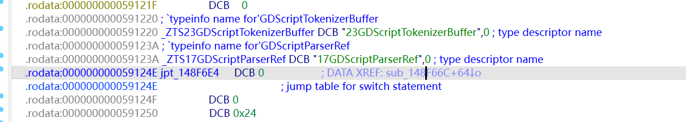

看sub\_148F66c函数

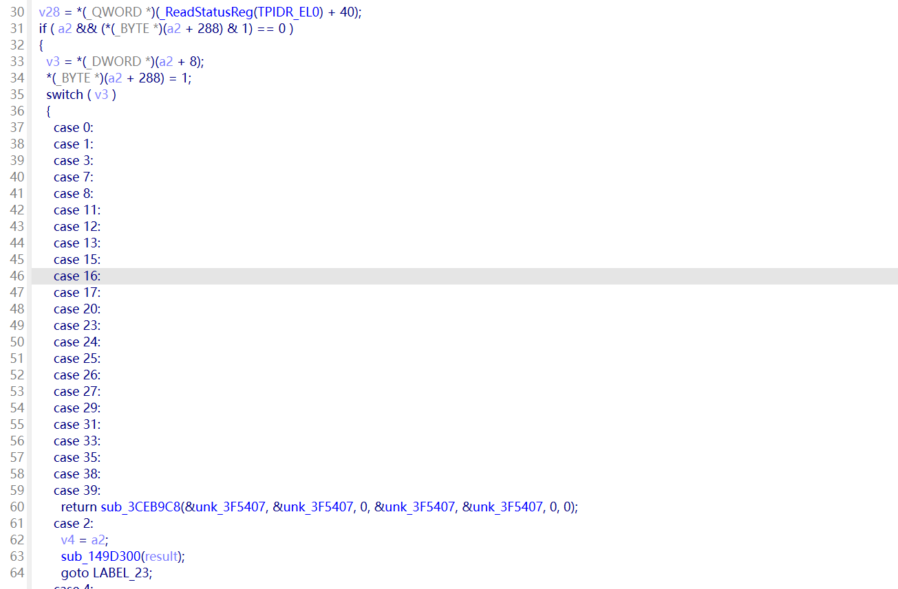

核心逻辑是读取 \.gdc 里的 token ID，然后按题目自己的表解释。

最后整理出来的映射大概是：

```text
题目 token ID        真实 Godot token
------------------------------------
0                   EMPTY
1                   NEWLINE
2                   INDENT
3                   DEDENT
4..7                PI / TAU / INF / NAN

11                  ANNOTATION
12                  IDENTIFIER
13                  LITERAL

14..49              原版 token 4..39
51..83              原版 token 40..72
84..98              原版 token 73..87

99                  EOF
```

换成更好理解的公式：

```text
题目 14..49  -> 原版 = 题目ID - 10
题目 51..98  -> 原版 = 题目ID - 11
```

特殊值单独处理：

```text
11 -> 1
12 -> 2
13 -> 3
99 -> EOF
```

而普通 GDRE Tools 不知道这件事，它看到 81 会按官方表理解，自然就反编译错。

修复编号

```python
from __future__ import annotations

import argparse
import shutil
import struct
from pathlib import Path

import zstandard as zstd

TOKEN_BYTE_MASK = 0x80
TOKEN_MASK = 0x7F

def custom_to_stock_token(token: int) -> int:
    """Map this challenge's modified GDScript token ids back to Godot 4.5 ids."""
    if token == 0:
        return 0  # EMPTY
    if token == 1:
        return 88  # NEWLINE
    if token == 2:
        return 89  # INDENT
    if token == 3:
        return 90  # DEDENT
    if 4 <= token <= 7:
        return token + 87  # PI, TAU, INF, NAN
    if token == 11:
        return 1  # ANNOTATION
    if token == 12:
        return 2  # IDENTIFIER
    if token == 13:
        return 3  # LITERAL
    if 14 <= token <= 49:
        return token - 10  # operators
    if token == 50:
        return 98  # ERROR
    if 51 <= token <= 83:
        return token - 11  # keywords
    if 84 <= token <= 98:
        return token - 11  # punctuation
    if token == 99:
        return 99  # EOF
    return token

def u32(raw: bytes | bytearray, off: int) -> int:
    return struct.unpack_from("<I", raw, off)[0]

def skip_string(raw: bytes | bytearray, off: int) -> int:
    length = u32(raw, off)
    return off + 4 + length * 4

def skip_padded_utf8(raw: bytes | bytearray, off: int, length: int) -> int:
    return off + ((length + 3) & ~3)

def skip_variant(raw: bytes | bytearray, off: int) -> int:
    typ = u32(raw, off)
    off += 4
    base = typ & 0xFFFF
    is64 = bool(typ & 0x10000)
    if base in (0,):
        return off
    if base in (1,):
        return off + 4
    if base in (2, 3):
        return off + (8 if is64 else 4)
    if base in (4, 21, 22):
        length = u32(raw, off)
        off += 4
        return skip_padded_utf8(raw, off, length)
    raise ValueError(f"unsupported Variant type 0x{typ:x} at 0x{off - 4:x}")

def parse_token_stream(raw: bytes | bytearray, off: int, token_count: int) -> int | None:
    cur = off
    for _ in range(token_count):
        if cur >= len(raw):
            return None
        token = raw[cur] & TOKEN_MASK
        if token > 99:
            return None
        if raw[cur] & TOKEN_BYTE_MASK:
            if cur + 8 > len(raw):
                return None
            cur += 8
        else:
            if cur + 5 > len(raw):
                return None
            cur += 5
    return cur if cur == len(raw) else None

def find_token_stream(raw: bytes | bytearray, min_off: int, token_line_count: int, token_count: int) -> int:
    maps_size = token_line_count * 16
    # Prefer aligned candidates because the constants and line/column maps are u32-based.
    for maps_off in range((min_off + 3) & ~3, len(raw) - maps_size + 1, 4):
        token_off = maps_off + maps_size
        if parse_token_stream(raw, token_off, token_count) is not None:
            return token_off
    # Fallback for malformed alignment guesses.
    for maps_off in range(min_off, len(raw) - maps_size + 1):
        token_off = maps_off + maps_size
        if parse_token_stream(raw, token_off, token_count) is not None:
            return token_off
    raise ValueError("could not locate token stream")

def patch_gdc(data: bytes) -> tuple[bytes, int]:
    if data[:4] != b"GDSC":
        raise ValueError("not a GDSC file")
    if len(data) < 12:
        raise ValueError("truncated GDSC file")

    version = data[4:8]
    declared_raw_len = u32(data, 8)
    raw = bytearray(zstd.ZstdDecompressor().decompress(data[12:]))
    if declared_raw_len != len(raw):
        raise ValueError(f"raw length mismatch: header={declared_raw_len} actual={len(raw)}")

    identifier_count = u32(raw, 0)
    constant_count = u32(raw, 4)
    token_line_count = u32(raw, 8)
    token_count = u32(raw, 12)

    off = 16
    for _ in range(identifier_count):
        off = skip_string(raw, off)

    constants_off = off
    try:
        for _ in range(constant_count):
            off = skip_variant(raw, off)
        token_off = off + token_line_count * 16
        if parse_token_stream(raw, token_off, token_count) is None:
            raise ValueError("parsed constants did not lead to a valid token stream")
    except Exception:
        token_off = find_token_stream(raw, constants_off, token_line_count, token_count)

    patched = 0
    off = token_off
    for _ in range(token_count):
        token_off = off
        if raw[off] & TOKEN_BYTE_MASK:
            encoded = u32(raw, off)
            old = encoded & TOKEN_MASK
            new = custom_to_stock_token(old)
            struct.pack_into("<I", raw, off, (encoded & ~TOKEN_MASK) | new)
            off += 8
        else:
            old = raw[off] & TOKEN_MASK
            new = custom_to_stock_token(old)
            raw[off] = (raw[off] & ~TOKEN_MASK) | new
            off += 5
        if old != new:
            patched += 1

    if off != len(raw):
        raise ValueError(f"trailing bytes after token stream: {len(raw) - off}")

    compressed = zstd.ZstdCompressor(level=19).compress(bytes(raw))
    return b"GDSC" + version + struct.pack("<I", len(raw)) + compressed, patched

def main() -> int:
    parser = argparse.ArgumentParser(description="Patch modified Godot 4.5 GDScript token ids back to stock ids.")
    parser.add_argument("src", type=Path, help="source file or directory")
    parser.add_argument("dst", type=Path, help="output file or directory")
    args = parser.parse_args()

    src = args.src.resolve()
    dst = args.dst.resolve()
    if src.is_file():
        dst.parent.mkdir(parents=True, exist_ok=True)
        out, count = patch_gdc(src.read_bytes())
        dst.write_bytes(out)
        print(f"[patch] {src.name}: tokens={count}")
        return 0

    for path in src.rglob("*"):
        if not path.is_file():
            continue
        rel = path.relative_to(src)
        out_path = dst / rel
        out_path.parent.mkdir(parents=True, exist_ok=True)
        if path.suffix.lower() == ".gdc":
            try:
                out, count = patch_gdc(path.read_bytes())
            except Exception as exc:
                shutil.copy2(path, out_path)
                print(f"[skip] {rel}: {exc}")
            else:
                out_path.write_bytes(out)
                print(f"[patch] {rel}: tokens={count}")
        else:
            shutil.copy2(path, out_path)
    return 0

if __name__ == "__main__":
    raise SystemExit(main())

```

这个时候gdc可以正常反编译为gd文件了

token\.gd，是token的生成逻辑，长度恒定为8chars

```typescript
extends Label

var _r8: = RandomNumberGenerator.new()
var _sc0 = 0
var _hx: = "0123456789" + "abcdef"
var _tl: = 4 * 2

func _mk(n: int) -> String:
    var _buf: = ""
    var _mx: = _hx.length() - 1
    var _j: = 0
    while _j < n:
        var _p: = _r8.randi_range(0, _mx)
        _buf += _hx[_p]
        _j += 1
    return _buf

func _ready() -> void :
    _r8.randomize()
    var _pfx: = "Token: "
    var _val: = _mk(_tl)
    text = _pfx + _val
    var _out: = text
    print(_out)
```

trigger1\.gd的逻辑就是示例flag的生成逻辑

```go
extends Area3D

signal collided_with(name)
var _f0: = false
var _f1: = false
var _tv: = 0.0
var _ix: = 0
var _gx

func _m3():
    if $MeshInstance3D == null:
        return
    $MeshInstance3D.rotation.y += _rv * 1.0
    var _yp = sin(_tv) * 0.2
    $MeshInstance3D.position.y = _yp
    var _sc = 1.0 + sin(_tv * 3.0) * 0.1
    $MeshInstance3D.scale = Vector3(_sc, _sc, _sc)

var _rv: = 0.0

func _kc():
    var _bp: = get_overlapping_bodies()
    if _bp.size() < 1:
        return
    var _np: = str(get_path())
    var _t1: = "/root/" + "TownScene" + "/Trigger1"
    if _np != _t1:
        return
    var _lb: = get_node(NodePath("/root/TownScene/Label2"))
    var _px: = "flag{"
    var _sx: = "sec2026" + "_PART0_" + "example" + "}"
    _lb.text = _px + _sx

func _ready():
    connect("body_entered", Callable(self, "_on_body_entered"))
    _gx = GameExtension.new()

func _on_body_entered(_b):
    pass

func _process(_d):
    _gx.Tick()
    _rv = _d
    _tv += _d * 2.0
    _m3()
    _kc()

```

trigger2\.gd的源码，也就是part1的生成逻辑

```java
extends Area3D

signal collided_with(name)
var _gx = GameExtension.new()
var _tv: = 0.0
var _ix: = 0

func _h2b(_s: String) -> PackedByteArray:
    var _r: = PackedByteArray()
    var _n: = _s.length()
    var _j: = 0
    while _j < _n:
        _r.append(_s.substr(_j, 2).hex_to_int())
        _j += 2
    return _r

func _b2h(_ba: PackedByteArray) -> String:
    var _r: = ""
    for _v in _ba:
        _r += "%02x" % _v
    return _r

func _xb(_a: PackedByteArray, _b: PackedByteArray) -> PackedByteArray:
    var _r: = PackedByteArray()
    var _n: = _a.size()
    var _j: = 0
    while _j < _n:
        _r.append(_a[_j] ^ _b[_j])
        _j += 1
    return _r

func _rf(_bl: PackedByteArray, _ky: PackedByteArray, _rn: int) -> PackedByteArray:
    var _r: = PackedByteArray()
    var _ks: = _ky.size()
    for _j in _bl.size():
        var _v: = _bl[_j] ^ _ky[(_j + _rn) % _ks]
        _v = (_v * 7 + _rn) & 255
        _v = ((_v << 3) | (_v >> 5)) & 255
        _r.append(_v)
    return _r

func _fe(_th: String) -> String:
    var _da: = _h2b(_th)
    assert (_da.size() == (2 << 1))
    var _hl: = 2
    var _lo: = _da.slice(0, _hl)
    var _hi: = _da.slice(_hl, _hl * 2)
    var _kp: = ("Sec" + "2026" + "_God" + "ot").to_utf8_buffer()
    var _rn: = 0
    while _rn < (4 * 2):
        var _fv: = _rf(_hi, _kp, _rn)
        var _nr: = _xb(_lo, _fv)
        _lo = _hi
        _hi = _nr
        _rn += 1
    var _ot: = PackedByteArray()
    _ot.append_array(_lo)
    _ot.append_array(_hi)
    return "sec" + "2026" + "_PART" + "1_" + _b2h(_ot)

func _ready() -> void :
    body_entered.connect(_w7)

func _w7(_ar):
    var _lb: = get_node(NodePath("/root/TownScene/" + "Label2"))
    var _lt: = get_node(NodePath("/root/TownScene/" + "Label"))
    var _tx: = str(_lt.text)
    var _tk: = _tx.substr(3 + 4)
    var _pf: = "flag{"
    var _rs: = _fe(_tk)
    _lb.text = _pf + _rs + "}" + "   "

func _m3(_d: float):
    if $MeshInstance3D == null:
        return
    $MeshInstance3D.rotation.y += _d * 1.0
    var _yp = sin(_tv) * 0.2
    $MeshInstance3D.position.y = _yp
    var _sc = 1.0 + sin(_tv * 3.0) * 0.1
    $MeshInstance3D.scale = Vector3(_sc, _sc, _sc)

func _process(_d: float) -> void :
    _gx.Tick()
    _tv += _d * 2.0
    _m3(_d)

```

1. PART1 — Feistel cipher（trigger2\.gd）

1\.1 GDScript 来源

- 触发器：第 2 个 trigger（车撞进 Trigger2 的 Area3D）

- 完整算法在 GDScript 里实现，不依赖 native

- 显示位置：/root/TownScene/Label2

- 输出格式：flag\{sec2026\_PART1\_\<8 chars hex\>\}

1\.2 输入 / 输出

- 输入：从 Label 文本 Token: XXXXXXXX 截掉前 7 字节 → 拿到 8 字符 hex

- bytes\.fromhex\(token\) → 4 字节

- 拆成 lo \(2B\) \+ hi \(2B\)

- 输出：4 字节 → 8 字符 hex（小写）

1\.3 Feistel 结构

- Key：b"Sec2026\_Godot"（13 字节，循环使用）

- 轮数：8

- Round function（每轮对 hi 做 F\(hi\)，再 lo = hi, hi = old\_lo XOR F\(hi\)）：

```python
for rn in range(8):
    fv = []
    for j in range(2):                          # half-block 长度 = 2
        v = hi[j] ^ key[(j + rn) % 13]          # 1) XOR key
        v = (v * 7 + rn) & 0xFF                 # 2) 仿射混淆
        v = ((v << 3) | (v >> 5)) & 0xFF        # 3) ROL by 3
        fv.append(v)
    nr = [lo[j] ^ fv[j] for j in range(2)]      # 4) 异或回 lo
    lo, hi = hi, nr                             # 5) Feistel 交换
  out = bytes(lo + hi).hex()
```

part2的相关逻辑在（trigger3\.gd \+ libsec2026\.so）

先看源码

```java
extends Area3D

signal collided_with(name)
var _gx = GameExtension.new()
var _tv: = 0.0
var _ix: = 0

var _kd: = PackedByteArray()

func _h2b(_s: String) -> PackedByteArray:
    var _r: = PackedByteArray()
    var _p: = 0
    var _e: = _s.length()
    while _p < _e:
        var _ch: = _s.substr(_p, 2)
        _r.append(_ch.hex_to_int())
        _p += 2
    return _r

func _b2h(_ba: PackedByteArray) -> String:
    var _r: = ""
    var _p: = 0
    while _p < _ba.size():
        _r += "%02x" % _ba[_p]
        _p += 1
    return _r

func _xb(_a: PackedByteArray, _b: PackedByteArray) -> PackedByteArray:
    var _r: = PackedByteArray()
    for _j in _a.size():
        _r.append(_a[_j] ^ _b[_j])
    return _r

func _rf(_bl: PackedByteArray, _ky: PackedByteArray, _rn: int) -> PackedByteArray:
    var _r: = PackedByteArray()
    var _km: = _ky.size()
    var _j: = 0
    while _j < _bl.size():
        var _v: = _bl[_j]
        _v = _v ^ _ky[(_j + _rn) % _km]
        var _t: = (_v * (3 + 4) + _rn)
        _v = _t & 255
        var _sl: = (_v << 3) & 255
        var _sr: = (_v >> 5) & 255
        _v = _sl | _sr
        _r.append(_v)
        _j += 1
    return _r

func _ready() -> void :
    body_entered.connect(_w7)
    var _ks: = "Sec2026"
    var _ke: = "_Godot"
    _kd = (_ks + _ke).to_utf8_buffer()

func _w7(_ar):
    var _lb: = get_node(NodePath("/root/" + "TownScene/Label2"))
    var _lt: = get_node(NodePath("/root/" + "TownScene/Label"))
    var _raw: = str(_lt.text).substr(7)
    var _buf: = _raw.to_utf8_buffer()
    var _pf: = "flag{"
    var _mi: = "sec2026"
    var _su: = "_PART2_"
    var _rv: = _gx.Process(_buf)
    _lb.text = _pf + _mi + _su + _rv + "}" + "  "

func _m3(_d: float):
    if $MeshInstance3D == null:
        return
    $MeshInstance3D.rotation.y += _d * 1.0
    var _yp = sin(_tv) * 0.2
    $MeshInstance3D.position.y = _yp
    var _sc = 1.0 + sin(_tv * (1.5 * 2.0)) * 0.1
    $MeshInstance3D.scale = Vector3(_sc, _sc, _sc)

func _process(_d: float) -> void :
    _gx.Tick()
    _tv += _d * (1.0 * 2.0)
    _m3(_d)

```

- 触发器：第 3 个 trigger（Trigger3）

- GDScript 端只做一件事：把 Token 转 PackedByteArray，丢给 native

var \_buf = \_raw\.to\_utf8\_buffer\(\)              \# 8 字节 ASCII

var \_rv = \_gx\.Process\(\_buf\)                   \# 调 native

\_lb\.text = "flag\{" \+ "sec2026" \+ "\_PART2\_" \+ \_rv \+ "\}"

- 显示位置：/root/TownScene/Label2

- 输出格式：flag\{sec2026\_PART2\_\<32 chars uppercase hex\>\}

IDA打开so文件进行分析，里面的无法反汇编的片段有很多，是控制流平坦化，第一次遇到arm64汇编语言的混淆，这个so里面的cff的风格是OLLVM

结合ai去控制流平坦化的过程总结

```typescript
整体路线

  原始 .so（混淆 + reloc 未填）
     │
     ① 应用 reloc，让派发表指向真实地址
     │
     ② 线性反汇编，得到 raw asm（每条 4 字节都解出来）
     │
     ③ 手工 / 脚本提取 dispatcher：识别 controller 寄存器
     │
     ④ 模拟 controller 状态机：解出 case 编号 → 下一个 case 的映射
     │
     ⑤ 把碎片 case-block 按真实顺序拼回去（虚拟去平坦化）
     │
     ⑥ 模式匹配：识别每段做什么（XOR / S-Box 查表 / GF mul / shiftrows）
     │
     ⑦ Unicorn emu 验证：跑真实输入，对比 Python 实现
```

这一块很杂，先调到part3flag的生成逻辑


未完待续！！


